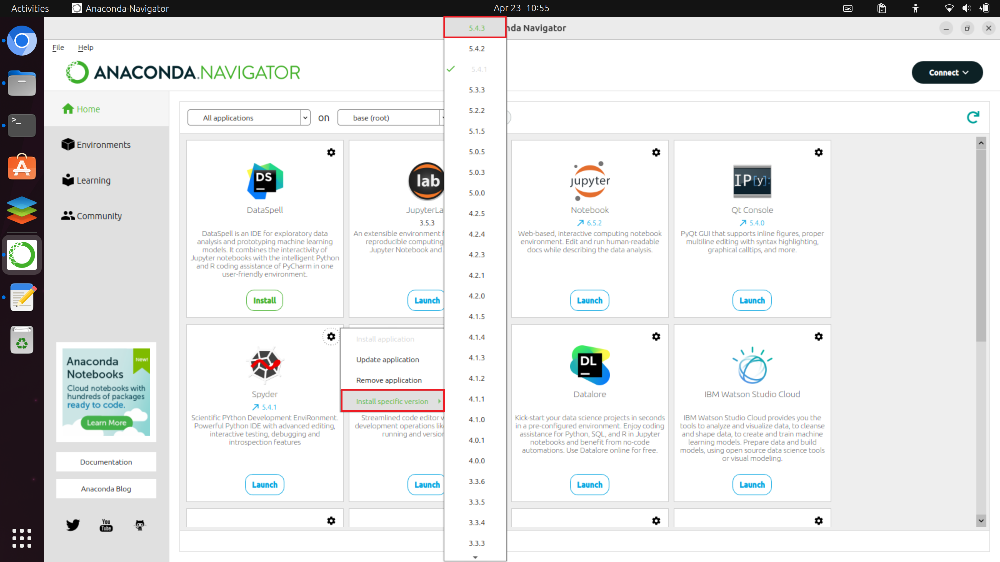
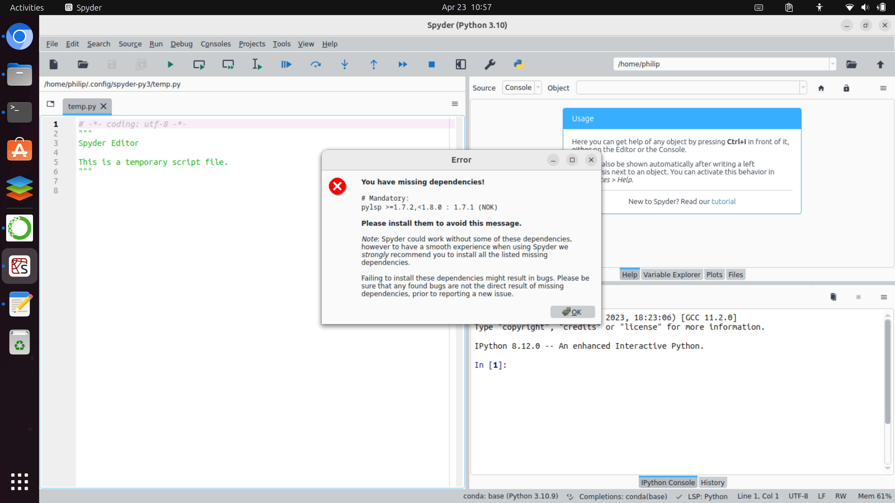
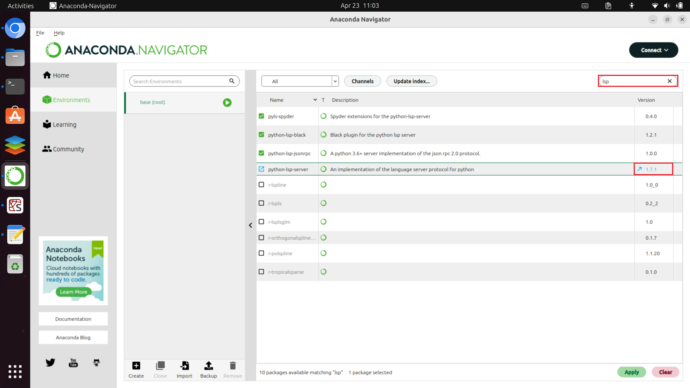
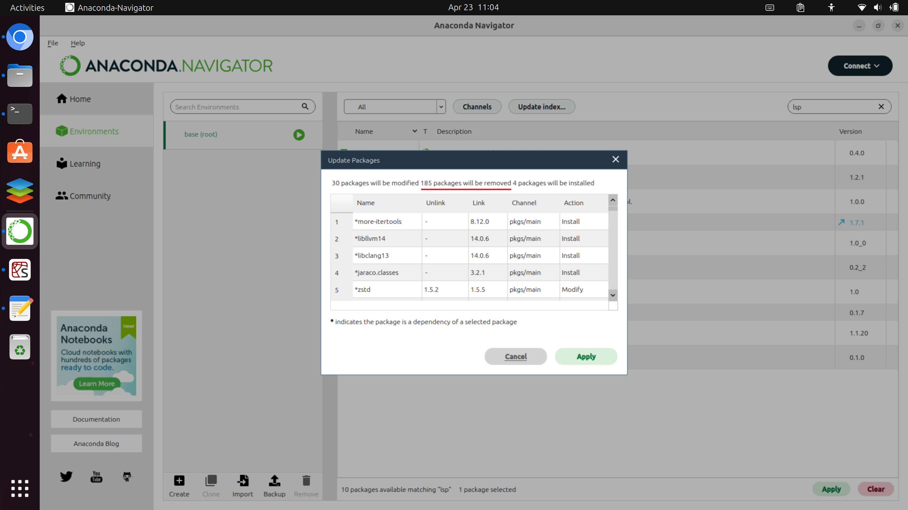

# The Python Ecosystem

## Package Managers and Distributions

The Python ecosystem is pretty vast and a consequence there are a multitude of ways to install and use Python and a multitude of Integrated Development Environments (IDEs) which are programs used to write Python Code and execute Python Code.

Due to this flexibility, the process of installation often appears fragmented and can become very confusing for a beginner.

This guide will mention two different ways to install Python. Both procedures cover Windows and Linux/Mac.

|Installer Name|Package Manager|Python Base Environment|Python Base Environment Channel|Python Version in Base Environment|
|:-:|:-:|:-:|:-:|:-:|
|Python|pip|minimal|pip|3.11|
|Anaconda|conda|data science distribution|conda (older packages)|3.10|
|Mambaforge|mamba|minimal|conda-forge|3.10|

## Anaconda Python Distribution

*Anaconda* is a Python Distribution maintained by the Anaconda company which includes *Python*, the *conda* package manager, commonly used scientific libraries such as *numpy*, *pandas*, *matplotlib* and *seaborn* and scientific integrated development environments such as the *Scientific Python Development Environment* (Spyder) and *JupyterLab*. All the packages are from the *conda* channel which is a channel maintained by Anaconda Inc. Anaconda Inc tend to update the distribution as a standalone installer biannually.

Because the *base* environment has so many packages, it can become difficult to update packages as an updated dependency for an IDE such as Spyder can break the functionality of another package.

Anaconda generally do not recommend updating their distribution and instead waiting until a standalone installer is released.

For example the update from Spyder 5.3.1 to 5.3.3 (which has some fundamental bugfixes):



Installs without a dependency:



When attempting to install the dependency in Anaconda Navigator:



The notice says installing it will modify 30 Packages, **remove 185 packages** and install 4 packages:



The *conda* channel is a source of packages maintained by the Anaconda company.

There is a second *conda-forge* channel which is the community channel.

The community channel *conda-forge* has more recent packages than the Anaconda Inc channel conda as it takes time for the Anaconda company to test packages. The community channel *conda-forge* also has a much larger variety of packages.

If you are wanting the latest version of *Spyder* and *JupyterLab* you are better to install them in a separate Python environment. This can be done with Anaconda but the purpose of installing Anaconda is made redundant if you are only using these other Python environments.

Even in separate Python environments Anaconda by default installs packages from the Anaconda Inc. maintained *conda* channel. Usually the community channel *conda-forge* is preferred as it has newer packages and a larger subset of packages. Python environments with packages from both the *conda* channel and *conda-forge* channel are unstable and normally have dependency conflicts.

## Mambaforge

Although Anaconda can be used to create separate conda environments, *Mambaforge* is often preferred. *Mambaforge* has a minimal *base* environment and includes the *mamba* package manager which is an improved faster and more reliable version of the *conda* package manager. Finally *Mambaforge* also uses the community channel *conda-forge* by default. These defaults alleviate most of the installation issues found in *Anaconda*.

For optimal performance separate Python 3.11 environments will be made for each Python IDE:

* Spyder
* JupyterLab
* Visual Studio Code

There are other variants such as *Miniconda*, *Miniforge* which only have the *conda* package manager and default to the *conda* and *conda-forge* channels respectively.

## Detailed Installation Instructions

A begineer should install Mambaforge using the detailed guides:

[Mambaforge Install on Windows](./001_windows_install/)

[Mambaforge Install on Linux/Mac](./002_linux_install/)

## Brief Installation Instructions

A more experienced user may only want the brief installation commands below:

### Mambaforge

The Mambaforge Installer needs to be downloaded. It can be installed in Windows using the application. In Linux/Mac, it needs to be installed using the Terminal:

[Mambaforge installer](https://github.com/conda-forge/miniforge#mambaforge) 

### Updating the base env

To update the Python base environment making sure the latest version of the *mamba* package manager is available use:

```
mamba update --all
```

### Spyder env

To create a new Python environment for the latest version of the Spyder IDE including its optional dependencies use:

```
mamba create -n spyder
mamba activate spyder
mamba install spyder=5.4.3 python=3.11 cython seaborn pandas=2 scikit-learn sympy openpyxl xlrd xlsxwriter lxml sqlalchemy
```

To launch Spyder use:

```
mamba activate spyder
spyder
```

*ipython 8.12.0* introduces an error with code completion with pandas dataframes.

### JupyterLab env

To create a new Python environment for the latest version of the JupyterLab IDE including its optional dependencies use:

```
mamba create -n jupyterlab
mamba activate jupyterlab
mamba install jupyterlab python=3.11 ipython=8.11.0 cython seaborn pandas=2 scikit-learn sympy openpyxl xlrd xlsxwriter lxml sqlalchemy nodejs ipywidgets plotly jupyterlab-variableinspector ipympl pyqt
```

*ipython 8.12.0* introduces an error with code completion with pandas dataframes.

To launch JupyterLab use:

```
mamba activate jupyterlab
jupyter lab
```

### VSCode env

To create a new Python environment for the latest version of the Visual Studio Code IDE use:

```
mamba create -n vscode
mamba activate vscode
mamba install -c  python=3.11 notebook cython seaborn pandas=2 ipython=8.11.0 scikit-learn sympy openpyxl xlrd xlsxwriter lxml sqlalchemy nodejs ipywidgets plotly ipympl pyqt
```

*ipython 8.12.0* introduces an error with code completion with pandas dataframes.

[Visual Studio Code](https://code.visualstudio.com/#alt-downloads) needs to be installed seperately using the appropriate package for your Operating System.

Once installed, launch Visual Studio Code using the start menu shortcut. Alternatively launch it from the Mambaforge Prompt (Windows)/Terminal (Linux) using:

```
mamba activate vscode
code
```

The Python extension should be installed within Visual Studio Code. 

The Python Interpretter should be selected. In Visual Studio Code press *ctrl*, *⇧* and *p* to open up the command palette. Search for interpretter and select Python: Select Interpretter. Change the interpretter to the *vscode* Python environment.

[Home Python Tutorials](https://github.com/PhilipYip1988/python-tutorials/blob/main/readme.md)
