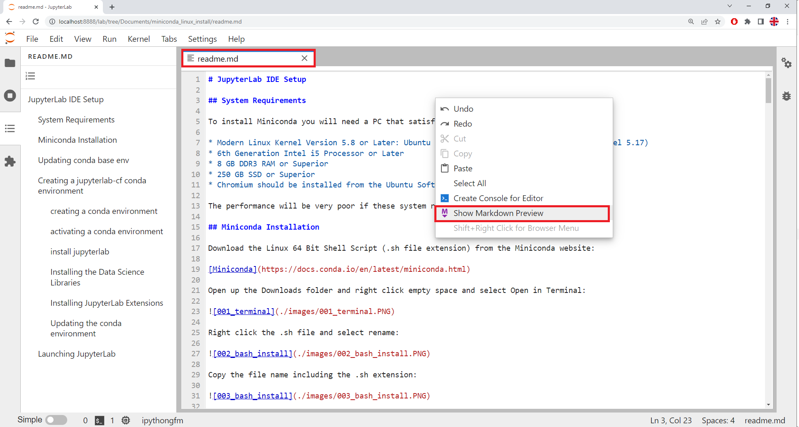

# Markdown

A text file can only be used to store unformatted text. The markdown file is similar to the text file, however allows text to be formatted using very simple markdown syntax. The Markdown file can be editted in JupyterLab or VSCode or it can be uploaded on GitHub directly and uploaded (this document itself is a Markdown file hosted on GitHub):



The Markdown Preview can be viewed in another pane:


To download the files, right click the following link and open in a new tab:

[Home](../../../)

Select Code and Download Zip. 


Then extract the downloaded ZIP file and copy it to your Documents folder. Launch JupyterLab and navigate to this directory and open this readme.md file.

---

## Formatted Text
Text can be enclosed in stars ```*``` or tildas ```~``` to format it. One set of stars ```*``` makes text italic, two sets of stars ```*``` makes it bold and three sets of stars ```*``` makes it bold-italic. Two sets of tildas ```~``` make it strike-through. 

The following markdown:

```
Let's make a sentence with *italic text*, **bold text**, ***bold-italic*** and ~~strike-through~~ text.
```

Produces:

Let's make a sentence with *italic text*, **bold text**, ***bold-italic*** and ~~strike-through~~ text.

---

## Escape Characters

When one of the formatting characters is required in the text, it needs to be prepended with the left slash ```\``` to insert an escape character. For example to insert the left slash itself, ```\``` two left slashes are used ```\\``` where the first left slash ```\``` denotes insertion of an escape character and the second left slash ```\``` denotes the escape character to be inserted is the left slash itself```\```. The following markdown:

```
Let's make a sentence with \*italic text\*, \*\*bold text\*\*, \*\*\*bold-italic\*\*\* and \~\~strike-through\~\~ text.
\\
```

Produces:

Let's make a sentence with \*italic text\*, \*\*bold text\*\*, \*\*\*bold-italic\*\*\* and \~\~strike-through\~\~ text.
\\

---

## Headings

Headings can be created by prefixing the text of a heading with a ```#```. Increasing the number of ```#``` increases the Heading Level. The following markdown:

```
# Heading 1

## Heading 2

### Heading 3

#### Heading 4

```

Produces:

# Heading Level 1

## Heading Level 2

### Heading Level 3

#### Heading Level 4

Each heading will display on the Table of Contents in JupyterLab.

---

## Spacing

For convenience a long sentence written over multiple lines is formatted as a single sentence. The following markdown:

```
She sells
seashells
on the
seashore
```

Produces:

She sells
seashells
on the
seashore

If instead the sentance is to be deliberately separated out over different lines, doubly space it. The following markdown:

```
She sells

seashells

on the

seashore

```

Produces:

She sells

seashells

on the

seashore

---

## Bullet Points

Bullet points can be created by prepending each line with a star```*``` (but not ending with a star as recall that would make the text bold) or prepending each line with ```1.```, ```2.``` and so on for a numbered list.

The following markdown:

```
Bullet Point List
* one
* two
* three

Bullet Point List (spaced)
* one

* two

* three

Numeric List
1. one
2. two
3. three

Numeric List (spaced)
1. one

2. two

3. three

```

Produces:

Bullet Point List
* one
* two
* three

Bullet Point List (spaced)
* one

* two

* three

Numeric List
1. one
2. two
3. three

Numeric List (spaced)
1. one

2. two

3. three

---

## Tables

The pipe ```|``` is used to seperate columns out in a table. The table is constructed row by row. The first row consists of the column names and the second row is the column alignment format specification (which can be changed to normal ```---```, left aligned ```:-```, right aligned ```-:```, left-aligned with title centred ```:-:```). All subsequent rows are rows containing table data.

The following markdown:

```
|num|number|
|---|---|
|1|one|
|2|two|
|3|three|

|num|number|
|---|:-|
|1|one|
|2|two|
|3|three|

|num|number|
|---|-:|
|1|one|
|2|two|
|3|three|

|num|number|
|---|:-:|
|1|one|
|2|two|
|3|three|
```

Produces:

|num|number|
|---|---|
|1|one|
|2|two|
|3|three|

|num|number|
|---|:-|
|1|one|
|2|two|
|3|three|

|num|number|
|---|-:|
|1|one|
|2|two|
|3|three|

|num|number|
|---|:-:|
|1|one|
|2|two|
|3|three|

---

## Seperators

An empty line with ```---``` will produce a seperator.

The folowing code:

```
---
```

Produces the seperator line between the two arrows:

↓

---

↑


---

## Code

To include code in a markdown file begin and end the code with 3 back-quotes ```` ``` ````. The following markdown:

```
The code is ```print("Hello World!")```
```

Produces:

The code is ```print("Hello World!")```

3 back quotes ```` ``` ```` on a new line can be used to begin and end a code-block. The following markdown:

````
```

print("Hello World!")

print("Goodbye World!")

```
````


Produces:

```
print("Hello World!")
print("Goodbye World!")
```

To include the ```` ``` ```` themselves as part of the markdown text. Enclose the three back quotes ```` ``` ```` in four backquotes ````` ```` `````. To get 4 backquotes (enclose in 5 backquotes). The following markdown:

`````
````
```
````
`````

Produces:

````
```
````

---

## Latex

A single dollar sign ```$```  can be used to enclose an inline Latex equation. Two dollar signs ```$$``` can be used for a display equation.

The following markdown:

```
The equation is $ f\left(x\right)=a_0+\sum_{n=1}^{\infty}\left(a_n\cos{\frac{n\pi x}{L}}+b_n\sin{\frac{n\pi x}{L}}\right) $
```

Produces:

The equation is $ f\left(x\right)=a_0+\sum_{n=1}^{\infty}\left(a_n\cos{\frac{n\pi x}{L}}+b_n\sin{\frac{n\pi x}{L}}\right) $

The following markdown:

```
$$ f\left(x\right)=a_0+\sum_{n=1}^{\infty}\left(a_n\cos{\frac{n\pi x}{L}}+b_n\sin{\frac{n\pi x}{L}}\right) $$
```

Produces:

$$ f\left(x\right)=a_0+\sum_{n=1}^{\infty}\left(a_n\cos{\frac{n\pi x}{L}}+b_n\sin{\frac{n\pi x}{L}}\right) $$

Use of Latex is outwith the scope of this tutorial. Microsoft Word has a what you see is what you get WYSIWYG equation editor. The equation should be created using Unicode. Then a blank equation should be created and LaTeX selected. The equation can then be copied and pasted:


On Ubuntu, EqualX can instead be used as a WYSIWYG equation editor which is a slightly less elegant solution. Open up a terminal and input:

```
sudo apt-get install equalx
```


To launch equalx input:

```
equalx
```


---

## Links and Images

Links can be inserted using the syntax ```[]()``` where the square brackets are used to enclose the link name and the parenthesis are used to enclose the link address.

If the link is an image this may be prepended with an exclamation mark `````` which will display the image within the markdown file.

The following markdown:

```
[Miniconda](https://docs.conda.io/en/latest/miniconda.html)
```

Produces:

[Miniconda](https://docs.conda.io/en/latest/miniconda.html)

The following markdown:

```

```

Produces:


If the image is in the same folder as the markdown file. The file name can be specified directly.

In the file path ```\.``` can be used to specify a subfolder and ```\..``` can be used to go up a level. The ```001_image_equation.PNG``` in the subfolder ```images``` can be selected for example using the following markdown:

```

```

Producing:


---

Return to:

[Home](../../../)
