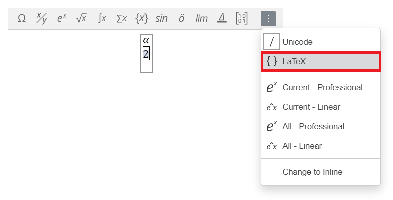
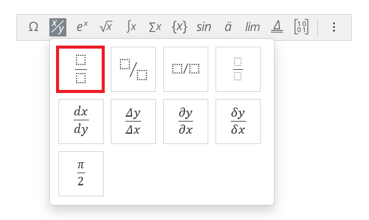
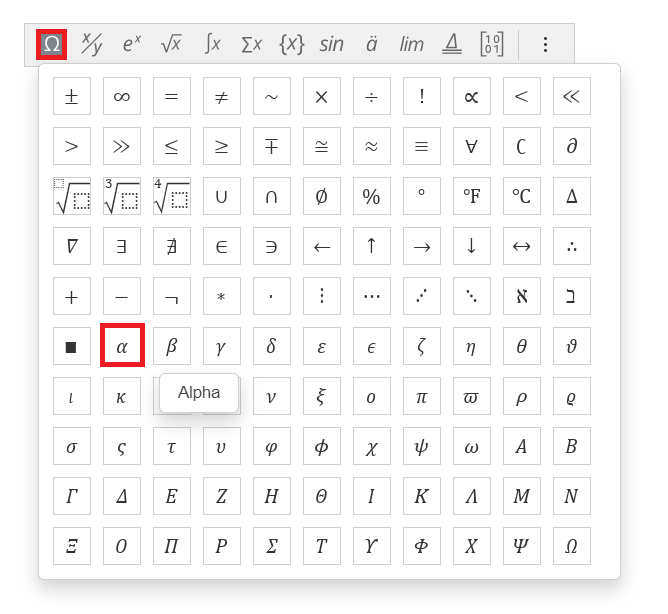
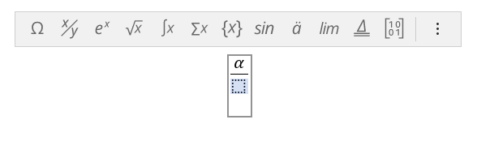
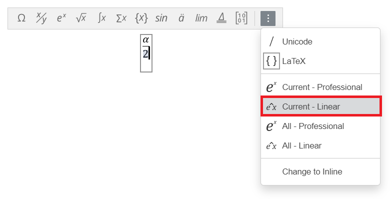
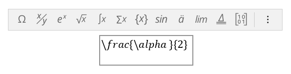

# Markdown

[YouTube Tutorial](https://www.youtube.com/watch?v=oB31JV27CnA)

A text file can only be used to store unformatted text. The markdown file is similar to the text file, however allows text to be formatted using very simple markdown syntax. The Markdown file can be editted in JupyterLab or Visual Studio Code or it can be uploaded on GitHub directly and edited within GitHub. This document itself is a Markdown file hosted on GitHub:


The Markdown Preview can be viewed in another pane:


To download the files, right click the following link and open in a new tab:

[Home](../../../)

Select Code and Download Zip. 


Then extract the downloaded ZIP file and copy it to your Documents folder. Launch JupyterLab and navigate to this directory and open this readme.md file.

---

## Formatted Text

Text can be enclosed in stars ```*``` or tildas ```~``` to format it. One set of stars ```*``` makes text italic, two sets of stars ```*``` makes it bold and three sets of stars ```*``` makes it bold-italic. Two sets of tildas ```~``` make it strike-through. 

The following markdown:

```
Let's make a sentence with *italic text*, **bold text**, ***bold-italic*** and ~~strike-through~~ text.
```

Produces:

Let's make a sentence with *italic text*, **bold text**, ***bold-italic*** and ~~strike-through~~ text.

---

## Escape Characters

When one of the formatting characters is required in the text, it needs to be prepended with the left slash ```\``` to insert an escape character. For example to insert the left slash itself, ```\``` two left slashes are used ```\\``` where the first left slash ```\``` denotes insertion of an escape character and the second left slash ```\``` denotes the escape character to be inserted is the left slash itself```\```. The following markdown:

```
Let's make a sentence with \*italic text\*, \*\*bold text\*\*, \*\*\*bold-italic\*\*\* and \~\~strike-through\~\~ text.
\\
```

Produces:

Let's make a sentence with \*italic text\*, \*\*bold text\*\*, \*\*\*bold-italic\*\*\* and \~\~strike-through\~\~ text.
\\

---

## Headings

Headings can be created by prefixing the text of a heading with a ```#```. Increasing the number of ```#``` increases the Heading Level. The following markdown:

```
# Heading 1

## Heading 2

### Heading 3

#### Heading 4

```

Produces:

# Heading Level 1

## Heading Level 2

### Heading Level 3

#### Heading Level 4

Each heading will display on the Table of Contents in JupyterLab.

---

## Spacing

For convenience a long sentence written over multiple lines is formatted as a single sentence. The following markdown:

```
She sells
seashells
on the
seashore
```

Produces:

She sells
seashells
on the
seashore

If instead the sentance is to be deliberately separated out over different lines, doubly space it. The following markdown:

```
She sells

seashells

on the

seashore

```

Produces:

She sells

seashells

on the

seashore

---

## Bullet Points

Bullet points can be created by prepending each line with a star```*``` (but not ending with a star as recall that would make the text italic) or prepending each line with ```1.```, ```2.``` and so on for a numbered list.

The following markdown:

```
Bullet Point List
* one
* two
* three

Bullet Point List (spaced)
* one

* two

* three

Numeric List
1. one
2. two
3. three

Numeric List (spaced)
1. one

2. two

3. three

```

Produces:

Bullet Point List
* one
* two
* three

Bullet Point List (spaced)
* one

* two

* three

Numeric List
1. one
2. two
3. three

Numeric List (spaced)
1. one

2. two

3. three

---

## Tables

The pipe ```|``` is used to seperate columns out in a table. The table is constructed row by row. The first row consists of the column names and the second row is the column alignment format specification (which can be changed to normal ```---```, left aligned ```:-```, right aligned ```-:```, left-aligned with title centred ```:-:```). All subsequent rows are rows containing table data.

The following markdown:

```
|num|number|
|---|---|
|1|one|
|2|two|
|3|three|

|num|number|
|---|:-|
|1|one|
|2|two|
|3|three|

|num|number|
|---|-:|
|1|one|
|2|two|
|3|three|

|num|number|
|---|:-:|
|1|one|
|2|two|
|3|three|
```

Produces:

|num|number|
|---|---|
|1|one|
|2|two|
|3|three|

|num|number|
|---|:-|
|1|one|
|2|two|
|3|three|

|num|number|
|---|-:|
|1|one|
|2|two|
|3|three|

|num|number|
|---|:-:|
|1|one|
|2|two|
|3|three|

---

## Seperators

An empty line with ```---``` will produce a seperator.

The folowing code:

```
---
```

Produces the seperator line between the two arrows:

↓

---

↑


---

## Code

To include code in a markdown file begin and end the code with 3 back-quotes ```` ``` ````. The following markdown:

```
The code is ```print("Hello World!")```
```

Produces:

The code is ```print("Hello World!")```

3 back quotes ```` ``` ```` on a new line can be used to begin and end a code-block. The following markdown:

````
```

print("Hello World!")

print("Goodbye World!")

```
````


Produces:

```
print("Hello World!")
print("Goodbye World!")
```

To include the ```` ``` ```` themselves as part of the markdown text. Enclose the three back quotes ```` ``` ```` in four backquotes ````` ```` `````. To get 4 backquotes (enclose in 5 backquotes). The following markdown:

`````
````
```
````
`````

Produces:

````
```
````

---

## Links and Images

Links can be inserted using the syntax ```[]()``` where the square brackets are used to enclose the link name and the parenthesis are used to enclose the link address.

If the link is an image this may be prepended with an exclamation mark `````` which will display the image within the markdown file.

The following markdown:

```
[Mamba](https://mamba.readthedocs.io/en/latest/installation.html)
```

Produces:

[Mamba](https://mamba.readthedocs.io/en/latest/installation.html)

The following markdown:

```

```

Produces:


If the Image can't be found, the information provided in the square brackets displays:

```

```


If the image is in the same folder as the markdown file. The file name can be specified directly.

In the file path ```./``` can be used to specify a subfolder and ```../``` can be used to go up a level. The ```img_005.png``` in the subfolder ```images``` can be selected for example using the following markdown:

```

```

Producing:


It is recommended to enable file extensions for known file types and ensure all file extensions are lower case. GitHub seems to be sensitive regarding the case of the file extension and won't render properly if the file has a different case of file extension. Some programs will save to .PNG and others will save to .png by default. By enabling the file extension you will be able to see what case each file extension is using and can update them all to be lower case for the sake of being consistent. Note JupyterLab and VSCode are insenitive regarding extension case, so all may seem to be well until the folder with the markdown file and images are uploaded to GitHub.

## LaTeX (MathJax)

The markdown file supports LaTeX. Care needs to be taken as Python IDEs and webservers may use different engines to render LaTeX. JupyterLab and GitHub use MathJax. In Visual Studio Code the extensions Markdown All in One and Markdown+Math use KaTeX. MathJax is more limited than KaTeX and is more prone to rendering issues. Markdown files uploaded to GitHub with LaTeX should be rechecked on GitHub to see if equations render properly. [MathJax GitHub](https://github.com/mathjax/MathJax/issues) can be used to discuss rendering issues.

Only Office Desktop Editors is a cross-platform free office suite. Its Document has a powerful Equation Editor, that can be used as a What You See Is What You Get WYSIWYG LaTeX editor. Create your equation:








Select LaTeX:


Select Current (Linear):



The equation is now in LaTeX format which you can copy and paste into a set of single \$ for an inline equation or double \$\$  for a display equation:



Only Office Desktop Editors seems to work well, with the exception of Column Vectors and Matrices due to some limitations in MathJaxs rendering. A column vector comes out as ```[\matrix{a\\b\\c}]``` and does not render properly. To render properly modifications need to be made to the prefix and suffix and spacing needs to be added, see below for more details.

Microsoft Word also has an Equation Editor with a similar user interface that seems to work well. A column vector comes out as ```\left[\begin{matrix}a\\b\\c\\\end{matrix}\right]``` but spacing needs to be added for MathJax to render it. Similar changes need to be made to a matrix, see below for more details. Also the ```\funcapply``` prefix does not render properly and should be removed as a prefix from trigonmetric functions.

### Reserved Symbols (MathJax)

In LaTeX there are a number of reserved symbols:

|symbol|use|
|---|---|
|$|a single set are used to enclose LaTex denoting an inline equation|
|$$|a double set are used to enclose LaTex denoting a display equation|
|\\ |this is used to insert an escape character|
|{}|used to enclose arguments|
|\_|used for subscript|
|^|used for superscript|
|&|used as a delimiter|
|\\\\ |used as a delimiter|
|%|used to enclose comments|

In LaTeX it is possible to insert some of these symbols in as escape characters, for example ```$\$$``` for $ and ```$\%$``` for %. These give $\$$ (3 dollar signs) and $\%$ (nothing) respectively. MathJax is not reliable for placing one of these reserved escape characters into the LaTeX equation.

### LateX Text (MathJax)

|description|LaTeX|output|
|---|---|---|
|math text|```$x$```|$x$|
|normal text|```$\text{x}$```|$\text{x}$|
|bold text|```$\textbf{x}$```|$\textbf{x}$|
|math text with dot|```$\dot{x}$```|$\dot{x}$|
|math text with double dot|```$\ddot{x}$```|$\ddot{x}$|
|math text with triple dot|```$\dddot{x}$```|$\dddot{x}$|
|math text with bar|```$\bar{x}$```|$\bar{x}$|
|math text with hat|```$\hat{x}$```|$\hat{x}$|
|math text with arrow vector|```$\vec{x}$```|$\vec{x}$|
|math text with tilde|```$\tilde{x}$```|$\tilde{x}$|
|math text with wide tilde|```$\widetilde{xx}$```|$\widetilde{xx}$|
|math text with check|```$\check{x}$```|$\check{x}$|
|math text with acute|```$\acute{x}$```|$\acute{x}$|
|math text with grave|```$\grave{x}$```|$\grave{x}$|
|math text with breve|```$\breve{x}$```|$\breve{x}$|
|subscript|```$x_{2}$```|$x_{2}$|
|superscript|```$x^{3}$```|$x^{3}$|
|subscript and superscript|```$x_{2}^{3}$```|$x_{2}^{3}$|
|square root|```$\sqrt{x}$```|$\sqrt{x}$|
|sin|```$\sin{x}$```|$\sin{x}$|
|cos|```$\cos{x}$```|$\cos{x}$|
|tan|```$\tan{x}$```|$\tan{x}$|
|log|```$\log{x}$```|$\log{x}$|
|exp|```$\exp{x}$```|$\exp{x}$|

### LaTeX Mathematical Symbols (MathJax)

|description|LaTeX|output|
|---|---|---|
|equal to|```$=$```|$=$|
|equivalent to|```$\equiv$```|$\equiv$|
|not equal to|```$\ne$```|$\ne$|
|similar to|```$\sim$```|$\sim$|
|approximate to|```$\approx$```|$\approx$|
|tilde|```$\textasciitilde$```|$\textasciitilde$|
|approximately equal to|```$\cong$```|$\cong$|
|plus|```$+$```|$+$|
|minus|```$-$```|$-$|
|plus minus|```$\pm$```|$\pm$|
|minus plus|```$\mp$```|$\mp$|
|dash|```$\text{-}$```|$\text{-}$|
|circumflex|```$\textasciicircum$```|$\textasciicircum$|
|asterisk|```$\ast$```|$\ast$|
|star|```$\text{\*}$```|$\text{\*}$|
|times|```$\times$```|$\times$|
|centre dot|```$\cdot$```|$\cdot$|
|period|```$.$```|$.$|
|bullet|```$\bullet$```|$\bullet$|
|colon|```$\colon$```|$\colon$|
|centre dots|```$\cdots$```|$\cdots$|
|vertical dots|```$\vdots$```|$\vdots$|
|therefore|```$\therefore$```|$\therefore$|
|division slash|```$/$```|$/$|
|division sign|```$\div$```|$\div$|
|less than|```$<$```|$<$|
|less than or equal to|```$\leq$```|$\leq$|
|greater than|```$>$```|$>$|
|greater than or equal to|```$\geq$```|$\geq$|
|factorial|```$!$```|$!$|
|degree|```$\degree$```|$\degree$|
|infinity|```$\infty$```|$\infty$|
|proportional to|```$\propto$```|$\propto$|
|partial|```$\partial$```|$\partial$|
|hbar|```$\hbar$```|$\hbar$|
|union|```$\cup$```|$\cup$|
|intersection|```$\cap$```|$\cap$|
|emptyset|```$\emptyset$```|$\emptyset$|
|exists|```$\exists$```|$\exists$|
|in|```$\in$```|$\in$|
|not in|```$\notin$```|$\notin$|
|ni|```$\ni$```|$\ni$|
|left arrow|```$\leftarrow$```|$\leftarrow$|
|right arrow|```$\rightarrow$```|$\rightarrow$|
|left right arrow|```$\leftrightarrow$```|$\leftrightarrow$|
|up arrow|```$\uparrow$```|$\uparrow$|
|down arrow|```$\uparrow$```|$\downarrow$|
|up down arrow|```$\updownarrow$```|$\updownarrow$|

### LaTeX Greek Letters (MathJax)

|description|LaTeX|output|
|---|---|---|
|alpha|```$\alpha$```|$\alpha$|
|beta|```$\beta$```|$\beta$|
|Gamma|```$\Gamma$```|$\Gamma$|
|gamma|```$\gamma$```|$\gamma$|
|Delta|```$\Delta$```|$\Delta$|
|delta|```$\delta$```|$\delta$|
|nabla|```$\nabla$```|$\nabla$|
|epsilon|```$\epsilon$```|$\epsilon$|
|epsilon|```$\varepsilon$```|$\varepsilon$|
|zeta|```$\zeta$```|$\zeta$|
|eta|```$\eta$```|$\eta$|
|kappa|```$\kappa$```|$\kappa$|
|Lambda|```$\Lamba$```|$\Lambda$|
|mu|```$\mu$```|$\mu$|
|Xi|```$\Xi$```|$\Xi$|
|xi|```$\xi$```|$\xi$|
|Pi|```$\Pi$```|$\Pi$|
|pi|```$\pi$```|$\pi$|
|rho|```$\rho$```|$\rho$|
|Sigma|```$\Sigma$```|$\Sigma$|
|sigma|```$\sigma$```|$\sigma$|
|sigma|```$\varsigma$```|$\varsigma$|
|tau|```$\tau$```|$\tau$|
|Upsilon|```$\Upsilon$```|$\Upsilon$|
|upsilon|```$\upsilon$```|$\upsilon$|
|Phi|```$\Phi$```|$\Phi$|
|phi|```$\phi$```|$\phi$|
|chi|```$\chi$```|$\chi$|
|Psi|```$\Psi$```|$\Psi$|
|psi|```$\psi$```|$\psi$|
|Omega|```$\Omega$```|$\Omega$|
|omega|```$\omega$```|$\omega$|

Note the Greek letters A, B, E, Z, H, I, i, K, M, N, O, o and P that are the same as Latin letters are therefore just represented using the Latin letters.

### LaTeX Fractions (MathJax)

|description|LaTeX|output|
|---|---|---|
|inline fraction|```$\frac{a}{b}$```|$\frac{a}{b}$|
|display fraction|```$$\frac{a}{b}$$```|$$\frac{a}{b}$$|

### LaTeX Brackets (MathJax)

|description|LaTeX|output|
|---|---|---|
|inline fraction parenthesis|```$(\frac{a}{b})$```|$(\frac{a}{b})$|
|display fraction parenthesis|```$$(\frac{a}{b})$$```|$$(\frac{a}{b})$$|
|display fraction parenthesis automatic size|```$$\left(\frac{a}{b}\right)$$```|$$\left(\frac{a}{b}\right)$$|
|inline fraction square|```$[\frac{a}{b}]$```|$[\frac{a}{b}]$|
|display fraction square|```$$[\frac{a}{b}]$$```|$$[\frac{a}{b}]$$|
|display fraction square automatic size|```$$\left[\frac{a}{b}\right]$$```|$$\left[\frac{a}{b}\right]$$|
|inline fraction braces|```$\lbrace\frac{a}{b}\rbrace$```|$\lbrace\frac{a}{b} \rbrace$|
|display fraction braces|```$$\lbrace\frac{a}{b}\rbrace$$```|$$\lbrace\frac{a}{b}\rbrace$$|
|display fraction braces automatic size|```$$\left\lbrace\frac{a}{b}\right\lbrace$$```|$$\left\lbrace\frac{a}{b}\right\rbrace$$|

Prefixing ```\left``` and ```\right``` to a set of brackets will automatically resize the brackets.

The ```{``` and ```}``` are reserved so ```\lbrace``` and ```\rbrace``` need to be used.

### LaTeX Vectors and Matrices (MathJax)

Vectors and matrices only work as display equations. The ```\begin{}``` and ```\end{}``` are used to enclose the matrix with the braces containing the type of matrix, a ```bmatrix``` is used in this example.

Row Vectors use ```&``` as a delimiter to move onto the new column and are typically input on a single line:

```
$$\begin{bmatrix}a&b&c\end{bmatrix}$$
```

$$\begin{bmatrix}a&b&c\end{bmatrix}$$

Column Vectors use ```\\``` as a delimiter to move onto the next row and are input over multiple lines:

```
$$  \begin{bmatrix}
    a \\
    b \\
    c \\
    \end{bmatrix} $$ 
```
    
$$  \begin{bmatrix}
    a \\
    b \\
    c \\
    \end{bmatrix} $$    

Matrices use  ```&``` as a delimiter to move onto the new column and ```\\``` as a delimiter to move onto the next row and are input over multiple lines:

```
$$ \begin{bmatrix} 
   a & b & c \\
   c & d & d \\
   e & f & g \\
   \end{bmatrix} $$
```

$$ \begin{bmatrix} 
   a & b & c \\
   c & d & d \\
   e & f & g \\
   \end{bmatrix} $$

There are four types of matrix, the:

* ```matrix``` [no enclosing brackets]
* ```bmatrix``` [square brackets]
* ```pmatrix``` (parenthesis)
* ```pvmatrix``` |vertical bars|

$$ \begin{matrix} 
   a & b & c \\
   c & d & d \\
   e & f & g \\
   \end{matrix} $$

$$ \begin{bmatrix} 
   a & b & c \\
   c & d & d \\
   e & f & g \\
   \end{bmatrix} $$

$$ \begin{pmatrix} 
   a & b & c \\
   c & d & d \\
   e & f & g \\
   \end{pmatrix} $$

$$ \begin{vmatrix} 
   a & b & c \\
   c & d & d \\
   e & f & g \\
   \end{vmatrix} $$

### LaTeX Sum, Integral, Product and Union (MathJax)

To make a sum use ```\sum```:

```
$\sum x$
```

$\sum x$

An underscore can be used to add a subscript enclosed in braces:

```
$\sum_{\text{lower}} x$
```

$\sum_{\text{lower}} x$

A hat can be used to add a subscript enclosed in braces:

```
$\sum^{\text{upper}} x$
```

$\sum^{\text{upper}} x$

Use of both a subscript and superscript doesn't render well for inline equations. 

```
$\sum_{\text{lower}}^{\text{upper}} x$
```

$\sum_{\text{lower}}^{\text{upper}} x$

A display equation should be used:

```
$$\sum_{\text{lower}}^{\text{upper}} x$$
```

$$\sum_{\text{lower}}^{\text{upper}} x$$

To make an integral use ```\int```:

```
$\int$
```

$\int$

A display equation should be used for an integral, if limits are added:

```
$$\int_{\text{lower}}^{\text{upper}} x$$
```

$$\int_{\text{lower}}^{\text{upper}} x$$

For a double integral, use ```\iint``` and for a triple integral use ```\iiint```:

```
$$\iint_{\text{lower}}^{\text{upper}} x$$
$$\iiint_{\text{lower}}^{\text{upper}} x$$
```

$$\iint_{\text{lower}}^{\text{upper}} x$$

$$\iiint_{\text{lower}}^{\text{upper}} x$$

For an integral over a closed line use ```\oint```:

```
$$\oint_{\text{lower}}^{\text{upper}} x$$
```

$$\oint_{\text{lower}}^{\text{upper}} x$$

To make an product or coproduct use ```\prod``` or ```\amalg```:

```
$$\prod_{\text{lower}}^{\text{upper}} x$$
$$\amalg_{\text{lower}}^{\text{upper}} x$$
```

$$\prod_{\text{lower}}^{\text{upper}} x$$

$$\amalg_{\text{lower}}^{\text{upper}} x$$

To make a Union or Intersection use ```\bigcup``` and ```\bigcap```:

```
$$\bigcup_{\text{lower}}^{\text{upper}} x$$
$$\bigcap_{\text{lower}}^{\text{upper}} x$$
```

$$\bigcup_{\text{lower}}^{\text{upper}} x$$

$$\bigcap_{\text{lower}}^{\text{upper}} x$$

For a logical or and logical and use ```\bigvee``` and ```\bigwedge```:

```
$$\bigvee_{\text{lower}}^{\text{upper}} x$$
$$\bigwedge_{\text{lower}}^{\text{upper}} x$$
```

$$\bigvee_{\text{lower}}^{\text{upper}} x$$

$$\bigwedge_{\text{lower}}^{\text{upper}} x$$

---

[Home Python Tutorials](https://github.com/PhilipYip1988/python-tutorials/blob/main/readme.md)
