# Interactive Python Notebook File

The **I**nteractive **Py**thon **N**ote**b**ook file with the extension ```.ipynb``` consists of a series of cells. Each cell can be designated as a markdown cell, using the same syntax as a markdown file or a code cell which can be used to execute Python code.

In this set of tutorials the JupyterLab IDE will be used.

The following markdown cell:

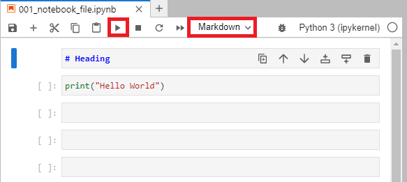

When run, shows an output similar to the markdown preview of a markdown file:

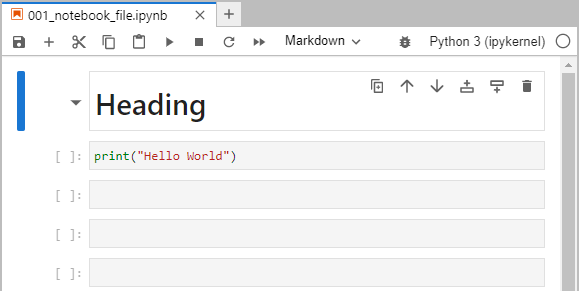

When a code cell is run:

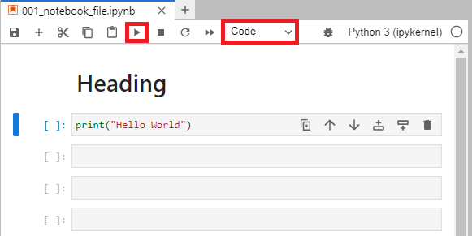

The code is executed and any output is shown below the cell. Once a code cell is run, a number displays to the left indicating the order the code cell was run. In this case ```1```:

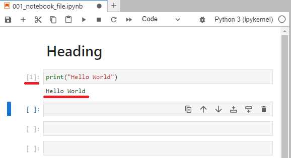

If another code block is run, it will display ```2```:

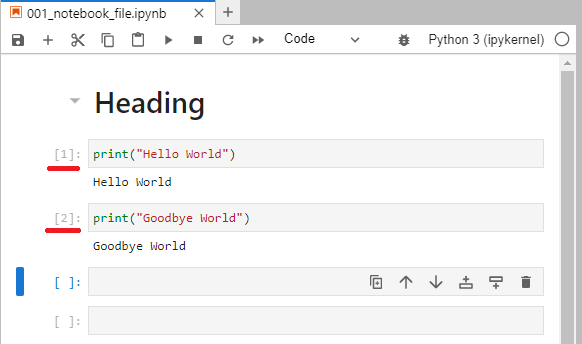

A highlighted code cell may be switched to markdown using the ```Esc``` and ```m``` keyboard shortcut. A highlighted markdown cell my be switched to a code cell using the ```Esc``` and ```y``` keyboard shortcut.

The shortcut key shift ```⇧``` and enter ```↵``` can be used to run a currently selected cell:

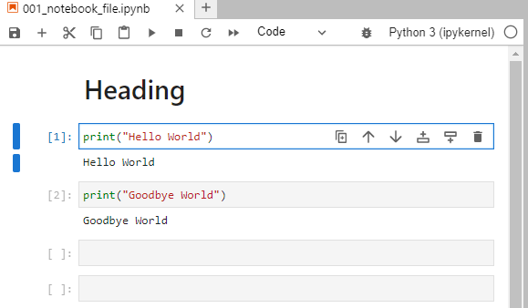

If a code cell that has previously been run is reselected and run again. It will only display a single number, indicating the order at the last time the cell was run, in this case the number is now ```3```: 

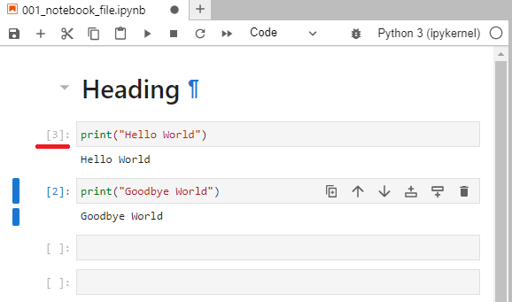

The shortcut key alt ```alt``` and enter ```↵``` can be used to run a currently selected cell and insert an empty cell below it:

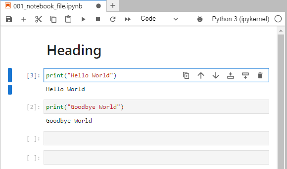

Notice that the number of the cell is now ```4``` and there is a blank cell below:

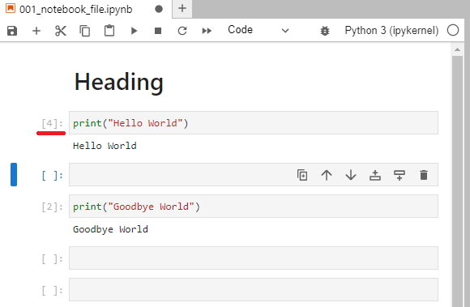

A docstring of a function or class can be displayed as a popup balloon by typing in the function name followed by open parenthesis and using the shortcut key shift ```⇧``` and tab ``` ↹``` for example the ```print``` function:

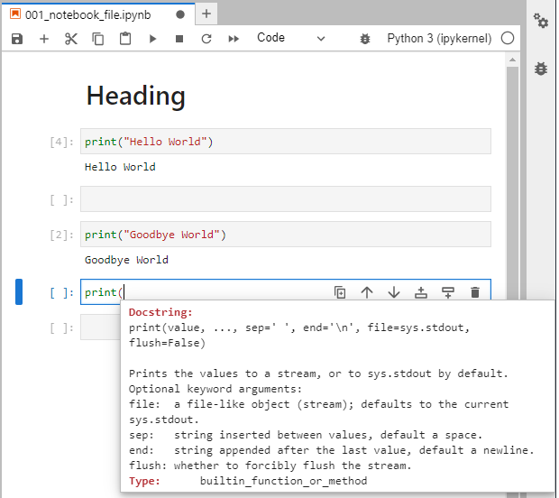

We can also output the full docstring to a cell by using ```?``` before the fubnction or class. In the case, we should only use the function or class name to reference the function or class and not include any parenthesis following the function to call it. For example we can have a look at the ```print``` function using:

```
? print
```

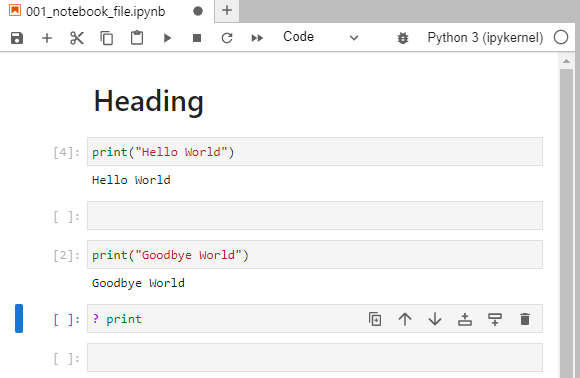

We see the docstring as the cell output:

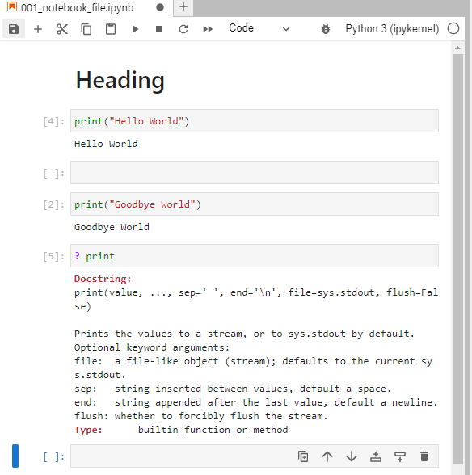

For long docstrings or long outputs ineneral, we can right click the output cell and select Enable Scrolling for outputs:

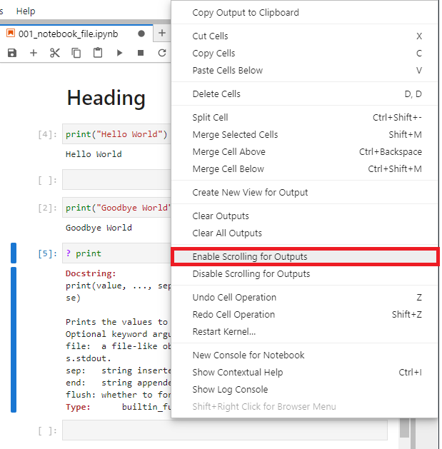

This allows us to quickly view the docstring without it being the main focus of the interactive notebook file:

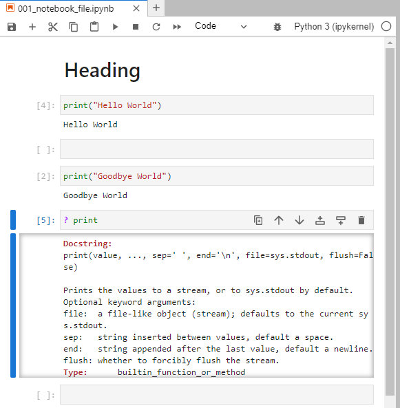

Python objects (instances of classes) may have a number of other objects (classes, instances, attributes and modules) that can be called from them. Let's use the example of the inbuilt ```datatime``` module. Let's import it using the alias ```dt```:

```
import datetime as dt
```

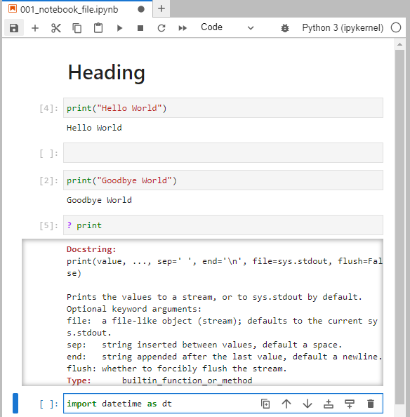

Now if we type in the name of the object, in this case the alias ```dt``` followed by a dot ```.``` and ```↹``` we see a list of objects:

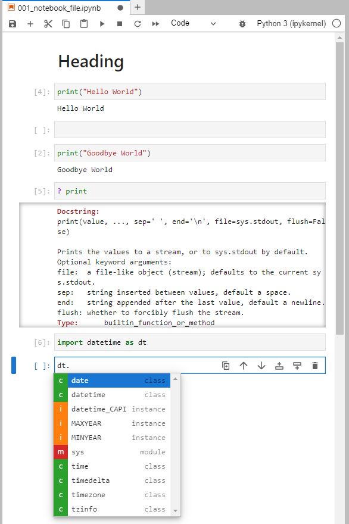

In this case we see the class ```datetime``` and we can once again have a look at it's docstring using the shortcut key shift ```⇧``` and tab ```↹```:

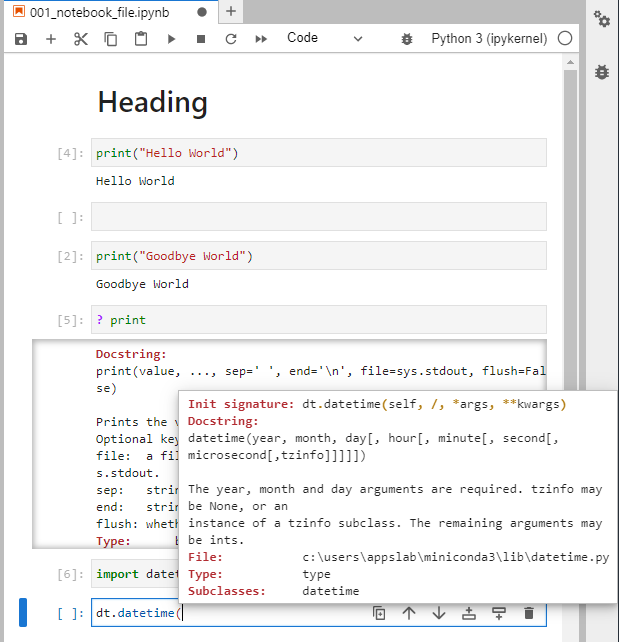

When opening a notebook created by someone else, sometimes you may want to restart the kernel. To do this select the Kernel tab and then select Restart Kernel and Clear All Outputs... or one of the other options:

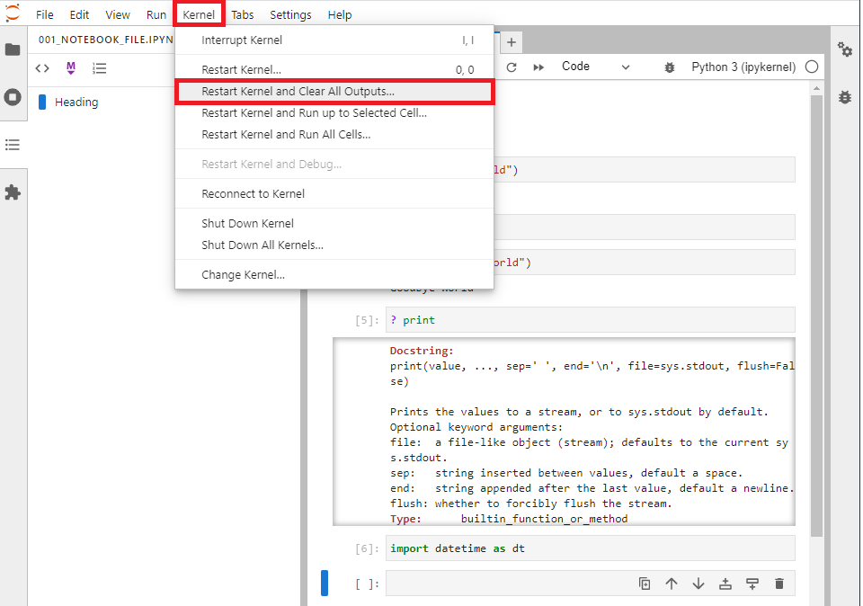

Select Restart:

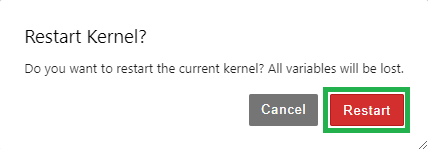

Now all the Cell outputs are blank and there is no number beside any of the cells, indicatingthat none of the cells are ran:

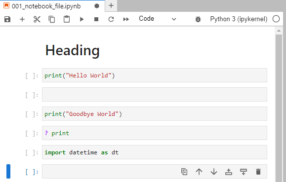

An example notebook file can be opened in JupyterLab:

[Example Notebook File](./001_example_notebook_file.ipynb)
