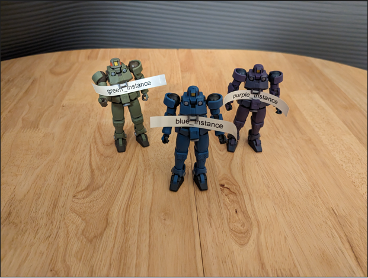

# Fundamental Datatypes

## Object Orientated Programming Fundamentals

Python is an Object Orientated Programming (OOP) language. Each *object* belongs to an associated *class*. The *class* can be conceptualised as a set of instructions, similar to the blueprint that has an associated label ```Mobile_Suit```. 


Each object that belongs to a class, is known as an *instance* of the class. There are three instances, and each instance has its own respective label ```green_instance```, ```blue_instance``` and ```purple_instance``` which correspond to the unique models (bottom). 



The three instances are each unique objects and interaction with one does not influence the other two. The class outlines attributes and methods:

An *attribute* is some form of data which belongs to the object, which can be thought of as a property of the object. In this example the ```height``` of each model is an example of an attribute. Each instance has a height of 15 cm which can be accessed using dot ```.``` notation of the form ```instance.attribute```:

```
blue_instance.height
green_instance.height
purple_instance.height
```

Since this height is constant for every instance of the class, it is known as a *class attribute* and can be accessed from the class using:

```
Mobile_Suit.height
```

Another example of an attribute is the color of each instance. 

```
blue_instance.color
green_instance.color
purple_instance.color
```

This gives ```blue```, ```green``` and ```purple``` respectively. Unlike the height attribute, the color attribute is not constant and can be varied for each instance, so is known as an *instance attribute*. It is therefore not possible to access:

```
Mobile_Suit.color
```

A *method* is some form of action. Looking at the class ```Mobile_Suit```, it is easy to see that each instance is poseable. A method ```raise_right_arm``` for example can be used. In Python, a method is a function which needs to be called using parenthesis ```( )```. The ```( )``` also serve a second purpose, to enclose any required input arguments having the general form ```instance.method(arg1, arg2, arg3, ...)```. Many methods don't require supplementary input arguments as they already have access to instance and class attributes, like in this example, where the arm is internal.

```
blue_instance.raise_right_arm()
```


Calling the method on ```blue_instance``` does not influence ```green_instance``` or ```purple_instance```.

Looking at the class ```Mobile_Suit```, it is easy to see that each instance can mount equipment and a method ```mount_left_arm``` can be used. From the class, it is seen that there is a variety in the equipment that can be mounted. The piece of equipment to be mounted can be provided as an input argument to the method, for example:

```
green_instance.mount_left_arm('shield')
```


The class name itself acts as a method. Calling the class, invokes a datamodel method defined in the class known as the init signature. The initialization signature is used to initialize instance variables when constructing a new instance of a class. In this example, the only instance variable required is the ```color``` since all instances are otherwise instantiated identically.

```
mobile_suit(color='white')
```

Notice that the new instance created, unlike the other three instances has no associated label. Because it has no associated label, there is no reference to this instance and it cannot be accessed:


Python garbage collection sees this as an instance with no reference and will remove it:


A label, also known as the ```instance_name``` can be assigned to the instance during instantiation by use of the assignment operator ```=```. The instance to be assigned is placed on the right hand side of the assignment operator, and the label or instance name is placed on the left hand side of the assignment operator. For example:

```
white_instance = mobile_suit(color='white')
```


The ```del``` keyword deletes an instance name. For example:

```
del green_instance
```

The instance name is known as a reference to an instance. If the instance has no references, it cannot be accessed and is removed by Pythons garbage collection.


If the following code is input:

```
tallgeese = white_instance
```

Approach the assignment operator from right to left. In the right, the instance name ```white_instance``` acts as a reference to the ```Mobile_Suit``` instance. Then the assignment operator essentially assigns a second instance name or *alias* which can be visualised as a second label:


If one of these instance names is deleted, for example:

```
del white_instance
```

Then the instance has a second instance name giving a single reference to the instance. Since this instance has a reference,, it is not deleted by Pythons garbage collection:


The class itself is an object, which is why it was depicted as a blueprint with a label representing its object name.

## The string class

The ```str``` class is an abbreviation for a string of Unicode characters. Inputting ```str()``` followed by shift ```⇧``` and tab ```↹``` will display the docstring of the init signature of the string class.


Inputting:

```
? str
```

will output the docstring in the cell output.