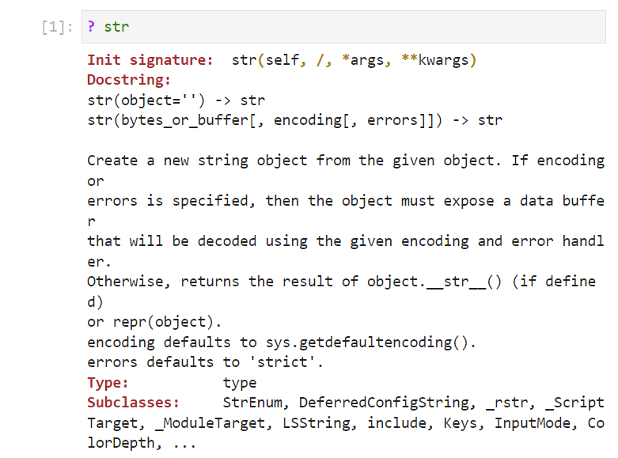
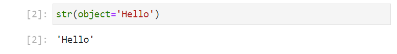
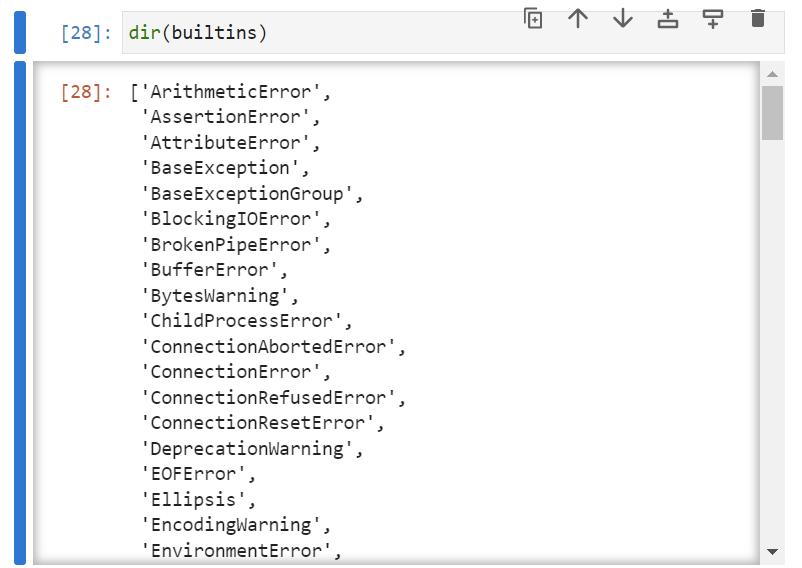
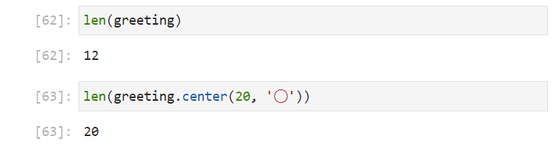
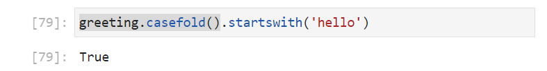

# Fundamental Text Datatypes

There are three fundamental text datatypes used in Python, the Unicode String ```str```, the Byte String ```bytes``` and the Mutable Byte String ```bytearray```. 

In the Unicode String, each unit in the string is a Unicode text character, as a consequence it is the easiest text data type to manipulate, the most flexible and the most common text datatype employed in Python.

In the Byte Strings, each unit in the string is instead a numeric configuration known as a byte. For a small subset of characters known as ASCII characters, one character corresponds to one byte and therefore the Unicode Strings and Byte Strings map consistently. Outwith this small subset of characters, things become a bit more messy. One-four Bytes may be used to represent a character and the configuration of bytes used to represent each character changes with the various different encoding schemes or translation maps. The Byte Strings are generally used more on the hardware level for purposes such as receiving and sending data along serial ports. In such an application, it is recommended to convert the receiving Byte String to a Unicode String as early as possible in the program and to convert the Unicode String to a Byte String as later as possible before sending it along a serial port.

## Object Orientated Programming Conception

Python is an Object Orientated Programming (OOP) language. Each *object* belongs to an associated *class*. The *class* can be conceptualised as a set of instructions, similar to the blueprint that has an associated label ```MobileSuit```. 


Each object that belongs to a class, is known as an *instance* of the class. There are three instances, and each instance has its own respective label ```green_instance```, ```blue_instance``` and ```purple_instance``` which correspond to the unique models (bottom). 


Notice the ```PascalCase``` used for the class name ```MobileSuit```, this syntax is used for third-party classes. Instance names otherwise known as object names or variable names typically use ```snake_case```. ```UPPER_CASE``` is typically reserved for an instance name that is intended to be constant.

The three instances are each unique objects and interaction with one does not influence the other two. The class outlines attributes and methods:

An *attribute* is some form of data which belongs to the object, which can be thought of as a property of the object. In this example the ```height``` of each model is an example of an attribute. Each instance has a height of 15 cm which can be accessed using dot ```.``` notation of the form ```instance.attribute```:

```
blue_instance.height
green_instance.height
purple_instance.height
```

Since this height is constant for every instance of the class, it is known as a *class attribute* and can be accessed from the class using:

```
MobileSuit.height
```

Another example of an attribute is the color of each instance. 

```
blue_instance.color
green_instance.color
purple_instance.color
```

This gives ```blue```, ```green``` and ```purple``` respectively. Unlike the height attribute, the color attribute is not constant and can be varied for each instance, so is known as an *instance attribute*. It is therefore not possible to access:

```
MobileSuit.color
```

A *method* is some form of action. Looking at the class ```MobileSuit```, it is easy to see that each instance is poseable. A method ```raise_right_arm``` for example can be used. In Python, a method is a function which needs to be called using parenthesis ```( )```. The ```( )``` also serve a second purpose, to enclose any required input arguments having the general form ```instance.method(arg1, arg2, arg3, ...)```. Many methods don't require supplementary input arguments as they already have access to instance and class attributes, like in this example, where the arm is internal.

```
blue_instance.raise_right_arm()
```


Calling the method on ```blue_instance``` does not influence ```green_instance``` or ```purple_instance```.

Looking at the class ```MobileSuit```, it is easy to see that each instance can mount equipment and a method ```mount_left_arm``` can be used. From the class, it is seen that there is a variety in the equipment that can be mounted. The piece of equipment to be mounted can be provided as an input argument to the method, for example:

```
green_instance.mount_left_arm('shield')
```


The class name itself acts as a method. Calling the class, invokes a data model method defined in the class known as the init signature. The initialization signature is used to initialize instance variables when constructing a new instance of a class. In this example, the only instance variable required is the ```color``` since all instances are otherwise instantiated identically.

```
MobileSuit(color='white')
```

Notice that the new instance created, unlike the other three instances has no associated label. Because it has no associated label, there is no reference to this instance and it cannot be accessed:


Python garbage collection sees this as an instance with no reference and will remove it:


A label, also known as the ```instance_name``` can be assigned to the instance during instantiation by use of the assignment operator ```=```. The instance to be assigned is placed on the right hand side of the assignment operator, and the label or instance name is placed on the left hand side of the assignment operator. For example:

```
white_instance = MobileSuit(color='white')
```


The ```del``` keyword deletes an instance name. For example:

```
del green_instance
```

The instance name is known as a reference to an instance. If the instance has no references, it cannot be accessed and is removed by Pythons garbage collection.


If the following code is input:

```
tallgeese = white_instance
```

Approach the assignment operator from right to left. In the right, the instance name ```white_instance``` acts as a reference to the ```MobileSuit``` instance. Then the assignment operator essentially assigns a second instance name or *alias* which can be visualised as a second label:


If one of these instance names is deleted, for example:

```
del white_instance
```

Then the instance has a second instance name giving a single reference to the instance. Since this instance has a reference,, it is not deleted by Pythons garbage collection:


The class itself is an object, which is why it was depicted as a blueprint with a label representing its object name.

## The Unicode String Class str

### Init Signature

The ```str``` class is an abbreviation for a string of Unicode characters. Inputting ```str()``` followed by shift ```⇧``` and tab ```↹``` will display the docstring of the init signature of the string class.


Inputting:

```
? str
```

will output the docstring in the cell output.



From the ```str``` classes init signature, the input argument ```object``` should be assigned to instance text data. This text should be enclosed in single quotation marks ```''```. For example:

```
str(object='Hello')
```



Notice the wine color-coding. If the quotations are not supplied, the text is instead black and a ```NameError``` displays when the cell is run. Without the quotations, Python is looking for the object name ```Hello```, which recall can be thought of as a label. This label does not exist and therefore the ```NameError``` displays: 


The right click context menu, may be used to open the Variable Inspector:


The tab may be dragged down:


So the Notebook and Variable Inspector can be seen side by side:


Notice that the ```str``` instance constructed earlier does not display on the Variable Inspector. It was constructed without an instance name or label and immediately removed by Pythons garbage collection as it has no reference. 

If the instance instead is instantiated to an instance name or label ```greeting```, it displays on the Variable Inspector:

```
greeting = str(object='Hello')
```


Notice again the color-coding of the instance name or label in black and without quotation compared to the string of characters enclosed in single quotations ```''``` shown in wine.

The Variable Inspector displays the instance name or label ```greeting```, the instance type which is the builtin class ```str```, the memory size of the object in bytes and the content of the string without enclosure of quotations.

As the Unicode string is a fundamental datatype, it can be instantiated shorthand using text enclosed in single quotations:


The instance name or label ```farewell``` displays on the Variable Explorer. Once again the instance type is the class ```str``` and the content of the string is shown.

As these are two unique instances, they store unique content.

### Identifiers

If the instance name ```greeting``` is input followed by a dot ```.``` and then tab ```↹``` a list of identifiers displays:


If the instance name ```farewell``` is input followed by a dot ```.``` and then tab ```↹``` the same list of identifiers displays:


These identifiers come from the ```str``` class. Recall the class can be conceptualised as a blueprint, and this blueprint outlines the behaviour of all these identifiers:


### Methods

All of these identifiers are functions. A function is also an object that can be referenced using its object name. When referenced the output shows that this function belongs to the ```str``` class. Notice the parenthesis ```()```, these are used to both provide input arguments to the function and to also call the function:


Details about a functions input arguments can be found by inputting the functions name followed by open parenthesis and pressing shift ```⇧``` and tab ```↹```. This displays the functions docstring as a pop up balloon:


This function has no input arguments. A function that is being called from an instance of a class is called a method and methods have access to instance data:


This method can be called for each instance and is seen to operate on each instances unique instance data:

```
greeting.upper()
farewell.upper()
```


The method returns a new instance of the ```str``` class. Because this new instance is not assigned to an object name it has no reference and is immediately removed by Pythons Garbage collection.

If the function is attempted to be called from the ```str``` class, a ```TypeError``` displays, stating that the unbound method needs an argument. In other words, the class is a blueprint and there is no instance data for the function to operate on.

```
str.upper()
```


Pressing shift ```⇧``` and tab ```↹``` to view the docstring of the function from the ```str``` class now requests an input argument ```self```. 


```self``` means any instance of the class, for example:

```
str.upper(greeting)
str.upper(farewell)
```


It is far more common to call the function as a method from an instance, than to call it from the class and then supply an instance. If the following is input:

```
greeting = greeting.upper()
```

The value on the right hand side of the assignment operator is going to be computed. This looks to the instance name or label ```greeting``` which is attached to the instance data ```'Hello'```:


This has the return value ```'HELLO'``` and the assignment operator move the label from the old ```str```  ```'Hello'``` to the new ```str``` ```'HELLO'```. Finally the old ``str`` ```'hello'``` now has no label and is removed by Pythons Garbage collection:


A string is immutable, which means it cannot be modified when created. The ```str``` in the above operation wasn't modified, instead a new ```str``` was created and the instance name or label was assigned to this other instance. Because a ```str``` is immutable all of the methods have a return value, usually returning a new string.

Likewise the following:

```
greeting = 'Hello World!'
```

will create a new ```str``` instance and then assign the existing label ```greeting``` to it. The old instance ```'HELLO'``` will now have no reference and be collected by Pythons Garbage collection:


The four methods ```capitalize```, ```lower```, ```title```, ```casefold``` (lower but handles German and English characters), ```swapcase``` (swap the case of characters) all operate on the ```str``` instances, instance data and all return a new string.

```
greeting.capitalize()
greeting.lower()
greeting.title()
greeting.casefold()
greeting.swapcase()
```


The ```str``` class has a number of associated methods to check the properties of a ```str```. For example:

```
greeting.isupper()
greeting.islower()
greeting.istitle()
```


These all return a boolean value that is either ```True``` or ```False```.

### Builtin Identifiers and Keywords 

The ```isidentifier``` method is a useful string method to check whether the ```str``` instance can be used as an identifier. That is whether the contents within the single quotations can be used as a valid object name or label:

```
'greeting'.isidentifier()
'greeting message'.isidentifier()
'greeting_message'.isidentifier()
```


```'greeting'``` is a valid identifier, the identifier ```greeting``` was previously assigned as a ```str``` instance. ```'greeting message'``` is not a valid identifier because it contains a space and using this space means Python would look for two seperate ```greeting``` and ```message``` objects. No special characters can be used in an identifier with exception to the underscore ```_``` recall ```snake_case```, ```'greeting_message'``` is a valid identifier and therefore ```greeting_message```could be used as an object name.

If ```a``` is input in a cell followed by a tab ```↹```, all the ```builtins``` identifiers that start with ```a``` are listed. 


A Python Script File or Interactive Python Notebook behind the scences carries has the following command:

```
from builtins import *
```

This loads all the ```builtins``` identifiers into the global namespace so that they can be accessed.

Although all the ```builtins``` identifiers are implicitly imported. It can be useful to explicitly load the module:

```
import builtins
```

Then inputting ```builtins.``` followed by a tab ```↹``` will display all the identifiers from the ```builtins``` module:


The object name of all these ```builtins``` are already in use, and should not be used as object names (labels). 

In addition to ```builtins``` there is the ```keyword``` module. The keyword list can be viewed using:

```
import keyword
keyword.kwlist
```


The keywords are reserved by Python and cannot be assigned to object names (labels). 

To recap it is possible to reassign one of the ```builtins``` identifiers (but not recommended) and impossible to reassign a ```keyword``` identifier.

It is a good practice to check whether an identifer is valid and whether it is a builtin or keyword before assigning an object name. 

The directory function ```dir``` lists all the identifiers within an object. It is named because the Python object can be conceptualised as a folder or directory and each identifier within it can be conceptualised as a file within that directory:



```keyword.kwlist``` and ```dir(builtins)``` are lists of strings. A check to see whether ```'greeting'``` is ```in``` the list of words can be made using the ```in``` operator:

```
'greeting' in keyword.kwlist
'greeting' in dir(builtins)
```


This gives the ```bool``` ```False``` in both cases.

### ASCII and Unicode Characters

Python has a ```string``` module which contains a number of useful strings.


The instance ```ascii_letter``` displays the letters in the alphabet. The ```str``` method ```isalpha``` will check to see if every character in the string is within this list:

```
string.ascii_letters
greeting
greeting.isalpha()
```


Because there is a ```' '``` and ```'!'```, this method outputs the ```bool``` ```False```.

The instances ```ascii_letter```, ```digits```, ```punctuation``` and ```whitespace``` display the letters in the alphabet, the digits used for numbers, punctuation marks and whitespace. The collection of these is the printable ASCII characters:

```
string.ascii_letters
string.digits
string.punctuation
string.whitespace
```


The method ```isalpha``` checks to see if every character is in ```string.ascii_letter```. The method ```isnumeric``` checks to see if every character is in ```string.digits```. The method is alpha numerical ```isalnum``` checks to see if every character is in ```string.ascii_letter``` or ```string.digits```. The method ```isspace``` checks to see if every chracter is in ```string.whitespace```. 

```
greeting.isalpha()
greeting.isnumeric()
greeting.isalnum()
greeting.isspace()
```

The contents of the ```str``` instance ```greeting``` i.e. ```'Hello World!'``` has a combination of letters, spaces and punctuation marks so is ```False``` for these four methods:


The ```string.printable``` is a combination of the the printable ASCII characters ```string.digits```, ```string.ascii_letters```, ```string.punctuation```, ```string.whitespace```:

```
string.printable
greeting.isprintable()
```


The contents of the ```str``` instance ```greeting``` i.e. ```'Hello World!'``` is printable so it is ```True``` for this method.

Under the hood a computer stores data using binary switches known as bits. Each bit is a switch that is either Low or High. These binary switches are equivalent to the ```bool``` values ```False``` and ```True``` also represented using the digits ```0``` and ```1```. To store more than two values, a combination of switches are used and a common configuration is 8 known as a byte.

ASCII stands for American Standard Code for Information Interchange (ASCII) and contains the most common non-printable computer commands and printable characters used in the English (American subset which excludes the £) language. These are numerically encoded and recognised by the computer as a byte.

For example the integer value of the character ```'A'``` can be retrieved using the ordinal function ```ord```:

```
ord('A')
```

This gives the ```int``` instance ```65```:


This ```int``` can be cast into binary using the binary function ```bin```:

```
bin(65)
```


The output displays the integer as a binary string ```'0b1000001'```, the ```0b``` is a prefix used to distinguish the binary number from an integer string. The first bit for this character is ```0``` and is not shown. The 8 binary switches have the following sequence ```01000001``` when used to represent the character ```'A'```.

In ASCII bytes 33 to 128 include most printable characters:

```
for num in range(33, 128):
    print(chr(num), sep='', end='')
```

This numbering sequence differs slightly to that seen in:

```
string.printable
```


However most of the characters in the ```string.printable``` can be seen.

Notice that the whitespace characters aren't included. Bytes 0-33 include these, alongside other non-printable commands. Of particular importance are, the space at 32, the horizontal tab at 9, the new line at 10, the carriage return at 13, the vertical tab at 11 and the for feed at 12:


```
ord(' ') # space
ord('\t') # tab
ord('\n') # new line
ord('\r') # carriage return
ord('\x0b') # vertical tab
ord('\x0c') # form feed
```


The method ```isascii``` checks to see if every character is ASCII. The following ```str``` instances can be compared:

```
greeting.isascii()
greek_greeting = 'Γειά σου Κόσμε!'
greek_greeting.isascii()
```

The instance ```greeting``` returns the ```bool``` value ```True``` as each character is in the ASCII subset. The instance ```greek_greeting``` contains Greek characters, that are outside the ASCII subset of characters and therefore returns the ```bool``` value ```False```:


The methods ```isdecimal```, ```isdigit``` and ```isnumeric``` closely resemble one another when it comes to ASCII characters. They handle non-ASCII numeric characters slightly differently. 

```isdecimal``` is the most restrictive and only includes the numbers ```'0123456789'```. These can be different Unicode characters for example ```'𝟶𝟷𝟸𝟹𝟺𝟻𝟼𝟽𝟾𝟿'```, ```'𝟬𝟭𝟮𝟯𝟰𝟱𝟲𝟳𝟴𝟵'``` and ```'𝟘𝟙𝟚𝟛𝟜𝟝𝟞𝟟𝟠𝟡'``` whih are the same characters with a different font.

```isdigit``` and ```isnumeric``` also include different Unicode characters that represent subscript ```'₀₁₂₃₄₅₆₇₈₉'``` and superscript ```'⁰¹²³⁴⁵⁶⁷⁸⁹'```, as well as circled digits ```'➀➁➂➃➄➅➆➇➈'```.

```isnumeric``` includes Vulgar Fractions ```'½⅓¼⅕⅙⅐⅛⅑⅒⅔¾⅖⅗⅘⅚⅜⅝⅞⅟↉'``` and numeric Unicode characters that represent digits outwith ```'➀➁➂➃➄➅➆➇➈'``` such as ```'➉'```.

### Single vs Double Quotations


### Multiline Strings


### Escape Characters


expandtabs

### Raw Strings


### Formatted Strings

format

format_map

'hello {a} {b} world'.format_map(fm)


'Zero {0} One {1}'.format('zero', 'one')

'Zero {a} One {b}'.format(a='zero', b='one')

greeting = 'hello'
customer = 'world'

'{0} {1}!'.format(greeting, customer)

'{greeting} {customer}!'.format(greeting=greeting, 
                                customer=customer)

f'{greeting} {customer}!'


### Fill, Center and Justify

The ```center``` method can be used to center the text within a string. This method acts upon the instance data but requires supplementary information in the form of input arguments. Inputting ```greeting.center()``` followed by shift ```⇧``` and tab ```↹``` will display the docstring of this function revealing the expected input arguments:


There is the positional input argument ```width``` which must be supplied and the optional keyword input argument ```fillchar```. Notice ```fillchar``` has a default value, which is a space ```' '``` and this will be used if nothing else is provided:

```
greeting.center(20)
greeting.center(20, '◯')
```


The width of ```20``` means the string returned should have ```20``` Unicode characters. The original string had ```12``` characters and to be centred, this places ```4``` fill characters before and ```4``` fill characters after the original characters. This is seen easier with the circles. The length function ```len``` determines the number of Unicode characters in the ```str``` instance:

```
len(greeting)
len(greeting.center(20, '◯'))
```



The methods left justify ```ljust``` and right justify ```rjust``` have consistent input arguments to center:

```
greeting.ljust(20, '◯')
greeting.center(20, '◯')
greeting.rjust(20, '◯')
```


The zero fill method ```zfill``` left justifies a number by using a fill value of ```0```. This can be useful if a number is to be presented with a fixed amount of digits. For example:

```
upper_a = '1000001'
upper_a.zfill(8)
```


### Strip and Remove Prefix or Suffix

If a the centered string is assigned to a new object name:

```
greeting2 = greeting.center(20, '◯')
greeting2
```


The ```strip``` method can be used to remove fill characters. Inputting ```greeting2.strip()``` followed by shift ```⇧``` and tab ```↹``` will display the docstring of this function revealing the expected input argument ```chars```. If ```chars``` is not asigned, the method will remove whitespace:


The methods left strip ```lstrip``` and right strip ```rstrip``` have consistent input arguments.

```
greeting2.strip('◯')
greeting2.lstrip('◯')
greeting2.rstrip('◯')
```


The method ```removeprefix``` removes a precise prefix. Inputting ```greeting2.removeprefix()``` followed by shift ```⇧``` and tab ```↹``` will display the docstring of this function revealing the expected input argument ```prefix```. Note that this has no default value and has to be provided:


There is a similar right method ```removesuffix```:

```
greeting2.removeprefix('◯')
greeting2.removesuffix('◯')
```


### Find, Index, Count and Replace

The methods ```find``` and ```index``` are very similar. They are used to find the numeric index where a substring begins. The docstrings can be compared by typing in the methods with open parenthesis and pressing shift ```⇧``` and tab ```↹```. In both cases the input arguments are the same and the return value is the same when successful. The return value differs on failure:


The input arguments denote that the function can be called with one, two or three input arguments. ```sub``` is the substring, start is the starting index to begin the search and end is the terminating index to end the search. 

The substring ```'H'``` can be searched for. Notice that the returned index is ```0```. Python uses zero-ordering indexing meaning the *first* index is ```0```. 

```
greeting.index('H')
```


Zero-order indexing is inclusive of the lower bound and exclusive of the upper bound. In ```'Hello World!'```, the first character ```'W'``` in the second word is at index ```6``` and the last character ```'d'``` of the second word is at index ```10```. For the search the lower bound is inclusive meaning the search can begin with a start index of ```6```. The upper bound is exclusive, meaning the search, will search up to but excluding the end boundary. The last character in ```'World'``` is at index ```10```, to include this within the search range, the end bound should be ```1``` higher giving an end of ```11```:

```
greeting.find('d', 6, 11)
```


The substring ```'d'``` is found at index ```10``` as expected. The nuances behind zero-order indexing can be seen more explictly by searching for the substring ```'World'``` and changing the ```end``` boundary:

```
greeting.find('World', 6, 11)
greeting.find('World', 6, 10)
greeting.index('World', 6, 11)
greeting.index('World', 6, 10)
```


When the end boundary is ```10``` the entire word is included in the search range and the word is found at index ```6```. When the end boundary is instead ```10```, only part of the word is included in the search range and the word is therefore not found. The method ```find``` returns ```-1``` upon failure wheras the method ```index``` returns a ```ValueError```. 

The method ```count``` will count the number of occurances of a substring within a string. The docstring can be examined by typing in the method with open parenthesis and pressing shift ```⇧``` and tab ```↹```:


The input arguments are consistent with the ```find``` and ```index``` methods.

The ```count``` of the substrings ```e``` and ```l``` can be counted over the entire string using:

```
greeting.count('e')
greeting.count('l')
```


Or the ```count``` of the substring ```l``` over the second word can be counted using:

```
greeting.count('World', 6, 11)
```


The method ```startswith``` will return a ```bool``` if a string starts with a substring. The docstring can be examined by typing in the method with open parenthesis and pressing shift ```⇧``` and tab ```↹```:


The input arguments are consistent with the ```find```, ```index``` and ```count``` methods with the default range spanning across the entire range:

```
greeting.startswith('Hello')
greeting.startswith('hello')
```


The four methods ```find```, ```index```, ```count``` and ```greeting``` are case dependent. To remove case dependency, the ```casefold``` method is normally used in conjunction to these other methods:

```
greeting.casefold().startswith('hello')
```



The highlighted section above returns a lower case ```str``` instance. The ```startswith``` method is called upon this lower case ```str``` instance.

The methods ```find``` and ```index``` returned the first index where a substring is found. If the string is viewed as a horizontal line of characters:

```
'Hello World!'
```

When the substring being searched for is ```l```, then the instance found is the first instance from the left. There are complementary methods ```rfind``` and ```rindex``` which begin the search from the right. The input arguments for these methods are consistent to ```find```, ```index```, ```count``` and ```greeting```:

```
greeting.find('l')
greeting.rfind('l')
```


Likewise the method ```startswith``` has a right complementary method ```endswith``` with consistent input arguments.


Add replace to this section...

greeting.replace('hello', 'bye')

greeting.replace('Hello', 'Bye')

greeting.replace('l', 'Z', count=1)
greeting.replace('l', 'Z', count=2)


### Indexing and Slicing

```greeting``` can be conceptualised as:

```
    H   e   l
!               l   
d               o
l               ·
    r   o   W
```

With the first character of the string ```'H'``` at index ```0```. Looking at the indexing clockwise, the index for each character is: 

```
    ⓪   ①   ②
⑪               ③   
⑩               ④
⑨               ⑤
    ⑧   ⑦   ⑥
```

If instead the problem is approached anti-clockwise, the negative index for each character is: 

```
    ⓪   ⓫   ❿
❶               ❾   
❷               ❽
❸               ❼
    ❹   ❺   ❻
```

And for index ```0``` the negative index is negative the length of the Unicode string:

```
    ⓬   ⓫   ❿
❶               ❾   
❷               ❽
❸               ❼
    ❹   ❺   ❻
```

```
    H   e   l
!               l   
d               o
l               ·
    r   o   W
```


Immutable so cannot reassign a letter.


### Join and Split

```
greeting3 = 'Hello| World| Goodbye'
greeting3.split()
greeting3.split('|')
```

```
paragraph = '''Hello World!
Good Morning World!
Good Evening World!
Goodnight World!
'''
```

```
paragraph_lines = paragraph.splitlines()
paragraph_lines
```

```
' '.join(paragraph_lines)
```


```
greeting3 = 'Hello| World| Goodbye'
greeting3.partition('|')
greeting3.rpartition('|')
```


The prefix is a ```str``` and is manadatory. The square brackets, denote optional input arguments and in this case are optional numeric values to begin and start a search.


 requires another ```str``` instance as an input argument:


### Data Model Identifiers

?

dir

str

repr

class

init new

contains in not in (means collection)

getitem <- index
no setitem because immutable

getattribute
setattr
delattr

len

iter

eq
ne
le
lt
gt
ge

add
mul rmul
mod rmod

hash id
sizeof sys module

__getstate__ __setstate__ __reduce__ __reduce_ex__ __getnewargs__ pickle module


__subclasshook__ ABC


### Translate

translate
maketrans


## The Byte String Class bytes

### Decimal, Binary and Hexadecimal


## The Mutable Byte String Class bytearray


