# fundamental datatypes

There are two fundamental datatypes:

* text datatypes
* numeric datatypes

## text variables

### quotations

For the text datatype there is the ```str``` class. ```str``` is an abbreviation for a string of characters.

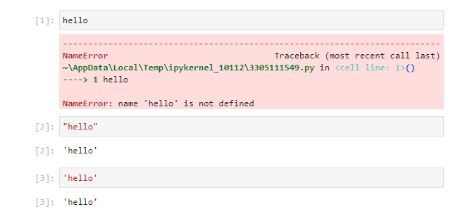

Note that text contained as part of a ```str``` must be enclosed in either a set of double quotations ```" "``` or single quotations ```' '```. For example

```
"hello"
'hello'
```

When text is not enclosed in quotations Python looks for an inbuilt object name, or an object assigned by the user. For example when:

```
hello
```

is input. Python displays an error because the object ```hello``` does not exist. This can be verified by looking at the variable inspector which can be accessed by right clicking empty space within the JupyterLab notebook file. This requires the JupyterLab Variable Inspector extension to be installed:

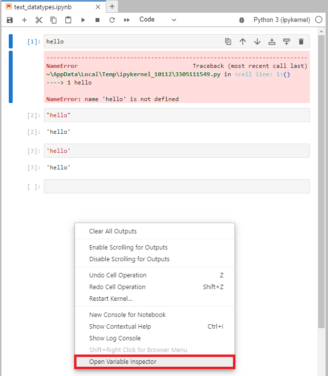

In this example the variable inspector is blank:

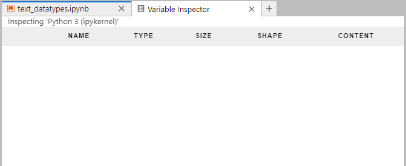

### the assignment operator =

In Python ```=``` is known as the assignment operator. This is used to assign the value on the right to the object name on the left. 

```
hello = "hi"
```

Note that this operator has a different meaning to equals in mathematics:

```
1 + 2 = 3
```

Notice that when the following is used:

```
hello = "hi"
```

that the output of the cell becomes blank. The value ```"hi"``` on the right hand side is instead stored inside the variable or object name ```hello``` and the values stored to variable names are not displayed as a cell output by default.


In the Variable Inspector, the variable name ```hello``` contains the content ```"hi"``` which is of the type ```str```:


Now notice, when the first cell is run again that there is now no error message. This is because the variable name ```hello``` now exists. The cell outputs the value that is stored within this variable:

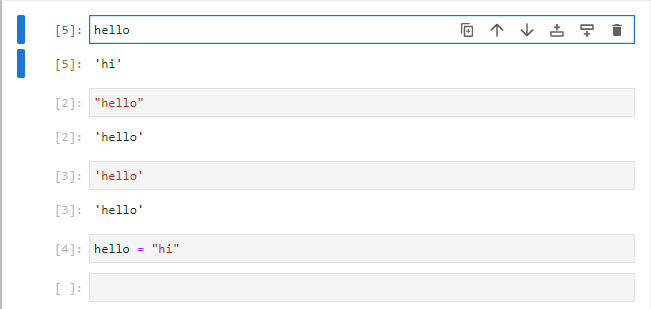

Notice that the ```[1]``` which was previously at the side of this cell has been updated to ```[5]``` indicating this is the 5th cell to be ran. Note it is usually bad practice to run cells out of order in an interactive notebook file as it can result in confusion when the notebook file is closed and reopened. Typically when a notebook file is reopened, the kernel is restarted and the cells are ran in descending order.

The *assignment operator* ```=``` is not to be confused with the *is equal* to operator ```==``` which checks to see if the value on the left is equal to the value on the right. The following will yield ```True``` and ```False``` respectively:

```
"hi" == "hi"
"hi" == "bye"
``` 

variable names and strings are case sensitive meaning the following condition is ```False```:

```
"hi" == "Hi"
``` 

In Python the convention is to use variable names that are only lower case. Variable names should not contain special characters with the exception to the underscore ```_```. Moreover variable names should be descriptive where possible so the user knows what each variable name corresponds to. For example:

```
greeting = "hi"
```

Note that the value in a variable can be reassigned at a latter date:

```
greeting = "hello"
```

A constant, is a variable which has an initial value that is never intended to be reassigned. To denote a constant, all capital letters are used. For example;

```
ALWAYS_HI = "hi"
```

### the del function

The function ```del```, can be used to delete a variable. The variable name to be deleted is enclosed in parenthesis ```( )```.

For example:

```
del(hello)
```


Notice that the variable no longer displays in the variable inspector:

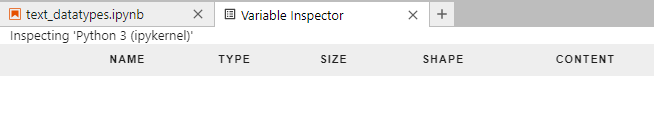

If the first cell is ran again which tries to reference this variable, once again get the ```hello is not found``` error message displays:

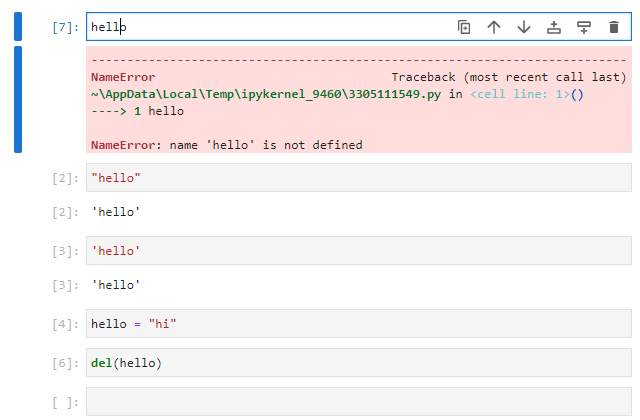

### the print function

Recall when a variable is assigned to a variable name, there is no cell output, this is because the output is assigned to the variable name instead of the output of the cell which occurs when no other assignment is used:

```
greeting = "hello"
```

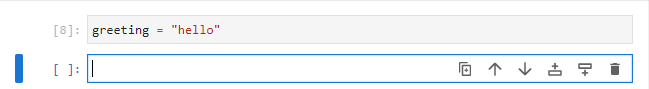

The function ```print```, can be used to print a variable. The variable name to be printed is enclosed in parenthesis ```( )```.

For example:

```
print(greeting)
```

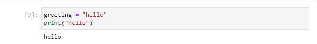

Notice that the output above prints the formatted text of the string. The quotations used to enclose the contents of the string or any other punctuation marks are not shown. Compare this to:

```
greeting
```

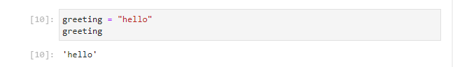

The print function can also be used to print strings directly.

```
print("hi")
```

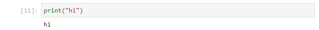

### formatted strings

Sometimes we will wish to include a variable within a print statement. This is typically done with a formatted string. A formatted string is prepended with ```f``` and a pair of braces```{ }``` are used to enclose each variable name. For example:

```
print(f"He said {greeting}")
```

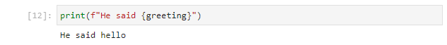

```
greeting = "hello"
farewell = "bye"
print(f"He said {greeting}, she said {farewell}")
```

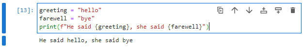

Notice the syntax highlighting on JupyterLab makes it clear that ```greeting``` and ```farewell``` are objects.

### escape characters

Notice that when:

```
'Philip's'
```

is type we get an error.

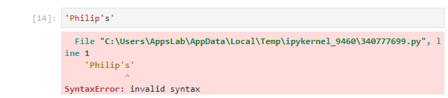

The reason behind this is clearly seen in the syntax highlighting in JupyterLab. ```'Philip'``` is seen to be a string ```s``` is seen to be a variable and ```'``` is not matched up.

This can be resolved by enclosing this string using double quotations:

```
"Philip's"
```

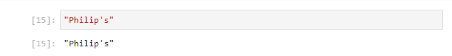

Likewise a string containing a double quote can be enclosed in single quotations. 

If the string is long and contains both a single and double quotation it is recommended to instead use an escape character. The ```\``` character in a string indicates that the next character to be inserted is an escape character. For example to input a ```'``` we would use ```\'```:

```
'Philip'\s'
```

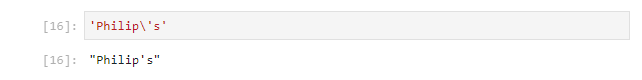

There are some additional important escape characters:

* ```\'``` inserts a single quote
* ```\"``` inserts a double quote
* ```\n``` inserts a newline 
* ```\t``` inserts a tab
* ```\\``` inserts a \

For example we can use:

```
print("Hello")
print("Hello\n")
print("Hello")
print("\tHello")
```

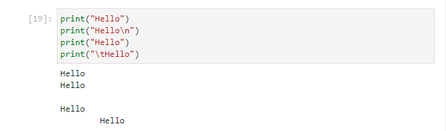

If we type in the function ```print(``` with open parenthesis and press shift ```⇧``` and tab ```↹``` we can see details about its docstring.

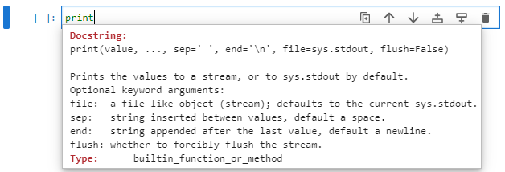

If we have a look at:

```
print(value, ..., sep=' ', end='\n')
```

We can see that there are a variable number of positional input arguments ```value, ...``` and so we can print hello twice using:

```
print("Hello", "Hello")
```

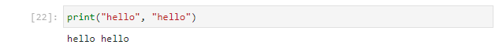

There are also two keyword input arguments ```sep=' ', end='\n'``` which are assigned to a default value fo a space and a new line. The default value can be assigned to a custom value for example to two tabs and three spaces respectively:

```
print("hello", "hello", sep='\t\t', end='\n\n\n')
```

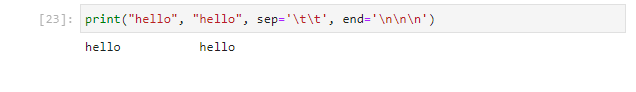

### relative strings

The ```\``` key can be used to insert ```\``` into a string as an escape character. The 1st character indicates insertion of an escape character and the second character indicates that the escape character is ```\```:

```
print("\\")
```

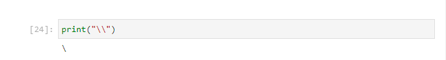

For a file path this can be done multiple times, for example:

```
print("C:\\Windows\\System32")
```

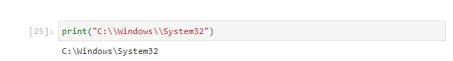

However this becomes tedious for longer filepaths. In such a case  relative string can be used. The relative string is prefixed with ```r``` and any ```\``` in the string is duplicated:

```
print(r"C:\Windows\System32")
```

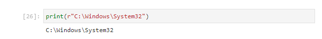

### string functions

If we have a look in the variable inspector we see the two string variables ```farewell``` and ```greeting```

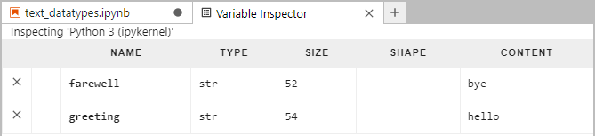


If we type in one of these variable names followed by a dot ```.``` and tab ```↹``` we can see a number of functions we can call from it. We can scroll through this list and from the names see that most of these functions are related to looking up properties of the text object or manipulating the text:

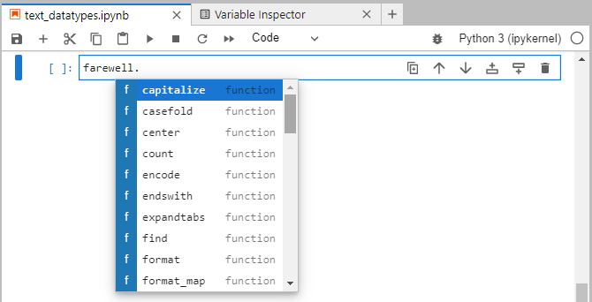

If we type in the function name with open parenthesis and press shift ```⇧``` and tab ```↹``` we can see details about its docstring. For example in the function capitalize, we see there are no input arguments:

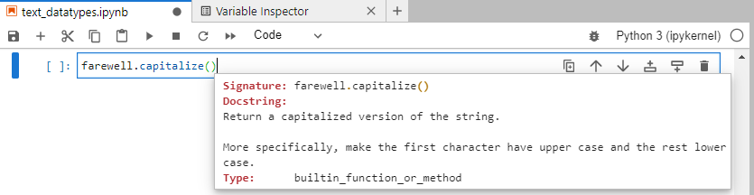

capitalize is one of the most basic string functions, alongside upper, lower and title which as the names suggest manipulate the text to return the string in capital, upper, lower and title case respectively:

```
farewell
farewell.capitalize()
farewell.upper()
farewell.lower()
farewell.title()
```

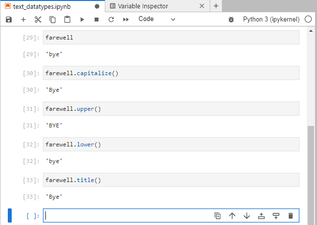

Notice that the string variable ```greeting``` has the exact same string functions available to it:

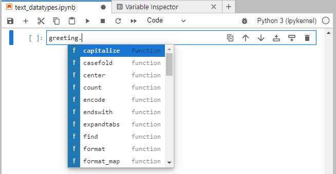

### special string functions 

The string function has a special method ```__add__```. This special function does not display when we type in the variable name and press ```.``` and tab ```↹```. However if we type in the function name with open parenthesis and press shift ```⇧``` and tab ```↹``` we can see details about its docstring. In this case we see we have a single positional input argument ```value```:

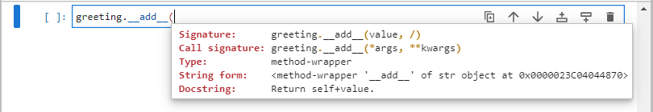

We can use this method to add the string value to the string we are calling the function from. For example:

```
greeting.__add__(farewell)
```

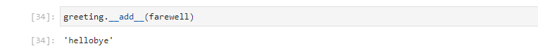

Notice that the text of the 1st string is immediately followed by the text of the 2nd string and there is no spacing. This is known as concatenation.

Because concatenation of strings is so commonly carried out it uses the special function ```__add__```which is mapped to the ```+``` operator. This means the following two lines of code are equivalent:

```
greeting.__add__(farewell)
greeting + farewell
```

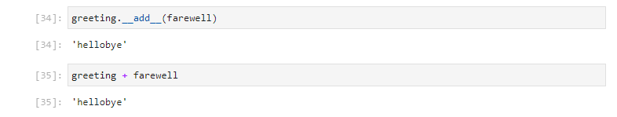

And therefore if we wanted a space between the two words, we could easily use:

```
greeting + " " + farewell
```

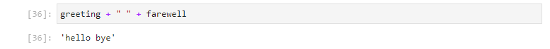

## numeric variables

### integers and floating point numbers

There are two types of numeric datatypes, an int which is an abbreviation for an integer and is a discrete full number and there is a float which is an abbreviation for floating point number.

We can assign four variables to numeric values using:
```
num1 = 1
num2 = 3.14
num3 = 3.0
num4 = 3.
```

We can see in the Variable Inspector that any number which includes a ```.``` in its value is assigned to a float.

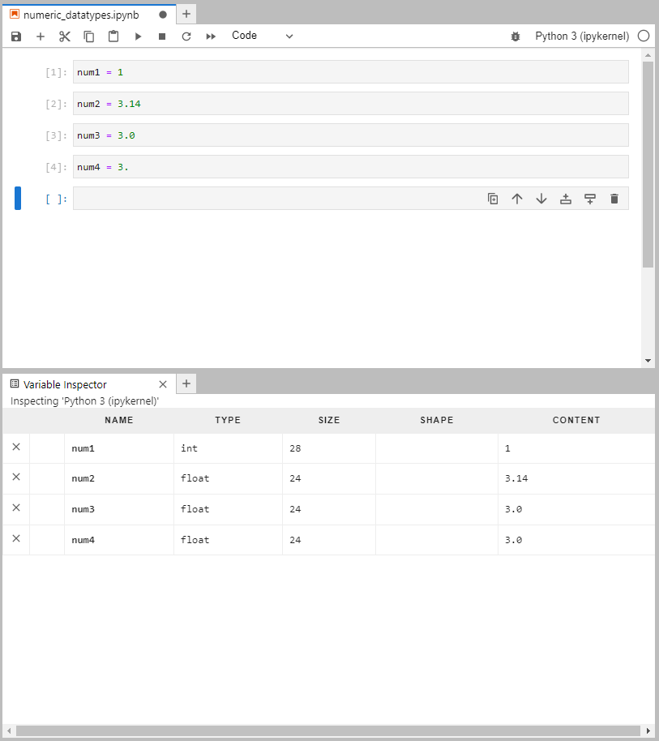

### numeric functions

Like strings, numbers have a number of functions which can be accessed by typing in the numbers variable name followed by a dot ```.``` and tab ```↹```:


### special numeric functions

Most of the functions commonly used with a number are however setup as special numeric methods mapped to an operator. In the case of a number the special numeric method ```__add__``` is mapped to ```+``` performs addition of two numbers. Likewise:

|special function|operator|function|
|---|---|---|
|```__add__```|```+```|adds two numbers|
|```__sub__```|```-```|subtracts two numbers|
|```__mul__```|```*```|multiplies two numbers|
|```__pow__```|```*```|raises the first number to the power of the second number|
|```__floordiv__```|```//```|integer floor division of the first number by the second number|
|```__mod__```|```%```|integer floor remainder of the first number by the second number|
|```__div__```|```/```|float division of the first number by the second number|

**Be careful to distinguish the difference between the string special function ```+``` which performs concatenation of two strings and the numeric special function ```+``` which performs addition of two numbers.**

For example:

```
1 + 2
1 - 2
2 * 3
5 ** 2
6 // 4
6 % 4
6 / 4
```

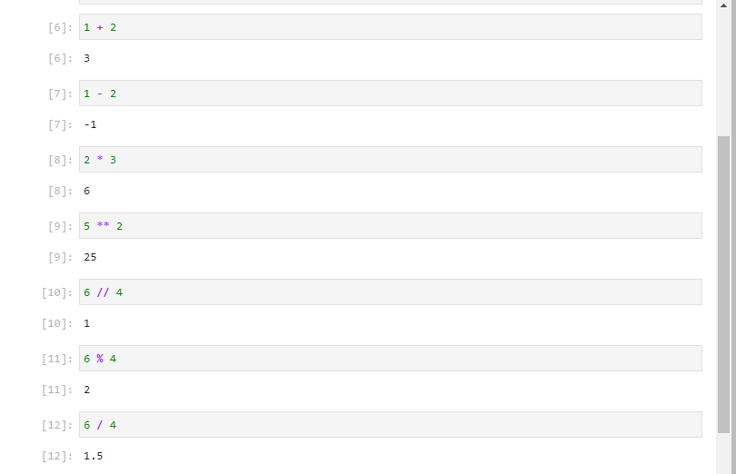

### float precision

The reason numbers are separated out into integers and floating point numbers is due to a computer having a finite number of bytes to store data. floating point numbers are therefore approximated to conserve memory. There can sometimes be unexpected results in calculations due to rounding. For example:

```
0.1 + 0.2
```

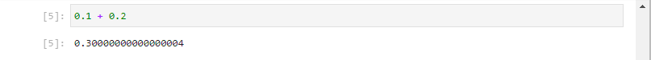

And if we use the is equal to operator ```==``` which checks equality of both sides of the equation we get which might perhaps be an unexpected ```False```

```
0.1 + 0.2 == 0.3
```

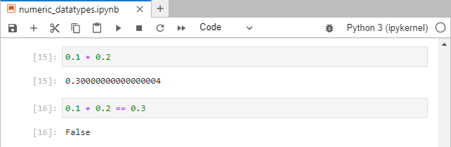

This is because the left hand side of the equation is rounded to be very slightly larger than the right hand side of the equation:

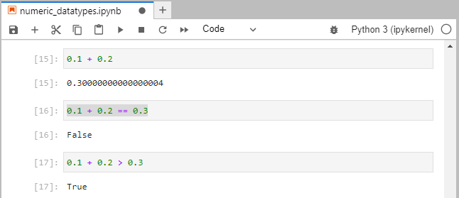

### comparison operators

We have just seen an example of 2 of the comparison operators used to compare two numbers. There are 6 comparison operators in total:

|special function|operator|function|
|---|---|---|
|```__lt__```|```<```|checks if the left hand side is less than the right hand side|
|```__le__```|```<=```|checks if the left hand side is less than or equal to the right hand side|
|```__eq__```|```==```|checks if the left hand side is equal to the right hand side|
|```__neq__```|```!=```|checks if the left hand side is **not** equal to the right hand side|
|```__gt__```|```>```|checks if the left hand side is greater than the right hand side|
|```__ge__```|```>=```|checks if the left hand side is greater than or equal to the right hand side|

### the round function

Python has an inbuilt ```round``` function. If we type in the function name with open parenthesis and press shift ```⇧``` and tab ```↹``` we can see details about its docstring. 


The first positional argument is the number or calculation which yields a number to be rounded and the second is the number of decimal places to specify. Once rounded accordingly, the comparison operator works as one might expect:

```
round(0.1+0.2, 6)
round(0.1+0.2, 6) == 0.3
```


### boolean numbers

The ```bool``` is an abbreviation for boolean and has two values ```False``` or ```True```. We have seen these boolean values when we used the comparison operators above. These two values map to two values of binary integers ```0``` and ```1``` and are therefore considered numeric. For example ```False + True``` can be conceptualised as ```0``` + ```1``` and ```False * True``` can be conceptualised as ```0``` * ```1```:

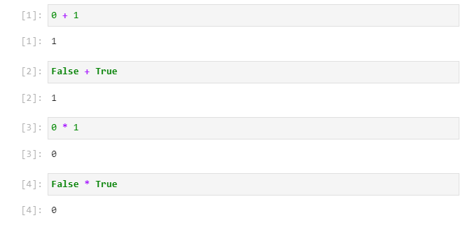

Although boolean values can be used as ```0``` and ```1``` with numeric operators. It is more common to use them with the ```and``` or ```or``` operator which combines the conditions.

condition 1 ```and``` condition 2 will only be ```True``` if both condition 1 **and** condition 2 are ```True```:

```
(True) and (True)
(True) and (False)
(False) and (True)
(False) and (False)
```

condition 1 ```or``` condition 2 will be ```True``` if either condition 1 **or** condition 2 are ```True```:

```
(True) or (True)
(True) or (False)
(False) or (True)
(False) or (False)
```

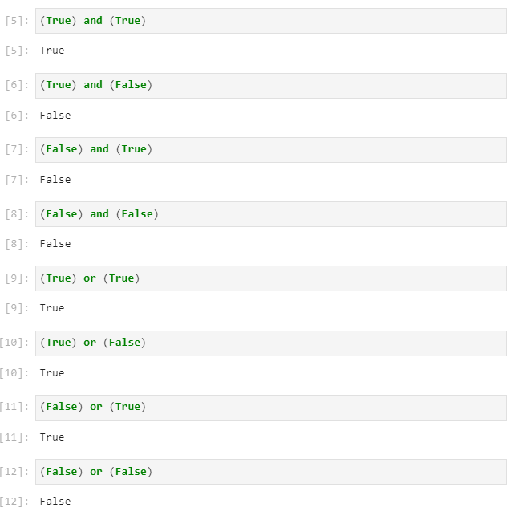

The operator ```not``` will invert a condition:

```
not True
```

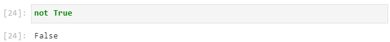

### parenthesis

The following code becomes hard to read. It is not obvious what operation occurs first:
 
```
1 > 5 or 1 < 2
```

When comparing conditions, parenthesis are normally used to enclose each condition:

```
(1 > 5) or (1 < 2)
```

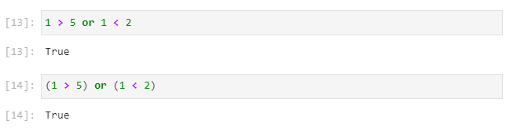

Both expressions are on the left hand side and the right hand side of the or operator are enclosed in single parenthesis therefore it doesn't matter which expression we tackle first:

<pre>
<b>(</b>1 > 5<b>)</b> or (1 < 2)
</pre>

This therefore becomes and we can now tackle the parenthesis on the right hand side:

<pre>
False or <b>(</b>1 < 2<b>)</b>
</pre>

Then:

```
False or True
```

This finally becomes:

```
True
```

Likewise for a more complicated expression, we can use multiple parenthesis:

```
(1 > 2) and ((1 > 5) or (1 < 2))
```

The left hand side is enclosed in single parenthesis right hand side is enclosed in double parenthesis, therefore we tackle the right hand side first:

<pre>
(1 > 2) and <b>(</b>(1 > 5) or (1 < 2)<b>)</b>
</pre>

Then within this double bracket, both conditions around the ```or``` operator are enclosed in single parenthesis, so it doesn't matter which operation we carry out first, so we will start with the left hand side expression:

<pre>
(1 > 2) and (<b>(</b>1 > 5<b>)</b> or (1 < 2))
</pre>

<pre>
(1 > 2) and <b>(</b>False or (1 < 2)<b>)</b>
</pre>

Now this calculated, we can tackle the right hand side expression:

<pre>
(1 > 2) and (False or <b>(</b>1 < 2)<b>)</b>)
</pre>

<pre>
(1 > 2) and (False or True)
</pre>

Now the left and right hand side of the ```and``` operator are enclosed in single parenthesis and it doesn't matter which side we carry out first. We will continue with the right hand side:

<pre>
(1 > 2) and <b>(</b>False or True<b>)</b>
</pre>

<pre>
(1 > 2) and True
</pre>

Now that the right hand side is tackled, we tackle the left hand side which is single parenthesis:

<pre>
<b>(</b>1 > 2<b>)</b> and True
</pre>

<pre>
False and True
</pre>

This finally becomes:

```
False
```

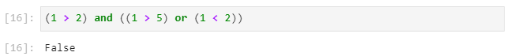

Parenthesis are used to set order of preference for other numeric operations. For example, if you have a look at:

```
1 + 5 * 3
```

If you assume the operators are carried out from left to right, you may calculate:

```
6 * 3
```

Which is:

```
18
```

However by default multiplication and division operations take precedence over addition and subtraction and the result is actually:

```
1 + 15
```

Which is:

```
16
```

The order or precedence can be changed using parenthesis which take the highest precedence:

```
(1 + 5) * 3
```

Is:

```
18
```

And:

```
1 + (5 * 3)
```

Is:

```
16
```

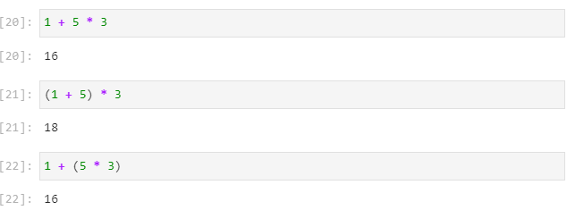

The order of precedence is:
* parenthesis ```( )```
* exponent ```**```
* multiplication ```*```, float division ```/```, floor division ```//```, modulus ```%```
* addition ```+```, subtraction ```-```


## working between numeric and text variables

### indexing

A string can be regarded as a collection of characters. The string "hello" for example has 5 characters. The ```len``` function can be used to determine the number of characters in an inbuilt collection such as a string. For example:

```
len("hello")
```

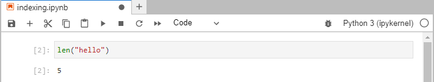

integers are used commonly through Python for tasks such as indexing, in the case of the string "hello" there are 5 characters and we index to select one of these characters using an integer. Notice however that when we use the integer ```1``` we are presented with the second letter in the string ```"e"```.

```
"hello"[1]
```

This is because in Python we count from a lower bound of 0 and go up to but not including the upper bound. If we attempt to index using an integer of ```5``` we are informed that the string index is out of range.

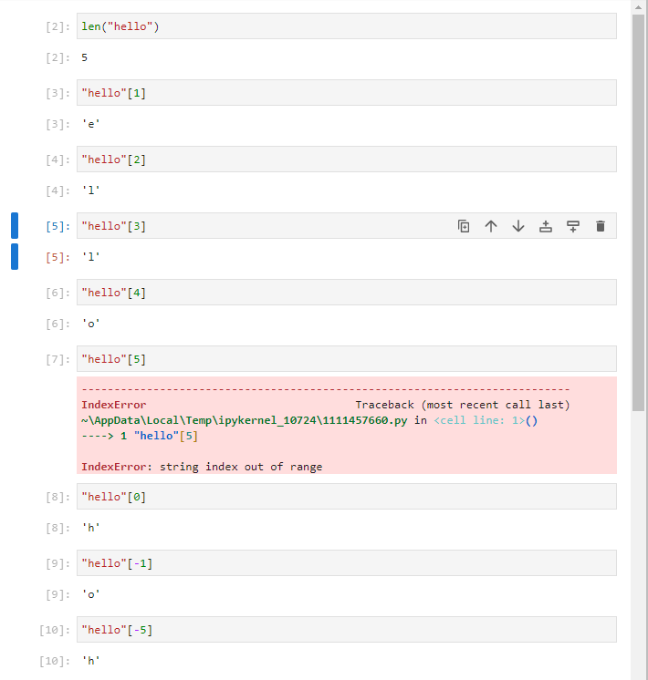

It is possible to index using the negative integer, the value before 0 is ```-1``` giving the last letter of the string ```"o"``` and we can go back to the front of the string by using a value of ```5```, recalling that the length of the string is ```5```. 

```
"hello"[len("hello")-1]
"hello"[-len("hello")]
```

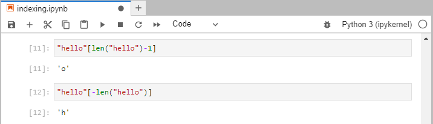

### TypeError

Attempting to add a numeric value to a string will yield a TypeError:

```
5 + "hello"
```

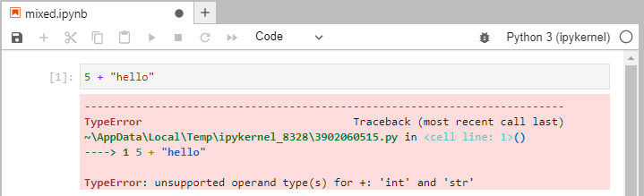

This is because the ```__add__``` method configured for a text datatype performs concatenation and the ```__add__``` method for a numeric datatype performs addition. The operation above is undefined and hence Python doesn't know what to do an returns a TypeError.

There are some operations that can be carried out between a string and an integer value however such as:

```
5 * "hello"
```

which perform string replication:

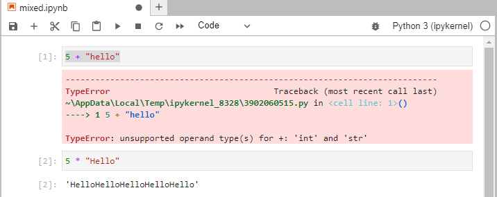

One needs to be careful when working between the different datatypes. This is particularly the case when working with strings that look like numbers:

```
"5" + "5"
```

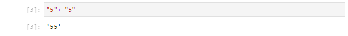

### the input function

The input function always returns a string. If we type in the function ```input(``` with open parenthesis and press shift ```⇧``` and tab ```↹``` we can see details about its docstring.

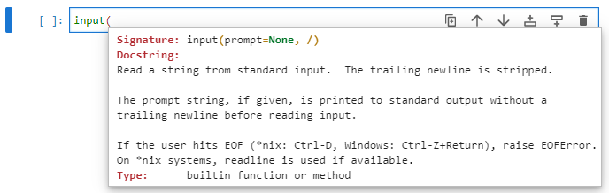

We have an input argument ```prompt``` which we can assign to a string:

```
input("Input your name: ")
```

When this cell is ran, it will wait for user to input some text into the prompt:


I will input ```Philip```:


Notice that I didn't supply quotations but the output of the cell is ```"Philip"```:

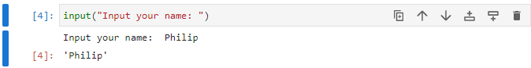

I can assign this output to a variable which I can use within a formatted string within the print function:

```
name = input("Input your name: ")
print(f"Hello {name}")
```


### casting

Updating to prompt for two numbers and attempting to add them will lead to unexpected results. This is because the two numbers are read in as strings and string concatenation is used with he ```+``` operator:

```
num1 = input("Input a number: ")
num2 = input("Input a number: ")
print(f"{num1}+{num2}={num1+num2}")
```


To resolve this we can cast between the datatypes using ```int```, ```float``` and ```str```. Let's update the following code to cast both input strings to integers.

```
num1 = input("Input a number: ") #num1 is a str
num1 = int(num1) #num1 is an int
num2 = input("Input a number: ") #num2 is a str
num2 = int(num2) #num2 is an int
print(f"{num1}+{num2}={num1+num2}")
```


This can be simplified by using:

```
num1 = int(input("Input a number: "))
num2 = int(input("Input a number: "))
print(f"{num1}+{num2}={num1+num2}")
```


### formatted strings with numeric variables

We have seen earlier, how to use a formatted string to include a variable within a string to print. We can include text and numeric variables:

```
a = "hello"
b = 1
c = 1.1
print(f"a is {a}, b is {b} and c is {c}.")
```


Sometimes we wish to further format the way each variable is printed, such as the number of spaces the variable occupies in the case of a string or int and the number of decimal places for a floating point number. We can see the following example has a large number of decimal places:

```
a = "hello"
b = 1
c = 0.1 + 0.2
print(f"a is {a}, b is {b} and c is {c}.")
```


After the variable we can use ```:``` to specify the datatype:

* ```:s``` is a format specifier to format the variable as a ```str```. 
    * The number of spaces can be specified before the format specifier, for example ```:10s``` will indicate that you wish the string to occupy 10 spaces.
    * If prefixed with a 0 trailing zeros will be added after the string.
* ```:d``` is a format specifier for signed decimal integers. 
    * The number of spaces the number can once again be specified before the format specifier, for example ```:5d```. 
    * If prefixed with a 0, trailing zeros will be added.
* ```:f``` is a format specifier for a floating number format. 
    * The number of digits displayed after the decimal point by default is 6. 
    * This can be altered using a ```.``` prefix followed by specification of the number of digits, for example ```:.10f```.
    * The total number of digits can be specified before this ```.```, for example ```:15.10f```
    * If prefixed with a 0, trailing zeros will be added.
* ```:g``` is an adaptive format specifier for a floating number format that will automatically adapt. 
    * This will adapt according to the float displaying the number in standard notation if it is in the range <10000 or >0.0001 and uses scientific notation outwith this range e-4 or <e4 respectively.  
    * If a 0 is placed in front of this number, trailing zeros will be added.
    


Return to:

[Home](../../../)
