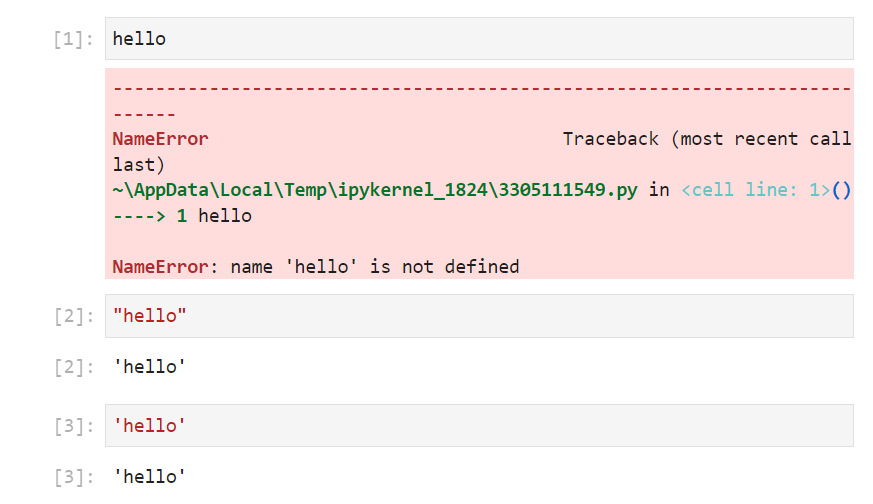
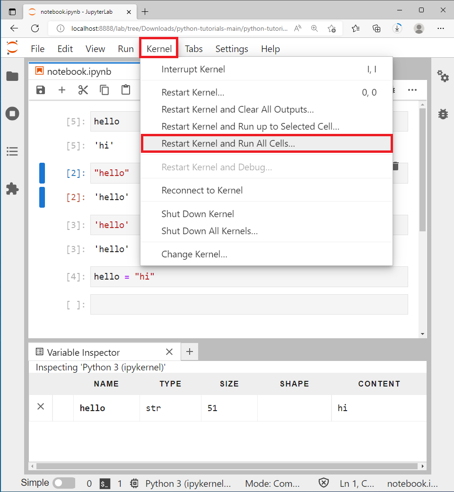
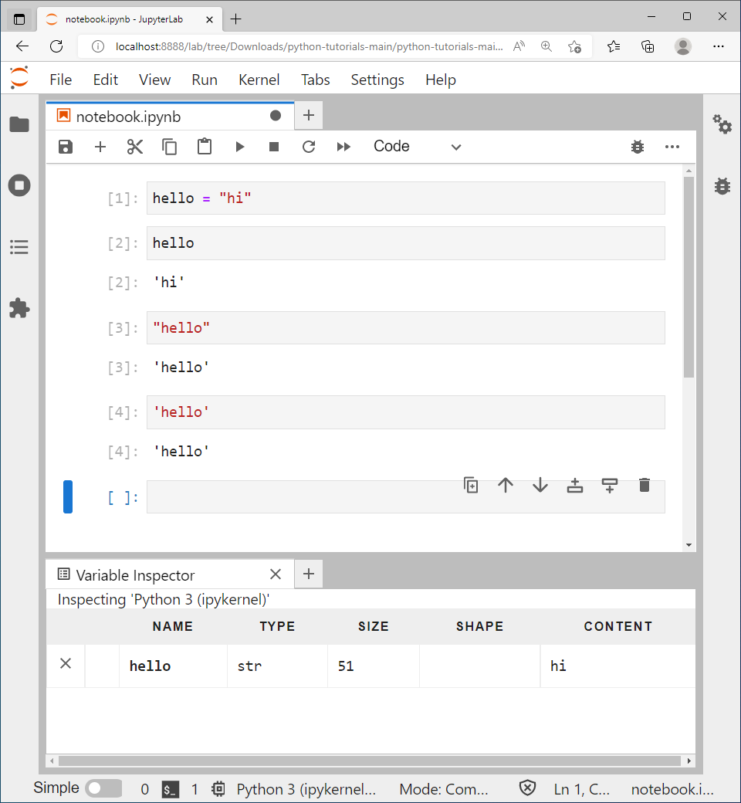
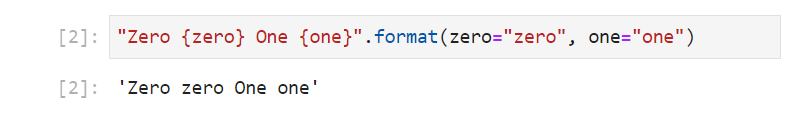
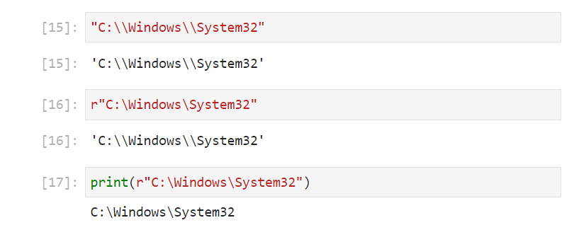
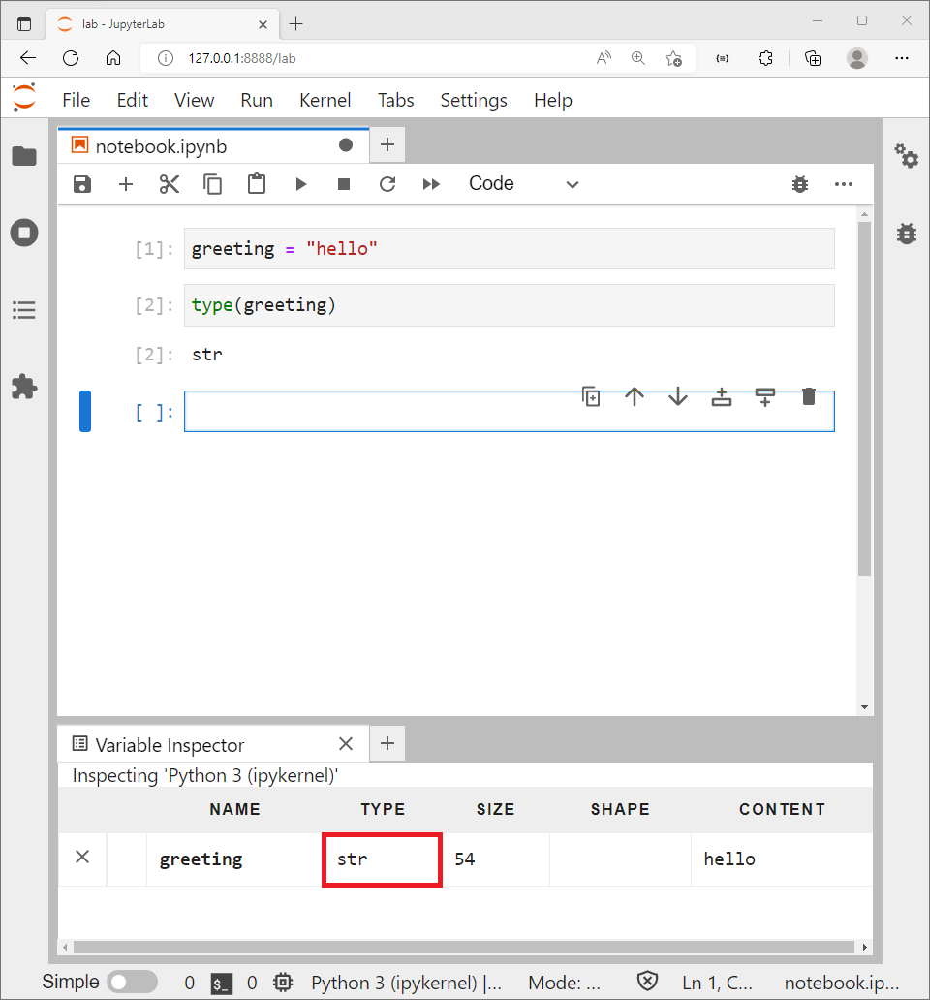
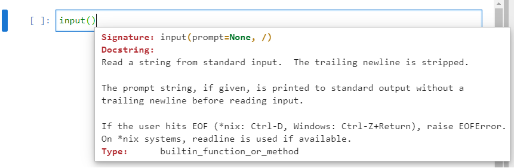
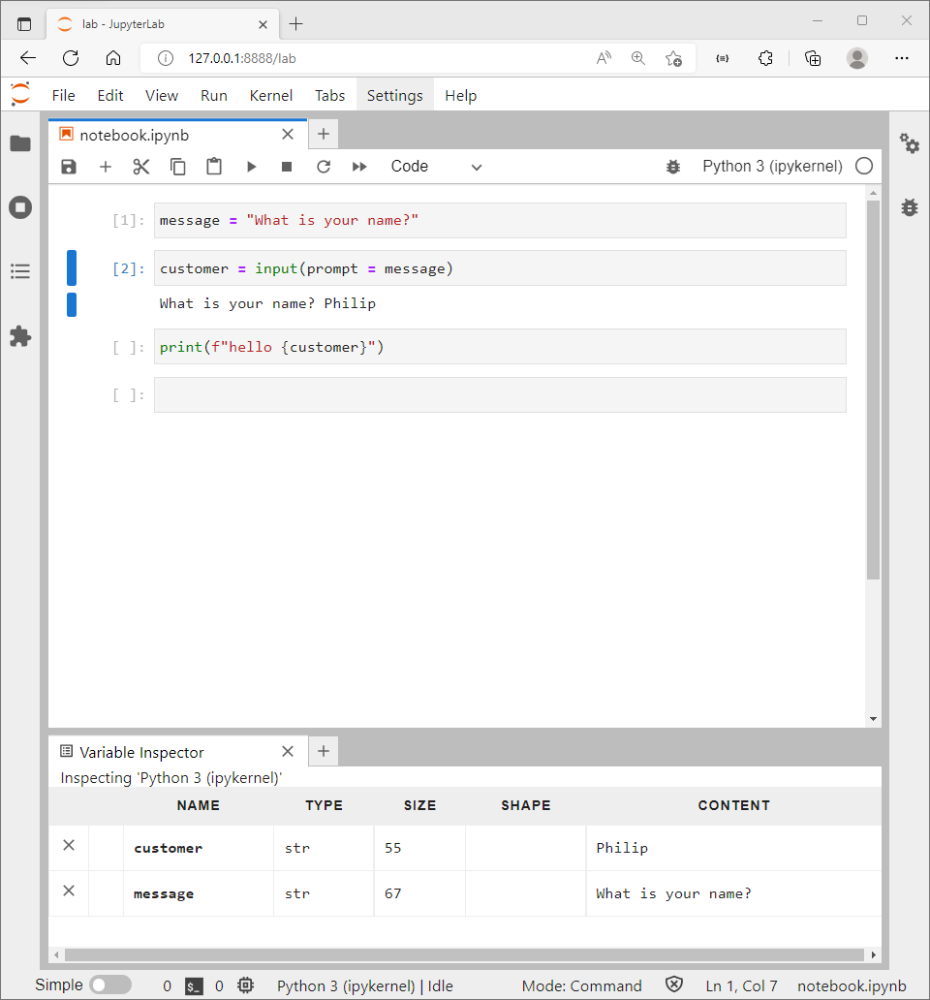
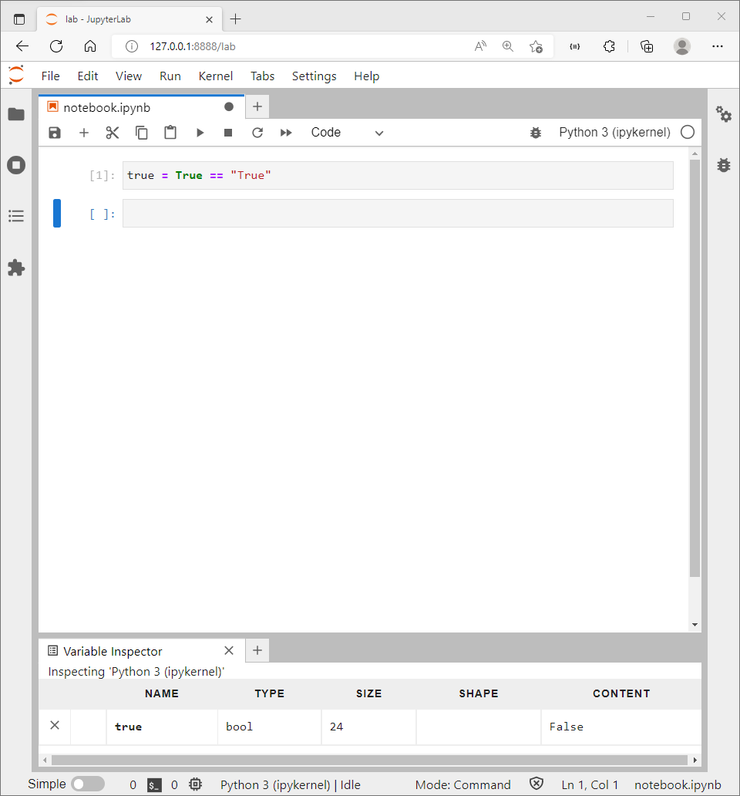

# fundamental datatypes

In python consider the following fundamental types of data:

* text data
* numeric data
  * whole numbers
  * numbers with a decimal point
  
[YoutTube Tutorial](https://www.youtube.com/watch?v=hYQ_IHMYFy0)

## The string class

For the text datatype there is the ```str``` class. ```str``` is an abbreviation for a string of characters.

Note that text contained as part of a string must be enclosed in quotations. 



These quotations can either be a set of double quotations ```" "``` or a set of single quotations ```' '```. For example:

```
"hello"
'hello'
```

When text is not enclosed in quotations Python looks for an inbuilt object name, or an object that has been assigned by the user.

```
hello
```

Python displays a ```NameError``` because it is looking for an object name which does not exist. Objects that the user has created can be found in the variable inspector or variable explorer of the IDE:


In this example, no user defined variables have been assigned so the Variable Inspector is empty:


The Variable Inspector can be repositioned:


A variable can be assigned using:

```
hello = "hi"
```


It is conversely better to conceptualise assignment as a process that occurs from the right to left. The value that is being assigned (or expression that is being calculated and then assigned) is on the right. In this case this is the string ```"hi"```:


In the middle is the assignment operator ```=``` and this should be thought of as *assignment* and not *equals* like used in mathematics:


The variable name otherwise known as the object name the string is being assigned to is on the left hand side. Notice that there are no quotations around an object name:


When this cell is run, no output displays. This is because the output isstored in the variable name ```hello``` and this ca now be seen displayed on the Variable inspector with the name ```hello``` and content or value ```"hi"```:


Now that this object name is assigned, the top cell can be rerun.


Because this object ```hello``` is now assigned, Python looks up this object and displays its value or content. Because this cell has no assignment to a new value. The content or value is displayed in the cell:


Notice tat h top cellnow dislays ```[5]``` opposed to ```[1]``` which indicates the order each cell was run in the Python Kernel. This cell as ran twice at ```[1]``` and ```[5]``` but only the last run is displayed.

It is really bad practice to place cells in an interactive notebook out of order. Normally when a notebook is reopened, the user will for to Kernel → Restart Kernel and Run All Cells...



In this configuration, executing the top cell will once again result in a ```NameError``` and halt the kernel from running any further cells:


The cell which assigned the variable ```hello``` can be repositioned to the top:


Now Restarting the Kernel and running all cells works without any errors as expected:




The *assignment operator* ```=``` should not be confused with the *is equal* to operator ```==``` which checks to see if the value on the right is equal to the value on the left. 

```
"hi" == "hi"
"hi" == "bye"
``` 


The following will yield ```True``` and ```False``` respectively. Notice that ```True``` and ```False``` do not include quottions as they are not strings but are another data type known as a ```bool```. Notice that they and are also capitalised. 

Python is case sensitive, so the following strings are not equal:

```
"hello" == "Hello"
``` 


In addition if the variable ```hello``` is assgned but ```Hello``` is requested, a ```NameError``` will display:

```
hello = "hi"
Hello
``` 


Sometimes *is equal* ```==``` is used in conjunction to *assignment* ```=```. In this case it is once again useful to conceptualise this as a process that occurs from the right to left.

```
var = "hi" == "bye"
```

To the right the equality operator is used to compare the two strings. Because they are not the same, this returns the value ```False```.


The assignment operator ```=``` then assigns this value ```False```


To the variable name or object name ```var``` on the left:


When this cell is ran, there is no output displayed because the value ```False``` has been assigned to the variable anme or object name ```var```. This displays in the variable inspector:


Python has naming conventions for variables:

* variable names should have only lower case characters
* numbers can be included in variable names but variable names cannot start with numbers
* no special characters or spaces should be used in a variable name. The only special character that can be used in a variable name is the underscore ```_``` which is used in place of a space
* variable names should be concise but descriptive

Examples include:

```
greeting = "hi"
greeting1 = "hello"
greeting_1 = "howdy"
```

A variable can be assigned: 

```
greeting = "hi"
```


It can also be assigned again also know as reassignment:

```
greeting = "howdy"
```


It can be reassigned again:

```
greeting = "hello"
```


Notice that only the last value of the variable is stored and all previous values are disregarded.

A variable that is assigned to a value that is never intended to change is known as a constant. Constant names should be in all capitals:

```
GREETING = "hi"
```


Python won't stop reassignment of a constant like other programming languages however it should be clear to another programmer that a variable name in all capitals is designed to be a constant.

If a string variable name is input followed by a dot ```.``` and tab ```↹```, a list of identifiers that can be called from a string display:


These identifiers originate from the class string:


The assignment operator ```=``` is used to assign instances of the string class to variable or object or instance names. This process is known as instantiation.

Another string can be instantiated using:

```
farewell = "bye"
```

In this case , the string is ```"bye"``` and is assigned to the instance name ```farewell```.

Notice on the variable inspector that both ```farewell``` and ```greeting``` are instances of the string class.

If ```farewell``` is input followed by a dot ```.``` and tab ```↹```, the same list of identifiers display:


A method is essentially a function that is defined within the class. In this case the string class. If the following is input, the function is referenced:

```
farewell.capitalize
```


Functions can also be called. To call a function use parenthesis after the function name. The parenthesis should enclose any input arguments expected by the string.

```
farewell.capitalize()
```

Once parenthesis are supplied pressing shift ```⇧``` and tab ```↹``` can be used to view the functions docstring as a popup balloon:


The docstring gives details about the input arguments, in the case of the string methods, many of the functions don't require input arguments because the data the functions act upon is provided in the instance. In this case the data is the text ```"bye"``` and the string method ```capitalize"``` will act upon it to return the output string ```"Bye"```:


The string methods ```upper```, ```lower```, ```title``` all work in a similar manner to ```captilize``` returning an uppercase, lowercase, titlecase and capitalized version of the string. This can be demonstrated by using the string:

```
greeting = "hello world!"
greeting.upper()
greeting.lower()
greeting.title()
greeting.capitalize()
```


The string method ```casefold``` is similar to the string method ```lower``` but is more aggressive and may be required when dealing with non-English characters:


Other functions require input arguments. Input arguments can be positional where they are supplied in order or keyword where they are assigned to a temporary variable name within the function. Most of the string methods use either no input arguments, operating only on the instance data or use positional input arguments.

The string method in the simplest case uses two mandatory positional arguments. ```old``` should be a substring within the original string greeting and ```new``` should be a new substring:


For example:

```
greeting = "hello world!"
greeting.replace("hello", "bye")
```


Notice that when the string methods ```upper```, ```lower```. ```title```, ```capitalize``` and ```replace``` were used that a new string was returned to the cell output. The original string wasn't modified which can be verified by looking at the variable explorer. The returned string can be reassigned to the variable name using the *assignment operator* ```=```.

```
greeting = "hello world!"
greeting = greeting.replace("hello", "bye")
```

Once again consider the *assignment operator* as acting from the right hand side to the left hand side. On the right, the original version of ```greeting``` that has a value ```"hello world!``` is used and the replace method returns ```"bye world!"```. This return value is then reassigned to the variable name ```greeting``` on the left. Because the object on the right is assigned to a variable name, no cell output displays however examination of the variable inspector shows ```greeting``` has an update content or value as expected:


The string method ```startswith``` has the option to use one, two or three positional input arguments. In the simplest case, the single positional input argument is ```prefix``` which is a substring:


```
greeting = "hello world!"
greeting.startswith("hello")
greeting.startswith("world")
```

Once again a boolean value of ```True``` or ```False``` displays:


A boolean value is also returned for the string methods ```islower```, ```isupper```, ```istitle```, ```isspace``` which don't require any input arguments and examine the instance text data to examine whether the text is lowercase, is uppercase, is titlecase, is a space or spaces.

The string method ```format``` has ```*args``` and ```**kwargs``` as input arguments, meaning it can take in a variable number of either positional or input arguments:


This method essentially allows one to create a formatted string. Variables can be inserted into the string using numeric placeholders, braces are used within the string to denote a placeholder ```{ }```. The string has to have a corresponding number of positional input arguments for each placeholder present in the string:

```
"Zero {0} One {1}".format("zero", "one")
```


Alternatively named placeholders can be created. The name of the placeholders are provided as keyword input arguments that are assigned to a value when calling the ```format``` method:



It is possible to create a formatted string using the f-string syntax. The quotations in the string are prepended with f and the variable names are provided as variable names within the placeholder.

Two variables can be created:

```
greeting = "hello"
customer = "world"
```

These variables can be supplied as positional input arguments with numeric placeholders using the ```format``` method:

```
"{0} {1}!".format(greeting, customer)
```

These variables (on the right hand side) can be assigned to the keyword input arguments (left hand side) within the parenthesis of the ```format``` method. These keyword input arguments are then accessible within the string as placeholders and get replaced by the values of the keyword input arguments which becomes the value of the variables.

```
"{greeting} {customer}!".format(greeting=greeting, 
                                customer=customer)
```

The fstring prepends the string with ```f``` and placeholders can be used directly to contain existing variable names:

```
f"{greeting} {customer}!"
```


So far all the strings created have been alphanumerical only. It is possible to create a string which has symbols. However some of the symbols are recognised by Python as code. Quotations ```" "``` or ```' '``` are recognised as special characters which denote the beginning and end of a string. Notice the syntax highlighting above uses the first set of quotations to make a string. Python is then seen as an object name and then there is an empty string.


It is possible to use these to use an outer set of quotations to create a string which contains one of the other quotations.


To include both sets of quotations within a string, an escape character is required. 


The symbol ```\``` is used to insert an escape character. ```\"``` denotes the ```"``` is to be inserted as an escape character in the string.


When a string is outputted to a cell, its representation is displayed which is essentially the syntax required to recreate the string. The ```print``` function can be used to print the string which will display what the string looks like once formatting is applied. ```print``` is an inbuilt function and is designed to work with multiple object types such as strings or numeric datatypes. It is used directly and the object to be printed is supplied as a positional input argument.

This differs from the string method ```capitalize``` which is designed to only work with string datatypes and is therefore called from a string.


Inputting the ```print``` function followed by parenthesis and pressing shift ```⇧``` and tab ```↹``` will once again view the functions docstring as a popup balloon:


The ```value``` and ```...``` indicate that a variable number of input arguments can be supplied. 

The keyword input argument ```sep``` an abbreviation for seperator is assigned to ```" "``` a single space and ```end``` is assigned to ```"\n"``` which means an escape charater is inserted and in this case ```n``` is an escape character for a new line.

The keyword input arguments have default values ```sep=" "``` and ```end="\n"```. When they are not supplied the print function will print with default behaviour.

```
print("hello", "world")
print("hello", "world")
print("hello", "world")
```

The values however can be overidden which will change the behaviour of the print function or that single call. For example to end with a new line and then tab and to print with no spaces between input arguments:

```
print("hello", "world", end="\n\t")
print("hello", "world")
print("hello", "world", sep="")
```


The character ```\``` is used to insert an escape character but is also used in a file path for example ```C:\Windows```. To insert ```\``` as an escape character use ```\\```, recall the first ```\``` means insert an escape character and the second ```\``` indicates the escape character to be inserted. Once again observe the difference between the cell output which shows the representation of the string with instructions to reproduce the string with the print statement which displays the formatted version of the string:

```
"C:\\Windows"
print("C:\\Windows")
```


Because file paths are copied and pasted frequently, it becomes cumbersome to replace every instance of ```\``` with ```\\```. 

```
"C:\\Windows\\System32"
```

A relative string or rstring prepends the string with ```r``` and every ```\``` supplied is taken to be a ```\\```.

```
"C:\\Windows\\System32"
r"C:\Windows\System32"
print(r"C:\Windows\System32")
```



The ```type``` class can be used to return the class of a variable. A class has a docstring, similar to a function which can be accessed by typing in the class name and pressing shift ```⇧``` and tab ```↹```:


In this case, the positional input argument is an ```object```. The type of the object name ```greeting``` can be examined:

```
type(greeting)
```



This can be used in conjunction with the *is equal to* operator to check if ```greeting``` is of the type string:

```
type(greeting) == str
```


The ```del``` statement is an abbreviation for delete and can be used to delete object names. For example the variables ```greeting``` and ```farewell``` can be assigned and display on the variable inspector:

```
greeting = "hello"
farewell = "bye"
```


The ```del``` statement can be used to delete one or multiple variables:

```
del greeting, farewell
```

These are now deleted and do not display in the variable inspector.


```del``` is a statement. A statement is not called, and for this reason, there is no parenthesis enclosing the variable names to be deleted. A statement can also not be assigned to a value like a function is.

In Python, parenthesis are used to denote the order of operations. If a string is enclosed in parenthesis, there is no order of operations, so the string is just displayed as normal:


The ```del``` statement can therefore be used with parenthesis and carries out the same operation. 


It is however recommended to use a statement without parenthesis to make it clear a statement is used opposed to a function.

The ```dir``` function, an abbreviation for directory will look within the directory of an object and list all of the identifiers of the object. Once again the docstring can be examined by typing in the function followed by open parenthesis and shift ```⇧``` and tab ```↹```:


Notice the similarity between the list of identifiers when inputting the object name followed by a dot ```.``` and tab ```↹```:


However scrolling up reveals a number of additional identifiers that are hidden from the former menu:


These identifiers begin and end with a double underscore and are known as datamodel identifiers or colloquially as double underscore identifiers or dunder identifiers.

It is not common to use these identifiers directly as their behaviour normally maps to an inbuilt function. For example the datamodel method ```__dir__``` maps to the function ```dir```.

```
greeting.__dir__()
dir(greeting)
```


The datamodel identifier ```__class__``` maps to the class ```type```:

```
greeting.__class__
type(greeting)
```


The datamodel method ```__repr__``` is an abbreviation for representation and displays the object as a string. When used with the print function, the string that displays is the string that is required to be input to recreate this string. The associated datamodel method ```__str__``` when used with the print function, displays the formatted version of the string. These two datamodel methods are subtly different and often confused. The difference between them can be demonstrated using a relative string of a file path:

```
file_path = r"C:\Windows"
file_path.__repr__()
print(file_path.__repr__())
file_path.__str__()
print(file_path.__str__())
```


The datamodel identifier ```__doc__``` returns the docstring of the object as text. It is more commonly used with the ```?``` statement or the ```help``` function:

```
greeting = "hello"
greeting.__doc__
? greeting
help(greeting)
```


The datamodel method ```__add__``` is assigned to the operator ```+```. This datamodel method requires two strings. The string ```self``` and the string ```other```. When ```self``` is added to ```other``` the contents or value of ```self``` is concatenated with the contents or value of ```other```. For example:

```
greeting = "hello"
who = "world"
greeting.__add__(who)
greeting + who
```


Note that when string concatenation is used, there is no space added between the strings. To get a space, it should also be concatenated.

```
greeting + " " + who
```


Concatenation can be used in conjunction with the string methods:

```
greeting.capitalize() + " " + who.upper()
```


## The integer class

An integer is a whole number without any decimal point or fractional component. Numbers can be assigned to variable names, in a similar manner to strings:

```
one = 1
two = 2
```

Notice that the variable inspector is now updated to display the strings. The content or value is the numeric value and the type is ```int``` an abbreviation for integer.


The inbuilt class ```type```, statement ```del``` and functions ```print``` and ```dir``` are not tied to work with a specific class and are designed to work with all class types.  


If an instance name is input followed by a dot ```.``` and tab ```↹```, a list of identifiers available from the object display. Notice that all the names of these sound like they are numeric based. This is in contrast to the list of identifiers from a string which sounded like they were text based. In this list of identifiers are methods; functions called from an instance of a class and attributes; objects that are referenced with respect to another object. 


These originate from the int class itself:


An attibute can be thought of as a property which is a piece of data that belongs to the instance i.e. is instance specific data while a method is generally a function that operates on such data.

In mathematics the square root of ```-1``` is undefined using conventional real numbers so an imaginary component is added to account for this case. In Python the imaginary component is indicated with the symbol ```j``` and ```j``` multipled by ```j``` is equal to ```-1```.

A complex number can be created using:

```
complex_num = 1 + 2j
```

The real and imaginary components are properties which belong to this instance and can be read off using the attribtues ```real``` and ```imag``` respectively.

```
complex_num.real
complex_num.imag
```

The method ```conjugate``` takes no input arguments and acts upon these two existing attributes to return the complex conjugate, which has the same real component but the sign of the imaginary component is reversed:

```
complex_num.conjugate()
```


Notice that attributes are objects while methods are functions. objects are referenced and functions can be referenced or called. When referencing, no parenthesis are included. When calling parenthesis are required to enclose any input arguments. The method ```complex``` has none as it uses existing attributes and needs no additional data. Other methods will require additional data in order to be called.

If the integer instance name is input followed by a dot ```.``` and tab ```↹``` only a small numer of identifiers display:


In constrast if the ```dir``` function is used, a large number of identifiers display. 


Most of these additional identifiers are datamodel identifiers.


```__dir__``` maps to the function ```dir```, ```__doc__``` to the statement ```?```, ```__class__``` maps to the class ```type``` and ```__repr__``` and ```__str__``` give the string representation of the integer (and are identical in this case as integers do not possess anything analogous to escape characters):


Most interactions between two integers use operators. In the case of an integer, the ```+``` operator performs numeric addition, this is because the ```__add__``` method gives instructions for numeric addition and this differs from the instructions in the ```__add__``` method for a string which recall instead performs string concatenation. In other words although both datatypes use the same operator, the instructions behind the operator is different and therefore the operator serves a different purpose in each class. Integers also have other mathematic operators defined such as ```-``` using the ```__sub__``` datamodel method and ```*``` using the ```__mul__``` datamodel method:

```
one = 1
two = 2
one.__add__(two)
one + two
one.__sub__(two)
one - 2
one.__mul__(two)
one * two
```


It is common to use numbers directly with the operators. The ```__floordiv__``` and the ```__mod__``` datamodel method perform integer floor division alongside a corresponding modulus (also known as a remainder). These datamodel methods map to the operators ```//``` and ```%``` respectively.

```
6 + 2
6 - 2
6 * 2
6 // 4
6 % 4
```


A string is an iterable collection of discrete characters with each character in the string consisting of a one character string itself. 


The string has an associated index and each character can be accessed by referencing the string name followed by the index enclosed in square brackets ```[]```. This is known as indexing. In Python **zero-order** indexing is used. The **first** index is **0** and is **inclusive**. Counting occurs **from 0** and up to but **excluding** the **length of the string**:

```
greeting = "hello"
len(greeting)
greeting[0]
greeting[1]
greeting[2]
greeting[3]
greeting[4]
greeting[5]
```


The ```len``` function is an inbuilt function which returns the length of a collection: 


The return value of this function is an integer.

Care should be taken when working with different datatypes, especially when one datatype looks like another datatype. An example can be made comparing the function of the ```+``` operator with strings and integer data:

```
"hello" + "world"
2 + 2
"2" + "2"
2 + "2"
```

Notice in the third case that there are quotations around the numbers which make them strings. These strings which look like numbers can be dangerous and concatenation can be erroneously carried out instead of addition. In the case where a string that looks like a number is added to an actual number, a ```TypeError``` message displays as there is no functionality added to the ```+``` operator for the case of an integer and a string; it does not make sense to perform concatenation or addition of these two different datatypes:


It does however make sense to multiply these two different datatypes to perform string replication.


The ```input``` function is used to prompt the user for an input. This input is read in as a string (so the user should not provide quotations) andt can be returned to a variable. The keyword input argument for ```input``` is ```prompt``` which is an optional message that displays while waiting for an input:



For example, the message can be:

```
message = "What is your name?"
```


Then a cell with the prompt can be created:

```
customer = input(prompt = message)
```

This cell will run forever indicated with the ```*```.


Until a user interacts with the input by typing something into the dialog box and pressing enter ```↵```:


The variable ```customer``` is created and its value is whatever was input into the dialog box as a string, in this example ```Philip``` was input so the string ```"Philip"``` is stored as the variables content or value.



This can be used later on in the code, for example as a formatted string:

```
print(f"hello {customer}")
```


Care should be taken when using the input statement, when expecting numeric input:

```
message = "Input a number: "
number = input(prompt = message)
number * 2
```


The ```int``` class can be used to cast a string that looks like a number to a number:

```
message = "Input a number: "
number = input(prompt = message)
int(number) * 2
```


It is common to include the inclide the message, input and casting on the same line:

```
number = int(input(prompt = "Input a number: "))
number * 2
```


Many of the string methods return an integer.


Two closely related string methods to indexing are available ```index``` and ```find```. Instead of inputting the numeric value of an index using square brackets and returning a character, a substring is supplied as an input argument and the behaviour by default will return the numeric index of the first instance of this substring. These two functions differ in the event of a failure. ```find``` will return ```-1``` when a substring is not found and ```index``` will raise a ```ValueError```:


In this example the substring being searched for can be a single character.

```
greeting = "hello"
greeting.find("l")
greeting.index("l")
greeting.find("p")
greeting.index("p")
```


The numeric index uses unique integers, however a substring can occur in a string multiple times. The string method ```count``` can be used to count the number of occurances of a substring:


```
greeting = "hello"
greeting.count("h")
greeting.count("l")
greeting.count("p")
```


The four string methods ```find```, ```index```, ```count``` and also ```startswith``` (examined earlier) have the option of using one two or three positional input arguments.

The second positional input argument can be used to change the start numeric index and the third positional input argument can be used to change the end numeric index.

In other words the following expressions are equivalent:

```
greeting = "hello"
greeting.find("l")
greeting.find("l", 0)
greeting.find("l", 0, len(greeting))
```


In the string ```greeting``` which has a value ```"hello"```, ```"h"``` is at index 0. If find is used from the start it will find ```"h"``` and return the index 0. If find is used from a start of 1, then the character ```"h"``` won't be found and find will return the value -1:

```
greeting = "hello"
greeting.find("h")
greeting.find("h", 1)
```

Since ```o``` occurs at the end of the string. A find which includes the end of the string will find the index which is 4. A find which excludes the index will return -1:

```
greeting = "hello"
greeting.find("o")
greeting.find("o", 0, 2)
```

Since ```"l"``` has a count of 2 and the first occurance has an index value of 2. A find can be used for the second occurance by specifying a start of 3. This finds the next occurance which has an index of 3:

```
greeting = "hello"
greeting.find("l")
greeting.find("l", 3)
```


The string method ```isalpha``` an abbreviation for is alphabetical and checks to see if every character in a string belongs in the alphabet (lower or upper case). Special characters such as ```_``` or the space ``` ``` are not regarded as being part of the alphabet.


The string method ```isalnum``` an abbreviation is for alphabetical or numerical checks to see if every character is either an alphabet character or a numeric character. Special characters such as ```_```, ```.``` or the space ``` ``` are not regarded as being a numerical character.


```
greeting = "hello world"
greeting.isalpha()
greeting.isalnum()
num = "24"
num.isalpha()
num.isalnum()
```


The string method ```isascii``` checks to see if all the characters within the string are in the American Standard Code for Information Interchange (ASCII). This is the original subset of 128 characters used to interact with an early computer. These characters include hidden format specifiers which were originally typewritter/printer commands such as backspace, horizontal tab, line feed, vertical tab, form feed, carriage return, shift in, shift out, esc and space. In addition to all of the characters commonly used in the English Language:


The one exception is the ```£``` sign which is used in the UK and not the USA for currency. This was added alongside European accented characters in extended ASCII and eventually a universal character set UTF-8 was established to include characters used for all languages in countries across the world:


The string method ```center``` (American spelling) will centre a string over a number of spaces using a fill character of a space by default. A second positional input argument can be used to replace the fill character with something else:


```
greeting = "hello world!"
greeting.center(20)
greeting.center(20, "*")
```


The string method ```replace``` has an optional positional input argument ```count```.


## The float class

When the ```.``` is used within a number, it is used to indicate a decimal point.  In Python numbers with a decimal point are a different ```class``` known as a ```float``` which is an abbreviation for a floating point number:


If the following four numbers are created:

```
num1 = 1
num2 = 1.1
num3 = 1.0
num4 = 1.
```

On the variable explorer ```num1``` is an ```int``` while ```num2```, ```num3``` and ```num4``` are the type ```float```. 

The list of identifiers from a ```int``` instance:


Is similar to a list of identifiers from a ```float``` instance:


Because both are numeric datatypes. However some of the identifiers from the ```int``` class are missing in the ```float``` class and vice versa. The integer class for example has the attributes ```numerator``` and ```denominator``` because two integers can be used to represent a fraction. In the case of a single integer, which is a whole number or complete fraction, the ```numerator``` is always going to the value of the integer and the ```denominator``` is always going to be 1:

```
num1 = 5
num1.numerator
num1.denominator
```

```numerator``` and ```denominator``` attributes are not accessible in the ```float``` class.


An instance of the ```float``` cannot be used in the place of an instance of an ```int``` class when it comes to operations such as indexing, even if the ```float``` is a whole number.

```
greeting = "hello"
greeting[1]
greeting[1.]
```


The ```int``` class can be used to convert a ```float``` to an ```int``` and the ```float``` class can be used to covnert an ```int``` to a ```float```.

```
greeting = "hello"
1.1
int(1.1)
round(1.1)
greeting[1]
greeting[int(1.1)]
float(1)
```

Pay attention to the presence or absence of the ```.``` in the cell output to determine if the value is an ```int``` or a ```float``` instance.


The ```round``` function will by default convert a ```float``` to an ```int``` but has an optional keyword input argument ```ndigits``` which specifies the number of digits to include past the decimal point:


```
num = 1.23456789
round(num)
round(num, ndigits=3)
```


The ```dir``` function can be used to look at the directory of a ```float``` instance. Like the ``int`` instance, there are a large number of datamodel identifiers that map to inbuilt Python functions or operators.


```+```, ```-```, ```*``` and ```**``` which map to ```__add__```, ```__sub__```, ```__mul___``` and ```__pow__```have the same behaviour as explored earlier with an ```int``` instance.

The inbuilt Python classes ```int```, ```float``` and ```bool``` are mapped to the datamodel methods ```__int__```, ```__float__``` and ```__bool__```.

The inbuilt Python function ```round``` is mapped to the ```__round__``` datamodel method.

The ```/``` operator is mapped to the ```__truediv__``` datamodel and always performs float divisions between two numbers. This method is present for both integer and floating point number instances but always returns a ```float``` instance. 

```
9 // 2
9 % 2
9 / 2
num = 9
num.__truediv__(2)
```


```
8 // 2
8 % 2
8 / 2
```


The datamodel method ```__abs__``` is also present for both integer and float classes and maps to the inbuilt function ```abs```. abs is an abbrviation for absolute number which leaves a positive value unchanged and strips the sign off a negative value.


```
abs(1.2)
abs(-1.2)
```


The *is equal* operator ```==``` was mentioned earlier to prevent confusion with the *assignment* operator ```=```.

```==``` maps to the datamodel method ```__eq__```.

```
num = 1
num.__eq__(1)
num == 1
```


There are another 5 comparison methods.

The *not equal* operator ```!=``` maps to ```__ne__```.


The *greater than* operator ```>``` maps to ```__gt__```.

The *less than* operator ```<``` maps to ```__lt__```.

The *greater than or equal to* operator ```>=``` maps to ```__ge__```.

The *less than or equal to* operator ```<=``` maps to ```__le__```.

Notice the subtle difference between using a greater than versus a greater than or equal to comparison operator:

```
3 > 2
3 > 3
3 >= 3
```


These comparison operators are available for both integers and floating point numbers **however** often yield unexpected results with floating point numbers due to rounding issues.

When the number 10 is divided by 3, recursion occurs. The result is 3.333333333... and if writing the number on a piece of paper, the accuracy is to the last digit specified on the paper. The reason for this recursion is there are only 10 discrete characters used to represent a number.

If this calculation is carried out in Python, the last digit specified is 5:

```
10 / 3
```


Under the hood, a computer stores floating point numbers using bits. A bit can be conceptualised as a light switch that has an off or on state or two digits 0 and 1 known as binary. Because binary is used under the hood and only has two characters, the computer is more prone to rounding errors.

The conditional operators are often more precise than the rounding leading to unexpected results with floating point numbers. For example:

```
1 + 2 == 3
```

is ```True```. But:

```
0.1 + 0.2 == 0.3
```

is ```False```.

Examining:

```
0.1 + 0.2
```

shows a rounding error.

The ```round``` function may be used to round the output of the left hand side to 6 digits past the decimal point:

```
round((0.1 + 0.2), 6) == 0.3
```


Parenthesis are used in Python to indicate the order of preference of operations. Compare:

```
1 + 2 * 3
(1 + 2) * 3
```


By default the multiplication operation has higher precedence and is carried out first. So:

```
1 + 2 * 3
1 + 6
7
```

However with parenthesis:

```
(1 + 2) * 3
3 * 3
9
```

The order of precedence is:

* parenthesis ```( )```
* exponentiation ```**```
* multiplication ```*``` and division ```//```, ```/```, ```%```
* addition ```+``` and subtraction ```-```

## The bool class

Another numeric class that has actually been used before is the ```bool``` class. The ```bool``` class has two values ```False``` and ```True```. Numerically this class can be considered as a binary integer class where ```False``` also has the value 0 and ```True``` has the value 1.

```
True
False
True + False
False + False
True + True
True * False
True * True
False * False
```


Note that the instances are capitalised. Pay attention to the syntax highlighting below.

```
true = True == "True"
```


To the right hand side of the assignment operator, the bool instance ```True``` is compared to the string ```"True"``` for equality. These are different so the result is ```False``` (another bool instance) and assigned to the variable name ```true```.



The ```dir``` function may be used to look at the directory of a ```bool``` instance. Most of the identifiers that display are identical to an instance of the integer class because a bool can be thought of as a simplified integer.


Most of the identifiers and datamodel methods which map to inbuilt functions or operators. The datamodel method ```__and__``` and ```__or__``` map to the inbuilt operators *and* ```&``` and *or* ```|``` respectively. They are also linked to the statements ```and``` or ```or``` which can be used inplace of the operators.

```
con1 = True
con2 = True
con3 = False
con1 & con2
con1 & con3
con1 | con2
con1 | con3
```


These work like the words in English:
* When ```and``` is used both conditions need to be ```True```.
* When ```or``` is used either condition or both conditions need to be ```True```.

Typically these are used with comparison operators.

```
(1 > 2) & (3 <= 4)
((1 > 2) | (3 <= 4)) & (5 > 1)
```

Parenthesis are typically required to indicate preference of operation.


Now that the text data (```str``` class) and numeric data (```int```, ```float``` and ```bool```) have been examined. Formatted strings or fstrings with variables and format specifiers for each variable can be explored.

A float can be created:

```
num1 = 0.00123456789
num2 = 123.456789
```

One fo the numbers can be included in a fstring using:

```
f"The num is {num1}"
```

A format specified for a float can be added to the placeholder using. This will by default the floating point number using 6 digits behind the decimal point:

```
f"The num is {num1 :f}"
f"The num is {num2 :f}"
```

Using a format specifier of ```.3f``` and ```.5f``` will change the number of digits behind the decimal point to be 3 and 5 respectively.

```
f"The num is {num1 :.3f}"
f"The num is {num1 :.5f}"
```

Using a format specifier of ```9.5f``` will once again change the number of digits behind the decimal point to be 5 and will dictate that the number of characters the flaot take (including 1 character for the decimal point) is 9.

```
f"The num is {num1 :9.5f}"
```

Using a format specifier of ```09.5f``` specifies 5 characters past the decimal point, 9 characters in total and gives instructions to display trailing zeros instead of whitespace.

```
f"The num is {num1 :09.5f}"
```


* ```:f``` is a format specifier for a floating number format. 
    * The number of digits displayed after the decimal point by default is 6. 
    * This can be altered using a ```.``` prefix followed by specification of the number of digits, for example ```:.3f```.
    * The total number of digits can be specified (inclusive of the decimal point) for example ```9.3f```
    * If prefixed with a ```0```, for example ```:.3f``` trailing zeros will be added.
* ```:g``` is an adaptive format specifier for a floating number format that will automatically adapt. 
    * This will adapt according to the float displaying the number in standard notation if it is in the range less than 10000 or greater than 0.0001 and uses scientific notation outwith this range respectively.  
* ```:d``` is a format specifier for signed decimal integers. 
    * The number of spaces the number can once again be specified before the format specifier, for example ```:5d```. 
    * If prefixed with a 0, for example ```:05d``` trailing zeros will be added.
* ```:s``` is a format specifier to format the variable as a ```str```. 
    * The number of spaces can be specified before the format specifier, for example ```:10s``` will indicate that you wish the string to occupy 10 spaces.
    * If prefixed with a 0 trailing zeros will be added after the string.

```
greeting = "hello"
num = 5
f"He said {greeting}"
f"The num is {num}"
f"She said {greeting :10s}"
f"The num is {num :10d}"
f"She said {greeting :010s}"
f"The num is {num :010d}"
```

    

Return to:

[Home](../../../)
