# Fundamental Text Datatypes

There are three fundamental text datatypes used in Python, the Unicode String ```str```, the Byte String ```bytes``` and the Mutable Byte String ```bytearray```. 

In the Unicode String, each unit in the string is a Unicode text character, as a consequence it is the easiest text data type to manipulate, the most flexible and the most common text datatype employed in Python.

In the Byte Strings, each unit in the string is instead a numeric configuration known as a byte. For a small subset of characters known as ASCII characters, one character corresponds to one byte and therefore the Unicode Strings and Byte Strings map consistently. Outwith this small subset of characters, things become a bit more messy. One-four Bytes may be used to represent a character and the configuration of bytes used to represent each character changes with the various different encoding schemes or translation maps. The Byte Strings are generally used more on the hardware level for purposes such as receiving and sending data along serial ports. In such an application, it is recommended to convert the receiving Byte String to a Unicode String as early as possible in the program and to convert the Unicode String to a Byte String as later as possible before sending it along a serial port.

## Object Orientated Programming Conception

Python is an Object Orientated Programming (OOP) language. Before delving into Python, its worthwhile exploring the general concept of OOP using physical objects.

Each *object* belongs to an associated *class*. The *class* can be conceptualised as a set of instructions, similar to the blueprint shown that has an associated label ```MobileSuit```. 


Each object that belongs to a class, is known as an *instance* of the class. There are three instances, and each instance has its own respective label ```green_instance```, ```blue_instance``` and ```purple_instance``` which correspond to the unique models (bottom). 

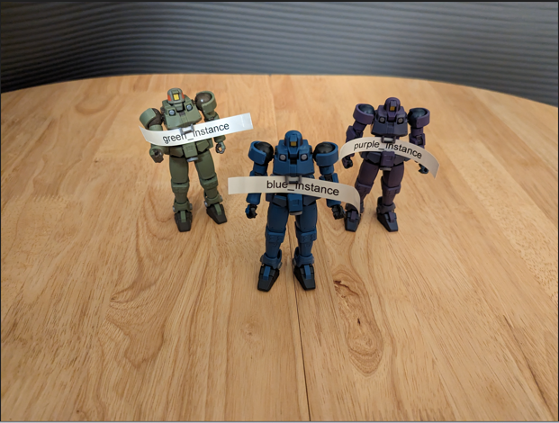

Notice the ```PascalCase``` used for the class name ```MobileSuit```, this syntax is used for third-party classes. Instance names otherwise known as object names or variable names typically use ```snake_case```. ```UPPER_CASE``` is typically reserved for an instance name that is intended to be constant.

The three instances are each unique objects and interaction with one does not influence the other two. The class outlines attributes and methods:

An *attribute* is some form of data which belongs to the object, which can be thought of as a property of the object. In this example the ```height``` of each model is an example of an attribute. Each instance has a height of 15 cm which can be accessed using dot ```.``` notation of the form ```instance.attribute```:

```
blue_instance.height
green_instance.height
purple_instance.height
```

Since this height is constant for every instance of the class, it is known as a *class attribute* and can be accessed from the class using:

```
MobileSuit.height
```

Another example of an attribute is the color of each instance. 

```
blue_instance.color
green_instance.color
purple_instance.color
```

This gives ```blue```, ```green``` and ```purple``` respectively. Unlike the height attribute, the color attribute is not constant and can be varied for each instance, so is known as an *instance attribute*. It is therefore not possible to access:

```
MobileSuit.color
```

A *method* is some form of action. Looking at the class ```MobileSuit```, it is easy to see that each instance is poseable. A method ```raise_right_arm``` for example can be used. In Python, a method is a function which needs to be called using parenthesis ```( )```. The ```( )``` also serve a second purpose, to enclose any required input arguments having the general form ```instance.method(arg1, arg2, arg3, ...)```. Many methods don't require supplementary input arguments as they already have access to instance and class attributes, like in this example, where the arm is internal.

```
blue_instance.raise_right_arm()
```


Calling the method on ```blue_instance``` does not influence ```green_instance``` or ```purple_instance```.

Looking at the class ```MobileSuit```, it is easy to see that each instance can mount equipment and a method ```mount_left_arm``` can be used. From the class, it is seen that there is a variety in the equipment that can be mounted. The piece of equipment to be mounted can be provided as an input argument to the method, for example:

```
green_instance.mount_left_arm('shield')
```


The class name itself acts as a method. Calling the class, invokes a data model method defined in the class known as the init signature. The initialization signature is used to initialize instance variables when constructing a new instance of a class. In this example, the only instance variable required is the ```color``` since all instances are otherwise instantiated identically.

```
MobileSuit(color='white')
```

Notice that the new instance created, unlike the other three instances has no associated label. Because it has no associated label, there is no reference to this instance and it cannot be accessed:


Python garbage collection sees this as an instance with no reference and will remove it:


A label, also known as the ```instance_name``` can be assigned to the instance during instantiation by use of the assignment operator ```=```. The instance to be assigned is placed on the right hand side of the assignment operator, and the label or instance name is placed on the left hand side of the assignment operator. For example:

```
white_instance = MobileSuit(color='white')
```


The ```del``` keyword deletes an instance name. For example:

```
del green_instance
```

The instance name is known as a reference to an instance. If the instance has no references, it cannot be accessed and is removed by Pythons garbage collection.


If the following code is input:

```
tallgeese = white_instance
```

Approach the assignment operator from right to left. In the right, the instance name ```white_instance``` acts as a reference to the ```MobileSuit``` instance. Then the assignment operator essentially assigns a second instance name or *alias* which can be visualised as a second label:


If one of these instance names is deleted, for example:

```
del white_instance
```

Then the instance has a second instance name giving a single reference to the instance. Since this instance has a reference, it is not deleted by Pythons garbage collection:


The class itself is an object, which is why it was depicted as a blueprint with a label representing its object name ```MobileSuit```.

## The Unicode String Class str

### Init Signature

The ```str``` class is an abbreviation for a string of Unicode characters. Inputting ```str()``` followed by shift ```⇧``` and tab ```↹``` will display the docstring of the init signature of the string class.

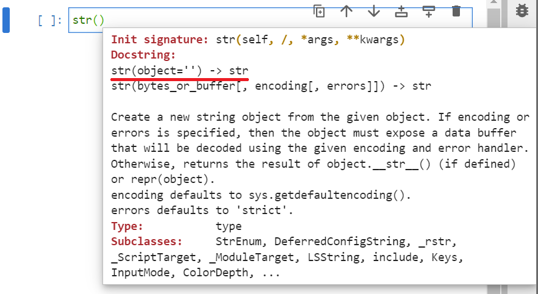

Inputting:

```
? str
```

will output the docstring in the cell output.

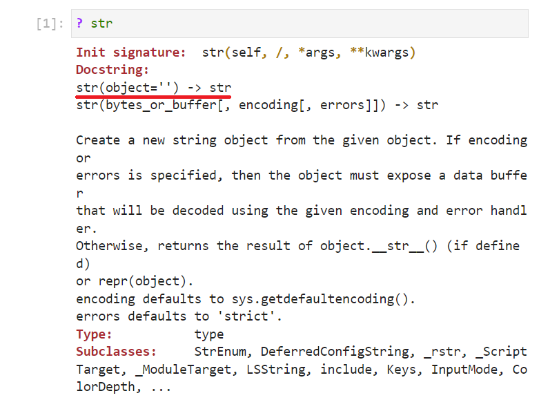

The ```init``` signature shows three ways of constructing a string. Looking at the second way, the keyword input argument ```object``` should be assigned to instance text data. This text should be enclosed in single quotation marks ```''```. For example:

```
str(object='Hello')
```

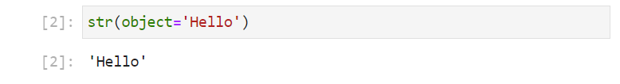

Notice the wine color-coding. If the quotations are not supplied, the text is instead black and a ```NameError``` displays when the cell is run. Without the quotations, Python is looking for the object name ```Hello```, which recall can be thought of as a label. This label does not exist and therefore the ```NameError``` displays: 

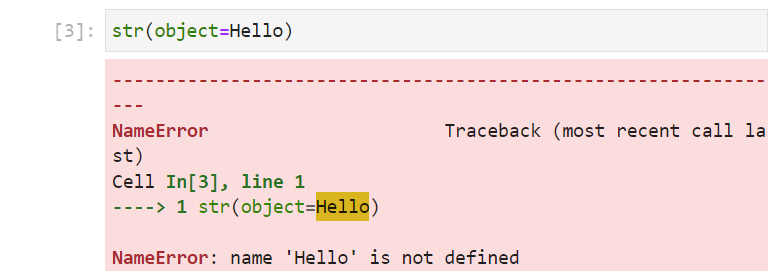

The right click context menu, may be used to open the Variable Inspector:

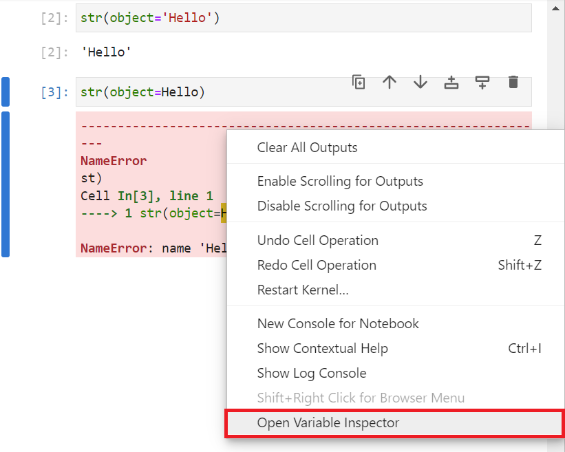

The tab may be dragged down:

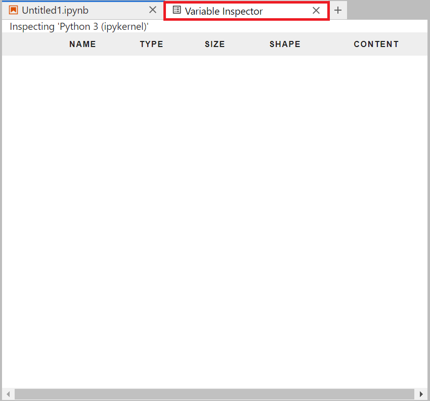

So the Notebook and Variable Inspector can be seen side by side:

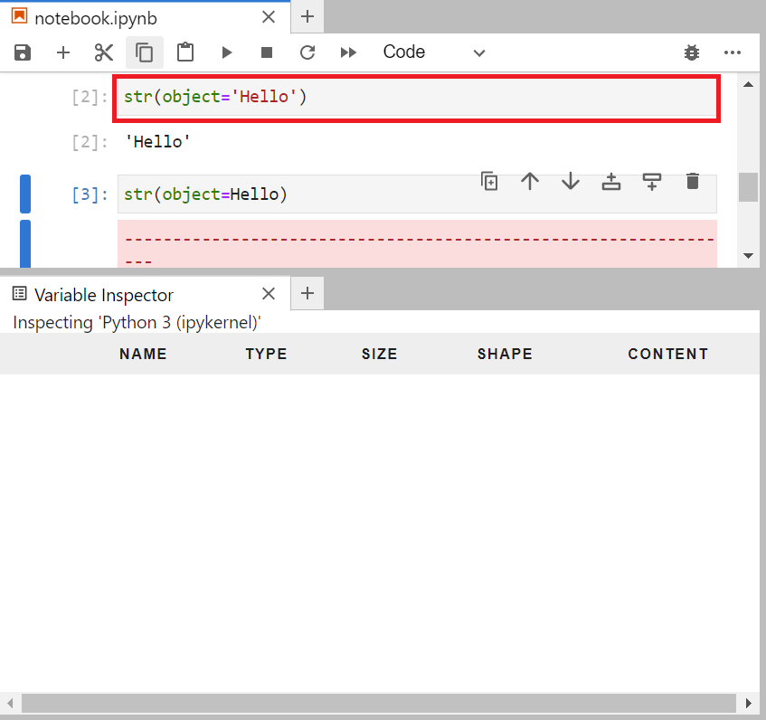

Notice that the ```str``` instance constructed earlier does not display on the Variable Inspector. It was constructed without an instance name or label and immediately removed by Pythons garbage collection as it has no reference. 

If the instance instead is instantiated to an instance name or label ```greeting```, it displays on the Variable Inspector:

```
greeting = str(object='Hello')
```

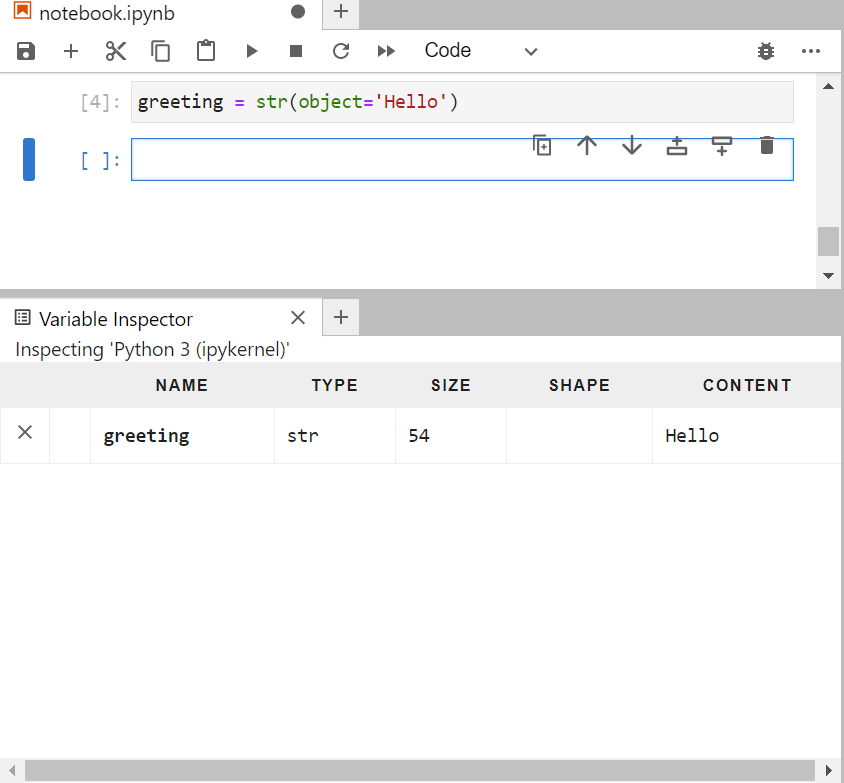

Notice again the color-coding of the instance name or label in black and without quotation compared to the string of characters enclosed in single quotations ```''``` shown in wine.

The Variable Inspector displays the instance name or label ```greeting```, the instance type which is the builtin class ```str```, the memory size of the object in bytes and the content of the string without enclosure of quotations.

If the ```str``` is not supplied a value.


The default value of ```object=''``` is used which produces an empty string:

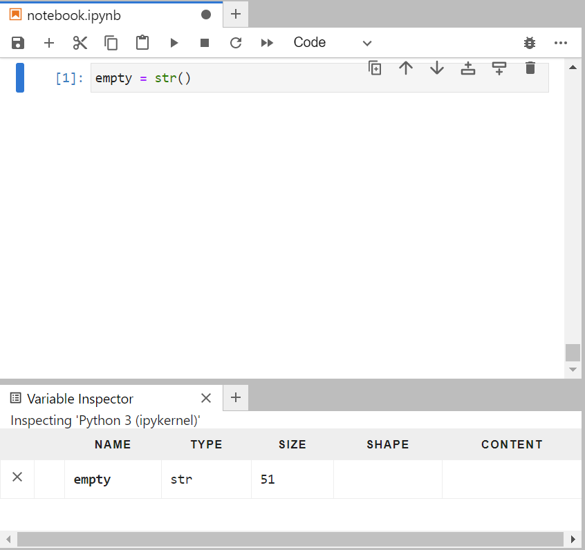

The Unicode string can also be instantiated using the first way outlined in the docstring: 

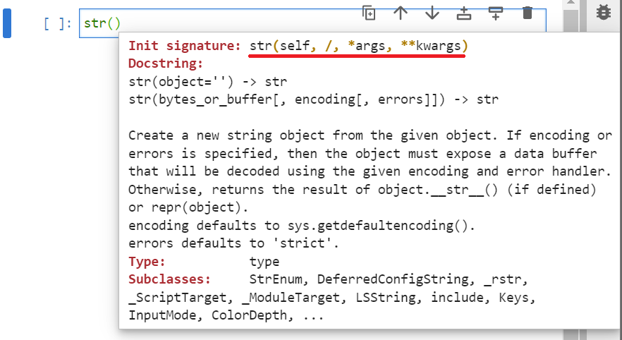

The ```self, /``` means that ```self``` is always provided as a positional input argument. So the following code is valid:

```
str('Bye')
```

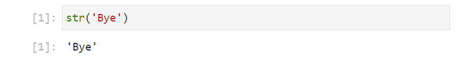

And the following code instead gives a ```TypeError```:

```
str(self='Bye')
```

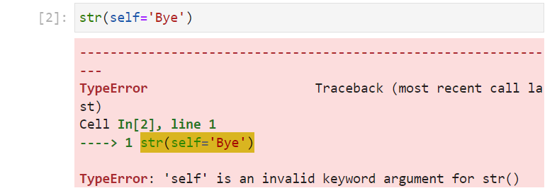

As the Unicode string is a fundamental datatype, it can be instantiated shorthand using text enclosed in single quotations:

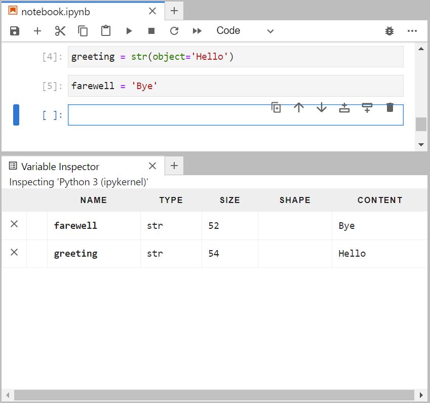

The instance name or label ```farewell``` displays on the Variable Explorer. Once again the instance type is the class ```str``` and the content of the string is shown.

As these are two unique instances, they store unique content.

### Identifiers

If the instance name ```greeting``` is input followed by a dot ```.``` and then tab ```↹``` a list of identifiers displays:

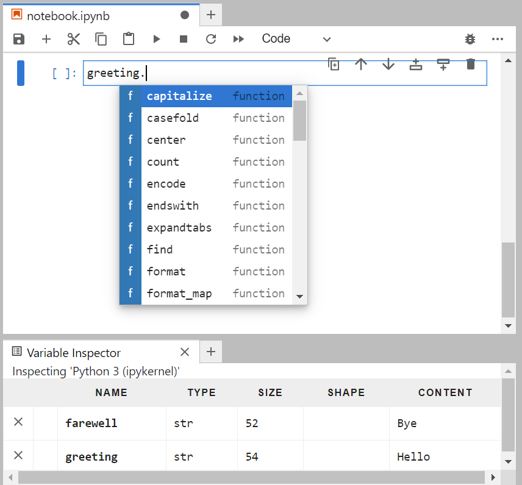

If the instance name ```farewell``` is input followed by a dot ```.``` and then tab ```↹``` the same list of identifiers displays:

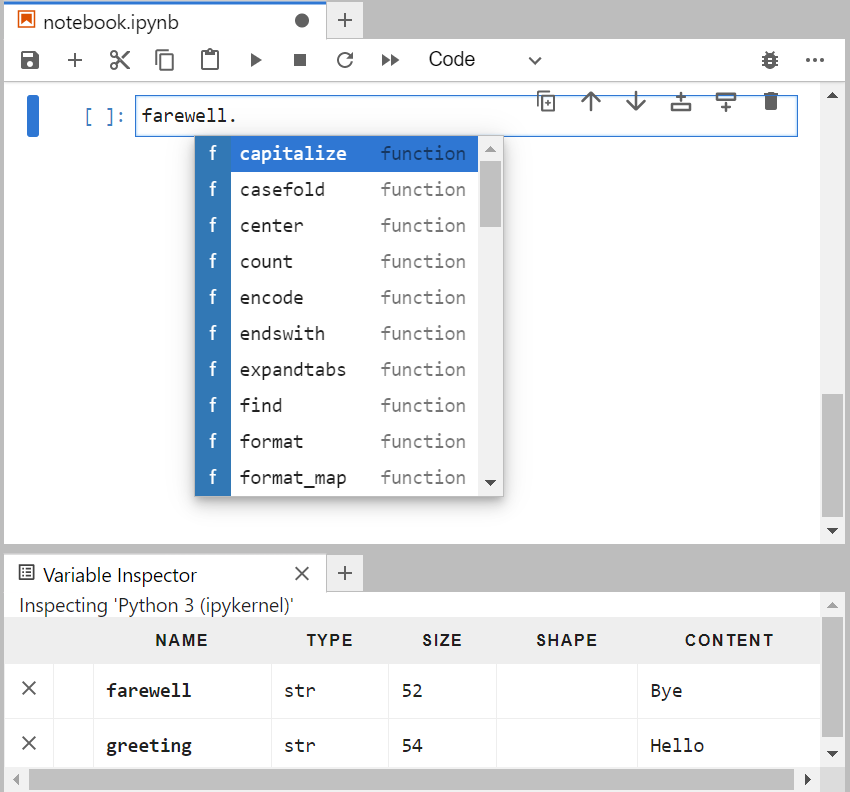

These identifiers come from the ```str``` class. Recall the class can be conceptualised as a blueprint, and this blueprint outlines the behaviour of all these identifiers:

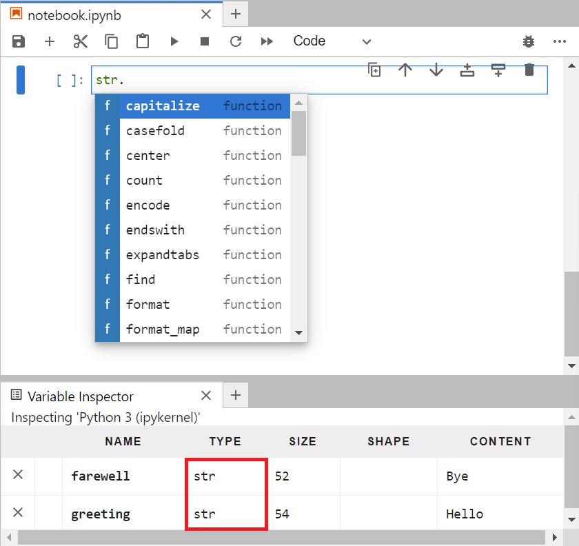

### Methods

All of these identifiers are functions. A function is also an object that can be referenced using its object name. When referenced the output shows that this function belongs to the ```str``` class. Notice the parenthesis ```()```, these are used to both provide input arguments to the function and to also call the function:


Details about a functions input arguments can be found by inputting the functions name followed by open parenthesis and pressing shift ```⇧``` and tab ```↹```. This displays the functions docstring as a pop up balloon:

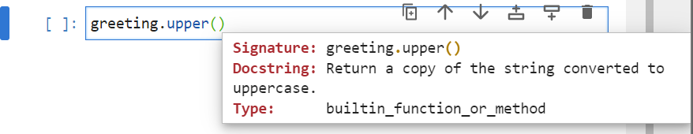

This function has no input arguments. A function that is being called from an instance of a class is called a method and methods have access to instance data:

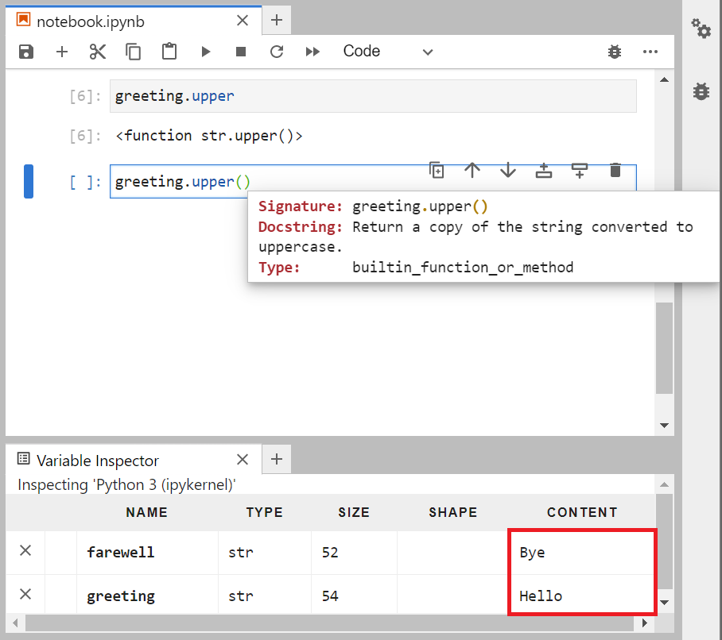

This method can be called for each instance and is seen to operate on each instances unique instance data:

```
greeting.upper()
farewell.upper()
```

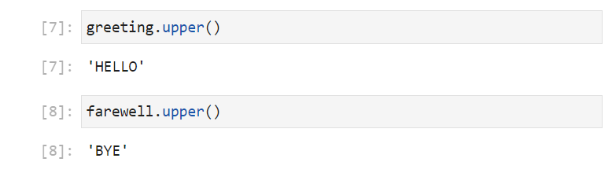

The method returns a new instance of the ```str``` class. Because this new instance is not assigned to an object name it has no reference and is immediately removed by Pythons Garbage collection.

If the function is attempted to be called from the ```str``` class, a ```TypeError``` displays, stating that the unbound method needs an argument. In other words, the class is a blueprint and there is no instance data for the function to operate on.

```
str.upper()
```

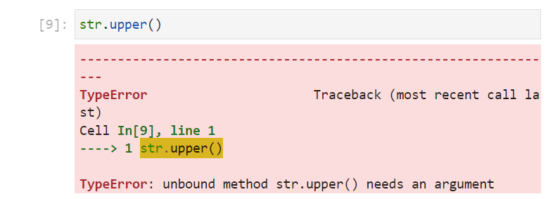

Pressing shift ```⇧``` and tab ```↹``` to view the docstring of the function from the ```str``` class now requests an input argument ```self```. 

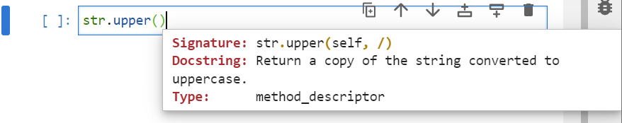

```self``` means any instance of the class, for example:

```
str.upper(greeting)
str.upper(farewell)
```

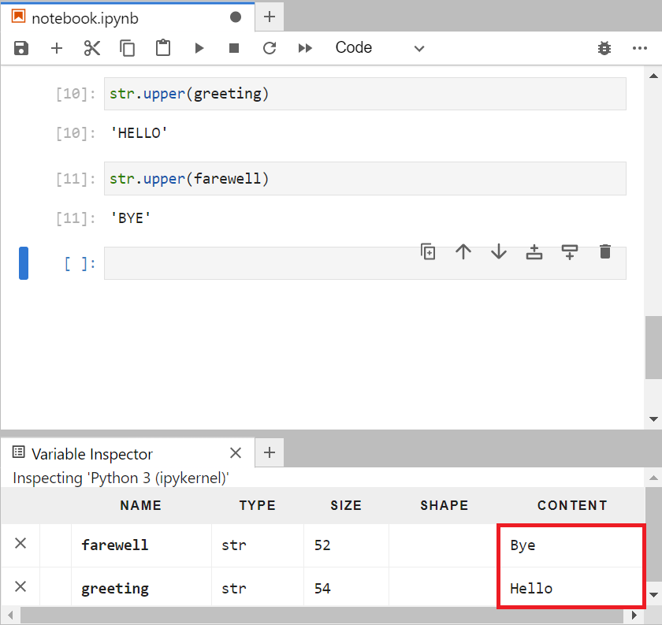

It is far more common to call the function as a method from an instance, than to call it from the class and then supply an instance. If the following is input:

```
greeting = greeting.upper()
```

The value on the right hand side of the assignment operator is going to be computed. This looks to the instance name or label ```greeting``` which is attached to the instance data ```'Hello'```:

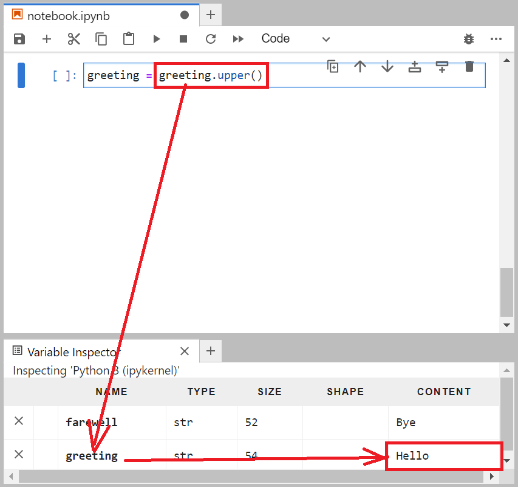

This has the return value ```'HELLO'``` and the assignment operator move the label from the old ```str```  ```'Hello'``` to the new ```str``` ```'HELLO'```. Finally the old ``str`` ```'hello'``` now has no label and is removed by Pythons Garbage collection:

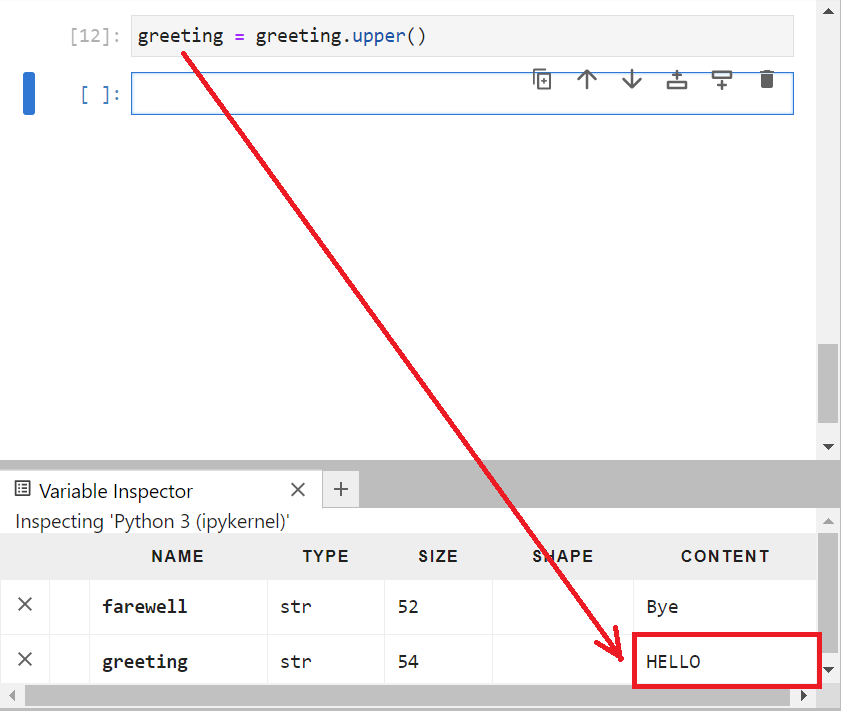

A string is immutable, which means it cannot be modified when created. The ```str``` in the above operation wasn't modified, instead a new ```str``` was created and the instance name or label was assigned to this other instance. Because a ```str``` is immutable all of the methods have a return value, usually returning a new string.

Likewise the following:

```
greeting = 'Hello World!'
```

will create a new ```str``` instance and then assign the existing label ```greeting``` to it. The old instance ```'HELLO'``` will now have no reference and be collected by Pythons Garbage collection:

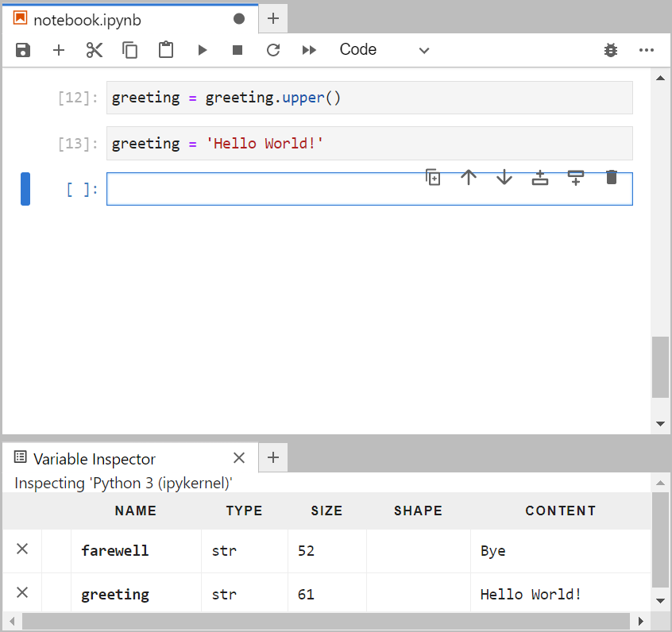

The four methods ```capitalize```, ```lower```, ```title```, ```casefold``` (lower but handles German and English characters), ```swapcase``` (swap the case of characters) all operate on the ```str``` instances, instance data and all return a new string.

```
greeting.capitalize()
greeting.lower()
greeting.title()
greeting.casefold()
greeting.swapcase()
```

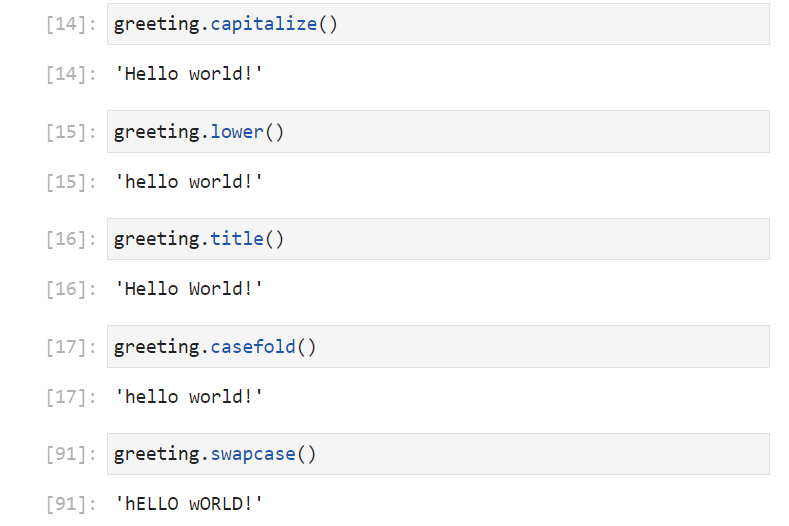

The ```str``` class has a number of associated methods to check the properties of a ```str```. For example:

```
greeting.isupper()
greeting.islower()
greeting.istitle()
```

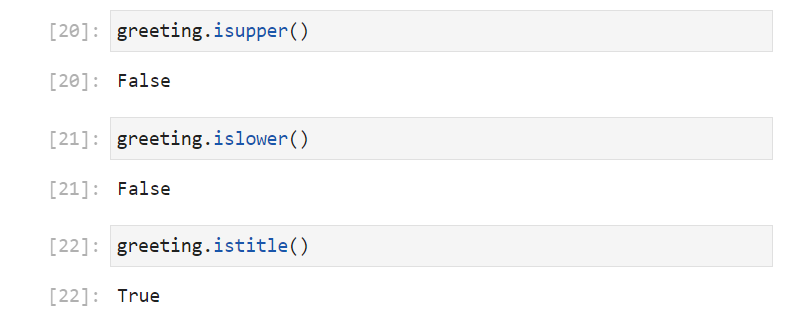

These all return a boolean value that is either ```True``` or ```False```.

### Builtin Identifiers and Keywords 

The ```isidentifier``` method is a useful string method to check whether the ```str``` instance can be used as an identifier. That is whether the contents within the single quotations can be used as a valid object name or label:

```
'greeting'.isidentifier()
'greeting message'.isidentifier()
'greeting_message'.isidentifier()
```

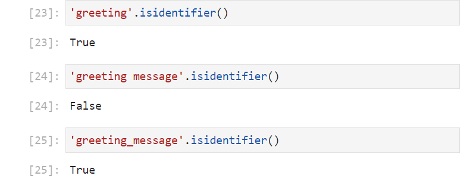

```'greeting'``` is a valid identifier, the identifier ```greeting``` was previously assigned as a ```str``` instance. ```'greeting message'``` is not a valid identifier because it contains a space and using this space means Python would look for two seperate ```greeting``` and ```message``` objects. No special characters can be used in an identifier with exception to the underscore ```_``` recall ```snake_case```, ```'greeting_message'``` is a valid identifier and therefore ```greeting_message```could be used as an object name.

If ```a``` is input in a cell followed by a tab ```↹```, all the ```builtins``` identifiers that start with ```a``` are listed. 

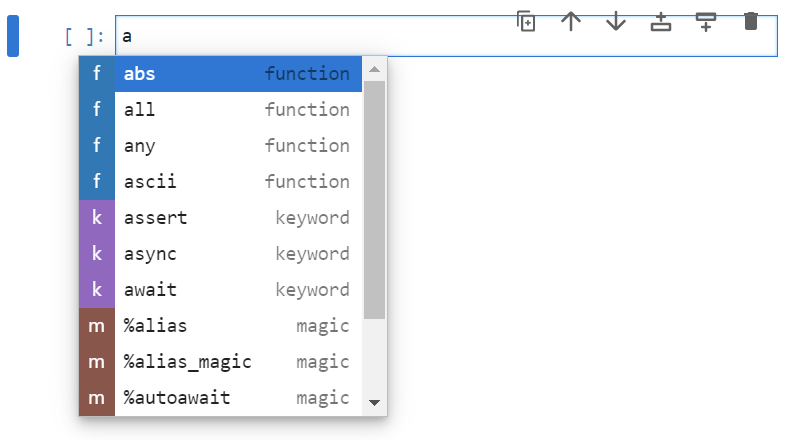

A Python Script File or Interactive Python Notebook behind the scences carries has the following command:

```
from builtins import *
```

This loads all the ```builtins``` identifiers into the global namespace so that they can be accessed.

Although all the ```builtins``` identifiers are implicitly imported. It can be useful to explicitly load the module:

```
import builtins
```

Then inputting ```builtins.``` followed by a tab ```↹``` will display all the identifiers from the ```builtins``` module:

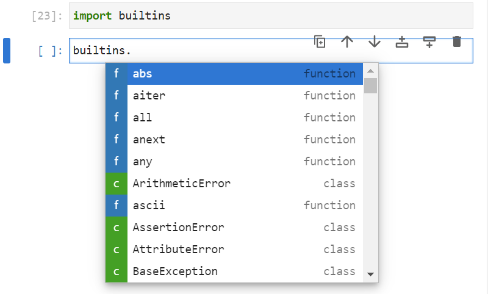

The object name of all these ```builtins``` are already in use, and should not be used as object names (labels). 

In addition to ```builtins``` there is the ```keyword``` module. The keyword list can be viewed using:

```
import keyword
keyword.kwlist
```

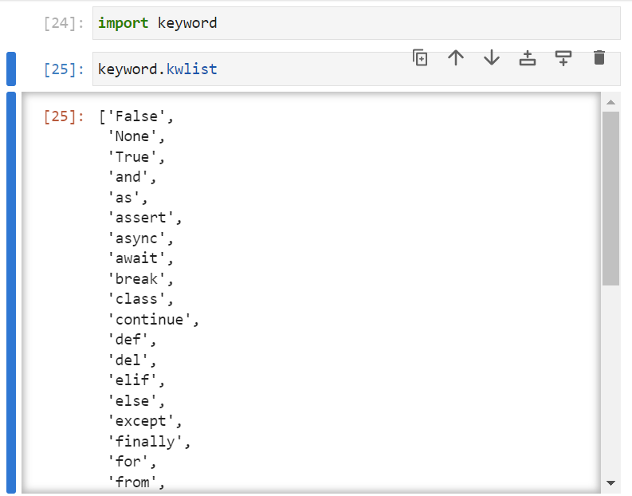

The keywords are reserved by Python and cannot be assigned to object names (labels). 

To recap it is possible to reassign one of the ```builtins``` identifiers (but not recommended) and impossible to reassign a ```keyword``` identifier.

It is a good practice to check whether an identifer is valid and whether it is a builtin or keyword before assigning an object name. 

The directory function ```dir``` lists all the identifiers within an object. It is named because the Python object can be conceptualised as a folder or directory and each identifier within it can be conceptualised as a file within that directory:

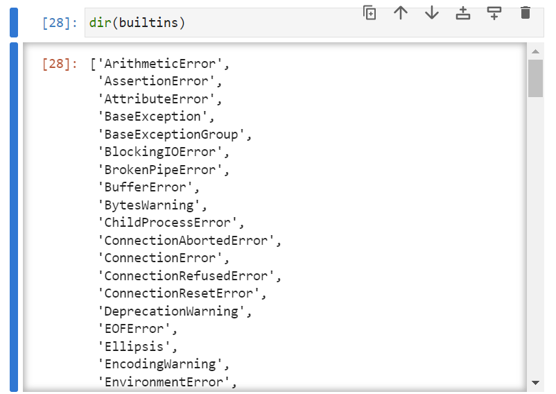

```keyword.kwlist``` and ```dir(builtins)``` are lists of strings. A check to see whether ```'greeting'``` is ```in``` the list of words can be made using the ```in``` operator:

```
'greeting' in keyword.kwlist
'greeting' in dir(builtins)
```

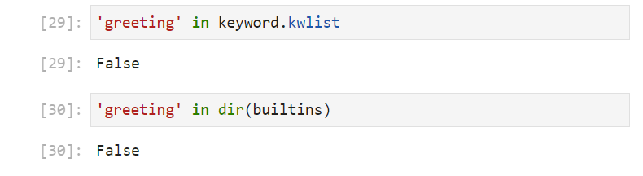

This gives the ```bool``` ```False``` in both cases.

### ASCII and Unicode Characters

Python has a ```string``` module which contains a number of useful strings.


The instance ```ascii_letter``` displays the letters in the alphabet. The ```str``` method ```isalpha``` will check to see if every character in the string is within this list:

```
string.ascii_letters
greeting
greeting.isalpha()
```

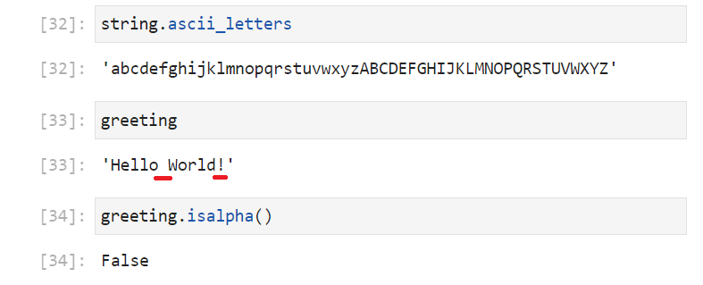

Because there is a ```' '``` and ```'!'```, this method outputs the ```bool``` ```False```.

The instances ```ascii_letter```, ```digits```, ```punctuation``` and ```whitespace``` display the letters in the alphabet, the digits used for numbers, punctuation marks and whitespace. The collection of these is the printable ASCII characters:

```
string.ascii_letters
string.digits
string.punctuation
string.whitespace
```

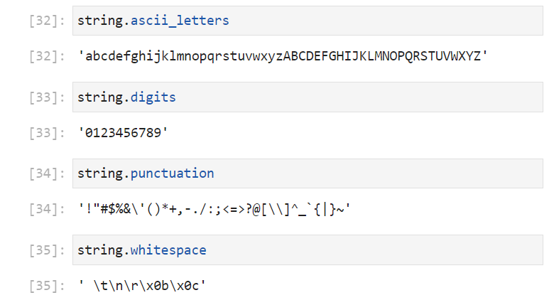

The method ```isalpha``` checks to see if every character is in ```string.ascii_letter```. The method ```isnumeric``` checks to see if every character is in ```string.digits```. The method is alpha numerical ```isalnum``` checks to see if every character is in ```string.ascii_letter``` or ```string.digits```. The method ```isspace``` checks to see if every chracter is in ```string.whitespace```. 

```
greeting.isalpha()
greeting.isnumeric()
greeting.isalnum()
greeting.isspace()
```

The contents of the ```str``` instance ```greeting``` i.e. ```'Hello World!'``` has a combination of letters, spaces and punctuation marks so is ```False``` for these four methods:

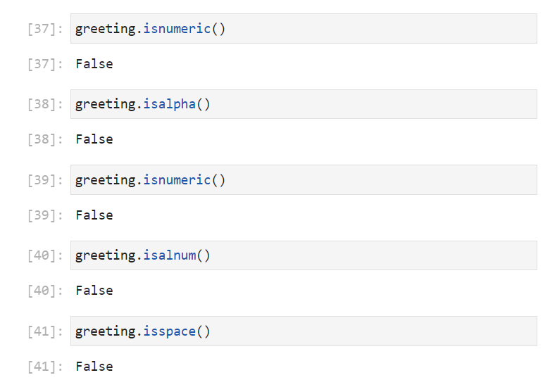

The ```string.printable``` is a combination of the the printable ASCII characters ```string.digits```, ```string.ascii_letters```, ```string.punctuation```, ```string.whitespace```:

```
string.printable
greeting.isprintable()
```

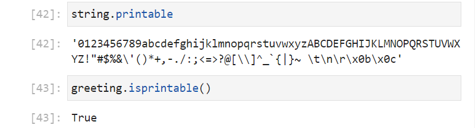

The contents of the ```str``` instance ```greeting``` i.e. ```'Hello World!'``` is printable so it is ```True``` for this method.

Under the hood a computer stores data using binary switches known as bits. Each bit is a switch that is either Low or High. These binary switches are equivalent to the ```bool``` values ```False``` and ```True``` also represented using the digits ```0``` and ```1```. To store more than two values, a combination of switches are used and a common configuration is 8 known as a byte.


ASCII stands for American Standard Code for Information Interchange (ASCII) and contains the most common non-printable computer commands and printable characters used in the English language (American subset which excludes the £). These are numerically encoded and recognised by the computer as a byte.

For example the integer value of the character ```'A'``` can be retrieved using the ordinal function ```ord```:

```
ord('A')
```

This gives the ```int``` instance ```65```:

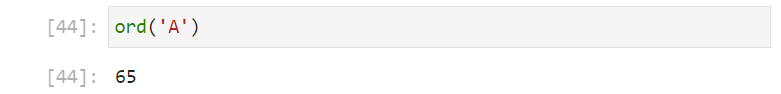

This ```int``` can be cast into binary using the binary function ```bin```:

```
bin(65)
```

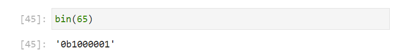

The output displays the integer as a binary string ```'0b1000001'```, the ```0b``` is a prefix used to distinguish the binary number from an integer string. The first bit for this character is ```0``` and is not shown. The 8 binary switches have the following sequence ```01000001``` when used to represent the character ```'A'```.

In ASCII bytes 33 to 128 include most printable characters:

```
for num in range(33, 128):
    print(chr(num), sep='', end='')
```

This numbering sequence differs slightly to that seen in:

```
string.printable
```

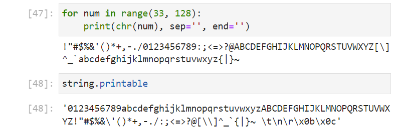

However most of the characters in the ```string.printable``` can be seen.

Notice that the whitespace characters aren't included. Bytes 0-33 include these, alongside other non-printable commands. Of particular importance are, the space at 32, the horizontal tab at 9, the new line at 10, the carriage return at 13, the vertical tab at 11 and the for feed at 12:


```
ord(' ') # space
ord('\t') # tab
ord('\n') # new line
ord('\r') # carriage return
ord('\x0b') # vertical tab
ord('\x0c') # form feed
```

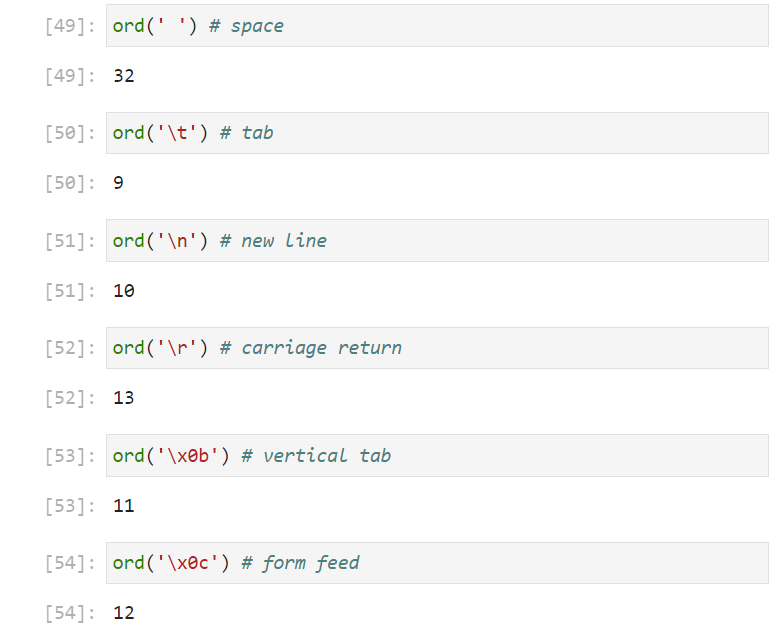

The names of most of these commands originate from a typewriter:


In a typewriter, the form feed moves the piece of paper up by one line. A carriage return returns the ink cartridge to the left hand side of the sheet of paper. A new line is therefore equivalent to a carriage return and a form feed.

The method ```isascii``` checks to see if every character is ASCII. The following ```str``` instances can be compared:

```
greeting.isascii()
greek_greeting = 'Γειά σου Κόσμε!'
greek_greeting.isascii()
```

The instance ```greeting``` returns the ```bool``` value ```True``` as each character is in the ASCII subset. The instance ```greek_greeting``` contains Greek characters, that are outside the ASCII subset of characters and therefore returns the ```bool``` value ```False```:

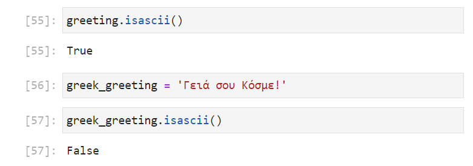

The methods ```isdecimal```, ```isdigit``` and ```isnumeric``` closely resemble one another when it comes to ASCII characters. They handle non-ASCII numeric characters slightly differently. 

```isdecimal``` is the most restrictive and only includes the numbers ```'0123456789'```. These can be different Unicode characters for example ```'𝟶𝟷𝟸𝟹𝟺𝟻𝟼𝟽𝟾𝟿'```, ```'𝟬𝟭𝟮𝟯𝟰𝟱𝟲𝟳𝟴𝟵'``` and ```'𝟘𝟙𝟚𝟛𝟜𝟝𝟞𝟟𝟠𝟡'``` which are the same characters with a different font.

```isdigit``` and ```isnumeric``` also include different Unicode characters that represent subscript ```'₀₁₂₃₄₅₆₇₈₉'``` and superscript ```'⁰¹²³⁴⁵⁶⁷⁸⁹'```, as well as circled digits ```'➀➁➂➃➄➅➆➇➈'```.

```isnumeric``` includes Vulgar Fractions ```'½⅓¼⅕⅙⅐⅛⅑⅒⅔¾⅖⅗⅘⅚⅜⅝⅞⅟↉'``` and numeric Unicode characters that represent digits outwith ```'➀➁➂➃➄➅➆➇➈'``` such as ```'➉'```.

### Single Quotations, Double Quotations and Multiline Strings

If the following is input:

```
'Philip's Tutorial'
```


Notice from the syntax highlighting that ```'Philip'``` is recognised as a string, ```s``` is recognised as an unassigned Python object name,  ```Tutorial``` is recognised as an unassigned object name and ```'``` indicates that a string is started but not closed. In other words the line above doesn't make sense to the Python Interpretter.

Python can use double quotations ```" "``` to enclose string literals which incorporate ```'```. The following is recognised as a string:

```
"Philip's Tutorial"
```

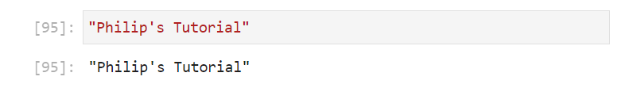

Python can use single quotations ```' '``` or double quotations ```" "``` to enclose a string of Unicode characters. For a single line string the default is single quotations and all official Python documentation favours single quotations for this use case. 

```
'Hello World!'
```

A multiline string can be constructed using three double quotations ```""" """``` or three single quotations ```''' '''```. For a multi-line string, the default is double quotations and all official Python documentation favours double quotations for this use case. This is also because a docstring is likely to include expanded details about input arguments and therefore likely to contain string literals that are enclosed in single parenthesis.

```
"""
This is a multi-line string.
Hello World!
Goodbye World!
"""
```

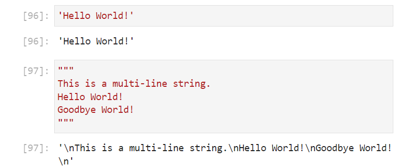

The multiline string can be assigned to an object name, note the emission of the new line at the start and the end and the inclusion of two tabs:

```
paragraph = """This is a multi-line string:
\tHello World!
\tGoodbye World!"""
```

The representation of this multiline string can be shown in the cell output or it can be printed:

```
paragraph
print(paragraph)
```

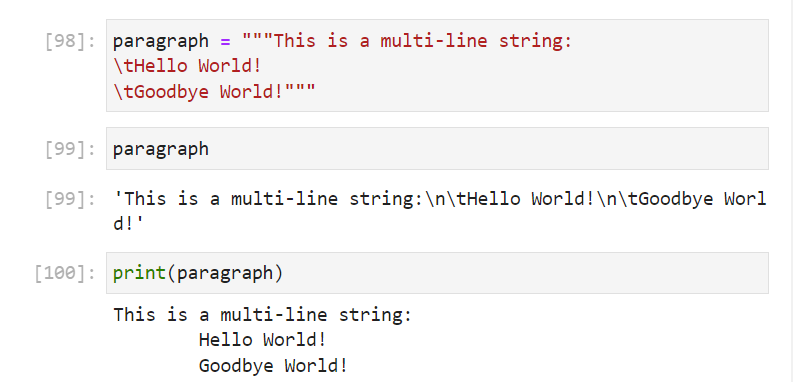

In Python code, tabs aren't used and instead four spaces are used. The ```expandtabs``` method can be used to expand all tabs in a string to a set number of spaces. Inputting ```greeting.expandtabs()``` followed by shift ```⇧``` and tab ```↹``` will display the docstring of this function revealing the keyword input argument ```tabsize```, this has a default value of 8:

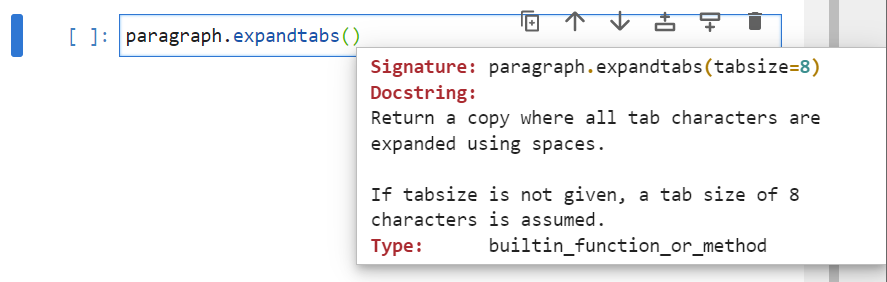

The tabs can be expanded to 4 spaces and the returned string can be returned to a new object name ```paragraph2```. The cell representation of ```paragraph2``` can be shown in the output of a cell or alternatively ```paragraph2``` can be printed:

```
paragraph2 = paragraph.expandtabs(tabsize=4)
paragraph2
print(paragraph2)
```

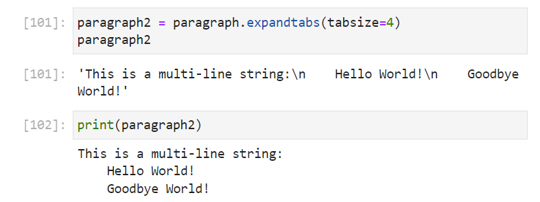

### Print and Repr, Escape Characters and Raw Strings

Going back to:

```
paragraph = """This is a multi-line string:
\tHello World!
\tGoodbye World!"""
```

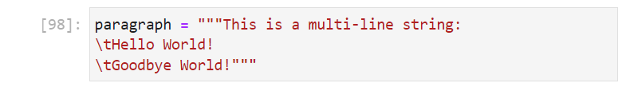

And viewing the string representation in a cell output:

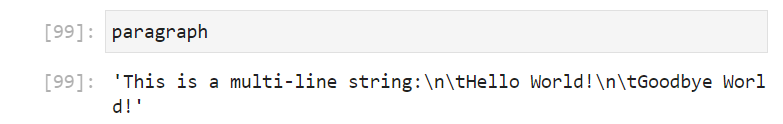

Notice the string representation shown in the cell output uses ```\n``` to represent a new line and ```\t``` to represent a tab. 

The string representation shown in the cell output is the best way to instantiate a new string using a single line. In a string, the ```\``` is used to insert an escape character. This is typically used for whitespace such as ```\n``` new line, ```\t``` tab and ```\r``` carriage return. 

The representation can explicitly be shown using the representation function ```repr```. Inputting ```repr()``` followed by shift ```⇧``` and tab ```↹``` will display the docstring of this function revealing the only input argument is the object to be represented:

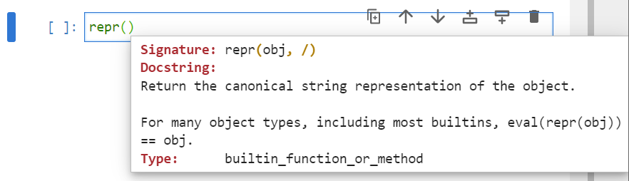


The docstring has the positional input argument ```obj```. This is positional only as its followed by a ```/```. If ```repr``` is used on ```paragraph```:

```
repr(paragraph)
```

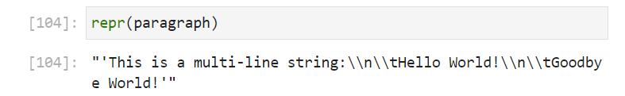

Notice that the original string with single quotations is enclosed in double quotations. Everywhere there was a ```\``` in the string, there is now a double ```\\```. This is because in order to insert a ```\``` as an escape character ```\\``` is used, the first ```\``` denotes insertion of an escape character and the second ```\``` denotes that the escape character to be inserted is ```\``` itself. The effect of these escape characters is seen when the representation is printed:

```
print(repr(paragraph))
```

Which is the same as the default cell output:

```
paragraph
```

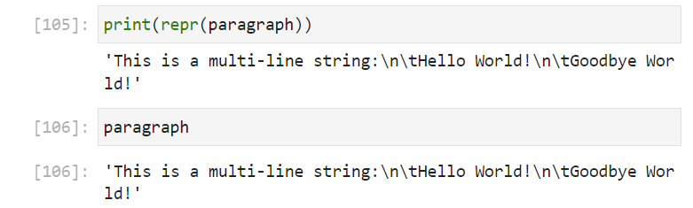

The ```print``` function displays the string with the formatting escape characters applied:

```
print(paragraph)
```

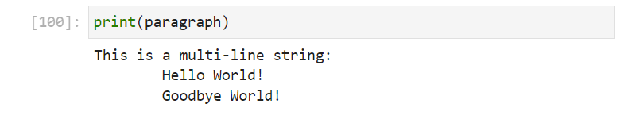

Inputting ```print()``` followed by shift ```⇧``` and tab ```↹``` will display the docstring of this function revealing the expected input arguments:

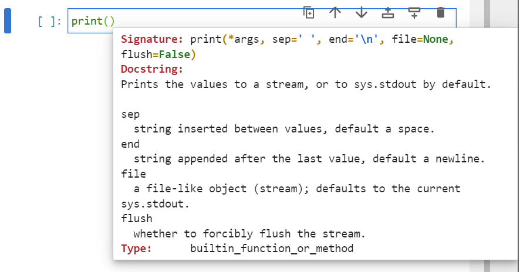

Notice that there are a variable number of positional input arguments, meaning 1 or multiple objects may be supplied to the ```print``` function. There is the keyword input argument seperator ```sep``` which has the default value of a space and the keyword input argument ```end``` which has the default value of a new line. Notice that the docsting displays the default values using single quotations ```' '``` and ```'\n'``` respectively. The behaviour of these input arguments can be examined using:

```
print('hello', 'world')
print('hello', 'world')
print('hello', 'world', sep='|', end='+')
print('hello', 'world')
print('hello', 'world')
```

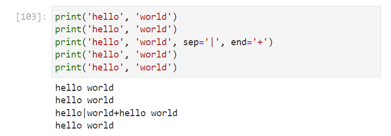

A Linux or Mac file path use the ```/``` to indicate a subdirectory for example ```/home/pc/```:


A Windows file path uses the ```\``` by default to indicate a subdirectory for example ```C:\Users\Philip```:

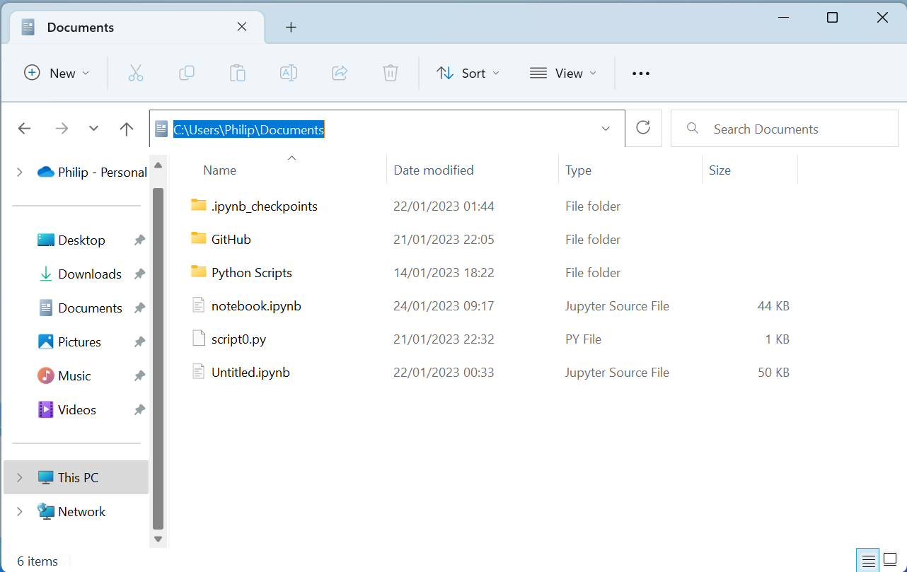

In Python the path ```C:\Users\Philip``` can be converted into a string using:

```
'C:\\Users\\Philip'
```

This can be printed using:

```
print('C:\\Users\\Philip')
```

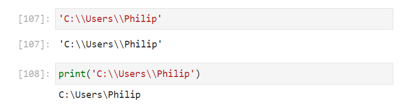

When copying and pasting a file path, it can be quite inconvenient to modify every ```\``` to a ```\\```. This can be done using a raw string. A raw string is prepended with ```r```:

```
r'C:\Users\Philip'
```

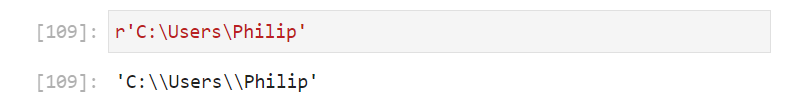

### Formatted Strings

Supposing the three string variables:

```
str0 = 'print'
str1 = 'hello'
str2 = 'world'
```

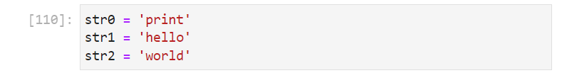

are to be inserted into a string of the format:

```
'The string to 0 is 1 2!'
```

where ```strN``` is to be inserted where ```N``` is indicated.

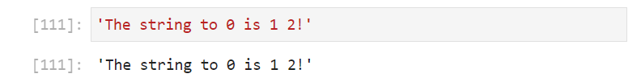

This can be achieved using a positional input argument placeholder ```{}``` where each positional input argument is an integer. The string ```format``` method can then be used with a positional input argument that has a position that corresponding to the placeholder:

```
'The string to {0} is {1} {2}!'.format(str0, str1, str2)
```

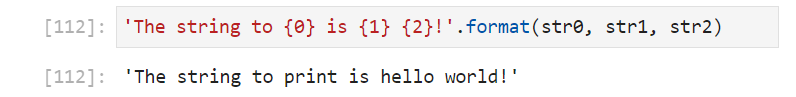

Observing the output, the variables get inserted into the string as expected.

A keyword object placeholder can instead contain an object name. The string ```format``` method must have a keyword input argument corresponding to this object name:

```
'The string to {var0} is {var1} {var2}!'.format(var0=str0,
                                                var1=str1,
                                                var2=str2)
```

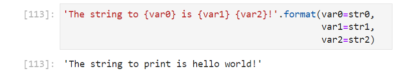

For simplicity, the name of the keyword argument in the format method is often assigned to match the name of the Python object to be inserted into a string:

```
'The string to {str0} is {str1} {str2}!'.format(str0=str0,
                                                str1=str1,
                                                str2=str2)
```

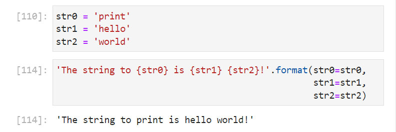

As the above is commonly used and it is inconvenient to write each variable name 3 times, there is a shorthand notation. Prepending the string with f automatically invokes the format method. A corresponding keyword argument is implicitly setup that matches the name in the placeholder and this is assigned to an object with the same name.

```
f'The string to {str0} is {str1} {str2}!'
```

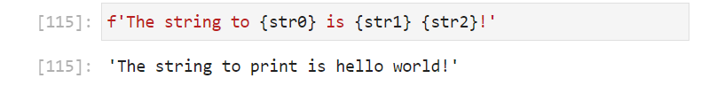

A mapping such as a dictionary has ```key: value``` pairs:

```
strings = {'str0': 'print', 
           'str1': 'hello', 
           'str2': 'world'}
```

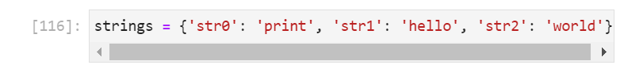

A dictionary can then be unpacked using ```**```:

```
**strings
```

When it is unpacked it becomes:

```
str0='print', str1='hello', str2='world'
```

The key name in the dictionary must match the keyword placeholder in the formatted string. 

```
'The string to {str0} is {str1} {str2}!'.format(**strings)
```

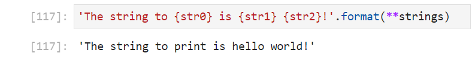

There is also the ```format_map``` method which automatically unpacks the mapping:

```
'The string to {str0} is {str1} {str2}!'.format_map(strings)
```


The placeholders can contain a format specifier. For example, the following specifier indicates that each item to be inserted is a string:

```
f'The string to {str0 :s} is {str1 :s} {str2 :s}!'
```

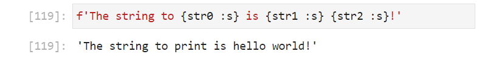

The number of spaces each string occupies can be specified. If this number is prefixed with a ```0```, the string will display trailing zeros instead of trailing spaces for each string placeholder:

```
f'The string to {str0 :010s} is {str1 :06s} {str2 :06s}!'
f'The string to {str0 :10s} is {str1 :6s} {str2 :6s}!'
```

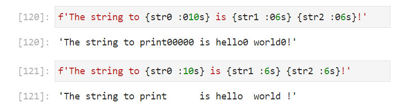

Numeric variables are commonly incorporated into a formatted string.

```
num1 = 1
num2 = 0.0000123456789
num3 = 12.3456789

f'The numbers are {num1}, {num2} and {num3}.' 
```

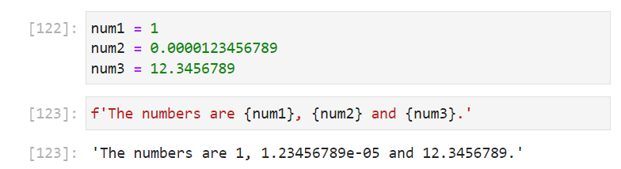

```num1``` is a decimal integer, which is a whole number.  

```num2``` is a small floating point number much smaller than a unit. Because it is much smaller than a unit, it is displayed in scientific notation. A floating point much larger than a unit is also displayed in scientific notation.

```num3``` is a floating point number comparible to a unit and shown using standard notation.

There are additional format specifiers for other datatypes:

|datatype|specifier|
|---|---|
|string|:s|
|general format|:g|
|decimal integer|:d|
|fixed point format (standard format)|:f|
|exponent format (scientific notation)|:e|

For numeric variables by default the general format is used:

```
f'The numbers are {num1 :g}, {num2 :g} and {num3 :g}.'
```

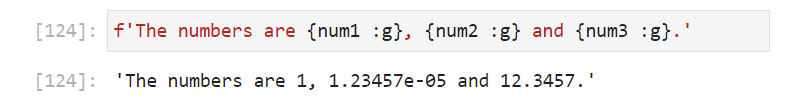

The decimal integer format can be used for the whole number, this can be prefixed with the number of desired spaces and a zero to show leading zeros:

```
f'The numbers are {num1 :d}, {num2 :g} and {num3 :g}.' 
f'The numbers are {num1 :5d}, {num2 :g} and {num3 :g}.' 
f'The numbers are {num1 :05d}, {num2 :g} and {num3 :g}.' 
```

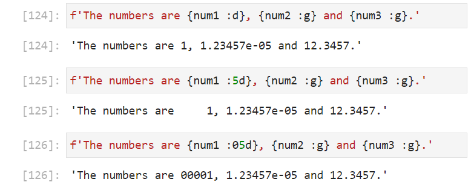

Notice the change in ```num2``` and ```num3``` when the fixed point format and exponentials are used:

```
f'The numbers are {num1 :d}, {num2 :g} and {num3 :g}.'
f'The numbers are {num1 :d}, {num2 :f} and {num3 :f}.'
f'The numbers are {num1 :d}, {num2 :e} and {num3 :e}.'  
```

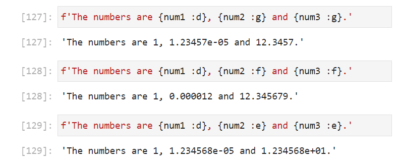

The format specification in either case be change to ```.3``` which indicates a precision of 3 digits past the decimal point.

```
f'The numbers are {num1 :d}, {num2 :.3f} and {num3 :.3f}.' 
f'The numbers are {num1 :d}, {num2 :.3e} and {num3 :.3e}.'
```

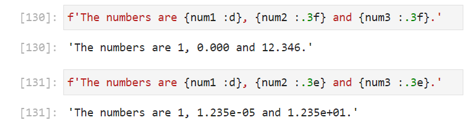

The ```%``` operator is used to format a string with a tuple. In this earlier style of string formatting the format specifier used a ```%``` instead of being enclosed in a ```{}```

```
'The numbers are %d, %.3f and %.3f.' % (num1, num2, num3)
'The numbers are %d, %.3e and %.3e.' % (num1, num2, num3)
```

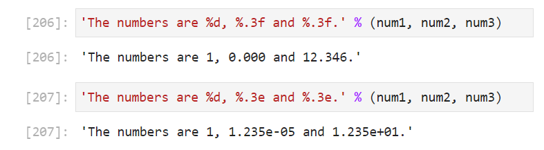

This older style of string formatting the syntax highlighting doesn't update to indicate the placeholders and it is a bit harder to read.

### Fill, Center and Justify

The ```center``` method can be used to center the text within a string. This method acts upon the instance data but requires supplementary information in the form of input arguments. Inputting ```greeting.center()``` followed by shift ```⇧``` and tab ```↹``` will display the docstring of this function revealing the expected input arguments:

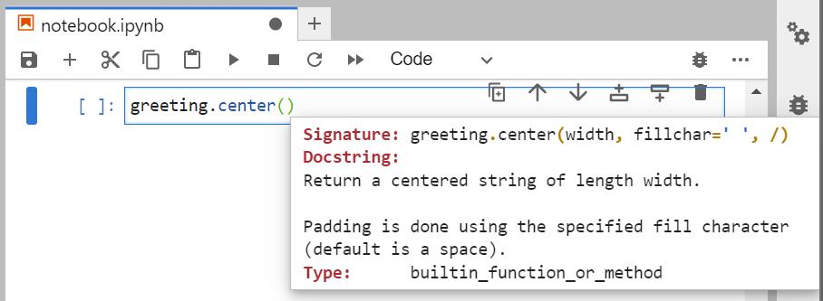

There is the input argument ```width``` which must be supplied and the input argument ```fillchar``` which has a default value. Although, ```fillchar``` is shown in the form of a keyword argument, assigned to a default value. These two input arguments are followed by a ```/``` which means they must be supplied as positional input arguments. If ```fillchar``` is not supplied as a second positional input argument, it will take on its default value, which is a space ```' '```:

```
greeting.center(20)
greeting.center(20, '◯')
```

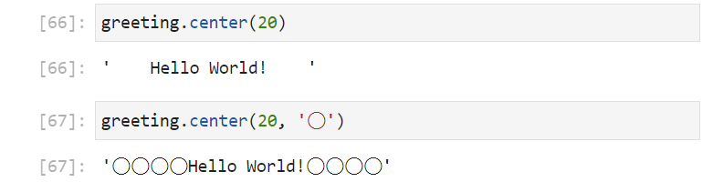

The width of ```20``` means the string returned should have ```20``` Unicode characters. The original string had ```12``` characters and to be centred, this places ```4``` fill characters before and ```4``` fill characters after the original characters. This is seen easier with the circles. The length function ```len``` determines the number of Unicode characters in the ```str``` instance:

```
len(greeting)
len(greeting.center(20, '◯'))
```

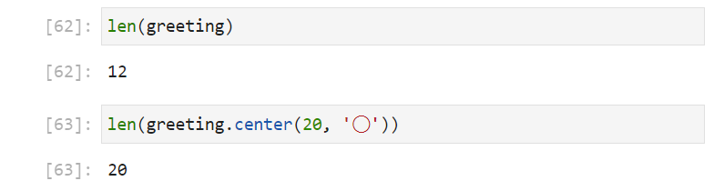

The methods left justify ```ljust``` and right justify ```rjust``` have consistent input arguments to center:

```
greeting.ljust(20, '◯')
greeting.center(20, '◯')
greeting.rjust(20, '◯')
```

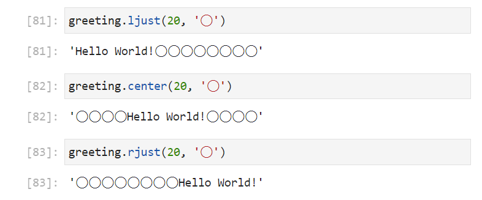

The zero fill method ```zfill``` left justifies a number by using a fill value of ```0```. This can be useful if a number is to be presented with a fixed amount of digits. For example:

```
upper_a = '1000001'
upper_a.zfill(8)
```

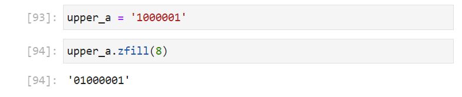

### Strip and Remove Prefix or Suffix

If a centered string is assigned to a new object name:

```
greeting2 = greeting.center(20, '◯')
greeting2
```


The ```strip``` method can be used to remove fill characters. Inputting ```greeting2.strip()``` followed by shift ```⇧``` and tab ```↹``` will display the docstring of this function revealing the expected input argument ```chars```. This once again has a default value which is ```None``` and the docstring states this default value will remove whitespace. It is followed by a ```/``` indicating it when it is provided, it must be provided as a positional input argument only:

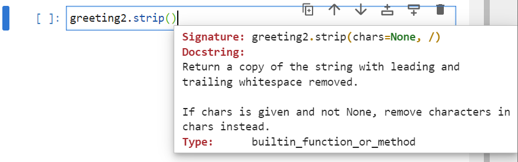

The methods left strip ```lstrip``` and right strip ```rstrip``` have consistent input arguments.

```
greeting2.strip('◯')
greeting2.lstrip('◯')
greeting2.rstrip('◯')
```

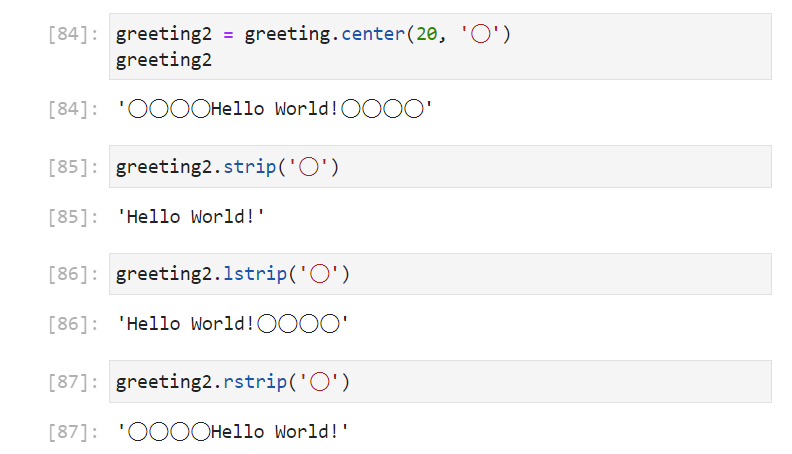

The method ```removeprefix``` removes a precise prefix. Inputting ```greeting2.removeprefix()``` followed by shift ```⇧``` and tab ```↹``` will display the docstring of this function revealing the expected input argument ```prefix```, followed by a ```/``` indicating the input argument is positional only. Note that this positional input argument has no default value and a value has to be provided:

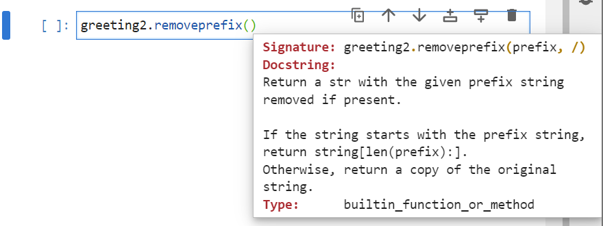

There is a similar right method ```removesuffix```:

```
greeting2.removeprefix('◯')
greeting2.removesuffix('◯')
```

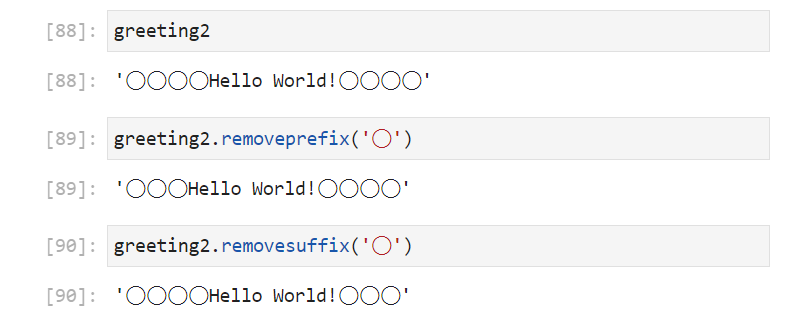

### In, Find, Index, Count and Replace

The keyword ```in``` can be used to see if a substring is *in* a string. For example:

```
greeting = 'Hello World!'
'Hello' in greeting
'hello' in greeting
```

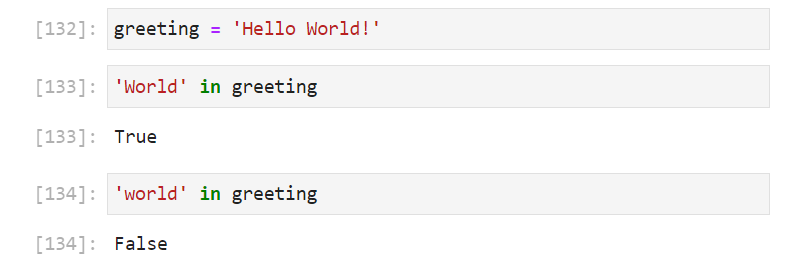

The ```in``` keyword returns a boolean value. Notice that it is case sensitive. The sensitivity can be remvoed with ```caserfold```:

```
'world'.casefold() in greeting.casefold()
```

The methods ```find``` and ```index``` give more information. Instead of a boolean value ```True``` or ```False``` these functions return the numeric index when a substring is in a string. 

The docstrings can be compared by typing in the methods with open parenthesis and pressing shift ```⇧``` and tab ```↹```. In both cases the input arguments are the same ```sub[, start[, end]]```. This syntax indicates that the input arguments are positional only. The square brackets denote that the input argument is optional. Note the last term is also included in another set of square brackets. This means that ```sub``` can be provided as a single positional input argument, ```sub``` and ```start``` can be provided as positional input arguments and finally ```sub```, ```start``` and ```end``` can be provided as positional input arguments. The return value for both methods is the same when successful. The return value differs on failure with ```find``` returning ```-1``` and index returning a ```ValueError```:

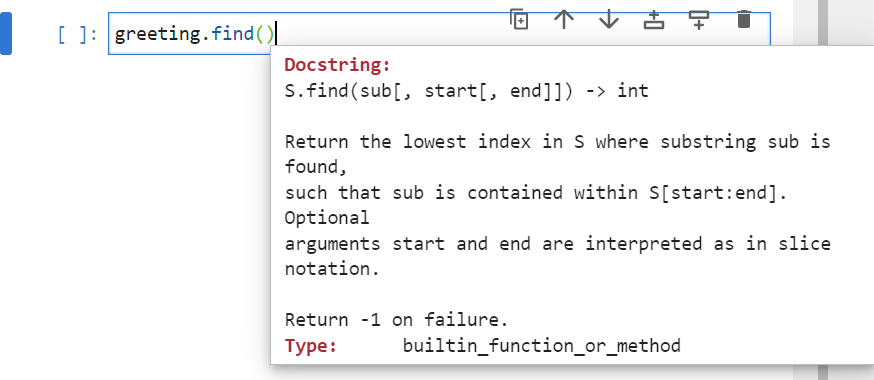

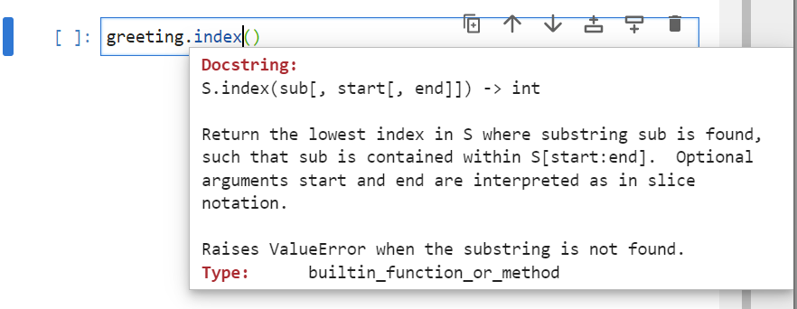

The input arguments denote that the function can be called with one, two or three input arguments. ```sub``` is the substring, start is the starting index to begin the search and end is the terminating index to end the search. 

The substring ```'H'``` can be searched for. Notice that the returned index is ```0```. Python uses zero-ordering indexing meaning the *first* index is ```0```. 

```
greeting.index('H')
```

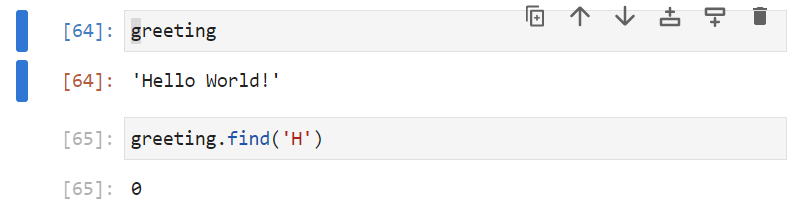

Zero-order indexing is inclusive of the lower bound and exclusive of the upper bound. In ```'Hello World!'```, the first character ```'W'``` in the second word is at index ```6``` and the last character ```'d'``` of the second word is at index ```10```. For the search the lower bound is inclusive meaning the search can begin with a start index of ```6```. The upper bound is exclusive, meaning the search, will search up to but excluding the end boundary. The last character in ```'World'``` is at index ```10```, to include this within the search range, the end bound should be ```1``` higher giving an end of ```11```:

```
greeting.find('d', 6, 11)
```

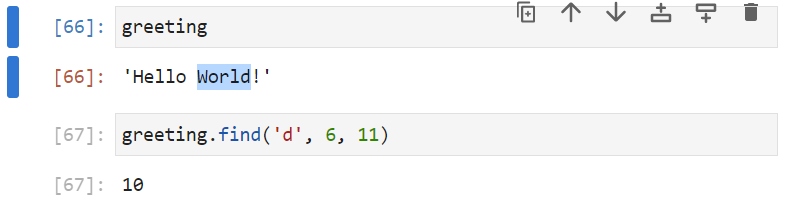

The substring ```'d'``` is found at index ```10``` as expected. The nuances behind zero-order indexing can be seen more explictly by searching for the substring ```'World'``` and changing the ```end``` boundary:

```
greeting.find('World', 6, 11)
greeting.find('World', 6, 10)
greeting.index('World', 6, 11)
greeting.index('World', 6, 10)
```

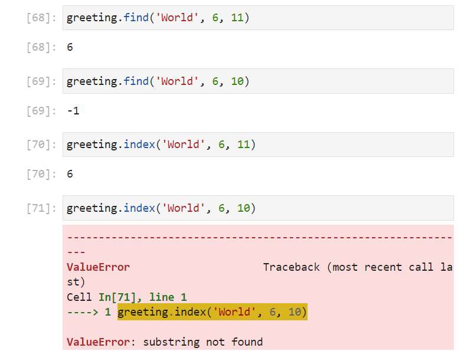

When the end boundary is ```10``` the entire word is included in the search range and the word is found at index ```6```. When the end boundary is instead ```10```, only part of the word is included in the search range and the word is therefore not found. The method ```find``` returns ```-1``` upon failure wheras the method ```index``` returns a ```ValueError```. 

The method ```count``` will count the number of occurances of a substring within a string. The docstring can be examined by typing in the method with open parenthesis and pressing shift ```⇧``` and tab ```↹```:

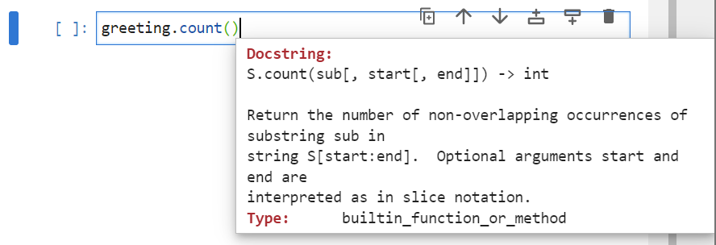

The input arguments are consistent with the ```find``` and ```index``` methods.

The ```count``` of the substrings ```e``` and ```l``` can be counted over the entire string using:

```
greeting.count('e')
greeting.count('l')
```

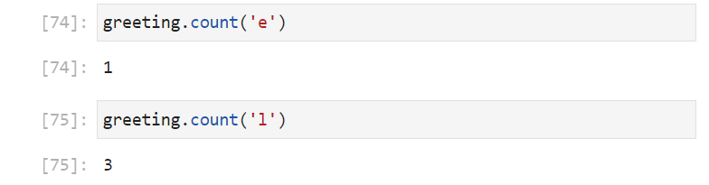

Or the ```count``` of the substring ```l``` over the second word can be counted using:

```
greeting.count('World', 6, 11)
```

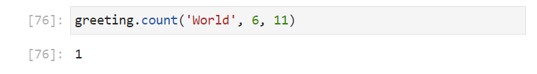

The method ```startswith``` will return a ```bool``` if a string starts with a substring. The docstring can be examined by typing in the method with open parenthesis and pressing shift ```⇧``` and tab ```↹```:

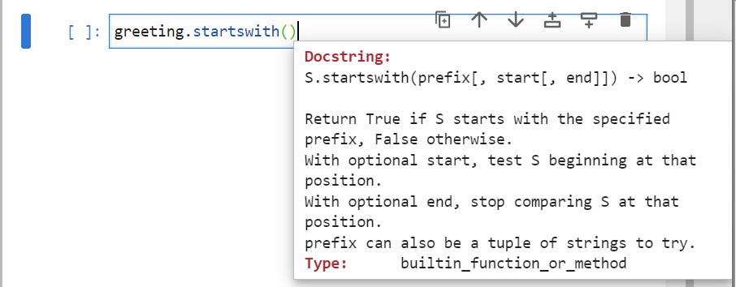

The input arguments are consistent with the ```find```, ```index``` and ```count``` methods with the default range spanning across the entire range:

```
greeting.startswith('Hello')
greeting.startswith('hello')
```

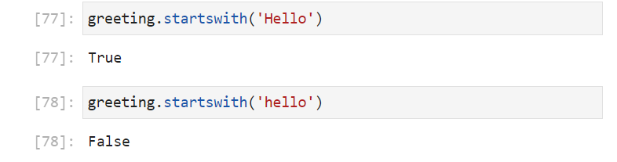

The four methods ```find```, ```index```, ```count``` and ```greeting``` are case dependent. To remove case dependency, the ```casefold``` method is normally used in conjunction to these other methods:

```
greeting.casefold().startswith('hello')
```

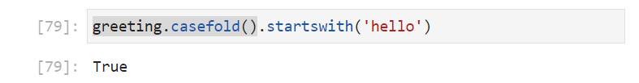

The highlighted section above returns a lower case ```str``` instance. The ```startswith``` method is called upon this lower case ```str``` instance.

The methods ```find``` and ```index``` returned the first index where a substring is found. If the string is viewed as a horizontal line of characters:

```
'Hello World!'
```

When the substring being searched for is ```l```, then the instance found is the first instance from the left. There are complementary methods ```rfind``` and ```rindex``` which begin the search from the right. The input arguments for these methods are consistent to ```find```, ```index```, ```count``` and ```greeting```:

```
greeting.find('l')
greeting.rfind('l')
```

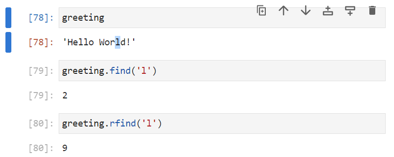

Likewise the method ```startswith``` has a right complementary method ```endswith``` with consistent input arguments.

Supposing:

```
greeting = 'Hello Hello Hello World!'
```

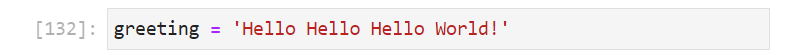

It can be checked whether ```Hello``` is *in* ```greeting```:

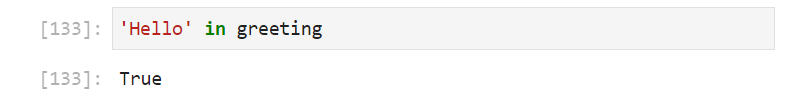

The number of times ```'Hello'``` is in ```greeting``` can be found using:

```
greeting.count('Hello')
```

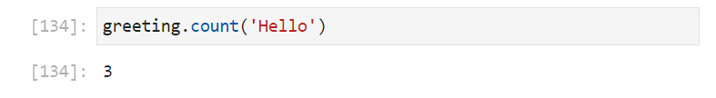

And find can be used using a start value 1 higher than the index of the last successful find to view all the occurances:

```
greeting.find('Hello')
greeting.find('Hello', 1)
greeting.find('Hello', 7)
greeting.find('Hello', 13)
```

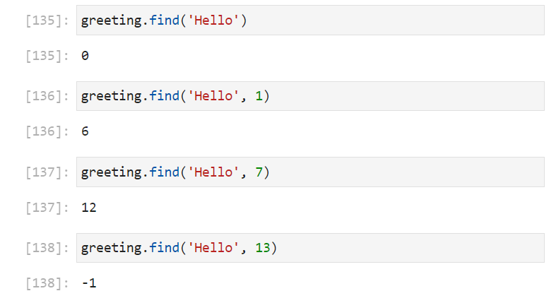

The ```replace``` method can be used to *replace* an old substring ```old``` with a new substring ```new```. Inputting the method followed by shift ```⇧``` and tab ```↹``` will display the docstring. It has an optional argument ```count``` which has a default value of ```-1``` and this means it allows for all replacements by default. The ```/``` trailing the input arguments once again indicates that the input arguments are positional only:

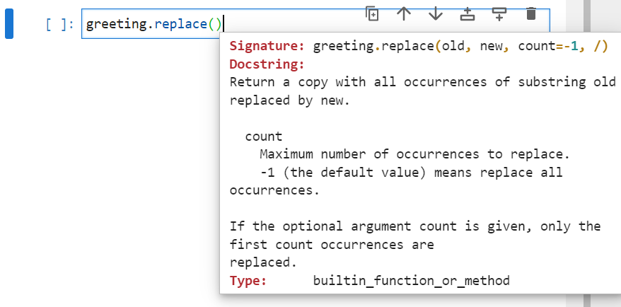

For example:

```
greeting.replace('Hello', 'Bye')
greeting.replace('Hello', 'Bye', 1)
```

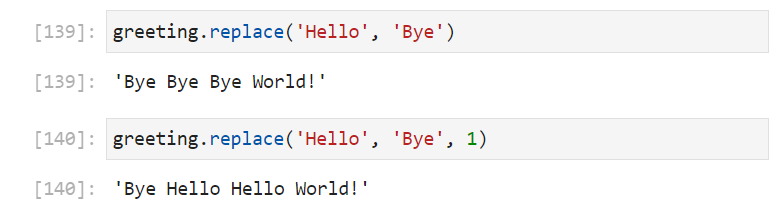

### Iterable

The string is iterable and can be cast into an iterator using the ```iter``` class:

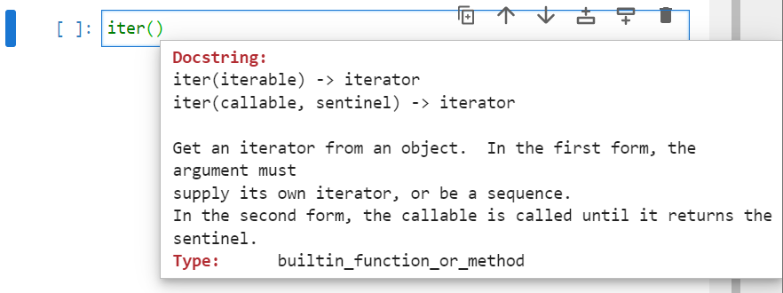

```
iter(greeting)
```

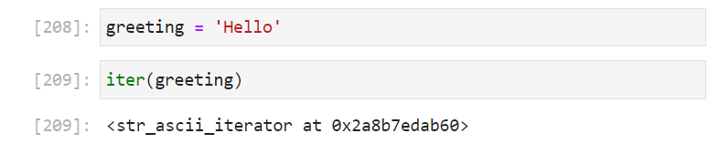

An iterator can only display one character at a time. To advance to the *next* character use the ```next``` function:

```
greeting_it = iter(greeting)
next(greeting_it)
next(greeting_it)
next(greeting_it)
next(greeting_it)
next(greeting_it)
```

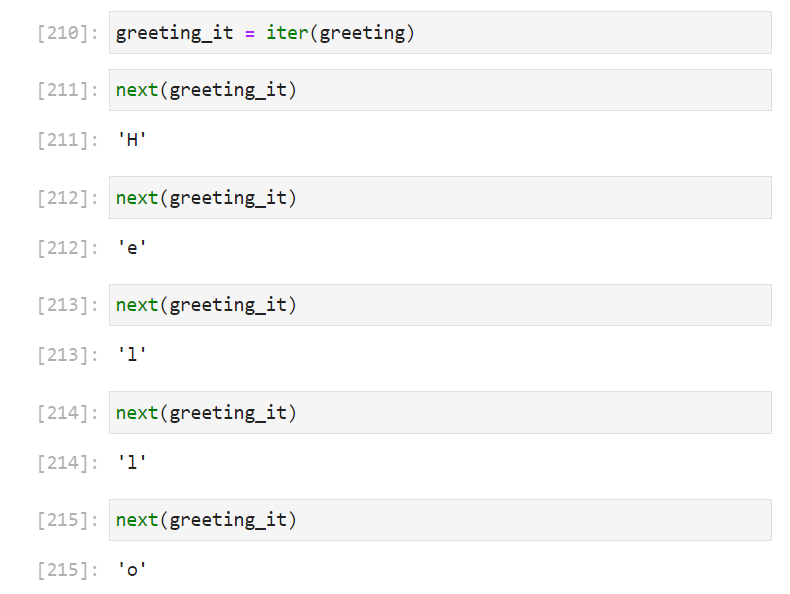

If ```next``` is used when the iterator is exhausted a ```Stop``` iterator error is shown:

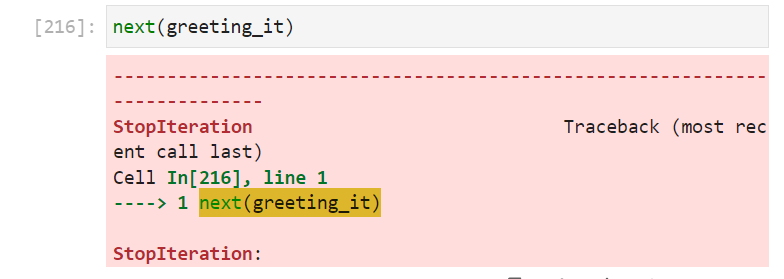

This type of object is created implicitly if a string is used in a for loop.

```
for letter in greeting:
    print(letter)
```

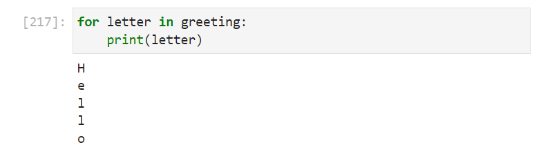

The loop variable ```letter``` is an iterator. Each time the loop is carried out, ```next``` is implicitly called upon it and it takes on the next character in the string.

### Indexing and Slicing

The ```str``` instance ```greeting``` can be reassigned to:

```
greeting = 'Hello World!'
```


```greeting``` can be conceptualised as:

```
    H   e   l
!               l   
d               o
l               ·
    r   o   W
```

With the first character of the string ```'H'``` at index ```0```. Looking at the indexing clockwise, the index for each character is: 

```
    ⓪   ①   ②
⑪               ③   
⑩               ④
⑨               ⑤
    ⑧   ⑦   ⑥
```

The character at a numeric index can be found by indexing a string. To index, square brackets are used to enclose the numeric index. The character at index ```0``` is ```'H'``` as expected:

```
greeting[0]
```

The length of the string is ```12```:

```
len(greeting)
```

This is one higher than the maximum index ```1``` which gives the character ```!```:

```
greeting[11]
```

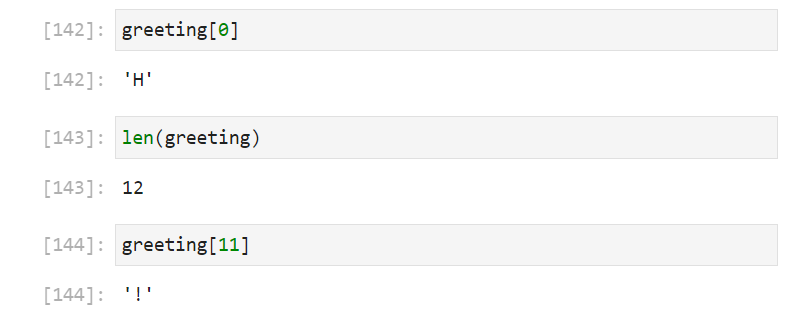

If instead the problem is approached anti-clockwise, the negative index for each character is: 

```
    ⓪   ⓫   ❿
❶               ❾   
❷               ❽
❸               ❼
    ❹   ❺   ❻
```

And for index ```0``` the negative index is negative the length of the Unicode string:

```
    ⓬   ⓫   ❿
❶               ❾   
❷               ❽
❸               ❼
    ❹   ❺   ❻
```

```
    H   e   l
!               l   
d               o
l               ·
    r   o   W
```

So at an index of ```-1``` is the last character ```!```:

```
greeting[-1]
```

The length of the string is ```12```:

```
len(greeting)
```

And at an index of negative the length, is the first character ```'H'```:

```
greeting[-12]
```

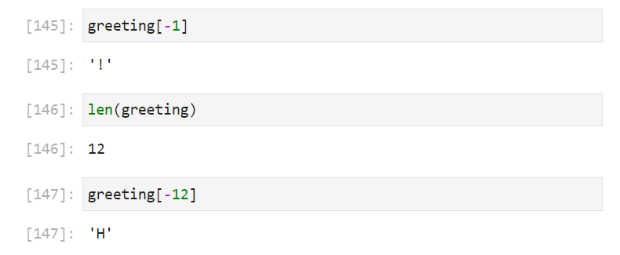

If an index is selected that is out of range an ```IndexError``` displays:

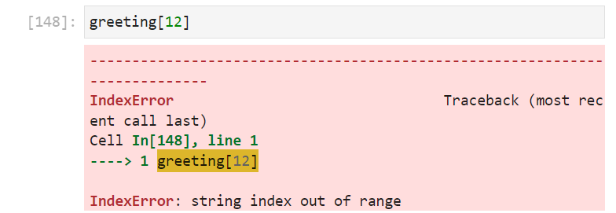

A slice of characters may be returned by use of the colon ```:``` operator. This has the general form ```[start:stop]```. 

Python uses zero-order indexing. The start is inclusive of the index. A start index of 0 can be conceptualised as:

```
  |H   e   l   l   o   ·   W   o   r   l   d   !
```

```
  |⓪   ①   ②   ③   ④   ⑤   ⑥   ⑦   ⑧   ⑨   ⑩   ⑪
```

And the stop is exclusive of the index. A stop index of 6 can be conceptualised as:

```
   H   e   l   l   o   ·  |W   o   r   l   d   !
```

```
   ⓪   ①   ②   ③   ④   ⑤  |⑥   ⑦   ⑧   ⑨   ⑩   ⑪
```

And the slice ```greeting[0:6]``` gives the substring ```'Hello '```:

```
greeting[0:6]
```

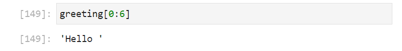

To get each word:

```
greeting[0:5]
greeting[6:11]
```

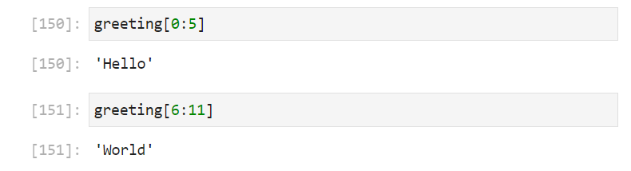

The default boundaries are ```0``` for the start and ```len(greeting)``` for the stop:

```
greeting[:5]
greeting[6:]
greeting[:]
```

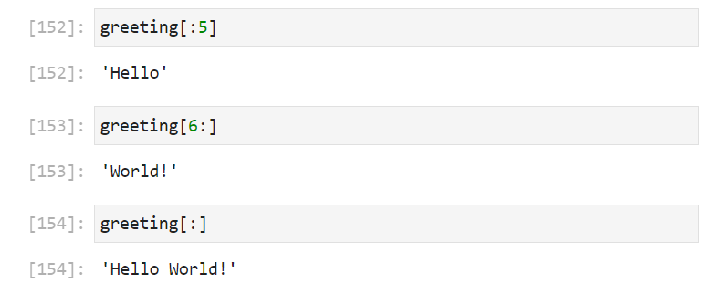

Notice the inclusion of the last character at index ```11``` the ```'!'``` in ```'World!'```. To specify a slice that includes this character explicitly a stop value of one larger than the length of the string neeeds to be used:

```
   H   e   l   l   o   ·   W   o   r   l   d   !  |
```

```
   ⓪   ①   ②   ③   ④   ⑤   ⑥   ⑦   ⑧   ⑨   ⑩   ⑪  |
```

```
len(greeting)
greeting[6:12]
```

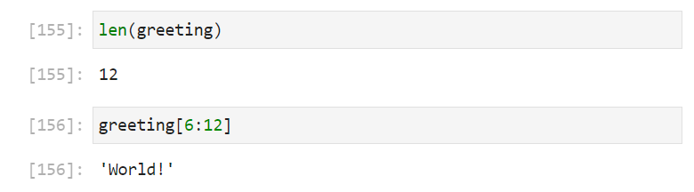

A second colon ```:``` operator can be used to include a step. Slicing has the general form ```[start:stop:step]``` when both colons are used and the default step is ```1```. Every 1 and 2 letters in the first word can be obtained using:

```
greeting[:5:1]
greeting[:5:2]
greeting[1:5:2]
```

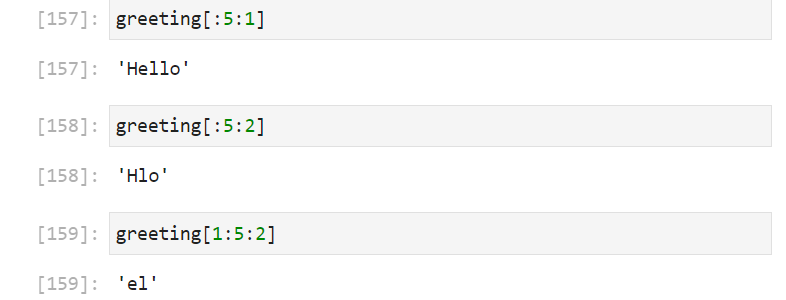

When the step is negative, the string will be reversed:

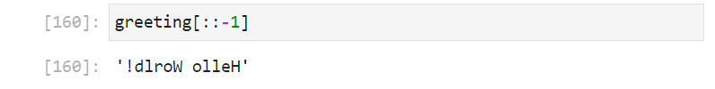

Care needs to be taken when using a reverse step as the start bound is still inclusive and the stop bound is still exclusive. The default value for the start bound becomes the value before ```0``` which is ```-1```. Th ```stop``` value becomes the negative length of the string ```-1```:

```
-len(greeting) - 1
greeting[-1:-13:-1]
```

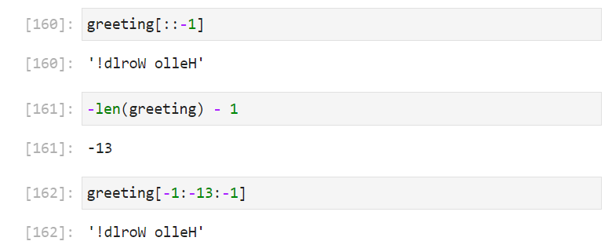

A ```str``` instance is immutable, this means that it is not possible to assign a new value to an index and attempting to do so gives a ```TypeError```.

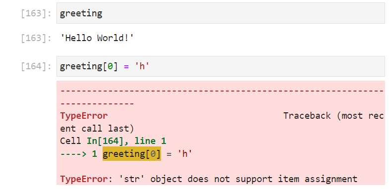

Because the string is immutable, every string method used cannot change the original string and instead returns a new string instance. Some of the methods such as ```count``` return an integer instance instead. Reassignment also does not change the original string instance but merely moves the object name or label from one string instance to another string instance.

### Concatenate, Join and Split

The addition operator ```+``` can be used to concatenate two strings:

```
'Hello' + 'World'
```

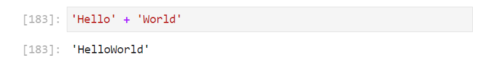

Notice no space was included, and this is because none of the original strings included a space. If a space is desired, it must also be concatenated:

```
'Hello' + ' ' + 'World'
```

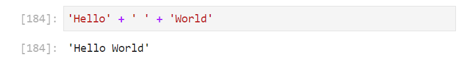

For this reason, a formatted string is usually easier to use and read than string concatenation.

String replication can also be carried out using the multiplication operator ```*```, this requires interaction with an integer:

```
'Hello' * 3
5 * 'World'
```

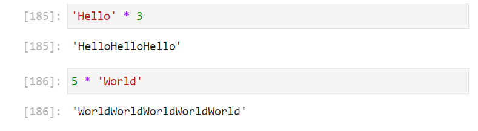

It does not make sense to multiply a string by a string and this gives a ```TypeError```:

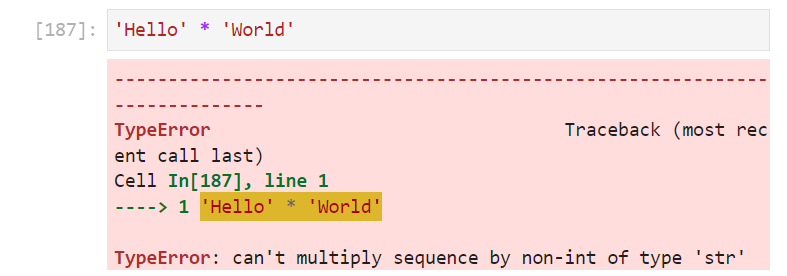

The ```split``` method can be used to split a string into a list of strings using a split character. Supposing:

```
greeting = 'Hello| World| Goodbye'
```

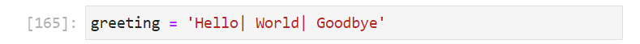

The docstring can be examined by typing in the method with open parenthesis and pressing shift ```⇧``` and tab ```↹```. The keyword input arguments ```sep``` and ```maxsplit``` have default values. They are not trailed by a ```/``` so can be provided as keyword input arguments or positional input arguments:

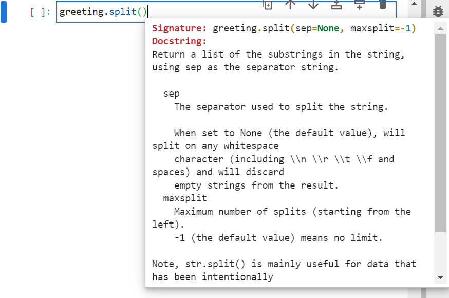

```
greeting.split()
```

If no input argument is supplied, the string is split on whitespace:

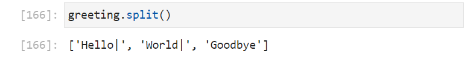

Notice the output is a list of strings. The list uses ```[ ]``` to enclose its contents and a ```,``` to seperate each individual item. In this case each item is an individual string which is each enclosed in its own ```''```.

Alternatively a split character may be provded to split on:

```
greeting.split('|')
```

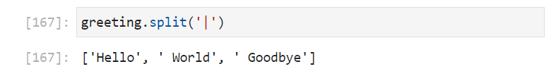

A multiline greeting can be made:

```
multiline_greeting = """Hello World!
Good Morning World!
Good Evening World!
Goodnight World!
"""
```

Notice when it is displayed each line ends with a new line escape character ```\n```:

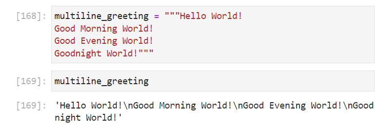

The ```splitlines``` method is essentially the ```split``` method with ```\n``` set to be the split character:

```
greeting_lines = multiline_greeting.splitlines()
greeting_lines
```

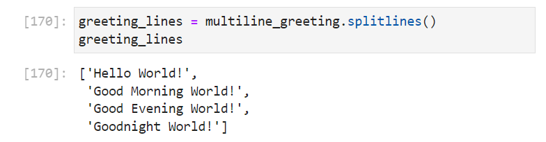

The ```str``` method ```join``` is used to join a list of lines using a string as a seperator. Its docstring can be examined from the string class by typing in the method with open parenthesis and pressing shift ```⇧``` and tab ```↹```:

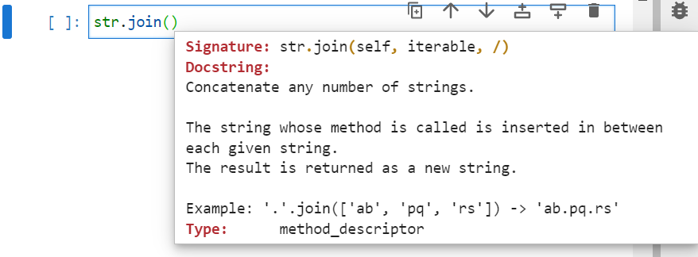

An instance ```self``` is required and it is quite common to use a blank space. This method can also be called from a blank string instance directly. Typically this is done so without assigning the blank space string to a variable name:

```
str.join(' ', greeting_lines)
' '.join(greeting_lines)
```

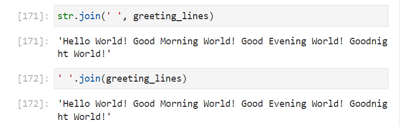

A similar method to ```split``` is ```partition```. The docstring can be examined by typing in the method with open parenthesis and pressing shift ```⇧``` and tab ```↹```. This method only partitions the string once on the first occurance of the partition character ```sep``` and returns a tuple of size 3. The first value is the substring before the partition character, the second value is the partition character ```sep``` and the third value is the rest of the string. The ```/``` trailing the input arguments indicates ```sep``` is positional only:

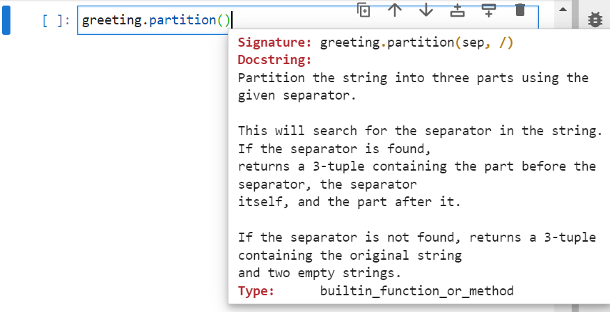

There is an associated ```rpartition``` which approaches the string from the right hand side:

```
greeting
greeting.partition('|')
greeting.rpartition('|')
```

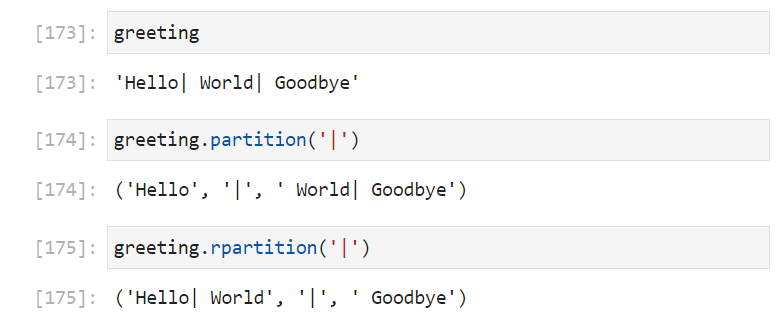

### Comparison Operators

The is equal to operator ```==``` is used to compare if a string is equal to another string:

```
'Hello' == 'Hello'
'hello' == 'Hello'
```

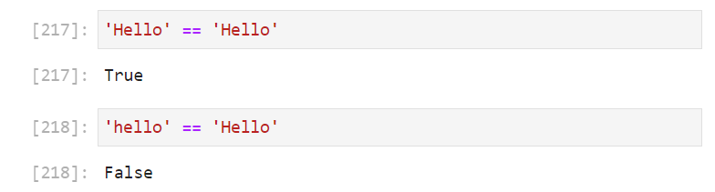

This double operator ```==``` should not be confused with the single operator ```=``` which recall is used for assignment.

```
is_equal = 'hello' == 'Hello'
is_equal
```

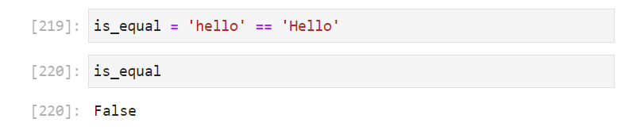

Notice in the above, the statement on the right hand side of the assignment operator is carried out first. The value of this statement is ```False``` and this ```False``` value then gets assigned the object name which can be conceptualised as a label ```is_equal```.

The not equals to operator ```!=``` gives the opposite result:

```
'Hello' != 'Hello'
```

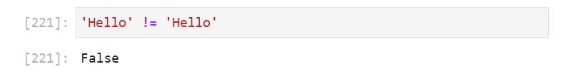

The greater than operator ```>``` checks to see if a string is greater than another string. When first using it the results may be surprising:

```
'a' > 'A'
'a' > 'Apple'
```

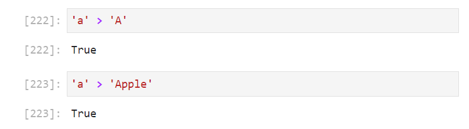

Recall each character is arranged ordinally, so behind the scenes, the number ```97``` is being compared to ```65```:

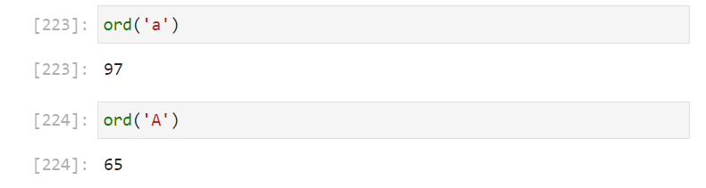

There is also the less than operator ```<``` which checks to see if a string is less than another string:

```
'apple' < 'Apple'
```

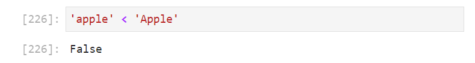

When two strings are equal, the less than and greater than operators will display ```False```. There is the associated less than or equal to operator ```<=``` and greater than or equals to operator ```>=```:

```
'Apple' <= 'Apple'
'apple' < 'Apple'
```

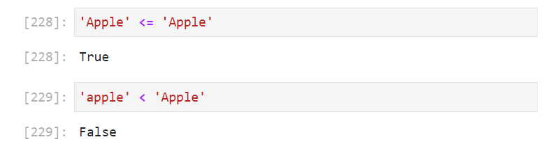

### Data Model Identifiers

To recap a string instance can be created using:

```
greeting = 'Hello World!'
```

A list of identifiers can be viewed by inputting the object name ```greeting.``` followed by a tab ```↹```:

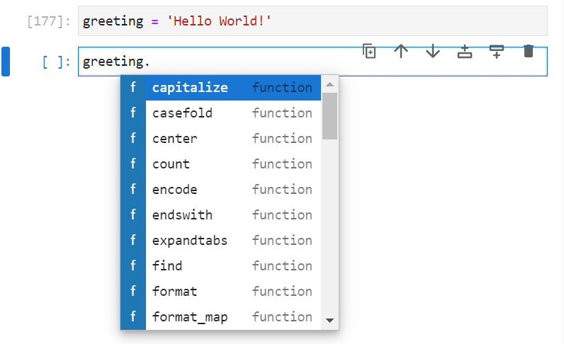

These methods are called from the string instance. The string instances act on the string instance data but some require additional input arguments which must be supplied:

```
greeting.casefold()
greeting.replace('Hello', 'Bye')
```

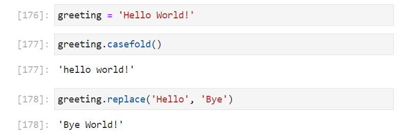

However some inbuilt functions have been used on a string instance:

```
len(greeting)
print(greeting)
repr(greeting)
```

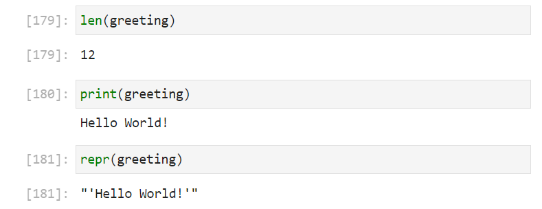

Some keywords have been used with string instances:

```
'Hello' in greeting
```

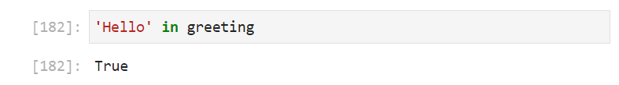

And some operators have been used with string instancesa:

```
'Hello' + 'World'
'Hello' * 3
```

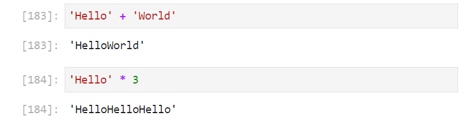

Indexing and slicing has also been carried out on a string:

```
greeting[0]
greeting[0:5]
```

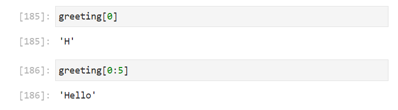

The behaviour of the inbuilt functions and operators on ```str``` instances are governed by data model identifiers. The data model identifiers are hidden by default when the instance name followed by a dot ```.``` and tab ```↹``` are pressed:

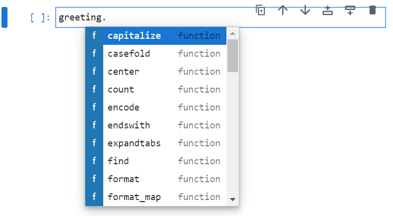

The data model identifiers can however be shown when the instance name, in this case ```greeting``` followed by a dot ```.__``` and tab ```↹``` are pressed:

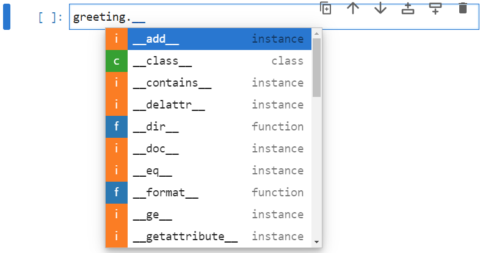

The data model identifiers begin and end with a **d**ouble **under**score. These data model identifiers are often colloquially known as dunder identifiers.

Many of the identifiers in this list display as instances, for example ```__repr__```: 

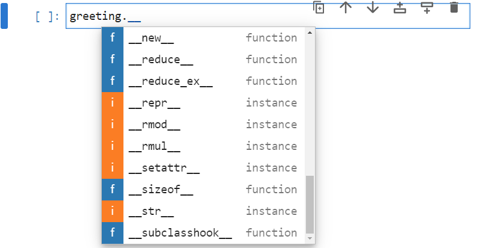

These come from the ```str``` class itself and can be shown when the ```str``` class, followed by a dot ```.__``` and tab ```↹``` are pressed:

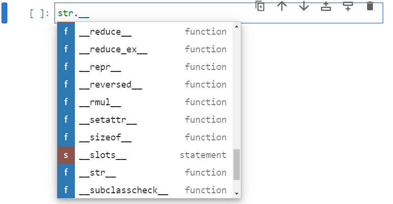

One point of confusion is that some of the data model identifiers for example ```__repr__``` displays as an instance when the list of identifiers is populated from a ```str``` instance. On the other hand, the same data model identifiers display as a function when the list of identifiers is populated from the ```str``` class. Despite displaying as an instance i.e. another object when the identifier is accessed from an instance of the string class, the shift ```⇧``` and tab ```↹``` key can be pressed to view the docstring: 

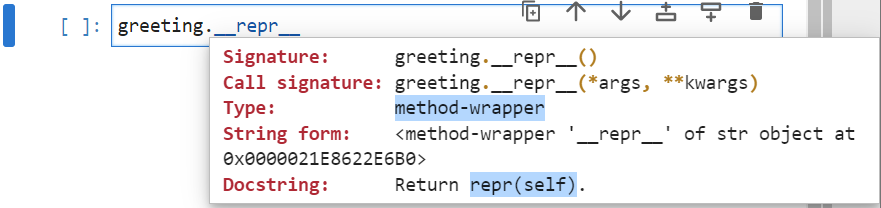

Notice that the docstring states that the data model method is a method wrapper and returns ```repr(self)```. This means that the docstring of the function ```repr``` from ```builtins``` can be examined for more details:


The following:

```
repr(greeting)
```

is more conventionally used opposed to:

```
greeting.__repr__()
```

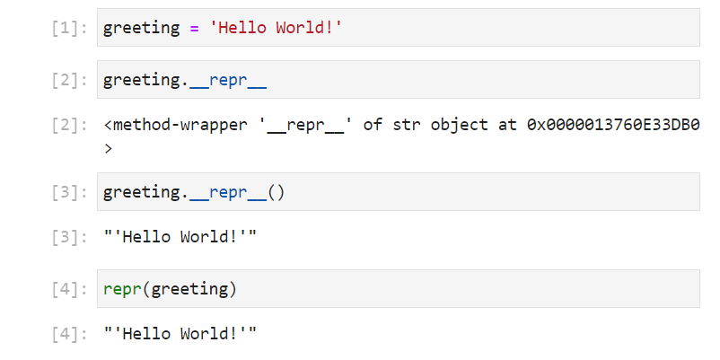

Although ```repr``` is used, under the hood the ```__repr__``` method is defined in the class ```str``` and as a method wrapper controls the behaviour of the ```builtins``` function ```repr```.

A similar case can be seen for the informal representation ```__str__``` which acts as a method wrapper for the ```str``` class:

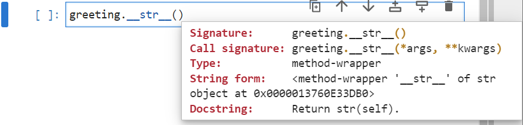

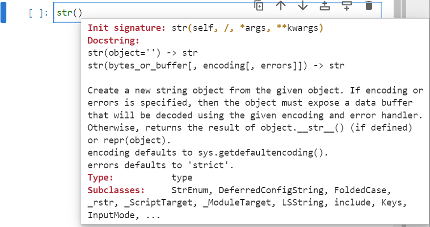

All objects in Python including the ```str``` class are based upon the ```object``` class. Therefore all the data model identifiers in the ```object``` class are also present in the ```str``` class:


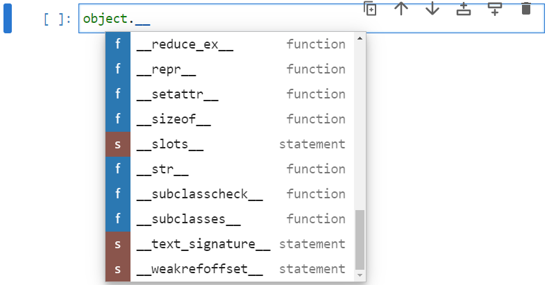

This includes ```__repr__``` and ```__str__``` which indicates that all Python objects have a formal and informal string representation.

Every ```object``` also has the data model identifiers ```__new__``` which is used to construct a new instance of the class. In the documentation ```self``` is used as a placeholder to mean *this instance*:

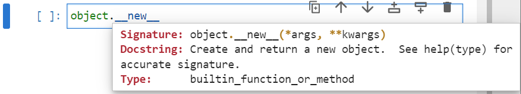

When the following is used:

```
greeting = 'hello world!'
```

Or more fully:

```
greeting = str('hello world!')
```

```self``` gets assigned to the label ```greeting``` for this instance.

Likewise, an instance of the ```object``` class can be instantiated:

```
instance = object()
```

```self``` gets assigned to the label ```instance``` for this instance.

The ```__new__``` data model constructor, calls the ```__init__``` data model initialization signature and is used by ```__new__``` to populate a new instance with instance data during construction:

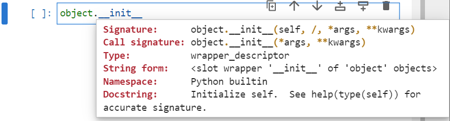

Notice that ```__init__``` does not have a return statement as it is used to initially populate an instance with instance data. The ```__new__``` uses ```__init__``` to initialize a new object which is returned. 

When the class name is input followed by open parenthesis and the shift ```⇧``` and tab ```↹``` keys are pressed the docstring of the initialization signature displays. Recall the purpose of ```__init__``` is to provide an instance with instance data, the ```object``` class requires no instance data, whereas the ```str``` class does:

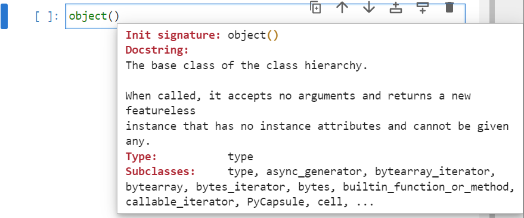

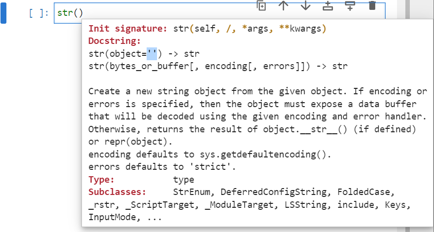

Just to clarify, as it leads to a source of confusion for begineers, although the initialization signature displays here and prompts the user to provide instance data. Recall that ```__init__``` has no return value. Instead the ```__new__``` data model identifier is called which in turn calls ```__init__``` and forwards the supplied instance data to ```__init__``` and finally returns the new instance with the instance data. ```__new__``` is the constructor and ```__init__``` is the initializer.

```
greeting = str('hello world!')
instance = object()
```

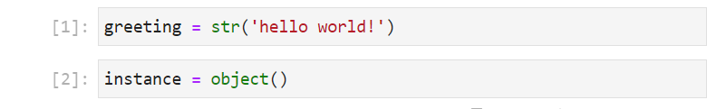

Every Python object has a data model identifier ```__class__``` which can be used to return the class type of the object:

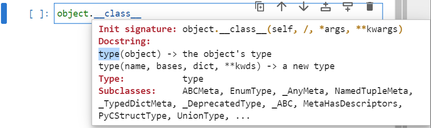

This uses the inbuilt class ```type```:

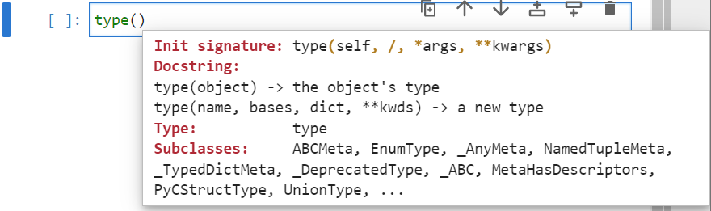

```
type(greeting)
type(instance)
```

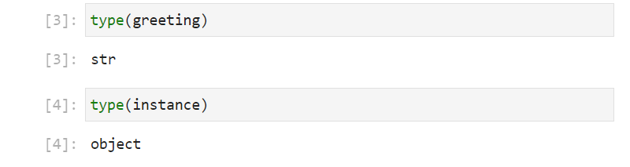

Every class has the data model identifier ```__doc__```:

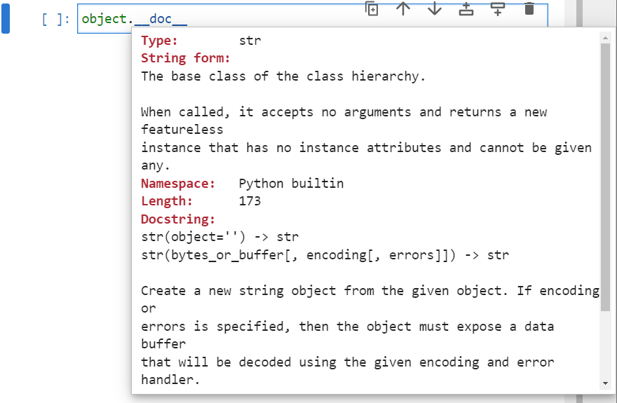

This returns a class attribute in the form of a string. A class attribute is an attribute that is defined in the class and is constant across all instances of the class:

```
object.__doc__
str.__doc__
```

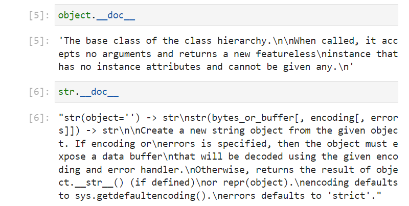

```
instance.__doc__
greeting.__doc__
```

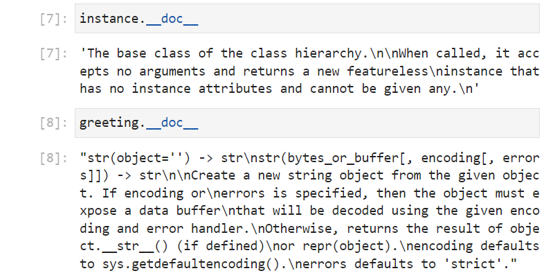

This is normally provided alongside, some other details when ```?``` is used:

```
? instance
type(instance)
repr(instance)
instance.__doc__
```

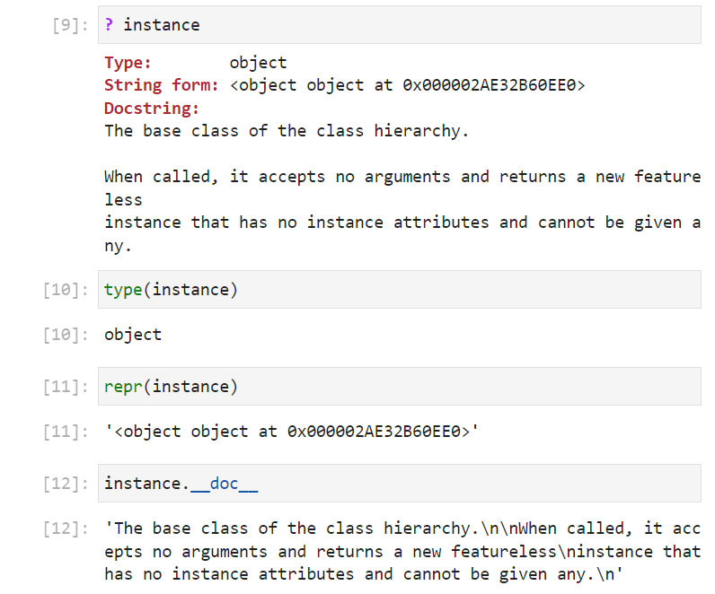

```
? greeting
```

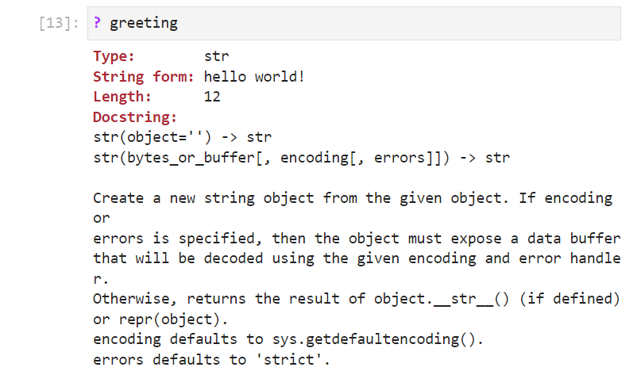

All objects have a ```__sizeof__``` data model identifier, which is used to return the size of the object in bytes:

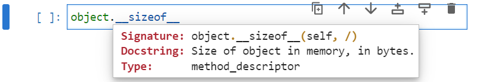

```
instance.__sizeof__()
greeting.__sizeof__()
```

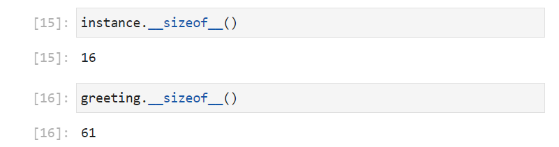

The ```getsizeof``` function from the ```sys``` module is more commonly used for this purpose:

```
import sys
sys.getsizeof(instance)
sys.getsizeof(greeting)
```

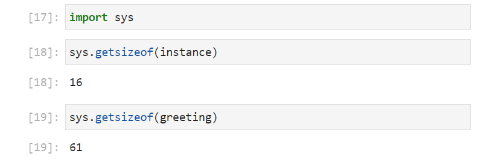

The ```__format__``` data model identifier give details about incorporating an object in a format string, i.e. controls how the format specifiers work:

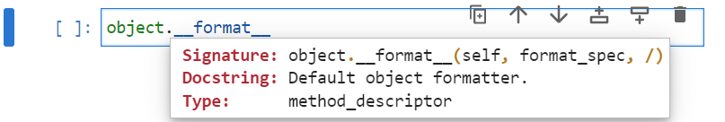

```
f'greeting is formatted as a string: {greeting :s}'
f'greeting is formatted as a string: {greeting :20s}'
f'greeting is formatted as a string: {greeting :020s}'
```

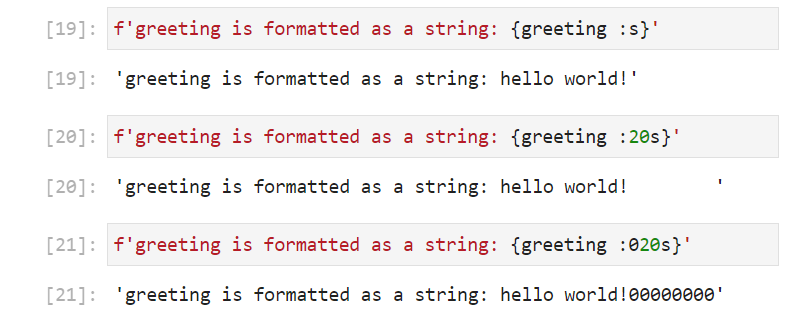

The data model identifier ```__hash__``` returns the ```hash``` value of an object:

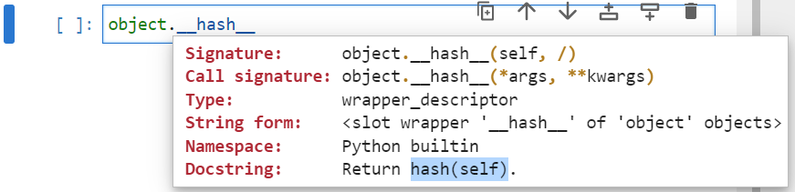

Only immutable objects, that is objects that once created cannot be modified are hashable. Instances of the ```object``` and ```object``` classes are immutable and hsahable:

```
hash(instance)
hash(greeting)
```

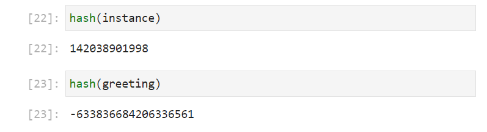

A hashable value is permissible as a key in a dictionary or mapping. For example, the three keys ```'red'```, ```'green'``` and ```'blue'``` are strings:

```
colors = {'red': [1, 0, 0], 
          'green': [0, 1, 0], 
          'blue': [0, 1, 1]}
```

Once the dictionary is made, the key may be used to index into the dictionary, returning the corresponding value:

```
colors['red']
```

The key can be assigned to an object name (a label can be added to it). Indexing can then be done with the label name:

```
key = 'green'
colors[key]
```

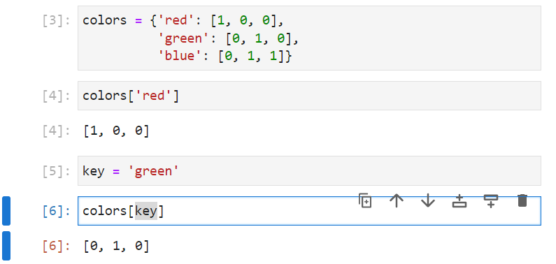


Hashing shouldn't be confused with the ```id``` which is a unique identifier available for all objects:

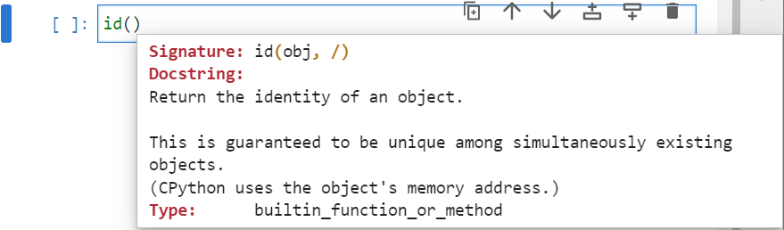

```
id(instance)
id(greeting)
```


The data model identifier ```__dir__``` returns the directory ```dir``` value of an object. Each object can be thought of as a directory or folder and within that directory or folder are other directories or folders. In the case of a Python object, these are other objects and functions:

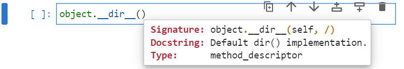

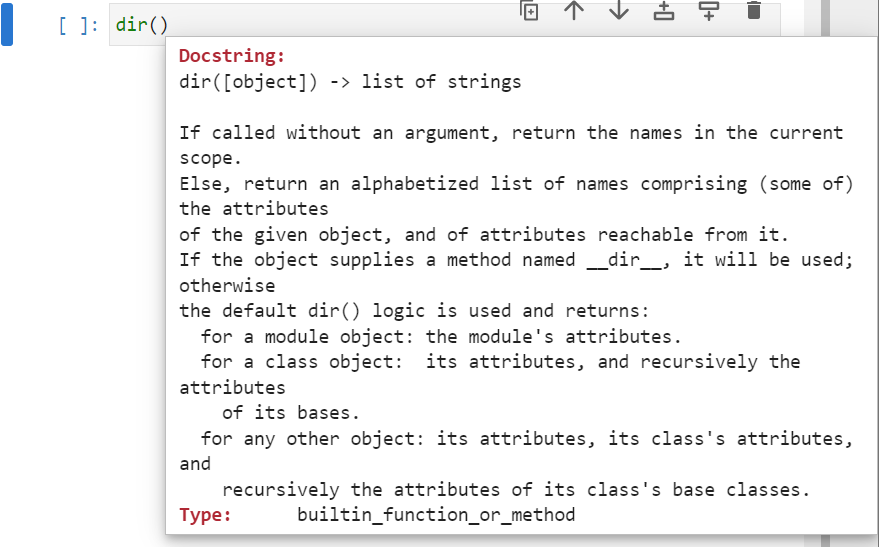

Most identifiers can be displayed as a list of strings using the directory function ```dir```. This function treats each Python object as a directory or folder and lists all the other objects as files in this folder:

```
dir(instance)
```

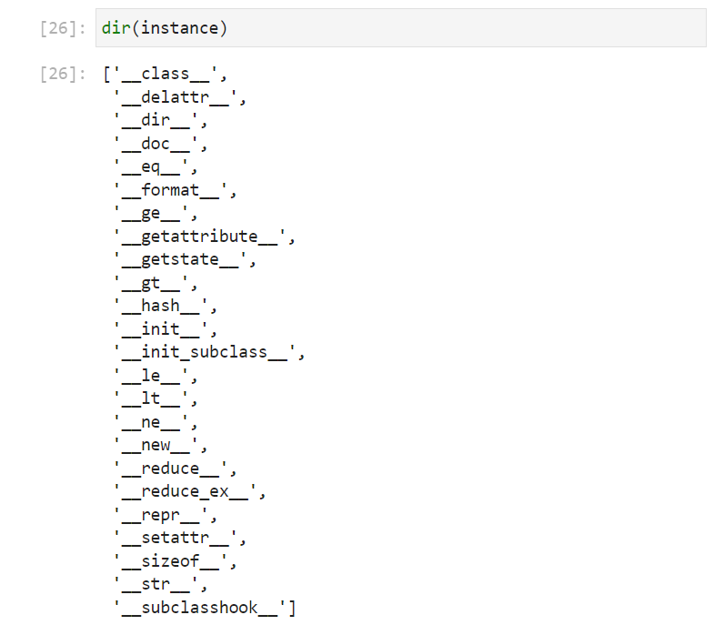

To view this list horizontally the pretty print function ```pprint``` can be used from the pretty print module ```print```:

```
from pprint import pprint
pprint(dir(instance), compact=True)
pprint(dir(greeting), compact=True)
```

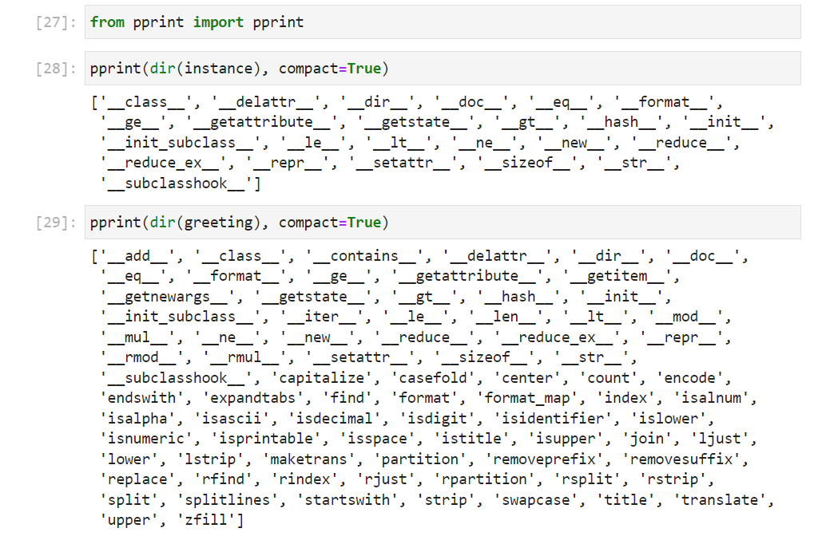

The ```__getattribute__```, ```__setattr__``` and ```__delattr__``` data model identifiers are used to get, set and delete attributes. An object instance and a string instance have no public attributes assigned to them so are not used for these classes.

The data model identifiers ```__getstate__```, ```__reduce__```, ```__reduce_ex__``` and ```__getnewargs__``` are used by the pickle module to serialise Python objects.

A Python class can be displayed as a dictionary using the data model identifier ```__dict__```. The dictionary displays all the identifiers of the class

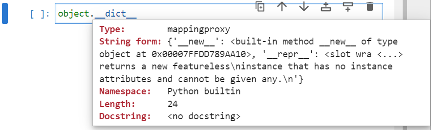

```
pprint(object.__dict__, compact=True)
pprint(str.__dict__, compact=True)
```


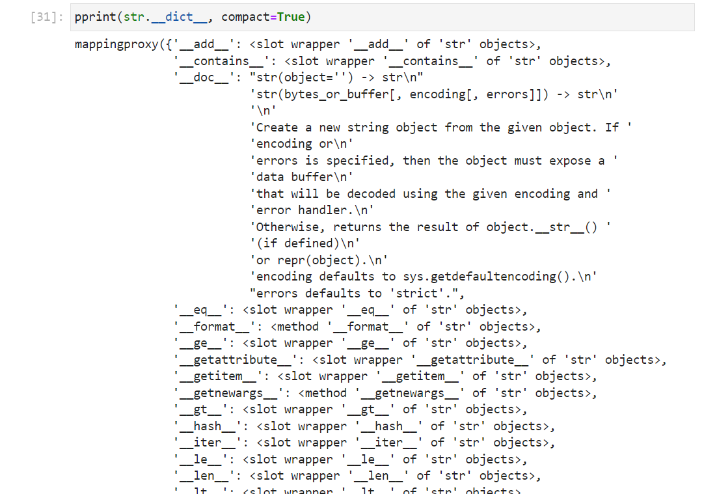

Most of the other data model identifiers available from the ```object``` class relate to subclassing. A subclass is a class that is typically based on another class, the superclass but has additional functionality. The method resolution order ```__mro__``` can be displayed using:

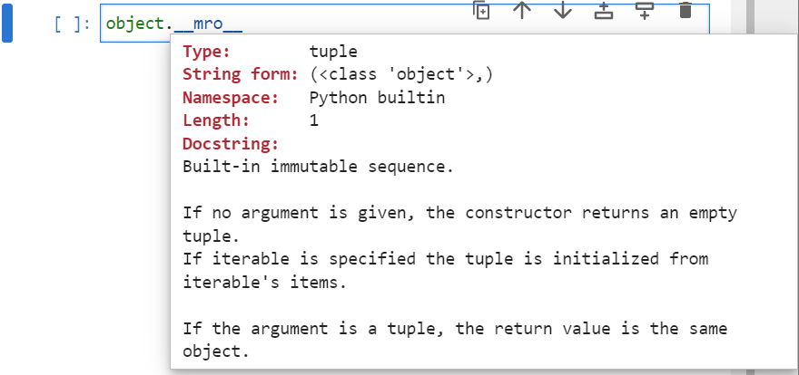

```
object.__mro__
str.__mro__
```

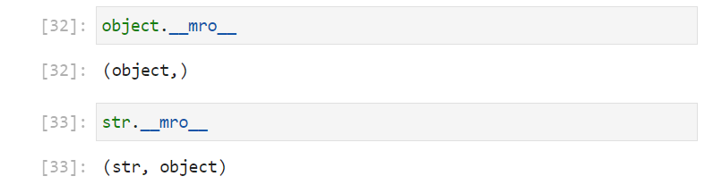

The ```object``` has no superclass, this means all the methods are defined in the ```object``` class directly.

The ```str``` has ```object``` as a superclass. What this means is that some of the methods used for the ```str``` class are defined directly in the ```str``` class and others are inherited from the ```object``` class. Notice when ```str.__dict__``` was examined that there was no entry for ```__dir__```, this is because ```__dir__``` is inherited from the ```object``` class and is therefore shown in ```object.__dir__```. There is an entry for ```__doc__``` in both dictionaries, this means that the docstring for the ```str``` class has been updated in the ```str``` class. The method resolution order states that this updated version should be used for any ```str``` class and any ```str``` instance.

The data model identifier ```__isinstance__``` checks whether an instance is an instance of a particular class:


```
object.__instancecheck__(instance)
object.__instancecheck__(greeting)
```

Note that both ```instance``` and ```greeting``` are instances of the class ```object```. This is because ```object``` is the superclass:

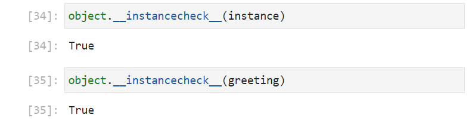

---
Small section to be updated
---


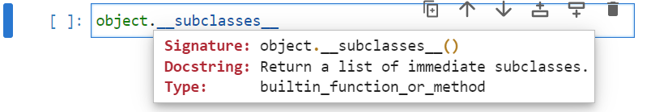

```
object.__subclasses__()
```

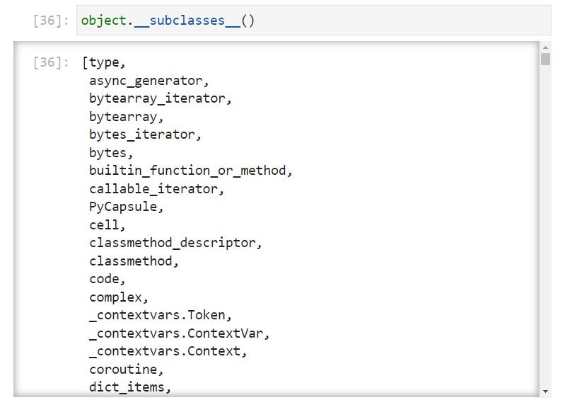

```
str.__subclasses__()
```

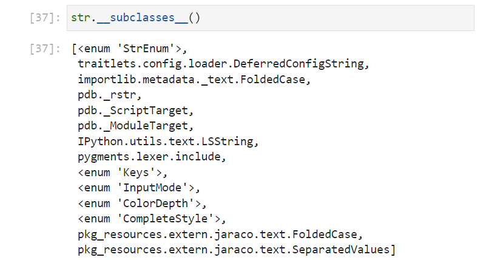


```
object.__subclasscheck__(str)
```

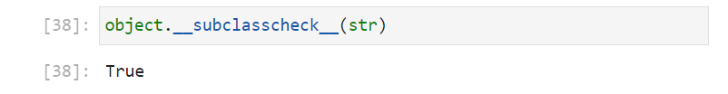


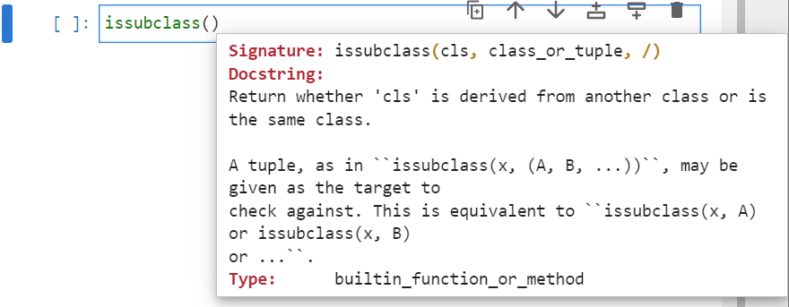

```
issubclass(str, object)
```

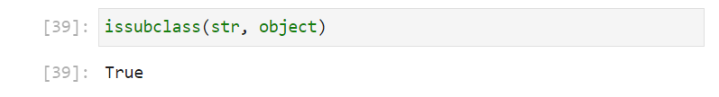


slots

call

base bases

init_subclass


The last data model identifier is ```__subclasshook__``` which is used for Abstract Base Classes.


```__len__```

```__iter__``` is a collection data model identifier available in both immutable and mutable sequences. It controls the behaviour of the ```iter``` class.

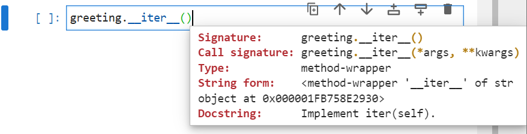

```__contains__``` is a collection data model identifier available in both immutable and mutable sequences. It controls the behaviour of the ```in``` keyword:

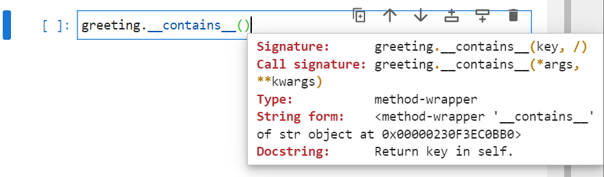

```__getitem__``` is an collection data model identifier available in both immutable and mutable sequences. Notice there is no associated ```__setitem__``` as the string is immutable. This controls indexing and is why it is possible to read a value at an index but not allowed to set a value at that index:

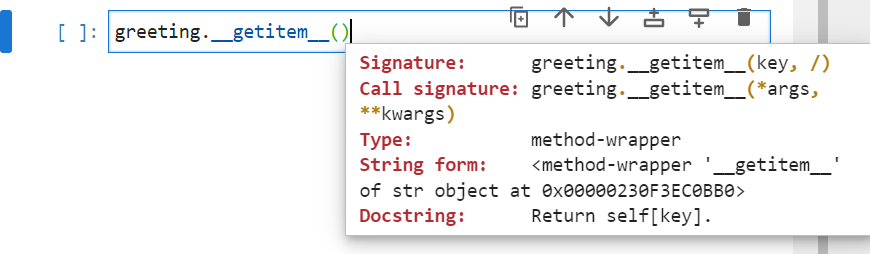

The addition ```__add__``` data model identifier controls the behaviour of the ```+``` operator:

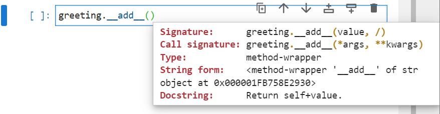

The instance to the left hand side of the ```+``` operator is know as ```self``` and the instance to the right hand side is known as ```value```:

```
greeting = 'Hello'
greeting.__add__('World')
greeting + 'World'
```

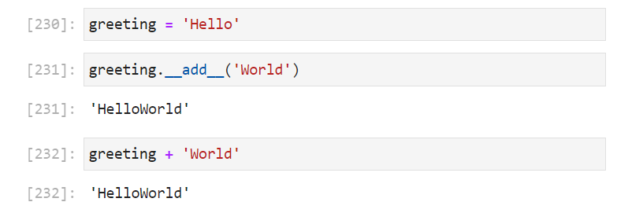

The multiplication ```__mul__``` data model identifier controls the behaviour of the ```*``` operator. Recall the value to be multiplied has to be an integer:

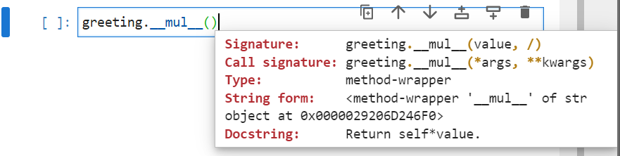

```
greeting * 3
```

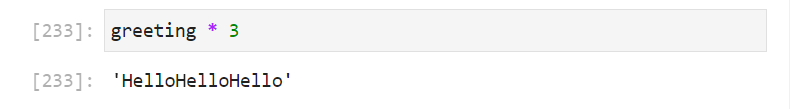

The reverse multiplication ```__rmul__``` data model identifier controls the behaviour when the positions around the ```*``` operator is reversed:

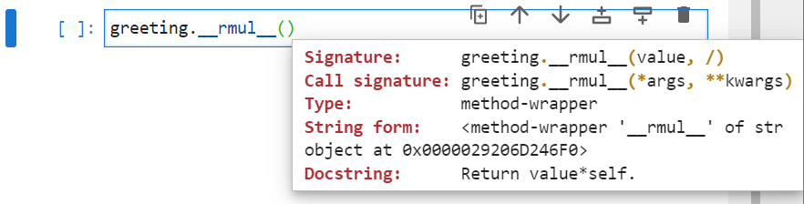

```
3 * greeting
```

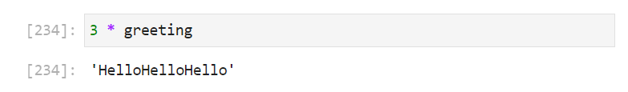

The modulo data model identifier ```__mod__``` data controls the behaviour of the ```%``` operator which is used with a tuple for legacy string formatting. The reverse modulo identifier ```__imod__``` is used when the positions around the ```%``` operator are reversed.

The ```__format__``` method is used to specify how the string object behaves with format specifiers in a formatted string.

The six comparison data model identifiers equals ```__eq```, not equals ```__ne__```, less than or equal to ```__le__```, less than ```__lt__```, greater than or equal to ```__ge__``` and greater than ```__gt__``` control the behaviour behind the 6 comparison operators ```==```, ```!=```, ```<=```, ```<```, ```>=``` and ```>``` respectively.

## Binary and Hexadecimal

Recall, the ```ord``` function can be used to return the decimal integer ordinal value of a character:

```
ord('A')
```

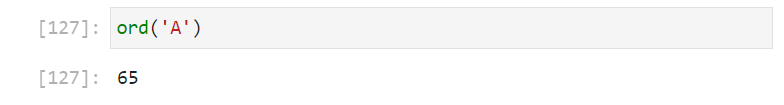

Notice the output has no quotations so is a decimal number and not a string.

This can be shown as a binary string using:

```
bin(ord('A'))
```

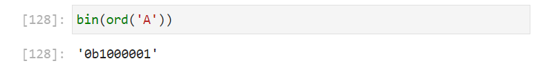

Notice the output is a string as seen by the quotations. From the line above the code highlighted is a string, and a string method can be used on this string. The prefix ```'0b'``` can be removed using the string method ```lstrip```. 

```
bin(ord('A')).lstrip('0b')
```

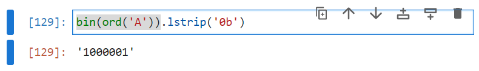

This gives a string without the prefix. This number can be cast back into a decimal integer.

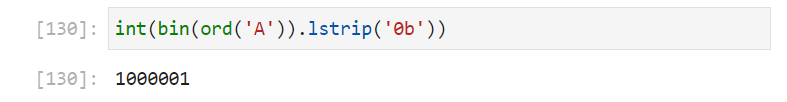

Notice once again the output has no quotations so is a decimal number and not a string.

For convenience this can now be stored using a variable name:

```
num_cap_a = int(bin(ord('A')).lstrip('0b'))
```

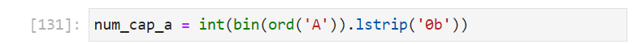

A formatted string can be produced to display the string literal ```'A'``` and its corresponding byte sequence. Recall that double quotations are used to create a string with a string literal and there are 8 bits in a byte so;

```
f"The byte sequence for 'A' is {num_cap_a :08d}"
print(f"The byte sequence for 'A' is {num_cap_a :08d}")
```

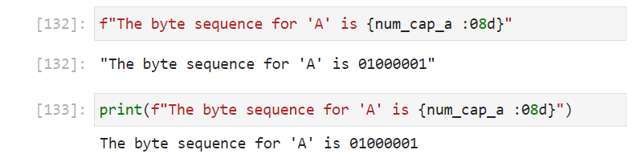

This can be done more directly by use of the binary format specifier:

```
f"The byte sequence for 'A' is {ord('A') :08b}"
print(f"The byte sequence for 'A' is {ord('A') :08b}")
```

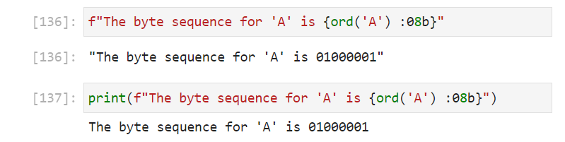

Binary is not very human readible. It is easy to misread how many zeros are in the number above and make a transcribing error by counting 1 too many or 1 to less for example. As a consequence each binary number is generally split up into groups of four:

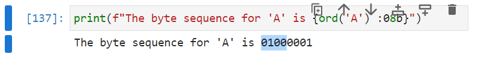

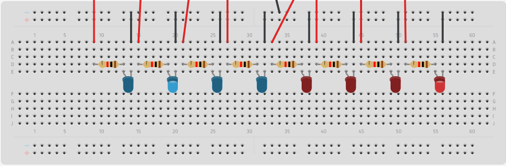

```2 ** 4``` gives 16 combinations and another numbering system called the hexadecimal numbering system uses 16 unique numeric digits to display a number. 

|Binary Value|Hexadecimal Value|
|---|---|
|0000|0|
|0001|1|
|0010|2|
|0011|3|
|0100|4|
|0101|5|
|0110|6|
|0111|7|
|1000|8|
|1001|9|
|1010|a|
|1011|b|
|1100|c|
|1101|d|
|1110|e|
|1111|f|

In the hexadecimal numbering system ```a```, ```b```, ```c```, ```d```, ```e``` and ```f``` are numeric digits and should not be conceptualised as letters or characters.

Recall that the character ```'A'``` is the ordinal integer ```65```:

```
ord('A')
```

It can be expressed as a binary string using the binary function ```bin```:

```
bin(ord('A'))
```

Alternatively it can be expressed as a hexadecimal string using the hexadecimal function ```hex```:

```
hex(ord('A'))
```

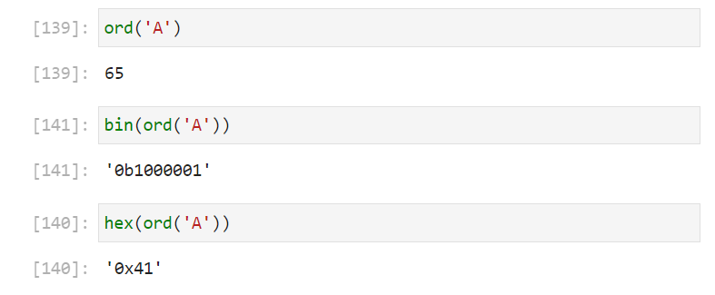

And this is expected from the table above as the hexadecimal digit ```4``` corresponds to the binary sequence ```0100``` or ```100``` if the leading zero is omitted. And the hexadecimal digit ```1``` corresponds to the binary sequence ```0001```. Placing them together gives ```41```. 

To prevent confusion with decimal integers the binary numbers are normally expressed as string with the ```0b``` prefix and the hexadecimal numbers are expressed as strins using the ```0x``` prefix:

```
for num in range(16):
    print(f"dec {num :2d}, hex '{hex(num)}',  bin '{bin(num) :s}'")
```

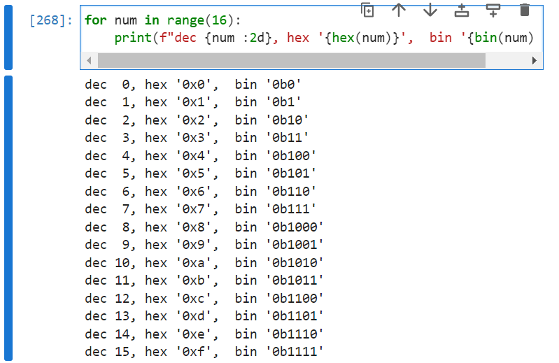

The escape character ```\x``` is used to insert a hexadecimal value into a string:

```
'\x41'
```

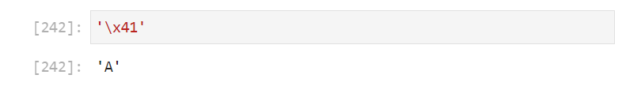

The non-printable ASCII characters are shown using this notation. This is seen in the less common whitespace characters

```
string.whitespace
```

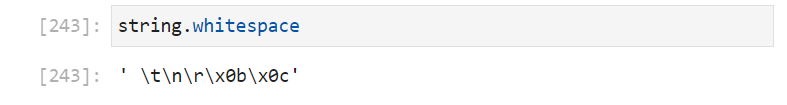

In ASCII bytes 33 to 128 include most printable characters, it is worthwhile seeing each character in Hexadecimal:

```
for num in range(33, 128):
    print(chr(num), hex(num), sep='   ', end='\t')
```

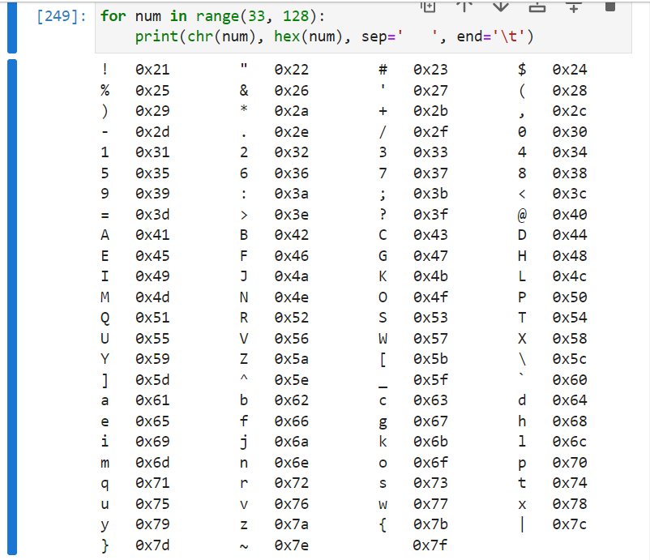

And the whitespace characters:

```
hex(ord(' ')) # space
hex(ord('\t')) # tab
hex(ord('\n')) # new line
hex(ord('\r')) # carriage return
```

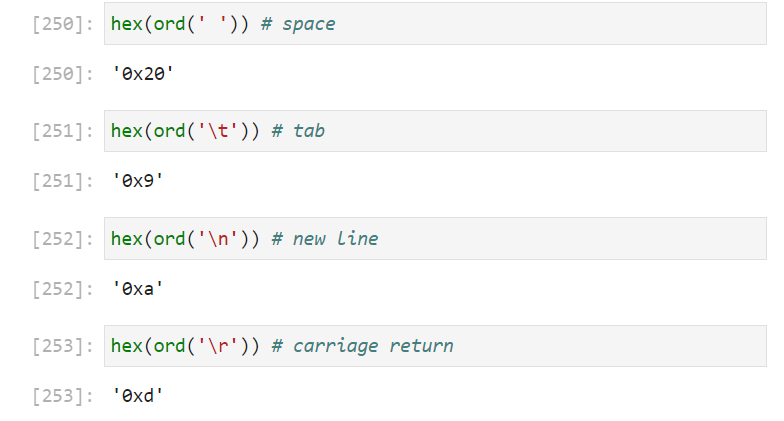

Using the above, ```greeting``` can be constructed from hexadecimal escape characters:

```
greeting = '\x48\x65\x6c\x6c\x6f\x20\x57\x6f\x72\x6c\x64\x21'
greeting
```

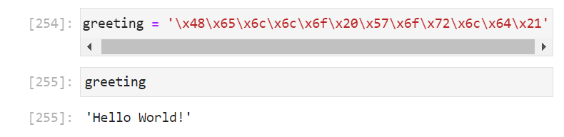

To recap, each ASCII character can be inserted as a 2 digit hexadecimal escape character. 2 digit hexadecimal corresponds to 8 bits which is 1 byte. 

### Translate and Translation Table

ASCII uses the first 128 characters, however a byte has 256 values. In the past supplementary characters were used for Latin 1 and a gap was left for regional variations:

```
for num in range(128, 256):
    print(chr(num), hex(num), sep='   ', end='\t')
```

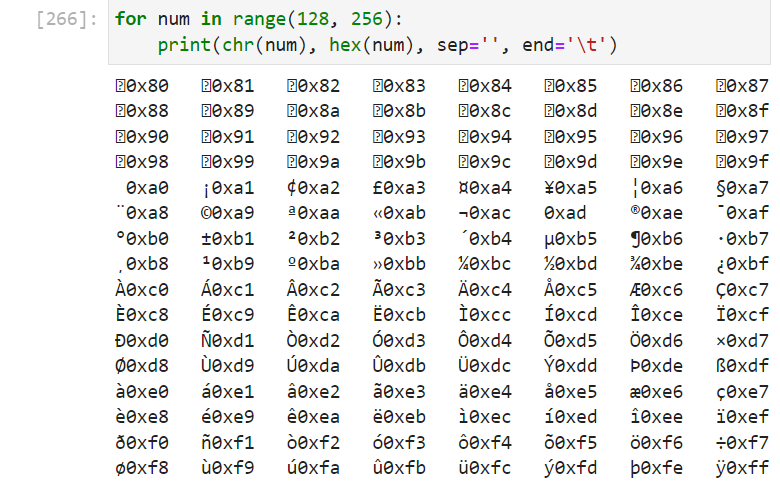

This gap can still be filled in using the str method ```maketrans``` and supplying a translation mapping in the form of a dictionary:

```
translation_table = str.maketrans({int('0x80', 16): 'α',
                                   int('0x81', 16): 'β',
                                   int('0x82', 16): 'γ',
                                   int('0x83', 16): 'δ',
                                   int('0x84', 16): 'ε'},)
translation_table
```

Once a translation table is available, it can be used to create text that uses these bytes:

```
'\x48\x65\x6c\x6c\x6f\x20\x80\x84'.translate(translation_table)
```

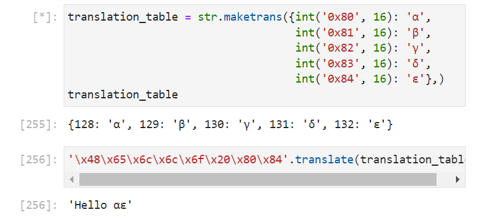

In the past different translation tables were used regionally. Larger translation tables were used in countries such as Japan which have a completely different characterset to English. This became problematic when the world became more connected via the world wide web. Websites were shown in Mojibake, under the hood, there was a systematic replacement of symbols with completely unrelated ones due to the website being written with one translation table in mind and translated with a completely different translation table:


### Unicode

Unicode Transformation Format was a world wide collaboration to essentially create one large translation table encompassing every character used in every language. As there are more characters, more memory is required to encode the character set. 

For UTF-16 encoding (16 bit or 2 bytes) are used for each character, therefore a 4 digit hexadecimal escape characters is required. The Greek letter ```λ``` for example has the Unicode sequence ```U03BB```. To insert it as an escape character use ```\u03bb```. Note the ```0``` prefix has to be included as the ```\u``` escape sequence expects 4 characters.

```
'\u03bb'
```

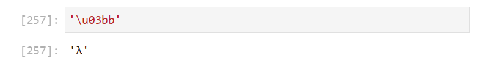

ASCII is a subset of unicode but the leading zeros need to be added to use them with the unicode escape sequence:

```
greeting = '\u0048\u0065\u006c\u006c\u006f\u0020\u0057\u006f\u0072\u006c\u0064\u0021'
```

```
greeting
```

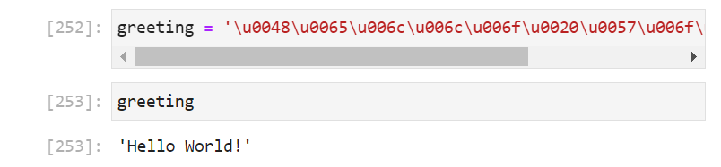

The fundamental unit in a Unicode string is a Unicode character:

```
greeting = 'Γειά σου Κόσμε!'
greeting
len(greeting)
greeting[0]
```

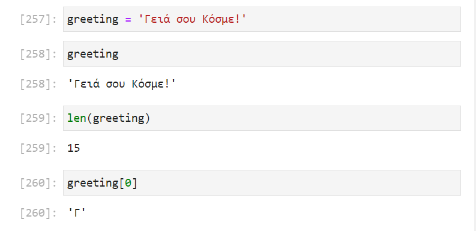

More explicitly:

```
greeting = '\u0393\u03b5\u03b9\u03ac\u0020\u03c3\u03bf\u03c5\u0020\u039a\u03cc\u03c3\u03bc\u03b5\u0021'
greeting
len(greeting)
greeting[0]
```

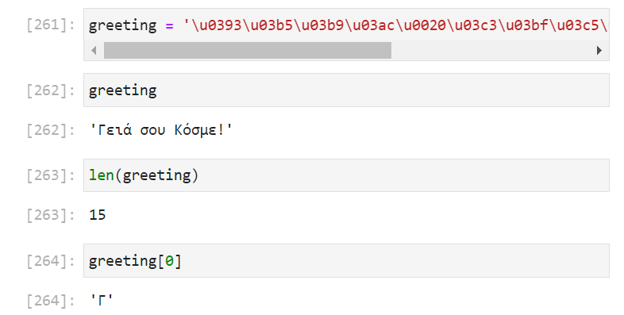

### Unicode String Recap

To recap the Unicode String recognises 1 bit ASCII hexadecimal and 2 bit Unicode hexadecimal values. Recall most of the first 33 ASCII commands are non-printable and based on the commands of a type writter:


the following 4 whitespace commands being particularly important:

```
chr(0x20) # space
chr(0x09) # tab
chr(0x0a) # new line
chr(0x0d) # carriage return
```

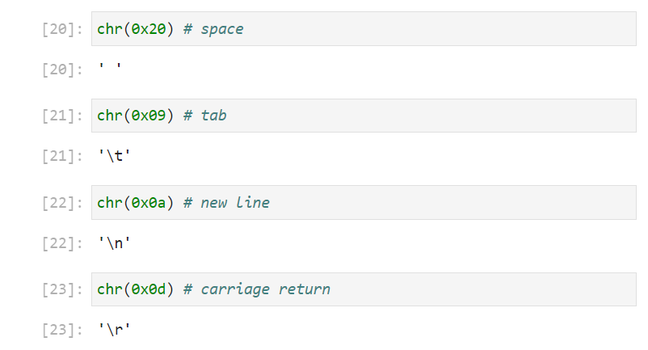

These are recognised with or without the trailing zeros. 

The English characters occupied the bytes ```'0x21':'0x80'```.

```
for num in range(0x21, 0x80):
    print(f"'{hex(num)}' {chr(num)}", sep=' ', end='    ')
```    

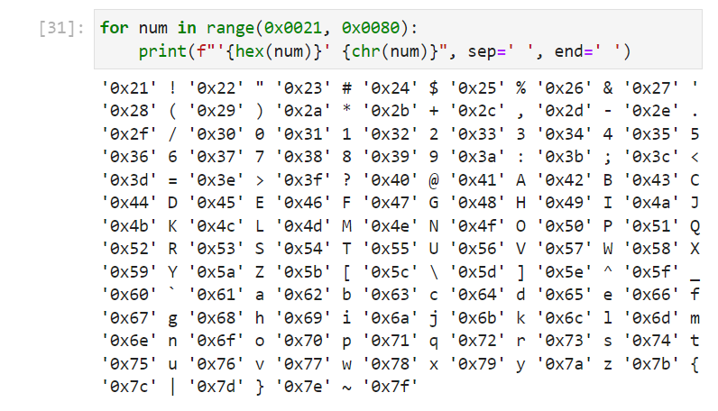

The Greek letters for example are:

```
for num in range(0x0391, 0x03CA):
    print(f"'{hex(num)}' {chr(num)}", sep=' ', end='   ')
```


And mathematics and miscellaneous symbols are:

```
print(f"'{hex(0x00D7)}' {chr(0x00D7)}")
print(f"'{hex(0x00F7)}' {chr(0x00F7)}")
```

```
for num in range(0x2200, 0x2400):
    print(f"'{hex(num)}' {chr(num)}", sep=' ', end='  ')
```

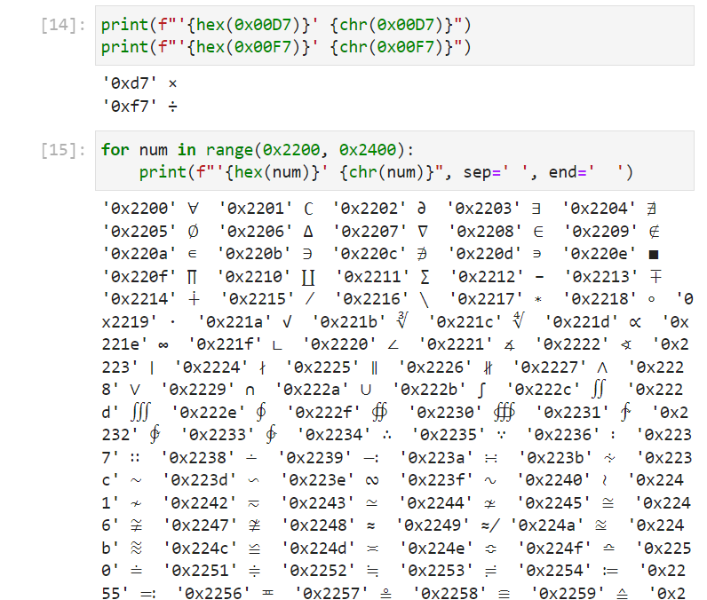

## The Byte String Class bytes

Python has another text class called a ```bytes``` that is very similar to a string. This was the fundamental string used in Python 2 but still has some purposes particularly when it comes to data transfer from hardware. 

### Init Signature

The ```bytes``` class is an abbreviation for a string of bytes. The fundamental unit is a byte. 

Recall that a byte spans 8 bits and each bit corresponds to a power of 2. For convenience every byte is denoted using 2 hexadecimal characters. 

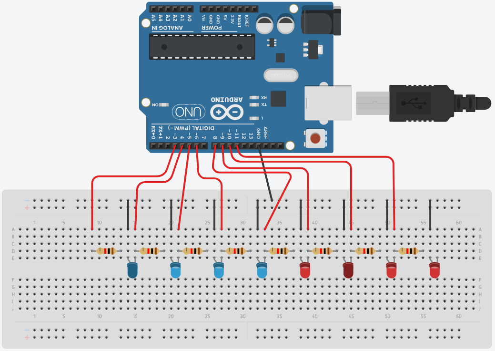

```
   2⁸  2⁷  2⁶  2⁵  2⁴  2³  2¹  2⁰
   0   1   1   1   1   0   1   1
 |       7       |       b        |
```

$$2⁷ + 2⁶ + 2⁵ + 2⁴ + 2¹ + 2⁰ = 123$$

The above as a binary string is ```'0b01111011'```, as a hexadecimal string is ```'0x7b'``` and as a decimal integer is ```123```.

Inputting ```bytes()``` followed by shift ```⇧``` and tab ```↹``` will display the docstring of the init signature of the ```bytes``` class:

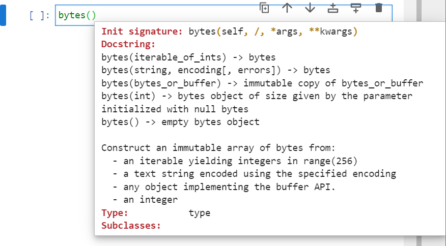

A byte instance can be created from an ASCII characterset by use of the ```b``` prefix:

```
greeting = b'Hello World!'
greeting
```


More explicitly, a byte is a sequence of 2 digit hexadecimal characters:

```
greeting = b'\x48\x65\x6c\x6c\x6f\x20\x57\x6f\x72\x6c\x64\x21'
greeting
```

### Identifiers

If the instance name ```greeting``` is input followed by a dot ```.``` and then tab ```↹``` a list of identifiers displays:

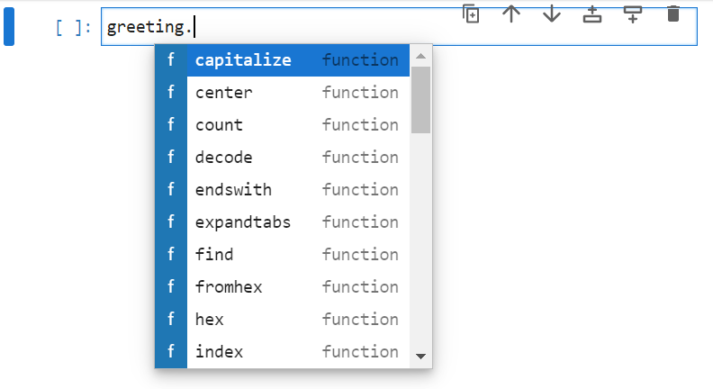

Notice the consistency between the ```bytes``` identifiers and the ```str``` identifiers. Most of these identifiers behave analogously. 

The hex method, will display the byte sequence as a string of hexadecimal characters. This string won't include any escape characters:

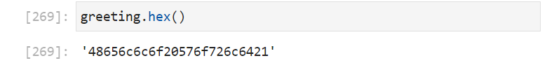

The ```from_hex``` is an alternative constructor that can take a string of that format or a string of that format that includes spaces:

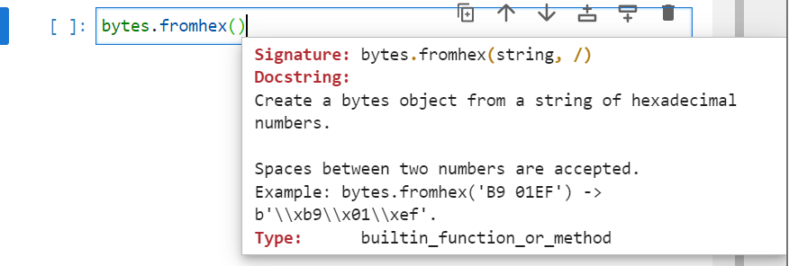

```
bytes.fromhex('48656c6c6f20576f726c6421')
bytes.fromhex('48 65 6c 6c 6f 20 57 6f 72 6c 64 21')
```

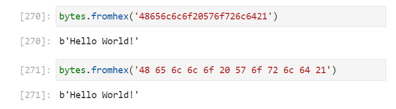

### Data Model Identifiers

The directory of a bytes instance can be examined using the ```dir``` function:

```
dir(greeting)
```

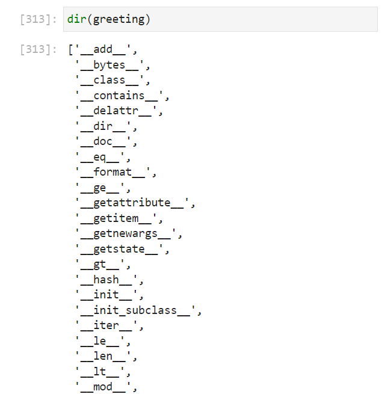


To view this list horizontally, use:

```
import pprint
pprint.pprint(dir(greeting), compact=True)
```

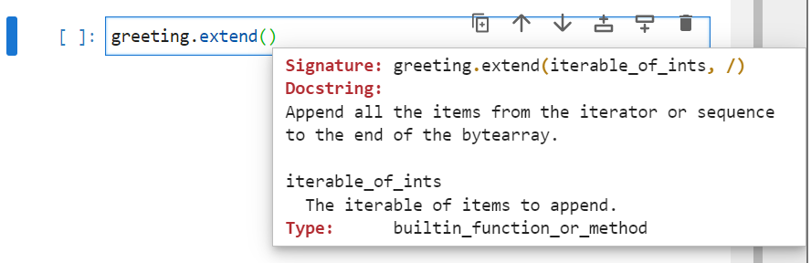

The data model identifiers are largely consistent with the ```str``` class. The only addition is the ```__bytes__``` data model identifier which casts one ```bytes``` instance into another ```bytes``` instance:

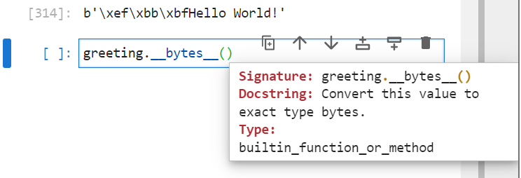

The ```__len__``` and ```__getitem__``` data model methods are defined differently as the fundamental unit in a ```bytes``` is a ```byte``` opposed to a character.

The ```len``` function returns 12 bytes, it happens that each byte is ASCII encoded where 1 character is 1 byte but this won't be the case when moving onto non-ASCII characters:
 
```
len(greeting)
```

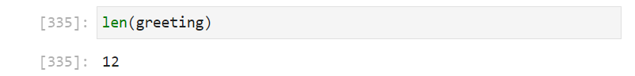

For example if the ```'£'``` is included and the encoding is ```'UTF-8'```. Then the character spans 2 bytes instead of 1 byte:

```
greeting = bytes('H£llo World!', encoding='UTF-8')
```

Therefore the length will be 13 bytes:

```
len(greeting)
```

When decoded this is still 12 characters:

```
greeting.decode(encoding='UTF-8')
```

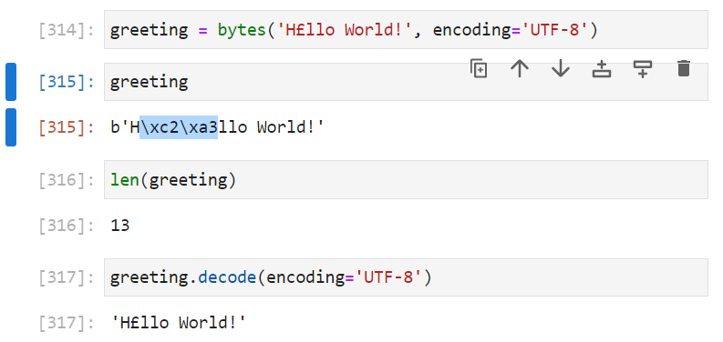

Indexing using an integer will return the numeric value of a character by default:

```
greeting[0]
```

The character this responds to can be seen using:

```
chr(72)
```

And the hex value can be seen using:

```
hex(72)
```

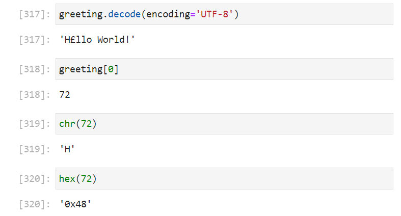

Slicing returns a ```bytes``` object that uses the same encoding. The slice is between the start and a stop value of 6. Notice to get the first 5 letters, indexing to 6 is required because the character ```'£'``` spans 2 bytes:

```
greeting[:6]
```

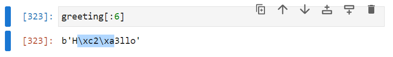

Both the ```bytes``` and ```str``` are immutable collections. There is no ```__setitem__``` data model identifier and attempting to reassign the value of an index will raise a ```TypeError```:

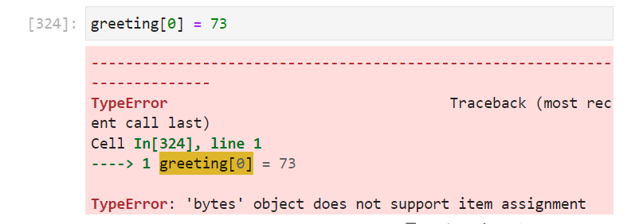

### Decoding

The ```bytes``` class also has a method ```decode``` which decodes the ```bytes``` string to a Unicode string:

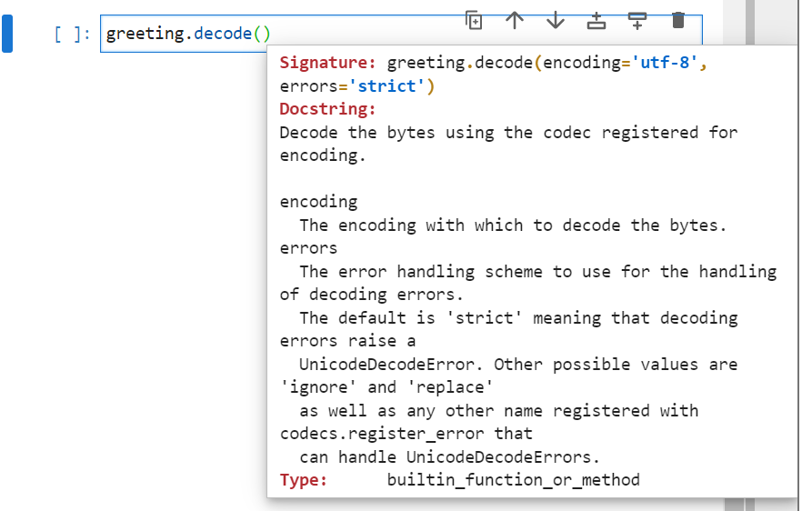

To use ```decode``` an encoding system needs to be specified.

Before looking at a decoding in a bytes sequence it is worthwhile examining the concept of encoding using the more simple Morse Code. Morse Code was made when only basic digital signals were available. The message was conveyed using controlled durations of the digital signal such as a buzzer making sound or a LED blinking.

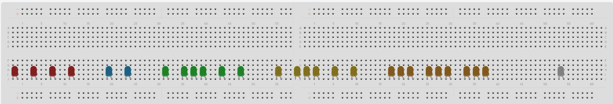

The schematic above should be considered as a time trace for a single LED. Everywhere the LED is present indicates the LED is On. Everywhere the LED is absent indicates the LED is Off. The change in colour is used to help clearly distinguish each character. The white LED at the end is added to indicate the end of the message. When Morse Code was used the message typically repeated multiple times to increase its chance of being recieved and translated.

Morse Code assigns a sequence of durations to a character. 

* A dot ```.``` is one second high.
* A dash ```-``` is three seconds high.
* The spacing between dots and dashes in a character is one second low.
* The spacing between one character and the next character is three seconds second low.
* The spacing between words is seven seconds low.

The translation instructions or translation table for Morse Code is as shown.

|Character|Morse Code|
|---|---|
|'&nbsp;'|'&nbsp;&nbsp;&nbsp;&nbsp;&nbsp;&nbsp;&nbsp;'|
|'0'|'- - - - -&nbsp;&nbsp;&nbsp;'|
|'1'|'. - - - -&nbsp;&nbsp;&nbsp;'|
|'2'|'. . - - -&nbsp;&nbsp;&nbsp;'|
|'3'|'. . . - -&nbsp;&nbsp;&nbsp;'|
|'4'|'. . . . -&nbsp;&nbsp;&nbsp;'|
|'5'|'. . . . .&nbsp;&nbsp;&nbsp;'|
|'6'|'- . . . .&nbsp;&nbsp;&nbsp;'|
|'7'|'- - . . .&nbsp;&nbsp;&nbsp;'|
|'8'|'- - - . .&nbsp;&nbsp;&nbsp;'|
|'9'|'- - - - .&nbsp;&nbsp;&nbsp;'|
|'A'|'. -&nbsp;&nbsp;&nbsp;'|
|'B'|'- . . .&nbsp;&nbsp;&nbsp;'|
|'C'|'- . - .&nbsp;&nbsp;&nbsp;'|
|'D'|'- . .&nbsp;&nbsp;&nbsp;'|
|'E'|'. .&nbsp;&nbsp;&nbsp;'|
|'G'|'- - .&nbsp;&nbsp;&nbsp;'|
|'H'|'. . . .&nbsp;&nbsp;&nbsp;'|
|'I'|'. .&nbsp;&nbsp;&nbsp;'|
|'J'|'. - - -&nbsp;&nbsp;&nbsp;'|
|'K'|'- . -&nbsp;&nbsp;&nbsp;'|
|'L'|'. _ . .&nbsp;&nbsp;&nbsp;'|
|'M'|'- -&nbsp;&nbsp;&nbsp;'|
|'N'|'- .&nbsp;&nbsp;&nbsp;'|
|'O'|'- - -&nbsp;&nbsp;&nbsp;'|
|'P'|'. - - .&nbsp;&nbsp;&nbsp;'|
|'Q'|'- - . -&nbsp;&nbsp;&nbsp;'|
|'R'|'. - .&nbsp;&nbsp;&nbsp;'|
|'S'|'. . .&nbsp;&nbsp;&nbsp;'|
|'T'|'-&nbsp;&nbsp;&nbsp;'|
|'U'|'. . -&nbsp;&nbsp;&nbsp;'|
|'V'|'. . . -&nbsp;&nbsp;&nbsp;'|
|'W'|'. - -&nbsp;&nbsp;&nbsp;'|
|'X'|'- . . -&nbsp;&nbsp;&nbsp;'|
|'Y'|'- . - -&nbsp;&nbsp;&nbsp;'|
|'Z'|'- - . .&nbsp;&nbsp;&nbsp;'|

From the translation table above:


The red LED sequence is 'H'

The blue LED sequence is 'E'

The green LED sequence is 'L'

The yellow LED sequence is 'L'

The orange LED sequence is 'O'


For a Bytes sequence the following translation tables are most commonly used. These should be conceptualised as very large dictionarys that map a byte sequence to a character:

|encoding|bit|bytes|byte order|BOM|
|---|---|---|---|---|
|ASCII|1|8| |---|
|Latin1|1|8| | |
|UTF-16-LE|2|16|little endian| |
|UTF-16-BE|2|16|big endian| |
|UTF-16|2|16| |BOM|
|UTF-32-LE|4|32|little endian| |
|UTF-32-BE|4|32|big endian| |
UTF-32|4|32| |BOM|
|UTF-8|1-4|adaptive|1-4 adaptive| |
|UTF-8-Sig|1-4|adaptive|1-4 adaptive|BOM|

A BOM is an abbreviation for a Byte Order Marker (BOM) which normally occurs at the start of the byte stream and is used in the case of UTF-16 and UTF-32 to denote whether the data is little endian or big endian. Some programs include a BOM otherwise known as a signature for all data encoded which is why there is UTF-8-Sig even even though the UTF-8 encoding does not have the confusion between little endian and big endian.

Let's examine ```greeting``` it has a length of 12 ```bytes```, the fundamental unit is 12 bytes and not 12 characters. The subtle difference will be seen in a moment. This is divisible by 2 with no modulo, it is also divisible by 2 with no modulo:

```
greeting
len(greeting)
len(greeting) // 2
len(greeting) % 2
len(greeting) // 4
len(greeting) % 4
````

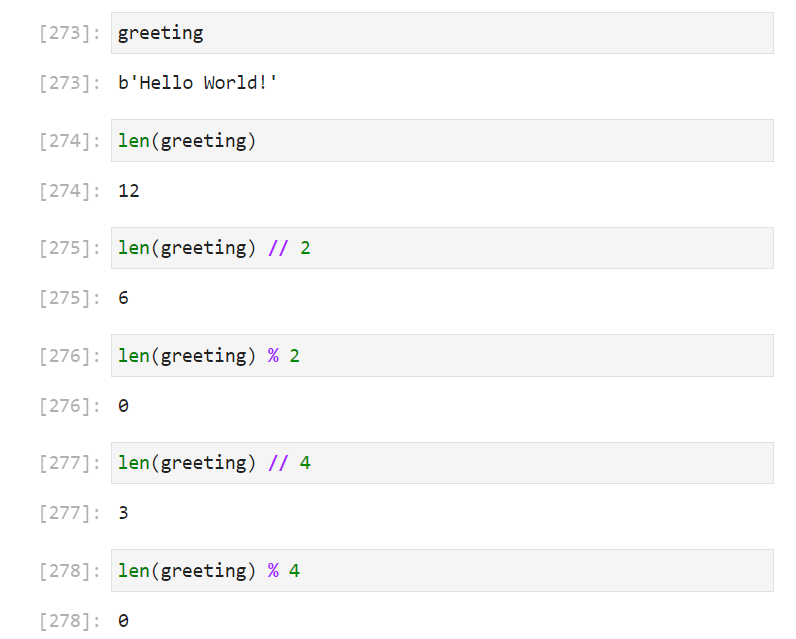

The correct encoding scheme ```'ASCII'``` can be used, alongside the incorrect encoding system ```'UTF-16'```. Notice the mojibake when the incorrect encoding scheme is used:

```
greeting = b'\x48\x65\x6c\x6c\x6f\x20\x57\x6f\x72\x6c\x64\x21'
greeting.decode(encoding='ASCII')
greeting.decode(encoding='UTF-16')
```

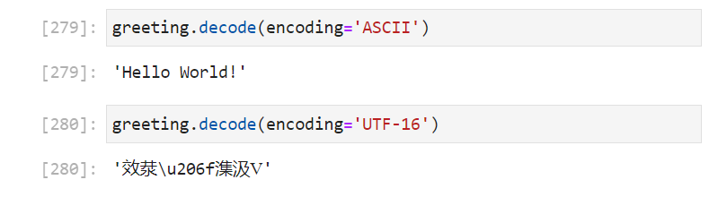

The ```ASCII``` encoding system treats the ```bytes``` string as:

```
'48 65 6c 6c 6f 20 57 6f 72 6c 64 21'
```

Whereas the ```UTF-16``` treats the ```bytes``` string as:

```
'6548 6c6c 206f 6f57 6c72 2164'
```

```'UTF-16'``` uses little endian by default, although  ```'UTF-16-LE'``` can be explicitly specified. For little endian the byte order for each character is right to left so the two bytes that make the first character '48 65' are read in as '6548'.

```
bytes.fromhex('4865').decode(encoding='UTF-16')
bytes.fromhex('4865').decode(encoding='UTF-16-LE')
```

If it is changed to big endian, the first character is read in as ```4865```:

```
bytes.fromhex('4865').decode(encoding='UTF-16-BE')
```

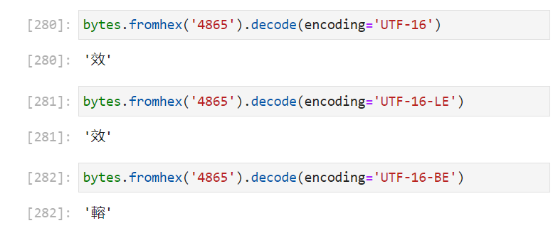

Encoding the ASCII string with ```'UTF-16'``` of either endian gives mojibake:

```
greeting.decode(encoding='UTF-16-LE')
greeting.decode(encoding='UTF-16-BE')
```

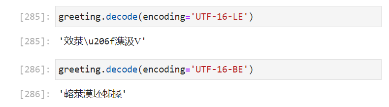

Normally the encoding is specified when the ```bytes``` string is instantiated:

```
greeting = bytes('Hello World!', encoding='UTF-16-LE')
greeting

greeting = bytes('Hello World!', encoding='UTF-16')
greeting
```

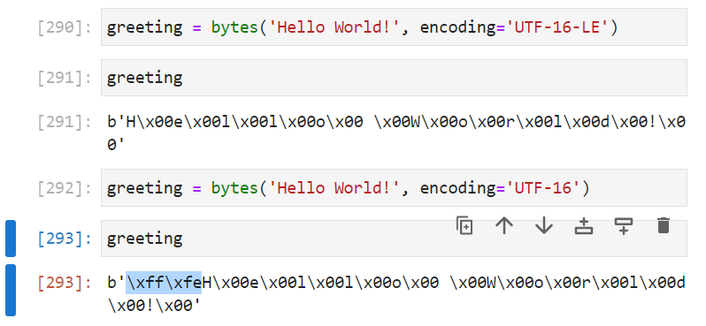

Notice the subtle difference between using ```UTF-16``` and ```'UTF-16-LE```. A Byte Order Marker ```'\xff\xfe'``` is placed in UTF-16.

For each character the ASCII equivalent is shown beside  ```'\x00'``` for example ```'H\x00'```. The ```'H'``` is ```'\x48'``` and therefore these are combined to be read in as the two bytes ```'\48\00'``` which becomes the Unicode character ```U0048``` which is ```'H'```. This can be seen more clearly if converted to hex:

```
greeting.hex()
```

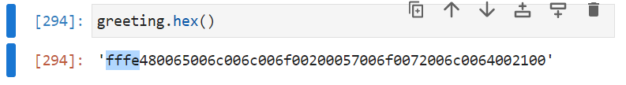

If this ```greeting``` encoded in ```UTF-16``` is decoded into the similar ```UTF-16-LE```:

```
greeting.decode(encoding='UTF-16-LE')
```

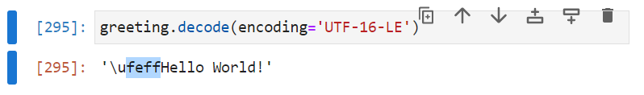

Notice the BOM gets incorporated into the string as an unreadible Unicode character. 

If however it is decoded into ```'Latin-1```, it undergoes mojibake and becomes 2 characters:

```
greeting.decode(encoding='Latin-1')
```

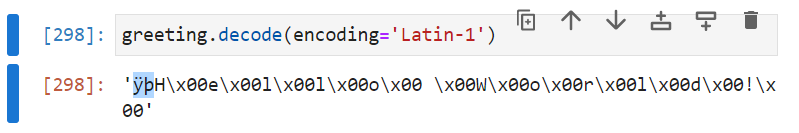

An attempt to decode to ```'UTF-8'``` will detect the BOM as invalid:

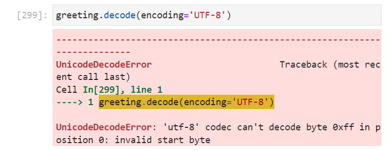

The ```BOM``` can be stripped and encoded to ```'UTF-8'``` using:

```
greeting.strip(b'\xff\xfe').decode(encoding='UTF-8')
```

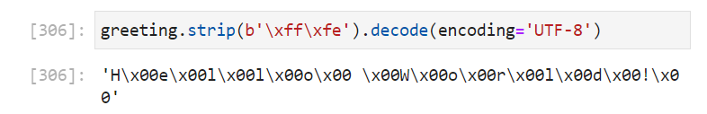

The examples above were used to highlight some of the difficulties encountered with the ```bytes``` class and encoding. 

In general ```UTF-8``` is the standard and should be used wherever possible. This is why the default value for the keyword argument in the method ```decode``` is ```'UTF-8```:


That being said, Microsoft tend to use a version of ```UTF-8``` called ```UTF-8-Sig``` which is essentially UTF-8 with a BOM:

```
greeting = bytes('Hello World!', encoding='UTF-8')
greeting
greeting = bytes('Hello World!', encoding='UTF-8-Sig')
greeting
```

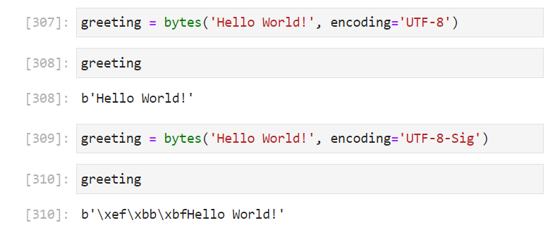

The BOM can be stripped and the ```bytes``` string decoded to ```'UTF-8'``` or it can be decoded using ```UTF-8-Sig```:

```
greeting.strip(b'\xef\xbb\xbf').decode(encoding='UTF-8')
greeting.decode(encoding='UTF-8-Sig')
```

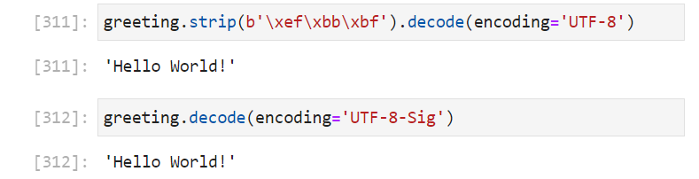

## The Mutable Byte String Class bytearray

The ```bytearray``` is a mutable collection otherwise similar to the immutable ```byte``` collection.

### Init Signature

Inputting ```bytearray()``` followed by shift ```⇧``` and tab ```↹``` will display the docstring of the init signature of the ```bytearray``` class:

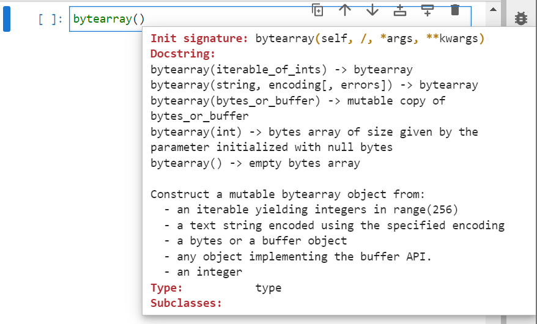

```
greeting = bytearray('Hello WOrld', encoding='utf-8')
```

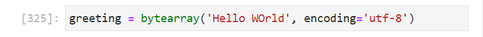

### Identifiers

If the instance name ```greeting``` is input followed by a dot ```.``` and then tab ```↹``` a list of identifiers displays:

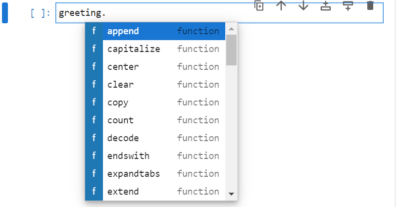

Notice the inclusion of the mutable identifiers ```append```, ```extend```, ```insert```, ```pop```, ```remove``` and ```reverse```. These identifiers are methods that mutate the ```bytearray``` i.e. change the original and do not output a return value. The ordinal value of ```'!'``` is ```33```:

```
ord('!')
```

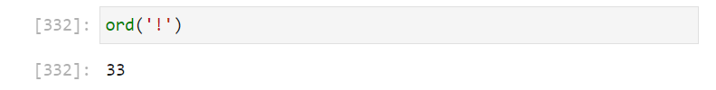

Inputting ```greeting.append()``` followed by shift ```⇧``` and tab ```↹``` will display the docstring. The only input argument is ```item```, followed by a ```/``` indicating that it is provided as a positional input argument only. ```item``` is a number (which corresponds to a single byte). The method will *append* this single byte to the end of this ```bytearray```:

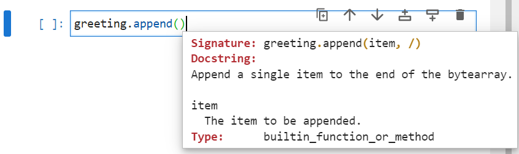

```
greeting.append(33)
```

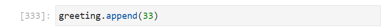

Notice that there is no return value as this mutable method modifies the instance ```greeting``` in place. Using:

```
greeting
```

shows it has been updated:

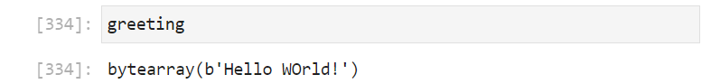

Inputting ```greeting.extend()``` followed by shift ```⇧``` and tab ```↹``` will display the docstring. The input argument ```iterable_of_bits``` is followed by a ```/``` indicating that the iterable of bits is to be provided as a positional input argument only. This method has no return value and is mutable meaning the ```bytearray``` will be modified in place:


```
greeting.extend(b' Bye World!')
```

To view the changes use:

```
greeting
```

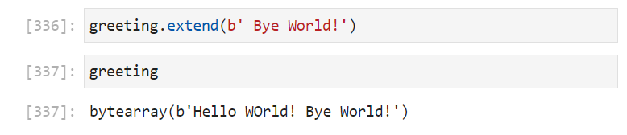

Inputting ```greeting.insert()``` followed by shift ```⇧``` and tab ```↹``` will display the docstring and the input arguments ```index``` and ```item``` followed by ```/``` indicating they are to provided positionally only. The method ```insert``` requires an index to *insert* a single item, as well as the byte item itself. The index of all previous values at and higher than this index will be increased by 1. This method has no return value and is mutable meaning the ```bytearray``` will be modified in place:

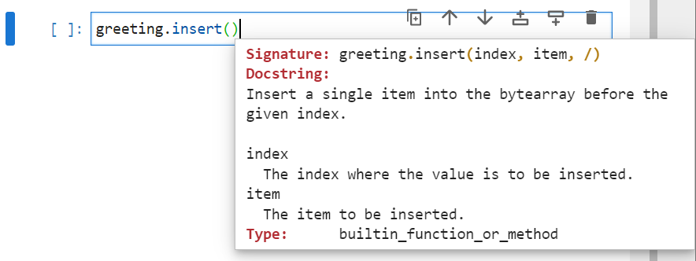

A question mark has the ordinal number of ```63```:

```
ord('?')
```

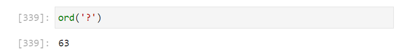

It can be inserted at index 6 using:

```
greeting.insert(6, 63)
```

To view the changes use:

```
greeting
```

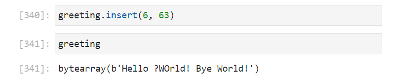

Inputting ```greeting.pop()``` followed by shift ```⇧``` and tab ```↹``` will display the docstring. It has a single input argument ```index``` which has a default value of ```-1``` meaning the end of the ```bytearray```. This is trailed by a ```/``` indicating it should be supplied only as a positional input argument when its default value is to be overriden. The method ```pop``` by default *pops* off the last item returning it as well as mutating the ```bytearray``` in place:

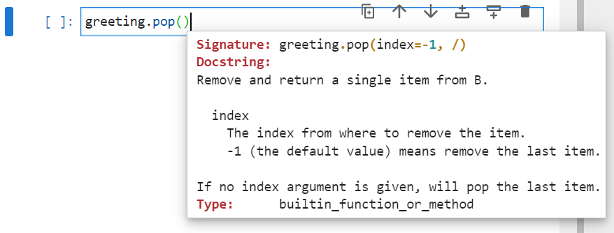

When the last value is popped, it is returned as a numeric value. This is the only mutable method which also has a return value:

```
greeting.pop()
```

This return value can be seen to be the ```'!'``` using:

```
chr(33)
```

This mutable method also carries out some in place changes, to view the changes use:

```
greeting
```

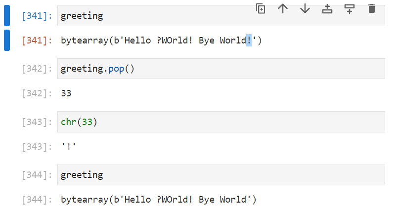

The ```'?'``` at index 6 can be popped using:

```
greeting.pop(6)
```

This mutable method occurs in place, to view the changes use:

```
greeting
```

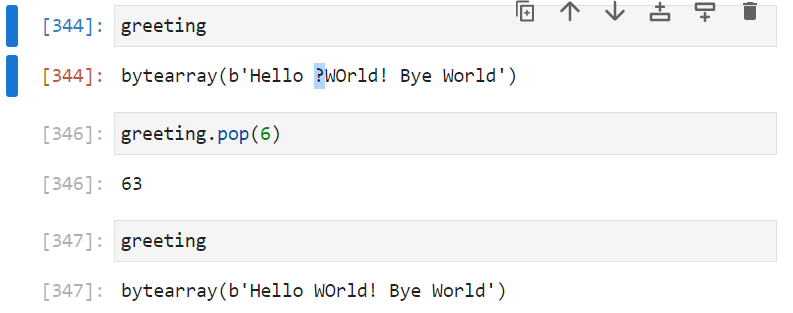

Inputting ```greeting.remove()``` followed by shift ```⇧``` and tab ```↹``` will display the docstring. It has a single input argument ```value```, followed by a ```/``` indicating it is to be provided as a positional input argument. The method ```remove``` by default *removes* the first occurance of this value in the bytearray:

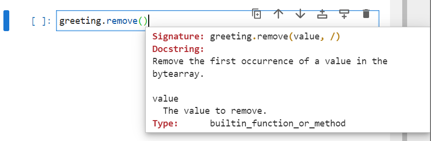

The exclamation mark has an ordinal value of ```33```:

```
ord('!')
```

It can be removed using:

```
greeting.remove(33)
```

This mutable method occurs in place, to view the changes use:

```
greeting
```

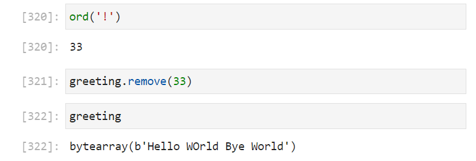

Inputting ```greeting.reverse()``` followed by shift ```⇧``` and tab ```↹``` will display the docstring. It has no input arguments as it only needs the instance data. The method ```reverse``` by default *reverses* the bytearray:

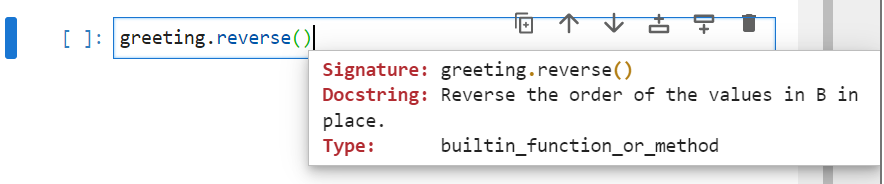

```
greeting.reverse()
```

This mutable method occurs in place, to view the changes use:

```
greeting
```

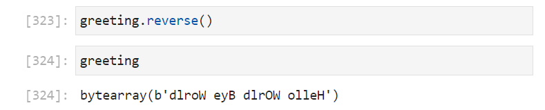

### Data Model Identifiers

The directory of the ```bytearray``` instance ```greeting``` can be examined using the directory function ```dir```:

```
greeting = bytearray('Hello WOrld!', encoding='utf-8')
dir(greeting)
```

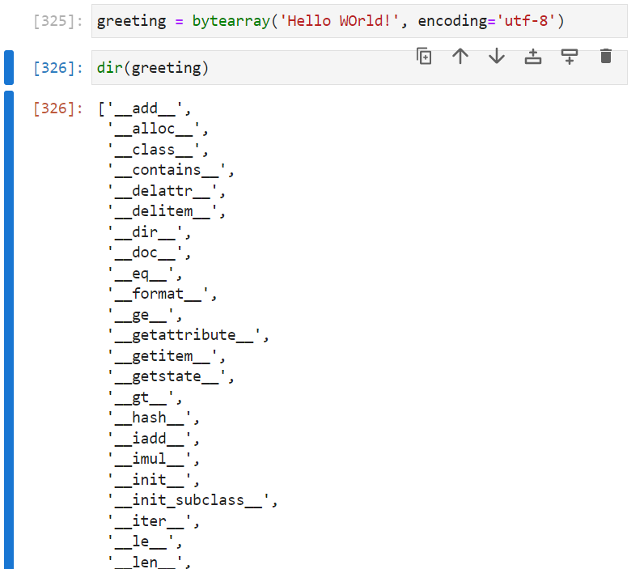

To view the output horizontally use:

```
import pprint
pprint.pprint(dir(greeting), compact=True)
```

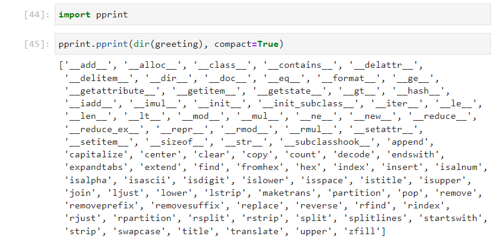

Notice that the same immutable data model identifiers as seen in the other two classes are available. Since ```__getitem__``` is available, the ```bytearray``` can be indexed into:

```
greeting
greeting[7]
chr(79)
```

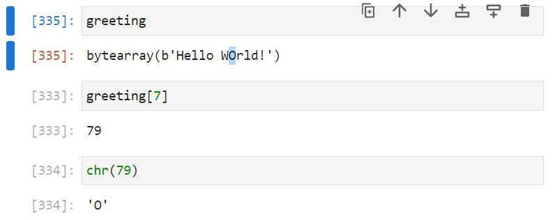

The mutable data model identifier ```__setitem__``` is also available. This means reassignment of an index can be carried out. This typo can be fixed. The ordinal value of lower case ```'o'``` is ```111```:

```
ord('o')
```

The value at index 7 can be reassigned to this:

```
greeting[7] = 111
```

There is no cell output, however ```greeting``` can be viewed using:

```
greeting
```

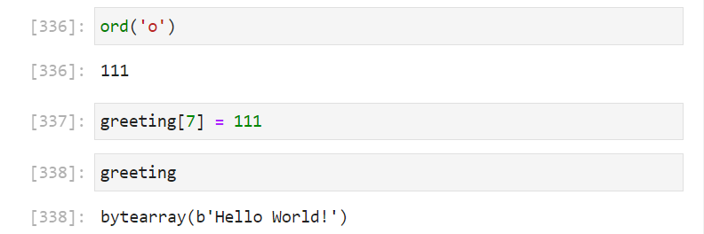

[Home Python Tutorials](https://github.com/PhilipYip1988/python-tutorials/blob/main/readme.md)
