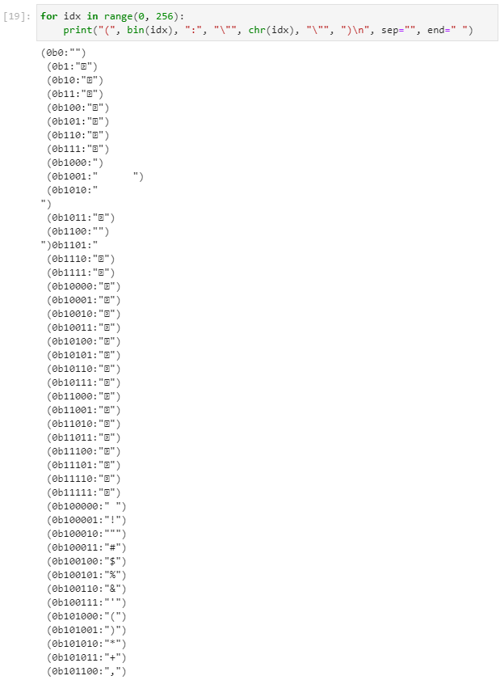
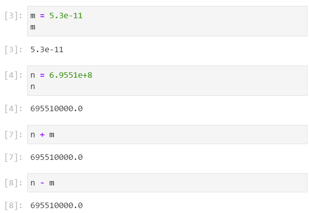

# Numbering Systems

## Fundamental Datatypes

We have explored:
* text datatypes
    * str ("a", "hello world")
* numeric datatypes
    * int (0, 1, 2, 3, ...)
    * bool (False, True)
    * float (0.0, 0., 0.1, 3.14)

And for a float, we have seen:
```
0.1 + 0.2
```
giving ```0.30000000000000004``` which is an unexpected rounding errors for what should be a basic arithmetic operation:


## Decimal Notation
The rounding error shown above is similar to the concept of 1/3 which becomes 0.33333333333... due to limitations in the decimal system which only has ten unique characters. 

The number of digits used in the decimal system is arbitrary and is only commonly used because we have ten fingers. For decimal we use the characters ```0```, ```1```, ```2```, ```3```, ```4```, ```5```, ```6```, ```7```, ```8``` and ```9``` and when we have numbers larger than ```9``` we use multiple digits such as ```10```

# How a Computer Stores Data

Let us now examine how a computer stores data.

## Bit

Under the hood, data is stored as a bit, which can be conceptualised as a switch. A switch has two positions:

"off":


"on":


For visualisation we can use a switch with an LED that is "off" or "on" respectively. We can encode:

"off" : 0

"on": 1

A digital signal is of this form and sometimes also maps to:

"off" : "LOW"

"on": "HIGH"

### Bit and Boolean

We can see that a bit (a single switch) can be used to represent a boolean value:

"off" : False

"on": True

## Byte

The int datatype has numbers larger than 1 and therefore, we require a configuration of multiple bits (multiple switches) to represent larger numbers. The most common configuration is 8 bits (which we can visualise as 8 LEDs attached to 8 switches) which is known as a byte. We will use 8 LEDs attached to a virtual Arduino microcontroller to represent this.


### Binary Notation

The above configuration when all switches are off, represents the decimal number 0. We can also use the binary representation which uses the prefix ```0B``` or ```0b``` (**b**inary) followed by the configuration of each switch, in this case:

```0```

```0B 0000 0000```


The decimal number 1 occurs when only, a single LED is on. This is the last LED from the left or alternatively the first LED from the right which represents the least significant digit:

```1```

```0B 0000 0001```


In binary, as we only have two states for each LED ```0``` and ```1```, we require multiple digits to count to the next number. To count to the decimal number of 2, we require 2 digits:

```2```

```0B 0000 0010```


This is analogous to using two digits to represent the number 10 in decimal, as we run out of characters past the digit 9.

**Be careful not to confuse the two number systems**

The decimal number ```10``` (ten) is not equivalent to the binary number ```0B 0000 0010``` (two).

**Pay attention to the prefix of the number used for binary ```0B``` or ```0b```.**

The decimal number 3 is therefore the next sequence:

```3```

```0B 0000 0011```


Let's turn on half of the lights which gives the number:
```0B 0000 1111```


This represents starting from the least significant digit to the left hand side and working our way to the right:

```1*(2**0) + 1*(2**1) + 1*(2**2) + 1*(2**3)```


This gives a decimal value of ```15```. 

With the combination of 4 LEDs or 4 Bits (half a byte), we can have ```2**4``` combinations:


One of these 16 combinations is used to represent the number ```0``` and therefore the maximum number is ```15```.

A byte has ```2**8``` combinations of numbers.


One of these 256 combinations is used to represent the number ```0``` and therefore the maximum number is ```255```:

```255```

```0B 1111 1111```


### Hexadecimal Notation

Binary numbers such as:

```0B 0111 1011```

are very easy for a computer to understand but are typically hard to transcribe as a human without making a mistake.


To help alleviate this, the digits used in a binary number are grouped into fours, which recall is half a byte. For clarity we will use different colors of LEDs to group half a byte.

Recall for four LEDs, we had ```2*4``` which equals ```16``` combinations. Of these 16 combinations, one of these is 0 giving the range 0 to 15 in decimal.

The hexadecimal numbering system uses a unique character for each of these combinations. It uses the first ten numbers from the decimal sysem:

```0```, ```1```, ```2```, ```3```, ```4```, ```5```, ```6```, ```7```, ```8``` and ```9```

And then to get to 16 combinations uses the first 6 letters of the alphabet:

```A```, ```B```, ```C```, ```D```, ```E``` and ```F```.

To distinguish a hexadecimal number we use the prefix ```0X``` or ```0x``` (he**x**):

|decimal|binary|hex|
|---|---|---|
|```0```|```0B 0000```|```0X 0```|
|```1```|```0B 0001```|```0X 1```|
|```2```|```0B 0010```|```0X 2```|
|```3```|```0B 0011```|```0X 3```|
|```4```|```0B 0100```|```0X 4```|
|```5```|```0B 0101```|```0X 5```|
|```6```|```0B 0110```|```0X 6```|
|```7```|```0B 0111```|```0X 7```|
|```8```|```0B 1000```|```0X 8```|
|```9```|```0B 1001```|```0X 9```|
|```10```|```0B 1010```|```0X A```|
|```11```|```0B 1011```|```0X B```|
|```12```|```0B 1100```|```0X C```|
|```13```|```0B 1101```|```0X D```|
|```14```|```0B 1110```|```0X E```|
|```15```|```0B 1111```|```0X F```|

And the binary number:

```0B 0111 1011```

Can be replaced by its Hexadecimal equivalent from the lookup table:

```0x 7 B```

Typically no space is added between each digit giving:

```0x 7B```

And if we return to the binary representation:

```0B 0111 1011```

We can calculate the decimal value using:

```1*(2**0) + 1*(2**1) + 0*(2**2) + 1*(2**3) + 1*(2**4) + 1*(2**5) + 1*(2**6) + 0*(2**7)```


which gives ```123``` in decimal. 

Therefore to recap, the following arrangement of LEDs is represented in the three numbering systems as:


```0B 0111 1011```

```0X 7B```

```123```

We can convert between these numbers using the ```int``` class, ```bin``` function and ```hex``` function:

```
int(0x7B)
int(0B01111011)
bin(0x7B)
hex(0B01111011)
```


### Characters

Under the hood, each character on the keyboard is mapped to a binary number. We can use the ```chr``` function to convert a number to a character or the inverse ```ord``` function converts a number. Let's use a for loop to have a look at the mapping with a decimal number:

```
for idx in range(0, 256):
    print("(", idx, ":", "\"", chr(idx), "\"", ")", sep="", end=" ")
```


Notice that the starting characters 0-31 tend to be hidden punctuation marks for example (8 backspace), (9 horizontal tab), (10 line feed), (11 vertical tab), (12 form feed), (13 carriage return), (14 shift out), (15 shift in).

We can update the for loop to have a look at the binary number:

```
for idx in range(0, 256):
    print("(", bin(idx), ":", "\"", chr(idx), "\"", ")\n", sep="", end=" ")
```



And hexadecimal number respectively:

```
for idx in range(0, 256):
    print("(", hex(idx), ":", "\"", chr(idx), "\"", ")\n", sep="", end=" ")
```


## Images

A very basic screen can be conceptualised as a matrix of white LEDs. In the simplest example below, each white LED in the matrix has its own digital signal that is either "off" or "on":


A monochrome image can be displayed on this screen by turning a subset of white LEDs "on", which recall is mapped to 1. The rest of the white LEDs are "off", which recall is mapped to 0. If we have a look in more detail at a single character on the screen, we see that each character has 40 pixels that are grouped into 5 columns and 8 rows:


And the data depicting the character therefore looks like:

```
1 0 0 0 0
1 0 0 0 0
1 0 1 1 0
1 1 0 0 1
1 0 0 0 1
1 0 0 0 1
1 0 0 0 1
0 0 0 0 0
```

We can encode this using:

```
import numpy as np
import matplotlib.pyplot as plt

h = np.array([[1, 0, 0, 0, 0],
              [1, 0, 0, 0, 0],
              [1, 0, 1, 1, 0],
              [1, 1, 0, 0, 1],
              [1, 0, 0, 0, 1],
              [1, 0, 0, 0, 1],
              [1, 0, 0, 0, 1],
              [0, 0, 0, 0, 0]])

plt.matshow(h, cmap="bone")
```

In the variable explorer of the Spyder IDE, the shape of the character can be seen if a (monochrome) background color is applied:


This is plotted as:


Let's now look at an analog white LED. The white LED is attached to a potentiometer which operates over 8 bits which is also known as a byte.Recall a byte has 256 levels ranging from 0-255. In this configuration at 0, the white LED has no emission and we perceive this absence of light as black. At 255 the white LED is on full brightness which we perceive as white. Any other level is a mixture of black and white which we perceive as some level of gray.


For a screen where each pixel is an analog white LED that can individually be varied from 0-255, a grayscale image can be generated. For example:

```
import numpy as np
import matplotlib.pyplot as plt

img = np.array([[255, 255, 255, 255, 255],
                [223, 223, 223, 223, 223],
                [191, 191, 191, 191, 191],
                [159, 159, 159, 159, 159],
                [127, 127, 127, 127, 127],
                [ 95,  95,  95,  95,  95],
                [ 63,  63,  63,  63,  63],
                [ 31,  31,  31,  31,  31]])
              
plt.matshow(img, cmap="bone")
```

In the variable explorer of the Spyder IDE, the shape of the grayscale pattern can be seen if a background color is applied:


This is plotted as:


Because each level is a byte or 8 bit, this is known as an 8 bit greyscale image.

To make a color, color mixing is performed using the three primary colors red, green and a blue, which can physically be achieved by using a red LED, green LED and blue LED or a combined RGB LED. 


Each individual LED in the RGB LED has its own byte of intensity values. Therefore the red values range between 0-255, green values range between 0-255 and blue values range between 0-255:


The orange color displayed on the screen for example sets:
* the red LED to a maximum intensity of 255 (0xFF)
* the green LED to an intensity of 192 (0xFC)
* the blue LED to the minimum intensity of 0 (0x00).

A color screen is a matrix of these RGB LEDs. We can create an image of random colors using:

```
import numpy as np
import numpy.random as random
import matplotlib.pyplot as plt
from PIL import Image
random.seed(0)

reds = random.randint(low=0, high=256, size=(8, 5))

greens = random.randint(low=0, high=256, size=(8, 5))

blues = random.randint(low=0, high=256, size=(8, 5))

rgbimg = np.dstack((reds, greens, blues)) 

plt.imshow(rgbimg)
```
In the variable explorer the matrix sent to each color of LED array looks like the following:


The color mixing of the red LED matrix of values, the green LED matrix of values and the blue LED matrix of values gives the color image below:


The data behind this image is a 3D array of integer values (which are recognised by the computer as binary values). Typical pictures are usually of much larger array sizes. A picture that is 8 MB will typically use 3264 rows by 2448 columns.

Other signals are generated using different output devices. For example a buzzer may be used to create an audio tone. This buzzer can be digital "on" or "off":


Or can have an analog 8 bit audio. For 8 bit (1 byte) there are 256 different tones of buzzer which are encoded from 0-255 and a tune can be made from a sequence of tones for specified durations.

# Signed Numbers

We have only considered only a byte of positive numbers, ranging from 0-255 which is known as an 8 bit **unsigned** integer because all the numbers are positive integers. Recall that 8 bit is 1 byte.

There are other numbering systems which we can use that include negative numbers such as the 8 bit **signed** integer. This numbering system also spans over 8 bit or one byte. In this numbering system we have to use half the possible arrangement of bits in the byte to represent the negative numbers and the other half is used to represent the positive numbers. The binary representation therefore spans from:


```-128```

```0B 0000 0000```

```0X 00```

to:


```+127```

```0B 1111 1111```

```0X FF``` 

Note as ```-0``` and ```+0``` are the same value, we only need one configuration for ```0``` and therefore a signed integer tends to have the modulus of the negative limit (-128) being one larger than the modulus of the positive limit (+127).

To count up to larger numbers we can use more computer memory to store the number i.e. a larger number of bits. The 32 bit signed integer, for example uses 32 bits as the name suggests (which is 8 bytes). In this numbering system the lower limit is:

```-2147483648```

```0B 0000 0000 0000 0000 0000 0000 0000 0000```

```0X 00 00 00 00 00 00 00 00```

And the upper limit is:

```2147483647``` 

```0B 1111 1111 1111 1111 1111 1111 1111 1111```

```0X FF FF FF FF FF FF FF FF```

# Floating Point Numbers

As we have seen earlier, the computer operates using a series of binary switches known as bits and 8 of these are grouped together to make a byte. 

Signals received or emitted from computer hardware itself can be digital:
* "off" (0) 
* "on" (1)

Or analog, in the case of 8 bit analog: 
* 0-255 
* 0X 00 - 0X FF
* 0B 00 00 00 00 - 0B 11 11 11 11

In the cases discussed above, these numbers are quantised discrete values or integers.

## Scientific Notation in Decimal

In real life however we have numbers which aren't integers and include a decimal point. Moreover these numbers typically range from extremely small to very large. For example:

* the radius of a hydrogen atom = 0.000000000053 m 

* the height of a human = 1.5 m

* the radius of the sun = 95700000 m 

As very small and very large numbers have a large number of preceding zeros or trailing zeros they become difficult to transcribe and are therefore typically expressed in scientific notation. 

To convert from a decimal number to a decimal number in scientific notation:
* We take the order of magnitude of the highest significant digit which is shown depicted in red and this is the value of the exponent at -11 and 8 for the small and large number respectively. 
* We take the remaining non-zero numbers highlighted in yellow and add the decimal point after the most digit giving the mantissa which is 5.3 and 6.957 for the small and large number respectively.


We then write the number using the form ```mantissa```e```exponent``` and therefore:

* the radius of a hydrogen atom = 5.3e-11 m 

* the height of a human = 1.5 m

* the radius of the sun = 9.57e8 m 

From the length examples above, we can see approximately 20 of orders of magnitude and there are still smaller and larger objects. To map each possible value over this scale of magnitude directly as a binary value will require an unworkable amount of computer memory.

If we assign:

```
m = 5.3e-11
n = 6.9551e+8
```

We can take advantage of the following operations. For ```n>>m``` where ```n``` is a large number and ```m``` is a small number, interactions involving addition or subtraction of the small number, leave the bigger number essentially unchanged:

```n + m ~ n``` 

```n - m ~ n``` 



In other words, the change due to the presence of the smaller number is insignificant to the error of the larger number. 

However interactions involving multiplication or division are significant.

Multiplication can be calculated using a multiplication of the mantissa of the two numbers, combined with the exponent of the sum of the two numbers exponents:

```n * m``` 

```(6.9551 * 5.3) e (+8 + (-11))```


Division can be calculated using division of the mantissa of the two numbers, combined with the exponent of the difference of the two numbers exponents:

```n / m``` 

```(6.9551 / 5.3) e (+8 -(-11))```


Physically the sun is made up of a huge number of hydrogen atoms and the uncertainty of the suns radius is therefore much larger than the size of a single hydrogen atom itself which is why the addition and subtraction of the radius of a hydrogen atom from the sun is insignificant. When we use division of the radius of the sun by the radius of the hydrogen atom, we return the number of hydrogen atoms along the diameter of the sun. We can see this is a very large number of hydrogen atoms and therefore a difference of a single hydrogen atom is insignificant with respect to this very large number.

## Scientific Notation in Binary

The above scientific notation uses the decimal system (base ten; characters 0-9), but as discussed earlier computers operate using binary switches known as bits (base two; characters 0-1). We must therefore look at a binary equivalent of scientific notation to representing a floating point number. 

Let's explore converting a floating point decimal (base 10) into a floating point decimal (base 2).

Take:

```
0.25 (base 10)
```

Let's begin to convert this into binary. To do this we are going to multiply the number by 2 and divide it by 1 in a series of steps. If the value before the decimal point is 0 we will subtract 0, if the value before the decimal point is 1 we will subtract 1.


(0.25 * 2 / 1 = 0.5) - ```0``` = 0.5 

(0.5 * 2 / 1 = 1.0) - ```1``` = 0

(0 * 2 / 1 = 0.0) - ```0``` = 0

⋮

To get the number in base 2, we place these numbers after the ~~decimal (base 10)~~ binary (base 2) point:

```
0.01 (base 2)
```

Let's look at another example:

```
0.20 (base 10)
```

(**0.2** * 2 / 1 = 0.4) - ```0``` = 0.4

(0.4 * 2 / 1 = 0.8) - ```0``` = 0.8

(0.8 * 2 / 1 = 1.6) - ```1``` = 0.6

(0.6 * 2 / 1 = 1.2) - ```1``` = **0.2**

Notice that we return to a value of 0.2. This means we will are effectively repeating the same operation, again and again and again...

(**0.2** * 2 / 1 = 0.4) - ```0``` = 0.4

(0.4 * 2 / 1 = 0.8) - ```0``` = 0.8

(0.8 * 2 / 1 = 1.6) - ```1``` = 0.6

(0.6 * 2 / 1 = 1.2) - ```1``` = **0.2**

(**0.2** * 2 / 1 = 0.4) - ```0``` = 0.4

(0.4 * 2 / 1 = 0.8) - ```0``` = 0.8

(0.8 * 2 / 1 = 1.6) - ```1``` = 0.6

(0.6 * 2 / 1 = 1.2) - ```1``` = **0.2**

(**0.2** * 2 / 1 = 0.4) - ```0``` = 0.4

(0.4 * 2 / 1 = 0.8) - ```0``` = 0.8

(0.8 * 2 / 1 = 1.6) - ```1``` = 0.6

(0.6 * 2 / 1 = 1.2) - ```1``` = **0.2**

⋮

The number in binary is therefore recurring:

```
0.001100110011... (base 2)
```

Let's also have a look at the example:

```
0.10 (base 10)
```

(0.1 * 2 / 1 = 0.2) - ```0``` = **0.2**

(**0.2** * 2 / 1 = 0.4) - ```0``` = 0.4

(0.4 * 2 / 1 = 0.8) - ```0``` = 0.8

(0.8 * 2 / 1 = 1.6) - ```1``` = 0.6

(0.6 * 2 / 1 = 1.2) - ```1``` = **0.2**

(**0.2** * 2 / 1 = 0.4) - ```0``` = 0.4

(0.4 * 2 / 1 = 0.8) - ```0``` = 0.8

(0.8 * 2 / 1 = 1.6) - ```1``` = 0.6

(0.6 * 2 / 1 = 1.2) - ```1``` = **0.2**

(**0.2** * 2 / 1 = 0.4) - ```0``` = 0.4

(0.4 * 2 / 1 = 0.8) - ```0``` = 0.8

(0.8 * 2 / 1 = 1.6) - ```1``` = 0.6

(0.6 * 2 / 1 = 1.2) - ```1``` = **0.2**

⋮

Once again, we get a recurring operation:

```
0.000110011001... (base 2)
```

Both 0.1 (base 10) and 0.2 (base 10) are recurring when represented in base 2:

```
0.1 (base 10)

0.000110011001... (base 2)
```

```
0.2 (base 10)

0.001100110011... (base 2)
```

Recurring operations are more prevalent in the base 2 numbering system as there are less unique characters to represent a number than in decimal, making it even more limited. Physically a computer can only store numbers to a specified precision of physical bits and therefore rounding errors are observed when working with floating point numbers, with the last digit truncated. This is the reason for the rounding error observed at the beginning of this tutorial.

## IEEE Standard for Floating-Point Arithmetic 

Floating point arithmetic specified by the Institute of Electrical and Electronics Engineers (IEEE) is fundamentally a binary representation of scientific notation. For simplicity let's look at the floating-point format binary 16.

The floating-point format binary 16 has a similar form to binary scientific notation:

* mantissa sign: 1 bit 
* signed exponent: 5 bits
* mantissa modulus: 10 bits

There are a number of optimisations used to efficiently store the numbers:

```0B``` ```0``` ```00000``` ```0000000000```

The mantissa sign is split from the mantissa modulus. With ```0``` representing a positive number and:

```0B``` ```0``` ```?????``` ```??????????```

and ```1``` representing a negative number:

```0B``` ```1``` ```?????``` ```??????????```

The mantissa is split because explicitly specifying all combinations from a range of negative to positive numbers would take more memory.

In the case of the exponent, a biased exponent is used. For 5 bits, there are ```2**5``` combinations which is 32 (base 10). These range from the positive values 0 to 31. A offset of ```15``` is selected for 0 giving the range -15 to +16.

An exponent of ```0``` for example will be encoded as ```0+15``` which is ```15``` and 15 in binary is:

```0B``` ```?``` ```01111``` ```??????????```

Confer with the hexadecimal and binary values corresponding to the numbers 0-15 when hexadecimal notation was discussed earlier in this tutorial.

An exponent of ```-1``` for example will be encoded as ```-1+15``` which is ```14``` and 14 in binary is:

```0B``` ```?``` ```01110``` ```??????????```

An exponent of ```+1``` for example will be encoded as ```+1+15``` which is ```16``` and 16 in binary is:

```0B``` ```?``` ```10000``` ```??????????```

For scientific notation of the decimal system we placed the first non-zero value in front of the decimal point and because we had ten characters, this gave us the following nine possibilities where xxx is the rest of the mantissa and yyy is the exponent:

* ```1.```xxx...eyyy...
* ```2.```xxx...eyyy...
* ```3.```xxx...eyyy...
* ```4.```xxx...eyyy...
* ```5.```xxx...eyyy...
* ```6.```xxx...eyyy...
* ```7.```xxx...eyyy...
* ```8.```xxx...eyyy...
* ```9.```xxx...eyyy...

In binary, because we only have two characters, the only non-zero value in front of the binary point is of the form:

* ```1.```xxx...eyyy...

Therefore since all floating point numbers start with ```1.```, to conserve memory we don't encode this first digit and hence would just encode the trailing xxx... after the binary point:

Let's have a look at the number:

```
0.2 (base 10)
```

We have already seen that this is:

```
0.001100110011... (base 2)
```

The number is positive so the sign is 0:

```0B``` ```0``` ```?????``` ```??????????```

We see that the most significant non-zero value:

```
0.001100110011... (base 2)
```

Has the power -3 (base 10). 

```1.```100110011... 

If we add the exponent offset of 15, we get -3 + 15 which is 12 (base 10). In binary representation using 5 bits this is:

```01100 (base 2)```

The exponent therefore becomes:

```0B``` ```0``` ```01100``` ```??????????```

As the first number before the decimal point is always 1, it is ignored and the preceding numbers after the decimal point are encoded. In this numbering system, we use 10 bits to store the number:

1.```1001100110```... 

The number therefore is encoded as:

```0B``` ```0``` ```01100``` ```1001100110```

The half-precision floating-point format binary 16 is the easiest to illustrate, however it is more typical for a double precision to be used in scientific applications where a greater range of values are required in the signed exponent and a higher precision is required.

The half-precision floating-point format binary 16 uses 16 bits:
* mantissa sign: 1 bit 
* signed exponent: 5 bits (15 is the offset)
* mantissa modulus: 10 bits

The single floating-point format binary 32 uses 32 bits:
* mantissa sign: 1 bit 
* signed exponent: 8 bits (127 is the offset)
* mantissa modulus: 23 bits

The double floating-point format binary 64 uses 64 bits:
* mantissa sign: 1 bit 
* signed exponent: 11 bits (1023 is the offset)
* mantissa modulus: 52 bits

Return to:

[Home](../../../)
