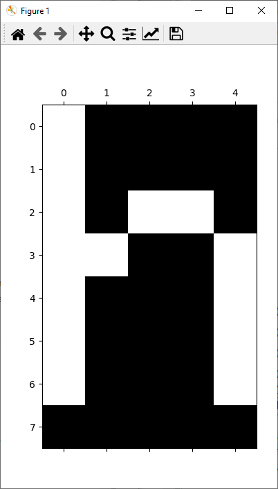
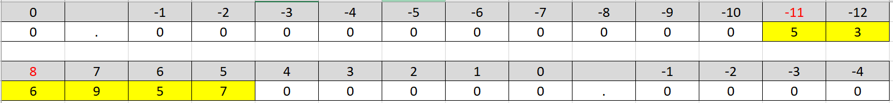
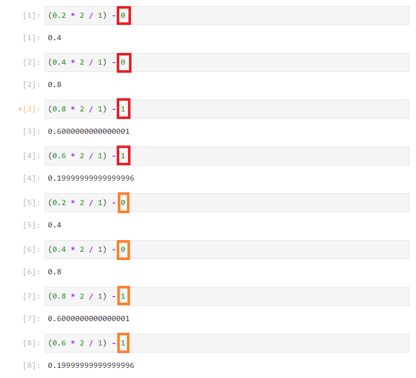

# Numbering Systems

This guide will look into the decimal system humans use and compare it to the binary system and hexadecimal system that computers use for every day applications.

## Decimal

Humans typically handle numbers using the decimal system which means ten in latin. The decimal system gives the characters ```0-10```. The origin for this is down to the fact that a human possesses ```10``` fingers. Note that Python uses zero-order indexing so the first finger is denoted ```0```. Zero-order indexing is inclusive of the lower bound ```0``` and exclusive of the upper bound ```10```. The last number in a set of hands is ```9``` shown below:


Single digit counting gives ```0```, ```1```, ```2```, ```3```, ```4```, ```5```, ```6```, ```7```, ```8``` and ```9```. To count to a higher value such as ```10```, two people are required and each set of hands is known as a digit. This allows counting ```0-100``` (inclusive of ```0``` and exclusive of ```100```). The number ```99``` is shown below:


Increasing the number of digits, exponentially increases the number of values that can be counted to:

```
values = {1: 10**1, 2: 10**2, 3: 10**3, 4: 10**4}
values
```


## Binary

Under the hood, a computer uses a bit to store data. A bit, can be conceptualised as a digital light switch. Binary means two in latin.

A light switch has two positions:

"off":


"on":


These positions are encoded numerically as:

```0```

```1```

Or in electronics are assigned to constants:

```LOW = 0```

```HIGH = 1```

The numeric representation for a digit is ```0-2``` using zero-order indexing. Recall that this is inclusive of ```0``` and exclusive of ```2```. 

A boolean can also be conceptualised as a binary switch as it has the discrete values:

```False```

```True``` 

which are also equal to ```0``` and ```1``` respectively.

## Byte

The integer datatype has numbers larger than 1 and therefore, a configuration of multiple bits (multiple light switches) is required to represent these larger numbers. The most common configuration is 8 bits which can be visualised as 8 LEDs attached to 8 switches. This configuration is known as a byte.

8 LEDs attached to a virtual Arduino microcontroller will be used to represent this.


## Binary Notation

The above configuration when all switches are off, represents the decimal number ```0```. This configuration can be represented using binary representation.

The prefix ```0b``` (**b**inary) is used to distinguish a binary value from a decimal value.

**All binary numbers will be prefixed. Decimal numbers will not be prefixed.**

The binary prefix is followed by the configuration of the LEDs.

```0```

```0b00000000```


The decimal number 1 occurs when only, a single LED is on. In binary this is the last LED from the left or alternatively the first LED from the right which represents the least significant digit:

```1```

```0b00000001```


The binary and decimal notation are identical so far as both have the characters ```0``` and ```1```. The differences in the numbering systems will not become apparent until the decimal system has additional characters that the binary system lacks.

In binary, as there are only two states for each LED ```0``` and ```1```, multiple digits are required to count to the next number. To count to the decimal number of 2, 2 digits are required:

```2```

```0b00000010```


This is analogous to using two digits to represent the number 10 in decimal, as there are no additional characters past the digit 9.

**Be careful not to confuse the two number systems**

The decimal number ```10``` (ten) is not equivalent to the binary number ```0b00000010``` (two).

**Pay attention to the prefix of the number used for binary ```0b```.**

The decimal number 3 is therefore the next sequence:

```3```

```0b00000011```


The number of values that can be counted depends on the number of digits:

```
values = {1: 2**1, 2: 2**2, 3: 2**3, 4: 2**4}
values
```


Because there are less individual characters in binary, the number of values does not scale as rapidly as the number of digits are increased and as a consequence mnore digits are required for a binary number:

```
values = {1: 10**1, 2: 10**2, 3: 10**3, 4: 10**4}
values
```


In binary it is common to group 4 digits together and use of 4 digits in binary allows counting from ```0-16```, inclusivew of ```0``` and exclusive of ```16```. If half of the lights are turned on from the right. The binary number is:

```0b00001111```


The first LED from the right, or better put **zeroth** LED from the right, counting using zero-order indexing represents ```2 ** 0``` and is on ```1``` so has a value of:

```
1 * (2 ** 0)
```

The first LED from the right represents ```2 ** 1``` and is on ```1``` so has a value of:

```
1 * (2 ** 1)
```

The second LED from the right represents ```2 ** 2``` and is on ```1``` so has a value of:

```
1 * (2 ** 2)
```

The third LED from the right represents ```2 ** 3``` and is on ```1``` so has a value of:

```
1 * (2 ** 3)
```

The fourth LED from the right represents ```2 ** 4``` and is off ```0``` so has a value of:

```
0 * (2 ** 4)
```

The summation of the above is ```15```:

```
1 * (2 ** 3) + 1 * (2 ** 2) + 1 * (2 ** 1) + 1 * (2 ** 0)
```


A byte has 8 binary switches, in this case 8 LED switches and therefore allows counting to:

```
2 ** 8
```


which is ```0-256``` (inclusive of ```0``` and exclusive of ```256```). The maximum value is therefore ```255```:

```255```

```0b11111111```


## Hexadecimal Notation

Binary numbers such as:

```0b01111011```

are very easy for a computer to understand but are typically hard to transcribe as a human without making a mistake.


To help alleviate this, the digits used in a binary number are grouped into fours. For clarity different colors of LEDs will be used to group each half of the byte.

Recall with four LEDs, there were ```2 ** 4``` combinations giving a range of 0-16 (inclusive of 0 and exclusive of 16).

The hexadecimal numbering system has a unique character for each of these combinations. Hexadecimal means 16 in latin and uses the first ten numbers from the decimal system:

```0```, ```1```, ```2```, ```3```, ```4```, ```5```, ```6```, ```7```, ```8``` and ```9```

And then to get to 16 combinations supplements these with the first 6 letters of the alphabet:

```A```, ```B```, ```C```, ```D```, ```E``` and ```F```.

To distinguish a hexadecimal number the prefix ```0x``` (he**x**) is used:

|decimal|binary|hex|
|---|---|---|
|0|0b0000|0x0|
|1|0b0001|0x1|
|2|0b0010|0x2|
|3|0b0011|0x3|
|4|0b0100|0x4|
|5|0b0101|0x5|
|6|0b0110|0x6|
|7|0b0111|0x7|
|8|0b1000|0x8|
|9|0b1001|0x9|
|10|0b1010|0xA|
|11|0b1011|0xB|
|12|0b1100|0xC|
|13|0b1101|0xD|
|14|0b1110|0xE|
|15|0b1111|0xF|

And the 8 bit binary number:

```0b01111011```

Can be made into groupings of 4 characters ```0b0111``` and ```0b1011``` respectively. Once this grouping is made, each group can be replaced by their hexadecimal equivalent ```0x7``` and ```0xB```. Bringing this together gives the 8 bit binary number represented in hexadecimal ```0x7B```.

Recall to get from binary to decimal, each binary number can be taken to its respective power of 2:

```0 * (2 ** 7) + 1 * (2 ** 6) + 1 * (2 ** 5) + 1 * (2 ** 4) + 1 * (2 ** 3) + 0 * (2 ** 2) + 1 * (2 ** 1) + 0 * (2 ** 0)```


which gives ```123``` in decimal. 

Therefore to recap, the following arrangement of LED switches is represented in the three numbering systems as:


```0b01111011```

```0x7B```

```123```

If the binary and hexadecimal numbers are input into Python, they are automatically converted into their decimal representation:

```
0b01111011
0x7B
```


The ```bin``` and ```hex``` functions cast the number into binary and hexadecimal string representations respectively:

```
bin(0x7B)
bin(123)
hex(0b01111011)
hex(123)
```


## ASCII Characters

Under the hood, each character on the keyboard is mapped to a 8 bit binary number which recall is 2 characters in hexadecimal. The hexadecimal number can be incorporated into a string. Recall in a string the ```\``` denotes insertion of an escape character. If ```\x``` is used, an instruction is given to insert a 2 digit hexadecimal number. This has the general form of:

```
"\x00\x01\x02\x03\x04"
```

Note the ```\x``` is used in front of each set of 2 hexadecimal digits (corresponding to one byte) as this gives an instruction to insert an individual character. The hexadecimal number ```7B``` can be input 5 times using:

```
"\x7B\x7B\x7B\x7B\x7B"
```

Or once using:

```
"\x7B"
```


Notice that the hexadecimal character ```7B``` displays as a left brace ```{```. The ```chr``` function can be used to convert a number to a character. It accepts a hexadecimal number using the prefix ```0x``` or a decimal number without any prefix:

```
chr(0x7B)
chr(123)
```


The inverse ```ord``` function converts a character to a decimal number:

```
ord("{")
```

This decimal number can be cast into a hexadecimal string representation using the ```hex``` function:

```
ord("{")
hex(ord("{"))
```


A for loop to have a look at the mapping with a decimal number:

```
for idx in range(256):
    print(f"{idx}:{chr(idx)}", sep="", end=" ")
```


Notice that the starting characters 0-31 tend to be hidden punctuation marks for example (8 backspace), (9 horizontal tab), (10 line feed), (11 vertical tab), (12 form feed), (13 carriage return), (14 shift out), (15 shift in).

The for loop can be updated to have a look at the binary number:

```
for idx in range(256):
    print(f"{bin(idx)}:{chr(idx)}", sep="", end=" ")
```


and hexadecimal number respectively:

```
for idx in range(256):
    print(f"{hex(idx)}:{chr(idx)}", sep="", end=" ")
```


This range of characters is known as ASCII, an abbreviation for the American Standard Code for Information Interchange.

## Monochrome Images

A very basic screen can be conceptualised as a matrix of white LEDs. In the simplest example below, each white LED in the matrix has its own digital signal that is either "off" or "on":


A monochrome image can be displayed on this screen by turning a subset of white LEDs "on", which recall is mapped to 1. The rest of the white LEDs are "off", which recall is mapped to 0. If a single character on the screen is examined in more detail, notice that each character has 40 pixels that are grouped into 5 columns and 8 rows:


And the data depicting the character therefore looks like:

```
1 0 0 0 0
1 0 0 0 0
1 0 1 1 0
1 1 0 0 1
1 0 0 0 1
1 0 0 0 1
1 0 0 0 1
0 0 0 0 0
```

In the variable explorer of the Spyder IDE, if the character is encoded as a numpy array, the shape of the character can be seen if a (monochrome) background color is applied:


This can be plotted using matplotlib matshow using a colormap of bone:



## Greyscale Images

Let's now look at an analog white LED. The white LED is attached to a potentiometer which operates over 8 bits which recall is also known as a byte. A byte has 256 levels ranging from 0-255. In this configuration at 0, the white LED has no emission and the absence of light is perceived as black. At 255 the white LED is on full brightness which is perceived as white. Any other level is a mixture of black and white which is perceived as some level of gray.


For a screen where each pixel is an analog white LED that can individually be varied from 0-255, a grayscale image can be generated. For example:

```
[[255, 255, 255, 255, 255],
 [223, 223, 223, 223, 223],
 [191, 191, 191, 191, 191],
 [159, 159, 159, 159, 159],
 [127, 127, 127, 127, 127],
 [ 95,  95,  95,  95,  95],
 [ 63,  63,  63,  63,  63],
 [ 31,  31,  31,  31,  31]]
```

In the variable explorer of the Spyder IDE, the shape of the grayscale pattern can be seen if a background color is applied:


This is plotted as:


Because each level is a byte or 8 bit, this is known as an 8 bit greyscale image.

## Color Images

To make a color, color mixing is performed. Color mixing uses the three primary colors red, green and a blue, which can physically be achieved by using a red LED, green LED and blue LED or a combined RGB LED. 


Each individual LED in the RGB LED has its own byte of intensity values. Therefore the red values range between 0-255, green values range between 0-255 and blue values range between 0-255:


The orange color displayed on the screen for example sets:
* the red LED to a maximum intensity of 255 (0xFF)
* the green LED to an intensity of 192 (0xFC)
* the blue LED to the minimum intensity of 0 (0x00).

A color screen is an array of these RGB LEDs. An image of random colors can be created using three equally sized numeric arrays of random integers spanning between ```0-256``` (1 byte). The red array is the color of the red LED for each pixel, the green array is the color of the green array for each pixel and the blue array is the color of the blue array for each pixel.


The color mixing of the red LED matrix of values, the green LED matrix of values and the blue LED matrix of values gives the color image below:


The data behind this image is a 3D array of integer values (which are recognised by the computer as binary values). Typical pictures are usually of much larger array sizes. A picture that is 8 MB will typically use 3264 rows by 2448 columns for example.

## Digital and Analog Audio

Other signals are generated using different output devices. For example a buzzer may be used to create an audio tone. This buzzer can be digital "on" or "off":


Or can have an analog 8 bit audio. For 8 bit (1 byte) there are 256 different tones of buzzer which are encoded from 0-255 and a tune can be made from a sequence of tones for specified durations.

## Unicode Characters

ASCII is an 8 bit (1 byte) subset of characters. There is a much larger set of characters spanning over 16 bit (2 bytes) covering most mathematical operations and European languages. Later versions of unicode also have characters than span over 32 bit (4 bytes).

```
2 ** 16
2 ** 32
```


The ```chr``` function can accept an integer decimal or hexadecimal number as an input argument, while the corresponding ```ord``` function returns a decimal integer. This decimal integer can be cast to hexadecimal using the ```hex``` function. For example:

```
0x0394
chr(916)
chr(0x0394)
ord("Δ")
hex(ord("Δ"))
```


Note the notation used before ```\x7B``` is configured only for a Hexadecimal number that spans over a byte i.e. an ASCII character. The escape character will not recognise any subsequent digit as part of the hexadecimal number.

Unicode characters can be used for Greek characters:

```
for num in range(0x0391, 0x03CA):
    print(hex(num), chr(num))
```


Mathematical Symbols:

```
print(hex(0x00D7), chr(0x00D7))
print(hex(0x00F7), chr(0x00F7))

for num in range(0x2200, 0x2300):
    print(hex(num), chr(num))
```


And some miscellaneous symbols:

```
for num in range(0x2300, 0x2400):
    print(hex(num), chr(num))    
```


which are commonly used in engineering and science.

## Unsigned and Signed Numbers

So far only positive numbers has been considered and ths grouping is known as **unsigned** integers. An 8 bit unsigned integer ranges from ```0-256``` in steps of 1. Recall that Python uses zero-order indexing which is inclusive of the lower bound ```0``` and exclusive of the upper bound ```256``` meaning the maximum value is ```255```.

There are other numbering systems which include negative numbers such as the 8 bit **signed** integer. This numbering system also physically spans over 8 bit but is encoded differently.

In this numbering system half the possible arrangement of bits is used to represent the negative numbers and the other half is used to represent the positive numbers. The binary representation therefore spans from:


```-128```

```0b00000000```

```0x00```

to:


```+127```

```0b11111111```

```0xFF``` 

Note as ```-0``` and ```+0``` are the same value, only one configuration for ```0``` is required and therefore a signed integer tends to have the modulus of the negative limit ```(-128)``` being one larger than the modulus of the positive limit ```(+127)```. This is denoted as ```(-128)-(+128)``` using zero-order indexing, inclusive of the lower bound and exclusive of the upper bound. Parenthesis are added for clarity.

To count up to larger numbers more computer memory is required to store the number i.e. a larger number of bits. The 32 bit signed integer, as the name suggests uses 32 bits. In this numbering system the lower limit is:

```-2147483648```

```0b00000000000000000000000000000000```

```0x0000000000000000```

And the upper limit is:

```2147483647``` 

```0b11111111111111111111111111111111```

```0xFFFFFFFFFFFFFFFF```

This is denoted as ```(-2147483648)-(+2147483648)``` using zero-order indexing.

## The Decimal Point and Decimal Scientific Notation

So far only integer numbers have been considered. In physical applications there are numbers which scale really small or large with respect to each other. 

These numbers are compared normally to some standard such as the metre which is used to compare lengths. For example:

* the radius of a hydrogen atom = 0.000000000053 m 

* the height of a human = 1.5 m

* the radius of the sun = 95700000 m 

As these numbers may be fractional compared to the standard of measurement a decimal point ```.``` is used to seperate out the integer and fractional parts. As very small and very large numbers have a large number of preceding zeros or trailing zeros they become difficult to transcribe and are therefore typically expressed in scientific notation. 

To convert from a decimal number to a decimal number in scientific notation:

* Take the order of magnitude of the highest significant digit. This is shown depicted in red which is the value of the exponent at -11 and 8 for the small and large number respectively. 
* Take the remaining non-zero numbers highlighted in yellow and add the decimal point after the most digit giving the mantissa which is 5.3 and 6.957 for the small and large number respectively.



Write the number using the form ```mantissa```e```exponent``` and therefore:

* the radius of a hydrogen atom = 5.3e-11 m 

* the height of a human = 1.5 m

* the radius of the sun = 9.57e8 m 

The length examples above differ in approximately 20 of orders of magnitude and there are still smaller and larger objects. To map each possible value over this scale of magnitude directly as a binary value would require an unworkable amount of computer memory!!!

In practice, the interaction between these two numbers can be considered:

```
m = 5.3e-11
n = 6.9551e+8
```

For ```n>>m``` where ```n``` is a large number and ```m``` is a small number, interactions involving addition or subtraction of the small number essentially leave the bigger number essentially unchanged:

```n + m ~ n``` 

```n - m ~ n``` 


In other words, the change due to the presence of the smaller number is insignificant to the error of the larger number. 

However interactions involving multiplication or division are significant.

Multiplication can be calculated using a multiplication of the mantissa of the two numbers, combined with the exponent of the sum of the two numbers exponents:

```n * m``` 

```(6.9551 * 5.3) e (+8 + (-11))```


Division can be calculated using division of the mantissa of the two numbers, combined with the exponent of the difference of the two numbers exponents:

```n / m``` 

```(6.9551 / 5.3) e (+8 -(-11))```


Physically the sun is made up of a huge number of hydrogen atoms and the uncertainty of the suns radius is therefore much larger than the size of a single hydrogen atom itself which is why the addition and subtraction of the radius of a hydrogen atom from the sun is insignificant. When using division of the radius of the sun by the radius of the hydrogen atom, the approximate number of hydrogen atoms along the diameter of the sun is returned. This is a very large number of hydrogen atoms and therefore a difference of a single hydrogen atom is insignificant with respect to this very large number.

## The Binary Point and Binary Scientific Notation Modified by IEEE

Scientific notation was discussed in decimal (10), which uses the decimal point, the base ten and the characters ```0-10```. A computer can only encode a number usign a series of binary (2) switches known as bits. A floating point number is stored on a computer using modified binary scientific notation.

Let's explore converting a floating point decimal (10) into a floating point decimal (2).

Take:

```
0.25
```

Let's begin to convert this into binary. To do this multiply the number by 2 and divide it by 1 in a series of steps. If the value before the decimal point is 0 subtract 0, if the value before the decimal point is 1 subtract 1.


(0.25 * 2 / 1 = 0.5) - ```0``` = 0.5 

(0.5 * 2 / 1 = 1.0) - ```1``` = 0.0

(0 * 2 / 1 = 0.0) - ```0``` = 0.0

⋮


To get the number in base 2, transpose the column of subtracted numbers and place after the binary point:

```
0.01 (base 2)
```

To check multiply each value by its exponent.

```
0 * 2 ** 0 + 0 * 2 ** -1 + 1 * 2 ** -2
```


Let's look at another example:

```
0.20
```

(**0.2** * 2 / 1 = 0.4) - ```0``` = 0.4

(0.4 * 2 / 1 = 0.8) - ```0``` = 0.8

(0.8 * 2 / 1 = 1.6) - ```1``` = 0.6

(0.6 * 2 / 1 = 1.2) - ```1``` = **0.2**

Notice that the above returns to a value of 0.2. This means the same operation is effectively repeating again and again and again...

(**0.2** * 2 / 1 = 0.4) - ```0``` = 0.4

(0.4 * 2 / 1 = 0.8) - ```0``` = 0.8

(0.8 * 2 / 1 = 1.6) - ```1``` = 0.6

(0.6 * 2 / 1 = 1.2) - ```1``` = **0.2**

(**0.2** * 2 / 1 = 0.4) - ```0``` = 0.4

(0.4 * 2 / 1 = 0.8) - ```0``` = 0.8

(0.8 * 2 / 1 = 1.6) - ```1``` = 0.6

(0.6 * 2 / 1 = 1.2) - ```1``` = **0.2**

(**0.2** * 2 / 1 = 0.4) - ```0``` = 0.4

(0.4 * 2 / 1 = 0.8) - ```0``` = 0.8

(0.8 * 2 / 1 = 1.6) - ```1``` = 0.6

(0.6 * 2 / 1 = 1.2) - ```1``` = **0.2**

⋮



The number in binary is therefore recurring and will be truncated in line with the number of bits used to store the floating point number.

```
0.001100110011... (base 2)
```

To check multiply each value by its exponent. This won't be exact due to recursion but should be close.

```
0 * 2 ** 0 + 0 * 2 ** -1 + 0 * 2 ** -2 + 1 * 2 ** -3 + 1 * 2 ** -4 + 0 * 2 ** -5 + 0 * 2 ** -6 + 1 * 2 ** -7 + 1 * 2 ** -8
```


Let's also have a look at the example:

```
0.10 (base 10)
```

(0.1 * 2 / 1 = 0.2) - ```0``` = **0.2**

(**0.2** * 2 / 1 = 0.4) - ```0``` = 0.4

(0.4 * 2 / 1 = 0.8) - ```0``` = 0.8

(0.8 * 2 / 1 = 1.6) - ```1``` = 0.6

(0.6 * 2 / 1 = 1.2) - ```1``` = **0.2**

(**0.2** * 2 / 1 = 0.4) - ```0``` = 0.4

(0.4 * 2 / 1 = 0.8) - ```0``` = 0.8

(0.8 * 2 / 1 = 1.6) - ```1``` = 0.6

(0.6 * 2 / 1 = 1.2) - ```1``` = **0.2**

(**0.2** * 2 / 1 = 0.4) - ```0``` = 0.4

(0.4 * 2 / 1 = 0.8) - ```0``` = 0.8

(0.8 * 2 / 1 = 1.6) - ```1``` = 0.6

(0.6 * 2 / 1 = 1.2) - ```1``` = **0.2**

⋮


Once again, a recurring operation is observed:

```
0.000110011001... (base 2)
```

To check multiply each value by its exponent. This won't be exact due to recursion but should be close.

```
0 * 2 ** 0 + 0 * 2 ** -1 + 0 * 2 ** -2 + 0 * 2 ** -3 + 1 * 2 ** -4 + 1 * 2 ** -5 + 0 * 2 ** -6 + 0 * 2 ** -7 + 1 * 2 ** -8
```


Both 0.1 (base 10) and 0.2 (base 10) are recurring when represented in base 2:

```
0.1 (base 10)

0.00110011001... (base 2)
```

```
0.2 (base 10)

0.0001100110011... (base 2)
```

Recurring operations are more prevalent in the base 2 numbering system as there are less unique characters to represent a number than in decimal, making it even more limited. 

Physically a computer can only store numbers to a specified precision of physical bits and therefore rounding errors are observed when working with floating point numbers, with the last digit truncated. This is the reason for the rounding error observed at the beginning of this tutorial.

Floating point arithmetic specified by the Institute of Electrical and Electronics Engineers (IEEE) is fundamentally a binary representation of scientific notation however some additional tricks are carried out to save memory. For simplicity let's look at the floating-point format binary 16.

The floating-point format binary 16 has a similar form to binary scientific notation:

* mantissa sign: 1 bit 
* signed exponent: 5 bits
* mantissa modulus: 10 bits

There are a number of optimisations used to efficiently store the numbers:

```0b``` ```0``` ```00000``` ```0000000000```

The mantissa sign is split from the mantissa modulus. With ```0``` representing a positive number:

```0b``` ```0``` ```?????``` ```??????????```

and ```1``` representing a negative number:

```0b``` ```1``` ```?????``` ```??????????```

The mantissa sign is split from the reest of the mantissa because explicitly specifying all combinations from a range of negative to positive numbers would take more memory.

In the case of the exponent, for 5 bits, there are ```2**5``` combinations which is 32 (base 10). These have to be split between negative and positive values which would give the range -15 to +16. To encode all these values as positive numbers, a biased exponent is used with an offset of ```15```. An exponent of ```0``` for example will be encoded as ```0+15``` which is ```15``` and 15 in binary is:

```0b``` ```?``` ```01111``` ```??????????```

Confer with the hexadecimal and binary values corresponding to the numbers 0-15 when hexadecimal notation was discussed earlier in this tutorial.

An exponent of ```-1``` for example will be encoded as ```-1+15``` which is ```14``` and 14 in binary is:

```0b``` ```?``` ```01110``` ```??????????```

An exponent of ```+1``` for example will be encoded as ```+1+15``` which is ```16``` and 16 in binary is:

```0B``` ```?``` ```10000``` ```??????????```

For scientific notation of the decimal system the first non-zero value was placed in front of the decimal point and because there were ten characters, this gave nine possibilities where xxx is the rest of the mantissa and yyy is the exponent:

* ```1.```xxx...eyyy...
* ```2.```xxx...eyyy...
* ```3.```xxx...eyyy...
* ```4.```xxx...eyyy...
* ```5.```xxx...eyyy...
* ```6.```xxx...eyyy...
* ```7.```xxx...eyyy...
* ```8.```xxx...eyyy...
* ```9.```xxx...eyyy...

In binary, because there are only have two characters, the only non-zero value in front of the binary point is of the form:

* ```1.```xxx...eyyy...

Therefore since all floating point numbers start with ```1.```, to conserve memory this first digit isn't encoded. Only the trailing xxx... after the binary point is encoded:

Let's have a look at the number:

```
0.2 (base 10)
```

From earlier this is:

```
0.001100110011... (base 2)
```

The number is positive so the sign is 0:

```0b``` ```0``` ```?????``` ```??????????```

The most significant non-zero value:

```
0.001100110011... (base 2)
```

Has the power -3 (base 10). 

```1.```100110011... 

Adding the exponent offset of ```15```, gives ```-3 + 15``` which is ```12``` (base 10). In binary representation using ```5``` bits this is:

```01100 (base 2)```

The exponent therefore becomes:

```0b``` ```0``` ```01100``` ```??????????```

As the first number before the decimal point is always 1, it is ignored and the preceding numbers after the decimal point are encoded. In this numbering system, 10 bits are used to store the number:

1.```1001100110```... 

The number therefore is encoded as:

```0b``` ```0``` ```01100``` ```1001100110```

The half-precision floating-point format binary 16 is the easiest to illustrate, however it is more typical for a double precision to be used for a floating point number.

The half-precision floating-point format binary 16 uses 16 bits:
* mantissa sign: 1 bit 
* signed exponent: 5 bits (15 is the offset)
* mantissa modulus: 10 bits

The single floating-point format binary 32 uses 32 bits:
* mantissa sign: 1 bit 
* signed exponent: 8 bits (127 is the offset)
* mantissa modulus: 23 bits

The double floating-point format binary 64 uses 64 bits:
* mantissa sign: 1 bit 
* signed exponent: 11 bits (1023 is the offset)
* mantissa modulus: 52 bits

## Precision

Recursion rounding errors occur in both decimal and binary and can be visualised using the concept of a third. 1/3 does not lie on any of the 10 unique digits in decimal:


Long division which consists of a series of integer divisions and associated integer modulus operations illustrated below:


This value has a recurring value in decimal: 

```
0.333333...
```

As the circle illustration in binary has even less divisions, recursion rounding errors will occur far more often. This was seen with the case of 0.1, 0.2 when encoding them as an IEEE half precision floating point number:


Python floating point numbers can be used for the vast majority of calculations however care should be taken when using them with logical operators due to recursion rounding errors brought about due to the under the hood binary encoding. ```0.1 + 0.2``` for example can be compared with ```0.3```. 

```
0.3
0.1 + 0.2
```


Note the slightly different value due to a recursion rounding errors in the storing of ```0.1``` and ```0.2``` and hence the calculation involving the summation. 

A double floating-point is quoted up to a precision of 17 digits:

```
len("30000000000000004")
```


A format specifier in a fstring can however force a much longer display such as 100 characters:

```
print(f"{0.1 + 0.2: 0.100f}")
len("3000000000000000444089209850062616169452667236328125")
```


After 52 characters, arbitrary zeros are added. 52 characters are expected for a double precision number. All of these additional digits past 17 should be considered as inaccurate and are more highly influenced by floating point recursion errors.

Return to:

[Home](../../../)
