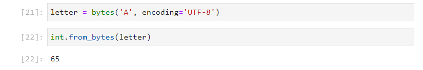

# Numeric Data Types

Previously the concept of Object Orientated Programming was outlined and the three fundamental text data types, the ```str```, ```bytes``` and ```bytearray``` were examined. The previous guide covered the identifiers and data model identifiers for these text data types. This guide will build upon these concepts and cover the numeric data types.

In Python there are 6 fundamental datatypes:

|Data Type|Base|Examples|
|---|---|---|
|bool|binary integer|False==0, True==1|
|int|decimal integer|0,1,2,3,4,5,6,7,8,9,10,...|
|float|binary scientific notation|0.123, 123.4|
|complex|binary scientific notation|0.123 + 223.4j|
|Decimal|decimal scientific notation|0.123, 123.4|
|Fraction|decimal integer|1/2, 3/5|

To understand these differences, let's examine how a computer stores a number.

## Binary Bit

Under the hood, a computer uses a bit to store data. A bit, can be conceptualised as a digital light switch. The LED has a low voltage when the switch is off. This is denoted as ```0```:


The LED has a high voltage when the switch is on. This is denoted as ```1```:


Alternatively a statement can be made about the LED. The LED is ON. This is ```False``` when the switch is off and ```True``` when the switch is on. These are the two values used for the boolean data type.

Other digital electronic components also change in response to a low or high voltage. A digital buzzer for example will be quiet at a low voltage:


And make a noise at a high voltage:


## 1 Byte (8 Bits)

On the hardware level a computer uses a series of binary switches to count. These can be conceptualised as a series of 8 binary LEDs. Each LED has 2 values ```0``` or ```1```. 


The sequence above can be read as a binary string. The binary string is enclosed in ```' '``` to denote it is a string and has the prefox ```'0b'```. The numeric data is ```0``` when the LED is off and ```1``` when the LED is on.

The binary string above is:

```
'0b01111011'
```

Binary is not very human readible. It is easy to make a transcription error when a number repeats. As a consequence the binary sequence is typically split into groups of 4 LEDs which has 16 combinations and these combinations are assigned a hexadecimal value. In the example above the blue LEDs have a configuration of ```'0b0111'``` which is ```'0x7``` and the red LEDs have a configuration of ```'0b1011'``` which is ```0xb```. The binary sequence of 8 binary digits therefore becomes 2 hexadecimal digits ```0x7b```:

|Binary Value|Hexadecimal Value|
|---|---|
|0000|0|
|0001|1|
|0010|2|
|0011|3|
|0100|4|
|0101|5|
|0110|6|
|0111|7|
|1000|8|
|1001|9|
|1001|a|
|1011|b|
|1100|c|
|1101|d|
|1110|e|
|1111|f|

The binary string above is:

```
'0b01111011'
```

Because binary uses a base of 2. Each digit has a power of 2:

```
   0   1   1   1   1   0   1   1
   2⁸  2⁷  2⁶  2⁵  2⁴  2³  2¹  2⁰
```

The sum of this as a decimal integer is the sum of the powers of 2 that have a value of 1.

$$2⁷ + 2⁶ + 2⁵ + 2⁴ + 2¹ + 2⁰ = 123$$

The binary string and hexadecimal string of an integer can be shown using the binary function ```bin``` and hexadecimal function ```hex``` respectively:

```
bin(123)
hex(123)
```


These have a base of 2 and a base of 16 respectively.

Inputting ```str()``` followed by shift ```⇧``` and tab ```↹``` will display the docstring of the init signature of the ```str``` class. A decimal integer can be instantiated from a binary string or hexadecimal string when the base is provided:


```
int('0b1111011', base=2)
int('0x7b', base=16)
```


Dropping the quotations stores these numeric values as a decimal integer:

```
0b1111011
0x7b
```


In the last tutorial, the use of ```bytes``` to store text data was covered in great detail. It is worthwhile looking at how the text character itself is displayed. If a simple screen is examined:


And zoomed into a character:


It can be seen that the character is made up of a series of squares known as pixels. Behind the pixel is a LED that is either off ```0``` or on ```1```. Numerically it is a boolean array:



This boolean array looks similar to what is seen on the simple screen:


Instead of being digitally connected an 8 bit analog supply can be used for each LED. Since it is 8 bit, the value from the supply can range from ```0:256``` and therefore the intensity of each LED can change. An array of values can be sent to the screen:


Which look like:


The eye has long (Red), medium (Green) and short (Blue) sensitive receptors. The ratio of light at these receptors is mapped to a color by the brain and can be stimulated using a combination of a Red, Green and Blue LEDs:


These are typically combined into an analog RGB LED:


If an analog RGB LED is used for each pixel. An array of values can be sent to each color channel:


Which looks like:


Image manipulation programs tend to have color pickers which can be used to select these values:


## Decimal

Humans on the other hand, typically handle numbers using the decimal system which means ten in latin. The origin of this is ten fingers:


Python uses zero order indexing meaning the first finger is denoted as zero:

```
  |⓪   ①   ②   ③   ④   ⑤   ⑥   ⑦   ⑧   ⑨   ⑩   ⑪
```

Counting from ```0:10``` means counting from ```0``` (inclusive of zero) to ```10``` (exclusive of ```10```) as shown:

```
  |⓪   ①   ②   ③   ④   ⑤   ⑥   ⑦   ⑧   ⑨  |⑩   ⑪
```

Notice that the selection above has ```10``` items in it meaning the selection has a length of ```10```. This selection can be conceptualised as the green set of hands above.

To count to values higher than 10, 2 sets of hands, or 2 digits are required. The purple set of hands can be used to indicate the value of the digit corresponding to the 10s and the green set of hands can correspond to the 1s:


With these two sets of hands or 2 digits it is possible to count from ```0:(10 ** 2)``` which is ```0:100``` exclusive of the value ```100``` which requires 3 sets of hands or 3 digits.

## Integers Mapped to Bytes

If 8 bits are used to store unsigned numbers. The maximum value that can be stored is $2⁸=256$. The arrangement of these bits for a series of decimal numbers is

```
for num in range(0, 256, 8):
    num_bytes = num.to_bytes(length=1,
                             byteorder='little', 
                             signed=False)
    print(f"{num :+04d}  '0x{num_bytes.hex()}'", end='    ')
```


If instead a signed number is used, half the byte values are used for positive numbers and other half of the byte values are used for their negative counterparts:

```
for num in range(-128, 128, 8):
    num_bytes = num.to_bytes(length=1,
                             byteorder='little',
                             signed=True)
    print(f"{num :+04d}  '0x{num_bytes.hex()}'", end='    ')
```


Python uses a 32 Bit signed integer by default. 32 bits looks like the following. The colors of the LEDs show the hexadecimal grouping:


```
for num in [-2147483648, -1073741824, 0, 1073741824, 2147483647]:
    num_bytes = num.to_bytes(length=4,
                             byteorder='little',
                             signed=True)
    print(f"{num :+011d}  '0x{num_bytes.hex()}'", end='      ')
```    


This means there

-2147483648 through 2147483647


For integers i.e. whole numbers it is easy to translate between a decimal integer and what 