# Numeric Data Types


## int class

An integer is a whole number. 
Initialization Signature

The init signature of the ```int``` class can be viewed by inputting the class name with open parenthesis and pressing shift ```⇧``` and tab ```↹```:

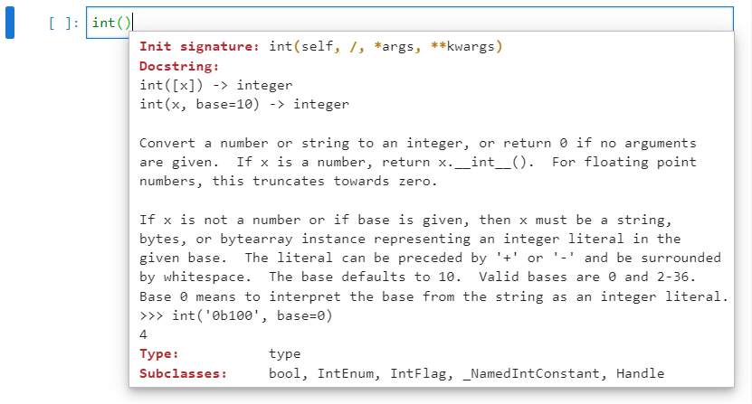

The init signature is normally used when cast an integer from a string such as:

```
int('65')
```

The default base is ```10```. For a binary or hexadecimal string this needs to be specified:

```
int('0b1000001', base=2)
int('0x41', base=16)
```

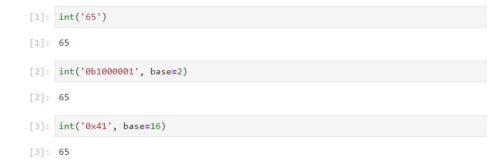

Without quotation marks, these are all recognised as an integer:

```
65
0b1000001
0x41
```

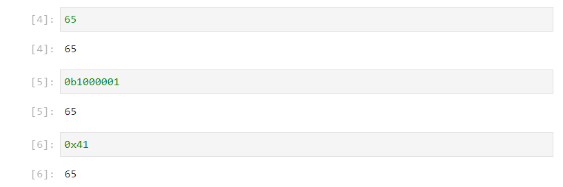

The default way to instantiate an integer is to use a decimal as it uses a base 10 by default. The number can be assigned to an object name:

```
num1 = 65
```


Recall assigning to an object name can be conceptualised as adding a label to the integer object. This label can be used to reference the integer object. The Variable Inspector may be opened by right clicking blank space and selecting Open Variable Inspector:


The datatype is ```int``` as expected:

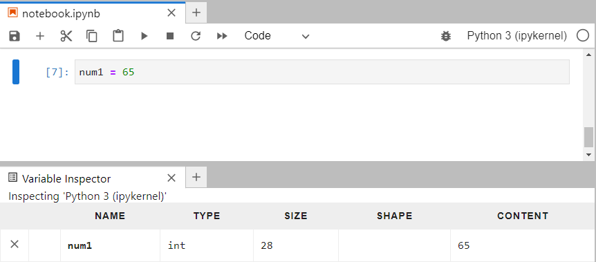

### Identifiers

Inputting ```num1.``` and pressing tab ```↹``` will displa a list of identifiers:

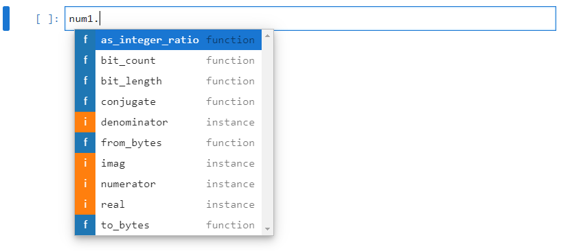

The integer ```65``` is designed for interoperatability with the ```Fraction``` class and can be conceptualised as the fraction instance:

$$\left(\frac{65}{1}\right)$$

The ```numerator``` will match the value of the integer in this case ```65``` and the ```denominator``` will be ```0```. The associated method ```as_integer_ratio``` returns these two attributes and returns the fraction as a ```tuple```:

```
num1.numerator
num1.denominator
num1.as_integer_ratio()
```

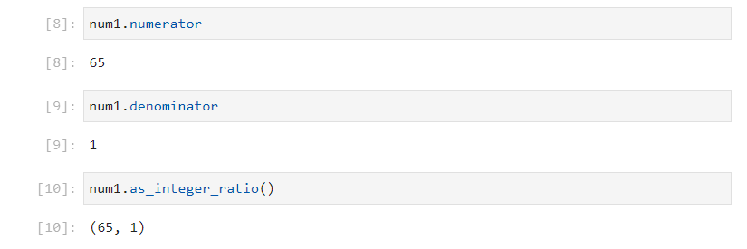

The integer ```65``` is designed for interoperatability with the ```complex``` class and can be conceptualised as the complex number:

$$65+0j$$

where $j = \sqrt{-1}$.

The ```real``` attribute reads the real value will match the value of the integer in this case ```65``` and the ```imag``` will be ```0```. The associated method ```conjugate``` takes these two attributes and inverts the sign of the ```imag``` attribute, because this is ```0``` the complex conjugate matches the original integer:

```
num1.real
num1.imag
num1.complex()
```

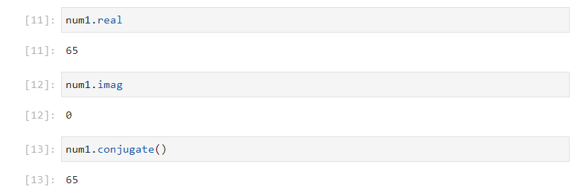

The remaining identifiers are for interoperatability with the ```bytes``` class. Details about ```bytes``` and encoding were given in the previous tutorial. The binary representation of the integer which can be viewed using:

```
bin(num1)
```

The method ```bit_count``` returns the number of ones which in this case is ```2``` and the method ```bit_length``` returns the bit length (the number of digits past the ```0b``` prefix):

```
num1.bit_count()
num1.bit_length()
```

The ```to_bytes``` method can cast the integer to a ```bytes``` instance. By default a length of ```1``` byte is used with a byteorder that is ```big``` (big endian) and signed is ```False``` meaning the bytes are unsigned:

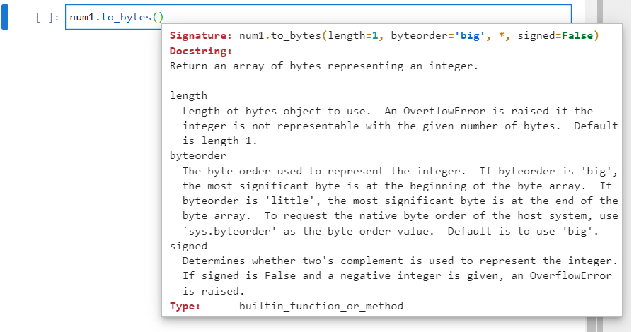

This behaviour will therefore only work for a positive integer between ```0:256``` as these are the limits for a 8 bit signed integer. The defaults will behave similarly to the ```chr``` function which returns a Unicode value:

```
num1.to_bytes()
chr(num1)
```

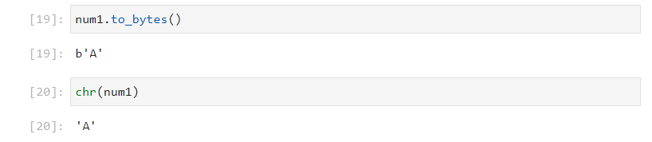

If a byte length of ```3``` bytes is selected:

```
num1.to_bytes(length=3)
```

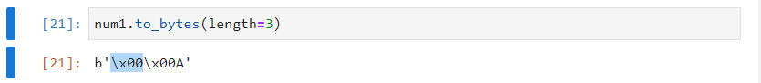

The escape sequence for ```\x00``` will display as this is a non-printable character. The letter ```'A'``` has an escape sequence of ```\x41``` but displays as ```'A'``` as it is readible. This can be seen by using the ```bytes``` method ```hex```:

```
num1.to_bytes(length=3).hex()
```

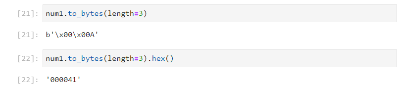

A Unicode character can be examined that occupies two bytes:

```
num2 = 949
chr(num2)
letter2 = num2.to_bytes(length=2, byteorder='big')
letter2.decode(encoding='UTF-16-BE')
```

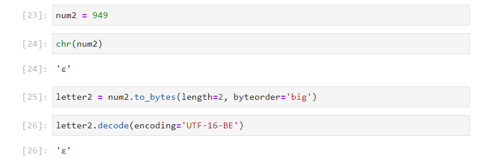

The ```from_bytes``` class method is an alternative constructor which can be used to instantiate an integer from a ```bytes``` object. For example:

```
int.from_bytes(letter2)
```

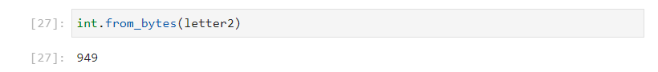


## Data Model Identifiers

If the directory function ```dir``` is used on an integer instance ```num1```, the last of identifiers displays alongside data model identifiers. 

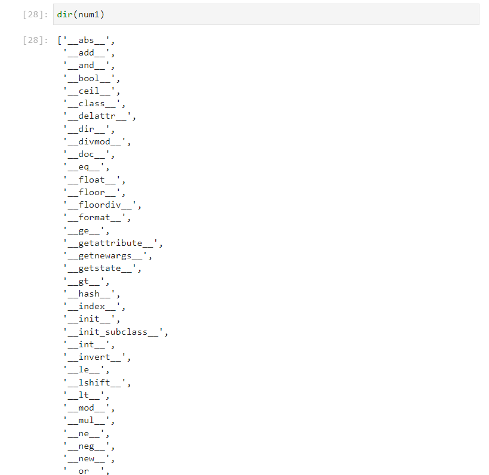

To view this list horizontally, pretty print will be used:

```
import pprint
pprint.pprint(dir(num1), compact=True)
```

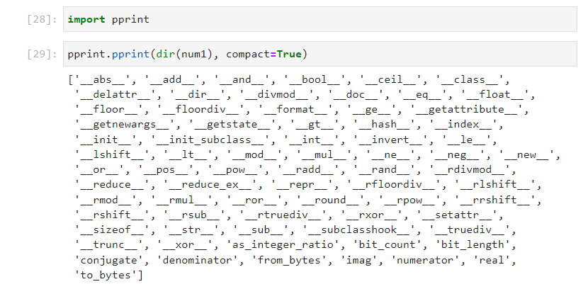

The inbuilt function ```dir``` uses this datamodel method and returns the sorted list. The ```__str__``` and ```__repr__``` data model identifiers map to the inbuilt function, class ```str``` and function ```repr``` respectively:

format can be sued with fstring


The data model identifier ```__class__``` maps to the inbuilt class ```type``` which displays the class type of the object. Notice that the data model identifier is an attribute so is just referenced and not called. The class ```type``` is called so uses parenthesis:

The ```__format__``` method is used to specify how the string object behaves with format specifiers in a formatted string.


The data model identifier ```__doc__``` is the document string for a string instance. Once again this is an attribute that is referenced:

It is more commonly used with the ```?``` which includes some other information from the data model identifiers ```__type__```, ```__str__```, and ```__doc__```:

The ```__hash__``` method means that a string is hashable. Only immutable objects are hashable. A hashable value is permissible as a key in a dictionary or mapping. Each item that is hashable is assigned a unique hash value. This can be viewed using:


```__getitem__``` is an collection data model identifier available in both immutable and mutable sequences. Indexing of an integer is not supported.

index, ,  the int can be used as an index


The data model ```__sizeof__``` displays the memory an object occupies in bytes:


The ```__init__``` data model method is called when instantiating a string:


When the new Python object is created, the ```__new__``` data model method is called. This creates the new instance which is given the label or object name ```greeting``` and then the initialization signature ```__init__``` is called to initialize the instance with the unique text data.

The ```__getattribute__```, ```__setattr__``` and ```__delattr__``` methods are used to get, set and delete attributes. A string has no attributes so these are not used by the end user.


The data model identifiers ```__getstate__```, ```__reduce__```, ```__reduce_ex__``` and ```__getnewargs__``` are used by the pickle module to serialise the ```str```.

The last data model identifier is ```init_subclass``` and ```__subclasshook__``` which is used for Abstract Base Classes.


The addition ```__add__``` data model identifier controls the behaviour of the ```+``` operator:


The modulo data model identifier ```__mod__``` data controls the behaviour of the ```%``` operator which is used with a tuple for legacy string formatting. The reverse modulo identifier ```__imod__``` is used when the positions around the ```%``` operator are reversed.

The six comparison data model identifiers equals ```__eq```, not equals ```__ne__```, less than or equal to ```__le__```, less than ```__lt__```, greater than or equal to ```__ge__``` and greater than ```__gt__``` control the behaviour behind the 6 comparison operators ```==```, ```!=```, ```<=```, ```<```, ```>=``` and ```>``` respectively.


pos neg
abs ceil floor round trunc


add sub mul pow floordiv mod floordiv truediv
radd rsub rmul rpow rdivmod rmod rfloordiv rtruediv

and or xor
rand ror rxor

lshift rshift
rlshift rrshift


bool floor int


eq, le, ge, lt, ne, 

