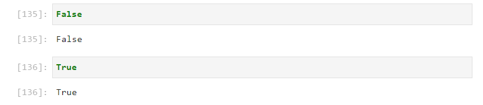

# Numeric Data Types


## int class

An integer is a whole number. 

### Initialization Signature

The init signature of the ```int``` class can be viewed by inputting the class name with open parenthesis and pressing shift ```⇧``` and tab ```↹```:


The init signature is normally used when cast an integer from a string such as:

```
int('65')
```

The default base is ```10```. For a binary or hexadecimal string this needs to be specified:

```
int('0b1000001', base=2)
int('0x41', base=16)
```


Without quotation marks, these are all recognised as an integer:

```
65
0b1000001
0x41
```


The default way to instantiate an integer is to use a decimal as it uses a base 10 by default. The number can be assigned to an object name:

```
num1 = 65
```


Recall assigning to an object name can be conceptualised as adding a label to the integer object. This label can be used to reference the integer object. The Variable Inspector may be opened by right clicking blank space and selecting Open Variable Inspector:


The datatype is ```int``` as expected:


### Identifiers

Inputting ```num1.``` and pressing tab ```↹``` will displa a list of identifiers:


The integer ```65``` is designed for interoperatability with the ```Fraction``` class and can be conceptualised as the fraction instance:

$$\left(\frac{65}{1}\right)$$

The ```numerator``` will match the value of the integer in this case ```65``` and the ```denominator``` will be ```0```. The associated method ```as_integer_ratio``` returns these two attributes and returns the fraction as a ```tuple```:

```
num1.numerator
num1.denominator
num1.as_integer_ratio()
```


The integer ```65``` is designed for interoperatability with the ```complex``` class and can be conceptualised as the complex number:

$$65+0j$$

where $j = \sqrt{-1}$.

The ```real``` attribute reads the real value will match the value of the integer in this case ```65``` and the ```imag``` will be ```0```. The associated method ```conjugate``` takes these two attributes and inverts the sign of the ```imag``` attribute, because this is ```0``` the complex conjugate matches the original integer:

```
num1.real
num1.imag
num1.complex()
```


The remaining identifiers are for interoperatability with the ```bytes``` class. Details about ```bytes``` and encoding were given in the previous tutorial. The binary representation of the integer which can be viewed using:

```
bin(num1)
```

The method ```bit_count``` returns the number of ones which in this case is ```2``` and the method ```bit_length``` returns the bit length (the number of digits past the ```0b``` prefix):

```
num1.bit_count()
num1.bit_length()
```

The ```to_bytes``` method can cast the integer to a ```bytes``` instance. By default a length of ```1``` byte is used with a byteorder that is ```big``` (big endian) and signed is ```False``` meaning the bytes are unsigned:


This behaviour will therefore only work for a positive integer between ```0:256``` as these are the limits for a 8 bit signed integer. The defaults will behave similarly to the ```chr``` function which returns a Unicode value:

```
num1.to_bytes()
chr(num1)
```


If a byte length of ```3``` bytes is selected:

```
num1.to_bytes(length=3)
```


The escape sequence for ```\x00``` will display as this is a non-printable character. The letter ```'A'``` has an escape sequence of ```\x41``` but displays as ```'A'``` as it is readible. This can be seen by using the ```bytes``` method ```hex```:

```
num1.to_bytes(length=3).hex()
```


A Unicode character can be examined that occupies two bytes:

```
num2 = 949
chr(num2)
letter2 = num2.to_bytes(length=2, byteorder='big')
letter2.decode(encoding='UTF-16-BE')
```


The ```from_bytes``` class method is an alternative constructor which can be used to instantiate an integer from a ```bytes``` object. For example:

```
int.from_bytes(letter2)
```


## Data Model Identifiers

If the directory function ```dir``` is used on an integer instance ```num1```, the last of identifiers displays alongside data model identifiers. 


To view this list horizontally, pretty print will be used:

```
import pprint
pprint.pprint(dir(num1), compact=True)
```


In the previous tutorial, the data model identifiers were discussed in detail for the ```str``` class. Some analogy can be seen between these two classes.

The inbuilt function ```dir``` uses the datamodel method ```__dir__``` and the list of identifiers as just seen. 

The ```__repr__``` and ```__str__``` data model identifiers give the formal representation of an ```int``` and the informal representation. These map to the ```repr``` and function ```str``` class respectively:

```
repr(num1)
str(num1)
```


For the ```int``` class, the formal and informal representations are identical. Recall conventionally that ```print``` uses the informal ```str``` representation:

```
print(num1)
```


And the cell output prints the formal representation:

```
print(repr(num1))
num1
```


The ```__format___``` identifier is typically used when an integer variable is placed in a formatted string. This was examined in detail when the string class was examined however to recap:

```
f'The number is {num1 :d}'
f'The number is {num1 :03d}'
f'The number is {num1 :+04d}'
```


The data model identifier ```__class__``` maps to the inbuilt class ```type``` which displays the class type of the object. 

```
type(num1)
```


This displays ```int``` as expected.

The data model identifier ```__doc__``` is the document string for a string instance. It is more commonly used with the ```?``` which includes some other information from the data model identifiers ```__type__```, ```__str__```, and ```__doc__```:

```
? num1
```


The ```__index__``` method means that an ```int``` can be used for indexing:

```
'hello'[0]
b'hello'[0]
```


The ```__hash__``` method means that an ```int``` is hashable. A hashable value is permissible as a key in a dictionary or mapping. 

```
num_dict = {1: 'one', 2: 'two', 3: 'three'}
num_dict[1]
```


Keys in the dictionary are normally strings but can be integers aswell. Note this dictionary has the numeric keys and these differ from the numeric index in other collections like a list. The numeric keys above for example lack the key ```0```.


```__getitem__``` is an collection data model identifier. It is used when:

```
num1[0]
```


This is setup to raise a ```TypeError``` as an ```int``` is not subscriptable.

The data model ```__sizeof__``` displays the memory an object occupies in bytes:

```
import sys
sys.getsizeof(num1)
```


The ```__getattribute__```, ```__setattr__``` and ```__delattr__``` methods are used to get, set and delete attributes. ```__getattribute__``` is used when:

```
num1.real
```


```__setattr__``` is used when:

```
num1.real = 66
```


Notice that this is not supported and the method is setup to invoke an ```AttributeError```.

```__delattr__``` is used when:

```
del num1.real
```


This is not supported and the method is setup to invoke an ```AttributeError```.

The ```__init__``` data model method is called when instantiating a string. 


When the new Python object is created, the ```__new__``` data model method is called. This creates the new instance which is given the label or object name and then the initialization signature ```__init__``` is called to initialize the instance with the unique numeric data.

The data model identifiers ```__getstate__```, ```__reduce__```, ```__reduce_ex__``` and ```__getnewargs__``` are used by the pickle module to serialise the ```str```.

The last data model identifier is ```init_subclass``` and ```__subclasshook__``` which is used for Abstract Base Classes.

## Unitary Data Model Identifiers

The unitary data model identifiers allow use of a mathematical operator on a unitary instance:

```__pos__``` maps to the ```+``` operator:

```
num1
+ num1
```


This doesn't change the sign of the integer.

```__neg__``` maps to the ```-``` operator:

```
num1
- num1
```


This changes the sign of the integer.

```__abs__``` maps to the function ```abs```:

```
abs(num1)
abs(- num1)
```


Notice that both of these are positive, the signs have been stripped.

```__ceil__```, ```__floor__``` and ```__trunc__``` map to ```math.ceil```, ```math.floor``` and ```__trunc__```. These methods are designed to cast a non-integer number into an integer. When the number is already an integer, the result is unchanged:

```
num1
import math
math.ceil(num1)
math.floor(num1)
math.trunc(num1)
```


```__round__``` maps to ```round``` which by default rounds to an integer. When the number is already an integer, the result is unchanged:

```
round(num1)
```


```__int__``` maps to the ```int``` init signature to cast the number to an ```int```. When the number is already an integer, the result is unchanged:

```
num1
int(num1)
```


```__bool__``` maps to the ```bool``` init signature to cast the number to an ```bool```. Any ```int``` that is non-zero will map to a boolean value of ```True```, zero will map to ```False```:

```
num1
bool(num1)
num2 = 0
bool(num2)
num3 = -1
bool(num3)
```


```__float__``` maps to the ```float``` init signature to cast the number to a ```float```. Notice the subtle difference in the output, a decimal point is now included:

```
num1
float(num1)
```


## Binary Data Model Methods

Binary data model methods require two numeric instances.

```
num1 = 65
num2 = 4
```


If the docstring of the ```__add__``` binary data model method is examined, the numeric instance the data model method is being called from is referred to as self and the other instance is referred to as value:


```__add__``` maps to the addition operation ```+``` performing numeric addition:

```
num1 = 65
num2 = 4
num1 + num2
```


```__radd__``` the reverse add data model method when called from ```num1``` carries out the operation:

```
num2 + num1
```


The operation above is commutative and both instances are of the same int class so the result is the same. When the operator is used between different class types, there can be subtle differences. 

The ```__add__``` method also controls the behaviour of the inplace addition ```+=``` operator:

```
num1 = 65
num2 = 4
num1 += num2
```


This is shorthand for:

```
num1 = 65
num2 = 4
num1 = num1 + num2
```


Recall the calculation on the right is carried out first using the original value of ```num1```. The object name or ```num1``` is then assigned to this new result.

```__mul__``` maps to the ```*``` operator:

```
num1 = 65
num2 = 4
num1 * num2
```


The ```*``` operator in the ```int``` class performs numeric multiplication as seen above. In the ```str``` class the ```*``` operator is defined to allow string replication with an ```int```.

```
str1 = 'hello'
```


If the following is used, the ```__mul__``` method from the ```str``` class is used ```'hello'``` is the string instance self and ```num1``` is the int instance value. String replication occurs:

```
num1 = 3
str1 = 'hello'
str1 * num1
```


When the following is carried out, the ```__mul__``` method from the ```int``` class is used ```num1``` is the int instance self and ```'hello'``` is the string instance value. As ```__mul__``` is setup in an integer for multiplication, the first operation fails:


```
num1 = 3
str1 = 'hello'
num1 * str1
```


Behind the scenes the reverse multiplication ```__rmul__``` is attempted. The ```__rmul__``` sees that ```'hello'``` is a string and then calls the ```__mul__``` method of the string class, effectivelty computing:

```
'hello' * num1
```

```__mul__``` also maps to the assignment multiplication operator ```*=```.

```__sub__``` maps to the subtraction operator ```-``` which carries out numeric subtraction:

```
num1 = 65
num2 = 4
num1 - num2
```


```__sub__``` also maps to the assignment multiplication operator ```-=```. There is also the associated reverse subtraction ```__rsub__```.

```__pow__``` maps to the power operator ```**``` which raises self to the power of the value:

```
num1 = 65
num2 = 4
num1 ** num2
```


Recall this is equivalent to:

```
65 * 65 * 65 * 65
```


```__pow__``` also maps to the assignment power operator ```**=```. There is also the associated reverse subtraction ```__rpow__```.

```__floordiv__``` maps the floor division ```//``` operator which performs floor division also known as integer division. The associated ```__modulo__``` maps the modulo operator ```%``` which calculates the modulo. ```__divmod__``` maps to the function ```divmod``` which returns the floor division and modulo as components of a tuple. These are usually used with positive itneger values:

```
num1 = 65
num2 = 4
num1 // num2
num1 % num2
divmod(num1, num2)
```


```__floordiv__``` and ```__mod__``` also maps to the assignment floor division operator ```//=``` and the assignment mudulo operator ```%=``` respectively. There is also the associated reverse versions ```__rfloordiv__```, ```__rmodulo__``` and ```__rdivmod__```.

```__truediv__``` maps to float division ```/``` operator which performs float division. The result will always be a float. Notice the inclusion of the decimal point:

```
num1 = 65
num2 = 4
num1 / num2
num1 / 1
```


```__truediv__``` also maps to the assignment floor division operator ```/=```. There is also the associated reverse float divide ```__rtruediv__```.

The six comparison data model identifiers equals ```__eq```, not equals ```__ne__```, less than or equal to ```__le__```, less than ```__lt__```, greater than or equal to ```__ge__``` and greater than ```__gt__``` control the behaviour behind the 6 comparison operators ```==```, ```!=```, ```<=```, ```<```, ```>=``` and ```>``` respectively.

```
num1 = 65
num2 = 4
num1 > num2
num1 > num1
num1 == num1
num1 >= num1
num1 != num1
```


```__and__```, ```__or__``` and ```__xor__``` map to the and operator ```&```, or operator ```|```, xor operator ```^```. These are normally associated with ```boolean``` values recall any integer value that is non-zero is ```True``` and an integer equal to zero is ```False```.

```&``` is ```True``` only if both conditions are ```True```:

```
True & True
True & False
False & False
```


```|``` is ```True``` if one or both conditions are ```True```:

```
True | True
True | False
False | False
```


```^``` is ```True``` if both conditions are different:

```
True ^ True
True ^ False
False ^ False
```


```__and__```, ```__or__``` and ```__xor__``` also maps to the assignment and operator ```=&```, assignment or operator ```=|``` and assignment xor operator ```^=```. There is also the associated reverse versions ```__rand__```, ```__ror__```, ```__rxor__```.

```__lshift__``` maps to the binary left shift operator ```<<``` and ```__rshift__``` maps to the binary right shift operator ```>>```. These operate at the byte level. The ```bin``` function can be used to examine the change. 

Notice that trailing zeros of the specified number have been added to the end shifting the existing byte sequence to the left:

```
num1 = 65
bin(num1)
bin(num1 << 1)
num1 << 1
bin(num1)
bin(num1 << 2)
```


Notice the specified number of digits on the right have been stripped:

```
num1 = 65
bin(num1)
bin(num1 >> 1)
num1 >> 1
bin(num1)
bin(num1 >> 2)
```


```__lshift__``` and ```__rshift__``` also map to the assignment binary left shift operator ```<<=``` and assignment binary right shift operator ```>>=```. There is the associated reverse versions ```__rlshift__``` and ```__rrshift__```.

## bool class

When the method resolution order for the ```int``` class is examined:

```
int.mro()
```


The output list displays ```int``` and then ```object```. This means the ```int``` (like everything else in Python is an object). The method resolution order means Python will first look for a method defined in the ```int``` class (blueprint) and then if it can't find the method there, take a second look in the ```object``` class (blueprint).

When the method resolution order for the ```bool``` class is examined:

```
bool.mro()
```


The output list displays ```bool```, ```int``` and then ```object```. The method resolution order means Python will first look for a method defined in the ```bool``` class (blueprint), then secondly look for a method in the ```int``` class (blueprint) and finally if it can't find the method there, take a third look in the ```object``` class (blueprint). The only major modification to the ```bool``` class is a restriction to only two possible values ```False``` and ```True```. Otherwise it behaves identically to the ```int``` class as most its methods are taken directly from the ```int``` class unmodified (i.e. accessed directly from the ```int``` blueprint).

### init signature

The init signature of the ```bool``` class can be viewed by inputting the class name with open parenthesis and pressing shift ```⇧``` and tab ```↹```:


The init signature states that the builtins ```False``` and ```True``` are the only two instances of the class ```bool``` and clarifies that the class ```bool``` is a subclass of the class ```int```, and cannot be subclassed.

Recall casting an integer to a bool gives ```True``` for any non-zero integer and ```False``` for zero:

```
bool(0)
bool(1)
bool(-4)
```


Typically the inbuilts ```False``` and ```True``` are sued directly but they can be assigned to object names:

```
False
True
```



### identifiers

A list of identifiers can be found by inputting one of these object names followed by a dot ```.``` and tab ```↹```:


These methods are the same as their counterparts in the ```int``` class because this is a subclass and the methods are taken directly from the ```int``` classes blueprint.

### datamodel identifiers

All the identifiers, including the data model identifiers can be viewed using:

```
pprint.pprint(dir(False), compact=True)
```


Most of these behave identically to the ```int``` class as they are taken directly from this blueprint. The two string related data model identifiers ```__repr__``` and ```__str__``` have been updated to display strigns of the two builtin identifiers ```'False'``` and ```'True'``` opposed to ```'0'``` and ```'1'```.

```
repr(False)
str(False)
```


Notice the difference in syntax highlighting from the builtin bool instance ```False``` and the string ```'False'```. The inbuilt instance is case sensitive and if ```false``` is referenced, Python will look for an object ```false``` which won't have been created resulting in a ```NameError```.

If the comparison operator is equal ```==``` is used:

```
False == 0
True == 1
True == 2
```


Numerically it can be seen that ```False``` is the same as ```0``` and ```True``` is the same as ```1```. 

When boolean values are used with most of the mathematical operators, they take on these numeric values. This can be seen by use of the basic positive and negative unitary operators. Recall for a unitary ```+``` and unitary ```-```, the ```__pos__``` and ```__neg__``` data model identifiers are invoked and a change can be seen in the result when ```+``` is used:

```
+ True
- True
```


For most mathematical operations, it is more common to use the integers directly. However it is common to use boolean values with the and operator ```&```, or operator ```|```, xor operators ```^``` as these operators return a boolean value. This use case was explored when these methods were examined earlier.

## float class

When the method resolution order for the ```float``` class is examined:

```
float.mro()
```


This class inherits directly from ```object``` and is not a subclass of the ```int``` class.

### init signature

The init signature of the ```float``` class can be viewed by inputting the class name with open parenthesis and pressing shift ```⇧``` and tab ```↹```:


The initialization signature is only typically used when casting an existing number or a string of a number to a floating point number. For example:

```
float(10)
float('10')
```


Notice the difference in the syntax highlighting for the input arguments which distinguish the numerical input argument from the text input argument. Notice the output in all cases includes the postfix ```.0```. The ```.``` in this case indicates a decimal point. This should not be confused with the other use of the ```.``` which is used to access identifiers from an object.

Every day items are not measured in quantised units and the decimal point means it is possible to include an incomplete quantity. For example a human may have a height of 1.5 metres:

```
1.5
```


Floating point numbers are particularly common when the item size is extremely small or extremely large with respect to the unit of measurement. For example, the radius of a hydrogen atom is 0.000000000053 metres:

```
0.000000000053
```


Because this number is so small, it becomes difficult to transcribe and the output uses scientific notation. 

The 0th position is the unit value which is to the left hand side of the decimal point:

```
5e0
```


The 1st position is the tens, which is one to the left hand side of the unit value:

```
5e1
```


The negative 1st position is the 10ths which is one to the right hand side of the unit. The decimal point itself is not counted as a numeric digit when using scientific notation:

```
5e-1
```


In the example above the first non-zero digit for the radius of the hydrogen atom was 5 which was at the 11th digit to the right hand side to the decimal point. This is why the power was -11.

In scientific notation the mantissa is always expressed with the unit value occupied and the power uses is always an integer. 

Scientific notation is typically used for very small and very large numbers to prevent transcription errors from leading or trailing zeros respectively. The radius of the sun is expressed as 696340 km where k means to the power of 3. This means the radius of the sun in metre is:

```
696340e3
```

Or with a proper mantissa as:

```
6.96340e8
```


Python will display scientific notation for numbers with an exponent less than ```-5``` and greter than ```16```. This behaviour can be seen using:

```
for i in range(-12, 25, 2):
    print(float(5**i))
```    


### identifiers

The ```.``` is used as a decimal point for numeric data and therefore it is not possible to access identifiers from a number unless the number has an object name and the ```.``` is placed after the object name.

For example if the instance is assigned to an object name ```num1```:

```
num1 = 0.5
```

Then pressing ```num1``` followed by a dot ```.``` and tab ```↹``` displays the identifiers:


Although the ```float``` class is not a subclass of the ```int``` class, its identifiers are setup to be consistent with the ```int``` class.

The ```real```, ```imag``` and ```conjugate``` methods are present in the ```int``` class and the ```float``` class as both classes are setup to be compatible with complex numbers. The ```real``` component is once again going to be the same as the original value and the ```imag``` component is going to be zero. The ```conjugate``` which returns the ```real``` component and switches the sign of the zero ```imag``` component is going to be identical to the existing instance:


The ```float``` class is also setup to be compatible with the ```Fractions``` class, it does not have the attrbutes ```numerator``` or ```denominator``` as the values of these have to be calculated, opposed to being merely read off like in the case of the integer class. It does however have the method ```as_integer_ratio``` which calculates these and displays them in a tuple:

```
num1 = 0.5
num1.as_integer_ratio()
```


Sometimes the results may be unexpected...

```
num2 = 0.1
num2.as_integer_ratio()
```


A ```float``` is displayed using the 10 decimal characters but under the hood is stored using a finite number of binary bits. The binary system only uses 2 characters and recurring rounding errors are quite prevalent.

Recurring rounding errors occur in decimal also. In decimal a recurring rounding error occurs with the concept of one third which is easy to represent as a fraction:

$$\left(\frac{1}{3}\right)$$

But cannot be represented cleanly as a decimal, essentially the same recurring operation occurs on and on and on ... forever.

$$0.3333333333\cdots$$

In real life the number will be written down using a finite number of characters:

$$0.3333333333$$

The concept of one third plus one third plus one third equalling unity is simple as a fraction:

$$\left(\frac{1}{3}\right) + \left(\frac{1}{3}\right) + \left(\frac{1}{3}\right)$$

However in decimal there will be a recurring rounding error for each third:

$$0.3333333333 + 0.3333333333 + 0.3333333333$$

As a result a very small proportion will be lost and the result will be just shy of unity:

$$0.9999999999$$


Notice however the consistency in the identifiers.


Some of the identifiers in the ```int``` class are not available such as the fraction based identifiers and the byte based identifiers.


There are two hexadecimal additions ```hex``` and ```fromhex```.


### datamodel identifiers

repr and str

Notice that these are consistent.


### Unitary Data Model Methods
With the float class a clear difference can be seen with the


### Binary Data Model Methods

These are consistent however

```
num1 = 1
num2 = 2
num3 = 1.1
num4 = 2.2
num5 = 3.3
```

```
num1 + num2
num2 + num3
```


Notice when two floating points are added a rounding error displays. Although the numbers are displayed using the decimal system (base 10), under the hood they are encoded in bytes (base 2) and stored to a finite precision of 8 bytes. Because there are only 2 digits in binary it is more common to have recurring rounding errors. 

```
num3 + num4
```

These recurring rounding also occur in decimal. 

```
num6 = num3 + num4
num4 > num1
num6 == num5
num7 = -1.23456
```

```
int(num6)
math.trunc(num6)
math.floor(num6)
math.ceil(num6)
round(num6)
round(num6, 2)
```

```
int(num7)
math.trunc(num7)
math.floor(num7)
math.ceil(num7)
round(num7)
round(num7, 2)
```

## complex class

```
complex.mro()
```

### init signature

```
num8 = 1 + 2j
num9 = 3 - 2j
```

### identifiers


```
num8.imag
num8.real
num8.conjugate()
```

### data model identifiers


```
num8 + num9
num8 + num1
```

## Decimal class

### import

### init signature

### identifiers


### data model identifiers


## Fraction class

```
fractions.Fraction.mro()
```

### import

### init signature

### identifiers


### data model identifiers


