# Collections

## Fundamental Datatypes

So far we have explored the following fundamental datatypes:

* text datatypes
    * str ("a", "hello world")
* numeric datatypes
    * int (0, 1, 2, 3, ...)
    * bool (False, True)
    * float (0.0, 0., 0.1, 3.14)

## The string collection

We have discussed in Python how a string can be regarded as both a fundamental datatype and also a collection of individual characters. In other words an individual character in Python is classified as a string. Let's explore some of the collection characteristics a string has:

### Concatenation

In the string collection the ```+``` operator performs concatenation of the two string collections and this differs for fundamental numeric datatypes where the ```+``` operator performs numeric addition:

```
word1 = "hello"
word2 = "world"
word1 + word2
```

```
num1 = 1
num2 = 2
num1 + num2
```

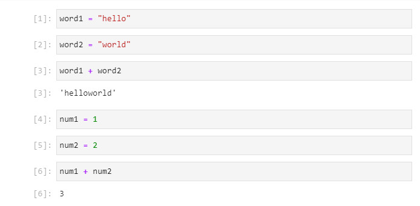

### Indexing

We have also discussed how we can index from a string using square brackets enclosing an integer value:

```
"hello"[1]
```

In the above example, the letter ```"e"``` is returned which is at index 1.


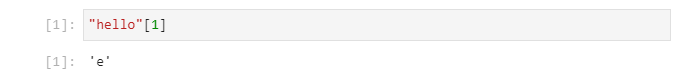


If you expected ```"h"```, recall that Python indexing uses zero order which is inclusive of ```0```:

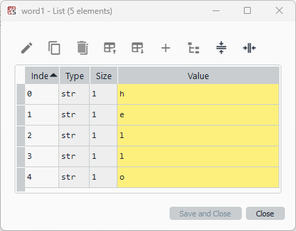

```
"hello"[0]
```

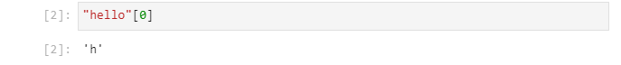

Python zero order indexing is exclusive of the upper bound, which is the length of the string. We go up to but don't include the upper bound:

```
"hello"[len("hello")]
```

```
"hello"[len("hello") - 1]
```

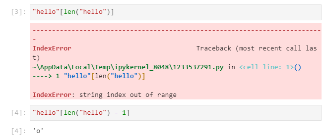

To recap, in Pythons zero order indexing, the first value is at index 0 and the last value is at the length of the string minus one:

```
"hello"[0]
```

```
"hello"[len("hello") - 1]
```

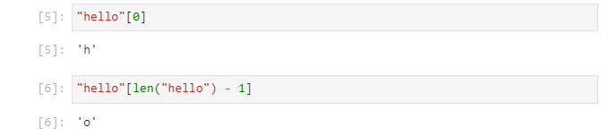

We can also index using negative index values. When using a negative index we can think of the string as being a rolled up object. 

For example instead of viewing the string ```"hello"``` as a line:

```
hello
```

We can view it as:

```

     h
o         e
          
   l   l
   
```

Which has the positive indexes:

```

     [0]
[4]       [1]
          
  [3]   [2]
   
```

In this rolled up view, we have only explored the clockwise motion from the initial value ```0```, we can also explore the anti-clockwise motion using negative indexes. The integer number before ```0``` is ```-1```:

```

      [0]
[-1]       [-4]
          
  [-2]   [-3]
   
```

The initial value ```0``` can also be expressed as a negative index, which is the negative value of the length of the string:

```

      [-5]
[-1]       [-4]
          
  [-2]   [-3]
   
```

So we can get the last value and the first value using the negative indexes:

```
"hello"[-1]
```

```
"hello"[-len("hello")]
```

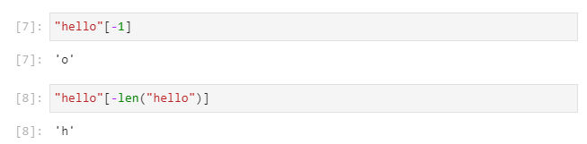

We can index using a slice. In full a slice uses the following notation:

```
"hello"[start:stop:step]
```

Because zero-order indexing is used, we are inclusive of the start bound and inclusive of the stop bound:

```
"hello"[1:3:1]
```

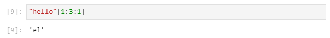

so this means we start at the letter at index 1 which is ```"e"``` and we go up in steps of one, taking us to index 2 which has the letter ```"l"```. We go up to the stop index 3 but we do not include it. Therefore this slice is ```"el"``` and not ```"ell"```.

Indexing has default values:

```
"hello"[start:stop:step]
```

The ```start``` has a default value that is ```0```, the ```stop``` has a default value that is the length of the string and the ```step``` has a default value of ```1```. Explicitly specifying these will return the complete string:

```
"hello"[0:len("hello"):1]
```

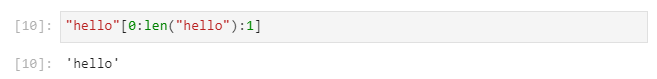

If we don't specify the step, a default value of 1 is selected, returning the whole string:

```
"hello"[0:len("hello"):]
```

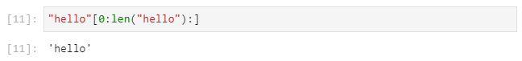

This also works if we don't supply the second colon:

```
"hello"[0:len("hello")]
```

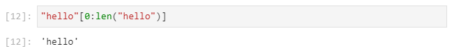

Examples using the default value of ```stop```:

```
"hello"[0:]
```

```
"hello"[1:]
```


Examples using the default value of ```start```:

```
"hello"[:len("hello")]
```

```
"hello"[:3]
```

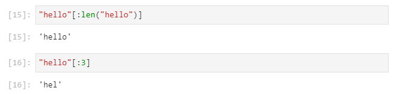

Examples using the default value of ```start```, ```stop``` and ```step```:

```
"hello"[:]
```

```
"hello"[::]
```

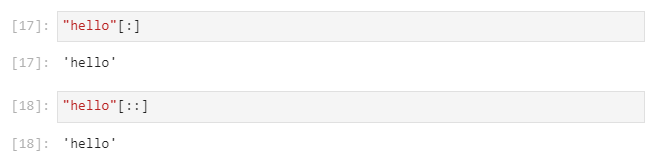

We can take every second value of the string using a ```step``` of ```2```:

```
"hello"[::2]
```

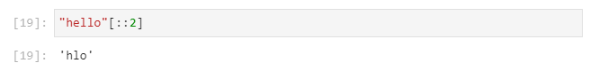

Since we ```start``` at ```0```, this selects all the even indexs. If we instead want all the odd indexes, we can start at ```1```:

```
"hello"[1::2]
```

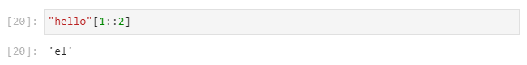

We can get the string in reverse by specifying a step size of ```-1```:

```
"hello"[::-1]
```

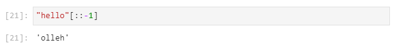

When using a step of ```-1```, the ```start``` takes on a default value of ```-1``` and the ```stop``` takes on a default values of - the length of the string minus 1:

```
"hello"[-1:-len("hello")-1:-1]
```

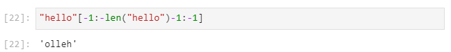

Care needs to be taken when using the negative index as we are still inclusive of the ```start``` bound and exclusive of the ```stop``` bound.

## The list collection

A list can be used to store a collection of fundamental datatypes. The list has the following features:

* It is enclosed in square brackets ```[ ]```.
* It uses the comma ```,``` as a delimiter between each element (fundamental datatype) in the list.

The list can be visualised as a shopping list of singular items:

```
shopping_list = ["apples", "bananas", "cheese"]
```
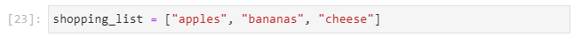

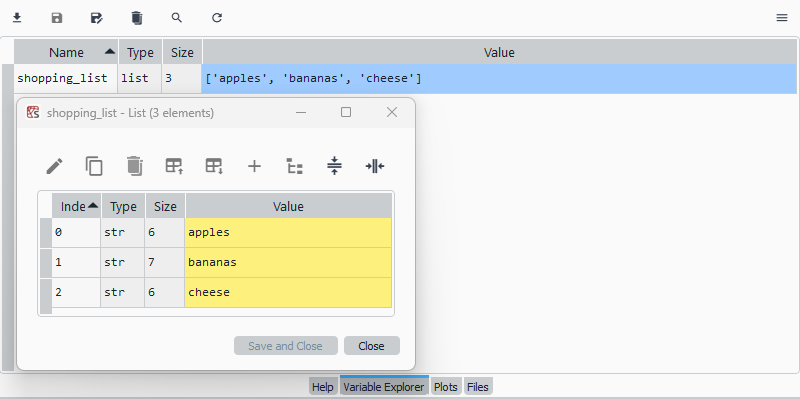

Note however that when integer numbers are used to muliply individual strings, that string replication occurs:

```
shopping_list = ["apples", 2*"bananas", "cheese"]
```

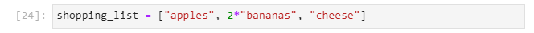

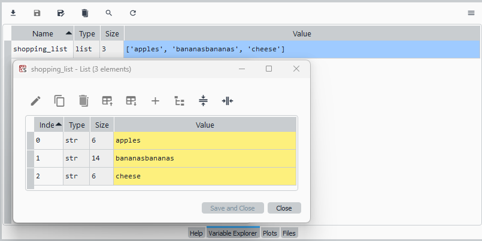

Duplicates can however manually be added to a list:

```
shopping_list = ["apples", "bananas", "bananas", "cheese"]
```

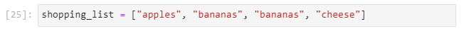

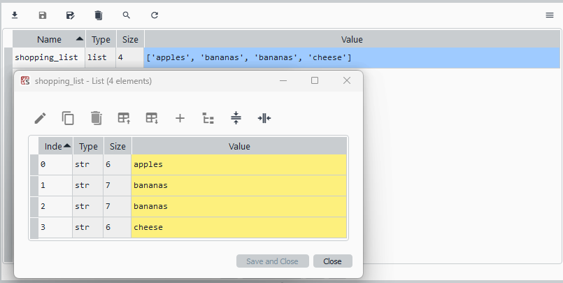

The list can include numbers:

```
numbers = [1, 2, 3]
```

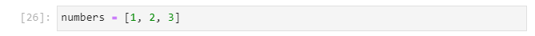

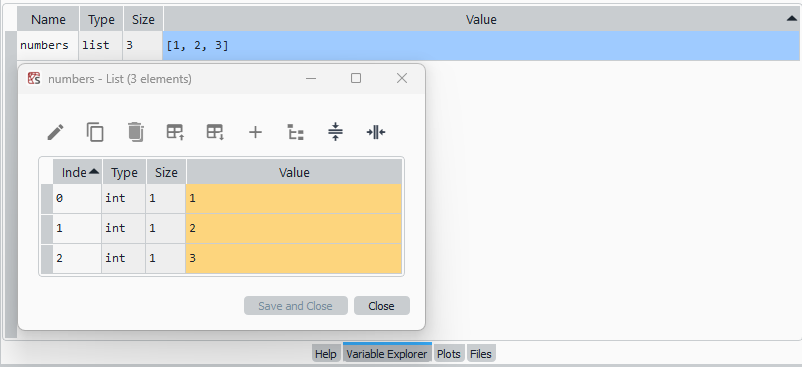

The list can also contain a mixture of fundamental datatypes:

```
items = [1, "apples", 3.14]
```

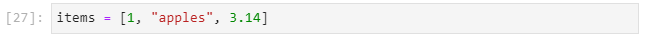

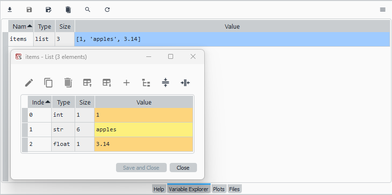

A list can also include other lists:

```
outer_list = [1, numbers, items]
```


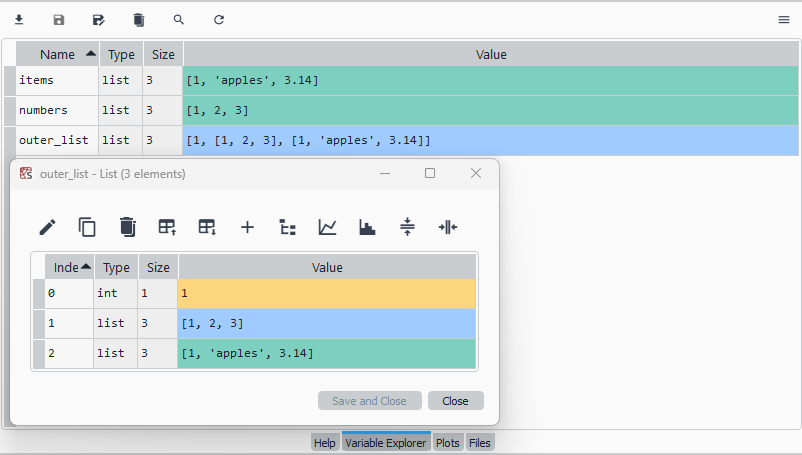

In the example above numbers and items are nested lists. This can be input directly using:

```
outer_list = [1, [1, 2, 3], [1, "apples", 3.14]]
```

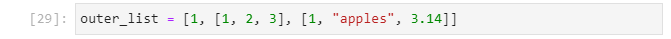

Care should be taken to ensure that the square brackets inner and outer brackets match up appropriately. When a bracket is selected the JupyterLab IDE will automatically highlight what it determines to be the corresponding bracket in green, if the bracket isn't matched it will be highlighted in red to indicate a syntax error:

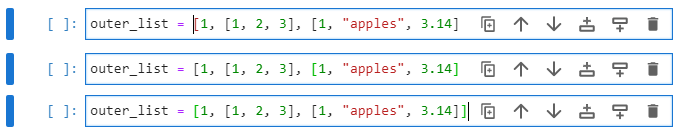

### list functions and mutability

If we type in the variable or object name of one of the lists followed by a ```.``` and press tab ```↹```, we will see a number of functions that we can call from the object:

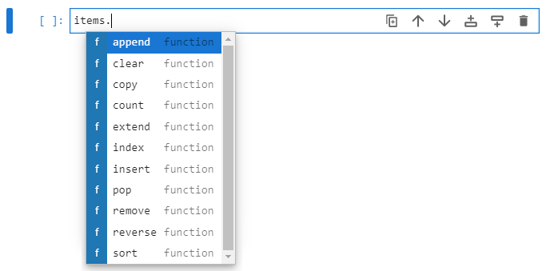

Most of these functions modify the original list, this in place modification is also known as mutation. Notice that cell 31 and cell 33 do not show an output. In cell 32 and cell 34, when we look at the original list, we see the list has been updated:

```
items.append([5, "bananas"])
items
items.extend([5, "bananas"])
items
```


We can see the subtle difference between the list functions ```append``` which appends a collection to a new upper index of the list and ```extend``` which extends the list by the items in the collection. For a single fundamental datatype such as an integer, float, boolean or string we should use ```append``` opposed to ```extend```:

```
items.append(1)
items
```

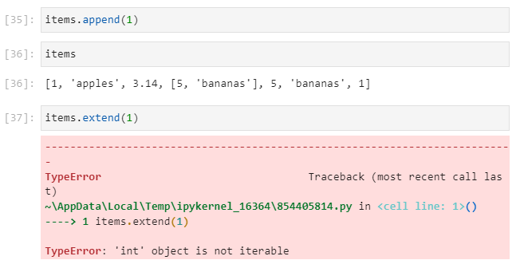

If we type in the function name with open parenthesis and press shift ```⇧``` and tab ```↹``` we can see the functions docstring and details about the input arguments. We see in the case of append, we are looking for an object whereas in the case of extend, we are looking for an iterable object i.e. a collection:

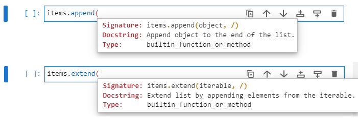

Recall that a string is a collection, if we use the string method extend with a string, we will iterate over the string and extend the list by placing each individual letter in the string as its own additional index:

```
items.extend("hello")
items
```

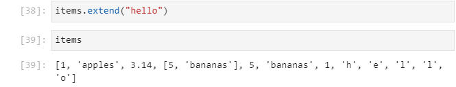

Care should be taken to understand how these functions operate regarding list mutability. These functions modify the list object in place and if we assign the output of the function to a new variable name, the new variable name will be the type ```NoneType``` object:

```
old_list = [1, 2, 3, 4]
new_list = old_list.append(5)
```

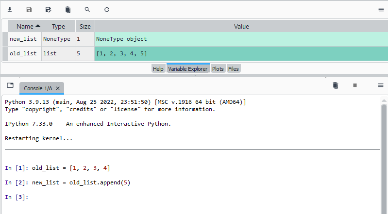

Reassignment will modify the list in place and then reassign the list to the output to ```NoneType``` object:

```
old_list = [1, 2, 3, 4]
old_list = old_list.append(5)
```

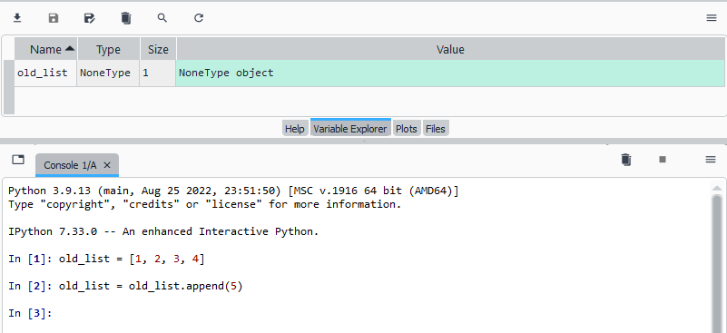

A list is a collection, like a string and the operator ```+``` can be used to concatenate two lists together. The operator ```*``` can also be used to with a list and int to replicate the list:

```
items1 = [1, "apples", 3.14]
items2 = [2, "bananas"]
items1 + items2
2 * items1
```

Note in cells 42 and 43 an output is shown. This is because the operators ```+``` and ```*``` defined by the functions ```__add__``` and ```__mul__``` each have a return value:

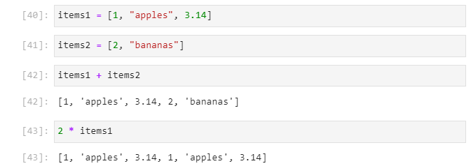

To understand how mutability works, we can create a custom append function, that uses a global list and mutates it:

```
items1 = [1, "apples", 3.14]

def append1(other_list):
    global items1
    items1 = items1 + other_list
```

If we call this function, supplying the positional input argument ```other_list```:

```
append1(["hello", "goodbye"])
```

We see that there is no return value shown because this function has no return statement but ```items1``` is mutated:

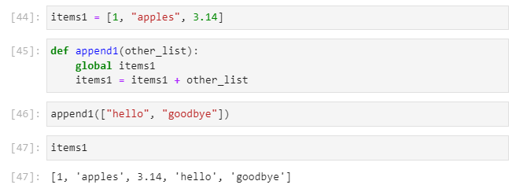

Now if we instead create a function without a global variable and instead use a return value:

```
items1 = [1, "apples", 3.14]

def append2(orig_list, other_list):
    return orig_list + other_list
```

If we call this function supplying the two input inputs ```orig_list``` and ```other_list```:

```
append2(items1, ["hello", "goodbye"])
```

We see a return value corresponding to the return value supplied when the function ```append2``` was defined and in this case the original list ```items1``` is unaltered:

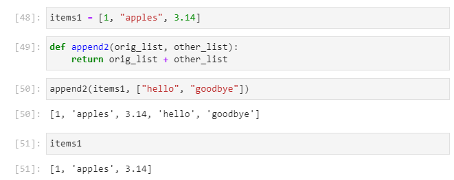

We will look at functions and code blocks in a later guide. However the main point to highlight here is the list functions that mutate the original list have no return function and therefore return NoneType when assigned or reassigned to a variable or object name. 

We have already seen the ```append``` and ```extend``` list function which mutate the list:


The list function ```index```, will return the index of a value, if the value exists in the list. In this case the value ```"apples"``` is at index ```1```:

```
items1 = [1, "apples", 3.14]
items1.index("apples")
```

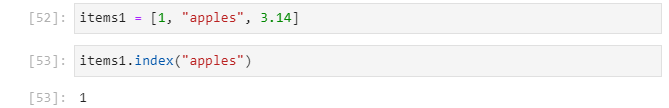

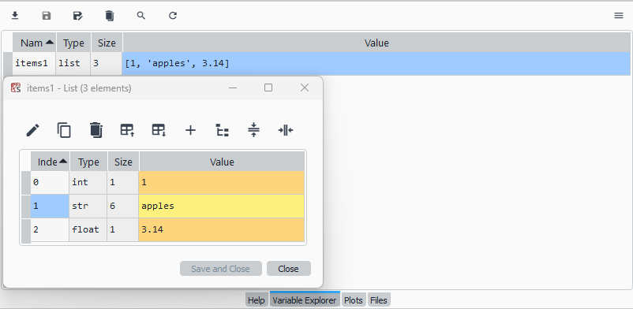

For duplicates only the  first occurance will be returned:

```
items1 = [1, "apples", 3.14, "apples"]
items1.index("apples")
```

An optional secondary input argument can be supplied to selecting a starting index value to begin the search from. If for example index 2 is selected, we will return the next occurance of ```"apples"``` at index 3:

```
items1.index("apples", 2)
```

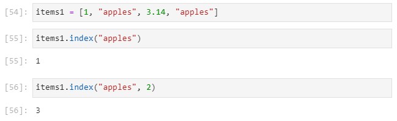

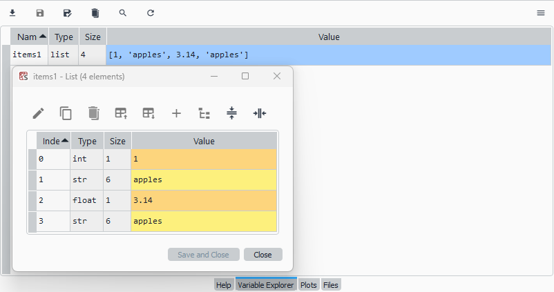

If we recreate the simple list:

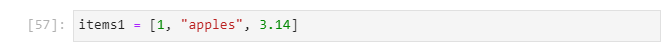

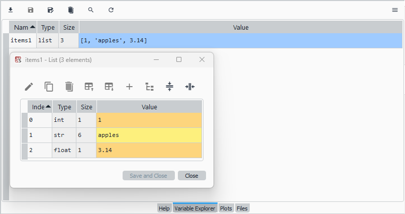

The ```insert``` function, can be used to select an index and insert a value at the index. Any values past the index of insertion will be shunted one up:

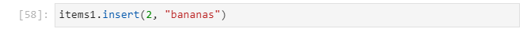

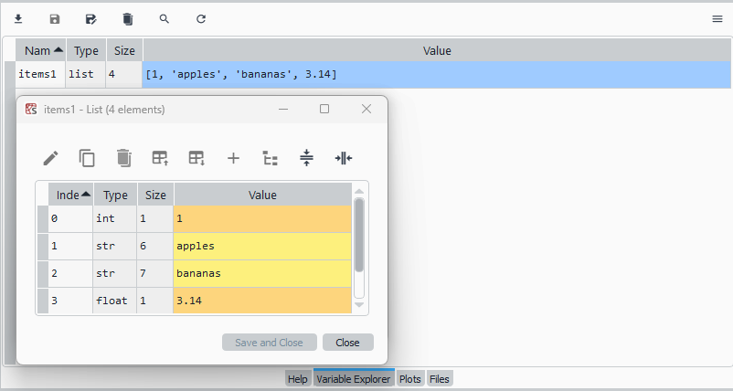

Note this function mutates the list and the function has no return statement.

The function ```remove``` will remove the first occurance of an item in a list:

pop

reverse

sort

count

copy (compare to an alias)

clear