# Collections

## Fundamental Datatypes

So far we have explored the following fundamental datatypes:

* text datatypes
    * str ("a", "hello world")
* numeric datatypes
    * int (0, 1, 2, 3, ...)
    * bool (False, True)
    * float (0.0, 0., 0.1, 3.14)

## The string collection

Previous tutorials discussed how a string can be regarded as both a fundamental datatype and also a collection of individual characters. In other words an individual character in Python is classified as a string. Some of the collection characteristics of a string can be explored:

### Concatenation

In the string collection the ```+``` operator performs concatenation of the two string collections and this differs for fundamental numeric datatypes where the ```+``` operator performs numeric addition:

```
word1 = "hello"
word2 = "world"
word1 + word2
```

```
num1 = 1
num2 = 2
num1 + num2
```


### Indexing

It is possible to index into a string using square brackets. The square brackets enclose the integer value to index:

```
"hello"[1]
```

In the above example, the letter ```"e"``` is returned which is at index 1.


Note ```"h"```, isn't at index 1 as Python indexing uses zero order which is inclusive of ```0```:


```
"hello"[0]
```


Python zero order indexing is exclusive of the upper bound, which is the length of the string. Python indexes up to but doesn't include the upper bound:

```
"hello"[len("hello")]
```

```
"hello"[len("hello") - 1]
```


To recap, in Pythons zero order indexing, the first value is at index 0 and the last value is at the length of the string minus one:

```
"hello"[0]
```

```
"hello"[len("hello") - 1]
```


Indexing can be carried out using negative integer values. When using a negative index, the string can be conceptualised as a rolled up object. 

For example instead of viewing the string ```"hello"``` as a line:

```
hello
```

It can be viewed as:

```

     h
o         e
          
   l   l
   
```

Which has the positive integer index values:

```

     [0]
[4]       [1]
          
  [3]   [2]
   
```

In this rolled up view, clockwise motion from the initial value ```0``` has been explored. Instead the anti-clockwise motion can be explored using negative indexes. The integer number before ```0``` is ```-1```:

```

      [0]
[-1]       [-4]
          
  [-2]   [-3]
   
```

The initial value ```0``` can also be expressed as a negative index, which is the negative value of the length of the string:

```

      [-5]
[-1]       [-4]
          
  [-2]   [-3]
   
```

The last value and the first value can be accessed using the negative integer index values:

```
"hello"[-1]
```

```
"hello"[-len("hello")]
```


Indexing can be carried out using a slice. The ```slice``` function can be used to create a slice object: 

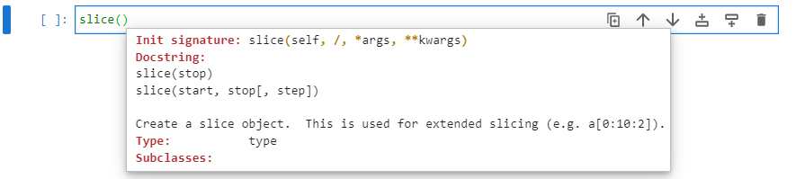

The slice function is similar to the ```range``` function. Both functions have a ```start```, ```stop``` and ```step``` value:

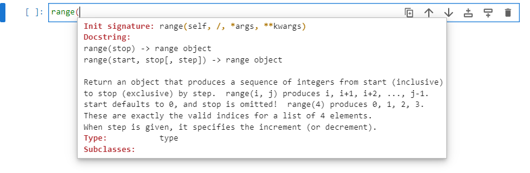

```
"hello"slice[(start, stop, step)]
```

For example a start value of 1, stop value of 1 and step value of 3 can be specified:

```
"hello"[slice(1, 3, 1)]
```

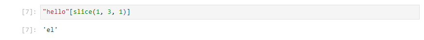

Slicing is however more commonly carried out with the following notation:

```
"hello"[start:stop:step]
```

Because zero-order indexing is used, the indexing is inclusive of the start bound and exclusive of the stop bound:

```
"hello"[1:3:1]
```


so this means the start is at the letter at index 1 which is ```"e"``` and steps of 1, are used until index 2 which has the letter ```"l"```. The indexing can be thought of as approaching the stop at index 3 but never reaching it. Therefore this slice is ```"el"``` and not ```"ell"```.

Indexing has default values:

```
"hello"[start:stop:step]
```

The ```start``` has a default value that is ```0```, the ```stop``` has a default value that is the length of the string and the ```step``` has a default value of ```1```. Explicitly specifying these will return the complete string:

```
"hello"[0:len("hello"):1]
```


If no step is specified, a default value of 1 is selected, returning the whole string:

```
"hello"[0:len("hello"):]
```


This also works if the second colon is not supplied:

```
"hello"[0:len("hello")]
"hello"[slice(0, len("hello")]
```


If the ```stop``` value is unspecified, it is assumed to be the length of the string:

```
"hello"[0:]
```

```
"hello"[1:]
```


If the ```start``` is not specified it is assumed to be 0:

```
"hello"[:len("hello")]
```

```
"hello"[:3]
```


An example using the default value of ```start```, ```stop``` and ```step```:

```
"hello"[:]
```

```
"hello"[::]
```


Every second value of the string can be selected using a ```step``` of ```2```:

```
"hello"[::2]
```


Since ```start``` is ```0``` this selects all the even indexes. To instead get all the odd indexes, start at ```1```:

```
"hello"[1::2]
```


A string can be obtained in reverse by specifying a step size of ```-1```:

```
"hello"[::-1]
```


When using a step of ```-1```, the ```start``` takes on a default value of ```-1``` and the ```stop``` takes on a default values of - the length of the string minus 1:

```
"hello"[-1:-len("hello")-1:-1]
```


Care needs to be taken when using the negative integer index values as Python is still using zero-order indexing, which is inclusive of the ```start``` bound and exclusive of the ```stop``` bound.

## The list collection

A list can be used to store a collection of fundamental datatypes. The list has the following features:

* It is enclosed in square brackets ```[ ]```.
* It uses the comma ```,``` as a delimiter between each element (fundamental datatype) in the list.

The list can be visualised as a shopping list of singular items:

```
shopping_list = ["apples", "bananas", "cheese"]
```


Note however that when integer numbers are used to muliply individual strings, that string replication occurs:

```
shopping_list = ["apples", 2*"bananas", "cheese"]
```


Duplicates can however manually be added to a list:

```
shopping_list = ["apples", "bananas", "bananas", "cheese"]
```


The list can include numbers:

```
numbers = [1, 2, 3]
```


The list can also contain a mixture of fundamental datatypes:

```
items = [1, "apples", 3.14]
```


A list can also include other lists:

```
outer_list = [1, numbers, items]
```


In the example above numbers and items are nested lists. This can be input directly using:

```
outer_list = [1, [1, 2, 3], [1, "apples", 3.14]]
```


Care should be taken to ensure that the square brackets inner and outer brackets match up appropriately. When a bracket is selected the JupyterLab IDE will automatically highlight what it determines to be the corresponding bracket in green, if the bracket isn't matched it will be highlighted in red to indicate a syntax error:


### list functions and mutability

If the variable (or object) name of one of the lists is input followed by a dot ```.``` and tab ```↹```, a number of functions that can be called from the object display:


Most of these functions modify the original list, this in place modification is also known as mutation. Notice that cell 31 and cell 33 do not show an output. In cell 34, the original list, has been updated:

```
items.append([5, "bananas"])
items
items.extend([5, "bananas"])
items
```


There is a subtle difference between the list functions ```append```, which appends a collection to a new upper index of the list and ```extend```, which extends the list by the items in the collection. For a single fundamental datatype such as an integer, float, boolean or string ```append``` should be used opposed to ```extend```:

```
items.append(1)
items
```


If the function name is input with open parenthesis and shift ```⇧``` and tab ```↹``` are pressed. The functions docstring and details about the functions input arguments display. In the case of ```append```, the input argument is an object whereas in the case of extend, the input argument is an iterable object i.e. a collection:


Recall that a string is a collection, if the string method extend is used with a string, it will iterate over the string and extend the list by placing each individual letter in the string as its own additional index:

```
items.extend("hello")
items
```


Care should be taken to understand how these functions operate regarding list mutability. These functions modify the list object in place and output of the function is assigned to a new variable name, the new variable name will be of the type ```NoneType``` object:

```
old_list = [1, 2, 3, 4]
new_list = old_list.append(5)
```


Reassignment will modify the list in place and then reassign the list to the output to ```NoneType``` object:

```
old_list = [1, 2, 3, 4]
old_list = old_list.append(5)
```


A list is a collection, like a string and the operator ```+``` can be used to concatenate two lists together. The operator ```*``` can also be used to with a list and int to replicate the list:

```
items1 = [1, "apples", 3.14]
items2 = [2, "bananas"]
items1 + items2
2 * items1
```

Note in cells 42 and 43 an output is shown. This is because the operators ```+``` and ```*``` defined by the functions ```__add__``` and ```__mul__``` each have a return value:


To understand how mutability works, a custom append function can be created, that uses a global list and mutates it:

```
items1 = [1, "apples", 3.14]

def append1(other_list):
    global items1
    items1 = items1 + other_list
```

If this function is called and supplied with the positional input argument ```other_list```:

```
append1(["hello", "goodbye"])
```

There is no return value shown because this function has no return statement but ```items1``` is mutated:


If instead another function without a global variable is created, that takes two lists as input arguments and returns the concatenated value:

```
items1 = [1, "apples", 3.14]

def append2(orig_list, other_list):
    return orig_list + other_list
```

If this function is called, supplying the two input lists ```orig_list``` and ```other_list```:

```
append2(items1, ["hello", "goodbye"])
```

A return value corresponding to the concatenated lists is supplied and in this case the original list ```items1``` is unaltered:


Custom functions and code blocks will be examined in more detail in a later guide. However the main point to highlight here is the list functions ```append``` and ```extend``` for example mutate the original list and have no return function. If they are sued and assigned or reassigned to a variable name, the variable name will have the value ```NoneType``` when assigned or reassigned to a variable or object name. Care should be made when using them. An IDE such as Spyder has a Variable Explorer which makes it easier to visualise the variables as these list methods are beign utilised.


The list function ```index```, will return the index of a value, if the value exists in the list. In this case the value ```"apples"``` is at index ```1```:

```
items1 = [1, "apples", 3.14]
items1.index("apples")
```


For duplicates only the  first occurance will be returned:

```
items1 = [1, "apples", 3.14, "apples"]
items1.index("apples")
```

An optional secondary input argument can be supplied to selecting a starting index value to begin the search from. If for example index 2 is selected,the next occurance of ```"apples"``` at index 3 will be returned:

```
items1.index("apples", 2)
```


If the simple list is recrated:

```
items1 = [1, "apples", 3.14]
```


The ```insert``` function, can be used to select an index and insert a value at the index. Any values past the index of insertion will have an index integer value shunted up by 1:

```
items1.insert(2, "bananas")
```


Note this function mutates the list and the function has no return statement.

Recreating the list:

```
items1 = [1, "apples", 3.14, "apples"]
```

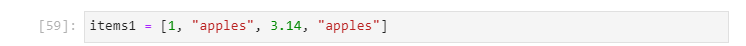

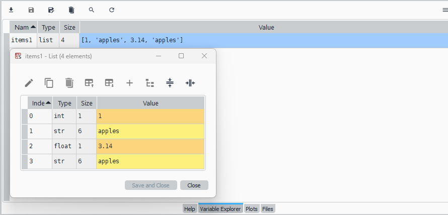


The function ```remove``` will remove the first occurance of an item in a list:

```
items1.remove("apples")
```

This function mutates the original list and an item higher than the index of the item being removed will have an index integer value shunted down by 1:

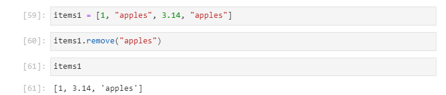

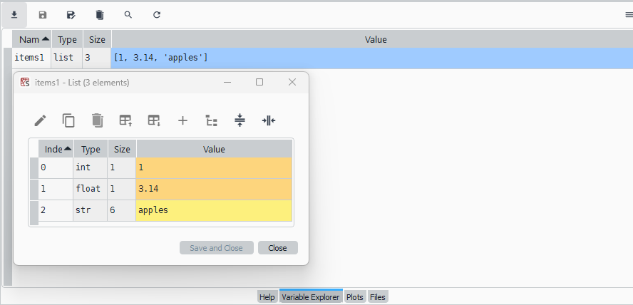

The function ```reverse``` will reverse the contents in the list and once again mutate the original list:

```
items1.reverse()
```

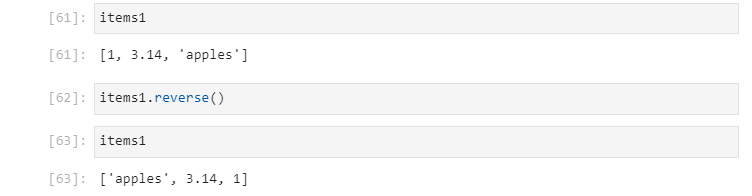

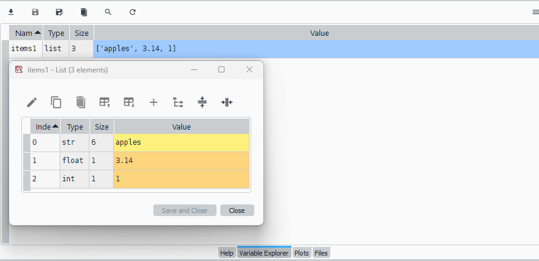

Recreating the list:

```
items1 = [1, "apples", 3.14, "apples"]
```


The function ```count``` will return the count of the number of occurances of a value in the list. 

```
items1.count(3.14)
items1.count("apples")
```

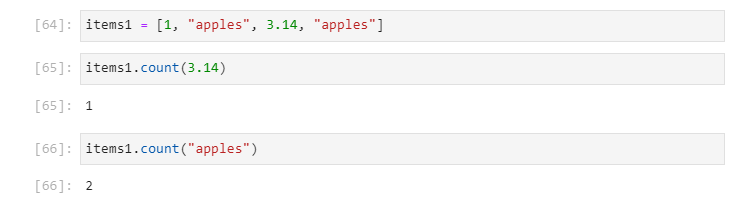

Note it will only count the occurances in the outer list and no occurances within nested collections. For example if a list is appended:

```
items1.append(["apples", "apples"])
```

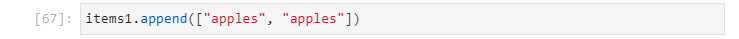

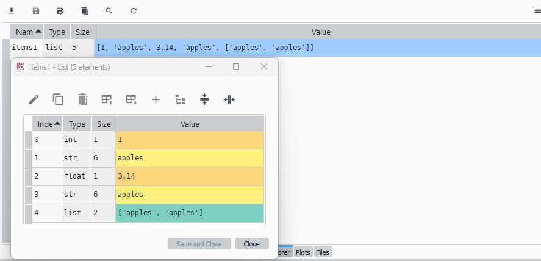

And then the function ```count``` is used on the outer list ```items1```:

```
items1.count("apples")
```

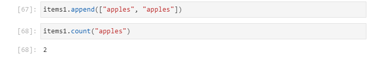

A return value of ```2``` displays and not ```4```. The last index with respect to the outer list has the value ```["apples", "apples"]``` which differs from the precise search term ```"apples"```. Likewise if a single value ```"pineapples"``` is appended:

```
items1.append("pineapples")
```

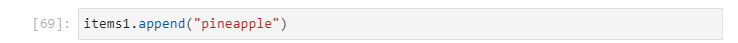

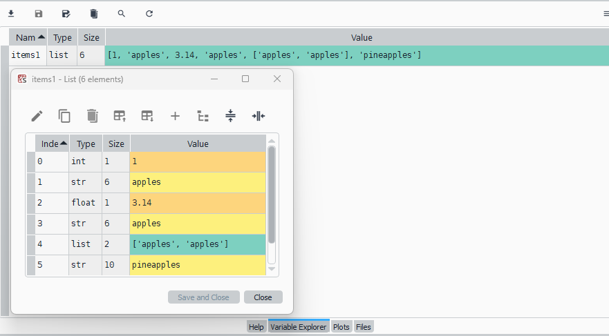

This precise search term ```"apples"``` is only counted twice. The search term ```"apples"``` differs from ```"pineapples"```:

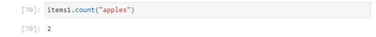

The ```clear``` function clears the list. This removes all the contents in the list. Once again this function mutates the original list, leaving an empty list:

```
items1.clear()
```

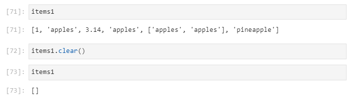

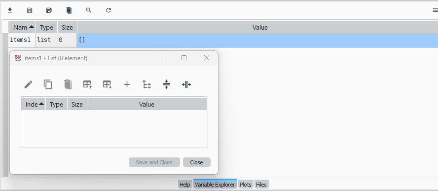

An empty list can be created using:

```
empty_list = []
```

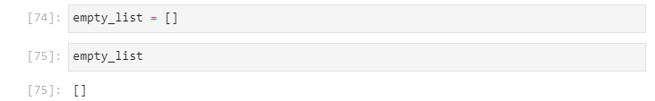

The function ```pop``` can be used to ```pop``` the last value off the list. This is one of the only functions that both mutates the original list and has a return value. i.e. the original list is updated with the last value removed (cell 78) and the return value is the value popped from the list (cell 77):

```
items1.pop()
```

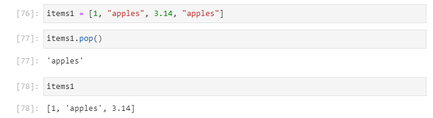

Therefore when using this function, the output can be assigned to a variable:

```
last_value = items1.pop()
```

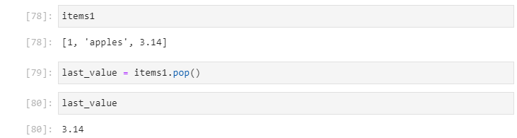

The function ```sort``` can be used to sort the values in a list, mutating the original list. This sorting only works if all the numbers in the list are numeric or alphabetical:

```
numbers = [1, 3, 2]
numbers.sort()
numbers
```

```
words = ["banana", "apples", "grapes"]
words.sort()
words
```

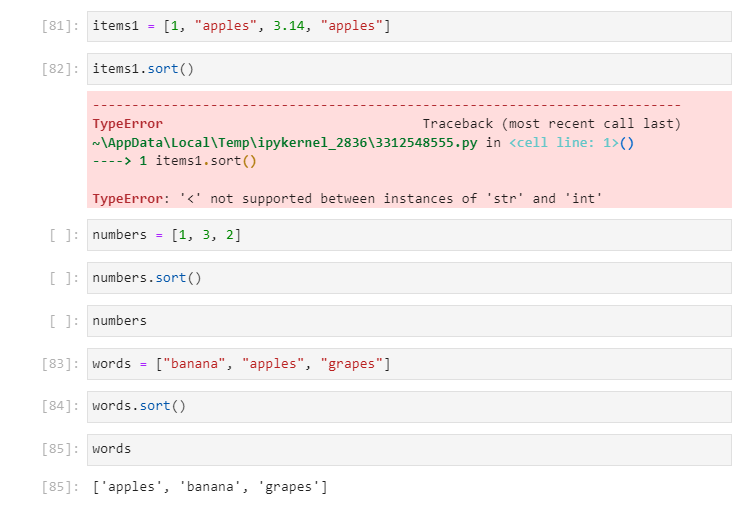

If the list ```words``` is assigned to a new object name ```fruits```:

```
fruits = words
```

Both the new list ```fruits``` is equal ```==``` to the list ```words``` meaning all the values in the list match but also that ```fruits``` ```is``` ```words``` meaning the two names are alias for the same list object in memory:

```
fruits == words
fruits is words
```

This means mutation of ```fruits```, will mutate ```words``` because ```words``` ```is``` ```fruits```:

```
fruits.append("oranges")
```

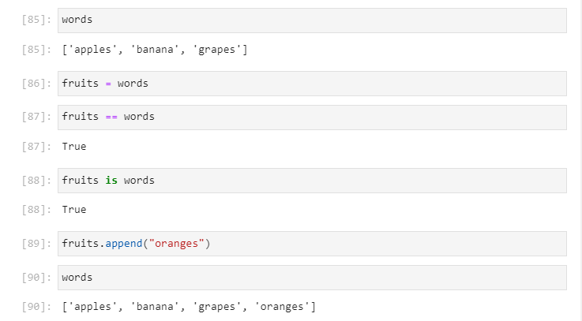

The list function ```copy``` returns a copy of the original list:

```
words = ["banana", "apples", "grapes"]
fruits = words.copy()
```

The new list ```fruits``` is equal ```==``` to the list ```words``` meaning all the values in the list match once again. However now ```fruits``` ```is not``` ```words``` meaning these are two different list objects in memory:

```
fruits == words
fruits is words
```

Mutating one list now leaves the other list unchanged, because they are different objects:

```
fruits.append("oranges")
```

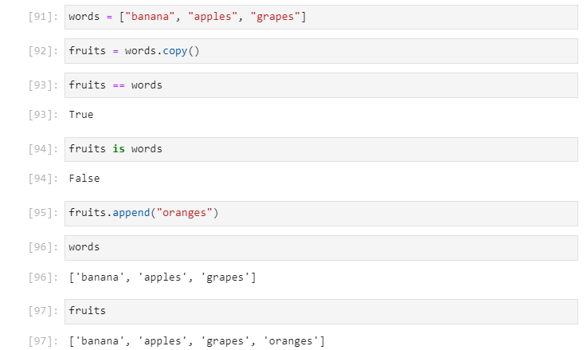

## The tuple collection

If the square brackets ```[ ]``` are replaced with ```( )``` another collection known as a ```tuple``` is created: 

```
words_l = ["banana", "apples", "grapes"]
words_t = ("banana", "apples", "grapes")
```

Both collections look very similar however a ```tuple``` once created cannot be mutated and this is why all the items in the tuple have a grey background in the Variable Explorer:


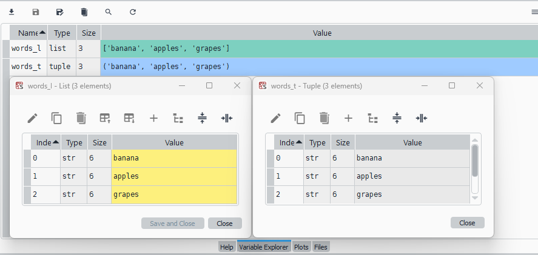

The difference can be more clearly seen when inputting the objects name followed by a dot ```.``` and press tab ```↹``` to view the number of functions available to call from the object:

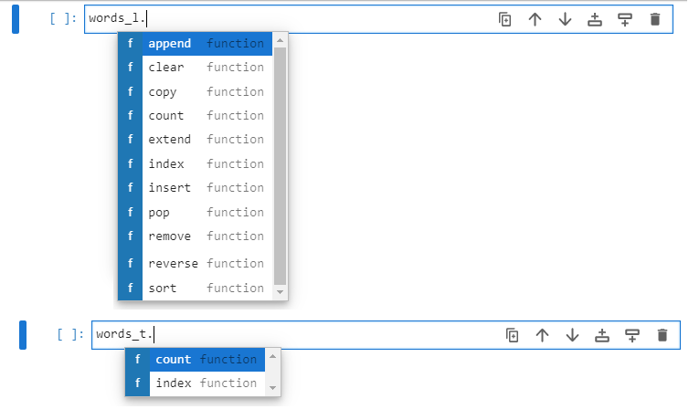

In the case of the ```tuple``` only the functions which return a value display and there are no equivalents to any of the list functions which mutate the list. 

A tuple can be indexed using ```[ ]``` brackets in the exact same manner as a list or a string:

```
words[0]
```

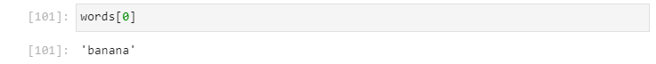

In Python the ```( )``` are also used for parenthesis, this means care needs to be taken when creating a tuple with a single element or an empty tuple:

```
not_a_tuple = ("hello")
a_tuple = ("hello",)
empty_tuple = tuple()
```

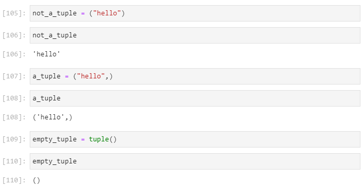

The classes ```tuple``` and ```list``` can be used to create an empty tuple or empty list. At present these classes can be conceptualised as conversion functions which will return a tuple from a list or vice versa:

```
fruits = ("banana", "apples", "grapes")
fruits_2 = list(fruits)
```

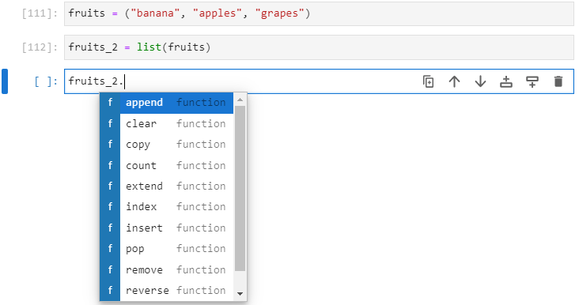

Once created a ```tuple``` cannot be modified, however the object name assigned to the tuple can be reassigned to a new value:

```
fruits = ("banana", "apples", "grapes")
fruits = list(fruits)
```

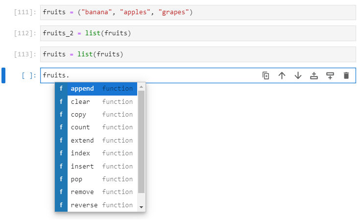

tuples at first glance may seem to be lists with limited capabilities however mutability isn't always a desired trait, for example when using constants, mutability can allow accidental change of the constant which could result in a problem in a longer program. tuples also use less memory than lists, and may be faster for large datasets that don't need mutated.

## The set collection

Another collection is a ```set```, which is a collection of unique items. Curly braces ```{ }``` are used to enclose a set:

```
items1 = {1, "apples", 3.14, "apples"}
```

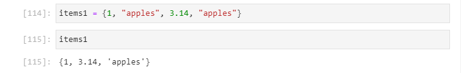

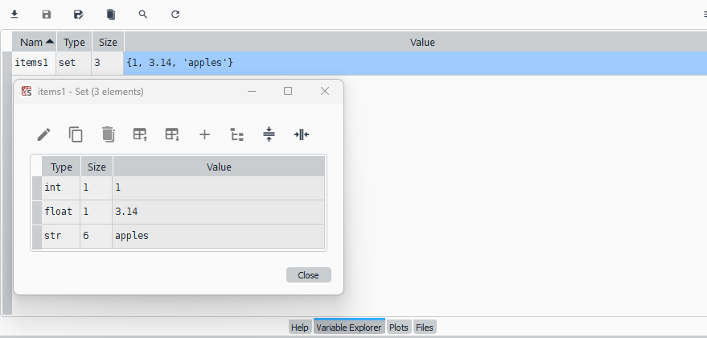

When the set was created above, ```"apples"``` was supplied at 1 and also 3. Note however that only one instance of ```"apples"``` displays. Notice also on the variable explorer, that there is no index in a ```set```. This is because the order is not maintained in a set, as only a single instance of a unique item is retained. A ```set``` is an unordered collection.

Input the set objects name followed by a dot ```.``` and press tab ```↹``` to view the number of functions that can be called from the set the object:

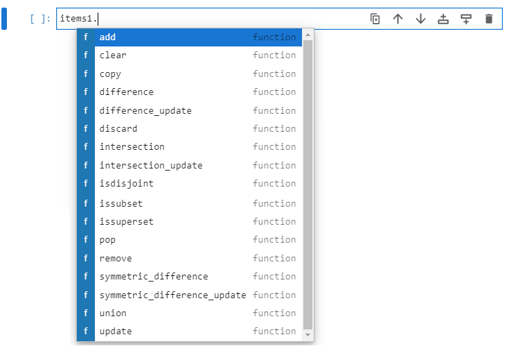

Some of these closely resemble the analogous function available for a list and mutate the set. The others relate to mathematical set operations such as looking at the difference and union of sets.

The ```set``` class can be used to convert a ```tuple``` or ```list``` to a ```set```. It can also be used to create an empty ```set```:

```
empty_set = set()
not_a_set = {}
```

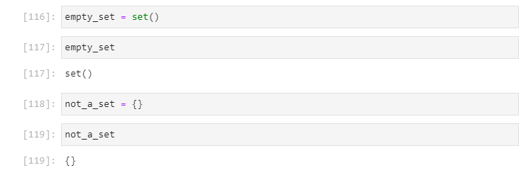

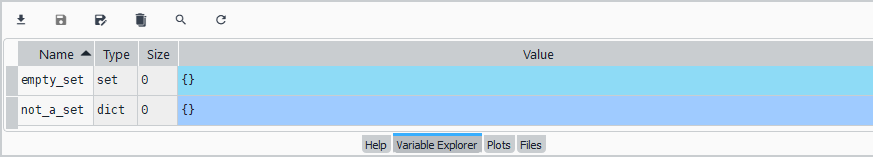

Note that empty braces ```{ }``` cannot be used to ceate a ```set``` as they are used for another collection which is far more commonly used known as a dictionary abbreviated ```dict```.

## The dictionary collection

A dictionary can be conceptualised as an English dictionary:

|word|meaning|
|:-:|:-:|
|drop|to let something you are carrying fall to the ground|
|a few|some, or a small number of|
|record|information that is written on paper or stored on computer so that it can be used in the future|
|record|a flat, round, plastic disc that music is stored on, used especially in the past|

Instead of a word and a meaning, the terms key and value are sued:

|key|value|
|:-:|:-:|
|drop|to let something you are carrying fall to the ground|
|a few|some, or a small number of|
|record|information that is written on paper or stored on computer so that it can be used in the future|
|record|a flat, round, plastic disc that music is stored on, used especially in the past|

The key is typically a string, although numeric keys are possible:

|key|value|
|:-:|:-:|
|"drop"|to let something you are carrying fall to the ground|
|"a few"|some, or a small number of|
|"record"|information that is written on paper or stored on computer so that it can be used in the future|
|"record"|a flat, round, plastic disc that music is stored on, used especially in the past|

Each key must be unique:

|key|value|
|:-:|:-:|
|"drop"|to let something you are carrying fall to the ground|
|"a few"|some, or a small number of|
|"record"|information that is written on paper or stored on computer so that it can be used in the future|

The value can be a fundamental datatype such as an integer, float, boolean value, complex number or string (collection of characters). It can also be another collection. Dictionaries are normally used when a key is easy to remember and a value is more difficult to remember. If a Word Processor is examined such as Microsoft Word, each Standard Color has a name which we can take as a key for example "green":

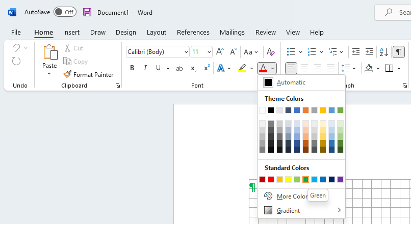

The value is either designated as a hex string of the format ```#rrggbb``` or as a list of three integers ```[r, g, b]```:

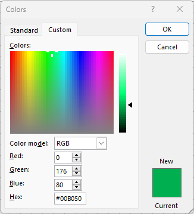

A dictionary of the standard colors using the values as hexadecimal values would look like:

|key|value|
|:-:|:-:|
|"wine"|"#C00000"|
|"red"|"#FF0000"|
|"orange"|"#FFC000"|
|"yellow"|"#FFFF00"|
|"light green"|"#92D050"|
|"green"|"#00B050"|
|"light blue"|"#00B0F0"|
|"blue"|"#0070C0"|
|"dark blue"|"#002060"|
|"purple"|"#7030A0"|

And using list of integer r, g, b values as:

|key|value|
|:-:|:-:|
|"wine"|[192, 0, 0]|
|"red"|[255, 0, 0]|
|"orange"|[255, 192, 0]|
|"yellow"|[255, 255, 0]|
|"light green|[146, 208, 80]|
|"green|[0, 176, 80]|
|"light blue"|[0, 176, 240]|
|"blue"|[0, 112, 192]|
|"dark blue"|[0, 32, 96]|
|"purple"|[112, 48, 160]|

For a dictionary the comma ```,``` is used as delimiter and the colon ```:``` is used to split a key:value pair. Braces ```{ }``` are used to enclose a dictionary:

```
colors = {"wine": "#C00000", "red": "#FF0000", "orange": "#FFC000", "yellow": "#FFFF00", "light green": "#92D050", "green": "#00B050", "light blue": "#00B0F0", "blue": "#0070C0", "dark blue": "#002060", "purple": "#7030A0"}

```

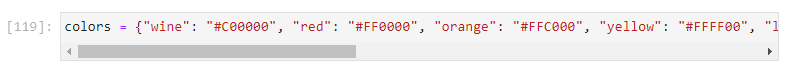

For readibility it is common to write each ```key:value``` pair on its own line:

```
colors = {"wine": "#C00000", 
          "red": "#FF0000", 
          "orange": "#FFC000", 
          "yellow": "#FFFF00", 
          "light green" : "#92D050", 
          "green": "#00B050", 
          "light blue": "#00B0F0",
          "blue": "#0070C0", 
          "dark blue": "#002060", 
          "purple": "#7030A0"}
```

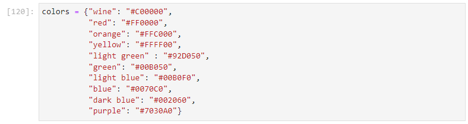

Notice in the variable explorer that the ```key``` in the dictionary is there opposed to a numeric ```index``` like seen in a list. Typically the keys are displayed in alphabetical order for convenience:

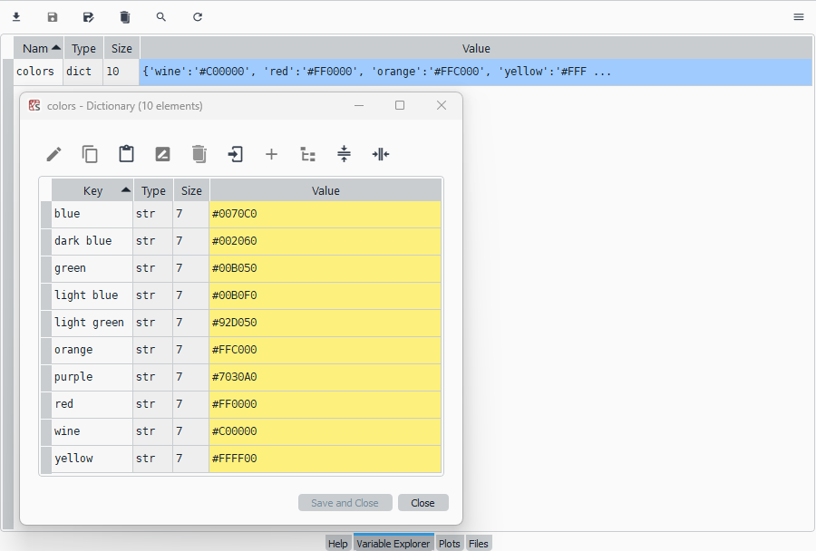

The value can be obtained by indexing with square brackets, using the key (usually in the form of a string):

```
colors["wine"]
```

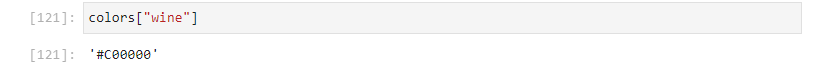

Inputting the dictionary object name followed by a dot ```.``` and pressing tab ```↹``` will display the functions available to call from the dictionary object:

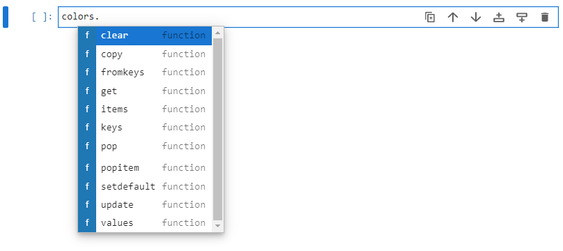

The functions keys, values and items return a list like collection of keys, values and in the case of items a tuple of ```(key, value)``` for each ```key: value``` pair. These three functons are useful when it comes to iterating along a dictionary. Iteration will be discussed in more detail in the next tutorial:

```
colors.keys()
colors.values()
colors.items()
```

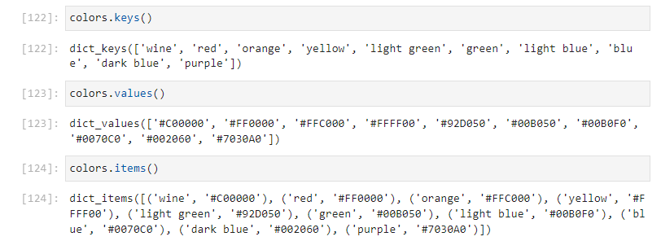

Most of the other functions are similar to their counterparts in a list, with slight differences due to the dictionary having a ```key: value``` pair opposed to just a ```value```.

The color dictionary can be recreated using a ```[r, g, b]``` list or ```(r, g, b)``` tuple for each color: 

```
colors = {"wine": [192, 0, 0], 
          "red": [255, 0, 0], 
          "orange": [255, 192, 0], 
          "yellow": [255, 255, 0], 
          "light green" : [146, 208, 80], 
          "green": [0, 176, 80], 
          "light blue": [0, 176, 240],
          "blue": [0, 112, 192], 
          "dark blue": [0, 32, 96], 
          "purple": [112, 48, 160]}
```

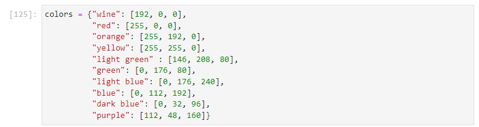
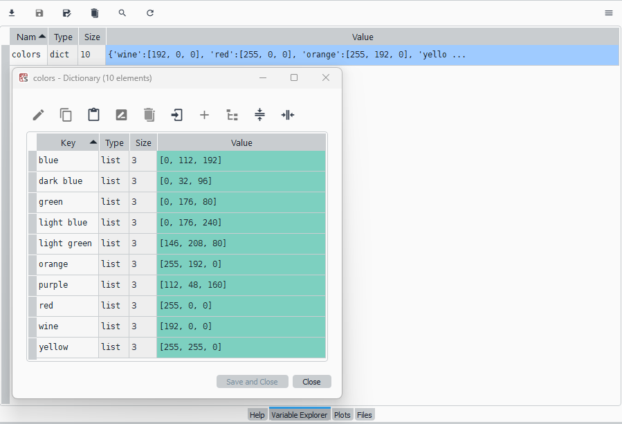

Dictionaries do not have numeric indexes. However index is carried out using square brackets which enclose the key. The key is normally a string, for example in this case ```"purple"```:

```
colors["purple"]

```

And specifically the ```g``` value of purple can be obtained by indexing into the output list at index 1:

```
colors["purple"][1]
```

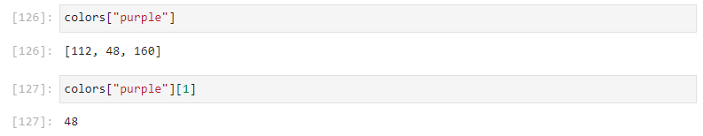

It is possible to create a dictionary by zipping together two list like collections using the ```zip``` function:

```
color_keys = ["wine", "red", "orange", "yellow", "light green", 
              "green", "light blue", "blue", "dark blue", "purple"]

color_values = ["#C00000", "#FF0000", "#FFC000", "#FFFF00", "#92D050", 
                "#00B050", "#00B0F0", "#0070C0", "#002060", "#7030A0"]

colors = dict(zip(color_keys, color_values))
```

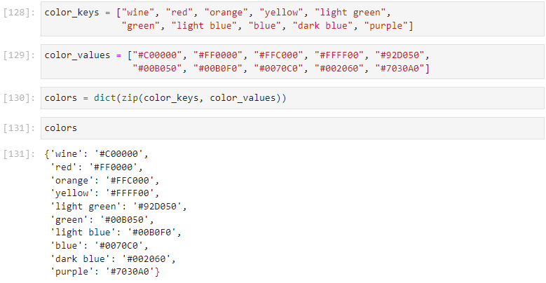

Return to:
[Home](../../../)
