# Collections

## Fundamental Data Types Recap

In the previous two tutorials, three fundamental text data types were examined:

* The Immutable Unicode String (```str```)
* The Immutable Byte String (```bytes```)
* The Mutable Byte Array (```bytearray```)

And six fundamental numeric data types were examined:

* The Immutable Integer Whole Number (```int```)
* The Boolean ```True``` or ```False``` (```bool```)
* The Immutable Floating Point Number, Displayed in Decimal but Encoded in Binary (```float```)
* The Immutable Complex Number with a Real and Imaginary components (```complex```)
* The Immutable Decimal Number, Displayed in Decimal and Encoded in Decimal (```Decimal```)
* The Immutable Fraction (```Fraction```)

The text data types are collections, where the base unit of the ```str``` class is a character and the base unit of the ```byte``` and ```bytearray``` classes is a single byte. In these collections the ```+``` operator which uses the data model identifier ```__add__``` is configured for concantenation. 

In contrast, the numeric data types are individual numeric values and the ```+``` operator which uses the data model identifier ```__add__``` is configured for addition. The other numeric operators are setup for other numeric operations.

The ```str``` and ```byte``` classes were seen to be immutable. This means that once they were created, they cannot be modified. All identifiers returned a new value. With these immutable collections a value can be read from an index but a new value cannot be assigned to an index. 

The ```bytearray``` in contrast was seem to be mutable and had supplementary methods which had no return value but directly mutated the ```bytearray``` instance. In an immutable collection a value can be read from an index and a new value can be assigned to an index. 

The numeric data types were seen to be immutable.

These concepts will be explored with other inbuilt Python collections.

## The tuple Class

A tuple is an ordered finite immutable collection of references to Python objects. Think of the ```tuple``` as an ordered numeric *archive* and each reference to a Python object in the archive as a *record*.

There are similarities between a Unicode string ```str``` and a ```tuple```. Both are immutable collections, in the case of a ```str```, the individual unit is a Unicode character. In the case of a ```tuple```, each unit is a reference to a Python object.

### The Initialization Signature

Inputting ```tuple()``` followed by shift ```⇧``` and tab ```↹``` will display the docstring of the init signature. It has a single input argument which is an iterable:


More conventionally the ```tuple``` uses parenthesis ```( )``` to enclose the collection and a comma ```,``` as a delimiter to seperate each individual items. A number of Python objects can be assigned:

```
record0 = 1
record1 = True
record2 = 3.14
record3 = 'hello'
record4 = 'hello'
record5 = 'goodbye'
```


A ```tuple``` of records can be created:

```
archive = (record0, record1, record2, record3, record4, record5)
archive
```


Each record can also be placed on a seperate line which can make it eaiser to visualise longer entries:

```
archive = (record0, 
           record1, 
           record2, 
           record3, 
           record4, 
           record5)
archive
```


Python objects do not require previous assignment to an individual object name. In the example below, the only record or reference to these objects is within the ```tuple``` ```archive```:

```
archive = (1, True, 3.14, 'hello', 'hello', 'bye')
archive
```


In the previous tutorials the parenthesis ```()``` were seen to be used in Python to call a function and enclose any input arguments and for order of precedence in numeric operations (PEDMAS). 

Therefore to create an archive with a single item, a ```,``` delimiter must be placed after the single item:

```
pedmas = (1 + 2)
pedmas
single_archive = (1 + 2,)
single_archive
```


To create an empty archive, the ```tuple``` class is used:

```
empty_archive = tuple()
empty_archive
```


Returning to:

```
archive = (1, True, 3.14, 'hello', 'hello', 'bye')
```

The JupyterLab Variable Inspector can be opened from the right click context menu:


Sadly this Variable Inspector is limited:


The Variable Explorer in the Spyder IDE is interactive and gives lots more information. Note the name, size and type on the Variable Explorer:


Double clicking the value on the Variable Explorer, opens it in its own window:


Note the numeric index starting at zero. For each index, there is a record which points to a value, this value also has a type and size. All the fields are highlighted in grey, because they cannot be editted in the immutable tuple.

### Identifiers

Returning to:

```
archive = (1, True, 3.14, 'hello', 'hello', 'bye')
```


If the instance name ```archive``` is input followed by a dot ```.``` and then tab ```↹``` a list of identifiers displays:

For the ```tuple``` collection only ```index``` and ```count``` display. These have been seen on the ```str```, ```byte``` and ```bytearray``` class and behave similarly.


If ```archive.index()``` followed by shift ```⇧``` and tab ```↹``` is input, the docstring of the method will display:


For example, the index of the value ```3.14``` can be determined:

```
archive.index(3.14)
```


The index of the first occurance of the value ```1``` can be determined:

```
archive.index(1)
```


The index of the second occurance of the value ```1``` can be determined by restricting the search for the value between index 1 (inclusive) to index 6 (exclusive):


```
archive.index(1, 1, 6)
```


If the starting limit is restricted further, so that the reference to the value is not in the specified index range an ```IndexError``` displays:


```
archive.index(1, 2, 6)
```


If ```archive.count()``` followed by shift ```⇧``` and tab ```↹``` is input, the docstring of the method will display:


The count of ```3.14``` can be determined using:

```
archive.count(3.14)
```


The count of ```1``` can be determined using:

```
archive.count(1)
```


### Data Model Identifiers

Returning to:

```
archive = (1, True, 3.14, 'hello', 'hello', 'bye')
```


The directory function ```dir``` can be used to look at the data model identifiers available. The ```pprint``` function from the ```pprint``` module can be imported and used to display the as compact:

```
from pprint import pprint
pprint(dir(archive), compact=True)
```


The ```__init__``` data model method is called when instantiating a ```tuple```:


When the new Python object is created, the ```__new__``` data model method is called. This creates the new instance which is given the label or object name ```archive``` and then the initialization signature ```__init__``` is called to initialize the instance a record at each index of the tuple.

The ```type``` class uses the data model identifier ```__class__``` to determine the class an instance belongs to:

```
type(archive)
```


The ```__getitem__```, ```__class_getitem__```, ```__len__```, ```__contains__``` and ```__iter__``` are data model identifiers are associated with immutable ordered collections.

Indexing using square brackets uses the data model method ```__getitem__``` and there is an associated class method ```__class_getitem__```. Indexing with the numeric index ```0``` will look up the associated record at this index, recalling a record is a reference to a Python object and return the Python object:

```
archive[0]
```


Slicing can also be carried out using square brackets. Recall, zero-order indexing is used, which is inclusive of the lower bound and exclusive of the upper bound (goes up to but excludes the upper bound):

```
archive[1:4]
```


The ```len``` function uses the data model identifier ```__len__``` to determine how many records are stored within the ```archive```.

```
len(archive)
```


The ```in``` keyword uses the data model identifier ```__contains__``` to see if a record is in the archive:

```
record2 in archive
```


The ```iter``` function and ```reversed``` function use the ```__iter__``` data model method to instantiate a forward or reverse iterator from the iterable ```tuple```:

```
forward_archive = iter(archive)
forward_archive
```


Recall that an iterator only displays a single element at a time. The ```next``` function moves onto the next element and any previous element is considered consumed:

```
next(forward_archive)
next(forward_archive)
next(forward_archive)
```


The first next gives the iterator, the value at index 0:


The second next gives the iterator, the value at index 1 and the previous value is discarded:


The second next gives the iterator, the value at index 2 and the previous value is discarded:


Use of ```tuple``` on the ```forward_archive``` consumes the remaining records:

```
tuple(forward_archive)
```


Alternatively:

```
backwards_archive = reversed(archive)
next(backwards_archive)
next(backwards_archive)
tuple(backwards_archive)
```


The ```hash``` function uses the data model identifier ```__hash__```:

```
hash(archive)
```

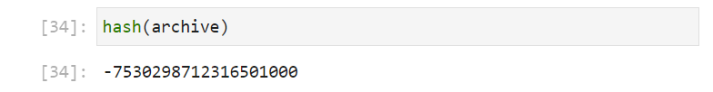

Note ```hash``` only works when every record in the tuple is itself immutable. If a mutable ```bytearray``` instance is added to the ```tuple```, a ```TypeError```: unhashable type displays:

```
hash(('red', 'green', 'blue', bytearray('black', encoding='ASCII')))
```

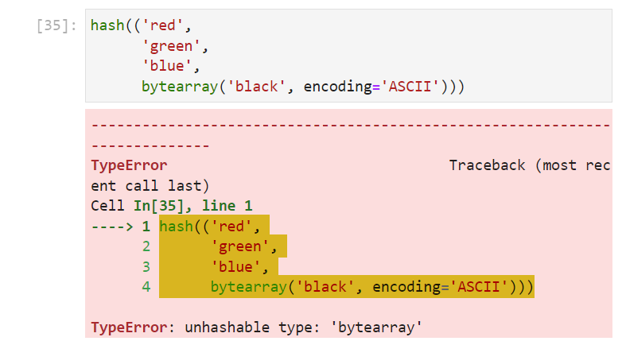

Because a ```tuple``` containing only immutable items is itself hashable, it can be used as a key in a mapping such as the dictionary. For example:

```
colors = {(1, 0, 0): 'red', 
          (0, 1, 0): 'green',
          (0, 0, 1): 'blue'}

colors[(1, 0, 0)]
```


``` 
colors = {('red', 'green', 'blue'): ((1, 0, 0), (0, 1, 0), (0, 0, 1))}

colors[('red', 'green', 'blue')]
```

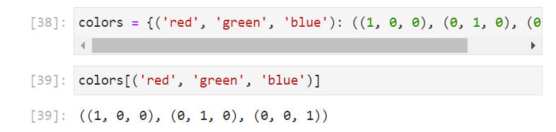

The ```?``` uses the data model identifiers ```__class__``` to identify the class and ```__doc__``` to generate information about the ```tuple``` instance:

```
? archive
```

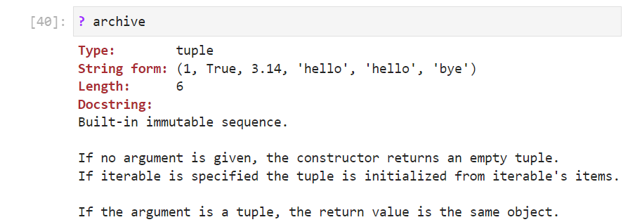

The formal and informal string representation of a ```tuple``` are given by the ```repr``` function and ```str``` class which use the ```__repr__``` and ```__str__``` data model identifiers respectively:

```
repr(archive)
str(archive)
```

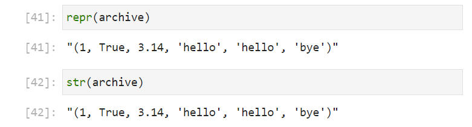

For a ```tuple``` these are the same even if the tuple contains string records that have escape characters. For example:

```
file = (r'C:\Users\Philip\Documents', 
        'script0.py')
str(file)
repr(file)
```

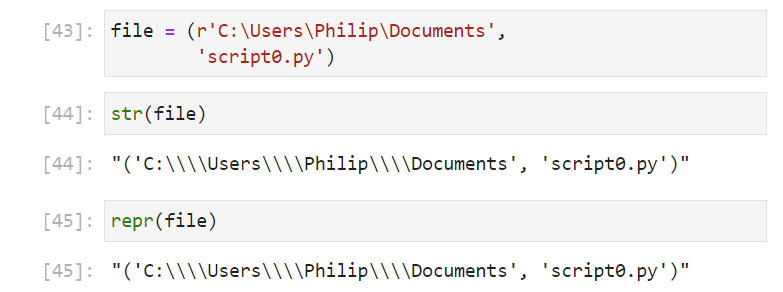

This can be contrasted to the equivalent string data model methods which show a clear difference:

```
str(file[0])
repr(file[0])
```

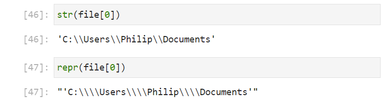

The ```__format__``` data model method is used by formatted strings when formatting a ```tuple```. There are no ```tuple``` specific format specifications:

```
f'The tuple is {archive}'
```

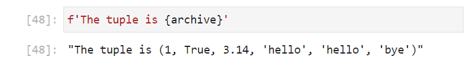

The memory size of a ```tuple``` in bytes can be measured using the function ```sys.getsizeof``` which uses the data model identifier ```__sizeof__```:

```
import sys
sys.getsizeof(archive)
```

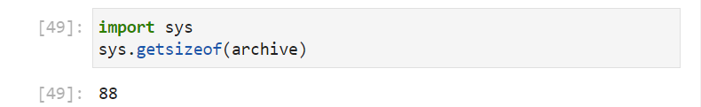

The ```__getattribute__```, ```__setattr__``` and ```__delattr__``` identifiers are used to get, set and delete attributes. A ```tuple``` has no attributes so these are not used by the end user.

The ```+``` operator is setup to perform concatenation using the data model identifier ```__add__```:

```
archive1 = ('hello', 1, True)
archive2 = ('bye', 2, False, 3.14)
archive1 + archive2
```

```
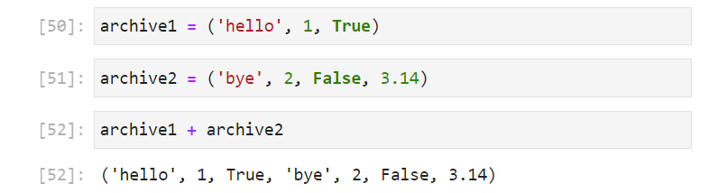
```

The ```*``` operator is setup to perform record replication with an integer. The ```*``` operator uses the data model identifier ```__mul__``` or the reverse data model idenfier ```__rmul__``` depending on whether the tuple is to the left hand side or right hand side of the ```*``` operator:

```
archive
archive * 3
3 * archive
```

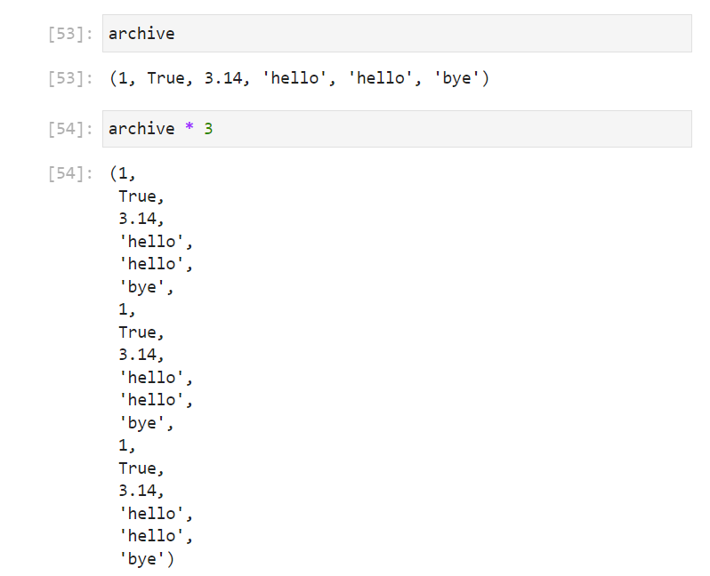

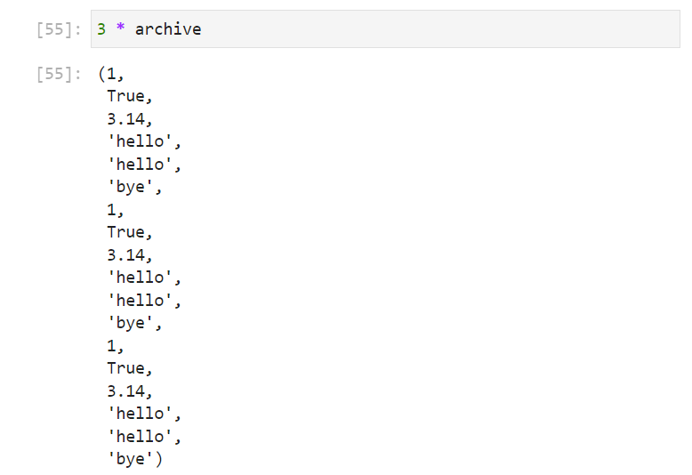

The six equality operators ```==```, ```!=```, ```<```, ```<=```, ```>```, ```>=``` can be used with a ```tuple```. These use the data model identifiers ```__eq__```, ```__ne__```, ```__lt__``` and ```__le__```, ```__gt__``` and ```__ge__``` respectively. These operators operate along the index of each ```tuple``` archive comparing the records:

```
('red', 'green', 'blue') == ('red', 'green', 'yellow')
```

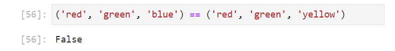

Conceptualise the above as:

```
('red' == 'red') #equal→check next records
('green' == 'green') #equal→check next records
('blue' == 'yellow') #different→not equal
```

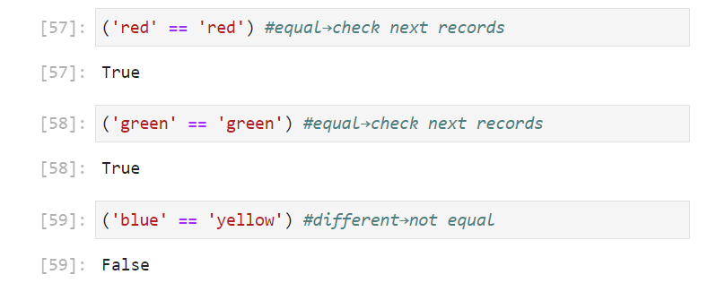

The records at each correspond index are compared one by one. The following comparison is made at index 0 and index 1. There is a difference at index 1 and the right hand tuple is determined to be greater:

```
('red', 'green', 'blue') > ('red', 'yellow')
```

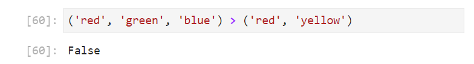

The following comparison is made at index 0 and index 1. The records for both archives at these indexes are the same. The left archive has an additional record and is determined to be greater:

```
('red', 'green', 'blue') > ('red', 'green')
```

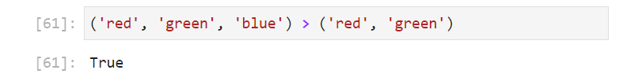

Comparisons can be made with numeric tuples:

```
(1, 5, 9) > (1, 7)
```

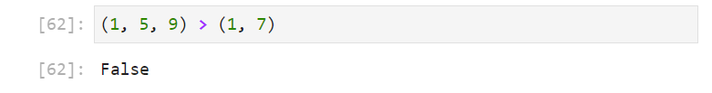

However care needs to be made when a tuple archive contains records of mixed datatypes:

```
(1, 'hello', 2) > (1, 'hello', 3)
```

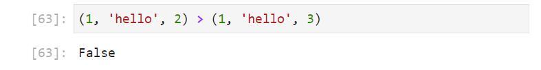

Comparisons are normally made between tuples that have a similar form.

```
student1 = ('James', 'Smith', 31, 'M')
student2 = ('Lucie', 'Brown', 32, 'F')
student1 > student2
```

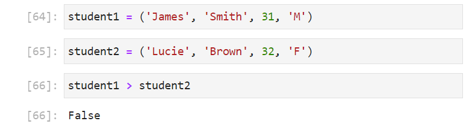

The ```namedtuple``` in the ```collections``` module reinforces this use case. In the ```namedtuple```, each numeric index has a corresponding field name. The field names for the above examples could be ```forename```, ```sirname```, ```age``` and ```sex```.

If records that are being compared are of different data types, there will be a ```TypeError```, similar to the same comparison made outwith a ```tuple```:

```
(1, 'hello', 2) > (1, 'hello', 'three')
```

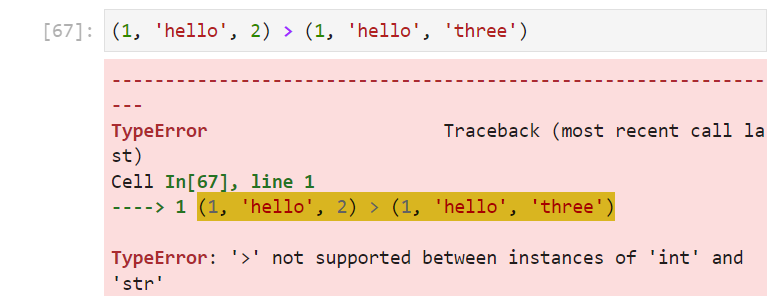

The data model identifiers ```__getstate__```, ```__reduce__```, ```__reduce_ex__``` and ```__getnewargs__``` are used by the pickle module to serialize the ```tuple```. The ```__init_subclass__``` is used for subclassing.

### tuple Unpacking

Supposing the two immutable numeric variables are created:

```
x = 1
y = 2
```

To swap the values of these variables, a temporary variable can be introduced:

```
xold = x
```

Then ```x``` can be assigned the value of ```y```:

```
x = y
```

And ```y``` can be assigned the value of ```xold```:

```
y = xold
```

Finally ```xold``` can be deleted:

```
del xold
```

And the changes are made:

```
x
y
```

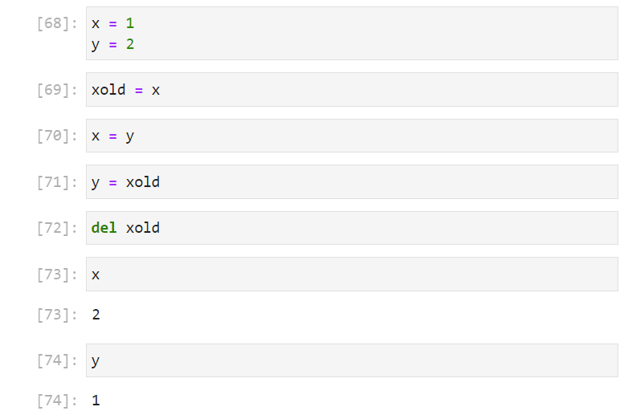

Switching variables can also be carried out using ```tuple``` unpacking. The original values can be checked:

```
x
y
```

And ```tuple``` unpacking can be explicitly used:

```
(x, y) = (y, x)
```

Then the changes can be checked:

```
x
y
```

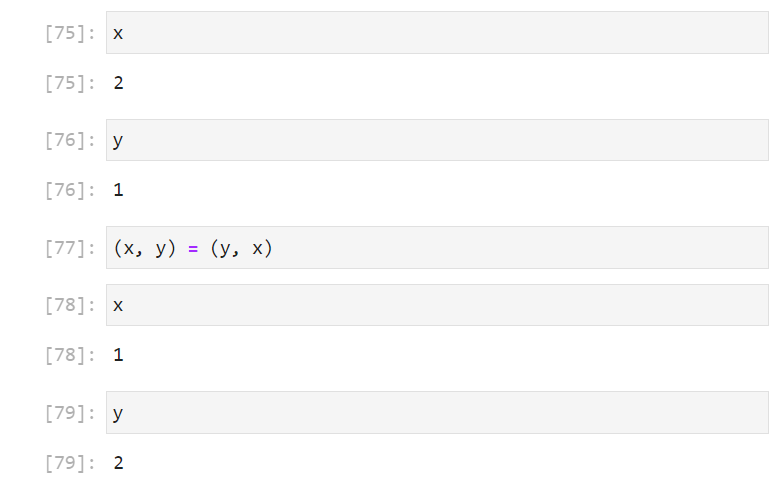

```tuple``` unpacking is normally implicitly carried out. Notice that the tuples on the left hand side and right hand side are not enclosed in parenthesis:

```
x
y
x, y = y, x
x
y
```

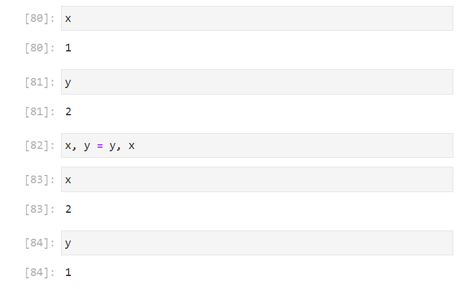

The Python interpretter recognises ```x, y``` as the ```tuple``` ```(x, y)```:

```
x
y
x, y
```

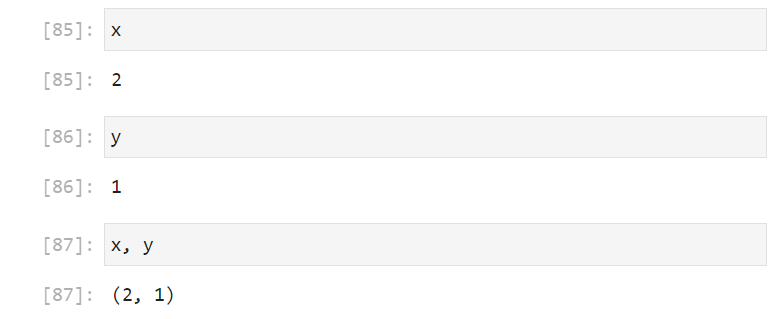

```tuple``` unpacking is normally carried out in conjunction with functions. A simple function with no input arguments that explicitly returns a tuple of two values can be defined:

```
def fun():
   return ('a', 'b')
```

Then called using:

```
fun()
```

To assign the returned values to variables, ```tuple``` unpacking can be explictly used:

```
(x, y) = fun()
```

These values can be checked:

```
x
y
```

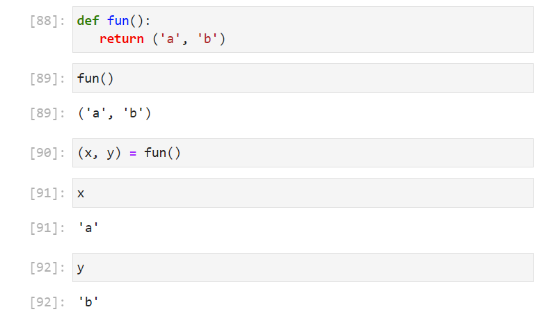

It can also be implicitly used:

```
y, x = fun()
```

These values can be checked:

```
x
y
```

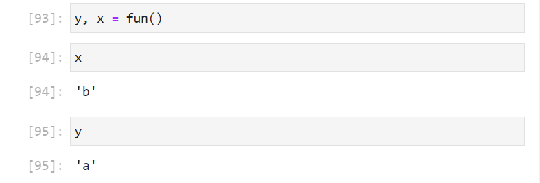

```tuple``` unpacking is normally implicitly used in the ```return``` statement of the function. The function can be redefined:

```
def fun():
   return 'a', 'b'
```

And called:

```
x, y = fun()
```

The values of ```x``` and ```y``` can be checked:

```
x
y
```

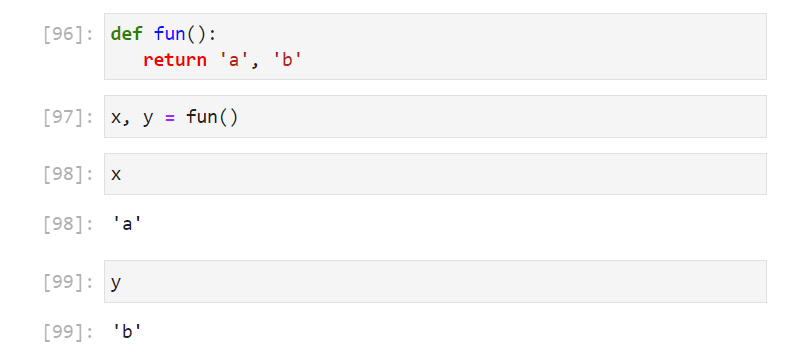

## The list Class

To recap a ```tuple``` is an **immutable** collection of references to Python objects. It was conceptualised as an archive of records. Each record has an index and in the case of a ```namedtuple``` also has an associated field name.

A ```list``` is an ordered finite **mutable** collection of references to Python objects. This means that unlike the ```tuple```, the list can be **modified** once it is created. A list can be conceptualised as an active list of records.

### The Initialization Signature

Inputting ```list()``` followed by shift ```⇧``` and tab ```↹``` will display the docstring of the init signature:

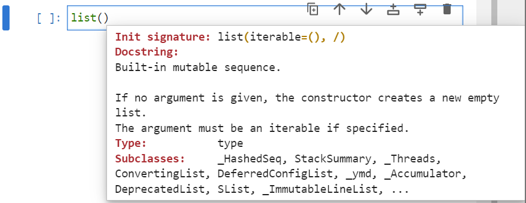

A list can be created from an iterable such as a ```tuple``` using the ```list``` class:

```
archive = (1, True, 3.14, 'hello', 'hello', 'bye')
active = list(archive)
active
```

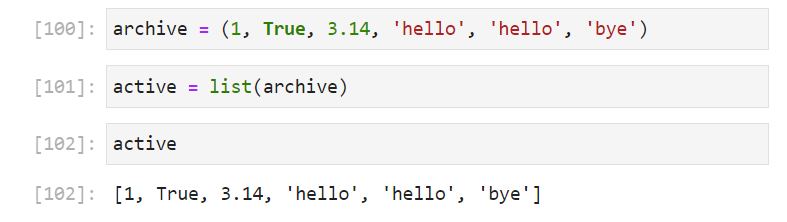

Notice the list is enclosed in square brackets opposed to parenthesis. It can be instantiated directly using:

```
active = [1, True, 3.14, 'hello', 'hello', 'bye']
```


Notice that both ```archive``` and ```active``` display in the Variable Explorer:

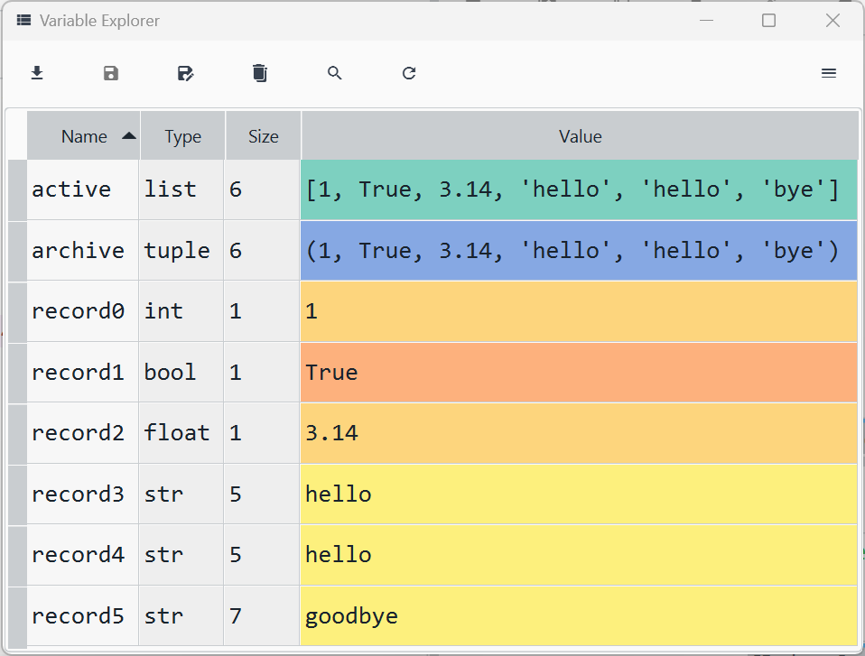

Recall that ```archive``` is greyed out because it is immutable (cannot be modified):

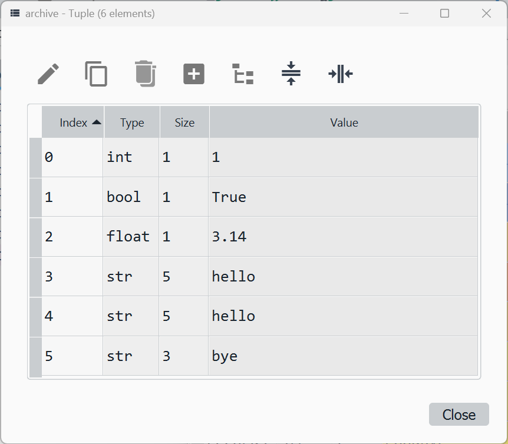

In contrast ```active``` is coloured as all the fields can be mutated (can be modified):

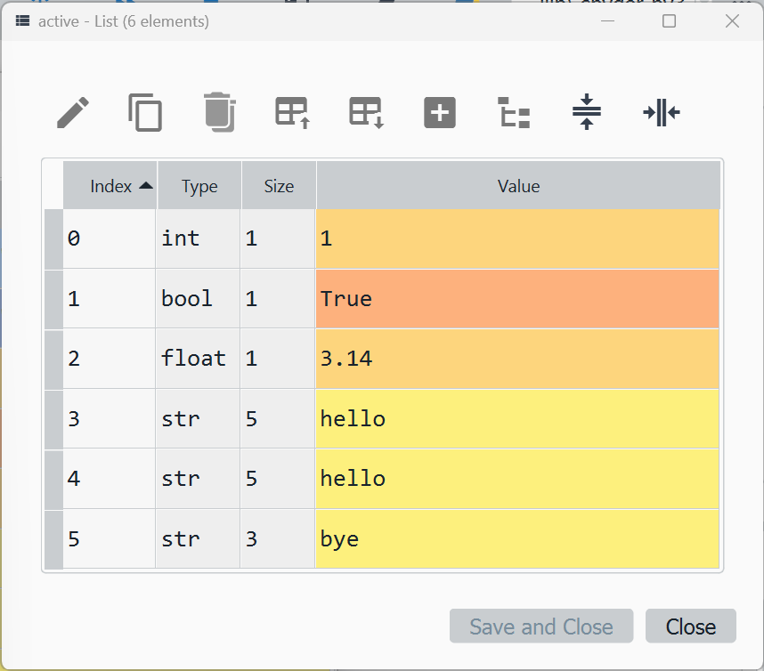

For example the value at index 0 can be clicked into and the integer number ```1``` can be replaced with the number ```123```:

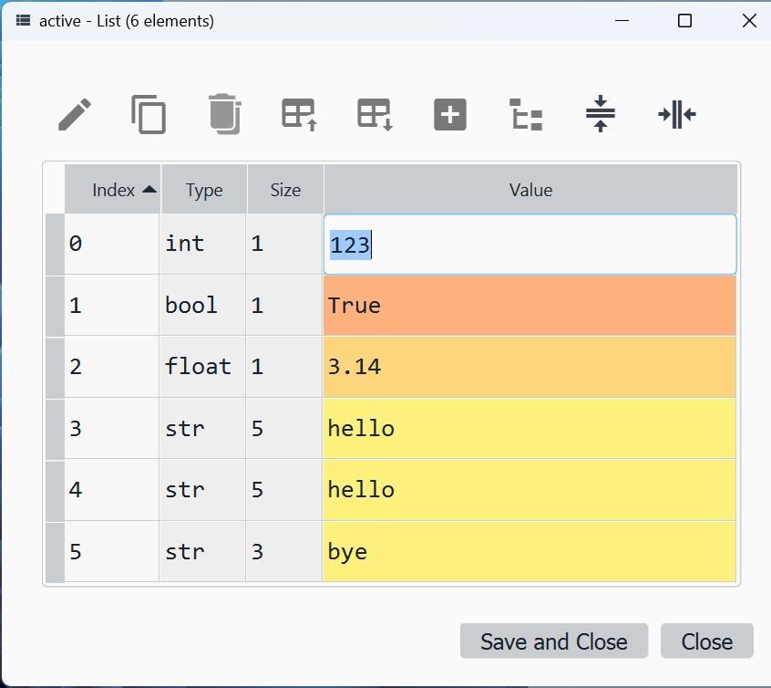

The Spyder Variable Explorer, has an Insert Row above and Insert Row below button:

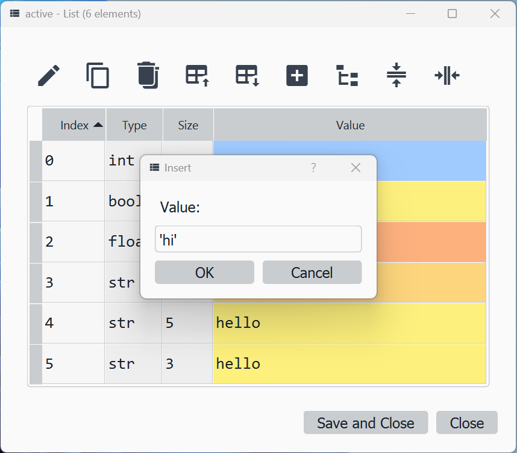

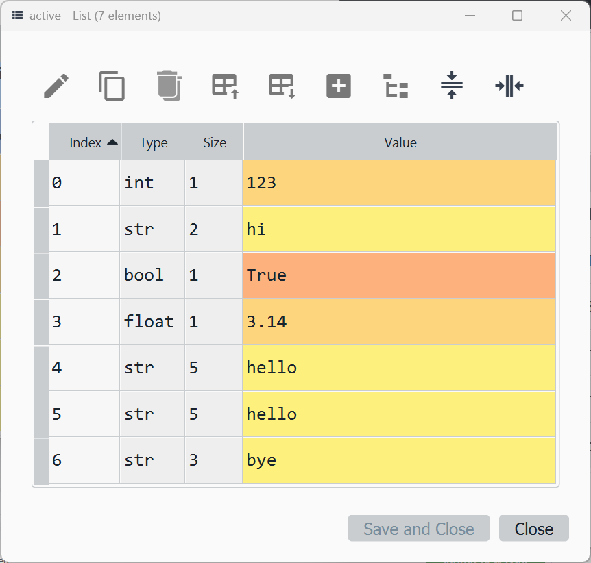

### Identifiers

Returning to:

```
active = [1, True, 3.14, 'hello', 'hello', 'bye']
```

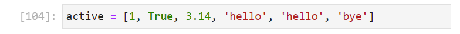

If the instance name ```active``` is input followed by a dot ```.``` and then tab ```↹``` a list of identifiers displays:

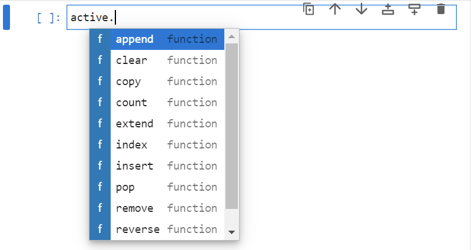

For the ```list``` collection the ```index``` and ```count``` identifiers display, these behave identically to their equivalent identifiers in the immutable ```tuple``` and the identifier ```copy``` performs a shallow copy. The rest of the identifiers ```sort```, ```reverse```, ```append```, ```extend```, ```insert```, ```pop```, ```remove``` and ```clear``` are mutable methods which modify the list in place. ```pop``` is the only method to mutate the ```list``` and return a value (the popped value). The other mutable methods do not have a return statement.

If ```active.sort()``` followed by shift ```⇧``` and tab ```↹``` is input, the docstring of the method will display:

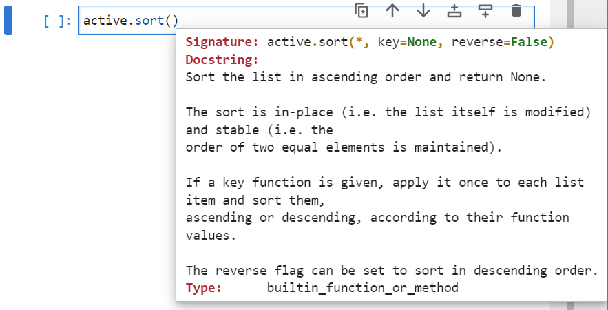

By default ```sort``` will use the comparison operators to sort records in a ```list``` of all numeric values or all string values. In this case, sorting will fail showing a ```TypeError``` as this ```list``` has mixed data types:

```
active.sort()
```

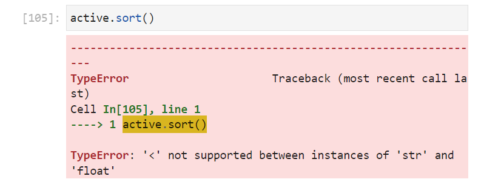

There is a keyword input argument ```key``` which can be assigned to a function. If assigned to the ```str```, class the initialization signature of the ```str``` class will be used on every record in a tuple as a key and these keys will be sorted alphabetically. Before running the next command, ```active``` will be opened in the Variable Explorer:

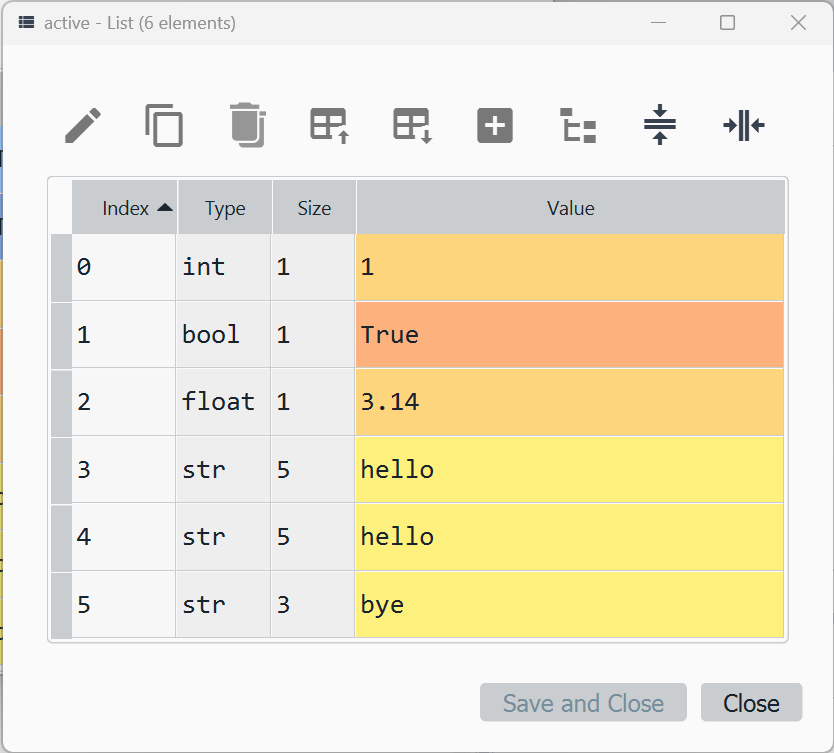

```
active.sort(key=str)
```

Notice that there is no return statement.

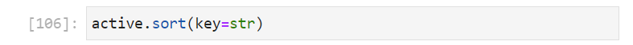

This is because the ```list``` ```active``` has been directly mutated (modified) as seen in the Variable Explorer:

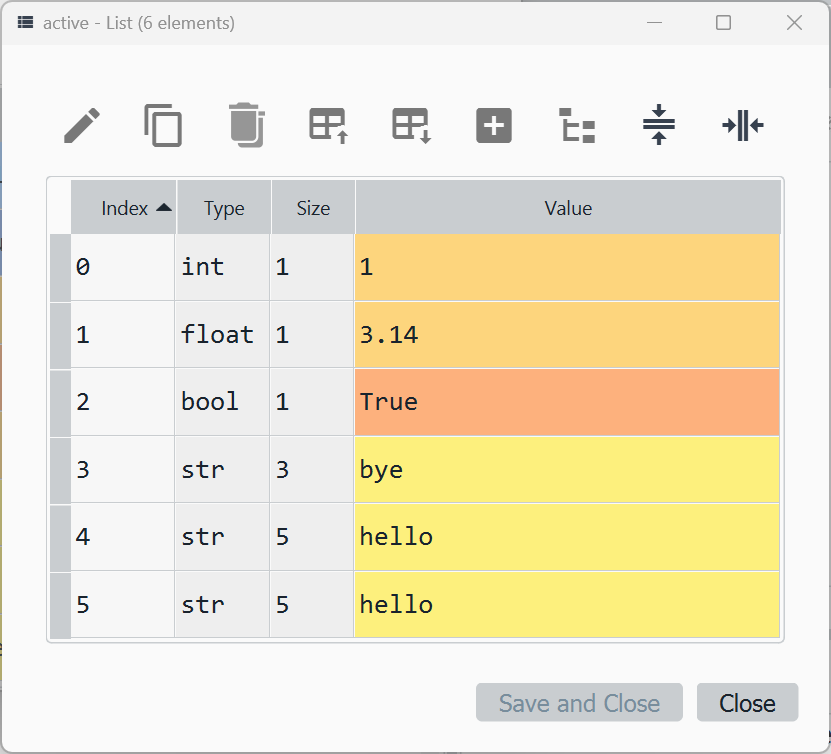

Recall that each character in a string is ordinal:

```
ord('1')
ord('3')
ord('T')
ord('h')
```

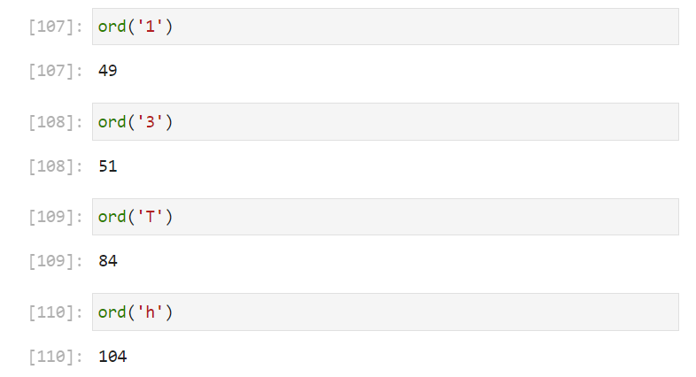

The method ```reverse``` has no input arguments and will reverse the order of the items in the ```list```:

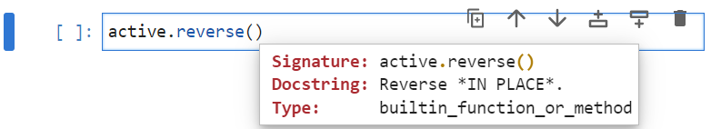

```
active.reverse()
```

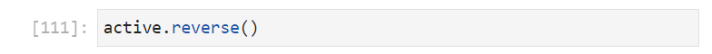

Once again there is no return value for the method and the changes can be vieweed in the Variable Explorer:

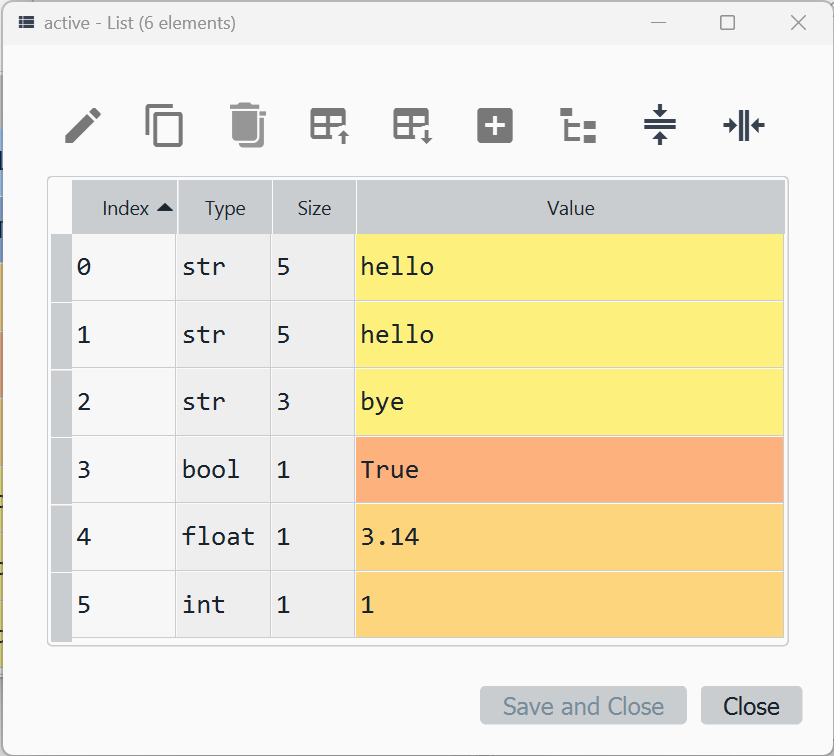

Because ```sort``` was called before ```reverse```, ```active``` is now reverse sorted.

The ```append``` method is used to ```append``` a single item at the end of a ```list```. 

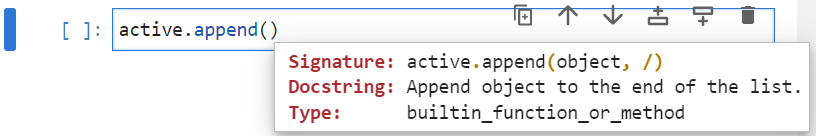

For example:

```
active.append('world')
```

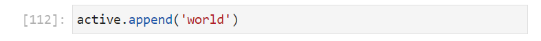

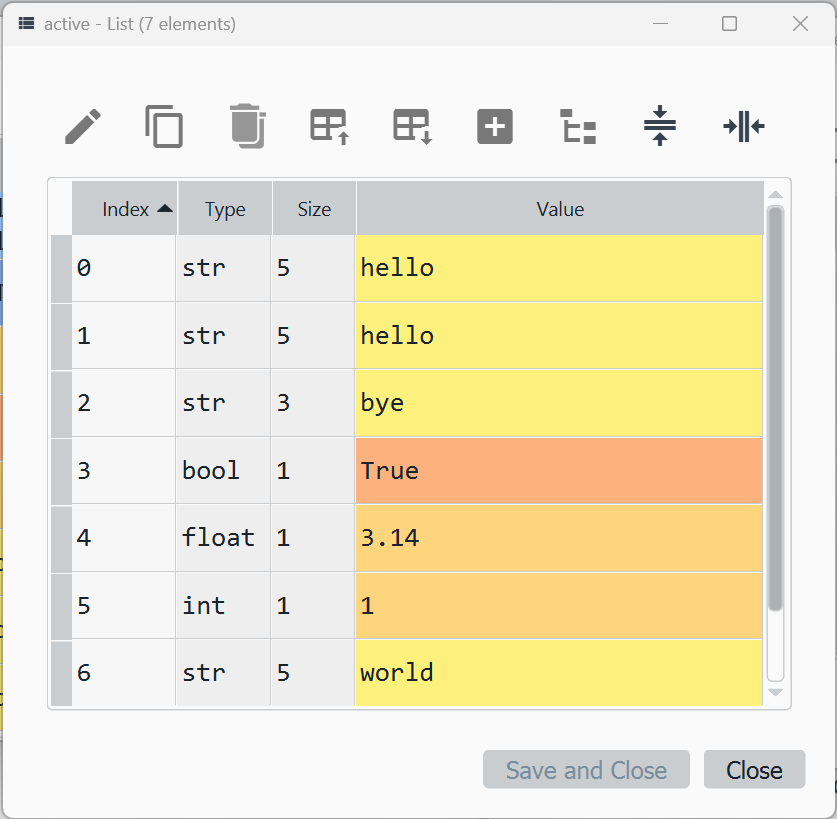

Each record in a ```tuple``` or ```list``` is a Python object. This Python object can be another ```tuple``` or ```list``` for example: 

```
active2 = ['a', 'b', 'c']
```

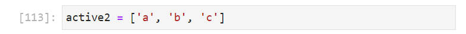


This can be appended:

```
active.append(active2)
```


Notice the change in the Variable Explorer:


The last index has a nested list:


This can be selected to view the nested list in more detail:


Notice that ```active2``` is a single record appended to ```active```. Index 7 of ```active``` can be compared to ```active2```. Index 7 of ```active``` and ```active2``` are equal as expected:

```
active[7] == active2
```

However they are also the same object:

```
active[7] is active2
```


A consequence of ```active2``` being considered a single record can be seen when the ```in``` keyword is used. A record in the ```active2``` is not considered being in ```active``` as ```in``` only looks for a complete record:

```
'a' in active
```


```active2``` as a complete record is in ```active```:

```
active2 in active
['a', 'b', 'c'] in active
```


In addition if the length of the ```active``` is examined:

```
len(active)
```


Notice that the ```active2``` is considered to only be one record. It can be accessed via ```active``` using indexing:

```
active[7]
```


Since ```active2``` is also a list. It can be indexed into:

```
active2[1]
```


Or from ```active``` using indexing twice:

```
active[7][1]
```


The method ```extend``` can be used to extend a list using the contents of an iterable such as a ```tuple``` or ```list```:


For example:

```
active.extend(active2)
```


Each record in ```active2``` is now a seperate record in ```active```.

```
'a' in active
len(active)
```


The ```insert``` method behaves similarly to ```append``` except takes in an numeric index input argument to insert a record. The record that was at that index and all subsequent records are increased by an index of one:


For example at index 1:


```active2``` can be inserted:

```
active.insert(1, active2)
```


The ```pop``` method by default pops off the record at the last index:


For example, the last item in ```active```:


Can be popped using:

```
active.pop()
```

Notice the popped value is returned:


**And** the list is mutated:


This is the only ```list``` method that mutates the ```list``` and returns a value. 

```pop``` by default pops off the last item, acting like an inverse of the ```append``` method. It can however be supplied a numeric index. Once this record is popped all subsequent records are decreased by an index of one. FOr example the value at index 2:


Can be popped:

```
active.pop(2)
```


The ```remove``` method, removes the first instance of a specified record. All records subsequent to that record are decreased by an index of one:


For example, the first occurance of ```active2```:


Can be removed using:

```
active.remove(active2)
```


The method ```clear``` will clear all records, resulting in an empty list:


For example:

```
active.clear()
```


### Data Model Identifiers

Returning to:

```
active = [1, True, 3.14, 'hello', 'hello', 'bye']
```


The directory function ```dir``` can be used to look at the data model identifiers available. The ```pprint``` function from the ```pprint``` module can be imported and used to display the as compact:

```
from pprint import pprint
pprint(dir(active), compact=True)
```


Most of the data model identifiers listed are the same as the identifiers listed for the immutable ```tuple``` and the ```list``` identifiers behave consistently with their ```tuple``` counterparts. 

The ```hash``` function which uses the ```__hash__``` identifier will always give a ```TypeError``` for a ```list``` because it is immutable:

```
hash(active)
```


The **immutable** ```tuple``` only has ```__getitem__```.
The **mutable** ```list``` has ```__getitem__```, ```__setitem__``` and ```__delitem__```. This means for both a ```tuple``` and a ```list```, the value at an index can be read using:

```
active[3]
```


For a ```list``` it can also be assigned a new value:

```
active[3] = 'hi'
```


For a ```list``` it can also be deleted. When a record is deleted, all subsequent records have their numeric index value lowered by 1:

```
del active[3]
```


### Mutability

Many begineer tutorials over-emphasis the use of lists and under-emphasise the use of tuples. Overuse of lists can result in unexpected behaviour due to mutability. If the four object names are assigned:

```
from copy import deepcopy
active1 = [1, 2, 3, 4]
active2 = ['a', 'b', 'c', active1]
active3 = active2
active4 = active2.copy()
active5 = deepcopy(active2)
```


Notice that:

* ```active1``` is a record in ```active2```
* ```active3``` is an alias of ```active2```
* ```active1``` is therefore a record in ```active3```
* ```active4``` is a shallow copy of ```active2```
* ```active1``` is therefore still a record in ```active4``````active5``` is a deep copy of ```active2```
* a copy of ```active1``` is a record in ```active5```

If ```active4``` is indexed into, to get to the nested list ```active1``` and this is in turn indexed and assigned a new value. The change will modify ```active1``` and ```active4```. Moreover because ```active1``` is included in ```active2``` and ```active3```, these in turn will be modified (think of all of these as four labels to the same object). The copy of ```active1``` in ```active5``` will not be changed:

```
active4[3][1] = 'f'
```


If another index in ```active4``` is modified, ```active2``` and ```active3``` will not be modified because it is a shallow copy:

```
active4[1] = 'g'
```


If another index in ```active3``` is modified, ```active2``` will be modified as they are an alias to the same object (think of it as the same object with two labels):

```
active3[2] = 'h'
```


Returning to:

```
active1 = [1, 2, 3, 4]
active2 = ['a', 'b', 'c', active1]
active3 = active2
active4 = active2.copy()
active5 = deepcopy(active2)
```


It is worthwhile understanding the subtle difference between *is* and *is equal to*. When a label *is* another label it means they point to the same object, in other word act as alias. When a label *is equal to* another label, it means the objects, they point to have equal values, they can be different objects with the same values or the same object:

```
active1 is active2[3]
active1 is active3[3]
active1 is active4[3]
active1 is active5[3]
active1 == active5[3]
```


```
active2 is active3
active2 is active4
active2 == active4
active2 is active5
active2 == active5
```


Create the 5 object names above in the Spyder IDE, take your time indexing into them and making mutations and view the changes on the Variable Explorer. This will give you a better understanding of the subtle concept of mutability, which when used incorrectly can become a minefield when used in larger more complicated nested lists.

**Reassignment often gets confused with mutability.** If the following ```tuple``` is assigned to the object name or label ```archive1```:

```
archive1 = (1, 2, 3, 4, 5)
archive1
```

And then later the following ```tuple``` is reassigned to the object name of label ```archive1```:

```
archive1 = ('a', 'b', 'c', 'd', 'e')
archive1
```


The original ```tuple``` ```(1, 2, 3, 4, 5)``` is **not modified**. Instead the label ```archive1``` now points to a completely independent object ```('a', 'b', 'c', 'd', 'e')```. If an object has no object names (which can be conceptualised as labels or references to the object), then it is cleaned up by Pythons garbage collection. This was discussed further in the [Text Data Types: Object Orientated Programming Conception](https://github.com/PhilipYip1988/python-tutorials/tree/main/004_text_datatypes#object-orientated-programming-conception). It is worthwhile re-reading this section to ensure a solid understanding of object orientated prgoramming and mutability.

Functions have their own local scope. If the immutable integer variables ```x``` and ```y``` are assigned in the main scope and then reassigned in the functions local scope they will remain unchanged once the function has been called and the functions local scope has been exited:

```
x = 1
y = 2

def fun():
    x = 4
    y = 5
    return None    

fun()

x
y
```


Care should be taken when using an immutable data type within a function. If a mutable method is used on a mutable object in the functions local scope, it will mutate the immutable data type in the global scope:

```
active = ['a', 'b', 'c']

def fun():
    active.append('d')
    return None


fun()

active

fun()

active
```


If however reasignment of the mutable object is used within the functions local scope and then the object is mutated. Only the object within the functions local scope will be modified. The mutable object within the global scope will be unaltered:

```
active = ['a', 'b', 'c']

def fun():
    active = ['a', 'b', 'c']
    active.append('d')
    return None  


fun()

active
```


Unintended mutability of an original object can occur when the object is supplied as an input argument to a function:

```
active = ['a', 'b', 'c']

def fun(mutable):
    mutable.append('d')
    return None  


fun(active)

active
```


When this is not desired, the ```copy``` method can be used to create a local copy of the variable within the functions local scope:

```
active = ['a', 'b', 'c']

def fun(mutable):
    mutable = mutable.copy()
    mutable.append('d')
    return None  


fun(active)

active
```


## The set Class

A ```set``` is an unordered finite **mutable** collection of unique Python objects

### The Initialization Signature

Inputting ```set()``` followed by shift ```⇧``` and tab ```↹``` will display the docstring of the init signature:


A ```set``` can be created from an iterable such as a ```tuple``` or ```list``` using the ```set``` class:

```
archive = (1, True, 3.14, 'hello', 'hello', 'bye')
unique = set(archive)
unique
```


Notice the ```set``` is enclosed in braces and all duplicates have been removed. This can be seen in the Variable Explorer, the ```set``` ```unique``` has a size smaller than the ```tuple``` ```archive```:


By removing duplicates the numeric index has been lost, a ```set``` is unordered and has no index. The values are shown in the Variable Explorer in a random order.


Although the fields are greyed out in the Spyder Variable Explorer, a ```set``` is **mutable**. In this case being greyed out indicates that support for mutating a ```set``` via the Variable Explorer is not available. Since a ```set``` is unordered it is not possible to index into a ```set``` to select a value or mutate a value. In the case of the ```list```, the Spyder Variable Explorer under the hood uses the ```list``` data model method ```__setitem__``` to reassign a value. For a ```set``` it is not possible to modify a value directly. It is however possible to discard a value and to add a new value using mutable identifiers.


high dpi 1.5

100 % zoom jupyterlab

1920 1080 150 %


It can be instantiated directly using:

```
unique = {1, 3.14, 'hello', 'bye'}
```


### Identifiers

```
unique = {0, 1, 2}
```


The ```set``` identifier ```add``` is similar to the list method ```append```. The difference in the name indicates that there is no order in the set. Note this identifier should not be confused with the data model identifier ```__add__``` which isn't defined for a ```set```:

```
unique.add(3)
```


Moreover if the value to be added to the set is already included in the set, it won't be added again as sets can't have duplicates:

```
unique.add(2)
```


The ```set``` identifier```remove``` operates analogously to the ```list``` counterpart identifier ```remove```. It is also supplemented by ```discard```. The difference between two methods is in error handling; ```remove``` raises an error if a value is not present and ```discard``` is silent:

```
unique.remove(3)
unique.discard(2)
unique.remove(2)
unique.discard(2)
```


The ```pop``` identifier does not have the keyword input argument ```index``` because a ```set``` is unordered and will always pop off an arbitary value:


```
unique.pop()
```

The set identifier ```copy``` operates analogously to the ```list``` counterpart identifier ```copy``` and performs a shallow copy. A deep copy can be performed using the ```deepcopy``` function from the ```copy``` module:

```
unique2 = unique.copy()
```


The set identifier ```clear``` operates analogously to the ```list``` counterpart identifier  ```clear```, clearing all the items in the collection: 

```
unique2.clear()
```


The ```issuperset``` identifier checks whether one ```set``` instance is a superset, that is a ```set``` that contains all the values of another ```set```: 

```
unique1 = {0, 1, 2, 3, 4, 5, 6, 7, 8}
unique2 = {0, 1, 2}
unique3 = {7, 8, 9}
unique4 = {'a', 'b', 'c'}
```

```
unique1.issuperset(unique2)
unique1.issuperset(unique3)
```


The ```issubset``` identifier checks whether one ```set``` instance is a subset, that is a ```set``` which all values are contained with the other ```set``` (superset): 

```
unique2.issubset(unique1)
unique3.issubset(unique1)
```


The ```disjoint``` identifiers checks whether one set is disjoint with another, that is two sets which share no values in common:

```
unique4.isdisjoint(unique1)
unique3.isdisjoint(unique1)
```


The ```union``` identifier makes a superset which contains all unique values of the set the method is called from *self* and the set the method is applied to *other*. This method has a return value producing a new set:

```
unique1 = {0, 1, 2, 3, 4, 5, 6}
unique2 = {4, 5, 6, 7, 8, 9}
unique1.union(unique2)
```

The ```update``` method can be thought of as *union_update* and behaves similarly to the method ```update```. The set the method is called from *self* is updated in place and there is no return value:

```
unique1 = {0, 1, 2, 3, 4, 5, 6}
unique2 = {4, 5, 6, 7, 8, 9}
unique1.update(unique2)
```


The ```intersection``` identifier returns all unique values which occur both in *self* and *other*. This method has a return value producing a new set:

```
unique1 = {0, 1, 2, 3, 4, 5, 6}
unique2 = {4, 5, 6, 7, 8, 9}
unique1.intersection(unique2)
```

The ```intersection_update``` and behaves similarly to the method ```intersection```. The set the method is called from *self* is updated in place and there is no return value:

```
unique1 = {0, 1, 2, 3, 4, 5, 6}
unique2 = {4, 5, 6, 7, 8, 9}
unique1.intersection_update(unique2)
```


The ```difference``` identifier returns all unique values which occur both in *self* that do not occur *other*. This method has a return value producing a new set:

```
unique1 = {0, 1, 2, 3, 4, 5, 6}
unique2 = {4, 5, 6, 7, 8, 9}
unique1.difference(unique2)
```

The ```difference_update``` behaves similarly to the method ```difference```. The set the method is called from *self* is updated in place and there is no return value:

```
unique1 = {0, 1, 2, 3, 4, 5, 6}
unique2 = {4, 5, 6, 7, 8, 9}
unique1.difference_update(unique2)
```


The ```symmetric_difference``` identifier returns all unique values which occur both in *self* that do not occur *other* and all the unique values that occur in *other* but do not occur in *self*. This method has a return value producing a new set:

```
unique1 = {0, 1, 2, 3, 4, 5, 6}
unique2 = {4, 5, 6, 7, 8, 9}
unique1.symmetric_difference(unique2)
```

The ```symmetric_difference_update``` behaves similarly to the method ```symmetric_difference```. The set the method is called from *self* is updated in place and there is no return value:

```
unique1 = {0, 1, 2, 3, 4, 5, 6}
unique2 = {4, 5, 6, 7, 8, 9}
unique1.symmetric_difference_update(unique2)
```


### Data Model Identifiers

Returning to:

```
unique1 = {0, 1, 2, 3, 4, 5, 6}
```


The directory function ```dir``` can be used to look at the data model identifiers available. The ```pprint``` function from the ```pprint``` module can be imported and used to display the as compact:

```
pprint(dir(unique1), compact=True)
```


The formal and informal string representation of a ```set``` are given by the ```repr``` function and ```str``` class which use the ```__repr__``` and ```__str__``` data model identifiers respectively:

```
repr(unique1)
str(unique1)
```


A set is mutatable, the ```hash``` function which uses the ```__hash__``` data model method:

```
hash(unique1)
```


Notice there is no ```__getitem__```


```__sub__``` is similar to ```difference```

```__isub__``` is similar to ```difference_update```.


```difference``` can take any iterable as an input argument. The ```-``` operator requires two ```set``` instances.

no ```__add__``` or ```__mul__``` (does not make sense to multiply a set to get duplicates because there is no duplicates in a set)


The ```&``` operator returns the intersection.

The ```|``` operator returns the union.

The ```^``` operator returns the symmetric difference

```__and__```, ```__or__```, ```__xor__```

```__iand__```, ```__ior__```, ```__ixor__```.


The six equality operators ```==```, ```!=```, ```<```, ```<=```, ```>```, ```>=``` can be used with a ```set```. These use the data model identifiers ```__eq__```, ```__ne__```, ```__lt__``` and ```__le__```, ```__gt__``` and ```__ge__``` respectively. 

* A set is equal to another set if all the values are the same. 
* A set is greater than another set, if it is a superset of the other set. 
* A set is less than another set, if it is a subset.
* If two sets have an intersection and a symmetric difference, they are not equal and all other comparison operators are ```False```.


