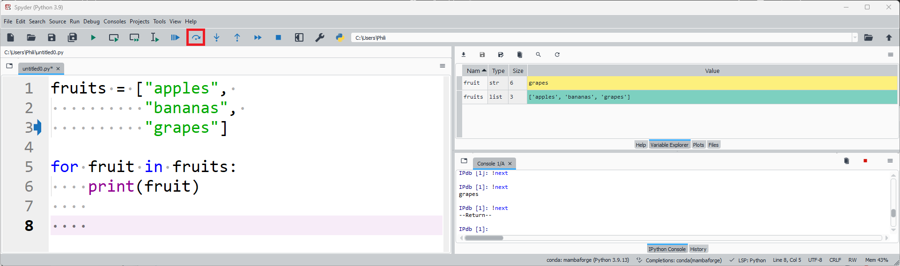

# Code Blocks

## range and enumerate

The previous tutorial looked at list and tuple collections. A string was also considered to be a collection of characters. Each of these collections have an index with the first number in the index being ```0``` as Python uses zero-order indexing.

In addition to the above a ```range``` object can be created using the syntax:

```
range(start, stop, step)
```

For example:
```
range(0, 10, 1)
```


Because Python uses zero-order indexing, the ```range``` object is inclusive of the ```start``` bound and exclusive of the ```stop``` bound. The ```start``` value of 0 is included and the range object increases using a ```step``` of 1 until the ```stop``` of 10 is reached, however the final value 10 itself is excluded. This can be seen more clearly by assigning the range object to a variable:

```
ro = range(0, 10, 1)
```


And then casting it to a list:

```
rol = list(ro)
```


Or directly:

```
list(range(0, 10, 1))
```


The range object can be indexed in a similar manner to a list:

```
ro[0]
ro[1]
ro[2]
ro[3]
ro[4]
```


And if the final index of the range object is exceeded, an out of range error is displayed:

```
ro[11]
```


In the above as the ```start``` was 0 and the ```step``` was 1, therefore the index and the value for each item in the range object matched. ```0``` and ```1``` are the default values for ```start``` and ```step``` respectively.


The range object can be created explicitly specifying 3 positional input arguments. When the ```step``` is 1, it does not have to be explicitly specified:

```
range(start, stop, step)
range(start, stop, 1)
range(start, stop)
```

When the ```step``` is 1, and the ```start``` is 0, only the ```stop``` value needs to be specified:

```
range(start, stop, step)
range(0, stop, 1)
range(0, stop)
range(stop)
```

For clarity, a range object with a ```step``` of 2 will be created, which means the index and the value at the index now differ:

```
ro = range(0, 10, 2)
rol = list(ro)
```


Sometimes it is useful to ```enumerate``` such a range object:

```
roe = enumerate(ro)
```


Enumeration creates a collection of tuple (index, value) pairs. This can be more clearly seen by casting the enumerate object to a list:

```
roel = list(roe)
```


A list object has an index for each value and like demonstrated above can also be enumerated:

```
lo = ["apples", "bananas", "grapes"]
loel = list(enumerate(lo))
```


A string can also be regarded as a collection of characters, with each character having its own index and can also be enumerated:

```
s = "apples"
sl = list(s)
soel = list(enumerate(s))
```


## Code Block Spacing

The code block has the following syntax.

```
statement:
    line of code
    line of code
    line of code


```


The statement ends in a colon ```:``` which is used to indicate the beginning of a code block. 


Each line of code belonging to the code block is indented by 4 spaces. 


Usually there are two blank lines left at the end of the code block to make it clear the code block has ended.


Some code blocks can be more complicated and have nested statements. 

```
statement:
    belong in block
    belong in block
    belong in block


outside block
outside block
```

Anything belonging to a nested statement is indented twice using 8 spaces (4 spaces for the outer statement and another 4 spaces for the inner statement).

```
statement1:
    belong in block1
    belong in block1
    belong in block1
    statement2:
        belong in block2 within block1
        belong in block2 within block1
        belong in block2 within block1


outside block
outside block
```


## for loops

The ```for``` loop executes a code block for every item in a collection. The ```for``` loop uses the keywords ```for``` and ```in```. As an example, the collection can be a list of strings:

```
collection = ["apples", "bananas", "grapes"]
```


A ```loop_var``` can be assigned. This ```loop_var``` will take the value at index 0 ```"apples"``` during the first iteration of the for loop, it will then be reassigned the value at index 1 ```"bananas"``` during the second iteration of the for loop and then be reassigned the value at index 2 (also index -1) ```"grapes"``` during the final iteration of the for loop.

This can be demonstrated by including a ```print``` statement in the code block.

```
collection = ["apples", "bananas", "grapes"]

for loop_var in collection:
    print(loop_var)
    
    
```


Notice that the loop variable ```loop_var``` displays in the variable explorer and has its final value.


The loop variable ```loop_var``` is just a standard variable and follows the standard Python convention for object names. The above can be rewritten using.

```
collection = ["apples", "bananas", "grapes"]

for word in collection:
    print(word)
    
    
```


Or alternatively.

```
fruits = ["apples", "bananas", "grapes"]

for fruit in fruits:
    print(fruit)
    
    
```


Notice that the collection is plural and the loop variable is singular. 

This can be examined in more detail using the debugger.


Executing the first line, creates the collection which displays on the variable explorer:


Executing the next line assigns the loop variable ```fruit``` to the value ```"apples"```:


Executing the next line prints ```"apples"```:


Executing the next line assigns the loop variable ```fruit``` to the value ```"bananas"```:


Executing the next line prints ```"bananas"```:


Executing the next line assigns the loop variable ```fruit``` to the value ```"grapes"```:


Executing the next line prints ```"grapes"```:


Executing the next line, exits the local space of the code block, returning to the main space of the script.



Executing the next line, reaches the end of the script and exits:


Instead of printing the loop variable, a constant ```hello``` can be printed. This is printed for index 0, 1 and 2.


```
collection = ["apples", "bananas", "grapes"]

for loop_var in collection:
    print("hello")
    
    
```


Notice in this case, ```loop_var``` was defined but never used. It is common convention to use ```_``` in such a scenario:

```
collection = ["apples", "bananas", "grapes"]

for _ in collection:
    print("hello")
    
    
```


A range object could also be used to reproduce this.

```
for _ in range(0, 3, 1):
    print("hello")
    
    
```


And simplified to

```
for _ in range(3):
    print("hello")
    
    
```


A range object can be enumerated as seen before.

```
ro = range(0, 10, 2)
rol = list(ro)
roe = enumerate(ro)
roel = list(roe)
```


In this case, the loop variable ```loop_var``` is now a tuple with index 0 of the tuple being the index of the range object and index 1 of the tuple being the value of the range object. 


We can view this by printing a formatted string.

```
ro = range(0, 10, 2)
roe = enumerate(ro)

for loop_var in roe:
    print(f"idx {loop_var[0]}, val {loop_var[1]}")
    

```


The loop variable can also be explicitly specified as a tuple:

```
ro = range(0, 10, 2)
roe = enumerate(ro)

for (idx, val) in roe:
    print(f"idx {idx}, val {val}")
    

```


Or implicitly, the parenthesis around the tuple can be dropped (known as tuple unpacking).

```
ro = range(0, 10, 2)
roe = enumerate(ro)

for idx, val in roe:
    print(f"idx {idx}, val {val}")
    

```


## if, elif, else

A number of code blocks can be made in response to a single condition.

|Code Block|Purpose|
|---|---|
|if|Code block is carried out if condition is True|
|else|Code block is carried out elsewise i.e. when the condition is False|

Or setup in response to multiple conditions.

|Code Block|Purpose|
|---|---|
|if|Code block is carried out if the first condition is True|
|elif|Code block is carried out if the first condition is False and the second condition is True|
|elif|Code block is carried out if the first and the second conditions are False and the third condition is True|
|elif...|Each additional elif code block is carried out if all previous conditions are False and the current condition is True|
|else|Code block is carried out elsewise i.e. all conditions above are False|


Code in the ```if``` code block is only implemented if the condition is ```True```

```
condition = True

if condition:
    print("Hello")
    
    
```

```
condition = False

if condition:
    print("Hello")
    
    
```


Code not belonging to the code block is implemented regardless of this condition.


```
condition = True

if condition:
    print("Inside Code Block")
    

print("Outside Code Block")
```

```
condition = False

if condition:
    print("Inside Code Block")
    

print("Outside Code Block")
```


A condition involving the conditional operators ```>```, ```>=```, ```==```, ```!=```, ```<``` and ```<=``` is normally expressed within the ```if``` statement, enclosed in parenthesis, for example.

```
if (5>3):
    print("Inside Code Block")
    

print("Outside Code Block")
```


An ```if``` statement can be matched with an ```else``` statement which is carried out when the ```if``` statement is ```False```.

```
condition = True
if condition:
    print("Do something")
else:
    print("Do something else")


print("Outside")
```

```
condition = False
if condition:
    print("Do something")
else:
    print("Do something else")


print("Outside")
```


A series of linked conditions can be setup using the ```if```, ```elif``` (else if), ..., ```else```. In this case when ```num``` is 5, all the conditions are False so the else code block is executed:

```
num = 5

if (num>10):
    print("num is greater than 10")
elif (num>5):
    print("num is greater than 5")
else:
    print("num is lower than 5")

    
```


In this case, when ```num``` is 8, the if condition is False and the elif condition is True so the elif code block is executed:

```
num = 8

if (num>10):
    print("num is greater than 10")
elif (num>5):
    print("num is greater than 5")
else:
    print("num is lower than 5")

    
```


In the case where ```num``` is 100, the if condition is True and the if code block is executed. Because the if code block was executed, all subsequent code blocks below it are ignored. The elif code block is not executed despite this condition also being True. 

```
num = 100

if (num>10):
    print("num is greater than 10")
elif (num>5):
    print("num is greater than 5")
else:
    print("num is lower than 5")

    
```


In order to execute the code blocks from both conditions, seperate unlinked if statements would need to instead be used.

```
num = 100

if (num>10):
    print("num is greater than 10")
    
    
if (num>5):
    print("num is greater than 5")
    
    
```


Multiple ```elif``` code blocks can be used. In this example, the ```if``` condition is False and the associated code block is ignored. Next the first ```elif``` condition is True so the code block belonging it is executed. All other code blocks are ignored as a linked code block is already executed.

```
num = 9

if (num>10):
    print("num is greater than 10")
elif (num>8):
    print("num is greater than 8")
elif (num>7):
    print("num is greater than 7")
elif (num>5):
    print("num is greater than 5")
else:
    print("num is lower than 5")

    
```


## match, case

An ```if```, multiple ```elif``` and an ```else``` code block can be setup to respond to a number of discrete values of a variable as shown. In this case as ```num``` is 1, the ```elif``` code block is executed.

```
num = 1

if (num==0):
    print("num is zero")
elif (num==1):
    print("num is one")
elif (num==2):
    print("num is two")
else:
   print("num is not zero, one or two")


```


It is however more clean to use an outer code block to ```match``` the variable and provide associated code blocks for each discrete ```case``` of possible variables. Since ```num``` is 1, ```case``` 1 is True and so only this code block is executed.

```
num = 1

match num:
    case 0:
        print("num is zero")
    case 1:
        print("num is one")
    case 2:
        print("num is two")
    case _:
        print("num is not zero, one or two")


```


In the following example ```num``` is 9, and none of the above cases outlined are True, so the code in the case ```_``` code block is executed.

```
num = 9

match num:
    case 0:
        print("num is zero")
    case 1:
        print("num is one")
    case 2:
        print("num is two")
    case _:
        print("num is not zero, one or two")


```


## while loops

The code in an ```if``` code block only runs once if a condition is True. A ```while``` loop is similar to an ```if``` code block and the code in the code block will be executed when the condition is True. After the code block is executed however, the condition will be rechecked and the code block will run again if the condition is True. This will continue ```while``` the condition is True, until the condition is updated to be False. 

If the condition is never False, the loop will run forever and may hang the Python Kernel.

```
while True:
    print("spam my console")
    
    
```


Notice that the output of the cell continues indefinitely and the kernel gets hung on the cell output. The kernel typically needs to be restarted to exit out of the ```while``` loop.

|Code Block|Purpose|
|---|---|
|for|Code block is carried out for each item in a known sequence|
|while|Code block is carried out while a condition is True|

```while``` loops are typically invoked when interacting with hardware. For example a bathroom light might be instructed to turn on in respond to the reading from a Near-Infrared motion sensor. In this example there is no set sequence or specified period of time until someone walks until the bathroom, making it unviable to work with only a ```for``` loop.

```for``` loops are instead preferred when working over a known timeframe or sequence within a known collection. 

Although there is a preference to use a ```for``` loop or a ```while``` loop, the ```while``` loop can be used in place of the ```for``` loop for all circumstances however the ```for``` loop cannot replace the ```while``` loop with an unknown sequence or timeframe. To understand how to use a ```while``` loop it is useful to recreate some of the ```for``` loops used above with a ```while``` loop.


Starting out with the simple ```for``` loop which prints out the value of each item in the collection.

```
collection = ["apples", "bananas", "grapes"]
for loop_var in collection:
    print(loop_var)
    
    
```


The ```for``` loop will instead be updated to use a range object. In this case the stop value is ```len(collection)``` and the range object can be specified as ```range(0, len(collection), 1)``` or abbreviated as ```range(len(collection))```. The for loop has more cumbersome syntax but works as expected.

```
collection = ["apples", "bananas", "grapes"]
for loop_idx in range(len(collection)):
    print(collection[loop_idx])
    
    
```


For a ```while``` loop, a condition must be established. This condition typically involves a variable that must be defined before using the ```while``` loop. In this case, the variable is called ```loop_idx``` and is assigned to an initial value of 0. The condition of the ```while``` loop setup is that this variable ```loop_idx``` is less than the length of the collection ```len(collection)```. 

If there is no change made in the ```while``` loop involving ```loop_idx``` or the ```len(collection)```, the ```while``` loop will run forever. So the last line in the code block will increment ```loop_idx```. The string in the collection at the current index can be printed by indexing using ```loop_idx```, for clarity both the index and value will be printed. This syntax is more cumbersome but yields similar results to the ```for``` loop.

```
collection = ["apples", "bananas", "grapes"]

loop_idx = 0

while (loop_idx < len(collection)):
    print(f"loop_idx {loop_idx}, {collection[loop_idx]}")
    loop_idx += 1
    
    
```


Notice that the final value of ```loop_idx``` is 3, meaning the condition is the ```while``` loop is False and therefore the code block is not executed for a 4th time and the code block is exited.


## try, except, else, finally

Earlier we seen the use of if, elif and else statements to carry out different code blocks in response to a condition or conditions. In Python we have a similar structure setup for handling errors.

|Code Block|Purpose|
|---|---|
|try|This code block will test the code for an expected error|
|except|This code block will be used to handle the error|
|else|This code block will be used elsewise when there is no error|
|finally|This code block is carried out regardless if there is an error or not|
