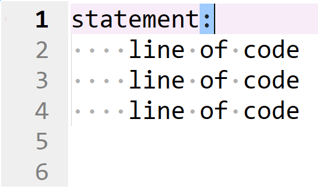
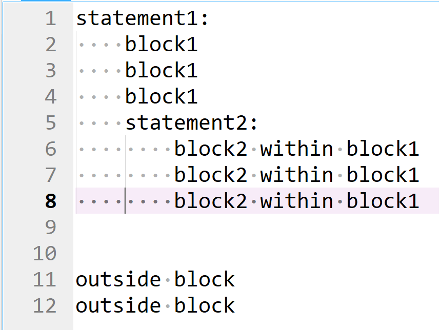

# Code Blocks

## Recap: Collections

The previous two tutorials looked at fundamental datatypes in Python including integers, floats, booleans and strings. It also looked at collections such as the list, tuple, set and dictionary and examined how the string had both characteristics of a fundamental datatype and a collection.

## Code Block Spacing

The code block has the following syntax.

```
statement:
    line of code
    line of code
    line of code


```


The statement ends in a colon ```:``` which is used to indicate the beginning of a code block. 



Each line of code belonging to the code block is indented by 4 spaces. 


Usually there are two blank lines left at the end of the code block to make it clear the code block has ended.


```
statement:
    belong in block
    belong in block
    belong in block


outside block
outside block
```

Code blocks can included statements with nested code blocks. Anything belonging to a nested statement is indented twice using 8 spaces (4 spaces for the outer statement and another 4 spaces for the inner statement).

```
statement1:
    belong in block1
    belong in block1
    belong in block1
    statement2:
        belong in block2 within block1
        belong in block2 within block1
        belong in block2 within block1


outside block
outside block
```



## iter and reverse

The ```iter``` function can be used to create an iterator object from a string. Recall that a string has a numeric index and everytime the ```next``` function is used on the iterator object, the iterator moves up one index of the string, returning the corresponding value at that index.

```
greeting = "hello"
forward = iter(greeting)
next(forward)
next(forward)
next(forward)
next(forward)
next(forward)
next(forward)
```


A ```StopIteration``` error message displays when all values of the iterator are exceeded.

A list and tuple also have a numeric index:


An iterator made from one of these collections has identical behaviour to an iterator created from a string:

```
greeting = list(greeting)
forward = iter(greeting)
next(forward)
next(forward)
next(forward)
next(forward)
next(forward)
next(forward)
```


```
greeting = tuple(greeting)
forward = iter(greeting)
next(forward)
next(forward)
next(forward)
next(forward)
next(forward)
next(forward)
```


The set is an unordered collection that can only contain unique values.


Because a set is unordered, everytime the ```next``` function is used on an iterator object created from a set, an arbitrary value of the set will be displayed:

```
greeting = set(greeting)
forward = iter(greeting)
next(forward)
next(forward)
next(forward)
next(forward)
next(forward)
```


A dictionary has ```key: value``` pairs known as an ```item```. An iterator used on a dictionary will behave as though the dictionary is just a list of keys.


```
colors = {"red": "#FF0000", 
          "green": "#00B050", 
          "blue": "#0070C0"}
forward = iter(colors)
next(forward)
next(forward)
next(forward)
next(forward)
````


The reason for this, is the value can be accessed using the key:

```
colors = {"red": "#FF0000", 
          "green": "#00B050", 
          "blue": "#0070C0"}
forward = iter(colors)
colors[next(forward)]
colors[next(forward)]
colors[next(forward)]
colors[next(forward)]
````


It is also possible to  use the dictionary method items. To create an items object which is essentially of the form of a list of ```(key, value)``` tuples:

```
colors = {"red": "#FF0000", 
          "green": "#00B050", 
          "blue": "#0070C0"}
colors.items()
```


An iterator object can be created using the dictionary items instead of the dictionary itself and displays each tuple when stepping through the iterator:

```
colors = {"red": "#FF0000", 
          "green": "#00B050", 
          "blue": "#0070C0"}
colors.items()
forward = iter(colors.items())
next(forward)
next(forward)
next(forward)
next(forward)
```


The dicitonary items instance can be cast to a list, so the entire sequence can be viewed:

```
colors = {"red": "#FF0000", 
          "green": "#00B050", 
          "blue": "#0070C0"}
list(colors.items())
```


## The enumerate class

The ```enumerate``` class creates an enumeration instance which like the dictionary items is a list of 2 value tuples. Instead of each tuple being a ```(key, value)``` pair, each tuple is a ```(index, value)``` pair. 

```
greeting = enumerate("hello")
```

The enumerate instance does not display on the variable inspector and no identifiers display when inputting the enumerate instance name followed by a dot ```.``` and tab ```↹```:


The datamodel identifiers display when the directory function ```dir``` is used on the enumerator instance:

```
dir(greeting)
```

The enumerate instance can be converted to an iterator and each tuple is displayed as the iterator is stepped through:

```
greeting = enumerate("hello")
forward = iter(greeting)
next(forward)
next(forward)
next(forward)
next(forward)
```


An enumerate instance can be cast into a list so the entire sequence of tuples can be viewed:

```
list(enumerate("hello"))
```


## The range class

The ```range``` class is used to create a numerical sequence. The range object takes one to three positional input arguments and has a very similar notation to the ```slice``` function when integer input arguments are used. 


Like ```slice```, zero-order indexing is used. When all three positional input arguments are supplied the first input argument is the start value (inclusive), the second input argument is the stop value (exclusive) and the third input argument is the ```step```. For example:

```
range(0, 4, 1)
```


The range instance can be cast to a list, so the entire numeric sequence can be viewed:

```
list(range(0, 4, 1))
```


If a single positional input argument is supplied it will be assigned to the stop value and the start value will default from 0 and the step size will default to 1.

```
list(range(4))
```


If a two positional input arguments are supplied, the will eb assigned to the stop and the start and the step size will default to 1.

```
list(range(0, 4))
```


If the range instance is assigned to an instance name, it displays on the variable inspector and the following identifiers display when inputting the instance name followed by a dot ```.``` and tab ```↹```:

```
nums = range(4)
```


The ```start```, ```stop``` and ```step``` values are available as attributes and the ```start``` is 0 and ```step``` is 1 as expected.

```
nums = range(4)
nums.start
nums.stop
nums.step
```


The ```count``` and ```index``` methods behave like their counterparts in a list or tuple.

The directory of a range object can be examined using the ```dir``` function:

```
nums = range(100)
dir(nums)
```


The ```__iter__``` and ```__reversed__``` datamodel methods are defned so an iterator instance can be constructed using the ```iter``` function:

```
nums = range(100)
forward = iter(nums)
next(forward)
next(forward)
next(forward)
list(forward)
```

```next``` can be used to step through the iterator and the ```list``` class can be used to cast all remaining elements of the iterator to a list:


## for loops

The ```for``` loop executes a code block for every item in a collection. The ```for``` loop uses the keywords ```for``` and ```in```. As an example, the collection can be a list of strings:

```
collection = ["apples", "bananas", "grapes"]
```


The line ```for loop_var in collection``` essentially creates an iterator and assigns the current value of the iterator to ```loop_var``` during each iteration of the loop.

This ```loop_var``` will take the value at index 0 ```"apples"``` during the first iteration of the for loop, it will then be reassigned the value at index 1 ```"bananas"``` during the second iteration of the for loop and then be reassigned the value at index 2 (also index -1) ```"grapes"``` during the final iteration of the for loop.

This can be demonstrated by including a ```print``` statement in the code block.

```
collection = ["apples", "bananas", "grapes"]

for loop_var in collection:
    print(loop_var)
    
    
```


Notice that the loop variable ```loop_var``` displays in the variable explorer and has its final value.


The loop variable ```loop_var``` is just a standard variable and follows the standard Python convention for object names. The above can be rewritten using.

```
collection = ["apples", "bananas", "grapes"]

for word in collection:
    print(word)
    
    
```


Or alternatively.

```
fruits = ["apples", "bananas", "grapes"]

for fruit in fruits:
    print(fruit)
    
    
```


It is common to give the collection a plural name and the associated loop variable a singular name. 

The mechanism of a for loop can be examined in more detail using the debugger in the JupyterLab IDE:


To begin, select view and show line numbers:


Select the debugger:


Open the debug tab to the right:


Click the lower and upper line numbers to debug between:


Select run:


To the right under callstack is the option to step through the code:


Notice that the list ```fruits``` is instantiated. Stepping through goes to the for loop statement.


In the for loop statement, ```fruits``` can be considered as an iterator and ```fruit``` can be considered as the current value returned from the iterator which is ```"apples"```. Conceptualise behind the scenes, ```next``` being applied to the iterator. Stepping through goes to the ```print``` statement within the code block:


This value ```fruit``` which is ```"apples"``` is printed:


As the iterator still has remaining values, the debugger revisits the for statement at the beginning of the code block. ```fruit``` is reassigned to the value ```"bananas"```. Once again behind the scenes conceptualise  ```next``` being called on the iterator. 


Continuing to step through will take the debugger to the ```print``` statement and then back up to the for statement and then to the ```print``` statement before finally exiting the for loop as the iterator is exhausted and has no values left.

Instead of printing the loop variable, a constant ```hello``` can be printed. This constant ```"hello"``` is printed for each value of the iterator (irrespective of what the value itself is) at index 0, 1 and 2.


```
collection = ["apples", "bananas", "grapes"]

for loop_var in collection:
    print("hello")
    
    
```


Notice in this case, ```loop_var``` was defined but never used. Some IDEs will flag this up as a problem. It is a common convention to use ```_``` in such a scenario:

```
collection = ["apples", "bananas", "grapes"]

for _ in collection:
    print("hello")
    
    
```


A range object would be better suited to reproduce printing the static string ```"hello"``` three times:

```
for _ in range(0, 3, 1):
    print("hello")
    
    
```


And simplified to

```
for _ in range(3):
    print("hello")
    
    
```


A range object with a step size of 2 can be enumerated:

```
ro = range(0, 10, 2)
rol = list(ro)
roe = enumerate(ro)
roel = list(roe)
```


In this case, the loop variable ```loop_var``` is now a tuple with index 0 of the tuple being the index of the range object and index 1 of the tuple being the value of the range object. 


Each components of this tuple can be included within a formatted string and the print statement for this formatted string can be placed within the body of the for loop.

```
ro = range(0, 10, 2)
roe = enumerate(ro)

for loop_var in roe:
    print(f"idx {loop_var[0]}, val {loop_var[1]}")
    

```


The loop variable can also be explicitly specified as a tuple:

```
ro = range(0, 10, 2)
roe = enumerate(ro)

for (idx, val) in roe:
    print(f"idx {idx}, val {val}")
    

```


Or implicitly, the parenthesis around the tuple can be dropped (known as tuple unpacking).

```
ro = range(0, 10, 2)
roe = enumerate(ro)

for idx, val in roe:
    print(f"idx {idx}, val {val}")
    

```


## if, elif, else

A number of code blocks can be made in response to a single condition.

|Code Block|Purpose|
|---|---|
|if|Code block is carried out if condition is True|
|else|Code block is carried out elsewise i.e. when the condition is False|

Or setup in response to multiple conditions.

|Code Block|Purpose|
|---|---|
|if|Code block is carried out if the first condition is True|
|elif|Code block is carried out if the first condition is False and the second condition is True|
|elif|Code block is carried out if the first and the second conditions are False and the third condition is True|
|elif...|Each additional elif code block is carried out if all previous conditions are False and the current condition is True|
|else|Code block is carried out elsewise i.e. all conditions above are False|


Code in the ```if``` code block is only implemented if the condition is ```True```

```
condition = True

if condition:
    print("Hello")
    
    
```

```
condition = False

if condition:
    print("Hello")
    
    
```


Code not belonging to the code block is implemented regardless of this condition.


```
condition = True

if condition:
    print("Inside Code Block")
    

print("Outside Code Block")
```

```
condition = False

if condition:
    print("Inside Code Block")
    

print("Outside Code Block")
```


A condition involving the conditional operators ```>```, ```>=```, ```==```, ```!=```, ```<``` and ```<=``` is normally expressed within the ```if``` statement, enclosed in parenthesis, for example.

```
if (5>3):
    print("Inside Code Block")
    

print("Outside Code Block")
```


An ```if``` statement can be matched with an ```else``` statement which is carried out when the ```if``` statement is ```False```.

```
condition = True
if condition:
    print("Do something")
else:
    print("Do something else")


print("Outside")
```

```
condition = False
if condition:
    print("Do something")
else:
    print("Do something else")


print("Outside")
```


A series of linked conditions can be setup using the ```if```, ```elif``` (else if), ..., ```else```. In this case when ```num``` is 5, all the conditions are False so the else code block is executed:

```
num = 5

if (num>10):
    print("num is greater than 10")
elif (num>5):
    print("num is greater than 5")
else:
    print("num is lower than 5")

    
```


In this case, when ```num``` is 8, the if condition is False and the elif condition is True so the elif code block is executed:

```
num = 8

if (num>10):
    print("num is greater than 10")
elif (num>5):
    print("num is greater than 5")
else:
    print("num is lower than 5")

    
```


In the case where ```num``` is 100, the if condition is True and the if code block is executed. Because the if code block was executed, all subsequent code blocks below it are ignored. The elif code block is not executed despite this condition also being True. 

```
num = 100

if (num>10):
    print("num is greater than 10")
elif (num>5):
    print("num is greater than 5")
else:
    print("num is lower than 5")

    
```


In order to execute the code blocks from both conditions, seperate unlinked if statements would need to instead be used.

```
num = 100

if (num>10):
    print("num is greater than 10")
    
    
if (num>5):
    print("num is greater than 5")
    
    
```


Multiple ```elif``` code blocks can be used. In this example, the ```if``` condition is False and the associated code block is ignored. Next the first ```elif``` condition is True so the code block belonging it is executed. All other code blocks are ignored as a linked code block is already executed.

```
num = 9

if (num>10):
    print("num is greater than 10")
elif (num>8):
    print("num is greater than 8")
elif (num>7):
    print("num is greater than 7")
elif (num>5):
    print("num is greater than 5")
else:
    print("num is lower than 5")

    
```


## match, case

An ```if```, multiple ```elif``` and an ```else``` code block can be setup to respond to a number of discrete values of a variable as shown. In this case as ```num``` is 1, the ```elif``` code block is executed.

```
num = 1

if (num==0):
    print("num is zero")
elif (num==1):
    print("num is one")
elif (num==2):
    print("num is two")
else:
   print("num is not zero, one or two")


```


It is however more clean to use an outer code block to ```match``` the variable and provide associated code blocks for each discrete ```case``` of possible variables. Since ```num``` is 1, ```case``` 1 is True and so only this code block is executed.

```
num = 1

match num:
    case 0:
        print("num is zero")
    case 1:
        print("num is one")
    case 2:
        print("num is two")
    case _:
        print("num is not zero, one or two")


```


In the following example ```num``` is 9, and none of the above cases outlined are True, so the code in the case ```_``` code block is executed.

```
num = 9

match num:
    case 0:
        print("num is zero")
    case 1:
        print("num is one")
    case 2:
        print("num is two")
    case _:
        print("num is not zero, one or two")


```


## while loops

The code in an ```if``` code block only runs once if a condition is True. A ```while``` loop is similar to an ```if``` code block and the code in the code block will be executed when the condition is True. After the code block is executed however, the condition will be rechecked and the code block will run again if the condition is True. This will continue ```while``` the condition is True, until the condition is updated to be False. 

If the condition is never False, the loop will run forever and may hang the Python Kernel.

```
while True:
    print("spam my console")
    
    
```


Notice that the output of the cell continues indefinitely and the kernel gets hung on the cell output. The kernel typically needs to be restarted to exit out of the ```while``` loop.

|Code Block|Purpose|
|---|---|
|for|Code block is carried out for each item in a known sequence|
|while|Code block is carried out while a condition is True|

```while``` loops are typically invoked when interacting with hardware. For example a bathroom light might be instructed to turn on in respond to the reading from a Near-Infrared motion sensor. In this example there is no set sequence or specified period of time until someone walks until the bathroom, making it unviable to work with only a ```for``` loop.

```for``` loops are instead preferred when working over a known timeframe or sequence within a known collection. 

Although there is a preference to use a ```for``` loop or a ```while``` loop, the ```while``` loop can be used in place of the ```for``` loop for all circumstances however the ```for``` loop cannot replace the ```while``` loop with an unknown sequence or timeframe. To understand how to use a ```while``` loop it is useful to recreate some of the ```for``` loops used above with a ```while``` loop.


Starting out with the simple ```for``` loop which prints out the value of each item in the collection.

```
collection = ["apples", "bananas", "grapes"]
for loop_var in collection:
    print(loop_var)
    
    
```


The ```for``` loop will instead be updated to use a range object. In this case the stop value is ```len(collection)``` and the range object can be specified as ```range(0, len(collection), 1)``` or abbreviated as ```range(len(collection))```. The for loop has more cumbersome syntax but works as expected.

```
collection = ["apples", "bananas", "grapes"]
for loop_idx in range(len(collection)):
    print(collection[loop_idx])
    
    
```


For a ```while``` loop, a condition must be established. This condition typically involves a variable that must be defined before using the ```while``` loop. In this case, the variable is called ```loop_idx``` and is assigned to an initial value of 0. The condition of the ```while``` loop setup is that this variable ```loop_idx``` is less than the length of the collection ```len(collection)```. 

If there is no change made in the ```while``` loop involving ```loop_idx``` or the ```len(collection)```, the ```while``` loop will run forever. So the last line in the code block will increment ```loop_idx```. The string in the collection at the current index can be printed by indexing using ```loop_idx```, for clarity both the index and value will be printed. This syntax is more cumbersome but yields similar results to the ```for``` loop.

```
collection = ["apples", "bananas", "grapes"]

loop_idx = 0

while (loop_idx < len(collection)):
    print(f"loop_idx {loop_idx}, {collection[loop_idx]}")
    loop_idx += 1
    
    
```


Notice that the final value of ```loop_idx``` is 3, meaning the condition is the ```while``` loop is False and therefore the code block is not executed for a 4th time and the code block is exited.


## try, except, else, finally

Earlier we seen the use of if, elif and else statements to carry out different code blocks in response to a condition or conditions. In Python we have a similar structure setup for handling errors.

|Code Block|Purpose|
|---|---|
|try|This code block will test the code for an expected error|
|except|This code block will be used to handle an error type|
|else|This code block will be used elsewise when there is no error|
|finally|This code block is carried out regardless if there is an error or not|

If the variable number is created and assigned to a string. Casting will work, if the string is recognised as numeric.

```
number = "5"
float(number)
```


However a "ValueError" will be given when the string is not recognised as numeric.

```
number = "five"
float(number)
```


The following code blocks can be setup in response to the ```number``` variable above. Normally these would be setup with a function and the variable ```number``` would be an input argument of the function. However for clarity these are shown outwith a function and functions will be discussed in the next tutorial.

```
try:
    float(number)
except ValueError:
    print("invalid number, number set to 0")
    number = 0
else:
    number = float(number)
finally:
    value = number + 1
```

When the ```try``` code block does not find an error, the code in the ```else``` code block and the ```finally``` code blocks are carried out.


When the ```try``` code block does find a ```ValueError```, the code in the ```except ValueError``` code block and the ```finally``` code blocks are carried out.


Return to:
[Home](../../../)
