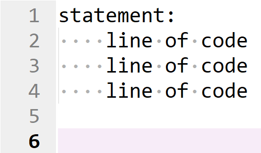
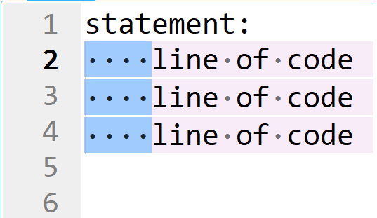
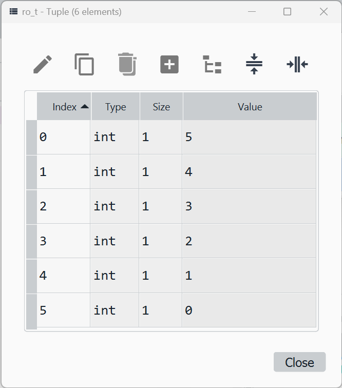

# Code Blocks

This tutorial will look at the use of code blocks in the Python programming language. Code blocks can be used to direct code in response to a condition, repeat an operation multiple times, or handle errors.

## Code Block Spacing

The code block has the following syntax.

```
statement:
    line of code
    line of code
    line of code


```



The statement ends in a colon ```:``` which is used to indicate the beginning of a code block. 


Each line of code belonging to the code block is indented by 4 spaces. Spaces are shown in the image below for clarity:



Usually there are two blank lines left at the end of the code block to make it clear the code block has ended.


```
statement:
    belong in block
    belong in block
    belong in block


outside block
outside block
```

Code blocks can included statements with nested code blocks. Anything belonging to a nested statement is indented twice using 8 spaces (4 spaces for the outer statement and another 4 spaces for the inner statement).

```
statement1:
    belong in block1
    belong in block1
    belong in block1
    statement2:
        belong in block2 within block1
        belong in block2 within block1
        belong in block2 within block1


outside block
outside block
```


## if, elif and else Code Blocks

### if Code Block

The ```if``` code block is carried out in response to a condition. Notice that the print statement is executed for a ```True``` condition:

```
condition = True

if condition:
    print('The condition was True')


```    


When the condition is instead ```False```, the print statement is not executed and the contents of the code block are skipped:

```
condition = False

if condition:
    print('The condition was True')


``` 


A print statement outside the code block can be added. This is carried out after the code block when the condition is ```True```:

```
condition = True

if condition:
    print('The condition was True')


print('Outside the Code Block')
```


When the condition is ```False``` and the code block is skipped, only the print statement outside the code block is carried out:

```
condition = False

if condition:
    print('The condition was True')


print('Outside the Code Block')
```


### Comparison Operators

The six comparison operators are:

|comparison operator|description|
|---|---|
|==|is equal to|
|!=|not equal|
|>|greater than|
|>=|greater than or equal to|
|<|less than|
|<=|less than or equal to|

The previous tutorials examined use of these comparison operators for text data types, numeric data types and collections.

A comparison operator is typically used to specify a condition:

```
condition = 5 > 3
condition

if condition:
    print('The condition was True')
    
    
```


This can be shortened using:

```
if 5 > 3:
    print('The condition was True')
    
    
```    


An ```if``` statement can be configured to examine multiple conditions through the use of the and ```&``` and or ```|``` operators. 

The ```&``` and ```|``` operators take precedence over the comparison operators ```==```, ```!=```, ```>```, ```>=```, ```<``` and ```<=```, so conditions are normally placed in parenthesis:

```
if (5 > 3) & ('a' < 'b'):
    print('The condition was True')
    
    
```


If the parenthesis are removed, the operation ```3 & 'a'``` is attempted which gives a ```TypeError```:


Other conditions can be added, using parenthesis appropriately:

```
if (((5 > 3) & ('a' > 'b')) | (4 == 3)):
    print('The condition was True')
    
    
```


### else Code Block

It is common to setup a code block in response to a ```True``` condition and another code block in response to a ```False``` condition:

```
condition = False

if condition:
    print('The condition was True')
if not condition:
    print('The condition was False')


```


This is typically done shorthand using an associated ```else``` code block:

```
condition = False

if condition:
    print('The condition was True')
else:
    print('The condition was False')

    
```


### elif Code Block

If multiple ```if``` code blocks are used, they are each individually assessed and the ```else``` code block is only associated with the last ```if``` code block. When both conditions are ```True```, the print statements in both ```if``` code blocks are carried out:

```
if 10 > 3:
    print('10 is greater')
if 9 > 3:
    print('9 is greater')
else:
    print('These are not greater')
    
    
```


When the first condition in the first ```if``` code block is ```True```, the print statement in the first code block is carried out. When the condition in the second ```if``` code block is ```False```, the print stement in the associated ```else``` code block is also carried out:

```
if 10 > 9:
    print('10 is greater')
if 9 > 9:
    print('9 is greater')
else:
    print('These are not greater')
    
    
```    


It is common to instead setup a linked else if code block using ```elif```. When conditions are linked, only the **first** code block that has a ```True``` condition is executed. All subsequent code blocks are skipped, regardless if the condition is ```True``` or not, as in the case with the example below:

```
if 10 > 3:
    print('10 is greater')
elif 9 > 3:
    print('9 is greater')
else:
    print('These are not greater')
    
    
```   


The ```else``` code block is linked to all the subsequent code blocks and is only carried out if all conditions specified are ```False```:

```
if 10 > 30:
    print('10 is greater')
elif 9 > 30:
    print('9 is greater')
else:
    print('These are not greater')
    
    
```   


There can be multiple ```elif``` code blocks:

```
num = 2

if num == 0:
    print('zero')
elif num == 1:
    print('one')
elif num == 2:
    print('two')
else:
    print('num not zero, one or two')
    
    
```


## match and case

When a series of code blocks are used to match a variable to ordinal values, like in the case above, it is better to use a ```match``` code block. Each condition in the ```match``` code block is a ```case``` and each ```case``` has its own nested code block. Notice the double indentation of code, indicating it belongs to the corresponding ```case``` code block which in turn belongs to the ```match``` code block. ```case _``` is used to represent any other value of the variable ```num```:

```
num = 2

match num:
    case 0:
        print('zero')
    case 1:
        print('one')
    case 2:
        print('two')
    case _:
        print('num not zero, one or two')
    
    
```


Recall that characters are ordinal and therefore can also be used with ```match```. For example:

```
letter = 'c'

match letter:
    case 'a':
        print(ord('a'))
    case 'b':
        print(ord('b'))
    case 'c':
        print(ord('c'))
    case _:
        print("letter not 'a', 'b' or 'c'")
    

```    


## Nested Code Blocks

The ```match``` code block is a demonstration of a nested code block. It is possible to nest other code blocks:

```
letter = 'a'
num = 1

if letter == 'a':
    if num == 0:
        print("letter == 'a', num == 0")
    elif num == 1:
        print("letter == 'a', num == 1")
    else:
        print("letter == 'a', num != 0")
else:
    print("letter != 'a'")

    
```    


With too much nesting, the code often becomes hard to read. It is generally better to try and branch out the conditions using a single level with the and ```&``` and or ```|``` operators where possible:

```
letter = 'a'
num = 1

if (letter == 'a') & (num == 0):
    print("letter == 'a', num == 0")
elif (letter == 'a') & (num == 1):
    print("letter == 'a', num == 0")
else:
    print("letter != 'a'")    


```


## with Code Block

If the following text file is created:

```
Baa, baa, black sheep,
Have you any wool?
Yes, sir, yes, sir,
Three bags full;
One for my master,
One for my dame,
And one for the little boy
Who lives down the lane.
```

And stored in the same folder as the interactive Python notebook file (or Python script file):


Its contents including whitespace can be viewed in Notepad++:


The file can be opened using the ```open``` function:


The ```open``` function requires a file which can be specified directly when it is in the same folder as the interactive Python notebook file (or Python script file).

The ```mode``` keyword input argument can be specified using a single letter:

|mode|definition|
|---|---|
|'r'|open an existing file and read existing content|
|'w'|open an existing file and write over existing content|
|'a'|open an existing file and append new content|
|'x'|create a new file and write new content|

A second letter can also be used for the encoding. The encoding can be ```'t'``` text (default) which is also known as ```UTF-8``` or ```'b'``` binary which is known as ```'ASCII'```. 

```mode=rt``` for example is the default which reads a text file encoded as text ('ASCII'). 

For other encoding schemes, the ```encoding``` keyword argument is seperately used. For a CSV file created in Microsoft Excel, the ```'UTF-8-Sig'``` encoding needs to be used to properly handle the BOM. The other encoding schemes available were previously discussed in the text data types tutorial. 

|encoding|bit|bytes|byte order|BOM|
|---|---|---|---|---|
|'ASCII'|1|8| |---|
|'Latin1'|1|8| | |
|'UTF-16-LE'|2|16|little endian| |
|'UTF-16-BE'|2|16|big endian| |
|'UTF-16'|2|16| |BOM|
|'UTF-32-LE'|4|32|little endian| |
|'UTF-32-BE'|4|32|big endian| |
|'UTF-32'|4|32| |BOM|
|'UTF-8'|1-4|adaptive|1-4 adaptive| |
|'UTF-8-Sig'|1-4|adaptive|1-4 adaptive|BOM|

The ```newline``` keyword input argument can be used to specify the character that is used to represent a new line. in the example above a carriage return and line feed were shown in Notepad++. In Python the escape characters ```\r\n``` are used to represent this which is the default.

The file can be opened using:

```
file_object = open('text.txt', mode='rt')
file_object
```


A number of identifiers are available from the ```file_object``` and can be viewed by inputting ```file_object.``` followed by a tab ```↹```:


In the example above the mode is set for reading, so ```readline``` can be used to read an individual line and return it as a ```str``` or ```readlines``` can be used to read all lines and return a ```list``` of lines. i.e. each item in the list is a ```str``` corresponding to the line:

```
file_object.readline()
file_object.readlines()
```


Once a file has been worked with, it should be closed:

```
file_object.close()
```


This will release the physical file from Python, allowing it to be used by other programs in Windows. The ```file_object``` will still present in Python but no longer associated to the physical file. If the directory function ```dir``` is used a number of data model identifiers can also be viewed:

```
dir(file_object)
```


There are two data model identifiers of particular interest ```__enter__``` and ```__exit__``` which means the ```file_object``` can be entered and exited using a context manager. 

The context manager is essentially a code block, ```with``` is used to create the code block and has an associated colon ```:```. Instead of assignment to a variable using the assignment operator ```=```, the ```as``` keyword is used. The operations above with a context manager are:

```
with open('text.txt', mode='rt') as file_object:
    first_line = file_object.readline()
    remaining_lines = file_object.readlines()


first_line
remaining_lines    
```


The use of the ```with``` context manager opens, the physical file within the code block using the data model method ```__enter__``` and when the code block ends uses the data model method ```__exit__``` to release the physical file. This prevents a file from being opened in Python and not properly closed and the code is a bit cleaner to read grouping all the operations with that file together.

## The for Loop

The ```for``` loop can be used to carry out operations within a code block *for* a specified number of times.

### Iterator

The for loop requires an iterator which comes from a collection. The following ```str``` can be used to examine the mechanics behind a ```for``` loop:

```
word = 'hello'
'h' in 'hello'
```


The data model identifiers can be viewed using:

```
dir(word)
```


Recall that use of ```in``` in the context above, uses the data model identifier ```__contains__```. There is also the ```__iter__``` data model method which can be used to create an iterator and the ```__len__``` data model method which specifies the number of Unicode characters in the Unicode string.

An iterator can be created using:

```
letter = iter(word)
letter
```


The ```next``` keyword can be used until the iterator is exhausted:

```
next(letter)
next(letter)
next(letter)
next(letter)
next(letter)
```


If the iterator is exhausted, a ```StopIteration``` error displays:

```
next(letter)
```


Recall to exhaust the iterator, ```next``` is called 5 times, which matches the length of the ```word```:

```
len(word)
```


The ```word``` can also be cast into a ```tuple``` and viewed on the Variable Explorer:

```
word_t = tuple(word)
```


If the directory function ```dir``` is used on ```word_t```:

```
dir(word_t)
```


Notice there are also the data model methods ```__contains__```, ```__iter__``` and ```__len__```. This means an iterator can be created. This iterator is a ```tuple``` iterator, where each item can be a Python object. Since this ```tuple``` was cast from a ```str``` each Python object is a one character Unicode ```str```:

```
letter_t = iter(word_t)
letter_t
```


Therefore the following behaves similarly:

```
next(letter_t)
next(letter_t)
next(letter_t)
next(letter_t)
next(letter_t)
```


A ```list``` which is essentially a mutable ```tuple``` behaves similarly. 

The ```word``` can also be cast into a ```set``` and viewed on the Variable Explorer:

```
word_s = set(word)
```


A ```set``` only contains unique values and is not ordered. If the directory function ```dir``` is used on ```word_s```:

```
dir(word_s)
```


The data model methods ```__contains__```, ```__iter__``` and ```__len__``` are still available. An iterator can be created:

```
letter_s = iter(word_s)
letter_s
```


```
next(letter_s)
next(letter_s)
next(letter_s)
next(letter_s)
```


### Iterating using a for Loop

A ```for``` loop can be used to loop over each letter in each of the collections above. Returning to the Unicode string for example:

```
word = 'hello'

for letter in word:
    print(letter)
    
    
```


Under the hood, the ```for``` loop uses the ```__contains__```, ```__iter__``` and ```__len__``` data model methods to loop over each Unicode character in the string ```word```. 

```letter``` is a loop variable which can be accessed in the loop and can be renamed using any variable name. When the variable is not referenced in the ```for``` loop, it is called ```_```. For example:

```
for _ in word:
    print(word)
    
    
```


Notice that ```hello``` is printed out 5 times, because it has a length of 5.

Another example can be given using qa ```tuple``` which recall can be conceptualised as an archive of records:

```
archive = (0, True, 3.14, 'hello')

for record in archive:
    print(record)
    
    
```


It is somewhat common to use a plural term for the collection being looped over and a singular term for the loop variable:

```
records = (0, True, 3.14, 'hello')

for record in records:
    print(record)
    
    
```


### Mutability Issues

Mutable methods such as the ```list``` method ```append``` are commonly used within ```for``` loops. 

Care should be taken not to use a ```for``` loop to iterate over the mutable sequence itself, while mutating the same sequence, as an infinite loop can occur. For example:

```
active = [0, True, 3.14, 'hello']

for record in active:
    active.append('bye')
    
    
```


To exit an infinite loop, restart the Kernel in JupyterLab (and clear all outputs). In Spyder use the keyboard shortcut ```Ctrl``` + ```c```.

Instead a copy of the mutable sequence can be made to loop over, for example: 

```
active = [0, True, 3.14, 'hello']

for record in active.copy():
    active.append('bye')
    

active    
```   


### The range class

A ```range``` object is commonly used within a loop. For example:

```
active = [0, True, 3.14, 'hello']

for num in range(len(active)):
    active.append('bye')
    
    
active
```


This essentially gives access to the numeric index of the Unicode string being looped over:

```
active = [0, True, 3.14, 'hello']

for num in range(len(active)):
    active.append('bye')
    print(num, active)
    
    
```


This can be used for the purposes of indexing:

```
word = 'hello'

for num in range(len(word)):
    print(word[num])


```


Note that the above is not as readible as:

```
word = 'hello'

for letter in word:
    print(letter)


```


Howeveer having access to the index is sometimes useful for other purposes. For example string replication can be carried out using multiplication of the index:

```
word = 'hello'

for num in range(len(word)):
    print(num * word[num])


```


Or alternatively the index can be printed alongside the character:

```
word = 'hello'

for num in range(len(word)):
    print(num, word[num])


```


A ```range``` object has been created from the length of a collection. The docstring of the init signature of the ```range``` class can be examined by inputting ```range()``` and pressing shift ```⇧``` and tab ```↹```:


A ```range``` object uses zero-order indexing and increments in integer steps of ```1``` up to but excluding the integer ```stop``` value. It has consistency to the ```slice``` object which was examined when indexing collections. If only an integer ```stop``` value is specified:

```
ro = range(5)
ro
```


The integer ```start``` will assumed to be ```0```. The range object ```ro``` can be cast into a ```tuple``` and examined in the Variable Explorer:

```
ro_t = tuple(ro)
```


Notice in this scenario, the index and value of the ```tuple``` match:


If a non-zero ```start``` value is also supplied. For example:

```
ro = range(1, 5)
ro
ro_t = tuple(ro)
```


Notice in this scenario, the index and value of the ```tuple``` do not match:


Finally an integer ```step``` can be specified. When an integer ```step``` is specified, the integer ```start``` needs to also be specified even if it is ```0```:

```
ro = range(0, 6, 2)
ro
ro_t = tuple(ro)
```


Notice that once again zero-order indexing is used, going up to but not including the ```stop``` value of ```6```:


Zero-order indexing needs to be addressed when using negative values. For example beginning at a negative value and counting up until ```0``` requires a ```stop``` value ```1``` past ```0``` which is ```1```:

```
ro = range(-5, 1, 1)
ro
ro_t = tuple(ro)
```


Or using a negative step of ```-1``` to count down from a positive integer value to ```0```, requires a ```stop``` value ```-1``` past ```0``` which is ```-1```:

```
ro = range(5, -1, -1)
ro
ro_t = tuple(ro)
```




To check your understanding, create the following ```range``` objects:


### Dictionary Keys

Recall that a dictionary has the form:

```
mapping = {'red': '#FF0000', 
           'green': '#00B050', 
           'blue': '#0070C0'}
```


This can be viewed in the Variable Explorer. Recall that a dictionary has keys mapped to values:


The data model identifiers can be viewed using:

```
dir(mapping)
```


Notice the data model identifiers ```__contains__```, ```__iter__``` and ```__len__```. If an iterator is created from a dictionary, it examines the keys:

```
keys = iter(mapping)
keys
next(keys)
next(keys)
next(keys)
```


This means that using a ```for``` loop on a dictionary iterates over the keys:

```
for key in mapping:
    print(key)
    
    
```


Recall that the value can be retrieved via indexing with the key.

```
for key in mapping:
    print(mapping[key])
    
    
```


Recall that the dictionary has the three identifiers ```keys```, ```values``` and ```items```:

```
mapping.keys()
mapping.values()
mapping.items()
```


These are all iterable. ```keys``` are not normally explicitly used as it is the same as iterating using a dicitonary directly:

```
for key in mapping.keys():
    print(key)
    
    
```


```values``` are also not normally explicitly used as it is relatively easy to index into the dictionary using a key as seen before:

```
for value in mapping.values():
    print(value)
    
    
```


Each item in ```items``` is a ```tuple``` of the form ```(key, value)```. This ```tuple``` can be accessed:

```
for (key, value) in mapping.items():
    print(key, value)
    
    
```


This is normally simplified using ```tuple``` unpacking:

```
for key, value in mapping.items():
    print(key, value)
    
    
```


### The enumerate class

Using the dictionary identifier ```items``` gives an iterable that cotnains a ```tuple``` of the form ```(key, value)```:


For another collection such as the string ```word``` which was ```'hello'``` a numeric index is used opposed to a key and the value is the corresponding Unicode character. This was seen in more detail when this was cast to the tuple ```word_t```:


Using ```range``` on the length of the collection, gave a ```range``` object that was associated with the numeric index. This was examined earlier and it was seen, that the value could be retrieved by indexing into the collection.

To get both the index and value however, an ```enumerate``` object can be created:

```
word_t = tuple('hello')
enumerate(word_t)
```


If this ```enumerate``` object is cast into a ```list```, notice that it has a similar form to the dictionary ```items```.

```
list(enumerate(word_t))
mapping.items()
```


Casting into a ```list``` opposed to a ```tuple``` clearly distinguishes the inner and outer brackets.

The ```enumerate``` object can be looped over to get the index and the value at the index, analogously to the key and the value at the key for a dictionary:

```
word = 'hello'

for index, letter in enumerate(word):
    print(index, letter)
    
    
```


## The while Loop

The ```while``` loop can be conceptualised as an ```if``` code block that is continually repeated *while* a condition is ```True```. Note when the condition is never updated in the code block, the ```while``` loop will never exit resulting in an infinite loop. 

```
while True:
    print('no changes')
    
    
```


To exit an infinite loop, restart the Kernel in JupyterLab (and clear all outputs). In Spyder use the keyboard shortcut ```Ctrl``` + ```c```.

A variable can be initialised before entering a ```while``` loop. This variable is examined in the ```while``` loops condition and code within the ```while``` loop updates the value of this variable. Eventually the value of the variable will be updated to a value which makes the condition of the ```while``` loop untrue and therefore exists the ```while``` loop. For example:

```
loop_var = 0
print(f'loop_var = {loop_var}')

while loop_var < 5:
    print(f'\tloop_var = {loop_var}')
    loop_var += 1
    
    
print(f'loop_var = {loop_var}')
```


The initial unindented print statement shows the initial value of ```loop_var``` before the ```while``` loop. 

The indented print statements shows the value of ```loop_var``` when the ```while``` condition is checked. For each of these values, the condition ```loop_var < 5``` is ```True``` and the value ```loop_var``` is incremented.

The final unindented print statement shows the final value of ```5```. This value was incremented from ```4``` in the last iteration of the ```while``` loop. For this value of ```5```, the condition of the ```while``` loop ```loop_var < 5``` was ```False``` and therefore the ```while``` loop exited. 

While loops are often used when interacting with hardware. An example is using the ```input``` function which waits for a response from a user that has to interact with a keyboard:

```
user_message = input('Input some text: ')
```

Under the hood, this uses a ```while``` loop and the Kernel will hang until a user optionally inputs some text in the box and presses enter ```↵```:


A ```while``` loop can be used in place of any ```for``` loop although the syntax may not be as elegant. Compare the following for example:

```
index = 0

while index < len('hello'):
    print('hello'[index])
    index += 1


```


```
for letter in 'hello':
    print(letter)


```


A ```for``` loop cannot replace, all occurances of a ```while``` loop. In the above scenario for example, *while* waiting for user input there is no specified duration to wait for the user to input text. The user can input text quickly, slowly or not at all (resulting in an infinite loop). 

```while``` loops are often employed in sensor feedback mechanisms. A central heating system may use a ```while``` loop to turn on a heater *while* the temperature is below a set point measured by a temperature sensor. It may also use a ```while``` loop to turn on air conditioning *while* the temperature is above the same set point. Both of these ```while``` loops may be contained within an infinite ```while``` loop which runs continuously to maintain the temperature.

## Comprehensions

Supposing the following tuple is created:

```
nums = (0, 1, 2, 3, 4)
```


Supposing each number is to be doubled. Recall that multiplication of a collection by a scalar replicates the collection and therefore a for loop has to be made, so each number in num can be doubled.

For example:

```
for num in nums:
    print(2 * num)


```


Instead of printing the doubled values, each value can be appended to a mutable collection such as a ```list```. The collection needs to be mutable so the ```list``` identifier ```append``` can be used within the ```for``` loop:

```
nums = (0, 1, 2, 3, 4)
doubled_nums = []

for num in nums:
    doubled_nums.append(2 * num)
    
    
doubled_nums
```


And for clarity, a ```print``` statement can be added to the ```for``` loops code block to view ```doubled_nums``` during each iteration of the ```for``` loop.

```
nums = (0, 1, 2, 3, 4)
doubled_nums = []

for num in nums:
    doubled_nums.append(2 * num)
    print(doubled_nums)
    
    
doubled_nums
```


The following lines of code and the code block can be collapsed down into a single line using list comprehension: 

```
doubled_nums = []
for num in nums:
    doubled_nums.append(2 * num)


```


```
doubled_nums = [2 * num for num in nums]
```

list comprehension is typically used to create an output list from interaction with a collection via a for loop. The square brackets ```[]``` enclose the list and the list is assigned to the object name ```doubled_nums``` using the assignment operator ```=```:


To the left hand side, the expression supplied to the ```list``` identifier ```append``` is used:


To the right hand side the ```for``` loop is added. Note as the list comprehension has no code block there is no colon:


list comprehension can also include a condition.

```
doubled_even_nums = [2 * num for num in nums if num % 2 == 0]

doubled_even_nums
```


When the condition has an associated ```else```, the expression when the condition is ```True``` is specified, followed by the expression when the condition is ```False```. ```elif``` is not supported for list comprehension and code blocks should be used when multiple conditions are examined:

```
nums = (0, 1, 2, 3, 4)

parity = ['even' if num % 2 == 0 else 'odd' for num in nums] 

parity
```


If the square brackets ```[ ]``` are replaced by parenthesis ```( )```:

```
nums = (0, 1, 2, 3, 4)

double_nums = (num * 2 for num in nums)
double_nums
```


A generator is essentially an iterator that carries out an expression. In this case the expression ```2 * num``` for each ```num``` in ```nums``` when ```next``` is used:

```
next(double_nums)
next(double_nums)
next(double_nums)
next(double_nums)
next(double_nums)
```


If the generator is exhausted, a ```StopIteration``` error displays:


If the square brackets ```[ ]``` are replaced by braces ```{ }```, a dictionary comprehension is used. Recall a dictionary has ```key: value``` pairs. The expression for the keys and the expression for the values is seperated out. 

For example if the following list of ```colors``` is created: 

```
colors = ['red', 'green', 'blue']
```

A ```mapping``` which takes the first letter in the ```color``` as the key and the full ```color``` as the value can be created using:

```
mapping = {color[0]: color for color in colors}
```


The key expression is highlighted:


This can be used in a list comprehension to get the keys:

```
keys = [color[0] for color in colors]
```


The colon ```:``` is highlighted. The colon in the dictionary seperates, the key expression from the value expression:


The value expression is highlighted:


This can be used in a list comprehension to get the values. In this case, ```values``` is essentially a copy of the original list:

```
values = [color for color in colors]
```


Dictionary comprehensions can also have a condition. If the one letter keys are looped through, the ordinal value of the key can be examined:

```
for key in keys:
    print(ord(key))
    
    
```


This can be used to produce a dictionary of only the keys that have a positive ordinal value:

```
mapping = {color[0]: color for color in colors if ord(color[0]) % 2 == 0}
```

As the dictionary comprehension is quite long, it is easier to read if it is split over multiple lines:

```
mapping = {color[0]: 
           color 
           for color in colors
           if ord(color[0]) % 2 == 0}
```

The first line is the key. The second line is the value. The third line is the iterable being looped over and the third line is the expression.


The dictionary comprehension can also use an ```if``` and ```else``` expression. These statements can be set for both the keys and the values as shown in the example below. The if condition takes the first letter of the color for the key and the color for the value when the ordinal value of the first letter is even. The else condition takes the last letter of the color for the key and reverses the color for the value:

```
mapping = {color[0] if ord(color[0]) % 2 == 0 else color[-1]: 
           color if ord(color[0]) % 2 == 0 else color[::-1]
           for color in colors}
```


It is quite common to keep all keys and use only a condition for the values:

```
mapping = {color[0]: 
           color if ord(color[0]) % 2 == 0 else color[::-1]
           for color in colors}
```


A dictionary comprehension can use the ```items``` identifier of an existing dictionary giving access to the original dictionaries keys and values using tuple unpacking. For example, supposing the following dictionary of ```fruits``` is made:

```
fruits = {'apples': 2, 'bananas': 3, 'carrots': 5}
```

A dictionary ```fruits2``` which has the same keys and doubles the numeric values can be created using:

```
fruits2 = {key: 
           2 * value 
           for key, value in fruits.items()}
```


And in such a scenario it is common to include all keys and update the value in response to a condition. For example, the value can be doubled if it is odd and left alone if it is even. This creates a dictionary of even values:

```
fruits3 = {key: 
           2 * value if value % 2 == 1 else value 
           for key, value in fruits.items()}
```


## Functions


ord

print


return

yield


def incrementer():
    num = 0
    while True:
        yield num
        num += 1


map and filter


Demonstrate use of a debugger in a for loop.

try, except, else and finally update.


## try, except, else, finally

Earlier we seen the use of if, elif and else statements to carry out different code blocks in response to a condition or conditions. In Python we have a similar structure setup for handling errors.

|Code Block|Purpose|
|---|---|
|try|This code block will test the code for an expected error|
|except|This code block will be used to handle an error type|
|else|This code block will be used elsewise when there is no error|
|finally|This code block is carried out regardless if there is an error or not|

If the variable number is created and assigned to a string. Casting will work, if the string is recognised as numeric.

```
number = "5"
float(number)
```


However a "ValueError" will be given when the string is not recognised as numeric.

```
number = "five"
float(number)
```


The following code blocks can be setup in response to the ```number``` variable above. Normally these would be setup with a function and the variable ```number``` would be an input argument of the function. However for clarity these are shown outwith a function and functions will be discussed in the next tutorial.

```
try:
    float(number)
except ValueError:
    print("invalid number, number set to 0")
    number = 0
else:
    number = float(number)
finally:
    value = number + 1
```

When the ```try``` code block does not find an error, the code in the ```else``` code block and the ```finally``` code blocks are carried out.


When the ```try``` code block does find a ```ValueError```, the code in the ```except ValueError``` code block and the ```finally``` code blocks are carried out.


[Home Python Tutorials](https://github.com/PhilipYip1988/python-tutorials/blob/main/readme.md)
