# Programming Constructs with Code Blocks

This tutorial will look at the use of code blocks in the Python programming language. Code blocks can be used to direct code in response to a condition, repeat an operation multiple times, or to handle errors. They are also used to create custom functions.

## Code Block Spacing

The code block has the following syntax.

```
statement:
    line of code
    line of code
    line of code


```

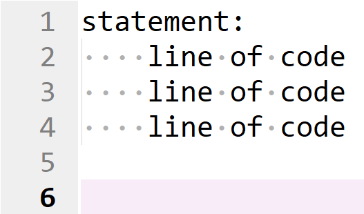

The statement ends in a colon ```:``` which is used to indicate the beginning of a code block. 


Each line of code belonging to the code block is indented by 4 spaces. Spaces are shown in the image below for clarity:

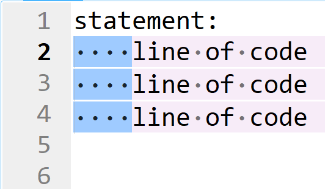

Usually there are two blank lines left at the end of the code block to make it clear the code block has ended.

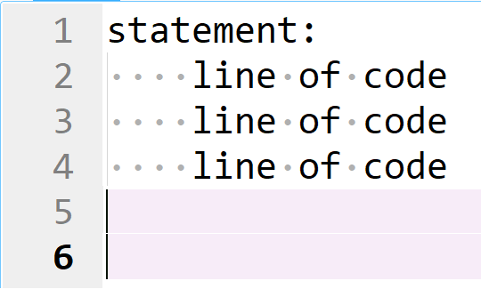

```
statement:
    belong in block
    belong in block
    belong in block


outside block
outside block
```

Code blocks can included statements with nested code blocks. Anything belonging to a nested statement is indented twice using 8 spaces (4 spaces for the outer statement and another 4 spaces for the inner statement).

```
statement1:
    belong in block1
    belong in block1
    belong in block1
    statement2:
        belong in block2 within block1
        belong in block2 within block1
        belong in block2 within block1


outside block
outside block
```

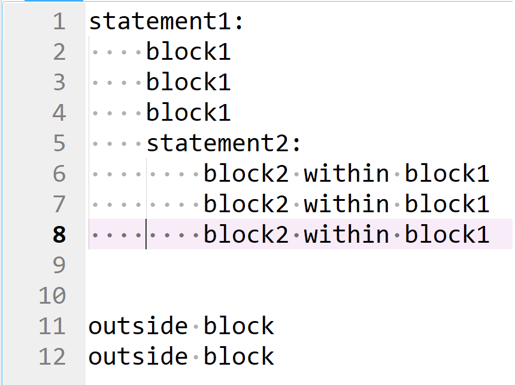

## if, elif and else Code Blocks

### if Code Block

The ```if``` code block is carried out in response to a condition. Notice that the print statement is executed for a ```True``` condition:

```
condition = True

if condition:
    print('The condition was True')


```    

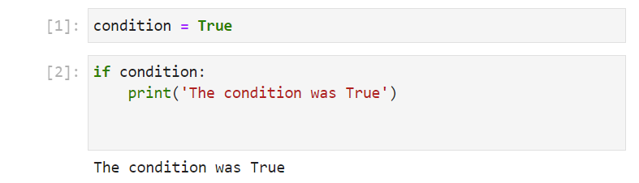

When the condition is instead ```False```, the print statement is not executed and the contents of the code block are skipped:

```
condition = False

if condition:
    print('The condition was True')


``` 

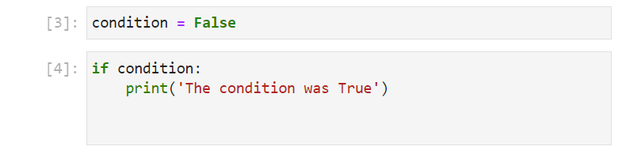

A print statement outside the code block can be added. This is carried out after the code block when the condition is ```True```:

```
condition = True

if condition:
    print('The condition was True')


print('Outside the Code Block')
```

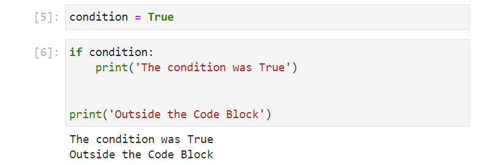

When the condition is ```False``` and the code block is skipped, only the print statement outside the code block is carried out:

```
condition = False

if condition:
    print('The condition was True')


print('Outside the Code Block')
```

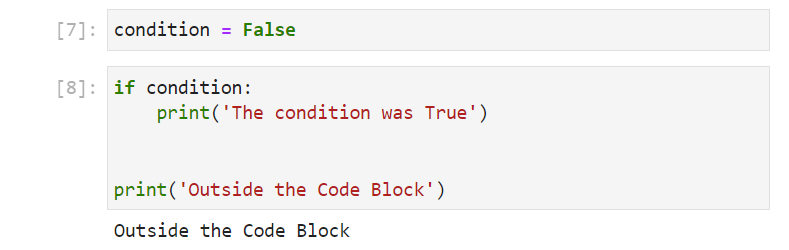

### Comparison Operators

The six comparison operators are:

|comparison operator|description|
|---|---|
|==|is equal to|
|!=|not equal|
|>|greater than|
|>=|greater than or equal to|
|<|less than|
|<=|less than or equal to|

The previous tutorials examined use of these comparison operators for text data types, numeric data types and collections.

A comparison operator is typically used to specify a condition:

```
condition = 5 > 3
condition

if condition:
    print('The condition was True')
    
    
```

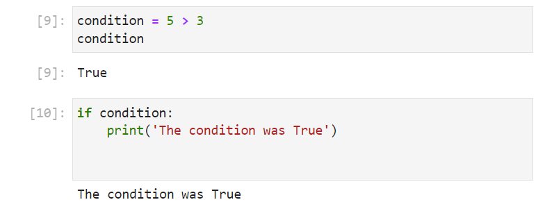

This can be shortened using:

```
if 5 > 3:
    print('The condition was True')
    
    
```    

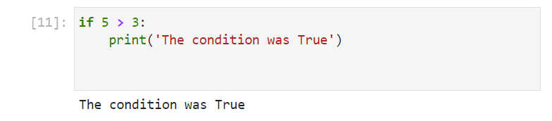

An ```if``` statement can be configured to examine multiple conditions through the use of the and ```&``` and or ```|``` operators. 

The ```&``` and ```|``` operators take precedence over the comparison operators ```==```, ```!=```, ```>```, ```>=```, ```<``` and ```<=```, so conditions are normally placed in parenthesis:

```
if (5 > 3) & ('a' < 'b'):
    print('The condition was True')
    
    
```

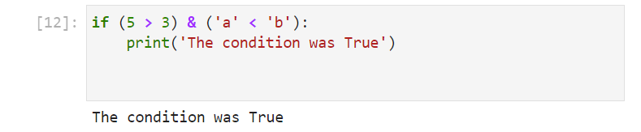

If the parenthesis are removed, the operation ```3 & 'a'``` is attempted which gives a ```TypeError```:

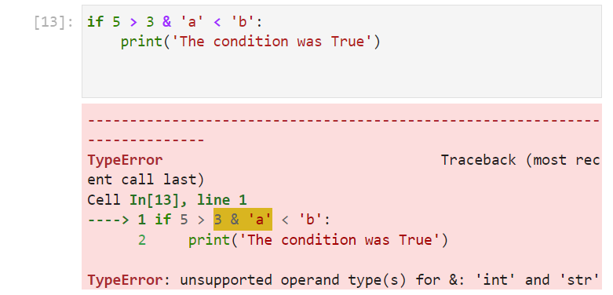

Other conditions can be added, using parenthesis appropriately:

```
if (((5 > 3) & ('a' > 'b')) | (4 == 3)):
    print('The condition was True')
    
    
```

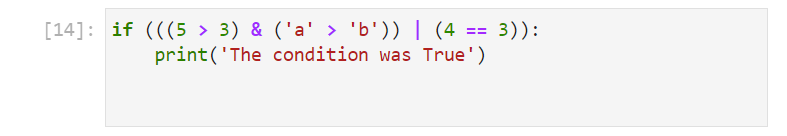

### else Code Block

It is common to setup a code block in response to a ```True``` condition and another code block in response to a ```False``` condition:

```
condition = False

if condition:
    print('The condition was True')
if not condition:
    print('The condition was False')


```

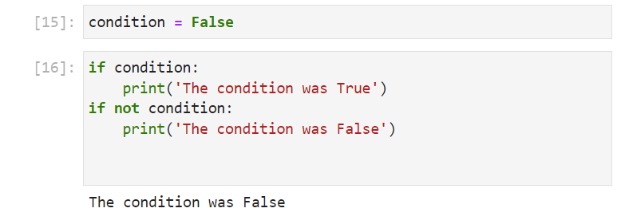

This is typically done shorthand using an associated ```else``` code block:

```
condition = False

if condition:
    print('The condition was True')
else:
    print('The condition was False')

    
```

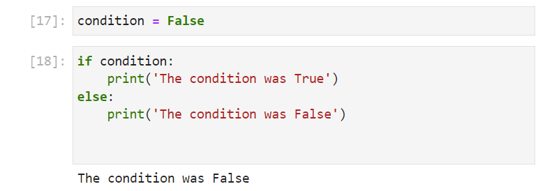

### elif Code Block

If multiple ```if``` code blocks are used, they are each individually assessed and the ```else``` code block is only associated with the last ```if``` code block. When both conditions are ```True```, the print statements in both ```if``` code blocks are carried out:

```
if 10 > 3:
    print('10 is greater')
if 9 > 3:
    print('9 is greater')
else:
    print('These are not greater')
    
    
```

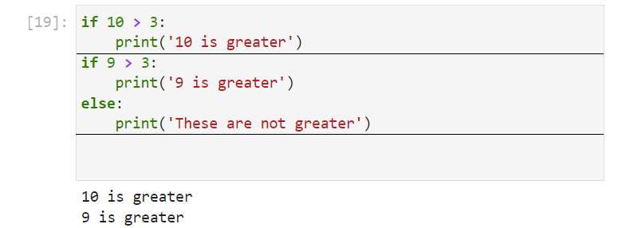

When the first condition in the first ```if``` code block is ```True```, the print statement in the first code block is carried out. When the condition in the second ```if``` code block is ```False```, the print stement in the associated ```else``` code block is also carried out:

```
if 10 > 9:
    print('10 is greater')
if 9 > 9:
    print('9 is greater')
else:
    print('These are not greater')
    
    
```    

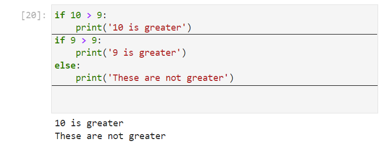

It is common to instead setup a linked else if code block using ```elif```. When conditions are linked, only the **first** code block that has a ```True``` condition is executed. All subsequent code blocks are skipped, regardless if the condition is ```True``` or not, as in the case with the example below:

```
if 10 > 3:
    print('10 is greater')
elif 9 > 3:
    print('9 is greater')
else:
    print('These are not greater')
    
    
```   

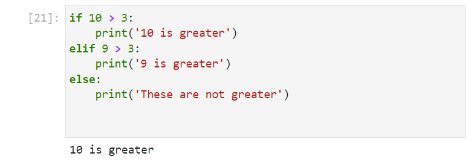

The ```else``` code block is linked to all the subsequent code blocks and is only carried out if all conditions specified are ```False```:

```
if 10 > 30:
    print('10 is greater')
elif 9 > 30:
    print('9 is greater')
else:
    print('These are not greater')
    
    
```   

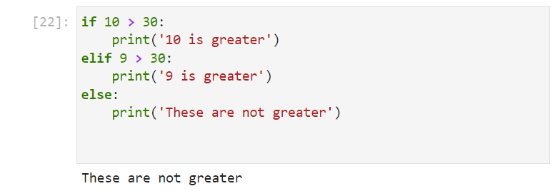

There can be multiple ```elif``` code blocks:

```
num = 2

if num == 0:
    print('zero')
elif num == 1:
    print('one')
elif num == 2:
    print('two')
else:
    print('num not zero, one or two')
    
    
```

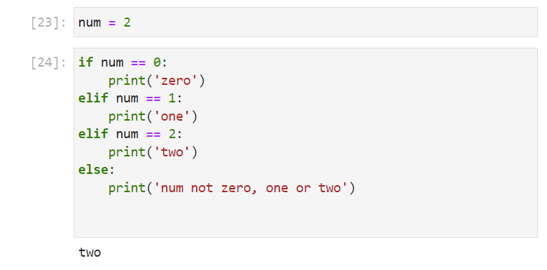

## The match Code Block with Nested case Code Blocks

When a series of code blocks are used to match a variable to ordinal values, like in the case above, it is better to use a ```match``` code block. Each condition in the ```match``` code block is a ```case``` and each ```case``` has its own nested code block. Notice the double indentation of code, indicating it belongs to the corresponding ```case``` code block which in turn belongs to the ```match``` code block. ```case _``` is used to represent any other value of the variable ```num```:

```
num = 2

match num:
    case 0:
        print('zero')
    case 1:
        print('one')
    case 2:
        print('two')
    case _:
        print('num not zero, one or two')
    
    
```

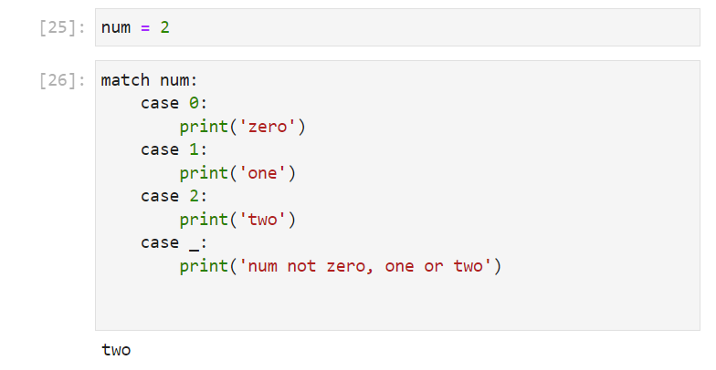

Recall that characters are ordinal and therefore can also be used with ```match```. For example:

```
letter = 'c'

match letter:
    case 'a':
        print(ord('a'))
    case 'b':
        print(ord('b'))
    case 'c':
        print(ord('c'))
    case _:
        print("letter not 'a', 'b' or 'c'")
    

```    

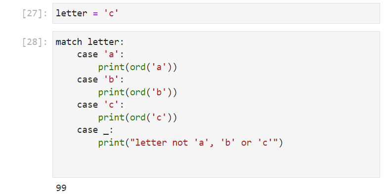

## Nested Code Blocks

The ```match``` code block is a demonstration of a nested code block. It is possible to nest other code blocks:

```
letter = 'a'
num = 1

if letter == 'a':
    if num == 0:
        print("letter == 'a', num == 0")
    elif num == 1:
        print("letter == 'a', num == 1")
    else:
        print("letter == 'a', num != 0")
else:
    print("letter != 'a'")

    
```    

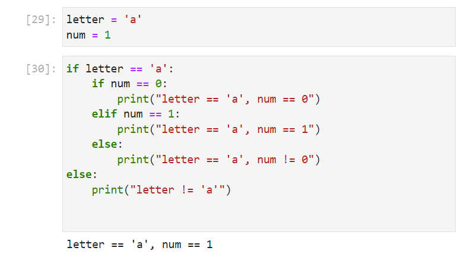

With too much nesting, the code often becomes hard to read. It is generally better to try and branch out the conditions using a single level with the and ```&``` and or ```|``` operators where possible:

```
letter = 'a'
num = 1

if (letter == 'a') & (num == 0):
    print("letter == 'a', num == 0")
elif (letter == 'a') & (num == 1):
    print("letter == 'a', num == 0")
else:
    print("letter != 'a'")    


```

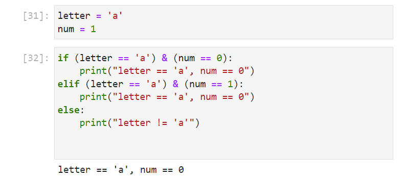

## with Code Block

If the following text file is created:

```
Baa, baa, black sheep,
Have you any wool?
Yes, sir, yes, sir,
Three bags full;
One for my master,
One for my dame,
And one for the little boy
Who lives down the lane.
```

And stored in the same folder as the interactive Python notebook file (or Python script file):

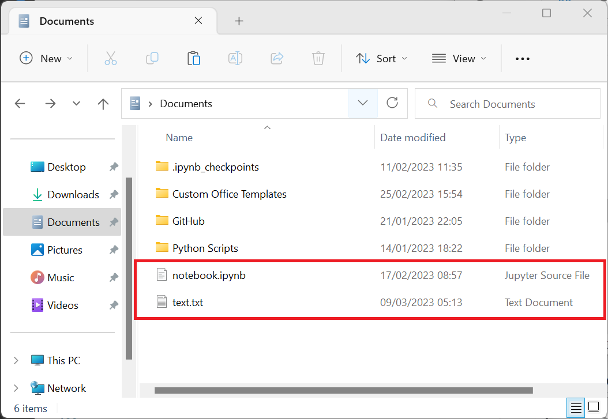

Its contents including whitespace can be viewed in Notepad++:

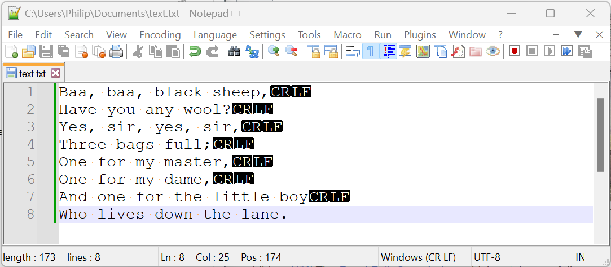

The file can be opened using the ```open``` function:

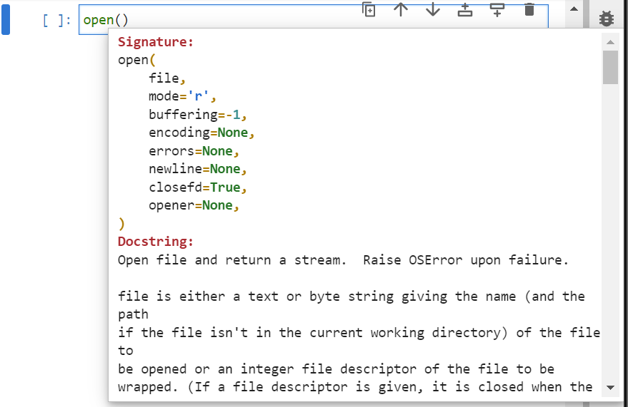

The ```open``` function requires a file which can be specified directly when it is in the same folder as the interactive Python notebook file (or Python script file).

The ```mode``` keyword input argument can be specified using a single letter:

|mode|definition|
|---|---|
|'r'|open an existing file and read existing content|
|'w'|open an existing file and write over existing content|
|'a'|open an existing file and append new content|
|'x'|create a new file and write new content|

A second letter can also be used for the encoding. The encoding can be ```'t'``` text (default) which is also known as ```UTF-8``` or ```'b'``` binary which is known as ```'ASCII'```. 

```mode=rt``` for example is the default which reads a text file encoded as text ('ASCII'). 

For other encoding schemes, the ```encoding``` keyword argument is seperately used. For a CSV file created in Microsoft Excel, the ```'UTF-8-Sig'``` encoding needs to be used to properly handle the BOM. The other encoding schemes available were previously discussed in the text data types tutorial. 

|encoding|bit|bytes|byte order|BOM|
|---|---|---|---|---|
|'ASCII'|1|8| |---|
|'Latin1'|1|8| | |
|'UTF-16-LE'|2|16|little endian| |
|'UTF-16-BE'|2|16|big endian| |
|'UTF-16'|2|16| |BOM|
|'UTF-32-LE'|4|32|little endian| |
|'UTF-32-BE'|4|32|big endian| |
|'UTF-32'|4|32| |BOM|
|'UTF-8'|1-4|adaptive|1-4 adaptive| |
|'UTF-8-Sig'|1-4|adaptive|1-4 adaptive|BOM|

The ```newline``` keyword input argument can be used to specify the character that is used to represent a new line. in the example above a carriage return and line feed were shown in Notepad++. In Python the escape characters ```\r\n``` are used to represent this which is the default.

The file can be opened using:

```
file_object = open('text.txt', mode='rt')
file_object
```

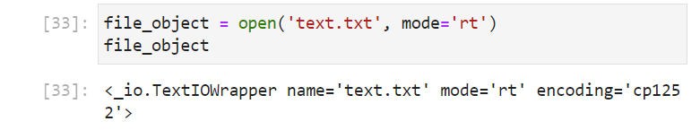

A number of identifiers are available from the ```file_object``` and can be viewed by inputting ```file_object.``` followed by a tab ```↹```:

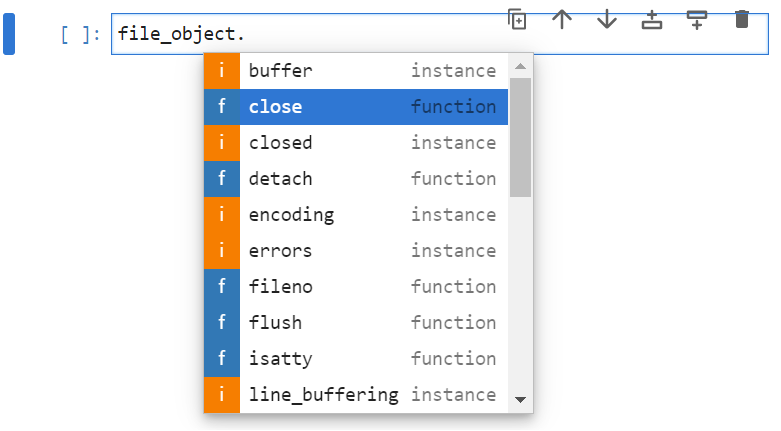

In the example above the mode is set for reading, so ```readline``` can be used to read an individual line and return it as a ```str``` or ```readlines``` can be used to read all lines and return a ```list``` of lines. i.e. each item in the list is a ```str``` corresponding to the line:

```
file_object.readline()
file_object.readlines()
```

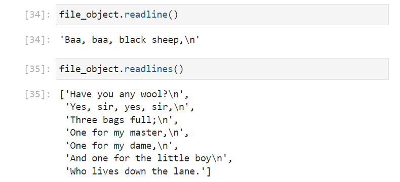

Once a file has been worked with, it should be closed:

```
file_object.close()
```


This will release the physical file from Python, allowing it to be used by other programs in Windows. The ```file_object``` will still present in Python but no longer associated to the physical file. If the directory function ```dir``` is used a number of data model identifiers can also be viewed:

```
dir(file_object)
```

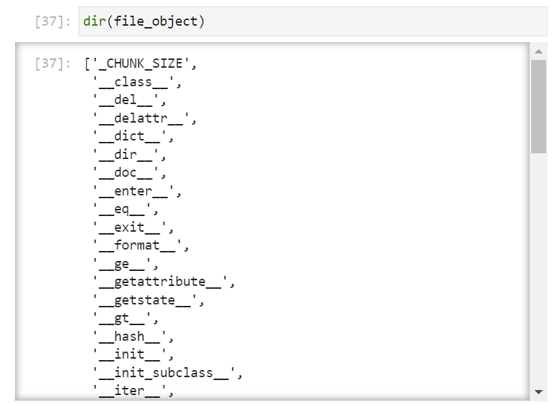

There are two data model identifiers of particular interest ```__enter__``` and ```__exit__``` which means the ```file_object``` can be entered and exited using a context manager. 

The context manager is essentially a code block, ```with``` is used to create the code block and has an associated colon ```:```. Instead of assignment to a variable using the assignment operator ```=```, the ```as``` keyword is used. The operations above with a context manager are:

```
with open('text.txt', mode='rt') as file_object:
    first_line = file_object.readline()
    remaining_lines = file_object.readlines()


first_line
remaining_lines    
```

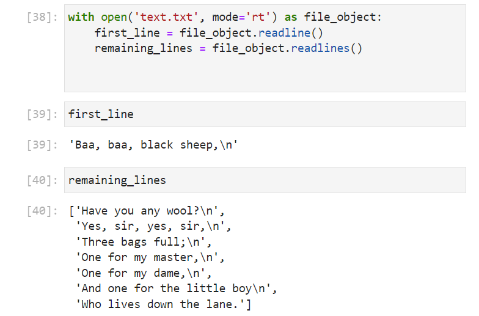

The use of the ```with``` context manager opens, the physical file within the code block using the data model method ```__enter__``` and when the code block ends uses the data model method ```__exit__``` to release the physical file. This prevents a file from being opened in Python and not properly closed and the code is a bit cleaner to read grouping all the operations with that file together.

## The for Loop

The ```for``` loop can be used to carry out operations within a code block *for* a specified number of times.

### Iterator

The for loop requires an iterator which comes from a collection. The following ```str``` can be used to examine the mechanics behind a ```for``` loop:

```
word = 'hello'
'h' in 'hello'
```

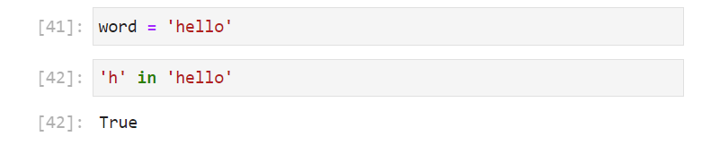

The data model identifiers can be viewed using:

```
dir(word)
```

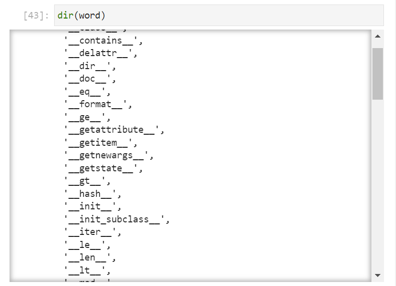

Recall that use of ```in``` in the context above, uses the data model identifier ```__contains__```. There is also the ```__iter__``` data model method which can be used to create an iterator and the ```__len__``` data model method which specifies the number of Unicode characters in the Unicode string.

An iterator can be created using:

```
letter = iter(word)
letter
```

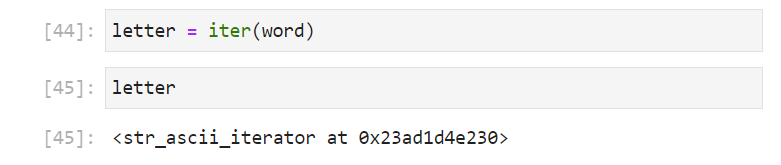

The ```next``` keyword can be used until the iterator is exhausted:

```
next(letter)
next(letter)
next(letter)
next(letter)
next(letter)
```

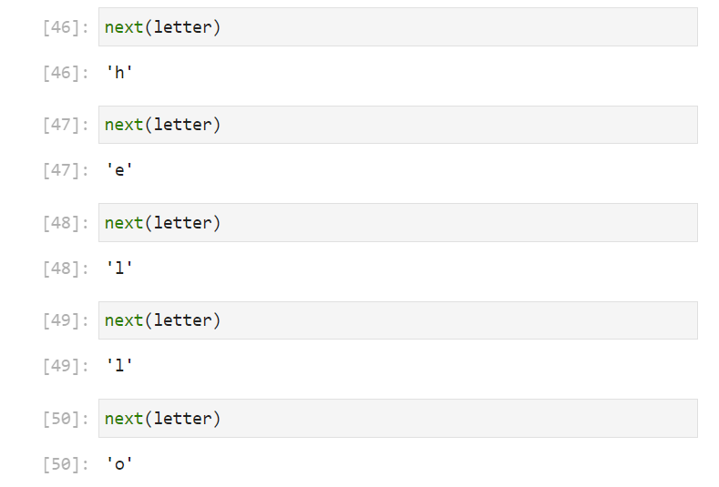

If the iterator is exhausted, a ```StopIteration``` error displays:

```
next(letter)
```

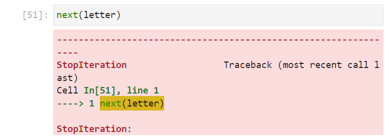

Recall to exhaust the iterator, ```next``` is called 5 times, which matches the length of the ```word```:

```
len(word)
```

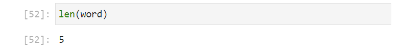

The ```word``` can also be cast into a ```tuple``` and viewed on the Variable Explorer:

```
word_t = tuple(word)
```


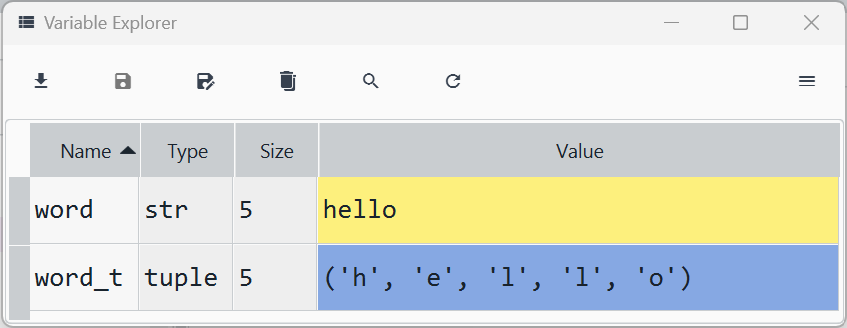


If the directory function ```dir``` is used on ```word_t```:

```
dir(word_t)
```

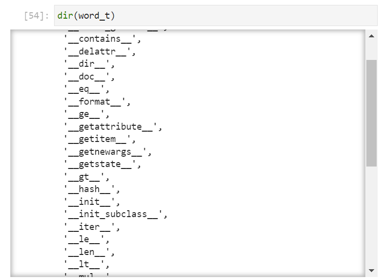

Notice there are also the data model methods ```__contains__```, ```__iter__``` and ```__len__```. This means an iterator can be created. This iterator is a ```tuple``` iterator, where each item can be a Python object. Since this ```tuple``` was cast from a ```str``` each Python object is a one character Unicode ```str```:

```
letter_t = iter(word_t)
letter_t
```

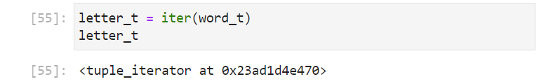

Therefore the following behaves similarly:

```
next(letter_t)
next(letter_t)
next(letter_t)
next(letter_t)
next(letter_t)
```

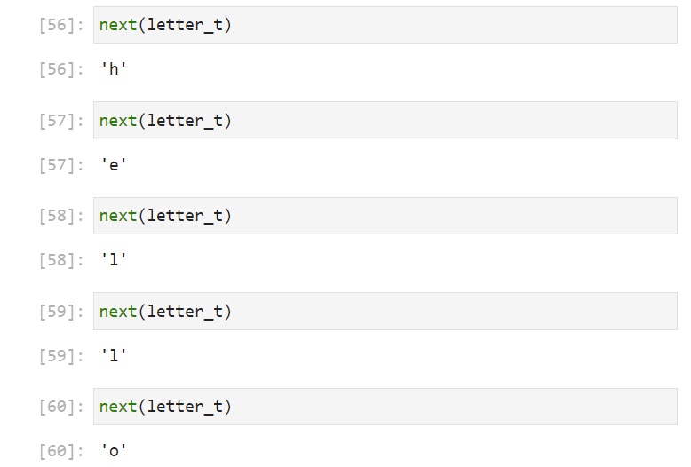

A ```list``` which is essentially a mutable ```tuple``` behaves similarly. 

The ```word``` can also be cast into a ```set``` and viewed on the Variable Explorer:

```
word_s = set(word)
```


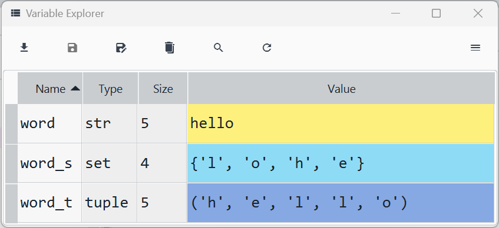

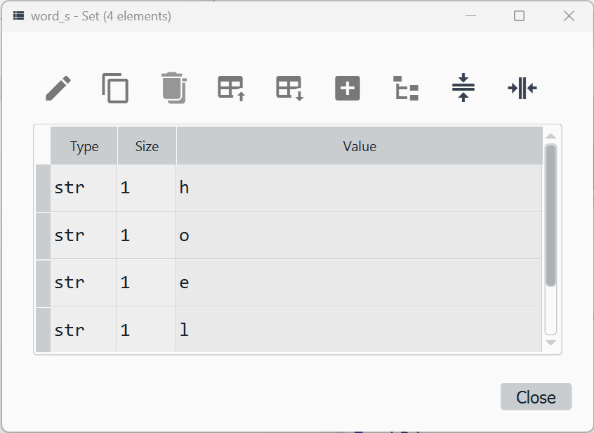

A ```set``` only contains unique values and is not ordered. If the directory function ```dir``` is used on ```word_s```:

```
dir(word_s)
```

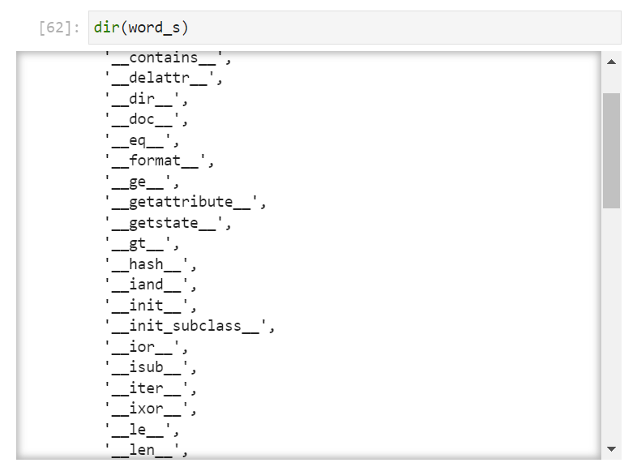

The data model methods ```__contains__```, ```__iter__``` and ```__len__``` are still available. An iterator can be created:

```
letter_s = iter(word_s)
letter_s
```

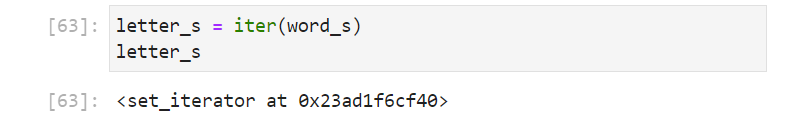

```
next(letter_s)
next(letter_s)
next(letter_s)
next(letter_s)
```

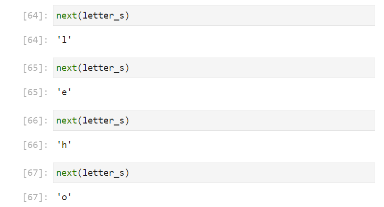

### Iterating using a for Loop

A ```for``` loop can be used to loop over each letter in each of the collections above. Returning to the Unicode string for example:

```
word = 'hello'

for letter in word:
    print(letter)
    
    
```

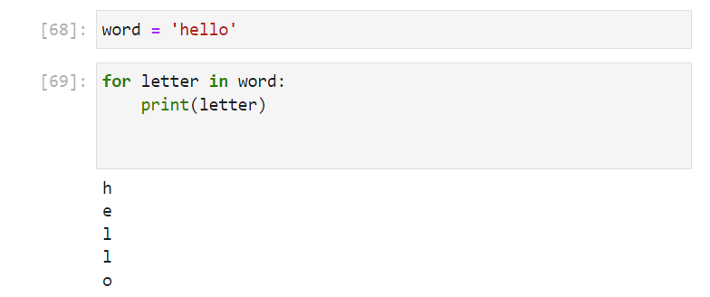

Under the hood, the ```for``` loop uses the ```__contains__```, ```__iter__``` and ```__len__``` data model methods to loop over each Unicode character in the string ```word```. 

```letter``` is a loop variable which can be accessed in the loop and can be renamed using any variable name. When the variable is not referenced in the ```for``` loop, it is called ```_```. For example:

```
for _ in word:
    print(word)
    
    
```

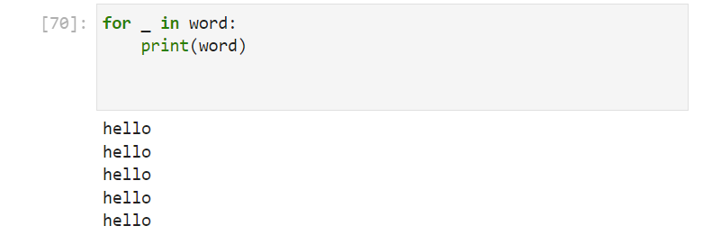

Notice that ```hello``` is printed out 5 times, because it has a length of 5.

Another example can be given using a ```tuple``` which recall can be conceptualised as an archive of records:

```
archive = (0, True, 3.14, 'hello')

for record in archive:
    print(record)
    
    
```

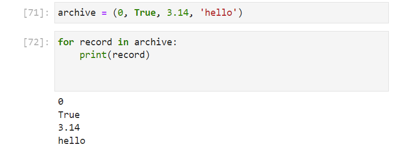

It is somewhat common to use a plural term for the collection being looped over and a singular term for the loop variable:

```
records = (0, True, 3.14, 'hello')

for record in records:
    print(record)
    
    
```

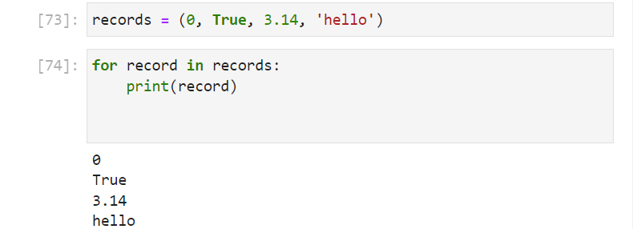

### Mutability Issues

Mutable methods such as the ```list``` method ```append``` are commonly used within ```for``` loops. 

Care should be taken not to use a ```for``` loop to iterate over the mutable sequence itself, while mutating the same sequence, as an infinite loop can occur. For example:

```
active = [0, True, 3.14, 'hello']

for record in active:
    active.append('bye')
    
    
```

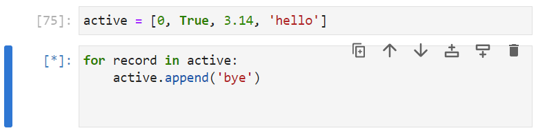

To exit an infinite loop, restart the Kernel in JupyterLab (and clear all outputs). In Spyder use the keyboard shortcut ```Ctrl``` + ```c```.

Instead a copy of the mutable sequence can be made to loop over, for example: 

```
active = [0, True, 3.14, 'hello']

for record in active.copy():
    active.append('bye')
    

active    
```   

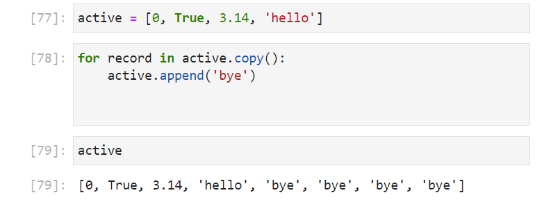

### The range class

A ```range``` object is commonly used within a loop. For example:

```
active = [0, True, 3.14, 'hello']

for num in range(len(active)):
    active.append('bye')
    
    
active
```

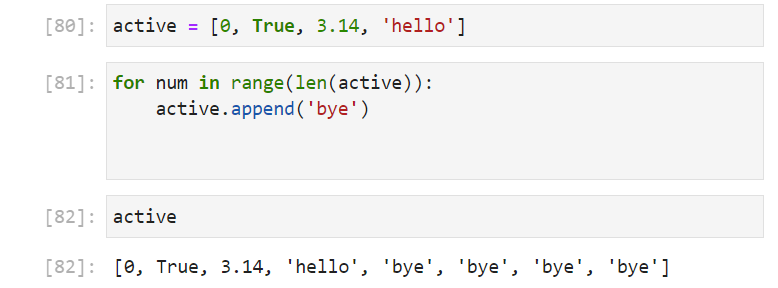

This essentially gives access to the numeric index of the Unicode string being looped over:

```
active = [0, True, 3.14, 'hello']

for num in range(len(active)):
    active.append('bye')
    print(num, active)
    
    
```

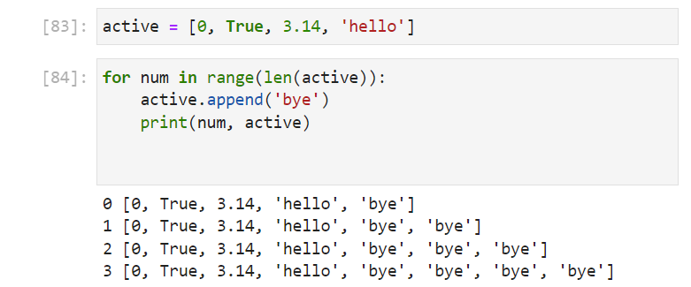

This can be used for the purposes of indexing:

```
word = 'hello'

for num in range(len(word)):
    print(word[num])


```

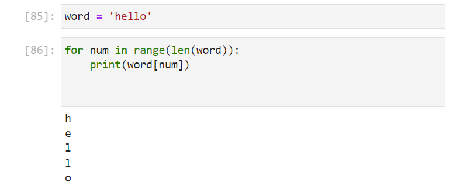

Note that the above is not as readible as:

```
word = 'hello'

for letter in word:
    print(letter)


```

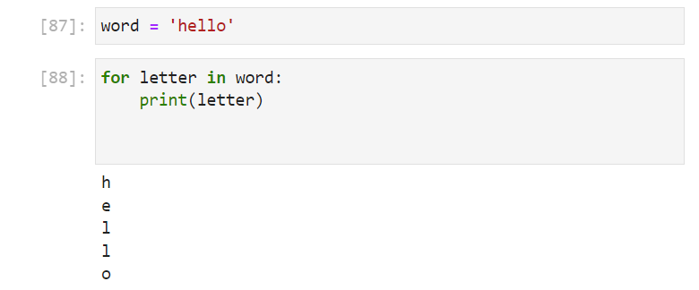

Howeveer having access to the index is sometimes useful for other purposes. For example string replication can be carried out using multiplication of the index:

```
word = 'hello'

for num in range(len(word)):
    print(num * word[num])


```

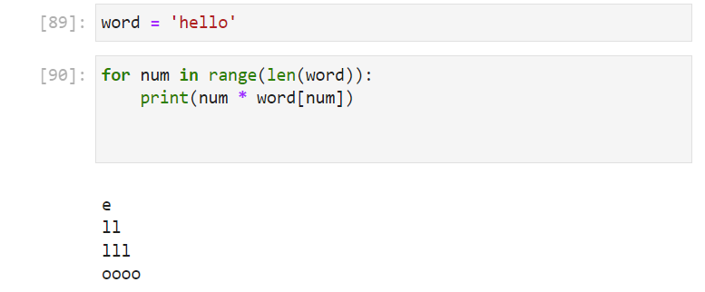

Or alternatively the index can be printed alongside the character:

```
word = 'hello'

for num in range(len(word)):
    print(num, word[num])


```

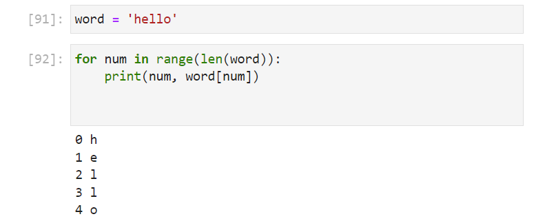

A ```range``` object has been created from the length of a collection. The docstring of the init signature of the ```range``` class can be examined by inputting ```range()``` and pressing shift ```⇧``` and tab ```↹```:

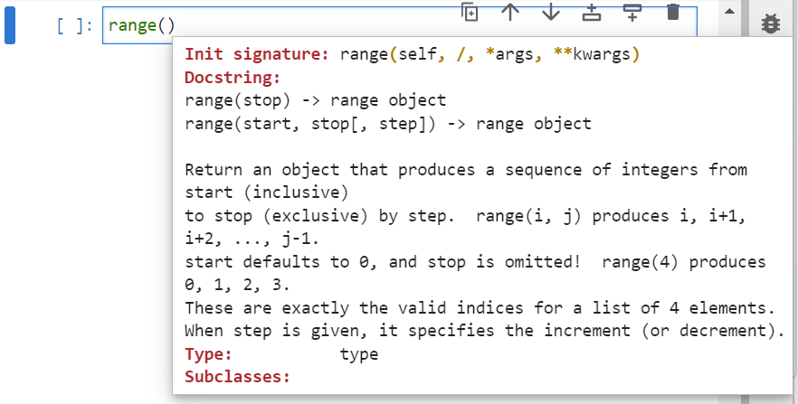

A ```range``` object uses zero-order indexing and increments in integer steps of ```1``` up to but excluding the integer ```stop``` value. It has consistency to the ```slice``` object which was examined when indexing collections. If only an integer ```stop``` value is specified:

```
ro = range(5)
ro
```

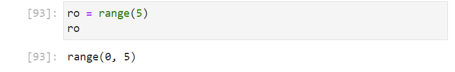

The integer ```start``` will assumed to be ```0```. The range object ```ro``` can be cast into a ```tuple``` and examined in the Variable Explorer:

```
ro_t = tuple(ro)
```


Notice in this scenario, the index and value of the ```tuple``` match:

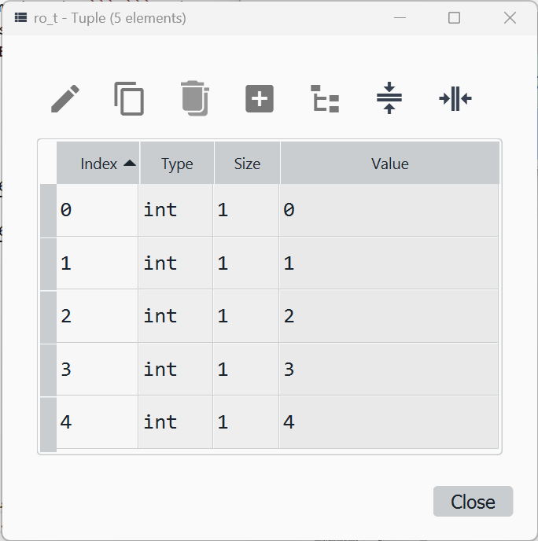

If a non-zero ```start``` value is also supplied. For example:

```
ro = range(1, 5)
ro
ro_t = tuple(ro)
```

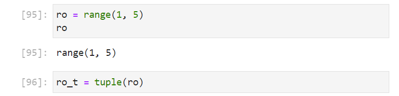

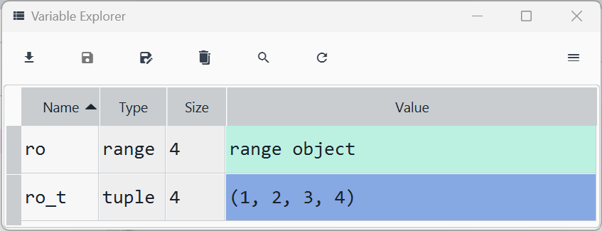

Notice in this scenario, the index and value of the ```tuple``` do not match:

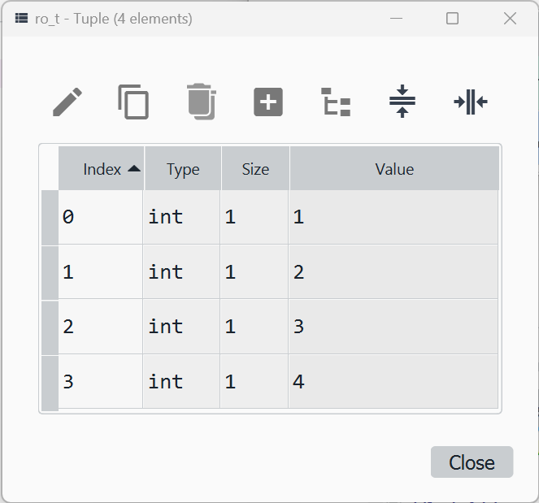

Finally an integer ```step``` can be specified. When an integer ```step``` is specified, the integer ```start``` needs to also be specified even if it is ```0```:

```
ro = range(0, 6, 2)
ro
ro_t = tuple(ro)
```

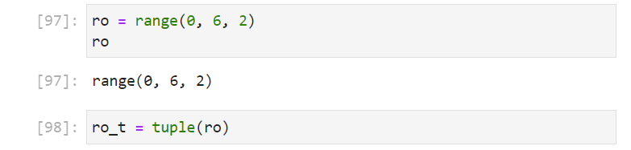

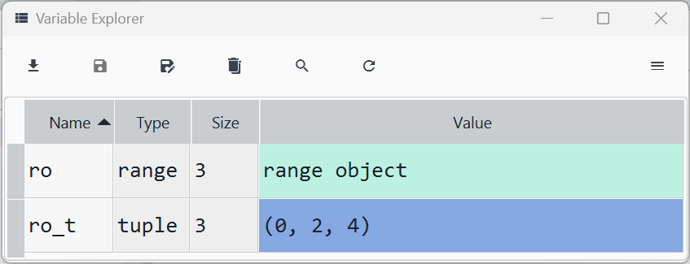

Notice that once again zero-order indexing is used, going up to but not including the ```stop``` value of ```6```:

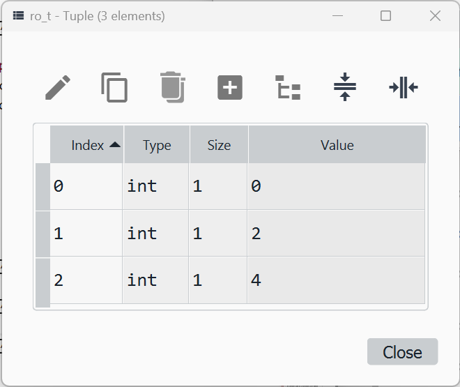

Zero-order indexing needs to be addressed when using negative values. For example beginning at a negative value and counting up until ```0``` requires a ```stop``` value ```1``` past ```0``` which is ```1```:

```
ro = range(-5, 1, 1)
ro
ro_t = tuple(ro)
```

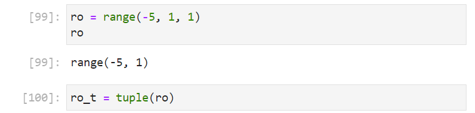

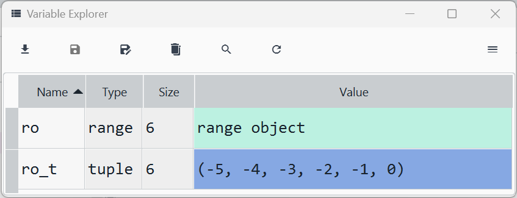

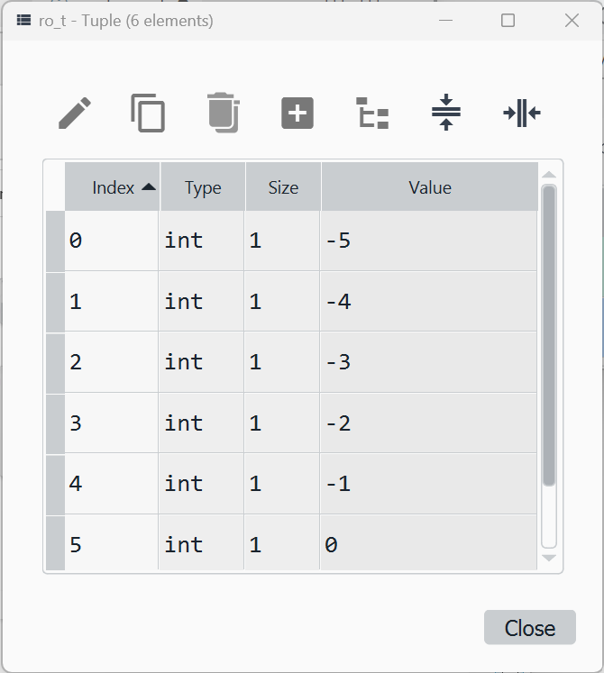


Or using a negative step of ```-1``` to count down from a positive integer value to ```0```, requires a ```stop``` value ```-1``` past ```0``` which is ```-1```:

```
ro = range(5, -1, -1)
ro
ro_t = tuple(ro)
```

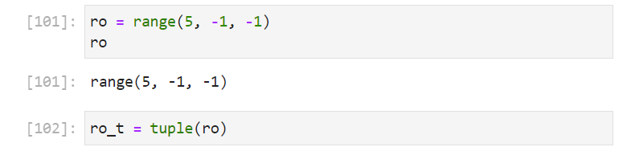

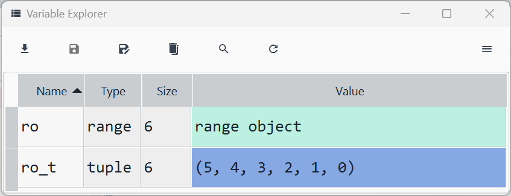

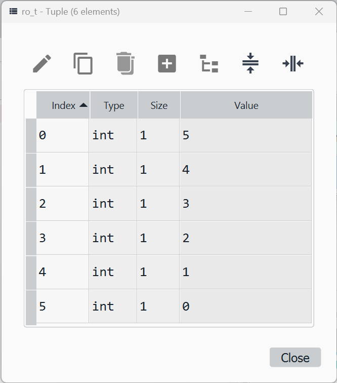

To check your understanding, create the following ```range``` objects:

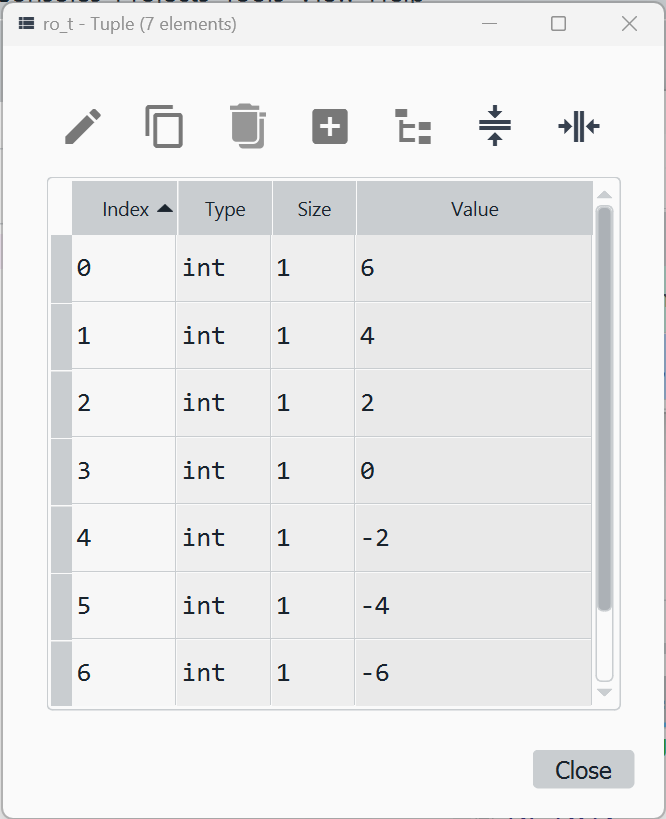

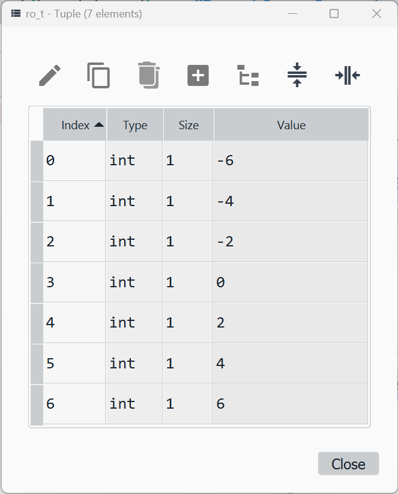

### Dictionary Keys

Recall that a dictionary has the form:

```
mapping = {'red': '#FF0000', 
           'green': '#00B050', 
           'blue': '#0070C0'}
```

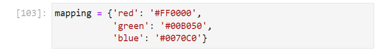

This can be viewed in the Variable Explorer. Recall that a dictionary has keys mapped to values:

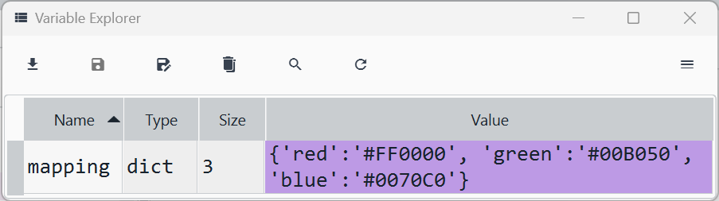


The data model identifiers can be viewed using:

```
dir(mapping)
```

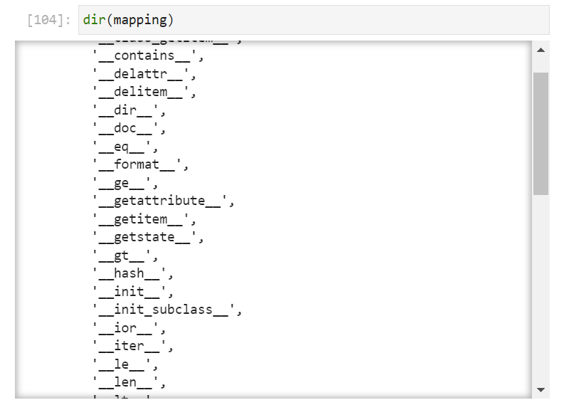

Notice the data model identifiers ```__contains__```, ```__iter__``` and ```__len__```. If an iterator is created from a dictionary, it examines the keys:

```
keys = iter(mapping)
keys
next(keys)
next(keys)
next(keys)
```

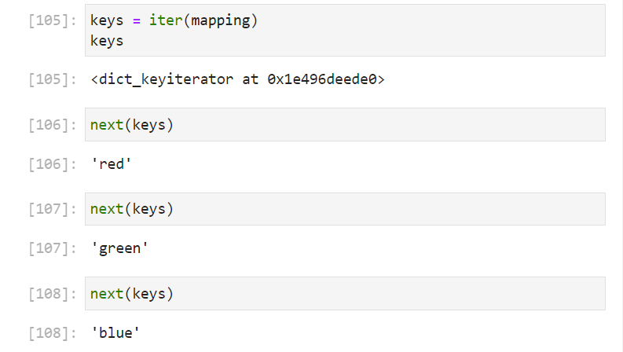

This means that using a ```for``` loop on a dictionary iterates over the keys:

```
for key in mapping:
    print(key)
    
    
```

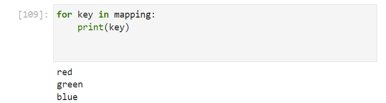

Recall that the value can be retrieved via indexing with the key.

```
for key in mapping:
    print(mapping[key])
    
    
```

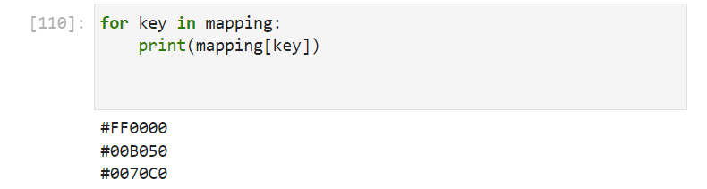

Recall that the dictionary has the three identifiers ```keys```, ```values``` and ```items```:

```
mapping.keys()
mapping.values()
mapping.items()
```

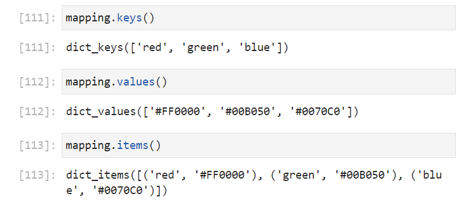

These are all iterable. ```keys``` are not normally explicitly used as it is the same as iterating using a dicitonary directly:

```
for key in mapping.keys():
    print(key)
    
    
```

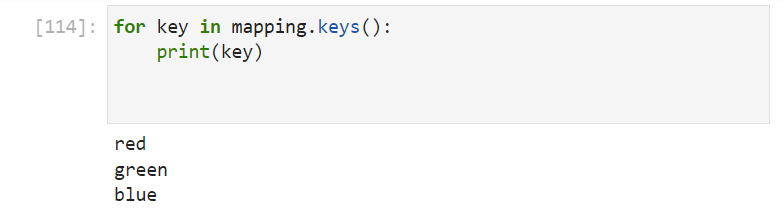

```values``` are also not normally explicitly used as it is relatively easy to index into the dictionary using a key as seen before:

```
for value in mapping.values():
    print(value)
    
    
```

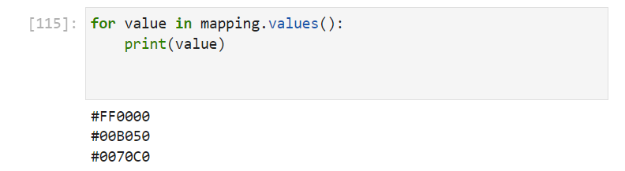

Each item in ```items``` is a ```tuple``` of the form ```(key, value)```. This ```tuple``` can be accessed:

```
for (key, value) in mapping.items():
    print(key, value)
    
    
```

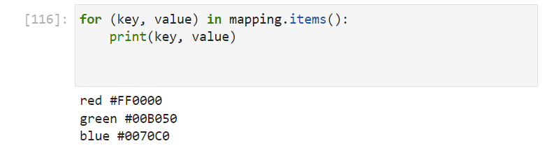

This is normally simplified using ```tuple``` unpacking:

```
for key, value in mapping.items():
    print(key, value)
    
    
```

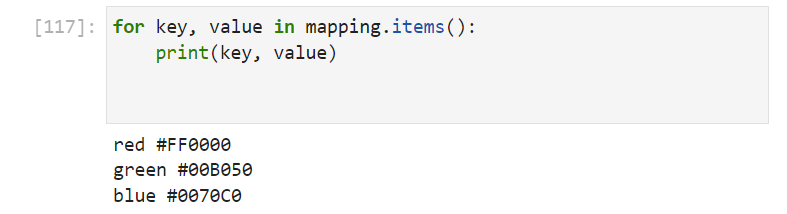

### The enumerate class

Using the dictionary identifier ```items``` gives an iterable that cotnains a ```tuple``` of the form ```(key, value)```:

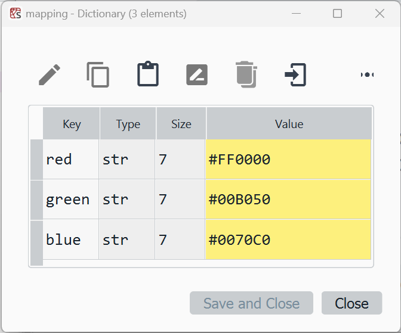

For another collection such as the string ```word``` which was ```'hello'``` a numeric index is used opposed to a key and the value is the corresponding Unicode character. This was seen in more detail when this was cast to the tuple ```word_t```:


Using ```range``` on the length of the collection, gave a ```range``` object that was associated with the numeric index. This was examined earlier and it was seen, that the value could be retrieved by indexing into the collection.

To get both the index and value however, an ```enumerate``` object can be created:

```
word_t = tuple('hello')
enumerate(word_t)
```

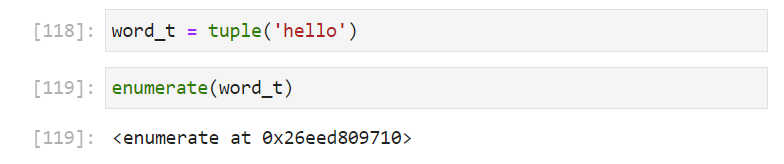

If this ```enumerate``` object is cast into a ```list```, notice that it has a similar form to the dictionary ```items```.

```
list(enumerate(word_t))
mapping.items()
```

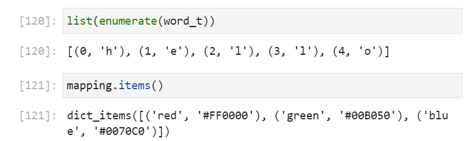

Casting into a ```list``` opposed to a ```tuple``` clearly distinguishes the inner and outer brackets.

The ```enumerate``` object can be looped over to get the index and the value at the index, analogously to the key and the value at the key for a dictionary:

```
word = 'hello'

for index, letter in enumerate(word):
    print(index, letter)
    
    
```

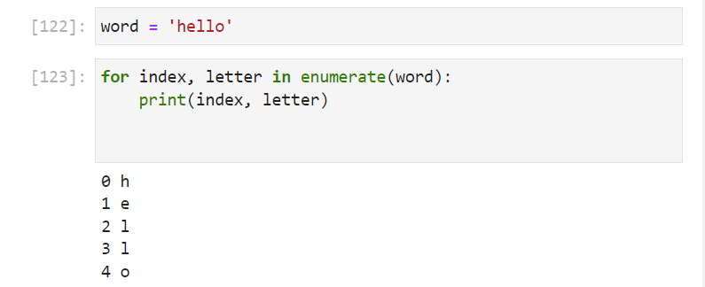

## The while Loop

The ```while``` loop can be conceptualised as an ```if``` code block that is continually repeated *while* a condition is ```True```. Note when the condition is never updated in the code block, the ```while``` loop will never exit resulting in an infinite loop. 

```
while True:
    print('no changes')
    
    
```

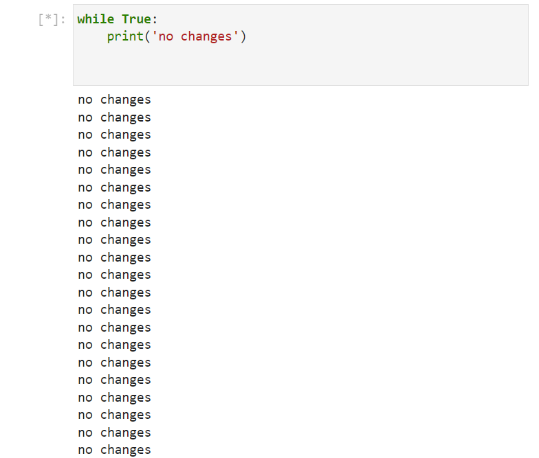

To exit an infinite loop, restart the Kernel in JupyterLab (and clear all outputs). In Spyder use the keyboard shortcut ```Ctrl``` + ```c```.

A variable can be initialised before entering a ```while``` loop. This variable is examined in the ```while``` loops condition and code within the ```while``` loop updates the value of this variable. Eventually the value of the variable will be updated to a value which makes the condition of the ```while``` loop untrue and therefore exists the ```while``` loop. For example:

```
loop_var = 0
print(f'loop_var = {loop_var}')

while loop_var < 5:
    print(f'\tloop_var = {loop_var}')
    loop_var += 1
    
    
print(f'loop_var = {loop_var}')
```

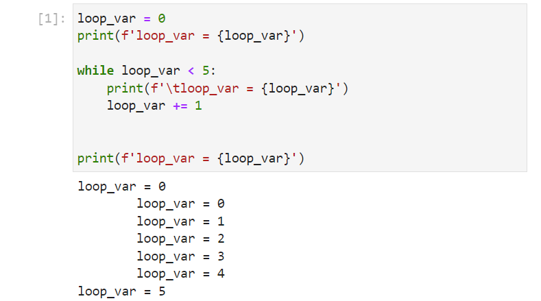

The initial unindented print statement shows the initial value of ```loop_var``` before the ```while``` loop. 

The indented print statements shows the value of ```loop_var``` when the ```while``` condition is checked. For each of these values, the condition ```loop_var < 5``` is ```True``` and the value ```loop_var``` is incremented.

The final unindented print statement shows the final value of ```5```. This value was incremented from ```4``` in the last iteration of the ```while``` loop. For this value of ```5```, the condition of the ```while``` loop ```loop_var < 5``` was ```False``` and therefore the ```while``` loop exited. 

While loops are often used when interacting with hardware. An example is using the ```input``` function which waits for a response from a user that has to interact with a keyboard:

```
user_message = input('Input some text: ')
```

Under the hood, this uses a ```while``` loop and the Kernel will hang until a user optionally inputs some text in the box and presses enter ```↵```:


A ```while``` loop can be used in place of any ```for``` loop although the syntax may not be as elegant. Compare the following for example:

```
index = 0

while index < len('hello'):
    print('hello'[index])
    index += 1


```

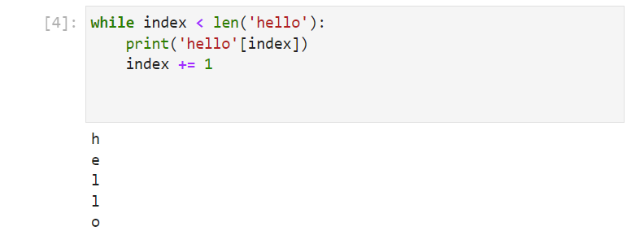

```
for letter in 'hello':
    print(letter)


```

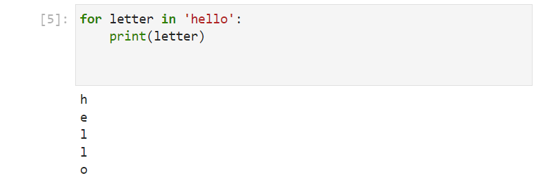

A ```for``` loop cannot replace, all occurances of a ```while``` loop. In the above scenario for example, *while* waiting for user input there is no specified duration to wait for the user to input text. The user can input text quickly, slowly or not at all (resulting in an infinite loop). 

```while``` loops are often employed in sensor feedback mechanisms. A central heating system may use a ```while``` loop to turn on a heater *while* the temperature is below a set point measured by a temperature sensor. It may also use a ```while``` loop to turn on air conditioning *while* the temperature is above the same set point. Both of these ```while``` loops may be contained within an infinite ```while``` loop which runs continuously to maintain the temperature.

## List, Generator and Dictionary Comprehensions

Supposing the following tuple is created:

```
nums = (0, 1, 2, 3, 4)
```


Supposing each number is to be doubled. Recall that multiplication of a collection by a scalar replicates the collection and therefore a for loop has to be made, so each number in num can be doubled.

For example:

```
for num in nums:
    print(2 * num)


```

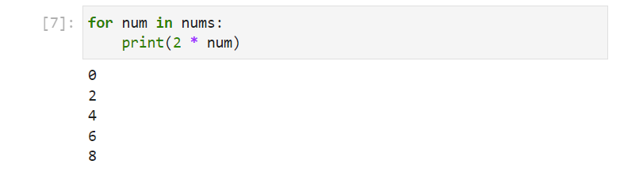

Instead of printing the doubled values, each value can be appended to a mutable collection such as a ```list```. The collection needs to be mutable so the ```list``` identifier ```append``` can be used within the ```for``` loop:

```
nums = (0, 1, 2, 3, 4)
doubled_nums = []

for num in nums:
    doubled_nums.append(2 * num)
    
    
doubled_nums
```

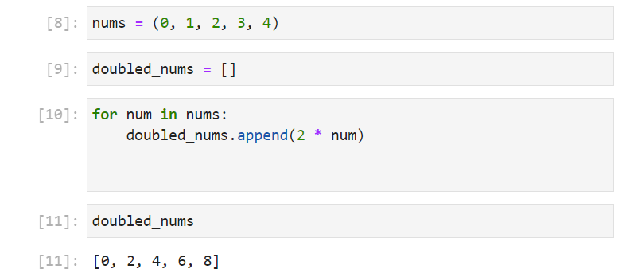

And for clarity, a ```print``` statement can be added to the ```for``` loops code block to view ```doubled_nums``` during each iteration of the ```for``` loop.

```
nums = (0, 1, 2, 3, 4)
doubled_nums = []

for num in nums:
    doubled_nums.append(2 * num)
    print(doubled_nums)
    
    
doubled_nums
```

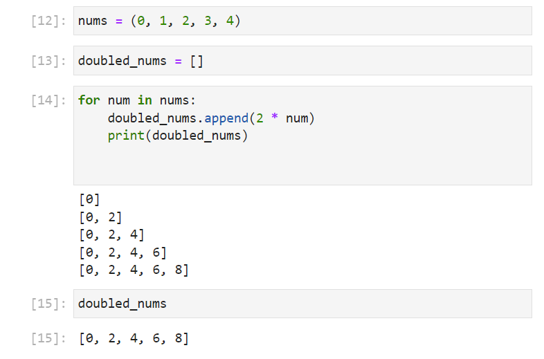

The following lines of code and the code block can be collapsed down into a single line using a list comprehension: 

```
doubled_nums = []
for num in nums:
    doubled_nums.append(2 * num)


```

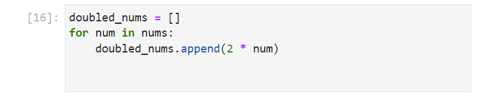

```
doubled_nums = [2 * num for num in nums]
```

A list comprehension is typically used to create an output list from interaction with a collection via a for loop. The square brackets ```[]``` enclose the list and the list is assigned to the object name ```doubled_nums``` using the assignment operator ```=```:

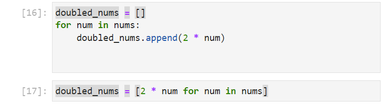

To the left hand side, the expression supplied to the ```list``` identifier ```append``` is used:

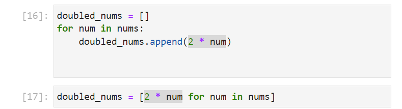

To the right hand side the ```for``` loop is added. Note as the list comprehension has no code block there is no colon:

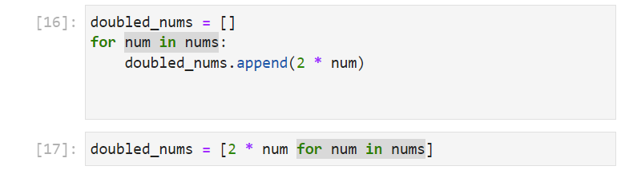

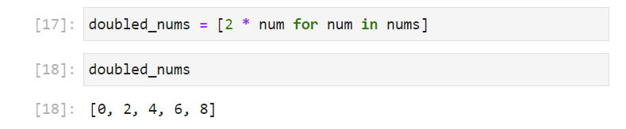

list comprehension can also include a condition.

```
doubled_even_nums = [2 * num for num in nums if num % 2 == 0]

doubled_even_nums
```

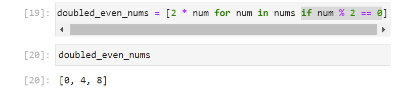

When the condition has an associated ```else```, the expression when the condition is ```True``` is specified, followed by the expression when the condition is ```False```. ```elif``` is not supported for list comprehension and code blocks should be used when multiple conditions are examined:

```
nums = (0, 1, 2, 3, 4)

parity = ['even' if num % 2 == 0 else 'odd' for num in nums] 

parity
```

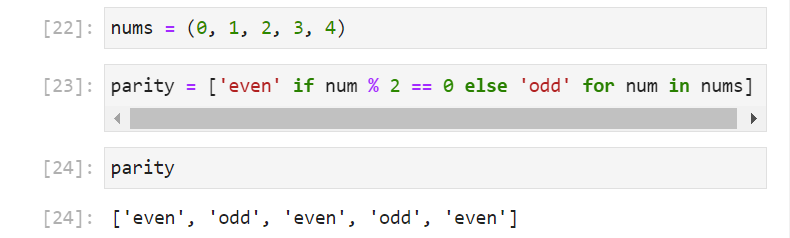

If the square brackets ```[ ]``` are replaced by parenthesis ```( )```:

```
nums = (0, 1, 2, 3, 4)

double_nums = (num * 2 for num in nums)
double_nums
```

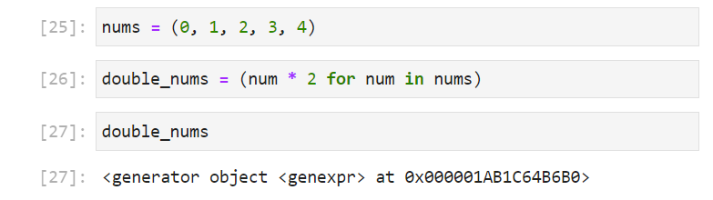

A generator is essentially an iterator that carries out an expression. In this case the expression ```2 * num``` for each ```num``` in ```nums``` when ```next``` is used:

```
next(double_nums)
next(double_nums)
next(double_nums)
next(double_nums)
next(double_nums)
```


If the generator is exhausted, a ```StopIteration``` error displays:

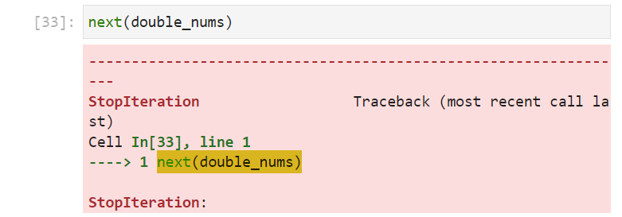

If the square brackets ```[ ]``` are replaced by braces ```{ }```, a dictionary comprehension is used. Recall a dictionary has ```key: value``` pairs. The expression for the keys and the expression for the values is seperated out. 

For example if the following list of ```colors``` is created: 

```
colors = ['red', 'green', 'blue']
```

A ```mapping``` which takes the first letter in the ```color``` as the key and the full ```color``` as the value can be created using:

```
mapping = {color[0]: color for color in colors}
```

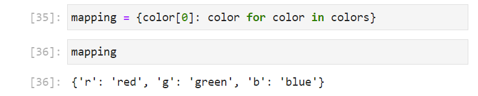

The key expression is highlighted:


This can be used in a list comprehension to get the keys:

```
keys = [color[0] for color in colors]
```

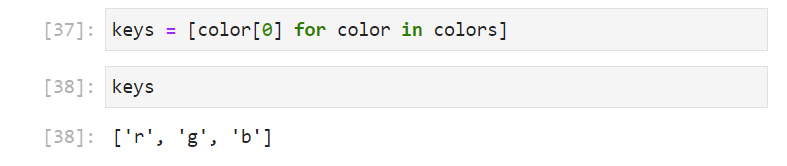

The colon ```:``` is highlighted. The colon in the dictionary seperates, the key expression from the value expression:


The value expression is highlighted:


This can be used in a list comprehension to get the values. In this case, ```values``` is essentially a copy of the original list:

```
values = [color for color in colors]
```

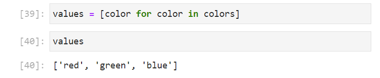

Dictionary comprehensions can also have a condition. If the one letter keys are looped through, the ordinal value of the key can be examined:

```
for key in keys:
    print(ord(key))
    
    
```

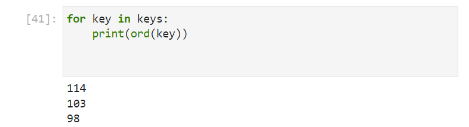

This can be used to produce a dictionary of only the keys that have a positive ordinal value:

```
mapping = {color[0]: color for color in colors if ord(color[0]) % 2 == 0}
```

As the dictionary comprehension is quite long, it is easier to read if it is split over multiple lines:

```
mapping = {color[0]: 
           color 
           for color in colors
           if ord(color[0]) % 2 == 0}
```

The first line is the key. The second line is the value. The third line is the iterable being looped over and the third line is the expression.

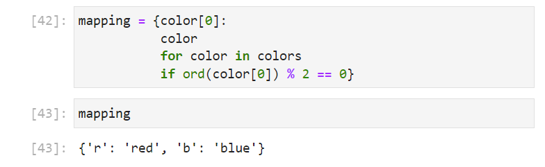

The dictionary comprehension can also use an ```if``` and ```else``` expression. These statements can be set for both the keys and the values as shown in the example below. The if condition takes the first letter of the color for the key and the color for the value when the ordinal value of the first letter is even. The else condition takes the last letter of the color for the key and reverses the color for the value:

```
mapping = {color[0] if ord(color[0]) % 2 == 0 else color[-1]: 
           color if ord(color[0]) % 2 == 0 else color[::-1]
           for color in colors}
```

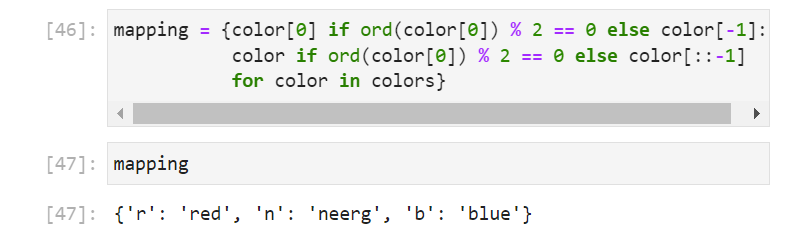

It is quite common to keep all keys and use only a condition for the values:

```
mapping = {color[0]: 
           color if ord(color[0]) % 2 == 0 else color[::-1]
           for color in colors}
```

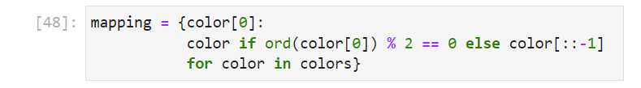

A dictionary comprehension can use the ```items``` identifier of an existing dictionary giving access to the original dictionaries keys and values using tuple unpacking. For example, supposing the following dictionary of ```fruits``` is made:

```
fruits = {'apples': 2, 'bananas': 3, 'carrots': 5}
```

A dictionary ```fruits2``` which has the same keys and doubles the numeric values can be created using:

```
fruits2 = {key: 
           2 * value 
           for key, value in fruits.items()}
```


And in such a scenario it is common to include all keys and update the value in response to a condition. For example, the value can be doubled if it is odd and left alone if it is even. This creates a dictionary of even values:

```
fruits3 = {key: 
           2 * value if value % 2 == 1 else value 
           for key, value in fruits.items()}
```

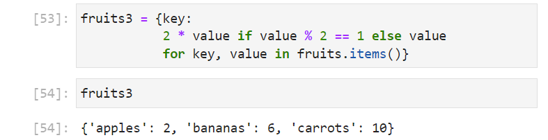

## Functions

### Using Inbuilt Functions Recap

Many inbuilt functions have already been used. However before looking at creating a custom function, the ```ord``` function will be examined. Recall if the function ```ord``` is input without parenthesis that it is referenced:

```
ord
```

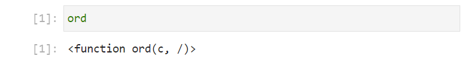

If the function ```ord``` is input followed by parenthesis and shift ```⇧``` and tab ```↹```, its docstring will display:

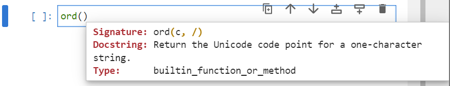

From the docstring, it can be seen that the function has a single input argument denoted ```c```. This is positional only:

```
ord('a')
```

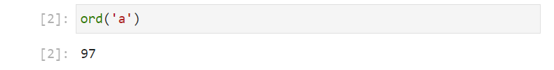

Any input argument coming before the ```, \``` is positional only. Therefore the following will not work:

```
ord(c='a')
```

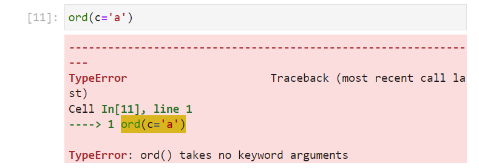

The docstring also mentions a return value. When the function call is not assigned to a variable, it is returned to the cell output.

When the function call is instead assigned to a variable, it is returned to the object name. Notice that the value no longer displays in the cell output:


This return value can be examined when the variable is seen in the Variable Inspector:

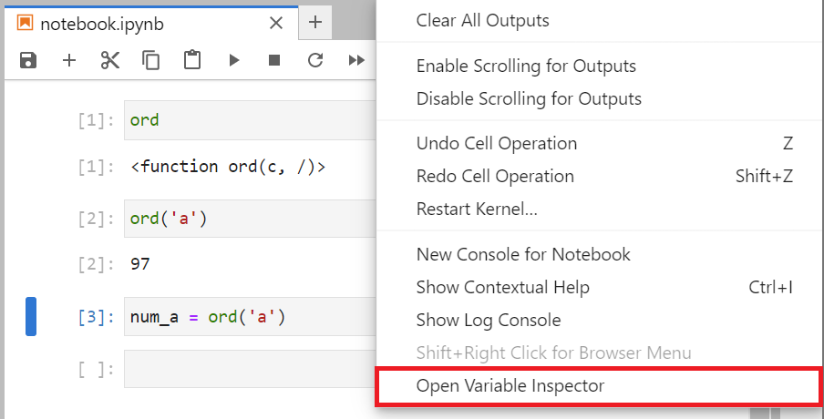

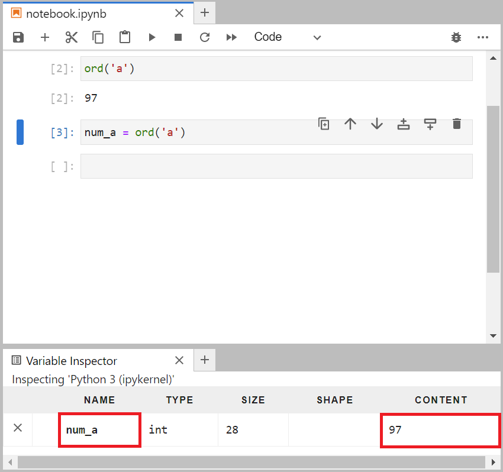

The ```ord``` function has one positional input argument and 1 return value.

The ```print``` function can likewise be referenced:

```
print
```

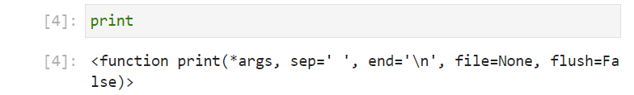

If its docstring is examined, it can be seen that the print function has ```*args``` which means that it can take a variable number of input arguments. It also has the keyword input arguments ```sep```, ```end```, ```file``` and ```flush``` which all have default values. When these keyword input arguments are not specified the default values will be used. 

Notice that there is no mention of a return statement in the print function, this is because the print function has no return value:

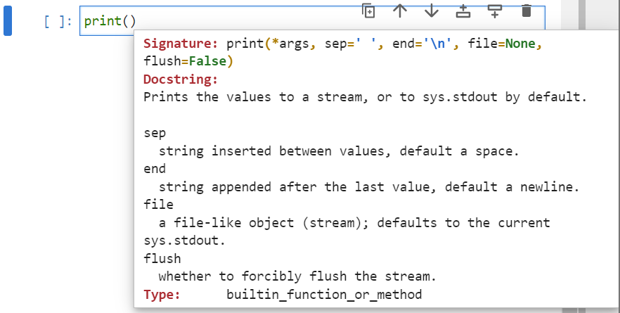

```
empty = print('hello', 'world')
```

Notice that the print function always prints. When it is assigned to a variable, text is printed to the cell output. Notice this text uses a space as a seperator ```sep=' '``` and ends on a new line ```end='\n'```. The variable ```empty``` has the value ```NoneType``` as the print function has no return statement.

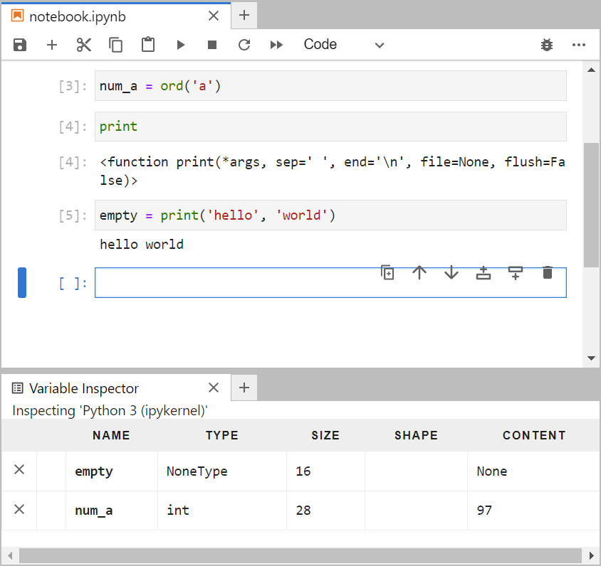

The effect of multiple input arguments can be seen:

```
print()
print('hello')
print('hello', 'world')
print('good', 'morning', 'world')
```

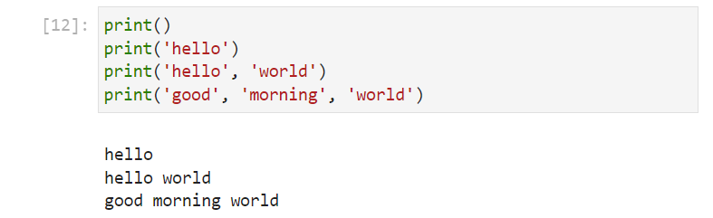

Once again notice this text uses a space as a seperator ```sep=' '``` and ends on a new line ```end='\n'```.

The effect of modifying the ```sep``` and ```end``` input arguments can be seen using multiple print statements:

```
print('hello', 'world')
print('hello', 'world', sep=' ', end='\n')
print('hello', 'world', sep='\t')
print('hello', 'world', end='')
print('hello', 'world')
print('hello', 'world', end='\r')
print('bye', 'world')
```

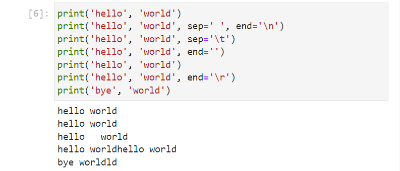

The ```file``` keyword input argument has a default value of ```None``` which means the output is printed to the cell output. A file can be opened and data can be saved to the file using:

```
textfile = open('text.txt', 'w')
print('hello', 'world', file=textfile)
textfile.close()
```

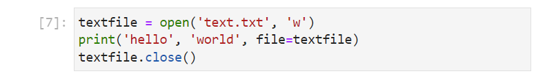


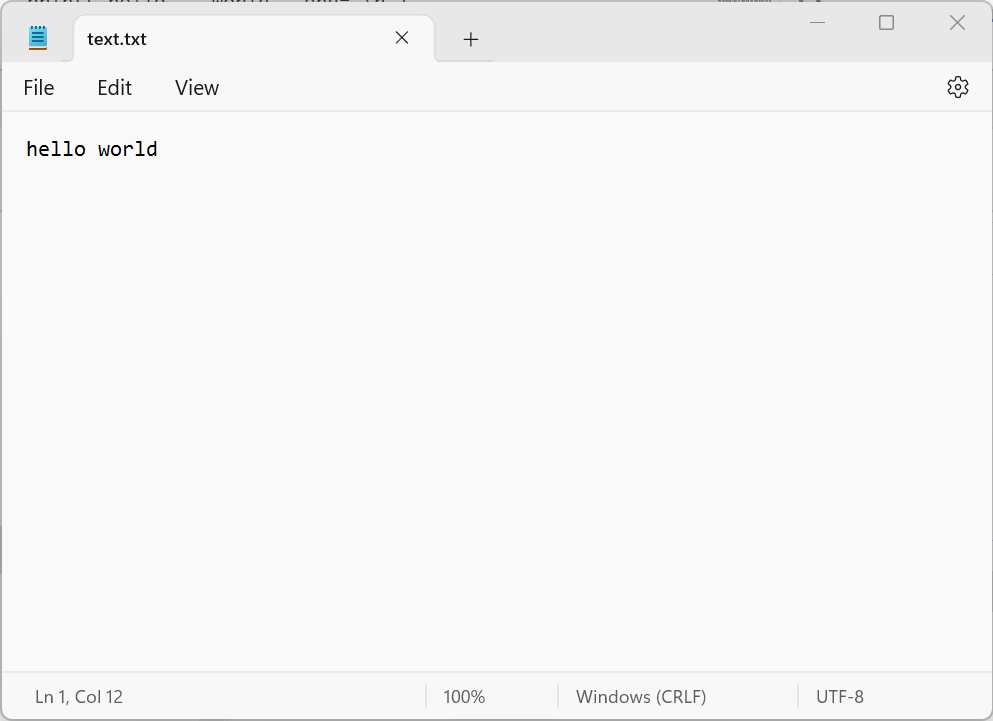

The effect of the keyword input argument ```flush``` can be seen when a small time delay is introduced:

```
from time import sleep
```

In the following, the printed ```0``` will appear to change to ```1``` once as the text isn't flushed and more slowly updated:

```
for index in range(10):
    print(0, end='', flush=False)
    print('\r', end='', flush=False)
    sleep(0.1)
    print(1, end='', flush=False)
    print('\r', end='', flush=False)
```

In the following, the printed ```0``` and ```1``` will be observed to quickly toggle as the text has been flushed:

```
for index in range(10):
    print(0, end='', flush=True)
    print('\r', end='', flush=True)
    sleep(0.1)
    print(1, end='', flush=True)
    print('\r', end='', flush=True)
```

Integer division and the associated modulus can be carried out using the ```//``` and ```%``` operators respectively:

```
3 // 2
3 % 2
```

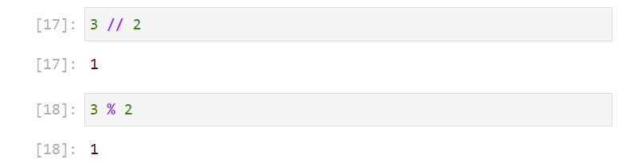

The ```divmod``` function can be referenced:

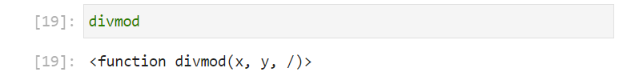

Its docstring can be examined. Notice it has the two input arguments ```x``` and ```y``` that are once again positional only followed by ```, /```. The value returned is a ```tuple``` which has the form ```(x // y, x % y)```:

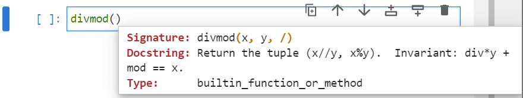

```
divmod(3, 2)
```

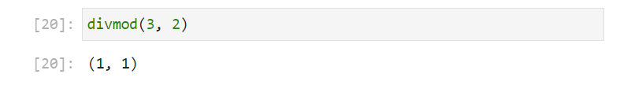

The function call can be assigned to a tuple of variables:

```
(quotient, remainder) = divmod(3, 2)
```

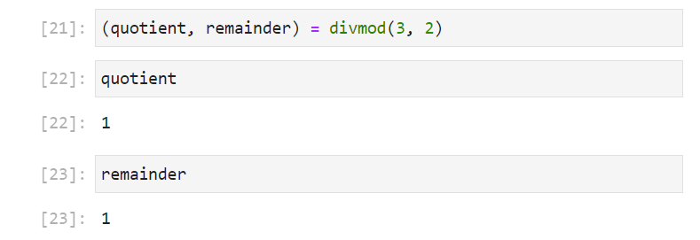

This is normally done shorthand using ```tuple``` unpacking:

```
quotient, remainder = divmod(3, 2)
```

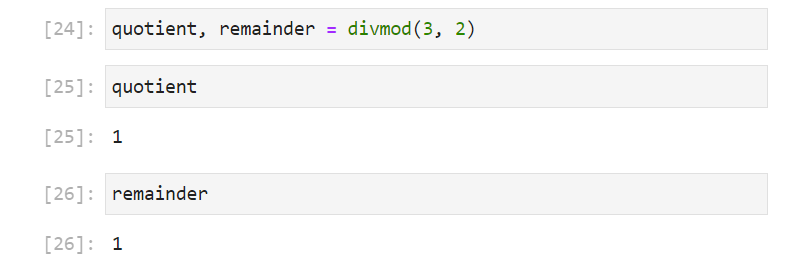

The ```license``` function can be referenced using:

```
license
```

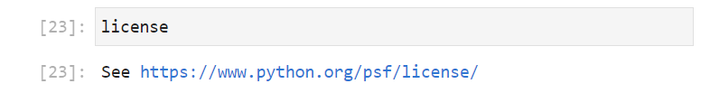

Its docstring can be examined and has no input arguments or return value:

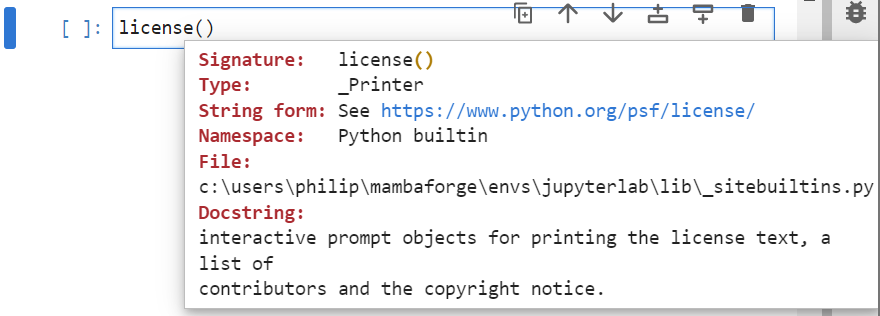

It can be called using:

```
license()
```

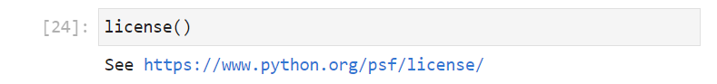

When the function is called and assigned to a variable, the variable has the value ```NoneType``` because this function has no return statement:

```
eula = license()
```

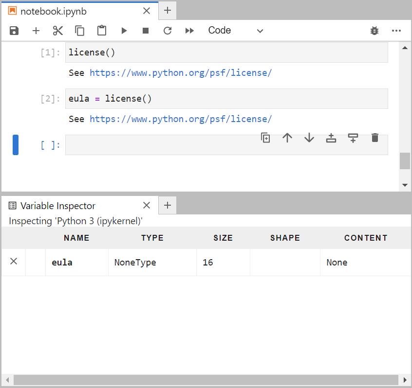

Under the hood, this function effectively uses the ```print``` function to print a constant string.

### Defining a custom function

Now that the features of inbuilt functions have been examined, a custom function can be explored. Instead of assignment, the ```def``` keyword is used followed by the functions name, in this case ```nothing```. The functions name is followed by parenthesis, and these parenthesis contain input arguments, when the function has input arguments. After the parenthesis is a colon ```:``` which is used to indicated the beginning of a code block. The functions code block usually ends in a ```return``` statement. The following function has no input arguments and no return statement:

```
def nothing():
   return


```

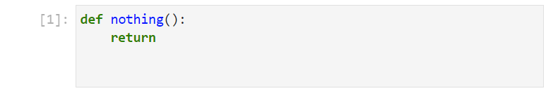

It can be referenced using:

```
nothing
```

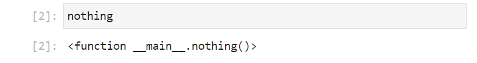

Its docstring can be examined:

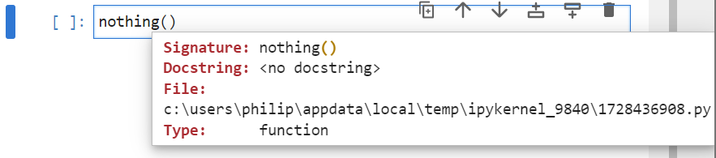

No docstring was supplied in the function, so none is shown. However the details show there is no input argument and no return statement. The function can be called using:

```
nothing()
```


Notice there is no cell output as there is no return statement. When the function call is assigned to a variable, its value will be ```NoneType```:

```
empty = nothing()
```

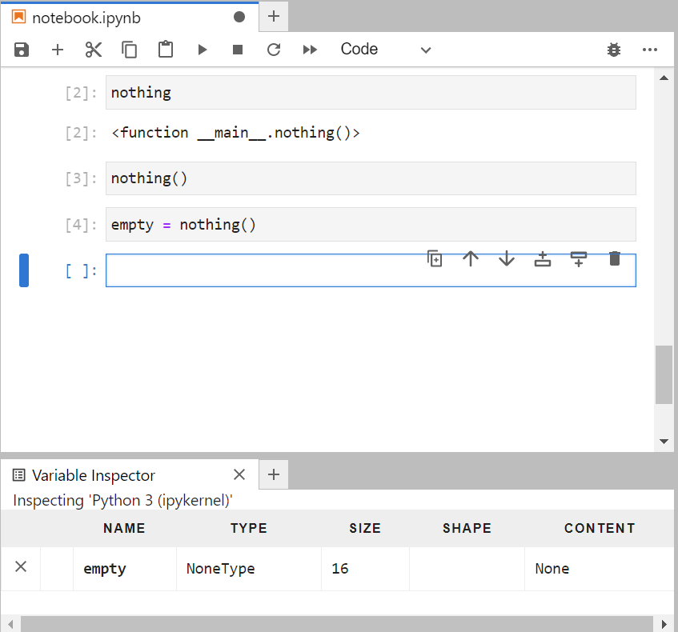

### Input Argument and Return Value

Another function can be created, that takes in a singular ```word```, and returns the plural of it: 

```
def plural(word):
   return word + 's'


```

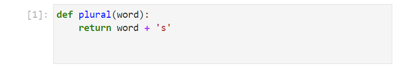

This function can be referenced:

```
plural
```

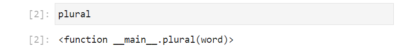

And its docstring can be examined:

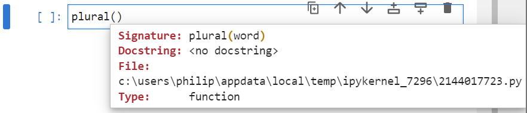

This shows the expected input arguments. Once again, there is no docstring. 

### Function docstring

A docstring is included in triple double quotes. Triple double quotes are used even if it is a single line comment as docstrings are often written briefly during development and padded out later. having the triple quotations makes it easier to expand to a multi-line string and having triple double quotations makes it easier to include a string literal:

```
def plural(word):
    """Takes a singular str word and returns its plural."""
    return word + 's'


```

If triple double quotes are input, the Spyder IDE for example will produce a docstring template. Triple double quotes opposed to triple single quotes are normally used for docstrings, as they often contain string literals:

```
def plural(word):
    """
    

    Parameters
    ----------
    word : TYPE
        DESCRIPTION.

    Returns
    -------
    TYPE
        DESCRIPTION.

    """
   return word + 's'


```

This can be filled in using:

```
def plural(word):
    """Takes a singular str word and returns its plural. 
    e.g. 'apple' becomes 'apples'.

    Parameters
    ----------
    word : str
        singular str.

    Returns
    -------
    str
        plural str.

    """
   return word + 's'


```


Now its docstring can be examined:

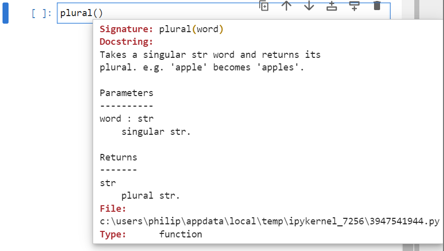

The function can be run using:

```
plural('apple')
plural('banana')
plural(word='apple')
fruits = plural('apple')
```

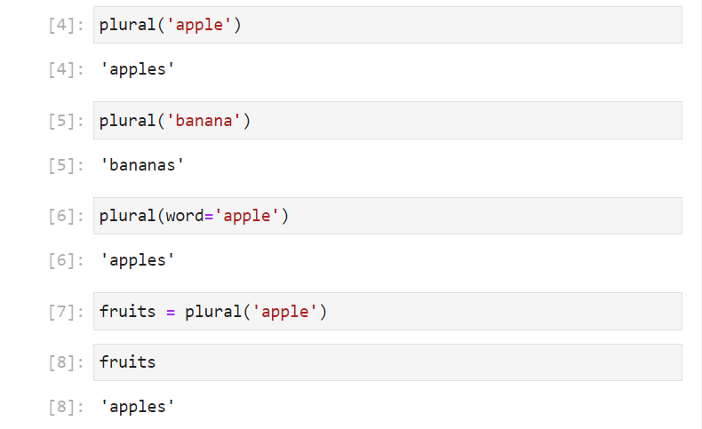

If no input arguments are supplied or too many, a ```TypeError``` will display:

```
plural()
plural('apple', 'banana')
```

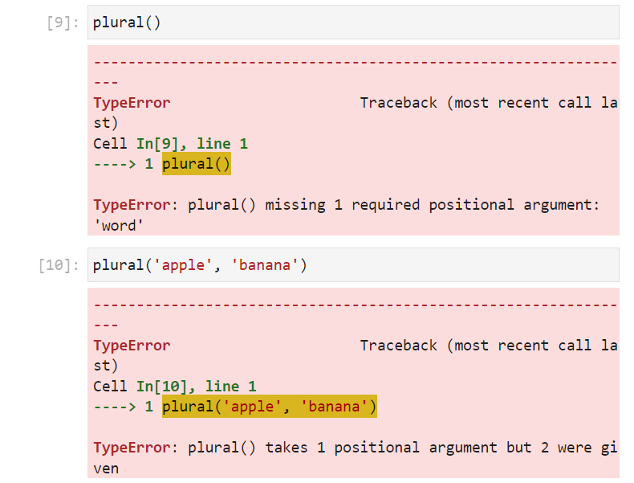

Another ```TypeError``` will display if the input argument is the wrong data type:

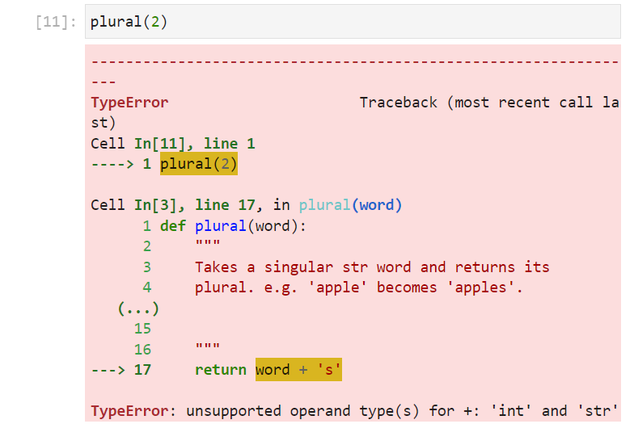

### Asserting Input Argument Data Types

In other cases, the wrong data types for input arguments may run but give an unexpected result. For this reason it is usually recommended to ```assert``` the data type of an input argument.

The ```assert``` statement is normally used with the ```isinstance``` function which returns a ```bool```:

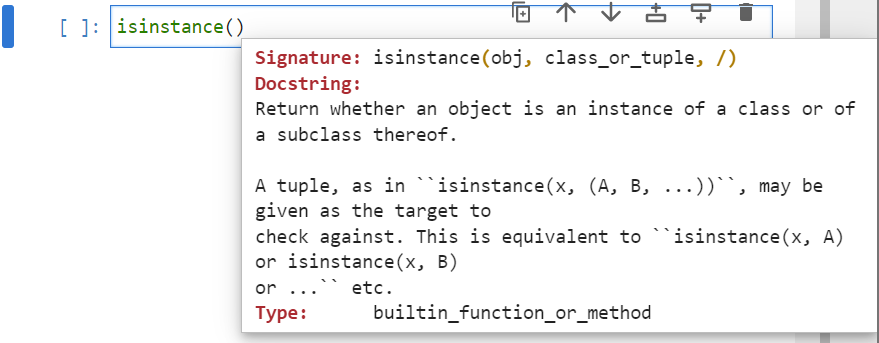

```
isinstance('hello', str)
isinstance(2, str)
```

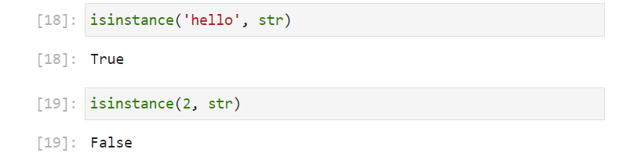

When the ```assert``` statement is used with a value that is ```True```, the code runs as normal. When it is used with a value that is ```False``` it raises an ```AssertionError```:

```
assert isinstance('hello', str)
assert isinstance(2, str)
```

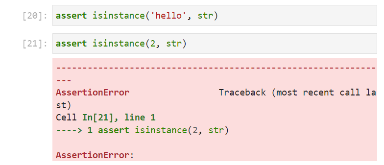

```
def plural(word):
    """Takes a singular str word and returns its plural. 
    e.g. 'apple' becomes 'apples'.

    Parameters
    ----------
    word : str
        singular str.

    Returns
    -------
    str
        plural str.

    """
    assert isinstance(word, str)
    return word + 's'


```

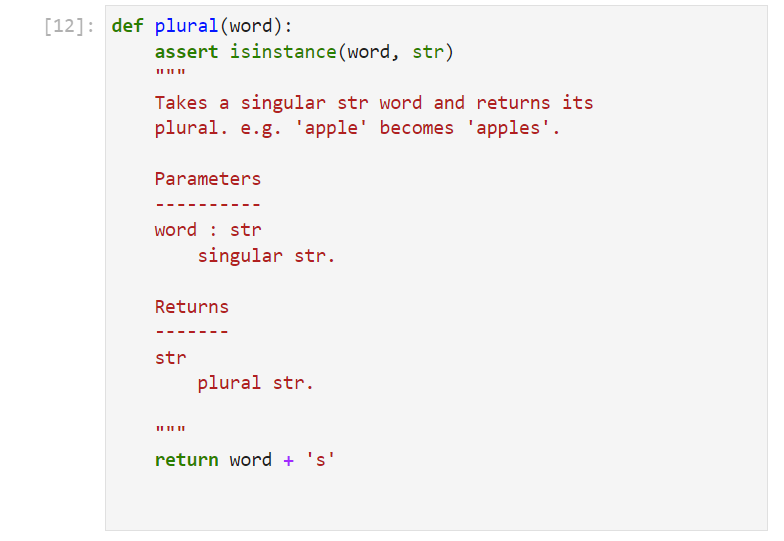

Now the function works as normal when the data type is as expected and raises an ```AssertionError``` when the data type is wrong:

```
plural('banana')
plural(2)
```

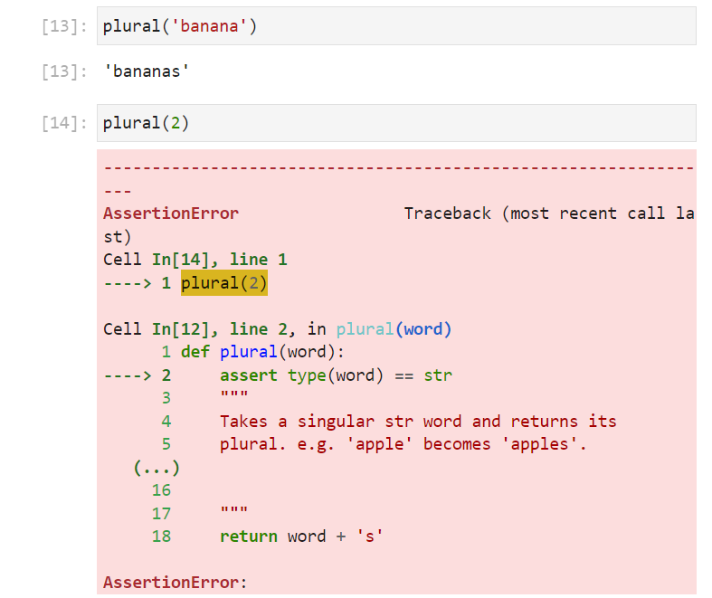

The function can be called with a positional or keyword input argument:

```
plural('banana')
plural(word='banana')
```

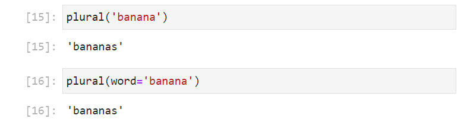

### Positional Only Input Arguments

Input arguments have a named parameter by default. During a function call input arguments can be specified positionally or they can be specified by assigning the named parameter to a default value. Adding a ```/``` to a functions input arguments mandates that the input arguments that come the ```/``` can only be specified positionally during a function call i.e. the named parameter cannot be used during the function call. This syntax is typically used for the functions in builtins including the methods defined in builtins classes as seen in the previous tutorials. In this use case, the name of the function makes it pretty obvious what a positional input argument is used for and enforcing this syntax makes the code easier to read and faster to write. In other use cases the use of named parameters may be preferable for functions where it is not obvious from the function name what the named parameter does. Having an appropriate named parameter therefore can make the code more readible:

```
def plural(word, /):
    """Takes a singular word and returns its plural. 
    e.g. 'apple' becomes 'apples'.

    Parameters
    ----------
    word : str
        singular str.

    Returns
    -------
    str
        plural str.

    """
    assert isinstance(word, str)
    return word + 's'


```

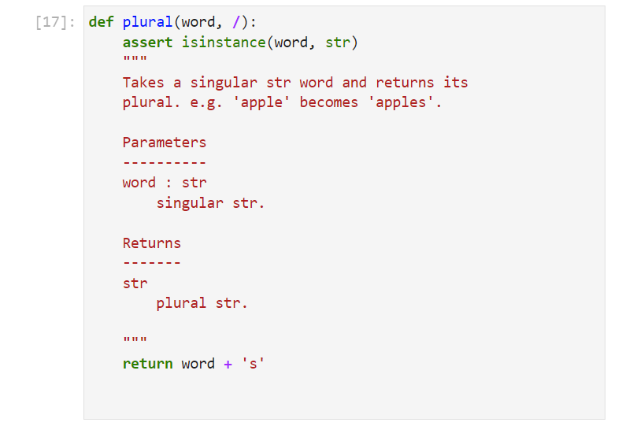

The function will proceed as normal when a positional input argument is supplied but raise a ```TypeError``` when a named input argument is supplied:

```
plural('banana')
plural(word='banana')
```

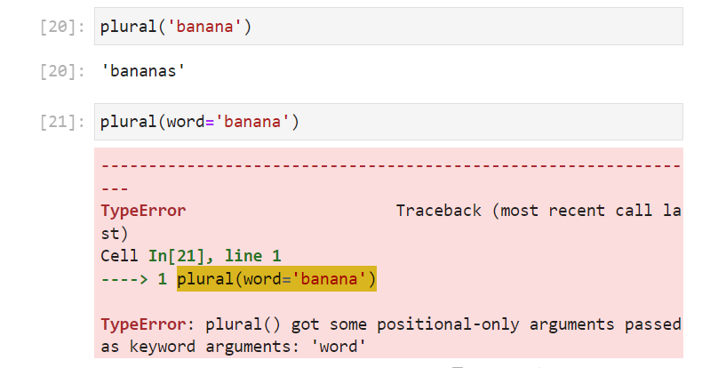

### Default Keyword Input Arguments

An input argument can be supplied a default value:

```
def plural(word='apple'):
    """Takes a singular word and returns its plural. 
    e.g. 'apple' becomes 'apples'.

    Parameters
    ----------
    word : str
        singular str. The default is 'apple'.

    Returns
    -------
    str
        plural str.

    """
    assert isinstance(word, str)    
    return word + 's'


```

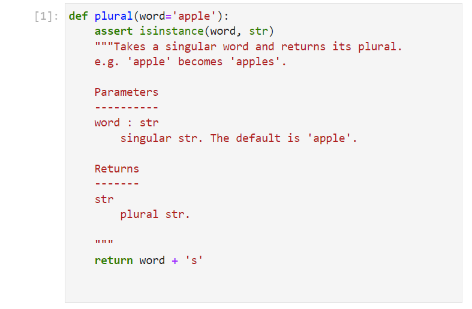

When called without any input arguments, the default value will be used, this can be overridden using the named input argument and assigning it to a new value. Alternatively the new value can be supplied positionally:

```
plural()
plural(word='banana')
plural('banana')
```

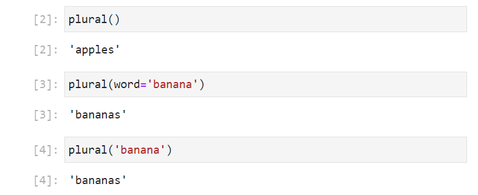

If the ```/``` is added after the input argument, it can only be provided positionally:

```
def plural(word='apple', /):
    """Takes a singular word and returns its plural. 
    e.g. 'apple' becomes 'apples'.

    Parameters
    ----------
    word : str
        singular str. The default is 'apple'.

    Returns
    -------
    str
        plural str.

    """
    assert isinstance(word, str)    
    return word + 's'


```

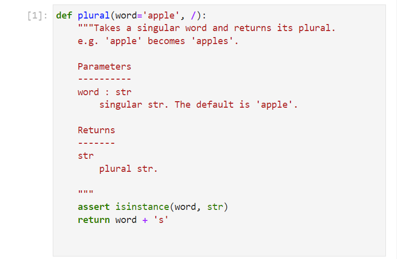

Not using the input argument will provide the default value. Using a positional input argument will override the default value:

```
plural()
plural('banana')
```

Using a named argument will give a ```TypeError```:

```
plural(word='banana')
```

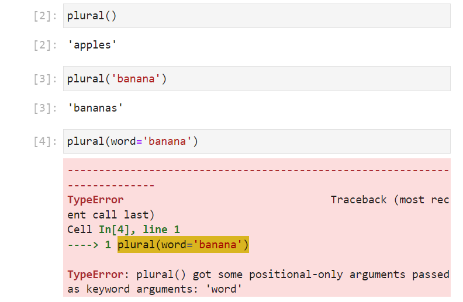

### The Return Value Continued

Another function can be made that takes two numbers as input arguments and returns the highest number. This can have the form:

```
def higher(num1, num2):
    if num1 > num2:
        return num1
    else:
        return num2


```

Which is normally simplified to:

```
def higher(num1, num2):
    if num1 > num2:
        return num1
    return num2

        
```

Both input arguments should be asserted as numeric, this can be done by supplying a ```tuple``` of numeric datatypes to the ```isinstance``` function:

```
def higher(num1, num2):
    assert isinstance(num1, (int, float, bool))
    assert isinstance(num2, (int, float, bool))
    if num1 > num2:
        return num1
    return num2

        
```

A docstring template can be inserted:

```
def higher(num1, num2):
    """
    

    Parameters
    ----------
    num1 : TYPE
        DESCRIPTION.
    num2 : TYPE
        DESCRIPTION.

    Returns
    -------
    TYPE
        DESCRIPTION.

    """
    assert isinstance(num1, (int, float, bool))
    assert isinstance(num2, (int, float, bool))
    if num1 > num2:
        return num1
    return num2


```

And the template can be filled in:

```
def higher(num1, num2):
    """ Returns the highest numeric value.
    Parameters
    ----------
    num1 : int, float or bool
        numeric value.
    num2 : int, float or bool
        numeric value.

    Returns
    -------
    int, float or bool
        numeric value.

    """
    assert isinstance(num1, (int, float, bool))
    assert isinstance(num2, (int, float, bool))
    if num1 > num2:
        return num1
    return num2


```

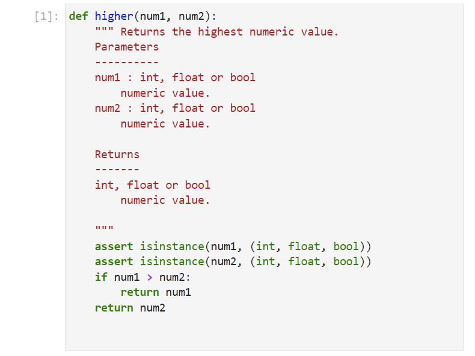

The function can be referenced using:

```
higher
```

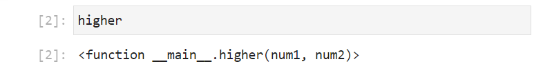

Its docstring can be examined:

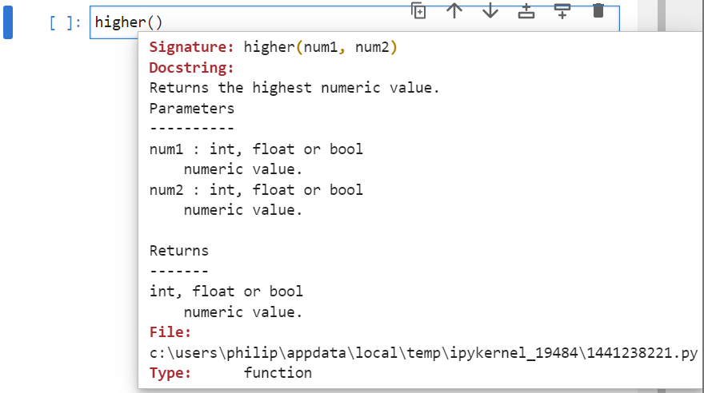

It can be called with the following numeric values:

```
higher(1, 2)
higher(3.14, 2)
```

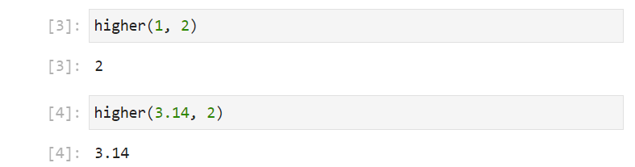

If an incorrect data type is supplied, there will be an ```AssertionError```. If the incorrect number of input arguments are supplied, there will be a ```TypeError```. This function can take in ```num1``` and ```num2``` as positional input arguments or keyword arguments. The input arguments could be made to be positional only by use of ```/```.

```
def higher(num1, num2, /):
    """ Returns the highest numeric value.
    Parameters
    ----------
    num1 : int, float or bool
        numeric value.
    num2 : int, float or bool
        numeric value.

    Returns
    -------
    int, float or bool
        numeric value.

    """
    assert isinstance(num1, (int, float, bool))
    assert isinstance(num2, (int, float, bool))
    if num1 > num2:
        return num1
    return num2


```

A function terminates at its return statement. For example. Anything past the first executed return statement is ignored:

```
def one():
    return 1
    return 2
    return 3


```

```
one()
```

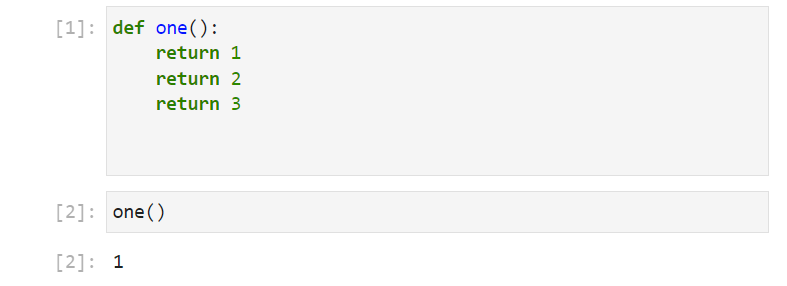

If no ```return``` statement is added:

```
def calcsomething():
    1 + 2
    
    
```

```
empty = calcsomething()
```

Then there is no ```return``` value:

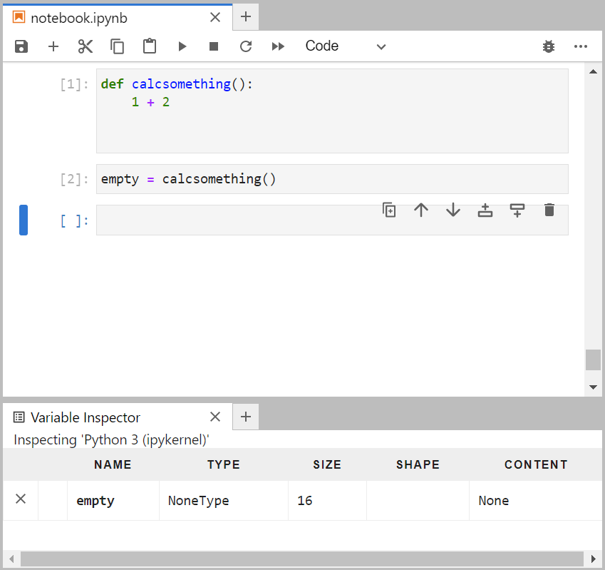

In other words, the following are equivalent:

```
def calcsomething():
    1 + 2
    
    
```

```
def calcsomething():
    1 + 2
    return

    
```

```
def calcsomething():
    1 + 2
    return None
     
    
```

A function can return a collection. The most common collection to return is a tuple because it is immutable:

```
def singular(word='apples'):
    """Takes a plural word and returns its singular value. 
    e.g. 'apple' becomes ('apple', 's').

    Parameters
    ----------
    word : str
        plural str. The default is 'apples'.

    Returns
    -------
    tuple
        tuple of singular str and value at last index.

    """
    assert isinstance(word, str)
    return word[:-1], word[-1]


```

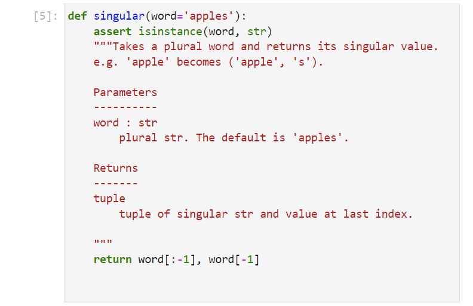

A tuple is normally returned using tuple unpacking. This means the return statement ```return word[:-1], word[-1]``` is simplified and the tuple is not explicitly specified ```return (word[:-1], word[-1])```.

```
singular()
singular(word='bananas')
singular('bananas')
```

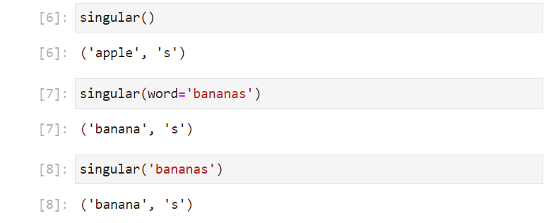

### Function Local Scope and Mutability

Functions have their own local scope. This can be examined with the following. The local variable ```x``` assigned in the function does not alter the global variable ```x``` (seen on the Variable Inspector, after the function call):

```
x = 2

def localvariable():
    x = 4
    return x


y = localvariable()
```

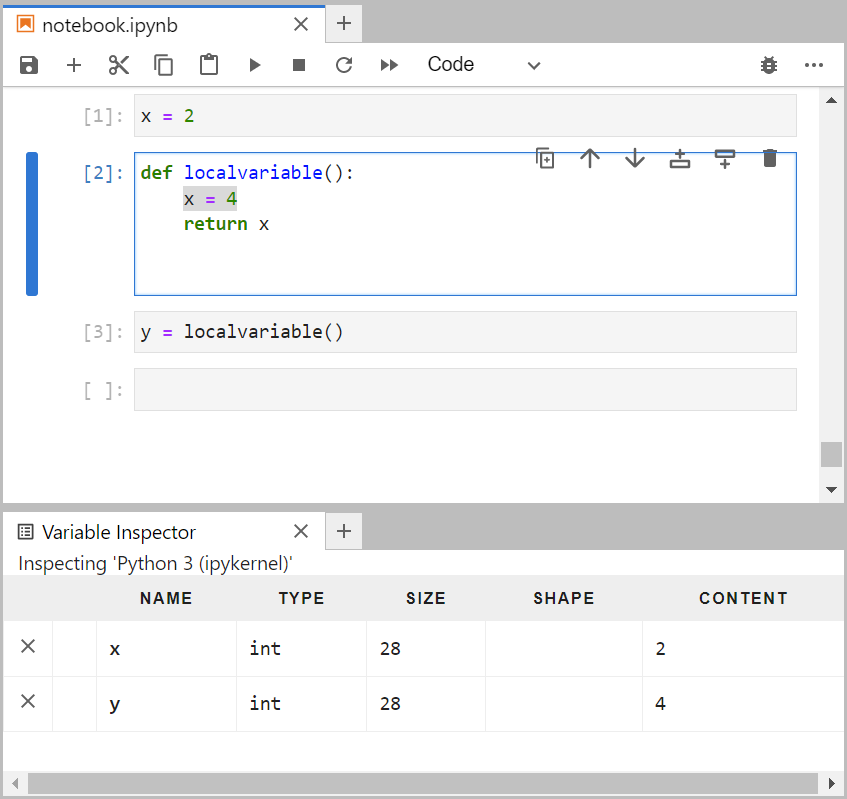

Although a function has its own local variables, it can access global variables:

```
x = 2

def readglobalvariable():
    return x


y = readglobalvariable()
```

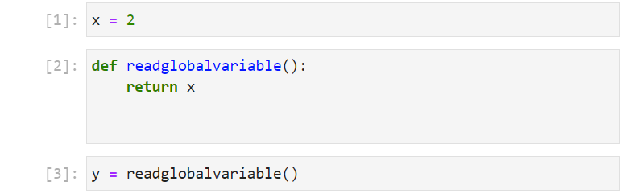

If an immutable variable is accessed from the global namespace and reassignment is attempted in the functions local namespace, an ```UnboundLocalError``` will display:

```
x = 2

def unboundlocal():
    x += 2


unboundlocal()
```

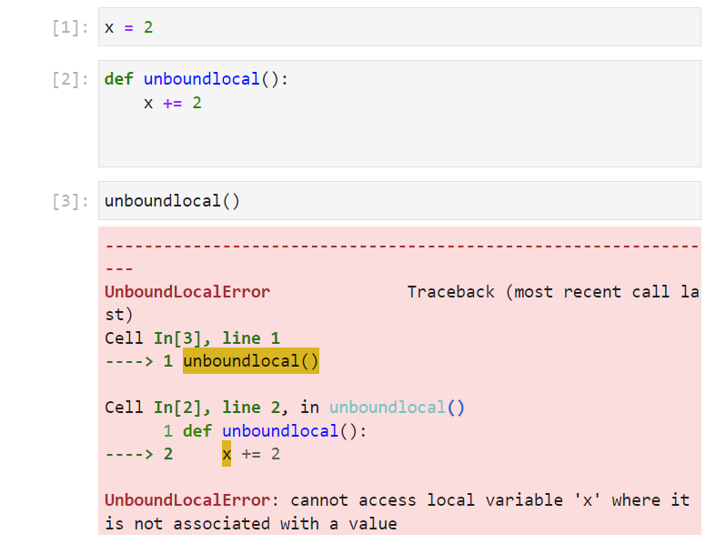

The ```global``` variable can be modified in the function by use of the ```global``` statement:

```
x = 2

def updateglobalvariable():
    global x
    x += 2


updateglobalvariable()
```

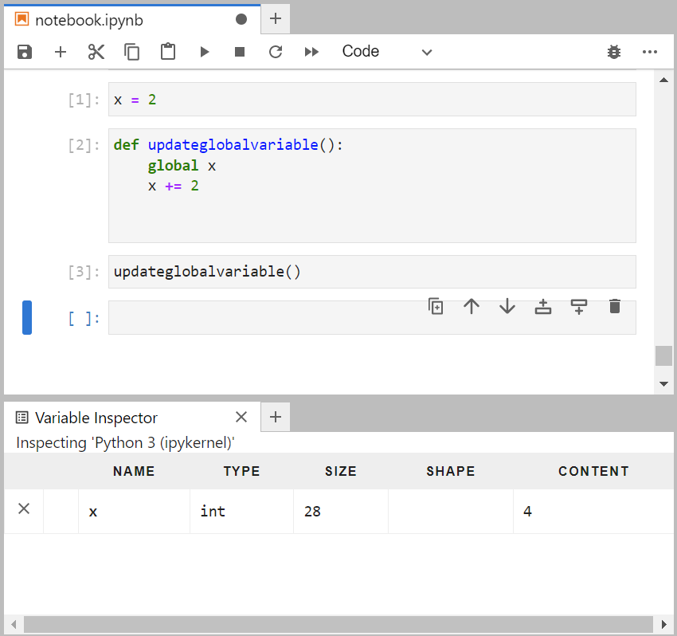

Care should be taken when the variable is mutable. If a mutable method is used, it will modify the global mutable variable. For example:

```
active = [1, 2, 3, 4]

def updateactive():
    active.append(5)
    

updateactive()    
active
```

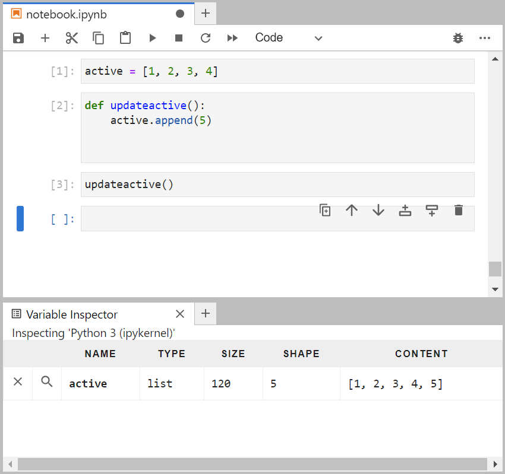

Note that when a mutable variable is returned to a new value using a function, that an alias of it is made:

```
active = [1, 2, 3, 4]

def returnactive(data):
    return data
    

active2 = returnactive(active)    
active2.append(5)
```

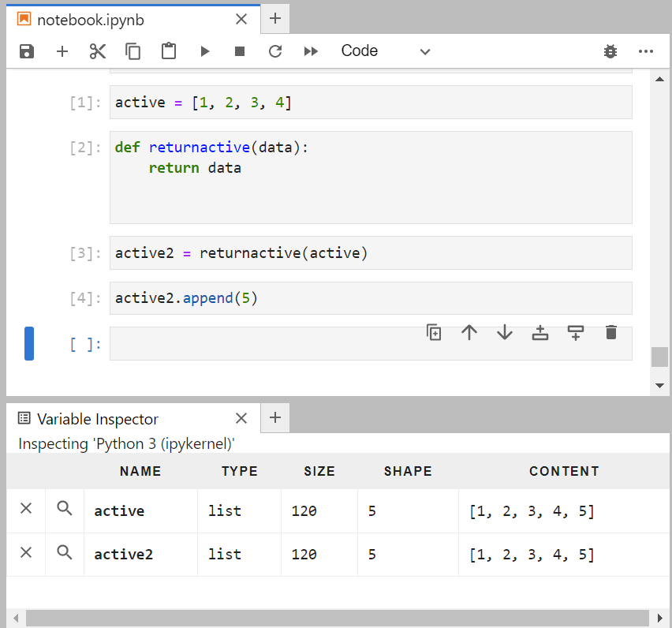

This can be prevented by creating a copy or deepcopy as appropriate:

```
active = [1, 2, 3, 4]

def returnactive(data):
    return data.copy()
    

active2 = returnactive(active)    
active2.append(5)
```

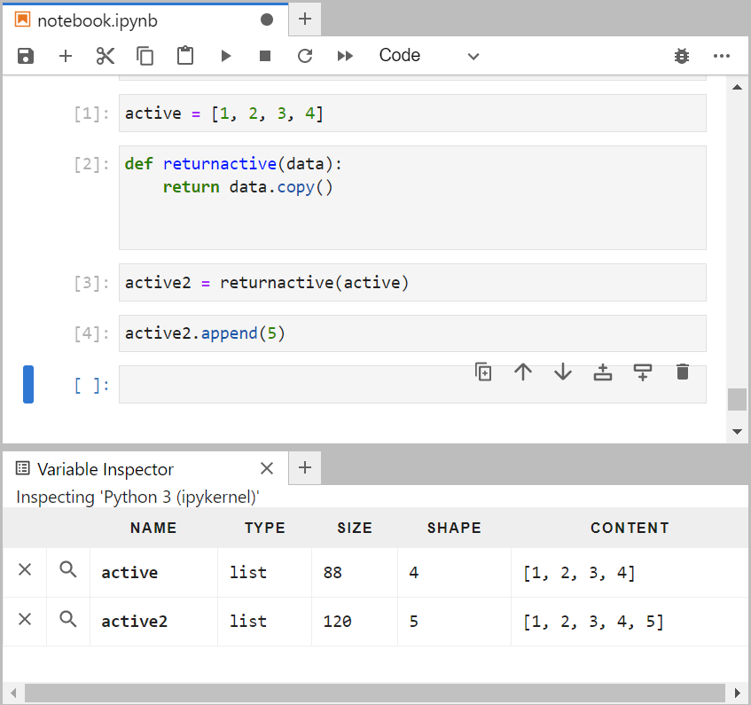

### *args and **kwargs

Returning to the function:

```
def higher(num1, num2, /):
    assert isinstance(num1, (int, float, bool))
    assert isinstance(num2, (int, float, bool))
    if num1 > num2:
        return num1
    return num2


```

Notice that there are two positional input arguments. These can be provided from a ```tuple``` of two numbers:

```
nums = (3, 2)
```

To unpack the ```tuple``` during the function call, it can be prefixed with a ```*```:

```
higher(*nums)
```

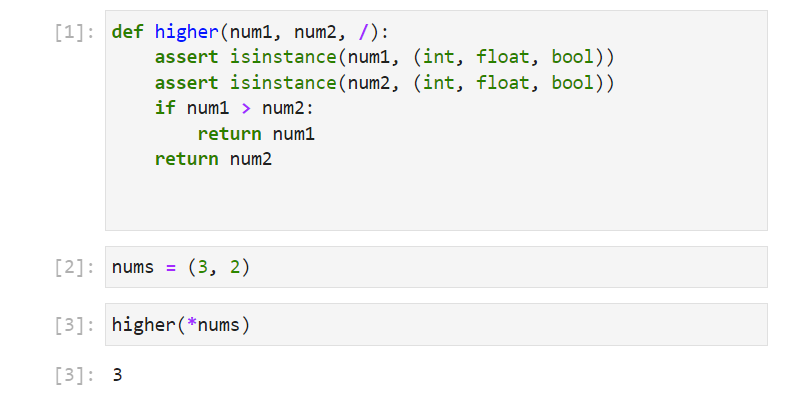

The function can be modified to take in keyword input arguments:

```
def higher(num1=1, num2=2):
    assert isinstance(num1, (int, float, bool))
    assert isinstance(num2, (int, float, bool))
    if num1 > num2:
        return num1
    return num2


```

A dictionary with keys that match the keyword input arguments of the function can be used:

```
nums = {'num1': 3, 'num2': 1}
```

To unpack the ```dict``` during the function call, it can be prefixed with a ```**```:

```
higher(**nums)
```

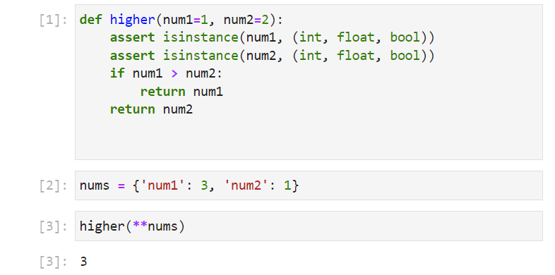

This syntax can be used to create a function that has a variable number of input arguments. 

```
def customsum(*args):
    """returns the sum of a variable number of 
    input arguments."""
    total = 0
    for num in args:
        assert isinstance(num, (int, float, bool))
        total += num
    return total
        
        
```

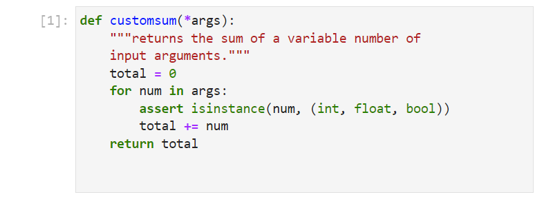

This can be called with a variable number of input arguments:

```
customsum()
customsum(1)
customsum(1, 2, 3, 4)
```

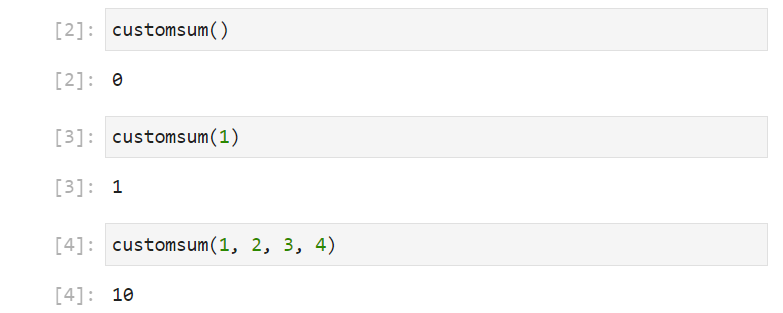

A similar implementation can be carried out using ```**kwargs```:

```
def customsum(**kwargs):
    """returns the sum of a variable number of 
    keyword input arguments."""
    total = 0
    for key in kwargs:
        assert isinstance(kwargs[key], (int, float, bool))
        total += kwargs[key]
    return total
        

```


```
customsum(one=1, two=2, three=3, four=4)
```


### Yield and Generators

A function can use a ```yield``` statement instead of a ```return``` statement:

```
def incrementer(num=0):
    yield num
    
    
```

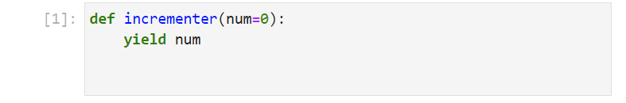

This function can be referenced as normal:

```
incrementer
```

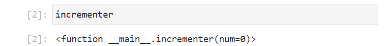

When called a generator is yielded opposed to a value returned. This is essentially an interator which evaluates the code in the function during each iteration:

```
incrementer()
```

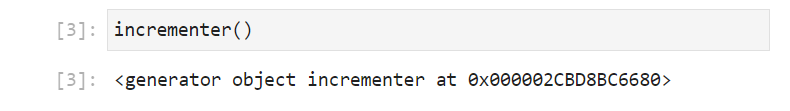

If assigned to a variable:

```
count = incrementer()
```


It can be incremented using ```next```:

```
next(count)
```

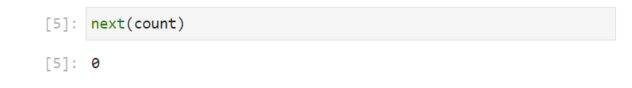

This generator is exhausted after one iteration:

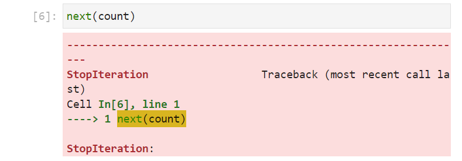

Normally the ```yield``` statement is included in a loop:

```
def incrementer(num=0):
    for index in range(5):
        yield num
        num += 1
    

clock = incrementer()
```

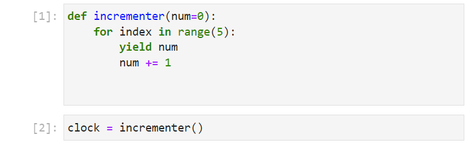

```
next(clock)
next(clock)
next(clock)
next(clock)
next(clock)
```

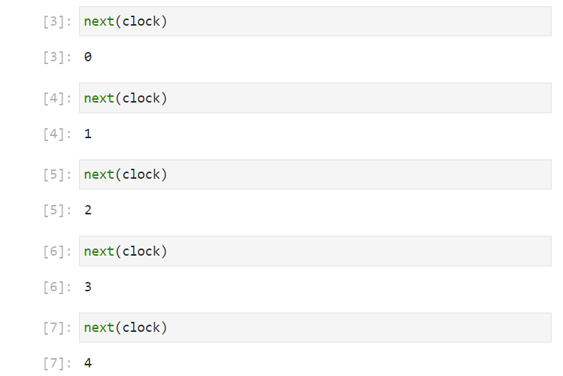

From the above it can be seen that very time ```next(clock)``` is called, the code in the function executes until a ```yield``` statement is reached. The code execution is then paused until ```next(clock)``` is called again. This happens until all ```yield``` statements have been exhausted at which point the generator is exhausted. For simplicity this mechanism can be demonstrated without a ```loop``` using:

```
def generate():
    yield 'a'
    yield 'b'
    yield 'c'
    
    
gen = generate()
next(gen)
next(gen)
next(gen)
next(gen)
```

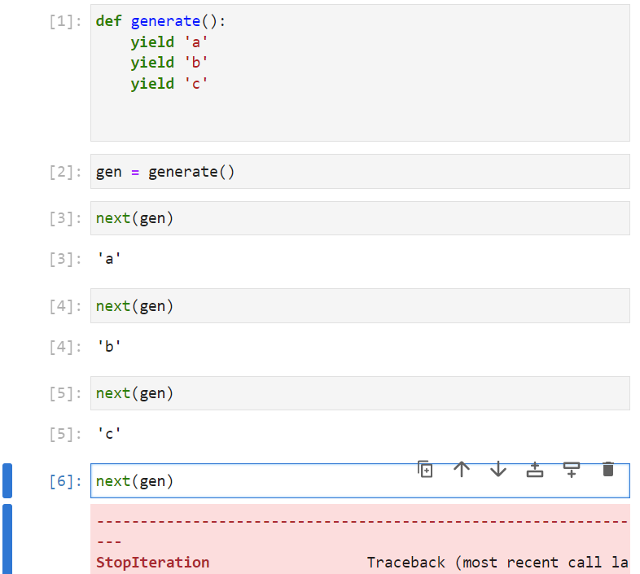

### First Order Function

The following function, takes a ```name``` as an input argument and returns a formatted string including.

```
def greeting(name):
    """prints greeting for supplied name
    Parameters
    ----------
    name : str
        name supplied.

    Returns
    -------
    str
        greeting.
    """
    assert isinstance(name, str)
    return f'Hello {name}'


```

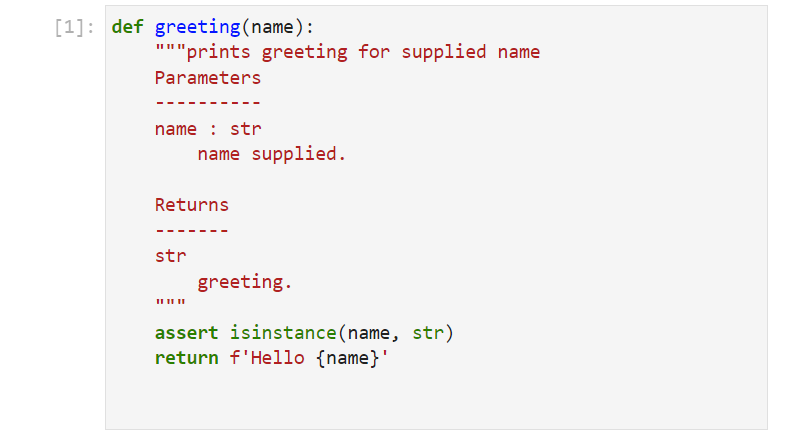

A function is a first order object. This means the function can be treated as a variable and assigned to any other variable name. For example:

```
f = greeting
```


To the right hand side of the assignment operator, the function is being referenced and not called. Therefore, there is no parenthesis following the function name. ```f``` is essentially a copy of the original function ```greeting```. If ```f``` is input followed by open parenthesis and shift ```⇧``` and the tab ```↹``` are input, details about the input argument displays alongside the docstring provided in greeting:

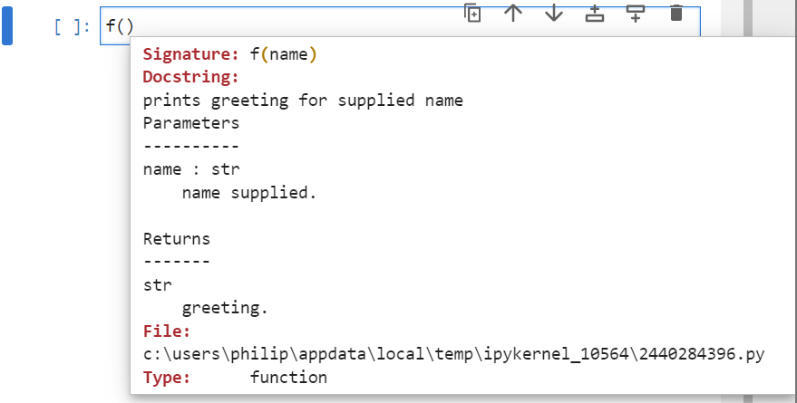

```f``` can therefore be called and supplied an input argument ```name``` using:

```
f('world')
f('earth')
```

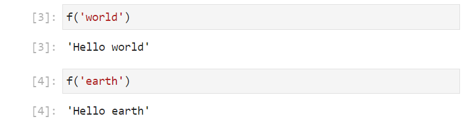

Note ```f``` is not an alias to ```greeting``` but a ```copy```. If ```greeting``` is deleted or reassigned, this will not change the functionality of ```f```:

```
del greeting
f('world')
```

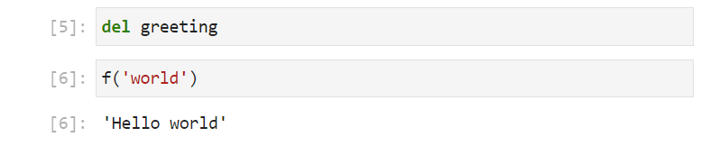

### Second-Order Function

The first-order function ```greeting``` can be defined as before:

```
def greeting(name):
    """prints greeting for supplied name
    Parameters
    ----------
    name : str
        name supplied.

    Returns
    -------
    str
        greeting.
    """
    assert isinstance(name, str)
    return f'Hello {name}'


```

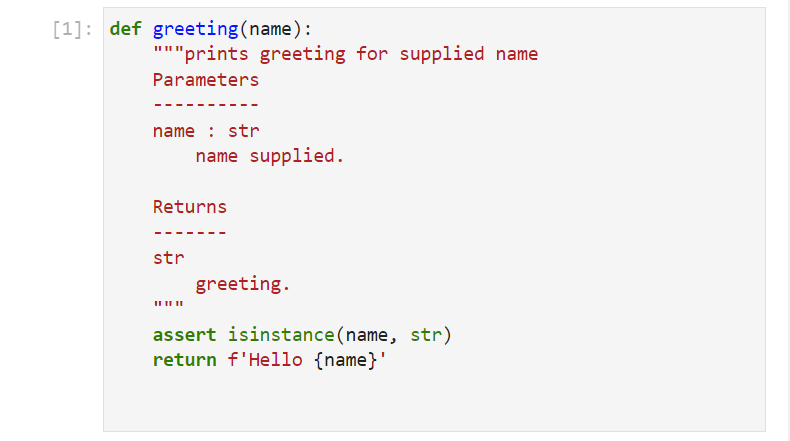

A second order function either takes in a function as an input argument or returns a function. The second order function ```second_input``` can be designed which takes in a function ```fun``` as an input argument.

```
def second_order(fun):
    """Takes in a function as an input argument
    and does nothing with it.

    Parameters
    ----------
    fun : function
        1st order function

    Returns
    -------
    None.
    
    """
    assert callable(fun)


```

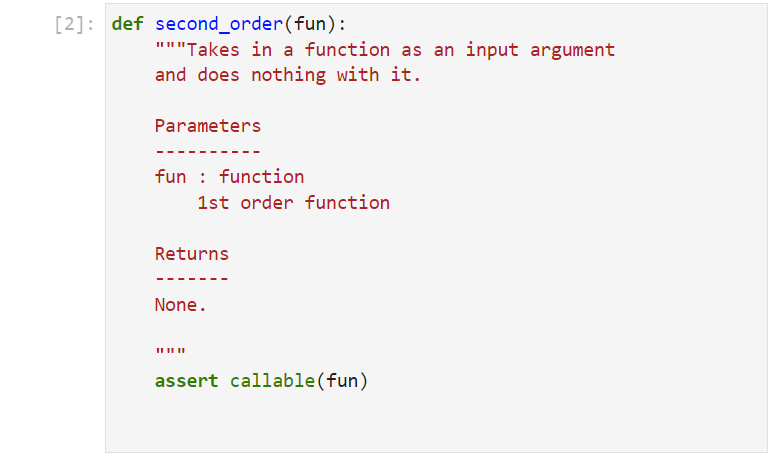

If this ```second_order``` function is called and provided a function as an input argument, the code will run, doing nothing. If another data type is supplied, an ```AssertionError``` will display:

```
second_order(greeting)
second_order(1)
```

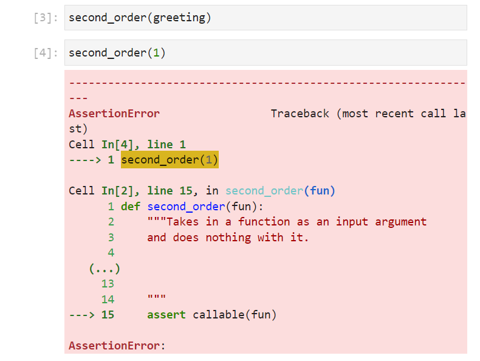

Notice the function ```greeting``` is supplied as an input argument as a reference and is not called.

The ```second_order``` function can be modified to return the function being supplied:

```
def second_order(fun):
    """Takes in a function as an input argument
    and does nothing with it.

    Parameters
    ----------
    fun : function
        1st order function

    Returns
    -------
    fun: function
        1st order function unmodified
    
    """
    assert callable(fun)
    return fun
    
    
```

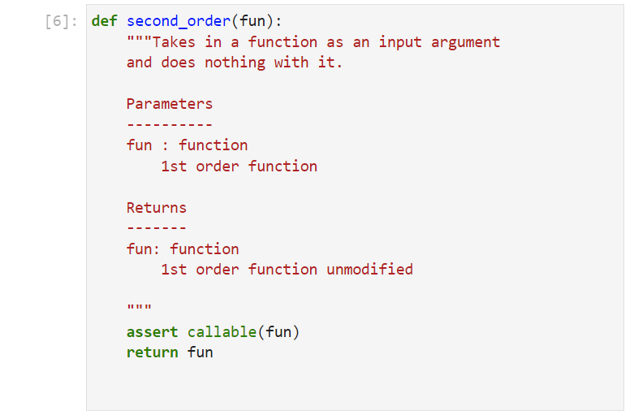

If this ```second_order``` function is called and provided a function as an input argument, the code will run, returning the function as a reference:

```
second_order(greeting)
```


To call the returned function ```greeting```, a set of parenthesis enclosing an input argument can be supplied:

```
second_order(greeting)('world')
```

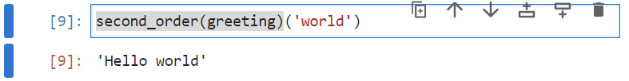

### Closures

In the above section it was seen that a function can be used as an input argument for another function. It is also possible to define a function wthin a function.

An ```inner``` function can be defined within an ```outer``` function:

```
def outer():
    def inner():
        return
    return


```

The return statement of the outer function can be used to return the function:

```
def outer():
    def inner():
        return
    return inner


```

Because the ```inner``` function is define within the local scope of the ```outer``` function it can access variables within the ```outer``` functions scope:

```
def outer():
    name = 'world'
    def inner():
        return f'hello {name}'
    return inner


```

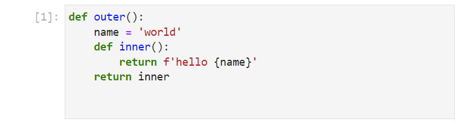

```outer``` can be referenced:

```
outer
```

```outer``` can be called to return ```inner```:

```
outer()
```

And ```inner``` can be called:

```
outer()()
```

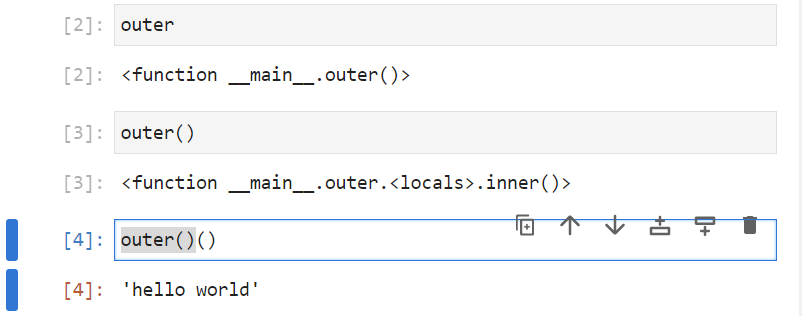

More generally, ```outer``` would be called and assigned to a variable name:

```
fun_in = outer()
```

Then this variable name which is assigned to a function would be called:

```
fun_in()
```

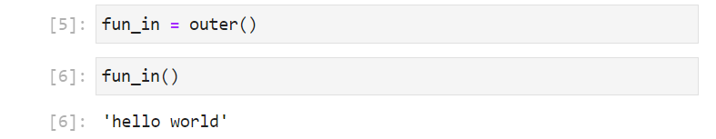

Let's modify the above code so an input argument ```name``` is requested by the ```outer``` function. This input argument is accessible by the ```inner``` function:

```
def outer(name):
    def inner():
        return f'hello {name}'
    return inner


```

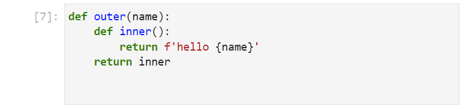

The ```outer``` function can be called and assigned to a variable name:

```
fun_in = outer('world')
```


The variable ```'world'``` was provided by the ```outer``` function which has finished executing but is now **enclosed** within the ```inner``` function.

```
fun_in()
fun_in()
```

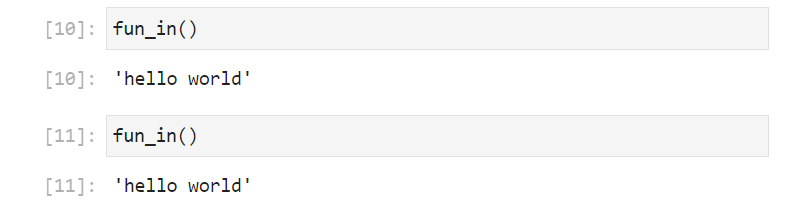

For this reason, the configuration above is known as a **closure** as variables provided from the outer function can be enclosed within the inner function.

In HTML the following tags ```<p>``` and ```<\p>``` are used to enclose a paragraph and ```<h1>``` and ```<\h1>``` are used to enclose a heading of level 1.

A closure can be defined using:

```
def html_tag(tag):
    def html_text(text):
        return f'<{tag}>{text}</{tag}>'
    return html_text


```

The outer ```html_tag``` function can be called using a provided tag.

```
para = html_tag('p')
h1 = html_tag('h1')
```

This creates the inner function with an enclosed tag, which can be called providing text to format it using the enclosed tag:

```
h1('Twinkle, Twinkle, Little Star')
para('Twinkle, twinkle, little star,')
para('How I wonder what you are!')
para('Up above the world so high,')
```

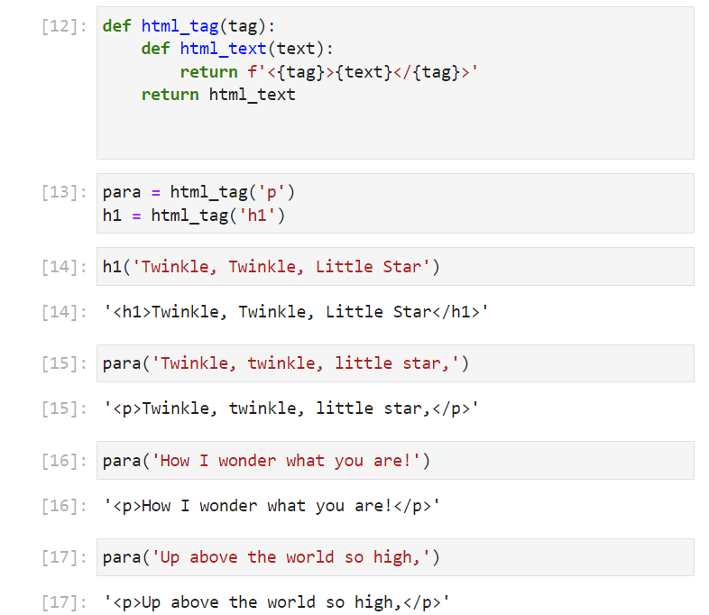

### Decorators

A decorator uses an outer function which contains an inner function. The outer function takes in an external function as its input argument. This external function is returned by the inner function which also contains additional code. The outer function returns the inner function. This configuration extends the behavior of the external function without explicitly modifying it and the additional code in the inner function decorates the external function: 

```
def outer(external_function):
    def inner():
        print(f'calling the {external_function}')
        return external_function
    return inner


```

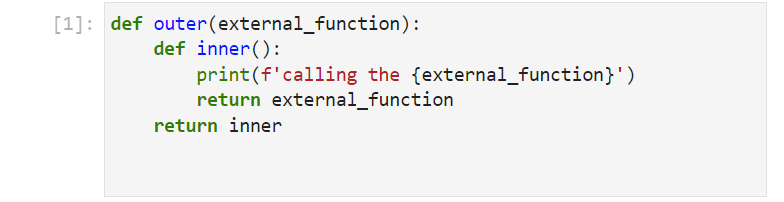

A simple ```greeting``` function can be decorated:

```
def greeting():
    """ generic greeting.
    Returns
    -------
    str
        'hello'.

    """
    return 'hello'


```

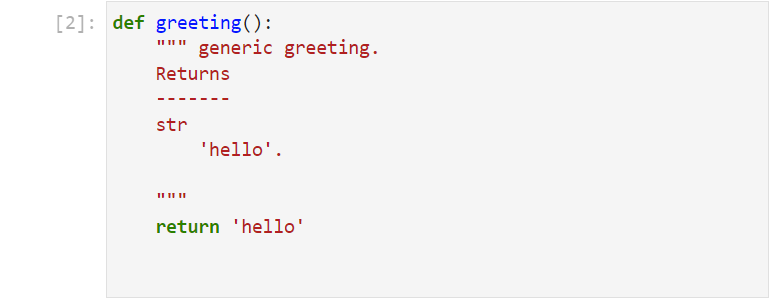

The decorator function can be called and assigned to an object name:

```
greeting_decorated = outer(greeting)
```


```greeting_decorated``` which returns the inner function can be referenced using:

```
greeting_decorated
```

This inner function can be called using:

```
greeting_function_decorated()
```

The inner function returns the external function which can be called:

```
greeting_function_decorated()()
```


Now if instead of referencing the external function within the inner function return statement, it is called:

```
def outer(external_function):
    def inner():
        print(f'calling the {external_function}')
        return external_function()
    return inner


```

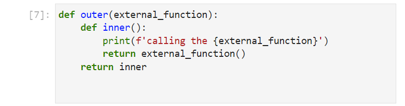

The external function, ```greeting``` is unchanged. Once again the outer function can be called and assigned to a variable name:

```
greeting_decorated = outer(greeting)
```


It can be referenced:

```
greeting_decorated
```

And called:

```
greeting_decorated()
```

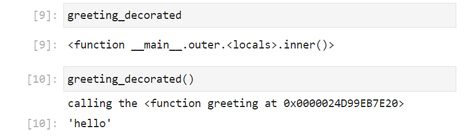

In the above case, the external function ```greeting``` being decorated had no input arguments. In this example, an input argument ```name``` will be added:

```
def greeting(name):
    """ custom greeting
    Parameters
    ----------
    name : str
        user name

    Returns
    -------
    str
        custom greeting

    """
    assert isinstance(name, str)
    return f'hello {name}'


```

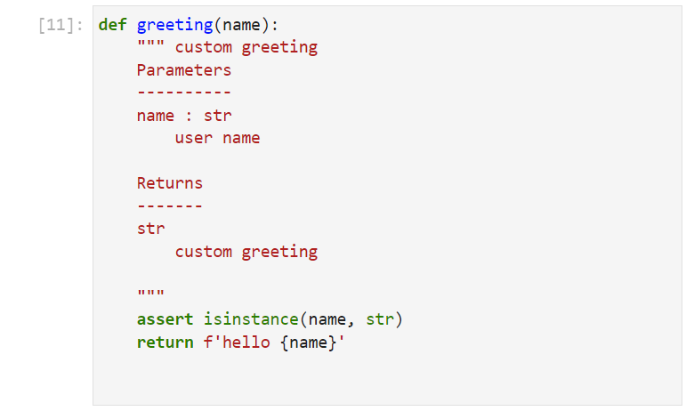

To accommodate the input argument ```name```, the return statement of the ```inner``` must provide the input argument 

```
def outer(external_function):
    def inner():
        print(f'calling the {external_function}')
        return external_function(name)
    return inner


```

In order to do so, the ```inner``` function itself must also be supplied the input argument ```name```:

```
def outer(external_function):
    def inner(name):
        print(f'calling the {external_function}')
        return external_function(name)
    return inner


```

More generally ```*args``` and ```**kwargs``` will be used to allow a generic number of positional and keyword input arguments into the ```inner``` function so that they can be supplied when calling the ```external_function```.

```
def outer(external_function):
    def inner(*args, **kwargs):
        print(f'calling the {external_function}')
        return external_function(*args, **kwargs)
    return inner


```

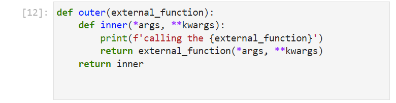

The ```outer``` function can be called, supplying the external function ```greeting``` as an input argument and its function call assigned to a variable name:

```
greeting_decorated = outer(greeting)
```


It can be referenced:

```
greeting_decorated
```

And called using an input argument ```name```:

```
greeting_decorated('world')
```


A new object name was created for the decorated function:

```
greeting_decorated = outer(greeting)
```

More often it is reassigned to the name of the function being decorated:

```
greeting = outer(greeting)
```

Prefixing ```@outer``` above the function definition will also decorate it. With this syntax, the decorated function name will use the same name as the original function:

```
@outer
def greeting(name):
    """ custom greeting
    Parameters
    ----------
    name : str
        user name

    Returns
    -------
    str
        custom greeting

    """
    assert isinstance(name, str)
    return f'hello {name}'


```

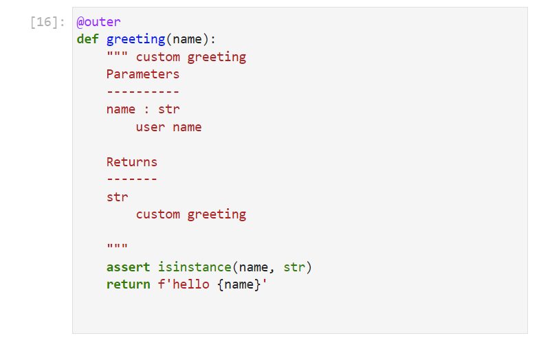

Now, when the function is called, it is decorated, which can be seen from the additional print statement:

```
greeting('world')
```

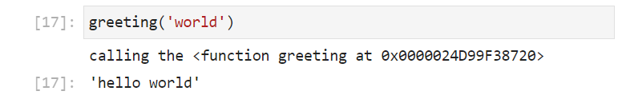

Although the input arguments are passed through, the docstring is not:

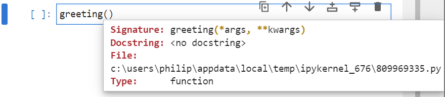

The ```functools``` module groups together function tools. One of the tools is the ```wraps``` function which can be used as a decorator:

```
from functools import wraps

def outer(external_function):
    @wraps(external_function)
    def inner(*args, **kwargs):
        print(f'calling the {external_function}')
        return external_function(*args, **kwargs)
    return inner


```

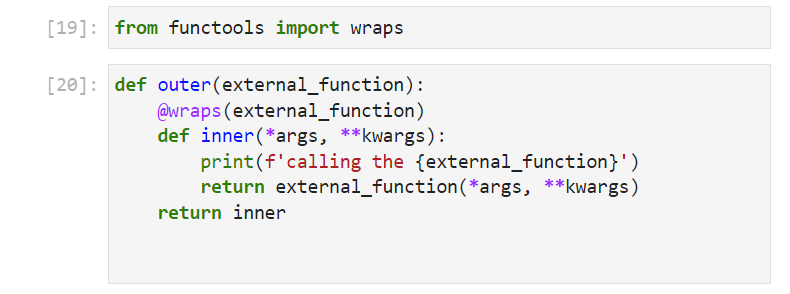

And rerunning:

```
@outer
def greeting(name):
    """ custom greeting
    Parameters
    ----------
    name : str
        user name

    Returns
    -------
    str
        custom greeting

    """
    assert isinstance(name, str)
    return f'hello {name}'


```

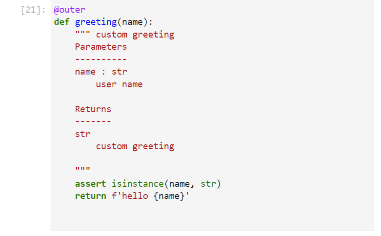

Now shows the docstring of the function being decorated:

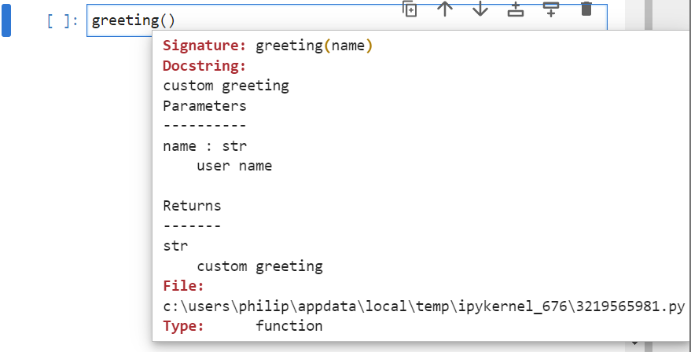

When the decorated function is called and supplied an input argument, the additional print statement that decorates the function shows:

```
greeting('world')
```

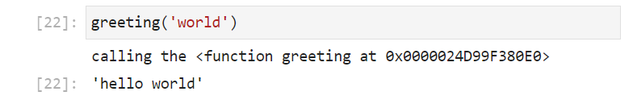

The inner function is only used internally within the outer function. As a consequence both the outer and inner functions take on the same function name, with the inner prefixed with an underscore, recalling that a prefix with an underscore designates internal use. For example:

```
def wrapper(external_function):
    @wraps(external_function)
    def _wrapper(*args, **kwargs):
        print(f'calling the {external_function}')
        return external_function(*args, **kwargs)
    return _wrapper


```

This can be used to wrap the external function as before:

```
@wrapper
def greeting(name):
    """ custom greeting
    Parameters
    ----------
    name : str
        user name

    Returns
    -------
    str
        custom greeting

    """
    assert isinstance(name, str)
    return f'hello {name}'


```

Calling the function and supplying an input argument, or examining the docstring works in the same manner as earlier:

```
greeting('world')
```

## The lambda Expression

The keyword ```lambda``` is taken from the Greek alphabet and lacks description for its use case in Python. ```lambda``` should be conceptualised as meaning *make anonymous function* as it is used to create a simple anonymous function over a single line. Because it is anonymous and expressed over a single line, it does not have a docstring.

Let's return to the basic implementation of the function ```plural``` without any assertions or docstring:

```
def plural(word):
   return word + 's'


```

This can be re-expressed as a lambda expression:

```
plural = lambda word: word + 's'
```

The commonalities can be examined, first of all is the function name:

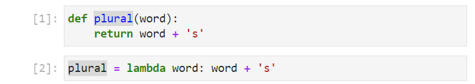

Then the assignment operator ```=``` which can be thought of as being equivalent to the ```def``` keyword:

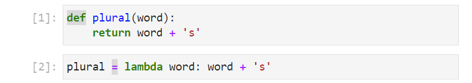

Next is the input arguments. In this case only 1 input argument displays. If more are used, they are seperated by a ```,```. Alternatively some functions do not have input arguments:

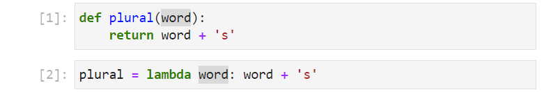

Next is the colon ```:```. In the function it begins a code block. In the lambda expression, there is no code block and the code continues on the same line. In the lambda expression the colon ```:``` can also in some case be conceptualised as the seperation of the input arguments from the return statement, carrying out a similar purpose to splitting a key from a value in a Python dictionary:

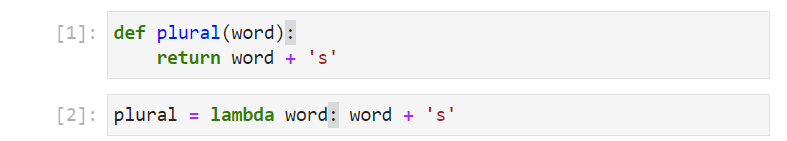

Finally there is the return value. Not all functions have a return value, some functions call other functions such as print, which always prints and has no return value:

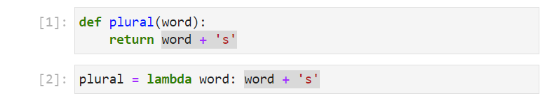

The ```lambda``` expression can be called in the same way as the equivalent function before:

```
plural('apple')
```

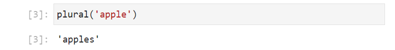

Some lambda expressions are totally anonymous and aren't even assigned to a name:

```
lambda word: word + 's'
```


They can be called without assignment on a single line:

```
(lambda word: word + 's')('apple')
```

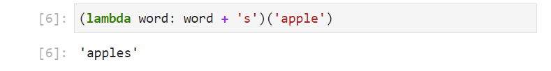

### Map

A ```lambda``` expression is designed to take a scalar input argument and return a value which is calculated using that input argument:

```
square = lambda x: x ** 2
```

Sometimes it is desired for a function to be invoked for every value in an iterable: 

```
nums = (1, 2, 3, 4, 5)
```

The ```map``` function can be used to map a function to an iterable:

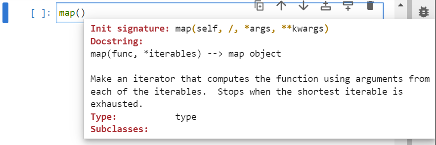

This creates a ```mapped``` object:

```
map(square, nums)
```

This ```mapped``` object is essentially a generator and evaluates the value for each item in the sequence when ```next``` is invoked. More commonly it is cast into a sequence such as a ```tuple```:

```
tuple(map(square, nums))
```

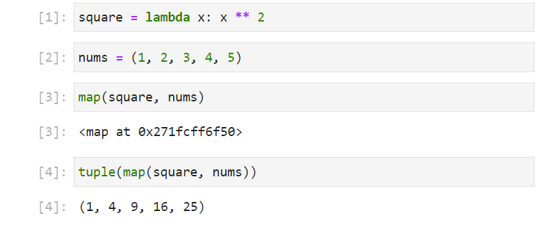

Putting this together in a single line using lists instead of tuples:

```
list(map(lambda x: x ** 2, [1, 2, 3, 4, 5]))
```

Many of the use cases for ```map``` are superseded by comprehensions which are cleaner and simpler. For example:

```
[num ** 2 for num in [1, 2, 3, 4, 5]]
```

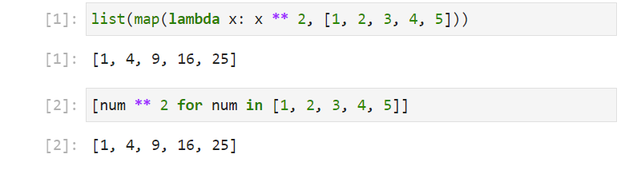

However the principle behind using the ```map``` function is still applicable for other data structures particularly mapping a function to a series within a pandas dataframe.

### Filter 

A lambda expression can be used to create a scalar filter function, that for example only returns a positive number:

```
positive = lambda x: x >= 0
```

Now supposing the following ```nums``` are created:

```
nums = tuple(range(-5, 6))
nums
```

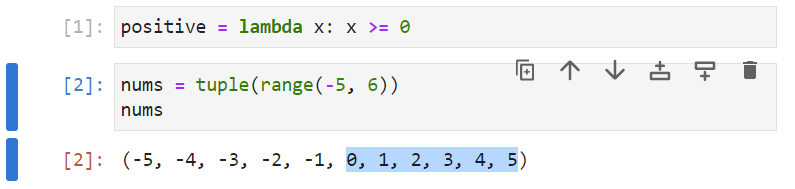

And from this iterable, only the numbers greater or equal to ```0``` are desired.

The ```filter``` function can be used to map the scalar filter function to a sequence:

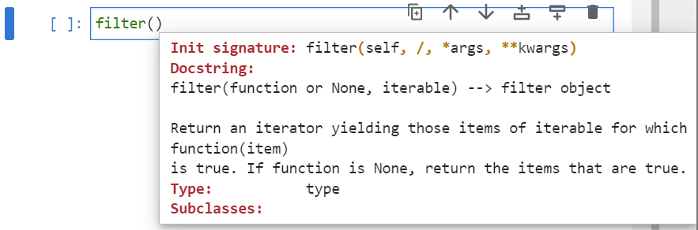

```
filter(positive, nums)
```

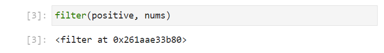

This ```filter``` object is essentially a generator and evaluates the value for each item in the sequence when ```next``` is invoked. More commonly it is cast into a sequence such as a ```tuple```:

```
tuple(filter(positive, nums))
```


Putting this together in a single line using lists instead of tuples:

```
list(filter(lambda x: x >= 0, list(range(-5, 6))))
```

This can be compared to a list comprehension:

```
[num for num in list(range(-5, 6)) if num >= 0]
```

The following list comprehension can also be used to see how the mapping works using boolean values:

```
[num >= 0 for num in list(range(-5, 6))]
```

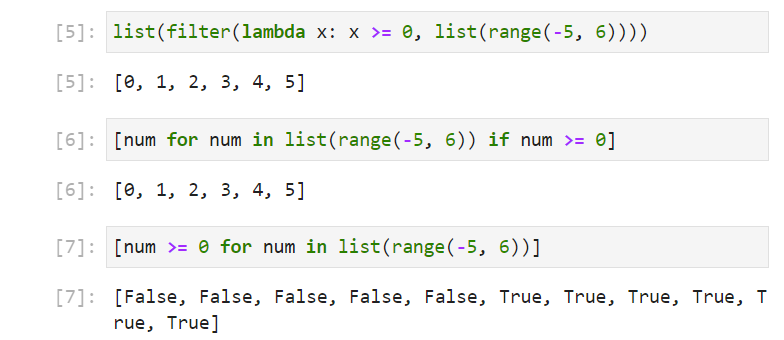

### Reduce

Sometimes it is desirable to ```reduce``` an iterable into a single value:

```
nums = (1, 2, 3, 4)
```

The following lambda expression will reduce two variables to a singular variable:

```
summation = lambda x, y: x + y
```

This can be done using the ```reduce``` function found in the ```functools``` module:

```
from functools import reduce
```

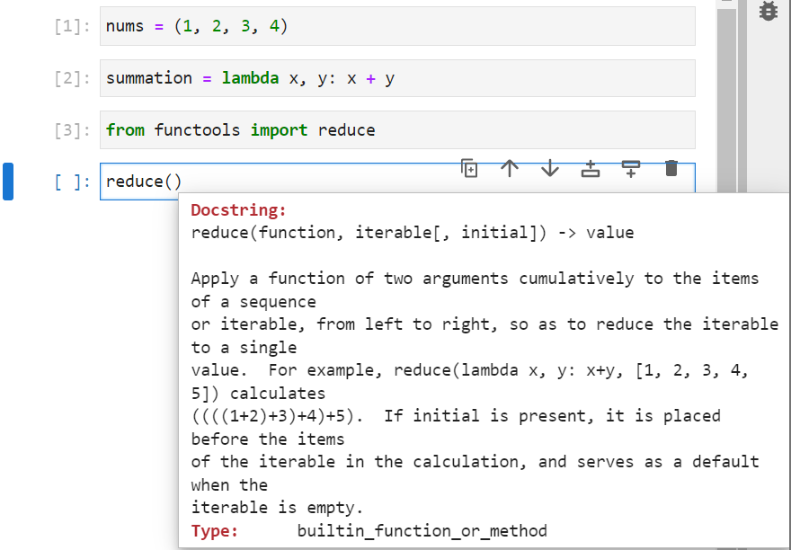

```
reduce(summation, nums)
```

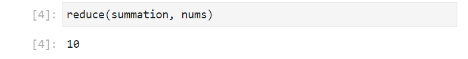

Under the hood, conceptualise this as a ```for``` loop. In the first iteration. ```x``` is initially ```1``` the value at the 0th index and ```y``` is initially ```2``` the value of the 1st index. The result ```x + y``` is therefore ```3```. In the second iteration ```x``` is now taken to be the value of ```3``` calculated from the previous iteration and ```y``` is taken to be the value at the 2nd index, which is also ```3```. ```x + y``` is therefore calculated to be ```6```. In the third iteration, ```x``` is taken to be the value of the previous iteration ```6``` and ```y``` is taken to be the value at the last index. The final ```x + y``` calculation is therefore ```10``` which is returned.

## try, except, else, finally

Earlier ```if```, ```elif``` and ```else``` were examined to direct code in response to a condition. In Python there are four code blocks used for error handling

|Code Block|Purpose|
|---|---|
|try|The try code block contains the code to be tested. It can run without any errors or execute can halt when an error is found.|
|except|This code block uses an error class as a condition. It will be used to handle this error type if this error occurs. Multiple except blocks can be configured for various error types.|
|else|This else code block will be ran, if none of the previous except blocks have been executed.|
|finally|This code block is carried out regardless if there is an error or not.|

These are normally used within a function and are best understood using an example. For example after asserting the data type of an input argument.

```
def plural(word):
    try:
        assert isinstance(word, str)
    except AssertionError:
        word = f'num: {str(word)}'
    else:
        word = f'word: {word}'
    finally:
        return word + 's'
    
    
```

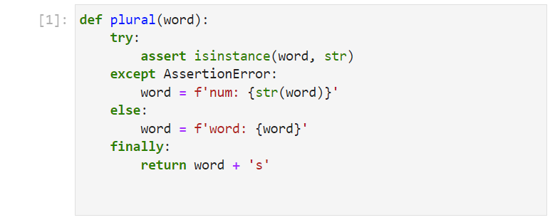

For example, if the following is used, the ```try``` block does not encounter any error. Therefore the ```except``` code blocks are skipped and the ```else``` and ```finally``` code blocks are executed:

```
plural('Apple')
```

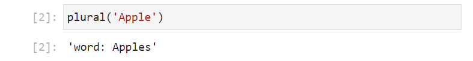

For example, if the following is used, the ```try``` block encounters an ```AssertionError```. Therefore the ```except``` code block configured for an ```AssertionError``` is executed and the ```else``` block is skipped. The ```finally``` code block is also executed:

```
plural(2)
```

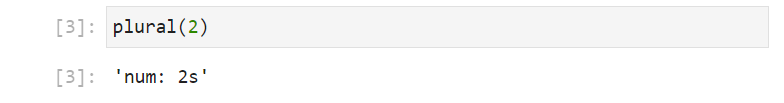

Another example can be given. In this scenario, the ```try``` code block is configured to look for two errors, an ```AssertionError``` and a ```TypeError```

```
def compare(num1, num2):
    try:
        assert isinstance(num1, (int, float, bool))
        num1 > num2
    except AssertionError:
        print('num1 not numeric')
    except TypeError:
        print('num2 not numeric')
    else:
        print('num1 and num2 are numeric')
    finally:
        print('num1 has been examined')
    
    
```

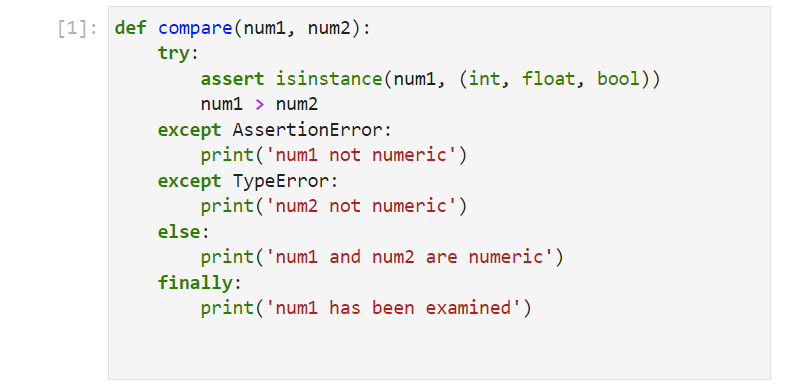

No errors are encountered in the ```try``` code block. The ```else``` code block is executed and the ```finally``` code block is executed:

```
compare(1, 2)
```

An ```AssertionError``` is encountered in the ```try``` code block. The ```except TypeError``` code block is executed and the ```finally``` code block is executed:

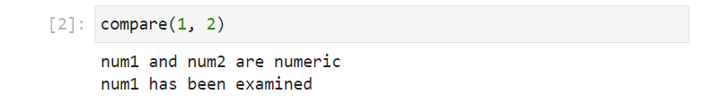

```
compare('a', 2)
```


A ```TypeError``` is encountered in the ```try``` code block. The ```except TypeError``` code block is executed and the ```finally``` code block is executed:

```
compare(1, 'b')
```

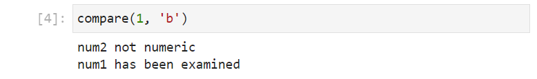

An ```AssertionError``` is encountered in the ```try``` code block. This raises the ```AssertionError``` on the first line of code and all subsequent code is skipped. The ```except TypeError``` code block is executed and the ```finally``` code block is executed:

```
compare('a', 'b')
```

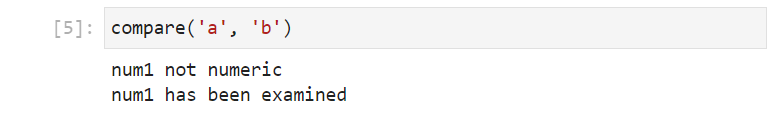

The above demonstrated the capabilities of error handling using code blocks. The ```else``` and ```finally``` code blocks are optional. 

Normally ```try``` and ```except``` are configured for each input argument. The ```except``` can also include a nested ```try``` and ```except```:

```
def higher(num1, num2):
    try:
        assert isinstance(num1, (int, float, bool))
    except AssertionError:
        try:
            num1 = float(num1)
        except ValueError:
            num1 = 1
            print('num1 given a default value of 1')
    try:
        assert isinstance(num2, (int, float, bool))
    except AssertionError:
        try:
            num2 = float(num2)
        except ValueError:
            num2 = 2
            print('num2 given a default value of 2')
    finally:
        if num1 > num2:
            return num1
        else:
            return num2


```

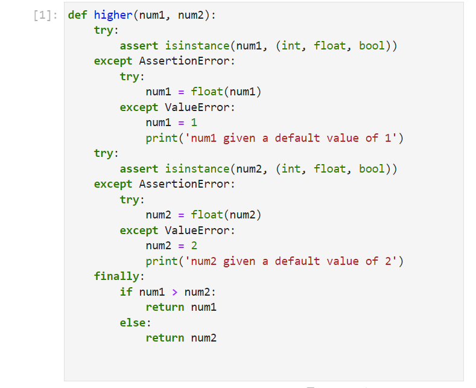

The effect of error handling can be seen with the following examples. 

The first case has no errors. 

The second case raises an ```AssertionError``` which is handled in the ```except ValueError``` via the nested ```try``` code block. 

The third case once again raises an ```AssertionError```. An attempt to handle it is carried out in the ```except ValueError``` code block via the nested ```try``` code block, this in turn raises a ```ValueError```, so the nested ```except ValueError``` code block handles it.

In all cases once the input arguments are handled, the ```finally``` code block is executed:

```
higher(3, 4)
higher(3, '3.14')
higher(3, 'three')
```

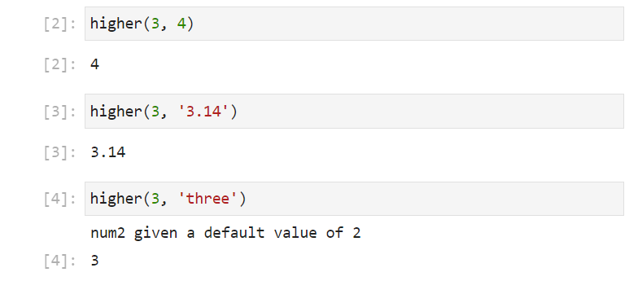

[Home Python Tutorials](https://github.com/PhilipYip1988/python-tutorials/blob/main/readme.md)
