# The Collections Module

Python has a ```collections``` module which has a number of supplementary collections to those explored in Pythons ```builtins```. It can be imported using:

```
import collections
```

And the modules docstring can be viewed:

```
? collections
```


The most important classes are listed. 

## namedtuple

A ```tuple``` can be conceptualised as an immutable archive of records. Each record only has a numeric index associated with the value and doesn't have a field name to describe what the value is. Foar example in the following tuple it is hard to distinguish what field is what:

```
(4, 3, 2023)
```


Some more details may be deduced from the variable name:

```
date = (4, 3, 2023)
```


However it is still unclear whether the 4 is the day (UK format) or the month (US format). In such a case, a dictionary may be more appropriate. The ```dict``` class can be used to instantiate the dictionary:

```
date = dict(day=4, month=3, year=2023)
date
```


When dealing with a large number of archives, the keys need to be specified every time:

```
today = dict(day=14, month=3, year=2023)
tommorrow = dict(day=15, month=3, year=2023)
yesterday = dict(day=13, month=3, year=2023)
nextmonth = dict(day=14, month=4, year=2023)
nextyear = dict(day=14, month=3, year=2024)
```


And there is no check to make sure the keys are input consistently:

```
tommorrow = dict(d=15, m=3, y=2023)
tommorrow
```


It is more convenient to group all of the data above into a subclass that has a datastructure similar to a ```tuple``` but is fixed length and associates each record with an appropriate field name. 

The ```namedtuple``` is a factory function that creates a ```NamedTuple``` subclass; essentially a ```tuple```-like data structure or template that in this case has only three fields the  ```'day'```, ```'month'``` and ```'year'``` respectively. Once this subclass is created, it can be instantiated for each date above. 

Do not confuse the factory function ```namedtuple``` which is lower case and the abstract class ```NamedTuple``` which is CamelCase. Note that the abstract class ```NamedTuple``` isn't used directly, instead subclasses with a predefined number of fields and field names are created.

The ```namedtuple``` factory function can be imported from the ```collections``` module using:

```
from collections import namedtuple
```


To view the docstring of the ```namedtuple``` factory function input the function name with open parenthesis followed by shift ```⇧``` + tab ```↹```:


For example the subclass ```DateTuple``` can be created using:

```
DateTuple = namedtuple('DateTuple', 
                       ('day', 'month', 'year'))
```


The name of the ```NamedTuple``` subclass ```'DateTuple'``` is supplied as a string for the first input argument which is used to generate a docstring. This normally matches the name ```DateTuple``` the subclass is assigned to and as it is a subclass should be in CamelCase. Note the difference between the object name specified without quotations to the left hand side of the assignment operator and the string provided as the first input argument to the ```namedtuple``` factory function which is enclosed in quotations:


The names of the fields are supplied as a ```tuple``` of strings:


The field names follow the same rules as Python object names and become input arguments for the ```DateTuple``` subclass as well as identifiers of any ```DateTuple``` instances. 

The input arguments can be seen if the init signature of the ```DateTuple``` subclass by typing in the subclass name followed by open parenthesis and shift ```⇧``` + tab ```↹```:


The identifiers can be seen by inputting the subclass name followed by a ```.``` and pressing tab ```↹```:


The ```count``` and ```index``` methods are inherited from the ```tuple``` superclass and the method resolution order ```mro``` is inherited from the ```object``` superclass. The ```mro``` can be examined using:

```
DateTuple.mro()
```


From the method resolution order, the abstract superclass ```NamedTuple```, the superclass ```tuple``` and the ```superclass``` object are seen. These methods are not redefined and therefore behave identically to those from their parent class.

If the subclass is assigned to an inconsistent name to the first input argument provided as an input argument in the factory function ```namedtuple```, the init signature and the docstring become inconsistent:

```
InconsistentName = namedtuple('DateTuple', 
                              ('day', 'month', 'year'))
```

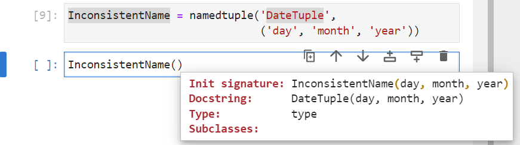

By default, ```rename``` is ```False``` which means if an invalid object name is assigned a ```ValueError``` displays:

```
BadName = namedtuple('BadName', 
                     ('da y', 'month', 'year'),
                     rename=False)
```

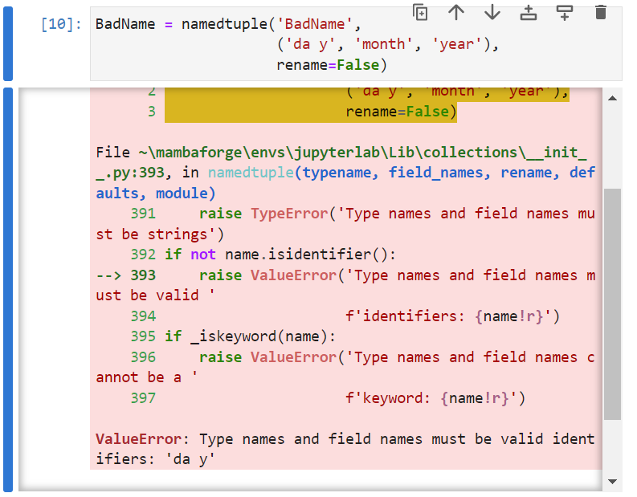

If ```rename``` is set to ```True``` invalid names will be renamed ```_0``` where the number is the index in the ```NamedTuple``` subclass:

```
BadName = namedtuple('BadName', 
                     ('da y', 'month', 'year'),
                     rename=True)
```
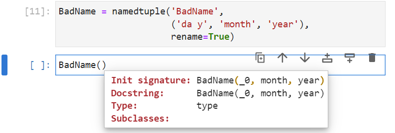

The field names can optionally be given default values:

```
DateTuple = namedtuple('DateTuple', 
                       ('day', 'month', 'year'),
                       defaults=(14, 3, 2023))
```

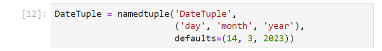

This means when ```DateTuple``` is instantiated without values provided, the defaults are given:

```
DateTuple()
```

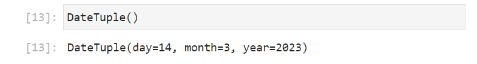

The keyword argument ```module``` is used to update the  ```__module__``` data model identifier. This is consistent to the name of the Python script file (```script```.py file) that the ```NamedTuple``` subclass ```DateTuple``` is assigned in:

```
DateTuple = namedtuple('DateTuple', 
                       ('day', 'month', 'year'),
                       module='script')

DateTuple.__module__
```

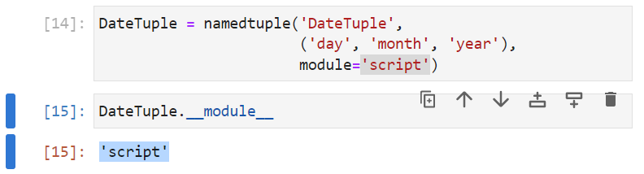

Returning to:

```
DateTuple = namedtuple('DateTuple', 
                       ('day', 'month', 'year'),
                       defaults=(14, 3, 2023))
```

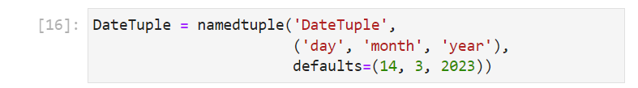

The ```DateTuple``` docstring can be viewed by typing in ```DateTuple``` with open parenthesis followed by shift ```⇧``` + tab ```↹```:

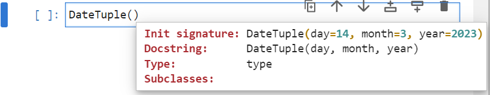

```DateTuple``` instances, that is archives with the fields ```day```, ```month``` and ```year``` can be instantiated. Consistency in their format (UK date format) is maintained by following the docstring. Instances can be created using default values, named parameters or positional parameters:

```
today = DateTuple()
tomorrow = DateTuple(day=15, month=3, year=2023)
yesterday = DateTuple(14, 3, 2023)
```


Identifiers can be viewed by typing in an instance name followed by a dot ```.``` and tab ```↹```:

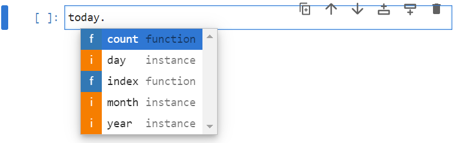

The field names ```day```, ```month``` and ```year``` can be used to read off each value:

```
today.day
today.month
today.year
```

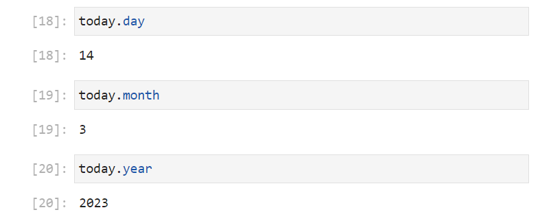

There are a number of additional identifiers available from the parent class ```NamedTuple``` that begin with a leading underscore. The purpose of the leading underscore is to prevent accidental overriding of the identifier with a field name. These identifiers cannot be viewed by typing in the instance name followed by a dot ```.``` and tab ```↹``` and instead the directory of the instance has to be examined using the ```dir``` function:

```
dir(today)
```

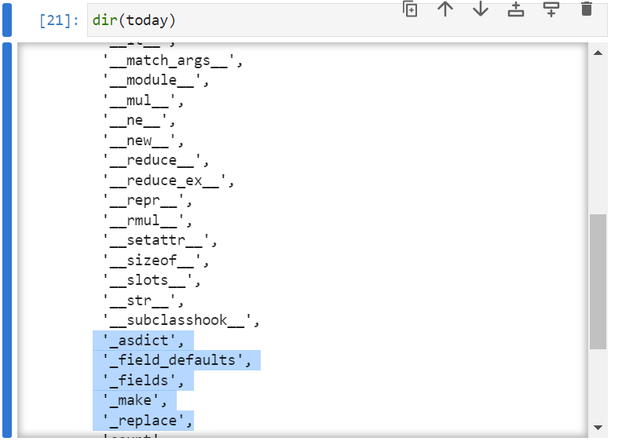

The data model identifiers that begin and end with a double underscore are inherited from the superclass ```tuple``` are unmodified and behave identically.

The additional identifiers are the attributes ```_fields``` which returns the ```tuple``` of field names and ```_field_defaults``` which returns a ```dictionary``` where the keys are the field names and the values are the default values:

```
yesterday._fields
yesterday._field_defaults
```

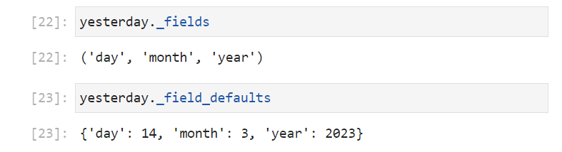

```asdict``` is a method that returns a dictionary where the keys are the field names and the values are the values:

```
yesterday._asdict
yesterday._asdict()
```

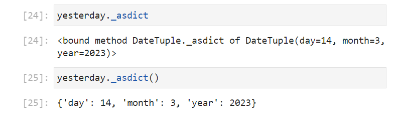

Attempting to cast a ```NamedTuple``` subclass into a dictionary using the ```dict``` class attempts to convert only the ```tuple``` properties into the dictionary and gives a ```TypeError```:

```
dict(yesterday)
```

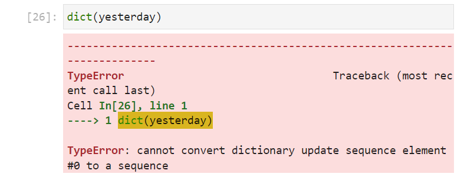

```_replace``` will create a new instance using replaced field names. In this example only the field name year is replaced:

```
yesterday._replace(year=2024)
```

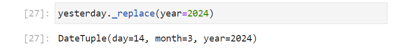

```_make``` is a class method which will create a new instance from a ```tuple```:

```
t1 = (17, 3, 2024)
DateTuple._make(t1)
```

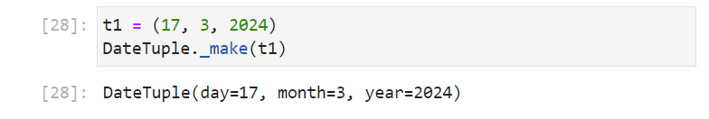

```tuple``` and ```dict``` unpacking can also be used for this purpose:

```
t1 = (17, 3, 2024)
DateTuple(*t1)
```

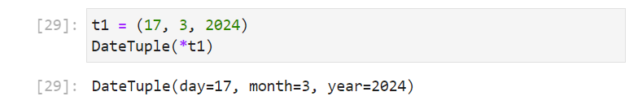

```
d1 = {'day': 17, 'month': 3, 'year': 2024}
DateTuple(**d1)
```

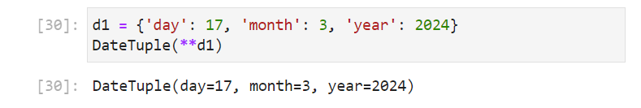

Unfortunately the Spyder Variable Explorer doesn't fully support the ```collections``` module. The collapsed view shows the generic ```DateTuple``` object:

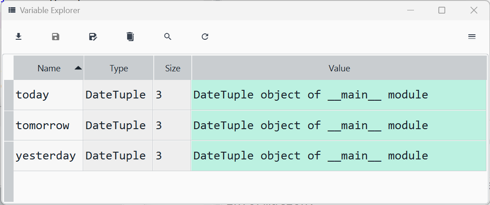

It should be updated to reflect the formal string which can be seen when an instance is shown in a cell output:

```
today
```

Recall the formal string representation uses the ```__repr__``` data model identifier and the informal string representation uses the ```__str__``` data model identifier which are more typically invoked using Pythons ```builtins``` function ```repr``` and ```str``` respectively:

```
repr(today)
str(today)
```

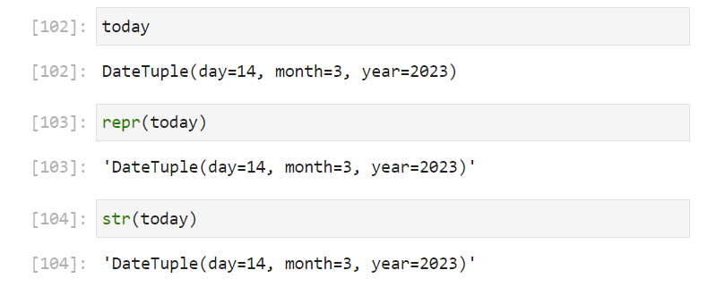

The expanded view doesn't show the field names in a ```NamedTuple``` subclass and instead just displays it as an ordinary ```tuple```:

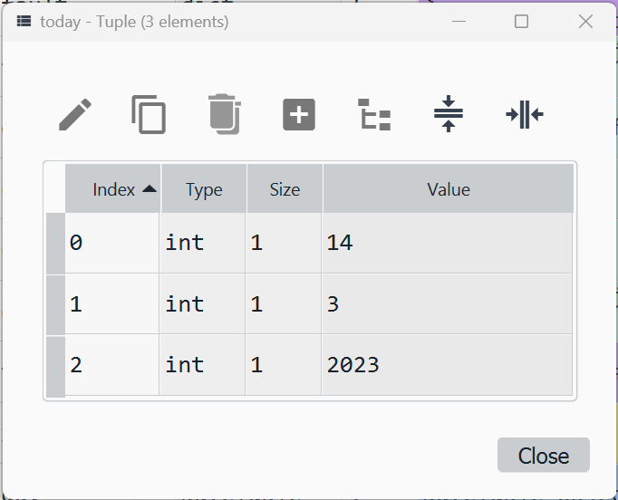

It should look instead be updated to like the following:

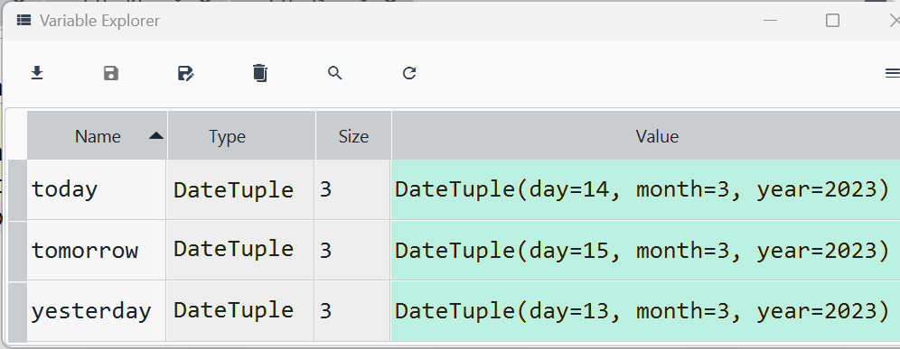

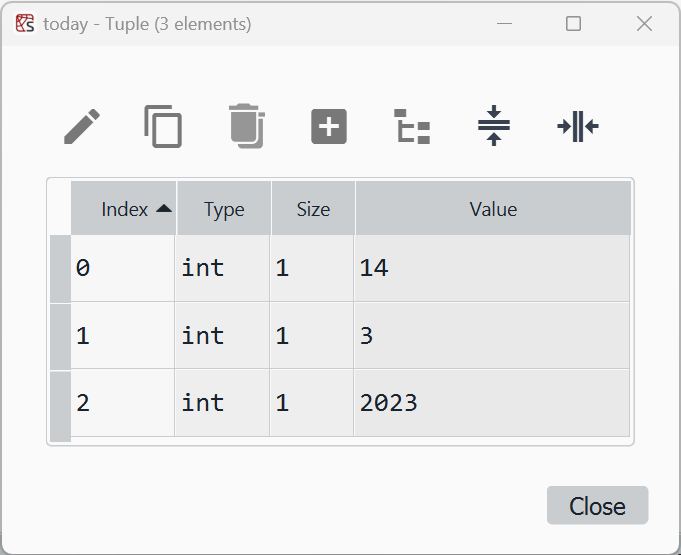

## deque

The doubly ended queue ```deque``` class was originally designed to be a ```builtins``` class and is therefore lower case like ```tuple``` or ```list```. 

A ```list``` is optimised for operations at the end and has the methods ```append``` and ```extend```. The ```deque``` is list-like but as the name suggests is doubly ended and optimised for operations at the front and back. It can be imported using:

```
from collections import deque
```

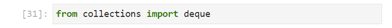

To view the init signature of the ```deque```  class input ```deque``` followed by open parenthesis and pressing shift ```⇧``` + tab ```↹```:

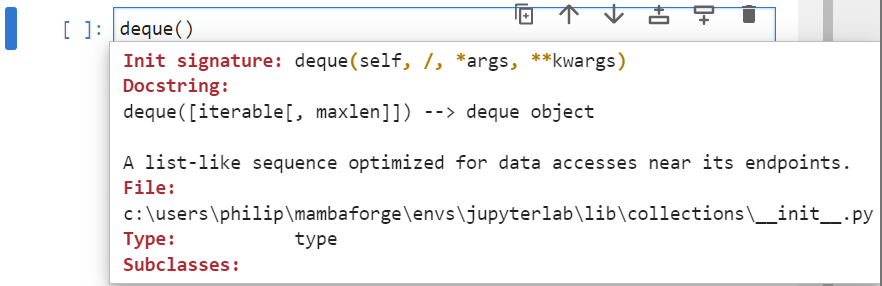

The ```deque``` takes an iterable as input argument such as a ```list``` or ```tuple``` and has the optional input argument, ```keylen``` which specifies the maximum length of the ```deque```.

```
archive = (1, True, 3.14, 'hello', 'hello', 'bye')
duoactive = deque(archive, 7)
```

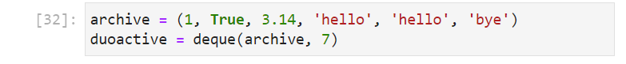

Unfortunately the Spyder Variable Explorer doesn't fully support the ```collections``` module. The collapsed view looks like the following:


The expanded view doesn't show the ```deque```:

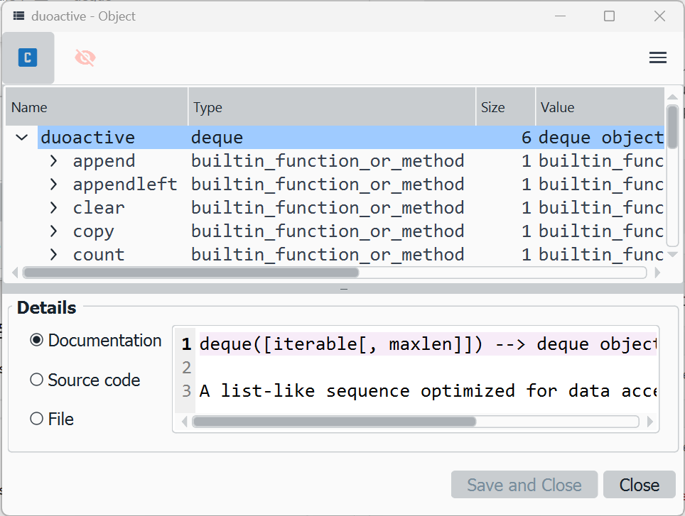

It should be updated to reflect the formal string which can be seen when an instance is shown in a cell output:

```
duoactive
```

Recall the formal string representation uses the ```__repr__``` data model identifier and the informal string representation uses the ```__str__``` data model identifier which are more typically invoked using Pythons ```builtins``` function ```repr``` and ```str``` respectively:

```
repr(duoactive)
str(duoactive)
```

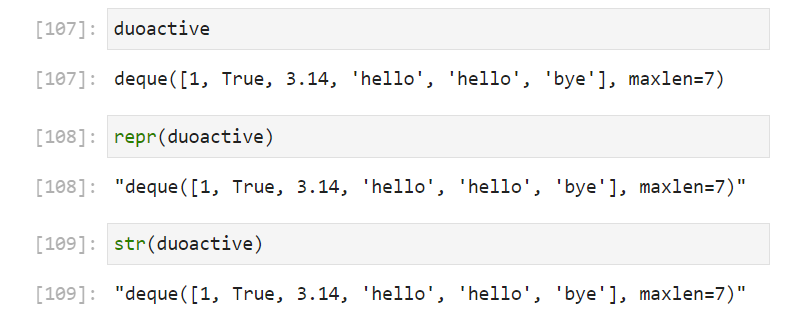


It should be updated to look like the following:

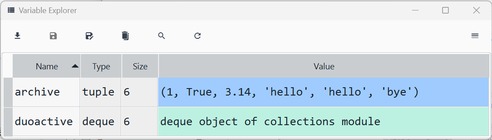

In the expanded view it should be conceptualised essentially as a ```list``` with some minor modifications:

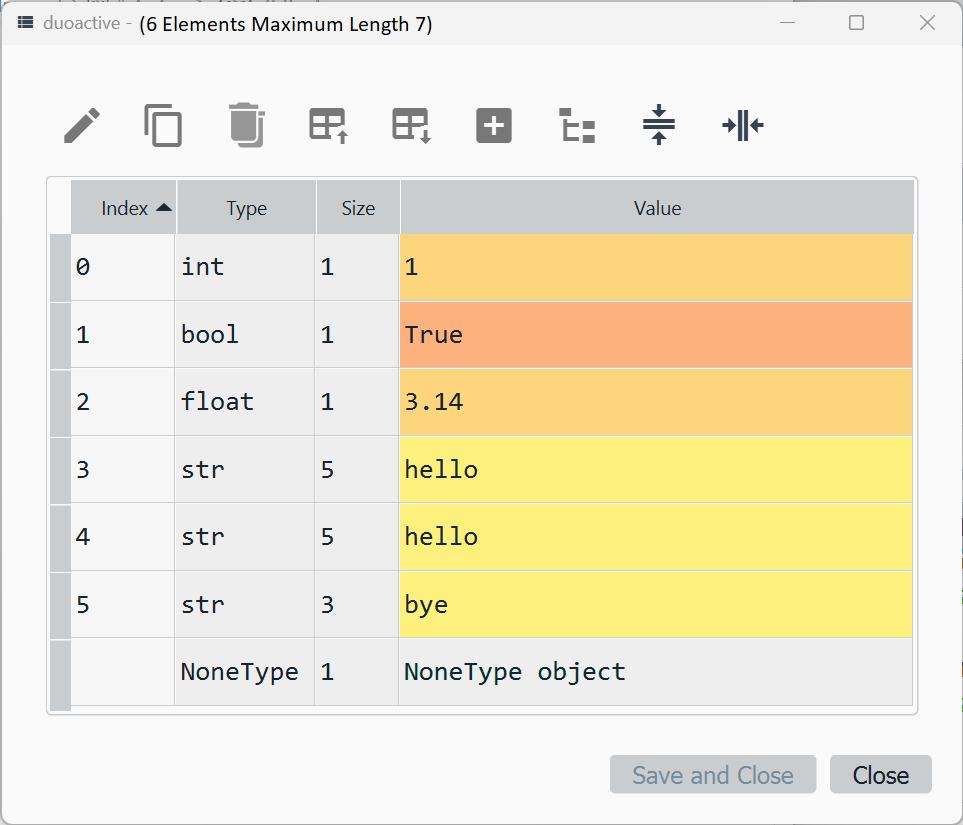

The identifiers of the ```deque``` instance can be examined by inputting ```duoactive.``` and pressing tab ```↹```: 

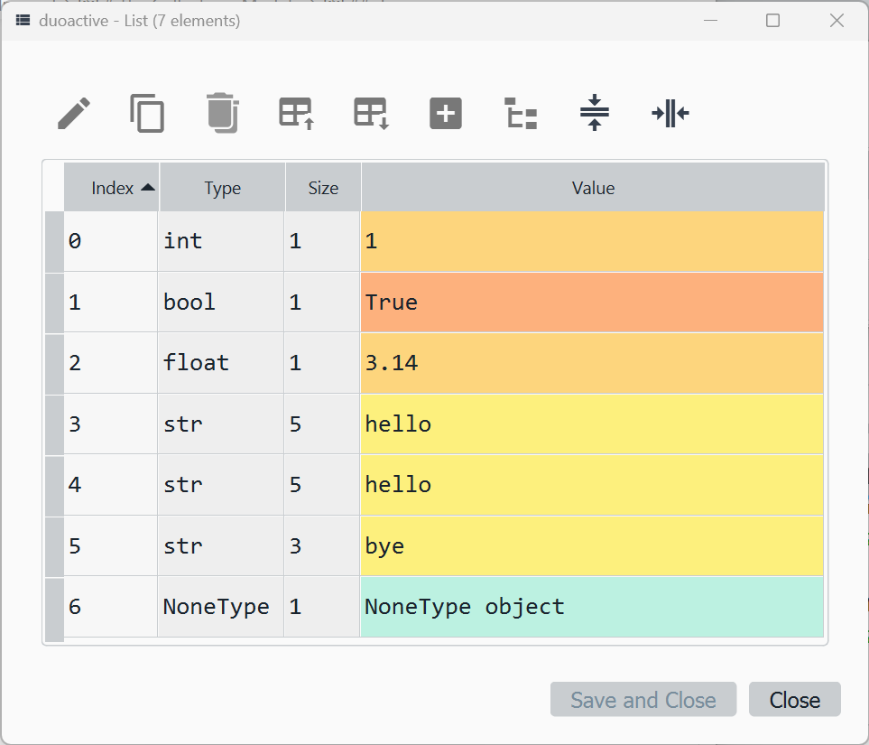

Notice that lots of these identifiers have the same name as their equivalents in the ```list``` class and behave identically. The additional identifiers specify a left-right direction in line with the collapsed view with the elements displayed horizontally:


At present there are 6 objects in the ```deque``` that has space for 7 objects. Each of the items can be indexed using their numeric index. The index at 6 does not exist as the ```deque``` is not full:

```
duoactive[0]
duoactive[1]
duoactive[5]
duoactive[6]
```

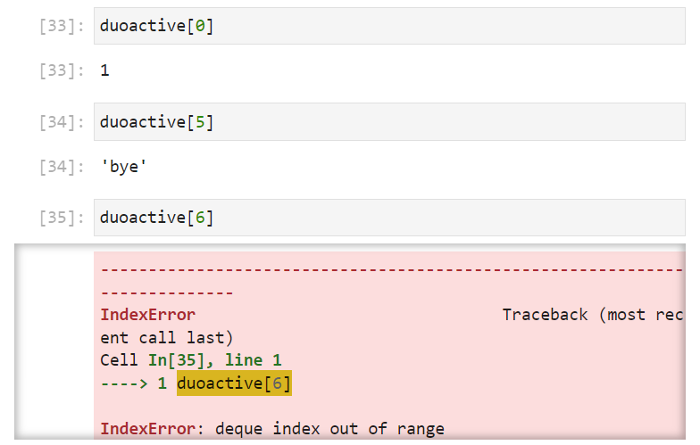

The ```maxlen``` attribute shows the value of the maximum length set for the ```deque```:

```
duoactive.maxlen
```

The ```append``` method may be used to ```append``` a single value to the end of the ```deque```:

```
duoactive.append('last')
```

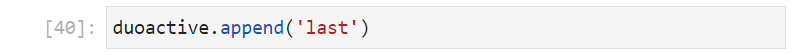

The end is the right hand side in the collapsed view:

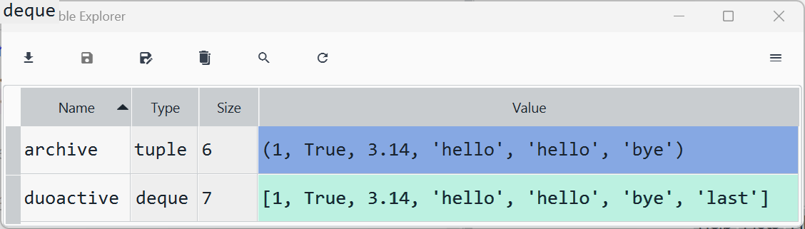

Or the bottom in the expanded view:

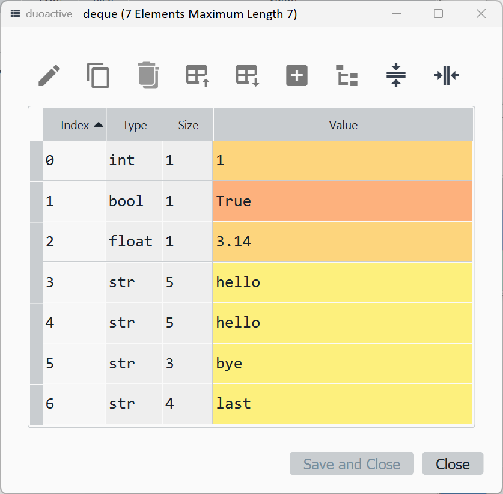

```duoactive``` is now at its maximum length. This means an additional records appended will now eject a corresponding record at the other end of the queue:

```
duoactive.appendleft('front')
```

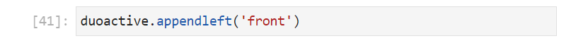

Notice ```'last'``` was eject out the right hand side of ```duoactive``` and ```duoactive``` is still at its maximum length of 7:

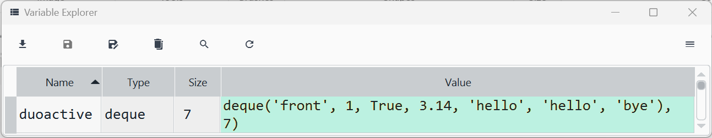

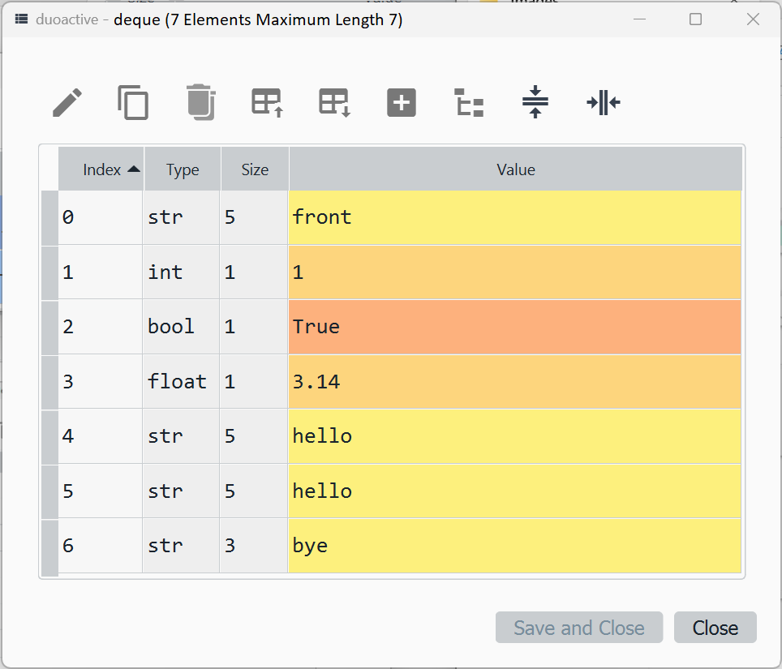

The ```append``` and ```appendleft``` methods append a single item to the right and left of the ```deque``` (in the collapsed view). If the ```deque``` is at its maximum length, a single item on the opposite end is ejected. These methods will nest a collection at the last and first index respectively. 

The ```extend``` and ```extendleft``` methods can be used to extend the ```deque``` on the right hand side or left hand side respectively. If the ```deque``` is at its maximum length, items at the other end of the ```deque``` will be ejected:

```
duoactive.extend((1, 2, 3))
```

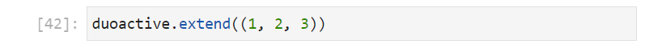

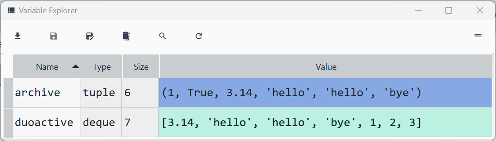

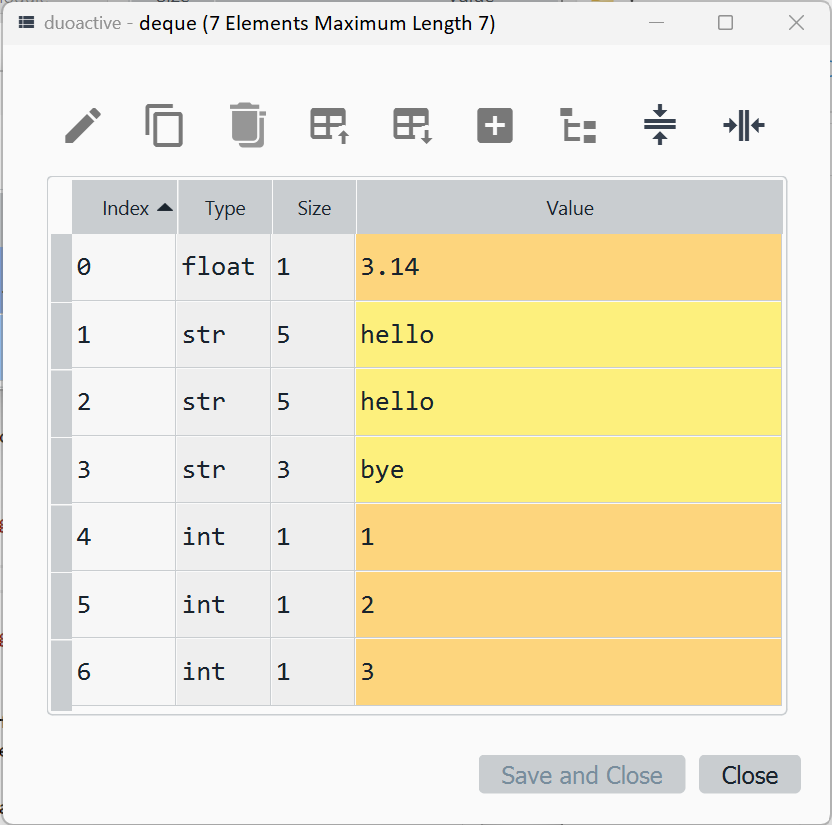

The ```pop``` and ```popleft``` methods pop a record off at the right or left of the ```deque``` respectively. These methods return the popped record and mutate the ```deque``` in place:

```
duoactive.popleft()
```

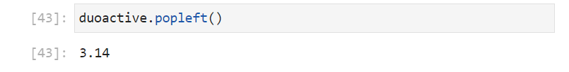

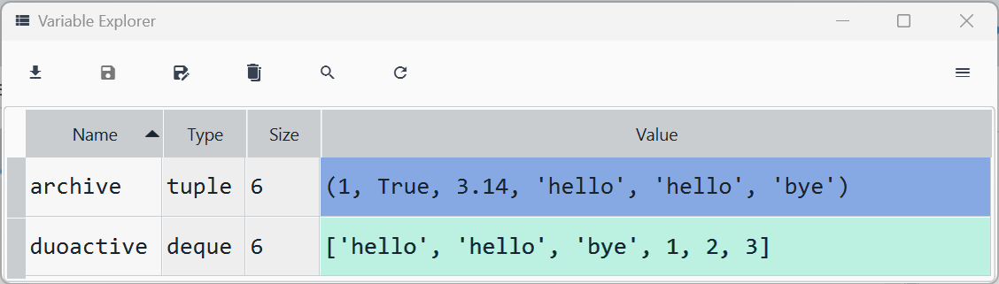

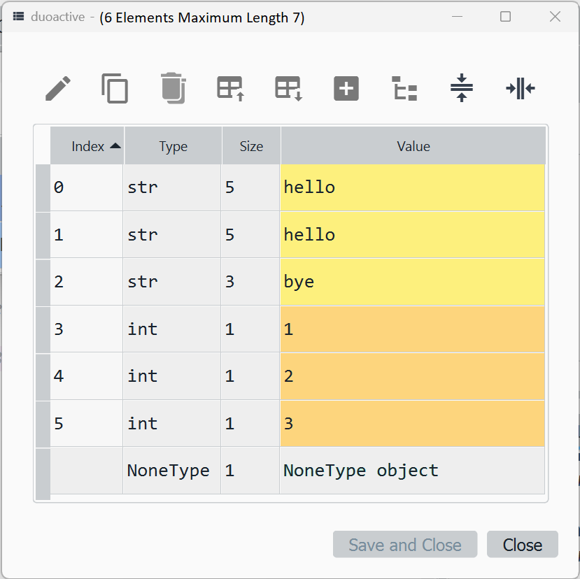

The ```rotate``` method is a mutable method that can be used to rotate the elements in the ```deque```. Essentially it individually pops a record from one end of the ```deque``` and appends it to the other end of the ```deque```. It has an input argument ```n```, which is an integer number of steps to rotate by. For a value of ```-2``` for example, the first 2 items on the left will be removed from the left of the ```deque``` and placed at the end of the ```deque```:

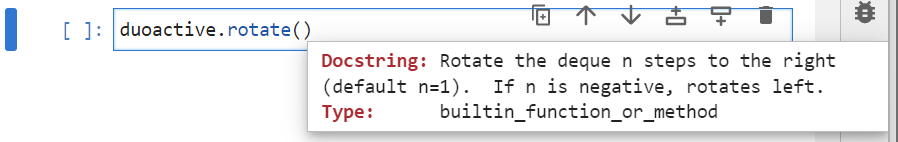

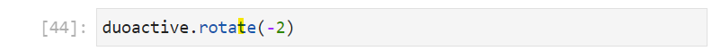

```
duoactive.rotate(-2)
```

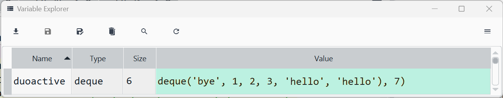

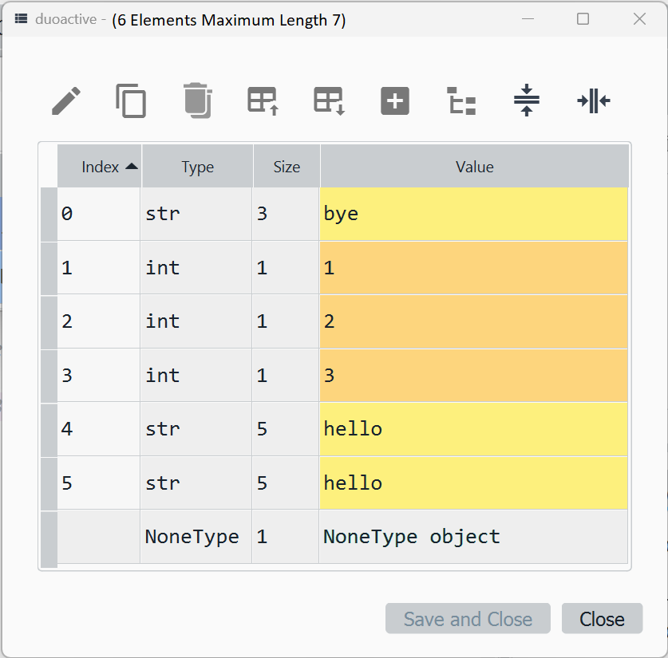

The other methods available for the ```deque``` class are consistent with their counterparts in the ```list``` class. The datamodel methods are also consistent:

```
from pprint import pprint
pprint(dir(duoactive), compact=True)
```


## defaultdict and OrderedDict

The ```defaultdict``` and ```OrderedDict``` are subclasses of the ```dict``` class. This can be seen by importing these collections and examining their method resolution order:

```
from collections import defaultdict, OrderedDict
defaultdict.mro()
OrderedDict.mro()
```

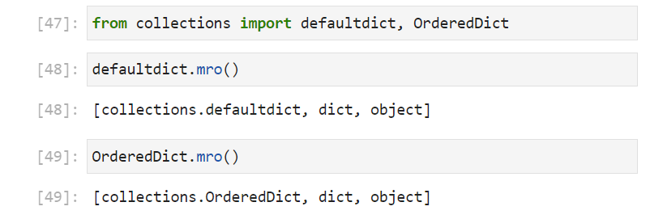

In previous versions of Python the ```dict``` was unordered, similar to a ```set``` and the ```OrderedDict``` was essentially a subclass of ```dict``` that instead maintained insertion order. In current versions of Python, the ```dict``` maintains insertion order making the ```OrderedDict``` mainly redundant.

The ```defaultdict``` is a subclass of ```dict``` that has a ```default_factory``` callable. When indexed with a ```key``` that doesn't exist in the current ```keys```, the ```key```: ```default_factory()``` pair is added, instead of an ```KeyError```. The behaviour of a ```dict``` is shown:

```
mapping = {'red': '#FF0000', 
           'green': '#00B050', 
           'blue': '#0070C0'}

mapping['red']
mapping['yellow']
```

Notice the ```KeyError``` because ```'yellow'``` is not in ```Keys```:

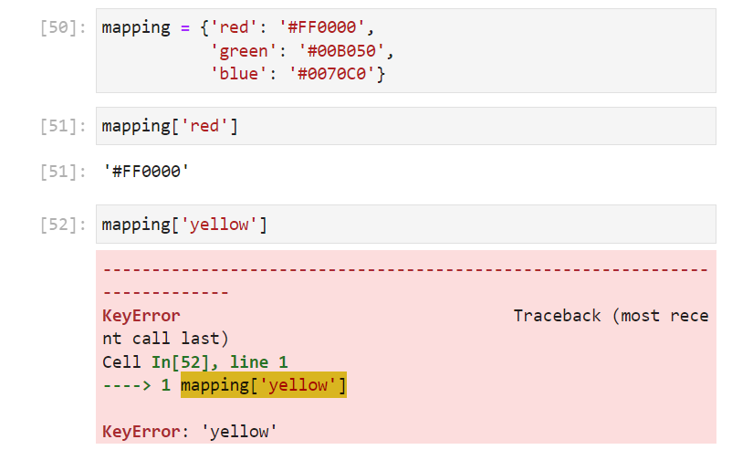

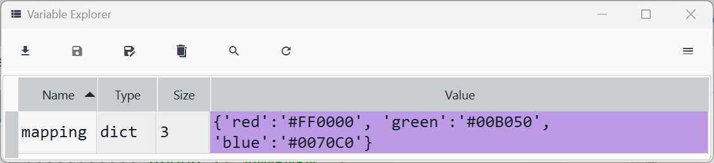

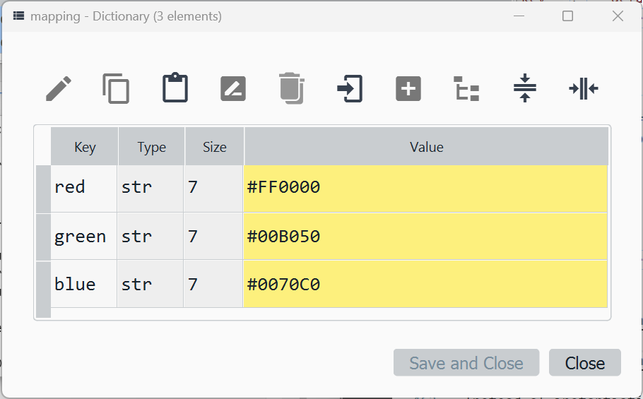

Instead of instantiating the ```dict``` with items. It is possible to instantiate an empty ```dict``` and then add items to it:

```
mapping = {}
mapping['red'] = '#FF0000'
mapping['green'] = '#00B050'
mapping['blue'] = '#0070C0'
```

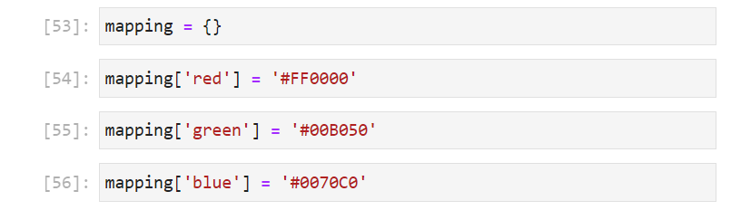


This can be used to examine the workflow of a ```defaultdict```. To view the docstring of the ```defaultdict``` init signature input the class name with open parenthesis followed by shift ```⇧``` + tab ```↹```:

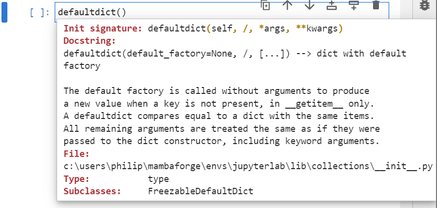

The ```defaultdict``` has a single input argument ```default_factory```. This can be supplied positional argument or a named argument. This input argument takes a callable without any arguments. For example, the ```str``` class:

```
mapping = defaultdict(str)
```

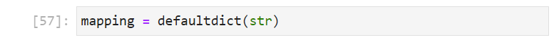

If the directory function ```dir``` is used, all the identifiers are identical to that of the ```dict``` class with the exception to ```__missing__``` which is added:

```
pprint(dir(mapping), compact=True)
```

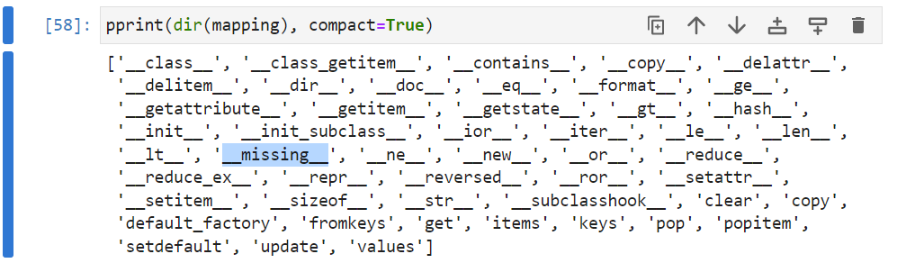

When attempting to access a missing key, the ```__missing__``` data model is invoked. In the ```dict``` class, the missing ```__datamodel__``` method is not defined so a ```KeyError``` is given. In the ```defaultdict```, ```__missing__``` calls the provided ```default_factory``` callable generating a new ```key: value``` pair.

Each key is added and assigned to a value as before:

```
mapping['red'] = '#FF0000'
mapping['green'] = '#00B050'
mapping['blue'] = '#0070C0'
```

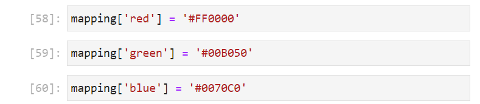

When a key is indexed that does not exist, the ```default_factory``` callable is used. For example: 

```
mapping['yellow']
```

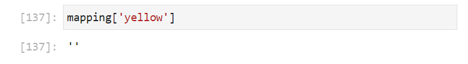

Unfortunately the Spyder Variable Explorer doesn't fully support the ```collections``` module. The collapsed view shows the generic ```defaultdict``` object:

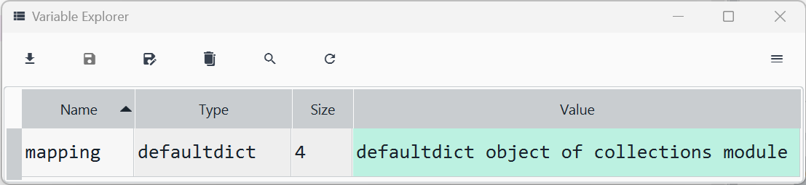

It should be updated to reflect the formal string which can be seen when an instance is shown in a cell output:

```
mapping
```

Recall the formal string representation uses the ```__repr__``` data model identifier and the informal string representation uses the ```__str__``` data model identifier which are more typically invoked using Pythons ```builtins``` function ```repr``` and ```str``` respectively:

```
repr(mapping)
str(mapping)
```

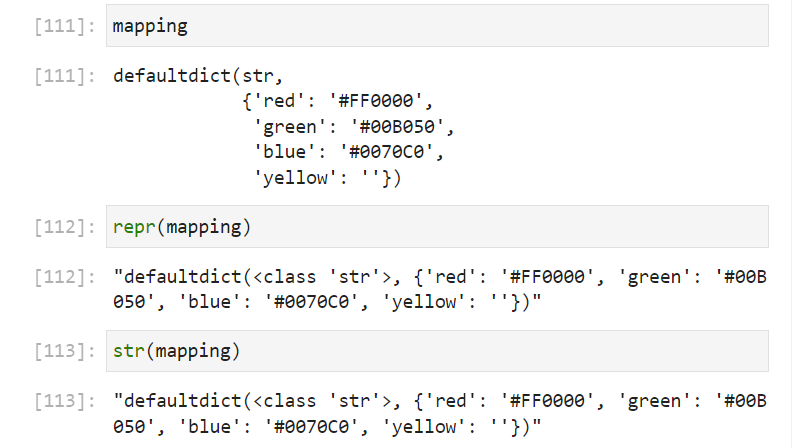

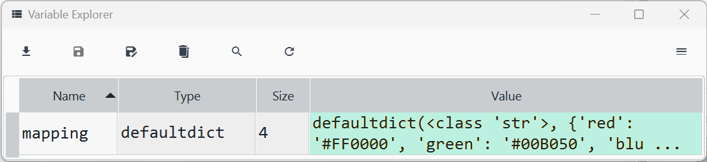

The expanded view displays a regular ```dict```, this like the regular ```dict``` should be shown in insertion order:


In this example ```default_factory = str``` and this was called without input arguments i.e. ```str()``` which returned the empty ```str```.

Another example can have ```default_factory=list```. For example:

```
mapping = defaultdict(list)
```

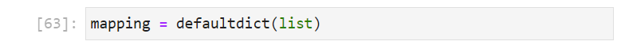

Each key is added and assigned to a value:

```
mapping['a'] = ['apples', 'apricots', 'avocado']
mapping['b'] = ['bananas', 'beetroot']
```

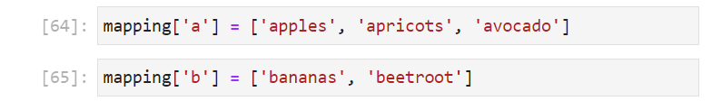

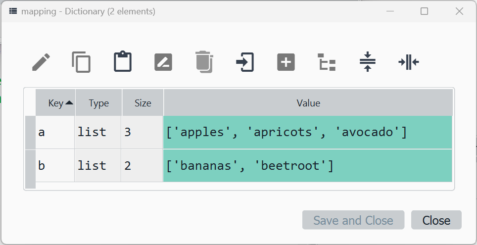

When a key is indexed that does not exist, the ```default_factory``` callable is used. For example: 

```
mapping['c']
```

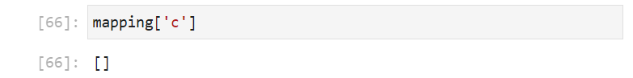

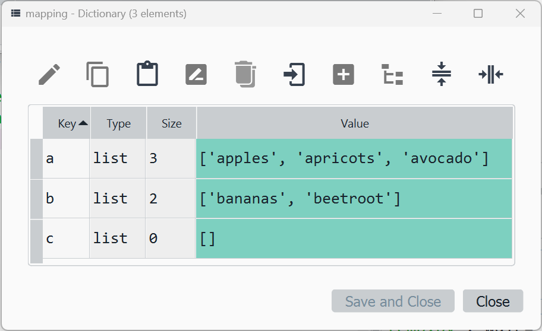

Which in this looks at the ```default_factory``` and calls ```list``` without any input arguments to give an empty list. Methods can be called from such an empty list:

```
mapping['d'].append('dragonfruit')
```


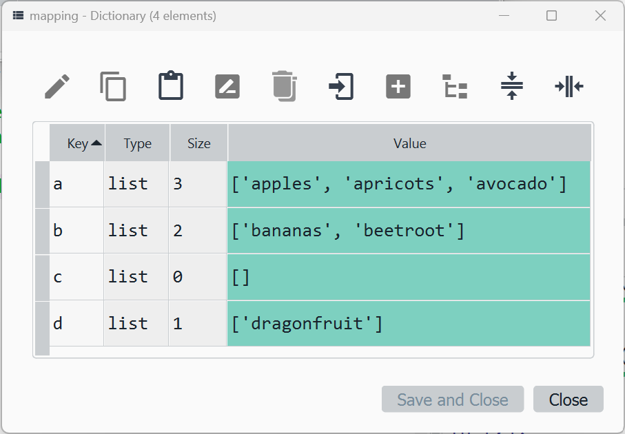

The ```default_factory``` can be assigned to an anonymous function using a ```lambda``` expression. Recall the general form is:

```
default_factory = lambda input0, input1, ... : value
```

The ```default_factory``` has to be callable without any input arguments, therefore the form below is used:

```
default_factory = lambda : value
```

A hexadecimal value has the form ```#rrggbb```. A default ```str``` can zero these values ```#000000``` and this can be supplied via the return value of a ```lambda``` expression:

```
mapping = defaultdict(lambda : '#000000')
```

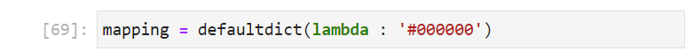

Each key is added and assigned to a value:

```
mapping['red'] = '#FF0000'
mapping['green'] = '#00B050'
mapping['blue'] = '#0070C0'
```

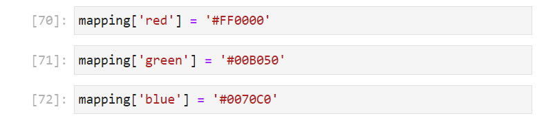

When a key is indexed that does not exist, the ```default_factory``` callable is used. For example: 

```
mapping['yellow']
```

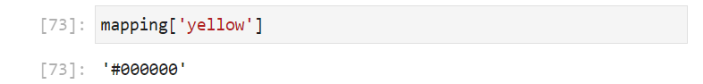

Which looks to ```default_factory``` which gives the return value which was the ```'#000000'```.

The identifiers can be viewed by typing in ```mapping.``` followed by a tab ```↹```:

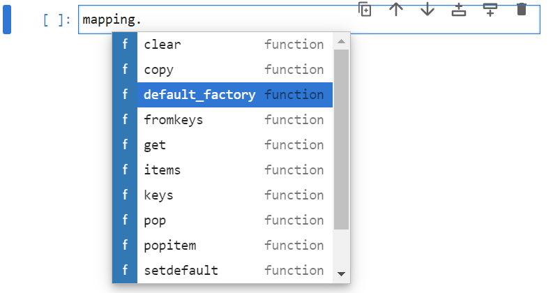

The only addition is ```default_factory``` which invokes the callable:

```
mapping.default_factory
mapping.default_factory()
```

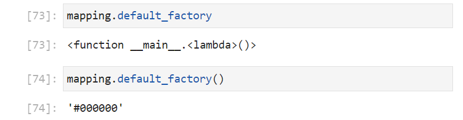

The other identifiers are inherited from the ```dict``` class and are unmodified so behave identically. 

The name of the identifier ```setdefault``` in the context of a ```defaultdict``` often gets confused. It is inherited from the ```dict``` class and does not relate to the ```factory_default```. Instead it essentially acts as a one time override of the ```default_value```. The key to be examined is the first input argument and the second argument is the default value to assign in this example when the key does not exist:

```
mapping.setdefault('red', '#ffffff')
mapping.setdefault('orange', '#ffffff')
mapping['black']
```

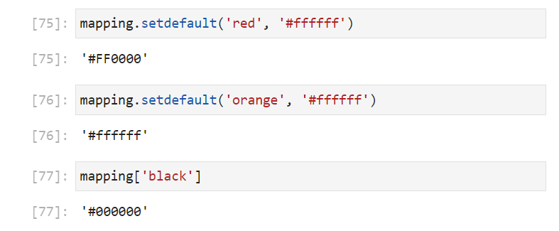


The initialization signature of the ```defaultdict``` takes a callable as its first input argument and can also take in a dictionary as a second keyword argument, initializing it with a number of items:

```
mapping = defaultdict(lambda: '#000000', 
                      {'red': '#FF0000', 
                       'green': '#00B050', 
                       'blue': '#0070C0'})
```

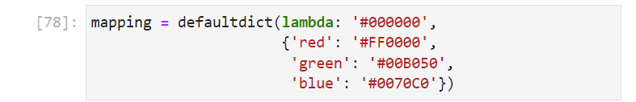

The formal string representation and the informal string representation can be returned using:

```
repr(mapping)
str(mapping)
```

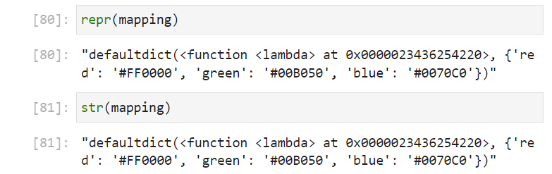

For a ```lambda``` expression these give details about where the function is stored in memory opposed to the ```lambda``` expression itself which would be more useful.

## Counter

In Python it is quite common to count the number of occurrences in an iterable. For example:

```
text = ['hello world!']
```

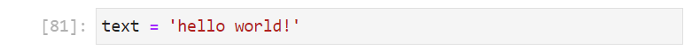

Conventionally this is done by casting text into a ```set```, recalling a ```set``` can only contain unique values:

```
unique = set(text)
```

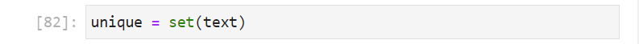

An initial value of ```0``` is used:

```
value = 0
```

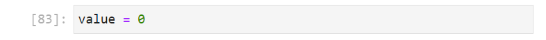

And a dictionary is instantiated using the alternative constructor: 

```
frequency = dict.fromkeys(unique, value)
```


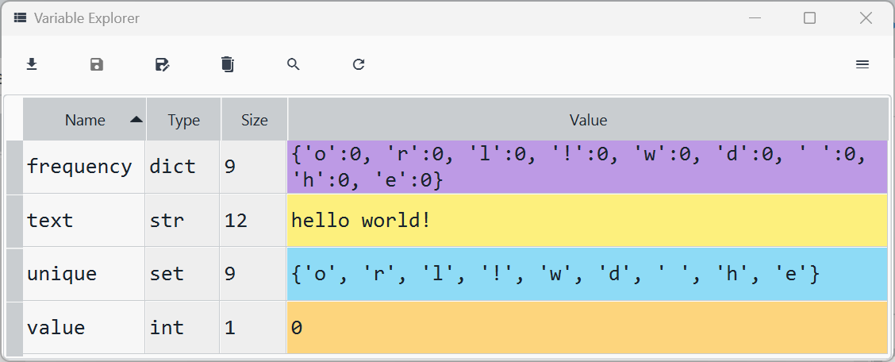

The frequency of each ```letter``` in the ```word``` can be counted using a ```for``` loop:

```
for letter in text:
    frequency[letter] += 1


```

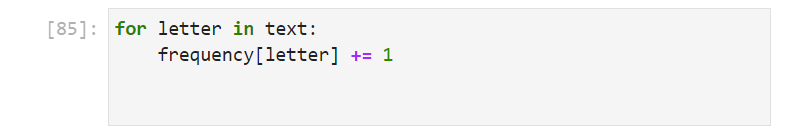

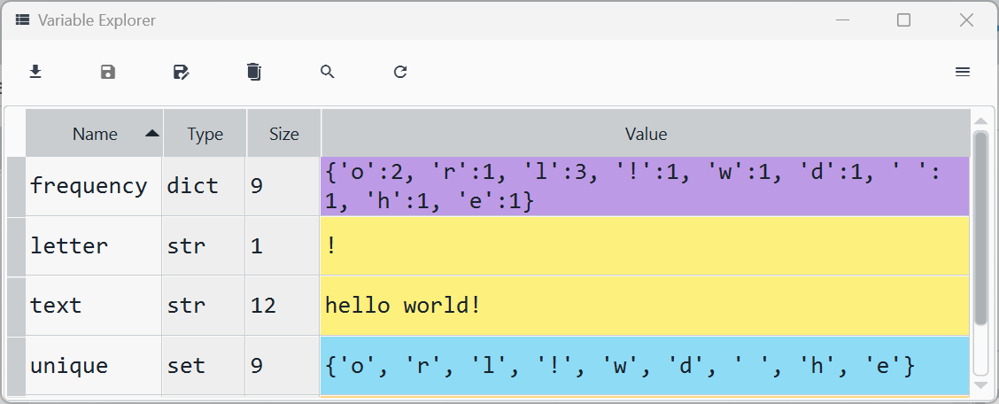


This can obtained more coveniently using a ```Counter```:

```
from collections import Counter
```

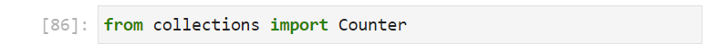

The list of identifiers from the ```Counter``` subclass can be seen by inputting ```Counter.``` followed by 
a tab ```↹```:


The method resolution order can be seen by using:

```
Counter.mro()
```

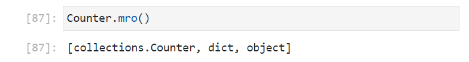

The ```Counter``` is a subclass of the ```dict``` used for counting occurrences, simplifying the procedure to get a similar data structure above. The input arguments can be seen for the init signature of the ```Counter``` subclass by typing in the subclass name followed by open parenthesis and shift ```⇧``` + tab ```↹```:

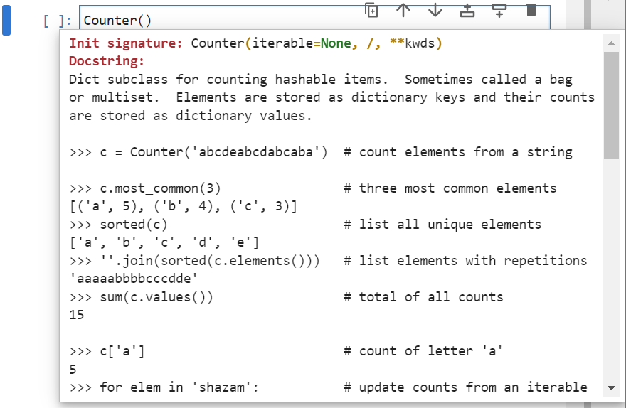

The operation:

```
text = 'hello world!'
frequency = Counter(text)
```


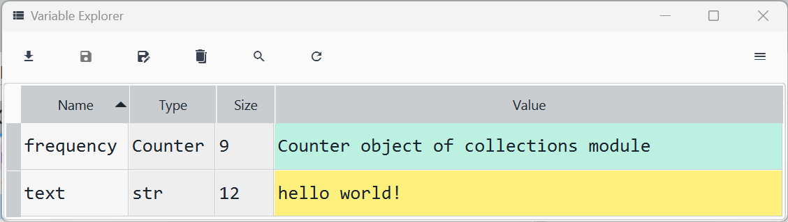

Unfortunately the Spyder Variable Explorer doesn't fully support the ```collections``` module. The collapsed view shows the generic ```Counter``` object:

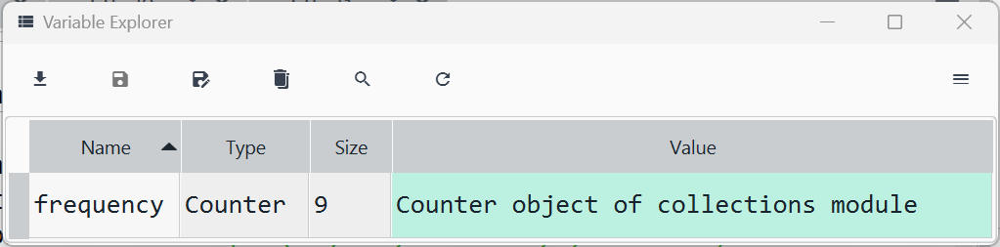

It should be updated to reflect the formal string which can be seen when an instance is shown in a cell output:

```
frequency
```

Recall the formal string representation uses the ```__repr__``` data model identifier and the informal string representation uses the ```__str__``` data model identifier which are more typically invoked using Pythons ```builtins``` function ```repr``` and ```str``` respectively:

```
repr(frequency)
str(frequency)
```

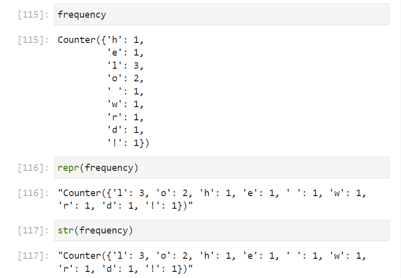

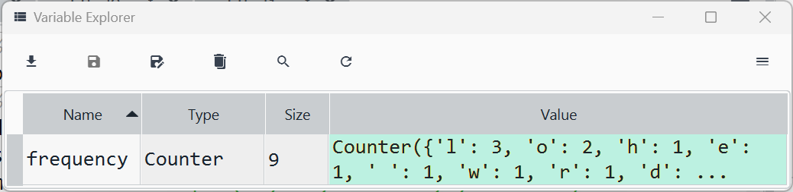

The expanded view displays a regular ```dict```, this like the regular ```dict``` should be shown in insertion order. Unlike the more conventional method where an unordered ```set``` was used as an intermediate step and a random insertion order was obtained. In this example the key insertion order is by first appearance of the key. In this case a key was ordered by first appearance of a Unicode character in ```text```:

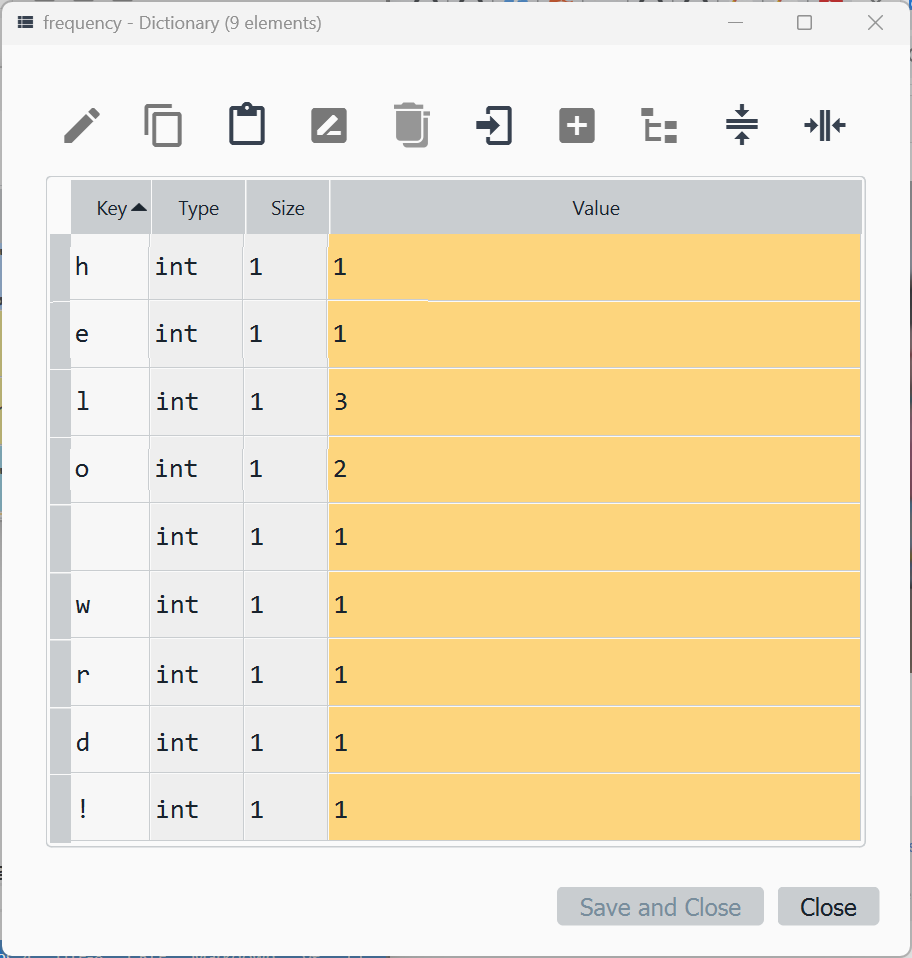

If the ```items``` identifier inherited from the ```dict``` parent class is used a list of ```tuple``` pairs displays; the first element is the key and the second element is the ```int``` value denoting the number of counts of that element. These are shown in insertion order:

```
frequency.items()
```

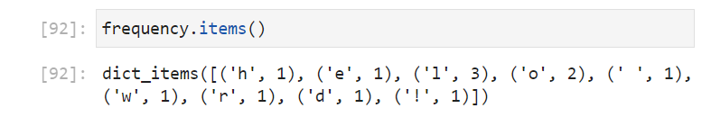

The ```total``` identifier will sum all the values returning the total:

```
frequency.total()
```

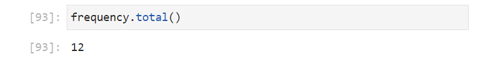

The ```most_common``` identifier, displays items essentially reverse sorted by the reverse number of counts.

```
frequency.most_common()
```


The ```update``` identifier is a mutable method that can be used to add counts of existing keys and supplementary keys in place. For example:

```
frequency.update('hello')
frequency.most_common()
```

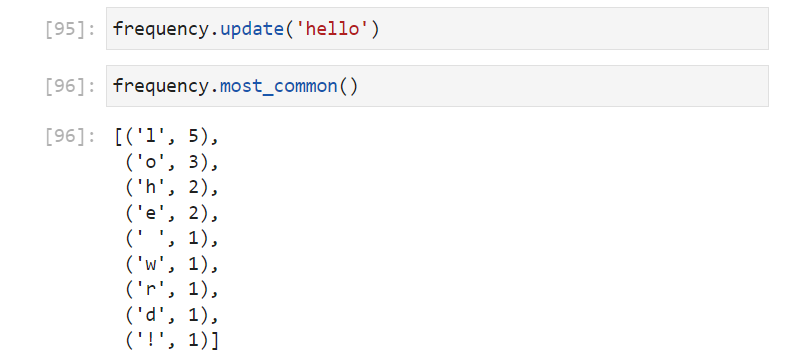

The ```subtract``` identifier is a mutable method that can be used to subtract counts of existing keys and show supplementary keys with negative values in place. For example:

```
frequency.subtract('bye world!')
frequency.most_common()
```

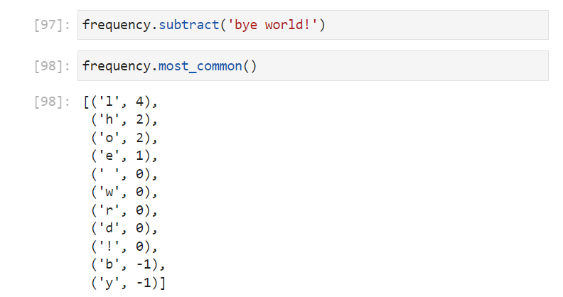

As the value is always an integer, inplace assignment or subtraction operators are commonly used to update a single value:

```
frequency['b'] += 5
frequency['y'] -= 5
frequency.most_common()
```

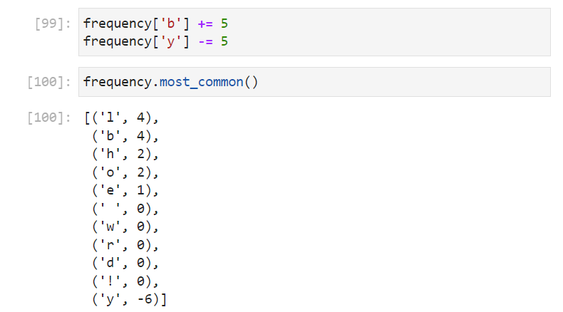

The identifier ```elements``` returns an iterator of all the elements in the ```counter``` with positive values:

```
forward = frequency.elements()
next(forward)
next(forward)
```

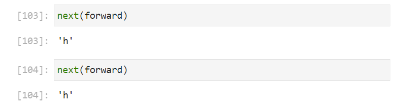

To exhaust all elements in the iterator, it can be cast into a ```tuple```:

```
tuple(forward)
```

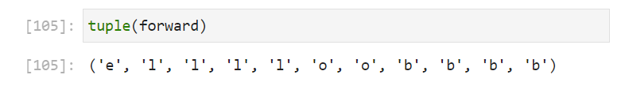

Note that the iterator follows the insertion order used in ```items```:

```
frequency.items()
tuple(frequency.elements())
```

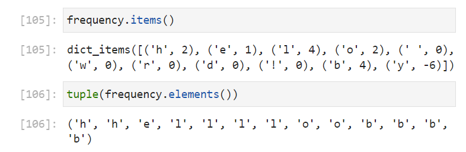

```'h'``` has a count value of ```2``` so displays twice, ```'e'``` has a count value of ```1``` so displays once and so on...

The format of elements being cast into a tuple is generally used to create a new ```Counter``` instance from an iterable:

```
archive = (1, True, 3.14, 'hello', 'hello', 'bye')
record_frequencies = Counter(archive)
```

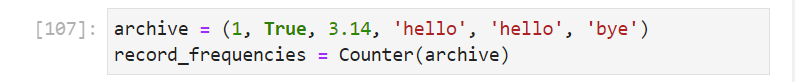

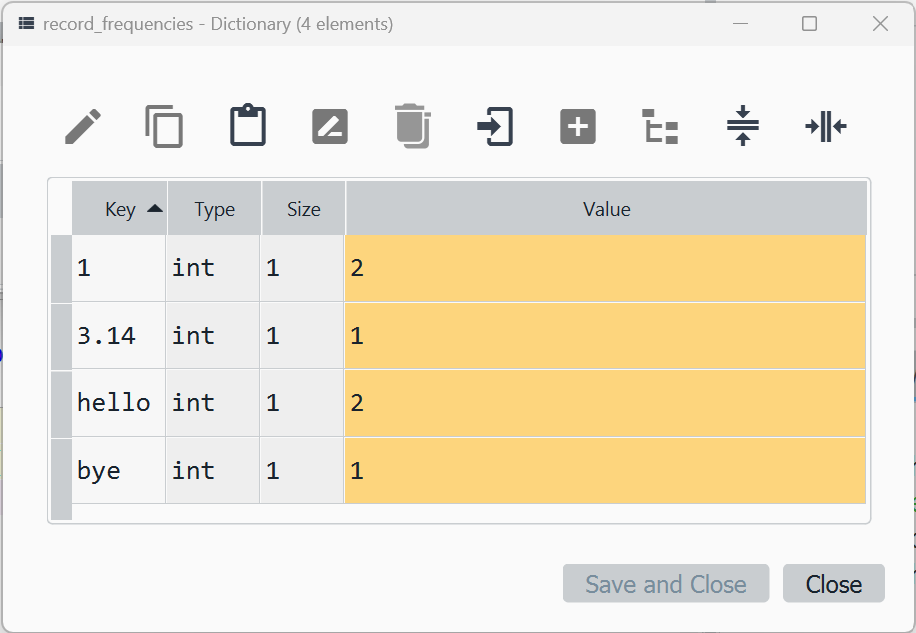

## ChainMap

A ```ChainMap``` is used to chain dictionaries together. It can be imported using:

```
from collections import ChainMap
```

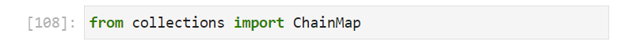

Its identifiers can be viewed by typing in ```ChainMap.``` followed by a tab ```↹```:

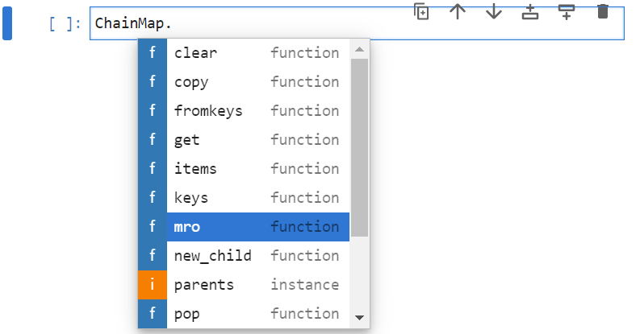

Its method resolution order can be examined using:

```
ChainMap.mro()
```

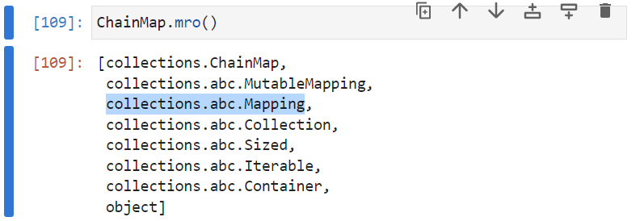

A common use case is combining a dictionary with default options:

```
default = {'textcolor': '#000000', 
           'font': 'Times New Roman', 
           'fontsize': 12}
```

With one for user preferences:

```
settings = {'textcolor': '#FF0000'}
```

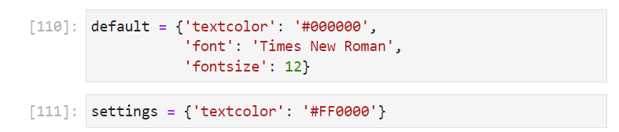

These can be viewed in the Variable Explorer:

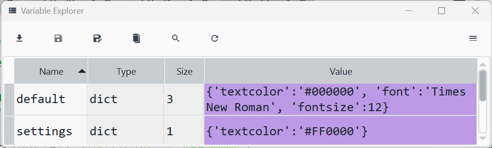

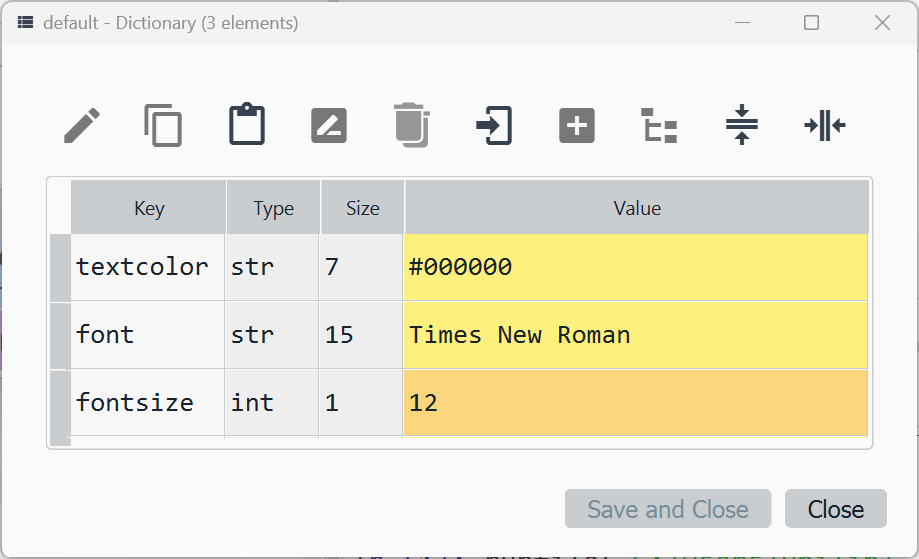

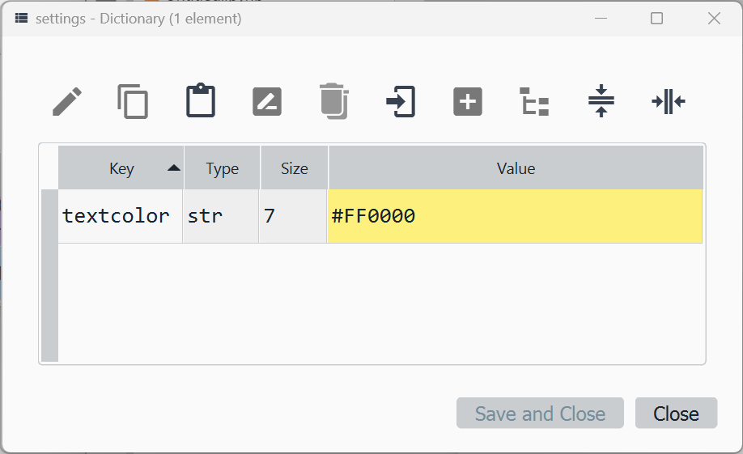

A ```ChainMap``` is essentially a ```dict``` like data structure that takes any setting from ```setting``` where available and when not available takes it from ```default```. The input arguments can be seen for the init signature of the ```Counter``` subclass by typing in the subclass name followed by open parenthesis and shift ```⇧``` + tab ```↹```:

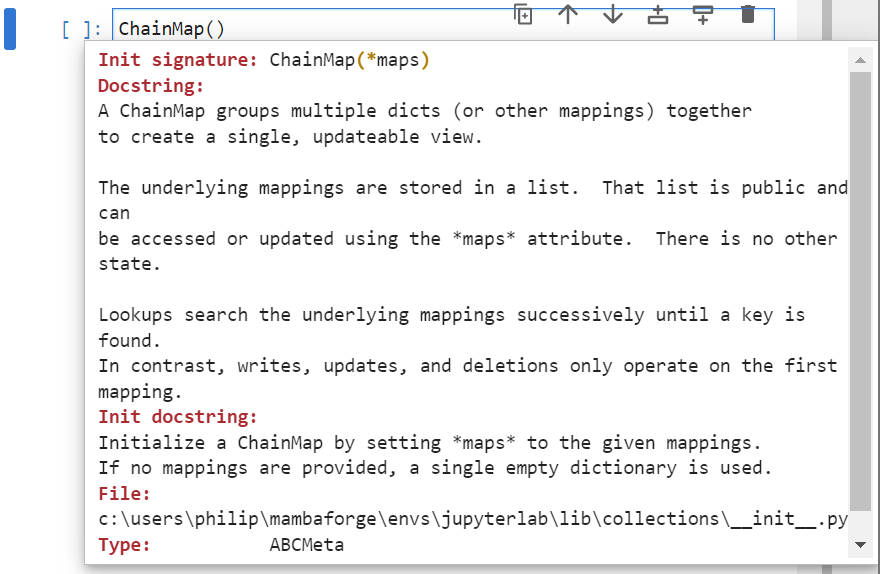

```*maps``` is a variable number of input arguments. In this example, ```settings``` and ```default``` are supplied. ```settings``` will be the primary ```dict``` where custom preferences have been specified and ```default``` will be the secondary ```dict``` where default preferences are specified:

```
config = ChainMap(settings, default)
```

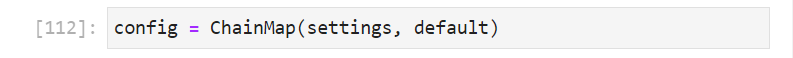

Unfortunately the Spyder Variable Explorer doesn't fully support the ```collections``` module. The collapsed view shows the generic ```ChainMap``` object:

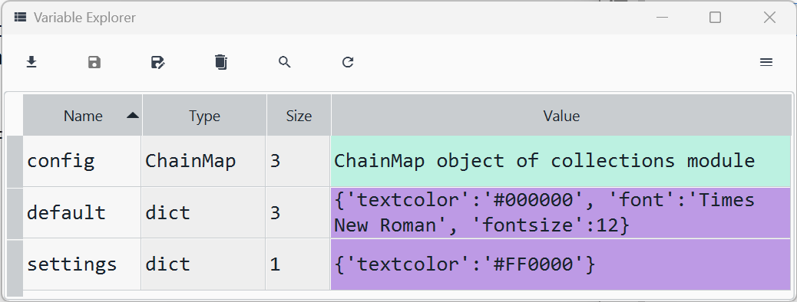

It should be updated to reflect the formal string which can be seen when an instance is shown in a cell output:

```
config
```

Recall the formal string representation uses the ```__repr__``` data model identifier and the informal string representation uses the ```__str__``` data model identifier which are more typically invoked using Pythons ```builtins``` function ```repr``` and ```str``` respectively:

```
repr(config)
str(config)
```

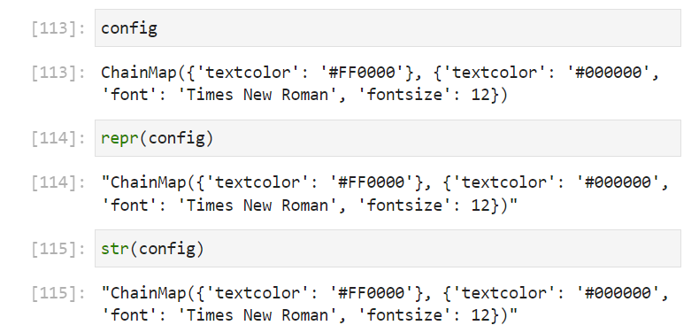

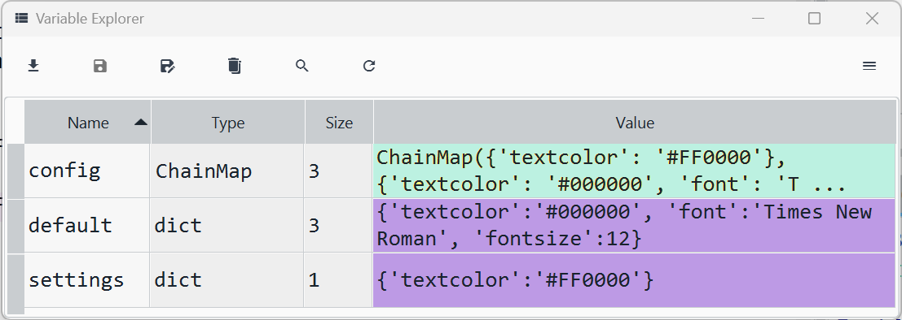

The expanded view doesn't show the ```ChainMap```:

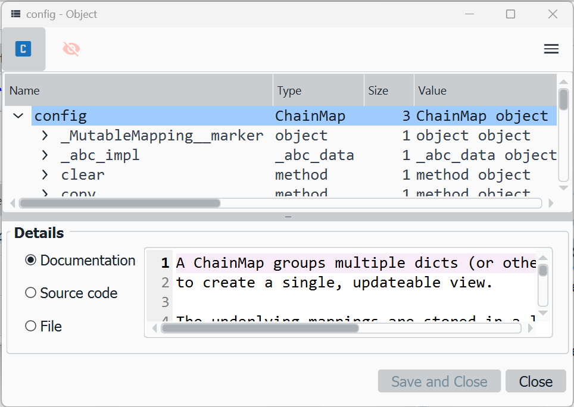

The data structure should look like the following:

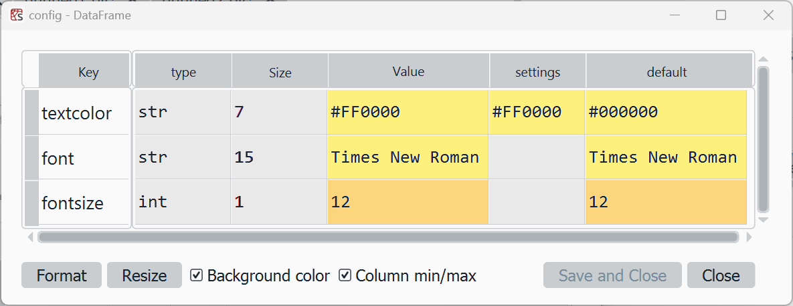

If a key is indexed, it will display the value:

```
config['textcolor']
config['font']
config['fontsize']
```

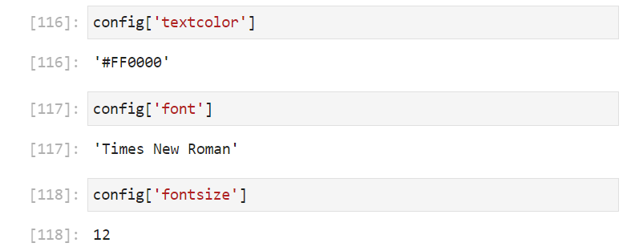

The ```ChainMap``` instance ```config``` is linked to the two original dictionaries. If a value in ```settings``` is changed, it is updated in ```config```:

```
settings['fontsize'] = 72
config['fontsize']
```

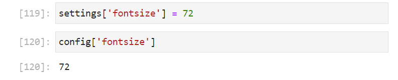

Likewise if a value in ```config``` is changed, it is updated in ```settings```:

```
config['fontsize'] = 48
settings['fontsize']
```

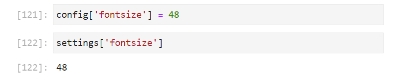

If a value in ```default``` is changed, that is not in ```settings```, ```config``` will be updated:

```
default['font'] = 'Arial'
config['font']
```

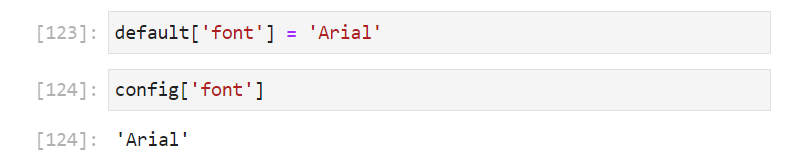

The ```ChainMap``` instance ```config``` has  ```keys```, ```values``` and ```items```. The ```repr``` for these have been updated:

```
config.keys()
config.values()
config.items()
```

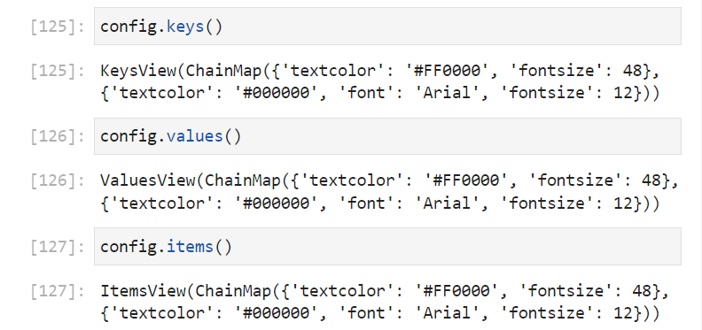

However when used in a ```for``` loop behave identically to their counterpart in the ```dict``` class:

```
for key in config.keys():
    print(f'{key}: {config[key]}')


```

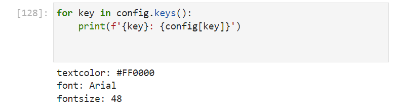

The attribute ```parents``` shows the form of the ```ChainMap``` parent in ```dict```-like form. The related attribute ```maps``` returns a list of the maps by order:

```
config.parents
config.maps
```

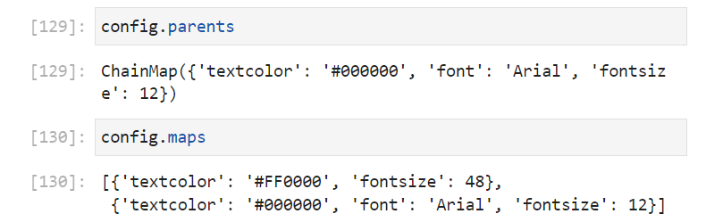

The method ```new_child``` can be used to create a new ```ChainMap``` instance using the ```new_child``` as the primary ```dict``` and the previous maps as the secondary ```dict``` and tertiary ```dict```...:

```
settings2 = {'textcolor': '#FFFF00'}
config2 = config.new_child(settings2)
config2.parents
config2.maps
```

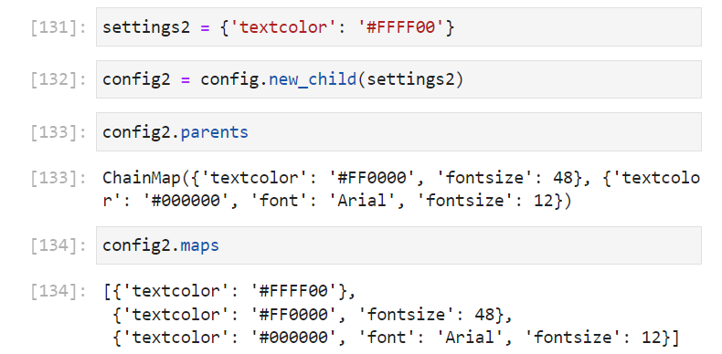

## UserString, UserList, UserDict

```UserString```, ```UserList``` and ```UserDict``` behave similarly to the ```str```, ```list``` and ```dict``` classes in ```builtins```. Their main purpose is user custom  subclassing which will be discussed in a subsequent tutorial.

[Home Python Tutorials](https://github.com/PhilipYip1988/python-tutorials/blob/main/readme.md)
