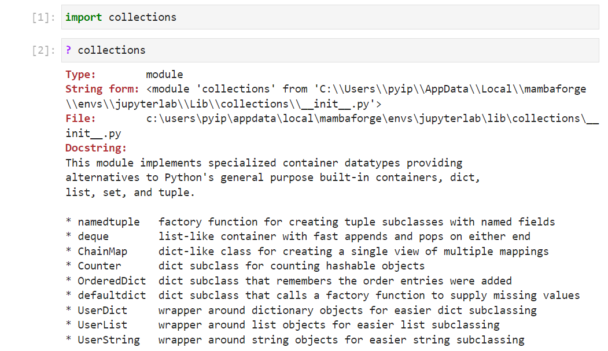
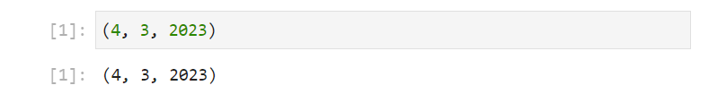
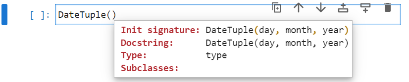
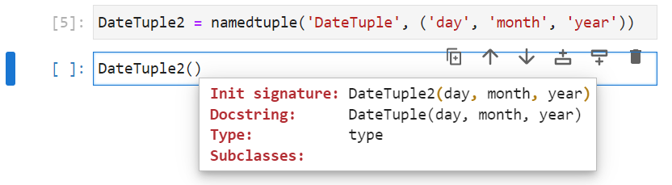
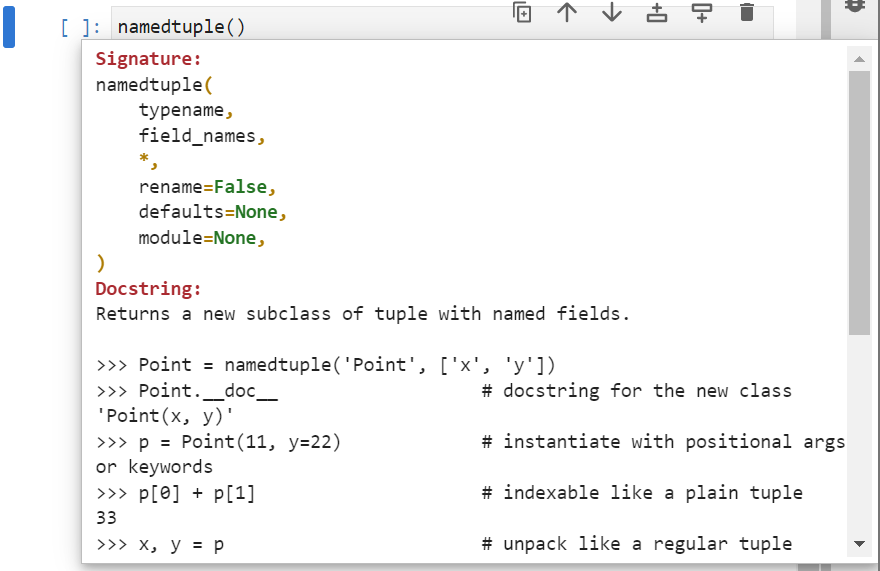
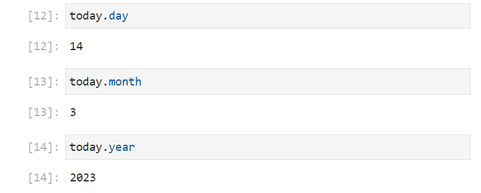
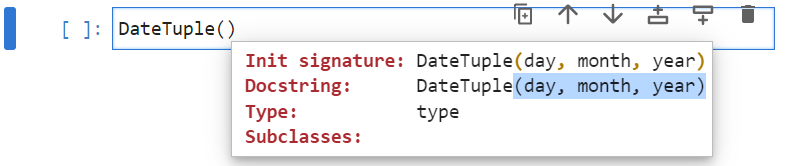
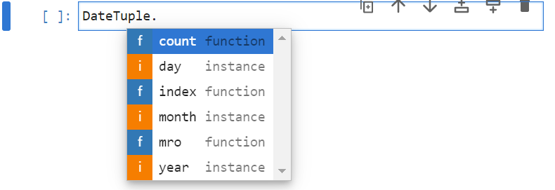

# The Collections Module

Python has a ```collections``` module which has a number of supplementary collections to those explored in Pythons ```builtins```. It can be imported using:

```
import collections
```

And the modules docstring can be viewed:

```
? collections
```



The most important classes are listed. The three in lower case were orginally designed to become.

## namedtuple

```namedtuple``` is a factory function that creates a ```NamedTuple``` subclass. Note the factory function uses lower case and the class uses CamelCase.

The ```NamedTuple``` subclass is a ```tuple``` subclass that is configured to have a field name for each record.

The ```namedtuple``` factory function can be imported from the ```collections``` module using:

```
from collections import namedtuple
```



To view the docstring of the ```namedtuple``` factory function input the function name with open parenthesis followed by shift ```⇧``` + tab ```↹```:


For example the ```NamedTuple``` subclass ```DateTuple``` can be created using:

```
DateTuple = namedtuple('DateTuple', ('day', 'month', 'year'))
```

The name of the ```NamedTuple``` subclass ```'DateTuple'``` is supplied as a string for the first input argument which is used to generate a docstring. This normally matches the name ```DateTuple``` the subclass is assigned to and should be in CamelCase. Note the difference between the object name without quotations and the string which is enclosed in quotations:


The names of the fields are supplied as a ```tuple``` of strings:


Now that this ```NamedTuple``` subclass ```DateTuple``` is assigned its docstring can be viewed by typing in ```DateTuple``` with open parenthesis followed by shift ```⇧``` + tab ```↹```:



When the ```NamedTuple``` subclass is assigned to a different name, the docstring uses the string supplied as the first input argument and is inconsistent to the init signature of the created subclass which uses the class name assigned:

```
DateTuple2 = namedtuple('DateTuple', ('day', 'month', 'year'))
```



Date instances, that is archives with the fields ```day```, ```month``` and ```year``` can be instantiated. Consistency in their format (UK date format) is maintained by following the docstring:


```
today = DateTuple(day=14, month=3, year=2023)
tomorrow = DateTuple(day=15, month=3, year=2023)
yesterday = DateTuple(day=14, month=3, year=2023)
```



the field names were implicitly specified in the above. The values can be proved positionally:

```
today = DateTuple(14, 3, 2023)
tomorrow = DateTuple(15, 3, 2023)
yesterday = DateTuple(14, 3, 2023)
```


Looking at the identifiers of ```today``` by inputting ```today.``` followed by a tab ```↹```:


The field names ```day```, ```month``` and ```year``` display as attributes:

```
today.day
today.month
today.year
```



The other two identifiers ```count``` and ```index``` are identifiers which are inherited from the ```tuple``` and therefore behave in an identical manner.

As a ```NamedTuple``` subclass is based upon a ```tuple``` it is immutable and the instance inherits all the data model identifiers from the ```tuple```, which can be seen if the directory of this instance is examined:

```
dir(today)
```




The Spyder Variable Explorer, doesn't show the Field names and the ```NamedTuple``` subclass ```DateTuple``` instance ```today``` just displays as an ordinary ```tuple```:




Hopefully a Field column will be added, that displays the field names.

## 


