# Objects

Python is an object orientated programming language. This tutorial will briefly recap over the concept of variables and focus on custom functions.

## Variables

Variables can be created by assigning a value to an object name using the assignment operator ```=```.

```
var1 = 1
var2 = 2.1
var3 = "hello"
var4 = ["apples", "bananas", "grapes"]
```

Once created, these variables display on the variable explorer.


## Functions

### Function Definition

Instead of using the assignment operator ```=```, a function is defined to an object name using the ```def``` keyword. Function definition is typically more complicated than variable assignment, as functions have input arguments and also include a function code block.

The form of a function is as follows.

```
def fun_name():
    print("Hello")
    return None


```


The function is defined using the ```def``` keyword. 


The ```def``` keyword is followed by the functions name. The functions name follows the standard naming convention of variable or object names.


After the function name, is a set of parenthesis ```( )``` which are used to enclose any input arguments. These will be discussed in more detail later.


After the parenthesis is a colon ```:``` which is used to indicate the beginning of a code block.


Code belonging to the code block is indented by four spaces, as previously discussed.


The final line in the code block is the ```return``` statement, which can be used to optionally return a value. 


When the function is defined, it does not display on the variable explorer. However beginning to type the functions name in a cell, will display the function name as a an object. The object displays as a function. 


### Calling a Function

If the function name is typed into a cell. The output of the cell states that the object is a function, giving some details about the location where the function is defined.

```
fun_name
```


To call a function, the function name must be followed by a set of parenthesis ```( )```. These parenthesis should include the values of any input arguments, for each input argument from the function definition. In this example, no input arguments were included in the definition of ```fun_name```, so the parenthesis should be left empty.

```
fun_name()
```


Notice that the print statement in the functions code block is now executed.

The output of a function call, can be assigned to a variable. For example.

```
fun_out = fun_name()
```


Notice that the variable displays on the variable explorer as a ```NoneType``` object. This is because the last line in the functions code block is ```return None```.

### return Statement

Two subtly different functions will now be defined, ```print_hello``` which has a print statement printing the value ```"Hello"``` to the console and a ```return None``` return value. And the function ```return_hello``` which has no print statement but returns the value ```"Hello"```.

```
def print_hello():
    print("Hello")
    return None


```

```
def return_hello():
    return "Hello"


```

When these functions are called, the behaviour appears to be similar.

```
print_hello()
return_hello()
```


In the first case, a value is printed to the cell output. In the second case, the value returned is displayed at the cell output.

The difference can be seen more clearly, when the functions are called and assigned to variables.

```
print_out = print_hello()
return_out = return_hello()
```


Notice that there is still a cell output when the ```print_hello``` function is used, because this function uses a print statement. The variable ```print_out``` has the value ```None``` because this function has a ```return None``` return statement.

In constrast there is no cell output when the ```return_hello``` function is used, because this function has returned the value to the variable ```return_out```. ```return_out``` can be seen to have the value ```"Hello"``` on the variable explorer.

The behaviour of the ```"print_hello"``` function does not change if the ```return None``` return statement is removed.

```
def print_hello():
    print("Hello")


```

```
print_out = print_hello()
```


This is because ```None``` is the default return value.

### Input Arguments

A simple function can be defined which has a single input argument ```value```. This function will return this input argument ```value``` unaltered.

```
def return_value(value):
    return value


```

If this function is called without providing the input argument ```value``` then an error message is displayed.

```
var = return_value()
```


If the function name is typed with open parenthesis followed by the shortcut key shift ```⇧``` and tab ```↹```, details about the expected input argument are displayed.


If the function is called with an input argument, it will run as expected. The new variables ```var1``` and ```var2``` will display on the variable explorer.

```
var1 = return_value("Hello")
var2 = return_value(value="Hello")
```


In the above case, when assigning the output of the function to ```var1```, the function was called by providing a singular positional input argument. When using positional input arguments, they need to be provided in the correct order, matching the order of the function definition.

When assigning the output of the function to ```var2```, the function was called by explicitly defining a variable name and assigning it to a value. In such a scenario, the order of the positional input arguments can be changed provided that all the positional input arguments are supplied. In general however it is recommended to maintain the order of the positional input arguments.


### docstring

When using shift ```⇧``` and tab ```↹```, details about the input arguments are supplied, alongside the functions docstring. A docstring can be provided by creating a multi-line comment at the top of the functions code block. 

```
def return_value(value):
    """
    """
    return value


```

Notice that the template for the docstring displays as soon as the multiline comment is added.

```
def return_value(value):
    """
    

    Parameters
    ----------
    value : TYPE
        DESCRIPTION.

    Returns
    -------
    value : TYPE
        DESCRIPTION.

    """
    return value


```

This template should be filled out, so that the docstring should provide a quick description of what the function does. For each input argument and the return value, the expected datatype should be supplied. For example.

```
def return_value(value):
    """
    This function takes in an input value and returns it unaltered.

    Parameters
    ----------
    value : str
        This the value input.

    Returns
    -------
    value : str
        This is the unaltered value returned.

    """
    return value


```

When inputting the functions name with open parenthesis followed by shift ```⇧``` and tab ```↹```, the updated docstring displays. 


Another function ```make_plural``` can be defined which once again takes in a singular input value. This time the input is manipulated to a plural value by concatention with an ```"s"``` within the functions body and the function returns the plural value. 

```
def make_plural(word):
    """
    This function takes in a singular word and returns the plural word.

    Parameters
    ----------
    word : str
        The singular word.

    Returns
    -------
    plural_word : str
        The plural word.

    """
    plural_word = word + "s"
    return plural_word


```


This function can be tested using the input strings ```"cat"``` and ```"dog"``` respectively.

```
word1 = "cat"
word2 = "dog"

word1s = make_plural(word1)
word2s = make_plural(word2)
```


Another function can be defined which coutns the number of vowels within a word. In this example the code block of the function body contains a nested for loop. The input argument ```word``` is a string and the return value ```vowel_count``` is an integer.

```
def count_vowels(word):
    """
    This function takes in a word and counts the number of vowels.

    Parameters
    ----------
    word : str
        Input word.

    Returns
    -------
    vowel_count: int
        The number of vowels.

    """
    vowel_count = 0
    for let in word:
        if let in ["a", "e", "i", "o", "u"]:
            vowel_count += 1
    

    return vowel_count


```


This function can be tested using the input string ```"anaconda"```.

```
word1 = "anaconda"
vowel_n = count_vowels(word1)
```


Each function can only have one return statement. However this return value can be a collection such as a list or a tuple. The function above can be midified to return a list containing two values, the vowel count and the consonant count. Once again the docstring should outline clearly what each input argument is and what each value in the return list is.

```

def count_vowels_cons(word):
    """
    This function takes in a word and returns the number of vowels 
    and consonants.

    Parameters
    ----------
    word : str
        Input word.

    Returns
    -------
    [vowel_count, cons_count]: [int, int]
        The number of vowels and the number of consonants.

    """
    vowel_count = 0
    cons_count = 0
    for let in word:
        if let in ["a", "e", "i", "o", "u"]:
            vowel_count += 1
        else:
            cons_count += 1
    

    return [vowel_count, cons_count]


```


This function can be once again be tested using the input string ```"anaconda"```. 

```
word1 = "anaconda"
[vowel_n, cons_n] = count_vowels_cons(word1)
```
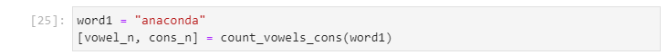


The list collection can also be unpacked using.

```
vowel_n, cons_n = count_vowels_cons(word1)
```


### Positional and Keyword Input Arguments

So far a function has been created with no positional input arguments and one positional input argument. It is possible to create a function with other combinations of positional and keyword input arguments. 

A keyword input argument is assigned a default value during the functions definition and this means the function can be called without specifying the keyword input argument. For example a custom ```print_word``` function can be created.

```
def print_word(word="Hello"):
    """
    

    Parameters
    ----------
    word : string, optional
        DESCRIPTION. The default is "Hello".

    Returns
    -------
    None.

    """
    print(word)
    return None


```

If no input argument is supplied when calling the function, the default value is printed.

```
print_word()
```

This default value can however be assigned a new value while calling the function to instead print the new value.

```
print_word(word="Goodbye")
```


Since this function only has a single keyword input argument, this function can be called using the position of this input argument:

```
print_word("Farewell")
```


A more complicated function can be created with 4 input arguments; 2 positional and 2 keyword input arguments.

```
def print_words(word1, word2, word3="Hello", word4="Goodbye"):
    """
    

    Parameters
    ----------
    word1 : string
        DESCRIPTION.
    word2 : string
        DESCRIPTION.
    word3 : string, optional
        DESCRIPTION. The default is "Hello".
    word4 : string, optional
        DESCRIPTION. The default is "Goodbye".

    Returns
    -------
    None.

    """
    output = [word1, word2, word3, word4]
    print(output)
    return None


```


When calling this function, the 2 positional input arguments must be supplied in order. 

```
print_words("Python", "Anaconda")
```

Normally the name of positional input arguments aren't provided but they can optional be supplied:

```
print_words(word1="Python", word2="Anaconda")
```

Once all positional input arguments are assigned a value, any keyword input arguments can also be supplied a custom value:

```
print_words("Python", "Anaconda", word3="pip")

print_words("Python", "Anaconda", word4="mamba")

print_words("Python", "Anaconda", word3="pip", word4="mamba")
```

It is possible to call the function by assigning the name of all the input arguments and assigning them each to a value:

```
print_words(word1="Python", word2="Anaconda", word3="pip", word4="mamba")
```

Alternatively it is possible to list the value of all input arguments without use of any of the input argument names:

```
print_words("Python", "Anaconda", "pip", "mamba")
```


When all the names of the input arguments are supplied, they can be listed in any order. 

```
print_words(word4="mamba", word1="Python", word2="Anaconda", word3="pip")
```


**However this is generally bad practice*** and it is better practice to maintain the order of the positional input arguments to prevent any confusion. 

The more conventional syntax used to call the function above is of the form:

```
print_words("Python", "Anaconda", word3="pip", word4="mamba")
print_words("Python", "Anaconda", word3="pip")
print_words("Python", "Anaconda", word4="mamba")
print_words("Python", "Anaconda")
```


### Asserting Input Arguments

The following function can be created which expects 4 strings as input arguments; 2 positional strings and 2 keyword strings:

```

def print_words(word1, word2, word3="Hello", word4="Goodbye"):
    """
    prints the concatenation of all input words

    Parameters
    ----------
    word1 : str
        DESCRIPTION.
    word2 : str
        DESCRIPTION.
    word3 : str, optional
        DESCRIPTION. The default is "Hello".
    word4 : str, optional
        DESCRIPTION. The default is "Goodbye".

    Returns
    -------
    None.

    """
    output = word1 + word2 + word3 + word4
    print(output)
    return None


```

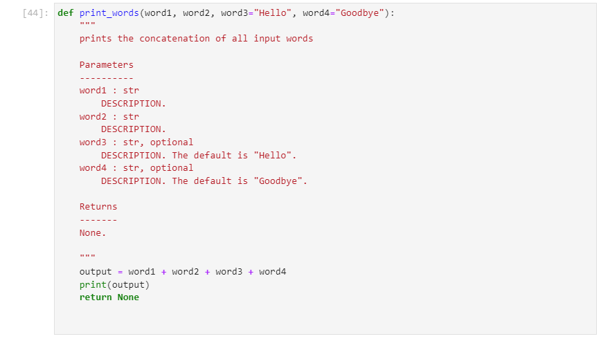

The function can be called using 2 positional strings and works as expected, concatenating all the strings together and printing the concatenated string.

```
print_words("Python", "Anaconda")
```


When one of these is set to an incorrect datatype, an error is displayed:

```
print_words(1, "Anaconda")
```
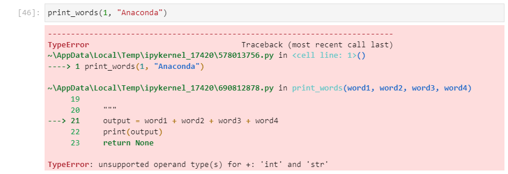

However, more dangerously, when all of these input arguments are the wrong datatype, the code appears to "work":

```
print_words(1, 2, word3=3, word4=4)
```


The inbuilt ```isinstance``` function can be used to check if a variable belongs to a class. It has the form:

```
isinstance(variable, class)
```

Or:

```
isinstance(variable, (class1, class2, class2))
```
For example, the following can be checked:

```
isinstance("Python", str)
```

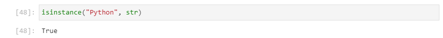

```
isinstance(1, str)
```

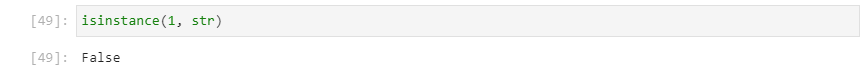

```
isinstance(3.14, str)
```

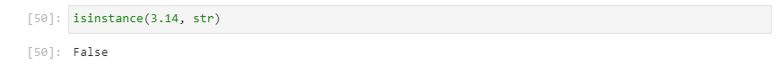

```3.14``` can be checked to see if it is an integer using:

```
isinstance(3.14, int)
```

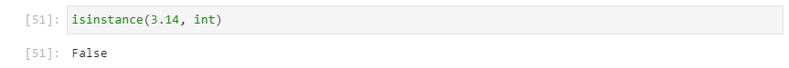

```3.14``` can be checked to see if it is numeric using:

```
isinstance(3.14, (int, float, bool))
```

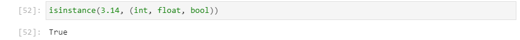

The ```assert``` keyword can be used, to assert a condition. If the condition is True, the code will continue as normal:

```
condition = True
assert condition
```

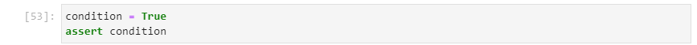

If the condition is False, an ```AssertionError``` will display:

```
condition = False
assert condition
```

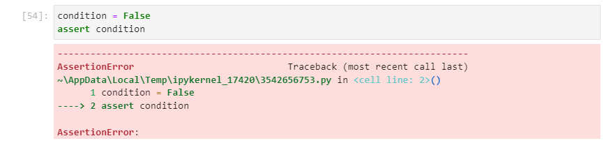

An optional message can be displayed alongside the error. This does not display when the condition is True:

```
condition = True
assert condition, "optional message"
```

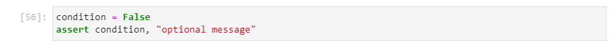

But displays when the condition is False:

```
condition = False
assert condition, "optional message"
```

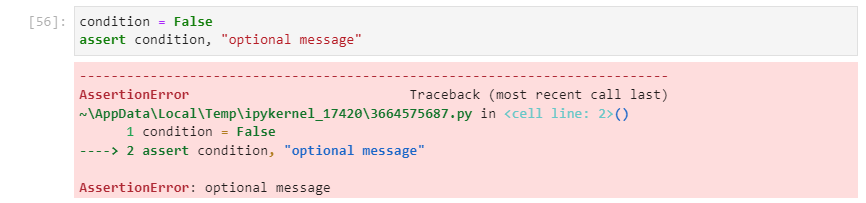

The function above can be modified, to assert that each input is a string:

```
def print_words(word1, word2, word3="Hello", word4="Goodbye"):
    """
    prints the concatenation of all input words

    Parameters
    ----------
    word1 : str
        DESCRIPTION.
    word2 : str
        DESCRIPTION.
    word3 : str, optional
        DESCRIPTION. The default is "Hello".
    word4 : str, optional
        DESCRIPTION. The default is "Goodbye".

    Returns
    -------
    None.

    """
    assert isinstance(word1, str), "word1 must be a str"
    assert isinstance(word2, str), "word2 must be a str"
    assert isinstance(word3, str), "word3 must be a str"
    assert isinstance(word4, str), "word4 must be a str"
    
    output = word1 + word2 + word3 + word4
    print(output)
    return None
    
    
```

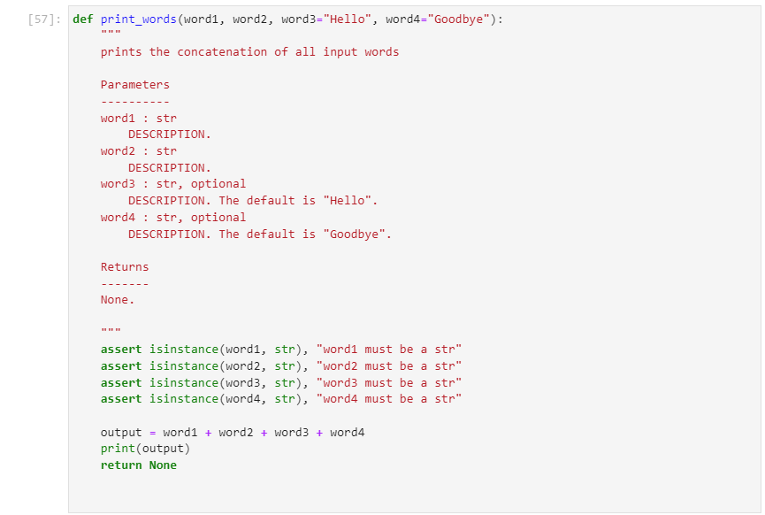

The function works in the same manner as before, when the input arguments supplied are of the correct datatype:

```
print_words("Python", "Anaconda")
```

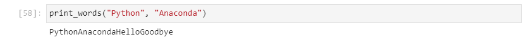

The ```AssertionError``` will display when these are the wrong datatypes:

```
print_words(1, 2, word3=3, word4=4)
```

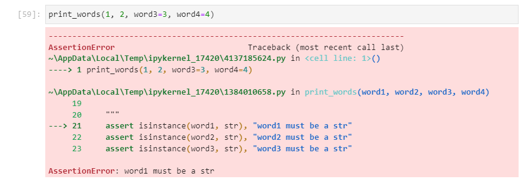

```try``` and ```except``` code blocks can be setup to handle the ```AssertionError``` for the keyword input arguments. When these arguments are the wrong datatypes, the value can be assigned to a default value:

```
def print_words(word1, word2, word3="Hello", word4="Goodbye"):
    """
    prints the concatenation of all input words

    Parameters
    ----------
    word1 : str
        DESCRIPTION.
    word2 : str
        DESCRIPTION.
    word3 : str, optional
        DESCRIPTION. The default is "Hello".
    word4 : str, optional
        DESCRIPTION. The default is "Goodbye".

    Returns
    -------
    None.

    """
    assert isinstance(word1, str), "word1 must be a str"
    assert isinstance(word2, str), "word2 must be a str"
    try:
        assert isinstance(word3, str), "word3 must be a str, set to default \"Hello\""
    except AssertionError:
        word3 = "Hello"
    try:
        assert isinstance(word4, str), "word4 must be a str, set to default \"Goodbye\""
    except AssertionError:
        word4 = "Goodbye"
    
    output = word1 + word2 + word3 + word4
    print(output)
    return None


```

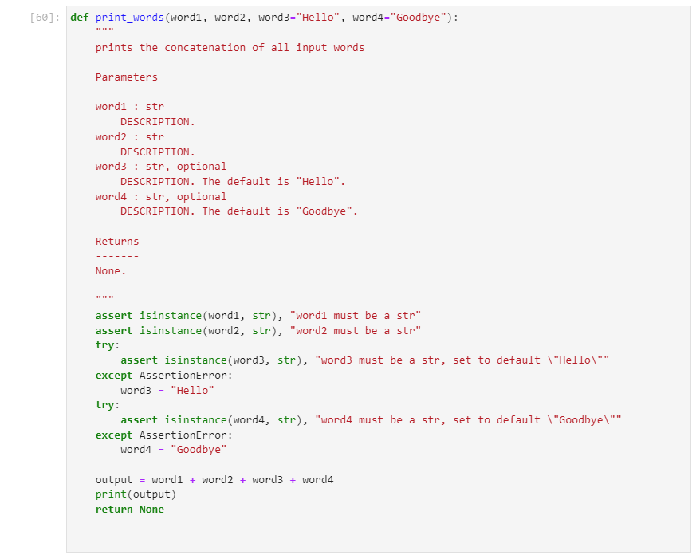

The default value for ```word3``` is now automatically applied when ```word3``` is assigned to a value of the wrong datatype:

```
print_words("Python", "Anaconda", word3=2)
```

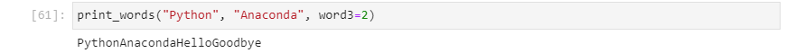

Because the ```AssertionError``` has been handled, the error message does not display. A warning can be printed using the ```except``` code block to inform the user, that the default value has been used:

```
def print_words(word1, word2, word3="Hello", word4="Goodbye"):
    """
    prints the concatenation of all input words

    Parameters
    ----------
    word1 : str
        DESCRIPTION.
    word2 : str
        DESCRIPTION.
    word3 : str, optional
        DESCRIPTION. The default is "Hello".
    word4 : str, optional
        DESCRIPTION. The default is "Goodbye".

    Returns
    -------
    None.

    """
    assert isinstance(word1, str), "word1 must be a str"
    assert isinstance(word2, str), "word2 must be a str"
    try:
        assert isinstance(word3, str), "word3 must be a str, set to default \"Hello\""
    except AssertionError:
        print("word3 must be a str, set to default \"Hello\"")
        word3 = "Hello"
    try:
        assert isinstance(word4, str), "word4 must be a str, set to default \"Goodbye\""
    except AssertionError:
        print("word4 must be a str, set to default \"Goodbye\"")
        word4 = "Goodbye"
    
    output = word1 + word2 + word3 + word4
    print(output)
    return None


```

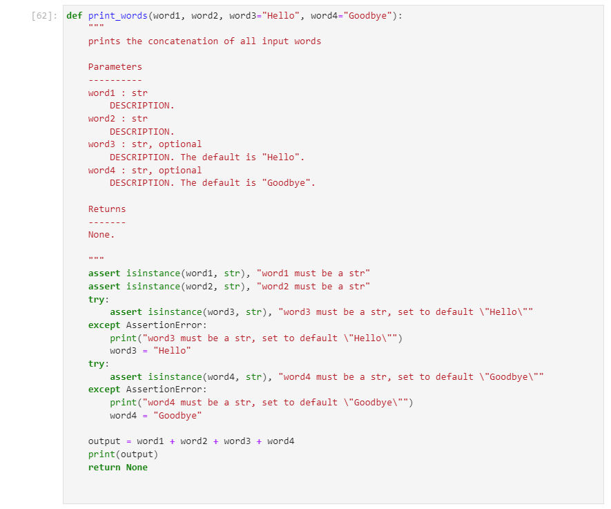

The default value for ```word3``` is now automatically applied when ```word3``` is assigned to a value of the wrong datatype and the user is informed of this change:

```
print_words("Python", "Anaconda", word3=2)
```

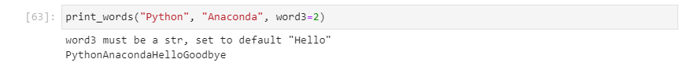

### Function Local Scope

Two variables will be created ```x``` and ```y```, alongside a function ```add_numbers``` that takes two positional input arguments ```x``` and ```y```. **These should not be confused with one another and are not the same variable.**

```
x = 1
y = 2

def add_numbers(x, y):
    """
    Returns the sum of the two input integers

    Parameters
    ----------
    x : int
        DESCRIPTION.
    y : int
        DESCRIPTION.

    Returns
    -------
    value : int
        DESCRIPTION.

    """
    value = x + y
    return value


result = add_numbers(x=3, y=4)


```

When the code above is run:

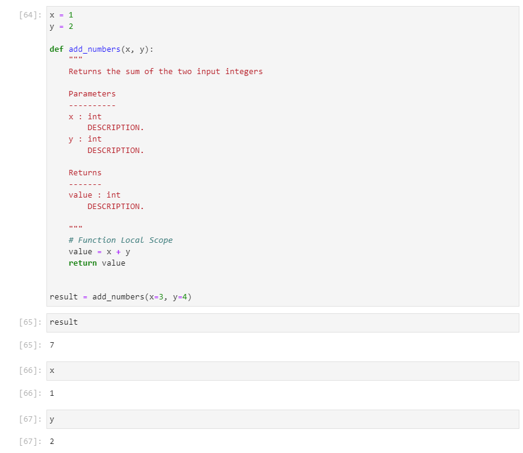

The internal function variable ```value``` is computed by summing the values of ```x``` and ```y``` that were supplied as the input arguments when the function was called. Notice that these had the values ```3``` and ```4``` respectively, meaning ```value``` has a value of ```7```. This variable ```value``` is assigned to the variable ```result```, as assignment to this variable name was made during the function call. Therefore ```result``` has a value of ```7``` and this is a variable that is outside the function.

After the function call, the values of ```x``` and ```y``` remain ```1``` and ```2``` as these variables are outside the function and independent of the input arguments of the function which had the same names but operated over a different scope.

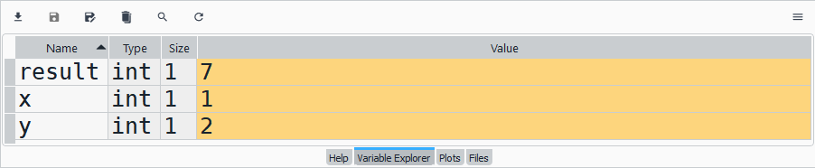

The ```x``` and ```y``` assigned outside the function are inaccessible within the local scope of the function. The only way to access variables within a function is to explicitly supply the values of the variables as input arguments when calling the function:

```
result = add_numbers(x=x, y=y)
```

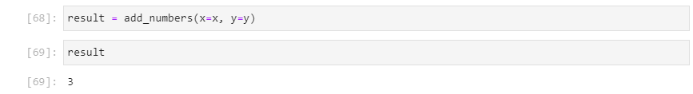

The input arguments ```"x"``` and ```"y"``` become local function variables. These local function variables are not accessible outside the function, unless they are returned to an interactive notebook variable using the ```return``` statement.

To demonstrate, the value of the input arguments ```x``` and ```y``` can be reassigned within the code block of the function and a new variable ```z``` can also be created within the code block of the function. ```x```, ```y``` and ```z``` are local function variables and not accessible elsewhere.

The local function variable ```value``` on the other hand which was computed using the final values of ```x```, ```y``` and ```z``` is supplied via the ```return``` statement and assigned to the variable ```result```. Once again an assignment to this variable name was made during the function call.

```
x = 1
y = 2

def add_numbers(x, y):
    """
    Returns the sum and more of the two input integers

    Parameters
    ----------
    x : int
        DESCRIPTION.
    y : int
        DESCRIPTION.

    Returns
    -------
    value : int
        DESCRIPTION.

    """
    x = x + 1
    y = y + 1
    z = 5
    value = x + y + z
    return value


result = add_numbers(x=3, y=4)


```

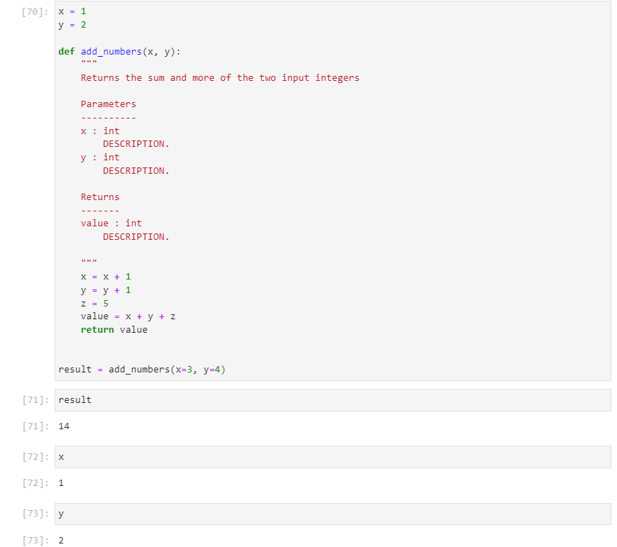

Variables from outside a function can be accessed by making them global variables. Notice that the values of these variables will be altered within the function.

```
x = 1
y = 2

def add_numbers():
    """
    Returns the sum and more of the two global variables
    
    Parameters
    ----------
    x : int
        DESCRIPTION.
    y : int
        DESCRIPTION.
    Returns
    -------
    value : int
        DESCRIPTION.
    """
    
    global x
    global y
    x = x + 1
    y = y + 1
    value = x + y
    return value


result = add_numbers()


```

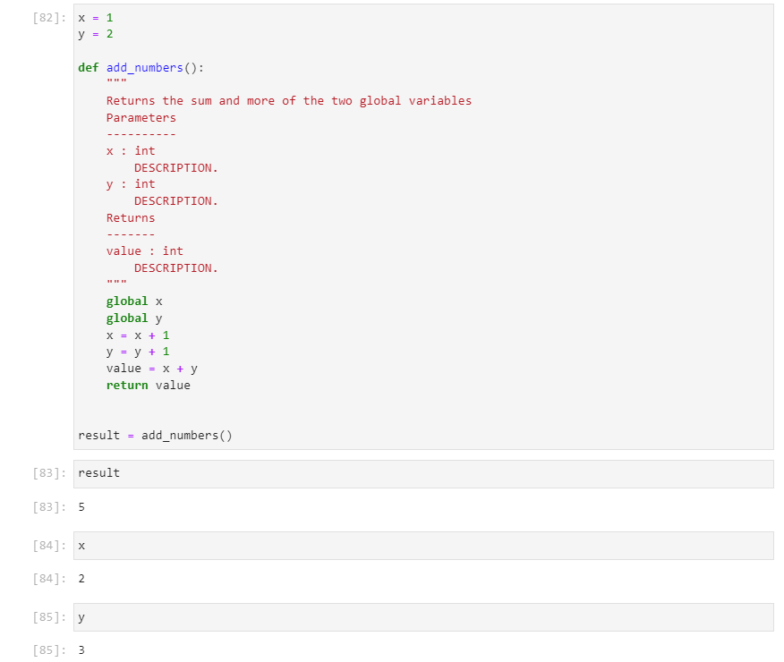

### *args and **kwargs

Up until this point, a specified number of positional and keyword input arguments have been used. 

Sometimes, it is desirable to have more flexibility and instead to have a function that accepts a variable number of input arguments. For example conceptualise a simple function that sums numbers:

```
sum_all(1)
sum_all(1, 2)
sum_all(1, 2, 3)
```

The desired output would be ```1```, ```3``` and ```6``` respectively.

This can be achieved by using ```*args``` as the input arguments. This becomes accessible as the list ```args``` within the code block of the function in the form of a list. This list can be used in a for loop which can iterate over each provided input argument to generate, in this basic sample, the sum of the arguments.

```
def sum_all(*args):
    """
    

    Parameters
    ----------
    *args : list
        List of integers.

    Returns
    -------
    summed_args : int
        summation of int values in args.

    """
    summed_args = 0
    for arg in args:
        summed_args += arg
        
    
    return summed_args


```

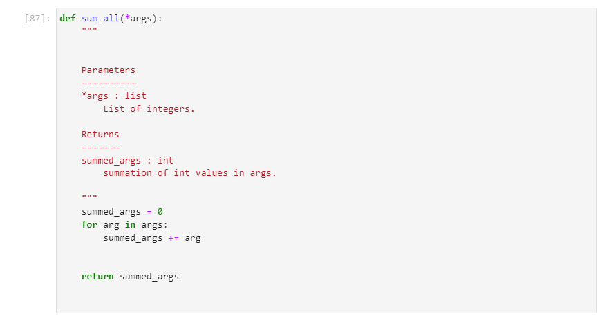

This function works as expected:

```
sum_all()
sum_all(1)
sum_all(1, 2)
sum_all(1, 2, 3)
```

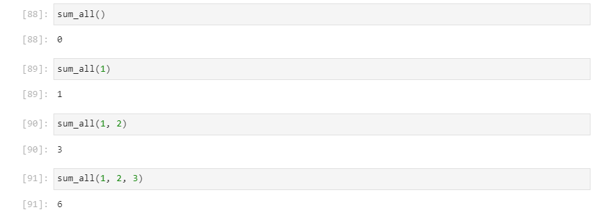

A variable number of keyword input arguments can be supplied if ```**kwargs``` is supplied as the input arguments. ```kwargs``` is accessible in the code block in the form of a dictionary. This dictionary can be iterated over in a for loop. In this example a new dict ```a_dict``` is created which only has the key value pairs of keys that begin with the letter ```"a"```:

```
def a_keys(**kwargs):
    """
    

    Parameters
    ----------
    **kwargs : dict
        key, value pairs.

    Returns
    -------
    a_dict : dict
        key, value pairs with only key values
        that begin with a

    """
    print(kwargs)
    a_dict = {}
    for (key, val) in kwargs.items():
        if key[0] == "a":
            a_dict[key] = val
    
    
    return a_dict


```

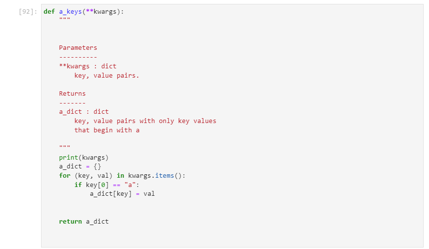

This can be tested using:

```
a_keys(apple=1, banana=2, apricot=3)
```

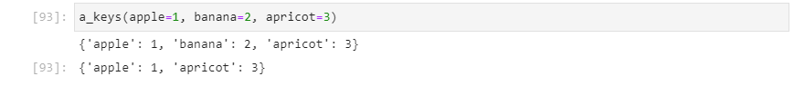

Return to:
[Home](../../../)
