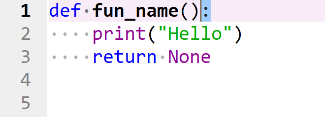

# Objects

Python is an object orientated programming language. This tutorial will briefly recap over the concept of variables and focus on custom functions.

## Variables

Variables can be created by assigning a value to an object name using the assignment operator ```=```.

```
var1 = 1
var2 = 2.1
var3 = "hello"
var4 = ["apples", "bananas", "grapes"]
```

Once created, these variables display on the variable explorer.


## Functions

### Function Definition

Instead of using the assignment operator ```=```, a function is defined to an object name using the ```def``` keyword. Function definition is typically more complicated than variable assignment, as functions have input arguments and also include a function code block.

The form of a function is as follows.

```
def fun_name():
    print("Hello")
    return None


```


The function is defined using the ```def``` keyword. 


The ```def``` keyword is followed by the functions name. The functions name follows the standard naming convention of variable or object names.


After the function name, is a set of parenthesis ```( )``` which are used to enclose any input arguments. These will be discussed in more detail later.


After the parenthesis is a colon ```:``` which is used to indicate the beginning of a code block.



Code belonging to the code block is indented by four spaces, as previously discussed.


The final line in the code block is the ```return``` statement, which can be used to optionally return a value. 


When the function is defined, it does not display on the variable explorer. However beginning to type the functions name in a cell, will display the function name as a an object. The object displays as a function. 


### Calling a Function

If the function name is typed into a cell. The output of the cell states that the object is a function, giving some details about the location where the function is defined.

```
fun_name
```


To call a function, the function name must be followed by a set of parenthesis ```( )```. These parenthesis should include the values of any input arguments, for each input argument from the function definition. In this example, no input arguments were included in the definition of ```fun_name```, so the parenthesis should be left empty.

```
fun_name()
```


Notice that the print statement in the functions code block is now executed.

The output of a function call, can be assigned to a variable. For example.

```
fun_out = fun_name()
```


Notice that the variable displays on the variable explorer as a ```NoneType``` object. This is because the last line in the functions code block is ```return None```.

### return Statement

Two subtly different functions will now be defined, ```print_hello``` which has a print statement printing the value ```"Hello"``` to the console and a ```return None``` return value. And the function ```return_hello``` which has no print statement but returns the value ```"Hello"```.

```
def print_hello():
    print("Hello")
    return None


```

```
def return_hello():
    return "Hello"


```

When these functions are called, the behaviour appears to be similar.

```
print_hello()
return_hello()
```


In the first case, a value is printed to the cell output. In the second case, the value returned is displayed at the cell output.

The difference can be seen more clearly, when the functions are called and assigned to variables.

```
print_out = print_hello()
return_out = return_hello()
```


Notice that there is still a cell output when the ```print_hello``` function is used, because this function uses a print statement. The variable ```print_out``` has the value ```None``` because this function has a ```return None``` return statement.

In constrast there is no cell output when the ```return_hello``` function is used, because this function has returned the value to the variable ```return_out```. ```return_out``` can be seen to have the value ```"Hello"``` on the variable explorer.

The behaviour of the ```"print_hello"``` function does not change if the ```return None``` return statement is removed.

```
def print_hello():
    print("Hello")


```

```
print_out = print_hello()
```


This is because ```None``` is the default return value.

### Input Arguments

A simple function can be defined which has a single input argument ```value```. This function does nothing to this input argument ```value``` and merely returns it unaltered.

```
def return_value(value):
    return value


```

If this function is called without providing the input argument ```value``` then an error message is displayed.

```
var = return_value()
```


If the function name is typed with open parenthesis followed by the shortcut key shift ```⇧``` and tab ```↹```, details about the expected input argument are displayed.

If the function is called with an input argument, it will run as expected. The new variables ```var1``` and ```var2``` will display on the variable explorer.

```
var1 = return_value("Hello")
var2 = return_value(value="Hello")
```

In the above case, when assigning the output of the function to ```var1```, the function was called by providing a singular positional input argument. When using positional input arguments, they need to be provided in the correct order, matching the order of the function definition.

When assigning the output of the function to ```var2```, the function was called by explicitly defining a variable name and assigning it to a value. In such a scenario, the order of the positional input arguments can be changed provided that all the positional input arguments are supplied. In general however it is recommended to maintain the order of the positional input arguments.


### docstring

When using shift ```⇧``` and tab ```↹```, details about the input arguments are supplied, alongside the functions docstring. A docstring can be provided by creating a multi-line comment at the top of the functions code block. Notice that the template for the docstring displays as soon as the multiline comment is added.

```
def return_value(value):
    """
    """
    return value


```


```
def return_value(value):
    """
    

    Parameters
    ----------
    value : TYPE
        DESCRIPTION.

    Returns
    -------
    value : TYPE
        DESCRIPTION.

    """
    return value


```

The docstring should provide a quick description of what the function does. For each input argument and the return value, the expected datatype should be supplied.

```
def return_value(value):
    """
    This function takes in an input value and returns it unaltered.

    Parameters
    ----------
    value : str
        This the value input.

    Returns
    -------
    value : str
        This is the unaltered value returned.

    """
    return value


```

When inputting the functions name with open parenthesis followed by shift ```⇧``` and tab ```↹```, the updated docstring displays. 

Another function ```make_plural``` can be defined which takes in a singular input value and returns the plural of it. i.e. concatenates the original string with an ```"s"```.

```
def make_plural(word):
    """
    This function takes in a singular word and returns the plural word.

    Parameters
    ----------
    word : str
        The singular word.

    Returns
    -------
    plural_word : str
        The plural word.

    """
    plural_word = word + "s"
    return plural_word


```


```
def count_vowels(word):
    """
    This function takes in a word and counts the number of vowels.

    Parameters
    ----------
    word : str
        Input word.

    Returns
    -------
    vowel_count: int
        The number of vowels.

    """
    vowel_count = 0
    for let in word:
        if let in ["a", "e", "i", "o", "u"]:
            vowel_count += 1
    

    return vowel_count


```


```

def count_vowels_cons(word):
    """
    This function takes in a word and returns the number of vowels 
    and consonants.

    Parameters
    ----------
    word : str
        Input word.

    Returns
    -------
    [vowel_count, cons_count]: [int, int]
        The number of vowels and the number of consonants.

    """
    vowel_count = 0
    cons_count = 0
    for let in word:
        if let in ["a", "e", "i", "o", "u"]:
            vowel_count += 1
        else:
            cons_count += 1
    

    return [vowel_count, cons_count]


```

A return statement can be used to return a collection such as a list or tuple.


### Function Local Scope

```
def count_vowels(word):
    """
    This function takes in a word and counts the number of vowels.

    Parameters
    ----------
    word : str
        Input word.

    Returns
    -------
    vowel_count: int
        The number of vowels.

    """
    vowel_count = 0
    for let in word:
        if let in ["a", "e", "i", "o", "u"]:
            vowel_count += 1
    

    return vowel_count


```

```
count_vowels("hello")
```

### Positional and Keyword Input Arguments


### Asserting Input Arguments


### *args and **kwargs


## lambda Expressions