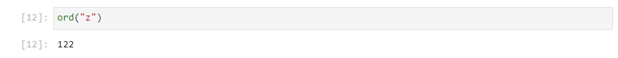
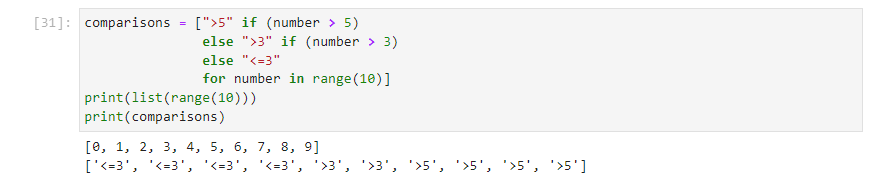
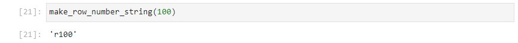
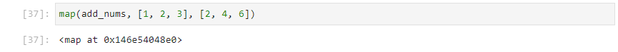

# Introduction

Previously a code block has been used to implement a for loop. For short loops that result in an output collect such as a list or dictionary and operate over an iterable it is possible to condense the code block down to a line of code known as a comprehension. Likewise code blocks have been used for a function, for simple functions, the function can be condensed down into a single line of code known as a lambda expression.

# list comprehension

A new list can be populated from an iterable by use of an expression within a for loop. This can be done with a code block, as shown:

```
new_list = []
for loop_variable in iterable:
    new_list.append(expression)


```


Notice that ```new_list``` is initially created outside the for loop as an empty list. 


Within the for loop, the list method ```append``` is used, to append an ```expression``` to the list.


The ```for loop_variable in iterable``` can then be taken to the right hand side. No colon ```:``` is shown as there is no code block being created.


The ```append``` method does not need to be used as the iteration involving the ```expression``` occurs within the ```new_list``` and is not a seperate variable that needs to be appended. So he code block can be collapsed into a single line, which is known as a list comprehension:

```
new_list = [expression for loop_variable in iterable]
```

Supposing a collection of strings is desired, corresponding to rows:

```
row_numbers = ["r0", "r1", "r2", ...]
```

Starting from the template:

```
new_list = [expression for loop_variable in iterable]
```

```new_list``` is going to be called ```row_numbers```:

```
row_numbers = [expression for loop_variable in iterable]
```

The numeric iteration can be created using a range object, for example using a ```range(5)```:

```
row_numbers = [expression for loop_variable in range(5)]
```

For convenience the ```loop_variable``` can be assigned to ```number```:

```
row_numbers = [expression for number in range(5)]
```

And ```number = 0``` can be taken as an example. The expression should lead to the value ```"r0"``` so this integer number needs to be cast to a string and this string concatenated to ```"r"```. The expression is therefore ```"r" + str(number)``` and:

```
row_numbers = ["r" + str(number) for number in range(5)]
```


For comparison this would be carried out using the following lines in a for loop:

```
row_numbers = []
for number in range(5):
    row_number = "r" + str(number)
    row_numbers.append(row_number)
    

row_numbers
```


# dictionary Comprehension

A dictionary is a collection that has ```key: value``` pairs, where each key is normally a unique string. For example:

```
d1 = {"a": 1, 
      "b": 2, 
      "c": 3,
      "d": 4,}
```


The dictionary keys is a list like object containing strings:

```
d1.keys()
```


The dictionary values is another list like object. Each value can be a singular item or a collection of items itself:

```
d1.keys()
```


The dictionary items is another list like object. This time each item in the items list is a tuple with the 0th index corresponding to the key and the 1st index corresponding to the value:

```
d1.values()
```


These three collections can be looped over:

```
for key in d1.keys():
    print(key)


```


```
for value in d1.values():
    print(value)


```


Because items gives a list of tuple key, value pairs, both of these are accessible when looping over items:

```
for key, value in d1.items():
    print(key, value)


```


A list comprehension generally has the form:

```
new_list = [expression for loop_variable in iterable]
```

For a dictionary there is a key value pair and so an expression must be made to generate keys and an expression must be made to generate values. The iterable item should generally, have key-value pairs.

```
new_dict = {key_expression : value_expression for key, value in iterable_item}
```

Supposing a new dictionary ```d2``` is to be generated that has the same keys of ```d1``` but squares the values. Then ```new_dict``` is ```d2```:

```
d2 = {key_expression : value_expression for key, value in iterable_item}
```

The iterable item is ```d1.items()```:

```
d2 = {key_expression : value_expression for key, value in d1.items()}
```

The key is unchanges so the ```key_expression``` is just ```key```:

```
d2 = {key : value_expression for key, value in d1.items()}
```

And the value is squared, so the ```value_expression``` is ```value ** 2```. The dictionary comprehension is therefore:

```
d2 = {key : value ** 2 for key, value in d1.items()}
```


Supposing the following was desired for a dictionary containing every letter in the alphabet. The function ```ord``` can be used to find the ordinal integer value of the character ```"a"```:

```
ord("a")
```


And of the character ```"z"```:

```
ord("z")
```



This is ```97``` and ```122```. Conversely the function ```chr``` can be used to convert an ordinal integer into its corresponding character. ```97``` gives ```"a"```:

```
chr(97)
```


```122``` gives ```"z"```:

```
chr(122)
```


The ord function can therefore be used with a range object to create a collection of characters in the alphabet. Note as Python uses zero-order, the indexing is inclusive of the lower bound and exclusive of the top bound so the ```range(97, 123)``` is selected. A list of unique keys corresponding to each character in the alphabet can be generated using list comprehension:

```
keys = [chr(num) for num in range(97,123)]
keys
```


The values will range from ```1``` squared to ```26``` squared. They can likewise be computed using list comprehension. This gives a ```range(1, 27)``` as the range object which is inclusive of the lower bound and exclusive fo the upper bound:

```
values = [num ** 2 for num in range(1,27)]
values
```


A dictionary can be made by zipping these two lists together and casting to a dictionary:

```
d3 = dict(zip(keys, values))
d3
```


This dictionary can be made directly using dictionary comprehension:

```
d4 = {chr(num + 96): num ** 2 for num in range(1,27)}
d4
```


In this case an offset of ```96``` (from a starting value of ```1```) is taken advantage of, so a single range object can be used to generate the keys and values.

# comprehensions with if else conditions

The standard convention for a list comprehension is:

```
new_list = [expression for loop_variable in iterable]
```

A condition can be added:

```
new_list = [expression for loop_variable in iterable if condition]
```

For example, a list of numbers can be created using list comprehension with a range object acting as the iterable:

```
numbers = [number for number in range(5)]
numbers
```


If instead, only the even numbers are desired an if statement with a condition can be added:

```
even_numbers = [number for number in range(5) if (number % 2 == 0)]
even_numbers
```


List comprehension can include an ```if``` and associated```else``` statement. The order of the syntax is changed to accomodate both statements:

```
new_list = [expression if condition 
            else else_expression 
            for loop_variable in iterable]
```

For example:

```
even_numbers = [number if (number % 2 == 0) else None for number in range(5)]
even_numbers
```


Or an ```is_even``` list can be computed using:

```
is_even = [True if number % 2 == 0 else False for number in range(5)] 
is_even
```


The syntax does not allow for the ```elif``` keyword however an ```else``` ```if``` condition can be setup in the following way:

```
new_list = [expression if condition 
            else else_if_expression if else_if_condition
            else else_condition
            for loop_variable in iterable]
```            

For example the following comparisons can be made:

```
comparisons = [">5" if (number > 5) 
               else ">3" if (number > 3) 
               else "<=3" 
               for number in range(10)]
print(list(range(10)))
print(comparisons)
```



# lambda expressions

When a function is defined, it has the form:

```
def function_name(input1, input2):
    return value


```

The important components are the ```function_name``` and the definition to the function name can be thought of as an assignment.

```
function_name = 
```

This assignment is made to the keyword ```lambda```, to indicate the creation of a function and not a variable.

```
function_name = lambda
```

The input arguments ```input1```, ```input2``` are provided after the keyword ```lambda``` using a comma as a delimiter.

```
function_name = lambda input1, input2
```

The colon ```:``` in a function typically indicates the beginning of a code block. However in a lambda expression, there is no code block as the function is a single line. The colon ```:``` is used in place of the word ```return``` and seperates the return ```value``` from the input arguments. 

```
function_name = lambda input1, input2: value
```

For example a simple function to create a row number string from a number:

```
def make_row_number_string(number):
    row_number = "r" + str(number)
    return row_number


```


Can be collapsed down to:

```
def make_row_number_string(number):
    return "r" + str(number)


```


This can be tested by calling and providing an input integer:

```
make_row_number_string(100)
```



This can also be expressed as a lambda expression using:

```
make_row_number_string2 = lambda number: "r" + str(number)
```


This can be tested by calling the lambda function and providing an input integer:

```
make_row_number_string2(100)
```


It is common to use a lambda expression as a "throw-away" function:

```
make_row_number_string2 = lambda number: "r" + str(number)
```

In such a scenario, there is no assignment to the function name but the value that would have been to the assigned is now enclosed in parethesis:

```
(lambda number: "r" + str(number))
```


This references the function and does not call it. A second set of parenthesis is used to call the function, enclosing the input argument:

```
(lambda number: "r" + str(number))(100)
```


Recall the form for list comprehension:

```
new_list = [expression for loop_variable in iterable]
```

This was seen earlier, to become:

```
row_numbers = [expression for number in range(5)]
```

Instead of using ```"r" + str(number)``` for the expression. The lambda expression from above can be used here:

```
row_numbers = [(lambda number: "r" + str(number))(number) for number in range(5)]
row_numbers
```


This gives the same result.

# map

In Python:

```
1 + 2
```

performs addition


However:

```
[1, 2, 3] + [2, 4, 6]
```

performs concatenation of the list collection


Supposing the desired operation is instead:

```
[1+2, 2+4, 3+6]
```


A lambda function can be created to add numbers:

```
add_nums = lambda num1, num2: num1 + num2
```


This function can be called with two integer input arguments:

```
add_nums(1, 2)
```

And works as intended:


A map object can be created to map the function alongside a collection for each input argument:

```
map(add_nums, [1, 2, 3], [2, 4, 6])
```




This map object can be cast to a list using:

```
list(map(add_nums, [1, 2, 3], [2, 4, 6]))
```


The lambda expression can also be used in this context as a throwaway function:

```
map((lambda num1, num2: num1 + num2), [1, 2, 3], [2, 4, 6])
```


```
list(map((lambda num1, num2: num1 + num2), [1, 2, 3], [2, 4, 6]))
```

