# IterTools Module

## tuple Iterable and tuple Iterator

A collection is an iterable. For example:

```
archive = (1, True, 3.14, 'hello', 'hello', 'bye')
```


This can be viewed in the Variable Explorer:


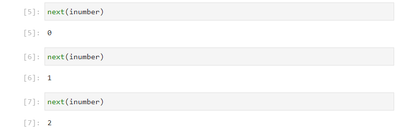

Notice it has 6 items and these are all shown simultaneously. If the directory of the iterable is examined, it has the ```__iter__``` data model method:

```
from pprint import pprint
pprint(dir(archive), compact=True)
```

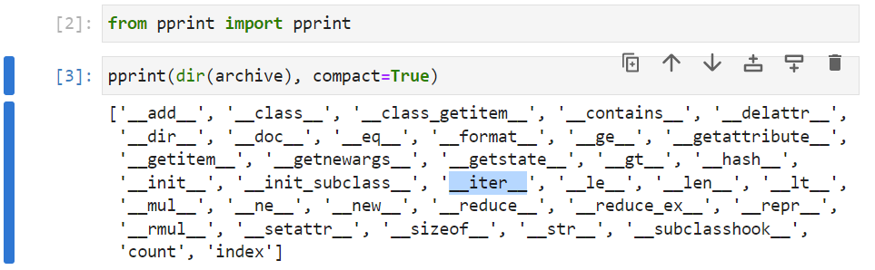

This means the ```iter``` function can be used

```
forward = iter(archive)
forward
```

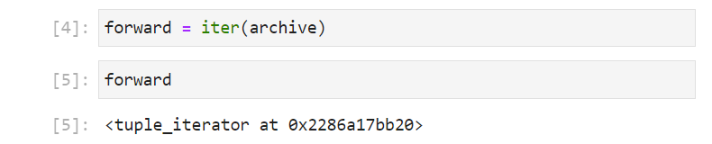

On the Variable Explorer, the ```tuple_iterator``` instance has a size of ```1```. 

An iterator displays ```1``` value at a time:

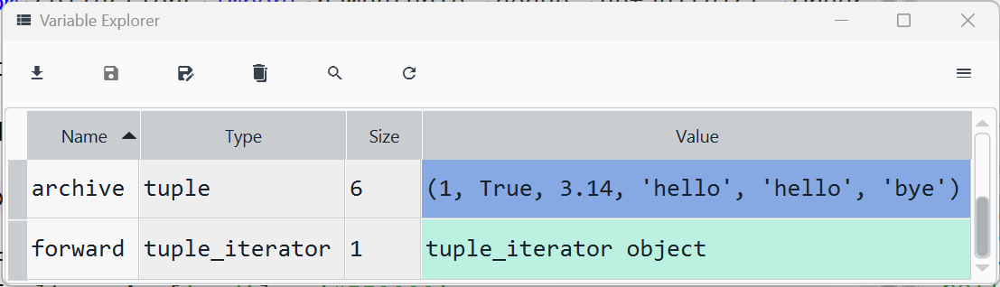

The ```next``` function can be used to read the next value and discard the previous value:

```
next(forward)
next(forward)
next(forward)
next(forward)
next(forward)
next(forward)
```

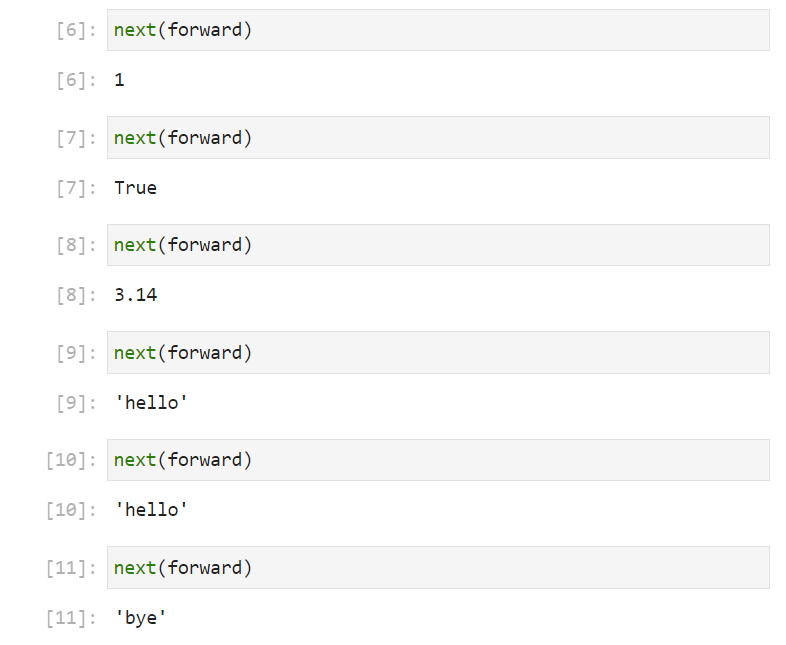

The iterator was cast from a ```tuple``` that had a length of ```6```. Once ```next``` is called 6 times, the iterator is consumed. A ```StopIteration``` error displays if ```next``` is attempted to be called again:

```
next(forward)
```

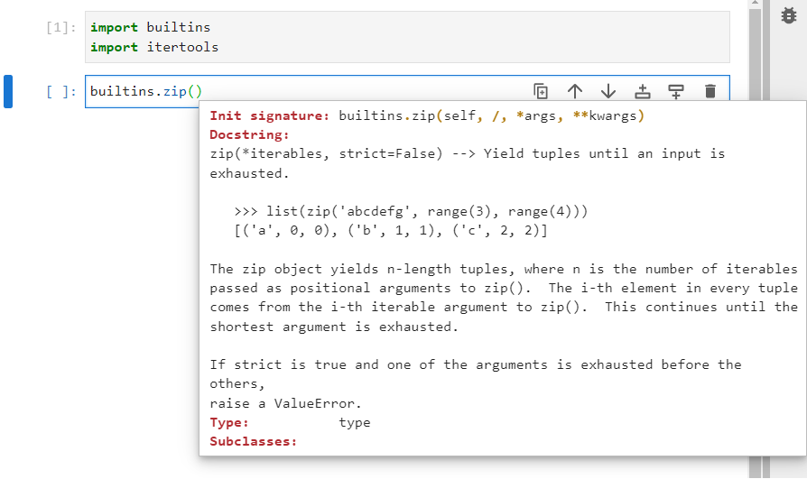

Alternatively if the iterator is cast into a ```tuple```, all the elements in it are consumed:

```
forward = iter(archive)
tuple(forward)
```

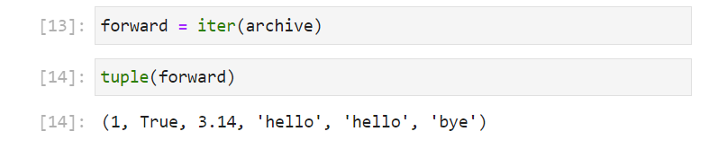

## Python builtins

Python ```builtins``` contains the most commonly used iterator classes. 

### zip

The ```zip``` class can be used to zip two or more collections together. Its initialization signature can be viewed by inputting ```zip()``` and pressing shift ```⇧``` and tab ```↹```:

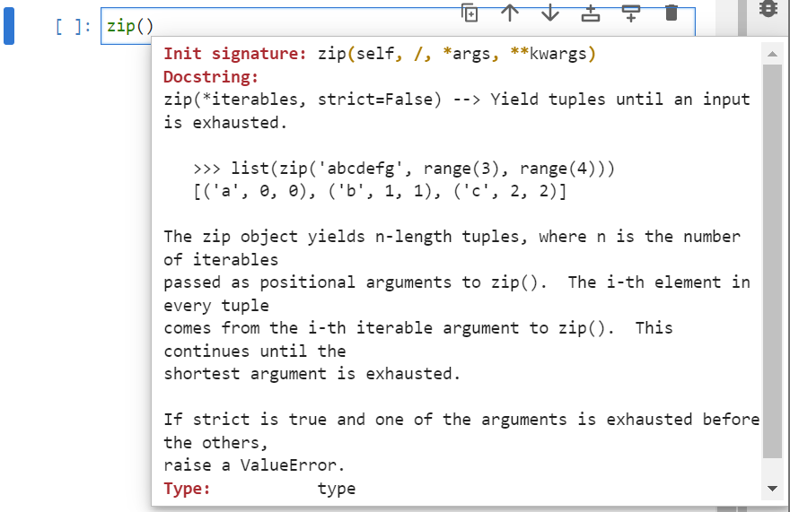

```
keys = ('r', 'g', 'b')
values = ('#FF0000', '#00FF00', '#0000FF')
forward = zip(keys, values)
forward
```

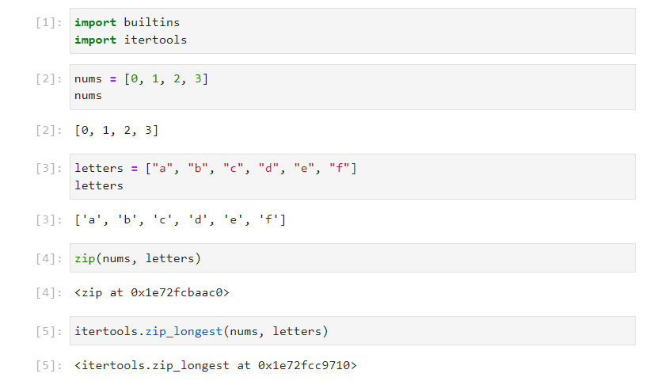

This ```zip``` instance is an iterator that once again displays on the Variable Explorer with a length of ```1``` as it displays ```1``` value at a time, which in this case is a ```tuple```:

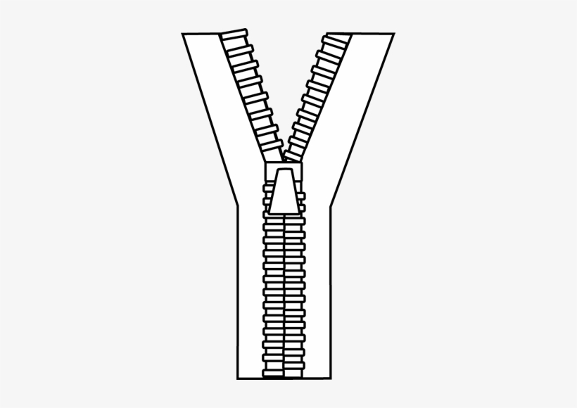

Each time ```next``` is called, a ```tuple``` of the zipped items displays:

```
next(forward)
next(forward)
next(forward)
```

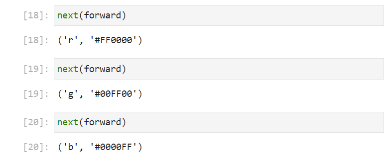

When two collections are zipped, they can be cast into a ```dict```, doing so consumes all the values:

```
forward = zip(keys, values)
dict(forward)
```

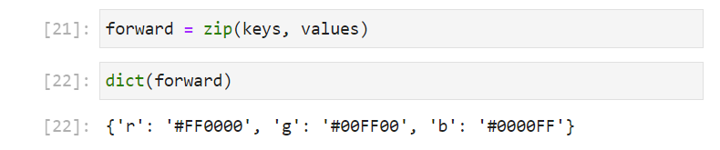

If ```zip``` is used on collections of multiple lengths, it stops zipping items once the shortest length collection has been consumed. ```names``` for example has an additional value ```yellow``` which is ignored:

```
names = ('red', 'green', 'blue', 'yellow')
keys = ('r', 'g', 'b')
values = ('#FF0000', '#00FF00', '#0000FF')
forward = zip(names, keys, values)
tuple(forward)
```

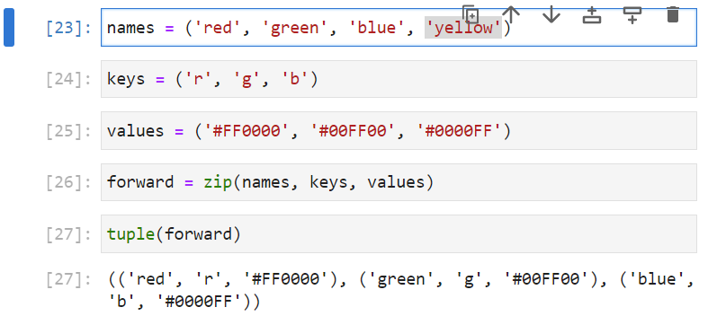

### range Iterable and range Iterator

Earlier a ```tuple``` and a ```tuple_iterator``` was examined. The ```range``` class is iterable like a ```tuple``` but often gets confused with an ```iterator```because its common usage in ```for``` loops. It can be used to obtain an iterable of a numeric sequence. Its initialization signature can be viewed by inputting ```range()``` and pressing shift ```⇧``` and tab ```↹```:

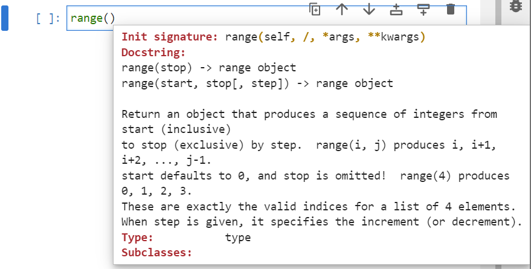

Its input arguments are of the type ```int```:

* It can take in a single ```stop``` input argument. 

* Alternatively it can take a ```start``` and ```stop``` input argument.

* Alternatively it can take a ```start```, ```stop``` and ```step``` input argument.

The input arguments are followed by a ```/``` indicating they are to be provided positionally only. If the ```start``` is not supplied it is assumed to be ```0``` and if the ```step``` is assumed to be ```1```. Python uses zero-order indexing and is inclusive of the lower bound and exclusive of the upper bound:

```
nums = range(3)
nums
```

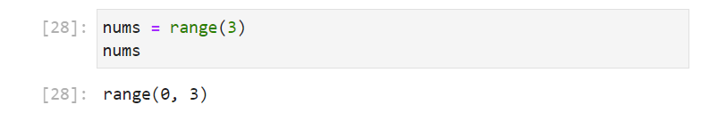

This displays on the Variable Explorer with the size of ```3``` and differs from the value of ```1``` shown for an iterator. The ```range``` class always has a ```stop``` value, and therefore is always an iterable of finite length. It has a size that can readily be computed and the ```__len__``` data model identifier defined:

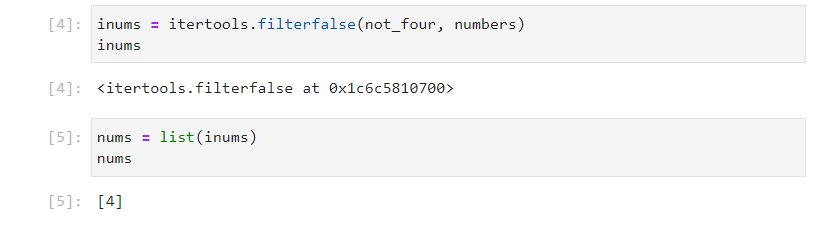

```
forward.__len__()
len(forward)
```

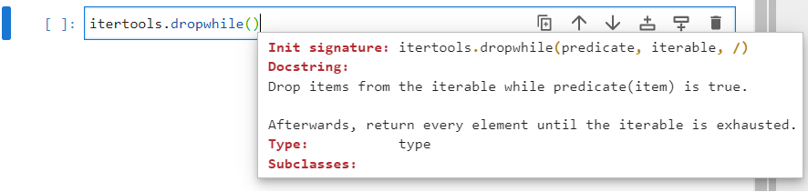

If ```next``` is called on it a ```TypeError``` is displayed stating that ```range``` is not an iterator:

```
next(nums)
```

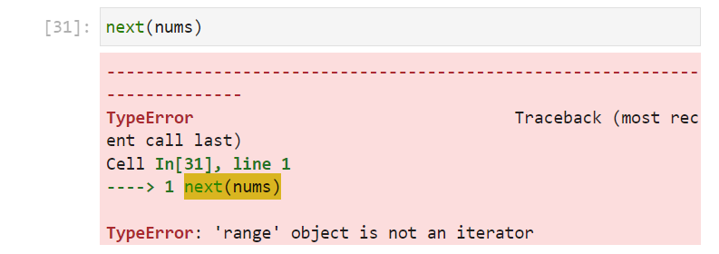

Both the ```tuple``` and ```range``` classes are iterable and can be cast into iterators using the ```iter``` function:

```
forward = iter(nums)
forward
```

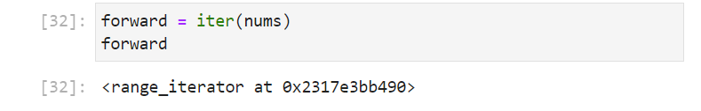

The ```range_iterator``` instance is an iterator that once again displays on the Variable Explorer with a length of ```1``` as it displays ```1``` value at a time, which in this case is an ```int```:

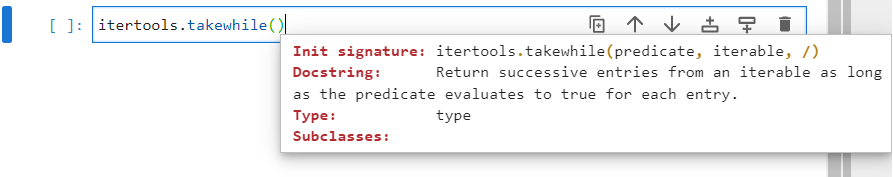

```
next(forward)
next(forward)
next(forward)
```

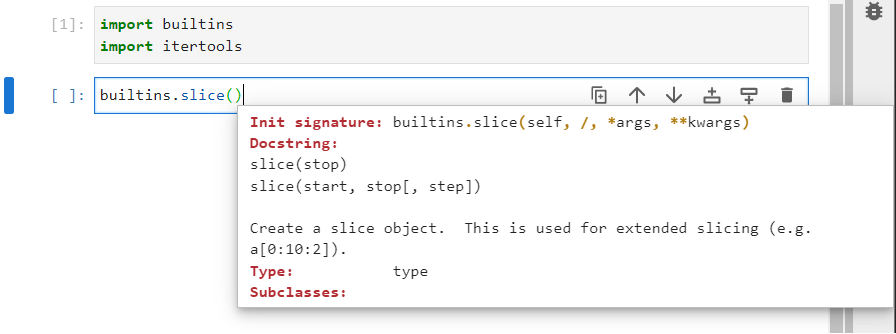

A ```for``` loop is normally used with a ```range``` instance:

```
for num in range(3):
    print(num)


```

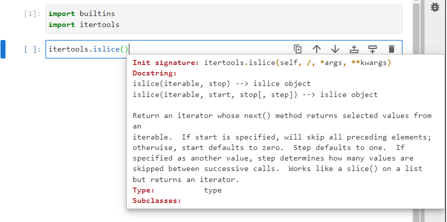

Under the hood, this uses a ```range_iterator``` instance.It is worthwhile exploring the mechanics of the ```for``` loop using an infinite ```while``` loop. First is the instantiation of an iterator. ```next``` is called on this iterator within a nested ```try``` code block and in this case the ```int``` value of the iterator is printed. There is an associated ```except StopIteration``` block which breaks out of the ```while``` loop:

```
forward = iter(range(3))
while True:
    try:
        print(next(forward))
    except StopIteration:
        break
        
        
```

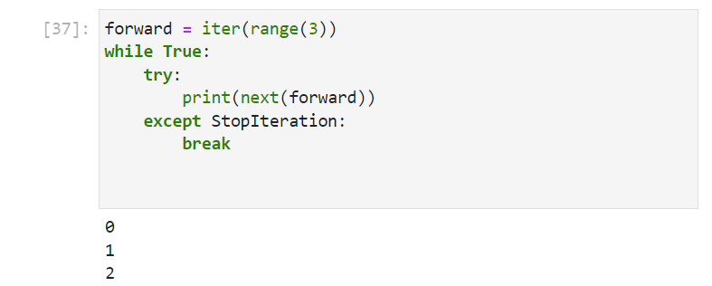

This means all ```for``` loops are under the hood ```while``` loops which use nested ```try``` and ```except StopIteration``` code blocks. The former contains the code that would be placed in the ```for``` loop and the latter is designed for breaking out the ```while``` loop.

### map

The ```map``` class can be used to map a function call to a sequence. Its initialization signature can be viewed by inputting ```map()``` and pressing shift ```⇧``` and tab ```↹```:

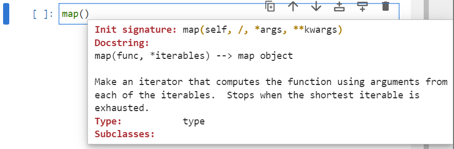

For example the ```lambda``` expression:

```
squared = lambda num: num ** 2
```

Can be mapped to the following sequence:

```
nums = (0, 1, 2, 3, 4)
```

An iterator that maps this function to this sequence can be created using:

```
forward = map(squared, nums)
```


The ```map``` instance is an iterator that once again displays on the Variable Explorer with a length of ```1``` as it displays ```1``` value at a time, which in this case is the return value of the ```squared``` function call:


When ```next``` is called, the next value in ```nums``` becomes ```num``` and is used for the input argument in the ```squared``` function call:

```
next(forward)
```

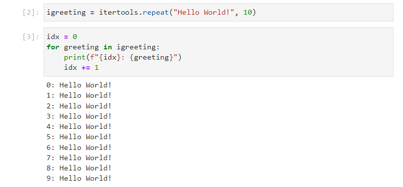

```
next(forward)
```

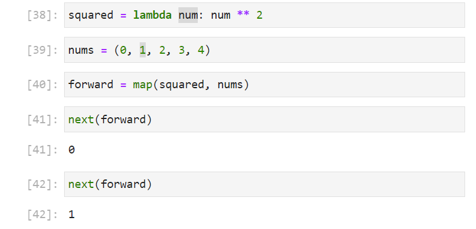

```
next(forward)
```

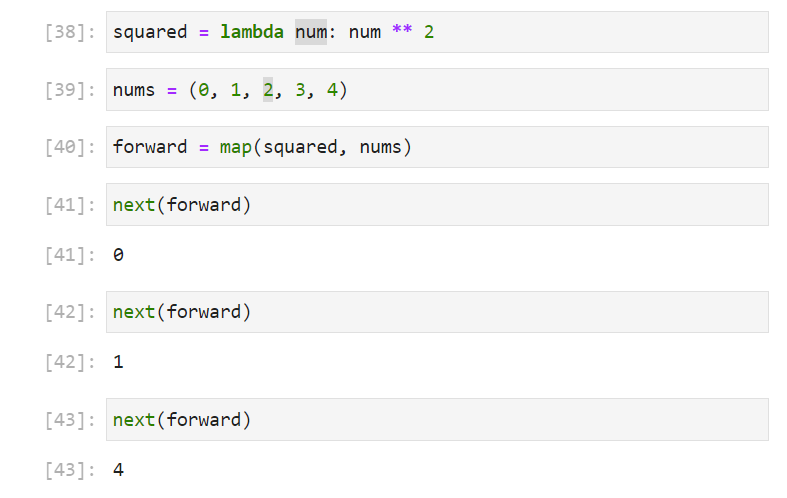

All the function calls in the iterator can be consumed by casting to a ```tuple```:

```
tuple(map(squared, nums))
```

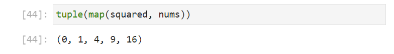

### filter

The ```filter``` class can be used to filter using a filter function call to a sequence. Its initialization signature can be viewed by inputting ```filter()``` and pressing shift ```⇧``` and tab ```↹```:

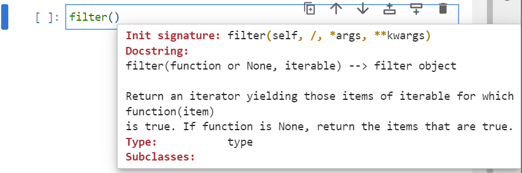

For example the ```lambda``` expression:

```
positive_filter = lambda num: num > 0
```

Can be mapped to the following sequence:

```
nums = (-2, -1, 0, 1, 2)
```

Using:

```
forward = filter(positive_filter, nums)
```

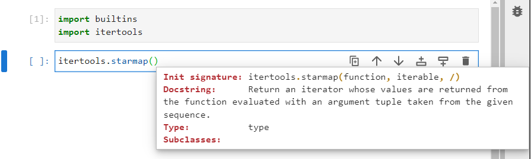

This ```filter``` instance is an iterator that once again displays on the Variable Explorer with a length of ```1``` as it displays ```1``` value at a time, which in this case is a value in the sequence that has a ```positive_filter``` function call of ```True```:

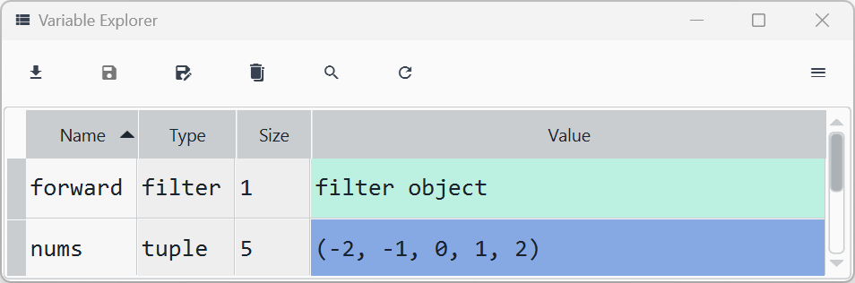

When ```next``` is called, the value is the next value in the sequence ```nums``` where the ```positive_filter``` function returns ```True```: 

```
next(forward)
```

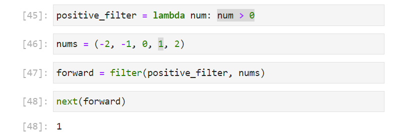

```
next(forward)
```

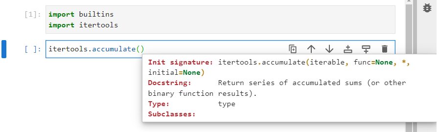

All the filtered values given by the iterator can be consumed by casting to a ```tuple```:

```
tuple(filter(positive_filter, nums))
```


## itertools module

The ```itertools``` module contains a number of other useful iterator classes which supplement those from ```builtins```.

The ```itertools``` module can be imported using:

```
import itertools
```

Its identifiers can be viewed by typing in ```itertools.``` followed by a tab ```↹```:

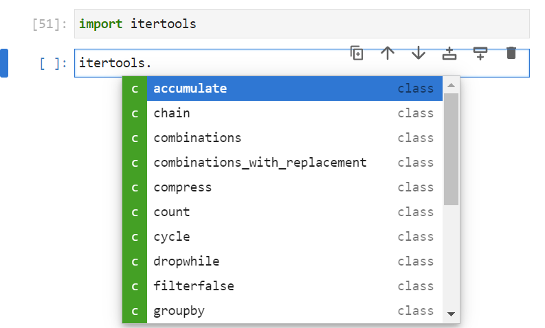

Most of these are classes.

### islice

Supposing the following ```tuple``` is created:

```
nums = tuple(range(10))
```


It can be viewed on the Variable Explorer. The ```tuple``` was cast from a ```range``` instance which had a default ```start``` of ```0``` and ```step``` of ```1``` so its index and values match. It can be examined in the Variable Explorer:

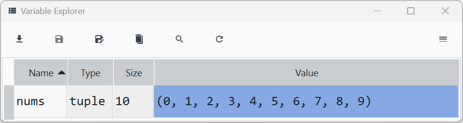

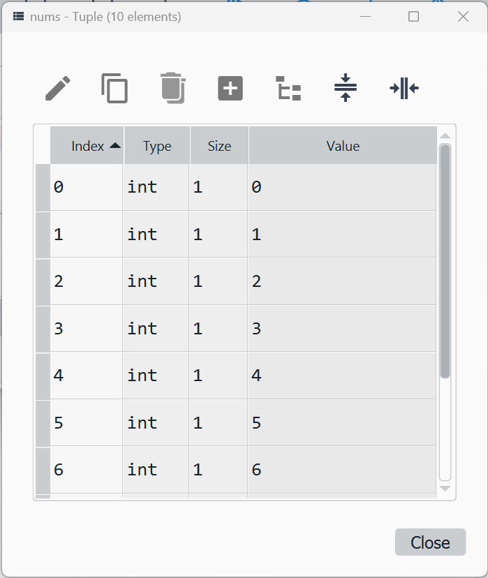

Indexing and slicing are typically carried out using square brackets:

```
nums[0]
nums[1:5]
```

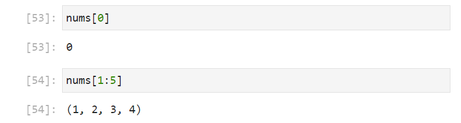

The ```slice``` function can also be explicitly used. The ```slice``` function has input arguments that are consistent with the ```range``` class. Its input arguments can be viewed by inputting ```slice()``` and pressing shift ```⇧``` and tab ```↹```:

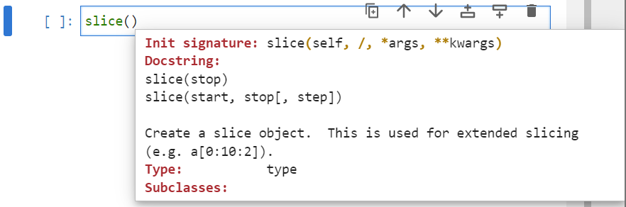

Its input arguments are of the type ```int```:

* It can take in a single ```stop``` input argument. 

* Alternatively it can take a ```start``` and ```stop``` input argument.

* Alternatively it can take a ```start```, ```stop``` and ```step``` input argument.

The input arguments are followed by a ```/``` indicating they are to be provided positionally only. If the ```start``` is not supplied it is assumed to be ```0``` and if the ```step``` is assumed to be ```1```. The same slice as before can be examined:

```
slice(1, 5)
nums[slice(1, 5)]
```

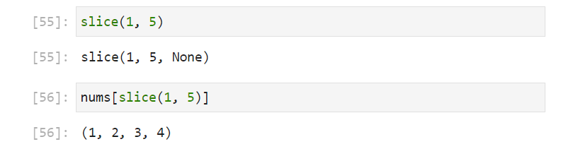

The iterator slice ```islice``` class returns an iterator instead of a slice that retains the same data type as the original iterable. Its initialization signature can be viewed by inputting ```itertools.islice()``` and pressing shift ```⇧``` and tab ```↹```:

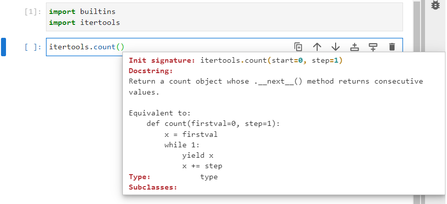

It requires an iterable or iterator as the first positional input argument and the subsequent input arguments match that of ```slice```:

```
forward = itertools.islice(nums, 1, 5)
forward
```

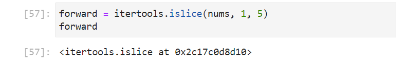

This ```islice``` instance is an iterator that once again displays on the Variable Explorer with a length of ```1``` as it displays ```1``` value at a time, which in this case is the value which came fro  slicing the original sequence:

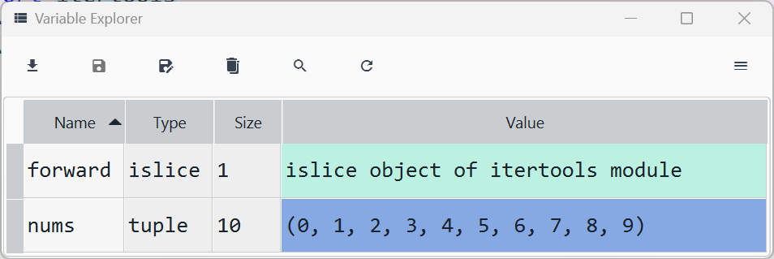

```
next(forward)
next(forward)
```

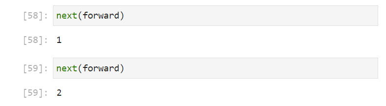

The iterator slice ```islice``` class can also take an ```iterator``` as a first input argument. When it does the iterator slice is linked to the iterator:

```
forward = iter(range(10))
forward_slice = itertools.islice(forward, 1, 5)
```

This can be seen by casting ```forward_slice``` to a ```tuple``` and then casting ```forward``` to a ```tuple```:

```
tuple(forward_slice)
tuple(forward)
```

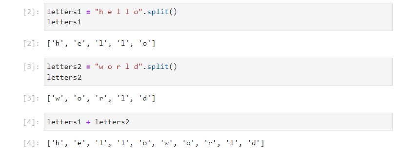

Notice that when the values in ```forward_slice``` were consumed by casting ```forward_slice``` into a ```tuple```, they were also consumed in ```forward```, which is why they do not display in ```forward``` when ```forward``` is consumed by casting into a ```tuple```.

Alternatively if all the values were consumed in ```forward```, they would also be consumed in ```forward_slice```: 

```
forward = iter(range(10))
forward_slice = itertools.islice(forward, 1, 5)
tuple(forward)
tuple(forward_slice)
```

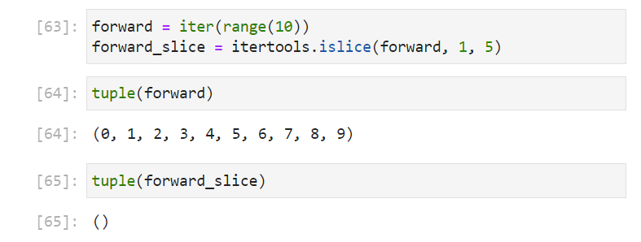

### tee

The ```tee``` function can be used to return a ```tuple``` of ```n``` independent iterators. Its name comes from the tee junction used for example in plumbing to split a water stream:

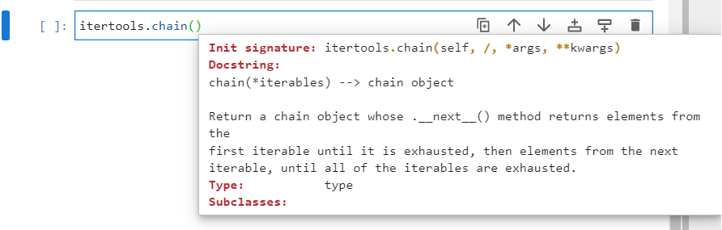

Its docstring can be viewed by inputting ```itertools.tee()``` and pressing shift ```⇧``` and tab ```↹```. It takes in an iterable or iterator as an input argument, and the number of independent iterators. A ```/``` is followed by these input arguments so they must be supplied positionally:

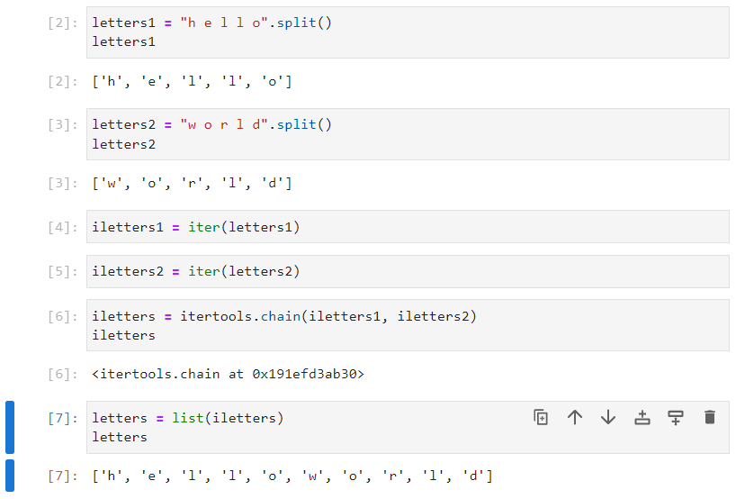

For example the iterator ```forward``` can be split into two independent iterators and unpacking the ```tuple``` using ```tuple``` unpacking:

```
forward = iter(range(10))
forward1, forward2 = itertools.tee(forward, 2)
```

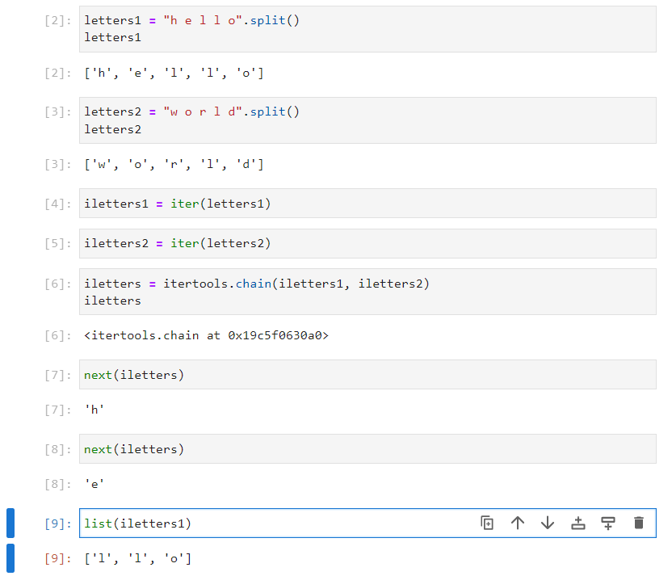

These show up on the Variable Explorer:

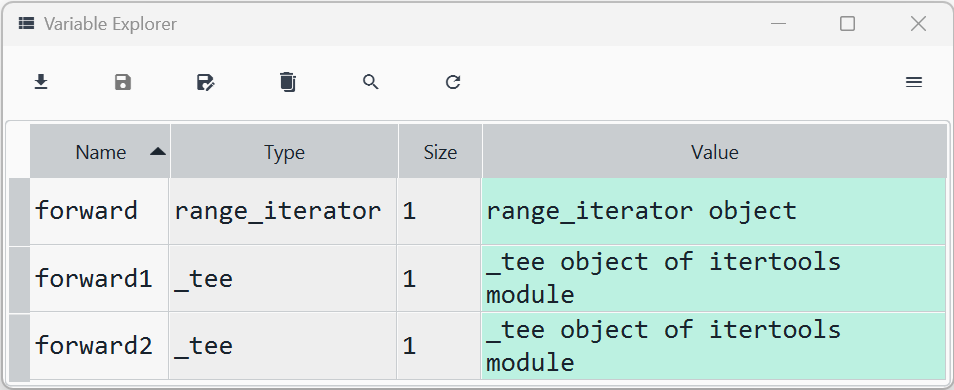

These can be shown to be independent by looking at the following. Although ```forward1``` and ```forward2``` are independent, they are still related to the original object ```forward```. Essentially ```forward``` becomes equivalent to the pipeline that is furthest along (most exhausted):

```
next(forward2)
tuple(forward1)
tuple(forward)
tuple(forward2)
```

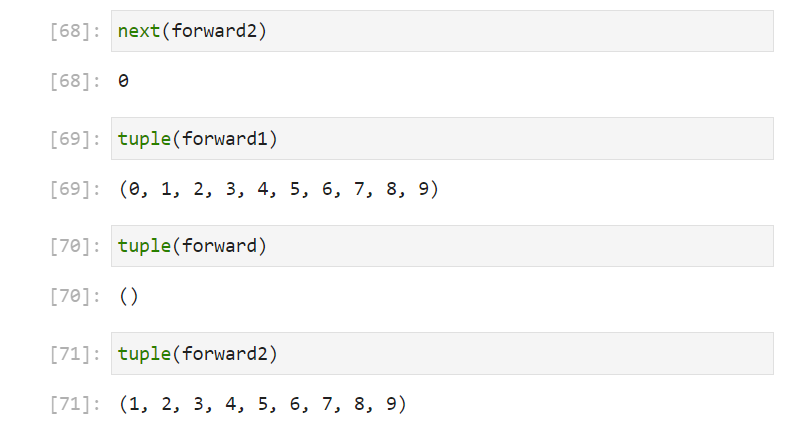

This can be seen in this example:

```
forward = iter(range(10))
forward1, forward2 = itertools.tee(forward, 2)
next(forward2)
next(forward2)
next(forward2)
next(forward1)
tuple(forward)
```

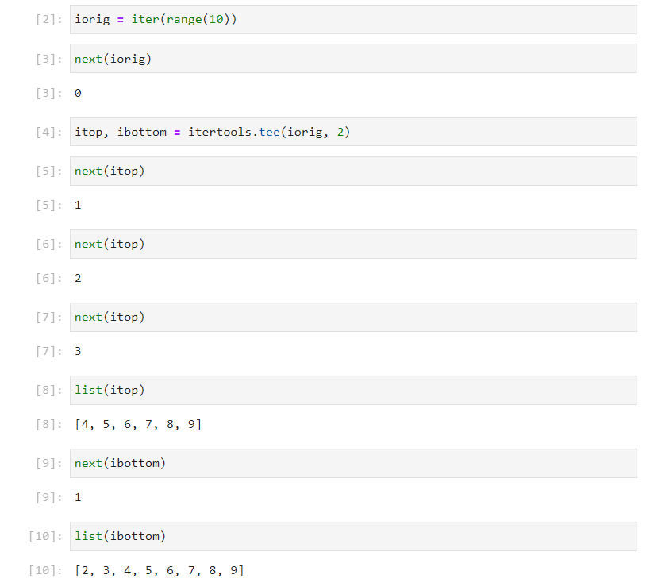

### chain

The ```itertools.chain``` class can be used to chain two or more iterables together. Its initialization signature can be viewed by inputting ```itertools.chain()``` and pressing shift ```⇧``` and tab ```↹```. The input arguments are ```*iterables``` indicating that a variable number of iterables or iterators can be chained. The ```/``` indicates that these must be provided as positional input arguments:

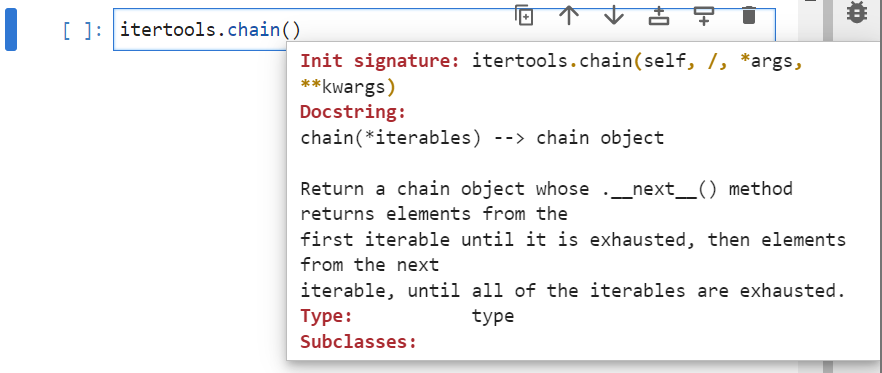

For example:

```
forward1 = iter((1, 2, 3))
forward2 = iter(('a', 'b', 'c'))
forward = itertools.chain(forward1, forward2)
```

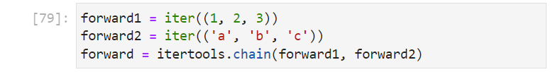

These show up on the Variable Explorer:


The ```chain``` iterator essentially chains the iterators creating one larger iterator. This large iterator is still linked with the original iterators. Using ```next``` on one of the original iterators ```forward1``` or ```forward2``` will exhaust it from the chain ```forward```. Likewise using ```next``` on the chain ```forward``` will exhaust the value from the corresponding original iterator:

```
next(forward)
next(forward2)
next(forward)
next(forward1)
next(forward)
```

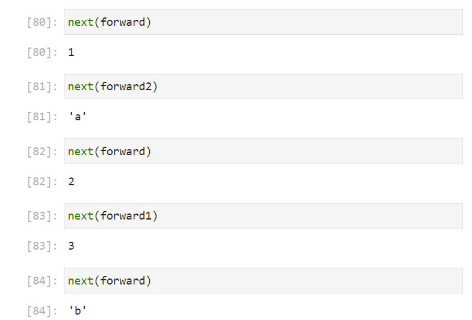

### repeat

The ```itertools.repeat``` class can be used to repeat an object for a specified or unspecified number of times. Its initialization signature can be viewed by inputting ```itertools.repeat()``` and pressing shift ```⇧``` and tab ```↹```. The input arguments is ```object``` and ```times``` is optional. The ```/``` indicates that these must be provided as positional input arguments:

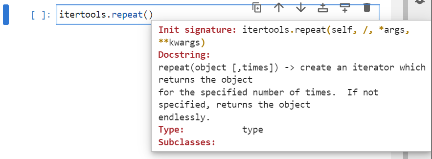

For example:

```
forward = itertools.repeat('hello', 3)
forward
```

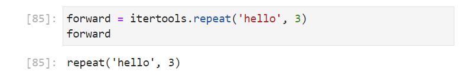

This shows up on the Variable Explorer:

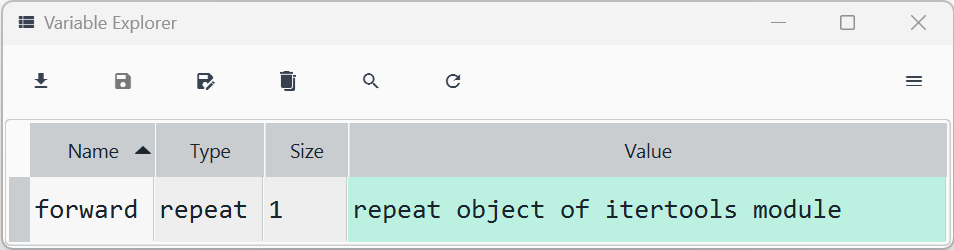

When ```next``` is called on the iterator, the repeated object ```'hello'``` will display:

```
next(forward)
next(forward)
next(forward)
```

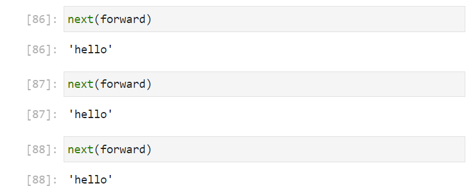

This iterator will be exhausted and show ```StopIteration``` if ```next``` is used again:

```
next(forward)
```

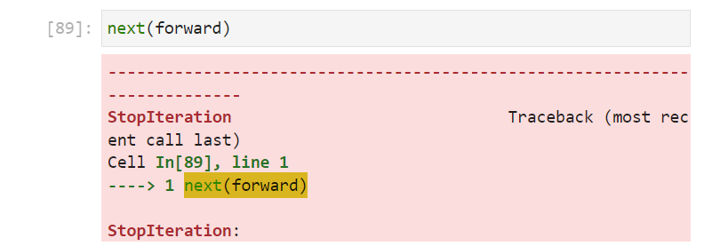

If ```times``` is not specified an iterator of infinite repeat values will be created:

```
forward = itertools.repeat('hello')
forward
```

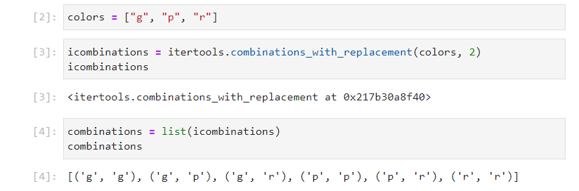

Care should be taken when attempting to cast this to a sequence such as a ```tuple``` or to use it in a ```for``` loop as it will attempt to create a sequence that is infinite in length or an infinite loop respectively.

```
import itertools
tuple(itertools.repeat('hello'))
```

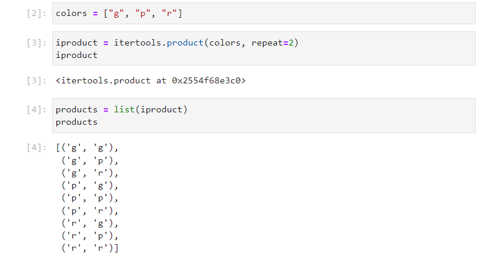

```
import itertools
forward = itertools.repeat('hello')
for word in forward:
    print(word)
    
    
```

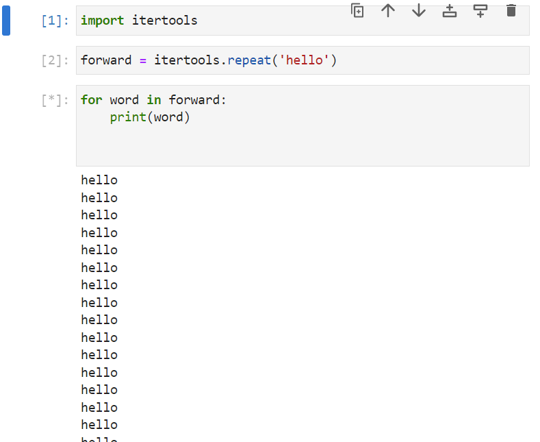

### cycle

The ```itertools.cycle``` class can be used to repeat a cycle of objects indefinitely. A common use case is the cycling of files in a folder in an application with a next button, once the last file has been accessed, instead of the next button being greyed out, it can cycle back to the first file. Its initialization signature can be viewed by inputting ```itertools.cycle()``` and pressing shift ```⇧``` and tab ```↹```. The input arguments is ```iterable```. The ```/``` indicates that these must be provided as positional input arguments:

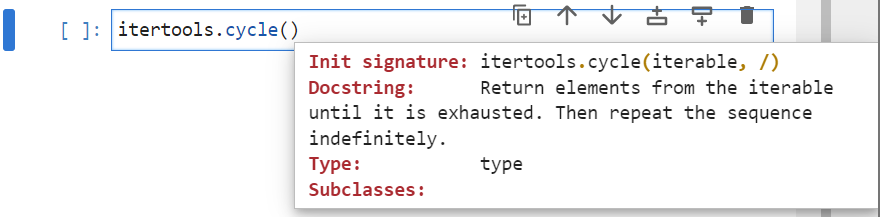

```
colors = ('red', 'green', 'blue')
forward = itertools.cycle(colors)
forward
```

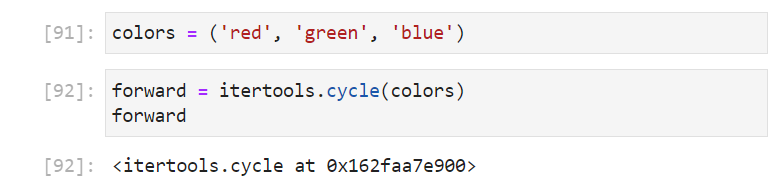

This shows up on the Variable Explorer:

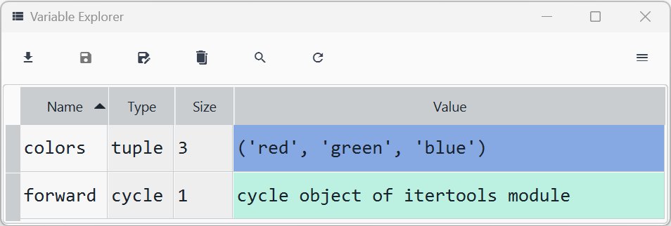

The iterator can indefinitely cycled through:

```
next(forward)
next(forward)
next(forward)
next(forward)
```

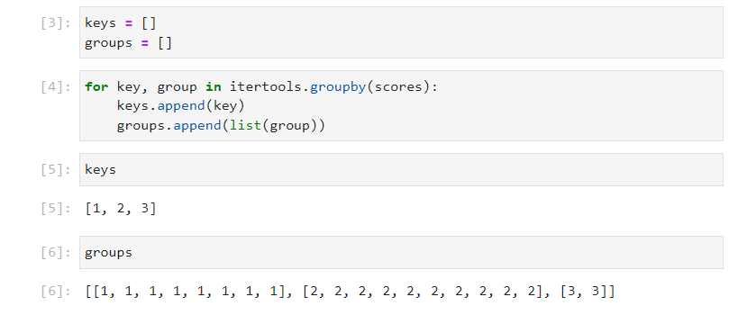

Care should once again be taken when attempting to cast this to a sequence such as a ```tuple``` or to use it in a ```for``` loop as it will attempt to create a sequence that is infinite in length or an infinite loop respectively.

### count

The ```itertools.count``` class can be used to create an iterator that is similar to a range iterator. Its initialization signature can be viewed by inputting ```itertools.count()``` and pressing shift ```⇧``` and tab ```↹```. The input arguments are ```start``` and ```step``` which have the default values ```0``` and ```1```. Notice the emission of ```stop```, indicating that this iterator will count indefinitely:

```
forward = itertools.count()
forward
```

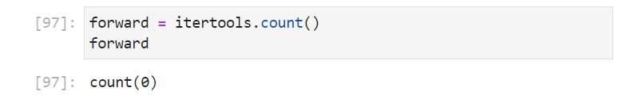

This shows up on the Variable Explorer:

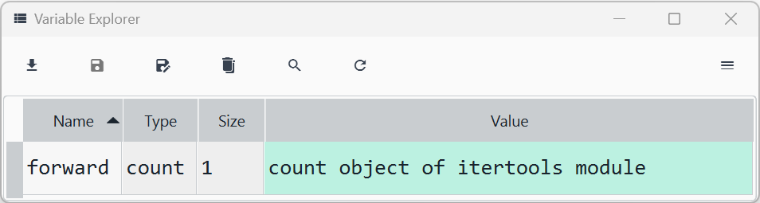

The iterator can be used to count upwards indefinitely:

```
next(forward)
next(forward)
next(forward)
next(forward)
```

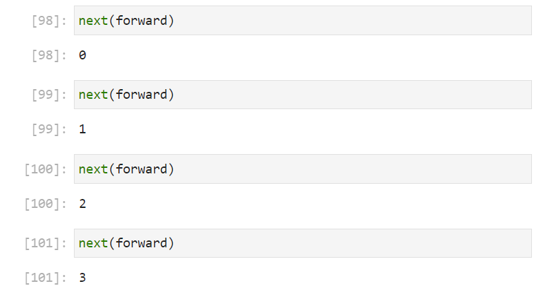

Care should once again be taken when attempting to cast this to a sequence such as a ```tuple``` or to use it in a ```for``` loop as it will attempt to create a sequence that is infinite in length or an infinite loop respectively. The count iterator can be used with an infinite ```while``` loop. A nested ```if``` code block can be configured with a condition and an associated ```else``` code block can be configured to ```break``` out the infinite ```while``` loop. For example:

```
while True:
    num = next(forward)
    if num < 10:
        print(num)
    else:
        break
        
        
```

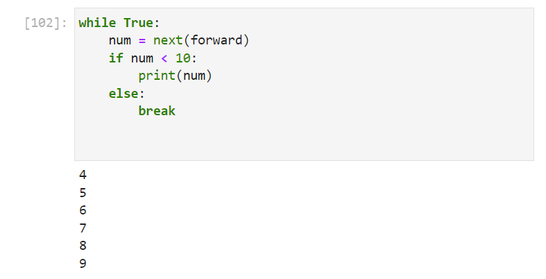

### accumulate

The ```itertools.accumulate``` class can be used to create an iterator that is similar to one created using ```map``` by default mapping the addition binary operator to the iterable returning the accumulation along the sequence. Its initialization signature can be viewed by inputting ```itertools.accumulate()``` and pressing shift ```⇧``` and tab ```↹```. The input arguments are the ```iterable```. There is an optional ```func``` which defaults to the addition operator and  ```initial``` input argument which defaults to ```None```:

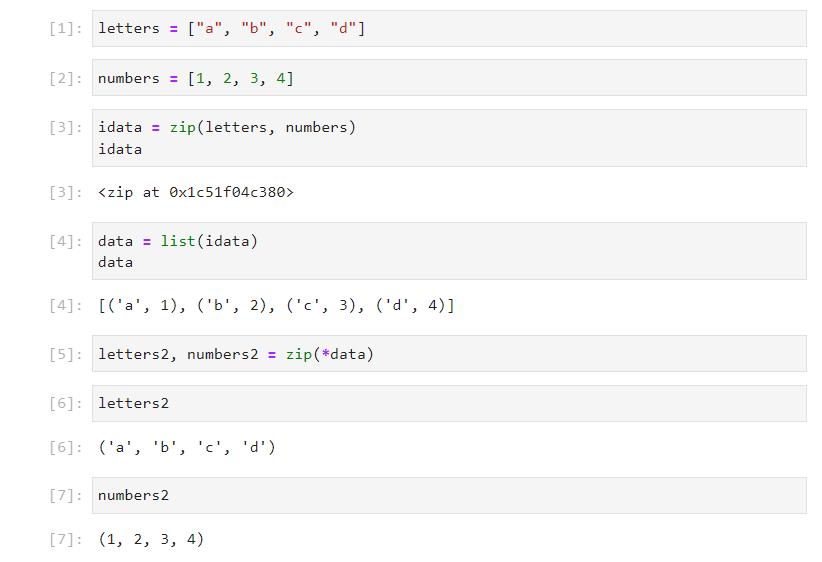

```
nums = (0, 1, 2, 3, 4)
forward = itertools.accumulate(nums)
forward
```

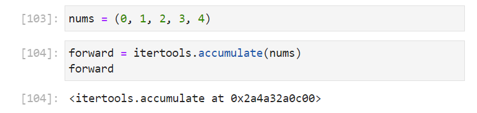

This shows up on the Variable Explorer:

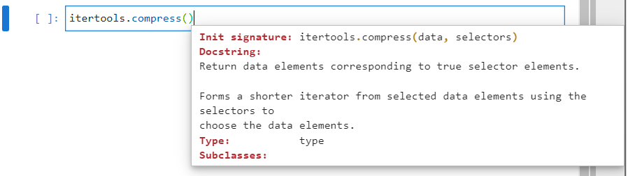

When ```next``` is used, the first value in the sequence ```0``` is returned:

```
next(forward)
```

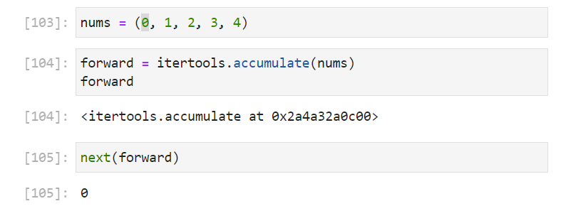

When ```next``` is used, the previous accumulation ```0``` is added with the second value in the iterator ```1```. Both of these are supplied to the binary operator ```add```:

```
next(forward)
```

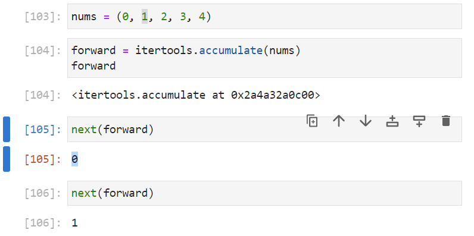

When ```next``` is used, the previous accumulation ```1``` is added with the third value in the iterator ```2```. Both of these are supplied to the binary operator ```add```:

```
next(forward)
```

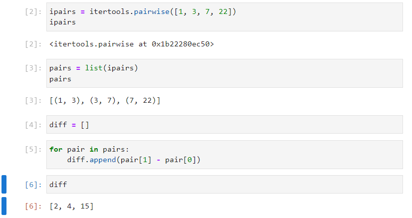

This continues until all the values in the sequence are exhausted. If the iterator is cast into a ```tuple```, it has the same length as the original sequence:

```
tuple(itertools.accumulate(nums))
```

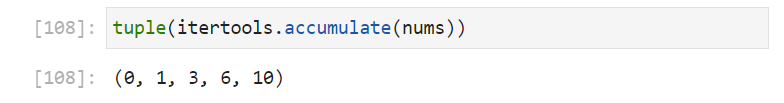

If an ```initial``` value is specified, this increases the length by 1:

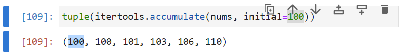

The ```operator``` module contains the binary functions which can be assigned to the ```func``` input argument of the ```itertools.accumulate``` class. It can be imported using:

```
import operator
```

Its identifiers can be viewed by inputting ```operator.``` followed by a tab ```↹```:

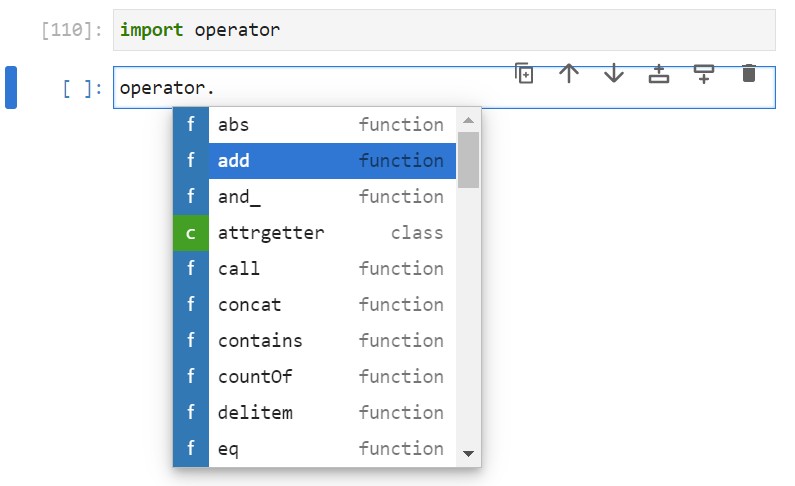

A multiplication accumulation can for example be computed using:

```
nums = (1, 2, 3, 4, 5)
tuple(itertools.accumulate(nums, func=operator.mul))
```

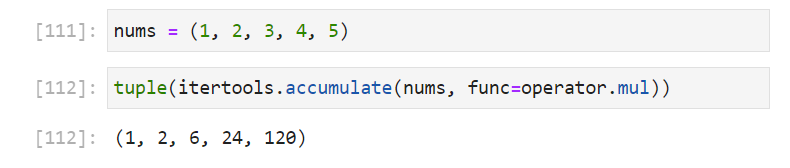

Note that ```nums``` is updated to remove the ```0```, otherwise all the values will be multiplied by ```0``` giving ```0``` for each value in the multiplication accumulation respectively.

### starmap

If the function ```powered``` is assigned using a ```lambda``` expression:

```
powered = lambda num, power: num ** power
```

There are two input arguments and one return value. A ```tuple``` of the same length ```2```:

```
args = (2, 3)
```

Can be unpacked to the ```2``` input arguments in the function call:

```
powered(*args)
```

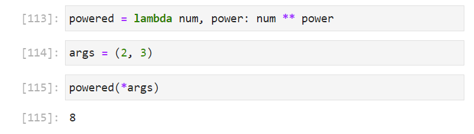

The ```itertools.starmap``` class can be used to create an iterator that is similar to one created using ```map```. Instead of mapping a function to a sequence where each value in the sequence is supplied as a single input argument for the function call. The function is mapped to a sequence of equally lengthed tuples and ```tuple``` unpacking is used for each ```tuple``` supplying multiple input arguments for each function call. The initialization signature can be seen by inputting ```itertools.starmap()``` and pressing shift ```⇧``` and tab ```↹```. The input arguments are the ```function``` and ```iterable``` (of ```tuples```). These are followed by a ```/``` indicating they must be supplied positionally only:

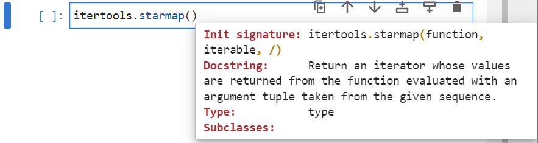

For example ```args``` can be created using:

```
args = tuple(zip(range(10), itertools.repeat(2)))
```

And can be viewed on the Variable Explorer:

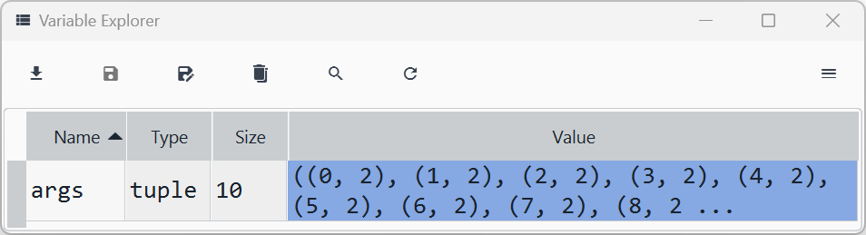

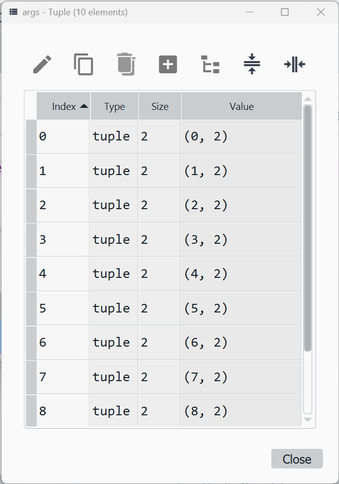

For simplicity, the second value in each ```tuple``` is a constant ```2```. A ```starmap``` iterator can now be created:

```
forward = itertools.starmap(powered, args)
forward
```

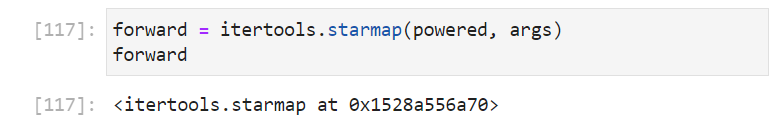

This displays in the Variable Explorer:

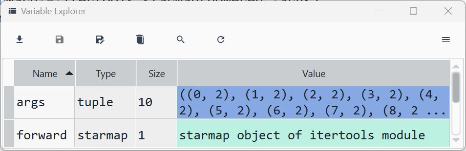

Using ```next``` will extract the ```tuple``` providing the input arguments for the function call:

```
next(forward)
next(forward)
next(forward)
```

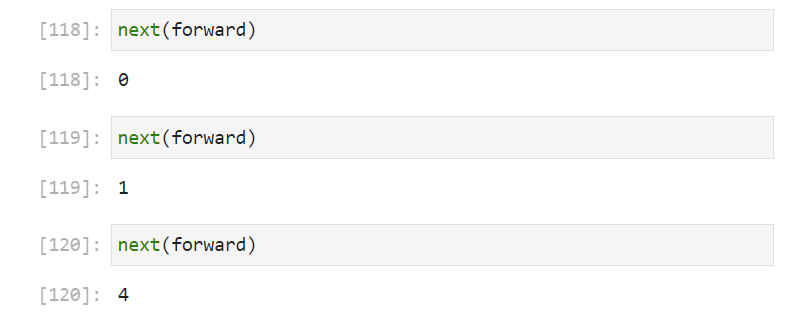

This iterator can be cast into a ```tuple``` to in this case compute the following squared values:

```
tuple(itertools.starmap(powered, args))
```

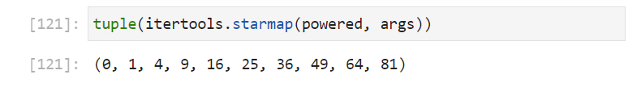

### zip_longest

The ```itertools.zip_longest``` class can be used to zip two or more collections together. Unlike ```zip``` which stops zipping once the shortest sequence has been exhausted, ```itertools.zip_longest``` will continue zipping until the longest sequence is exhaused. ```None``` values will be supplied when the shorter sequence is exhausted. Its initialization signature can be viewed by inputting ```itertools.zip_longest()``` and pressing shift ```⇧``` and tab ```↹```:

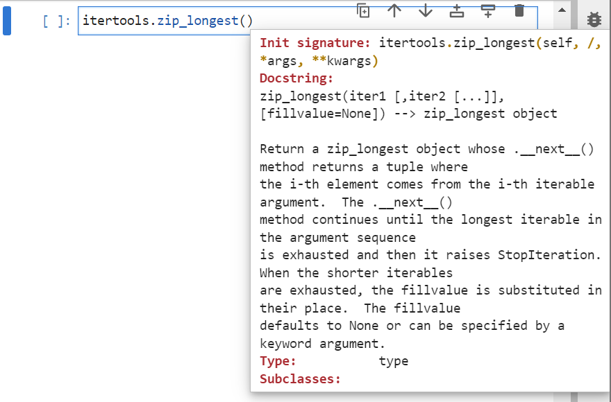

The example used with the ```zip``` class can be reused:

```
names = ('red', 'green', 'blue', 'yellow')
keys = ('r', 'g', 'b')
values = ('#FF0000', '#00FF00', '#0000FF')
forward = itertools.zip_longest(names, keys, values)
```

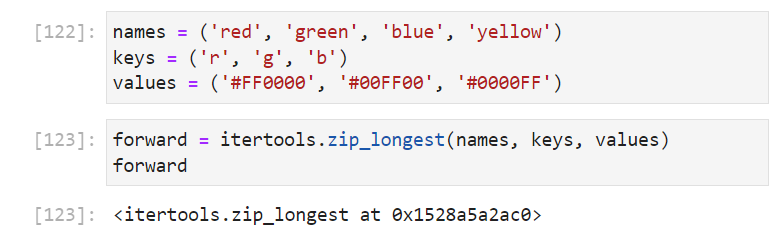

This displays in the Variable Explorer:

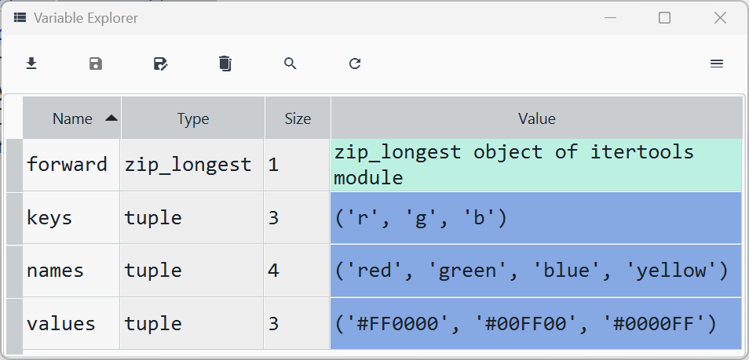

Using ```next``` will display the ```tuple``` of zipped items. The iterator will be consumed when at the last item of the longest sequence

```
next(forward)
next(forward)
next(forward)
next(forward)
```

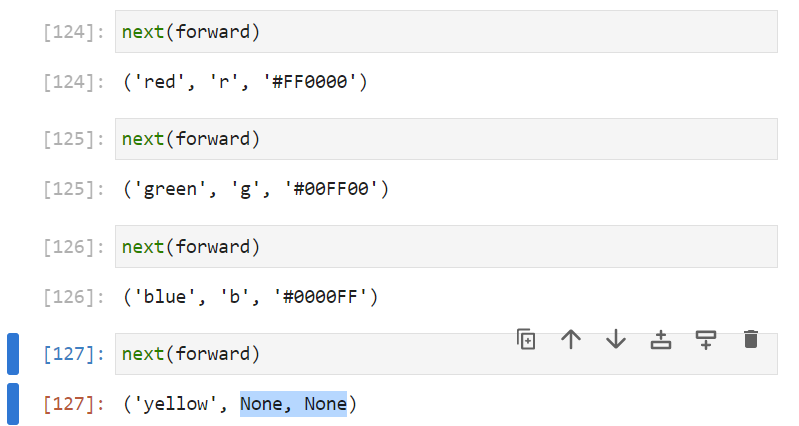

### pairwise

The ```itertools.pairwise``` class can be used to create ```tuple``` pairs from neighbouring values in a sequence. Its initialization signature can be viewed by inputting ```itertools.pairwise()``` and pressing shift ```⇧``` and tab ```↹```. It has a single input argument ```iterable``` which is follwoed by a ```/``` indicarting it is to be supplied positionally only:

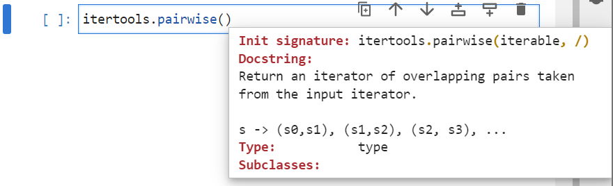

For example:

```
letters = ('a', 'b', 'c', 'd')

forward = itertools.pairwise(letters)
forward
```

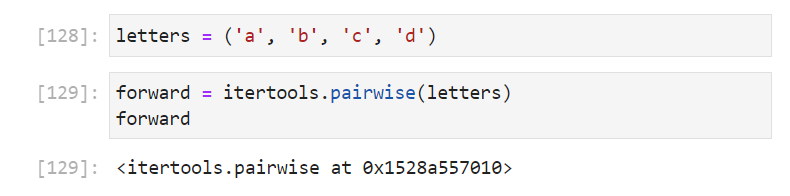

This displays on the Variable Explorer:

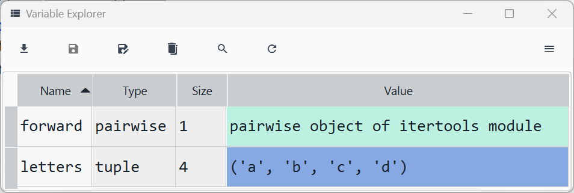

Using ```next``` will display the ```tuple``` of paired items.

```
next(forward)
```

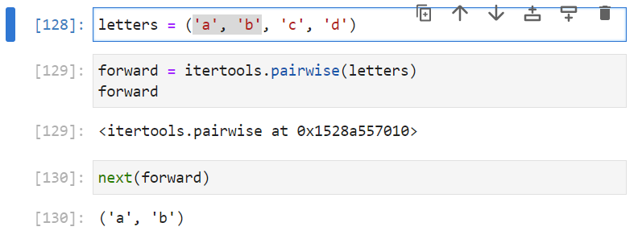

```
next(forward)
```

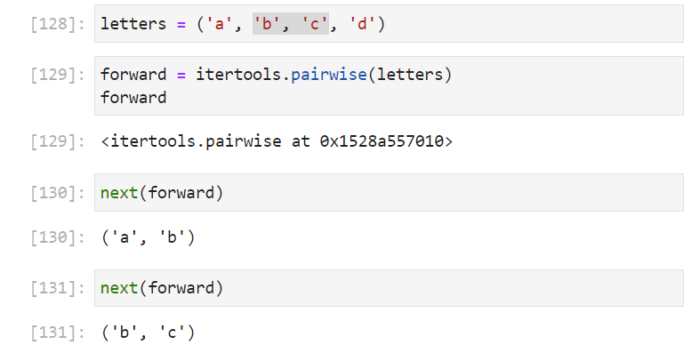

Casting to a ```tuple``` will display all the pairs, the ```tuple``` will have the length one less that the original sequence:

```
tuple(itertools.pairwise(letters))
```

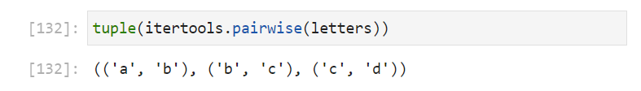

### filterfalse

The ```itertools.filterfalse``` class acts inversely to the ```filter```. Its initialization signature can be viewed by inputting ```itertools.filterfalse()``` and pressing shift ```⇧``` and tab ```↹```:

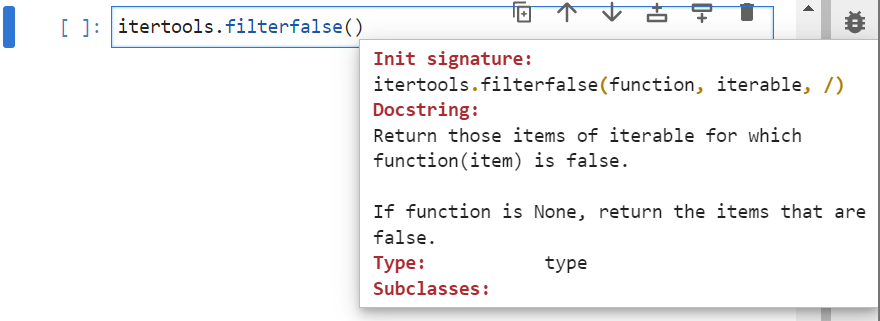

For example if the same ```lambda``` expression is used as before:

```
positive_filter = lambda num: num > 0
```

Can be mapped to the following sequence:

```
nums = (-2, -1, 0, 1, 2)
```

Using:

```
forward = itertools.filterfalse(positive_filter, nums)
```

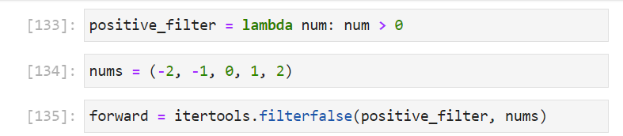

This ```filter``` instance is an iterator that once again displays on the Variable Explorer with a length of ```1``` as it displays ```1``` value at a time, which in this case is a value in the sequence that has a ```positive_filter``` function call of ```False```:

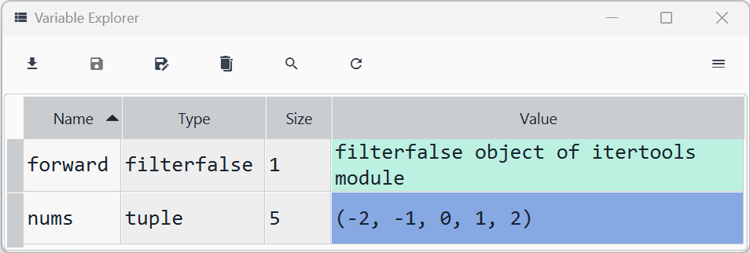

When ```next``` is called, the value is the next value in the sequence ```nums``` where the ```positive_filter``` function returns ```False```: 

```
next(forward)
```

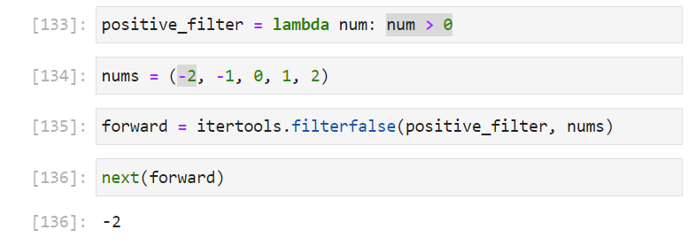

```
next(forward)
```

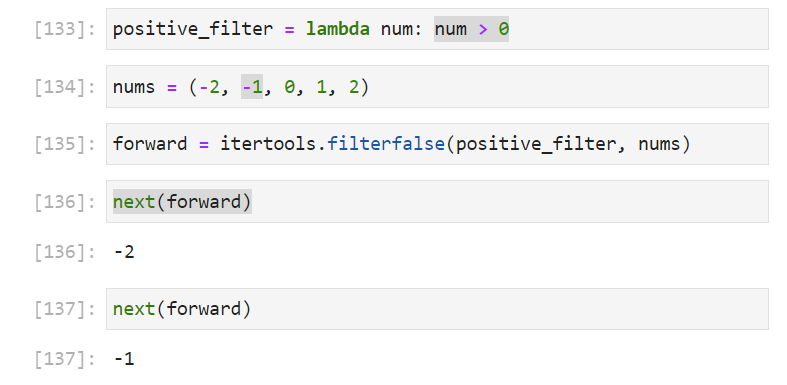

All the filtered values given by the iterator can be consumed by casting to a ```tuple```:

```
tuple(itertools.filterfalse(positive_filter, nums))
tuple(filter(positive_filter, nums))
```

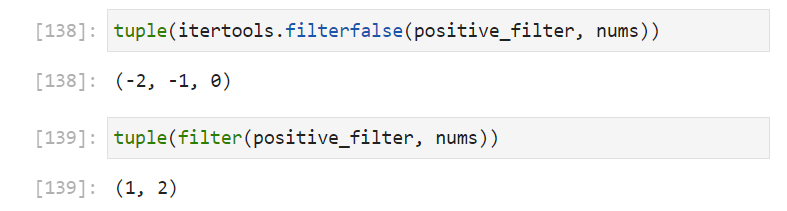

### dropwhile

The ```itertools.dropwhile``` class will drop each item in an iterable until a predicate is taken to be ```False```. i.e. the first ```False``` acts as a trigger point. Its initialization signature can be viewed by inputting ```itertools.dropwhile()``` and pressing shift ```⇧``` and tab ```↹```. It has the input arguments ```predicate``` and ```iterable```. These are followed by a ```/``` which indicates the input arguments are to be provided positionally only:

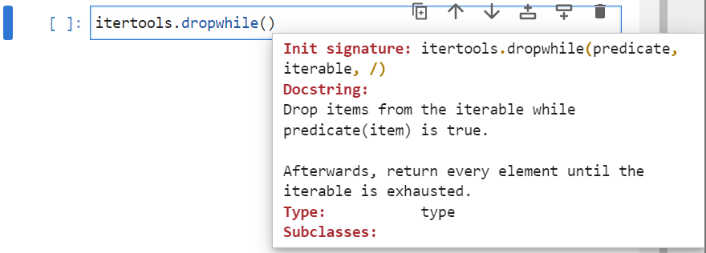

For example the following ```tuple``` of letters can be the ```iterable``` and the predicate can be a lambda expression that is ```False``` unless the letter is ```'d'```:

```
letters = ('a', 'b', 'c', 'd', 'e', 'f', 'g', 'h')
forward = itertools.dropwhile(lambda x: x != 'd', letters)
forward
```

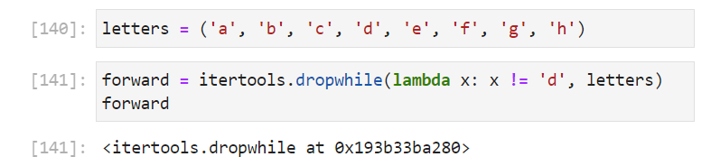

This displays on the Variable Explorer:


When ```next``` is called, the value at the first occurance of a ```False``` condition is returned: 

```
next(forward)
```

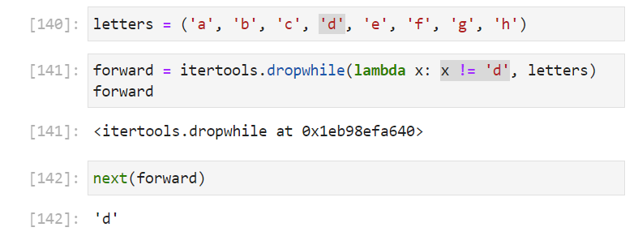

All subsequent values in the sequence are called with successive ```next``` calls:

```
next(forward)
```

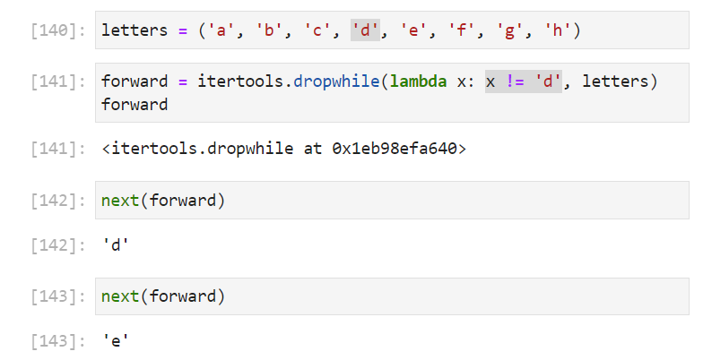

This can be seen more clearly by casting to a ```tuple```:

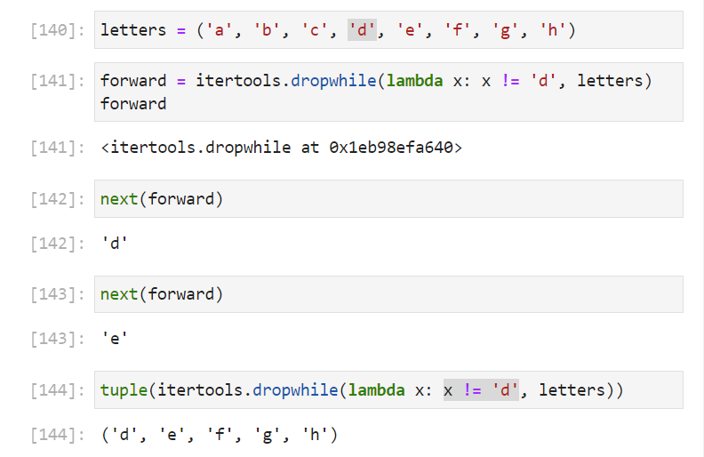

### takewhile

The ```itertools.takewhile``` class is the inverse of the ```itertools.dropwhile``` class. It will take each item in an iterable until a predicate is taken to be ```False```. i.e. the first ```False``` acts as a trigger point and all values dropping this value and all subsequent items. Its initialization signature can be viewed by inputting ```itertools.takewhile()``` and pressing shift ```⇧``` and tab ```↹```. It has the input arguments ```predicate``` and ```iterable```. These are followed by a ```/``` which indicates the input arguments are to be provided positionally only:

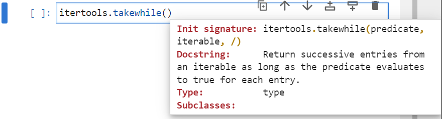

The same example can be viewed as before:

```
letters = ('a', 'b', 'c', 'd', 'e', 'f', 'g', 'h')
forward = itertools.takewhile(lambda x: x != 'd', letters)
forward
```

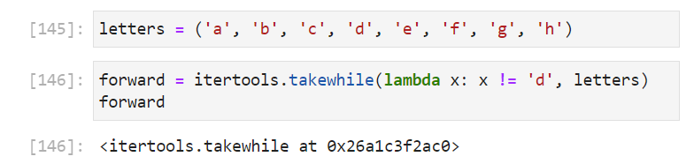

This displays in the Variable Explorer:

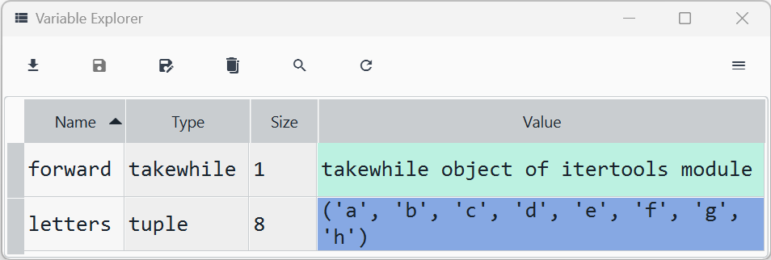

When ```next``` is called, the next value in the sequence is returned unless the condition is ```False```, at this point the iterator is exhausted: 

```
next(forward)
next(forward)
next(forward)
next(forward)
```

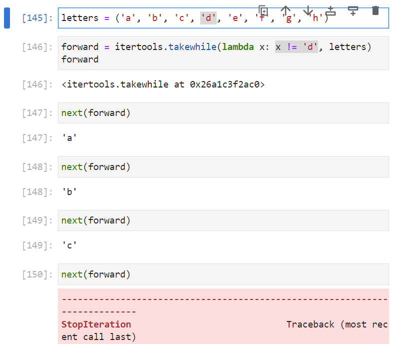

The two classes are complementary to each toher and this can be seen when casting to a ```tuple```:

```
letters = ('a', 'b', 'c', 'd', 'e', 'f', 'g', 'h')
tuple(itertools.takewhile(lambda x: x != 'd', letters))
tuple(itertools.dropwhile(lambda x: x != 'd', letters))
```

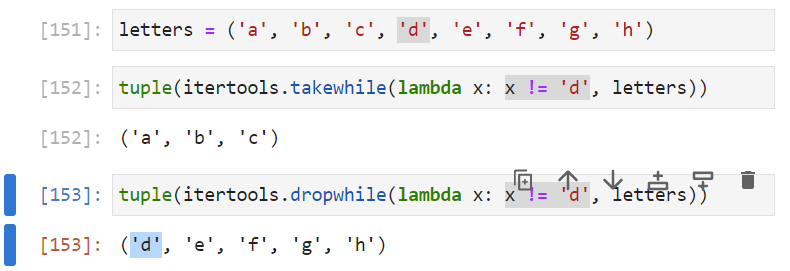

### compress

The ```itertools.compress``` class can be used to compress data using a selector. Its initialization signature can be viewed by inputting ```itertools.compress()``` and pressing shift ```⇧``` and tab ```↹```. It has the input arguments ```data``` and ```selectors```:

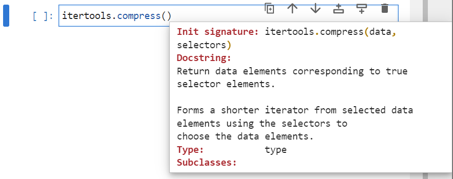

For example, the data can be the ```tuple``` instance ```letters``` and the selector can be the ```tuple``` instance ```conditions```. Both of these have the same length:

```
letters = ('a', 'b', 'c', 'd', 'e', 'f')
conditions = (True, True, False, False, True, True)
```

The compressed iterator is therefore:

```
forward = itertools.compress(letters, conditions)
forward
```

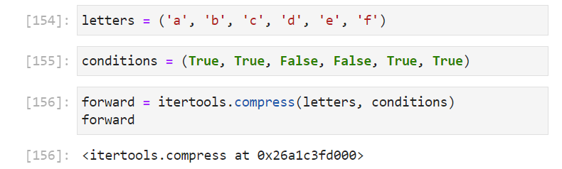

This displays in the variable explorer:

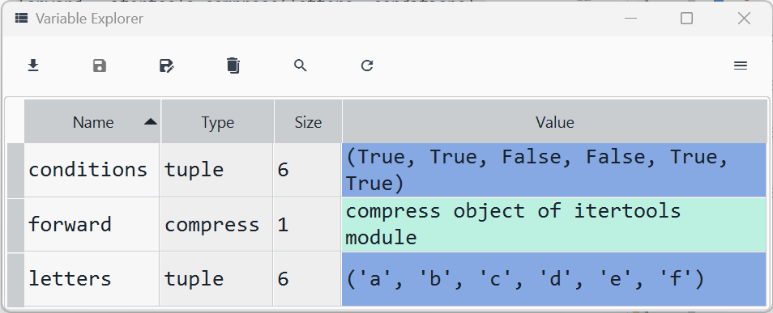

When ```next``` is called, the next value in the sequence is returned where the selector is ```True```: 

```
next(forward)
```

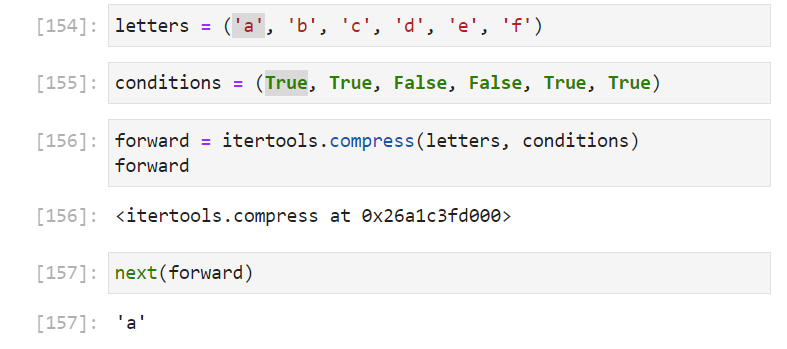

```
next(forward)
```

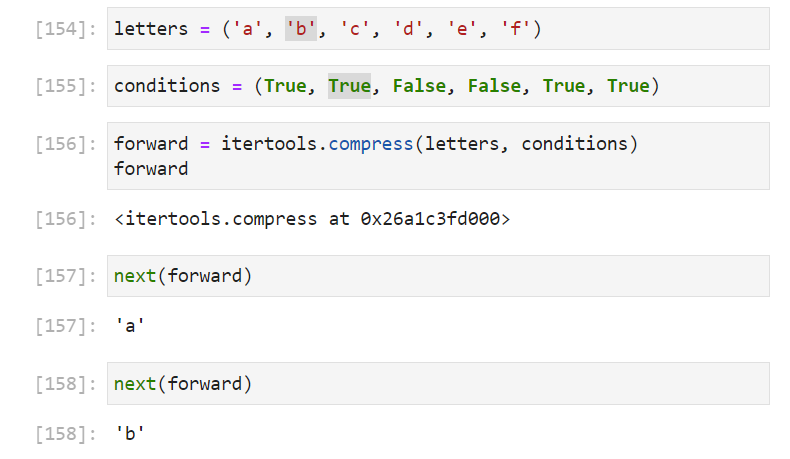

```
next(forward)
```

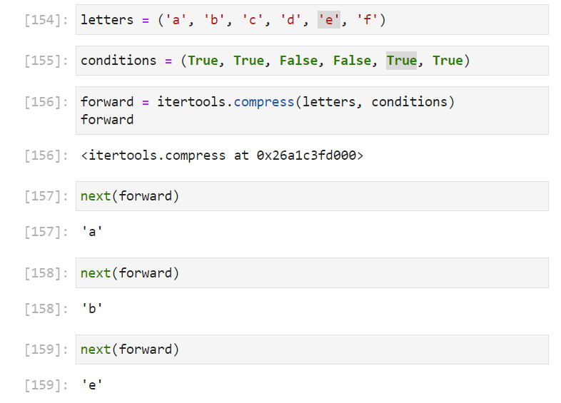

This can be seen more clearly when casting to a ```tuple```:

```
tuple(itertools.compress(letters, conditions))
```

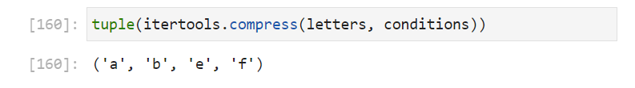

### combinations

The ```itertools.combinations``` class can be used to display the unique combinations available from items in an iterable using a r-length. This is best visualised pictorially. For example if the iterable has three color circles and a r-length of 2. The combinations would look like:


Its initialization signature can be viewed by inputting ```itertools.combinations()``` and pressing shift ```⇧``` and tab ```↹```. It has the input arguments ```iterable``` and ```r```:

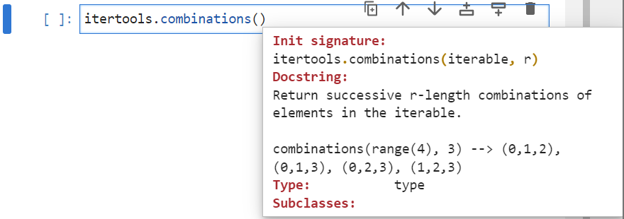

The example above can be created using:

```
colors = ('c', 'y', 'm')
forward = itertools.combinations(colors, 2)
forward
tuple(forward)
```

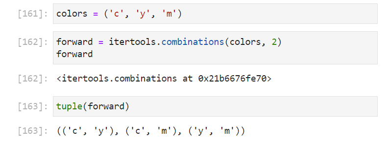

### combinations_with_replacement

The ```itertools.combinations_with_replacement``` class can be used to display the unique combinations available from items in an iterable using a r-length when the items in the iterable can be duplciated. This is best visualised pictorially. For example if the iterable has three color circles and a r-length of 2. The combinations with replacement would look like:

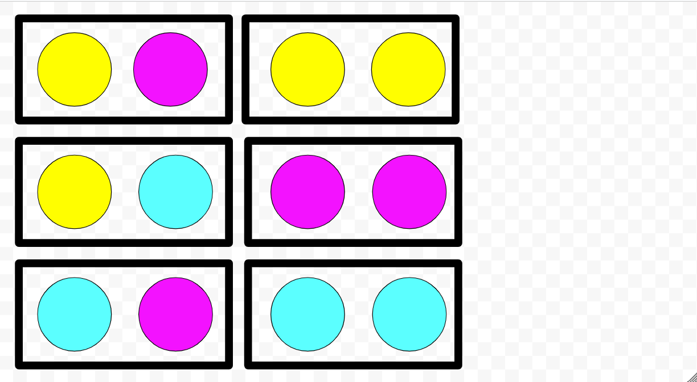

Its initialization signature can be viewed by inputting ```itertools.itertools.combinations_with_replacement()``` and pressing shift ```⇧``` and tab ```↹```. It has the input arguments ```iterable``` and ```r```:

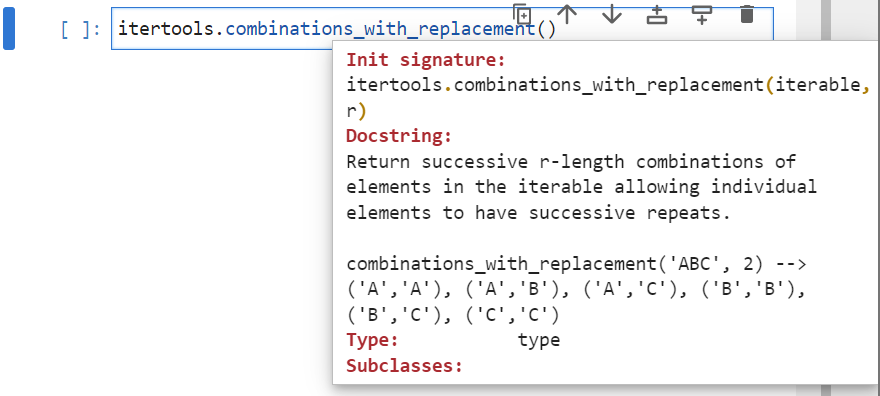

The example above can be created using:

```
colors = ('c', 'y', 'm')
forward = itertools.combinations_with_replacement(colors, 2)
forward
tuple(forward)
```

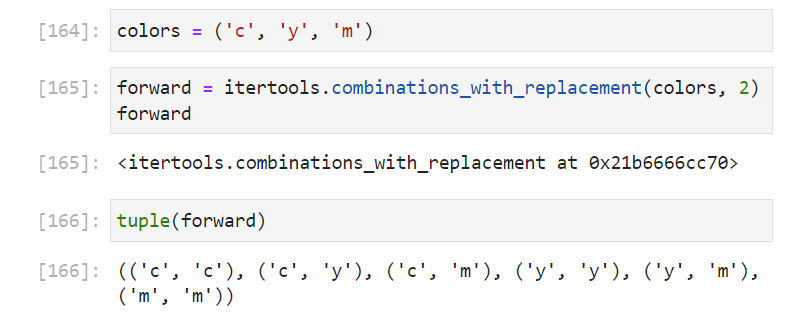

### permutations

The ```itertools.permutations``` class can be used to display the unique permutations available from items in an iterable using a r-length. In a combination, the order of the values in the ```tuple``` representing the combination doesn't matter. In a permutation this order matters. This is best visualised pictorially. For example if the iterable has three color circles and a r-length of 2. The combinations would look like:

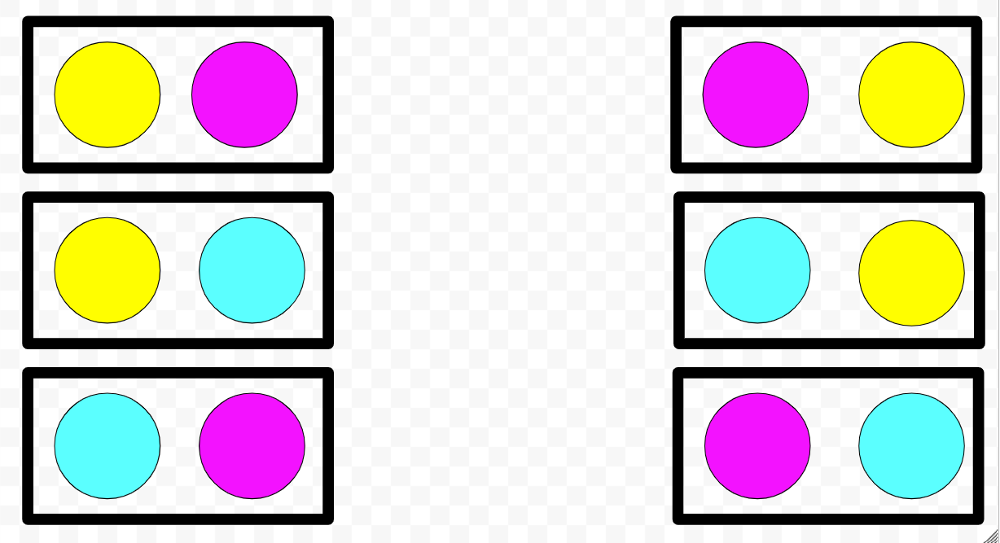

Its initialization signature can be viewed by inputting ```itertools.permutations()``` and pressing shift ```⇧``` and tab ```↹```. It has the input arguments ```iterable``` and ```r```:

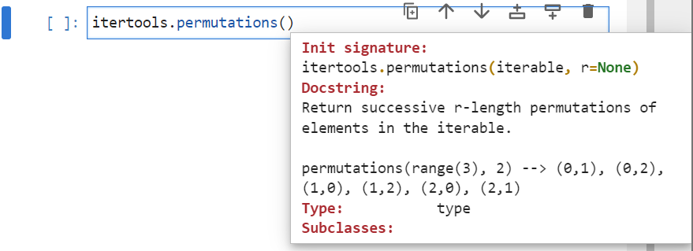

The example above can be created using:

```
colors = ('c', 'y', 'm')
forward = itertools.permutations(colors, 2)
forward
tuple(forward)
```

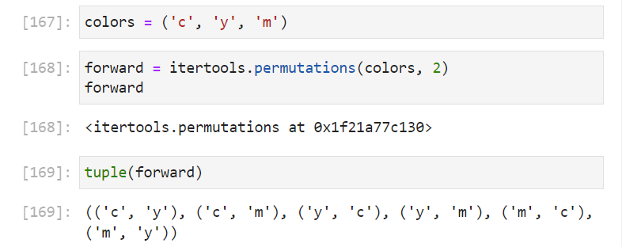

### product

The ```itertools.product``` class can be used to display the unique permutations with replacement available from items in an iterable using a r-length. This is best visualised pictorially. For example if the iterable has three color circles and a r-length of 2. The product would look like:

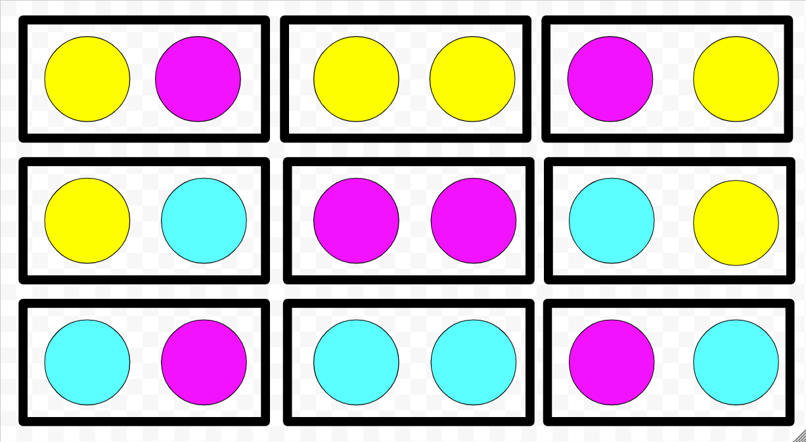

Its initialization signature can be viewed by inputting ```itertools.product()``` and pressing shift ```⇧``` and tab ```↹```. It uses different input arguments to the init signatures of the similar classes. It has a variable number of input argument ```*iterables``` and the ```repeat``` keyword input argument:

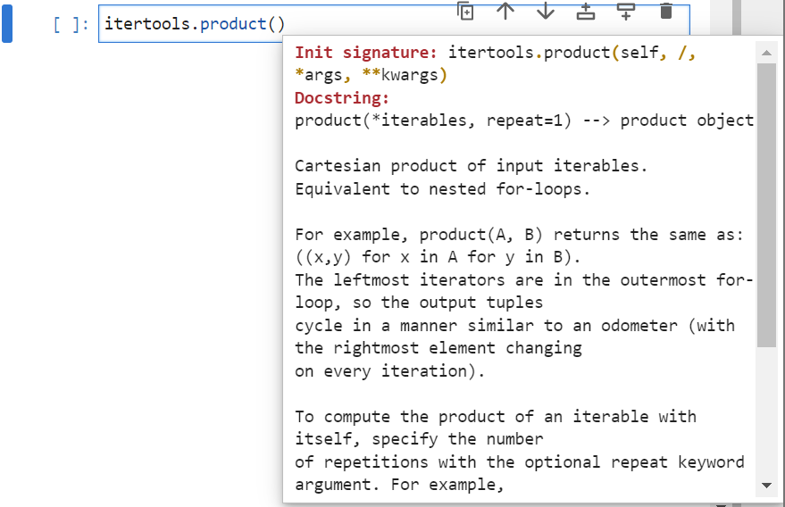

When a single iterable is supplied and ```repeat``` is assigned to the previously used r-length, this calculates the permutations with replacement:

```
colors = ('c', 'y', 'm')
forward = itertools.product(colors, repeat=2)
forward
tuple(forward)
```

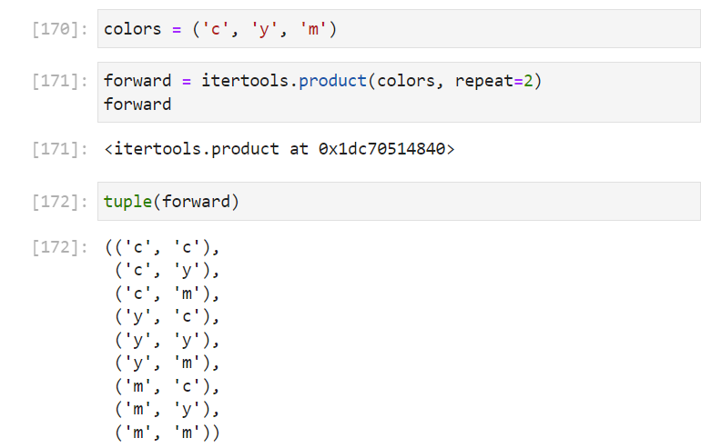

If multiple iterables of equal length are supplied, the product creates an iterator. When ```next``` is called a ```tuple``` is returned which takes a value from each of the sequences:

```
letters = ('a', 'b', 'c')
nums = (1, 2, 3)

forward = itertools.product(letters, nums)
forward

tuple(forward)
```

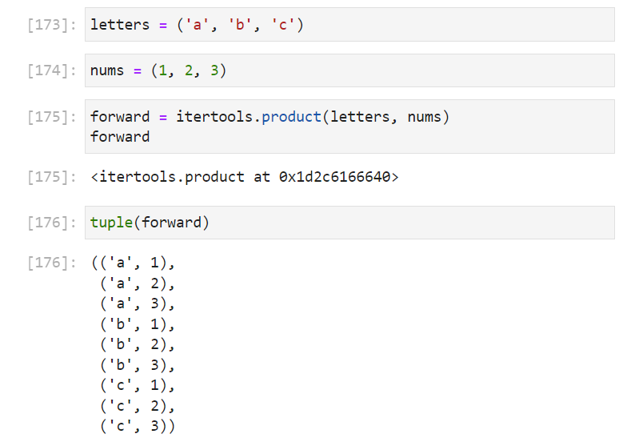

If multiple iterables of equal length are supplied, and ```repeat``` is assigned to 2, the the ```tuple``` returned has two values from each sequence. For example:

```
forward = itertools.product(letters, nums, repeat=2)
forward

tuple(forward)
```

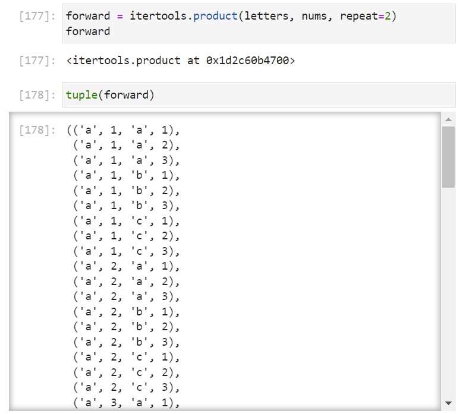

### groupby

The ```itertools.groupby``` class can be used to group repeating elements in an iterable together using an optional key. Its initialization signature can be viewed by inputting ```itertools.groupby()``` and pressing shift ```⇧``` and tab ```↹```. It has the positional input argument ```iterable``` and optional keyword input argument ```key```:

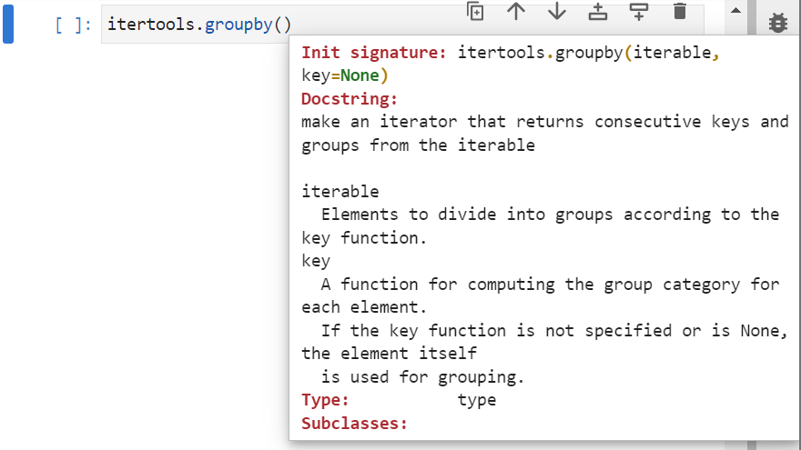

In the simplest case, there is no key and therefore each unique value in the iterable is automatically taken to be a key. Each group is a collection of identical values that correspond to this key. The following ```tuple``` can be examined:

```
values = ('a', 'b', 'c', 'a', 'a', 'a', 'b', 'b', 'c', 'a')
```

In order to be grouped, the iterable must be sorted:

```
sorted(values)
```

And the variable name ```values``` can be reassigned:

```
values = tuple(sorted(values))
values
```

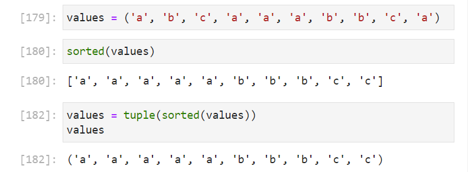

An iterator of three groups can be created using:

```
forward = itertools.groupby(values)
forward
```

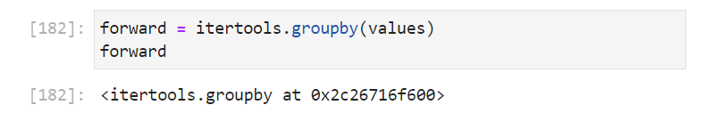

This displays on the Variable Explorer:

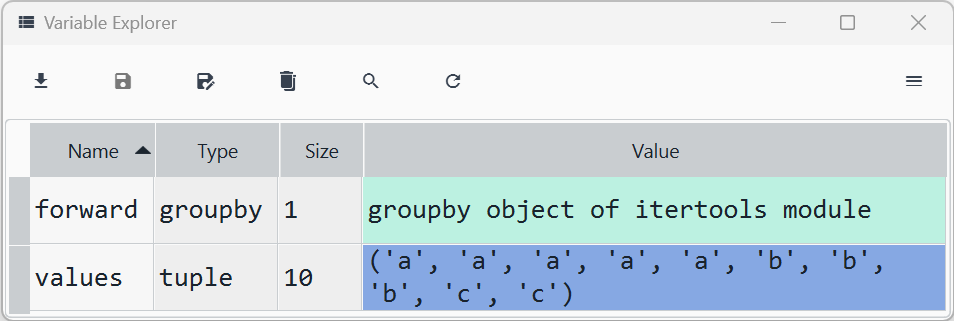

When ```next``` is used on the iterator, a ```tuple``` is displayed containing the ```key``` in the first position and an iterator of these grouped values in the second position:

```
next(forward)
next(forward)
next(forward)
```

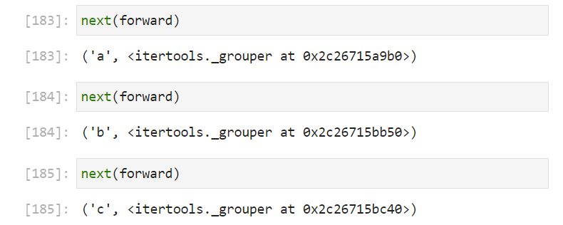

Recreating the iterator, each tuple can be unpacked and the key and group can be examined. To view all the elements in the group iterator, it can be cast into a tuple:

```
forward = itertools.groupby(values)
forward

key, group = next(forward)
key
tuple(group)

key, group = next(forward)
key
tuple(group)

key, group = next(forward)
key
tuple(group)
```

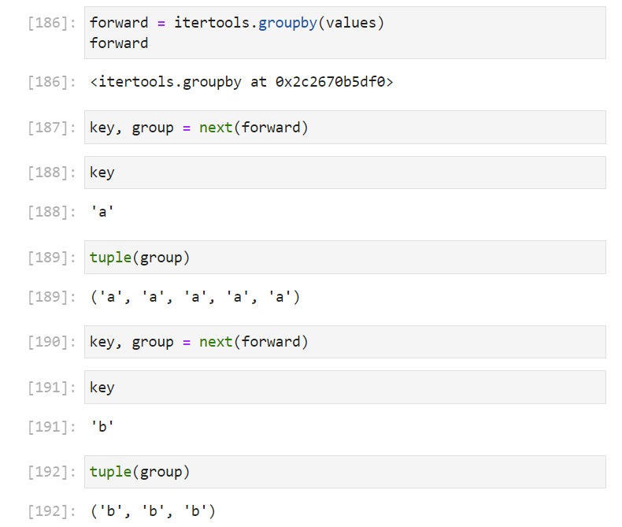

The return value of the ```itertools.groupby``` class is an iterator of nested 2 elements tuples which can be conceptualised as an item containing a key and iterator. A dictionary ```mapping``` can be populated using a ```for``` loop:

```
forward = itertools.groupby(values)

mapping = {}

for item in forward:
    key = item[0]
    group = item[1]
    mapping[key] = tuple(group)


mapping
```

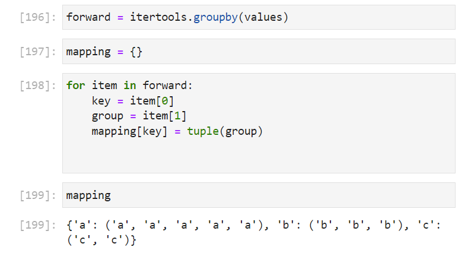

Now supposing the following ```tuple``` of values was created:

```
values = ('a', 'b', 'c', 'A', 'A', 'a', 'B', 'b', 'C', 'a')
```

Sorting it gives all the lower case letters first followed by all the upper case letters as the ordinal values of the lower case letters is smaller than that of the upper case letters:

```
sorted(values)
```

And the variable name ```values``` can be reassigned:

```
values = tuple(sorted(values))
```

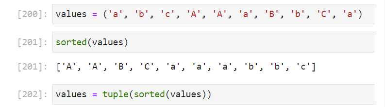

Now ```itertools.groupby``` can be used with a ```key```. This key can be assigned to a lamba expression which uses the ```str``` method ```islower``` to check to see if a value is a upper case ```str``` i.e. the ```lambda``` expression returns ```False``` or is a lower case ```str``` i.e. the ```lambda``` expression returns ```True```.

```
forward = itertools.groupby(values, 
                            key=lambda x: x.islower())
forward
```

This can be seen by calling ```next``` on the groupby iterator:

```
next(forward)
next(forward)
```

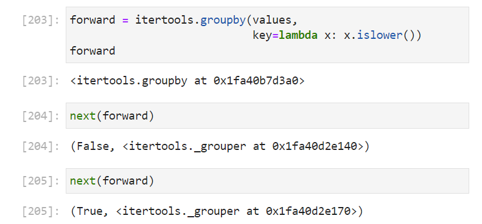

Recreating the iterator, a similar dictionary can be configured to before:

```
forward = itertools.groupby(values, 
                            key=lambda x: x.islower())

mapping = {}

for item in forward:
    if item[0] == False:
        key = 'upper'
    else:
        key = 'lower'
    group = item[1]
    mapping[key] = tuple(group)
    
    
mapping
```

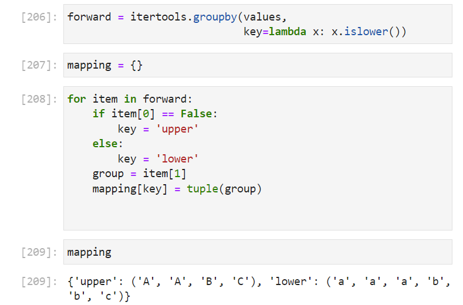

[Home Python Tutorials](https://github.com/PhilipYip1988/python-tutorials/blob/main/readme.md)
