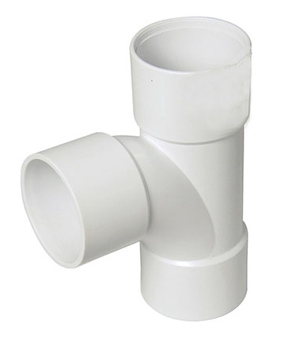

# itertools

## Recap Iterators

A range object can be created using:

```
range(10)
```

This can be cast into a ```list``` using the list class to view all of the values in the range object:

```
list(range(10))
```

The range object can also be cast into an iterator using the ```iter``` class:

```
iter(range(10))
```


Assigning this iterator to a variable:

```
inumber = iter(range(10))
```


Unlike a list, the values in an iterator are not displayed by default. The reason for this is to optimise for memory management. An iterator has a current state, the value of the first state can be seen using the ```next``` function on the iterator. Repeated use of the ```next``` function steps through the iterator displaying each value in the iterator one by one:

```
next(inumber)
next(inumber)
next(inumber)
```


Any previous value accessed is dismissed and it is not possible to move backwards. Casting to a list, will exhaust all remaining values in the iterator:

```
for num in inumber:
    print(num)
```


## itertools module

Additional iterator classes are available in the ```iterators``` module. This can be imported using:

```
import itertools
```

The modules docstring can be accessed by inputting:

```
? itertools
```


The list of identifiers can be seen by inputting ```itertools.``` followed by a tab ```↹```:


## zip and zip_longest

Some of these classes complement standard builtin classes. Recall when a Python script file is opened. The following line of code can be conceptualised in the background:

```
from builtins import *
```

The ```builtins``` module can however implicitly be imported and viewed alongside the ```iterators``` module:

```
import builtins
```

The list of identifiers can be seen by inputting ```builtins.``` followed by a tab ```↹```:


The docstring of the ```zip``` class can be examined:


As every object from ```builtins``` is automatically loaded into the main namespace, this function is typically accessed directly using:


The ```zip``` class from ```builtins``` has a complementary ```zip_longest``` class from ```itertools```. The docstring of the ```zip_longest``` function can be examined


These functions zip two iterables together like a zip, creating a tuple for each pair.


Both sides of a zip are normally the same size and in such a case both classes behave identically. In the case where one side is longer than the other, the inbuilt class ```zip``` stops at the shortest iterable, discarding any values out of range of the smallest zip. The ```iterators``` class ```zip_longest``` will however continue zipping, zipping all remaining values with ```None```. This can be best seen with an example:

```
import builtins
import itertools
nums = [0, 1, 2, 3]
nums
letters = ["a", "b", "c", "d", "e", "f"]
letters
zip(nums, letters)
itertools.zip_longest(nums, letters)
```


The zipped objects will be assigned to variables and then cast to a list so their elements can be readily inspected:

```
izip_short = zip(nums, letters)
izip_long = itertools.zip_longest(nums, letters)
zip_short = list(izip_short)
zip_short
zip_long = list(izip_long)
zip_long
```


```zip``` is commonly used to cast two lists into a dictionary:

```
letters = ["a", "b", "c", "d"]
numbers = [1, 2, 3, 4]
idata = zip(letters, numbers)
idata
data = dict(idata)
data
```


The ```zip``` class can also be used to unzip data which is zipped. i.e. is an iterable of equally sized tuples. To demonstrate this two lists can be zipped together and then unzipped. When unzipping, a ```*``` is prefixed in front of the iterable of zipped values:

```
letters = ["a", "b", "c", "d"]
numbers = [1, 2, 3, 4]
idata = zip(letters, numbers)
idata
data = list(idata)
data
letters2, numbers2 = zip(*data)
letters2
numbers2
```


Although the traditional zip only zips two sides. The ```zip``` function can be used to zip multiple iterables together. The length of each tuple will correspond to the number of collections zipped together. For example:


## slice and islice

The ```slice``` class from ```builtins``` is not explicitly used as slicing is typically done using square brackets: 


```
numbers = list(range(10))
numbers
numbers[slice(1, 5, 1)]
numbers[1:5:1]
```


An iterator is not scriptable using Pythons square brackets. An iterator slice ```islice``` class from ```iterators``` should instead be used. This class requires the iterator to be sliced as the first input argument but otherwise uses similar input argument(s) for the slicing:


```
inumbers_slice = itertools.islice(numbers, 1, 5, 1)
inumbers_slice
numbers_slice = list(inumbers_slice)
numbers_slice
```


## pairwise

The ```pairwise``` function can be used to return an iterator of overlapping pairs:


```
ipairs = itertools.pairwise([1, 3, 7, 22])
ipairs
pairs = list(ipairs)
pairs
```

This can be useful if checks are to be made between neighbouring datapoints

```
diff = []

for pair in pairs:
    diff.append(pair[1] - pair[0])

diff
```


## filter, filterfalse, dropwhile and takewhile

If the following number iterable is created:

```
numbers = [0, 1, 2, 3, 4, 5, 6, 7, 8, 9]
```

And a simple function is created which is designed to take in one of the values in the number iterator and return a boolean:

```
def not_four(number):
    if number == 4:
        return False
    else:
        return True


```


An iterator can be created from this function and collection using the inbuilt class ```filter```. This iterator will only display values that interact with the function and evaluate ```True```:


```
inums = filter(not_four, numbers)
inums
nums = list(inums)
nums
```

Notice how all values apart from ```4``` display in the output.


The reverse filter can be applied using the ```filterfalse``` class from ```itertools```:


```
inums = itertools.filterfalse(not_four, numbers)
inums
nums = list(inums)
nums
```

Notice how only ```4``` display in the output.


The ```dropwhile``` class from ```itertools``` will drop each item in the collection that is taken up by the function and evaluated to ```True```. When an item item is evaluated by the function and evaluated to ```False```, no further drops are carried out i.e. the first ```False``` acts as a trigger point.


```
inums = itertools.dropwhile(not_four, numbers)
inums
nums = list(inums)
nums
```

Notice how the tirgger point ```4``` is included in the output.


The ```takewhile``` class from ```itertools``` carries out the reverse operation, retaining all items in the collection until the function evaluates its first ```False```:


```
inums = itertools.takewhile(not_four, numbers)
inums
nums = list(inums)
nums
```


Notice how the trigger point ```4``` is excluded in the output.

## repeat

An iterator can be used as an iterable in place of a collection list for a large number of values or perhaps even infinite values. This would take a huge amount to infinite amount of memory to store as a list. The ```repeat``` class be used to create an iterator which repeats a value for the specified number of times. 


An iterator which repeats ```"Hello World!"```, ten times can be created and used in a for loop:

```
igreeting = itertools.repeat("Hello World!", 10)

idx = 0
for greeting in igreeting:
    print(f"{idx}: {greeting}")
    idx += 1


```


If the value is not specified, the iterator will be endless i.e. have a length of infinity:

```
igreeting = itertools.repeat("Hello World!")

idx = 0
for greeting in igreeting:
    print(f"{idx}: {greeting}")
    idx += 1


```

This creates an infinite for loop.


## map and starmap

The ```map``` class from ```builtins``` is used to map a collection of input arguments to a function returning an iterator:


The function ```pow``` from ```builtins``` will be used as an example


To get four squared, the input arguments are 4 and 2 respectively:

```
pow(4, 2)
```


The ```map``` class can be used to get a sequence fo squared numbers. The ```map``` class behaves like ```zip``` and will stop when the shortest iterable is exhausted. Since the sequence is going to be of squared numbers, the second input argument is fixed to 2. This can be done using ```repeat```:

```
isquarednums = builtins.map(pow, range(10), itertools.repeat(2))
isquarednums
squarednums = list(isquarednums)
squarednums
```


Input arguments for a function can be supplied as a tuple which can be unpacked in the function call by prefixing the tuple with a ```*```:

```
pow(4, 2)
args = (4, 2)
pow(*args)
```


The ```starmap``` class from ```itertools``` will unpack each tuple from a zipped object analogous to prefixing a tuple with a star for a single function call:


```
iargs = zip(range(10), itertools.repeat(2))
iargs
isquarednums = itertools.starmap(pow, iargs)
isquarednums
squarednums = list(isquarednums)
squarednums
```


## accumulate

The ```accumulate``` class from ```iterators``` is used to create an iterator accumulated series of numbers:


```
iaccnums = itertools.accumulate(range(10))
iaccnums
accnums = list(iaccnums)
accnums
```


This gives ```0, 0+1, 0+1+2, 0+1+2+3, ...```

The second input argument is a ```func``` which can be specified to form addition by default. It can be changed to another operator. To do so requires importing the ```operator``` module. The module can quickly be examined by accessing its docstring:

```
import operator
? operator
```

And the list of identifiers can be viewed by inputing ```operator.``` followed by a tab ```↹```. 


These are the standard operators which have all been covered in previous tutorials:


Accumulative multiplication can be carried out using. Note the multiplication operator ```operator.mul``` is referenced when passed as an input argument for the ```accumulate``` function:

```
iaccnums = itertools.accumulate(range(1, 10), func=operator.mul)
iaccnums
accnums = list(iaccnums)
accnums
```


This gives ```1, 1*2, 1*2*3, ...```

## cycle

The ```cycle``` class from ```itertools``` can be used to create an iterator that cycles around the elements in a collection. 


For example a cyclic list:

```
fruits = ["apples", "bananas", "grapes"]
ifruits = itertools.cycle(fruits)
next(ifruits)
next(ifruits)
next(ifruits)
next(ifruits)
```


Or a dictionary:

```
colors = {"r": "red", "g": "green", "b": "blue"}
icolors = itertools.cycle(colors)
next(icolors)
colors[next(icolors)]
colors[next(icolors)]
colors[next(icolors)]
```


## count

So far the ```range``` function has been used as the basic for creating an iterator based on a numeric sequence. This takes in three integer input arguments the ```start```, ```stop``` and ```step```:


If a float is used, a ```TypeError``` displays:


The ```itertools``` module has a similar class ```count``` which has similar input arguments. Take notice of the emission of ```stop```. A ```count``` has no stop value and will count from the start value in the step specified endlessly:


For example a ```count``` of seconds corresponding to each minute can be created by starting at ```0``` with a step of ```60```:

```
iminutes = itertools.count(start=0, step=60)
iminutes
next(iminutes)
next(iminutes)
next(iminutes)
next(iminutes)
```


The ```count``` method is also more versatile and can be used with floats:

```
inumbers = itertools.count(start=0, step=-0.1)
inumbers
next(inumbers)
next(inumbers)
next(inumbers)
next(inumbers)
next(inumbers)
next(inumbers)
```


## chain

The ```+``` operator is used for collections to perform concantentation:

```
letters1 = "h e l l o".split()
letters1
letters2 = "w o r l d".split()
letters2
letters1 + letters2
```


Use of a ```+``` operator with an iterator gives a ```TypeError``` as the operation is not supported:


Instead the ```chain``` class from ```itertools``` can be used to chain multiple iterators together.



This can be demonstrated using:

```
letters1 = "h e l l o".split()
letters1
letters2 = "w o r l d".split()
letters2
iletters1 = iter(letters1)
iletters2 = iter(letters2)
iletters = itertools.chain(iletters1, iletters2)
list(iletters)
```


Chaining isn't the same as concatenation. Each of the original iterators chained will be consumed as the cain operator is steped through. This can be seen below for example:

```
letters1 = "h e l l o".split()
letters1
letters2 = "w o r l d".split()
letters2
iletters1 = iter(letters1)
iletters2 = iter(letters2)
iletters = itertools.chain(iletters1, iletters2)
iletters
next(iletters)
next(iletters)
list(iletters1)
```


## tee

Assignment of an operator to a new object name creates an alias and not a new iterator instance. 


The ```tee``` function in the ```iterators``` module can be used to split an iterator into different instances.


The function takes in an iterable as a positonal input argument and has  ```n=2``` by default. The output of the function is a tuple of iterators of length ```n```. For example:

```
iorig = iter(range(10))
next(iorig)
itop, ibottom = itertools.tee(iorig, 2)
next(itop)
next(itop)
next(itop)
list(itop)
next(ibottom)
list(ibottom)
```


It is generally bad practice to use the original iterator after using it with the ```tee``` function as it can cause confusion...

```
iorig = iter(range(10))
next(iorig)
itop, ibottom = itertools.tee(iorig, 2)
next(itop)
next(itop)
next(itop)
next(ibottom)
next(iorig)
next(ibottom)
```


Although ```iorig``` seems to act like an alias of ```itop``` in the code above. It is important to note that they are not the same object.

```
itop == iorig
```


## compress

The ```compress``` class from ```itertools``` can be used to compress an iterator using a selector. The selector is an iterator of boolean values. The output is an iterator where all the values in the selector are ```True```.


An example is given below. An iterator of every minute is created:

```
iminutes = itertools.count(start=0, step=60)
iminutes
```

The selector is going to by a cycle that is ```True``` twice and ```False``` once:

```
iselector = itertools.cycle([True, True, False])
iselector
```

The original iterator can be compressed using this selector:

```
itimes = itertools.compress(iminutes, iselector)
itimes
```

As this iterator is endless, it cannot be cast into a list as the lsit will require infinite memory. It can be sliced into a preview, which in turn can be cast into a list:

```
itimes_preview = itertools.islice(itimes, 0, 10, 1)
itimes_preview
times_preview = list(itimes_preview)
times_preview
```


## combinations, permutations and product

Supposing there are 3 colored circles and 2 circular place holders. They could be arranged in the following combination:


For a permutation, the order does matter and as there are 2 circular place holders, there are 2 permutations for each combination in the simple dataset:


If the green circle has a value of 1, the purple circle has a value of 2 and the redcircle has a value of 3. The numeric value of the left 3 permutations is therefore the same as the numeric value of the right 3 permutations and equivalent to the 3 combinations.

The ```combinations``` class from ```itertools``` can be used to create an iterator of the above combinations:


```
colors = ["g", "p", "r"]
icombinations = itertools.combinations(colors, 2)
icombinations
combinations = list(icombinations)
combinations
```


```
colors = ["g", "p", "r"]
ipermutations = itertools.permutations(colors, 2)
ipermutations
permutations = list(ipermutations)
permutations
```


In the above, each of the three colored circles was used a single time in each combination and not replaced. If, instead there are multiple instances of each colored circles, combinations with replacement can be carried out. A combination padlock is actually a combination with replacement padlock as each digit in the combination can be repeated:


The ```combinations_with_replacement``` class from ```itertools``` can be used to create an iterator which has combinations containing values which successively repeat:


```
colors = ["g", "p", "r"]
icombinations = itertools.combinations_with_replacement(colors, 2)
icombinations
combinations = list(icombinations)
combinations
```


The ```product``` class from ```itertools``` is essentially *```*permutations with replacement*. The ```repeat``` keyword input argument specifies the number of spaces which is also the possible number of repeats when a single iterable is provided as an input argument.


```
colors = ["g", "p", "r"]
iproduct = itertools.product(colors, repeat=2)
iproduct
products = list(iproduct)
products
```


It is also possible to look at the product of multiple iterables:

```
colors = ["g", "r"]
nums = [1, 2]
iproduct = itertools.product(colors, nums, repeat=1)
iproduct
products = list(iproduct)
products
```


## groupby

The ```groupby``` class from the ```itertools``` module can be used to group data from an iterable together using an optional key:


In the simplest case, there is no key and therefore each unique value in the iterable is automatically taken to be a key. Each group is a collection of identical values that correspond to this key.

To demonstrate this a list of numeric values is created. The ```itertools``` function requires the data to be sorted:

```
scores = [1, 3, 2, 1, 1, 1, 2, 2, 1, 1, 1, 2, 2, 2, 1, 3, 2, 2, 2, 2]
scores.sort()
scores
```


The iterable object generated by ```groupby``` has two variables, similar to enumerate which has an index and value. In this case two empty lists of ```keys``` and ```groups``` will be created and updated using by using the list method append to append each key and group respectively:

```
keys = []
groups = []

for key, group in itertools.groupby(scores):
    keys.append(key)
    groups.append(list(group))

keys
groups   
```


The ```count_per_group``` can  be calculated using the ```len``` function on each inner list:

```
count_per_group = [len(idx) for idx in groups]
count_per_group
```


This list of ```counts_per_group``` can be zipped with the ```keys``` to create a dictionary:

```
count_per_group = dict(zip(keys, count_per_group))
count_per_group
```


A very simple function can be created to define custom keys. Notice that each key is setup from a condition which gives a different return value, in this case to a string:

```
def grade(value):
    if(value>1):
        return "good"
    else:
        return "bad"


keys = []
groups = []

for key, group in itertools.groupby(scores, key=grade):
    keys.append(key)
    groups.append(list(group))

keys
groups    
```


[Home Python Tutorials](https://github.com/PhilipYip1988/python-tutorials/blob/main/readme.md)