# math and complex math cmath

The math module is an inbuilt Python module that contains the most commonly used mathematical constants and functions typically found on a standard scientific calculator.

To use the module it must be imported. Since the module name is relatively small, it is usually imported using the module name and is not commonly imported using an alias:

```
import math
```

Once imported, the name of the module ```math``` can be input followed by a dot ```.``` and tab ```↹``` to view a list of identifiers:

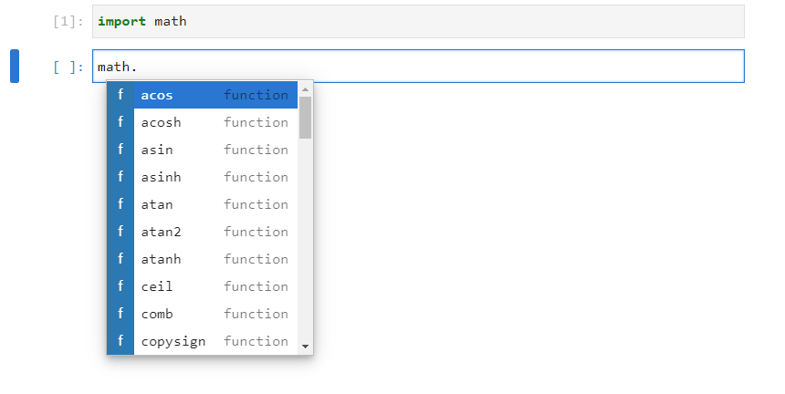

Most of the identifiers are functions but there are also instances which are mathematical constants. 

## Mathematical Constants

A circle can be drawn in x, y co-ordinate space by assigning ```(0, 0)``` to be the centre of the circle and each value in the circle (because it is a circle) has a constant radius. In this depiction a value of ```1``` will be used: 

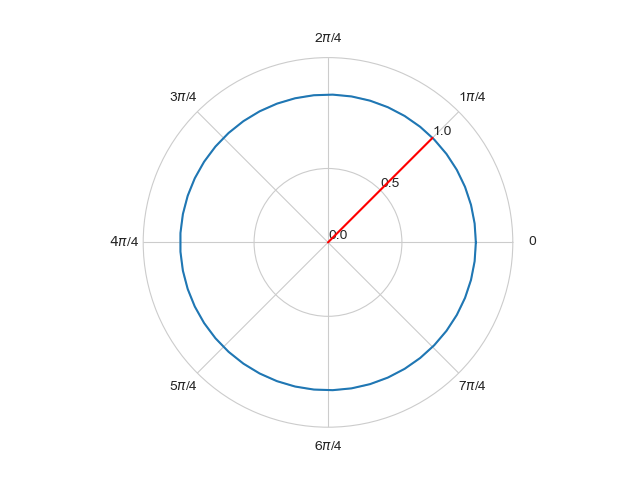

$\pi$ is the ratio of the circumference (indicated in blue) to twice the radius of a circle (indicated in red):

$$\pi=\frac{c}{2r}$$

```
math.pi
```


Re-arranging the above equation:

$$c=2\pi r$$

To get $r$ on its own division by $2\pi$ gives:

$$\frac{c}{2\pi}=\frac{2\pi r}{2\pi}$$

Setting $r$ to the left hand side gives:

$$r=\frac{c}{2\pi}$$

This $r$ is known as a radian and is a normalised unit, that gives an indication of the arc length of the circle.

The circle contant $\pi$ and by extension the normalised unit known as the radian conceptually make sense when considering the circle as a whole however these units have the drawback that they aren't very human readible in decimal form, which is why all the angles in the above diagram were expressed as fractions of $\pi$. Another unit that was traditionally used to measure angles is the degree. A right angle is split into 90 degrees and a circle which conceptually consists of four right angles is therefore split into 360 degrees. 

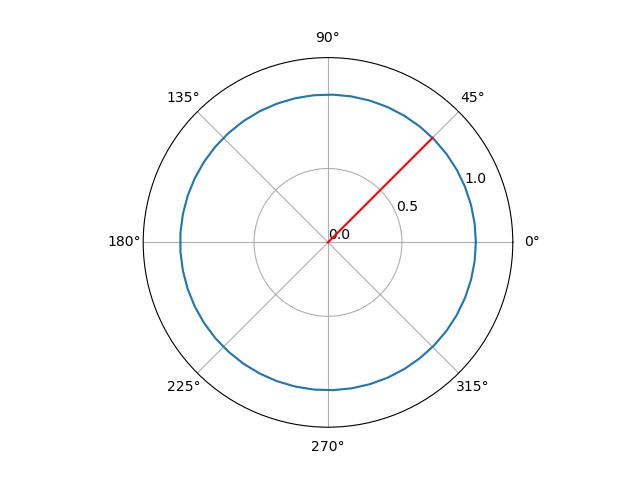

The function ```radians``` converts an angle from degrees to radians and the function ```degrees``` converts an angle from radians to degrees:

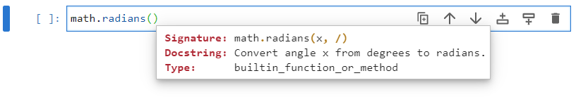


These functions can be tested using:

```
math.radians(1)
math.degrees(1)
math.degrees(2 * pi)
```

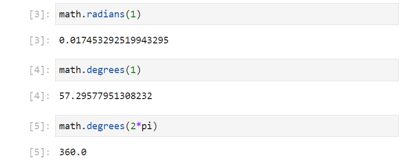

Conceptually it can be seen that a radian is approximately 57.3 degrees. This is to be expected as 360 degrees/6 is 60 degrees. The denominator 6 is just slightly smaller than $2\pi$ so 360 degrees/ $2\pi$ is 57.3 degrees which is just slightly smaller than 60 degrees.

There was also an attempt to decimalise the degree making another unit known as a grad where 100 grads make a right angle. The grad was never commonly employed as 90 is more divisible than 100 for example by 3 and 6:

```
90 / 3
100 / 3
90 / 6
100 / 6
```

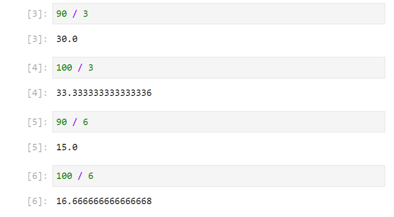

**In the math module (and scientific computing packages in general) the radian is used as a unit of measure for angles in geometric shapes.** Conversions from degrees to radians have to be made on angles before using the angle as an input argument for any of the trigonmetric functions.

|shape|number of sides|sum of all angles in radians|
|---|---|---|
|triangle|3|π|
|square|4|2π|
|pentagon|5|3π|
|hexagon|6|4π|
|heptagon|7|5π|

The simplest geometric shape is the triangle which has 3 sides and the sum of all the angles in these 3 sides is $\left(3-2\right)\pi$ radians. 

$\pi$ can be defined as the ratio of the circumference to the **diameter** of a circle. However the **radius** is typically used much more in calculations than the diameter. For example the area of a circle:

$$
area=\frac{1}{2}\ast2\pi\ast r^2=\pi\ast r^2
$$

Or the volume of a sphere:

$$
volume=\frac{1}{3}\ast\frac{1}{2}\ast2\pi\ast r^3
$$

A single point is typically also referenced with respect to the centre of the circle using the radius and not the diameter. 

Due to $\pi$ being associated with the diameter which is twice the radius, the term $2\pi$ is used frequently as a normalisation factor. In the circle above for example $\pi$ represents half a circle and $2\pi$ represents the full circle. 

Some mathematicians and physicists argue that the term $2\pi$ is a better normalisation factor and this is therefore known as another circle constant $\tau$:

```
math.tau
```

```tau``` is therefore twice the size of ```pi```:

```
math.tau == 2 * math.pi
```


Using $\tau$ instead of $\pi$ more clearly depicts the use of integration to calculate the area of a circle instead of masking the division by 2 term:

$$
area=\frac{1}{2}\ast\tau\ast r^2
$$

Or the volume of a sphere:

$$
volume=\frac{1}{3}\ast\frac{1}{2}\ast\tau\ast r^3
$$

In addition, the following phase diagram is normalised correctly:

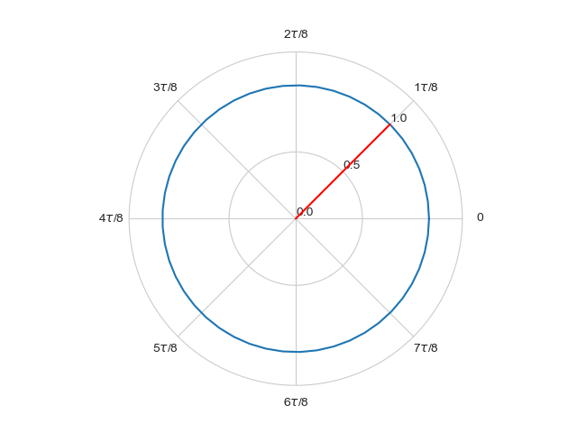

The radian has the following relationship with $\tau$:

$$r=\frac{c}{2\pi}=\frac{c}{\tau}$$

Another constant ```e``` is known as Euler's number and is an important constant when it comes to modelling exponential growth. 

The value of ```e``` can be calculated empirically using the following mathematical formula:

$$
e=\sum_{n=0}^{\infty}\frac{1}{n!}
$$

This formula gets expanded out as an Euler series:

$$
e=1+\frac{1}{1}+\frac{1}{1\ast2\ }+\frac{1}{1\ast2\ast3}+\ldots,
$$

The denominator in each expression is known as a factorial:

$$
e=\frac{1}{0!}+\frac{1}{1!}+\frac{1}{2!\ }+\frac{1}{3!}+\ldots,
$$

Where:

$$0!\ =\ 1$$

$$1!\ =\ 1$$

$$2!=1\ast2$$

$$3!=1\ast2\ast3$$

A function can be made to calculate a factorial:

```
def factorial(factor):
    result = 1
    for num in range(2, factor+1):
        result *= num
    return result


```

Which can be tested:

```
factorial(0)
factorial(1)
factorial(2)
factorial(3)
```

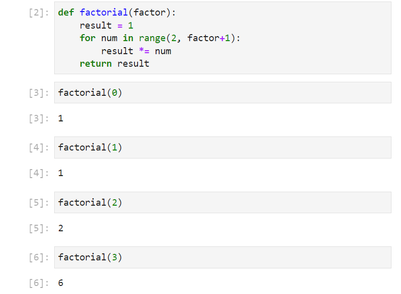

This ```factorial``` function can be used within an ```Euler``` series function to calculate a ```total```:

```
def euler_series(factor):
    total = 1.0
    for num in range(1, factor + 1):
        total += 1.0 / factorial(num)
    return total


```

This function can be tested using different values of ```factor```:

```
euler_series(1)
euler_series(2)
euler_series(3)
euler_series(10)
euler_series(50)
euler_series(100)
```


The ```total``` generated from an Euler Series can be seen to converge. This is because the denominator in each additional term becomes larger and as a result, addition of its reciporical becomes negligible.

The number this converges to is known as Eulers number ```e```. To get Eulers number use:

```
math.e
```


There are also two constants representing infinity ```inf``` and not a number ```nan```:

```
math.inf
math.nan
```

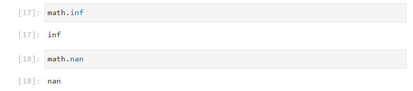

If these numbers are going to be used regularly, they can be imported directly into the namespace of the notebook using:

```
from math import pi, tau, e, inf, nan
```


All of these number are observed to be instances of the ```float``` class.

## Functions

The ```math``` module has the inbuilt functions ```isinf```, ```isfinite``` and , ```isnan``` which take in a value as an input argument and return a ```bool```

For example the number 1 is finite and the number inf is infinite so the following expressions are ```False``` and ```True``` respectively:

```
math.isinf(1)
math.isinf(inf)
```

And the counter-expressions are ```True``` and ```False``` respectively:

```
math.isfinite(1)
math.isfinite(inf)
```

The number ```inf``` is a number whereas ```nan``` is not a number so the following expressions are ```False``` and ```True```:

```
math.isnan(inf)
math.isnan(nan)
```

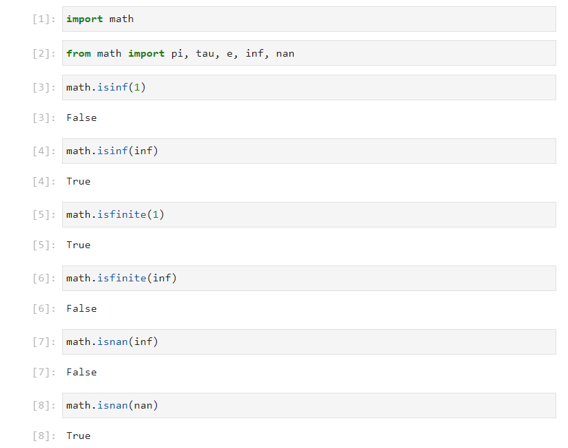

The ```pow``` functions docstring can be seen by inputting the function name followed by open parenthesis and pressing shift ```⇧``` and tab ```↹```:


It is seen to have similar behaviour to the inbuilt operator ```**```:

```
math.pow(2, 4)
2 ** 4
```

However the ```pow``` function always returns a floating point number:

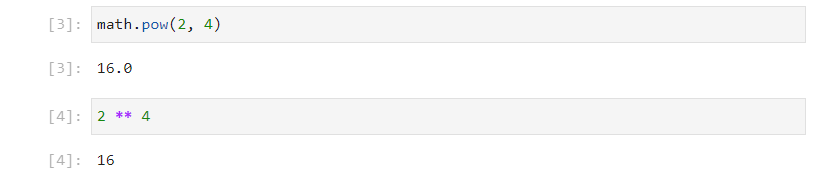

The ```math``` module also has the functions ```sqrt``` and ```isqrt``` which compute the square root and the integer square root respectively:


The integer square root requires the input argument to be an integer and returns an integer. The floor of the integer will be returned for the output:

```
math.sqrt(16)
16 ** 0.5
math.isqrt(16)
math.isqrt(17)
```


The number of combinations and number or permutations can be calculated using the ```comb``` or ```perm``` functions respectively:

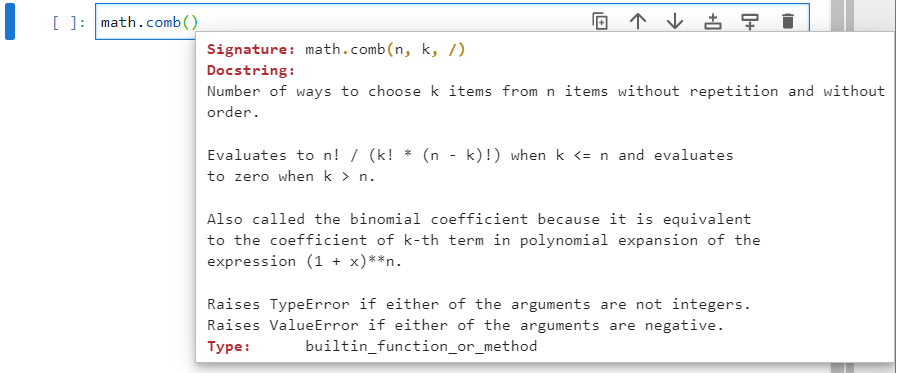

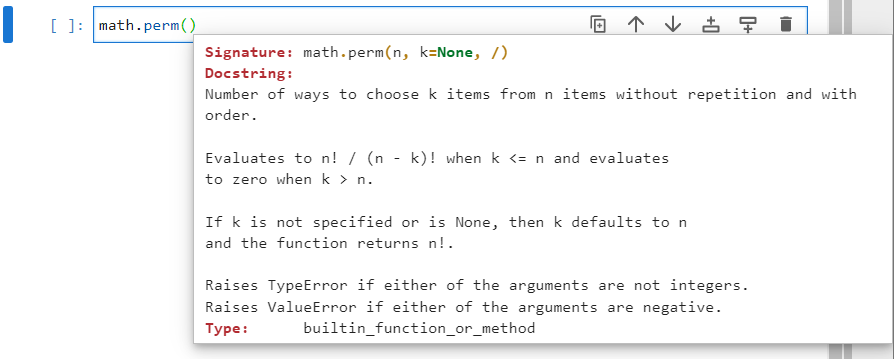

The docstrings are a bit confusing for these functions; ```n``` is a large number of items that can be placed into ```k``` containers. This is better visualised pictorially with an example. If there are three coloured circle items, a purple, green and red circle i.e. ```n=3``` and 2 circular containers on a table i.e. ```k=2```. Then the following combinations are possible:

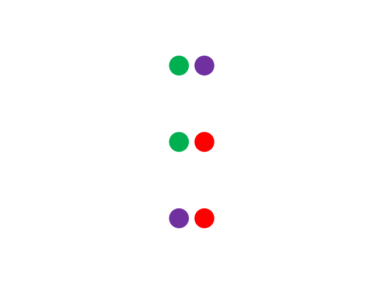

Each combination can be thought of as a set that is a subset of the items from ```k``` and like in the case of a set, the order doesn't matter. In a permutation, however the order does matter and in this example because there are 2 containers, there are 2 permutations for each color combination:

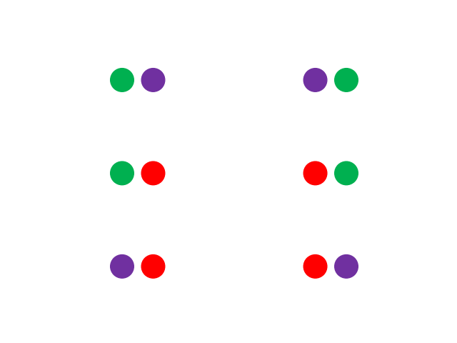

The ```comb``` and ```perm``` functions can be used with the above examples and give the results ```3``` and ```6``` as expected:
```
math.comb(3, 2)
math.perm(3, 2)
```

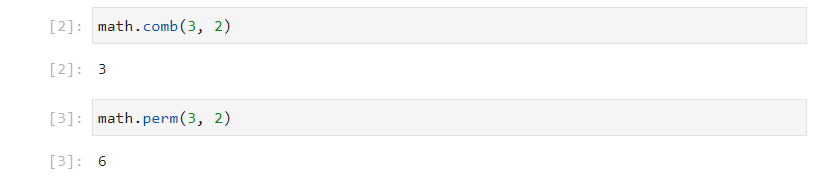

The ```floor``` and ceiling ```ceil``` functions can be used to find the largest integer less than or equal to the input argument or the smallest integer greater or equal to the input argument:


For example, the floor of ```pi``` is 3 and the ceiling of ```pi``` is 4:

```
math.floor(pi)
math.ceil(pi)
```


Scientific notation allows numerical representation for very small and very large numbers. Under the hood a floating point number is stored in bits. Each bit can be conceptualised as a switch or an LED which can either be off (0) or on (1). The IEEE-754 floating point precision uses 32 bits (represented pictorally by 32 LEDs):

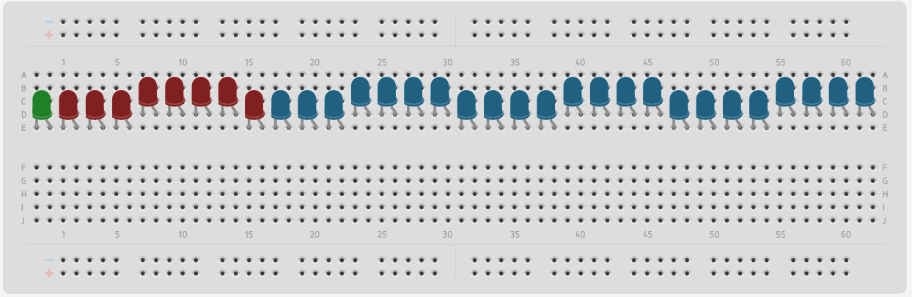

The arrangement is:

* mantissa sign: 1 bit (0 for a negative number and 1 for a positive number)
* signed exponent: 8 bits (127 is the offset i.e. -127 is encoded as 0, -126 is encoded as 1,...)
* mantissa modulus: 23 bits

Due to there being a finite number of bits to store a number and only 2 characters (0 or 1) in the binary system to store a number, rounding errors, particularly rounding errors due to recursion occur far more frequently when dealing with floating point numbers.

A rounding recursion error can be easily visualised in decimal by attempting to convert one third into decimal:

$$\frac{1}{3}=0.3333\ldots$$

If only a finite number of characters are shown after the decimal point for example 6 characters then the number is approximated:

$$\frac{1}{3}=0.333333$$

And the calculation:

$$\frac{1}{3}+\frac{1}{3}+\frac{1}{3}=0.333333+0.333333+0.333333=0.999999$$

This should be equal to unity however if a comparison operator is used to check whether this is exactly equal to 1, the result would be ```False```. This recursion rounding error depicted above occurs frequently with floating point numbers because they are stored in binary.

The ```isclose``` function can be used to check if a number is close to another number within a specified tolerance:

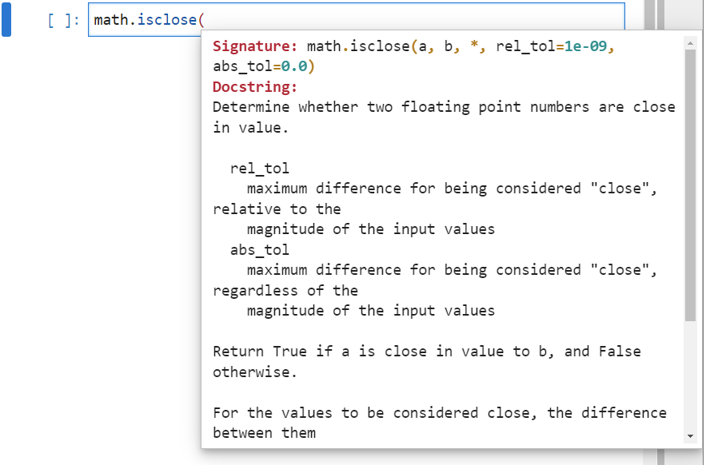

This can be a more useful when dealing with floats than traditional comparison operators due to the recursion rounding errors. For example:

```
0.3
print(f'{0.3 :018.17f}')
0.1 + 0.2
print(f'{0.1 + 0.2 :018.17f}')
0.3 == 0.1 + 0.2
math.isclose(0.3, 0.1 + 0.2, rel_tol=1e-9)
```

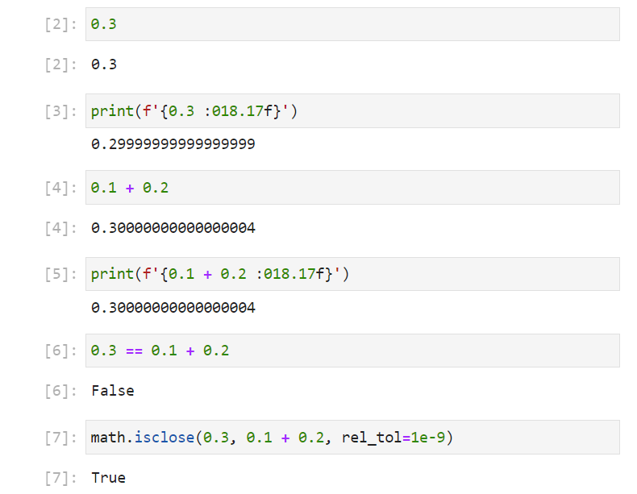

The relative tolerance ```rel_tol``` of ```1e-9``` means the number lies between:

```
f'{0.3 - 0.3*1e-9 :018.17f}'
f'{0.3 + 0.3*1e-9 :018.17f}'
```

The number can be seen to be between these bounds:

```
f'{0.1 + 0.2 :018.17f}'
```

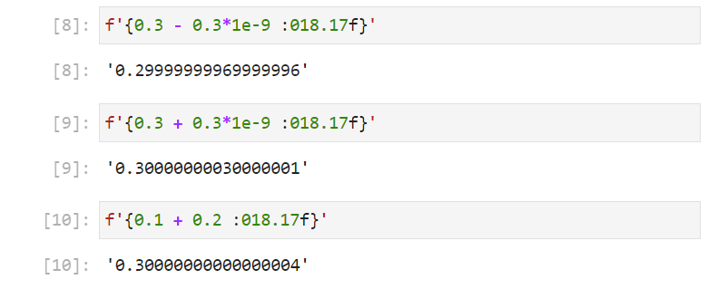

The absolute tolerance can also be specified:

```
math.isclose(0.3, 0.1 + 0.2, abs_tol=1e-6)
```

The absolute tolerance ```abs_tol``` of ```1e-6``` means the number lies between:

```
f'{0.3 - 1e-6 :018.17f}'
f'{0.3 + 1e-6 :018.17f}'
```

The number can be seen to be between these bounds:

```
print(f'{0.1 + 0.2 :018.17f}')
```

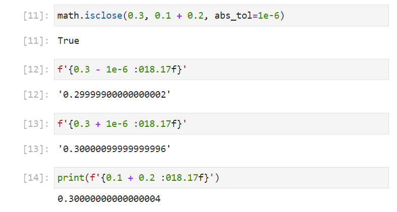

Because of the the physical arrangement to store floating point numbers seen above, large numbers are much more widely spaced apart from each other than smaller numbers. The unit in last place, is essentially the next step up or down:

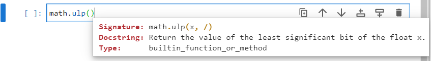

This can be demonstrated with a small and a large number:

```
f'{0.1 :018.17f}'
f'{math.ulp(0.1) :018.17f}'
f'{0.1 + math.ulp(0.1) :018.17f}'
f'{1e18 :018.0f}'
f'{math.ulp(1e18) :018.0f}'
```

For the small number, the number next up is a small step of ```0.00000000000000001``` and for the large number the step to the next number is ```128```:

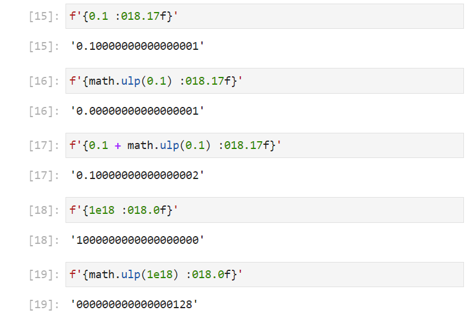

Calculations generally depend on the relative precision of each floating point number and either case the relative precision is approximately ```1e-16```:

```
math.ulp(0.1) / 0.1
math.ulp(1e18) / 1e18
```

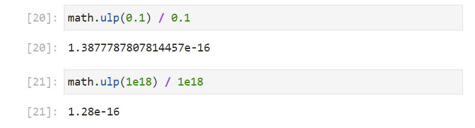

The related next after function ```nextafter``` will compute the number after ```x``` going towards ```y```:

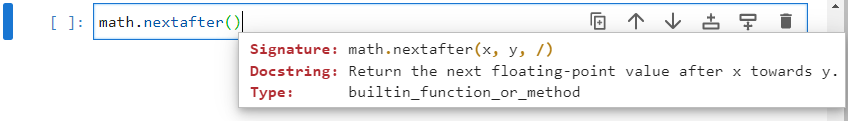

```
f'{math.nextafter(1e18, 2e18):018.0f}'
```


The error due to float precision rounding can propogate when summing a sequence of floating point numbers. The float sum ```fsum``` function in the ```math``` module carries out additional checks to combat these rounding errors. 

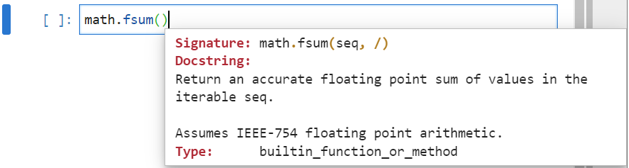

For example:

```
sum([0.1, 0.2, 0.1, 0.2, 0.1, 0.2])
math.fsum([0.1, 0.2, 0.1, 0.2, 0.1, 0.2])
```
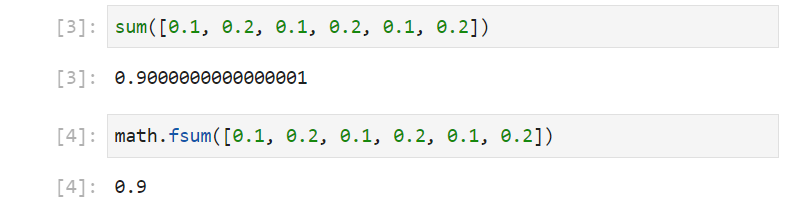

There is also the float absolute ```fabs``` that can be used to calculate the absolute value of a floating point number (returning the number with the sign stripped):

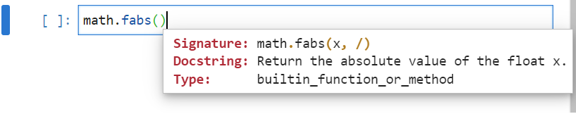

These performs a very similar behaviour to the ```abs``` function within Python:

```
math.fabs(-0.3)
abs(-0.3)
```

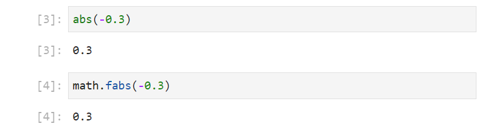

The subtle difference is the input argument is cast to a float and the value returned is always a float when ```fabs``` is used:

```
math.fabs(-3)
abs(-3)
```

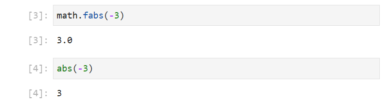

The float sum will likewise always return a floating point number.

The Fortran mod ```fmod``` calculates the modulus associated with an integer division (f doesn't stand for float here). For positive numbers the behaviour is identical to the inbuilt Python mod or modulus operator ```%```:

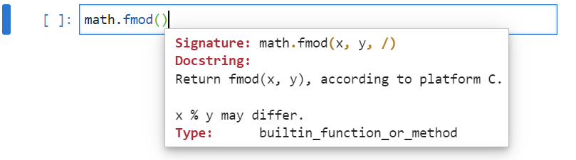

```
pi // 3
pi % 3
math.fmod(pi, 3)
```

The difference between the Fortran implementation and Python implementation can be seen when negative numbers are used:

```
-pi % 3
math.fmod(-pi, 3)
```

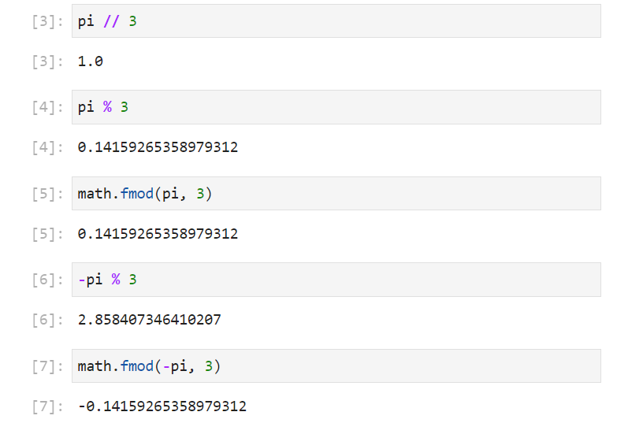

The Fortran implementation essentially carries out the following operation:

```
-(pi % 3)
```


Without parenthesis, the Python implementation instead carried out:

```
3 - (pi - 3)
```


The ```math``` module also has a related ```remainder``` function:

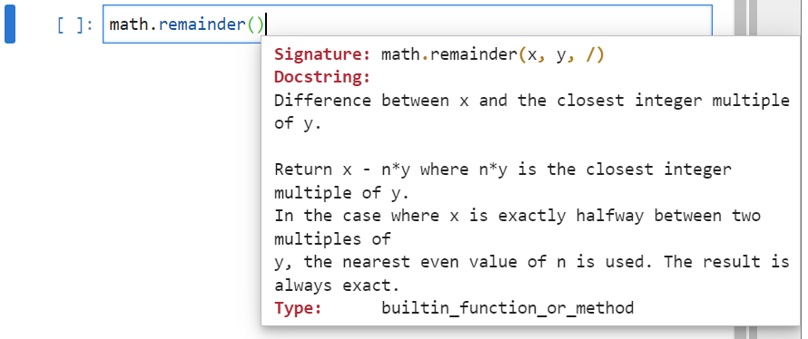

The modulus ```%``` or ```fmod``` are designed to be a companion with integer floor division:

```
10.5 // 3
math.fmod(10.5, 3)
```

The remainder is a companion to rounded float division:

```
10.5 / 3
round(10.5/3)
math.remainder(10.5, 3)
```

And as a consequence will give a positive or negative remainder.

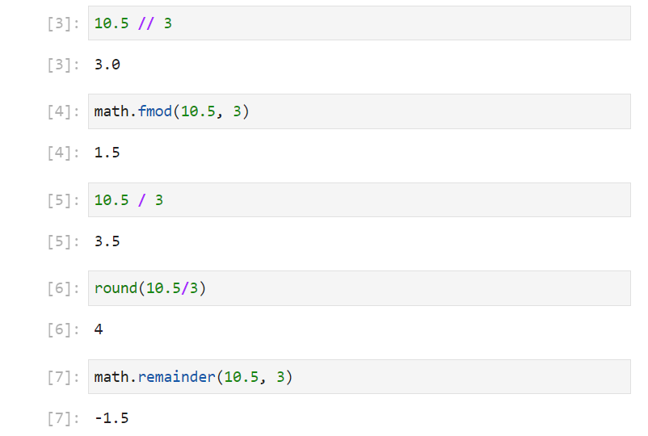

The ```remainder``` function also operates with negative numbers and a comparison can be seen between the three related functions:

```
-10.5 // 3
-10.5 % 3
math.fmod(-10.5, 3)
-10.5 / 3
round(-10.5/3)
math.remainder(-10.5, 3)
```


The modulus fraction ```modf``` will split a float into a fractional and integer component outputting a tuple:


For example:

```
math.modf(pi)
fraction, whole = math.modf(pi)
```

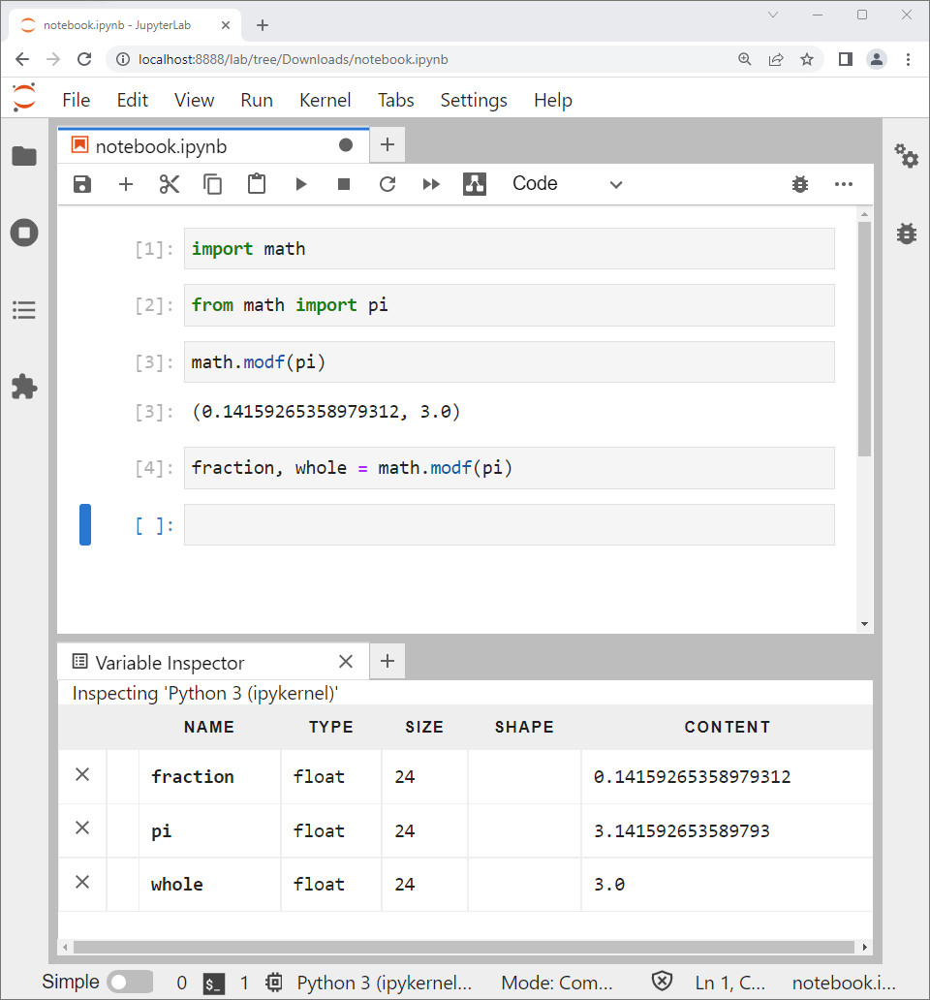

Notice that both the fraction and the whole number are of the type float.

The truncate function ```trunc``` will truncate the integer component of a float, behaving similarly to ```modf``` but only returning the integer component as an integer. 

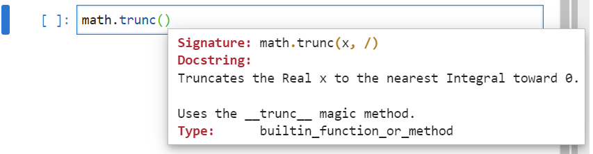

Truncation (ignoring any fraction component taking the floor integer) should not be confused with rounding (which can round down to the floor integer or up to the ceiling integer):

```
round(-10.5/3)
math.trunc(-10.5/3)
math.modf(-10.5/3)[1]
```


Notice the difference in output between the three functions. In this case ```round```, rounds up. ```trunc``` and  the value at index 1 for ```modf``` truncate the number. ```trunc``` and ```round``` return integers whereas the value at index 1 for ```modf``` is a float.

The greatest common divisor will calculate the greatest common divisor between sequence of numbers:


For example:

```
math.gcd(128, 12)
```

gives the result ```4```. The result ```4``` perfectly divides by both numbers giving no modulus (or remainder). In this case ```%```, ```modf``` or ```remainder``` will all give ```0```: 

```
128 // 4
128 % 4
12 // 4
12 % 4
```

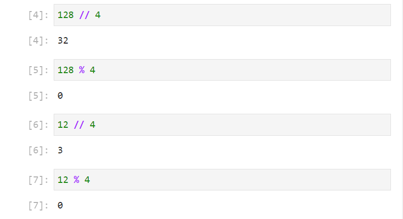

The lowest common multiple function ```lcm```requires an input sequence of integers and returns the lowest common multiple, that is a number which can be divided by each number in the sequence without any modulus or remainder:

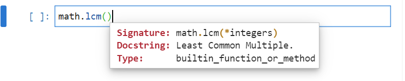

For example:

```
math.lcm(2, 3, 4, 5, 8)
```

Gives ```120``` and the modulus for each of the following is ```0```:

```
120 % 2
120 % 3
120 % 4
120 % 5
120 % 8
```

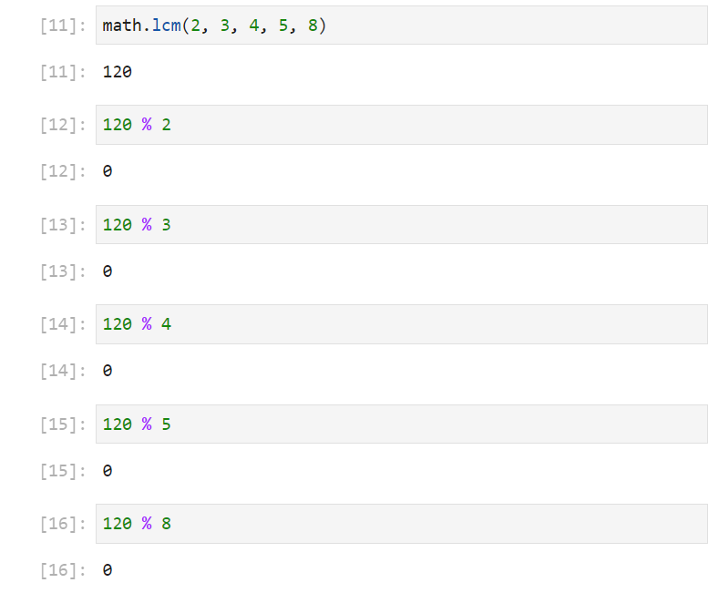

The product function ```prod``` takes in a sequence of numbers in the form of a list or tuple and returns the product of all the numbers in the sequence:


For example:

```
math.prod([2, 3, 4, 5, 8])
2 * 3 * 4 * 5 * 8
```

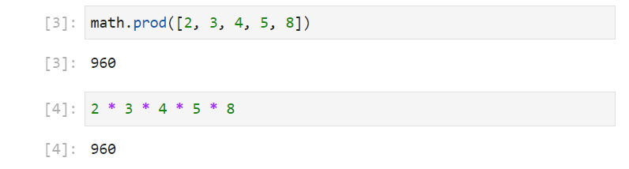

The function ```copysign``` takes two numbers ```x``` and ```y``` and returns a number which has the magnitude of ```x``` and the sign of ```y```:

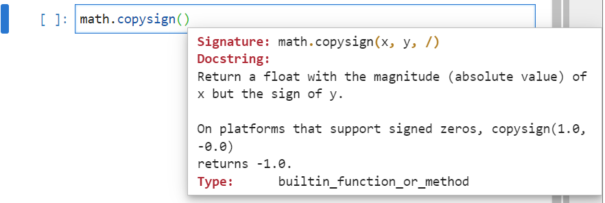

For example:

```
direction = -1
magnitude = 5.2
math.copysign(magnitude, direction)
```

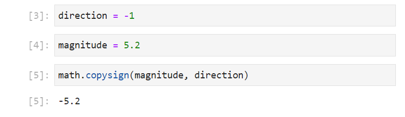

## Exponential and Logarithmic Functions

The ```math``` module has an inbuilt function ```factorial```. The concept of a factorial was explained when looking at the constant ```e```:

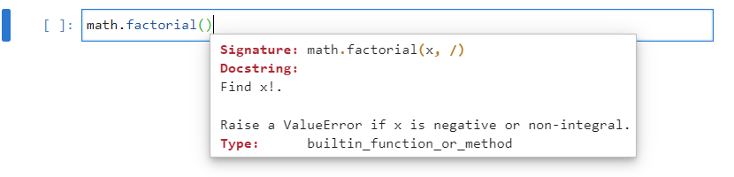

And can be tested with:

```
math.factorial(0)
math.factorial(1)
1
math.factorial(2)
1 * 2
math.factorial(3)
1 * 2 * 3
```


The value ```e``` was explored before. The function ```exp``` raises ```e``` to the power of ```x```:


For example a ```x``` value of ```1``` will give ```e ** 1``` and a ```x``` value of ```2``` will give ```e ** 2```:

```
e ** 1
exp(1)
e ** 2
exp(2)
```

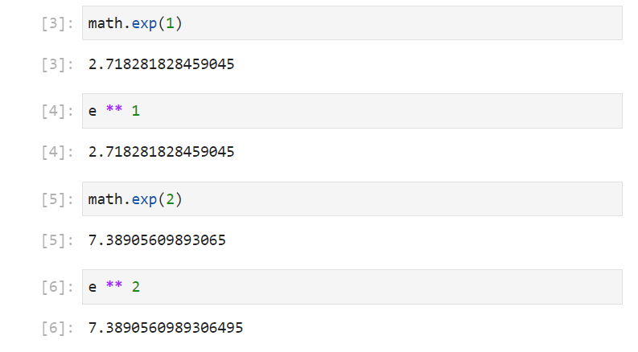

Values on the exponential scale, as the name suggests, increase exponentially:

```
exp(1)
exp(5)
exp(10)
```

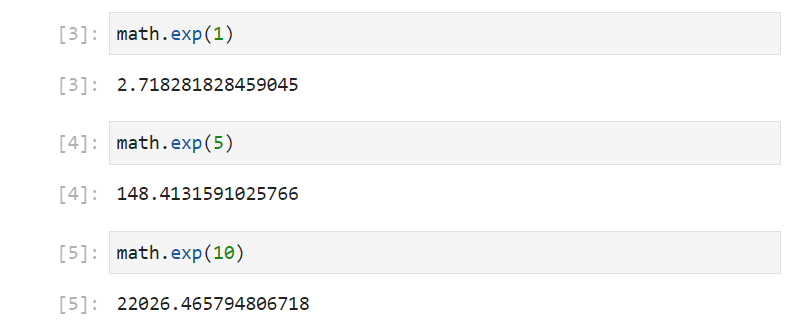

Sometimes it is useful to get the inverse of the exponential using the logarithmic ```log``` function. This function defaults to the natural base of ```e``` by default:

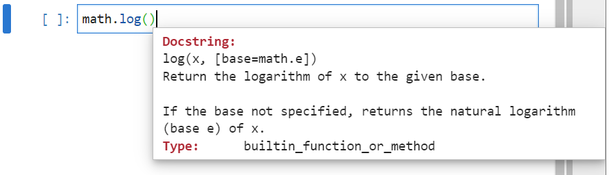

```
math.log(e)
math.log(e**2)
math.log(e**5)
```


Since the decimal and binary counting systems are commonly used, base 10 and base 2 are commonly used:

```
10 ** 0
math.log(1, 10)
10 ** 1
math.log(10, 10)
10 ** 2
math.log(100, 10)
```

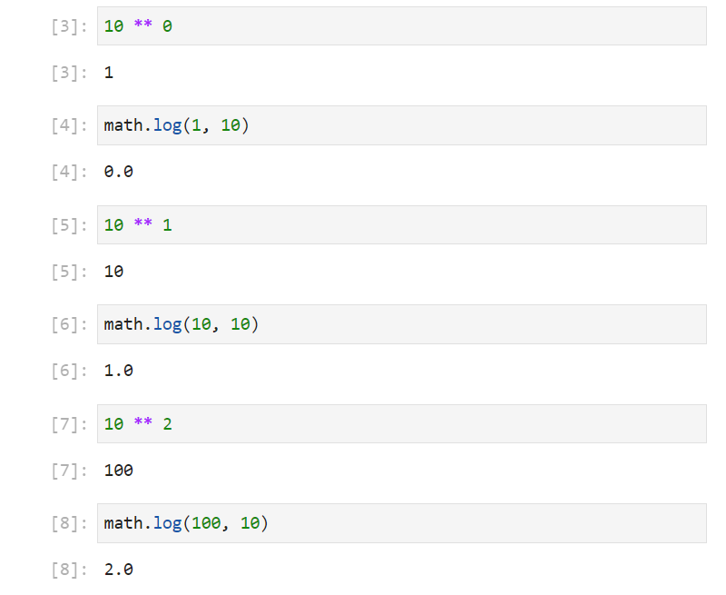

```
2 ** 0
math.log(1, 2)
2 ** 1
math.log(2, 2)
2 ** 2
math.log(4, 2)
```


These bases are so commonly used, they have their own functions ```log10``` and ```log2``` which are locked to the base 10 and 2 respectively:

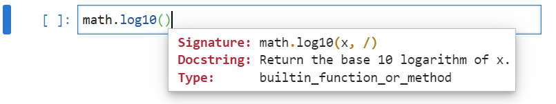


These work as expected:

```
math.log10(100)
math.log2(4)
```

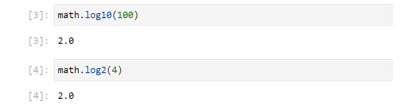

The float radix exponent function ```frexp``` is used to convert a number into a fractional mantissa and integer exponent using a base of 2.


For example:

```
math.frexp(0.125)
mantissa, exponent = math.frexp(0.125)
0.5 * 2 ** -2
```

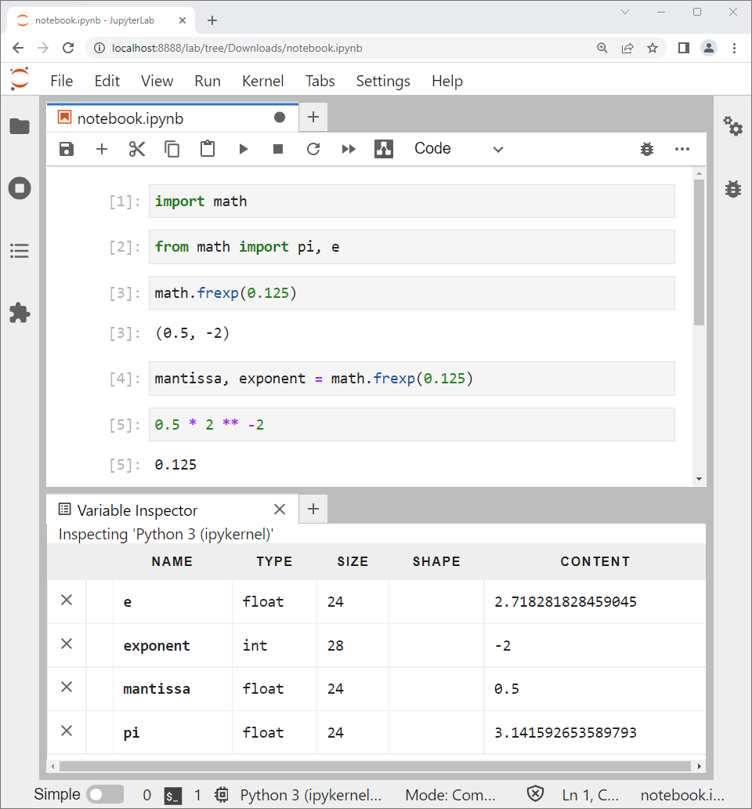

The load exponent function ```ldexp``` is the inverse of ```frexp``` and is used to construct a floating point number from a mantissa and exponent usign the base of 2:

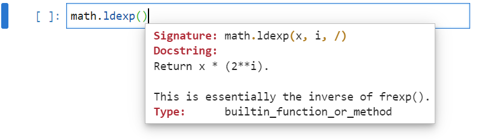

```
math.ldexp(0.5, -2)
0.5 * 2 ** -2
```

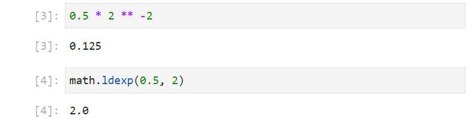

The exponential minus 1 ```expm1``` function calculates the exponential of a value and subtracts 1 from it:


The reverse function logarithmic plus 1 ```logp1``` calculates the logarithmic of a value and adds to it:

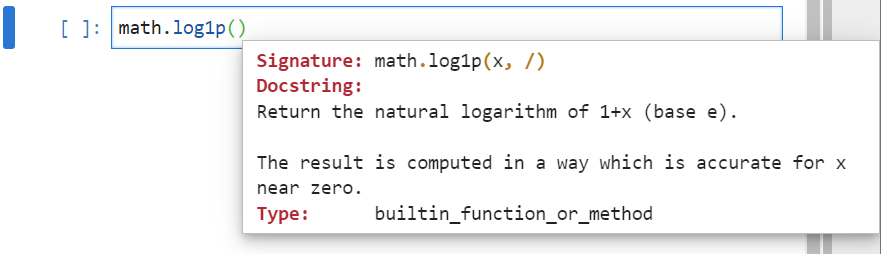

These functions can be seen to give similar behaviour to the regular versions of the function once the offset is applied:

```
math.exp(1)
math.expm1(1 + 1)
math.log(e)
math.log1p(e - 1)
```

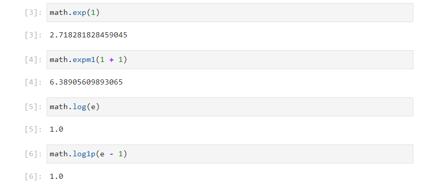

The ```factorial``` function operates on integers and therefore produces discrete integer values. The ```gamma``` function is related to the factorial however takes a ```n+1``` term opposed to a ```n``` term:

$$n!=Γ(n+1)$$

Therefore the following are equivalent:

```
math.factorial(0)
math.gamma(0 + 1)
math.factorial(1)
math.gamma(1 + 1)
math.factorial(2)
math.gamma(2 + 1)
math.factorial(3)
math.gamma(3 + 1)
```

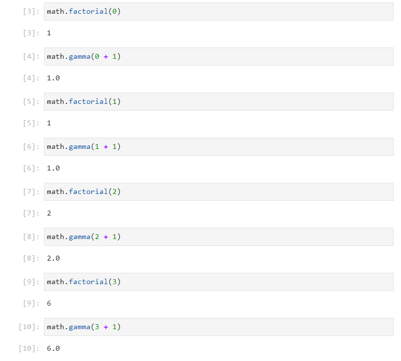

The ```gamma``` function can however take in floating point values as an input argument:

```
math.gamma(1.5 + 1)
```


Graphically a comparison of the ```gamma``` function and the discrete values from ```factorial``` looks like:

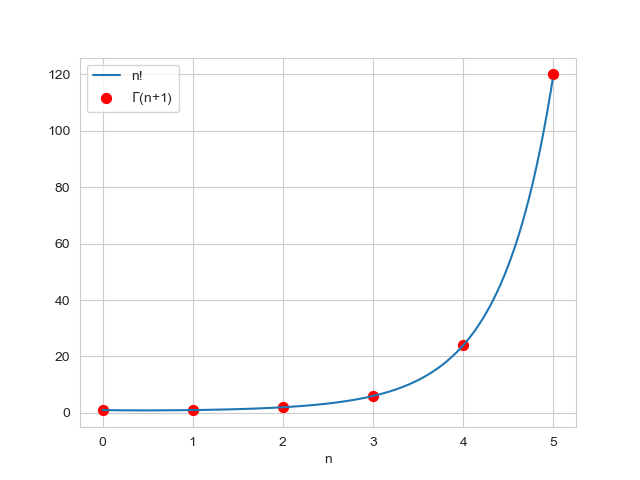

For larger values of factorials, the magnitude on the y-axis changes drastically, making it difficult to see the magnitude of all previous numbers when scaled alongside the last number:

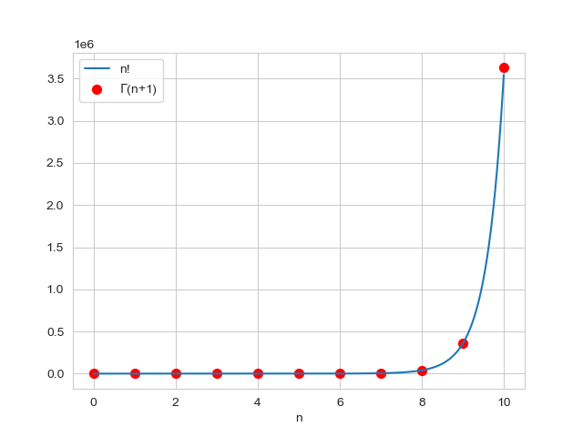

As a consequence it is often plotted using a natural log scale:

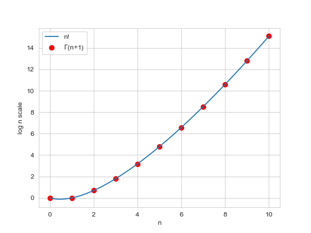

The ```lgamma``` function takes the log of the ```gamma``` function:

$$log({\Gamma(n+1)})$$

This can be seen by comparing:

```
math.factorial(10)
math.gamma(10 + 1)
math.log(math.factorial(10))
math.log(math.gamma(10 + 1))
math.lgamma(10 + 1)
```

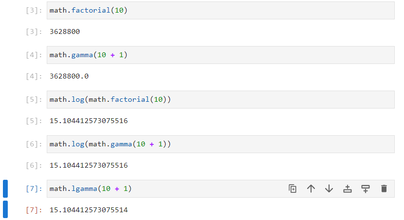

## Triangle Equations

The remaining functions in the math module are related to geometry. The function ```hypot``` is an application of Pythagoras theorem for right-angled triangles:

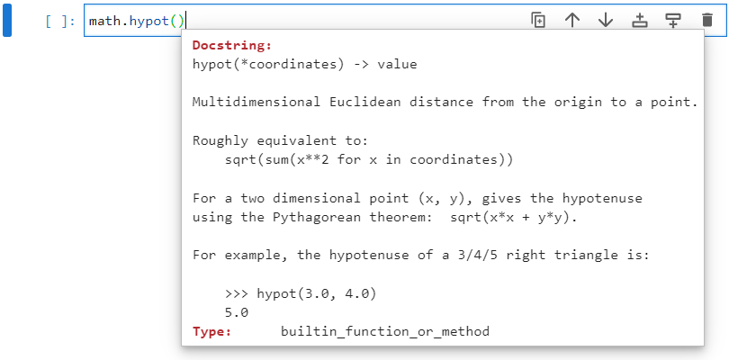

$$a^2=b^2+c^2$$

$$a=(b^2+c^2 )^{0.5}$$

Where a is the length of the green side, b is the purple length and c is the orange length. The side a is known as the hypotenuse:

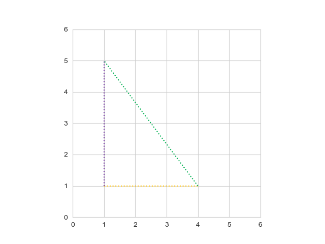

In this example, b can be seen to be 4 units long and c can be seen to be 3 units long. Therefore a is:

```
math.hypot(4, 3)
a = math.hypot(4, 3)
```

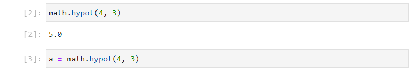

The distance formula which calculates the distance between two co-ordinates:

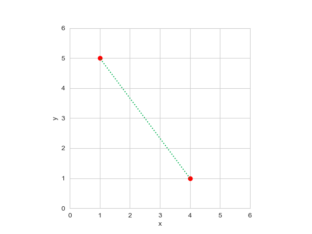

The distance math function ```dist``` will calcuate the distance between two points:

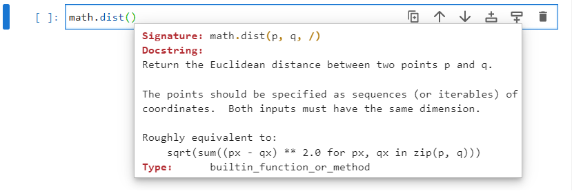

This distance is under the hood calculated using Pythagoras theorem and conceptually a vertical line can be drawn from the top co-ordinate and a horizontal line can be drawn from the bottom co-ordinate to construct a right angle triangle:

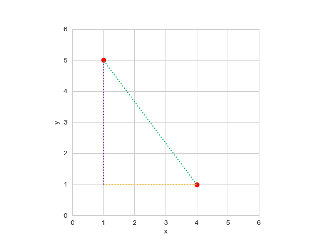

The co-ordinates in this case are ```p = (4, 1)``` and ```q = (1, 5)``` and the distance between them can be calculated using:

```
math.dist((4, 1), (1, 5))
```


The distance can also be projected to 3 dimensions (and higher). Essentially a component of the difference for each axis is calculated as depicted with the orange, purple and cyan lines. These components are squared and then summed. Finally the square root is taken to get the distance:


The co-ordinates in this case are ```p=(1, 1, 1)``` and ```q=(3, 4, 7)``` and the distance between them can be calculated using:

```
math.dist((1, 1, 1), (3, 4, 7))
((3 - 1) ** 2 + (4 - 1) ** 2 + (7 - 1) ** 2) ** 0.5
```


## Circle Equations

Pythagoras theorem has the formula:

$$a^2=b^2+c^2$$

On a 2D co-ordinate system, $b$ can be represented by $x$ and $c$ can be represented by $y$:

$$a^2=x^2+y^2$$

For a circle, centred about the origin, the hypotenuse $a$ has a constant value and is known as the radius $r$:

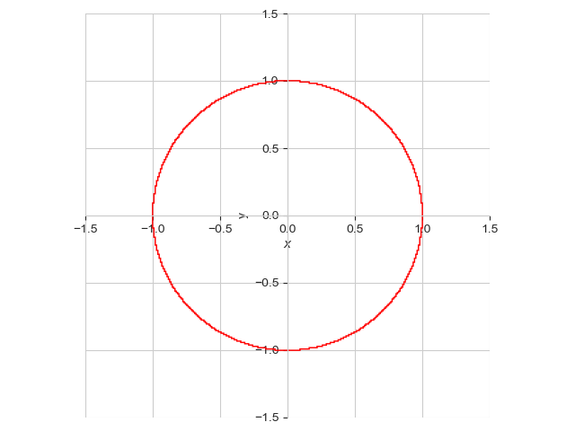

This gives:

$$r^2=x^2+y^2$$

Or re-arranged:

$$x^2+y^2=r^2$$

The following phase diagram will be used as a basis for examining the trigonometry identities:


The $\tau$ representation will be used as it is normalised correctly where a radian is:

$$1\ radian=\frac{C}{\tau}$$

Because this is a circle, each point in the circle has a constant. For simplicity a radius of 1 has been selected. Let's simplify the circle further by depicting just the first quarter of the circle:

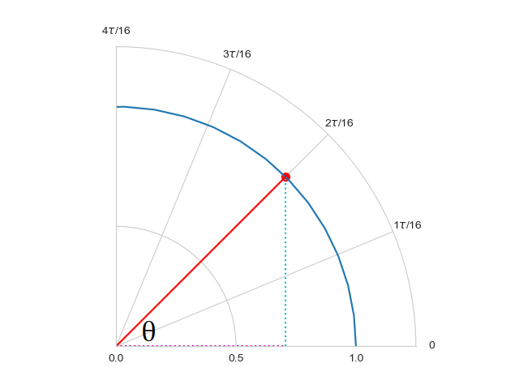

The point on the circle is depicted as a red dot and has a radius of 1. If a red line is drawn from the red dot to the centre of the circle, it makes an straight line that has an angle $\theta$. A cyan line can be drawn from the point to the horizontal axis and a magenta line can be drawn from here to the vertical axis forming a right angle triangle. Each side of the triangle is examined with respect to the angle $\theta$. The cyan line is opposite of $\theta$ and the magenta line is adjacent of $\theta$. The red line itself is known as the hypotenuse. 

$$
soh\ cah\ toa
$$

In the general case, when used with a right angled triangle, the sine function ```sin``` gives the ratio of opposite side to the hypotenuse side. Since the hypotenuse for a unit circle has a fixed radius of 1, i.e. is normalised. The sine function will directly give the length of the opposite side in this case which is the y co-ordinate of the point on the circle.

$$
\sin{\left(\theta\right)}=\frac{opposite}{hypotenuse}
$$


The cos function ```cos``` gives the ratio of adjacent side to the hypotenuse side. Since the hypotenuse side is the radius of the circle which is 1, this will give the length of the adjacent side in this case which is the x co-ordinate of the point on the circle. Because the unit circle is normalised, the will directly give the length of the adjacent side which is the x co-ordinate of the point on the circle.


$$
\cos{\left(\theta\right)}=\frac{adjacent}{hypotenuse}
$$


The tan function ```tan``` gives the ratio of the opposite side to the adjacent side.

$$
\tan{\left(\theta\right)}=\frac{opposite}{adjacent}=\frac{\sin{\left(\theta\right)}}{\cos{(\theta)}}
$$

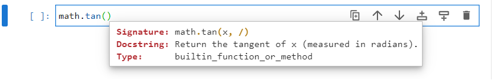

When $\theta=0\tau/16$ pictorally it can be observed that the opposite length is 0 and the adjacent length matches the side of the radius 1. 

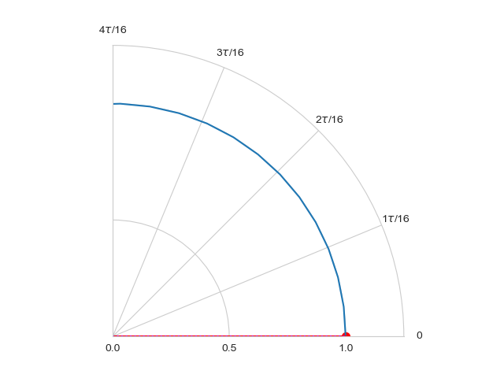

Therefore the ```sin``` function can be seen to be 0 and the ```cos``` function can be seen to be 1. The tan function is ```0/1``` which is ```0```:

```
math.sin(0*tau/16)
math.cos(0*tau/16)
math.cos(0*tau/16)
```

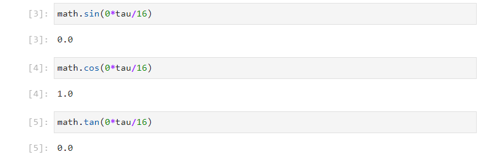

When $\theta=1\tau/16$ pictorally it can be observed that the opposite length has increased and the adjacent length has decreased slightly. 

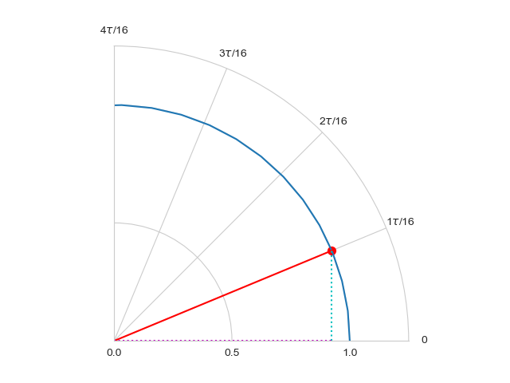

The values can be checked by:

```
math.sin(1*tau/16)
math.cos(1*tau/16)
math.cos(1*tau/16)
```

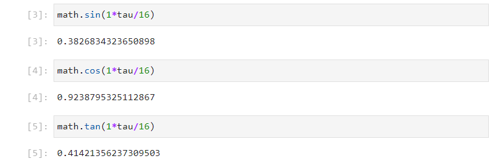

When $\theta=2\tau/16$ pictorally it can be observed that the opposite and the adjacent length are now the same size: 

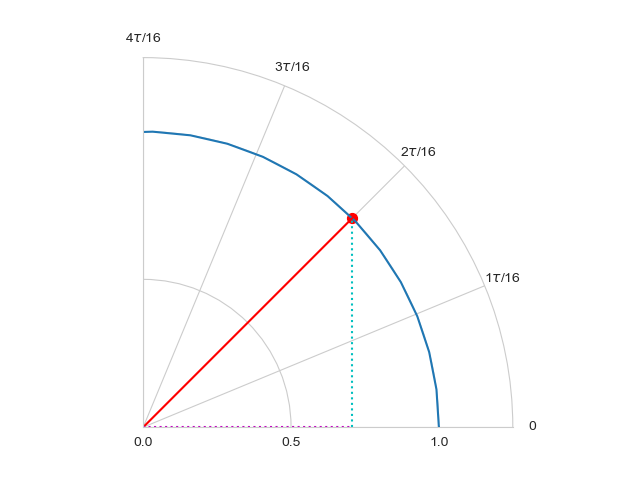

Therefore the sin and cos functions should have the same value and the tan function should have a value of 1. This can be checked by using:

```
math.sin(2*tau/16)
math.cos(2*tau/16)
math.cos(2*tau/16)
```

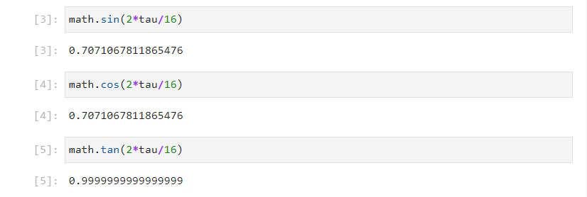

When $\theta=3\tau/16$ pictorally it can be observed that the opposite length has increased further and the adjacent length has decreased further. Moreover there is symmetry between the triangle at $\theta=1\tau/16$ where the opposite side was the short side of the triangle and the adjacent was the long side of the triangle and $\theta=3\tau/16$ which now has the opposite side being the longer side of the triangle and adjacent being the shorted side. 

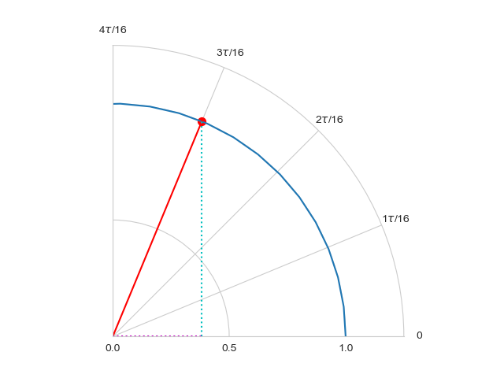

Therefore the values with the sine and cos functions should essentially switch. This can be confirmed using:

```
math.sin(3*tau/16)
math.cos(3*tau/16)
math.cos(3*tau/16)
```

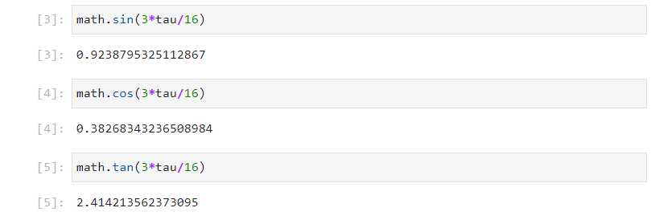

When $\theta=4\tau/16$ pictorally it can be observed that the opposite length is matches the side of the radius 1 and the adjacent length is 0. This "triangle" or plane has symmetry when the angle was $\theta=0\tau/16$:

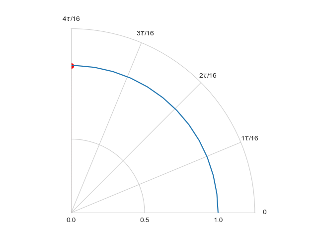

Therefore the ```sin``` function can be seen to be 1 and the ```cos``` function can be seen to be 0. The tan fucntion is ```1/0``` which is ```inf```:

```
math.sin(4*tau/16)
math.cos(4*tau/16)
math.cos(4*tau/16)
```

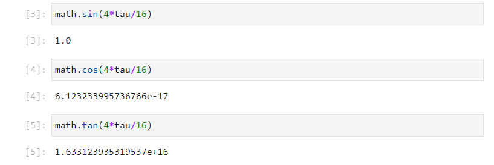

In the case of the tan function, an extremely high float is output which differs to infinity only because of float precision.

So far each of the functions looks like the following:

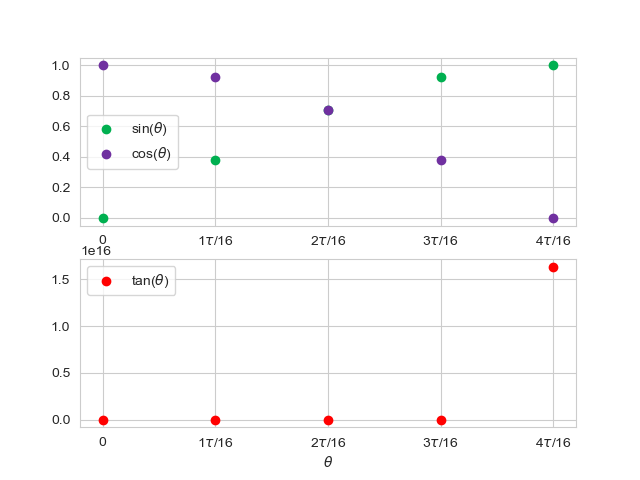

A circle is an object that has symmetry around the x-axis. 


The absolute lengths of the lines are going to be the same in the second quadrant of the circle. However the sign for the x-component is flipped:

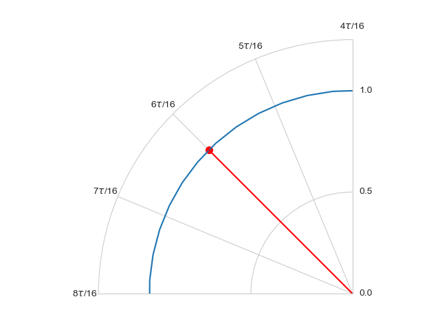

Therefore the plots for the 1st and 2nd quadrant look like:

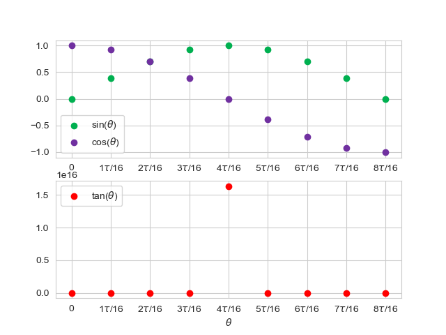

Notice that the ```cos``` plot has the same form as the ```sin``` plot but is delayed by $\tau/4$. The reason for this is due to the rotational symmetry of the circle through by  $\tau/4$. Rotating the circle by $\tau/4$ changes the horizontal axis to a vertical axis and the behaviour of the vertical axis is modelled on ```cos``` which is a delayed ```sin```

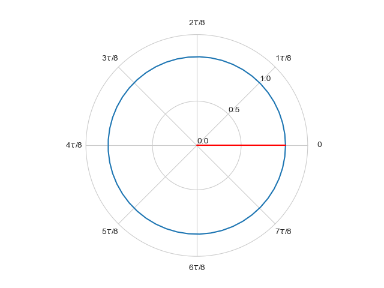

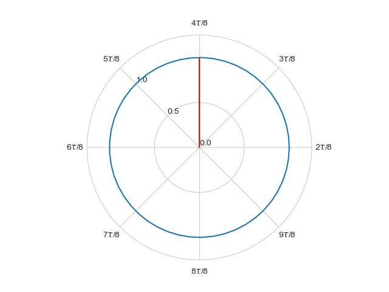

A circle is an object that has symmetry around the x-axis and y-axis.


The absolute lengths of the lines are going to be the same in the third quadrant of the circle. However the sign for the x-component and y-component are flipped:

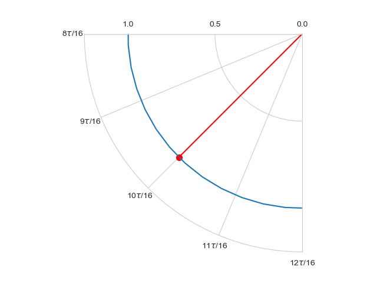

Therefore the plots for the 1st-3rd quadrants look like:

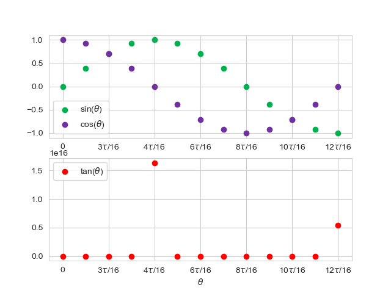

A circle is an object that has symmetry around the x-axis and y-axis.


The absolute lengths of the lines are going to be the same in the third quadrant of the circle. However the sign for the y-component is flipped:

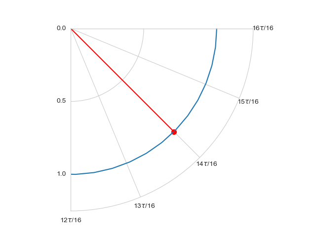

This gives the classic shape for a sine and cosine function. The tan function is discontinuous and has float precision errors. 

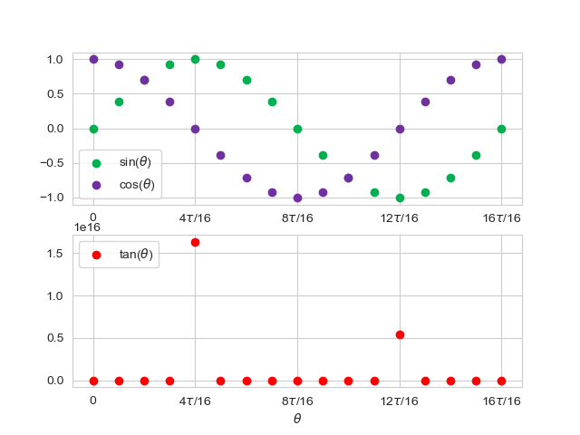

Rescaling its axes to omit very large negative and positive values gives:

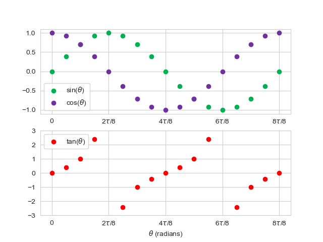

Because a circle is continuous, the waveforms repeat themselves lapping round the circle:

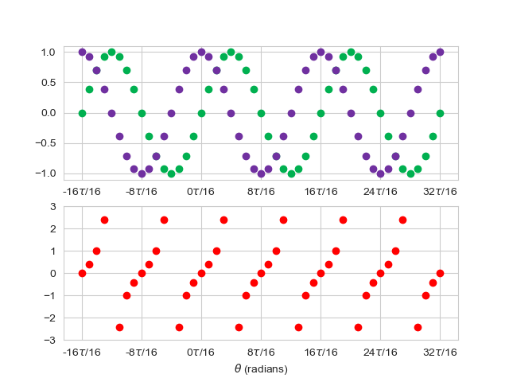

Sometimes it is more useful to look at the waveform with the origin centred:

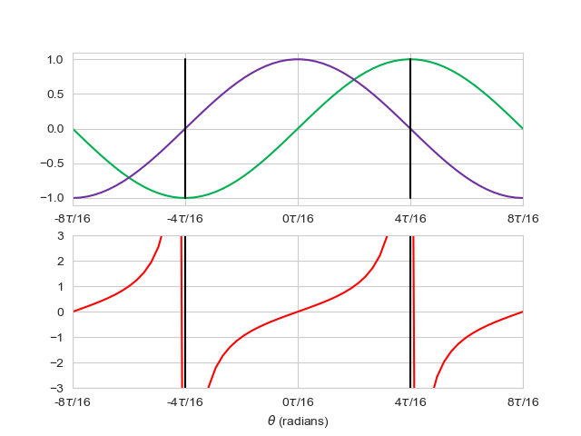

For a circle centred around the origin with a radius of 1, every point can be considered as a right angle triangle with a constant hypotenuse of 1 equal to the radius. Recall the circle equation is an application of Pythagoras equation:

$$x^2+y^2=r^2$$

In the case of $r=1$, $x=\cos{\left(\theta\right)}$ and $y=\sin{\left(\theta\right)}$, the circle equation becomes:

$${\left(\cos{\left(\theta\right)}\right)^2+\left(\sin{\left(\theta\right)}\right)}^2=1^2$$

Which simplifies down to:

$$\cos^2{(\theta)}+\sin^2{(\theta)}=1$$

The squared terms look like the following:

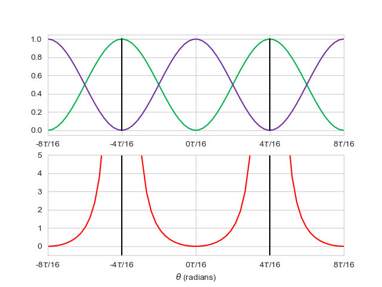

The archsine, archcosine and arctangent functions ```asin```, ```acos``` and ```atan``` are inverse functions which return $\theta$ from the length ratios. Recall:

$$
soh\ cah\ toa
$$

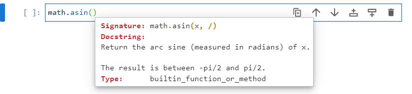

$$\theta=\text{asin}{\left(\frac{opposite}{hypotenuse}\right)}$$

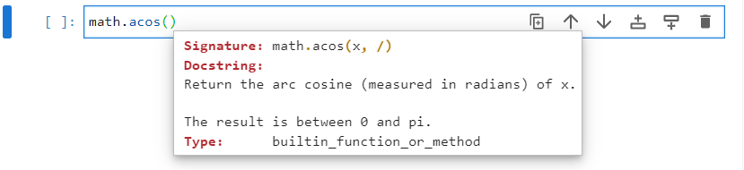

$$\theta=\text{acos}{\left(\frac{adjacent}{hypotenuse}\right)}$$

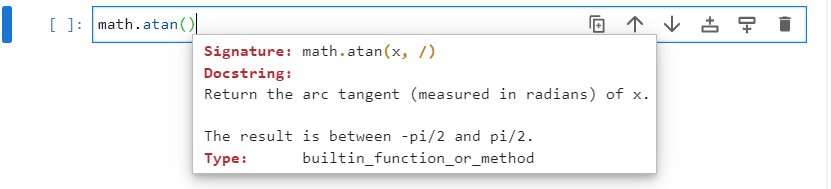

$$\theta=\text{atan}{\left(\frac{opposite}{adjacent}\right)}$$

Due to the circles symmetry there are multiple angles that could correspond to a length ratio. If the waveform is centred around the origin the inverse ```asin```, function will output $\theta$ between $-4τ/16$ and $+4τ/16$ as shown:

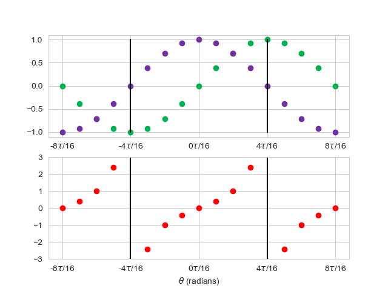

For example:

```
16 * math.asin(1) / tau
16 * math.asin(0) / tau
16 * math.asin(-1) / tau
```

The multiplication through by ```16``` and division by ```tau``` is used for convenience and is the values $-4τ/16$, $0$ and $+4τ/16$ depicted on the sin graph above respectively:

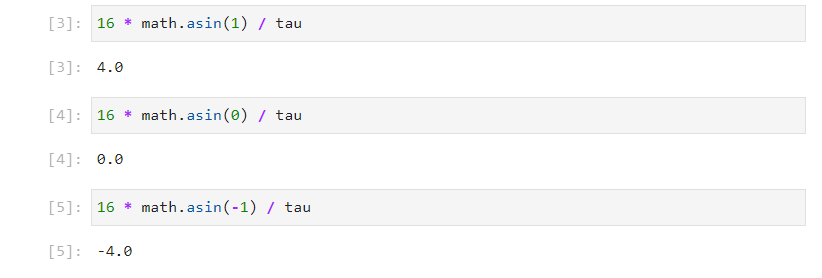

In the case of the inverse ```acos```, the waveform is centred around $+4τ/16$ recalling that $+4τ/16$ is the delay between the sine and cosine waves:

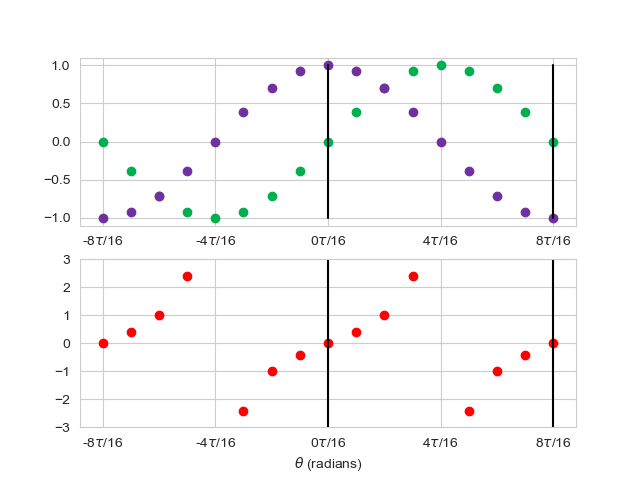

For example:

```
16 * math.acos(1) / tau
16 * math.acos(0) / tau
16 * math.acos(-1) / tau
```


Notice that in the range where the ```asin``` function operates, the ```sin``` function increases. Whereas in the range where the ```acos``` function operates, the ```cos``` function decreases.

The ```atan``` function operates over the same range as the ```asin``` function.


For example:

```
16 * math.atan(inf) / tau
16 * math.atan(0) / tau
16 * math.atan(-inf) / tau
```

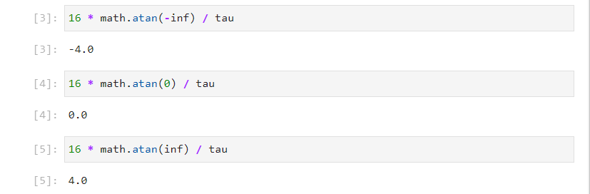

The ```atan2``` function takes in two input arguments ```y``` (the opposite) and ```x``` (the adjacent) instead of the ratio $\frac{y}{x}$

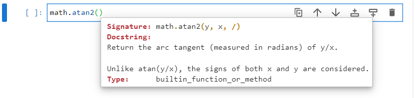

```
16 * math.atan(0) / tau
16 * math.atan(0, 1) / tau
```

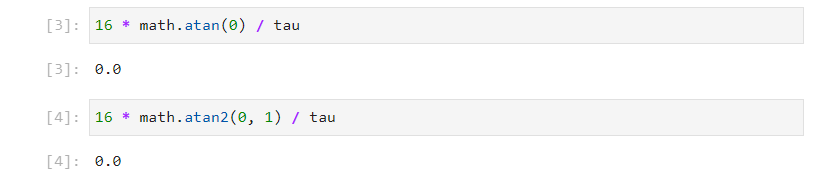

For small values of $\theta$ around the origin, $\sin{\left(\theta\right)}\approx\theta$ and there is an approximately linear relationship:

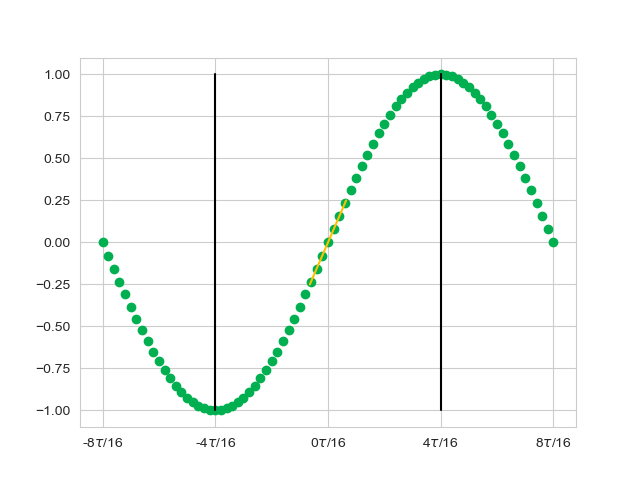

This relationship breaks down further and further away from the origin.

## Error Function

If a set of measurement values have an average value of $x=\mu$ of $0$ and a standard deviation $\sigma$ of 1 i.e. $x=\mu±\sigma$ in this case $x=0±1$. The measurements will follow the standard normal distribution which is as follows:

$$\frac{1}{\sqrt\tau}\exp{\left(-\frac{x^2}{2}\right)}$$

The $\frac{1}{\sqrt\tau}$ is a normalisation factor. Recall that $\exp{(0)}=1$, so the value at the origin will be this normalisation factor multiplied by 1. The $-x^{2}$ term in the exponential will rapidly dimish the value of $y$ as the value of $x$ becomes further and further away from the origin.

There is no inbuilt function for the normal distribution in the math module but it is easy to construct using:

```
def standard_normal(x):
    return (math.exp(-(x**2)/2))/math.sqrt(tau)
```    

The following test cases can be checked:

```
standard_normal(0)
standard_normal(1)
standard_normal(2)
standard_normal(-1)
standard_normal(-2)
```

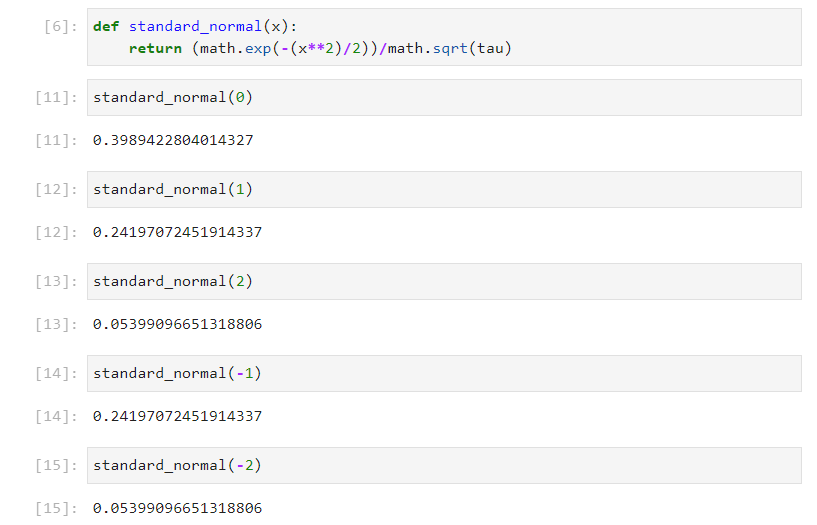

A plot of the normal distribution is as follows:

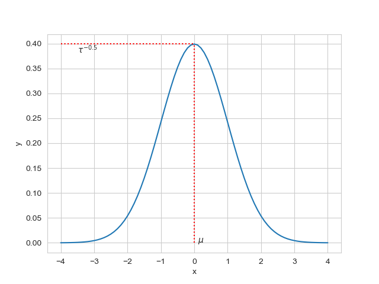

Visually the number of boxes under the graph can be counted. Each box has an x length of 1 and a y length of 0.05 giving an area of 0.05. There are approximately 20 boxes and therefore the total area is 1.00 i.e. is normalised. The area under the curve of a normal distribution and the probability of all outcomes should be certain and therefore sum up to 1.00.

The normal distribution is commonly plotted with the x-axis shown in units of standard deviations. Each standard deviation is $\frac{1}{\sqrt2}$ in terms of x-units.

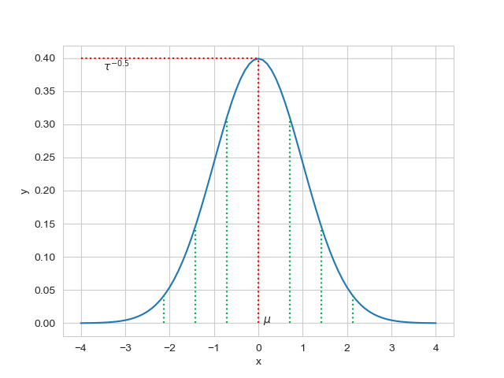

The 1st, 2nd and 3rd standard deviation are shown. 

A measurement value of $x$ choosen at random has a 0.6827 chance of lying within 1 standard deviations. Pictorally this can be seen as the 1st green line past the origin encloses about 6.5 boxes. The negative bound encloses about 6.5 other boxes. Recall there were 20 boxes in total and 13/20 is 0.65.

A measurement value of $x$ choosen at random has a 0.9545 chance of lying within 2 standard deviations. Pictorally this can be seen as the 2nd green line past the origin encloses about 3 boxes. The negative bound encloses about 3 other boxes. Recall the first bound enclosed about 13 boxes and 19/20 is 0.95.

A measurement value of $x$ choosen at random has a 0.9973 chance of lying within 3 standard deviations. Pictorally this can be seen as the 3nd green line past the origin encloses just under 0.5 of a box. The negative bound also encloses just under 0.5 of a box. This gives just under 20/20 which is just under 1.00 and there is a small fraction of area under the curve visibly outside the third standard deviation.

The error function has the formula:

$$ \frac{2}{\sqrt{\frac{\tau}{2}}}\int_{0}^{x}{e^{-\theta^2}d\theta} $$

This may initially look complicated but it is a formula that is essentially finding the area under the curve of the normal distribution aboven using integration. The formula takes in $x$ as an input argument and returns twice the area under the curve between $x$ and $0$ (which accounts for the positive and negative bound).

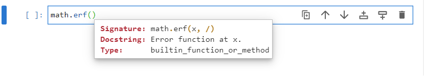

The error function can be evaluated at 1, 2 and 3 standard deviations using:
```
math.erf(1/2**0.5)
math.erf(2/2**0.5)
math.erf(3/2**0.5)
```

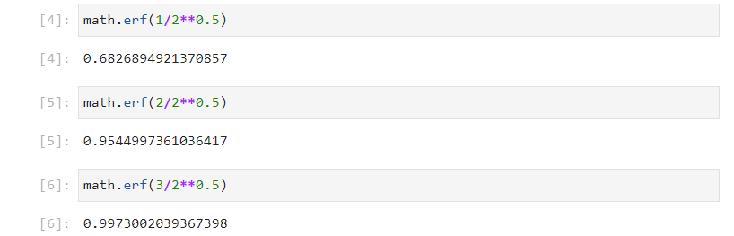

Visually it is worthwhile plottng out the error function with respect to the normal distribution:

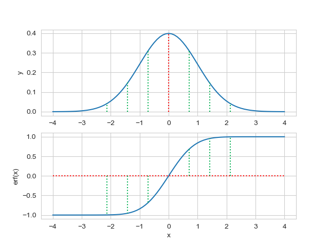

Notice the y axis for $\text{erf}{(x)}$ is a probability. 

In the normal distribution plotted above, probability was $xy$ i.e. an area.

There is a complementary error function:

$$1-\frac{2}{\sqrt{\frac{\tau}{2}}}\int_{0}^{x}{e^{-\theta^2}d\theta}$$

This complementary error function ```erfc``` is normally used with positive values of $x$ and is essentially ```1 - erf``` which is the probability a value is a given value or higher.

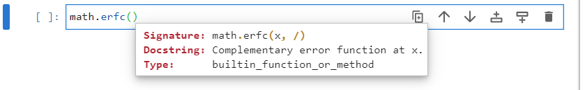

```
1 - math.erf(1/2**0.5)
math.erfc(1/2**0.5)
1 - math.erf(2/2**0.5)
math.erfc(2/2**0.5)
1 - math.erf(3/2**0.5)
math.erfc(3/2**0.5)
```

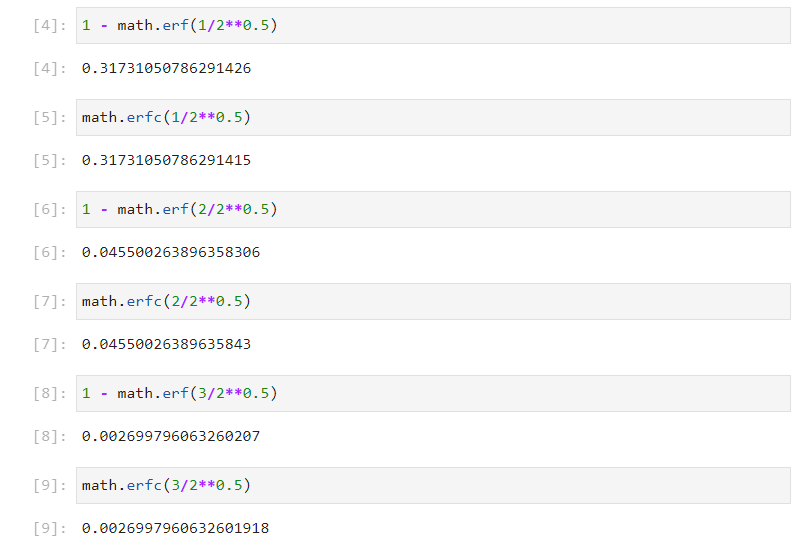

## Parabolic Equations

The sine, cosine and tangent functions modelled the unit circle equation:

$$x^2+y^2=1$$


The unit parabola equation is similar to the unit circle equation:

$$x^2-y^2=1$$

Values on a parabola approach asymptotes at very large absolute values of x and y and strongly deviates from the asymptotes at the origin. For the parabola equation $\tau/8$ and $-\tau/8$ are the asymptotes.

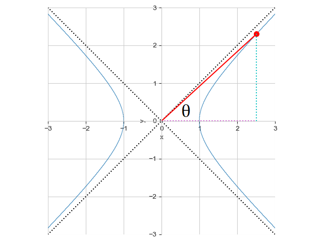

Because the equation above uses squared x and squared y terms, there is symmetry along the x and y axis and four solutions. Usually only the quadrant with positive $x$ and $y$ is considered:

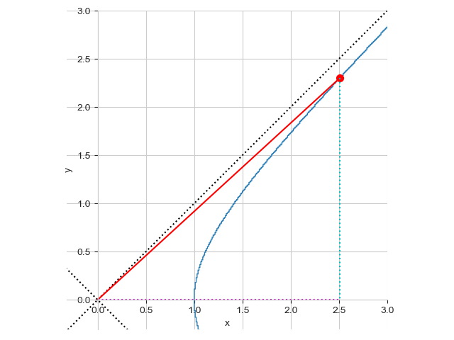

The hyperbolic sine, hyperbolic cosine and hyperbolic tangent functions ```sinh```, ```cosh``` and ```tanh``` are the hyperbolic counterparts to the circular functions ```sin```, ```cos``` and ```tan```. Only focusing on the parabola on the right and the top half of this parabola. A right angle triangle can be constructed, however unlike the case of the circle, the magnitude of the hypotenuse will increase as the magnitude of the angle increases. This can be seen visually as the angle increases:

For $\theta=\tau/16$:

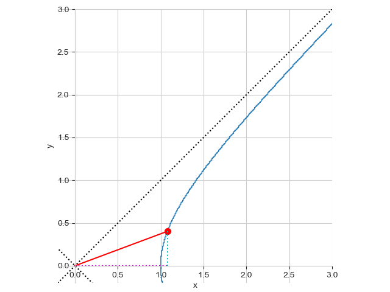

For $\theta=2\tau/16$:

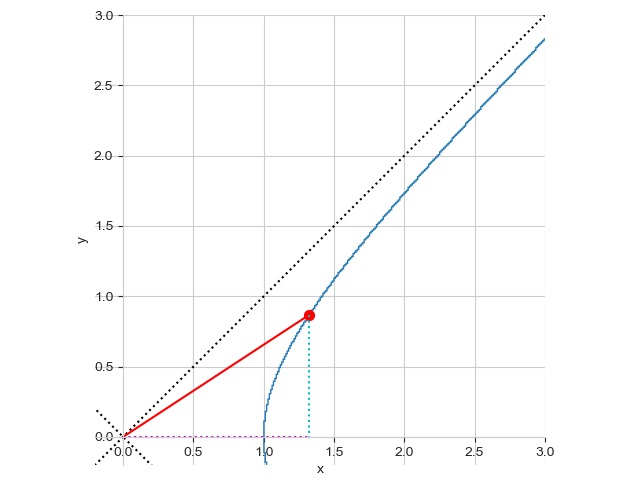

For $\theta=3\tau/16$:

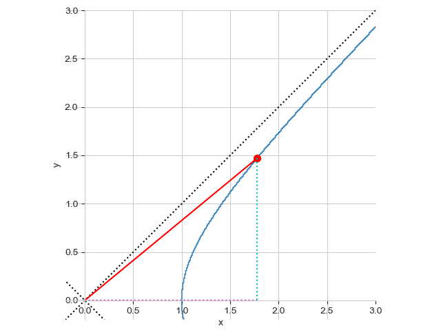

For $\theta=4\tau/16$:

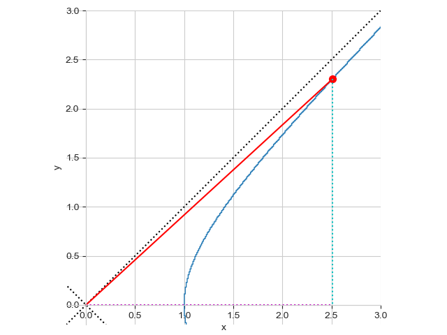

Since this is a unit parabola. The hyperbolic cosine can be used to calculate the length of the adjacent length, i.e. the value of the x co-ordinate and the hyperbolic sine can be used to calculate the length of the opposite length, i.e. the value of the y co-ordinate. 

```
math.cosh(4*tau/16)
math.sinh(4*tau/16)
math.tanh(4*tau/16)
math.cosh(4*tau/16) / math.sinh(4*tau/16)
```

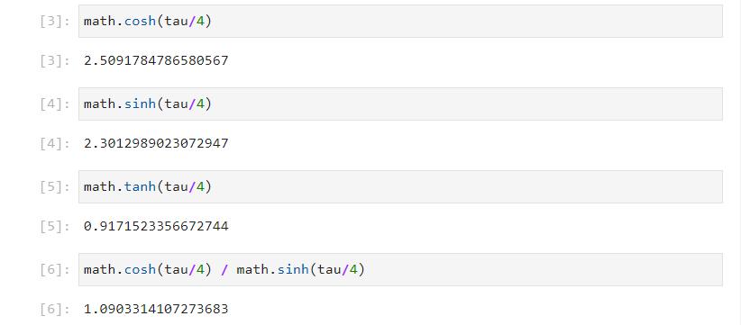

The inverse functions ```acosh``` and ```asinh``` return the angle from the length of x and the length of y respectively. The multiplication through by ```16``` and division by ```tau``` is used for convenience, giving the correct angle $+4τ/16$ as expected:

```
16 * math.acosh(2.5091784786580567) / tau
16 * math.asinh(2.3012989023072947) / tau
16 * math.atanh(2.3012989023072947/2.5091784786580567) / tau
```

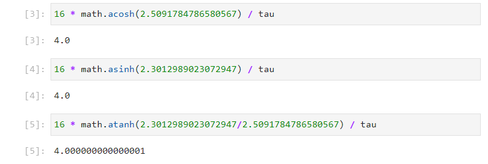

The ```cosh``` and ```sinh``` equations are  related to the exponential which previously some intuition was built up upon:

$$\cosh{\left(\theta\right)}=\frac{e^{\theta}+e^{-\theta}}{2}$$

$$\sinh{\left(\theta\right)}=\frac{e^{\theta}-e^{-{\theta}}}{2}$$

At an $\theta$ value of 0:

$$\cosh⁡{(θ)}=(e^{0}+e^{-0})/2=(1+1)/2=1$$

$$\sinh⁡{(θ)}=(e^{0}-e^{-0})/2=(1-1)/2=0$$

This gives the co-ordinate $x=1, y=0$ as expected.

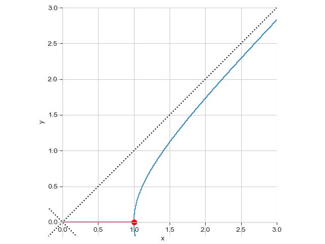

For larger values it is insightful to plot out the positive exponential and negative exponential components. At larger values the positive exponent dominates:

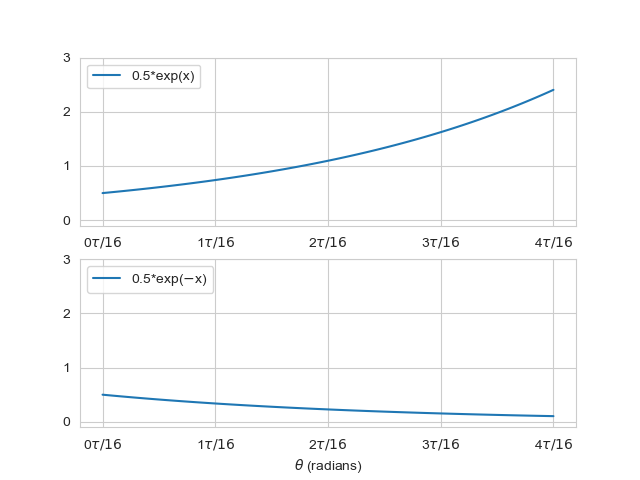

The ```cosh``` and ```sinh``` look as follows:

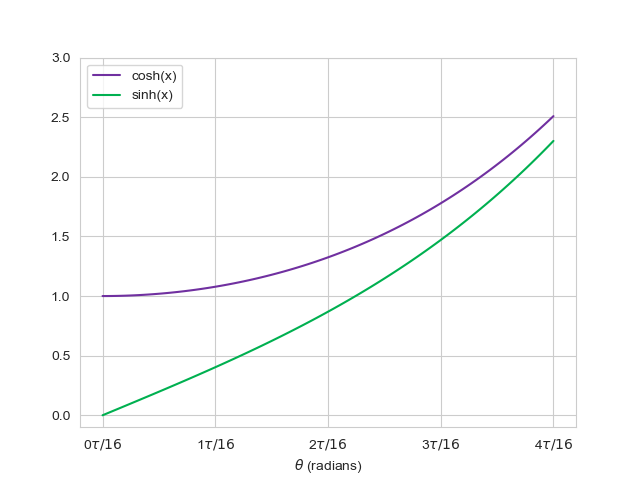

The sum of both of these terms is equal to the exponential function itself:

$$\cosh{\left(\theta\right)}+\sinh{\left(\theta\right)}=\frac{e^\theta+e^{-\theta}}{2}+\frac{e^\theta-e^{-\theta}}{2}=\frac{2e^\theta}{2}=e^\theta$$

The unit parabola equation was seen to be:

$$x^2-y^2=1$$

And since $x=\cosh{(\theta)}$ and $y=\sinh{(\theta)}$ the unit parabola equation can be rewritten as:

$$\cosh^2{(\theta)}-\sinh^2{(\theta)}=1$$

The offset of 1 can be seen when these squared functions are plotted:

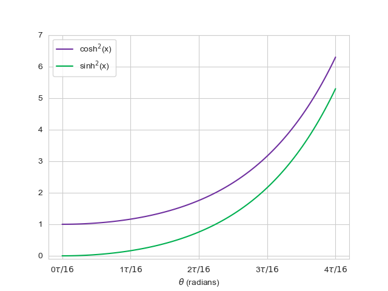

## Complex Numbers

The square root of a negative number is indeterminate using standard real numbers: 

```
(-1) ** 0.5
```


The symbol of this indeterminate is ```j```. And the definition of ```j``` such that:

```
1j * 1j
```

is ```-1```.


In physics and mathematics, the indeterminate is denoted with the symbol ```i``` and is known as an imaginary component. In electrical engineering, the symbol ```i``` is used to denote current and therefore the symbol ```j``` is used. Python follows the same syntax as electrical engineering.

A number with a real and imaginary component can be created using:

```
cnum = 3 + 2j
```


A complex can be visualised on an xy grid with ```x``` representing the real axis and ```y``` representing the imaginary axis:

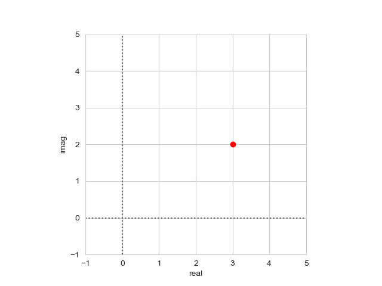

The complex number has a ```real``` and ```imag``` attribute which can be visualised as the magnitude of the the x and y components on the axes above:


```
cnum.real
cnum.imag
```

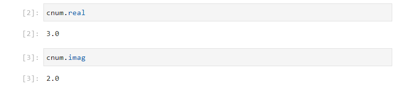

Addition of two complex numbers involves addition of the real components along the real axis and addition of the imaginary components along the imaginary axis, using similar mathematics to vectors.

```
cnum1 = 3 + 2j
cnum2 = 4 + 1j
cnum1 + cnum2
```

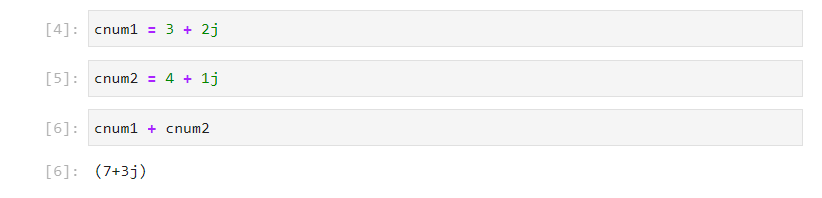

The blue indicates the components of ```cnum1``` and the orange indicates the components of ```cnum2```. The resultant complex number brought about by their addition is indicated by the red point. Similar arithmetic is carried out for subtraction:

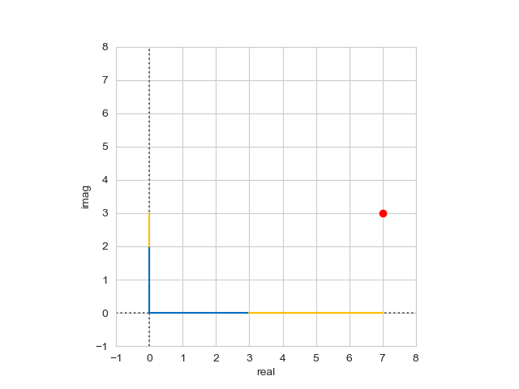

For multiplication of two complex numbers, $j$ should be treated as an algebraic variable and the brackets should be multiplied out:

$$\left(3+2j\right)\ast\left(4+1j\right)$$

This will give a real term, an imaginary term with $j$ and an imaginary square term $j**2$:

$$3\ast4+3\ast1j+2j\ast4+2j\ast1j$$

$$12+3j+8j+2(j\ast\ast2)$$

Since the definition of $j**2=-1$ this becomes:

$$12+11j+2(-1)$$

Which finally becomes the complex number:

$$10+11j$$

This can be done easily in Python using the ```*``` operator:

```
cnum * cnum2
```

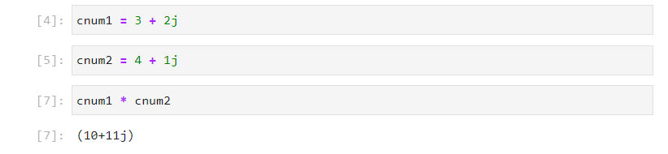

There is a special number that can be multiplied with the complex number to obtain only a real component. This number is known as the complex conjugate:


The real component of the complex conjugate is unchanged and the magnitude of the complex component is unchanged however the sign of the imaginary component is changed.

The complex number can be multiplied by its complex conjugate:

$$\left(3+2j\right)\ast\left(3-2j\right)$$

The imaginary components cancel out:

$$3\ast3+2j\ast3-2j\ast3-4(j\ast\ast2)$$

This leaves only the real component:

$$9-4(-1)$$

$$9+4$$

$$13$$

This can be done in Python using:

```
cnum1 * cnum1.conjugate()
```


A complex number $z$ can be considered tohave the general form:

$$z=x+iy$$

If ```x``` is ```1/(2 ** 0.5)``` and ```y``` is ```1/(2 ** 0.5)``` then the complex number can also be represented as a point on the circle.

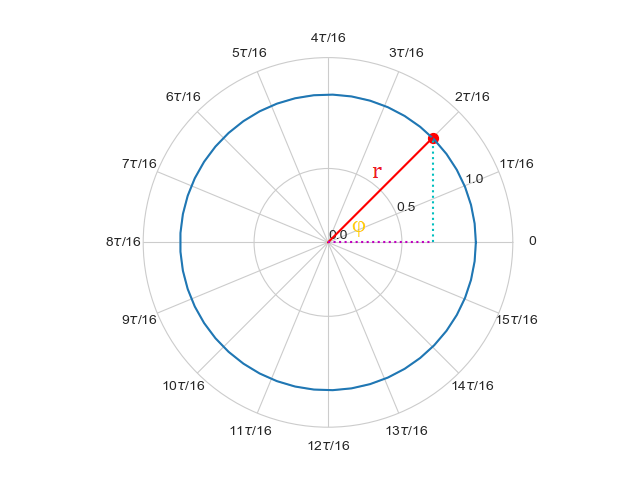

$r$ is the radius of the circle or more generally the magnitude of the complex number illustrated as a vector. $\varphi$ is the angle the vector makes with the origin. Recall from earlier that:

$$x=r\cos{\left(\varphi\right)}$$

$$y=r\sin(\varphi)$$

Therefore:

$$z=r(\sin{\left(\varphi\right)}+j\cos(\varphi))$$

A complex number times its complex conjugate should square the magnitude of the complex number leaving only a real component:

$$r\left(\sin{\left(\varphi\right)}+j\cos{\left(\varphi\right)}\right)\ast r\left(\sin{\left(\varphi\right)}-j\cos{\left(\varphi\right)}\right)$$

$$r^2(\sin{\left(\varphi\right)}\ast-j\cos{\left(\varphi\right)}+\sin{\left(\varphi\right)j\cos{\left(\varphi\right)}}-j\cos{\left(\varphi\right)\sin{\left(\varphi\right)}}+j\cos{\left(\varphi\right)\ast-j\cos{\left(\varphi\right)}})$$


$$r^2(\sin{\left(\varphi\right)}\ast\sin{\left(\varphi\right)}+\sin{\left(\varphi\right)}\ast-j\cos{\left(\varphi\right)}+j\cos{\left(\varphi\right)}\ast\sin{\left(\varphi\right)}+j\cos{\left(\varphi\right)\ast-j\cos{\left(\varphi\right)}})$$

$$r^2(\sin^2{\left(\varphi\right)-j^2\cos^2{(\varphi))}}$$

$$r^2(\sin^2{\left(\varphi\right)+\cos^2{(\varphi))}}$$

$$r^2$$

This condition is also satisfied with a complex exponential:

$$r\exp{\left(j\varphi\right)}*r\exp{\left(-j\varphi\right)}$$

$$r^2\exp{\left(j\varphi-j\varphi\right)}$$

$$r^2\exp{\left(0\right)}$$

$$r^2$$

Eulers formula equates:

$$\exp{\left(j\varphi\right)}=\sin(\varphi)+j\cos(\varphi)$$

Therefore:

$$z=r\exp(j\varphi)$$

The complex math module ```cmath``` can be imported using:

```
import cmath
```

```cmath``` has a list of very similar identifiers to ```math``` giving a complex equivalent to the identifiers used in ```math```. 


There are two more constants for not a complex number ```nanj``` and for an infinite complex number ```infj```:

```
cmath.nanj
cmath.infj
```

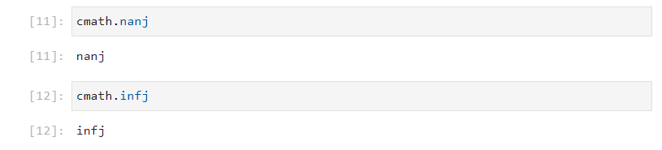

Returning to the number:

```
cnum = 1/(2**0.5) + (1/(2**0.5))*1j
cnum
```

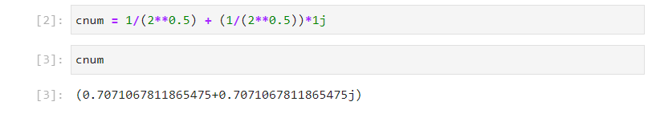

Which is represented in the diagram below:


The phase $\varphi$ can be obtained using the cmath function ```phase``` which takes in a complex number in rectangular co-ordinates as an input argument:

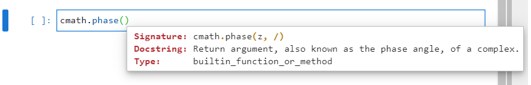

The phase $\varphi$ in radians is:

```
cmath.phase(cnum)
```

Or in units of $\frac{\tau}{16}$ is:

```
16*cmath.phase(cnum)/tau
```

which gives ```2.0``` and matches the diagram as expected:

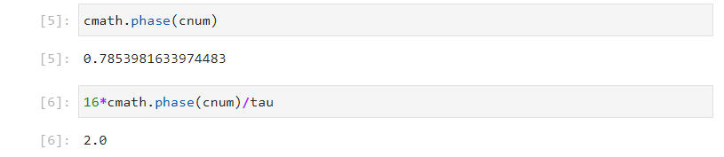

The function polar will convert an angle from rectangular co-ordinates (real $x$, imag $y$) to polar co-ordinates ($r$ $\varphi$):

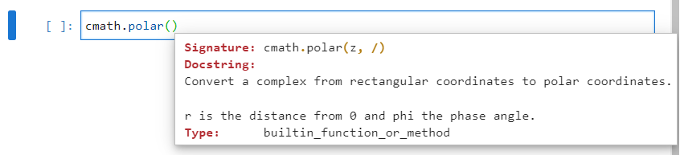

```
cmath.polar(cnum)
```


This means the complex number can be represented as:

$$z=r\exp(j\varphi)$$

In this case:

$$z=r\exp\left(j\frac{\tau}{16}\right)$$

And the function ```rect``` can be used to convert a complex number from polar co-ordinates ($r$ $\varphi$) to rectangular co-ordinates (real $x$, imag $y$):

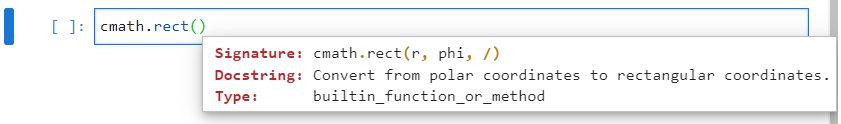

The complex number in polar co-ordinates can be converted back to rectangular units using:

```
cmath.rect(1, 2*tau/16)
```


Which is of the form: 

$$r=x+jy$$

In this case:

$$r=\frac{1}{\sqrt2}+j\frac{1}{\sqrt2}$$

[Home Python Tutorials](https://github.com/PhilipYip1988/python-tutorials/blob/main/readme.md)
