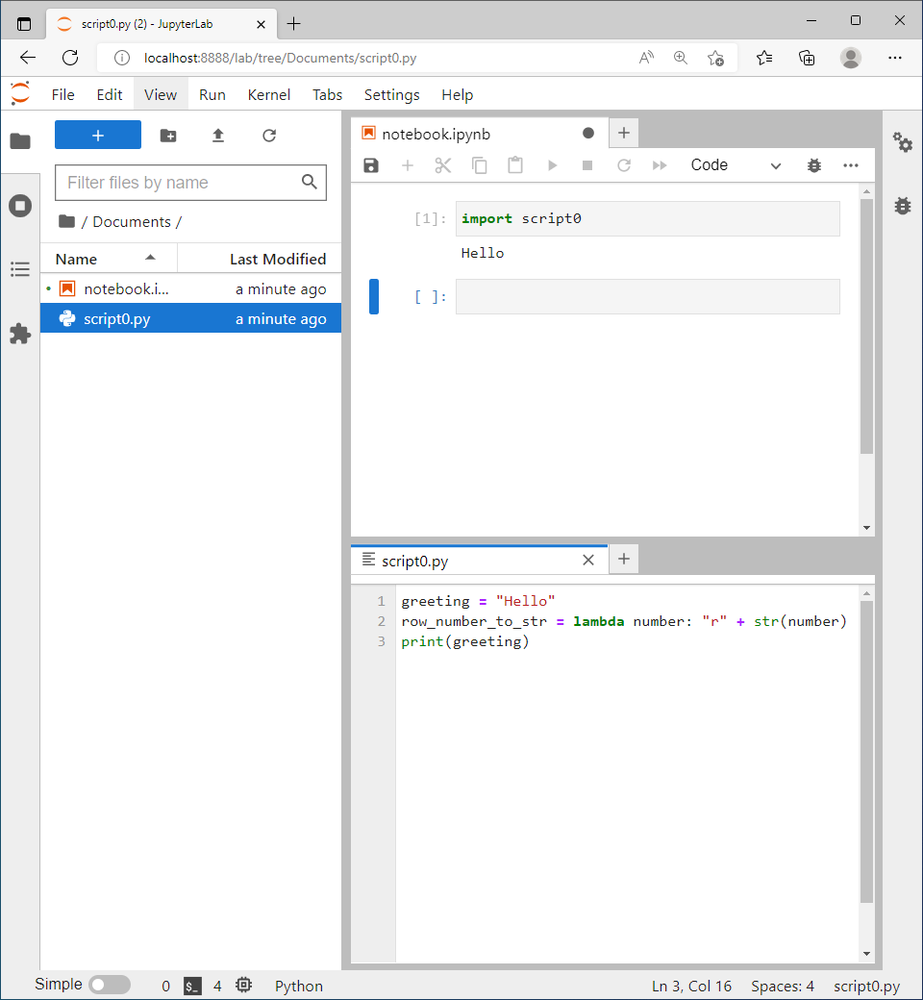

# Working with Custom Modules

## Script File

A python script file called ```script0.py``` will be created in the same folder otherwise known as directory as the interactive notebook file. For simplicity this script file will contain two lines of code to create a variable and a function:

```
greeting = "Hello"
row_number_to_str = lambda number: "r" + str(number)
```


### import

The ```import``` command can be used to import the script. The import command is followed by the name of the script which acts as an input argument in this context:

```
import script0
```

Note when the import command is used, there is no ```.py``` file extension provided for the input script.



The file extension is dropped because the dot ```.``` is used in Python to indicate that an object is contained within another object. Think of the syntax ```container.item``` as taking an ```item``` out of a ```container```. If ```script0.``` is typed followed by tab ```↹```:


then a list of all the objects contained within ```script0``` display. The variable and function contained in ```script0``` can be used by inputting:

```
script0.greeting
script0.row_number_to_str(100)
```


### import as alias

If a script file is widely used, throughout an interactive notebook, it can be useful to import the script file as an alias. Typically the alias is a shorter name than the name of the script file. For example the alias ```s0``` can be used:

```
import script0 as s0
```


If ```s0.``` is typed followed by tab ```↹```, a list of all the objects contained within ```s0``` display. The variable and function can be used by inputting:

```
script0.greeting
script0.row_number_to_str(100)
```


### from Script File import object

Alternatively an individual object can be directly imported from the script. Inputting:

```
from script0 import
```

followed by a tab ```↹``` reveals a list of all the objects that can be imported from ```script0```:


For example the object ```greeting``` can be imported using:

```
from script0 import greeting
```

This object is now directly in the namespace of the interactive notebook and can therefore be referenced directly:

```
greeting
```


Multiple objects can be imported at once using a comma ```,``` as a delimiter:

```
from script0 import greeting, row_number_to_str
```

These can be referenced or called directly:

```
greeting
row_number_to_str(100)
```


It is possible to import all objects using a ```*```, although this practice is generally frowned upon as it makes it harder to diagnose where an object name came from when reading through the notebook.

```
from script0 import *
```

## Library (Directory)

A collection of script files can be placed together in a folder (also known as a directory). A directory called ```directory``` will be created in the same parent folder as the interactive notebook:


Within this directory an **init**ialisation script file will be created with the file name ```__init__.py```. i.e. ```init``` is enclosed in a set of double underscores:


Once again the code in this script file will be relatively simple:

```
farewell = "Goodbye" 
col_number_to_str = lambda number: "c" + str(number)
```

When the folder is imported, this initialisation script file ```__init__.py``` will be imported:

```
import directory
```


The contents can viewed by inputting the director name followed by a dot ```.``` and tab ```↹```:


Objects are referenced in an identical manner to an individual script file outside a directory:

```
directory.farewell
directory.col_number_to_str(200)
```


## Module (Script File)

Additional Python script files can be placed in the directory. Each individual script file in the directory is known as a Python ```module``` and the directory containing all the script files is known as a ```library```. A module can be accessed from the folder using the syntax ```library.module```.


In this case, an example ```module``` is called ```mod.py``` and has the basic contents:

```
saying = "Hi"
cr_number_to_str = lambda number: "cr" + str(number)
```

If ```import directory.``` is input, followed by a tab ```↹```, the list of objects that can be referenced from the directory called ```directory``` will display:


The module can be imported as:

```
import directory.mod as m1
```

Now if ```m1.``` is input, followed by a tab ```↹```, the list of objects that can be referenced from the module called ```mod``` with alias ```m1``` will display:


These objects can be used with:

```
m1.saying
m1.cr_number_to_str(300)
```


## Module (Directory)

It is also possible in some cases, to create a module as a subdirectory (subfolder). In this example, a subdirectory (subfolder) called ```mod2``` is created:


Within this subdirectory (subfolder) another initialisation ```__init__.py``` script file is created and has the basic contents:

```
word = "Python"
x_number_to_str = lambda number: "x" + str(number)
```

This initialisation script file will once again be referenced when this subdirectory (subfolder) is imported:


The subdirectory (subfolder) is also a module and can be imported using the same syntax as before:

```
import directory.mod2 as m2
```

Now if ```m2.``` is input, followed by a tab ```↹```, the list of objects that can be referenced from the module called ```mod``` with alias ```m2``` will display:


These objects can be used with:

```
m2.word
m1.x_number_to_str(500)
```


Return to:
[Home](../../../)
