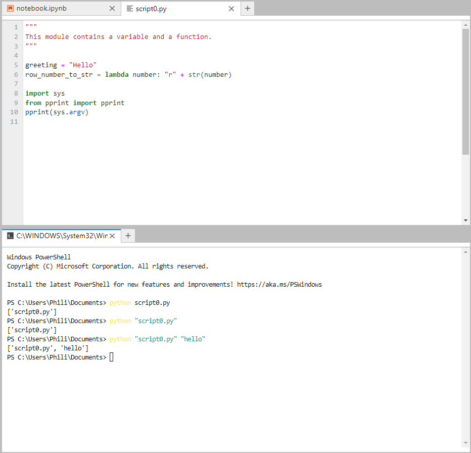

# Working with Custom Modules

The previous tutorials have looked at working with inbuilt datatypes such as the string, integer, boolean, floating point number, list, tuple, set and dictionary. These are all inbuilt datatypes found in the builtins module which is imported by default for every interactive Python ntoebook or Python Script file. 

Outwith the general purpose builtins module, Python is compartmentalised into other modules. These modules are used to group variables and functions together that are tailored for a specific application area. 

This guide will look at creating simple custom modules and importing objects from these modules, giving the perquisites required for using Pythons inbuilt modules, in addition to third-party datascience modules or libraries.

## The Python Script File (.py Extension)

A python script file called ```script0.py``` will be created in the same folder otherwise known as directory as the interactive notebook file. For simplicity this script file will contain two lines of code to create a variable and a function using a lambda expression:

```
greeting = "Hello"
row_number_to_str = lambda number: "r" + str(number)
print(greeting)
```


## import

The ```import``` statement can be used to import the script. The import statement is followed by the name of the script:

```
import script0
```

Notice that when the import statement is used, there is no ```.py``` file extension provided for the input script.


Notice also when the ```script0``` is imported, the code within ```script0``` is executed. The variable ```greeting``` and the function ```row_number_to_str``` are defined within the namespace of the module and the print statement is executed which is why ```hello``` is shown in the cell output.

The file extension is dropped because the dot ```.``` is used in Python to indicate that an object is contained within another object. Think of the syntax ```container.item``` as taking an ```item``` out of a ```container```. If ```script0.``` is typed followed by tab ```↹```:


then a list of all the identifiers contained within ```script0``` display. The variable and function contained in ```script0``` can be used by inputting:

```
script0.greeting
script0.row_number_to_str(100)
```


## import as alias

If a script file is widely used, throughout an interactive notebook, it can be useful to import the script file as an alias. Typically the alias is a shorter name than the original name of the script file. For example the alias ```s0``` can be used:

```
import script0 as s0
```


If ```s0.``` is typed followed by tab ```↹```, a list of all the identifiers contained within ```s0``` display. The variable and function can be used by inputting:

```
script0.greeting
script0.row_number_to_str(100)
```


## from Script File import object

Alternatively an individual object can be directly imported from the script file. Inputting:

```
from script0 import
```

followed by a tab ```↹``` reveals a list of all the objects that can be imported from ```script0```:


For example the object ```greeting``` can be imported using the statement:

```
from script0 import greeting
```

This object is now directly in the namespace of the interactive notebook and can therefore be referenced directly:

```
greeting
```


Multiple objects can be imported at once using a comma ```,``` as a delimiter:

```
from script0 import greeting, row_number_to_str
```

These can be referenced or called directly:

```
greeting
row_number_to_str(100)
```


It is possible to import all objects using a ```*```, although this practice is generally frowned upon as it makes it harder to diagnose where an object name came from when reading through the notebook especially if all objects are impored from multiple modules.

```
from script0 import *
```

## A Python Library

A Python Library is a folder otherwise known as a directory which usually contains multiple Python script files. A directory called ```directory``` will be created in the same parent folder as the interactive notebook:


Within this directory a datamodel script file should be created with the file name ```__init__.py```. This datamodel script file is the intialization script file and is the script file that is executed when a directory is imported.


Once again the code in this script file will be relatively simple:

```
farewell = "Goodbye" 
col_number_to_str = lambda number: "c" + str(number)
```

When the directory is imported, this datamodel initialization script file ```__init__.py``` is imported:

```
import directory
```


The contents can viewed by inputting the directory name followed by a dot ```.``` and tab ```↹```:


Objects are referenced in an identical manner to an individual script file outside a directory:

```
directory.farewell
directory.col_number_to_str(200)
```


## Module 

Additional Python script files can be placed in the directory. Each individual script file in the directory is known as a Python ```module``` and the directory containing all the script files is known as a ```library```. A module can be accessed from the folder using the syntax ```library.module```.


In this case, an example ```module``` is called ```mod.py``` and has the basic contents:

```
saying = "Hi"
cr_number_to_str = lambda number: "cr" + str(number)
```

If ```import directory.``` is input, followed by a tab ```↹```, the list of objects that can be referenced from the directory called ```directory``` will display:


The module can be imported as:

```
import directory.mod as m1
```

Now if ```m1.``` is input, followed by a tab ```↹```, the list of objects that can be referenced from the module called ```mod``` with alias ```m1``` will display:


These objects can be used with:

```
m1.saying
m1.cr_number_to_str(300)
```


## Module (subdirectory)

A subdirectory (subfolder) called ```mod2``` can be created:


Within this subdirectory (subfolder) another datamodel initialisation ```__init__.py``` script file is created with the basic contents: 

```
word = "Python"
x_number_to_str = lambda number: "x" + str(number)
```


 the ```.``` syntax is also used to get to a subdirectory. This subdirectory is imported using:

```
import directory.mod2 as m2
```

When this subfolder is imported, the ```__init__.py``` datamodel initialiation script file found within this subdirectory is executed.

Now if ```m2.``` is input, followed by a tab ```↹```, the list of objects that can be referenced from the module called ```mod2``` with alias ```m2``` will display:


These objects can be used with:

```
m2.word
m2.x_number_to_str(500)
```


## Datamodel Attributes

Returning to the original ```script0.py```:

```
greeting = "Hello"
row_number_to_str = lambda number: "r" + str(number)
```

The inbuilt function ```dir``` which is an abbreviation for directory can be used to view the directory of the module:


In this list, the variable ```greeting``` and the function ```row_number_to_str``` display. In addition to the above a number of datamodel attributes display.

The ```__name__``` datamodel attribute will return the name of the module in the form of a string.

```
import script0
script0.__name__
```

In this example the string ```"script0"```:


which is the name of the module. The name does not change if the module is imported using an alias:

```
import script0 as s0
s0.__name__
```


The datamodel attribute ```__name__``` can also be accessed as a variable within the Python script file.

```
greeting = "Hello"
row_number_to_str = lambda number: "r" + str(number)

print(__name__)
```


Notice that when the module is imported, the code in the module is executed so the print statement displays the ```__name___``` of the script file. In this example the ```__name__``` is the name of the script file ```"script0"```.

When a Python script file is ran directly in Python, for example using the terminal the ```__name__``` of the main script file is instead assigned to ```"__main__"```:


This can be used to check if the script file is the main script file being executed using if, else code blocks:

```
if __name__ == "__main__":
    print("I am the main module")
else:
    print("I am not the main module")
```    

The if code block is carried out when the script file is the main module:


The else code block is carried out when the script file is not the main module:


This convention is quite commonly used when interacting with hardware that uses multiple components. Each component has its own script file with code for controlling that component and code to run that components hardware diagnostics. The diagnostics are not run by default when ```__name__``` is not equal to ```___main__``` and the script file is imported in a larger program. However if a user runs the particular components script file directly, the ```__name__``` becomes ```__main__``` and the associated hardware diagnostics are run.

The ```__file__``` datamodel attribute gives the physical location of the file:

```
import script0
script0.__file__
```


The ```__doc__``` datamodel attribute gives the docstring of the module:

```
import script0
script0.__doc__
```


In this example, the module has no docstring, so the output of the cell is None. A docstring can be added by providing a multiple line string at the top of the module.

```
"""
This module contains a variable and a function.
"""

greeting = "Hello"
row_number_to_str = lambda number: "r" + str(number)
```

Notice the docstring now displays with the datamodel attribute ```__doc__``` or by using ```?```

```
import script0
script0.__doc__
? script0
```


The datamodel attribute ```__doc__``` can also be accessed as a variable within the script file:

```
"""
This module contains a variable and a function.
"""

greeting = "Hello"
row_number_to_str = lambda number: "r" + str(number)

print(__doc__)
```


The datamodel attribute ```__package__``` displays the name of the package for a package with multiple modules. This can be examined by looking at the module ```mod``` from the package ```directory```:

```
import directory.mod as mod
mod.__package__
```


The datamodel initialisation script file ```__init__.py``` within the folder directory can be modified to include a docstring and the datamodel attributes can be accessed as variables within the script file and printed using formatted strings:

```
"""
This module contains a variable and a function.
"""

farewell = "Goodbye" 
col_number_to_str = lambda number: "c" + str(number)

print(f"name: {__name__}")
print(f"file: {__file__}")
print(f"package: {__package__}")
print(f"doc: {__doc__}")
print(f"loader: {__loader__}")
print(f"spec: {__spec__}")
```

The ```__loader__``` datamodel attribute gives details about how the module was loaded, such as where it stored in module and the spec gives details about a module that is imported:


This is ```None``` when the module is ```"__main__"```


Python has a number of standard modules. The ```builtins``` module provides direct access to all the built-in identifiers of Python. It can be imported using:

```
import builtins
```

Inputting ```builtins.``` followed by a ```↹``` can be used to view the list of builtin-in identifiers:


These objects can be accessed explicitly from the builtins module however are usually accessed directly:

```
? builtins.str
```

```
? str
```


When a script file is ran, behind the scenes, the following command is executed, making all the inbuilt items available:

```
from builtins import *
```


The datamodel attribute ```__builtins__``` is a dictionary. This can be printed using:

```
print(__builtins__)
```


The builtin ```print``` function isn't optimised for printing the output of a dictionary. The standard module ```pprint``` an abbreviation for pretty print has a function ```pprint``` and this can be used in place of print:

```
from pprint import pprint
pprint(__builtins__)
```


An in-built identifier can be accessed by indexing into the dictionary using the name of the identifier as a key. For example the str class can be accessed using:

```
__builtins__["str"]
```

print and help can be used to print the docstring of this class as the module is executed or imported:

```
print(help(__builtins__["str"]))
```


All identifier included in a module can be accessed using the attribute ```__dict__``` which outputs a dictionary. The first entry in the dictionary is a nested dictionary with the key ```__builtins__```:

```
import directory
from pprint import pprint
pprint(directory.__dict__)
```


The other keys in the dictionary can be used to access the other datamodel attributes in addition to the user defined variables and functions:


# Python Standard Modules

The mostly used identifiers in Python are in the builtins module which has been essentially already been explored in great detail. Outwith these most commonly used objects, Python is grouped by application area into a number standard modules. Some of the most important modules are mentioned below alongside the location of their physical script file (where applicable). These script files can be opened in JupyterLab and inspected and serve as example files of high quality modules. Most of the modules will only be mentioned in brief and be covered in more detail in other guides. The ```os``` and ```sys``` module will however be mentioned here in a bit more detail as they can be used to access additional locations to run Python modules from.

## builtins

The attributes ```__name__``` and ```__doc__``` can be used with the builtins module. The attribute ```__file__``` is not available as there is no physical script file, because builtin objects are written in C++:


The directory function ```dir``` can be used to view all the inbuilt identifiers. If assigned to an object it will be stored as a list:

```
import builtins
builtin_identifiers = dir(builtins)
```


This list can be viewed and inspected using the Variable Explorer of the Spyder IDE:


To the top in Pascal Case Capitalisation are mainly error messages:


Then there are the datamodel methods which being and end with a double underscore:


Then there are the inbuilt objects, many of which have been used in the previous tutorials:


It is worthwhile examining the list of these inbuilt objects and familarising yourself with these object names. These object names should not be assigned to variables.

## keyword

Another module ```keyword``` as the name suggests lists all the Python keywords. The module can be imported using:

```
import keyword
```

Its list of identifiers can be seen by inputting ```keyword.``` followed by a tab ```↹```:


There are two instances ```kwlist``` and ```softkwlist``` which are lists of keywords and soft keywords respectively. There are also two associated functions which will return a boolean value which is ```True``` if the string provided is in the respective list or ```False``` otherwise:

```
import keyword
kw = keyword.kwlist
softkw = keyword.softkwlist
```


Once again these can be visualised in the Spyder Variable Explorer:


## pprint

The module ```pprint``` was used earlier. It can be imported and the attributes ```__name__``` and ```__file__``` can be used to access the name and file of the module.


This script file can be opened and examined. The docstring can also be output using the attribute ```__doc__```:


## math

```math``` is a module that contains mathematical functions. Once again the attribute ```__file__``` is not available as the module is written in C++.


## unicodedata

```
ord("£")
hex(ord("£"))
chr("0xa3")
```

The ```unicodedata``` module contains some supplementary functions for dealing with unicode.

```
import unicodedata
unicodedata.name("£")
unicodedata.lookup("POUND SIGN")
unicodedata.category("£")
```

```
? unicodedata
```


[Unicode Code Charts](https://www.unicode.org/Public/UCD/latest/charts/)

```
dir(unicodedata)
```

```
unicodedata.__file__
```

```
unicode.digit(1)
unicode.decimal(1)
unicode.numeric(1)
```

```
unicode.mirrored("(")
unicodedata.mirrored("→")
```

## collections

The module ```collections``` is used to supplement Python's inbuilt collections. It can be imported and the attributes ```__name__```, ```__doc__``` and ```__file__``` can be used to access the name and file of the module. The attribute ```__all__``` is also defined in the file as a list containing all the objects defined in the module:


## random

The module ```random``` is used for generation of random numbers.


## statistics

The module ```statistics``` is used for statistical functions.


## datetime

The module ```datetime``` is used to specify a date and time as well as a time difference:


## calendar

The module ```calendar``` has some additional calendar operations:


## time

The module ```time``` is used more in line with runtime. This module is written in C++ and has no file available. 


## os

The module ```os``` is used for interactions with the operating system. For example folder manipulation. 


The attribute ```environ``` is a dictionary of the Operating System Environmental Variables. The user profile can be accessed using the key ```"UserProfile"```. The ```os``` attribute ```path``` contains a collection of functions which can be used to manipulate a path, and ```join``` can be used to join a subfolder to a path:

```
user_profile = os.environ["UserProfile"]
downloads = os.path.join(user_profile, "Downloads")
```


## glob

The module ```glob``` is usually used to glob a set of file patterns within a root directory.


For example if the file pattern is ```"*.py"``` any Python Script will be selected and in this case ```*``` represents any other combination of valid characters used within a file name:

```
import os
import glob
user_profile = os.environ["UserProfile"]
documents = os.path.join(user_profile, "Documents")
glob.glob("*.py", root_dir=documents)
```


## sys

The module ```sys``` system is used for interactions with the interpretter. It is once again written in C++ and has no ```__file__``` attribute:


The attribute ```path``` is a list which includes all the locations Python will look for a module. At the top of the ```path``` is ```"C:\Users\Phili\Documents"``` which is the current working directory.


To search for modules in other locations the list method append can be used to append another location to this list. This is typically done in conjunction with the os module:


The attribute ```argv``` is a list of all the command line arguments used when running a Python script from the terminal. For example if the following is added to the script file:

```
import sys
from pprint import pprint
pprint(sys.argv)
```

And the script file is ran using the command:

```
python script0.py
```

Then the only command line argument used with the command ```python``` was ```"script0.py"``` which is available as a string.

Note the output is the same when the file is specified using a string.

```
python "script0.py"
```


If an additional string is added after the script file, there will now be two command line arguments:

```
python "script0.py" "hello"
```



If the string of the second command line argument is also a Python script file, it won't be executed. Only the first file will be executed.

```
python "script0.py" "script1.py"
```


The list ```sys.argv``` can be indexed into to get one of the command line arguments. For example ```sys.argv[1]``` will be the string ```"hello"```:


If the module is expected to be called with a specific number of input arguments a check can be placed to check if the list of input arguments is the correct length:

```
import sys

if len(sys.argv) > 1:
    print(sys.argv[1])
else:
    print("not enough command line arguments provided")
```


## csv

The module ```csv``` is used to manipulate data which is stored in a comma seperated values (csv) file:


## json

The module ```json``` is used to manipulate data which uses Javascript object notation (json):


Return to:
[Home](../../../)
