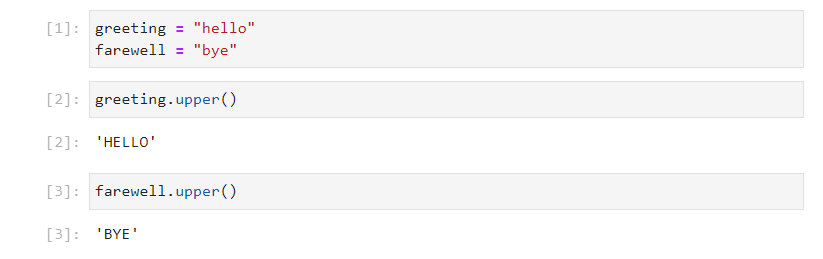
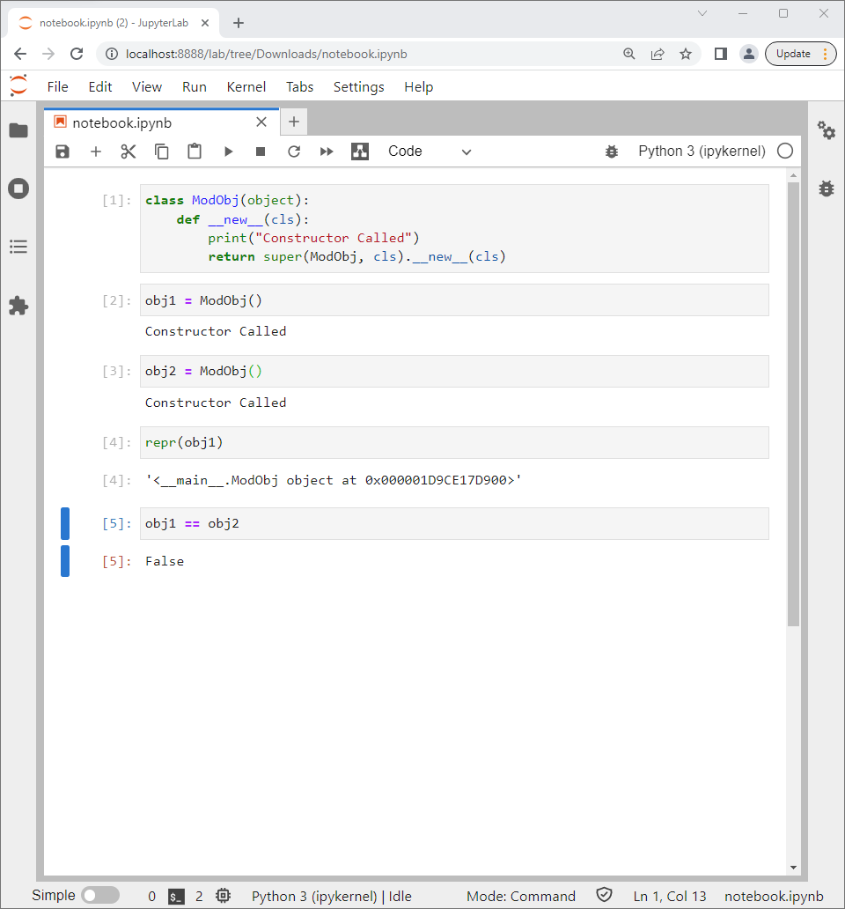

# Inbuilt Classes

A number of Python objects have previously been explored which belong to either the ```str```, ```int```, ```bool```, ```float```, ```list```, ```tuple``` and ```dict``` classes. Notice that when one of these class names is input followed by a dot ```.``` and tab ```↹```, that a list containing functions and properties displays:


Under the hood, each of these functions and properties is defined in the class. A class can be conceptualised as a blueprint which is a set of instructions to make an object and is not a physical object itself. Any instance of the class (physical object built using the blueprint) will have these associated functions and properties. For example:

```
num = 5
```


```
word = "Hello"
```


Notice that there is a subtle difference between ```int.attribute``` and ```int_instance.attribute```. In the former case ```attribute of "int" objects``` displays and the class is displaying information, like a blueprint does. In the latter case a number displays. Attributes can be conceptualised as an embedded object and an analogy to an attribute of an instance of a class is a variable in a module. Notice that identical syntax is used in both cases compare ```module.variable``` with ```int_instance.attribute```, in both cases the object being accessed is to the right hand side of the dot ```.``` and the object used as a container is to the left hand side of the ```.```:

```
int.real
int.imag

num.real
num.imag
```


A function can be referenced in an identical manner to an attribute:

```
int.conjugate
num.conjugate
```

Notice that there is a subtle difference between ```int.function``` and ```int_instance.function```. In the former case the function is called a ```method```. A ```method``` has an additional positional input argument called ```self``` which must be assigned to an instance of the object for the function to act on. In the latter case, because the function is referenced from an instance, this instance is automatically implied to be ```self```:


Functions are called using parenthesis to enclose any input arguments:

* For the method ```conjugate``` an instance ```self``` must be proved for the function to operate on. 
* For the function ```conjugate``` there are no input arguments with ```self``` being implied from the instance ```num```. 

```
int.conjugate(num)
num.conjugate()
```


There are a number of hidden functions not shown in the lists above which typically map to operators. For example the hidden function ```__add__``` which is mapped to the ```+``` operator:

```
num1 = 5
num2 = 6
num1 + num2
num1.__add__(num2)
```


```
word1 = "Hello"
word2 = "World"
word1 + word2
word1.__add__(word2)
```


Notice the different behaviour in the code above; numeric addition for the integer class versus concatenation for the string class. The difference in behaviour is due to the two functions ```int.__add__``` and ```str.__add__``` being unique. 

Conceptually each class can be thought of as a seperate module which contains a function with the same name but this function has different code in the code block and therefore carries out different behaviour:


Notice that in either case, the return value for each function is itself an instance of the same class. i.e. numeric addition of two integers results in an integer and concatenation of two strings results in a string.

The functions do not always return an instance of the same class. For example the list function ```__len__``` returns an instance of the integer class:


```
collection = [1, 2, 3, 4, 5]
collection.__len__()
```


The string function count also returns an instance of the integer class:

```
word1.count("l")
```


The string functions ```__repr__``` and ```__str__``` are two functions which define the string representations of an object. ```__repr__``` is formal and ```__str__``` is informal. Often the string is the same for both functions and as a result they are often confused. However there is a subtle difference. 

This can be demonstated using the string ```file_path```. Due to the ```\``` being used to insert escape characters and the ```\``` being an escape character inserted in the file path:

```
file_path = "C:\\Users\\Philip"
```

Notice the subtle difference between the cell output. The informal representation shows how the string would be input using escape characters:

```
file_path
```

Versus a print statement, which shows what the formal representation of what the string looks like taking into account the effect of the escape characters:

```
print(file_path)
```


The behaviour of these are controlled with ```__repr__``` and ```__str__``` respectively. If these functions are called within a print statement, the same cell output in response to the string ```file_path``` and due to a print statement of the string ```file_path``` are observed:

```
file_path.__repr__()
print(file_path.__repr__())
```

```
file_path.__str__()
print(file_path.__str__())
```


Instead of mapping to inbuilt operators, the hidden functions ```__len__```, ```__repr__``` and ```__str__``` define how the  inbuilt functions ```len```, ```repr``` and casting an object to a string using ```str``` behave.

```
len([1, 2, 3, 4, 5])
repr(file_path)
str(file_path)
```


Notice, the function ```__len__``` when called from an instance of a list requires no input arguments. However if ```__len__``` is called from the class list there is a ```TypeError``` and a warning that an input argument missing:

```
collection = [1, 2, 3, 4, 5]

collection.__len__()

list.__len__()

list.__len__(collection)
```


Recall that a function determines the behaviour of an object.

For the method ```__len__``` an instance ```self``` must be proved for the function to operate on:


For the function ```__len__``` there are no input arguments with ```self``` being implied from the instance ```num```. 


**When a function is called from a class, it is known as a ```method``` and requires an instance ```self``` to be provided as the 1st positional input argument.**

Importing modules and librarys was examined in detail in the previous tutorial. Recall, that a library is a number of Python script files in a folder. One of these script files is an initialisation script file called ```__init__.py```:




Recall when the name of the folder is imported, this ```__init__.py``` is selected:

```
import library
```


Each class also has an initialisation method ```__init__``` which typically takes in one or more input arguments and uses these alongside, a return statement to return a new instance of the class. This iniitialisation method can be thought of as a constructor function which builds a physical object from a blueprint:


The ```__init__.py``` within a library is not imported using the name of the script file but instead using the name of the library. Analogously, the ```__init__``` method is not called using the name of the method but is called using the name of the class:



An example of this is given when the integer number ```5``` is cast to a string using the ```str``` class:

```
str(5)
```


# Datamodel Methods

Python uses a number of datamodel methods which control the behaviour of inbuilt Python functions or the behaviour of inbuilt operators. Under the hood, datamodel methods define how an instance ```self``` interacts or how an instance ```self``` interacts with another instance called ```other```. These datamodel methods are sometimes known as special methods or colloquially called double underscore methods abbreviated as dunder methods.

The following datamodel methods operate on only the instance ```self```:

|method|operator or function|int|float|bool|str|list|tuple|dict|
|---|:-:|---|---|---|---|---|---|---|
|\_\_init\_\_|class name|initialisation|initialisation|initialisation|initialisation|initialisation|initialisation|initialisation|
|\_\_len\_\_|len|Not Implemented|Not Implemented|Not Implemented|length|length|length|length|
|\_\_repr\_\_|repr|formal str|formal str|formal str|formal str|formal str|formal str|formal str|
|\_\_str\_\_|str|informal str|informal str|informal str|informal str|informal str|informal str|informal str|
|\_\_dir\_\_|dir|dir|dir|dir|dir|dir|dir|dir|

The following datamodel methods require two instances ```self``` and ```other```:

|method|operator or function|int|float|bool|str|list|tuple|dict|
|---|:-:|---|---|---|---|---|---|---|
|\_\_add\_\_|+|addition|addition|addition|concatenation|concatenation|concatenation|concatenation|
|\_\_sub\_\_|-|subtraction|subtraction|subtraction|Not Implemented|Not Implemented|Not Implemented|Not Implemented|
|\_\_mul\_\_|\*|multiplication|multiplication|multiplication|Not Implemented|Not Implemented|Not Implemented|Not Implemented|
|\_\_pow\_\_|\*\*|exponentiation|exponentiation|exponentiation|Not Implemented|Not Implemented|Not Implemented|Not Implemented|
|\_\_truediv\_\_| \\ |float division|float division|float division|Not Implemented|Not Implemented|Not Implemented|Not Implemented|
|\_\_floordiv\_\_| \\\\ |floor division|floor division|floor division|Not Implemented|Not Implemented|Not Implemented|Not Implemented|
|\_\_mod\_\_|%|modulo|modulo|modulo|Not Implemented|Not Implemented|Not Implemented|Not Implemented|
|\_\_divmod\_\_|divmod|(floor division, modulo)|(floor division, modulo)|(floor division, modulo)|Not Implemented|Not Implemented|Not Implemented|Not Implemented|
|\_\_matmul\_\_|@|Not Implemented|Not Implemented|Not Implemented|Not Implemented|Not Implemented|Not Implemented|Not Implemented|
|\_\_gt\_\_|>|greater than|greater than|greater than|greater than|greater than|greater than|greater than|
|\_\_ge\_\_|>=|greater than or equal to|greater than or equal to|greater than or equal to|greater than or equal to|greater than or equal to|greater than or equal to|greater than or equal to|
|\_\_lt\_\_|<|less than|less than|less than|less than|less than|less than|less than|
|\_\_le\_\_|>=|less than or equal to|less than or equal to|less than or equal to|less than or equal to|less than or equal to|less than or equal to|less than or equal to|
|\_\_eq\_\_|==|equal to|equal to|equal to|equal to|equal to|equal to|equal to|
|\_\_ne\_\_|!=|not equal to|not equal to|not equal to|not equal to|not equal to|not equal to|not equal to|

The following datamodel methods require two instances ```self``` and ```other``` and update ```self``` inplace:

|method|operator or function|int|float|bool|str|list|tuple|dict|
|---|:-:|---|---|---|---|---|---|---|
|\_\_iadd\_\_|+=|addition|addition|addition|concatenation|concatenation|concatenation|concatenation|
|\_\_isub\_\_|-=|subtraction|subtraction|subtraction|Not Implemented|Not Implemented|Not Implemented|Not Implemented|
|\_\_imul\_\_|\*=|multiplication|multiplication|multiplication|Not Implemented|Not Implemented|Not Implemented|Not Implemented|
|\_\_ipow\_\_|\*\*=|exponentiation|exponentiation|exponentiation|Not Implemented|Not Implemented|Not Implemented|Not Implemented|
|\_\_itruediv\_\_| \\= |float division|float division|float division|Not Implemented|Not Implemented|Not Implemented|Not Implemented|
|\_\_ifloordiv\_\_| \\\\= |floor division|floor division|floor division|Not Implemented|Not Implemented|Not Implemented|Not Implemented|
|\_\_imod\_\_|%=|modulo|modulo|modulo|Not Implemented|Not Implemented|Not Implemented|Not Implemented|
|\_\_imatmul\_\_|@=|Not Implemented|Not Implemented|Not Implemented|Not Implemented|Not Implemented|Not Implemented|Not Implemented|

# Class Instance and Blueprint House Analogy

In Python each object has a class, which initially can be conceptualised as an abstract blueprint which defines how to create a new object and outlines the properties and functionality behind an object. Before looking at creating a custom class, it is useful to explore the concept of a class by using every day intuition and framing it in Python syntax.

To conceptualise this idea take for example the concept of building a house. An Architect may create a blueprint for a house called ```House```, this blueprint is an abstract object, that an end user cannot interact with. CamelCaseCapitalisation is used for third-party class names and this convention is used to clearly distinguish them from inbuilt objects. The class ```House``` will outline the features or attributes of a house such as the height of the house ```househeight```, how many rooms it possesses ```nrooms``` and the size of the bedroom ```bedroomsize```. It will also outline the functionality of the house such as the doors in the house ```frontdooropen``` or ```frontdoorclose```, the windows in the house ```frontwindowopen``` or ```frontwindowclose```, the central heating system controls ```sethousetemperature``` and the sewage controls ```flushtoilet```.

A construction company can follow the instructions in this blueprint called ```House``` to create one or multiple houses. Each house will be constructed using the same blueprint but each object created will be unique. To indicate that each house is unique, the construction company will assign each new house object, a name during construction which is known as a post code. This process is known as initialisation or instantiation, creating a new physical object or instance from the blueprint or class ```House```. In Python, the post code is known as the ```object name``` or ```instance name```, for simplicity two houses ```house000``` and ```house001``` can be made.

The end user (homeowner or tenant) will be able to uniquely interact with their own house object using the functions outlined in the blueprint House. These functions are methods for interacting with a house object. For example the owner of ```house000``` will be able to leave their house by calling the method ```house000.frontdooropen()``` and ```house000.frontdoorclose()``` and set the temperature on their central heating system by calling the method ```house000.sethousetemperature(temp=24)```. Notice that these interactions with ```house000``` will not change the functionality of ```house001``` although the behaviour for both houses is defined in the same ```House``` class. Notice that these functions, are called with parenthesis and in the case of the last function an input argument is provided. The dot syntax ```.``` indicates that the function is being called from the object ```house000```.

The homeowner of ```house000``` may want to rent out a bedroom in their house and may have to list it with the following attributes ```house000.nrooms``` and ```house000.bedroomsize``` for example. The dot syntax ```.``` once again indicates that the attribute is being read from the object ```house000```. Usually if an attribute is altered, it'll be altered via a function and not reassigned directly. For example if the ```house000.nrooms``` attribute is altered, it'll typically be altered by using a function for example ```house000.buildextension()```.

# object Class

In Python, everything is based around the concept of an object and there is a generic ```object``` class. This can be 


# Creating a Custom Class

Instead of conceptualising the class as an abstract blueprint, let's explore how to create
In Python, third-party class names are typically named using CamelCaseCapitalisation. This syntax is used to clearly differenciate third-party classes from inbuilt objects. 

```
class EmptyEmpty(object):
   pass
   
   
```   

```
empty = EmptyEmpty()
```

```
empty
```

