# Inbuilt Classes

A number of Python objects have previously been explored which belong to either the ```str```, ```int```, ```bool```, ```float```, ```list```, ```tuple``` and ```dict``` classes. Notice that when one of these class names is input followed by a dot ```.``` and tab ```↹```, that a list containing functions and properties displays:


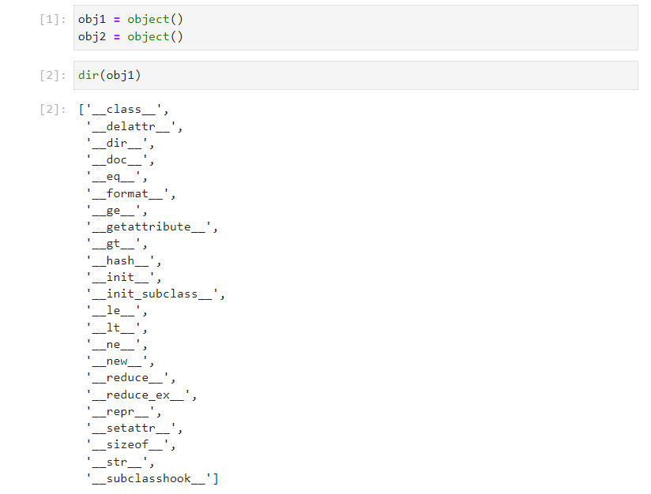

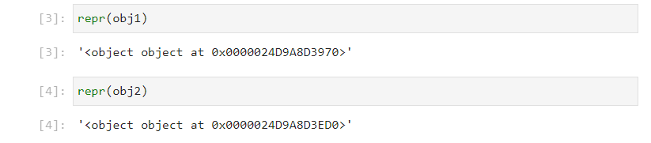


Under the hood, each of these functions and properties is defined in the class. A class can be conceptualised as a blueprint which is a set of instructions to make an object and is not a physical object itself. Any instance of the class (physical object built using the blueprint) will have these associated functions and properties. For example:

```
num = 5
```


```
word = "Hello"
```

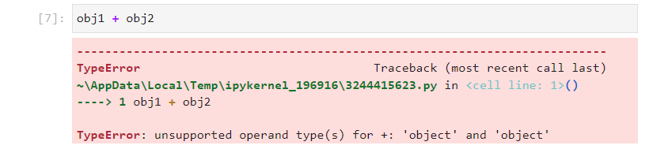

Notice that there is a subtle difference between ```int.attribute``` and ```int_instance.attribute```. In the former case ```attribute of "int" objects``` displays and the class is displaying information, like a blueprint does. In the latter case a number displays. Attributes can be conceptualised as an embedded object and an analogy to an attribute of an instance of a class is a variable in a module. Notice that identical syntax is used in both cases compare ```module.variable``` with ```int_instance.attribute```, in both cases the object being accessed is to the right hand side of the dot ```.``` and the object used as a container is to the left hand side of the ```.```:

```
int.real
int.imag

num.real
num.imag
```


A function can be referenced in an identical manner to an attribute:

```
int.conjugate
num.conjugate
```

Notice that there is a subtle difference between ```int.function``` and ```int_instance.function```. In the former case the function is called a ```method```. A ```method``` has an additional positional input argument called ```self``` which must be assigned to an instance of the object for the function to act on. In the latter case, because the function is referenced from an instance, this instance is automatically implied to be ```self```:


Functions are called using parenthesis to enclose any input arguments:

* For the method ```conjugate``` an instance ```self``` must be proved for the function to operate on. 
* For the function ```conjugate``` there are no input arguments with ```self``` being implied from the instance ```num```. 

```
int.conjugate(num)
num.conjugate()
```


There are a number of hidden functions not shown in the lists above which typically map to operators. For example the hidden function ```__add__``` which is mapped to the ```+``` operator:

```
num1 = 5
num2 = 6
num1 + num2
num1.__add__(num2)
```

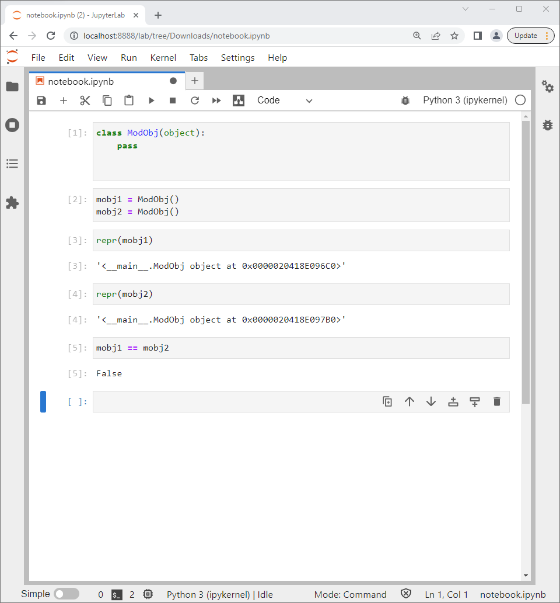

```
word1 = "Hello"
word2 = "World"
word1 + word2
word1.__add__(word2)
```


Notice the different behaviour in the code above; numeric addition for the integer class versus concatenation for the string class. The difference in behaviour is due to the two functions ```int.__add__``` and ```str.__add__``` being unique. 

Conceptually each class can be thought of as a seperate module which contains a function with the same name but this function has different code in the code block and therefore carries out different behaviour:


Notice that in either case, the return value for each function is itself an instance of the same class. i.e. numeric addition of two integers results in an integer and concatenation of two strings results in a string.

The functions do not always return an instance of the same class. For example the list function ```__len__``` returns an instance of the integer class:


```
collection = [1, 2, 3, 4, 5]
collection.__len__()
```


The string function count also returns an instance of the integer class:

```
word1.count("l")
```


The string functions ```__repr__``` and ```__str__``` are two functions which define the string representations of an object. ```__repr__``` is formal and ```__str__``` is informal. Often the string is the same for both functions and as a result they are often confused. However there is a subtle difference. 

This can be demonstated using the string ```file_path```. Due to the ```\``` being used to insert escape characters and the ```\``` being an escape character inserted in the file path:

```
file_path = "C:\\Users\\Philip"
```

Notice the subtle difference between the cell output. The informal representation shows how the string would be input using escape characters:

```
file_path
```

Versus a print statement, which shows what the formal representation of what the string looks like taking into account the effect of the escape characters:

```
print(file_path)
```


The behaviour of these are controlled with ```__repr__``` and ```__str__``` respectively. If these functions are called within a print statement, the same cell output in response to the string ```file_path``` and due to a print statement of the string ```file_path``` are observed:

```
file_path.__repr__()
print(file_path.__repr__())
```

```
file_path.__str__()
print(file_path.__str__())
```


Instead of mapping to inbuilt operators, the hidden functions ```__len__```, ```__repr__``` and ```__str__``` define how the  inbuilt functions ```len```, ```repr``` and casting an object to a string using ```str``` behave.

```
len([1, 2, 3, 4, 5])
repr(file_path)
str(file_path)
```

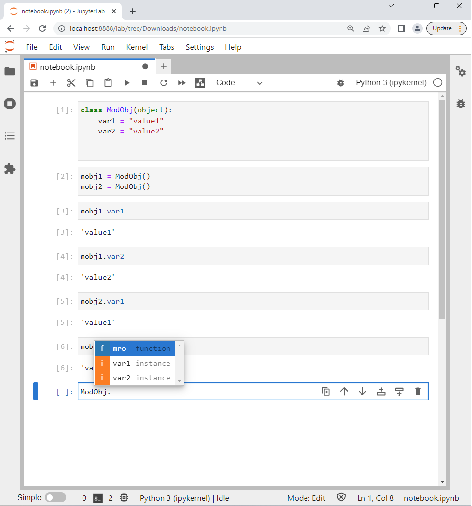

Notice, the function ```__len__``` when called from an instance of a list requires no input arguments. However if ```__len__``` is called from the class list there is a ```TypeError``` and a warning that an input argument missing:

```
collection = [1, 2, 3, 4, 5]

collection.__len__()

list.__len__()

list.__len__(collection)
```


Recall that a function determines the behaviour of an object.

For the method ```__len__``` an instance ```self``` must be proved for the function to operate on:


For the function ```__len__``` there are no input arguments with ```self``` being implied from the instance ```num```. 


**When a function is called from a class, it is known as a ```method``` and requires an instance ```self``` to be provided as the 1st positional input argument.**

Importing modules and librarys was examined in detail in the previous tutorial. Recall, that a library is a number of Python script files in a folder. One of these script files is an initialisation script file called ```__init__.py```:


Recall when the name of the folder is imported, this ```__init__.py``` is selected:

```
import library
```


Each class also has an initialisation method ```__init__``` which typically takes in one or more input arguments and uses these alongside, a return statement to return a new instance of the class. This iniitialisation method can be thought of as a constructor function which builds a physical object from a blueprint:


The ```__init__.py``` within a library is not imported using the name of the script file but instead using the name of the library. Analogously, the ```__init__``` method is not called using the name of the method but is called using the name of the class:


An example of this is given when the integer number ```5``` is cast to a string using the ```str``` class:

```
str(5)
```

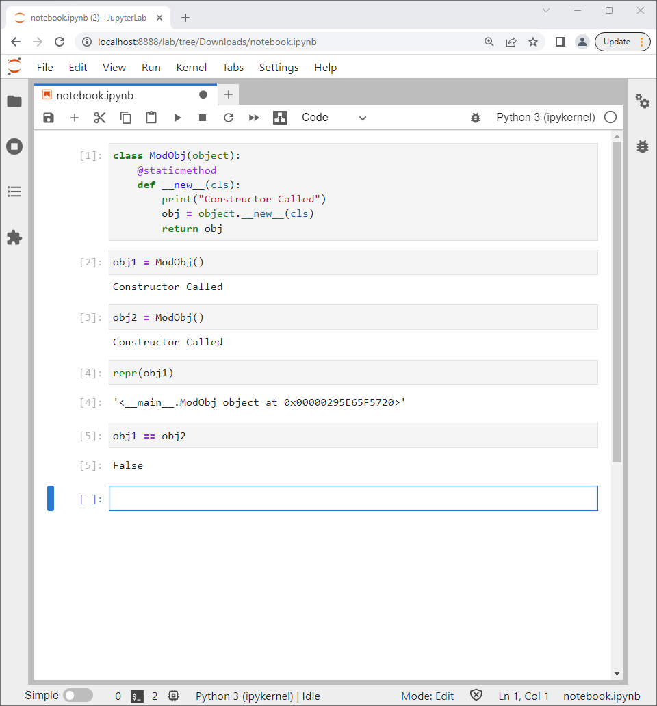

# Datamodel Methods

Python uses a number of datamodel methods which control the behaviour of inbuilt Python functions or the behaviour of inbuilt operators. Under the hood, datamodel methods define how an instance ```self``` interacts or how an instance ```self``` interacts with another instance called ```other```. These datamodel methods are sometimes known as special methods or colloquially called double underscore methods abbreviated as dunder methods.

The following datamodel methods operate on only the instance ```self```:

|method|operator or function|int|float|bool|str|list|tuple|dict|
|---|:-:|---|---|---|---|---|---|---|
|\_\_init\_\_|class name|initialisation|initialisation|initialisation|initialisation|initialisation|initialisation|initialisation|
|\_\_len\_\_|len|Not Implemented|Not Implemented|Not Implemented|length|length|length|length|
|\_\_repr\_\_|repr|formal str|formal str|formal str|formal str|formal str|formal str|formal str|
|\_\_str\_\_|str|informal str|informal str|informal str|informal str|informal str|informal str|informal str|
|\_\_dir\_\_|dir|dir|dir|dir|dir|dir|dir|dir|

The following datamodel methods require two instances ```self``` and ```other```:

|method|operator or function|int|float|bool|str|list|tuple|dict|
|---|:-:|---|---|---|---|---|---|---|
|\_\_add\_\_|+|addition|addition|addition|concatenation|concatenation|concatenation|concatenation|
|\_\_sub\_\_|-|subtraction|subtraction|subtraction|Not Implemented|Not Implemented|Not Implemented|Not Implemented|
|\_\_mul\_\_|\*|multiplication|multiplication|multiplication|Not Implemented|Not Implemented|Not Implemented|Not Implemented|
|\_\_pow\_\_|\*\*|exponentiation|exponentiation|exponentiation|Not Implemented|Not Implemented|Not Implemented|Not Implemented|
|\_\_truediv\_\_| \\ |float division|float division|float division|Not Implemented|Not Implemented|Not Implemented|Not Implemented|
|\_\_floordiv\_\_| \\\\ |floor division|floor division|floor division|Not Implemented|Not Implemented|Not Implemented|Not Implemented|
|\_\_mod\_\_|%|modulo|modulo|modulo|Not Implemented|Not Implemented|Not Implemented|Not Implemented|
|\_\_divmod\_\_|divmod|(floor division, modulo)|(floor division, modulo)|(floor division, modulo)|Not Implemented|Not Implemented|Not Implemented|Not Implemented|
|\_\_matmul\_\_|@|Not Implemented|Not Implemented|Not Implemented|Not Implemented|Not Implemented|Not Implemented|Not Implemented|
|\_\_gt\_\_|>|greater than|greater than|greater than|greater than|greater than|greater than|greater than|
|\_\_ge\_\_|>=|greater than or equal to|greater than or equal to|greater than or equal to|greater than or equal to|greater than or equal to|greater than or equal to|greater than or equal to|
|\_\_lt\_\_|<|less than|less than|less than|less than|less than|less than|less than|
|\_\_le\_\_|>=|less than or equal to|less than or equal to|less than or equal to|less than or equal to|less than or equal to|less than or equal to|less than or equal to|
|\_\_eq\_\_|==|equal to|equal to|equal to|equal to|equal to|equal to|equal to|
|\_\_ne\_\_|!=|not equal to|not equal to|not equal to|not equal to|not equal to|not equal to|not equal to|

The following datamodel methods require two instances ```self``` and ```other``` and update ```self``` inplace:

|method|operator or function|int|float|bool|str|list|tuple|dict|
|---|:-:|---|---|---|---|---|---|---|
|\_\_iadd\_\_|+=|addition|addition|addition|concatenation|concatenation|concatenation|concatenation|
|\_\_isub\_\_|-=|subtraction|subtraction|subtraction|Not Implemented|Not Implemented|Not Implemented|Not Implemented|
|\_\_imul\_\_|\*=|multiplication|multiplication|multiplication|Not Implemented|Not Implemented|Not Implemented|Not Implemented|
|\_\_ipow\_\_|\*\*=|exponentiation|exponentiation|exponentiation|Not Implemented|Not Implemented|Not Implemented|Not Implemented|
|\_\_itruediv\_\_| \\= |float division|float division|float division|Not Implemented|Not Implemented|Not Implemented|Not Implemented|
|\_\_ifloordiv\_\_| \\\\= |floor division|floor division|floor division|Not Implemented|Not Implemented|Not Implemented|Not Implemented|
|\_\_imod\_\_|%=|modulo|modulo|modulo|Not Implemented|Not Implemented|Not Implemented|Not Implemented|
|\_\_imatmul\_\_|@=|Not Implemented|Not Implemented|Not Implemented|Not Implemented|Not Implemented|Not Implemented|Not Implemented|

# Class Instance and Blueprint House Analogy

In Python each object has a class, which initially can be conceptualised as an abstract blueprint which defines how to create a new object and outlines the properties and functionality behind an object. Before looking at creating a custom class, it is useful to explore the concept of a class by using every day intuition and framing it in Python syntax.

To conceptualise this idea take for example the concept of building a house. An Architect may create a blueprint for a house called ```House```, this blueprint is an abstract object, that an end user cannot interact with. CamelCaseCapitalisation is used for third-party class names and this convention is used to clearly distinguish them from inbuilt objects. The class ```House``` will outline the features or attributes of a house such as the height of the house ```househeight```, how many rooms it possesses ```nrooms``` and the size of the bedroom ```bedroomsize```. It will also outline the functionality of the house such as the doors in the house ```frontdooropen``` or ```frontdoorclose```, the windows in the house ```frontwindowopen``` or ```frontwindowclose```, the central heating system controls ```sethousetemperature``` and the sewage controls ```flushtoilet```.

A construction company can follow the instructions in this blueprint called ```House``` to create one or multiple houses. Each house will be constructed using the same blueprint but each object created will be unique. To indicate that each house is unique, the construction company will assign each new house object, a name during construction which is known as a post code. This process is known as initialisation or instantiation, creating a new physical object or instance from the blueprint or class ```House```. In Python, the post code is known as the ```object name``` or ```instance name```, for simplicity two houses ```house000``` and ```house001``` can be made.

The end user (homeowner or tenant) will be able to uniquely interact with their own house object using the functions outlined in the blueprint House. These functions are methods for interacting with a house object. For example the owner of ```house000``` will be able to leave their house by calling the method ```house000.frontdooropen()``` and ```house000.frontdoorclose()``` and set the temperature on their central heating system by calling the method ```house000.sethousetemperature(temp=24)```. Notice that these interactions with ```house000``` will not change the functionality of ```house001``` although the behaviour for both houses is defined in the same ```House``` class. Notice that these functions, are called with parenthesis and in the case of the last function an input argument is provided. The dot syntax ```.``` indicates that the function is being called from the object ```house000```.

The homeowner of ```house000``` may want to rent out a bedroom in their house and may have to list it with the following attributes ```house000.nrooms``` and ```house000.bedroomsize``` for example. The dot syntax ```.``` once again indicates that the attribute is being read from the object ```house000```. Usually if an attribute is altered, it'll be altered via a function and not reassigned directly. For example if the ```house000.nrooms``` attribute is altered, it'll typically be altered by using a function for example ```house000.buildextension()```.

# The object Class

In Python, everything is based around the concept of an object. To explore this in more detail, the generic ```object``` class can be examined. If ```object(``` is input followed by shift ```⇧``` and tab ```↹``` the docstring for the initialisation signature of the object class display:


Recall that this uses the method ```__init__```:

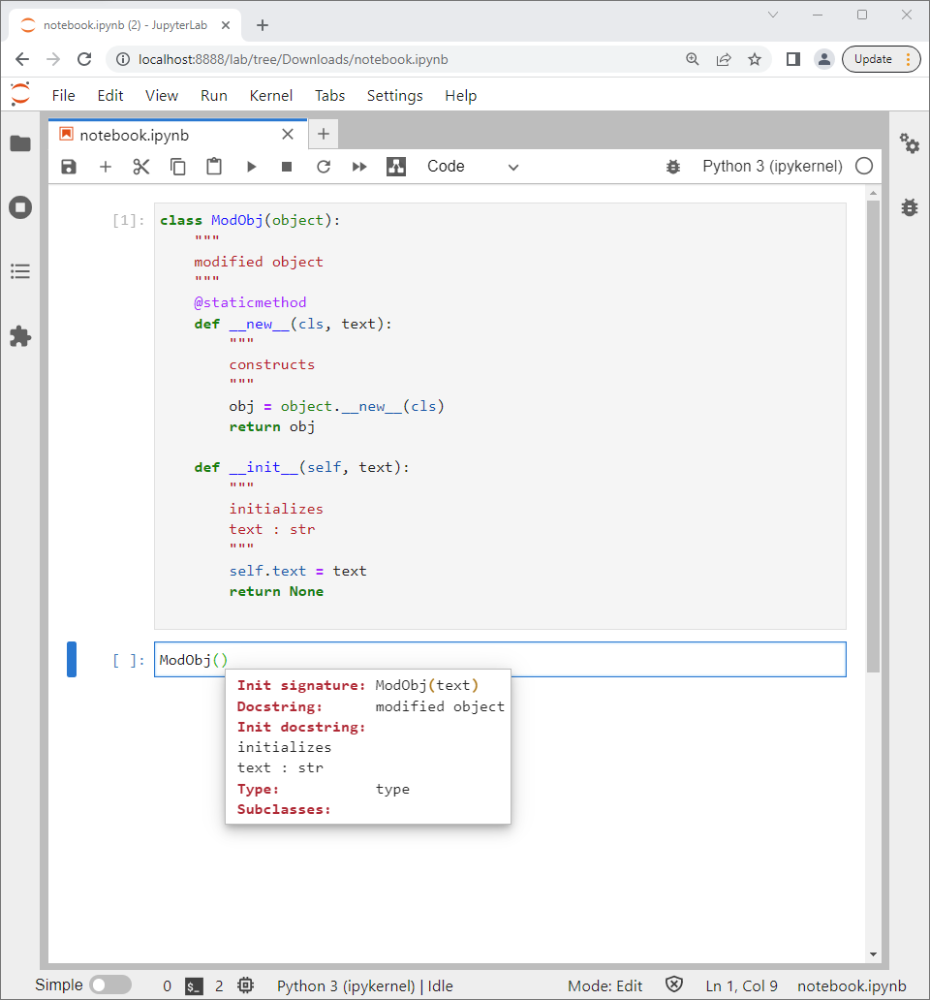

The docstring states:

```
"""
The base class of the class hierarchy.

When called, it accepts no arguments and returns a new featureless
instance that has no instance attributes and cannot be given any.
"""
```

Therefore in this case, to create an object instance of the object class, no positional input arguments are required.

```
instance = object()
```

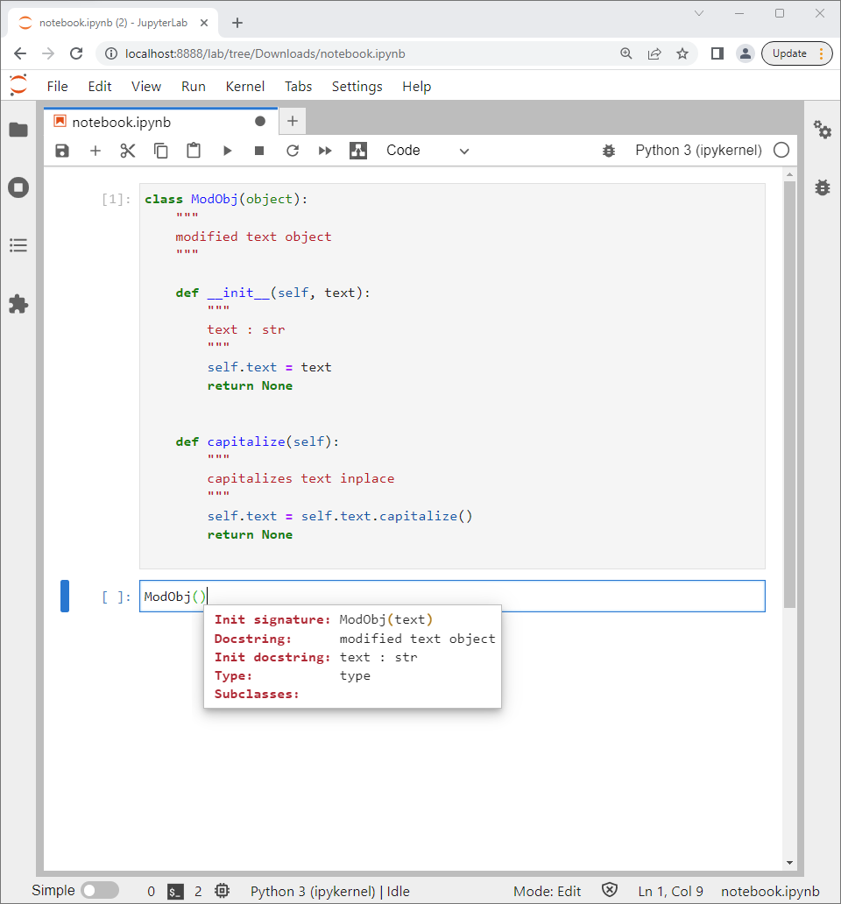

If ```instance.``` is typed followed by a tab ```↹```, nothing displays because this object has no instance attributes.


The ```dir``` function treats the object instance as a directory and lists all the objects within that directory. This includes the datamodel methods which are hidden from the ```.↹```listing: 

```
dir
```

A list displays which includes the data model methods:


These include ```__init__```, ```__dir__```, ```__repr__``` and ```__str__```. ```__repr__``` and ```__str___```, the formal and informal representation of a string display that the object is present in a certain memory locaiton by default:


```__eq__``` and ```__neq__``` comparison methods are defined.

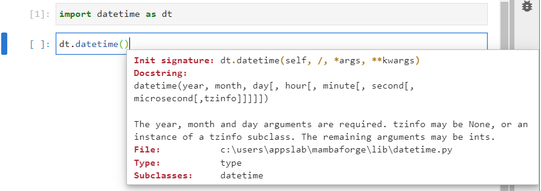

And they can be used to check whether or not two objects are the same:

```
instance1 = object()
instance2 = object()
instance1 == instance2
instance1 != instance2
```


The four other comparison operators ```__gt__```, ```__ge__```, ```__lt__``` and ```__le__``` show in the directory listing. However these operations are not supported between instances of the class object as instance1 and instance2 are not ordinal:


The other data model methods are not listed and therefore have no code defining them and are unsupported:

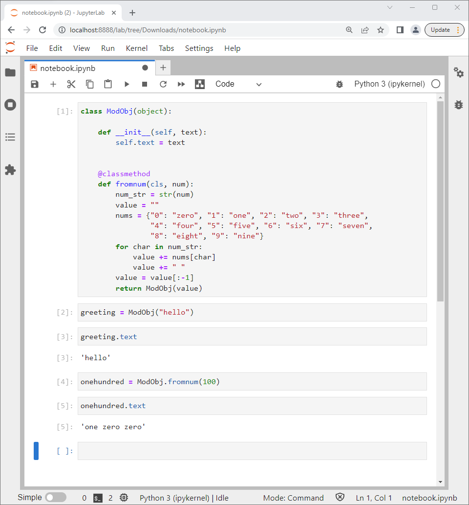

# Creating a Custom Class

The ```class``` keyword is used to create a class. Third-party class names are typically named using CamelCaseCapitalisation. This syntax is used to clearly differenciate third-party classes from inbuilt objects. Parenthesis are used to enclose the parent class. When no parent class is defined, the default parent class ```object``` is used. A colon ```:``` is then used to begin a code block. For now ```pass``` will be used:

```
class EmptyEmpty(object):
   pass
   
   
``` 


The ```___init___``` datamodel method will be inherited from the parent class ```object```.


Notice that no ```docstring``` displays for this method. Like the ```_init__``` method from the parent class ```object``` an instance is instantiated without providing an input argument

```
instance = EmptyEmpty()
instance
print(instance)
```


The formal and informal string represation also display details about the instance, in a manner similar to the parent class ```object```. This is because the methods ```__repr__``` and ```__str__``` are inherited from the parent class. The ```dir``` function treats the ```EmptyEmpty``` ```instance``` called ```instance``` as a directory and lists all the objects within that directory.

```
dir(instance)
```

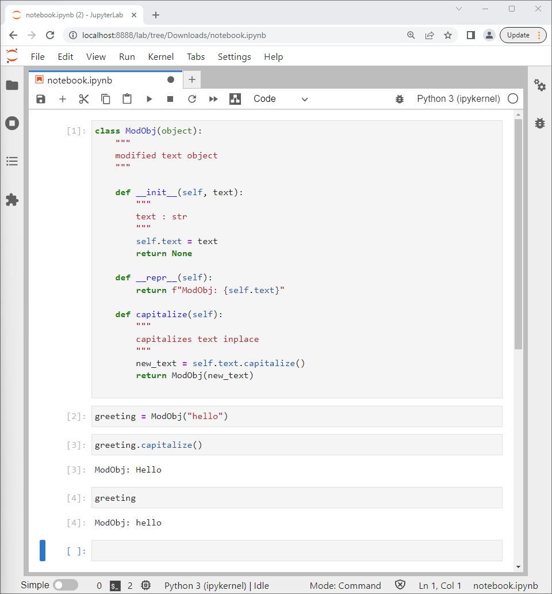

Notice that these are identical to a instance of the ```object``` class. This is expected as the ```child``` class ```EmptyEmpty``` inherits these methods from the parent class ```object``` and no additional functionality has been added to the ```child``` class.

## Functions to Methods

Another class can be created called ```TestClass``` which has additional functionality. A class can be conceptualised as a grouping of functions.

```
class TestClass(object):
    def function1(*args, **kwargs):
        return None
       
       
    def function2(*args, **kwargs):    
        return None
       
       
    def function3(*args, **kwargs):    
        return None
       
       
    def function4(*args, **kwargs):    
        return None
       
   
``` 

Because each function in the class is a method, the first positional input argument must be ```self```:

```
class TestClass(object):
    def function1(self, *args, **kwargs):
        return None
       
       
    def function2(self, *args, **kwargs):    
        return None
       
       
    def function3(self, *args, **kwargs):    
        return None
       
       
    def function4(self, *args, **kwargs):    
        return None
       

``` 

## Variables to Attributes

An additional function can be created that takes in 4 additional input arguments and creates 4 variables:

```
class TestClass(object):
    def function1(self, *args, **kwargs):
        return None
       
       
    def function2(self, *args, **kwargs):    
        return None
       
       
    def function3(self, *args, **kwargs):    
        return None
       
       
    def function4(self, *args, **kwargs):    
        return None
       
       
    def create_attributes(self, value1, value2, value3, value4):
        var1 = value1
        var2 = value2
        var3 = value3
        var4 = value4
   
   
``` 

For these variables to become attributes, they must be referenced with respect to the instance which is denoted ```self```:

```
class TestClass(object):
    def function1(self, *args, **kwargs):
        return None
       
       
    def function2(self, *args, **kwargs):    
        return None
       
       
    def function3(self, *args, **kwargs):    
        return None
       
       
    def function4(self, *args, **kwargs):    
        return None
       
       
    def create_attributes(self, value1, value2, value3, value4):
        self.var1 = value1
        self.var2 = value2
        self.var3 = value3
        self.var4 = value4
        return None
   
   
``` 

Note a clear distinction was made to the left and right hand side of the assignment operator. The hand side attribute name and right hand side input argument have different names. It is more typical to use the same name in both cases:

```
class TestClass(object):
    def function1(self, *args, **kwargs):
        return None
       
       
    def function2(self, *args, **kwargs):    
        return None
       
       
    def function3(self, *args, **kwargs):    
        return None
       
       
    def function4(self, *args, **kwargs):    
        return None
       
        
    def create_attributes(self, value1, value2, value3, value4):
        self.value1 = value1
        self.value2 = value2
        self.value3 = value3
        self.value4 = value4
        return None
   
   
   
``` 

However it should be understood that ```value1``` on the right hand side of the assignment operator is provided by the input argument. The assignment operator assigns this to an attribute of the instance ```self``` with the name ```value1```.

Now that the ```TestClass``` class is ready:

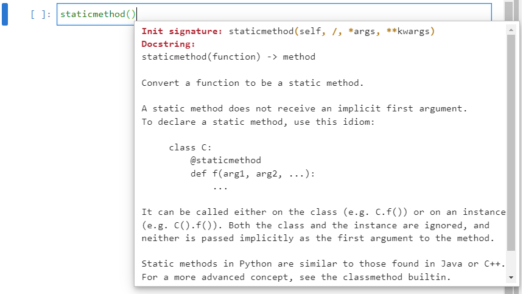

An instance can be instantiated to the object name ```instance```:

```
instance = TestClass()
```


The inbuilt function ```isinstance``` can be used to check whether the object name ```instance``` is an instance of the class ```TestClass``` or of another class such as ```int```. The values are ```True``` and ```False``` as expected:

```
isinstance(instance, TestClass)
```


```
isinstance(instance, int)
```

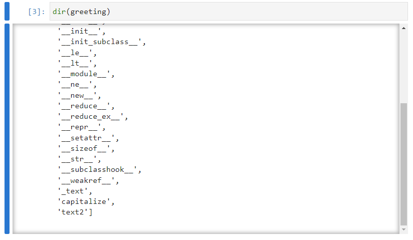

If the instance name ```instance``` is input followed by a dot ```.``` and tab ```↹```, a list of available functions display:


The following four functions can be called from the instance ```instance```. Note that no output is shown because the return value for each function is ```None```:

```
instance.function1()
instance.function2()
instance.function3()
instance.function4()
```


If the instance name ```instance``` is input followed by a dot ```.``` and tab ```↹```, the list of available functions displays and is unaltered:

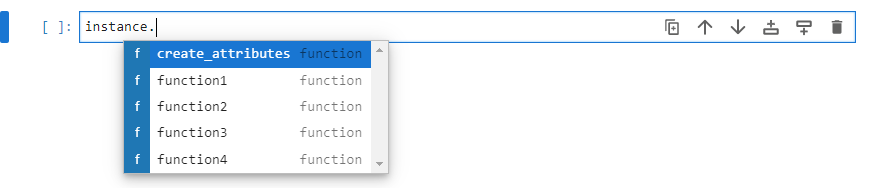

If ```instance.create_attributes(``` is input followed by shift ```⇧``` and ```↹```, details about the positional input arguments display ```value1```, ```value2```, ```value3``` and ```value4```. Because no docstring was provided, ```<no docstring>``` displays.

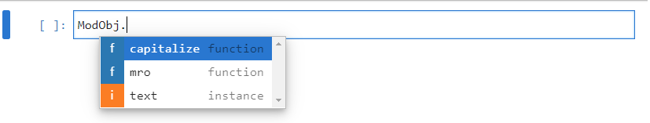

For simplicity these will be input as ```1```, ```2```, ```3``` and ```4```:

```
instance.create_attributes(1, 2, 3, 4)
```


If the instance name ```instance``` is input followed by a dot ```.``` and tab ```↹```, the list of available functions displays and now includes a list of the four attributes:

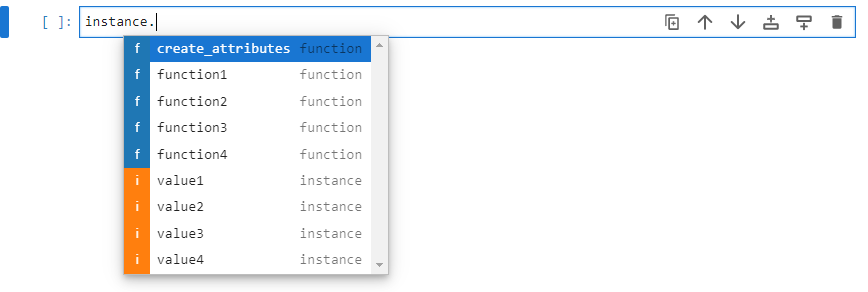

```
instance.value1
instance.value2
instance.value3
instance.value4
```

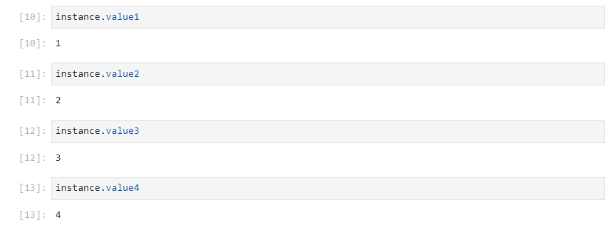

## The ```__init__``` Datamodel Initialisation Method

The initialisation method ```__init__``` is invoked when instantiating a class. The ```__init__``` method is often refered to as a constructor as it is used to construct a new physical object or instance of the class. A physical object has properties or attributes and the ```__init__``` constructor can be used to initialise these. If the method ```create_attributes``` is renamed ```__init__```, the attributes ```value1```, ```value2```, ```value3``` and ```value4``` will be assigned upon instantiation.

```
class TestClass(object):
    def function1(self, *args, **kwargs):
        return None
       
       
    def function2(self, *args, **kwargs):    
        return None
       
       
    def function3(self, *args, **kwargs):    
        return None
       
       
    def function4(self, *args, **kwargs):    
        return None
       
        
    def __init__(self, value1, value2, value3, value4):
        self.value1 = value1
        self.value2 = value2
        self.value3 = value3
        self.value4 = value4
        return None
   
   
```

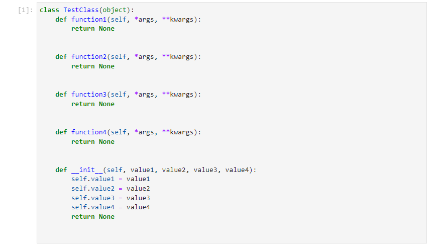

When ```TestClass(``` is input followed by shift ```⇧``` and ```↹```, details about the positional input arguments display. ```value1```, ```value2```, ```value3``` and ```value4``` are shown. These come from the definition of the ```__init__``` method and a value for each of these positional input arguments must now be provided during instantiation.

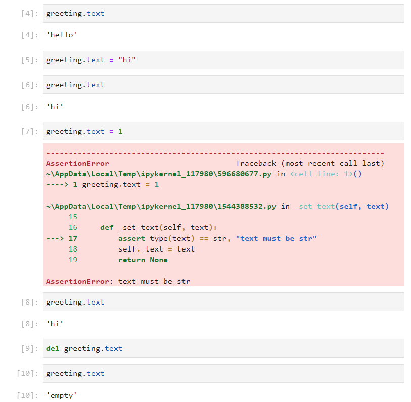

Two instantiations can be made to the variable names ```instance1``` and ```instance2``` respectively:

``` 
instance1 = TestClass(1, 2, 3, 4)
instance2 = TestClass(2, 4, 6, 8)
```


If the instance name ```instance1``` is input followed by a dot ```.``` and tab ```↹```, the list of available functions and attributes displays:

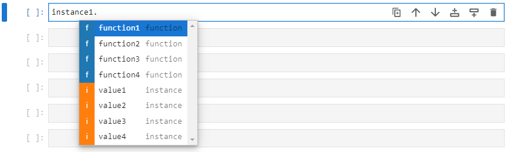

An identical list of available functions and attributes displays for ```instance2```:

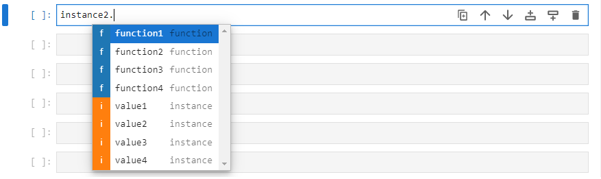

Notice that although the attributes have the same name, they are assigned to have different values for each instance.

```
instance1.value1
instance2.value1

instance1.value2
instance2.value2

instance1.value3
instance2.value3

instance1.value4
instance2.value4
```

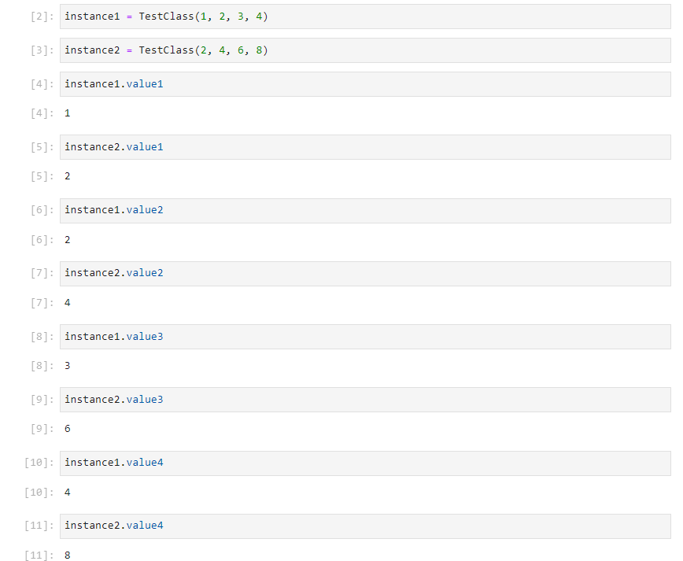

## Accessing a Method within another Method

The ```create_attributes``` method can be redefined:

```
    def create_attributes(self, value1, value2, value3, value4):
        self.value1 = value1
        self.value2 = value2
        self.value3 = value3
        self.value4 = value4
        return None
        
        
```

The ```__init__``` method can be modified to call ```create_attributes``` function from the instance ```self```. All the input arguments required to call the ```create_attributes``` must be present in the ```__init__``` function.

```
    def __init__(self, value1, value2, value3, value4):

        return None
```

The ```create_attributes``` function can be called by the ```__init__``` method from the instance ```self```. 

```
    def __init__(self, value1, value2, value3, value4):
        self.create_attributes(value1, value2, value3, value4)
        return None
```

Notice that when the function ```create_attributes``` is called, it is called from an instance ```self``` and therefore ```self``` should not be provided as an input argument.

The updated ```TestClass``` is as follows:

```
class TestClass(object):
    def function1(self, *args, **kwargs):
        return None
       
       
    def function2(self, *args, **kwargs):    
        return None
       
       
    def function3(self, *args, **kwargs):    
        return None
       
       
    def function4(self, *args, **kwargs):    
        return None
       
        
    def create_attributes(self, value1, value2, value3, value4):
        self.value1 = value1
        self.value2 = value2
        self.value3 = value3
        self.value4 = value4
        return None
    
    
    def __init__(self, value1, value2, value3, value4):
        self.create_attributes(value1, value2, value3, value4)
        return None
   

```

The updated class has identical behaviour to before and the ```__init__``` method docstring looks the same:

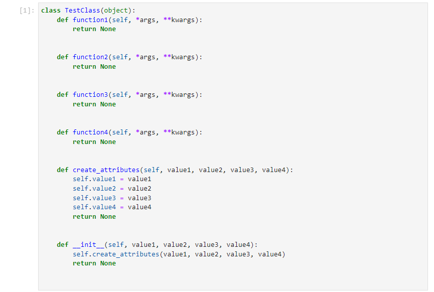

Two instantiations can be made to the variable names ```instance1``` and ```instance2``` respectively:

``` 
instance1 = TestClass(1, 2, 3, 4)
instance2 = TestClass(2, 4, 6, 8)
```

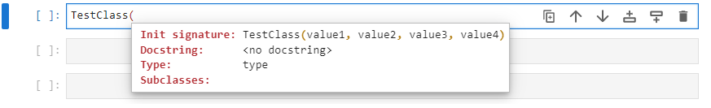

If the instance name ```instance1``` is input followed by a dot ```.``` and tab ```↹```, the list of available functions and attributes displays. This is identical to before but includes ```create_attributes```:

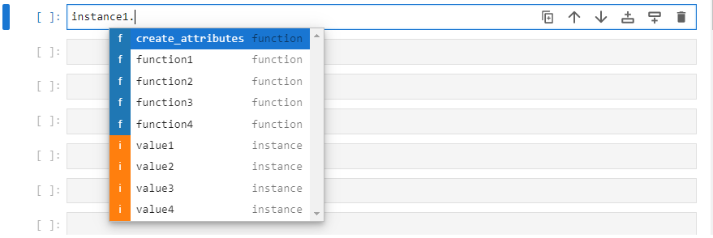

An identical list of available functions and attributes displays for ```instance2```:


To save a bit of repetition. ```*args``` and ```**kwargs``` can be used within the ```__init__``` method.

```
    def __init__(self, *args, **kwargs):
        self.create_attributes(*args, **kwargs)
        return None  


```

The class becomes:

```
class TestClass(object):
    def function1(self, *args, **kwargs):
        return None
       
       
    def function2(self, *args, **kwargs):    
        return None
       
       
    def function3(self, *args, **kwargs):    
        return None
       
       
    def function4(self, *args, **kwargs):    
        return None
       
        
    def create_attributes(self, value1, value2, value3, value4):
        self.value1 = value1
        self.value2 = value2
        self.value3 = value3
        self.value4 = value4
        return None
   

    def __init__(self, *args, **kwargs):
        self.create_attributes(*args, **kwargs)
        return None  
    
    
```


This however makes the ```docstring``` for the ```__init__``` initialisation constructor less useful:

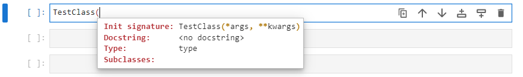

Two instantiations can be made to the variable names ```instance1``` and ```instance2``` respectively in the exact same manner as before:

``` 
instance1 = TestClass(1, 2, 3, 4)
instance2 = TestClass(2, 4, 6, 8)
```


If the instance name ```instance1``` is input followed by a dot ```.``` and tab ```↹```, the list of available functions and attributes displays. This is identical to before:

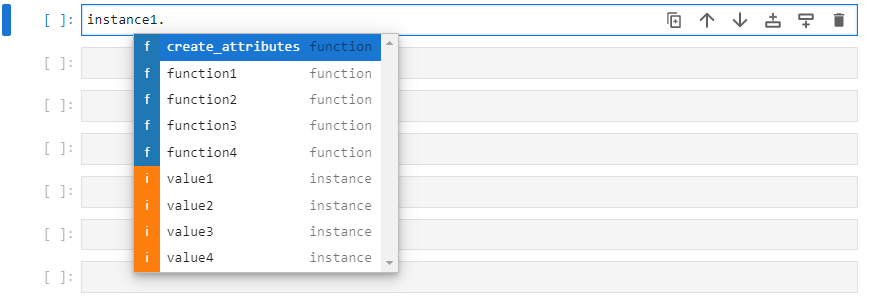

## Public, Internal Use and Private

The method ```create_attributes``` is public and is therefore accessible from any instance created. This may not be useful, if for example this method is only intended to be used as during initialisation. This method can be designated as a method designed for internal use by prefixing the method name with an underscore ```_```. In this case ```create_attributes``` becomes ```_create_attributes```. The ```__init__``` method also needs to be updated to call ```_create_attributes``` instead of ```create_attributes```:

```
    def _create_attributes(self, value1, value2, value3, value4):
        self.value1 = value1
        self.value2 = value2
        self.value3 = value3
        self.value4 = value4
        return None
    
    
    def __init__(self, *args, **kwargs):
        self._create_attributes(*args, **kwargs)
        return None  
        
        
```

The class becomes:

```
class TestClass(object):
    def function1(self, *args, **kwargs):
        return None
       
       
    def function2(self, *args, **kwargs):    
        return None
       
       
    def function3(self, *args, **kwargs):    
        return None
       
       
    def function4(self, *args, **kwargs):    
        return None
       
        
    def _create_attributes(self, value1, value2, value3, value4):
        self.value1 = value1
        self.value2 = value2
        self.value3 = value3
        self.value4 = value4
        return None
    
    
    def __init__(self, *args, **kwargs):
        self._create_attributes(*args, **kwargs)
        return None  
   
   
```   

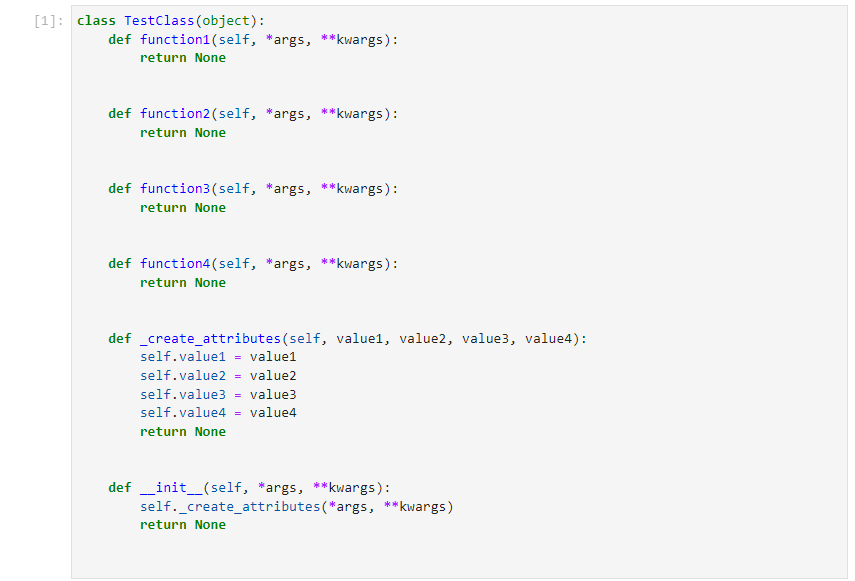

Two instantiations can be made to the names ```instance1``` and ```instance2``` respectively:

``` 
instance1 = TestClass(1, 2, 3, 4)
instance2 = TestClass(2, 4, 6, 8)
```


If the instance name ```instance1``` is input followed by a dot ```.``` and tab ```↹```, the list of available functions and attributes displays:


Notice that ```_create_attributes``` does not display because it has been designated for only internal use. This method will show if ```dir``` is used which gives more details:

```
dir(instance1)
```

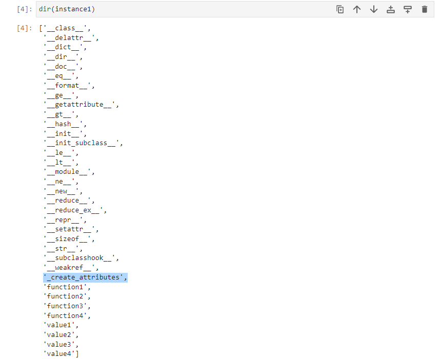

Althought the method ```_create_attributes``` is designated for internal use. It can however be called from an instance using:

```
instance1._create_attributes(10, 20, 30, 40)
```


The attributes are updated as expected:

```
instance1.value1
instance1.value2
instance1.value3
instance1.value4
```

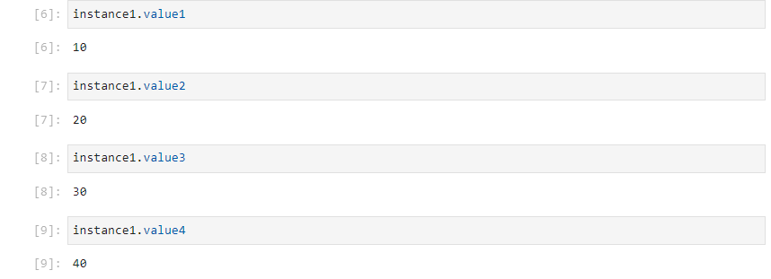

The method ```create_attributes``` can be designated as a private method using a double underscore ```__create_attributes``` instead of a single underscore ```_create_attributes```. Once again both the method and ```__init__``` which calls the method need to be updated:

```
    def __create_attributes(self, value1, value2, value3, value4):
        self.value1 = value1
        self.value2 = value2
        self.value3 = value3
        self.value4 = value4
        return None
   

    def __init__(self, *args, **kwargs):
        self.__create_attributes(*args, **kwargs)
        return None  
   
```

The updated class becomes:

```
class TestClass(object):
    def function1(self, *args, **kwargs):
        return None
       
       
    def function2(self, *args, **kwargs):    
        return None
       
       
    def function3(self, *args, **kwargs):    
        return None
       
       
    def function4(self, *args, **kwargs):    
        return None
       
        
    def __create_attributes(self, value1, value2, value3, value4):
        self.value1 = value1
        self.value2 = value2
        self.value3 = value3
        self.value4 = value4
        return None
   

    def __init__(self, *args, **kwargs):
        self.__create_attributes(*args, **kwargs)
        return None  
    
    
```

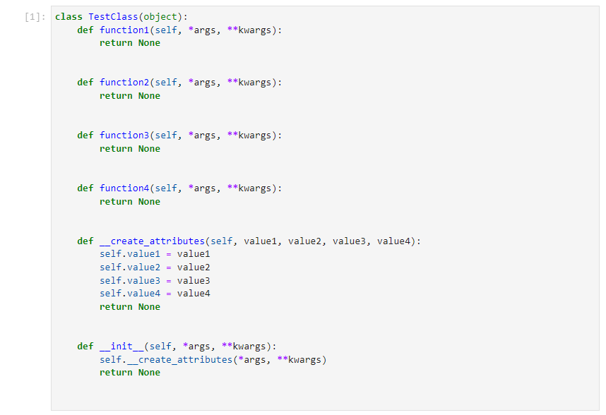

Two instantiations can be made to the names ```instance1``` and ```instance2``` respectively:

``` 
instance1 = TestClass(1, 2, 3, 4)
instance2 = TestClass(2, 4, 6, 8)
```


If the instance name ```instance1``` is input followed by a dot ```.``` and tab ```↹```, the list of available functions and attributes displays:

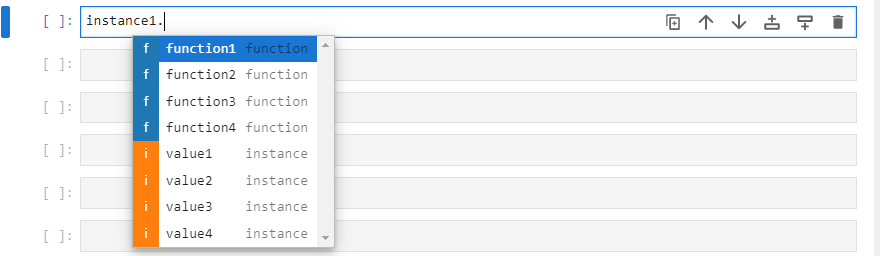

Notice that ```__create_attributes``` does not display because it has been designated as private. This method will show if ```dir``` is used which gives more details:

```
dir(instance1)
```

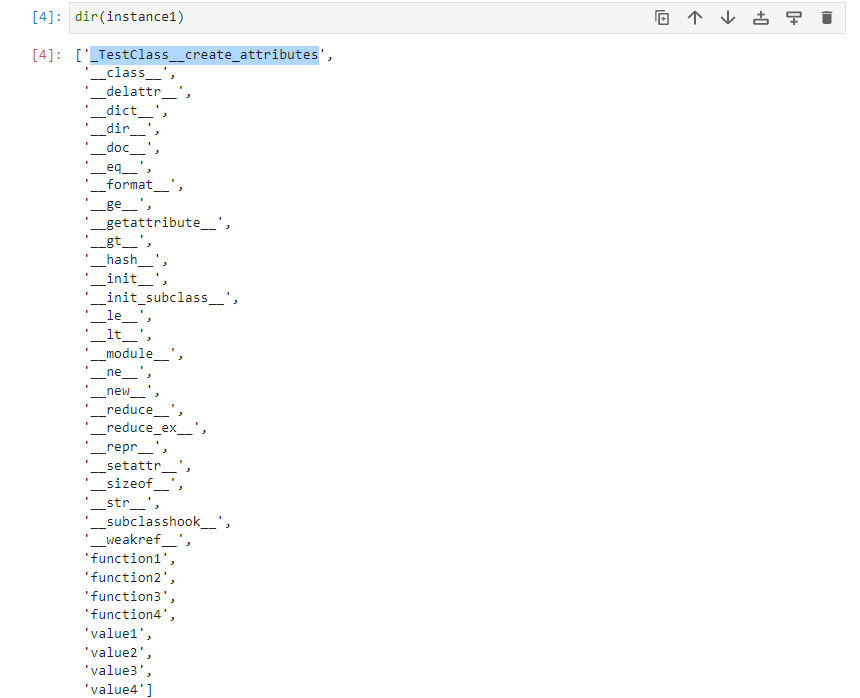

However notice that this does not display as ```__create_attributes``` but as ```_TestClass__create_attributes```. In Python, nothing is truely private and the function can be called using ```_TestClass__create_attributes``` with the clear syntax ```_TestClass``` (this method is designed for internal use only within ```TestClass``` followed by ```__``` this method is designed to be private):

```
instance1._TestClass__create_attributes(10, 20, 30, 40)
```


The attributes are updated as expected:

```
instance1.value1
instance1.value2
instance1.value3
instance1.value4
```

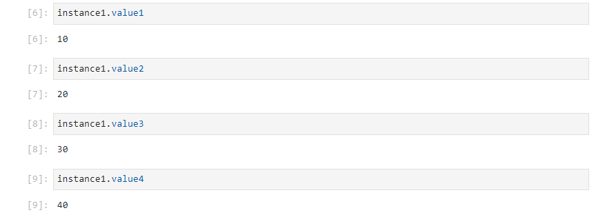

The TestClass can be simplified to create one attribute ```value1``` and the datatype of this attribute can be asserted to be an integer:

```
class TestClass(object):

    def __init__(self, value1):
        assert type(value1) == int
        self.value1 = value1
        return None  
    
    
```    


Now the class instantiates when provided with the correct number of input arguments of the correct datatype:

```
instance1 = TestClass(1)
instance2 = TestClass("Hello")
```

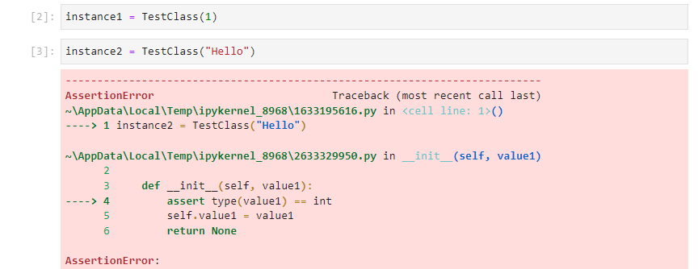

However because the attribute is public, it can be changed to the wrong datatype overriding the protection made with the assertion:

```
instance1.value1 = "Hello"
```


The probability of this happening can be reduced by by prefixing the method name with an underscore ```_``` to designate it for internal use, using the same convention seen earlier for a method as this attribute will become hidden unless ```dir``` is used:

```
class TestClass(object):

    def __init__(self, value1):
        assert type(value1) == int
        self._value1 = value1
        return None  
    
```    

A get and set method can be made to access the variable and safely assign the variable to a new value of the correct datatype. 

```
class TestClass(object):

    def __init__(self, value1):
        assert type(value1) == int
        self._value1 = value1
        return None  
    
    
    def get_value1(self):
        return self._value1  

    
    def set_value1(self, new_value1):
        assert type(new_value1) == int
        self._value1 = new_value1
        

```

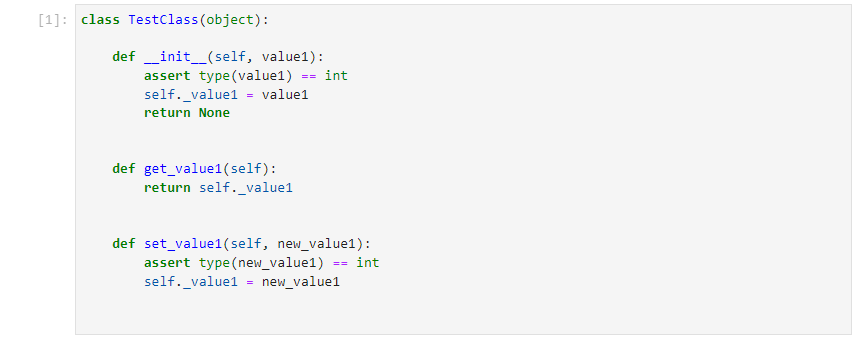

Now the class instantiates when provided with the correct number of input arguments of the correct datatype:


If the instance name ```instance1``` is input followed by a dot ```.``` and tab ```↹```, the list of available functions and attributes displays:


The methods ```get_value1``` and ```set_value1``` display but the attribute ```_value1``` doesn't displays as it is designated for internal use. Now the attribute is protected from being cast into the wrong datatype:

```
instance1.get_value1()
instance1.set_value1(3)
instance1.get_value1()
instance1.set_value1("Hello")
```


## Linking Get, Set and Del Methods

The above implementation protects the attribute from being cast into the wrong datatype, however the attribute itself cannot be accessed using standard Python syntax. A better way of doing this is using the ```property``` function.

```
? property
```

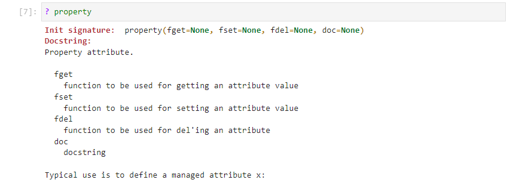

The attribute is accessed directly using standard Python syntax in the ```__init__``` initialisation constructor using ```self.value1``` without any underscore prefix. 

A get, set and del method are created for the attribute. In these methods, the attribute is treated as if it is designated for internal use using ```self._value1``` with the underscore prefix.

After these three methods are defined. The name of the attribute ```value1``` without the underscore prefix is assigned to a variable of the name ```value1```. Note because it is a variable and not an attribute, there is no ```self.```. The value of the variable ```value1``` is assigned to a property function which takes the get, set and del methods as input arguments:

```
class TestClass(object):
    def __init__(self, value1):
        self.value1 = value1
        return None
    
    
    def get_value1(self):
        print("get_value1 method used")
        return self._value1


    def set_value1(self, value1):
        assert type(value1) == int
        print("set_value1 method used")
        self._value1 = value1
        return None
    
    
    def del_value1(self):
        print("del_value1 method used")
        self._value1 = 0
        return None
    
    
    value1 = property(get_value1, set_value1, del_value1)
    
    
```

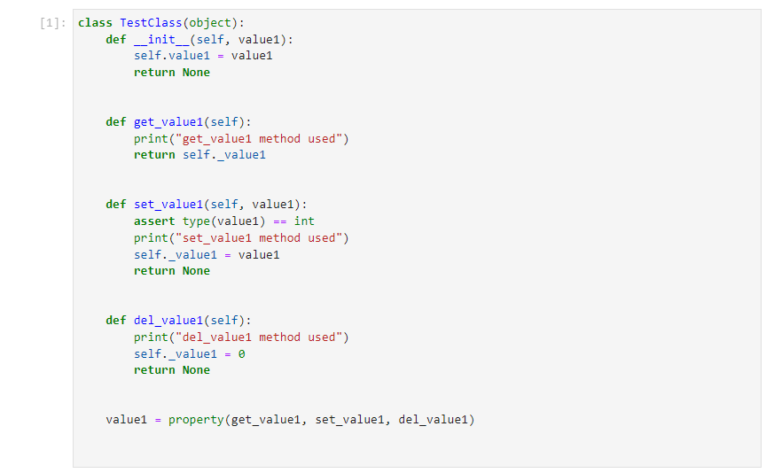

print statements have been added so it is clear to see what method is invoked when accessing the attribute and reassigning it to a new value. Notice the ```set_value1``` method is used during initialisation. This means any code used to assert the properties of the attribute can be used in the set method and don't need to be duplicated in the ```__init__``` constructor.

The class instantiates when provided with the correct number of input arguments of the correct datatype:

```
instance1 = TestClass(4)
```


If the instance name ```instance1``` is input followed by a dot ```.``` and tab ```↹```, the list of available functions and attributes displays:

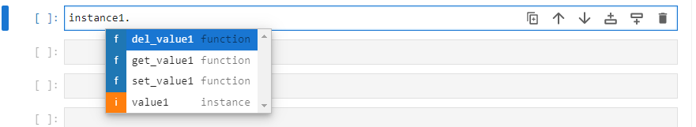

Notice there are 3 functions and an attribute associated with this variable. The standard Python syntax may be used to access the attribute and assign it to a new value:

```
instance1.value1
instance1.value1 = 10
instance1.value1
del instance1.value1
instance1.value1
```

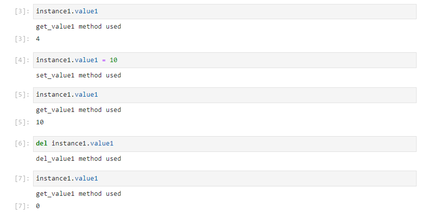

This behaviour can also be carried out with inbuilt decorators ```@property``` which is used to define a method called ```value1``` which returns a private attribute of the same name ```self._value1```. This is essentially the get method.

The set decorator is ```@value1.setter``` and the method created has the same name ```value1```. This is used to set the private attribute with the same name ```self._value1``` and optionally assert the datatype of the attribute while it is being set.

The delete decorator is ```@value1.deleter``` and the method created has the same name ```value1```. This is used to delete the attribute ```self._value1```.

```
class TestClass(object):
    def __init__(self, value1):
        self.value1 = value1
        return None
    
    
    @property   
    def value1(self):
        print("get_value1 method used")
        return self._value1
    
    
    @value1.setter
    def value1(self, value1):
        assert type(value1) == int
        print("set_value1 method used")
        self._value1 = value1
        return None
    
    
    @value1.deleter
    def value1(self):
        print("del_value1 method used")
        self._value1 = 0
        return None
    
    
```

The print statements have been kept so it is clear to see what method is invoked when accessing the attribute and reassigning it to a new value. Notice the ```setter``` method is used during initialisation. 

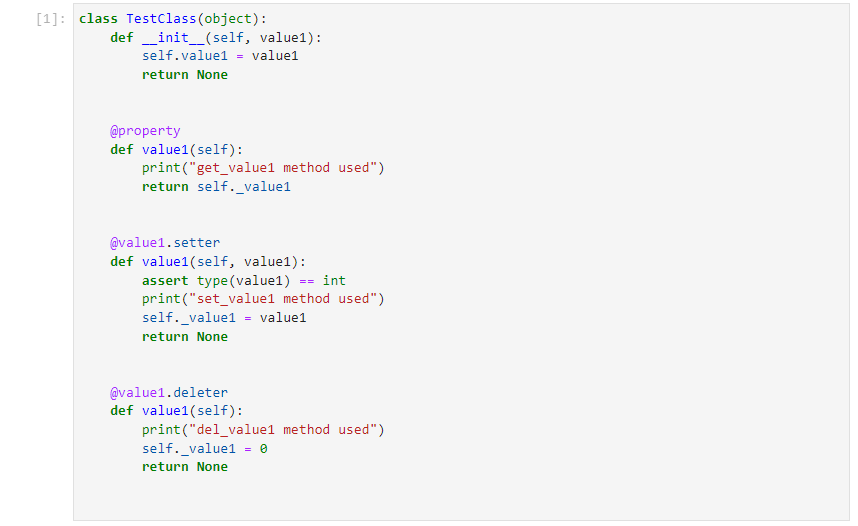

The class instantiates when provided with the correct number of input arguments of the correct datatype:

```
instance1 = TestClass(4)
```


If the instance name ```instance1``` is input followed by a dot ```.``` and tab ```↹```, the list of available functions and attributes displays:


In this case, only ```value1``` displays and this attribute is get, set and deleted using regular Python syntax:

```
instance.value1
instance.value1 = 10
instance.value1
del instance.value1
instance.value1
```


This is a much cleaner solution than having 3 additional methods populate in the list for each attribute.

The attribute can also be used with the inbuilt Python functions ```hasattr```, ```getattr```, ```setattr``` and ```delattr```:

```
hasattr(instance1, "value1")
getattr(instance1, "value1")
setattr(instance1, "value1", 5)
getattr(instance1, "value1")
delattr(instance1, "value1")
getattr(instance1, "value1")
```

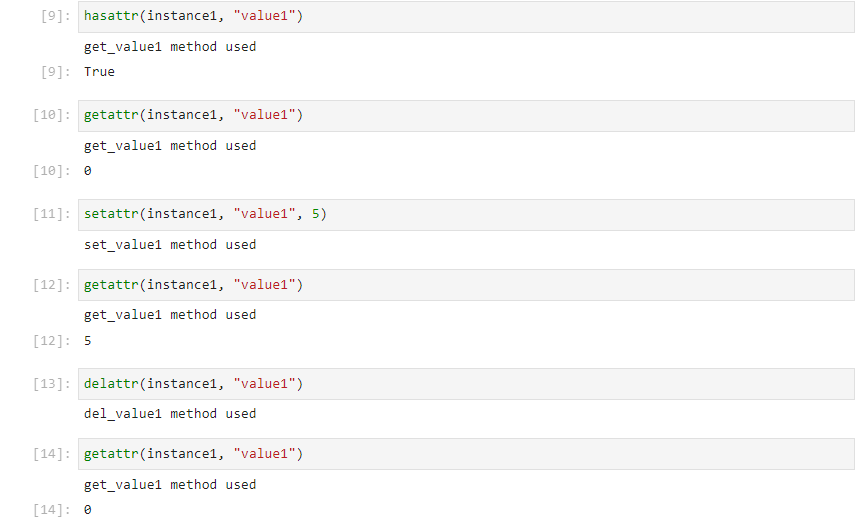

## Class Variable

A class variable is a variable assigned within the class without reference to an instance ```self```:

```
class TestClass(object):
    
    value1 = 1
    
    def __init__(self):
        return None
    
    
```

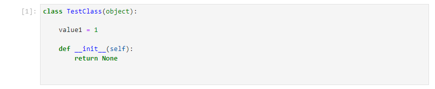

In this simple example, there are no input arguments required to instantiate the class:

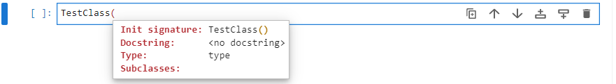

Three instances can be made:

```
instance1 = TestClass()
instance2 = TestClass()
instance3 = TestClass()
```

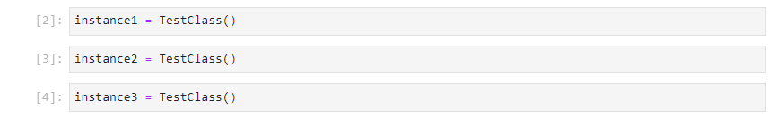

Each instance can access the class variable as an attribute:

```
instance1.value1
instance2.value1
instance3.value1
```

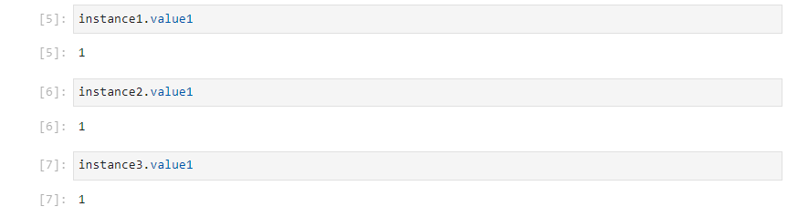

If the attribute is assigned in one of the instances, it does not effect the other instances:

```
instance1.value1 += 1
instance1.value1
instance2.value1
instance3.value1
```

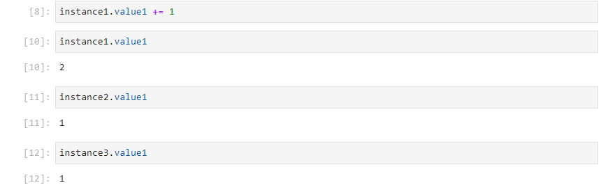

The variable can also be accessed from the class (hence the name class variable):


```
TestClass.value1
```


If the class variable is reassigned from the class:

```
TestClass.value1 = 10
```

Notice it updates the value of the attribute for each instance of the class:

```
TestClass.value1
instance1.value1
instance2.value1
instance3.value1
```

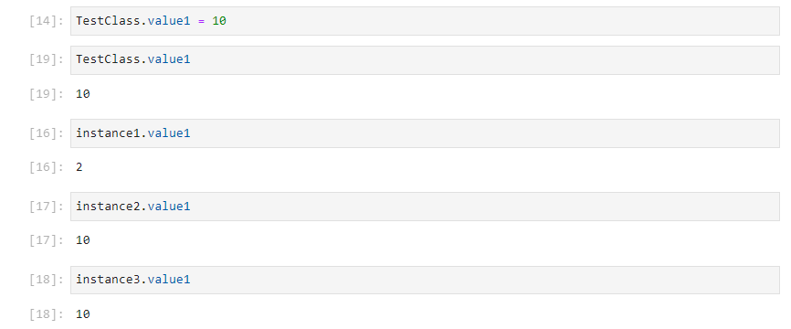

The only attribute that wasn't updated was for ```instance1``` due to the attribute previously being assigned an integer value independent of the class.

The class variable can be used to count the number of instances. ```n_instances``` is initially assigned to ```0``` however the initialisation method ```__init__``` updates it by 1 for every instance created. A print statement will be added to initialisation method ```__init__``` to show the value of ```n_instances``` for clarity:

```
class TestClass(object):
    
    n_instances = 0
    
    def __init__(self):
        TestClass.n_instances += 1
        print(f"n_instances={TestClass.n_instances}")
        return None
    
    
```    

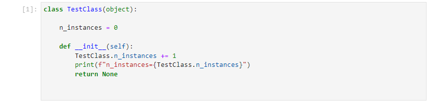

```
instance1 = TestClass()
instance1.n_instances
instance2 = TestClass()
instance1.n_instances
instance2.n_instances
instance3 = TestClass()
instance1.n_instances
```

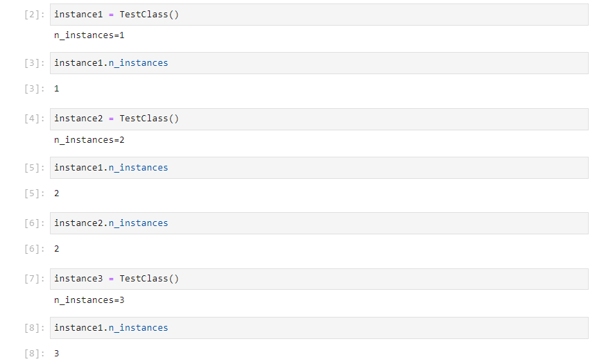

## Class Methods and Static Methods

### Instance Method

An example of a class with an instance method is as follows:

```
class TestClass(object):
    
    def __init__(self):
        return None
    
    
    def instance_method(self):
        return None

    
```    

An instance can be created using:

```
instance1 = TestClass()
```

The method can be called from the instance using:

```
instance1.instance_method()
```

The method can be called from a class, providing an instance as an input argument using:

```
TestClass.instance_method(instance1)
```

The method cannot be called from a class without an instance:

```
TestClass.instance_method()
```

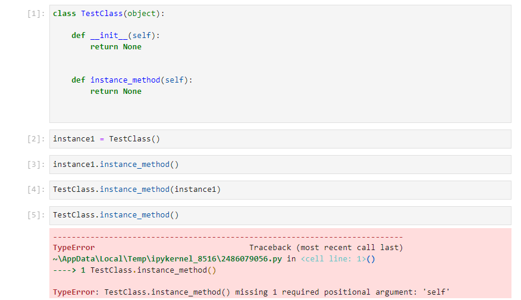

### Class Method

It is possible to create a class method which can be run from the class without speciying an instance:

```
? classmethod
```

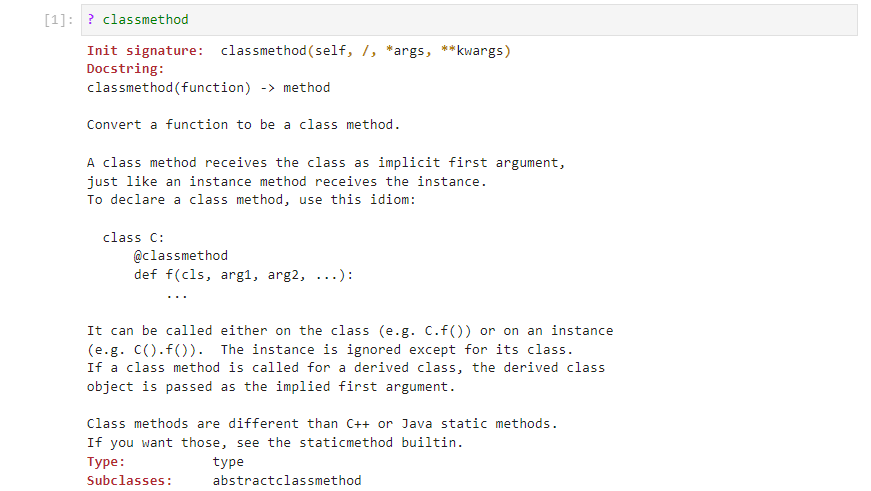

Notice in the definition, the decorator ```@classmethod``` is used and the 1st positional input argument is the class ```TestClass``` and not the instance ```self```:

```
class TestClass(object):
    
    def __init__(self):
        return None
    
    @classmethod
    def class_method(TestClass):
        return None

    
```

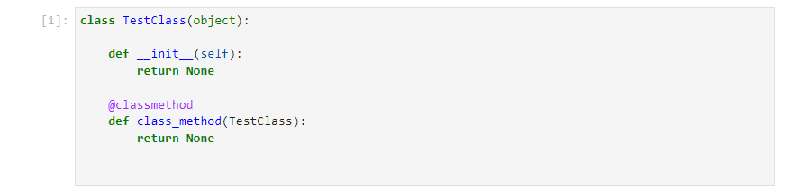

The method can be called from a class without an instance using:

```
TestClass.class_method()
```

An instance can be created using:

```
instance1 = TestClass()
```

The class method can also be called from the instance using:

```
instance1.class_method()
```

The method cannot be called from a class with an instance supplied as too many input arguments are provided:

```
TestClass.class_method(instance1)
```

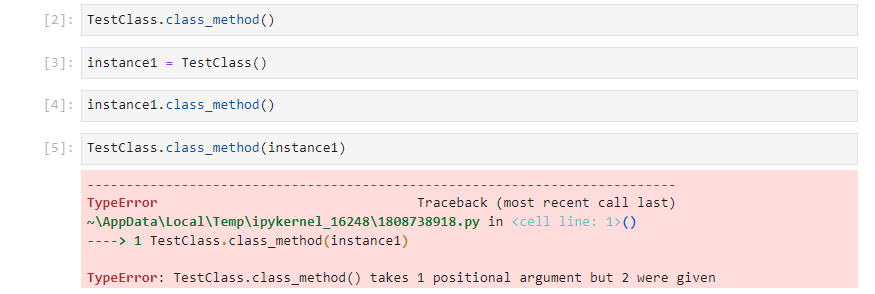

### Static Method

It is also possible to create a static method which works like a regular function but exists within the namespace of the class: 

```
? staticmethod
```

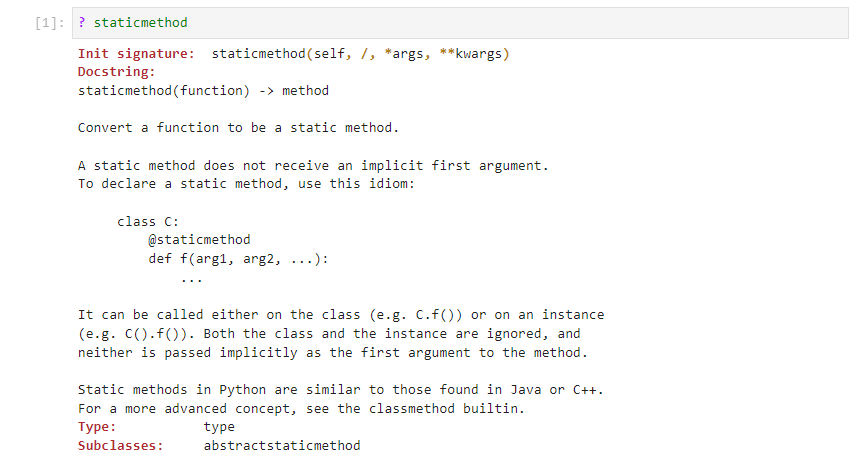

Notice in the definition, the decorator ```@staticmethod``` is used and the 1st positional input argument is absent; neither the class ```TestClass``` nor the instance ```self``` are provided as this static method is more similar to a standard function:

```
class TestClass(object):
    
    def __init__(self):
        return None
    
    @staticmethod
    def static_method():
        return None

    
```    

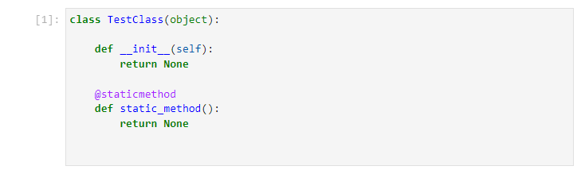

The method can be called from a class without an instance using:

```
TestClass.static_method()
```

An instance can be created using:

```
instance1 = TestClass()
```

The class method can also be called from the instance using:

```
instance1.static_method()
```

The method cannot be called from a class with an instance supplied as too many input arguments are provided:

```
TestClass.static_method(instance1)
```

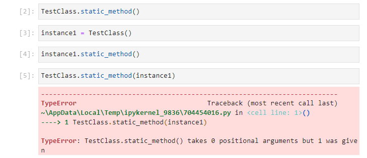


Instance methods need a class instance and can access the instance through self.

Class methods don’t need a class instance. They can’t access the instance (self) but they have access to the class itself via cls.

Static methods don’t have access to cls or self. They work like regular functions but belong to the class’s namespace.

Static and class methods communicate and (to a certain degree) enforce developer intent about class design. This can have maintenance benefits.

## Inheritance 

