# Classes

## Datamodel Identifiers

In the previous tutorials, methods and attributes were examined for the string, integer, floating point, boolean, list, tuple, set and dictionary classes. If the ```dir``` function is used on a class or any instance of a class, additional datamodel identifiers displayed. These datamodel identifiers are not typically used directly and were observed to map to inbuilt Python functions or operators.


|datamodel identifier|purpose, function or operator|
|---|---|
|\_\_new\_\_(cls)|constructor creates a new instance|
|\_\_init\_\_(self, a, b)|initializer creates instance variables self.a and self.b|
|\_\_getattribute(self)\_\_|self.attr|
|\_\_setattr(self, value)\_\_|self.attr = value|
|\_\_delattr(self)\_\_|del self.attr|
|\_\_class\_\_(self)|type(self)|
|\_\_dir\_\_(self)|dir(self)|
|\_\_doc\_\_|? cls|
|\_\_doc\_\_|? self|
|\_\_repr\_\_(self)|repr(self)|
|\_\_str\_\_(self)|str(self)|
|\_\_int\_\_(self)|int(self)|
|\_\_float\_\_(self)|float(self)|
|\_\_sizeof(self)\_\_|sys.getsize(self)|
|\_\_hash(self)\_\_|hash(self)|


```__new__``` is a class method and returns a new instance of a class. The ```__new__``` method normally calls the ```__init__``` method which is used to initialize instance variables. ```__doc__``` is a class attribute which can be accessed from the class and any instance of the class.

For a collection, the typical datamodel methods were observed.

|datamodel method|function or operator|
|---|---|
|\_\_len\_\_(self)|len(self)|
|\_\_getitem\_\_(self, key)|self[key]|
|\_\_setitem\_\_(self, key, value)|self[key] = value|
|\_\_add\_\_(self, other)|self + other|
|\_\_mul\_\_(self, other)|self * other|
|\_\_iter\_\_(self)|iter(self)|
|\_\_reversed\_\_(self)|reversed(self)|

A collection can store multiple values and has a length.

A string, list and tuple are ordered collections with numeric keys known as indexes. In a dictionary which is an unordered collection the key is typically a string. A set is an unordered collection without a key.

In a collection the ```+``` operator is setup for concatenation and the ```*``` operator is setup to perform collection replication using an integer.

The ```__iter__``` method converts the iterable object into an iterator which is used when looping over a collection. When using the classes ```list```, ```tuple``` and ```dict``` to cast from one collection to another, the iterator can be thought of as an intermediate. For example:

```
d1 = {"a": 1, "b": 2, "c": 3}
l1 = list(d1)
```

```
d1 = {"a": 1, "b": 2, "c": 3}
i1 = iter(d1)
l1 = list(i1)
```

For a number, the typical datamodel methods were observed.

|datamodel method|function or operator|
|---|---|
|\_\_add\_\_(self, other)|self + other|
|\_\_pos\_\_(self|+self|
|\_\_sub\_\_(self, other)|self - other|
|\_\_neg\_\_(self)|-self|
|\_\_mul\_\_(self, other)|self * other|
|\_\_exp\_\_(self, other)|self ** other|
|\_\_floordiv\_\_(self, other)|self // other|
|\_\_mod\_\_(self, other)|self % other|
|\_\_truediv\_\_(self, other)|self / other|
|\_\_abs\_\_(self)|abs(self)|
|\_\_ceil\_\_(self)|ceil(self)|
|\_\_round\_\_(self)|round(self)|
|\_\_and\_\_(self, other)|self | other|
|\_\_or\_\_(self, other)|self & other|
|\_\_xor\_\_(self, other)|self ^ other|
|\_\_eq\_\_(self, other)|self == other|
|\_\_ne\_\_(self, other)|self != other|
|\_\_gt\_\_(self, other)|self > other|
|\_\_ge\_\_(self, other)|self >= other|
|\_\_lt\_\_(self, other)|self < other|
|\_\_le\_\_(self, other)|self <= other|
|\_\_lshift\_\_(self, other)|self << other|
|\_\_rshift\_\_(self, other)|self >> other|
|\_\_invert\_\_(self)|~self|

If the following integer instances are created:

```
num1 = 1
num2 = 2
```

The datamodel method ```__sub__``` will perform subtraction:

```
num1.__sub__(num2)
```

Where ```num1``` is the instance known as self (the instance the operation is being carried out from) and ```num2``` is known as other (the other instance involved in the interaction).

The above operation is more commonly done using the ```-``` operator which is the operator the ```__sub__``` method maps to:

```
num1 - num2
```

Some of the methods are prefixed with a ```r``` which stands for reverse. The reverse method carries out the operation from other opposed to self. The reverse operations are not too commonly used:

```
num1.__rsub__(num2)
```

```
num2 - num1
```

Some of the methods above are prefixed with an ```i```. The ```i``` stands for inplace and is shorthand notation for an operation involving a reassignment. For example:

```
num1 = num1 - num2
```

is shortened to:

```
num1 -= num2
```

## The object class

If ```object()``` is input followed by a shift ```⇧``` and tab ```↹``` the docstring for the intializer displays.

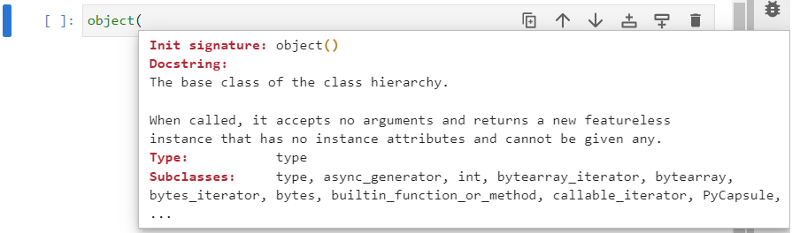

Notice that every inbuilt class is listed as a subclass. A subclass is a modified copy of a class and in Python everything is a modified copy or modified copy of a copy of an object.

An instance of an object can be created using:

```
obj1 = object()
obj2 = object()
```

When ```obj.``` is input followed by a tab ```↹``` no identifier displays because no custom identifier has been defined in the ```object``` class:


However when the ```dir``` function is used, the following datamodel identifiers display:

```
dir(obj1)
```


In Python an ```object``` has inherent functionality and recognises the name of all the datamodel idenifiers that map to inbuilt functions and operators.

The ones listed in the directory above are defined. ```__dir__``` for example is defined, which is why the ```dir``` function worked on the instance of the ```object``` class. ```__repr__``` is also defined so the ```repr``` function will also work.

```
repr(obj1)
repr(obj2)
```


The ```__eq__``` datamodel method is also defined so the is equal to operator ```==``` can be used:

```
obj1 == obj2
```


These are two different objects so are not equal to one another.

```
obj1 == obj1
```


The ```+``` operatorand whennd looks for the corresponding ```__add__``` datamodel method within the ```object``` class which is not defined so a ```TypeError``` displays.

```
obj1 + obj2
```


## Class Names CamelCaseCapitalization

The ```class``` keyword is used to create a new class. This is followed by the class name. For the class name ```CamelCaseCapitalization``` is typically used and this differenciates custom classes from inbuilt classes. The class name is followed by parenthesis and the parenthesis enclose the parent class. By default a child class will inherit all the properties of the parent class, unless they are redefined. If no parent class is given, the parent class will automatically be assumed to be an object. After the parenthesis a colon ```:``` is present indicating the beginning of a code block. This code block normally contains several functions which each have their own perspective code blocks.

A custom class called ```ModObj``` can be created.  for class names.

```
class ModObj(object):
    pass


```

This class ```ModObj``` has been given no additional functionality to the parent ```object``` class. So creating the following instances and using ```repr``` and the is equal to ```==``` operator yields very similar results:

```
mobj1 = ModObj()
mobj2 = ModObj()
repr(mobj1)
repr(mobj2)
mobj1 == mobj2
```


## Methods (Functions which Operate on Instance variables)

Conceptually a class can be thought of as a collection of functions.

```
class ModObj(object):
    def fun1():
        return None
    def fun2():
        return None
    def fun3():
        return None
    def fun4():
        return None
```

Recall that functions used from an instance of a class are normally designed to interact with the instance it*self*. For example the string methods called from a string instance are designed to interact with the unique text in the string instance. Therefore, they need to be able to read and work on the instance data in some capacity. In order for them to act upon an instance, the first positional input argument must be ```self```.

```
class ModObj(object):
    def fun1(self):
        return None
    def fun2(self):
        return None
    def fun3(self):
        return None
    def fun4(self):
        return None
```

An instance can be created:

```
mobj1 = ModObj()
```

Notice that when ```mobj1.``` is input followed by a tab ```↹``` the four additional identifiers display:

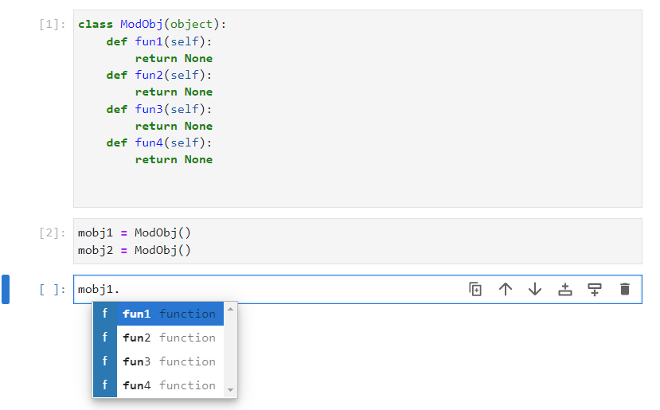

The docstring of the first one of these can be viewed by inputting ```mobj1.fun1()``` followed by a dot ```.``` and tab ```↹```. Notice that in the empty docstring ```self``` is not mentioned because it is implicitly implied. As the method is being called from ```mobj1```, ```self``` is implied to be ```mobj1```. 


So this method can be called using:

```
mobj1.fun1()
```

This method does nothing but return ```None```.


If on the otherhand the class ```ModObj``` is input followed by a tab ```↹``` the four additional identifiers display. 


The docstring of the first one of these can be viewed by inputting ```ModObj.fun1()``` followed by a dot ```.``` and tab ```↹```. Notice that in the empty docstring ```self``` is mentioned because it is being called from the class itself and has no instance data. An instance needs to be explicitly implied.


So this method can be called and applied to the instance ```mobj1``` using:

```
ModObj.fun1(mobj1)
```


## Attributes (Instance Variables)

A class attribute is a variable created within a class:

```
class ModObj(object):
    var1 = "value1"
    var2 = "value2"
```

Once again two instances can be created:

```
mobj1 = ModObj()
mobj2 = ModObj()
```

Notice that when ```mobj1.``` is input followed by a tab ```↹``` the two identifiers display:

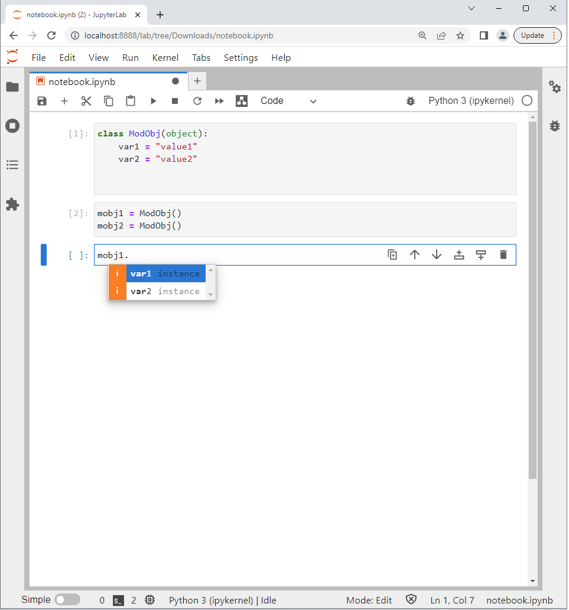

The class attributes can be accessed from an instance using:

```
mobj1.var1
mobj1.var2
```

```
mobj2.var1
mobj2.var2
```


If the class ```ModObj``` is input followed by a tab ```↹``` the two identifiers display.


```
ModObj.var1
ModObj.var2
```

These variables are class variables and are accessible from the class without specifying an instance. The value is the same for the class and every instance of the class. 


An attribute can be read by using the object name followed by a dot ```.``` and then the attribute name. For example:

```
mobj1.var1
```

A value can be reassigned to an existing attribute or a new attribute uing the syntax above with the assignment operator. For example:

```
mobj1.var3 = "value3"
```

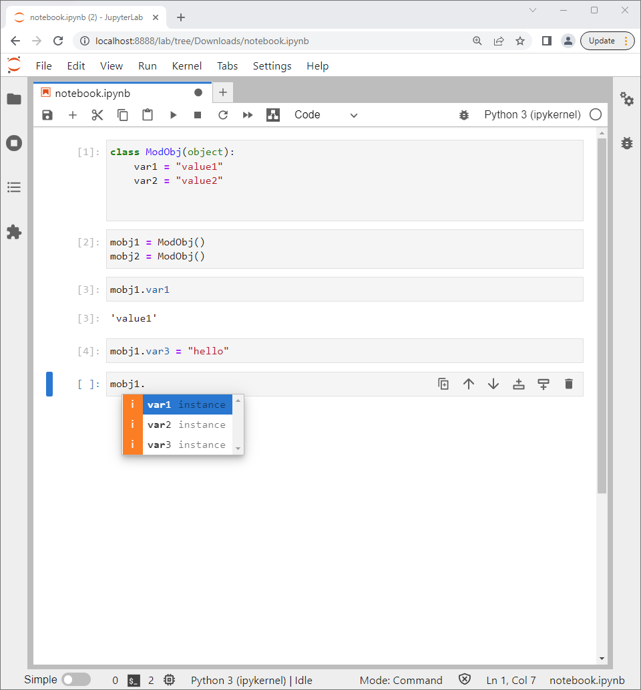

An attribute can be deleted using:

```
del mobj1.var3
```


## The constructor \_\_new\_\_ static method and initializer \_\_init\_\_ instance method

In the above example, all the attributes were class variables with exception to the attribute ```mobj1.var3``` which was both an attribute unique to the instance ```mobj1``` and had a unique value.

In the case of a string, instance data is provided to the variable name during instantiation and the string methods are setup to manipulate the instance data.

```
greeting = "hello"
farewell = "bye"
greeting.upper()
farewell.upper()
```


The ```str``` is an inbuilt class and the shorthand notation used above is typically used to construct and initialize a string. 

To construct and initialize a string the ```str``` class can be used. Notice that the docstring for the initialization signature displays and in this case the variable number of positional input arguments ```*args``` can  supplied using a string of characters:

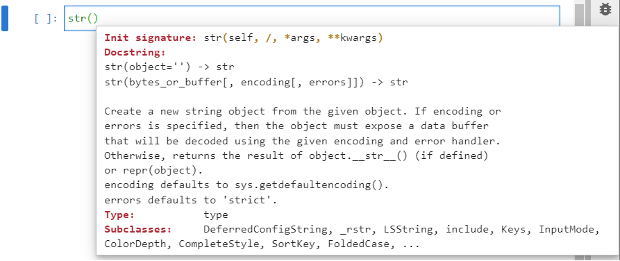

```
greeting = str("hello")
farewell = str("bye")
greeting.upper()
farewell.upper()
```


Using ```greeting = str("hello")``` calls the constructor static method ```str.__new__()``` and this returns an instance of the class which is internally called ```self```. During instantiation, ```self``` is assigned to the object name or instance name ```greeting```. The ```__new__``` constructor then calls the instance ```__init__``` initializer method which initializes the string instance ```greeting``` using the supplied characters ```"hello"```.

```__new__``` is a datamodel static method defined in the ```object``` class. Its behaviour isn't typically altered however for illustration it will be overridden to include a print statement.


A static method is bound to a class opposed to an instance of the class and can be called from both a class and an instance of the class.

To distinguish a static method from a regular standard instance method, the decorator  ```@staticmethod``` is used before the method definition.

A static method does not require a class instance to be created in order to be called. As a static method is not bound to an instance, it does not have ```self``` as its first input argument. This is particularly important for ```__new___``` as its purpose is to create the instance ```self``` which cannot be accessed until it is created.

The first input argument of ```__new__``` is the class ```cls``` and is required so ```__new___``` constructs an instance of the appropriate class. As ```cls``` is within the class ```ModObj```, ```cls``` is taken to be ```ModObj``` (```ModObj``` is not used here directly as being more generic makes its easier to work with subclasses). 

Within the ```ModObj.__new___``` method, the ```object.__new__(cls)``` will be called. The ```cls``` is supplied to it so it makes an instance of ```ModObj``` opposed to an instance of the ```object``` class:

```
class ModObj(object):
    @staticmethod
    def __new__(cls):
        print("Constructor Called")
        obj = object.__new__(cls)
        return obj
```

Two instances can be instantiated and the print statement included in the ```__new__``` constructor displays:

```
obj1 = ModObj()
obj2 = ModObj()
repr(obj1)
obj1 == obj2
```


The behaviour is the same as before, except the print statement displays when an instance is created indiciating the ```__new__``` constructor has been used.

The constructor class method ```__new__``` by default calls the initialization method ```__init__```. 

The ```__init__``` requires the instance ```self``` as its first positional input argument and is used to create instance variables. this method has no return value. In this case no instance variables are created but a print statement will be added.

```
class ModObj(object):
    @staticmethod
    def __new__(cls):
        print("Constructor Called")
        obj = object.__new__(cls)
        return obj
    
    
    def __init__(self):
        print("Initializer Called")
        return None


```

Two instances can be created and the ```repr``` function and is equal to operation ```==``` can be used as before:

```
obj1 = ModObj()
obj2 = ModObj()
repr(obj1)
obj1 == obj2
```


The ```__init__``` method can be modified to create an instance variable that is a string. This takes in a value as an input argument and is assigned to an attribute of ```self```:

```
class ModObj(object):
    @staticmethod
    def __new__(cls):
        print("Constructor Called")
        obj = object.__new__(cls)
        return obj
    

    def __init__(self, word):
        print("Initializer Called")
        self.text = word
        return None


```

Because the ```__new__``` class method calls the ```__init__``` method, all of the input arguments required for the ```__init__``` method needs to be supplied from ```__new___```. ```self``` is already provided as ```__new___``` creates the instance ```self``` however in this case ```word``` is not supplied by ```__new___``` and for this reason does not display in the initialization signature:

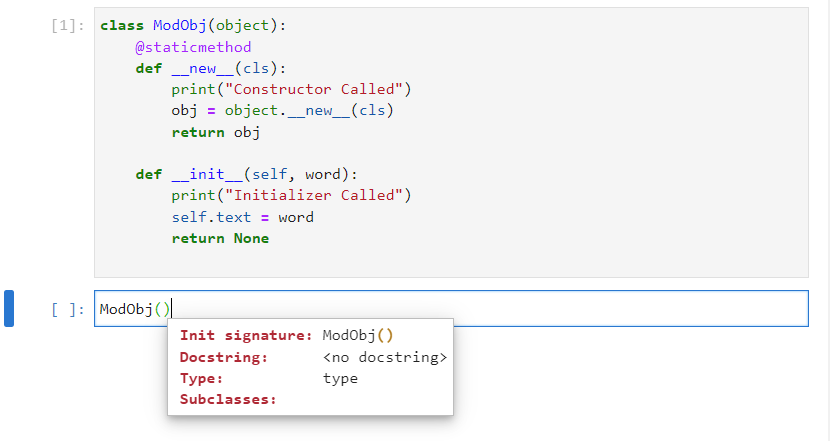

The input argument ```word``` needs to be provided as an input argument in the definition of the ```ModObj.__new__``` despite not being used directly by this static method. This static method calls the ```ModObj.__init__``` which requires this input argument. Note however it should not be supplied to the call to ```object.__new__``` as this method does not have this input argument:

```
class ModObj(object):
    @staticmethod
    def __new__(cls, word):
        print("Constructor Called")
        obj = object.__new__(cls)
        return obj
    

    def __init__(self, word):
        print("Initializer Called")
        self.text = word
        return None


```

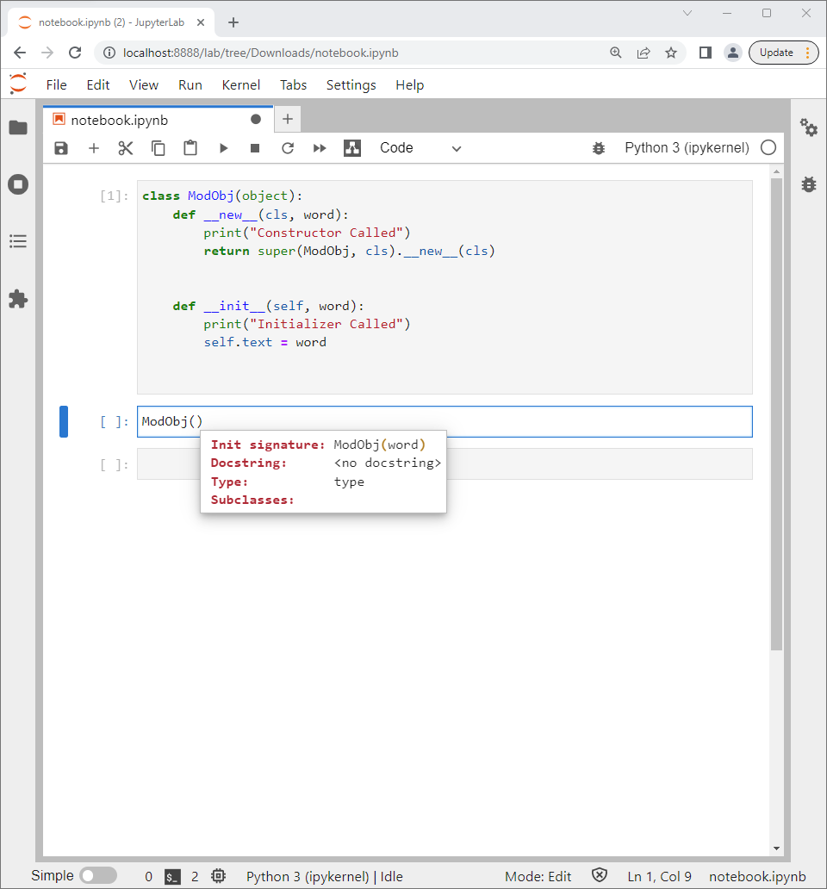

Sometimes in the more general case ```*args``` and ```**kwargs``` are used to pass in a flexible number of positional and keyword input arguments:

```
class ModObj(object):
    def __new__(cls, *args, **kwargs):
        print("Constructor Called")
        return super(ModObj, cls).__new__(cls)
    
    
    def __init__(self, word):
        print("Initializer Called")
        self.text = word


```

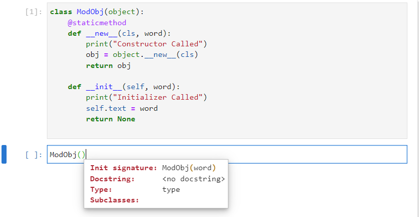

Two instances can be created, during instantiation, instance data is requested under the input argument ```word``` and an instance variable or attribute called ```text``` is created from this provided ```word```.

```
greeting = ModObj("hello")
farewell = ModObj("bye")
greeting.text
farewell.text
```

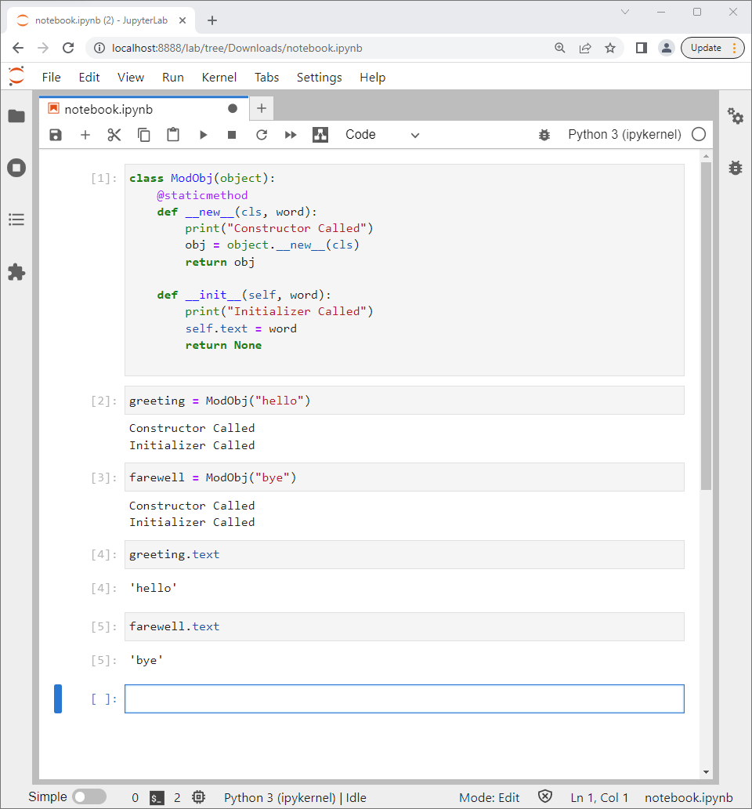

It is common for the name of the input arguments of the initializer to have the same name as the corresponding attributes that data is going to be assigned to. And some details about the expected input argument can be provided using docstrings.

```
class ModObj(object):
    """
    modified object
    """
    @staticmethod
    def __new__(cls, text):
        """
        constructs
        """
        obj = object.__new__(cls)
        return obj
    
    def __init__(self, text):
        """
        initializes
        text : str
        """
        self.text = text
        return None


```


It is more common to use ```__new__``` unmodified from the parent ```object``` class and to define the ```__init__``` in the child class to initializes the instance variables, to make them attributes. An additional method can also be defined which operates on the instance variable ```text``` modifying it in place.

```
class ModObj(object):
    """
    modified text object
    """

    def __init__(self, text):
        """
        text : str
        """
        self.text = text
        return None


    def capitalize(self):
        """
        capitalizes text inplace
        """
        self.text = self.text.capitalize()
        return None
```


The code can be tested using:

```
greeting = ModObj("hello")
greeting.text
```

If ```greeting.capitalize()``` is input followed by a shift ```⇧``` and tab ```↹```, the docstring displays:

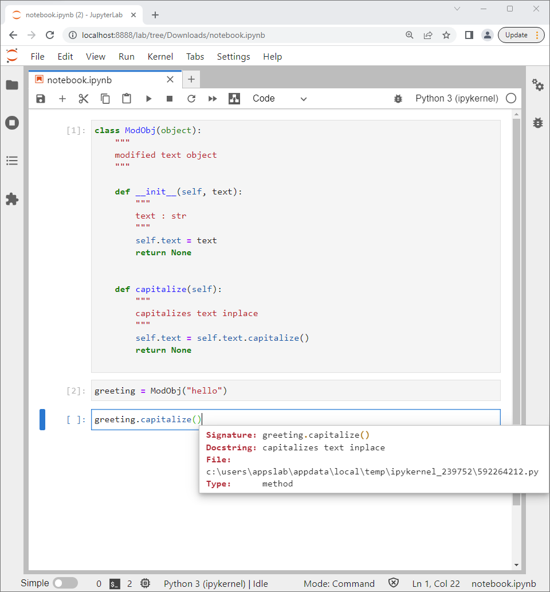

This method can be used and the attribute can be redisplayed:

```
greeting.capitalize()
greeting.text
```


The ```__repr__``` method can be used to change the string representation when the ```repr``` function is used on the ModObj instance or if a ModObj instance is shown in the call output. This method should be configured to return a string. A formatted string will be used:

```
class ModObj(object):
    """
    modified text object
    """

    def __init__(self, text):
        """
        text : str
        """
        self.text = text
        return None


    def __repr__(self):
        return f"ModObj: {self.text}"


    def capitalize(self):
        """
        capitalizes text inplace
        """
        self.text = self.text.capitalize()
        return None


```

The code can be tested using:

```
ModObj("hello")
```

because there is no assignment to a variable the representation string displays.

If assignment to a variable is performed.

```
greeting = ModObj("hello")
```

The ModObj instance is stored as the variable and the representation string does not show.

The method ```captilize``` can be used and this is seen to be performed inplace.

```
greeting.capitalize()
greeting
```


The behaviour of the ```capitalize``` method can be modifed to return a new instance opposed to carrying an inplace operation. This is done by accessing the attribute, modifying the value of the attribute and returning a new instance with the modified attribute opposed to updating the existing attribute via reassignment:

```
class ModObj(object):
    """
    modified text object
    """

    def __init__(self, text):
        """
        text : str
        """
        self.text = text
        return None


    def __repr__(self):
        return f"ModObj: {self.text}"


    def capitalize(self):
        """
        capitalizes text inplace
        """
        new_text = self.text.capitalize()
        return ModObj(new_text)
    

```    

This behaviour can be observed using:

```
greeting = ModObj("hello")
greeting.capitalize()
greeting
```


## Class Variables 

The initialization method is normally used to create instance variables using unique supplied data in the form of input arguments during initialization. A class variable is a non-unique value that is stored between all classes. Class variables are useful when the same information is to be provided for every instance of the class. A docstring for example can be conceptualised as a class variable as it is a piece of text that is the same for the class and every instance of the class. It would be very tedious to have a docstring as an instance variable and request the user to input it every time during instantiation for example.

Another case of a class variable can be used to create a counter for the class. This will be used to both count the number of instances created (class variable) and to construct a unique serial number for each instance (instance variable).

The class variable ```n_instances``` is created in the class outwith any function and set to an initial value of 0.

The ```__init__``` method is modified to create the ```text``` attribute (as before) and also to call another method called ```counter```. This method ```counter``` needs the input argument ```self``` as it will access instance data. It access the class variable ```ModObj.n_instances```, increments it by 1 and then also assigns this value to an instance variable called ```serial```:

```
class ModObj(object):
    """
    modified text object
    """
    n_instances = 0
    print(f"n_instances: {n_instances}")

    def __init__(self, text):
        self.text = text
        self.counter()
    
    def counter(self):
        ModObj.n_instances += 1
        self.serial = ModObj.n_instances
        print(f"n_instances: {ModObj.n_instances}")
        print(f"serial: {self.n_instances}")


```

```n_instances``` can be seen to be 0 when the class is created and increments when every new instance is created. The serial of every new instance is also updated. 

```
greeting = ModObj("hello")
farewell = ModObj("bye")
```

If the first instance is re-examined, its instance attribute ```serial``` has remained 1 but the class variable ```n_instances``` has been updated to 2:

```
greeting.n_instances
greeting.serial
```

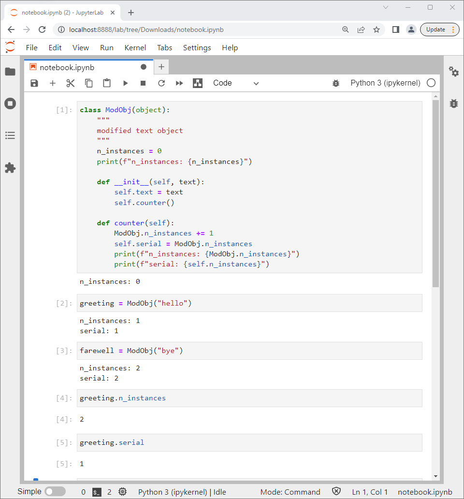

## Class Methods (Alternative Constructor)


A class method is bound to a class opposed to an instance of the class and can be called from both a class and an instance of the class.

To distinguish a class method from a regular standard instance method, the decorator  ```@classmethod``` is used before the method definition.

A class method does not require a class instance to be created in order to be called. As a class method is bound to a class ```cls``` opposed to an instance ```self``` and therefore has ```cls``` as its first input argument.

The main purpose of a class method is normally for an alternative constructor, which returns an instance of the class. The ```datetime``` class can be used as an example.

The ```datetime``` module can be imported using the alias ```dt```.

```
import datetime as dt
```

And from the alias ```dt```, the ```datetime``` class can be accessed.

The standard constructor uses ```__new__``` and ```__init__``` and prompts for a series of numeric input arguments corresponding to the year, month, day, hour, minute, second and microsecond:


An alternative constructor called from the datetime class is the class method ```now``` which reads the values off the system clock and uses them to construct a datetime instance which the class method returns:


Another alternative constructor called from the datetime class is the class method ```fromtimestamp``` which requests the time in milliseconds using 1970 01 01 00:00:00:000 as time zero. This method calculates what this is in year, month, day, hour, minute, second and microsecond and uses these values to construct a datetime instance which the class method returns.


As an example, an alternative constructor can be made that accepts numeric input requesting the numeric int ```num```. This alternative constructor will convert the number into a string which can be recognised by the standard initializer which will be called in the return statemnt to make a new instance. 

To distinguish a class method from a standard isntance method, the decorator  ```@classmethod``` is used before the method definition. In addition the first input argument in a class method is ```cls``` opposed to ```self```.

Each individual numeric character will be converted into its equivalent string. For simplicity ```1``` will be converted to ```"one"``` and ```11``` will be converted to ```one one```.

```
class ModObj(object):

    def __init__(self, text):
        self.text = text
        
        
    @classmethod    
    def fromnum(cls, num):
        num_str = str(num)
        value = ""
        nums = {"0": "zero", "1": "one", "2": "two", "3": "three", 
                "4": "four", "5": "five", "6": "six", "7": "seven",
                "8": "eight", "9": "nine"}
        for char in num_str:
            value += nums[char]
            value += " "
        value = value[:-1]
        return ModObj(value)


```

The standard constructor can be tested using the string ```"hello"``` and assigning it to the object name ```greeting```. The alternative constructor which uses the class method ```fromnum``` can be tested using the number ```100``` and assigning it to the object name ```onehundred```:

```
greeting = ModObj("hello")
onehundred = ModObj.fromnum(100)
greeting.text
one.text
```


## Static Methods (Class Namespace Functions)

Use of a static method was explored in the special case of the ```__new__``` datamodel method.


A static method is bound to a class opposed to an instance of the class. As a static method is not bound to an instance or class, it does not have ```self``` or ```class``` as its first input argument.

A static method is essentially a standard function, that does not need to access instance variables and can be called from both a class and an instance of the class.

The static method is boud to the namespace of a class simply to make it more convenient for a user to find. This is done for a function the user may associate with the class but as mentioned does not need internal access to an instance variable to operate.

To distinguish a static method from a regular standard instance method, the decorator  ```@staticmethod``` is used before the method definition.

A static method greeting can be defined that takes in a users name and prints it. This input argument ```name``` is not associated with any instance of the class.

```
class ModObj(object):
    @staticmethod
    def greeting(name):
        print(f"Hello {name}")
        return None
    

```

Two instances can be created and the ```__Init__``` method takes no input arguments:

```
obj1 = ModObj()
obj2 = ModObj()
```

The static method behaves just like a function and can be called from the class itself or any instance of the class:

```
ModObj.greeting("Philip")
obj1.greeting("Lucie")
obj2.greeting("Sarah")
```


## get, set and del

```
class ModObj(object):
    """
    modified text object
    """

    def __init__(self, text):
        """
        text : str
        """
        self.text = text
        return None


    def __repr__(self):
        return f"ModObj: {self.text}"


    def capitalize(self):
        """
        capitalizes text inplace
        """
        new_text = self.text.capitalize()
        return ModObj(new_text)
    

```

```
one = ModObj(1)
```

```
one.capitalize()
```

error ...

The ```text``` attribute will be renamed ```_text```. The prefix of the attribute name with the underscore is a convention used to indicate that the attribute is designed to be used internally within a class. For comparison a second attribute ```text2``` will be created without the underscore. Both these input arguments will need to be supplied when instantiating a new instance of ```ModObj```.

```
class ModObj(object):
    """
    modified text object
    """

    def __init__(self, text, text2):
        """
        text : str
        """
        self._text = text
        self.text2 = text2
        return None


    def __repr__(self):
        return f"ModObj: {self._text}"


    def capitalize(self):
        """
        capitalizes text inplace
        """
        new_text = self._text.capitalize()
        return ModObj(new_text, self.text2)
   
   
```

Notice that when the instance is created:

```
greeting = ModObj("hello")
```

Inputting ```greeting.``` followed by tab ```↹``` only displays the attribute ```text2``` and the method ```capitalize```:


The internal attribute can still be seen when the directory is looked up using:

```
dir(greeting)
```


The ```property``` function can be used to handle how an attribute or property is accessed, set and deleted. If ```property()``` is input followed by shift ```⇧``` and tab ```↹``` the docstring displays:


Essentially a ```get```, ```set``` and ```del``` method are created and then linked using the function ```property```.


```
class ModObj(object):
    """
    modified text object
    """

    def __init__(self, text, text2):
        """
        text : str
        """
        self._text = text
        self.text2 = text2
        return None
    
    
    def _get_text(self):
        return self._text
    
    
    def _set_text(self, text):
        assert type(text) == str, "text must be str"
        self._text = text
        return None
    
    
    def _del_text(self):
        self._text = "empty"
        return None   
    
    
    text = property(fget=_get_text, fset=_set_text, fdel=_del_text, doc="The text property.")
    
    
    def __repr__(self):
        return f"ModObj: {self._text}"


    def capitalize(self):
        """
        capitalizes text inplace
        """
        new_text = self.text._capitalize()
        return ModObj(new_text, self.text2)
    

```    

Notice if ```ModObj.``` is input followed by a ```↹``` that the attribute ```text``` displays but the attribute ```text2``` does not display in the list of identifiers, because ```text2``` is only assigned within the ```__init__``` method and ```text``` is defined as a property.


If accessed using ```ModObj.text``` the output displays it is a property.


If used with help ```? ModObj.text```, the docstring provided for the property displays.


Because the ```text``` property is assigned using ```property``` with ```_get_text```, ```set_text``` and ```_del_text```, it can be accessed as ```text``` opposed to ```_text``` elsewhere within the class, for example in the methods ```__init__```, ```__repr__``` and ```capitalize```.

```
class ModObj(object):
    """
    modified text object
    """
    
    def __init__(self, text, text2):
        """
        text : str
        """
        self.text = text
        self.text2 = text2
        return None
    
    def _get_text(self):
        return self._text
    
    
    def _set_text(self, text):
        assert type(text) == str, "text must be str"
        self._text = text
        return None
    
    
    def _del_text(self):
        self._text = "empty"
        return None   
    
    
    text = property(fget=_get_text, fset=_set_text, fdel=_del_text, doc="The text property.")


    def __repr__(self):
        return f"ModObj: {self.text}"


    def capitalize(self):
        """
        capitalizes text inplace
        """
        new_text = self.text.capitalize()
        return ModObj(new_text, self.text2)
    

```


```
class ModObj(object):
    """
    modified text object
    """

    def __init__(self, text):
        """
        text : str
        """
        self.text = text
        return None


    def __repr__(self):
        return f"ModObj: {self._text}"


    def capitalize(self):
        """
        capitalizes text inplace
        """
        new_text = self._text.capitalize()
        return ModObj(new_text)
    
    
    @property
    def text(self):
        return self._text
    
    
    @text.setter
    def text(self, text):
        assert type(text) == str, "text must be of the type str"
        self._text = text
        return None
    
    
    
```    


