# Copying Objects

## Assignment Operator

The assignment operator works from right to left and assigns the value on the right to the object name on the left. The following lists can be assigned to the object names or variable names ```n1``` and ```n2```:

```
n1 = ["a", "b", "c"]
n2 = ["d", "e", "f"]
```

Notice that these display on the Variable Inspector.

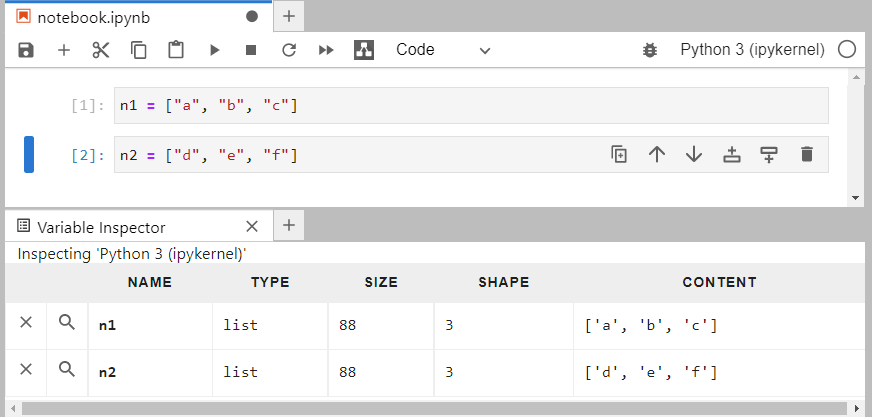

A list ```l1``` can be assigned that nests these existing lists and includes other string data:

```
l1 = [n1, n2, "g"]
```

This also displays on the Variable Inspector:

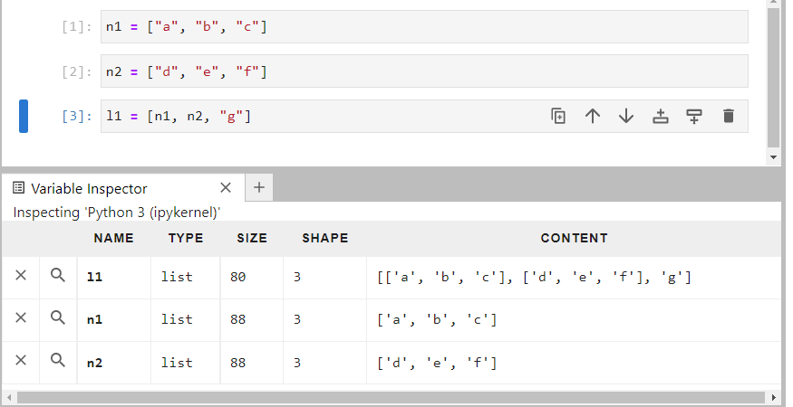

If ```l1``` is assigned to ```l2```, this assigns the existing object ```l1``` to the new object name ```l2``` both display on the variable inspector but ```l2``` is an alias of ```l1```:

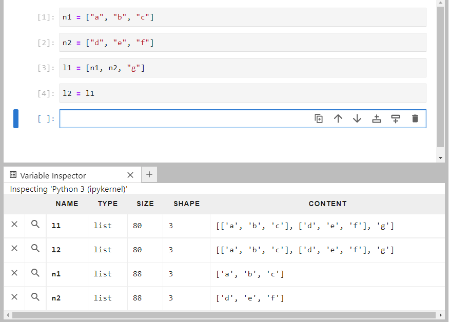

This can be seen by using. The is equal operator checks that both lists are equal in value, whereas the is operator checks whether the two objects are the same object. In both cases the result is ```True```:

```
l2 == l1
l2 is l1
```

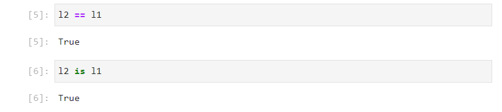

Therefore if any list methods are used on ```l2```, which mutate ```l2``` in place, the same changes will be made to ```l1``` as they are the same object:

```
l2.append("h")
```

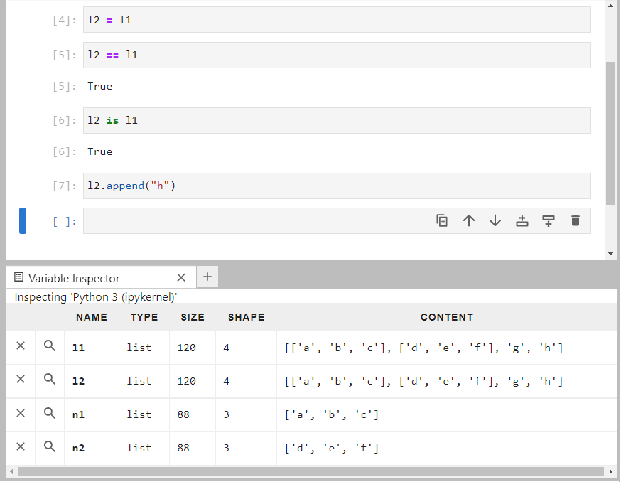

This can be seen on the variable explorer.

## Shallow Copy

The list method ```copy``` returns a shallow copy. Notice that the is equal operator states that ```l3``` and ```l1``` are equal however the is operator states that ```l3``` and ```l1``` are different objects. Use of a mutable list method such as ```append``` on ```l3``` now does not influence ```l1```.

```
n1 = ["a", "b", "c"]
n2 = ["d", "e", "f"]
l1 = [n1, n2, "g"]
l3 = l1.copy()
l3 == l1
l3 is l1
l3.append("h")
```

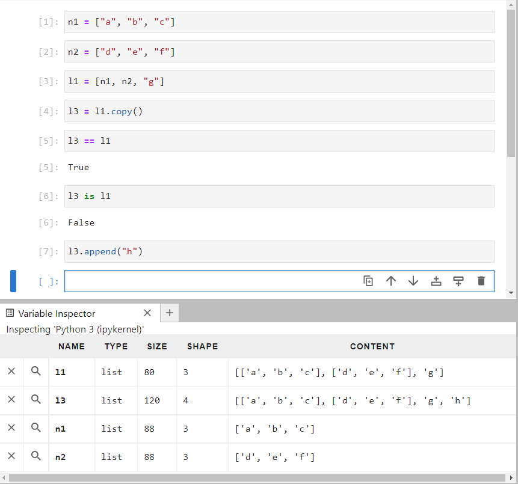

Both ```l1``` and ```l3``` contain nested lists ```n1``` and ```n3```. ```n2``` is the second element of ```l3``` (index 1) and the third element of this is indexed into (index 2) using:

```
l3[1][2]
```

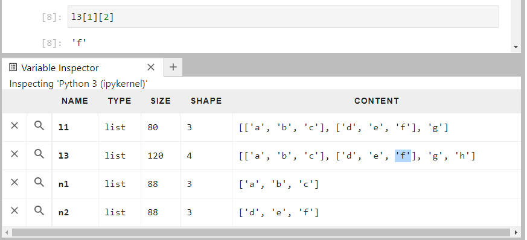

If this is assigned to a new value:

```
l3[1][2] = "X"
```

Notice that it is changed in ```n2``` and in ```l1``` also:

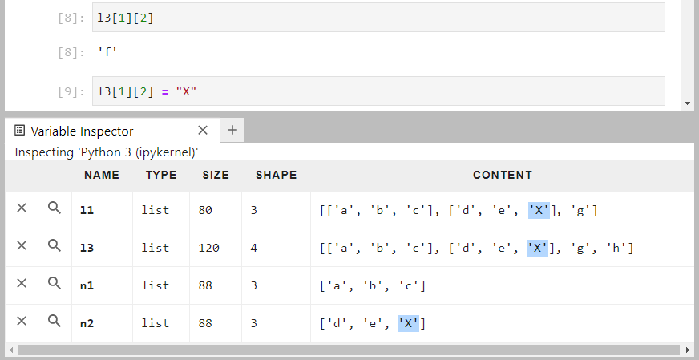

This is because the list method ```copy``` from ```l1``` created a shallow copy, the outer list of ```l1``` was copied but the objects being referenced in the list were not copied.

## The copy Module

Python has a ```copy``` module which is used for copying Python objects. It can be imported using:

```
import copy
```

And its docstring can be viewed by typing in:

```
? copy
```

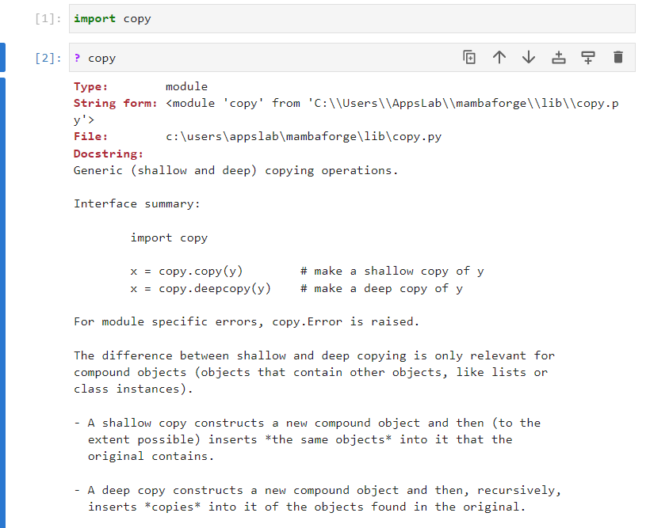

The difference between shallow and deep copying is only relevant for compound objects, that is objects that contain nested items, for example a list:

* A shallow copy constructs a new list and then inserts *the same objects* into it that the original contains.

* A deep copy constructs a new list and then, recursively,   inserts *copies* into it of the objects found in the original.

A list of identifiers in the ```copy``` module can be found by inputting ```copy.``` followed by tab ```↹```:

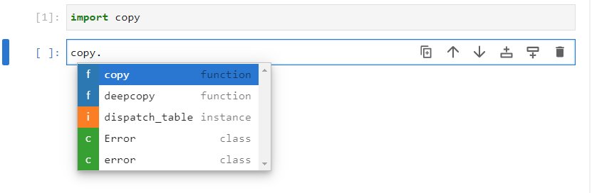

There are two copy functions ```copy``` which performs a shallow copy and ```deepcopy``` which performs a deep copy. 

The ```dispatch_table``` instance and two error classes ```Error``` and ```error``` are used to display errors when errors exist, mainly with the deep copy.

The docstring of the ```copy``` function from the ```copy``` module can be examined by inputting it with open parenthesis, followed by a shift ```⇧``` and tab ```↹ ```:

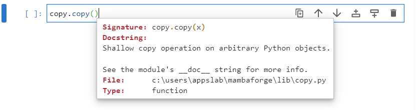

It performs identical behaviour to the lists ```copy``` method and ```n2``` and ```l1``` are mutated when one of the values of ```n2``` in ```l3``` is updated:

```
import copy
n1 = ["a", "b", "c"]
n2 = ["d", "e", "f"]
l1 = [n1, n2, "g"]
l3 = copy.copy(l1)
l3 == l1
l3 is l1
l3.append("h")
l3[1][2]
l3[1][2] = "X"
```

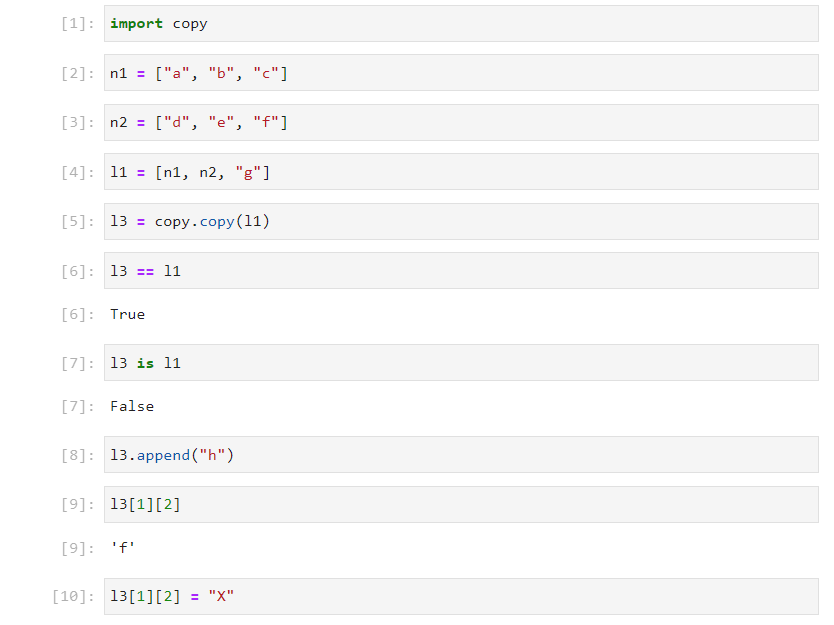

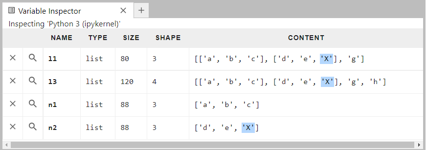

The docstring of the ```deepcopy``` function from the ```copy``` module can be examined by inputting it with open parenthesis, followed by a shift ```⇧``` and tab ```↹ ```:

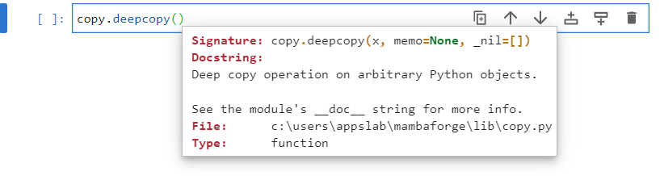

```n2``` and ```l1``` are not mutated when one of the values of the copy of ```n2``` in ```l3``` is updated:

```
import copy
n1 = ["a", "b", "c"]
n2 = ["d", "e", "f"]
l1 = [n1, n2, "g"]
l3 = copy.deepcopy(l1)
l3 == l1
l3 is l1
l3.append("h")
l3[1][2]
l3[1][2] = "X"
```

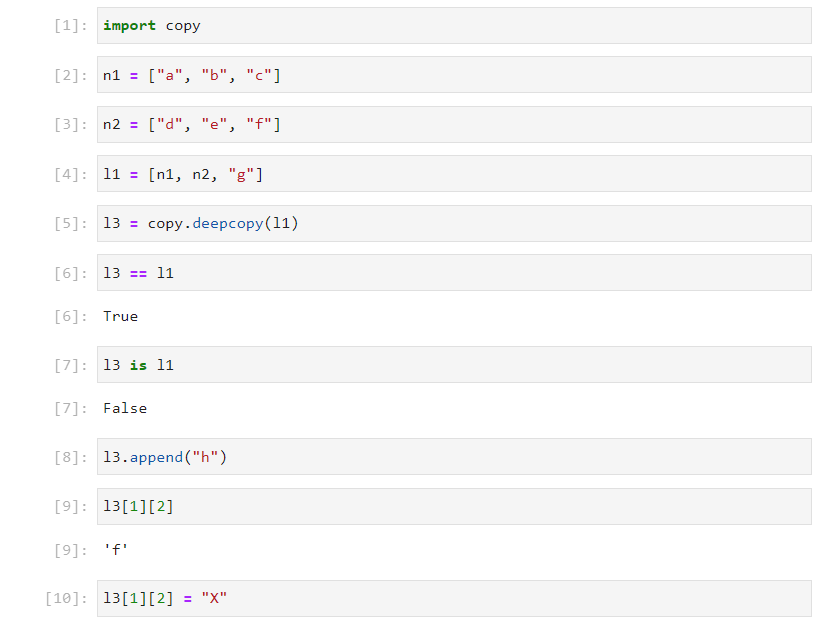

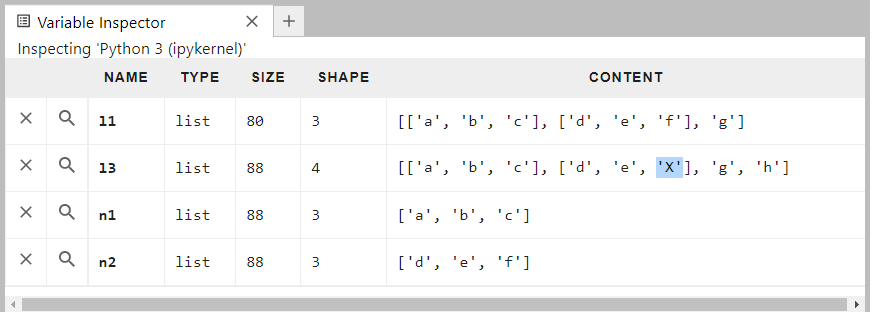

Return to:

[Home](../../../)