# DateTime and ZoneInfo Modules

The ```datetime``` module contains classes for manipulating dates and times an is complemented by the ```zoneinfo``` module which has improvements on timezone implementations. The ```datetime``` module can be imported using the alias ```dt```. 

```
import datetime as dt
```


The ```zoneinfo``` module is imported directly as typically only 1 class is used from this module to construct a timezone:

```
import zoneinfo
```

This ```ZoneInfo``` class can be imported directly using:

```
from zoneinfo import ZoneInfo
```

Once imported, the list of identifiers from the ```datetime``` module can be viewed by inputting ```dt.``` followed by a tab ```↹```:


There are five main classes ```date``` for working with dates, ```time``` for working with times, ```datetime``` for working with dates and times, ```timedelta``` for working with time differences and ```timeinfo``` for working with time zones.

## date class

The initialization signature of the ```date``` class can be viewed by inputting ```dt.date()``` followed by inputting shift ```⇧``` and tab ```↹```:

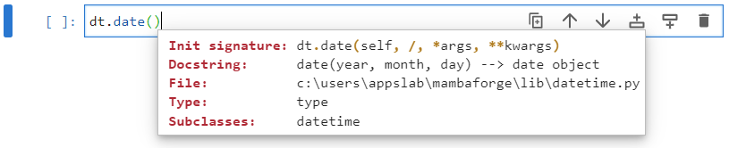

It requires three input arguments, the year, the month and the day which are colelctively needed to specify a calendar date. For clarity, these can be provided as input arguments:

```
python3releasedate = dt.date(year=2008, month=12, day=3)
```


A list of identifiers that can be accessed from the ```date``` object ```python3releasedate``` can be accessed by inputting ```python3releasedate.``` followed by a tab ```↹```:

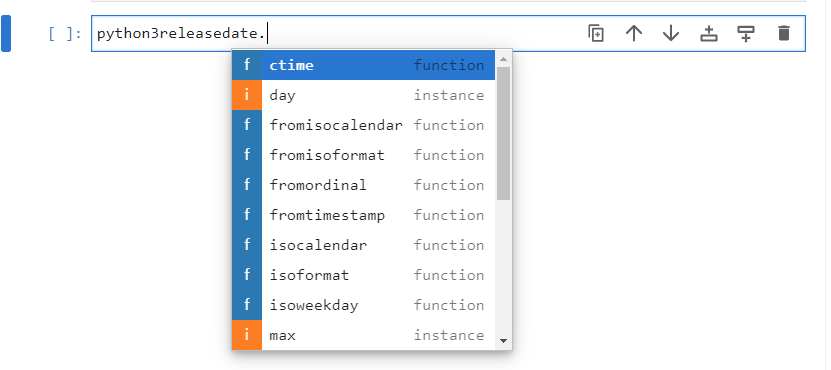

The attributes  ```year```, ```month```, ```day``` give the year, month and day as integers which were provided during instantantiation:

```
python3releasedate.year
python3releasedate.month
python3releasedate.day
```

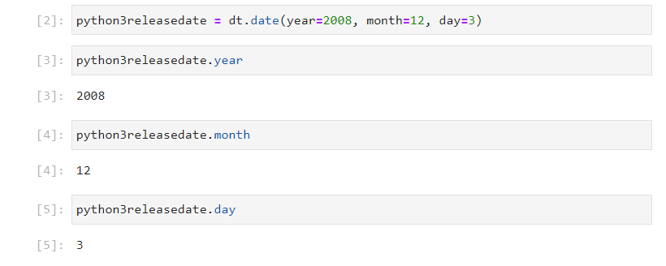

The attributes  ```max``` and ```min``` are class attributes and give the maximum and minimum possible ```date``` instance:

```
python3releasedate.max
python3releasedate.min
```

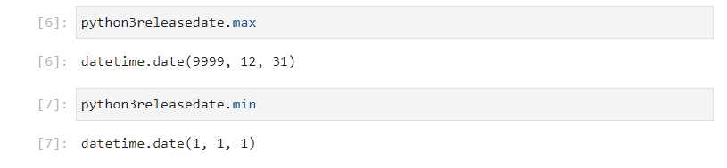

The attribute resolution, gives the time resolution of the ```date``` instance, as a ```timedelta``` instance:


The ```date``` object is immutable, therefore attempting to reassign an attribute will raise an ```AttributeError```:

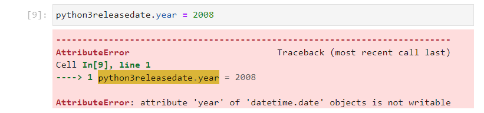

Therefore, most of the ```date``` methods will return a value. The ```replace``` method can be used with the keywords ```year```, ```month``` and ```date``` to replace an attribute in the original ```date``` object and output a new ```date``` instance. For example ```python3releasedate``` can be replaced by the latest version of Python 3:

```
python3releasedate.replace(year=2022, month=10, day=24)
```

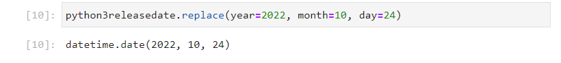

This would need to be assigned to a new object name.

```
python3_11_releasedate = python3releasedate.replace(year=2022, 
                                                    month=10, 
                                                    day=24)
```


The ```timetuple``` method returns an object similar to a namedtuple:

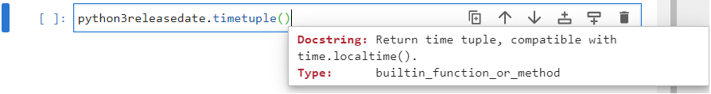

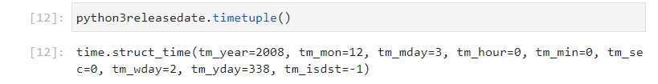

The ```weekday``` method returns the day of the week as a zero order indexed integer:


```
weekday = {0: 'Monday', 
           1: 'Tuesday', 
           2: 'Wednesday', 
           3: 'Thursday', 
           4: 'Friday', 
           5: 'Saturday', 
           6: 'Sunday'}
```

The release date fo Python 3 gives 2 which was a Wednesday:


The ```isoweekday``` method also returns the day of the week as an integer. The ```isoformat``` uses a first order indexed integer:

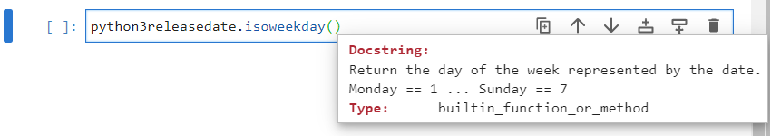

```
weekday = {1: 'Monday', 
           2: 'Tuesday', 
           3: 'Wednesday', 
           4: 'Thursday', 
           5: 'Friday', 
           6: 'Saturday', 
           7: 'Sunday'}
```

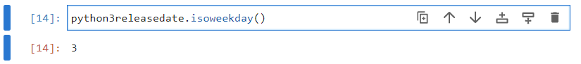

The four methods beginning with ```from```; ```fromisocalendar```, ```fromisoformat```, ```fromordinal```, ```fromtimestamp``` are alternative constructors. These alternative constructors are class methods and output a new ```date``` instance. ```today``` is also a class method which constructs a ```date``` instance from the date on the system clock.

```
dt.date.today()
```

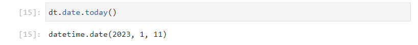

The timestamp is a unit of measurement in seconds that begins from the Epoch Time ```1970, 1, 1``` is at ```0``` seconds. The Epoch timestamp is used by the ```time``` module:

```
import time
time.time()
```

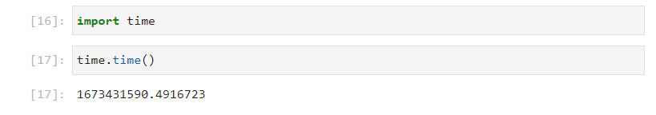

Recall that 1 day == 24 hours == 24 * 60 minutes == 24 * 60 * 60 seconds. For simplicity the following variable can be defined:

```
day = 24 * 60 * 60
```


As seen when ```dt.date.today()``` was used, it is ```2023, 1, 11``` and it is roughly midday.

The number of years from 2023 to 1970 are:

```
2023 - 1970
```

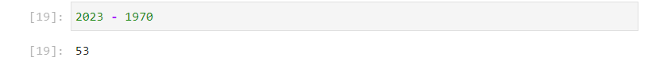

Therefore the rough time in seconds is:

```
53 * 365.2425 * day + (11.5 - 1) * day
```

This gives a timestamp within the accuracy of a day.

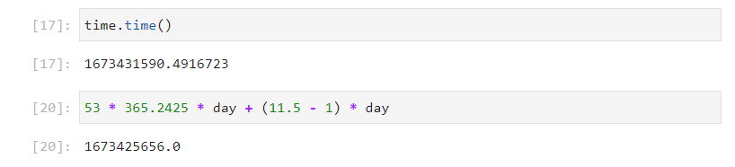

The following is therefore equivalent to ```dt.date.today()```:

```
dt.date.fromtimestamp(time.time())
```

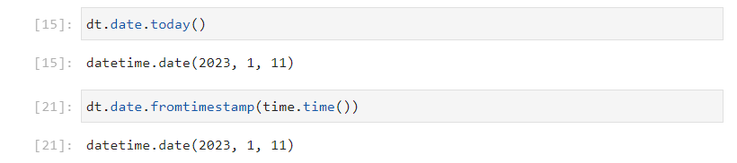

And the following can be examined:

```
dt.date.fromtimestamp(0*day)
dt.date.fromtimestamp(1*day)
dt.date.fromtimestamp(10*day)
```

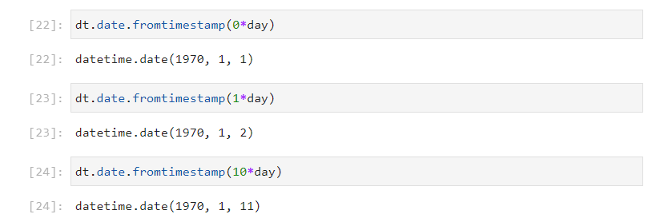

The ordinal date begins at:

```
dt.date.min
```


And 1 ordinal unit is 1 day.

```
dt.date.min.toordinal()
```

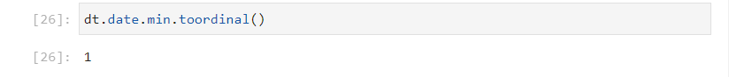

The ordinal time today can be measured using:

```
dt.date.today().toordinal()
```

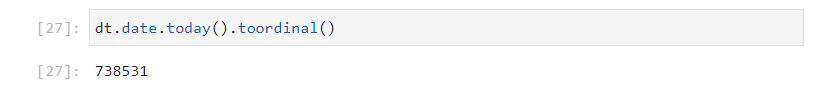

As seen when ```dt.date.today()``` was used, it is ```2023, 1, 11``` and it is roughly midday. Therefore, the ordinal time can be calculated to be approximately, the difference in years, times the number of days in a year lus the difference in days since the 1st of January of this year.

```
int((2023 - 1) * 365.2425 + (11.5 - 1))
```

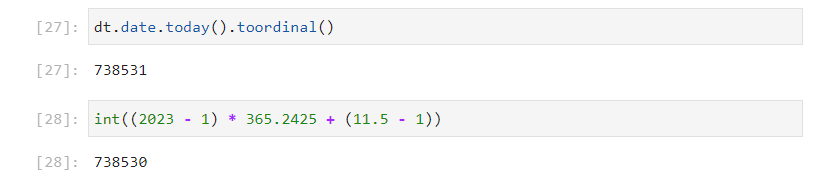

This gives an accuracy of a day, taking into account rounding.

The ```isoformat``` function can be used to express the datetime in an isoformat string:

```
dt.date.today().isoformat()
```


The alternative constructor, can be used to construct a ```date``` instance from an isoformat string:

```
dt.date.fromisoformat('2023-01-11')
```

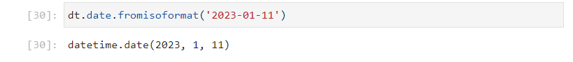

There is also the ```isocalendar``` function, which shows the date using the isocalendar format. There are three input arguments ```year```, ```week``` and ```weekday```:

```
dt.date.today().isocalendar()
```

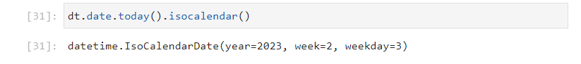

The isocalender matches the format of the isoweekday seen earlier, day 3 corresponds to Wednesday.

The alternative constructor ```fromisocalendar``` can be used to construct a ```date```:

```
dt.date.fromisocalendar(year=2023, week=2, weekday=3)
```

There is an inconsistency in the keyword input arguments, the constructor uses ```day``` opposed to ```weekday```:

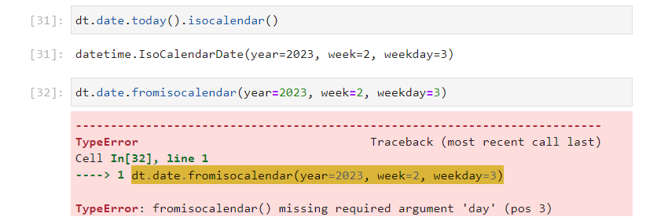

```
dt.date.fromisocalendar(year=2023, week=2, day=3)
```


```ctime``` is a C style string:

```
dt.date.today().ctime()
```


```strftime``` is like a formatted string for the time object with its own associated format codes.

Lower case format codes are used for a date ```%y```, ```%m```, ```%d``` in a 2 digit format:

```
dt.date.today().strftime('%y')
dt.date.today().strftime('%m')
dt.date.today().strftime('%d')
```

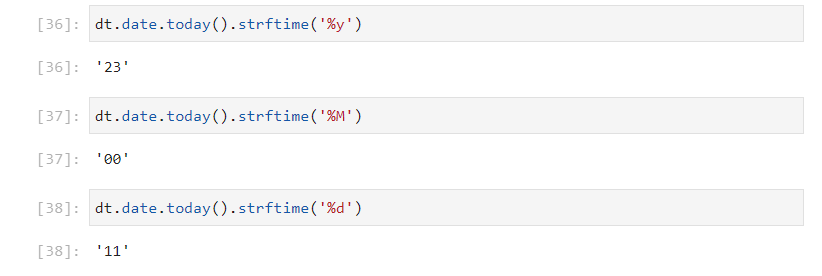

Upper case codes are used for a time ```%H```, ```%M```, ```%S``` in a 2 digit format and the distinction is made because month and minute both start with m:

```
dt.date.today().strftime('%H')
dt.date.today().strftime('%M')
dt.date.today().strftime('%S')
```

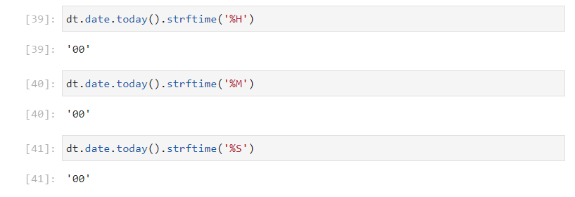

The time component in microsecond uses a 6 digit format, and it also begins with a m. The microsecond component uses the code ```%f```:

```
dt.date.today().strftime('%f')
```

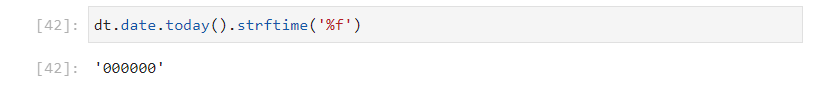

These four time units have the value of 0 for a date. Recall that ```dt.date.resolution``` has an accuracy of 1 day.

Because there is no confusion for year and day as no other date or time unit begin with y or d. The upper case versions of these formats give the year in a 4 digit format and the day in an American format ```MM/DD/YY```:

```
dt.date.today().strftime('%Y')
dt.date.today().strftime('%D')
```

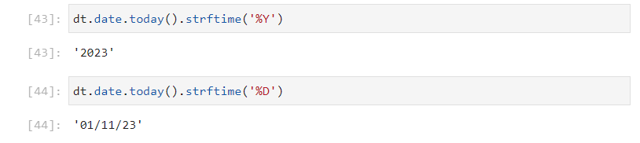

These can be combined to make a British format:

```
dt.date.today().strftime('%d/%m/%y')
```

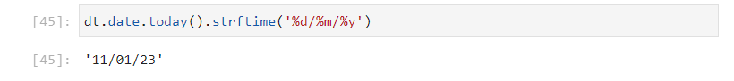

Additional format codes are available [strftime Codes](https://docs.python.org/3/library/datetime.html#strftime-and-strptime-format-codes)


If the directory of the ```date``` class is examined:

```
dir(dt.date)
```

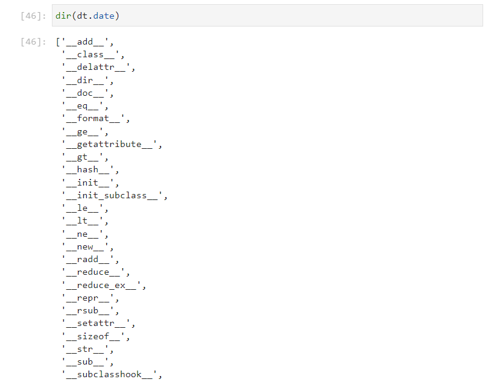

Notice that the ```__sub__``` and ```__add__``` datamodel methods are defined alongside the 6 comparison operators ```__eq__```, ```__ne__```, ```__lt__```, ```__le__```, ```__gt__``` and ```__ge__```. This means the ```-``` and ```+``` operators can be used alongside the ```==```, ```!=```, ```<```, ```<=```, ```>``` and ```>=``` operators.

```
today = dt.date.today()
today
yesterday = today.replace(day=today.day-1)
yesterday
```

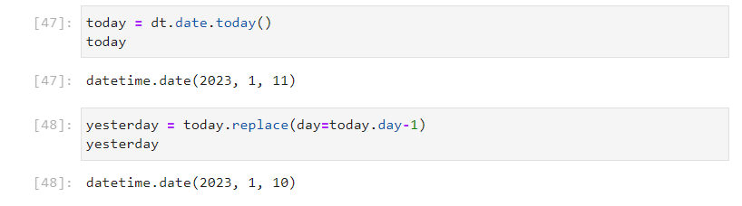

The ```__sub__``` datamodel method is designed to compute the time difference between two ```date``` instances:

```
today - yesterday
```

This returns a ```timedelta``` with a resolution of a day, recall that ```dt.date.resolution``` has an accuracy of 1 day. The ```__add__``` datamodel method is configured to use a ```date``` instance and add a ```timedelta``` instance to it. 


```
tomorrow = today + dt.timedelta(days=1)
tomorrow
```

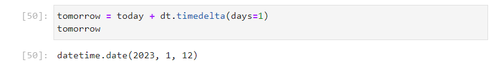

Addition of two dates for example ```today + tomorrow``` will give a ```typeError``` as this operation does not make sense.

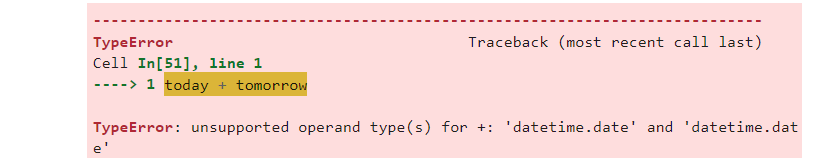

This method can be thought of as being setup similar to the ```__mul__``` method on a string class which is designed to work with an integer instance for the purpose of string replication:

```
'hello' * 3
```

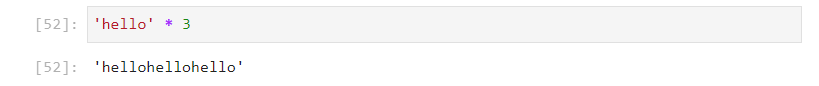

Likewise multiplication of two strings for example ```'hello' * 'hello''``` will give a ```typeError``` as this operation does not make sense.

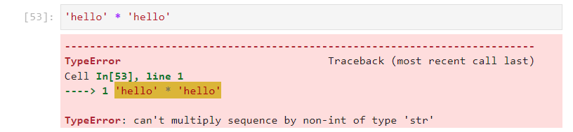

The conditional operators can be used to compare dates:

```
tomorrow > today
yesterday < tomorrow
```

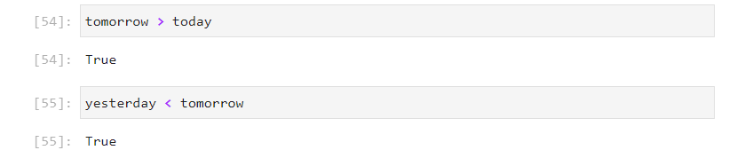

## timezone and tzinfo class

Time Zones roughly correlate with the lines of longitude on the globe. The Prime Meridian is the line of longitude designated 0 degrees and runs through Greenwich, UK. Google Earth displays the lines of longitude in 10 degree intervals:

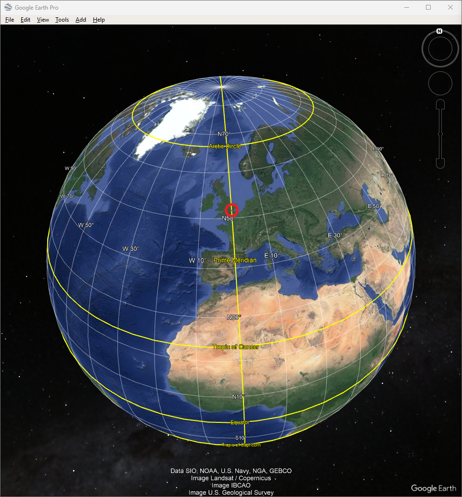

Time Zones are however based on 15 degree intervals. There are 24 hours in a day and 360 degrees in a circle i.e. ```15 * 24 == 360```. The Time Zone lines aren't perfectly straight and are modified to accomodate countries [Physical geography](http://www.physicalgeography.net/fundamentals/2c.html): 

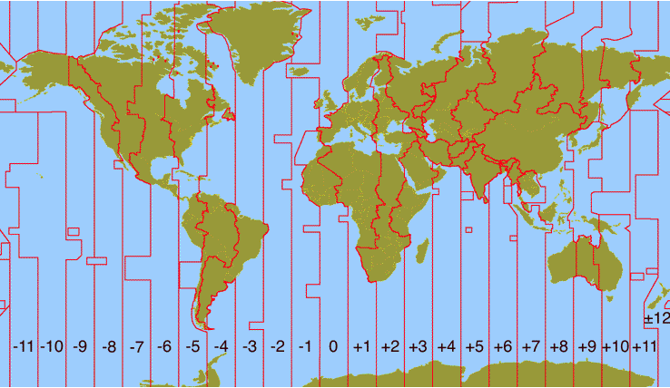

Greenwich Mean Time was originally used as a Coordinated Time for Time Zones when Time standards were based upon Astronomy. Universal Coordinated Time (UTC) is a revised version of Greenwich Mean Time (GMT) which uses the more accurate Atomic Clock as a Time standard. Nowadays the two terms are used interchangeably. 

In the United Kingdom, two time zones are used, depending on the time of the year. GMT (UTC) is used October - March and BST (UTC+01:00:00) is used March - October. The clocks go forward over the summer months and BST is an abbreviation for British Summer Time. The clocks go forward 1 hour at 01:00:00 on the last Sunday in March, this clock change is known as daylight savings time as its purpose is to optimise the number of hours of daylight encountered during the working day over the summer months where the number of hours of daylight are longer. The clocks go back 1 hour at 02:00:00 on the last Sunday in October ending daylight savings time. 

The ```datetime``` module has an abstract ```tzinfo``` class and a basic ```timezone``` class that can be used to create a timezone with a constant offset from UTC. The initialization signature of the ```timezone``` class can be viewed by inputting ```dt.timezone()``` followed by inputing shift ```⇧``` and tab ```↹```:

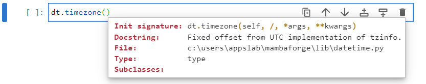

The documentation of these two classes is sparse as they are being phased out, in favour of the ```ZoneInfo``` class which at this moment in time is contained within a seperate module ```zoneinfo```. The initialization signature requires an instance of the ```timedelta``` class using the ```hours``` keyword input argument:

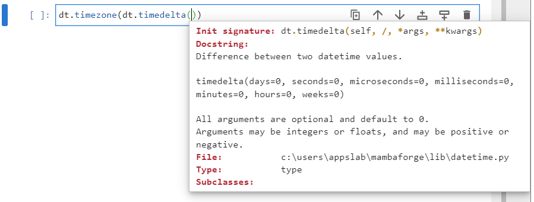

The following implementations can be carried out:

```
gmt = dt.timezone(dt.timedelta(hours=0))
gmt
bst = dt.timezone(dt.timedelta(hours=1))
bst
```


The crude implementation above is **not recommended** as it will not accommodate clock changes. 

## ZoneInfo class

A more through implementation is in the inbuilt timezone information module ```tzinfo```, this includes functionality that was previously used in the third-party module ```pytz```. The ```tzinfo``` module is used to manage timezones by capital city location on the map. The ```zoneinfo``` can be imported using:

```
import zoneinfo
```

Once imported, the list of identifiers can be viewed by inputting ```zoneinfo.``` followed by a tab ```↹```:

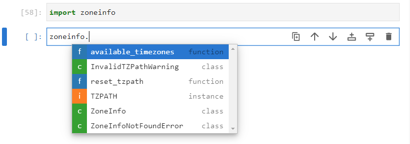

The two identifiers of interest are the ```available_timezones``` function and the ```ZoneInfo``` class. The ```available_timezones``` functions returns a set of strings:

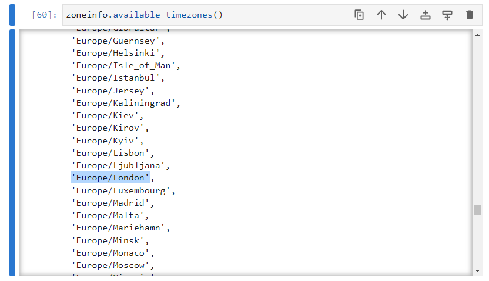

Each string corresponds to a valid ```timezone```. These strings can be used as input arguments to the ```ZoneInfo``` class to create a valid timezone:

```
london = zoneinfo.ZoneInfo('Europe/London')
```


I suspect at some point in the future, the ```tzinfo``` module will be merged into the ```datetime``` module and the classes ```tzinfo``` and ```timezone``` will be depreciated. However this will take a while as the ```datetime``` module is widely used and changing its functionality may introduce lots of problems in Python internally that need to be addressed.

In the meantime it is more common to import the ```datetime``` module and setup the timezone using the following:

```
import datetime as dt
from zoneinfo import ZoneInfo
london = ZoneInfo('Europe/London')
```


## time class

The initialization signature of the ```time``` class can be viewed by inputting ```dt.time()``` followed by inputing shift ```⇧``` and tab ```↹```:

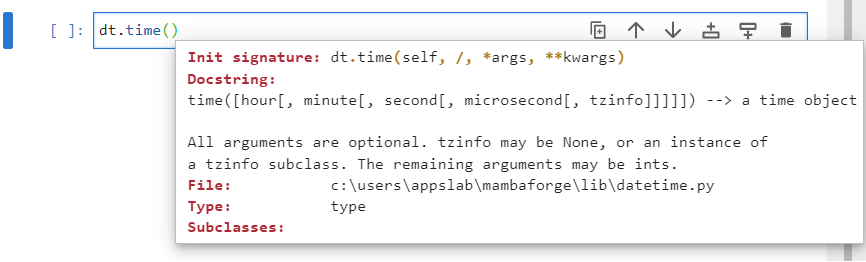

```
midday = dt.time(hour=12, minute=0, second=0, microsecond=0, tzinfo=london)
```


A list of identifiers that can be accessed from the ```time``` object ```midday``` can be accessed by inputting ```midday.``` followed by a tab ```↹```:

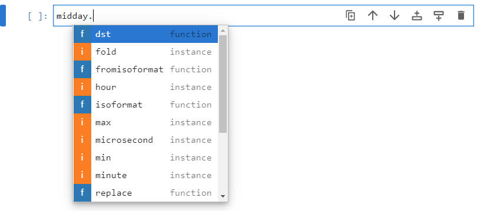

The attributes ```hour```, ```minute```, ```second``` and ```microsecond``` give the hour, minute, second and microsecond as integers which were provided during instantantiation. The attribute ```tzinfo``` gives the time zone which was provided during instantantiation:

```
midday.hour
midday.minute
midday.second
midday.microsecond
midday.tzinfo
```

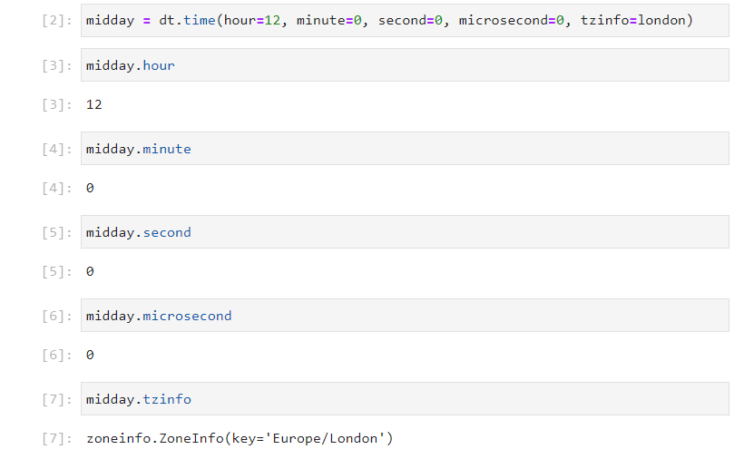

The attributes  ```max``` and ```min``` are class attributes and give the maximum and minimum possible ```date``` instance:

```
midday.max
midday.min
```

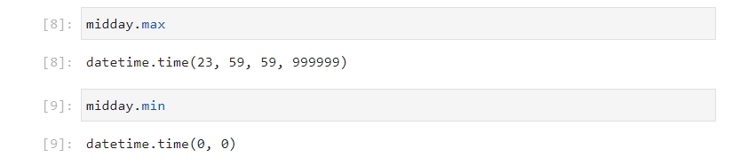

The attribute resolution, gives the time resolution of the ```time``` instance, as a ```timedelta``` instance. This gives a resolution of a microsecond corresponding to the smallest time unit possible:

```
midday.resolution
```

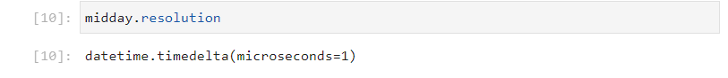

This time limit is brought about hardware which use a microcontroller or processor with microsecond timing capability.

Although the resolution returns a ```timedelta``` of 1 microsecond. The ```time``` class is not set up to compute time differences. If the directory of the ```time``` class is examined:

```
dir(dt.time)
```

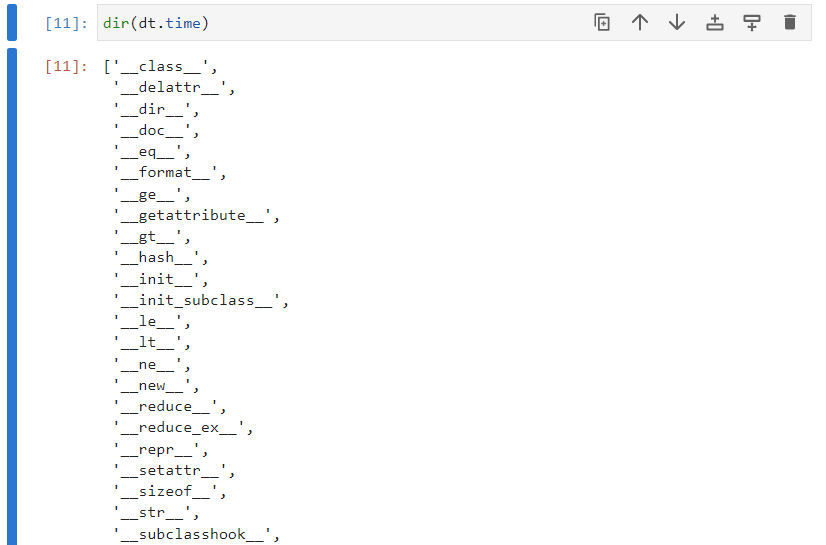

Notice that the ```__sub__``` and ```__add__``` datamodel methods are not shown.

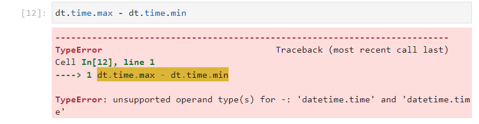

Differences are instead computed with the ```datetime``` class. The ```replace``` and ```strftime``` methods behave in a similar manner to their counterparts seen in the ```date``` class.

The ```isoformat``` displays the ```time``` instance as an isoformat string:

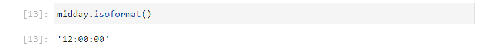

The class method ```fromisoformat``` can be used to construct a ```time``` instance from an isoformat string:

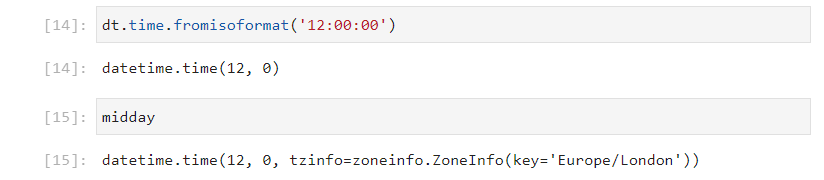

Note that doing so does not retain the ```timezone```, to supply this, the ```fromisoformat``` method can be used in conjunction to the ```replace``` method:

```
dt.time.fromisoformat('12:00:00').replace(tzinfo=london)
```

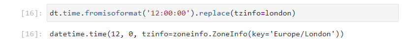

## The datetime class

The initialization signature of the ```datetime``` class can be viewed by inputting ```dt.datetime()``` followed by inputing shift ```⇧``` and tab ```↹```. The initialization signature requires the input arguments of the ```date``` class and the input arguments of the ```time``` class:


```
python3releasedatemidday = dt.datetime(year=2008, month=12, day=3, 
                                       hour=12, minute=0, second=0, 
                                       microsecond=0, tzinfo=london)
```


The alternative constructor ```combine``` can be used to ```combine``` a ```date``` and a ```time```:


```
python3releasedate = dt.date(year=2008, month=12, day=3)
midday = dt.time(hour=12, minute=0, second=0, microsecond=0, tzinfo=london)

python3releasedate_midday = dt.datetime.combine(date=python3releasedate, 
                                                time=midday)
```


There are two class methods that construct a ```datetime``` instance from the system clock. The first is ```utcnow``` which reads off the system clock and assigns the timezone to UTC automatically:


```
dt.datetime.utcnow()
```


The second is ```now``` which has an optional input argument ```tz```:


It no ```tz``` is specified, the local timezone is used. However this is not specified in the instance. It is recommended to include this:

```
dt.datetime.now()
dt.datetime.now(tz=london)
```


```
now = dt.datetime.now(tz=london)
now
```


The ```datetime``` class is a child class fot he ```date``` class and the ```time``` class, it therefore possess all the attributes and methods from either parent class. The ```now``` instance has the following attributes ```year```, ```month```, ```day``` which was seen in the ```date``` class and ```hour```, ```minute```, ```second```, ```microsecond``` and ```tzinfo``` which was seen in the ```time``` class respectively. These were all also seen in the initialization signature of the ```datetime``` class:

```
now.year
now.month
now.day
now.hour
now.minute
now.second
now.microsecond
now.tzinfo
```


The attributes  ```max``` and ```min``` are class attributes and give the maximum and minimum possible ```datetime``` instance:

```
now.max
now.min
```


The attribute resolution, gives the time resolution of the ```datetime``` instance, as a ```timedelta``` instance. This gives a resolution of a microsecond corresponding to the smallest time unit possible:


If the directory of the ```datetime``` class is examined using:

```
dir(dt.datetime)
```


Notice that the ```__sub__``` and ```__add__``` datamodel methods are defined alongside the 6 comparison operators ```__eq__```, ```__ne__```, ```__lt__```, ```__le__```, ```__gt__``` and ```__ge__```. This means the ```-``` and ```+``` operators can be used alongside the ```==```, ```!=```, ```<```, ```<=```, ```>``` and ```>=``` operators. these are inherited from the ```date``` class. The operaters therefore operate in a similar manner to their counterparts in the ```date``` class but have a higher microsecond time resolution in the ```datetime``` class:

```
dt.datetime.max - dt.datetime.min
```


The ```isoformat``` is a combination of the ```date``` and ```time``` isoformat string:

```
now.isoformat()
```


The ```fromisoformat``` class method is used as an alternative constructor to construct a ```datetime``` instance from an isoformat string:

```
dt.datetime.fromisoformat('2023-01-12T11:22:58.776083+00:00')
```


This does not retain the timezone information, so it is often complemented with the ```replace``` method as seen earlier:

```
dt.datetime.fromisoformat('2023-01-12T11:22:58.776083+00:00').replace(tzinfo=london)
```


The ```date``` and ```time``` methods will create a ```date``` and ```time``` instance from a```datetime``` instance:


```
now.date()
now.time()
```

The ```timetz``` method will return a ```time``` instance with timezone information from the ```datetime``` instance:

```
now.timetz()
```


```strftime``` was seen for a ```date``` instance and behaves like a formatted string for the time object with its own associated format codes.

Lower case format codes are used for a date ```%y```, ```%m```, ```%d``` in a 2 digit format:

```
now.strftime('%y')
now.strftime('%m')
now.strftime('%d')
```


Upper case codes are used for a time ```%H```, ```%M```, ```%S``` in a 2 digit format and the distinction is made because month and minute both start with m:

```
now.strftime('%H')
now.strftime('%M')
now.strftime('%S')
```


The time component in microsecond uses a 6 digit format, and it also begins with a m. The microsecond component uses the code ```%f```:

```
now.strftime('%f')
```


The capital ```%Y``` can be used to get the year in a 4 digit format:

```
now.strftime('%D')
```


The above can be combined to make a formatted string. For example:

```
now.strftime('%H:%M:%S %d/%m/%Y')
```


The ```strptime``` method is an alternative constructor that can be used to strip a strftime string to create a new ```datetime``` instance. It requires the strftime and the strftime format:


For example:

```
now.strptime('11:22:58 12/01/2023', '%H:%M:%S %d/%m/%Y')
```


The ```timetuple``` method inherited from ```date``` returns an object similar to a namedtuple. There is a second method ```utctimetuple``` which returns a similar tuple using the UTC timezone. Since the first tuple is using the timezone of London which in winter is GMT which is effectively the same as UTC, both tuples are the same in this case:

```
now.timetuple()
now.utctimetuple()
```


The ```time``` and ```datetime``` classes have an attribute ```fold``` and a handful of methods available ```dst```, ```tzname```, ```utcoffset``` and ```astimezone``` that are specialised for timezones. let's explore these. 

The ```fold``` attribute is usually ```0```. This parameter is used to distinguish between duplicate times when clocks go back.

```
now.fold
```


In the United Kingdom the clocks go forward 1 hour at 01:00:00 on the last Sunday in March, and back 1 hour at 02:00:00 on the last Sunday in October.

|Clocks Go Forward|Clocks Go Back|
|---|---|
|2022-03-27|2022-10-30|
|2023-03-26|2023-10-29|
|2024-03-31|2024-10-27|
|2025-03-30|2022-10-26|

These means that there is an hour of duplication between 01:00:00 and 02:00:00 when the clocks go back known as an hour fold. The hour before the clock change has a fold value ```fold=0``` and the hour after the clock change has a fold value of ```fold=1```. Since no other times are duplicated, the fold value used is  typically ```fold=0```.

```
beforefold = dt.datetime(year=2023, month=10, day=29, 
                         hour=1, minute=30, second=0, 
                         microsecond=0, tzinfo=london,
                         fold=0)
```

```
afterfold = dt.datetime(year=2023, month=10, day=29, 
                        hour=1, minute=30, second=0, 
                        microsecond=0, tzinfo=london,
                        fold=1)
```


The function daylight savings time ```dst``` will show if daylight saving time is applied, returning a ```timedelta``` instance. In the UK, daylights savings time is an hour ahead before the clock change:

```
beforefold.dst()
afterfold.dst()
```


The ```tzname``` function returns the name of the timezone:

```
beforefold.tzname()
afterfold.tzname()
```


It is observed to change from British Summer Time ```'BST'``` to Greenwich Mean Time ```'GMT'``` during the clock change.

The ```utcoffset``` will return a ```timedelta``` instance which shows the offset from UTC:

```
beforefold.utcoffset()
afterfold.utcoffset()
```


```beforefold``` uses a British Summer Time which has a 1 hour offset from UTC and ```afterfold``` uses Greenwich Mean Time which is effectively the same as UTC:

Unfortunately the difference between the two times returns a ```timedelta``` of ```0```... which is incorrect as these times are an hour apart. This means the calculation does not take into account the differences in the timezone or clock changes:

```
afterfold - beforefold
```


The ```astimezone``` method can be used to convert a time to another timezone:


```
beforefold.astimezone(ZoneInfo('UTC'))
afterfold.astimezone(ZoneInfo('UTC'))
```


It is recommended to convert times to UTC before subtracting them:

```
afterfold.astimezone(ZoneInfo('UTC')) - beforefold.astimezone(ZoneInfo('UTC'))
```


This gives the correct result. Similar calculations will need to be made for flights between the United Kingdom and Czech Republic, for example which use different time zones. Hopefully in the future the ```__sub__``` method in the ```date``` and ```datetime``` classes will be updated to directly account for differences in timezones.

## SI Units

Only the second and microsecond are in the International System of units which uses the decimal system. 

The Decimal system originates from the romans who based their numbering system on 10 due to the fact that humans possess 10 fingers and dates are first order indexed, unlike Python which is zero order indexed:


Another counting system originates from the Babylonians who counted using the phalanxes on their fingers and excluded the thumbs for counting. The Babylonian system of counting gives 12 digits on 1 hand:


And therefore with both hands, it is possible to count to 24 - which is the reason there are 24 hours in a day:


The Babylonians also counted with two hands in the following manner 0-12 in the left and 0*12 on the right:


The Babylonians also counted with two hands in the following manner 0-12 in the left and 1*12 on the right giving 13-24:


The Babylonians also counted with two hands in the following manner 0-12 in the left and 2*12 on the right giving 25-36:


The Babylonians also counted with two hands in the following manner 0-12 in the left and 3*12 on the right giving 37-48:


The Babylonians also counted with two hands in the following manner 0-12 in the left and 4*12 on the right giving 49-60. This is the reason there are 60 minutes in an hour and 60 seconds in a minute:


The day, hour and minute have been defined as exact values of seconds and use of these units will be to a microsecond accuracy:

```
day = 24 * 60 * 60
hour = 60 * 60
minute = 60
```

The week is define as 7 days and can trace back to the second as:

```
week = 7 * 24 * 60 * 60
```

The month is an awkward unit because it was based upon astronomy with the following assumption, the earth rotated around the sun in a year and the earth made a rotation about its own axis in a day. The assumption was that a year was a quantised number of days which was found to be incorrect and is the reason there is now a leap year:


Originally the Romans had a 10 month calendar:

||Month|Meaning|Number of Days|
|---|---|---|---|
|1|Martius|God of War|31|
|2|Aprilis|Goddess of love|30|
|3|Maius|Goddess of Spring|31|
|4|Lunius|Goddess of Marriage and Childbirth|30|
|5|**Quint**ilis|**5th** month|31|
|6|**Sext**ilis|**6th** month|30|
|7|**Sept**ember|**7th** month|30|
|8|**Oct**ober|**8th** month|31|
|9|**No**vember|**9th** month|30|
|10|**Dec**ember|**10th** month|30|
|Year|||304|

The Romans then calculated (still incorrectly) that there are 355 days of the year and decided to add 2 additional months reinforcing the Babylonian system of 12. This unfortunately gives a mismatch to the ordinal names of the months.

||Month|Meaning|Number of Days|
|---|---|---|---|
|1|Janurius|God of Beginning|29|
|2|Februarius|Feast of Purification|28|
|3|Martius|God of War|31|
|4|Aprilis|Goddess of love|29|
|5|Maius|Goddess of Spring|31|
|6|Lunius|Goddess of Marriage and Childbirth|29|
|7|**Quint**ilis|**5th** month|31|
|8|**Sext**ilis|**6th** month|29|
|9|**Sept**ember|**7th** month|29|
|10|**Oct**ober|**8th** month|31|
|11|**No**vember|**9th** month|29|
|12|**Dec**ember|**10th** month|29|
|Year|||355|

The Romans then calculated that there were 365 days in a year with 1 additional day every 4 years constituting a leap year. This gives the current calendar. 

||Month|Meaning|Number of Days|
|---|---|---|---|
|1|Janurius|God of Beginning|31|
|2|Februarius|Feast of Purification|28-29|
|3|Martius|God of War|31|
|4|Aprilis|Goddess of love|30|
|5|Maius|Goddess of Spring|31|
|6|Lunius|Goddess of Marriage and Childbirth|30|
|7|**Quint**ilis|**5th** month|31|
|8|**Sext**ilis|**6th** month|31|
|9|**Sept**ember|**7th** month|30|
|10|**Oct**ober|**8th** month|31|
|11|**No**vember|**9th** month|30|
|12|**Dec**ember|**10th** month|31|
|Year|||365-366|

The definition of a year is therefore loose as it can be 365-366 days introducing a 3 % error. The definition of a year is also loose as it can be 28-31 days introducing a 10 % error. Due to the ambiguity in these units, they are not used in ```timedelta``` calculations.

## The timedelta class

The initialization signature of the ```timedelta``` class can be viewed by inputting ```dt.timedelta()``` followed by inputting shift ```⇧``` and tab ```↹```:


It is defined as the difference between two ```datetime``` values (millisecond precision) or two ```date``` values (day precision). Notice that the units for the ```timedelta``` in the initialization signature are plural unlike the singular units seen in the ```date```, ```time``` and ```datetime``` which correspond to a singular value in a date, time or datetime stamp.


The three most common units in descending order are listed ```days```, ```seconds``` and ```microseconds``` (1 millionth of a second):

```
dt.timedelta(days=0, seconds=10.5, microseconds=500000)
```

Here the output is cleaned up and shows ```11 s``` which is the sum of the second comopnnt ```10.500000 s``` and microsecond component ```0.500000 s```:


These units can also be supplied as positional arguments, although use of the keyword arguments is usually better for the sake of code readibility: 

```
dt.timedelta(0, 10.5, 500000)
```


Additional units are available as keyword input arguments for convenience such as ```milliseconds``` (1 thousandth of a second), ```minutes```, ```hours``` and ```weeks```.

```
timedifference = dt.timedelta(hours=1, seconds=1, microseconds=1)
```


A list of identifiers that can be accessed from the ```timedelta``` object ```timedifference``` can be accessed by inputting ```timedifference.``` followed by a tab ```↹```:


The ```days```, ```seconds``` and ```microseconds``` give the days, seconds and microseconds which were provided during instantantiation (or the cleaned up version of these):

```
timedifference.days
timedifference.seconds
timedifference.microseconds
```


The ```max``` and ```min``` class attributes display the maximum and minimum possible values for a ```timedelta```. Notice it spans from a maximum large number to a minimum large number as time differences can be positive or negative:

```
dt.timedelta.max
dt.timedelta.min
```


The ```total_seconds``` function returns the time difference as a second float:

```
timedifference.total_seconds()
```


If the directory of the ```timedelta``` class is examined using:

```
dir(dt.timedelta)
```

Most of the datamodel methods used for numeric operators are available, as the ```timedelta``` is configured like a float when interacting with another instance of itself or an int or a float:


```
timedifference
-2 * timedifference
```


It is sometimes insightful to view the ```total_seconds``` function , particularly when swapping the sign:

```
timedifference.total_seconds()
(-2 * timedifference).total_seconds()
```


The ```timedelta``` can be added or subtracted from a ```datetime``` or ```date``` instance:

```
now
timedifference
now + timedifference
now - timedifference
```


# time module

Python also has a ```time``` module which was mentioned briefly when a timestamp was discussed. The functions available in the ```time``` module are written in C and setup for receiving the current ```time``` from the system, operating slightly faster than counterparts in the ```datetime``` module.

The ```time``` module is normally imported directly, an alias is not typically used as the word ```time``` is already brief:

```
import time
```


Once imported, the list of identifiers from the ```time``` module can be viewed by inputting ```dt.``` followed by a tab ```↹```:


The most commonly function is:

```
time.time()
```


Recall this returns a timestamp that is a unit of measurement in seconds that begins from the Epoch Time ```1970, 1, 1``` is at ```0``` seconds. There is a float component to the umber received when can introduce floating point rounding errors. Sometimes this unit is instead returned as an integer nanosecond for more accuracy, there are 1000000000 nanoseconds in 1 second:

```
time.time_ns()
```


Another commonly used function is:

```
time.sleep()
```


This function is used to delay execution of Python code by the specified number of seconds. For example:

```
print(f'Hello World')
time.sleep(5)
print(f'Goodbye World')
```

The beginning executes:


There is a pause for 5 seconds and the rest of the code executes:


Most of the rest of the functionality of the ```time``` module is for advanced use cases such as timing events such as the ```process_time```, ```thread_time``` and ```perf_counter``` which are typically used to test the performance of Python modules and are is of scope of this tutorial. The associated standard module ```timeit``` is available for measuring the performance of small code snippets for simple timing use cases. 

[Home Python Tutorials](https://github.com/PhilipYip1988/python-tutorials/blob/main/readme.md)
