# math

The math module is an inbuilt Python module that contains the most commonly used mathematical constants and functions typically found on a standard scientific calculator.
To use the module it must be imported. Since the module name is relatively small, it is usually imported using the module name and is not commonly imported using an alias:

```
import math
```

Once imported, the name of the module ```math``` can be input followed by a dot ```.``` and tab ```↹``` to view a list of identifiers:

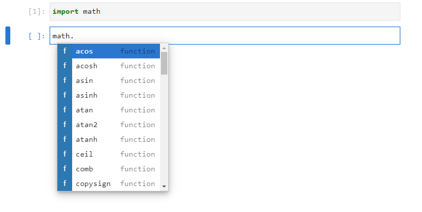

Most of the identifiers are functions but there are also instances which are mathematical constants. 

## Mathematical Constants

There is the instance ```pi``` which is the ratio of the circumference (indicated in blue) to diameter of a circle (indicated in orange).

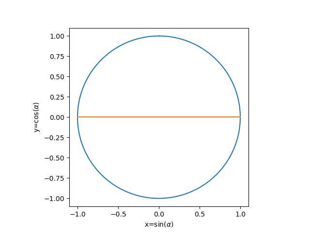

```
math.pi
```


Or the related instance ```tau``` which is the ratio of the circumference (indicated in blue) to the radius of a circle (indicated in orange):

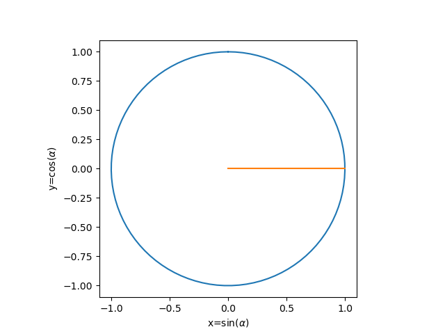

```
math.tau
```

```tau``` is therefore twice the size of ```pi```:

```
math.tau == 2 * math.pi
```

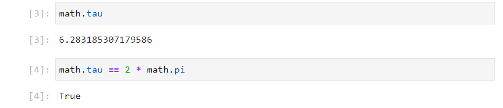

Another constant ```e``` is known as Euler's number and is an important constant when it comes to modelling exponential growth. 

The value of ```e``` can be calculated empirically using the following mathematical formula:

$$
e=\sum_{n=0}^{\infty}\frac{1}{n!}
$$

This formula gets expanded out as an Euler series:

$$
e=1+\frac{1}{1}+\frac{1}{1\ast2\ }+\frac{1}{1\ast2\ast3}+\ldots,
$$

The denominator in each expression is known as a factorial:

$$
e=\frac{1}{0!}+\frac{1}{1!}+\frac{1}{2!\ }+\frac{1}{3!}+\ldots,
$$

Where:
$$
0! = 1
$$
$$
1! = 1
$$
$$
2! = 1 * 2
$$
$$
3! = 1 * 2 * 3
$$

A function can be made to calculate a factorial:

```
def factorial(factor):
    result = 1
    for num in range(2, factor+1):
        result *= num
    return result


```

Which can be tested:

```
factorial(0)
factorial(1)
factorial(2)
factorial(3)
```


This ```factorial``` function can be used within an ```Euler``` series function to calculate a ```total```:

```
def euler_series(factor):
    total = 1.0
    for num in range(1, factor + 1):
        total += 1.0 / factorial(num)
    return total


```

This function can be tested using different values of ```factor```:

```
euler_series(1)
euler_series(2)
euler_series(3)
euler_series(10)
euler_series(50)
euler_series(100)
```

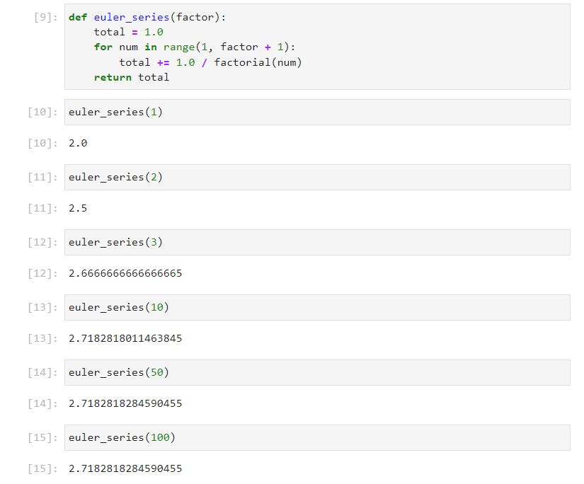

The ```total``` generated from an Euler Series can be seen to converge. This is because the denominator in each additional term becomes larger and as a result, addition of its reciporical becomes negligible.

The number this converges to is known as Eulers number ```e```. To get Eulers number use:

```
math.e
```


There are also two constants representing infinity ```inf``` and not a number ```nan```:

```
math.inf
math.nan
```


If these numbers are going to be used regularly, they can be imported directly into the namespace of the notebook using:

```
from math import pi, tau, e, inf, nan
```

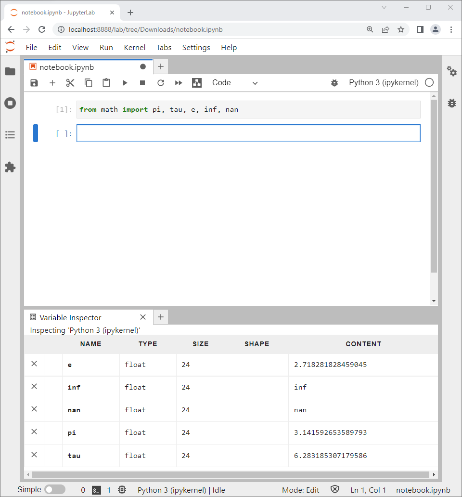

All of these number are observed to be instances of the ```float``` class.

## Functions

The ```math``` module has the inbuilt functions ```isinf```, ```isfinite``` and , ```isnan``` which take in a value as an input argument and return a ```bool```

For example the number 1 is finite and the number inf is infinite so the following expressions are ```False``` and ```True``` respectively:

```
math.isinf(1)
math.isinf(inf)
```

And the counter-expressions are ```True``` and ```False``` respectively:

```
math.isfinite(1)
math.isfinite(inf)
```

The number ```inf``` is a number whereas ```nan``` is not a number so the following expressions are ```False``` and ```True```:

```
math.isnan(inf)
math.isnan(nan)
```

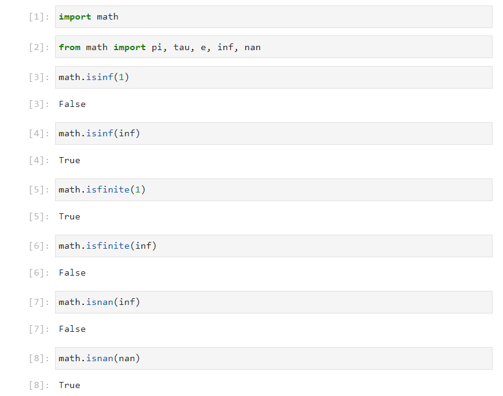

The ```pow``` functions docstring can be seen by inputting the function name followed by open parenthesis and pressing shift ```⇧``` and tab ```↹```:


It is seen to have similar behaviour to the inbuilt operator ```**```:

```
math.pow(2, 4)
2 ** 4
```

However the ```pow``` function always returns a floating point number:


The ```math``` module also has the functions ```sqrt``` and ```isqrt``` which compute the square root and the integer square root respectively:


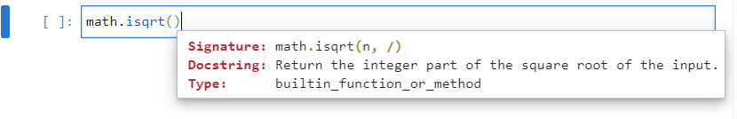

The integer square root requires the input argument to be an integer and returns an integer. The floor of the integer will be returned for the output:

```
math.sqrt(16)
16 ** 0.5
math.isqrt(16)
math.isqrt(17)
```

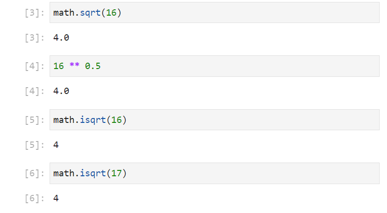

The ```floor``` and ceiling ```ceil``` functions can be used to find the largest integer less than or equal to the input argument or the smallest integer greater or equal to the input argument:

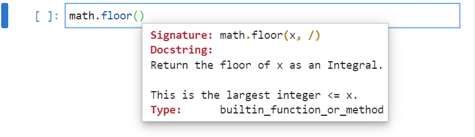

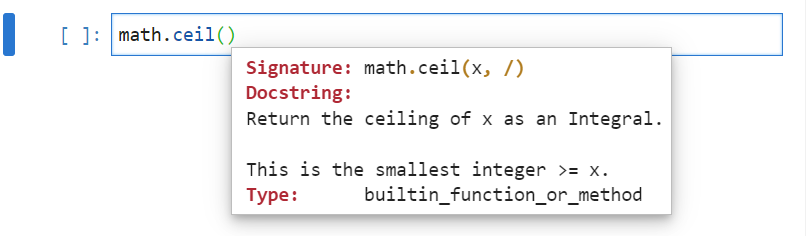

For example, the floor of ```pi``` is 3 and the ceiling of ```pi``` is 4:

```
math.floor(pi)
math.ceil(pi)
```

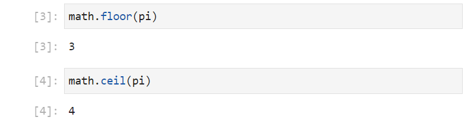

The ```isclose``` function can be used to check if a number is close to another number within a specified tolerance:

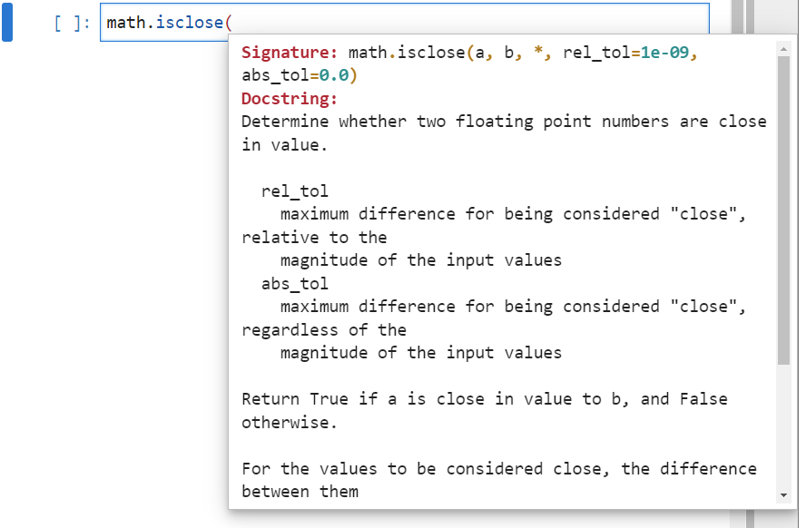

This can be a more useful when dealing with floats than traditional comparison operators due to rounding issues brought about from float precision. For example:

```
0.3
print(f"{0.3 :018.17f}")
0.1 + 0.2
print(f"{0.1 + 0.2 :018.17f}")
0.3 == 0.1 + 0.2
math.isclose(0.3, 0.1 + 0.2, rel_tol=1e-9)
```

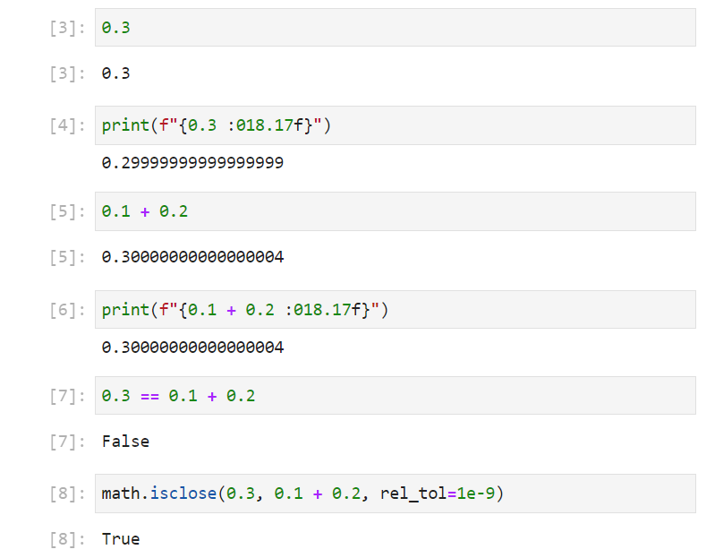

The relative tolerance ```rel_tol``` of ```1e-9``` means the number lies between:

```
print(f"{0.3 - 0.3*1e-9 :018.17f}")
print(f"{0.3 + 0.3*1e-9 :018.17f}")
```

The number can be seen to be between these bounds:

```
print(f"{0.1 + 0.2 :018.17f}")
```

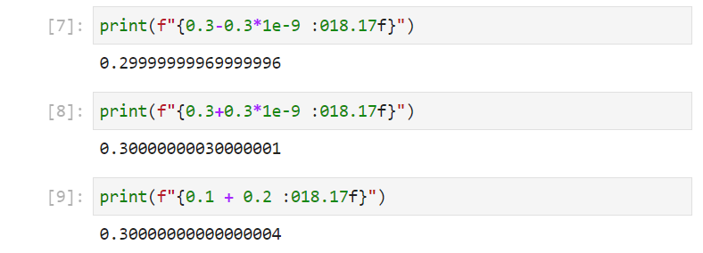

The absolute tolerance can also be specified:

```
math.isclose(0.3, 0.1 + 0.2, abs_tol=1e-6)
```

The absolute tolerance ```abs_tol``` of ```1e-6``` means the number lies between:

```
print(f"{0.3 - 1e-6 :018.17f}")
print(f"{0.3 + 1e-6 :018.17f}")
```

The number can be seen to be between these bounds:

```
print(f"{0.1 + 0.2 :018.17f}")
```

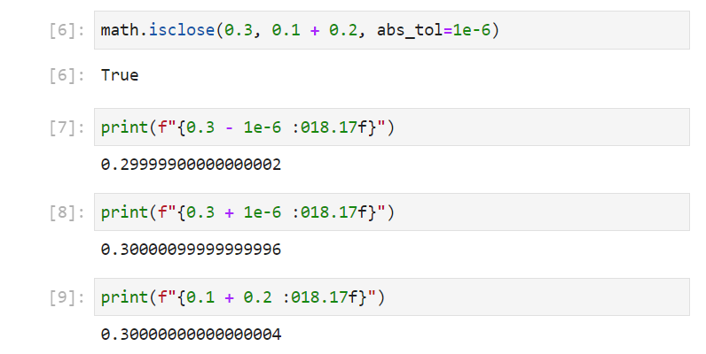

The error due to float precision rounding can propogate when summing a sequence of floating point numbers. The float sum ```fsum``` function in the ```math``` module carries out additional checks to combat these rounding errors. 

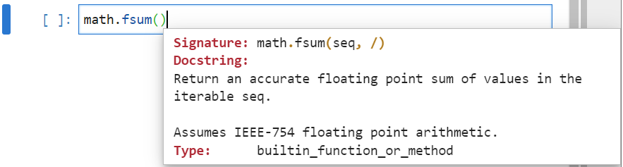

For example:

```
sum([0.1, 0.2, 0.1, 0.2, 0.1, 0.2])
math.fsum([0.1, 0.2, 0.1, 0.2, 0.1, 0.2])
```
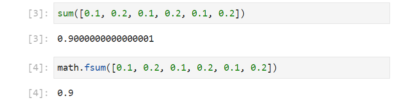

There is also the float absolute ```fabs``` that can be used to calculate the absolute value of a floating point number (returning the number with the sign stripped):

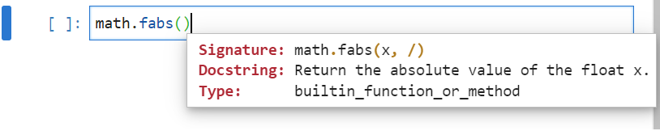

These performs a very similar behaviour to the ```abs``` function within Python:

```
math.fabs(-0.3)
abs(-0.3)
```


The subtle difference is the input argument is cast to a float and the value returned is always a float when ```fabs``` is used:

```
math.fabs(-3)
abs(-3)
```

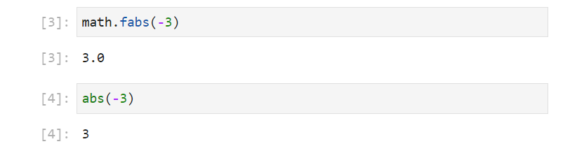

The float sum will likewise always return a floating point number.

The Fortran mod ```fmod``` calculates the modulus associated with an integer division (f doesn't stand for float here). For positive numbers the behaviour is identical to the inbuilt Python mod or modulus operator ```%```:

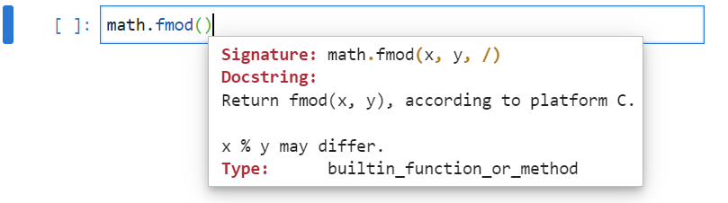

```
pi // 3
pi % 3
math.fmod(pi, 3)
```

The difference between the Fortran implementation and Python implementation can be seen when negative numbers are used:

```
-pi % 3
math.fmod(-pi, 3)
```

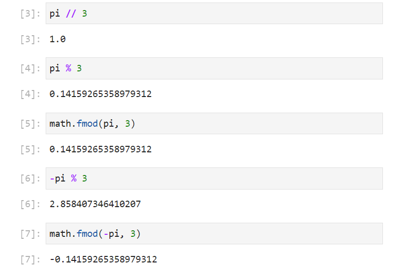

The Fortran implementation essentially carries out the following operation:

```
-(pi % 3)
```


Without parenthesis, the Python implementation instead carried out:

```
3 - (pi - 3)
```


The ```math``` module also has a related ```remainder``` function:

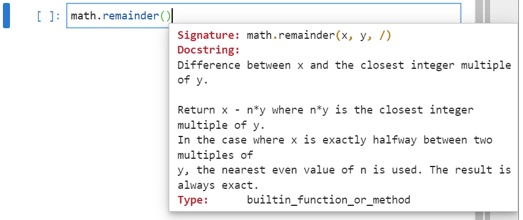

The modulus ```%``` or ```fmod``` are designed to be a companion with integer floor division:

```
10.5 // 3
math.fmod(10.5, 3)
```

The remainder is a companion to rounded float division:

```
10.5 / 3
round(10.5/3)
math.remainder(10.5, 3)
```

And as a consequence will give a positive or negative remainder.

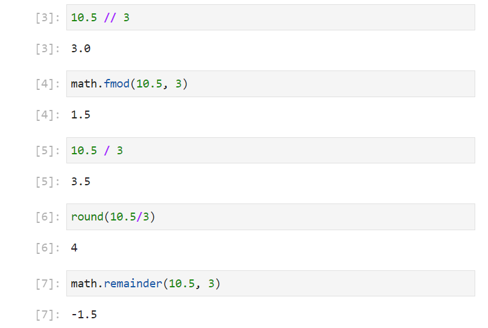

The ```remainder``` function also operates with negative numbers and a comparison can be seen between the three related functions:

```
-10.5 // 3
-10.5 % 3
math.fmod(-10.5, 3)
-10.5 / 3
round(-10.5/3)
math.remainder(-10.5, 3)
```

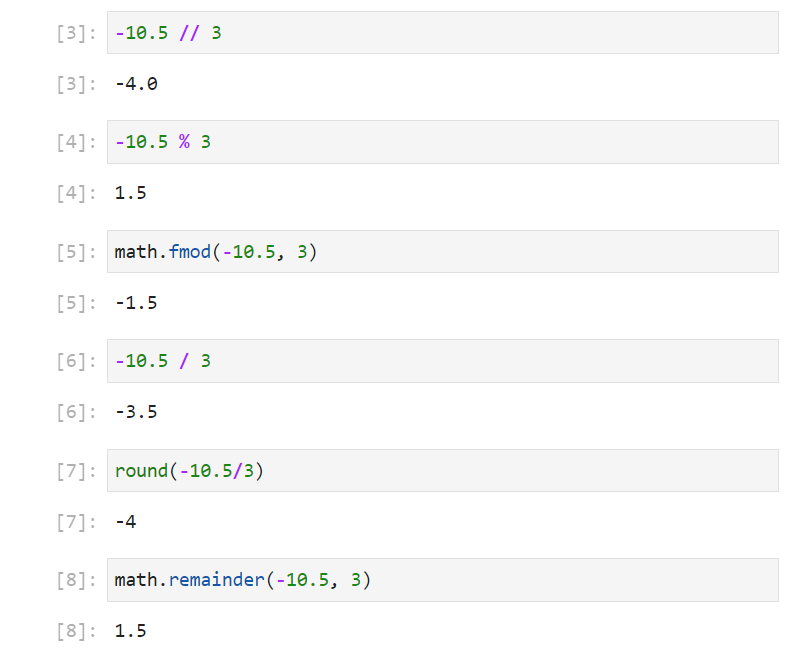

The modulus fraction ```modf``` will split a float into a fractional and integer component outputting a tuple:

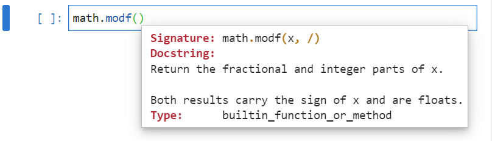

For example:

```
math.modf(pi)
fraction, whole = math.modf(pi)
```


Notice that both the fraction and the whole number are of the type float.

The truncate function ```trunc``` will truncate the integer component of a float, behaving similarly to ```modf``` but only returning the integer component as an integer. 

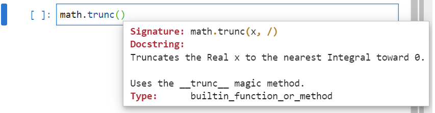

Truncation (ignoring any fraction component taking the floor integer) should not be confused with rounding (which can round down to the floor integer or up to the ceiling integer):


```
round(-10.5/3)
math.trunc(-10.5/3)
math.modf(-10.5/3)[1]
```

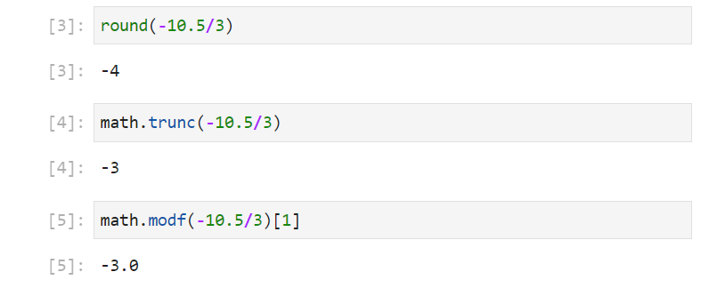

Notice the difference in output between the three functions. In this case ```round```, rounds up. ```trunc``` and  the value at index 1 for ```modf``` truncate the number. ```trunc``` and ```round``` return integers whereas the value at index 1 for ```modf``` is a float.

The greatest common divisor will calculate the greatest common divisor between sequence of numbers:


For example:

```
math.gcd(128, 12)
```

gives the result ```4```. The result ```4``` perfectly divides by both numbers giving no modulus (or remainder). In this case ```%```, ```modf``` or ```remainder``` will all give ```0```: 

```
128 // 4
128 % 4
12 // 4
12 % 4
```


The lowest common multiple function ```lcm```requires an input sequence of integers and returns the lowest common multiple, that is a number which can be divided by each number in the sequence without any modulus or remainder:


For example:

```
math.lcm(2, 3, 4, 5, 8)
```

Gives ```120``` and the modulus for each of the following is ```0```:

```
120 % 2
120 % 3
120 % 4
120 % 5
120 % 8
```


The product function ```prod``` takes in a sequence of numbers in the form of a list or tuple and returns the product of all the numbers in the sequence:

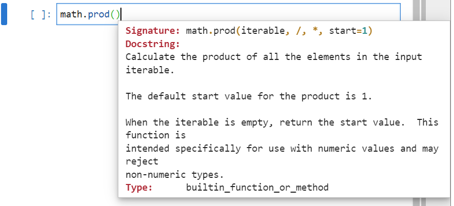

For example:

```
math.prod([2, 3, 4, 5, 8])
2 * 3 * 4 * 5 * 8
```


The function ```copysign``` takes two numbers ```x``` and ```y``` and returns a number which has the magnitude of ```x``` and the sign of ```y```:

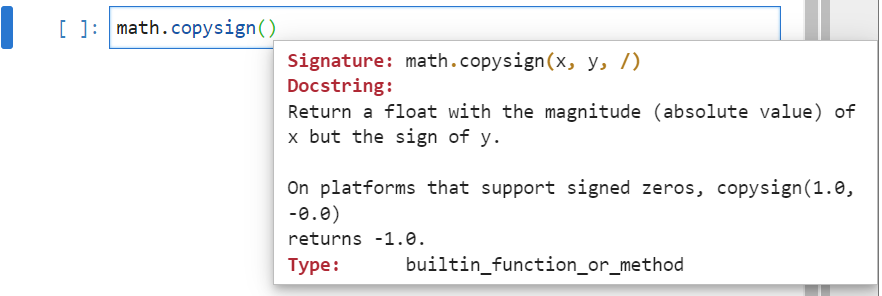

For example:

```
direction = -1
magnitude = 5.2
math.copysign(magnitude, direction)
```

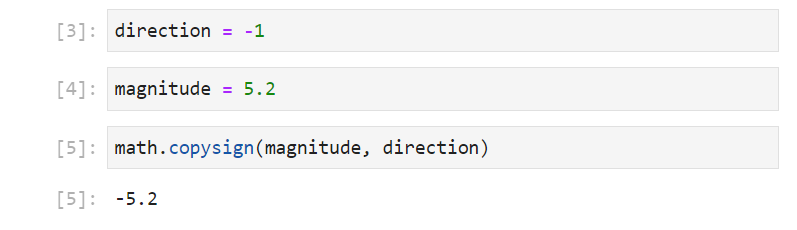

The ```math``` module has an inbuilt function ```factorial```. The concept of a factorial was explained when looking at the constant ```e```:

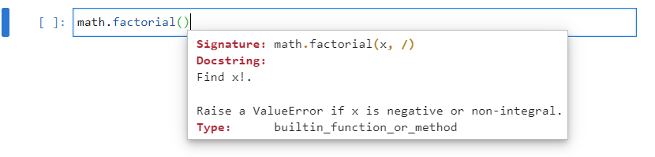

And can be tested with:

```
math.factorial(0)
math.factorial(1)
1
math.factorial(2)
1 * 2
math.factorial(3)
1 * 2 * 3
```

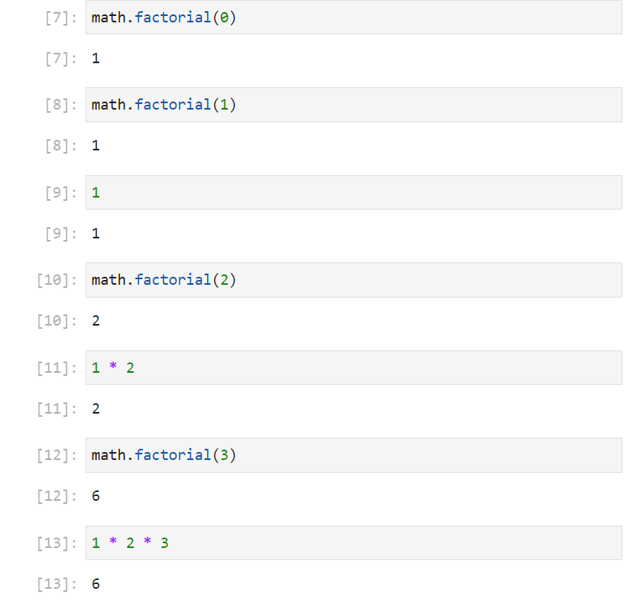

The value ```e``` was explored before. The function ```exp``` raises ```e``` to the power of ```x```:

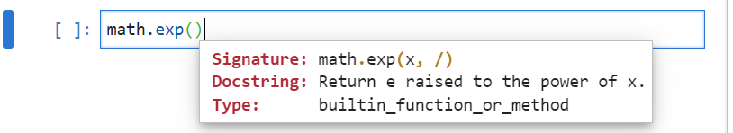

For example a ```x``` value of ```1``` will give ```e ** 1``` and a ```x``` value of ```2``` will give ```e ** 2```:

```
e ** 1
exp(1)
e ** 2
exp(2)
```

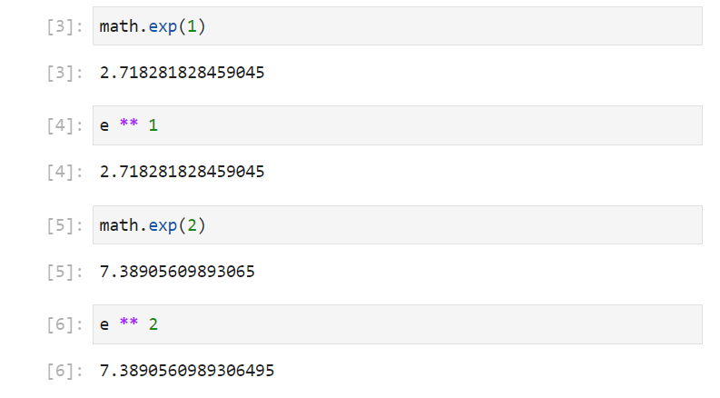

Values on the exponential scale, as the name suggests, increase exponentially:

```
exp(1)
exp(5)
exp(10)
```

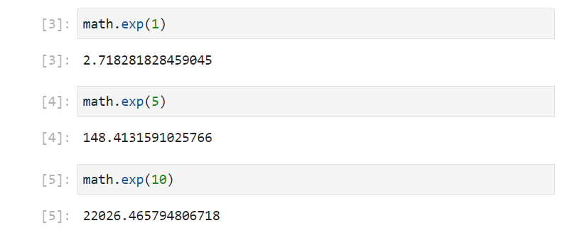

Sometimes it is useful to get the inverse of the exponential using the logarithmic ```log``` function. This function defaults to the natural base of ```e``` by default:

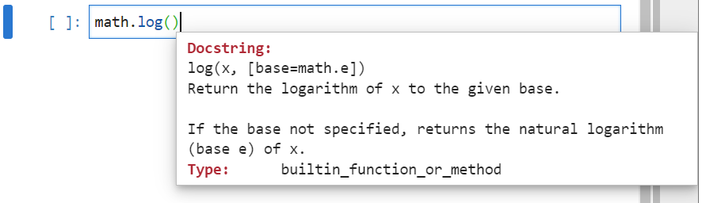

```
math.log(e)
math.log(e**2)
math.log(e**5)
```

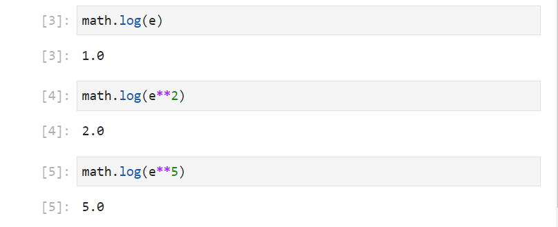

Since the decimal and binary counting systems are commonly used, base 10 and base 2 are commonly used:

```
10 ** 0
math.log(1, 10)
10 ** 1
math.log(10, 10)
10 ** 2
math.log(100, 10)
```


```
2 ** 0
math.log(1, 2)
2 ** 1
math.log(2, 2)
2 ** 2
math.log(4, 2)
```

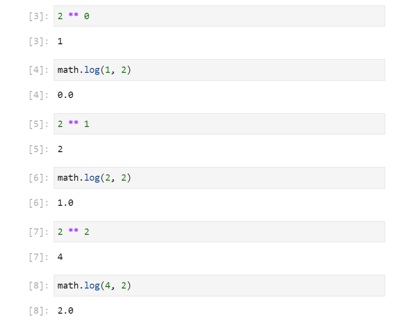

These bases are so commonly used, they have their own functions ```log10``` and ```log2``` which are locked to the base 10 and 2 respectively:


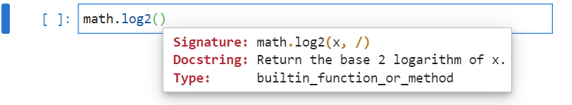

These work as expected:

```
math.log10(100)
math.log2(4)
```

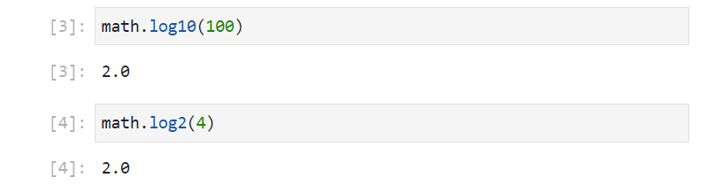

The float radix exponent function ```frexp``` is used to convert a number into a fractional mantissa and integer exponent using a base of 2.

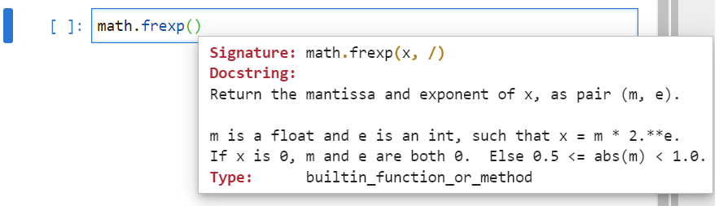

For example:

```
math.frexp(0.125)
mantissa, exponent = math.frexp(0.125)
0.5 * 2 ** -2
```


The load exponent function ```ldexp``` is the inverse of ```frexp``` and is used to construct a floating point number from a mantissa and exponent usign the base of 2:

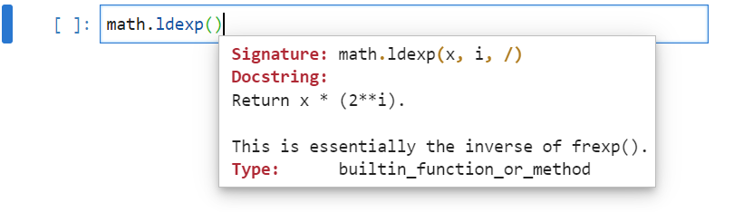

```
math.ldexp(0.5, -2)
0.5 * 2 ** -2
```


The exponential minus 1 ```expm1``` function calculates the exponential of a value and subtracts 1 from it:

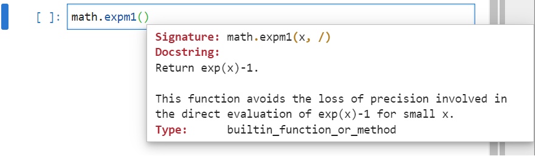

The reverse function logarithmic plus 1 ```logp1``` calculates the logarithmic of a value and adds to it:


Both of these 

```
math.exp(1)
math.expm1(1)
math.log(e)
math.log1p(e - 1)
```


```
math.ulp(0.1)
f"{0.1: 18.17f}"
```