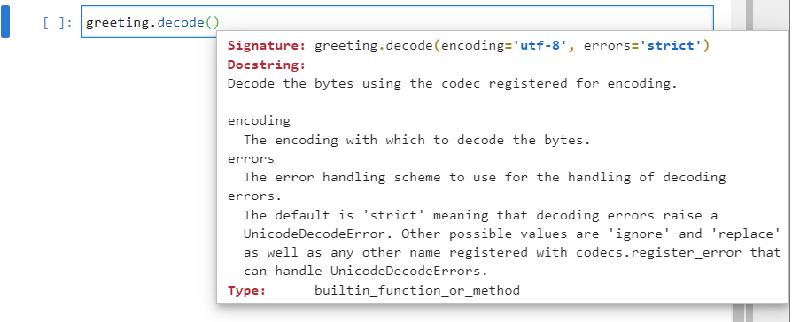

# Strings, Bytes and Byte Arrays

## ASCII and Latin1

In Python a string is an immutable collection of characters. Under the hood each character is encoded numerically in bytes. Recall that a byte is a grouping of 8 binary boolean switches such as the depiction below which can each either be off with a value of ```0``` or on with a value of ```1```: 


Alternatively 4 of the binary switches are grouped together as shown in red or blue and each color grouping is presented as a hexadecimal character. Hexadecimal has 16 different numeric characters ranging from ```0``` to ```f```, inclusive of ```f``` and each oo these characters represent difference arrangemetns of the underlying 4 binary switches.

The first 33 characters are non-printable command characters. A for loop can be used to convert this characters from their ordinal numeric value to their corresponding character. Because they are non-printable most display as a question mark when they are used with the ```print``` function:

```
for num in range(33):
    print(f"{num}, {num:08b}, {hex(num)}, {chr(num)}")
```


These command characters can roughly be conceptualised as commands for a typewriter and include carriage return (13), line feed (10), form feed (12), horizontal tab (9), vertical tab (11), shift in (15) and shift out (14), backspace (8) and escape (27). Most of these typewriter commands are now currently used to control how text is displayed on a screen, opposed to how a piece of paper is printed by a type writer.


The characters from 33 to 128 are English characters. The first grouping of 128 characters is known as the American Standard for Information Interchange (ASCII).

```
for num in range(33, 128):
    print(f"{num}, {num:08b}, {hex(num)}, {chr(num)}")
```


The first 128 characters or ASCII characters span half a byte. 

The remaining 128 characters in the byte are known as ```latin1``` (sometimes referred to as extended ASCII).

The first numeric value in the 2nd half of the byte were reserved for future use and are still left blank. Because the characters don't exist, they are non-printable and display as a question mark:

```
for num in range(129, 159):
    print(f"{num}, {bin(num):010}, {hex(num)}, {chr(num)}")
```    


The ```latin1``` extension unsurprisingly extends ASCII with additional latin characters that are commonly used in English such as the ```£``` sign used in the UK:

```
for num in range(160, 255):
    print(f"{num}, {bin(num):010}, {hex(num)}, {chr(num)}")
```


In the early days of the internet there used to be many regional variations of this character set. This resulted in ecoding errors when a website was encoded in one character set and viewed in another.

## The string Module
 
The ```string``` module contains strings which contain a number of useful character groupings. It can be imported using:

```
import string
```

And the docstring of the module can be accessed using:

```
? string
```


Each of these strings are available as a variable. ```whitespace``` has the most commonly used whitespace characters:

```
string.whitespace
```


This displays the space ``` ``` which is in ASCII and recognised by Python and printed as a space. The horizontal tab which is shown by Python as the escape character ```\t```. The carriage return which is in ASCII and shown by Python as the escape character ```\r```. The vertical tab character which is shown by Python using its hexadecimal value ```x0b```. The form feed character which is shown by Python using its hexadecimal value ```x0c```.

```lowercase``` has the lower case characters in the alphabet:

```
string.ascii_lowercase
```


```uppercase``` has the upper case characters in the alphabet:
     
```
string.ascii_uppercase
```


```ascii_letters``` includes ```ascii_lowercase``` and ```ascii_uppercase```:

```
string.ascii_letters
```


     
```digits``` includes the numeric integers used in the decimal system:

```
string.digits
```


```hexdigits``` has the additional 6 characters (first 6 letters of the alphabet) used in hexadecimal:

```
string.hexdigits
```


```octdigits``` has the 8 characters used in the octal numbering system:

```
string.octdigits
```


     
```punctuation``` contains the punctuation charaters:

```
string.punctuation
```


     
```printable``` contains the ascii printable characters. This includes the whitespace characters such as ```\t``` horizontal tab, ```\n``` new line, ```\r``` carriage return, ```\x0b``` vertical tab and ```\x0c``` form feed.


These ```strings``` are useful when it comes to extracting text from strings. For example the following string:

```
words = """
Baa, baa, black sheep,
Have you any wool?
Yes, sir, yes, sir,
Three bags full;
One for my master,
One for my dame,
And one for the little boy
Who lives down the lane.
"""
```


     
The newline can be replaced with a space and the string can be made lower case using the string ```replace``` and ```lower``` methods:

```
words = words.replace("\n", " ").lower()
words
```


A list comprehension can then be used alongside the ```string``` ```punctuation``` list to strip the string of all punctuation marks.

``` 
word_chars = [letter for letter in words if letter not in string.punctuation]
word_chars
```


The individual characters can be joined back up into a sentence using the string method ```join```:

```
words = ""
words = words.join(word_chars)
words
```


The whitespace at the end can be split using the string method ```split```:

```
words = words.split()
words
```

     

Finally a ```Counter``` can be used from the colelctions module to count the occurance of each word which may be used for machine learning applications such as analysis of custoemr feedback:

```
from collections import Counter
Counter(words)
```

       

 ## String Encoding

A Python  ```str``` is an abbreviation for a string of unicode characters and is sometimes known as a **unicode string**. The string of unicode characters can be constructed by enclosing the string of unicode characters in quotations:
     
```     
greeting = "hello world!"
greeting
```

The string has a length of 12 characters:

```
len(greeting)
```

The first character at an index of ```0``` is ```"h"```:

```
greeting[0]
```

     
     
The string above can also be constructed using a series of hexadecimal numbers which each correspond to an ASCII character. Recall that an ASCII character spans over a byte and therefore requires 2 hexadecimal characters. To insert a hexadecimal character into a string the escape character ```\x``` is used:

```
greeting = "\x68\x65\x6C\x6C\x6F\x20\x77\x6F\x72\x6C\x64\x21"
greeting
```

Notice the output of the string remains the same, the length of the string remains the same and the first index at ```0``` remains the same:

   

If one of the characters in the string ```e``` ```\x65``` is changed to the ```£``` ```\A3```, the string still works as expected. This is a non-ASCII character that still spans over a single byte, within the character encoding known as Latin1 or extended ASCII:

```
greeting = "\x68\xA3\x6C\x6C\x6F\x20\x77\x6F\x72\x6C\x64\x21"
greeting
```

   

## Unicode

Outwith the most commonly used characters in the English language which are encoded over 1 byte in ASCII and Latin1, there are a huge number of supplementary characters for other languages and these are encoded in Unicode. These supplementary characters generally use 2 bytes. Recall ```2 ** 8``` gives 256 combinations and ```2 ** 16``` gives 65536 combinations:

   

To insert a Unicode character the escape character is ```\u``` and this expects 2 bytes and therefore requires 4 hexadecimal characters. The ASCII subset which span over a single byte have the same value in Unicode but the trailing zeros need to be included. For example:

```
greeting = "\u0068\u00A3\u006C\u006C\u006F\u0020\u0077\u006F\u0072\u006C\u0064\u0021"
greeting
```

   

The Greek characters are commonly used in physics and mathematics. In Unicode they can be accessed using the number range:

```
for num in range(913, 970):
    print(f"{num}, {num:016b}, {hex(num)}, {chr(num)}")
```

  

In Greek ```"hello world!"``` is 

```
greeting = "Γειά σου Κόσμε!"
greeting
len[greeting]
greeting[0]
```

This greetings has a legnth of 15, that is 15 characters and the first character is ```" Γ"```:

  

This string can also be input using Unicode and the string displayed, length and first character are all the same:

```
greeting = "\u0393\u03b5\u03b9\u03ac\u0020\u03c3\u03bf\u03c5\u0020\u039a\u03cc\u03c3\u03bc\u03b5\u0021"
greeting
len[greeting]
greeting[0]
```

  
     
## The byte Class

Python has another datatype string datatype ```bytes``` which is an abbreviation for a string of bytes and is sometimes known as a **byte string**. 

**The byte is the fundamental datatype that a computer uses to store data and a byte string is used for data transfer.** It is far easier for a human to work with a unicode string so conversion to a unicode string from a byte string should be made as soon as possible in a Python program after importing data. Likewise conversion to a byte string from a unicode string should be made as late as possible before exporting data.

```bytes``` is setup by default to be encoded in ASCII and a ```byte``` is constructed in a similar manner to a ```str``` but includes the prefix ```b```:

```
greeting = b"Hello World!"
greeting
len(greeting)
greeting[0]
greeting[:1]
```

The length of the byte appears to be the same as before. However, this is only true when all of the characters are in the ASCII dataset as the length of each character is 1 byte. The length returned is the length in bytes as the fundamental unit of a byte string is a **byte**. Indexing the first value returns the numeric value of the first byte which is ```72```. However slicing displays the first character ```"H"```:

  

The numeric value ```72``` can be viewed as a hex string using the function ```hex```:

```
hex(72)
```

  

If the instance name ```greeting``` is input followed by a dot ```.``` and tab ```↹```:

  

The list of identifiers display for the ```bytes``` object. Most of these are similar to the string methods however there are some additional ones such as ```hex``` and ```decode```. The method ```hex``` can be used to get the numeric values for each byte in hexadecimal:

  

```
greeting.hex()
```

  

The method ```decode``` has an input argument ```encoding``` which has a default value of ```UTF-8```:

 

The following encoding schemes are most commonly used:

|encoding|bit|bytes|byte order|BOM|
|---|---|---|---|---|
|ASCII|1|8| |---|
|Latin1|1|8| | |
|UTF-16-LE|2|16|little endian| |
|UTF-16-BE|2|16|big endian| |
|UTF-16|2|16| |BOM|
|UTF-32-LE|4|32|little endian| |
|UTF-32-BE|4|32|big endian| |
UTF-32|4|32| |BOM|
|UTF-8|1-4|adaptive|1-4 adaptive| |
|UTF-8-Sig|1-4|adaptive|1-4 adaptive|BOM|

A BOM is an abbreviation for a Byte Order Marker (BOM) which normally occurs at the start of the byte stream and is used in the case of UTF-16 and UTF-32 to denote whether the data is little endian or big endian. Some programs include a BOM otherwise known as a signature for all data encoded which is why there is UTF-8-Sig even though the UTF-8 encoding does not have the confusion between little endian and big endian.

Because all of these characters are ASCII, spaning over 1 byte, the ASCII, Latin1 and UTF-8 encoding schemes all work:

```
greeting.decode(encoding="ASCII")
greeting.decode(encoding="Latin1")
greeting.decode(encoding="UTF-8")
```

 

If one of the other encoding schemes are used that uses 2 bytes instead of 1 byte for each character such as ```UTF-16-LE``` or ```UTF-16-BE```:

```
greeting.decode(encoding="UTF-16-LE")
greeting.decode(encoding="UTF-16-BE")
```

 

Nonsense is returned. The decoding is treating the byte sequence as the following 2 byte sequence:

```
4865 6c6c 6f20 576f 726c 6421
```

Opposed to the one byte sequence:

```
48 65 6c 6c 6f 20 57 6f 72 6c 64 21
```

Each number in the 2 byte sequence maps to a different character. The LE and the BE stand for little and big endian. Little endian reads in the bytes for each character from right to left, starting with the least significant character first. The two bytes for the first character would be read in as ```65 48``` and corresponds to the character ```"效"```.

Big endian reads in the bytes for each character from left to right, starting with the most significant character first. The first byte would be read in as ``` 48 65``` and corresponds to the character ```"效"```.

Notice in both cases the second character is ```6c 6c``` and therefore is read in the same using both UTF-16-LE and UTF-16-BE and is ```汬```.

If a UTF-32-LE encoding is attempted, a ```UnicodeDecodeError``` displays. This is because the following grouping is attempted to be made and the second character is incomplete:

```
48656c6c6f20576f 726c6421????????
```

 

A ```byte``` can be constructed from bytes:

```
greeting = b"\x68\x65\x6C\x6C\x6F\x20\x77\x6F\x72\x6C\x64\x21"
greeting
len(greeting)
greeting[0]
greeting[:1]
hex(72)
greeting.hex()
```

 

It cannot however use the ```u\``` escape character. If the ```"e"``` ```x65``` is swapped out for the non-ASCII ```"£"``` ```xA3```. Note that the non-ASCII character doesn't display properly by default as ASCII encoding is used and it is not recognised:

```
greeting = b"\x68\x65\x6C\x6C\x6F\x20\x77\x6F\x72\x6C\x64\x21"
greeting
len(greeting)
greeting[0]
greeting[:1]
hex(72)
greeting.hex()
```

 

It can however be ```decoded``` with the correct encoding scheme Latin1 and displays properly:

```
greeting.decode(encoding="Latin1")
```

 

Note as this byte contains a non-ASCII value, ASCII encoding gives a ```UnicodeError``` as does UTF-8:

```
greeting.decode(encoding="ASCII")
greeting.decode(encoding="UTF-8")
```

 

If a bytes object is attempted to be created with anon-ASCII or non-Latin1 character, a ```SyntaxError``` displays:

```
greeting = b"Γειά σου Κόσμε!"
greeting
```

 

The ```bytes``` class must be used to construct the object and supply it with initial encoding:

 

For example, the UTF-16-LE encoding is used:

```
greeting = bytes("Γειά σου Κόσμε!", encoding="UTF-16-LE")
greeting
len(greeting)
hex(greeting[0])
greeting.decode(encoding="UTF-16-LE")
```

Notice that the length of the byte is now 30, which is 15 characters and 2 bytes for each character:

 

A comparison between UTF-16-LE and UTF-16-BE can be made:

```
greeting = bytes("Γειά σου Κόσμε!", encoding="UTF-16-LE")
greeting
greeting2 = bytes("Γειά σου Κόσμε!", encoding="UTF-16-BE")
greeting2
greeting.hex()
greeting2.hex()
```

Notice that every two bytes are switched round:

 

The same word can be encoded with UTF-8 and UTF-16LE. 

```
greeting = bytes("Γειά σου Κόσμε!", encoding="UTF-8")
greeting
greeting2 = bytes("Γειά σου Κόσμε!", encoding="UTF-16-LE")
greeting2
greeting.hex()
greeting2.hex()
len(greeting)
len(greeting2)
greeting.decode(encoding="UTF-8")
greeting2.decode(encoding="UTF-16-LE")
```

UTF8 has an adaptable encoding, using 1 byte for ASCII characters and 2 bytes for the Greek characters. In this example there are two spaces ``` ``` and one ```!``` which are ASCII and take up only 1 byte. As a consequence the UTF-8 encoding has a length three bytes smaller than the UTF-16 encoding which is fixed to 2 bytes for every character. Both of these byte strings when encoded show an identical string but under the hood, this string is encoded differently:

 

UTF-8 is the more commonly used standard, which is why it is the default value for the keyword ```encoding```.

```find``` and ```index``` are methods which can be used to search for a subbyte within the byte. ```index``` raises a ```ValueError``` if the byte being searched for is not found while ```find``` returns ```-1```. ```find``` begins searching from the left hand side and ```rfind``` begins searching from the right hand side. 

```
greeting = bytes("Γειά σου Κόσμε!", encoding="UTF-8")
greeting
greeting.find(b"\xb5")
greeting.rfind(b"\xb5")
greeting.index(b"\xb5\xce\xb9\xce\xac")
```

 

The methods ```centre```, ```ljust``` and ```rjust``` can be used to centre, left justify and right justify a byte with a fill character. Note that the size of the desired byte is in bytes and not characters. Since the byte is 27 characters long, 23 bytes will be inserted and filled up with the fill character. Since the fill character is ```b"\x2A"```, the ASCII character ```*```, it will be inserted 23 times:

```
greeting.center(50, b"\x2A").decode(encoding="UTF-8")
greeting.ljust(50, b"\x2A").decode(encoding="UTF-8")
greeting.rjust(50, b"\x2A").decode(encoding="UTF-8")
```


The methods ```removeprefix``` and ```removesuffix``` can be used to remove a prefix of bytes from the left or a suffix of bytes from the right respectively. The related methods ```strip``` and ```rstrip```  will strip a space ```" "``` which is the ASCII ```b"x20"``` from the left or right by default. This default input argument can be overridden to remove another hex value and therefore behave similar to ```removeprefix``` and ```removesuffix```:

```
greeting = bytes(" Γειά σου Κόσμε! ", encoding="UTF-8")
greeting
greeting.hex()
greeting.removeprefix(b"\x20\xce\x93\xce")
greeting.removesuffix(b"\xce\xb5\x21\x20")
greeting.strip()
greeting.rstrip()
```


The methods ```maketranslate``` and ```translate``` are for creating custom translation tables and decoding with them.

## The bytearray Class

Notice that all the ```byte``` methods and all the ```string``` methods display an output which means the methods act on instance data and return a new instance of the ```byte``` or ```string``` and do not modify it inplace, like for example, ```list``` methods do. The ```string``` and the ```byte``` are immutable similar to a ```tuple```. Because these classes are immutable, it is not possible to index into the instance and reassign the value. Attempting to do so shows a ```TypeError```:

```
greeting = bytes("Γειά σου Κόσμε!", encoding="UTF-8")
greeting
greeting[0]
greeting[0] = 0xcf
```


There is another class that is mutable, called a ```bytearray```.


Instantiation of a ```bytearray``` requires use of the ```bytearray``` class and normally involves supplying a string or byte array and associated encoding. Notice now that the assignment of the byte takes place which replaced the first character ```"Γ"``` with ```"ϓ"```:

```
greeting = bytearray("Γειά σου Κόσμε!", encoding="UTF-8")
greeting
greeting[0]
greeting[0] = 0xcd
```


If the instance ```greeting``` is input followed by a ```.``` and ```↹```:


A list of identifiers display. These include the methods ```copy```, ```clear```, ```append```, ```extend```, ```reverse``` and ```replace``` which are seen in the mutable ```list``` collection and behave simular to their counterpart. These similar methods reinforce the concept of a ```bytearray``` being list-like where each element in the list-like structure is a byte. The method ```extend``` does not create a nested ```bytearray``` but does extend the original ```bytearray``` in place. ```append``` is used to append a single ```byte``` to the ```bytearray```. For example: 

```
greeting = bytearray("Γειά σου Κόσμε!", encoding="UTF-8")
greeting
greeting.extend(bytearray("\x20\x68\x65\x6C\x6C\x6F\x20\x77\x6F\x72\x6C\x64\x21", encoding="UTF-8"))
greeting
greeting.decode(encoding="UTF-8")
```


```
greeting.append(0x20)
greeting
greeting.decode(encoding="UTF-8")
```


The method ```split``` can be used to split the ```bytearray``` into a list of ```bytearray``` segments using a delimiter, similar to the string method ```split```. The default delimiter is ```None``` and defaults to using whitespace characters:


```
greeting.split()
```


This returns a new ```list``` object and does not mutate the original. The methods in the ```bytearray``` which have an equivalent in the ```string``` or ```byte``` class do not mutate the ```bytearray``` and return a new object. This can be seen with ```strip``` for example:

```
greeting.strip()
greeting
```


Return to:
[Home](../../../)
