# The Decimal Module

In the previous tutorials which covered the fundamental datatypes and underlying principles of numbering systems. The floating point number was seen to have been encoded in binary using the IEEE-754 standard and as a result has some unexpected rounding recursion errors.

```
0.1 + 0.2
```


The decimal module is a module built around the ```Decimal``` class which is instead encoded in decimal using the IEEE-854 standard and is designed to work more similar to human based mathematics which also uses the decimal system. It can be imported using:

```
import decimal
```

The docstring for the module isn't very detailed:

```
? decimal
```

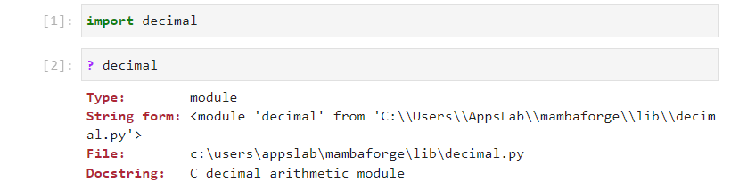

```decimal.``` followed by a tab ```↹``` can be pressed to view a list of identifiers:

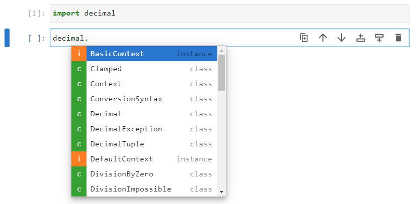

The module is based around the ```Decimal``` class which is usually directly imported.

```
from Decimal import Decimal
```


The ```Decimal``` class can be used to construct new ```Decimal``` instances and its docstring can be viewed by inputting the class name followed by open parenthesis and pressing shift ```⇧``` and tab ```↹```:

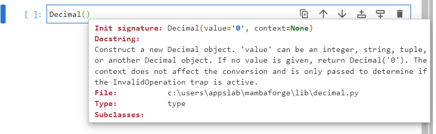

Typically this is constructed from a string:

```
num1 = Decimal("0.3")
num1
```

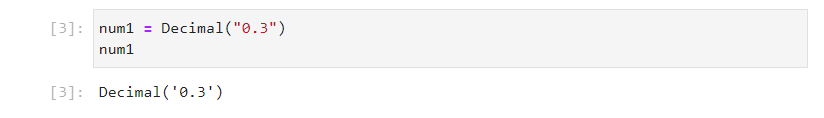

Alternatively integers may be used. The first integer input argument refers to the sign of the mantissa and is ```0``` for positive values and ```1``` for negative values. The second input argument is a tuple of integers orresponding to the mantissa and the third value is a signed integer corresponding to the exponent:

```
num2 = Decimal((0, (3,), -1))
num2
```

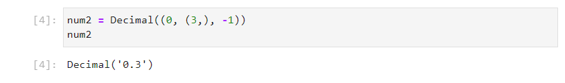

```
num3 = Decimal((1, (3, 2, 1), -1))
num3
```

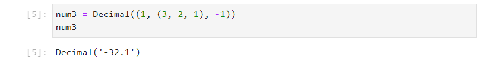

A number of methods are available:

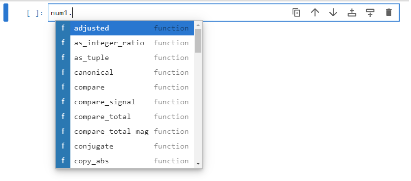

All of the traditional mathematical operators are also assigned to their respective datamodel methods and can be viewed by looking at the directory using ```dir```:

```
dir(num1)
```

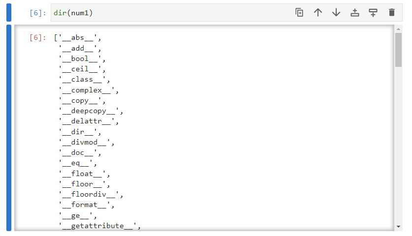

The mathematics of ```Decimal``` instances behaves more similar to traditional mathematics:

```
Decimal("0.1") + Decimal("0.2")
```

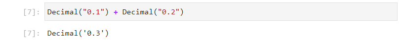

A ```Decimal``` instance can be constructed from a ```float``` instance and will be stored in a higher precision but will inherit the rounding errors from the original ```float``` which was encoded using binary:

```
Decimal(0.1 + 0.2)
```

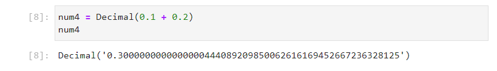

The concept of ```1/3``` is recurring in decimal:

```
num1 = Decimal(1) / Decimal(3)
num1
```

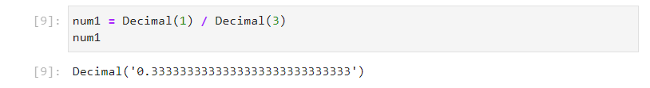

```
num2 = 1/3
num2
```

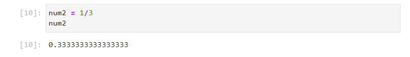

Notice the difference in the length of the Decimal instance which is 28 and the length of the float instance which is 16:

```
len("3333333333333333333333333333")
len("3333333333333333")
```

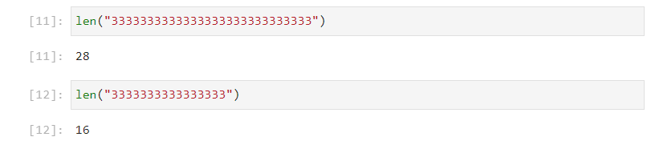


The size of the Decimal instance is 104 bytes and the float instance is 24 bytes:

```
from sys import getsizeof
getsizeof(num1)
getsizeof(num2)
```

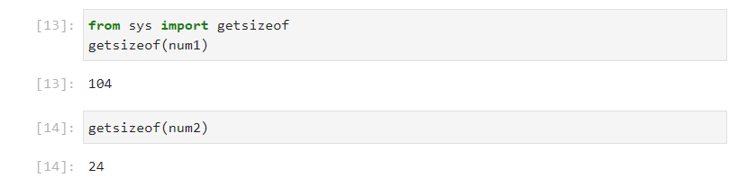

Therefore it will take more memory to work with the Decimal instance compared to the float instance. 

## Context

Unlike the IEEE-754 standard which is essentially fixed in terms of precision and overall working range and the handling of common errors, the IEEE-854 standard is tunable and uses a ```context```. The ```context``` for arithmetic is an environment specifying precision, rounding rules, limits on exponents, format of exponents and flags indicating the results of operations, and trap enablers which determine whether signals are treated as exceptions. The context of the ```Decimal``` class can be accessed by using the ```getcontext``` function which is usually imported alonside the ```Decimal``` class using:

```
from decimal import Decimal, getcontext
from sys import getsizeof
```

The function takes in no input arguments:

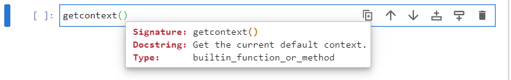

To view the context use:

```
getcontext()
```

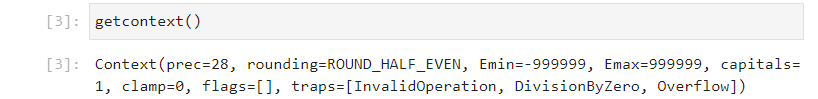

The context can als be assigned to an object name and these values can be accessed as attributes:

```
context = getcontext()
```

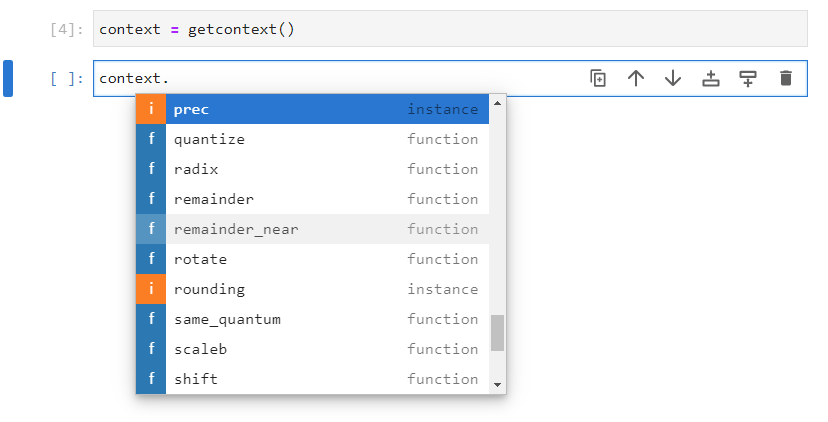

## Precision

Each of the items displayed in the output below is accessible as an attribute. For example:

```
context.prec
```

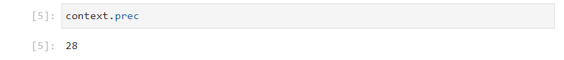

These can also be varied. The ```decimal``` module has a number of constants which relate to the boundaries or discrete values of the context attributes. For ```prec```, there is ```MAX_PREC``` which can be imported using:

```
from decimal import Decimal, getcontext
from decimal import MAX_PREC
from sys import getsizeof
context = getcontext()
context.prec
MAX_PREC
```

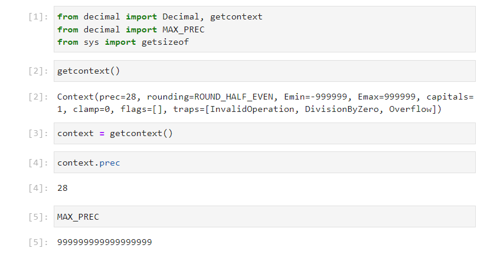

The precision may be changed to 100. Notice the difference in output from before showing an increased number of characters and the object size in memory is also larger:

```
context.prec = 100
num1 = Decimal(1) / Decimal(3)
num1
len("3333333333333333333333333333333333333333333333333333333333333333333333333333333333333333333333333333")
getsizeof(num1)
```

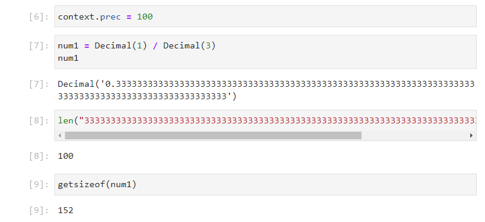

Although the upper precision is specified in ```MAX_PREC``` assignment to that value is generally unusable and displays a memory error:

```
context.prec = MAX_PREC
num1 = Decimal(1) / Decimal(3)
```

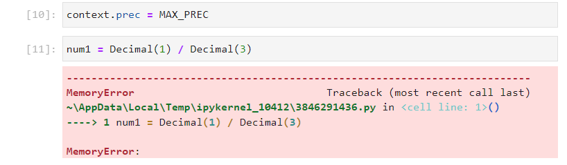

The precision will be set back to the default:

```
context.prec = 28
```

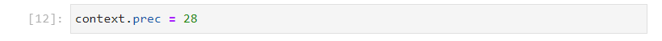

## Rounding

The rounding protocol can be viewed by accessing the ```rounding``` attribute from the context:

```
from decimal import Decimal, getcontext
from decimal import MAX_PREC
from sys import getsizeof
context = getcontext()
context.rounding
```

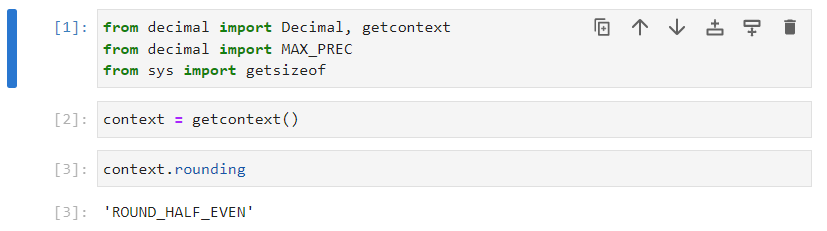

The default is ```ROUND_HALF_EVEN```, the other rounding constants can be imported using:

```
from decimal import ROUND_HALF_EVEN
from decimal import ROUND_DOWN, ROUND_FLOOR, ROUND_HALF_DOWN
from decimal import ROUND_UP, ROUND_CEILING, ROUND_HALF_UP, ROUND_05UP
```

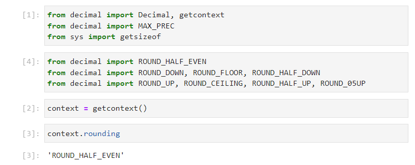

There are very subtle differences in these depending on the rounding boundaries be taken from ```-inf```, ```0``` or ```+inf```.

```
context.rounding = ROUND_UP
num1 = Decimal(1) / Decimal(3)
num1
num2 = Decimal(2) * Decimal(1) / Decimal(3)
num2
```

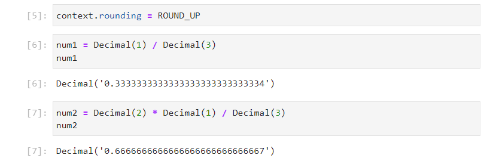

```
getcontext().rounding = ROUND_DOWN
num1 = Decimal(1) / Decimal(3)
num1
num2 = Decimal(2) * Decimal(1) / Decimal(3)
num2
```

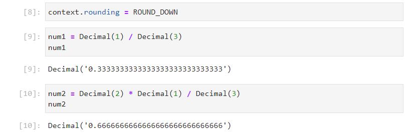

```
getcontext().rounding = ROUND_HALF_EVEN
dec1 = Decimal(1) / Decimal(3)
dec1
dec2 = Decimal(2) * Decimal(1) / Decimal(3)
dec2
```


## Exponent Min, Exponent Max and Exponent Format

```
getcontext().Emin
getcontext().Emax
getcontext().capitals
```

```
from decimal import MIN_EMIN, MAX_EMAX
```

```
getcontext().Emin = -1000
getcontext().Emax = 1000
```

```
Decimal("1.234e-1000") * Decimal("1.234e-1000")
```

```
getcontext().Emin = -10000
getcontext().Emax = 10000
getcontext().capitals = 0
```

```
Decimal("1.234e-1000") * Decimal("1.234e-1000")
```


## Overflow and Underflow

```
getcontext().traps
```


```
from decimal import Underflow, Overflow
```

```
getcontext().traps[Underflow] = True
getcontext().traps[Overflow] = True
getcontext().prec = 6 
getcontext().Emin=-999
getcontext().Emax=999
getcontext().clamp = 1
```


```
Decimal("1.230000e999") * Decimal("10000")
Decimal("1.230000e-999") / Decimal("10000")
```

## Division by Zero and Invalid Operation

```
from decimal import DivisionByZero, InvalidOperation
```


```
Decimal("1") / Decimal("0")
```


```
getcontext().traps[DivisionByZero] = False
```


```
Decimal("1") / Decimal("0")
```


```
Decimal("0") / Decimal("0")
```


```
getcontext().traps[InvalidOperation] = False
```


```
Decimal("0") / Decimal("0")
```


