# Working with Files and Directories

## Reading and Writing to Files

### Reading Files

The Documents folder can be opened in file explorer:


An interactive notebook file can be created in the Documents folder and opened with JupyterLab:

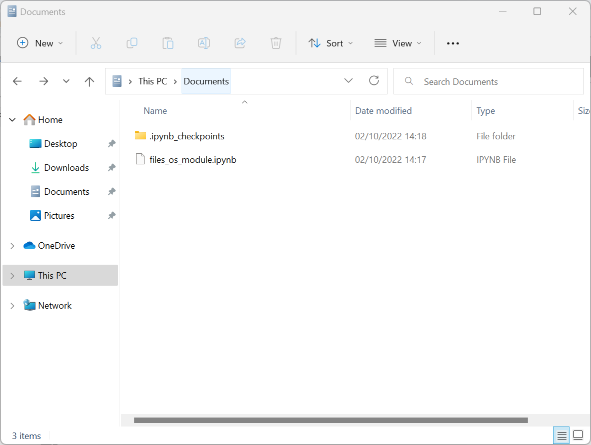

A new text file can be created in the file explorer:


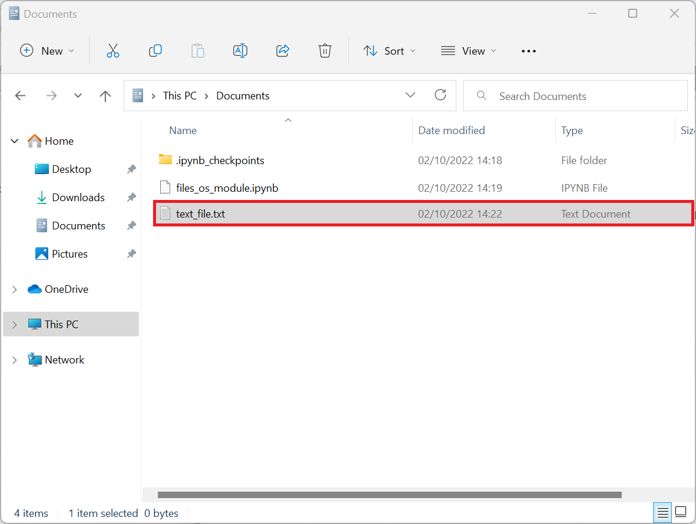

Some text can be added into this text file:

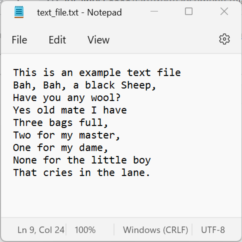

The text file can be opened in Python using the following syntax:

```
file_object = open(file="text_file.txt", mode="r")
```


Because ```text_file.txt``` is in the same folder as ```file_os_module.ipynb```. The file can be expressed implicitly without explicitly specifying the full path.

The mode can be ```"r"``` for read, ```"w"``` for write and ```"a"``` for append. ```"r"```, ```"w"``` and ```"a"``` are modes to read, write and append data as a unicode string. ```"rb"```, ```"wb"``` and ```"ab"```, are modes to read, write and append data as a byte string where ```"b"``` indicates the data is going to be in bytes.

The file_object has a number of attributes and methods which can be accessed by typing in the file object names followed by a dot ```.``` and tab ```↹```:

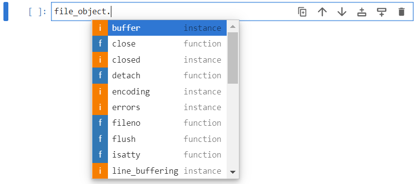

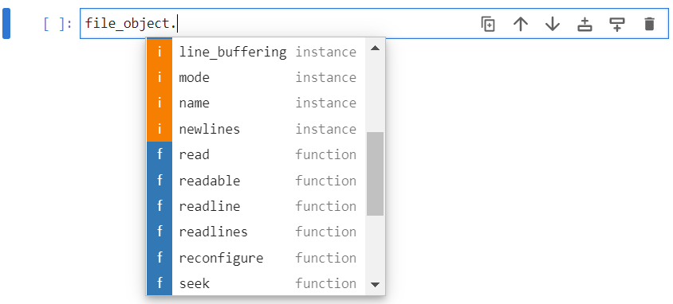

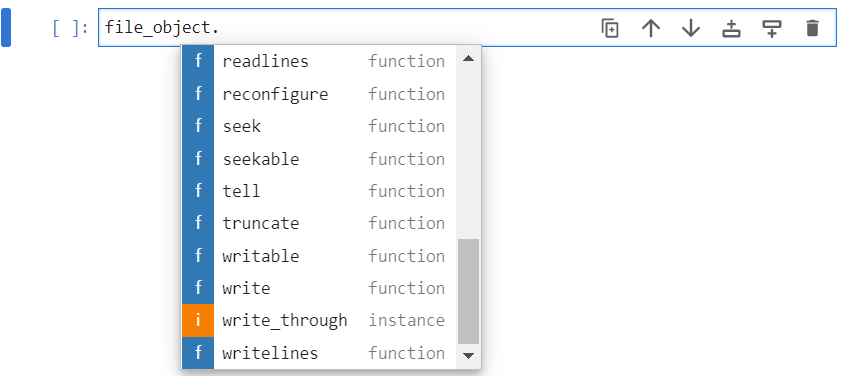

The ```close``` method is used to close the file and should always be used after working with the file.

The ```with``` keyword is typically used to open the file over the duration of a code block. 

```
with open(file="text_file.txt", mode="r") as file_object:
    file_object.close()
    
    
```


In the code block above, the final line of the code block explicitly closes the file object. However since the keyword ```with``` is used, the file will automatically close the file when the code block ends. The file will be closed after this code block executes: 

```
with open(file="text_file.txt", mode="r") as file_object:
    pass
    
    
```


For clarity, the close method will explicitly be stated at the bottom of a code block. The file contents can be read using the method ```read```.

```
with open(file="text_file.txt", mode="r") as file_object:
    file_contents = file_object.read()
    print(file_contents)
    file_object.close()
    
    
```

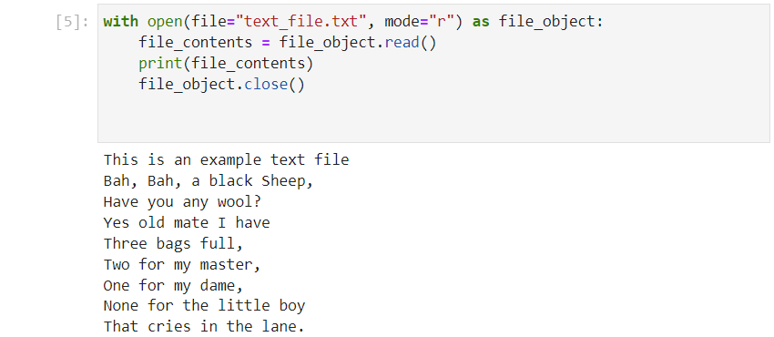

The object ```file_contents``` can be explored on the variable explorer and is a string of length 193 characters:

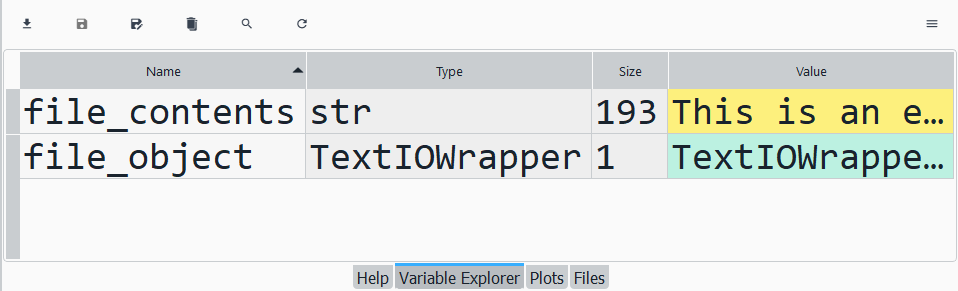

The read method has a positional input argument size. This can be used to specify the upper size of characters to read from a file.

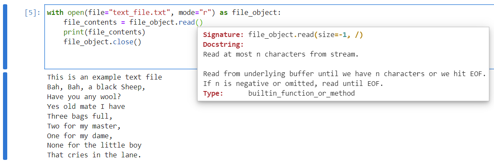

This can be set to 10 for example:

```
with open(file="text_file.txt", mode="r") as file_object:
    file_contents = file_object.read(10)
    print(file_contents)
    file_object.close()
    
    
```    

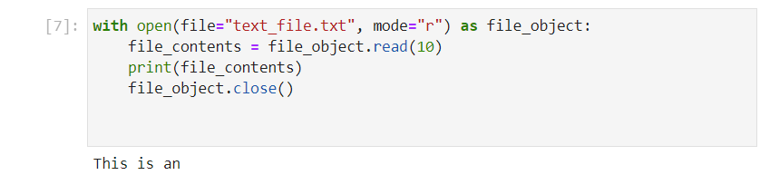

The object ```file_contents``` can be explored on the variable explorer and is a string of length 10:

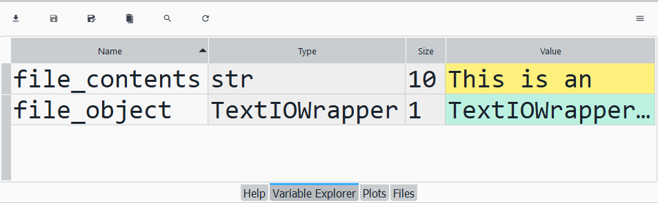

Before this code block closes the file, the cursor of the text file can be visualised at the position 10:

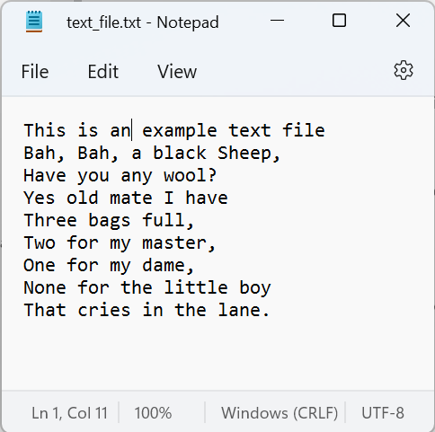

The code can be updated to read two 10 character strings from the file.


```
with open(file="text_file.txt", mode="r") as file_object:
    file_contents = file_object.read(10)
    print(file_contents)
    file_contents2 = file_object.read(10)
    print(file_contents2)
    file_object.close()
    
    
```    

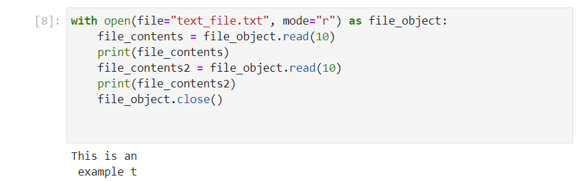

Now ```file_contents``` and ```file_contents2``` display on the variable explorer:

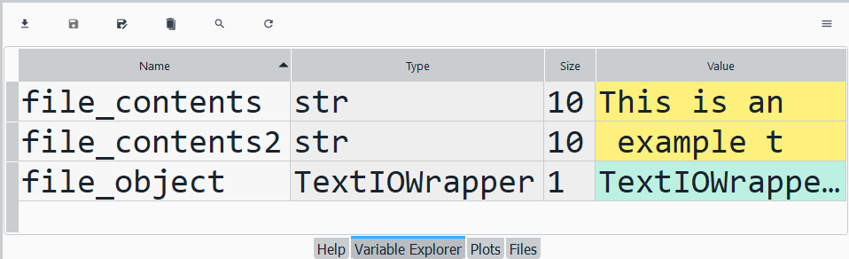

Before this code block closes the file, the cursor of the text file can be visualised at the position 20:

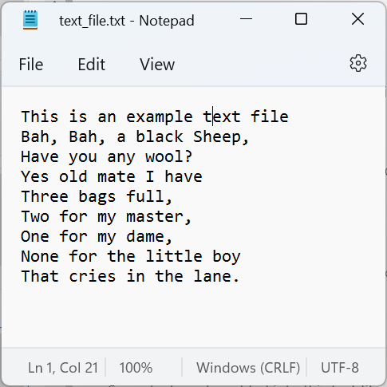

The function ```seek``` can be used to change the offset position of the cursor. The starting position for example can be set at position ```25```

```
with open(file="text_file.txt", mode="r") as file_object:
    file_object.seek(25)
    file_contents = file_object.read(30)
    print(file_contents)
    file_object.close()
    
    
```    

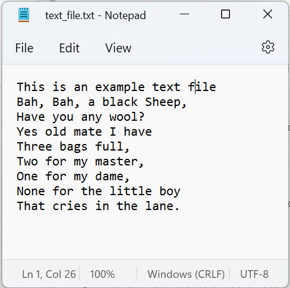

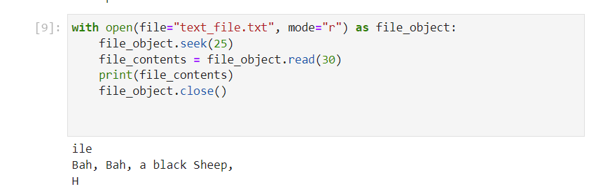

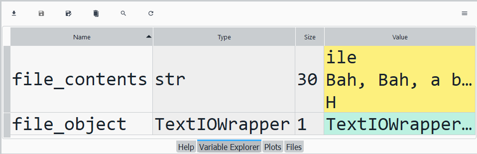

Notice that ```file_contents``` is a multi-line string.

There is an associated readline method which can be used read a single line, including the newline character at the end of the line. 

```
with open(file="text_file.txt", mode="r") as file_object:
    file_contents = file_object.readline()
    print(file_contents, end="*")
    file_object.close()
    
    
```

The presence of the newline character can be seen by changing the ```end``` keyword input argument in the ```print``` function to ```*```. The ```*``` starts of a newline indicating the last character in the string ```file_contents``` is the newline.

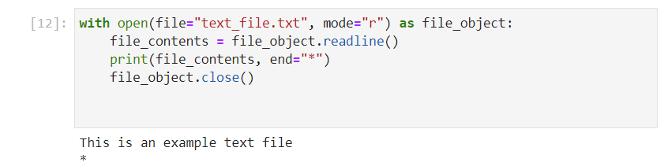

This newline can be seen in the variable explorer, if examined with care:

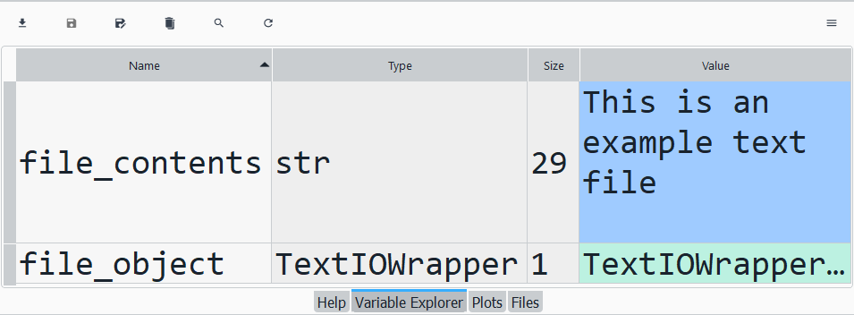

Before this code block closes the file, the cursor of the text file can be visualised at the start of the second line:

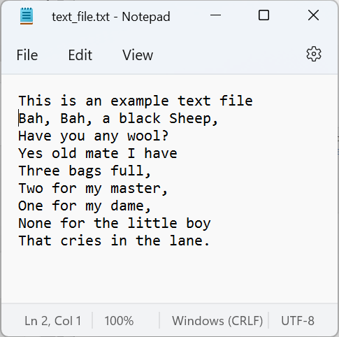


Readlines can be used to read multiple lines into an output list.

```
with open(file="text_file.txt", mode="r") as file_object:
    file_contents = file_object.readlines()
    print(file_contents)
    file_object.close()


```

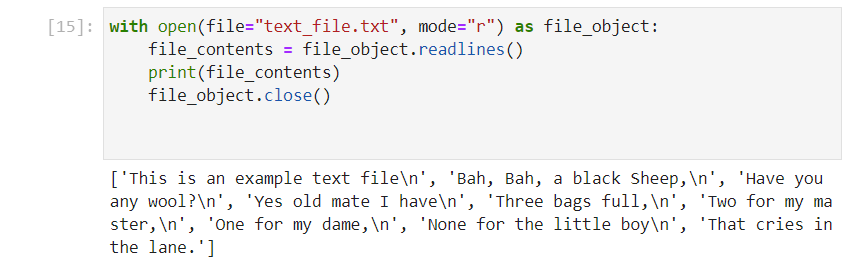

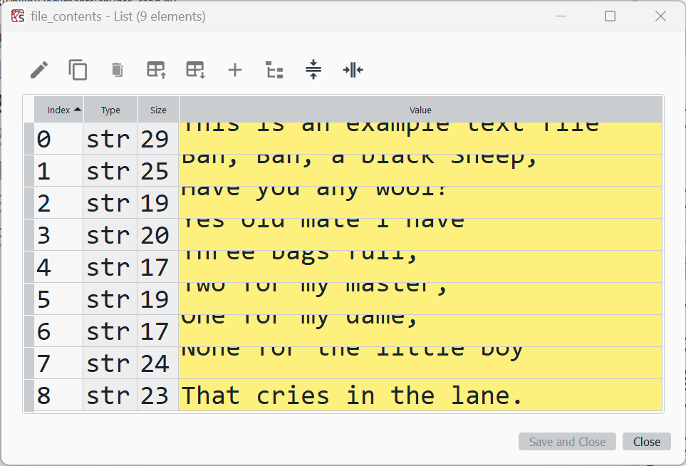

### Creating Files

A new blank file can be created by use fo a new file name ```"text_file2.txt"``` and setting the mode to ```"w"``` for write access.

```
with open(file="text_file2.txt", mode="w") as file_object:
    file_object.close()
    
    
```


The blank file can be opened in file explorer:

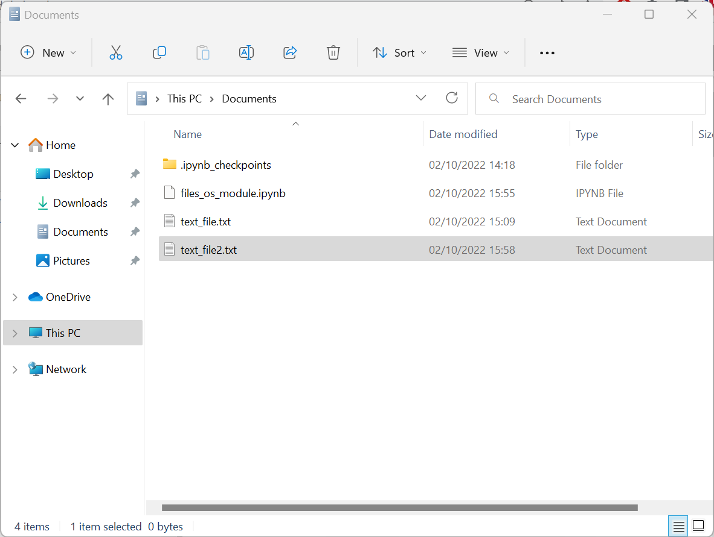

The blank contents can be seen in notepad:

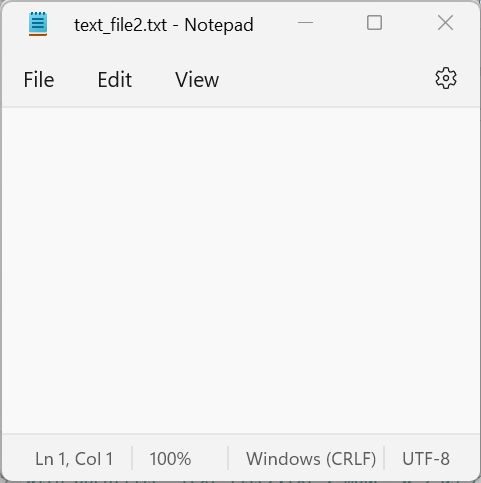

Some text can be added:

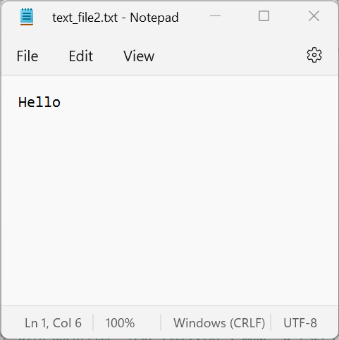

Using write mode when an existing file is present, will overwrite the file:

```
with open(file="text_file2.txt", mode="w") as file_object:
    file_object.close()
    
    
```


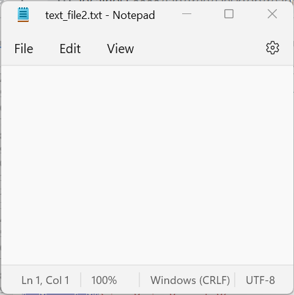

### Appending Files

If some text is added to the file, in notepad again.

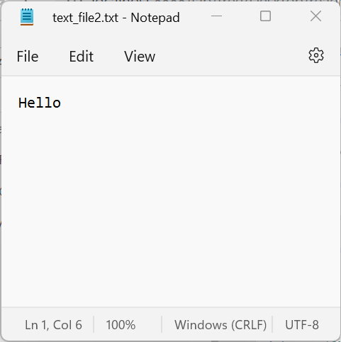

The third mode of operation append can be explored. In the append mode, the file will be opened with write access, however the offset position of the cursor will be at the end of the file.

The method ```writelines``` can be used to write a list of strings to a file. The associated method ```write``` can be used to write a single string to a file. These mehtods follow similar behaviour to their read counterparts:

```
new_file_contents = ["Mary, Mary, quite contrary,\n",
                     "How does your garden grow?\n",
                     "With silver bells, and cockle shells,\n",
                     "And pretty maids all in a row."]
                     
with open(file="text_file2.txt", mode="a") as file_object:
    file_object.writelines(new_file_contents)
    file_object.close()
    
```    

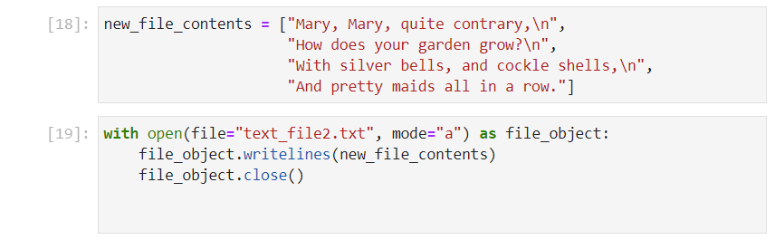

Notice the updated contents of the file. The cursor started immediately after ```Hello``` and there was no new line or space so, the first sentance continued immediately after Hello: 

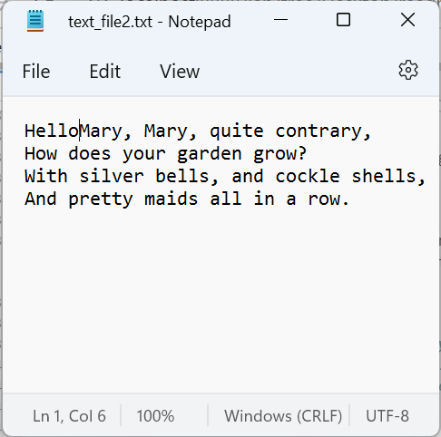

## Working with Directories

In Python and Linux, a folder is known as a directory.

In Windows File Explorer, a directory is known as a folder.

### os Module

The inbuilt operating system module ```os``` is used for file and folder manipulation. Although this module is inbuilt into Python, it must be imported before use:

```
import os
```

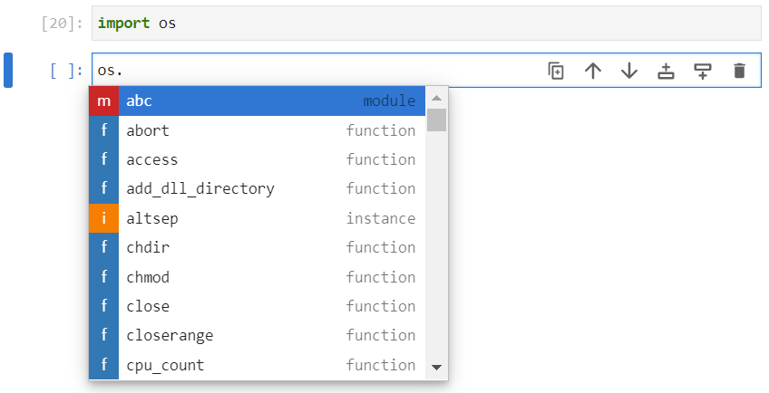

A large number of objects can be called from the ```os``` by typing in ```os``` followed by a dot ```.``` and tab ```↹```.

### Current Working Directory

The method getcwd is an abbreviation for get current working directory:

```
os.getcwd()
```


By default, this is the folder or directory of the currently executed script (.py file) or interactive notebook (.ipynb file). This folder can be viewed in Windows Explorer to visualise its contents:


### List Directory

The method ```listdir``` will list all items in the current working directory:

```
os.listdir()
```

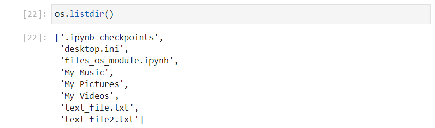

This method has a keyword input argument path that can be used to select a different location. If unspecified, path defaults to the current working directory.

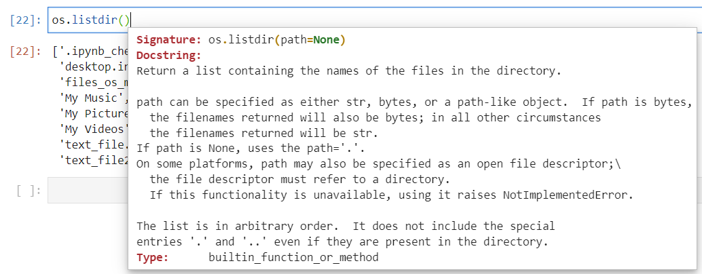

The path searched for will also be in reference to the current directory unless explicitly specified. The path can be changed to Downloads by going up a level ```..``` to get to ```$UserProfile$``` and then to Downloads using:

```
os.listdir(r"../Downloads")
```

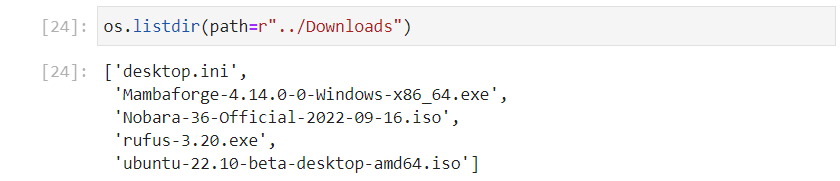


### Environmental Variables

The ```$UserProfile$``` is typically found in the ```C:\Users``` folder within file explorer.


This folder is defined by what is known as an Operating System wide Environmental Variable. These are listed within essentially a dictionary.


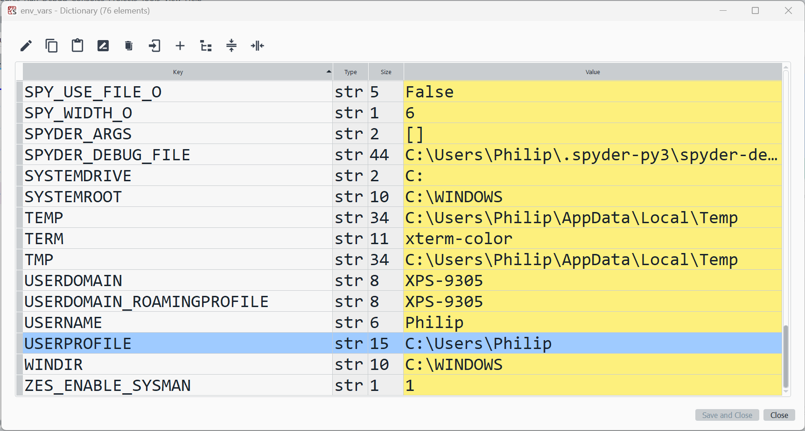

On Windows, inputting ```%UserProfile$"``` into the file explorer changes the directory of the file explorer to the user profile:

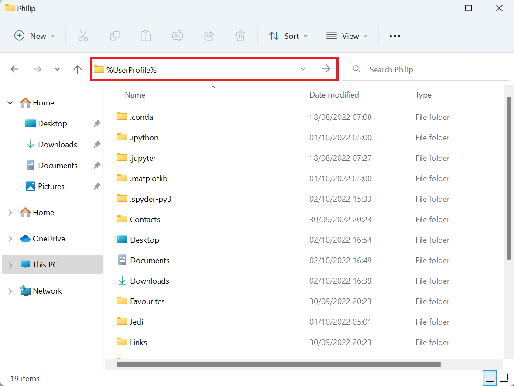

The location can be accessed as a string from this dictionary-like object using the key ```"USERPROFILE"```:

```
os.environ["USERPROFILE"]
```


On Linux, the equivalent key is called ```"HOME"```.

### path Methods

Concatenation of file paths can quickly get messy due to the multiple ```\``` in the file path.

```
os.environ["USERPROFILE"] + "Documents"
```

```
os.environ["USERPROFILE"] + r"\Documents"
```

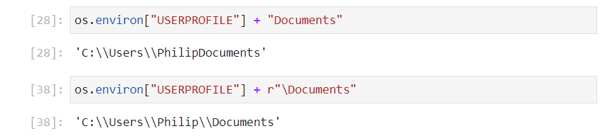

As a consequence a collection of operations relating to the file path are available under the ```os``` attribute ```path```:

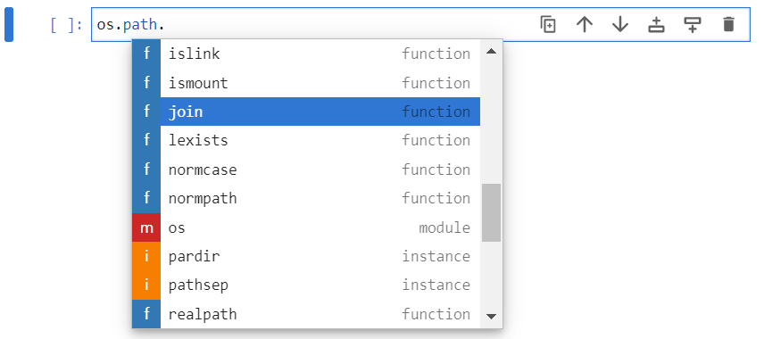

For example the function ```join``` can be used to join the os environmental variable, Documents folder and text file within the Documents folder:

```
os.path.join(os.environ["USERPROFILE"], "Documents")
os.path.join(os.environ["USERPROFILE"], "Documents", "text_file.txt")
```

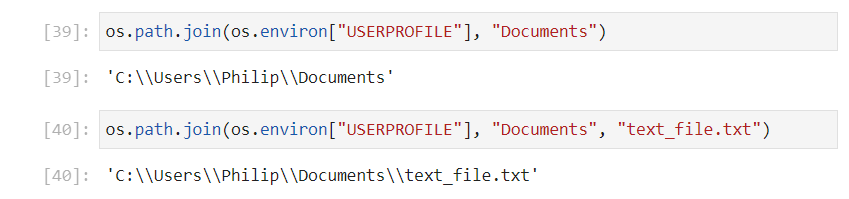

The file path above can be assigned to a variable ```file_path```:

```
file_path = os.path.join(os.environ["USERPROFILE"], 
                         "Documents", 
                         "text_file.txt")
```

```
file_path
```

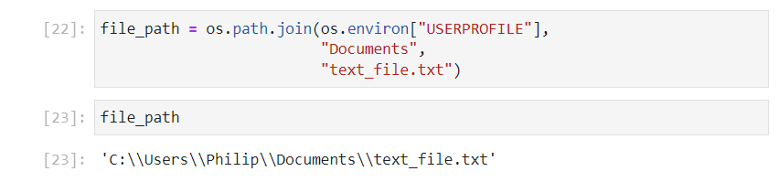

The os path method ```exists``` will check if the physical file path exists, returning a boolean value. In this case the ```file_path``` exists:

```
os.path.exists(path=file_path)
```


The os path method ```isfile``` will check if the file path corresponds to a file, returning a boolean value. In this case, ```file_path``` is a file:

```
os.path.isfile(path=file_path)
```


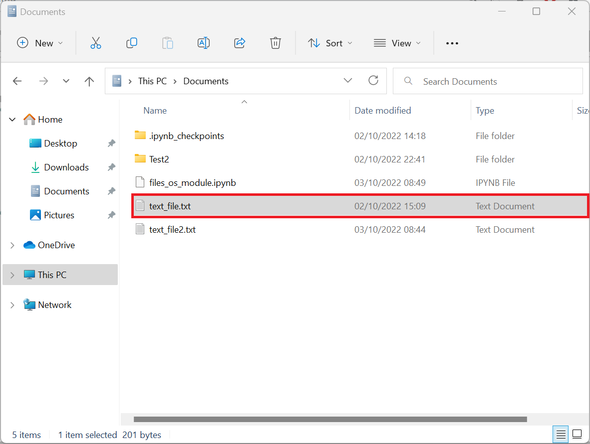

The os path method ```isdir``` will check if the file path corresponds to a directory or folder, returning a boolean value. In this case, ```file_path``` is a file and not a folder:

```
os.path.isdir(s=file_path)
```


For a file path that is a file, it can be split into a basename (name of the file itself, including the file extension) and also the dirname (directory or folder name) using the os path methods ```dirname``` and ```basename``` respectively:

```
os.path.basename(p=file_path)
os.path.dirname(p=file_path)
```

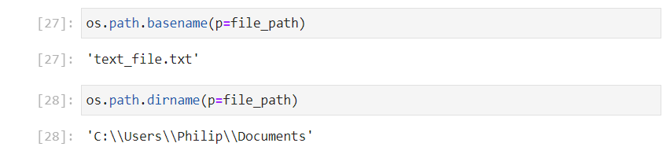

This gives the file and path respectively:

```
os.path.isfile(path=os.path.basename(p=file_path))
os.path.isdir(s=os.path.dirname(p=file_path))
```

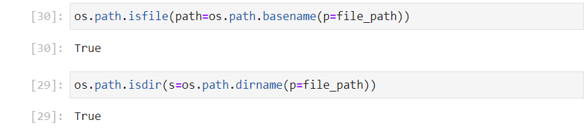

The os path method ```splitext``` is an abbreviation for split extension. It will return a tuple containing the file path excluding the extension in the 0th index and the extension itself in the 1st index:

```
os.path.splitext(p=file_path)
os.path.splitext(p="text_file.txt")
```

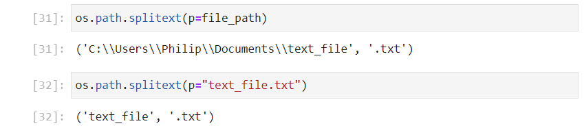

The os path method ```split``` on the other hand will split the directory or folder and the file name. It will return a tuple with the directory or folder name in the 0th index and the file name including the extension in the 1st index:

```
os.path.split(p=file_path)
folder, file = os.path.split(p=file_path)
folder
file
```

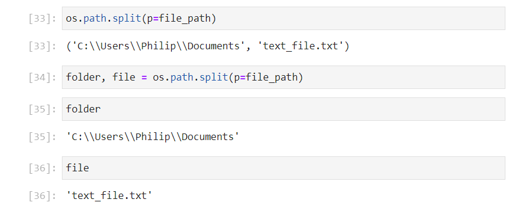

### Make and Delete Directories

The ```mkdir``` function is an abbreviation, for make directory:

```
os.mkdir(path="Test")
```


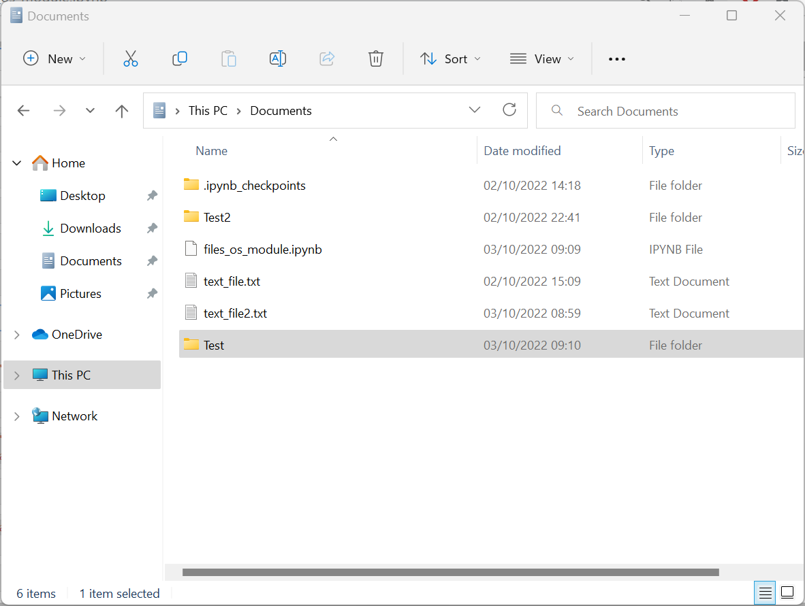

The ```rmdir``` function is an abbreviation, for remove directory:

```
os.rmdir(path="Test")
```


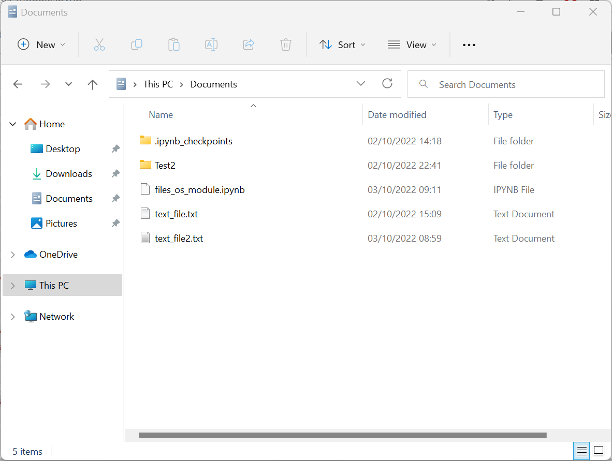

### Rename Directory

The ```Test``` directory or folder can be remade using:

```
os.mkdir("Test")
```


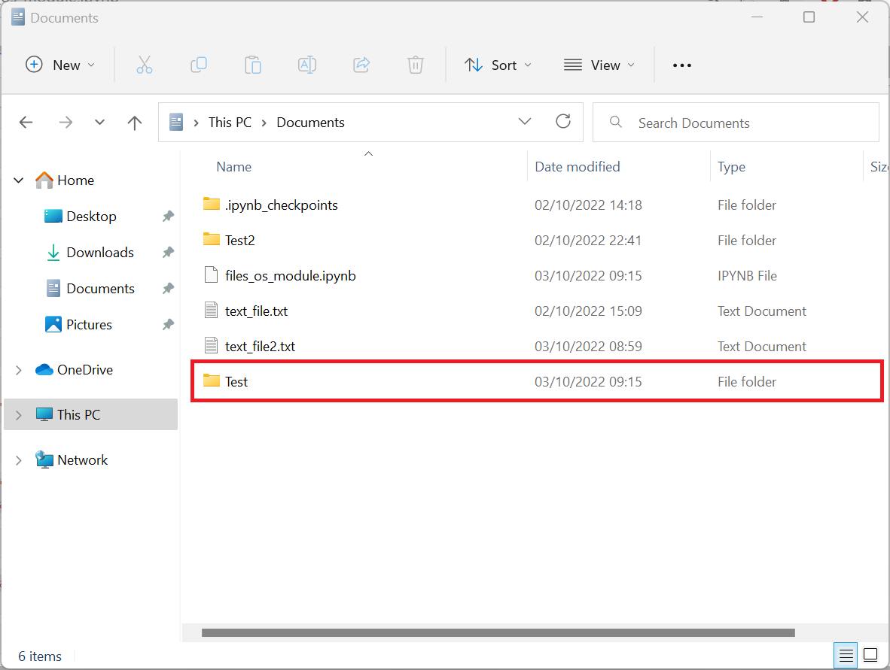

The ```rename``` function can be used to rename a source directory to a destination directory. In this example ```"Test"``` will be renamed ```"Test2"```:

```
os.rename(src="Test", dst="Test2")
```


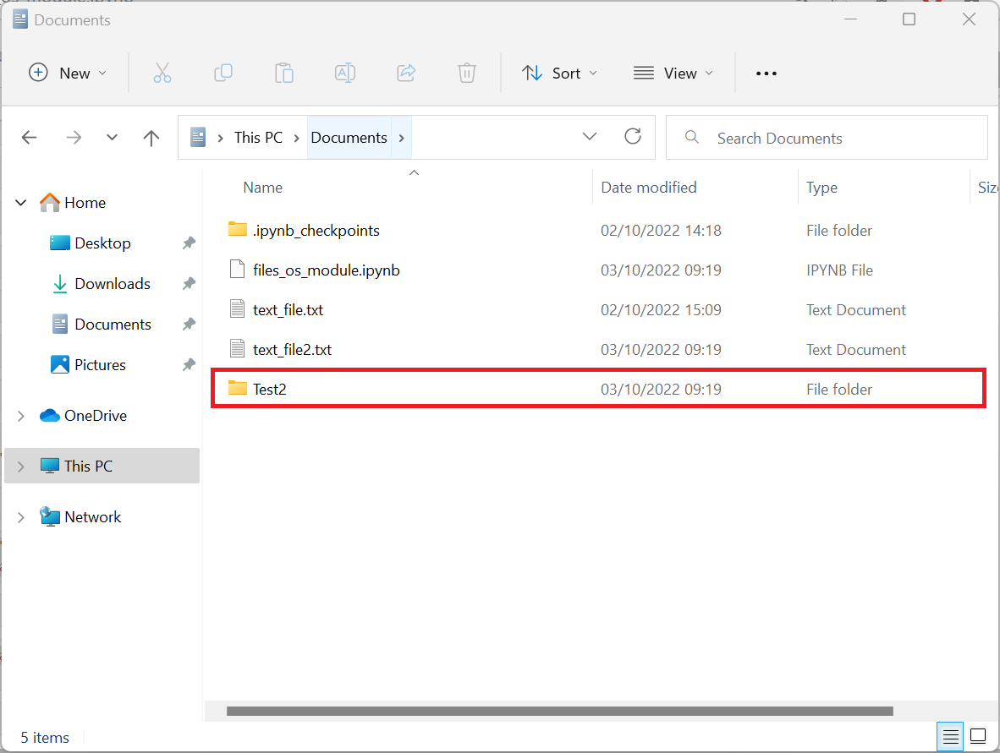

A file can also be renamed by specifying the source and the destination in terms of an original file name and a new file name:

```
os.rename(src="text_file2.txt", 
          dst="mary_mary_quite_contrary.txt")
```


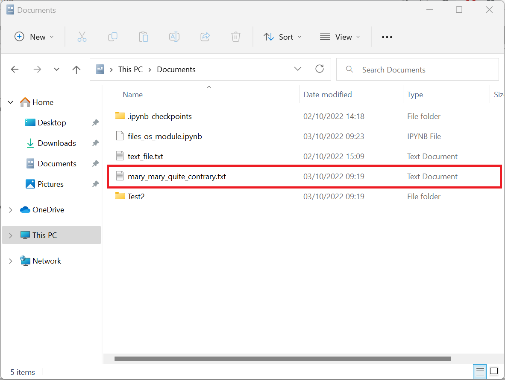

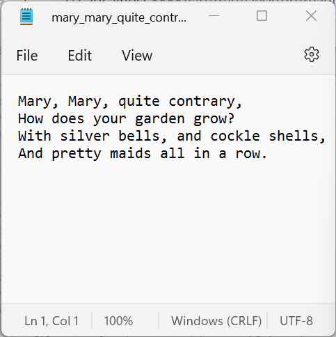

Moving the location of a file is done using rename and specifying the folder location as part of the destination:

```
os.rename(src="mary_mary_quite_contrary.txt", 
          dst=r"Test2\\mary_mary_quite_contrary.txt")
```


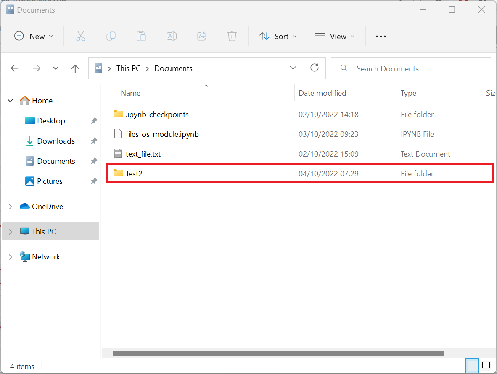


The changes to the file name and location can be reverted using:

```
os.rename(src=r"Test2//mary_mary_quite_contrary.txt", 
          dst="text_file2.txt")
```


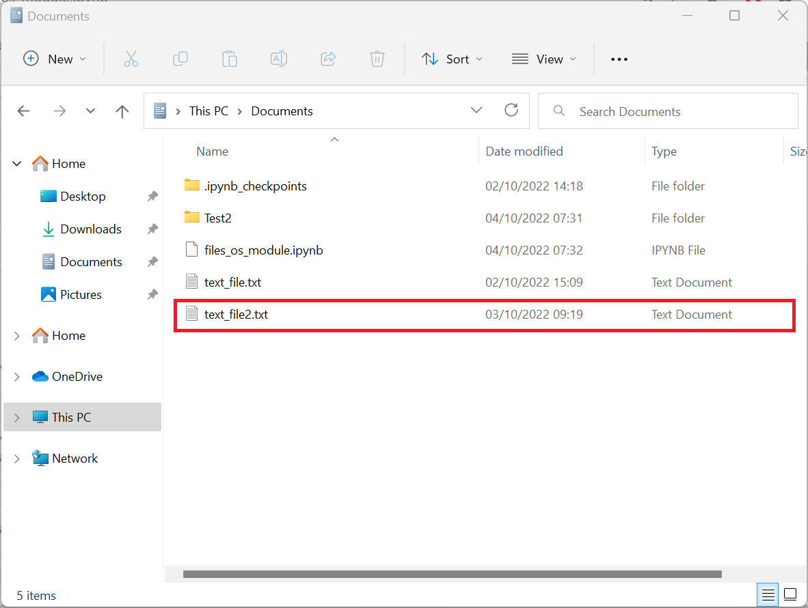

### Change Current Working Directory

So far, all operations have been carried out from the current working directory, which can be determined using the function get current working directory ```getcwd```.

```
os.getcwd()
```


The items in the current working directory can be listed using the function list directory ```listdir```:

```
os.listdir()
```

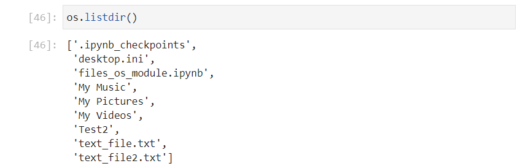

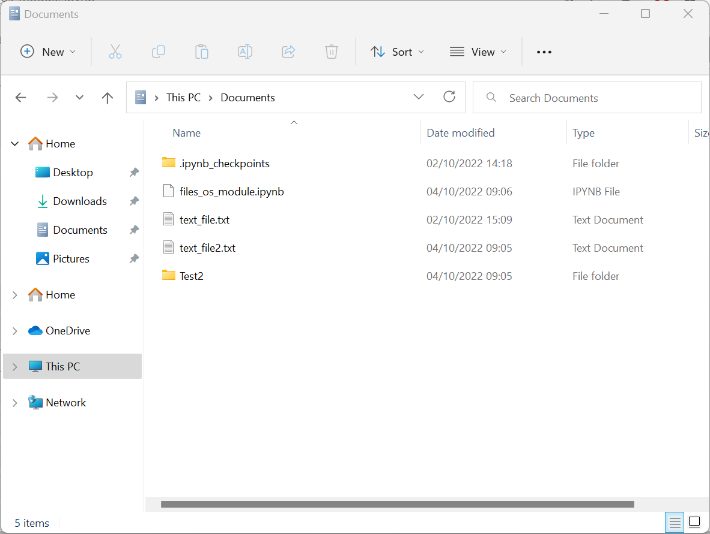

The current working directory can be changed using the command change directory ```chdir``` which takes a positional input argument ```path```. The ```path``` can be expressed as a subfolder within the original current working directory: 

```
os.chdir(path="Test2")
```


Now ```listdir``` shows an empty list as the directory is empty:


```
os.listdir()
```


The current working directory is now ```Test2``` or more explicitly ```r"C://Users//Philip//Documents//Test2"```. 

To get to ```r"C://Users//Philip//Documents"``` from this current directory in file explorer, press ```Alt``` + ```↑```


To go up a level in Python the syntax ```r"..//"``` is used. For example, the directory can be changed up a level to ```r"C://Users//Philip//Documents"``` by using:

```
os.chdir(path=r"..//")
```


```getcwd``` can be used to confirm that the ```r"C://Users//Philip//Documents"``` folder is now selected:

```
os.getcwd()
```


The related syntax ```r"./"``` means in the same directory. Changing to the same directory should result in no changes:

```
os.chdir(path=r"./")
```


```getcwd``` can be used to confirm that the current working directory is still the ```r"C://Users//Philip//Documents"``` folder:

```
os.getcwd()
```


While the above operation may have seemed pointless (changing to the same directory). This syntax is sometimes explicitly used to indicated that a file is in the same directory as the current working directory. For example the text file ```r".//text_file2.txt"```

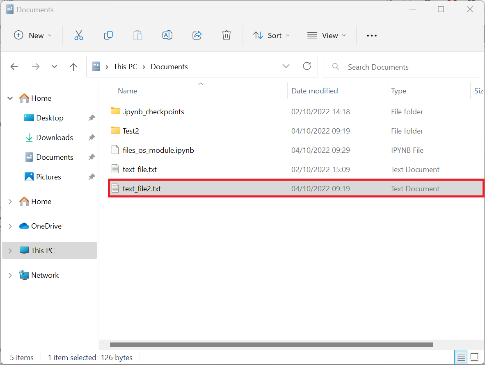

The current working directory can also be changed using a full file path. For example ```r"C://Users//Philip//Documents//Test2"```:

```
os.chdir(path=r"C://Users//Philip//Documents//Test2")
```


This change can once again be checked using ```getcwd```:

```
os.getcwd()
```


Recall that the file path can also be constructed using the ```path``` method ```join``` with the ```os``` path environmental variable:

```
os.chdir(path=os.path.join(os.environ["USERPROFILE"], 
                           "Documents", 
                           "Test2")
        )
```


This change can once again be checked using ```getcwd```:

```
os.getcwd()
```


Now that the current working directory is this folder ```"Test2"```, the function ```rename``` can be used to move the file ```"text_file2.txt"``` from up a level to the folder ```Test2```:

```
os.rename(src=r"..//text_file2.txt", dst="text_file2.txt")
```


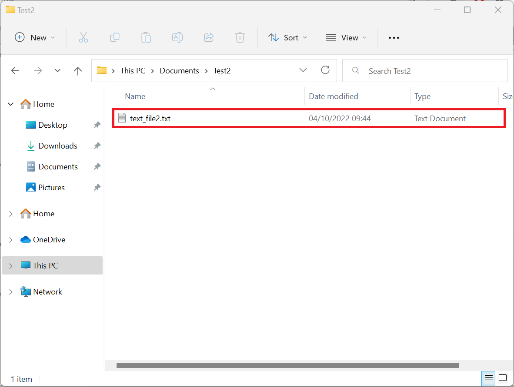

### Make and Delete Multi-Level Directories 

Unlike the function ```rename```, the function ```mkdir``` and ```rmdir``` 
only work within the current working directory and do not work over multiple levels:

```
os.mkdir(path="SubFolder1")
```


To create a subfolder within ```"Subfolder1"```, the directory needs to be changed to ```"Subfolder1"```. Then a ```SubSubfolder1``` can be created:

```
os.chdir(path="SubFolder1")
```


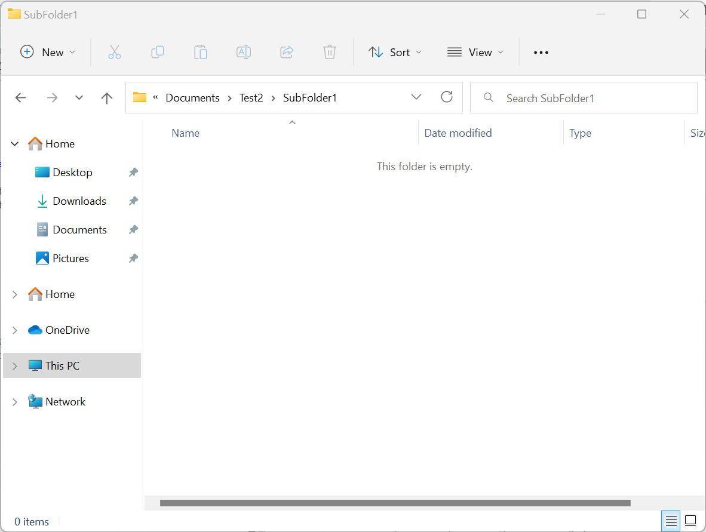

Now the ```"SubSubFolder1"``` can be created:

```
os.mkdir(path="SubSubFolder1")
```


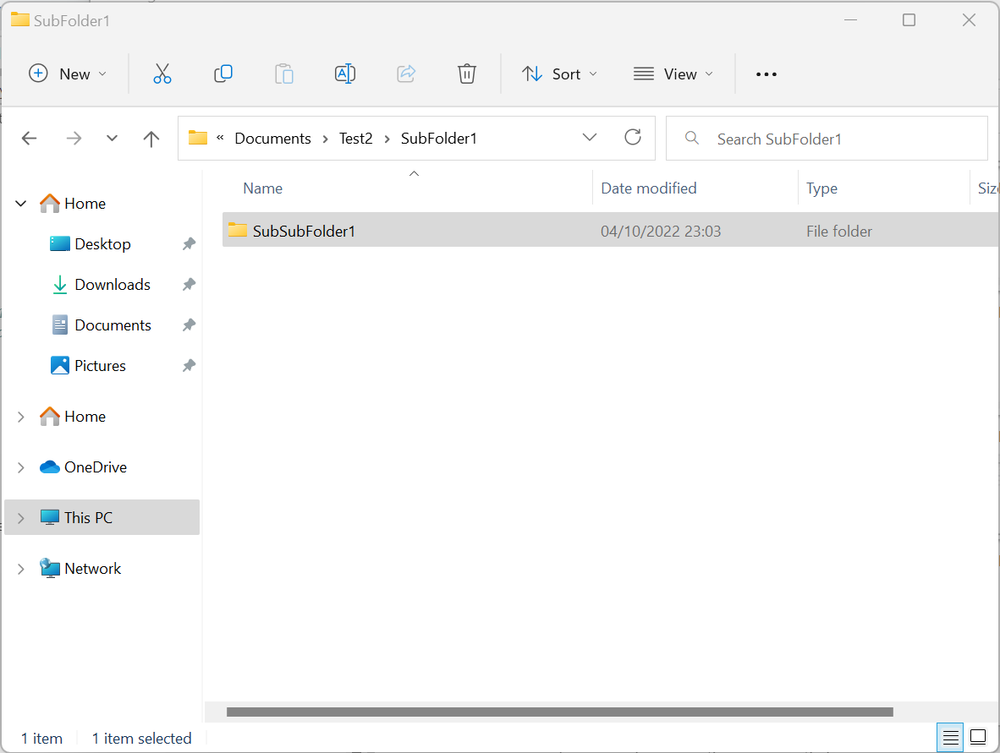


```makedirs``` and ```removedirs``` are functions suited for multi-level operations. For example if the current working directory is change back to ```"Documents"```:

```
os.chdir(path=os.path.join(os.environ["USERPROFILE"], "Documents"))
```


```
os.makedirs(name=r"Test2\\SubFolder2\\SubSubFolder2")
```


Care should be taken when using the function ```removedirs``` as it will remove all empty directories. FOr example if the following is used;

```
os.removedirs(name=r"Test2\\SubFolder2\\SubSubFolder2")
```


```"SubSubFolder2"``` and ```"SubFolder2"``` will be removed as both are empty. ```"Test2"``` has a file in it and is not removed:


### Walk

The ```walk``` function can be used to create a generator object consisting of tuples of the form (```root```, ```dirs```, ```files```). These can be print a list of all files and directories found contained within a file path:

```
file_path = os.path.join(os.environ["USERPROFILE"], "Documents")
for root, dirs, files in os.walk(file_path, topdown=False):
   for name in files:
      print(os.path.join(root, name))
   for name in dirs:
      print(os.path.join(root, name))
```

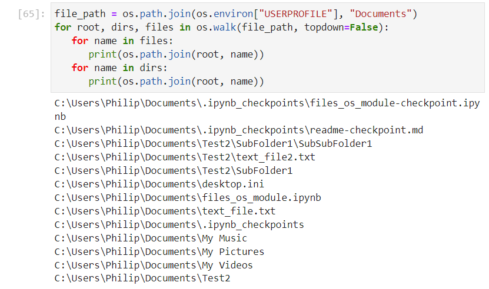


### Statistics

From the right click contaxt menu of a file in WIndows Explorer, a files propteries can be examined:

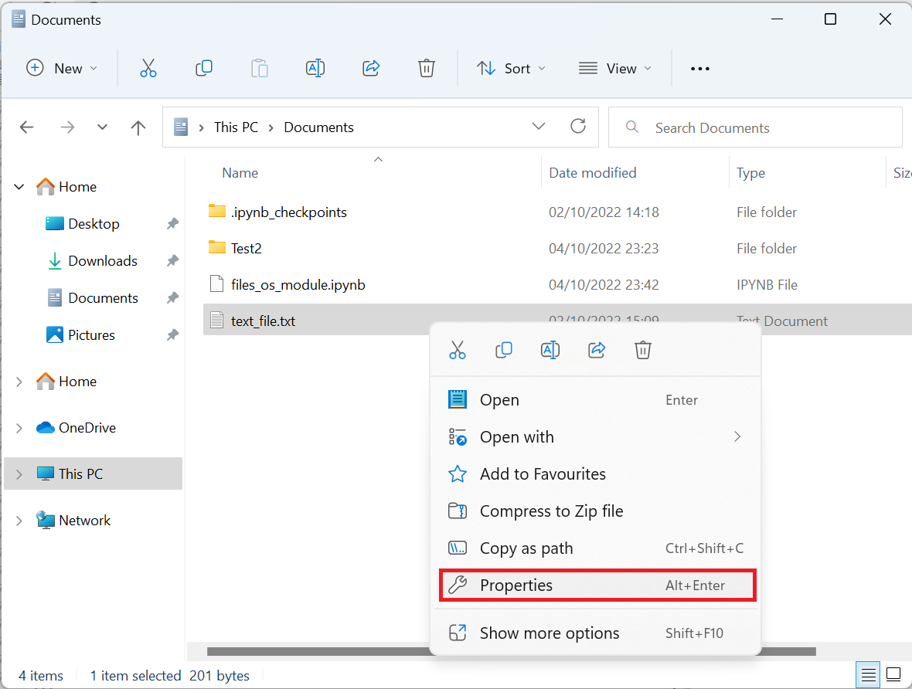

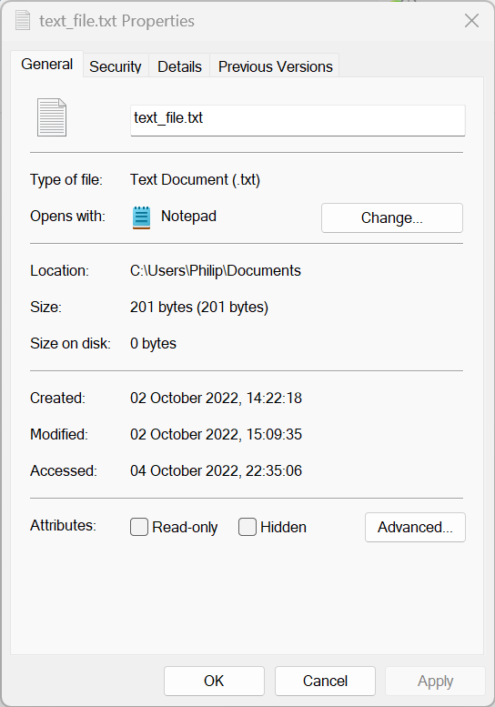

These file properties or statistics can be obtained using the ```stat``` function:

```
os.stat(path="text_file.txt")
```

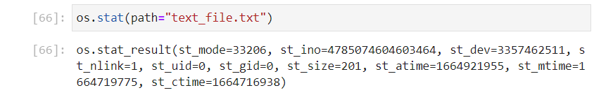

Each statistic can be read off as an attribute. 

The size for Windows Explorer is ```st_size```:

```
os.stat(path="text_file.txt").st_size
```


The created, modified and accessed time are ```st_ctime```, ```st_mtime``` and ```st_atime``` respectively:

```
os.stat(path="text_file2.txt").st_ctime
```


The value given is a timestamp which is the time in milliseconds using ```00:00:00 1 January 1970``` as a reference. This can be converted into a date using the datetime class:

```
import datetime as dt
dt.datetime.fromtimestamp(os.stat(path="text_file.txt").st_ctime)
```


```
import datetime as dt
print(dt.datetime.fromtimestamp(os.stat(path="text_file.txt").st_ctime))
```

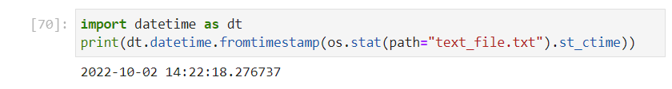

### Copy File

The ```os``` module has no copy function. ```copy``` is regarded as a higher level function. This high level function is however available in the shell utilities ```shutil``` module. In this example, only a basic copy will be explored:

```
import shutil
shutil.copy(src="text_file.txt", dst="text_file3.txt")
```

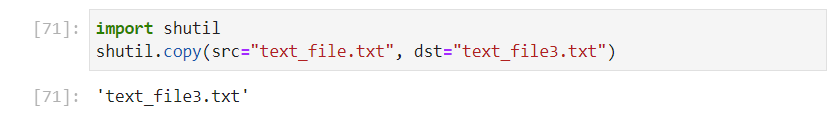

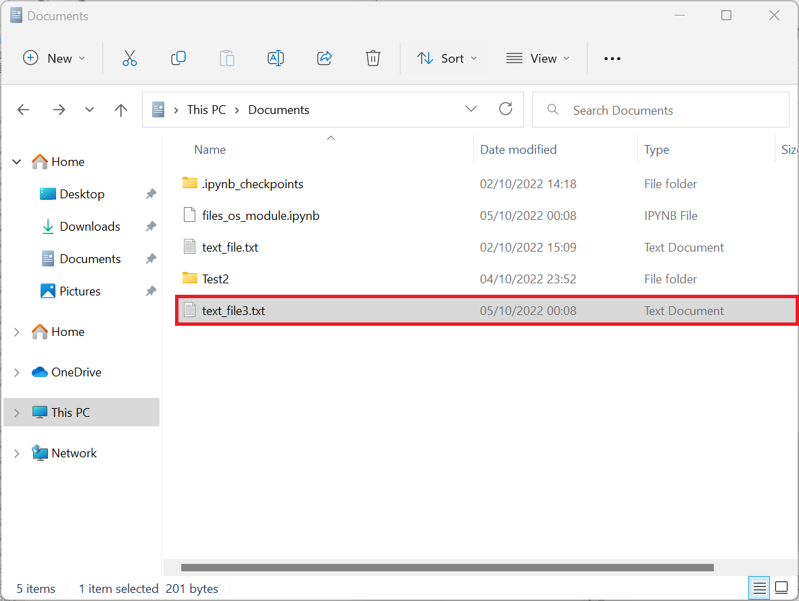

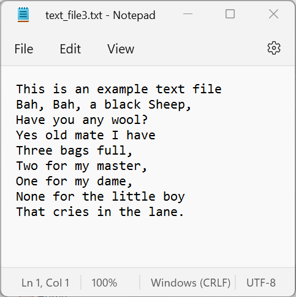

Return to:
[Home](../../../)
