# Arrays

The ```array``` module contains the ```array``` class, which is a list like collection for creating arrays that have **uniform datatypes**. Constraining the collection to a uniform numeric datatype is useful when performing an operation across each item in the array as it reduces the liklihood of encountering a ```TypeError``` due to one of the values having the wrong datatype in a more flexible collection like a list for example:

```
nums = [1, 2, "3"]

for num in nums:
    print(num + 1)
```

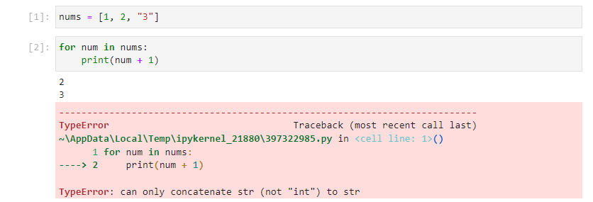

The other main advantage is in memory management. Flexible datastructures like lists take up more memory and using very large lists opposed to an array of a fixed datatype may considerable slow down a program.

## The array Module

The module can be imported using:

```
import array
```

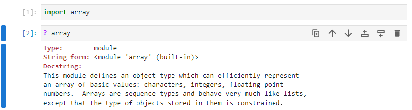

Inputting ```array.``` followed by a tab ```↹``` shows a list of identifiers available from the module:

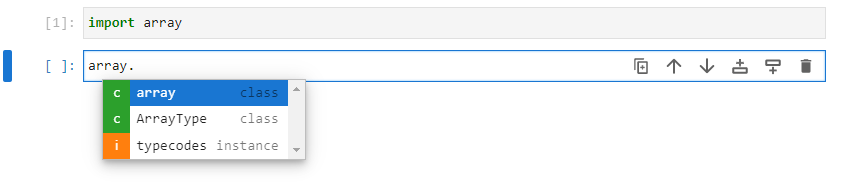

## The array Class

The main identifier is the ```array``` class itself. The array has a ```typecode``` as its first positional input argument, followed by a list of values of that datatype as its second input argument:

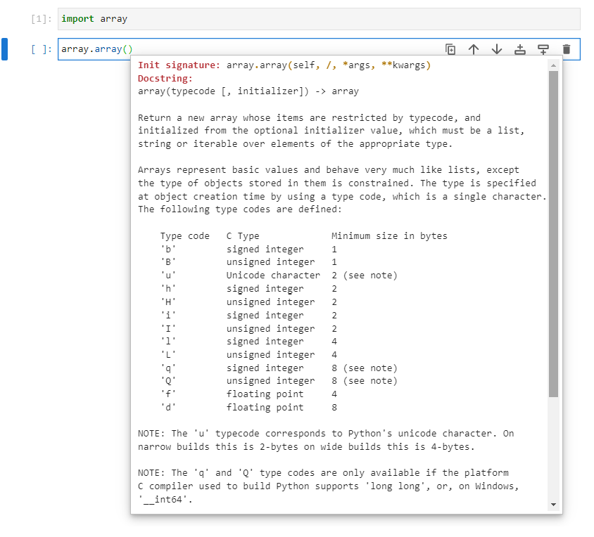

## Integer Type Codes

The typecodes are also accessible in the string ```typecodes```:

```
array.typecodes
```

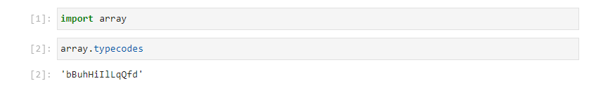

Each integer type code has a byte size and is signed or unsigned. These constrains govern the minimum and maximum range possible for an integer value in the array. In a byte there are 8 bits and each bit can store one of two values. Therefore in 2 bytes for example the number of possible combinations is: 

```
2 ** (8 * 2)
```

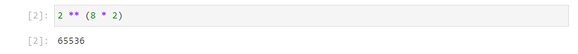

which is ```65536``` combinations. In the case of an ```I``` which is unsigned, the range is therefore ```0``` to ```65536``` inclusive of the lower bound and exclusive of the upper bound. In the case of ```i``` which is signed, half of the combinations need to encode negative values and the other half need to encode positive values.

```
(2 ** (8 * 2)) // 2
```

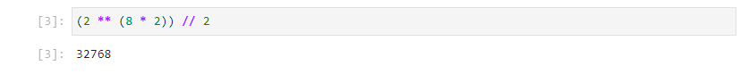

Therefore the range is ```(-)32768``` to ```(+)32768``` inclusive of the lower bound and exclusive of the upper bound. A similar calculation can be made for the other datatypes. 

|Type Code|Lower Bound|Upper Bound|Sign|Bytes|C DataType|
|---|---|---|---|---|---|
|"b"|-128|128|±|1|signed char|
|"B"|0|256|+|1|unsigned char|
|"u"|0|65536|+|2|wchar_t|
|"h"|-32768|32768|±|2|signed short|
|"H"|0|65536|+|2|unsigned short|
|"i"|-32768|32768|±|2|signed int|
|"I"|0|65536|+|2|unsigned int|
|"l"|-2147483648|2147483648|±|4|signed long|
|"L"|0|4294967296|+|4|unsigned long|

Behind the scenes, the data is stored using a corresponding C datatype because Python is written in C. There is a subtle difference between ```"u"```, ```"H"``` and ```"I"``` and they are recognised as different C datatypes even they all are  unsigned and span over the same number of bytes.

The array class is normally imported directly. Three arrays will be created using different type codes:

```
from array import array
nums1 = array("B", [255, 0, 0])
nums2 = array("H", [255, 0, 0])
nums3 = array("L", [255, 0, 0])
```

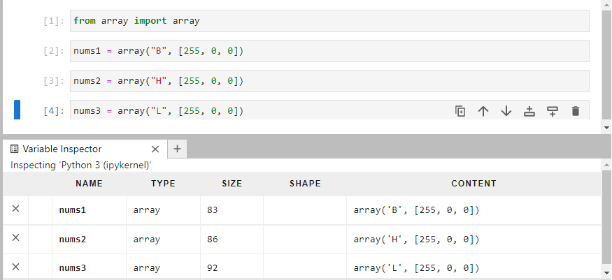

The three arrays display on the variable explorer. ```nums1``` has a size of 83 bytes, 80 for the underlying array structure itself and 1 byte each for each number. ```nums2``` has a size of 86 bytes, which is 2 bytes for each number. ```nums3``` has a size of 92 bytes, which is 4 bytes for each number. 

Because these are small arrays, the memory saving isn't substantial however if these arrays spanned over a million values to encode a color image on each pixel in a computer screen for example, the memory saving would be considerable. Color values use 1 byte encoding as the values never fall out of the range ```0-256``` (inclusive of 0 and exclusive of 256). Care should be taken to use a range suitable for the expected data as using a value outside the range will give an ```UnderflowError``` or ```OverflowError```:

```
nums1 = array("B", [256, 0, 0])
```

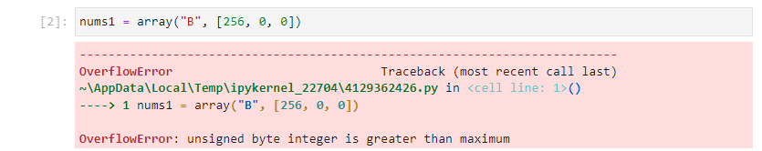

## Floating Point Type Codes

|Type Code|Bytes|Bits|Precision|C DataType|
|---|---|---|---|---|
|"f"|4|32 {Sign: 1, Exponent: 8, Mantissa: 23}|7 Digits|float|
|"d"|8|64 {Sign: 1, Exponent: 11, Mantissa: 52}|15 Digits|double|

In Python, the datatype ```float``` corresponds to the higher precision C Datatype ```double``` and not the C Datatype ```float```. 

```
from array import array
nums1 = array("d", [0.1, 0.2, 0.3])
nums2 = array("f", [0.1, 0.2, 0.3])
```

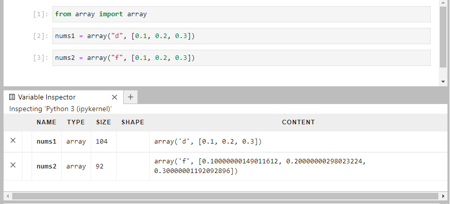

The Variable Inspector displays floating point numbers to 15 digits of precision by default which is used for the inbuilt Python datatype ```float``` (C datatype ```double```). The array ```nums2``` uses a lower precision datatype (C datatype ```float```) and rounding errors are shown past the 7 digits of precision for this datatype.

## array Methods

The array has the immutable methods ```count```, ```index``` found in a collection such as a ```tuple``` and ```list```. It also has the mutable methods ```append```, ```extend```,  ```insert```, ```pop```, ```remove``` and ```reverse``` found in a collection such as a list:

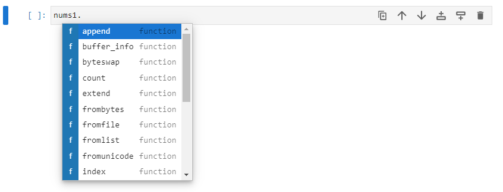

If the directory of the array is looked up, using the ```dir``` function:

```
dir(nums1)
```

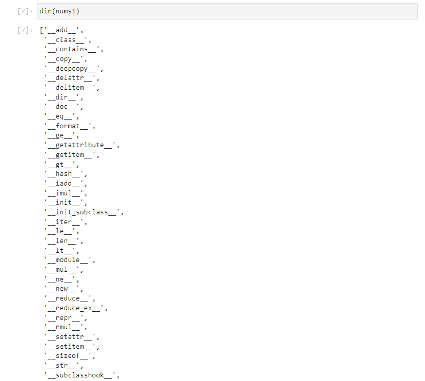

The datamodel methods ```__add__``` and ```__mul__``` are setup and perform concatenation and replication, using the ```+``` and ```*``` operation as seen in collections like the ```tuple``` and ```list```. The ```__len__```, ```__getattribute__``` and ```__setattr__``` methods are also defined giving similar behaviour to a list when the ```len``` function is used or when indexing is used. 

These methods require the other ```array``` to have the same Type Code. When it does not, a ```TypeError``` will display:

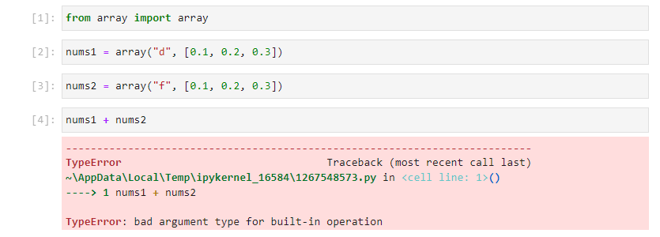

```
from array import array
nums1 = array("d", [0.1, 0.2, 0.3])
nums2 = array("f", [0.1, 0.2, 0.3])
nums1 + nums2
```

The builtin class ```type``` will return the data type as   ```array``` regardless of the Type Code. The ```array``` instance has the additional attribute ```typecode``` to quickly check this alongside ```itemsize```:

```
type(nums1)
type(nums2)
nums1.typecode
nums2.typecode
nums1.itemsize
nums2.itemsize
```

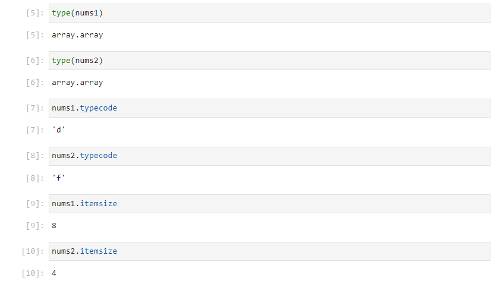

When both the Type Codes are the same, concatentaiton with the ```+``` operator can be used which outputs a new ```array``` with a type code of ```"d"```. The ```extend``` method extends ```num1``` in place using the values from ```nums2``` and ```append``` is used to add a single float to the array:

```
from array import array
nums1 = array("d", [0.1, 0.2, 0.3])
nums2 = array("d", [0.4, 0.5, 0.6])
nums1 + nums2
nums1.extend(nums2)
nums1
nums1.append(0.7)
nums1
```

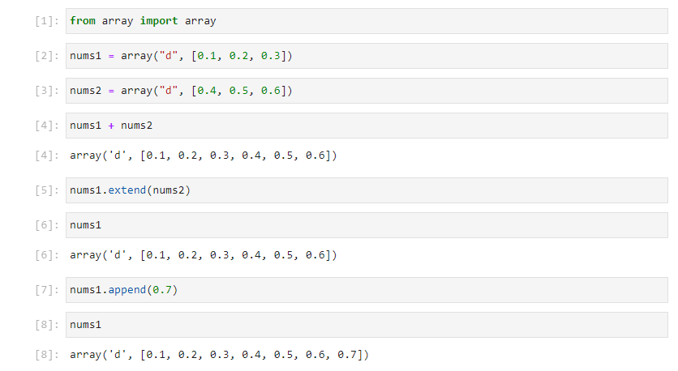

The array also has a number of ```from``` and ```to``` methods allowing conversion from/to bytes, list, unicode and a file. The ```tobytes``` method and ```tolist``` method can be seen to return a ```byte``` and a ```list``` respectively. The ```hex``` method can be called from the ```bytes``` object to view each ```byte``` as two hexadecimal values:

```
nums1
nums1.tobytes()
nums1.tobytes().hex()
nums1.tolist()
```

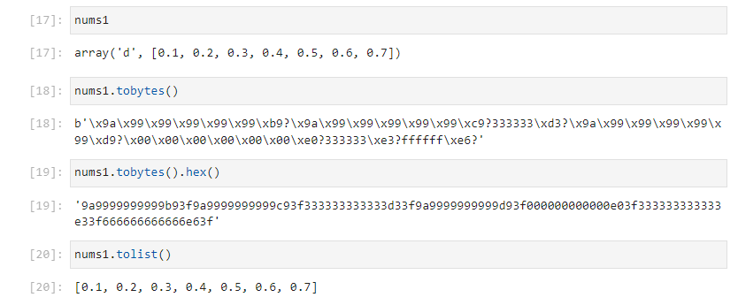

To use the method ```tofile```:

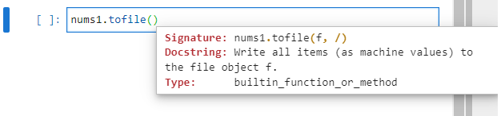

A file must be opened with ```"wb"``` to give write access for binary content:

```
from array import array
nums1 = array('d', [0.1, 0.2, 0.3, 0.4, 0.5, 0.6])
file = open("file.txt", "wb")
nums1.tofile(file)
file.close()
```

The file should also be closed after writing.

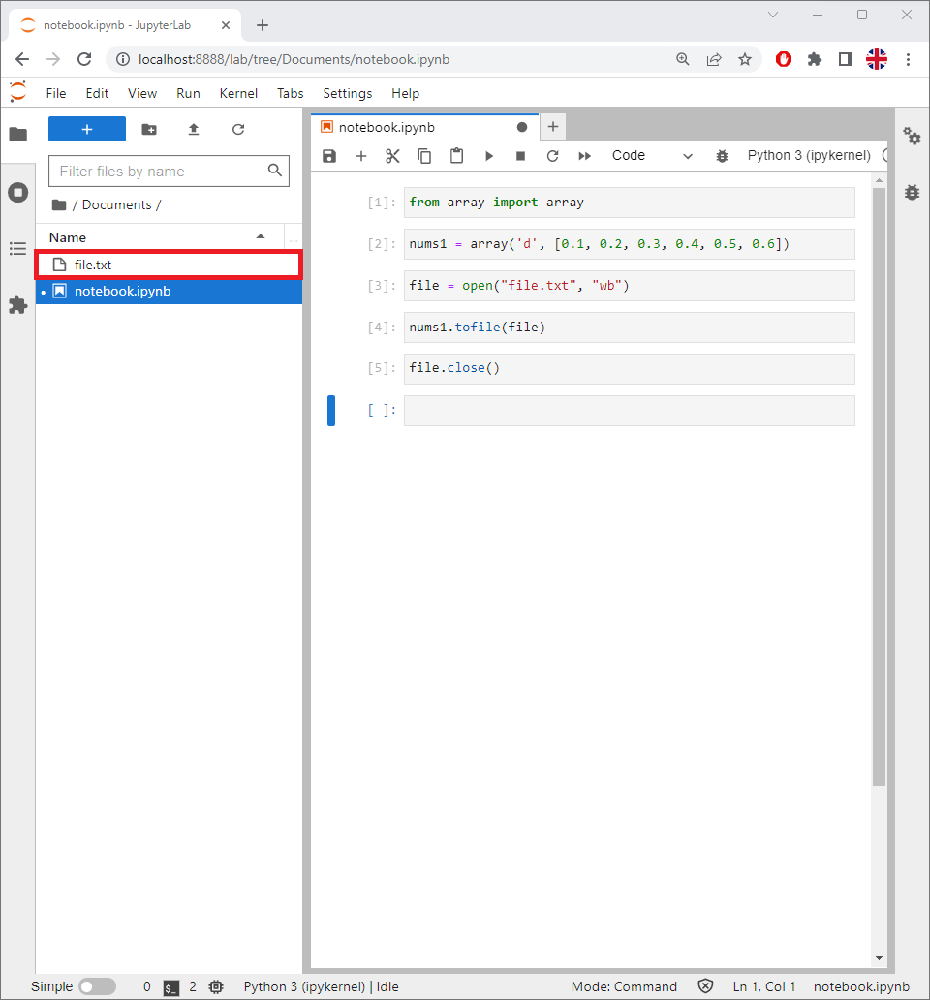

If the file is opened, in Notepad or Notepad++, the encoding will be wrong:

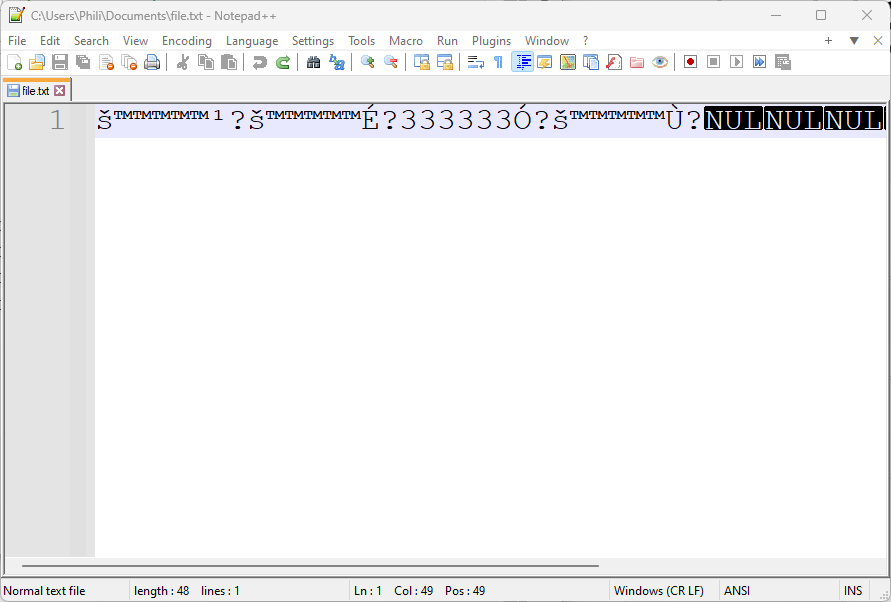

Highlighting the text and selecting Plugins → Converter → ASCII → Hex:

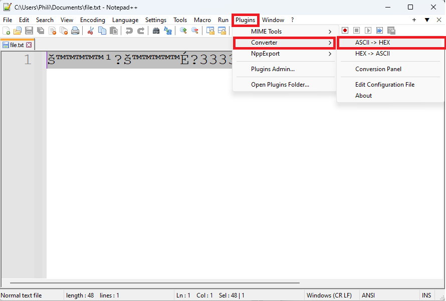

Will show content similar to before:

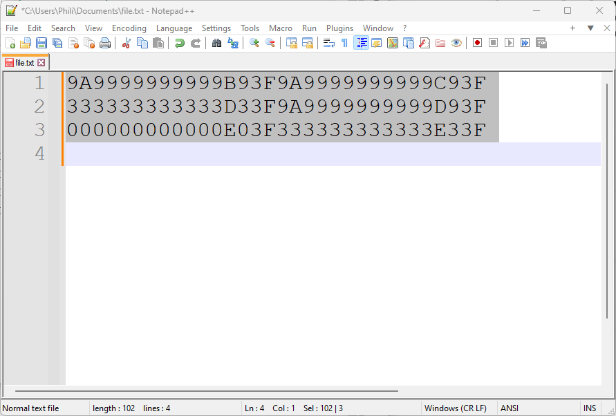

To use the method ```fromfile``` an instance must be created:

```
from array import array
nums2 = array('d', [])
```

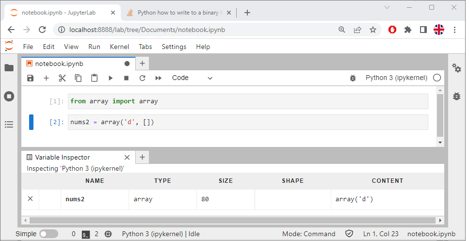

The ```fromfile``` method requires a file configured for   ```"rb"``` read in binary and ```n``` which instructs how many objects to read from the file. In this example 3 items will be read and appended to the end of the empty ```array```. The contents of the array are seen to be updated on the Variable Inspector:

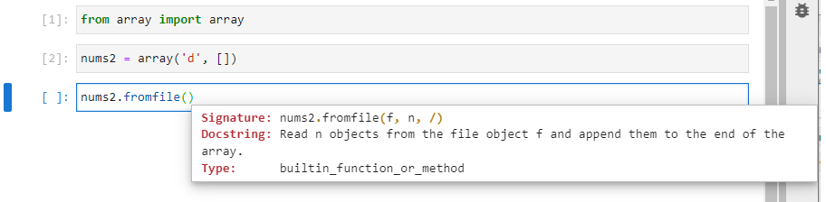

```
from array import array
nums2 = array('d', [])
file = open("file.txt", "rb")
nums2.fromfile(file, 3)
file.close()
```

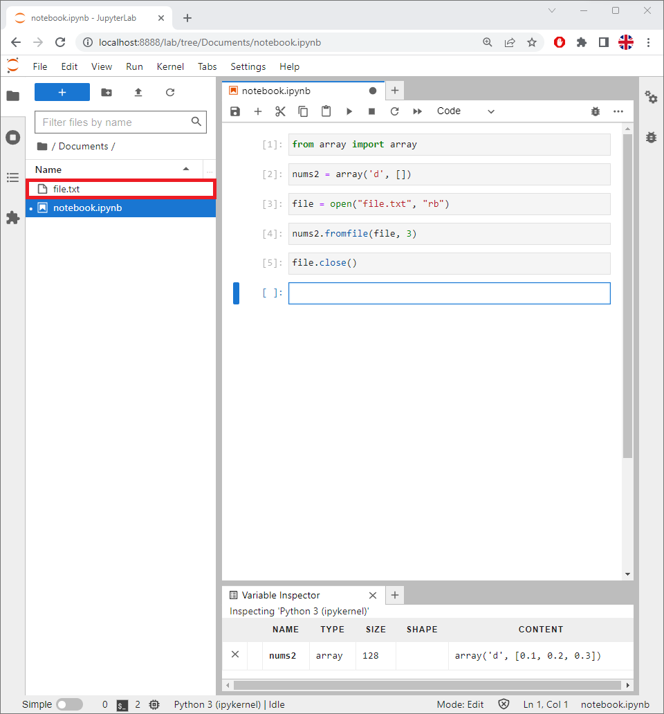

Return to:
[Home](../../../)
