# Pickle, JSON and CSV

## Text Data

In the Previous tutorial, a list was created and written to a text file using inbuilt Python:

```
new_file_contents = ["Hello\n",
                     "\tWorld\n"]
              
with open(file="text_file.txt", mode="w") as file_object:
    file_object.writelines(new_file_contents)
    file_object.close()


```

Recall when a file is opened using ```with```, it is automatically closed when the code block ends so the following code is equivalent:

```
new_file_contents = ["Hello\n",
                     "\tWorld\n"]
              
with open(file="text_file.txt", mode="w") as file_object:
    file_object.writelines(new_file_contents)


```


The file can be seen in the JupyterLab file explorer:


And within the Windows files explorer:


If it is opened in Notepad++, then the hidden punctuation symbols can be viewed by selecting View → Show Symbol → Show All Characters:


The hidden printer punctuation symbols New Line (Carriage Return, Line Feed) and the Horizontal Tab display:


Text data can be conceptualised as a single column of horizontal rows, where each row can contain text data:


## Comma Seperated Value Files

A Comma Seperated Values (CSV) uses the comma as a delimiter. 


This delimiter gives a specific instruction, to move to the next column. Notice that every row in the file has one comma, meaning each row is seperated into two columns:


Some programs such as Microsoft Excel or Only Office Desktop Editors WorkSheet translate the New Line (CRLF) and commas , into a grid:


In Python, the ```csv``` module is used to open and save csv files. It can be imported using:

```
import csv
```

And the module docstring can be accessed using:

```
? csv
```


Essentially the module has a reading api and a writing api which will use default parsing options. These default parsing options will work with files made using English (UK and USA). Other languages for example German use the ```,``` as a decimal point and the ```;``` as a delimiter and therefore require customised parsing options or dialects.

The list of identifiers from the ```csv``` module can be accessed by inputting ```csv.``` followed by a tab ```↹```:


The ```reader``` functions docstring can be viewed by typing in the function name with open parenthesis followed by Shift ```⇧``` and Tab ```↹```. 


The function takes in an iterable as an input argument which is usually an opened file. Recall a file can be opened and closed using the inbuilt function ```open``` where the 2nd input argument in ```open``` is ```"r"``` indicating read only access. To encode a file properly, the follwoign keyword arguments must be assigned to the following values ```encoding="UTF-8-Sig"``` and ```newline=""```.

```
import csv
file = open("commaseparatedvalues.csv", "r", encoding="UTF-8-Sig", newline="")
file.close()
```


The csv reader function should be used on the file after it is opened and before it is closed:

```
import csv
file = open("commaseparatedvalues.csv", "r", encoding="UTF-8-Sig", newline="")
csvreader = csv.reader(file, delimiter=",")
file.close()
```


The csvreader instance has two attributes ```line_num``` and ```dialect```:


```
csvreader.line_num
csvreader.dialect
```

In this case the line number is 0, as no data has been read from the csvreader and the dialect is the default ```Dialect``` class:


If the directory function ```dir``` is used on the ```csvreader```, the datamodel identifiers are displayed:

```
dir(csvreader)
``` 

The ```__next__``` datamodel method displays meaning ```csvreader``` is an iterator.


Therefore the ```next``` function can be used on the iterator. Each time a line is consumed using the ```next``` function, the line number increments

```
csvreader.line_num
next(csvreader)
csvreader.line_num
next(csvreader)
csvreader.line_num
```


Notice that each line read is a list of strings.

Recall that the class ```list``` can be used on an iterator to see all the available items left:


This gives a list of lists.

As ```csvreader``` is an iterator, it can also be consumed by a for loop:

```
import csv
file = open("commaseparatedvalues.csv", "r", encoding="UTF-8-Sig", newline="")
csvreader = csv.reader(file)
for row in csvreader:
    print(row)

file.close()
```


Recall that it is more common to open a file within a ```with``` code block. This code block will automatically close the file, although the close command is shown below for clarity:

```
with open("commaseparatedvalues.csv", "r", encoding="UTF-8-Sig", newline="") as file:
    csvreader = csv.reader(file)
    for row in csvreader:
        print(row)
    file.close()


```    


Instead of printing, the file contents can be saved to a list.

```
file_contents = []

with open("commaseparatedvalues.csv", "r", encoding="UTF-8-Sig", newline="") as file:
    csvreader = csv.reader(file)
    for row in csvreader:
        file_contents.append(row)
    file.close()


```


The workflow used for the csv writer function is quite similar to that of the csv reader function. 

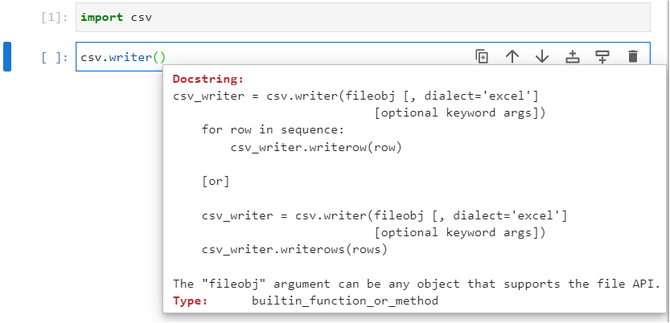

The function also takes in an iterable as an input argument which is usually an opened file. Once again a file can be opened and closed using the inbuilt function ```open``` where in this case the 2nd input argument in ```open``` is ```"w"``` indicating write access:

```
import csv
file = open("newfile.csv", "w", encoding="UTF-8-Sig", newline="")
csvwriter = csv.writer(file)
file.close()
```

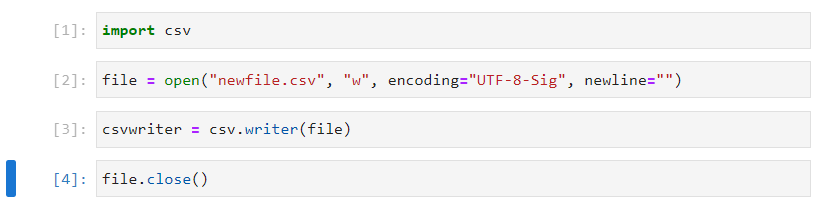

The csvwriter instance has two methods ```writerow``` and ```writerows```:

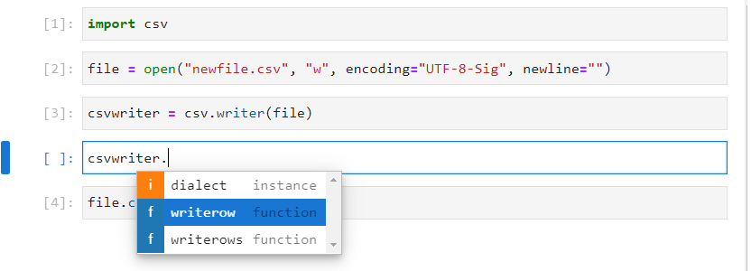

```writerow``` can be used to write an individual row. For example a file can be created one row at a time:

```
import csv
file = open("newfile.csv", "w", encoding="UTF-8-Sig", newline="")
csvwriter = csv.writer(file)
csvwriter.writerow(["x", "y", "z"])
csvwriter.writerow([1, 2, 3])
csvwriter.writerow([2, 4, 6])
csvwriter.writerow([3, 6, 9])
file.close()
```

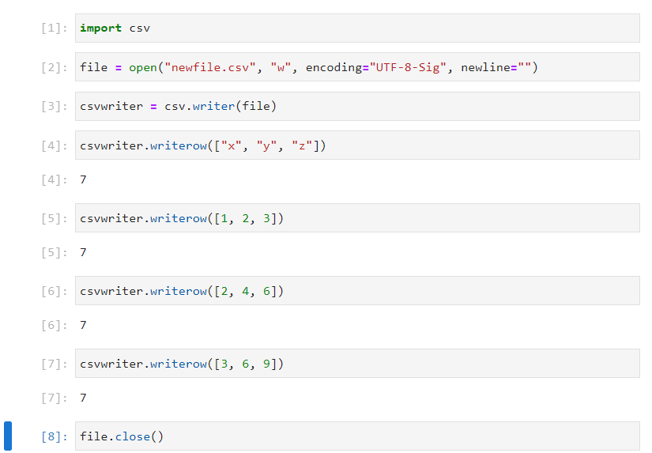

This file is now viewable in Windows File Explorer:

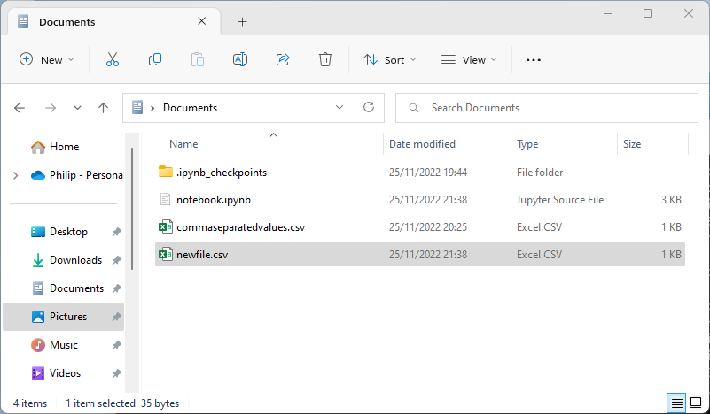

And can be opened in Notepad++:

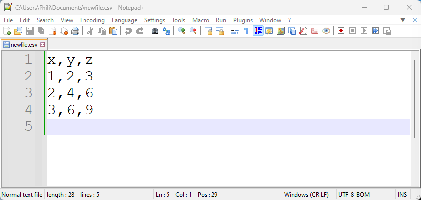

Once again that it is more common to open a file within a ```with``` code block. This code block will automatically close the file, although the close command is shown below for clarity: 

```
import csv

with open("newfile.csv", "w", encoding="UTF-8-Sig", newline="") as file:
    csvwriter = csv.writer(file)
    csvwriter.writerow(["x2", "y2", "z2"])
    csvwriter.writerow([1, 2, 3])
    csvwriter.writerow([2, 4, 6])
    csvwriter.writerow([3, 6, 9])
    file.close()


```    

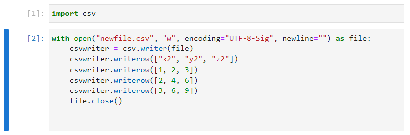

Notice that the previous file that was created has now been overridden with the new data (there is a subtle difference in the headings ```x2, y2 and z2``` are used opposed to ```x, y and z``` in the original file):

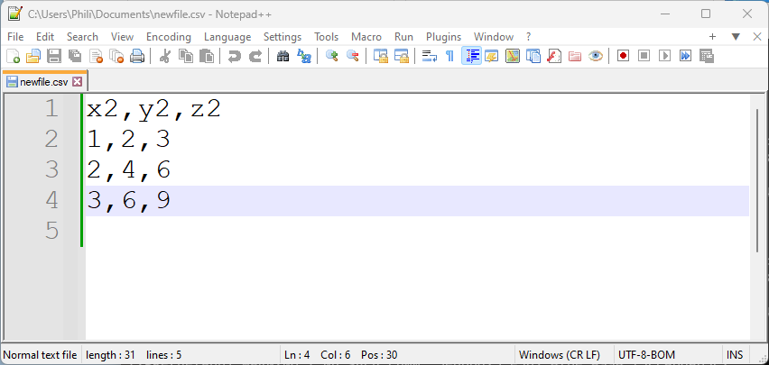

Use of ```writerows``` requires the data to be in the form of a list of lists. Once again, the same data is going to be written to a file, this time slightly different headings ```x3, y3, z3``` are going to be used and a new file name ```"newfile2.csv"``` will be used:

```
import csv

data = [["x3", "y3", "z3"],
        [1, 2, 3],
        [4, 5, 6],
        [7, 8, 9]]

with open("newfile2.csv", "w", encoding="UTF-8-Sig", newline="") as file:
    csvwriter = csv.writer(file)
    csvwriter.writerows(data)
    file.close()
    

```        

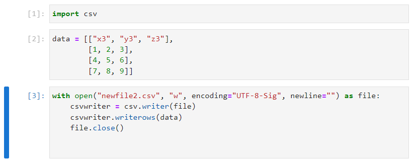

This new file can be opened and looks as expected:

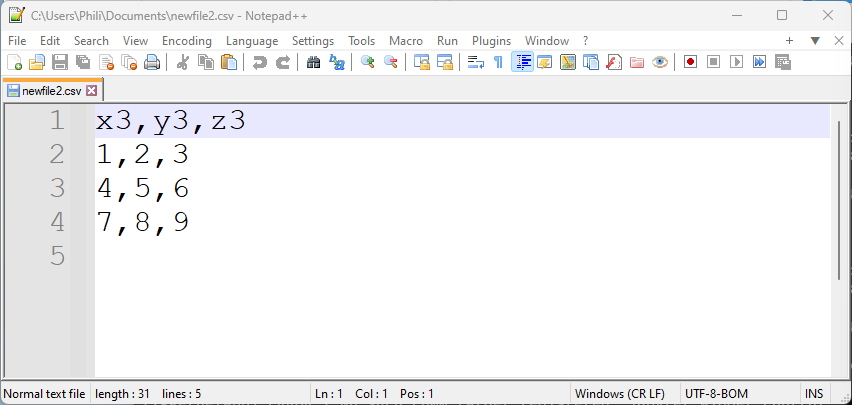

## Pickled Data

The ```pickle``` module can be used to create portable "pickled" serialised representations of Python objects. These "pickled" representations can be used to transfer Python objects for example over to simple hardware using a serial port or to a file which can be reopened in another Python session.

It can be imported using:

```
import pickle
```

And the module docstring can be accessed using:

```
? pickle
```

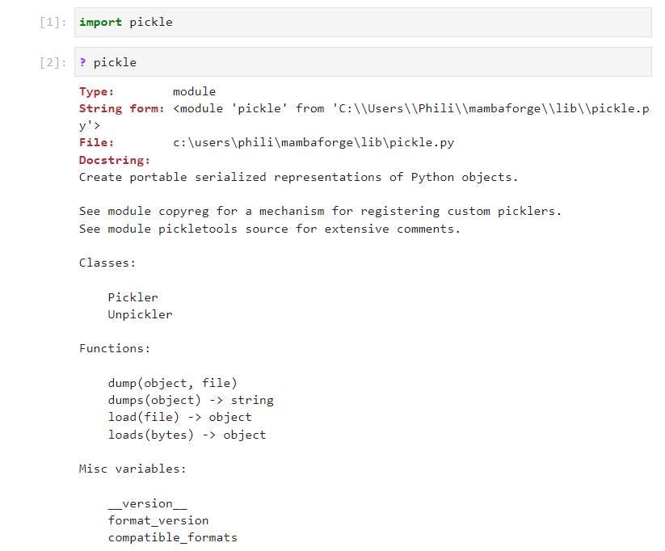

There are four main functions: 

```dumps``` dump string which creates a pickled string from an object.

```loads``` load string which unpickles a pickled string returning the object.

And:

```dump``` dump file which creates a pickled string from an object that is stored as a new row in a file.

```load``` load file which unpickles a pickled string from the current row in a file returning the object.

The docstring for the dump string ```dumps``` function can be examined and takes in a Python object as a positional input argument. The ```protocol``` keyword input argument and other keyword input arguments can be left at their default values: 

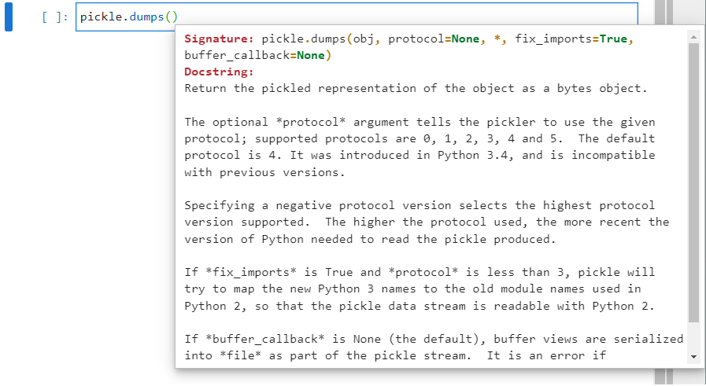

A simple variable ```x``` can be created and dump string can be used to dump it to a pickled string:

```
import pickle
x = 11.5
pickled.dumps(x)
```

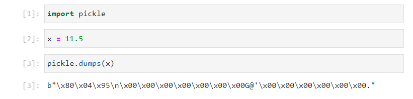

This pickled string can be assigned to a new object name:

```
import pickle
x = 11.5
x_pickled = pickled.dumps(x)
```

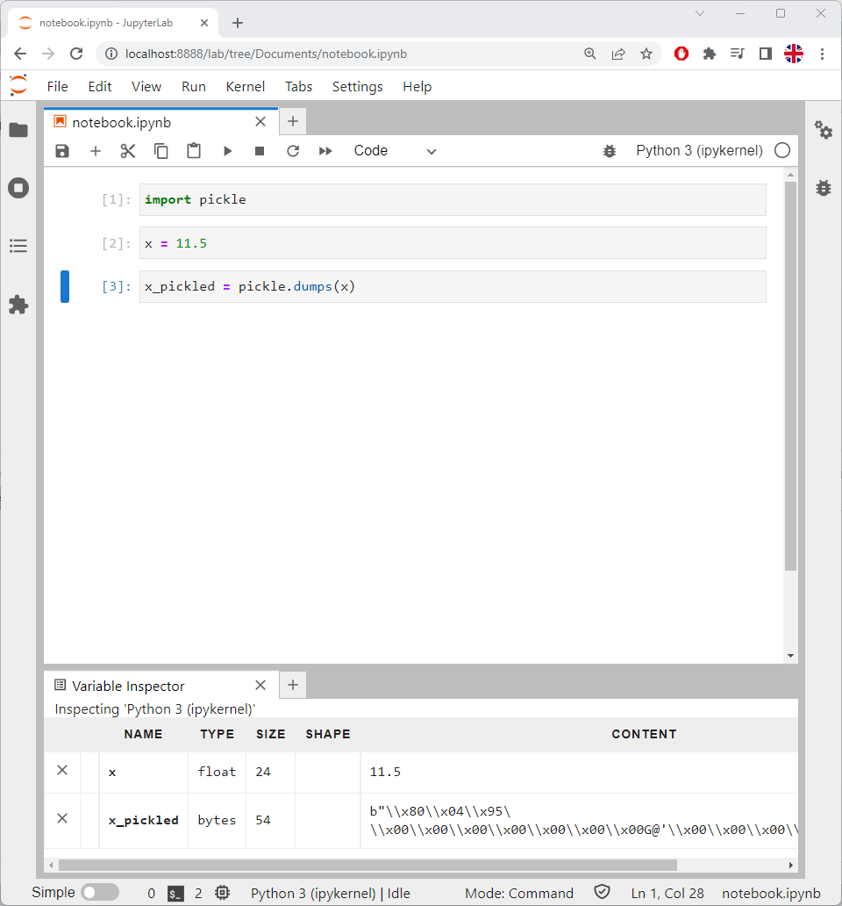

The object ```x_pickled``` is a ```byte``` which is a number in binary. If ```x_pickled.``` is input followed by a tab ```↹``` a list of identifiers displays:

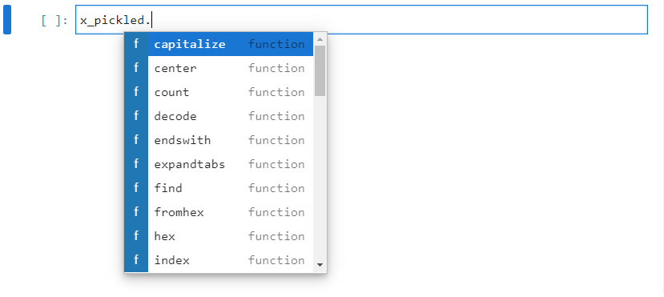

The ```hex``` function can be used to display the byte array in hexadecimal which is slightly easier to read:

```
x_pickled.hex()
```

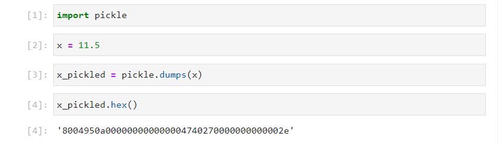

The ```type``` and ```len``` functions can be used on ```x_pickled```:

```
type(x_pickled)
len(x_pickled)
```

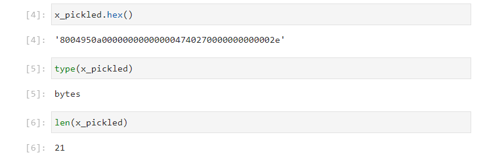

The type is a ```byte``` which is a large number in binary split into bytes. Recall a byte is 8 bits which gives ```2 ** 8``` combinations from ```0-256``` (inclusive of the lower bound zero and exclusive of the upper bound 256). These 256 combinations can be represented using 2 digits in hexadecimal. Hexadecimal has 16 characters ```0, 1, 2, 3, 4, 5, 6, 7, 8, 9, A, B, C, D, E, F``` and with 2 digits ```16 ** 2``` is ```256```. The len of the byte array is 21 bytes and each byte is represented in Hexadecimal as 2 digits giving a total of 42 digits in the hexadecimal representation. If binary representation is used, the number will take up 168 digits.

The ```int``` alternative constructor ```from_bytes``` can be used to convert this ```byte``` into an integer. Recall that an alterative constructor is a class method, called from the class. The docstring can be viewed by using Shift ```⇧``` and Tab ```↹```:

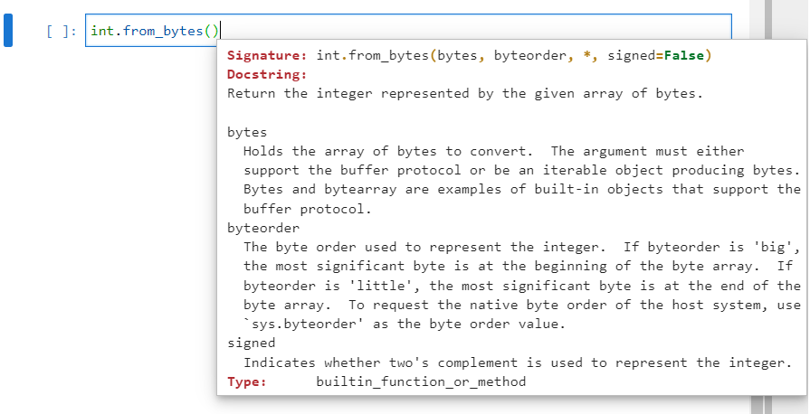

The alternative constructor needs two positional input arguments, the ```bytes``` object and the ```byteorder``` which is ```big``` for a pickled string. As an integer, this number can be cast into a hexadecimal and binary number using the ```hex``` and the ```bin``` functions respectively:

```
int.from_bytes(x_pickled, "big")
hex(int.from_bytes(x_pickled, "big"))
bin(int.from_bytes(x_pickled, "big"))
```

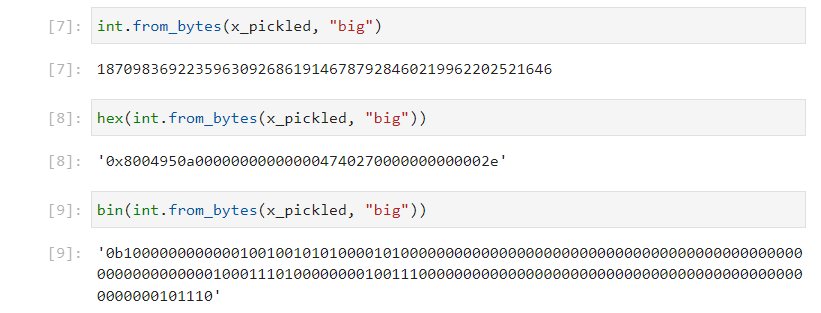

Notice that the ```hex``` method of the byte array and casting to ```int``` and then ```hex``` lead to the same results:

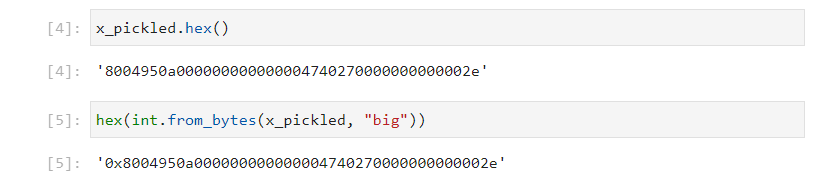

The ```byte``` cast to an ```int``` and then ```binary``` number can be cast to a ```str```. To make it more readible, the binary prefix can be deleted and a space can be placed in after every 8 bits (1 byte) using a for loop:

```
bin_num = bin(int.from_bytes(x_pickled, "big"))
bin_num_str = str(bin_num)
bin_num_str
bin_num_str = bin_num_str[2:]
bin_num_str

bin_num_str2 = ""
for idx, letter in enumerate(bin_num_str):
    if (idx > 0) and (idx % 8 == 0):
        bin_num_str2 += " "
    bin_num_str2 += letter

bin_num_str = bin_num_str2
del(bin_num_str2)
bin_num_str
```

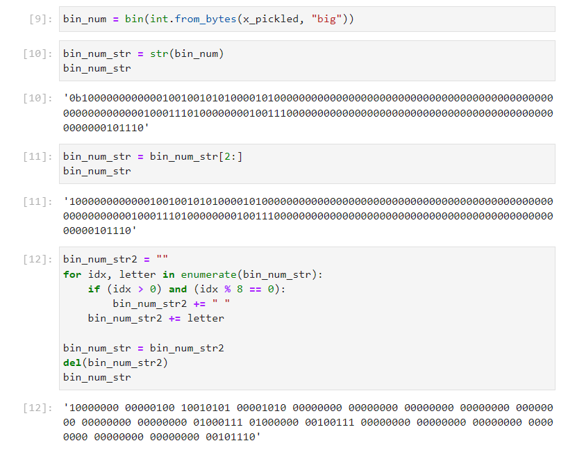

This gives the number:

**10000000** 00000100 10010101 00001010 00000000 00000000 00000000 00000000 00000000 00000000 00000000 01000111 01000000 00100111 00000000 00000000 00000000 00000000 00000000 00000000 **00101110**

A serial port with a 9600 baud rate is setup to process 9600 bits per second. The serial port takes in a digital signal like the number above where ```1``` is a voltage of about 12 V (known as High) and ```0``` is a voltage around 0 V (known as Low). These 168 bits would therefore take 0.0175 s to transfer.

The first and the last byte are instructions which indicate the start and the end of a transfer:

0b**10000000**
0x**80**

0b**00101110**
0x**2e**

If ```x``` is changed to a different variable such as the string ```"hello"``` and the code rerun:


The byte array is now:

**10000000** 00000100 10010101 00001001 00000000 00000000 00000000 00000000 00000000 00000000 00000000 10001100 00000101 01101000 01100101 01101100 01101100 01101111 10010100 **00101110**

The code above can be placed into a function:

```
import pickle

def pickled(obj):
    obj = pickle.dumps(obj)
    obj = bin(int.from_bytes(obj, "big"))
    obj = str(obj)
    obj = obj[2:]
    obj2 = ""
    for idx, letter in enumerate(obj):
        if (idx > 0) and (idx % 8 == 0):
            obj2 += " "
        obj2 += letter
    return(obj2)

pickled_print("hello")
```

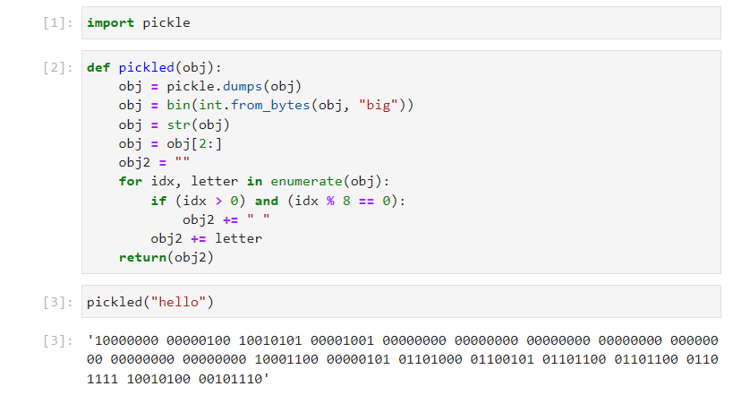

This function may be used to inspect the byte of the pickled objects using binary representation. The binary array of simple integers displays a byte within the array that counts in a similar manner to an integer:

```
for num in range(10):
    print(pickled(num))
```

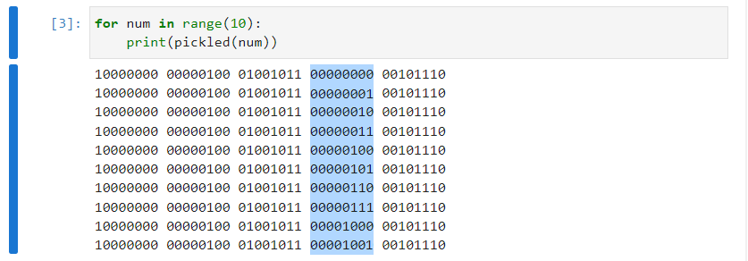

The binary array of single letters displays a byte within the array that counts in a similar manner to an integer. Notice that there is an offset:

```
for letter in "abcdefgh":
    print(pickled(letter))
```

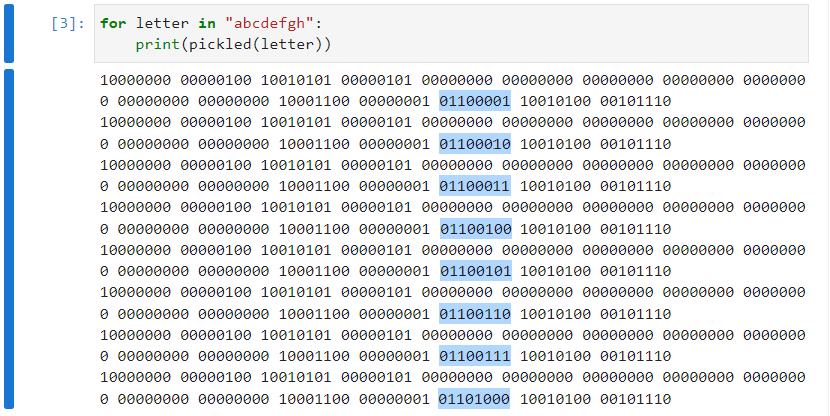

There is because the alphabetical character ```"a"``` is the 97th character mapped to the underlying integer sequence. Therefore in this case, counting begins at 97.

```
ord(a)
bin(ord(a))
```

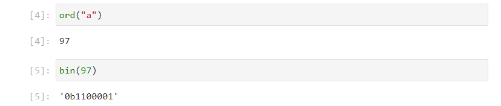

The binary array of floating points displays four bytes in memory which corresponds to the IEEE 754 standard for binary 32: 

```
for num in [0.1, 0.2, 0.3, 0.4, 0.5, 0.6, 0.7]:
    print(pickled(num))
```

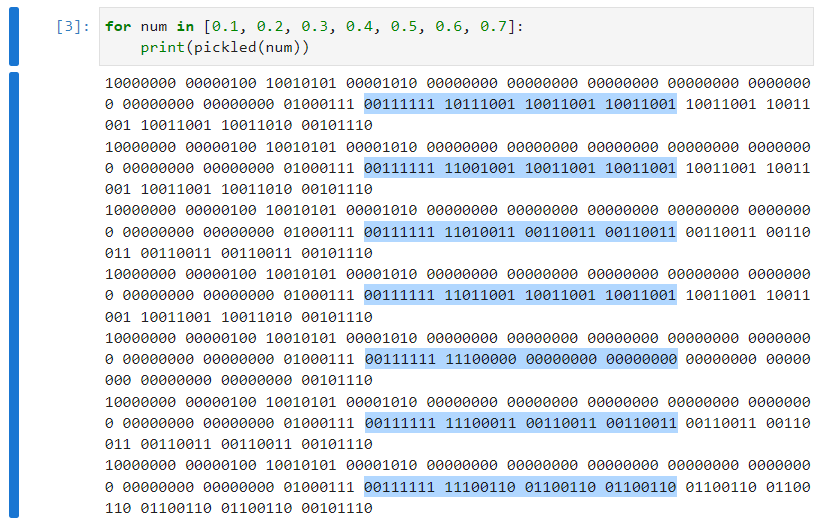

Its not necessary to fully understand, how pickle encoding works around the data and understanding the above principles should suffice.

Returning to the case where:

```
import pickle
x = 11.5
x_pickle = pickled.dumps(x)
```

The docstring for the dump string ```loads``` function can be examined and takes in a pickled data object as a positional input argument. The keyword input arguments can be left at their default values: 

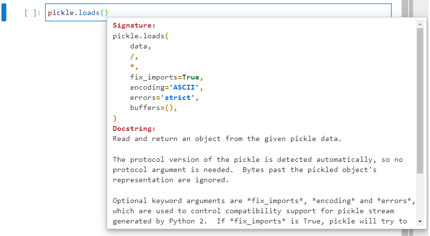

The pickled data ```x_pickle``` can be unpickled using:

```
x2 = pickled.loads(x_pickle)
x2
```

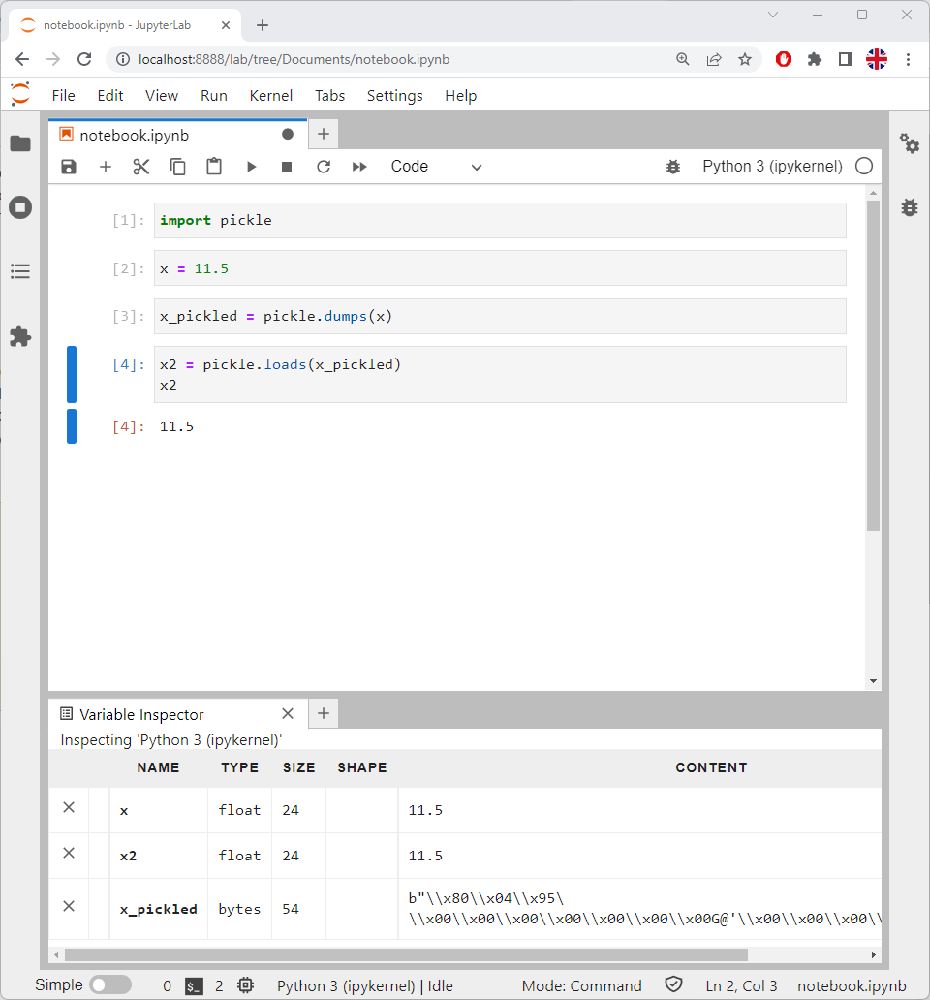

Notice that ```x2``` has the same value as the original variable ```x```.