# Custom Classes

## Subclasses

The ```collections``` module has the classes ```UserString```, ```UserList``` and ```UserDict``` which are designed for subclassing. They can be imported using:

```
from collections import UserString, UserList, UserDict
```


The ```UserString``` class can be used directly. Its initialization signature can be accessed by inputting the class name ```UserString()``` and inputting shift ```⇧``` and tab ```↹```:

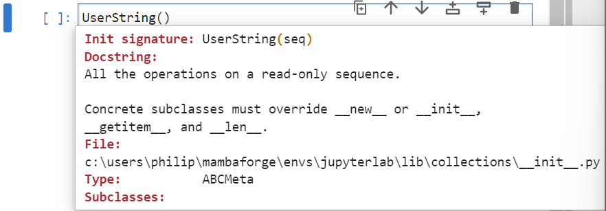

If ```UserString.``` is input followed by a tab ```↹```, a list of identifiers are available, that are identical to the ```str``` class:

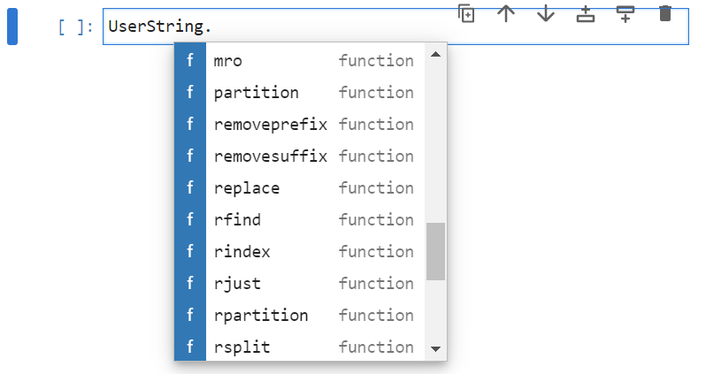

The method resolution order identifier ```mro``` gives the method resolution order:

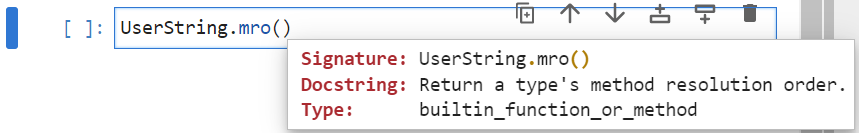

```
UserString.mro()
```

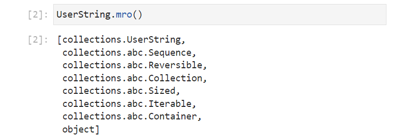

This is a ```list``` of class names. The top entry is the class itself and the bottom entry is the class ```object``` as every class in Python is ultimately an ```object```. The ```abc``` stands for abstract base classes. An abstract base class is not used directly but are used as parent classes. The name of these abstract base classes gives some of the properties of a ```UserString``` which recall is equivalent to the ```str``` class, i.e. that it has a container, is iterable, has a size, is a collection, is reversible and is a sequence.

```
UserList.mro()
```

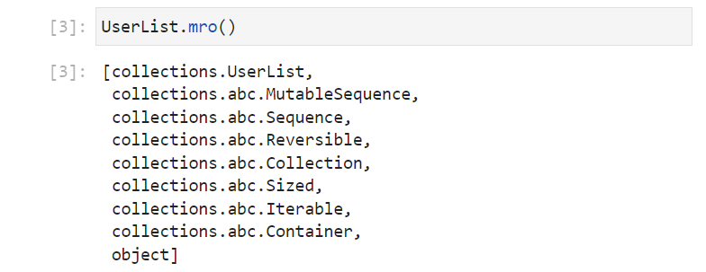

If the ```mro``` of the ```UserList``` class is examined which recall is equivalent to the ```list``` class, the same abstract base classes show, in addition to ```MutableSequence``` which makes sense as a ```list``` has all of these properties in common with a ```str``` but is mutable.

```
UserDict.mro()
```

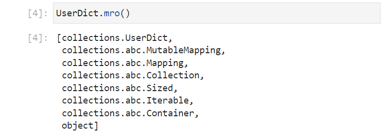

If the ```mro``` of the ```UserDict``` class is examined which recall is equivalent to the ```dict``` class, many of the same abstract base classes show, the ```dict``` is not a sequence i.e. has no numeric index, instead it has a mapping and is a mutable mapping.

An instance of ```UserString``` can be created using:

```
greeting = UserString('hello')
```

And any of the methods available for a string can be used:

```
greeting.upper()
```

Notice that all the mutable methods have a return value, in this case returning a new ```UserString``` instance:

```
greeting = UserString('hello')
greeting.upper()
type(greeting.upper())
```

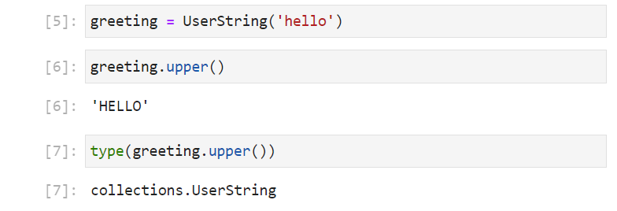

Let's create a subclass with one additional method:

```
class CustomString(UserString):
    def plural(self):
        return self + 's'
```

The ```class``` keyword is used:

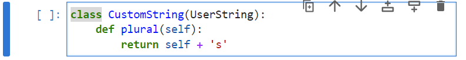

Followed by the class name which is in ```CamelCase```. ```CamelCase``` is used for all third-party classes:

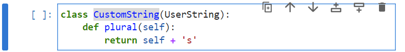

The parenthesis contains the parent classes which are also known as the superclasses:

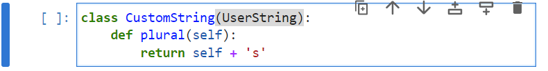

The colon ```:``` indicates the beginning fo a code block. all additional methods are nested within this code block:

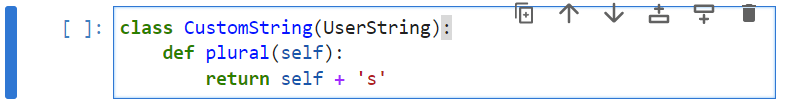

A method is very similar to a function. It always has ```self``` as the first input argument:

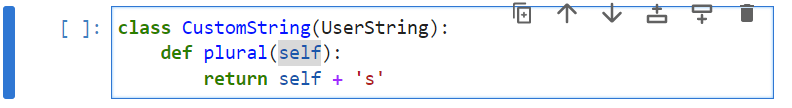

```self``` is the conventional term and essentially means *this instance*.

The method is immutable and therefore has a return value, in this case using the ```+``` operator. The ```__add__``` data model method is defined in the parent class ```UserString``` so concatenation can be used:

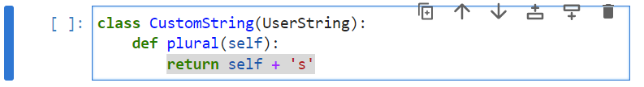

The method resolution order of ```CustomString``` can now be examined:

```
CustomString.mro()
```

The list has ```CustomString``` at the top followed by all the entries which came from the parent class ```UserString```:

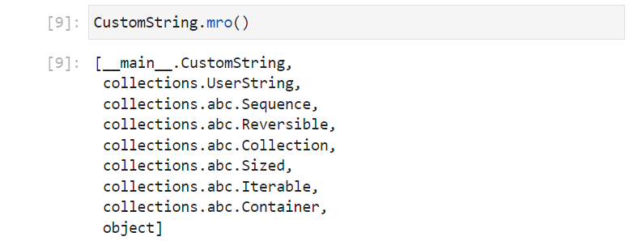

An instance can be created:

```
greeting = CustomString('hello')
```


If ```CustomClass.``` is input followed by a tab ```↹```, the list of identifiers displays, note the inclusion of the identifier ```plural```:

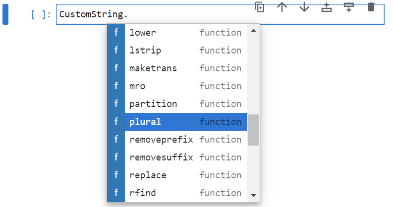

If its docstring is examined by inputting ```CustomClass.plural()``` followed by shift ```⇧``` and tab ```↹```, it requires the input argument ```self```. Recall that ```self``` can be thought of as meaning *this instance*. In this particular instance, the instance name is ```greeting```: 

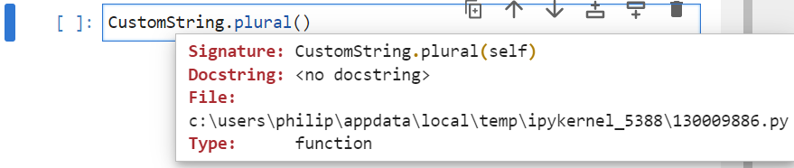

```
CustomString.plural(greeting)
```

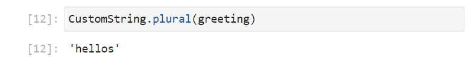

Supplying ```self``` means the method has access to the instance data which is the text ```'hello'```. The output returns the new ```UserString``` ```'hellos'```.

It is more common to call the method from the instance. If ```greeting.``` is input followed by a tab ```↹```, the list of identifiers displays, note the inclusion of the identifier ```plural```:

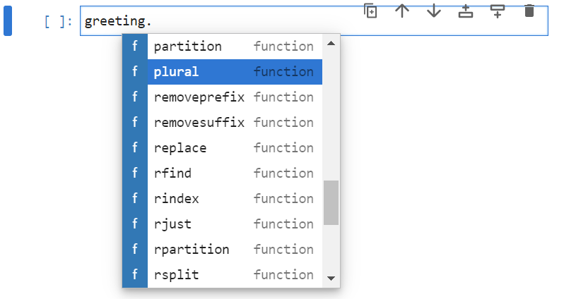

If its docstring is examined by inputting ```greeting.plural()``` followed by shift ```⇧``` and tab ```↹```. Notice omission of the input argument ```self```. Since the method is being called from *this instance* ```greeting```, ````self``` is already implied:

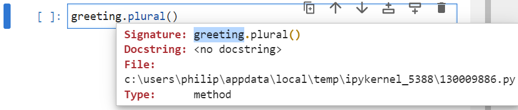

```
self.plural()
```


Implicitly supplying ```self``` by accessing the method from the instance, means the method has access to the instance data which is the text ```'hello'```. The output once again returns the new ```UserString``` ```'hellos'```.

The ```type``` of the instance and the return value from this method call can be checked using:

```
type(greeting)
type(greeting.plural())
```

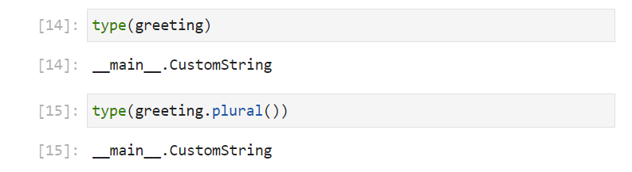

In both cases they are ```CustomString``` instances as expected.

The following class can be defined with two additional methods:

```
class CustomString(UserString):
    def plural(self):
        return self + 's'
    
    def custom_upper(self):
        print('From class:')
        return self.upper()
    
    def custom_super_upper(self):
        print('From superclass:')
        return super().upper()


```

The method ```custom_upper``` calls the existing method ```upper``` from *this instance* ```self``` i.e. calling the method from the same class ```CustomString```:

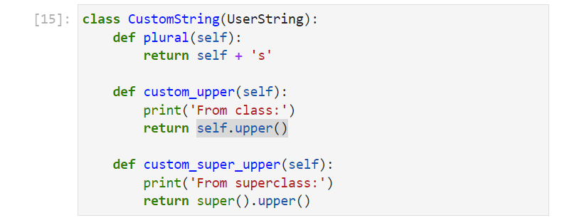

The method ```custom_super_upper``` calls the existing method ```upper``` from *this instance of the superclass* i.e. calling the method as defined in the parent class ```UserString```:

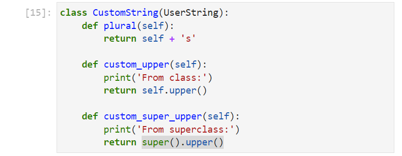

Sometimes the above is more explicitly written as:

```
class CustomString(UserString):
    def plural(self):
        return self + 's'
    
    def custom_upper(self):
        print('From class:')
        return self.upper()
    
    def custom_super_upper(self):
        print('From superclass:')
        print(f'{super(CustomString, self)}')
        return super(CustomString, self).upper()


```

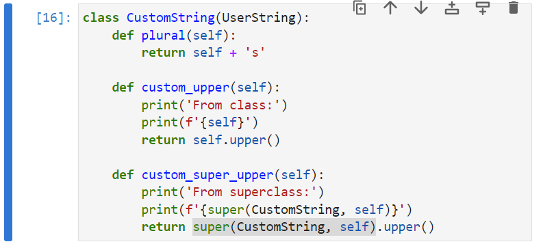

```super(CustomString, self)``` looks at the superclass of ```CustomString``` which is ```UserString``` and provides the parent class the parameter ```self```. Recall ```self``` was previously conceptualised as *this instance*. In the context of a superclass *self* can mean this *instance* or any *equivalent parent class instance*.

```super(CustomString, self)``` means *equivalent parent instance* and a method called from ```super(CustomString, self)``` is being called from an equivalent instance of the parent class. 

Usually the parent class and ```self``` are implicitly implied. Taken from the first positional argument supplied during the class definition and the first positional input argument from the method respectively:

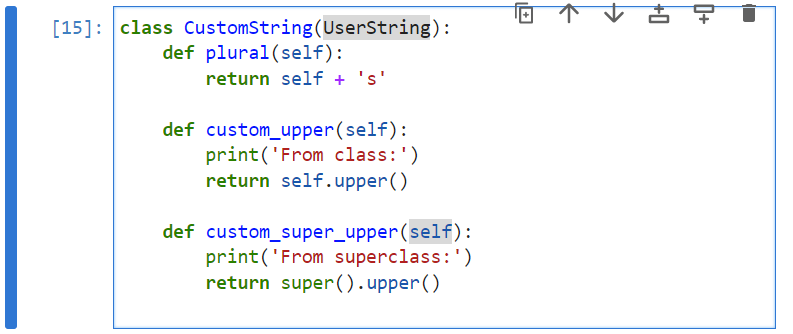

```greeting``` can once again be instantiated:

```
greeting = CustomString('hello')
```


These methods can be compared:

```
greeting.upper()
```


```self``` means *this instance* and in this case the instance name is ```greeting``` which is assigned to the value ```'hello'``` which is printed:

```
greeting.custom_upper()
```

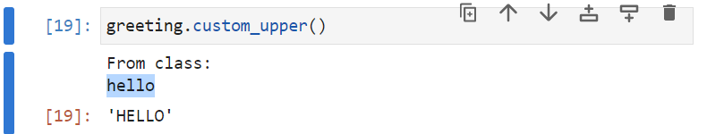

The superclass is being provided the name of the child class alongside an object or instance of the child class:

```
greeting.custom_super_upper()
```

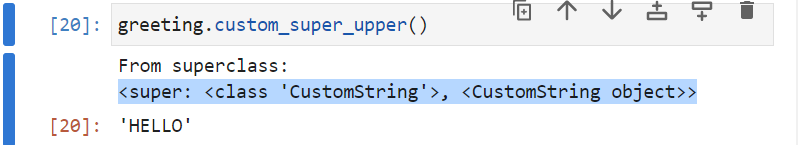

In all the cases above a new instance of ```CustomString``` is returned:

```
type(greeting.upper())
type(greeting.custom_upper())
type(greeting.custom_super_upper())
```

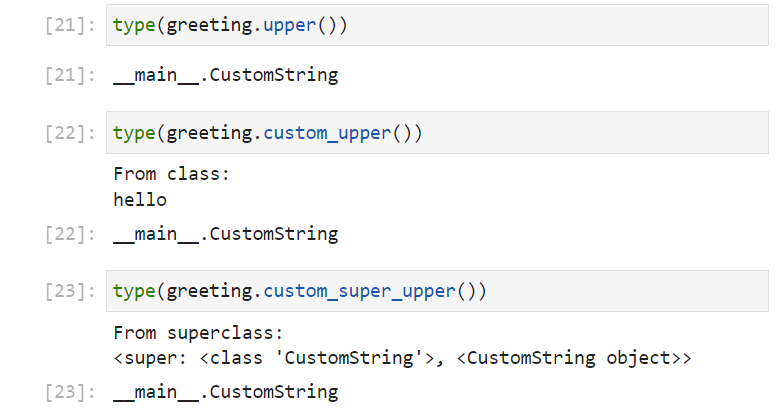

Calling a method from an equivalent instance of the parent class allows slight modification of the equivalent method name in the child class. For example a simple print statement can be added. The class can be created with the ```upper``` method defined:

```
class CustomString(UserString):
    def plural(self):
        return self + 's'
    
    def upper(self):
        print('Shouting:')
        return super().upper()
    
```

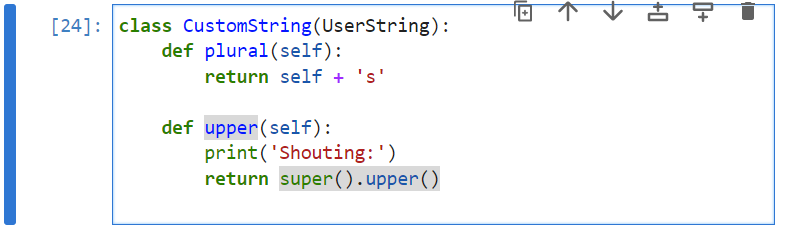

```greeting``` can once again be instantiated:

```
greeting = CustomString('hello')
```

And the modified method called:

```
greeting.upper()
```

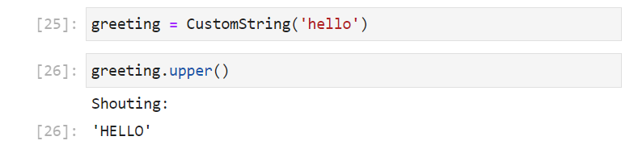

The method resolution order can be examined:

```
CustomString.mro()
```

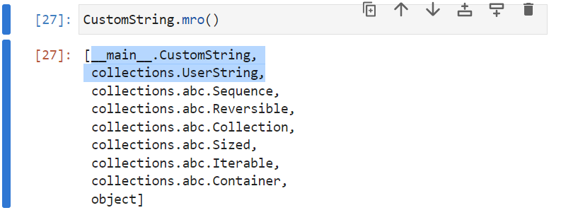

The method ```upper``` is now defined in two places and this class ```CustomString``` will preference the definition closer towards the top of the method resolution order list i.e. the definition in ```CustomString```. In this case, the definition in ```CustomString``` uses the definition in ```UserString``` and builds upon it.

Let's create a ```list``` based subclass with one additional mutable method. Note that the mutable method has no return value as it mutates the list in place:

```
class CustomList(UserList):
    def append_hello(self):
        self.append('hello')


```


A new instance can be created using:

```
active = CustomList()
```


The list of identifiers can be viewed by inputting ```active.``` followed by a tab ```↹```:

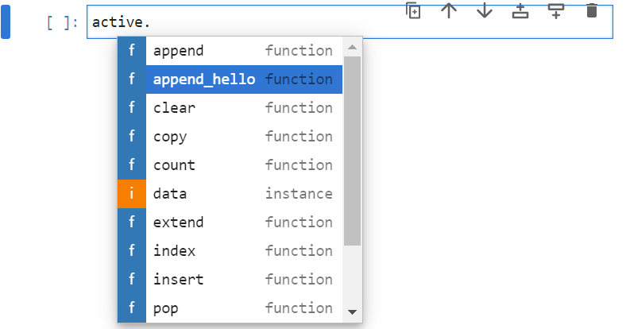

Inputting ```active.append_hello()``` followed by a shift ```⇧``` and tab ```↹``` shows the docstring:

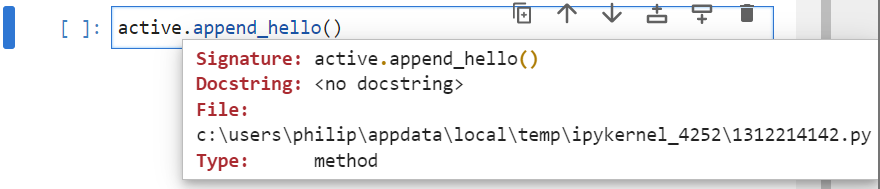

This method has no input arguments and can be called using:

```
active.append_hello()
```


Notice that calling this mutable method displays no output in the cell as it has no return statement. If the instance:

```
active
```

is examined, the value ```'hello'``` is appended:


Another method ```appendleft``` which behaves equivalently to its coutnerpart in the ```deque``` collection can be made using the ```list``` method ```insert```. If the docstring is viewed by typing in ```active.insert()``` followed by a shift ```⇧``` and tab ```↹```, this method has two input arguments ```index``` and ```value```:

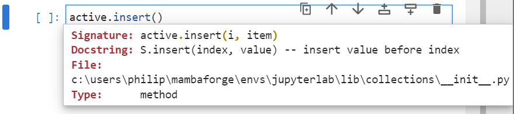

For the ```appendleft``` method, the ```index``` is going to be locked to ```0``` however a single input argument ```value``` will need to be provided:

```
class CustomList(UserList):
    def appendleft(self, value):
        """Add an element to the left side of the CustomList"""
        self.insert(0, value)


```

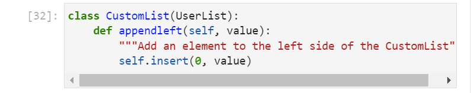

Now an instance can be created:

```
active = CustomList(('a', 'b', 'c'))
```


The list of identifiers can be viewed by inputting ```active.``` followed by a tab ```↹```:

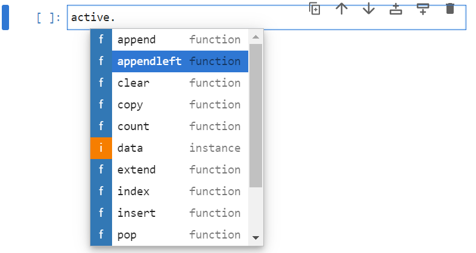

The docstring for the identifier ```appendleft``` can be viewed by inputting ```active.appendleft()``` followed by a shift ```⇧``` and tab ```↹``` and requests the input argument ```value```:

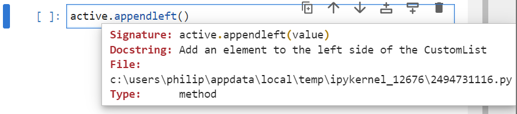

The ```active``` instance of ```CustomList``` can be examined:

```
active
```

Then the method ```appendleft``` can be used:

```
active.appendleft('hello')
```

This method is mutable so has no return value. The ```active``` instance of ```CustomList``` can be examined again using:

```
active
```

The value ```'hello'``` is appended as expected:

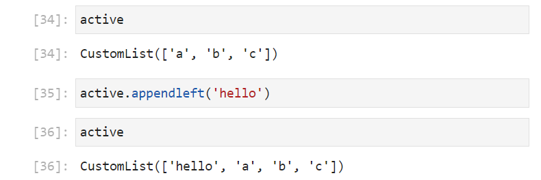

Other methods found in the ```deque``` could be made such as ```extendleft``` and ```popleft```:

```
class CustomList(UserList):
    def appendleft(self, value):
        """Add an element to the left side of the CustomList"""
        self.insert(0, value)
        
    def popleft(self):
        """Remove and return the leftmost element."""
        return self.pop(0) # pop has a return value
        
    def extendleft(self, seq):
        """Extend the left side of the CustomList with elements from the iterable"""
        for item in seq:
            self.appendleft(item)


```

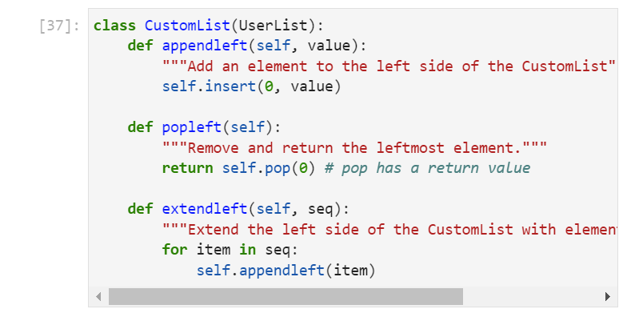

These can be tested using:

```
active = CustomList([1, 2, 3])
active
active.popleft()
active
active.extendleft(('a', 'b', 'c'))
active
```

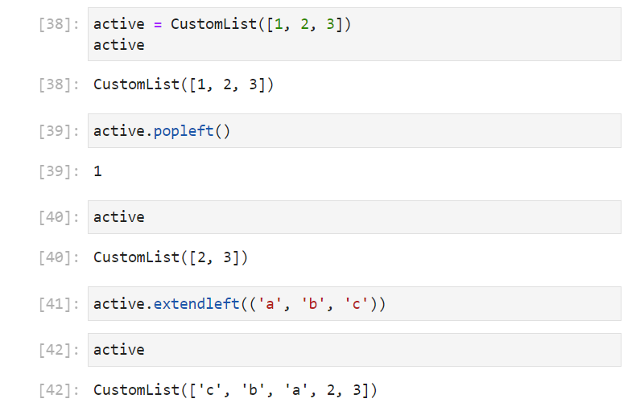

Notice the cell output:

```
active
```

This differs from:

```
repr(active)
str(active)
```

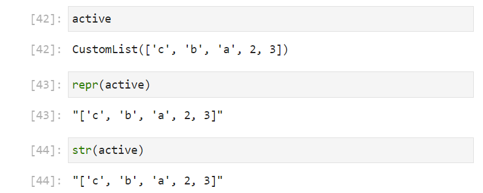

Normally the formal string representation shows how to instantiate a new instance. To change this the data model method ```__repr__``` needs to be defined:

```
class CustomList(UserList):
    def __repr__(self):
        string = super().__repr__()
        updatedstring = f'CustomList({string})'
        return updatedstring

    def appendleft(self, value):
        """Add an element to the left side of the CustomList"""
        self.insert(0, value)
        
    def popleft(self):
        """Remove and return the leftmost element."""
        return self.pop(0) # pop has a return value
        
    def extendleft(self, seq):
        """Extend the left side of the CustomList with elements from the iterable"""
        for item in seq:
            self.appendleft(item)


```

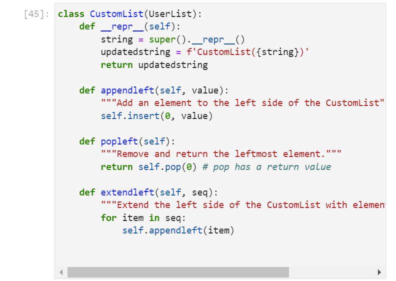

This can be tested with:

```
active = CustomList((1, 2, 3))
active
repr(active)
active2 = CustomList(('a', 'b', 'c'))
active2
repr(active2)
str(active2)
```

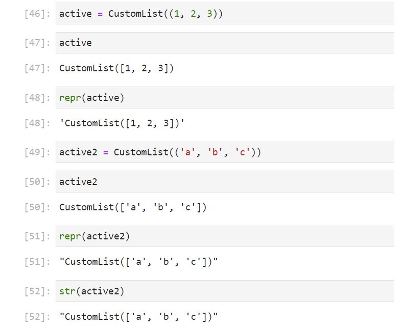

Notice the informal string has the same format as the formal string, this is the default case when ```__repr__``` is defined and ```__str__``` is not defined. For clarity ```__str__``` can be defined to something different:

```
class CustomList(UserList):
    def __repr__(self):
        string = super().__repr__()
        updatedstring = f'CustomList({string})'
        return updatedstring

    def __str__(self):
        string = super().__repr__()
        return string    
    
    def appendleft(self, value):
        """Add an element to the left side of the CustomList"""
        self.insert(0, value)
        
    def popleft(self):
        """Remove and return the leftmost element."""
        return self.pop(0) # pop has a return value
        
    def extendleft(self, seq):
        """Extend the left side of the CustomList with elements from the iterable"""
        for item in seq:
            self.appendleft(item)


```

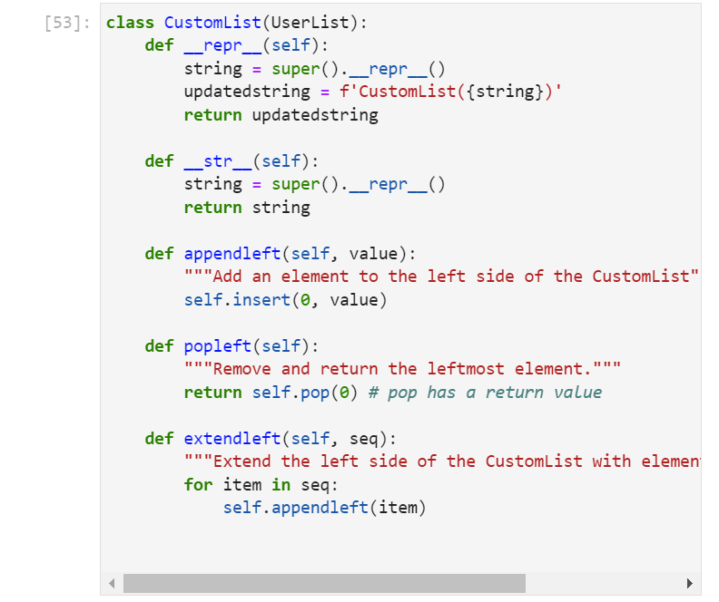

This can be tested with:

```
active2 = CustomList(('a', 'b', 'c'))
active2
repr(active2)
str(active2)
```

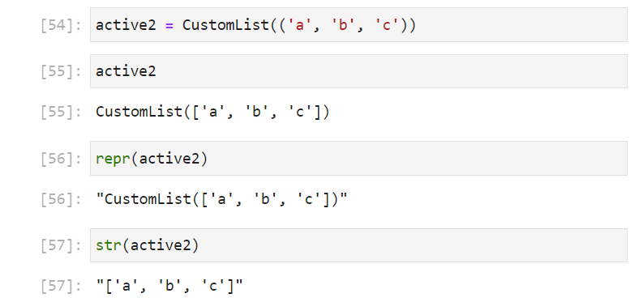

If the method resolution order of the ```builtins``` objects are compared to their counterparts in the ```collections``` module:

```
str.mro()
UserString.mro()
```

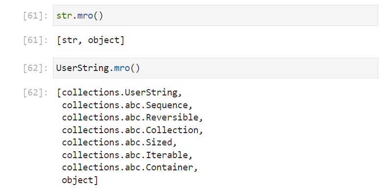

Notice that the ```UserString``` has a much larger number of abstract base classes. Inclusion of the abstract base classes is a design pattern, that makes it easier for another Python programmer to identify what data model methods to expect in a third-party class. Looking at only the abstract base classes from bottom to top, the following relationship can be outlined:

|Abstract<br />Class|Abstract<br />Parent<br />Class|Abstract<br />Data<br />Model<br />Methods|Inherited<br />Data<br />Model<br />Methods|Abstract<br />Methods|Inherited<br />Abstract<br />Methods|
|---|---|---|---|---|---|
|Container||\_\_contains\_\_||||
|Iterable||\_\_iter\_\_||||
|Sized||\_\_len\_\_||||
|Collection|Container <br /> Iterable <br /> Sized||\_\_contains\_\_ <br /> \_\_iter\_\_ <br /> \_\_len\_\_|||
|Reversible|Iterable|\_\_reversed\_\_|\_\_iter\_\_|||
|Sequence|Reversible <br /> Collection|\_\_getitem\_\_|\_\_contains\_\_ <br /> \_\_iter\_\_ <br /> \_\_len\_\_ <br /> \_\_reversed\_\_|count <br /> index||

A ```Collection``` for example inherits everything from ```Container```, ```Iterable``` and ```Sized```.

A ```str``` is a ```Sequence``` and has all the immutable ```Sequence``` methods shown in the table above. 

A ```tuple``` is also a ```Sequence``` and has all the immutable ```Sequence``` methods shown in the table above which behave equivalently. i.e. the ```str``` and ```tuple``` classes behave consistently when it comes to indexing, slicing and looping over for example:

```
list.mro()
UserList.mro()
```

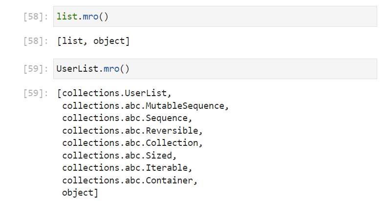

Notice that the ```UserList``` once again has a much larger number of abstract base classes. Most of these are the same however there is the inclusion of ```MutableSequence```:

|Abstract<br />Class|Abstract<br />Parent<br />Class|Abstract<br />Data<br />Model<br />Methods|Inherited<br />Data<br />Model<br />Methods|Abstract<br />Methods|Inherited<br />Abstract<br />Methods|
|---|---|---|---|---|---|
|Container||\_\_contains\_\_||||
|Iterable||\_\_iter\_\_||||
|Sized||\_\_len\_\_||||
|Collection|Container <br /> Iterable <br /> Sized||\_\_contains\_\_ <br /> \_\_iter\_\_ <br /> \_\_len\_\_|||
|Reversible|Iterable|\_\_reversed\_\_|\_\_iter\_\_|||
|Sequence|Reversible <br /> Collection|\_\_getitem\_\_|\_\_contains\_\_ <br /> \_\_iter\_\_ <br /> \_\_len\_\_ <br /> \_\_reversed\_\_|count <br /> index||
|MutableSequence|Sequence|\_\_iadd\_\_ <br /> \_\_setitem\_\_ <br /> \_\_delitem\_\_|\_\_contains\_\_ <br /> \_\_getitem\_\_ <br /> \_\_iter\_\_ <br /> \_\_len\_\_ <br /> \_\_reversed\_\_|append <br /> extend <br /> insert <br /> pop <br /> remove <br /> reverse|count <br /> index|

A ```list``` is a ```MutableSequence``` and inherits all the immutable methods from the ```Sequence```, therefore as seen previously equivalent methods between a ```tuple``` and a ```list``` behave identically. The ```list``` also has all the mutable ```MutableSequence``` methods shown in the table above.

```
dict.mro()
UserDict.mro()
```

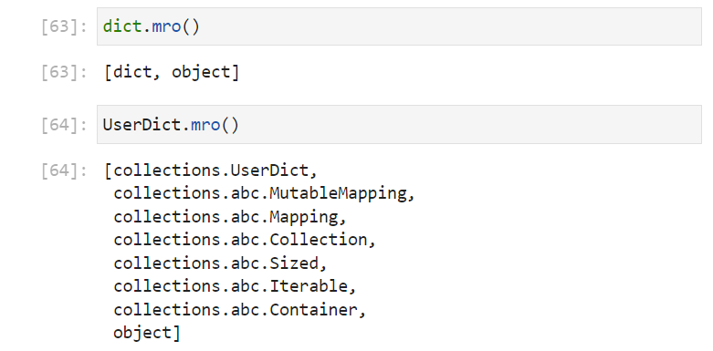

Notice that the ```UserDict``` once again has a much larger number of abstract base classes:

|Abstract<br />Class|Abstract<br />Parent<br />Class|Abstract<br />Data<br />Model<br />Methods|Inherited<br />Data<br />Model<br />Methods|Abstract<br />Methods|Inherited<br />Abstract<br />Methods|
|---|---|---|---|---|---|
|Container||\_\_contains\_\_||||
|Iterable||\_\_iter\_\_||||
|Sized||\_\_len\_\_||||
|Collection|Container <br /> Iterable <br /> Sized||\_\_contains\_\_ <br /> \_\_iter\_\_ <br /> \_\_len\_\_|||
|Mapping|Collection|\_\_getitem\_\_|\_\_contains\_\_ <br /> \_\_eq\_\_ <br /> \_\_iter\_\_ <br /> \_\_len\_\_ <br /> \_\_ne\_\_ <br />|get<br />  items<br />  keys<br />  values||
|MutableMapping|Mapping|\_\_delitem\_\_ <br />  \_\_setitem\_\_|\_\_contains\_\_ <br /> \_\_eq\_\_ <br /> \_\_getitem\_\_  <br />\_\_iter\_\_ <br /> \_\_len\_\_ <br /> \_\_ne\_\_ <br />|clear <br /> pop <br />  popitem <br /> setdefault <br />  update|get<br />  items<br />  keys<br />  values|

The ```dict``` is not a ```Mapping```. Notice that both the ```Sequence``` and ```Mapping``` inherit from the ```Collection``` which is why there is some consistent behaviour between a ```dict``` and a ```tuple``` for example. A ```Sequence``` has a numeric index, whereas a ```Mapping``` has keys, both of these use the ```__getitem__``` data model method but it is defined differently.

Sticking to the design patterns above makes it easier for another Python programmer to use the third-party class.

## Property

So far subclassing using the UserClasses of the ```collections``` module has been examined. This has typically involved the addition or modification of methods which act on instance data. Let's create an ```XVariable``` class which directly subclasses from ```object```, recall everything in Python is ultimately an ```object```. 

Three methods will be created for a variable ```x```, an associated ```get_x```, ```set_x``` and ```del_x``` method:

```
class XVariable(object):

    def get_x(self):
        return self.x

    def set_x(self, x):
        self.x = x

    def del_x(self):
        self.x = None


```

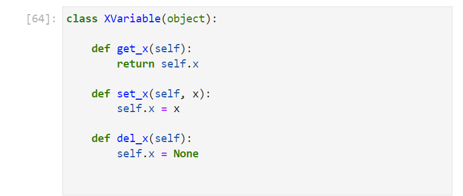

Notice that ```get_x``` returns a value and does not modify the instance, whereas ```set_x``` and ```del_x``` directly mutate the instance and have no return statement.

The default Initialization Signature inherited from the parent class ```object``` can be examined by inputting ```XVariable()``` and pressing shift ```⇧``` and tab ```↹```:

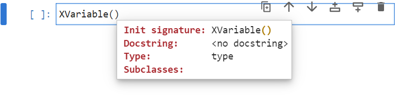

An instance can be created using:

```
x1 = XVariable()
```


The identifiers can be viewed by inputting ```x1.``` and pressing tab ```↹```:

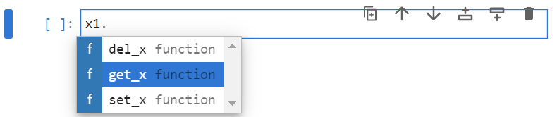

Notice the three identifiers ```get_x```, ```set_x``` and ```del_x``` show but there is no variable ```x``` itself. If the ```get_x``` is attempted to be called an ```AttributeError``` displays:

```
x1.get_x()
```

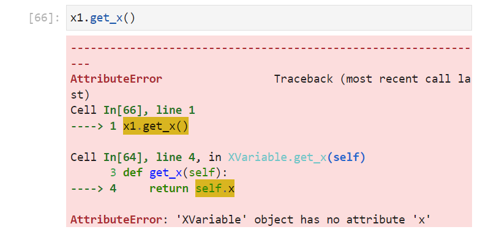

If ```x``` is set:

```
x1.set_x(3)
```


The identifiers can be viewed once again by inputting ```x1.``` and pressing tab ```↹```:

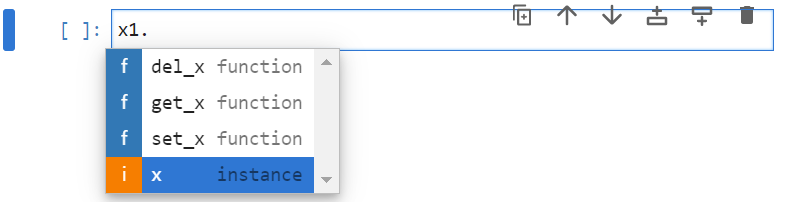

Now the attribute ```x``` displays. Its value can be viewed by the ```get_x``` method, it can also be deleted using the ```del_x``` method. Since deleting is designed to return ```None``` instead of removing the attribute, the method ```get_x``` can be used after deletion:

```
x1.get_x()
x1.del_x()
x1.get_x()
```

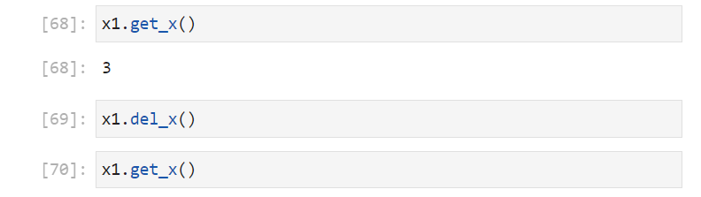

More conventionally an attribute can be set using:

```
x1.x = 4
```

It can be get using:

```
x1.x
```

And it can be del using:

```
del x1.x
```

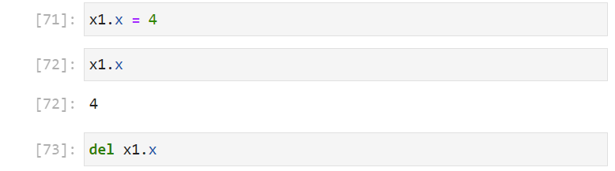

Once deleted it cannot be accessed, giving an ```AttributeError``` if attempting to do so:

```
x1.x
```

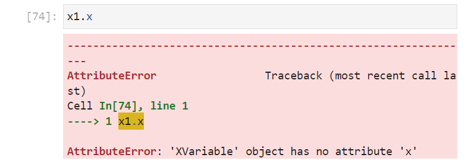

Supposing, the attribute is supposed to only be interacted with using the three methods ```get_x```, ```set_x``` and ```del_x```, it can be prefixed with an underscore. 

Prefixing a variable with a single underscore, indicates the attribute is designed to only be accessed internally (within the class itself).

```
class XVariable(object):

    def get_x(self):
        return self._x

    def set_x(self, x):
        self._x = x

    def del_x(self):
        self._x = None


```

And not outwith the class for example from an instance:

```
x1 = XVariable()
x1.set_x(4)
```

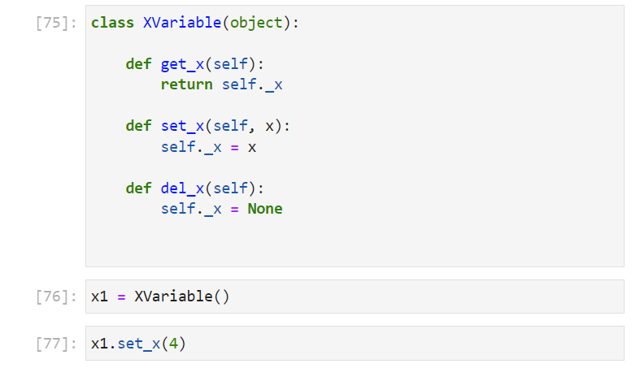

The identifiers can be viewed once again by inputting ```x1.``` and pressing tab ```↹```:

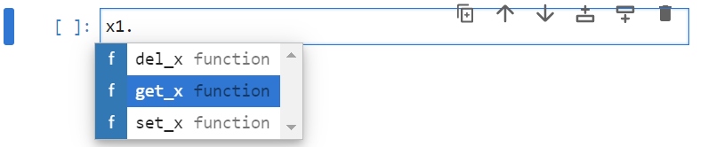

Notice the private attribute ```_x``` does not show and it is therefore more obvious to use the ```get_x``` method:

```
x1.get_x()
```


```
from pprint import pprint
pprint(dir(x1), compact=True)
```

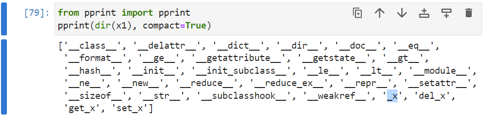

It becomes rather cumbersome to have three methods for each attribute displaying in the list of identifiers. Instead a property is typically configured. The function names ```get_x```, ```set_x``` and ```del_x``` are all renamed ```x```. The getter has the decorator ```@property```, the setter has the decorator ```@x.setter``` and the deleter has the decorator ```@x.deleter```:

```
class XVariable(object):

    @property
    def x(self):
        return self._x

    @x.setter
    def x(self, x):
        self._x = x

    @x.deleter
    def x(self):
        self._x = None


```

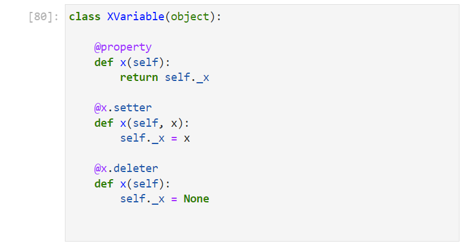

Now when the instance ```x1``` is instantiated. The attribute ```x``` can be get, set and deleted using Pythons standard syntax. Notice when it is accessed again after deletion, ```None``` is returned opposed to the ```AttributeError``` meaning the custom deleter method is invoked:

```
x1 = XVariable()
x1.x = 4
del x1.x
x1.x
```

If the directory of the instance ```x1``` is examined, there is the property attribute ```x``` and the private attribute ```_x```. The user should only interact with ```x``` as the getter, setter and deleter are configured as desired:

```
from pprint import pprint
pprint(dir(x1), compact=True)
```

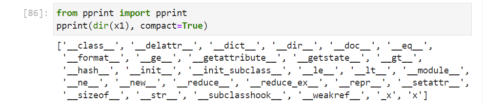

If a second instance is created, although ```x``` is recognised as an identifier, when it is attempted to be accessed without prior assignment an ```AttributeError``` displays:

```
x2 = XVariable()
x2.x
```

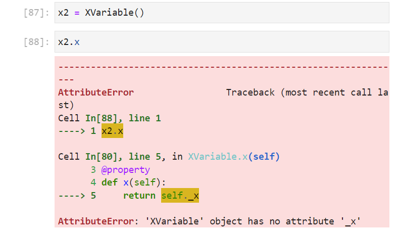

The purpose of an Initialization Signature is to initialize instance attributes, during instantiation. This is done using the data model method ```__init__```. 

```
class XVariable(object):

    @property
    def x(self):
        return self._x

    @x.setter
    def x(self, value):
        self._x = value

    @x.deleter
    def x(self):
        self._x = None

    def __init__(self, value):
        self.x = value
    

```

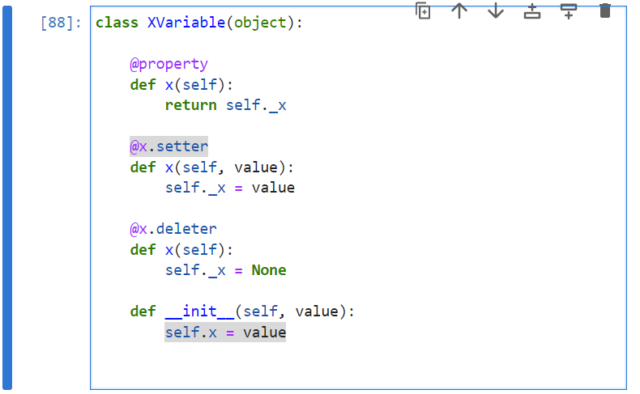

Notice that this assigns the ```value``` supplied as an input argument to the attribute ```x```. Assignment of a value to the attribute ```x``` invokes the setter method for ```x```. 

Note that the ```__init__``` signature only initializes instance attributes and has **no** return statement. When ```XVariable()``` is input followed by a shift ```⇧``` and tab ```↹```, the docstring of the initialization signature i.e. the ```__init__``` method displays. All the input arguments required for this method need to be supplied:

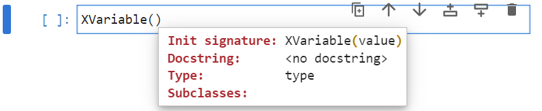

Although the docstring of the initialization signature displayed above. Instantiation actually uses another data model method ```__new__```. The ```__new__``` data model method creates a new instance, then calls the ```__init__``` method to initialize instance attributes and then finally has a return value which returns the new instance:

```
XVariable(4)
```


This effect of ```__new__``` can be seen by the return value shown in the cell output above, recall ```__init__``` has no return value and if ```__init__``` was instead invoked there would be no instance:

```
x1 = XVariable(4)
x1.x
```

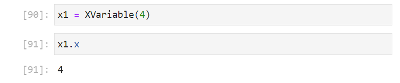

## Abstract Base Class

An Abstract Base Class (ABC) is a design pattern that is used to create an abstract template for a class. For example, the following outline can be made for a coordinate:

```
from abc import ABC, abstractmethod

class AbstractCoordinate(ABC):
    @abstractmethod
    def __init__(self):
        pass
    
    @property    
    @abstractmethod
    def x(self):
        pass

    @property    
    @abstractmethod
    def y(self):
        pass


```

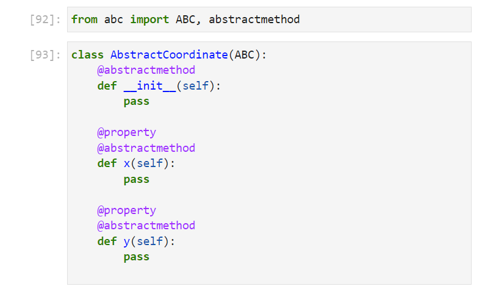

The docstring can be viewed by inputting ```AbstractCoordinate()``` and pressing shift ```⇧``` and tab ```↹```:

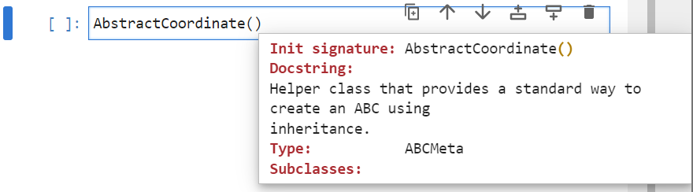

This template is not designed to be instantiated directly and a ```TypeError``` displays if this is attempted:

```
AbstractCoordinate()
```

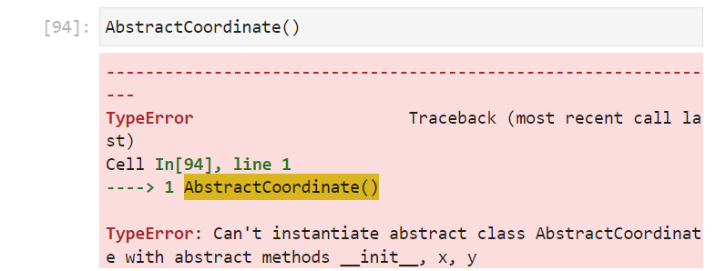

A class can be made that uses ```AbstractCoordinate``` as a base class. All of the methods that have the decorator ```@abstractmethod``` in ```AbstractCoordinate``` need to be defined. For example:

```
class Coordinate(AbstractCoordinate):
    @property
    def x(self):
        return self._x

    @x.setter
    def x(self, value):
        self._x = value

    @x.deleter
    def x(self):
        self._x = None

    @property
    def y(self):
        return self._y

    @y.setter
    def y(self, value):
        self._y = value

    @y.deleter
    def y(self):
        self._y = None
        
    def __init__(self, xvalue, yvalue):
        self.x = xvalue
        self.y = yvalue
        

```

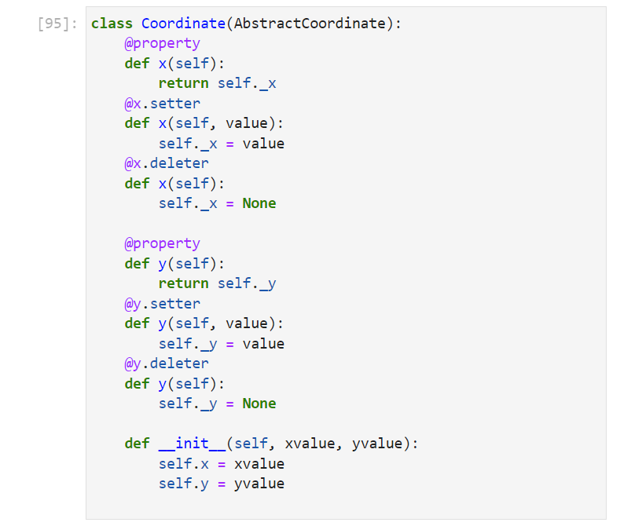

The docstring can be viewed by inputting ```Coordinate()``` and pressing shift ```⇧``` and tab ```↹```:

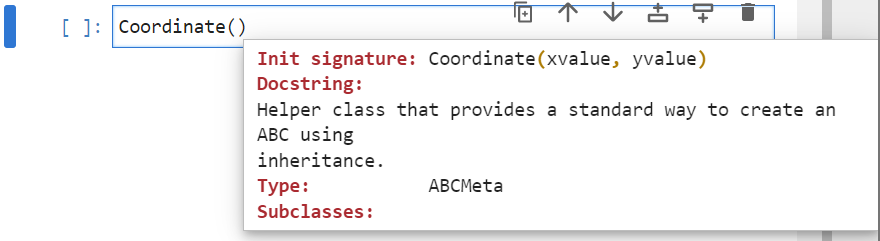

An instance can be instantiated using:

```
c1 = Coordinate(3, 4)
```


The identifiers can be viewed once again by inputting ```c1.``` and pressing tab ```↹```:

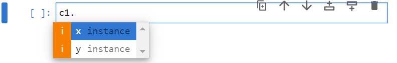

The attributes ```x``` and ```y``` from the instance ```c1``` can be get, set and deleted:

```
c1.x
c1.y
c1.x = 5
c1.x
del c1.y
c1.y
```


The setters are normally habe an assert statemetn to assert that the input arguments are the correct data type:

```
class Coordinate(AbstractCoordinate):
    @property
    def x(self):
        return self._x

    @x.setter
    def x(self, value):
        assert isinstance(value, (int, float, bool))
        self._x = value

    @x.deleter
    def x(self):
        self._x = None

    @property
    def y(self):
        return self._y

    @y.setter
    def y(self, value):
        assert isinstance(value, (int, float, bool))
        self._y = value

    @y.deleter
    def y(self):
        self._y = None
        
    def __init__(self, xvalue, yvalue):
        self.x = xvalue
        self.y = yvalue
        

```

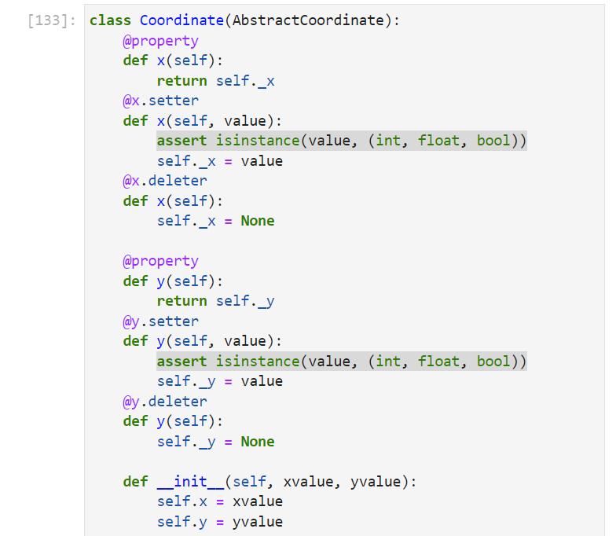

Recall that ```self``` can be conceptualised as meaning *this instance*. A regular method is bound to *this instance* which is why ```self``` is the first input argument when each method is defined within the class.

Instead of being bound to *this instance* ```self```, a class method is bound to the class ```cls```. The ```@classmethod``` decorator is used to distinguish a class method from a standard instance method. Normally the return value of a class method is a new instance of the class itself and is therefore used as an alternative constructor.  This can alternative constructor can be defined in the ```AbstractCoordinate2``` template:

```
class AbstractCoordinate2(ABC):
    @abstractmethod
    def __init__(self):
        pass
    
    @classmethod
    @abstractmethod
    def alternativeconstructor(cls):
        pass

```

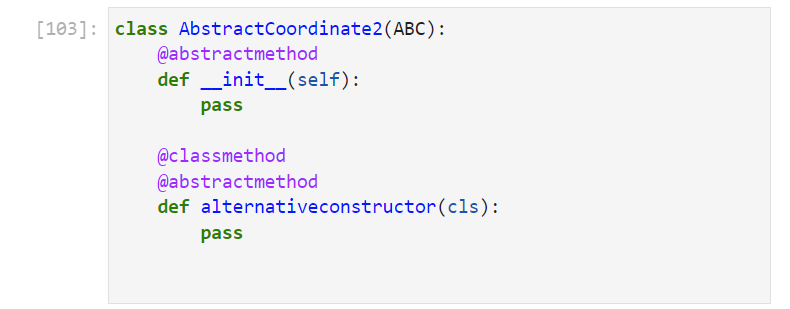

For simplicity the class ```Coordinate2``` will subclass both ```AbstractCoordinate``` and ```Coordinate```. Subclassing the former will check the class conforms to the expected design pattern. Subclassing the latter will allow inheritance of the getter, setter and deleter for the ```x``` and ```y``` attributes. Because these are inherited without modification, they do not need to be redefined.

This allows focus on the ```__init__``` signature and the ```alternativeconstructor```. Technically the ```__init__``` could also of been inherited without modification in this case however is explicitly specified for clarity. The ```alternativeconstructor``` will return a new ```Coordinate2``` instance from a supplied ```yvalue``` and ```xvalue``` opposed to the default ```xvalue``` and ```yvalue```:

```
class Coordinate2(AbstractCoordinate, Coordinate):        
    def __init__(self, xvalue, yvalue):
        self.x = xvalue
        self.y = yvalue
        
    @classmethod
    def alternativeconstructor(cls, yvalue, xvalue):
        return(Coordinate(xvalue, yvalue))
    

```

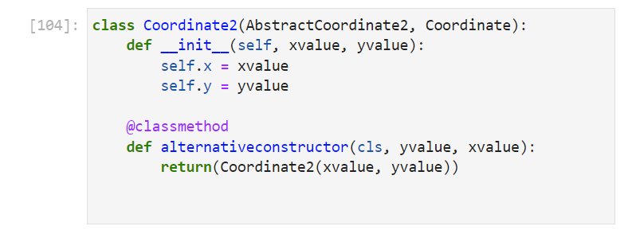

The return value gives a new ```Coordinate2``` instance providing the ```xvalue``` and ```yvalue``` in the order expected. Recall that instantiation invokes the ```__new__``` data model method. This creates a new instance *this instance* ```self``` and then invokes the ```__init__``` method to initialize the attributes ```x``` and ```y```.

The identifiers can be viewed by inputting ```c1.``` and pressing tab ```↹```:

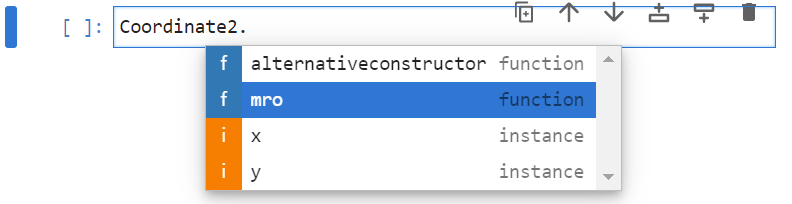

The method resolution order can be examined:

```
Coordinate2.mro()
```

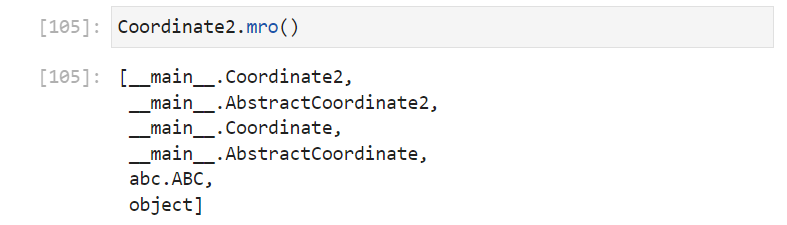

To recap, the ```mro``` identifier was inherited from ```object```. The ```Coordinate``` class defined the attributes ```x``` and ```y``` and the ```Coordinate``` class satisifed the design pattern of ```AbstractCoordinate```. The ```Coordinate2``` class subclassed ```Coordinate``` inherited the attributes ```x``` and ```y``` and matched the additional design pattern ```AbstractCoordinate2```.

The following instances can be made using the data model identifier ```__new__```directly or indirectly via the ```alternativeconstructor```:

```
c1 = Coordinate2(3, 4)
c1.x
c1.y
c1 = Coordinate2.alternativeconstructor(4, 3)
c2.x
c2.y
```

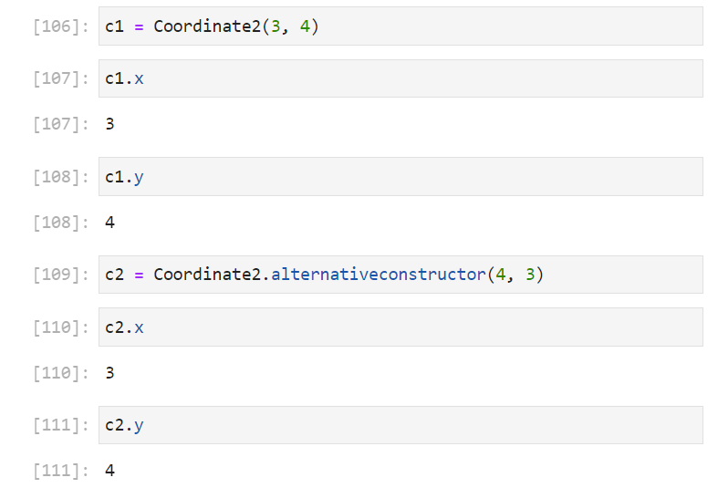

The ```alternativeconstructor``` can also be called from an instance although it is less common to do so. This works because each instance infers the class it belongs to. No instance data from ```c1``` is used to alternatively construct ```c3```:

```
c3 = c1.alternativeconstructor(5, 6)
c3.x
c3.y
```

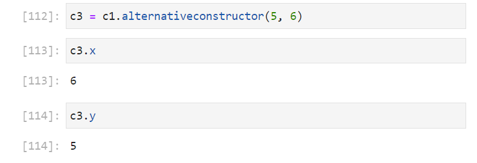

Sometimes instance data is required for an alternative constructor and therefore a standard method or instance method is required. This can be seen below with the additional method ```replace```. ```replace``` is an immutable method and returns a new instance. ```update``` is a mutable method and updates the existing instance:

```
class Coordinate2(AbstractCoordinate2, Coordinate):        
    def __init__(self, xvalue, yvalue):
        self.x = xvalue
        self.y = yvalue
        
    @classmethod
    def alternativeconstructor(cls, yvalue, xvalue):
        return(Coordinate2(xvalue, yvalue))
    
    def replace(self, xvalue=None, yvalue=None):
        if xvalue == None:
            xvalue = self.x
        if yvalue == None:
            yvalue = self.y
        return(Coordinate2(xvalue, yvalue))
    
    def update(self, xvalue=None, yvalue=None):
        if xvalue == None:
            xvalue = self.x
        if yvalue == None:
            yvalue = self.y
        self.x = xvalue
        self.y = yvalue
        
```

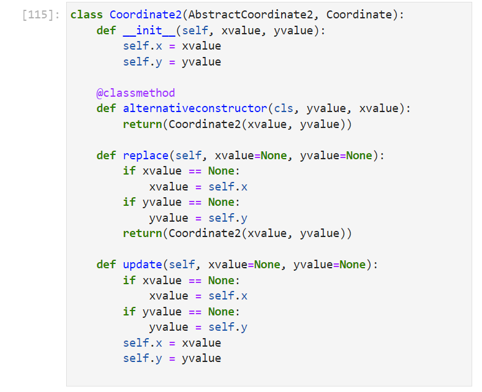

These methods work as expected:

```
c1 = Coordinate2(4, 3)
c1.x, c1.y
c1.update(xvalue=5)
c1.x, c1.y
c2 = c1.replace(yvalue=9)
c2.x, c2.y
```

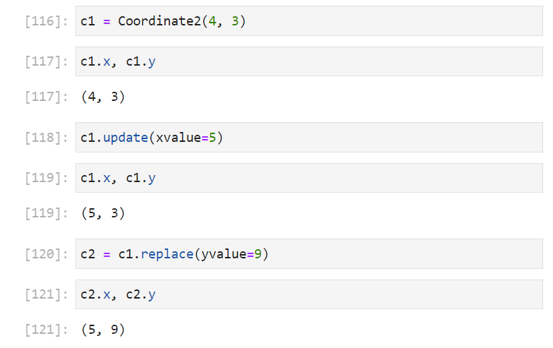

A static method is not bound to an instance or a class. In other words it is a function that is simply included within the code block or namespace of the class. Notice there is no *this instance* ```self``` or class ```cls``` provided as an input argument:

```
class AbstractCoordinate3(ABC):
    @staticmethod
    @abstractmethod
    def function():
        pass

    
```

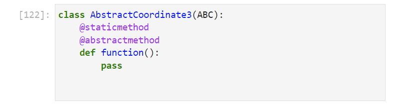

The abstract method is essentially a function that does not use instance attributes or the class name. However this function is normally loosely associated with the class type and therefore expected under the class namespace. The following static method ```function``` for example prints out some detail about a coordinate in response to the number of dimensions supplied:

```
class Coordinate3(AbstractCoordinate3, Coordinate2):
    @staticmethod
    def function(ndim):
        match ndim:
            case 1:
                print('a 1d coordinate lies on the x-line')
            case 2:
                print('a 2d coordinate lies on the xy-plane')
            case 3:
                print('a 3d coordinate lies within an xyz-cube')
            case _:
                print('I cannot visualize this')


```

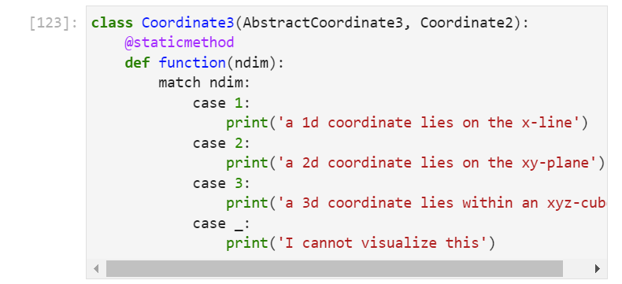

The static method can be called from the class or an instance and behaves otherwise like a regular function. For example:

```
Coordinate3.function(3)
c1 = Coordinate3(5, 4)
c1.function(2)
```

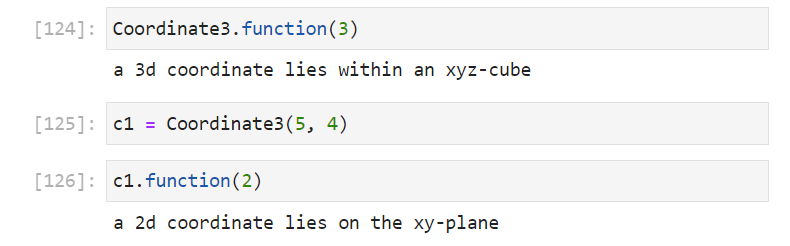

Notice if the ```alternativeconstructor``` class method inherited from ```Coordinate2``` or ```replace``` instance method inherited from ```Coordinate2``` are used that an instance of ```Coordinate2``` is created instead of ```Coordinate3```:

```
Coordinate3(1, 2)
Coordinate3.alternativeconstructor(1, 2)
c1 = Coordinate3(1, 2)
c1.replace(xvalue=5)
```

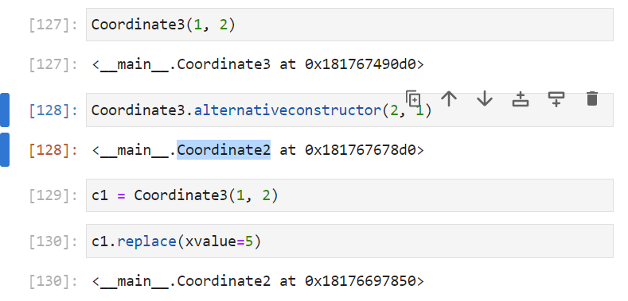

Going back to ```Coordinate2```. In the class method, ```alternativeconstructor```, ```cls``` is used to designate *this class* and can be used instead of ```Coordinate2``` in the return statement. 

In the instance method ```replace```, there is only *this instance* ```self```. However *this class* can be found by using the data model identifier ```__class__``` from *this instance* ```self.__class__```.

Updating ```Coordinate2```:

```
class Coordinate2(AbstractCoordinate2, Coordinate):        
    def __init__(self, xvalue, yvalue):
        self.x = xvalue
        self.y = yvalue
        
    @classmethod
    def alternativeconstructor(cls, yvalue, xvalue):
        return(cls(xvalue, yvalue))
    
    def replace(self, xvalue=None, yvalue=None):
        if xvalue == None:
            xvalue = self.x
        if yvalue == None:
            yvalue = self.y
        cls = self.__class__
        return(cls(xvalue, yvalue))
    
    def update(self, xvalue=None, yvalue=None):
        if xvalue == None:
            xvalue = self.x
        if yvalue == None:
            yvalue = self.y
        self.x = xvalue
        self.y = yvalue
        
```

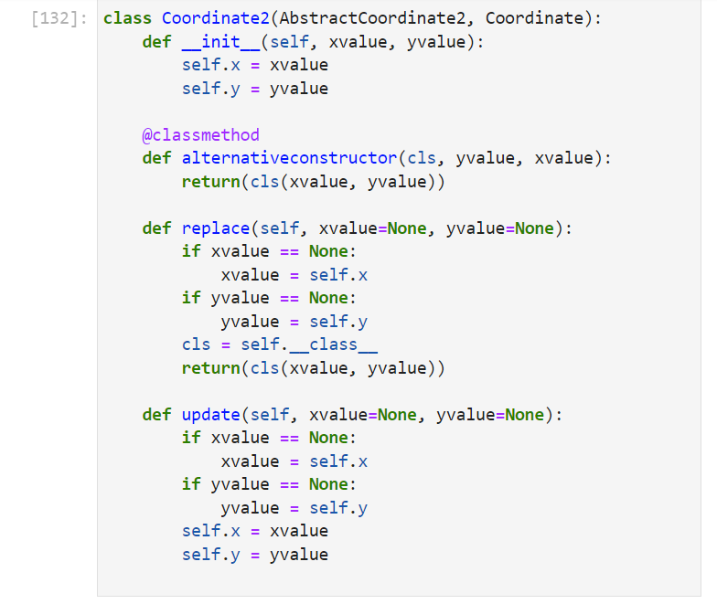

And rerunning the code to create the class ```Coordinate3```, so it now uses the updated ```Coordinate2``` as a parent class:

```
class Coordinate3(AbstractCoordinate3, Coordinate2):
    @staticmethod
    def function(ndim):
        match ndim:
            case 1:
                print('a 1d coordinate lies on the x-line')
            case 2:
                print('a 2d coordinate lies on the xy-plane')
            case 3:
                print('a 3d coordinate lies within an xyz-cube')
            case _:
                print('I cannot visualize this')


```                

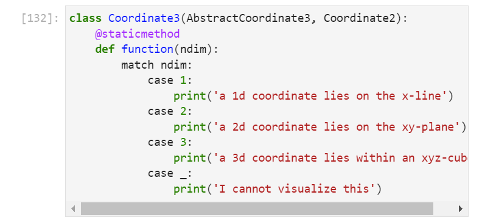

When the following code is run, all instances are now of the class ```Coordinate3```:

```
Coordinate3(1, 2)
Coordinate3.alternativeconstructor(1, 2)
c1 = Coordinate3(2, 1)
c1.replace(xvalue=5)
```

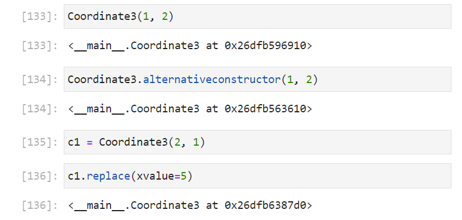

Unitary (single instance) and binary (two instances) data model identifiers can be configured for the class. These are immutable methods that operate on the instance data and return a new instance. For example an ```AbstractCoordinate4``` design pattern can be configured for ```__neg__``` and ```__sub__```. 

```__neg__``` is unitary and only the instance data from *self*.

```__sub__``` is binary and requires the instance data from *self* and from the second instance *value*.

```
class AbstractCoordinate4(ABC):
    @abstractmethod
    def __neg__(self):
        pass
    
    @abstractmethod
    def __sub__(self, value):
        pass

    
```

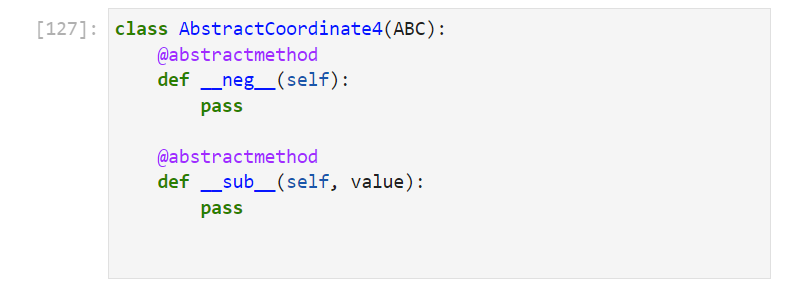

It is quite common for the data model method in a custom class to be broken down into steps which involve use of the equivalent data model method for a fundamental data type. In the data model ```__neg__``` for example the return value supplies ```-self.x``` where ```x``` is assumed to be a number and ```-``` uses the numbers data model method ```__neg__```:

```
class Coordinate4(AbstractCoordinate4, Coordinate2):
    def __neg__(self):
        cls = self.__class__
        return(cls(-self.x, -self.y))
    
    def __sub__(self, value):
        x = self.x - value.x
        y = self.y - value.y
        cls = self.__class__
        return(cls(x, y))

    
```

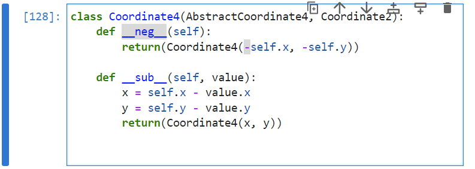

The following code works as expected:

```
c1 = Coordinate4(5, 2)
c2 = Coordinate4(1, 3)
c3 = c1 - c2
c3.x, c3.y
c4 = Coordinate4.alternativeconstructor(6, 7)
c4.x, c4.y
c5 = -c4
c5.x, c5.y
```

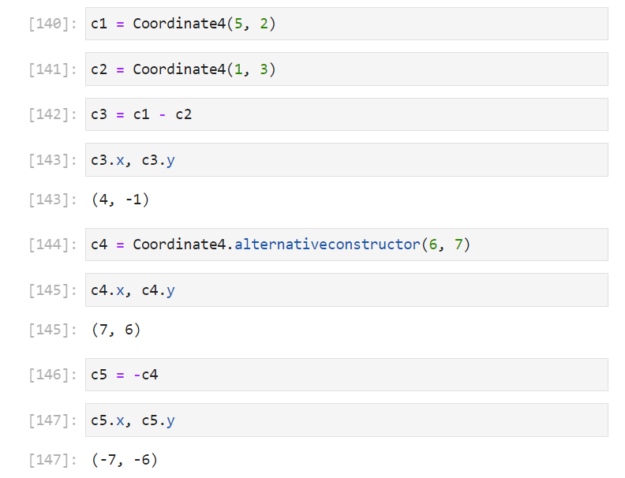

Sometimes all instances of a class will have an attribute that is the same regardless of the instance. Instead of creating a seperate instance attribute, it is more convenient to create a class variable. For example all the coordinates are 2 dimensional and therefore the number of dimensions ndim is 2. A very simple abstract class will be used to demonstrate this. Notice that the class variable is assigned directly within the class and there is no dot ```.``` indicating it is coming from another object:

```
class AbstractCoordinate5(ABC):
    ndim = None
    
```


```
class Coordinate5(Coordinate4):
    ndim = 2


```


The class variable can be accessed from a class and any instance of the class. Notice these all have the same value:

```
Coordinate5.ndim
c1 = Coordinate5(1, 2)
c1.ndim
c2 = Coordinate5.alternativeconstructor(4, 2)
c2.ndim
```

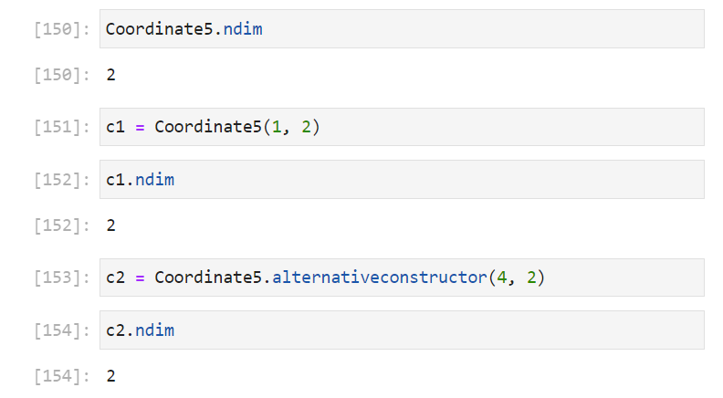

In the above, the class variable can be accessed from instances, in the same way an attribute is accessed. It can also be reassigned to a new value, which makes it an instance attribute only influencing that instance:

```
c2.ndim = 7
c2.ndim
c1.ndim
```

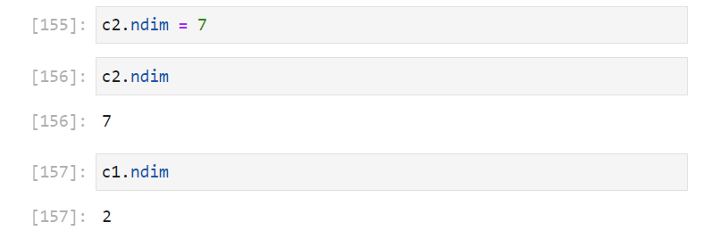

Clearly, in the above implementation it doesn't make sense to do this and the class variable can be protected by making ```_ndim``` a private variable and using a property for ```ndim```:

```
class AbstractCoordinate5(ABC):
    _ndim = None
    
    @property
    @abstractmethod
    def ndim(self):
        pass
    
```    

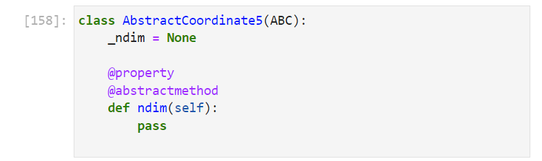

If only the getter method is defined, a ```TypeError``` will be raised if the class variable is attempted to be set or deleted:

```
class Coordinate5(AbstractCoordinate5, Coordinate4):
    _ndim = 2
    
    @property
    def ndim(self):
        return self._ndim
        

```

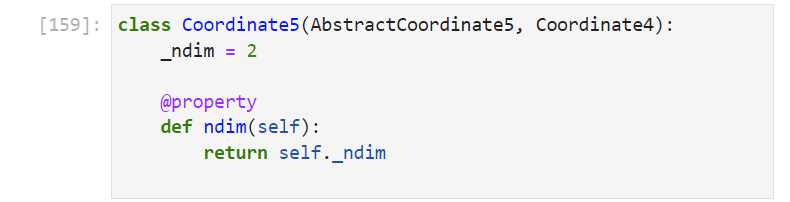

```
Coordinate5.ndim
c1 = Coordinate5(1, 2)
c1.ndim
c1.ndim = 7
```

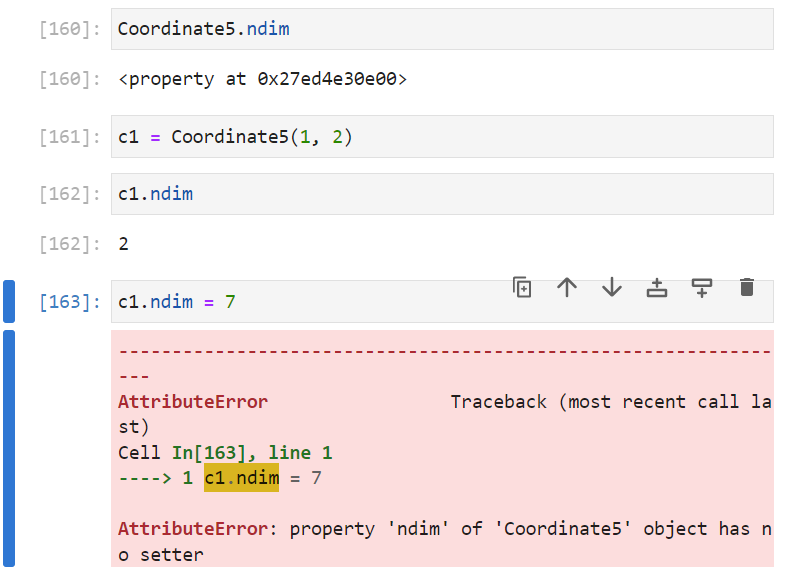

For this specific use case, it may be more appropriate to use the ```__len__``` data model method instead of having the class variable as a proeprty:

```
class AbstractCoordinate5(ABC):
    _ndim = None
    
    @abstractmethod
    def __len__(self):
        pass
    
```

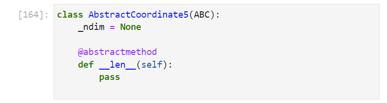

The ```__len__``` data model identifier can be designed to return this value:

```
class Coordinate5(AbstractCoordinate5, Coordinate4):
    _ndim = 2
    
    def __len__(self):
        return self._ndim
        
```

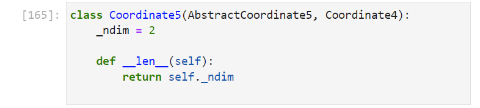

For example:

```
c1 = Coordinate5(1, 2)
len(c1)
```

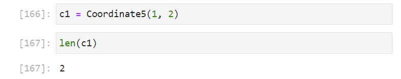

A class variable can also be created that counts the number of instances of a class. The following abstract class can be used:

```
class AbstractCoordinate6(ABC):
    _ninstances = None
    
    @abstractmethod
    def __init__(self):
        pass
    
    @property
    @abstractmethod
    def ninstances(self):
        pass
    

```

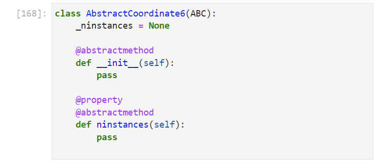

The ```__init__``` signature needs to be updated in order to increment the class variable. Recall the class can be accessed from *this instance* ```self``` by use of the data model identifier ```__class__``` in this case ```self.__class__```:

```
class Coordinate6(AbstractCoordinate6, Coordinate5):
    _ninstances = 0
    
    def __init__(self, xvalue, yvalue):
        self.x = xvalue
        self.y = yvalue
        cls = self.__class__
        cls._ninstances += 1
        
    @property
    def ninstances(self):
        cls = self.__class__
        return cls._ninstances
        
```

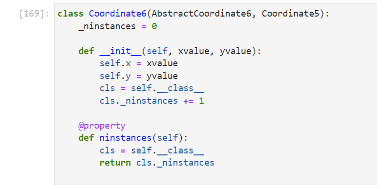

This works as expected:

```
Coordinate6.ninstances
c1 = Coordinate6(1, 2)
c1.ninstances
c2 = Coordinate6(3, 2)
c2.ninstances
c1.ninstances
```

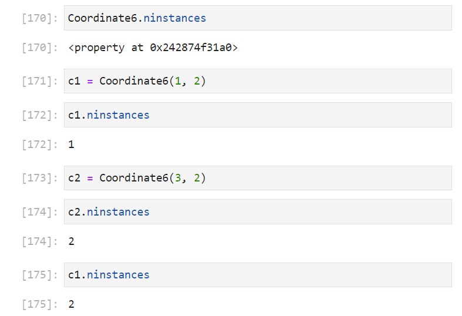

The property also protects the class variable from undesired reassignment or deletion:

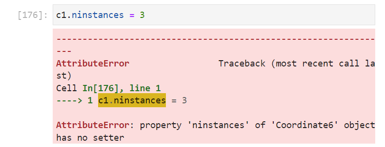

```self.__class__``` returns the class from an instance. ```self.__class__.__name__``` returns it as a string. This can be useful when defining the formal string representation using ```__repr__```.

```
class Coordinate7(Coordinate6):
    def __repr__(self):
        cls_str = self.__class__.__name__
        return (f'{cls_str}({self.x}, {self.y})')


```

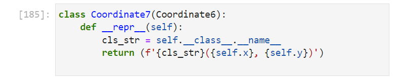

This can be tested using:

```
c1 = Coordinate7(1, 2)
c1
```

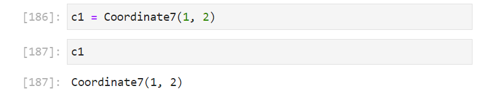

The above used several layers of subclasses to go through new concepts individually. It is worth condensing the above into one Abstract Base Class ```AbstractCoordinate```:

```
class AbstractCoordinate(ABC):
    _ndim = None
    _ninstances = None

    @abstractmethod
    def __init__(self):
        pass

    @abstractmethod
    def __repr__(self):
        pass

    @property
    def x(self):
        pass

    @property
    def y(self):
        pass

    @property
    @abstractmethod
    def ninstances(self):
        pass

    @classmethod
    @abstractmethod
    def alternativeconstructor(cls):
        pass        

    @abstractmethod
    def replace(self):
        pass    

    @abstractmethod
    def update(self):
        pass    

    @abstractmethod
    def __neg__(self):
        pass
    
    @abstractmethod
    def __sub__(self, value):
        pass
    
    @abstractmethod
    def __len__(self):
        pass

    @staticmethod
    @abstractmethod
    def function():
        pass


```

And then using this template to create one class ```Coordinate```:

```
class Coordinate(AbstractCoordinate):
    _ndim = 2
    _ninstances = 0

    def __init__(self, xvalue, yvalue):
        self.x = xvalue
        self.y = yvalue
        self.__class__._ninstances += 1

    def __repr__(self):
        return (f'{self.__class__.__name__}({self.x}, {self.y})')

    @property
    def x(self):
        return self._x

    @x.setter
    def x(self, value):
        assert isinstance(value, (int, float, bool))
        self._x = value

    @x.deleter
    def x(self):
        self._x = None

    @property
    def y(self):
        return self._y

    @y.setter
    def y(self, value):
        assert isinstance(value, (int, float, bool))
        self._y = value

    @y.deleter
    def y(self):
        self._y = None

    @property
    def ninstances(self):
        return self.__class__._ninstances

    @classmethod
    def alternativeconstructor(cls, yvalue, xvalue):
        return(cls(xvalue, yvalue))
    
    def replace(self, xvalue=None, yvalue=None):
        if xvalue == None:
            xvalue = self.x
        if yvalue == None:
            yvalue = self.y
        return(self.__class__(xvalue, yvalue))
    
    def update(self, xvalue=None, yvalue=None):
        if xvalue == None:
            xvalue = self.x
        if yvalue == None:
            yvalue = self.y
        self.x = xvalue
        self.y = yvalue   

    def __neg__(self):
        return(self.__class__(-self.x, -self.y))
    
    def __sub__(self, value):
        x = self.x - value.x
        y = self.y - value.y
        return(self.__class__(x, y))
    
    def __len__(self):
        return self._ndim

    @staticmethod
    def function(ndim):
        match ndim:
            case 1:
                print('a 1d coordinate lies on the x-line')
            case 2:
                print('a 2d coordinate lies on the xy-plane')
            case 3:
                print('a 3d coordinate lies within an xyz-cube')
            case _:
                print('I cannot visualize this')


```

This behaves in the same manner as before. Other identifiers and data model identifiers can be defined to increase the classes functionality.

## Modules

Classes generally involve a large amount of code, the ```AbstractCoordinate``` and ```Coordinate``` class are over 100 lines of code and would be larger with more of the data model identifiers defined. In addition for brevity, no docstrings were added. Normally the class and each method in the class would have its own docstring. 

Therefore classes are typically modularised. i.e. included with their required imports in a seperate module. In this example ```coordinate.py```, noting that the file name is all lower case and follows the conventions of Python object names:

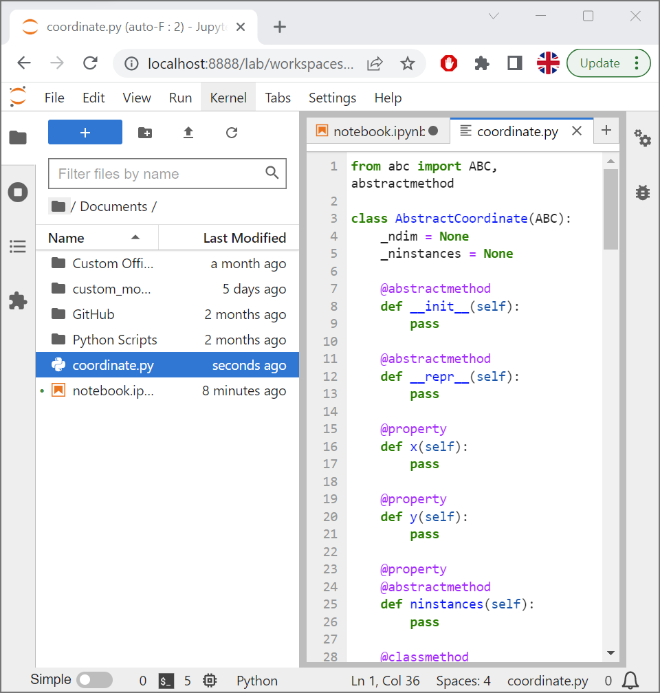

Then the class can be used as shown:

```
from coordinate import Coordinate
c1 = Coordinate(3, 4)
c1
c1.x
c2 = Coordinate.alternativeconstructor(5, 3)
c2 - c1
```

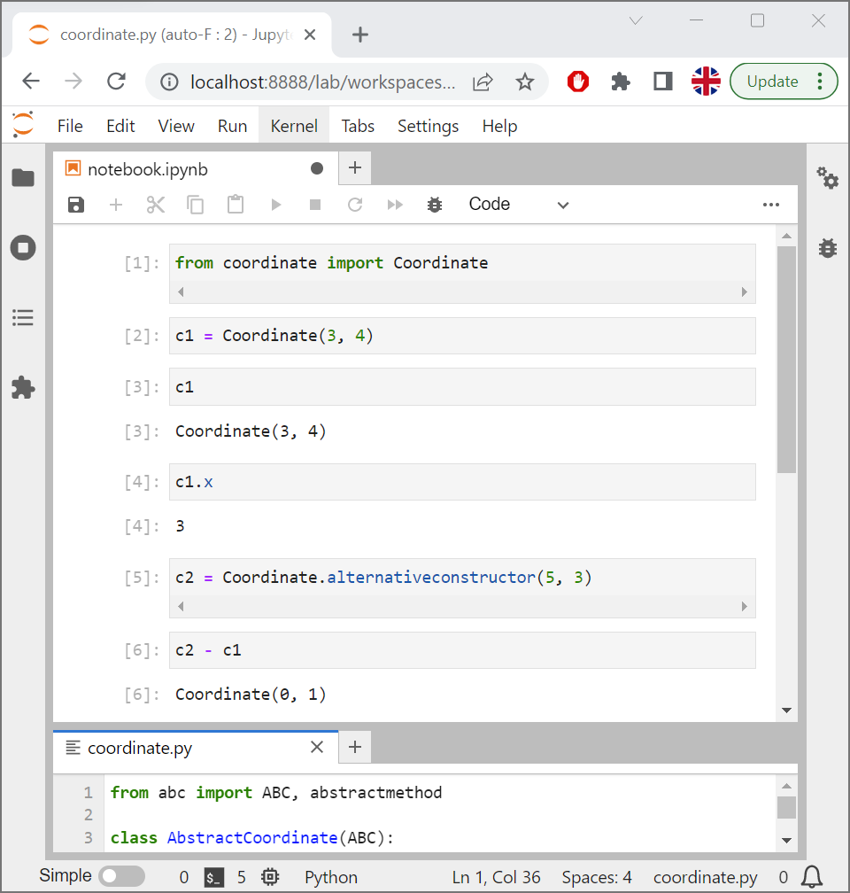

[Home Python Tutorials](https://github.com/PhilipYip1988/python-tutorials/blob/main/readme.md)