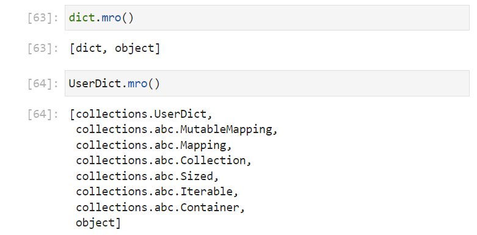

# Custom Classes

## Subclasses

The ```collections``` module has the classes ```UserString```, ```UserList``` and ```UserDict``` which are designed for subclassing. They can be imported using:

```
from collections import UserString, UserList, UserDict
```


The ```UserString``` class can be used directly. Its initialization signature can be accessed by inputting the class name ```UserString()``` and inputting shift ```⇧``` and tab ```↹```:


If ```UserString.``` is input followed by a tab ```↹```, a list of identifiers are available, that are identical to the ```str``` class:


The method resolution order identifier ```mro``` gives the method resolution order:


```
UserString.mro()
```


This is a ```list``` of class names. The top entry is the class itself and the bottom entry is the class ```object``` as every class in Python is ultimately an ```object```. The ```abc``` stands for abstract base classes. An abstract base class is not used directly but are used as parent classes. The name of these abstract base classes gives some of the properties of a ```UserString``` which recall is equivalent to the ```str``` class, i.e. that it has a container, is iterable, has a size, is a collection, is reversible and is a sequence.

```
UserList.mro()
```


If the ```mro``` of the ```UserList``` class is examined which recall is equivalent to the ```list``` class, the same abstract base classes show, in addition to ```MutableSequence``` which makes sense as a ```list``` has all of these properties in common with a ```str``` but is mutable.

```
UserDict.mro()
```


If the ```mro``` of the ```UserDict``` class is examined which recall is equivalent to the ```dict``` class, many of the same abstract base classes show, the ```dict``` is not a sequence i.e. has no numeric index, instead it has a mapping and is a mutable mapping.

An instance of ```UserString``` can be created using:

```
greeting = UserString('hello')
```

And any of the methods available for a string can be used:

```
greeting.upper()
```

Notice that all the mutable methods have a return value, in this case returning a new ```UserString``` instance:

```
greeting = UserString('hello')
greeting.upper()
type(greeting.upper())
```


Let's create a subclass with one additional method:

```
class CustomString(UserString):
    def plural(self):
        return self + 's'
```

The ```class``` keyword is used:


Followed by the class name which is in ```CamelCase```. ```CamelCase``` is used for all third-party classes:


The parenthesis contains the parent classes which are also known as the superclasses:


The colon ```:``` indicates the beginning fo a code block. all additional methods are nested within this code block:


A method is very similar to a function. It always has ```self``` as the first input argument:


```self``` is the conventional term and essentially means *this instance*.

The method is immutable and therefore has a return value, in this case using the ```+``` operator. The ```__add__``` data model method is defined in the parent class ```UserString``` so concatenation can be used:


The method resolution order of ```CustomString``` can now be examined:

```
CustomString.mro()
```

The list has ```CustomString``` at the top followed by all the entries which came from the parent class ```UserString```:


An instance can be created:

```
greeting = CustomString('hello')
```


If ```CustomClass.``` is input followed by a tab ```↹```, the list of identifiers displays, note the inclusion of the identifier ```plural```:


If its docstring is examined by inputting ```CustomClass.plural()``` followed by shift ```⇧``` and tab ```↹```, it requires the input argument ```self```. Recall that ```self``` can be thought of as meaning *this instance*. In this particular instance, the instance name is ```greeting```: 


```
CustomString.plural(greeting)
```


Supplying ```self``` means the method has access to the instance data which is the text ```'hello'```. The output returns the new ```UserString``` ```'hellos'```.

It is more common to call the method from the instance. If ```greeting.``` is input followed by a tab ```↹```, the list of identifiers displays, note the inclusion of the identifier ```plural```:


If its docstring is examined by inputting ```greeting.plural()``` followed by shift ```⇧``` and tab ```↹```. Notice omission of the input argument ```self```. Since the method is being called from *this instance* ```greeting```, ````self``` is already implied:


```
self.plural()
```


Implicitly supplying ```self``` by accessing the method from the instance, means the method has access to the instance data which is the text ```'hello'```. The output once again returns the new ```UserString``` ```'hellos'```.

The ```type``` of the instance and the return value from this method call can be checked using:

```
type(greeting)
type(greeting.plural())
```


In both cases they are ```CustomString``` instances as expected.

The following class can be defined with two additional methods:

```
class CustomString(UserString):
    def plural(self):
        return self + 's'
    
    def custom_upper(self):
        print('From class:')
        return self.upper()
    
    def custom_super_upper(self):
        print('From superclass:')
        return super().upper()


```

The method ```custom_upper``` calls the existing method ```upper``` from *this instance* ```self``` i.e. calling the method from the same class ```CustomString```:


The method ```custom_super_upper``` calls the existing method ```upper``` from *this instance of the superclass* i.e. calling the method as defined in the parent class ```UserString```:


Sometimes the above is more explicitly written as:

```
class CustomString(UserString):
    def plural(self):
        return self + 's'
    
    def custom_upper(self):
        print('From class:')
        return self.upper()
    
    def custom_super_upper(self):
        print('From superclass:')
        print(f'{super(CustomString, self)}')
        return super(CustomString, self).upper()


```


```super(CustomString, self)``` looks at the superclass of ```CustomString``` which is ```UserString``` and provides the parent class the parameter ```self```. Recall ```self``` was previously conceptualised as *this instance*. In the context of a superclass *self* can mean this *instance* or any *equivalent parent class instance*.

```super(CustomString, self)``` means *equivalent parent instance* and a method called from ```super(CustomString, self)``` is being called from an equivalent instance of the parent class. 

Usually the parent class and ```self``` are implicitly implied. Taken from the first positional argument supplied during the class definition and the first positional input argument from the method respectively:


```greeting``` can once again be instantiated:

```
greeting = CustomString('hello')
```


These methods can be compared:

```
greeting.upper()
```


```self``` means *this instance* and in this case the instance name is ```greeting``` which is assigned to the value ```'hello'``` which is printed:

```
greeting.custom_upper()
```


The superclass is being provided the name of the child class alongside an object or instance of the child class:

```
greeting.custom_super_upper()
```


In all the cases above a new instance of ```CustomString``` is returned:

```
type(greeting.upper())
type(greeting.custom_upper())
type(greeting.custom_super_upper())
```


Calling a method from an equivalent instance of the parent class allows slight modification of the equivalent method name in the child class. For example a simple print statement can be added. The class can be created with the ```upper``` method defined:

```
class CustomString(UserString):
    def plural(self):
        return self + 's'
    
    def upper(self):
        print('Shouting:')
        return super().upper()
    
```


```greeting``` can once again be instantiated:

```
greeting = CustomString('hello')
```

And the modified method called:

```
greeting.upper()
```


The method resolution order can be examined:

```
CustomString.mro()
```


The method ```upper``` is now defined in two places and this class ```CustomString``` will preference the definition closer towards the top of the method resolution order list i.e. the definition in ```CustomString```. In this case, the definition in ```CustomString``` uses the definition in ```UserString``` and builds upon it.

Let's create a ```list``` based subclass with one additional mutable method. Note that the mutable method has no return value as it mutates the list in place:

```
class CustomList(UserList):
    def append_hello(self):
        self.append('hello')


```


A new instance can be created using:

```
active = CustomList()
```


The list of identifiers can be viewed by inputting ```active.``` followed by a tab ```↹```:


Inputting ```active.append_hello()``` followed by a shift ```⇧``` and tab ```↹``` shows the docstring:


This method has no input arguments and can be called using:

```
active.append_hello()
```


Notice that calling this mutable method displays no output in the cell as it has no return statement. If the instance:

```
active
```

is examined, the value ```'hello'``` is appended:


Another method ```appendleft``` which behaves equivalently to its coutnerpart in the ```deque``` collection can be made using the ```list``` method ```insert```. If the docstring is viewed by typing in ````active.insert()``` followed by a shift ```⇧``` and tab ```↹```, this method has two input arguments ```index``` and ```value```:


For the ```appendleft``` method, the ```index``` is going to be locked to ```0``` however a single input argument ```value``` will need to be provided:

```
class CustomList(UserList):
    def appendleft(self, value):
        """Add an element to the left side of the CustomList"""
        self.insert(0, value)


```


Now an instance can be created:

```
active = CustomList(('a', 'b', 'c'))
```


The list of identifiers can be viewed by inputting ```active.``` followed by a tab ```↹```:


The docstring for the identifier ```appendleft``` can be viewed by inputting ```active.appendleft()``` followed by a shift ```⇧``` and tab ```↹``` and requests the input argument ```value```:


The ```active``` instance of ```CustomList``` can be examined:

```
active
```

Then the method ```appendleft``` can be used:

```
active.appendleft('hello')
```

This method is mutable so has no return value. The ```active``` instance of ```CustomList``` can be examined again using:

```
active
```

The value ```'hello'``` is appended as expected:


Other methods found in the ```deque``` could be made such as ```extendleft``` and ```popleft```:

```
class CustomList(UserList):
    def appendleft(self, value):
        """Add an element to the left side of the CustomList"""
        self.insert(0, value)
        
    def popleft(self):
        """Remove and return the leftmost element."""
        return self.pop(0) # pop has a return value
        
    def extendleft(self, seq):
        """Extend the left side of the CustomList with elements from the iterable"""
        for item in seq:
            self.appendleft(item)


```


These can be tested using:

```
active = CustomList([1, 2, 3])
active
active.popleft()
active
active.extendleft(('a', 'b', 'c'))
active
```


Notice the cell output:

```
active
```

This differs from:

```
repr(active)
str(active)
```


Normally the formal string representation shows how to instantiate a new instance. To change this the data model method ```__repr__``` needs to be defined:

```
class CustomList(UserList):
    def __repr__(self):
        string = super().__repr__()
        updatedstring = f'CustomList({string})'
        return updatedstring

    def appendleft(self, value):
        """Add an element to the left side of the CustomList"""
        self.insert(0, value)
        
    def popleft(self):
        """Remove and return the leftmost element."""
        return self.pop(0) # pop has a return value
        
    def extendleft(self, seq):
        """Extend the left side of the CustomList with elements from the iterable"""
        for item in seq:
            self.appendleft(item)


```


This can be tested with:

```
active = CustomList((1, 2, 3))
active
repr(active)
active2 = CustomList(('a', 'b', 'c'))
active2
repr(active2)
str(active2)
```


Notice the informal string has the same format as the formal string, this is the default case when ```__repr__``` is defined and ```__str__``` is not defined. For clarity ```__str__``` can be defined to something different:

```
class CustomList(UserList):
    def __repr__(self):
        string = super().__repr__()
        updatedstring = f'CustomList({string})'
        return updatedstring

    def __str__(self):
        string = super().__repr__()
        return string    
    
    def appendleft(self, value):
        """Add an element to the left side of the CustomList"""
        self.insert(0, value)
        
    def popleft(self):
        """Remove and return the leftmost element."""
        return self.pop(0) # pop has a return value
        
    def extendleft(self, seq):
        """Extend the left side of the CustomList with elements from the iterable"""
        for item in seq:
            self.appendleft(item)


```


This can be tested with:

```
active2 = CustomList(('a', 'b', 'c'))
active2
repr(active2)
str(active2)
```


If the method resolution order of the ```builtins``` objects are compared to their counterparts in the ```collections``` module:

```
str.mro()
UserString.mro()
```


Notice that the ```UserString``` has a much larger number of abstract base classes. Inclusion of the abstract base classes is a design pattern, that makes it easier for another Python programmer to identify what data model methods to expect in a third-party class. Looking at only the abstract base classes from bottom to top, the following relationship can be outlined:

|Abstract<br />Class|Abstract<br />Parent<br />Class|Abstract<br />Data<br />Model<br />Methods|Inherited<br />Data<br />Model<br />Methods|Abstract<br />Methods|Inherited<br />Abstract<br />Methods|
|---|---|---|---|---|---|
|Container||\_\_contains\_\_||||
|Iterable||\_\_iter\_\_||||
|Sized||\_\_len\_\_||||
|Collection|Container <br /> Iterable <br /> Sized||\_\_contains\_\_ <br /> \_\_iter\_\_ <br /> \_\_len\_\_|||
|Reversible|Iterable|\_\_reversed\_\_|\_\_iter\_\_|||
|Sequence|Reversible <br /> Collection|\_\_getitem\_\_|\_\_contains\_\_ <br /> \_\_iter\_\_ <br /> \_\_len\_\_ <br /> \_\_reversed\_\_|count <br /> index||

A ```Collection``` for example inherits everything from ```Container```, ```Iterable``` and ```Sized```.

A ```str``` is a ```Sequence``` and has all the immutable ```Sequence``` methods shown in the table above. 

A ```tuple``` is also a ```Sequence``` and has all the immutable ```Sequence``` methods shown in the table above which behave equivalently. i.e. the ```str``` and ```tuple``` classes behave consistently when it comes to indexing, slicing and looping over for example:

```
list.mro()
UserList.mro()
```


Notice that the ```UserList``` once again has a much larger number of abstract base classes. Most of these are the same however there is the inclusion of ```MutableSequence```:

|Abstract<br />Class|Abstract<br />Parent<br />Class|Abstract<br />Data<br />Model<br />Methods|Inherited<br />Data<br />Model<br />Methods|Abstract<br />Methods|Inherited<br />Abstract<br />Methods|
|---|---|---|---|---|---|
|Container||\_\_contains\_\_||||
|Iterable||\_\_iter\_\_||||
|Sized||\_\_len\_\_||||
|Collection|Container <br /> Iterable <br /> Sized||\_\_contains\_\_ <br /> \_\_iter\_\_ <br /> \_\_len\_\_|||
|Reversible|Iterable|\_\_reversed\_\_|\_\_iter\_\_|||
|Sequence|Reversible <br /> Collection|\_\_getitem\_\_|\_\_contains\_\_ <br /> \_\_iter\_\_ <br /> \_\_len\_\_ <br /> \_\_reversed\_\_|count <br /> index||
|MutableSequence|Sequence|\_\_iadd\_\_ <br /> \_\_setitem\_\_ <br /> \_\_delitem\_\_|\_\_contains\_\_ <br /> \_\_getitem\_\_ <br /> \_\_iter\_\_ <br /> \_\_len\_\_ <br /> \_\_reversed\_\_|append <br /> extend <br /> insert <br /> pop <br /> remove <br /> reverse|count <br /> index|

A ```list``` is a ```MutableSequence``` and inherits all the immutable methods from the ```Sequence```, therefore as seen previously equivalent methods between a ```tuple``` and a ```list``` behave identically. The ```list``` also has all the mutable ```MutableSequence``` methods shown in the table above.

```
dict.mro()
UserDict.mro()
```



Notice that the ```UserDict``` once again has a much larger number of abstract base classes:

|Abstract<br />Class|Abstract<br />Parent<br />Class|Abstract<br />Data<br />Model<br />Methods|Inherited<br />Data<br />Model<br />Methods|Abstract<br />Methods|Inherited<br />Abstract<br />Methods|
|---|---|---|---|---|---|
|Container||\_\_contains\_\_||||
|Iterable||\_\_iter\_\_||||
|Sized||\_\_len\_\_||||
|Collection|Container <br /> Iterable <br /> Sized||\_\_contains\_\_ <br /> \_\_iter\_\_ <br /> \_\_len\_\_|||
|Mapping|Collection|\_\_getitem\_\_|\_\_contains\_\_ <br /> \_\_eq\_\_ <br /> \_\_iter\_\_ <br /> \_\_len\_\_ <br /> \_\_ne\_\_ <br />|get<br />  items<br />  keys<br />  values||
|MutableMapping|Mapping|\_\_delitem\_\_ <br />  \_\_setitem\_\_|\_\_contains\_\_ <br /> \_\_eq\_\_ <br /> \_\_getitem\_\_  <br />\_\_iter\_\_ <br /> \_\_len\_\_ <br /> \_\_ne\_\_ <br />|clear <br /> pop <br />  popitem <br /> setdefault <br />  update|get<br />  items<br />  keys<br />  values|

The ```dict``` is not a ```Mapping```. Notice that both the ```Sequence``` and ```Mapping``` inherit from the ```Collection``` which is why there is some consistent behaviour between a ```dict``` and a ```tuple``` for example. A ```Sequence``` has a numeric index, whereas a ```Mapping``` has keys, both of these use the ```__getitem__``` data model method but it is defined differently.

Sticking to the design patterns above makes it easier for another Python programmer to use the third-party class.

Another set of abstract base classes are available in the ```numbers``` module for the numeric data types:

```
import numbers
```


Integral - integer

Real - float


Rational


Complex

Number


