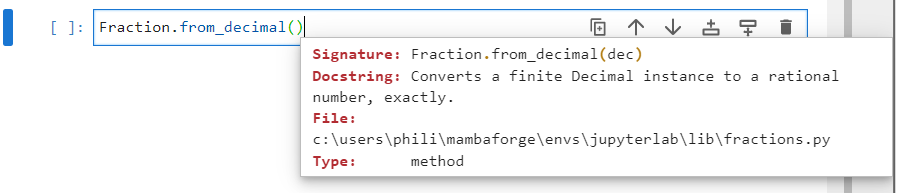
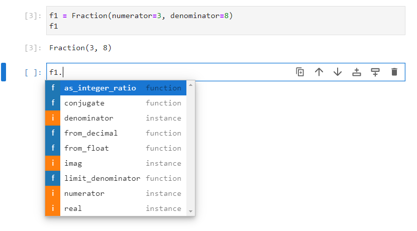
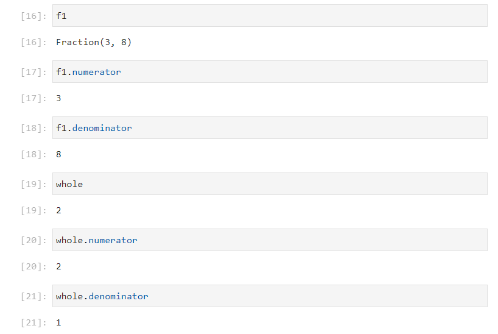
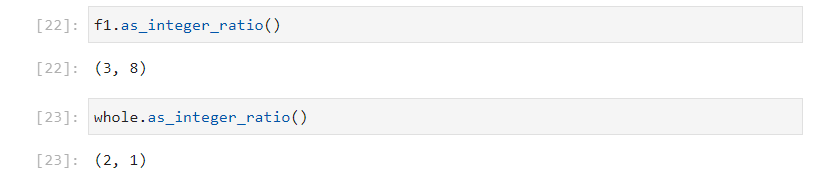
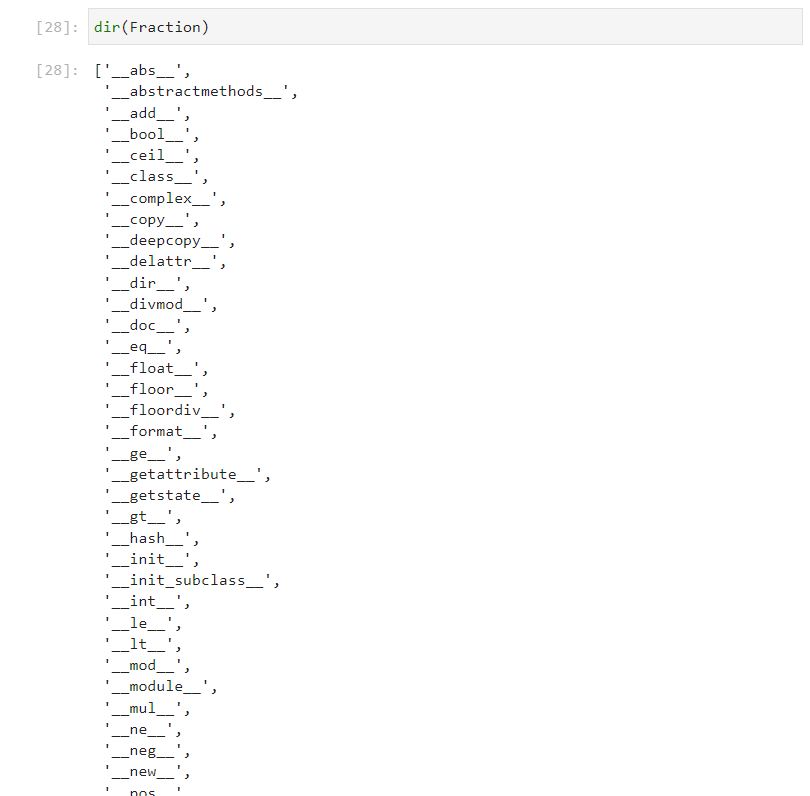
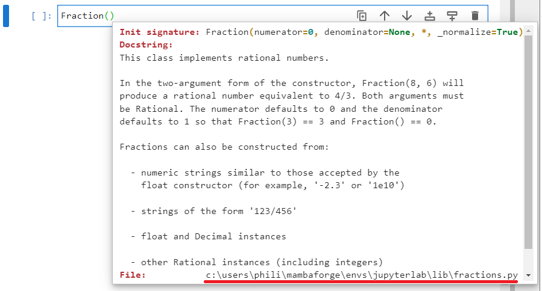

# The Fractions Module

The ```fractions``` module can be imported using:

```
import fractions
```


Once imported, the list of identifiers from the ```fractions``` module can be viewed by inputting ```fractions.``` followed by a tab ```↹```:


The ```fraction``` modules docstring can be viewed by inputting:

```
? fractions
```


However the docstring isn't too detailed.

Normally only the ```Fraction``` class is used from the ```fractions``` module, so it is more common to import it directly using:

```
from fractions import Fraction
```

Note the module has a plural name and is lower case. The classes name is upper case and singular.


The initialization signature of the ```Fraction``` class can be viewed by inputting ```Fraction()``` followed by inputting shift ```⇧``` and tab ```↹```:


Typically, the keyword arguments ```numerator``` and ```denominator``` are supplied and assigned to integers.

The fraction $\text{f1}=\frac{3}{8}$ can be created using:

```
f1 = Fraction(numerator=3, denominator=8)
f1
```

If the numerator and the denominator have a common factor, they will be normalized. For example $\text{f2}=\frac{4}{8}$:

```
f2 = Fraction(numerator=4, denominator=8)
f2
```

Sometimes for clarity, this behaviour is not desired and the additional keyword argument ```_normalize``` can be assigned to ```False```:

```
f3 = Fraction(numerator=4, denominator=8, _normalize=False)
f3
```


It is also possible to construct a fraction using a string of the form ```'numerator/denominator'``` for example $\text{f4}=\frac{7}{8}$:

```
f4 = Fraction(numerator='7/8')
f4
```


It is also possible to cosntruct a fraction from a floating point number, although care should be taken due to floating point precision rounding errors:

```
f5 = Fraction(numerator=0.1)
f5
```


The ```Decimal``` class as previously discussed is more accurate and less prone to precision roundng errors:

```
from decimal import Decimal
f6 = Fraction(numerator=Decimal('0.1'))
f6
```


The ```Decimal``` class found in the    ```fractions``` module is identical to the ```Decimal``` class found in the ```decimal``` module and is placed in the ```fractions``` module for convenience:

```
from fractions import Fraction, Decimal
f7 = Fraction(numerator=Decimal('0.1'))
f7
```


For convenience a string which contains a number with a decimal point will itnernally be converted into a ```Decimal``` instance, so the above code can be simplified:

```
f8 = Fraction(numerator='0.1')
f8
```


The ```Decimal``` class does still however have some susception to precision rounding errors:

```
f9 = Fraction(numerator='0.3333333333')
f9
```


The list of identifiers from the ```fraction``` instance ```f1``` can be viewed by inputting ```f1.``` followed by a tab ```↹```:


The method, ```limit_denominator``` can be used to set a ```max_denominator```. This can be used to compensate for most ```float``` or ```decimal``` recursion errors:

```
f9.limit_denominator(max_denominator=100)
```


```from_float``` and ```from_decimal``` are class methods which are used for alternative constructors:




The following is equivalent:

```
f5 = Fraction(numerator=0.1)
f5
f5 = Fraction.from_float(0.1)
f5
```

```
f7 = Fraction(numerator=Decimal('0.1'))
f7
f7 = Fraction.from_decimal(Decimal('0.1'))
f7
```


An ```int``` instance can be created:

```
whole = 2
```


The list of identifiers from the ```int``` instance ```whole``` can be viewed by inputting ```whole.``` followed by a tab ```↹```:


Notice the similarity between the identifiers available in a ```Fraction``` instance:



An ```int``` instance has the attributes ```numerator``` and ```denominator```. This means the ```int``` is recognised as a fraction when it comes to fraction arithmetic. The ```numerator``` in an ```int``` instance is always the value of the integer and the ```denominator``` is always ```1```:

```
f1
f1.numerator
f1.denominator
whole
whole.numerator
whole.denominator
```



The method ```as_integer_ratio``` will display a tuple of the form ```(numerator, denominator)```:

```
f1.as_integer_ratio()
whole.as_integer_ratio()
```



The attributes ```real```, ```imag``` and method ```conjugate``` are for complex numbers. However all Fractions are rational:


Therefore the ```real``` atribute is the value of the fraction instance, the ```imag``` attribute is ```0``` and the complex conjugate is unchanged as there is no imaginary component:

```
f1
f1.real
f1.imag
f1.conjugate()
```


If the directory of the ```Fraction``` class is examined using:

```
dir(Fraction)
```

Most of the numeric datamodel methods are defined:



These can be used on the instances ```f1```, ```f2``` and ```whole```:


The initialization signature of the ```Fraction``` class can be viewed by inputting ```Fraction()``` followed by inputting shift ```⇧``` and tab ```↹```. At the bottom of this docstring the location of the ```fractions.py``` file displays:



In my case, on a Windows or Linux the file is in:

```
%UserProfile%\mambaforge\envs\jupyterlab\Lib
~/mambaforge/envs/jupyterlab/lib/python3.11/
```


This is a useful file to read through as it shows an example of the implementation of the datamodel methods:


At the top of the file is the ```__new__``` datamodel method, the class methods ```from_float``` and ```from_decimal```, the methods ```as_integer_ratio``` and ``````limit_denominator``` and the configuation of ```numerator``` and ```denominator``` as properties. These have all previously been used and it is worthwhile examining how they are coded in the class itself.

The datamodel methods formal ```__repr__``` and formal ```__str__``` datamodel methods are setup so the ```repr``` function and ```str``` functions can be used on a fraction instance. The cell output also displays the formal representation and the content of the formal representation looks identical to what is input to instantiate a new ```fraction``` instance while the ```print``` function prints the informal representation. This is the expected behaviour when both ```__repr__``` and ```__str__``` are setup:

```
repr(f1)
f1
str(f1)
print(f1)
```


The datamodel ```__add__``` is setup using a method ```_add``` so addition of two ```fraction``` instances can be calculated using the ```+``` operator. This also works between an ```int``` instance:

$$\text{f1}+\text{f2}+\text{whole}=\frac{3}{8}+\frac{1}{2}+2=\frac{3\ast2}{8\ast2}+\frac{1\ast8}{2\ast8}+\frac{2\ast2\ast8}{1\ast2\ast8}=\frac{6}{16}+\frac{8}{16}+\frac{32}{16}=\frac{46}{16}=\frac{23}{8}$$

```
f1 + f2 + whole
```


The datamodel ```__sub__``` is setup using a method ```_sub``` so subtraction of two ```fraction``` or ```int``` instances can be calculated using the ```-``` operator:


$$\text{f1}+\text{f2}+\text{whole}=\frac{3}{8}-\frac{1}{2}+2=\frac{3\ast2}{8\ast2}-\frac{1\ast8}{2\ast8}+\frac{2\ast2\ast8}{1\ast2\ast8}=\frac{6}{16}-\frac{8}{16}+\frac{32}{16}=\frac{30}{16}=\frac{15}{8}$$

```
f1 - f2 + whole
```


The datamodel ```__mul__``` is setup using a method ```_mul``` so multiplication of two ```fraction``` or ```int``` instances can be calculated using the ```-``` operator:

$$\text{f1}\ast\text{f2}\ast\text{whole}=\frac{3}{8}\ast\frac{1}{2}\ast2=\frac{3}{8}\ast\frac{1}{2}\ast\frac{2}{1}=\frac{3\ast1\ast2}{8\ast2\ast1}=\frac{6}{16}=\frac{3}{8}$$

```
f1 * f2 * whole
```


The datamodel ```__div__``` is setup using a method ```_div``` so division of two ```fraction``` or ```int``` instances can be calculated using the ```/``` operator:


$$\text{f2}/\text{f1}=\frac{1}{2}/\frac{3}{8}=\frac{1}{2}\ast\frac{8}{3}=\frac{1\ast8}{2\ast3}=\frac{8}{6}=\frac{4}{3}$$

```
f2 / f1
```


The datamodel ```__floordiv__``` is setup using a method ```_floordiv``` so division of two ```fraction``` or ```int``` instances can be calculated using the ```//``` operator:

$$\text{f2}//\text{f1}=\frac{1}{2}//\frac{3}{8}=1\ast8//2\ast3=8//6=1$$

```
f2 // f1
```


The datamodel ```__mod__``` is setup using a method ```_mod``` so the modulus of two ```fraction``` or ```int``` instances can be calculated using the ```%``` operator. This calculation may be different from what you may expect, see the ```fractions.py``` file for more details:

$$\text{f2}\text{﹪}\text{f1}=\frac{1}{2}\text{﹪}\frac{3}{8}=\frac{1\ast8\text{﹪}3\ast2}{2\ast8}=\frac{8\text{﹪}6}{16}=\frac{2}{16}=\frac{1}{8}$$

```
f2 % f1
```


The datamodel ```__divmod__``` is setup using a method ```_divmod``` which means the ```divmod``` function can be used. ```divmod(f2, f1)``` gives a tuple of ```(f2 // f1, f2 % f1)```:

```
divmod(f2, f1)
```


The datamodel ```__pow__``` is setup so multiplication of two ```fraction``` or ```int``` instances is calculated using the ```**``` operator:

$$\text{f1}\ast\ast \text{whole}=\frac{3}{8}\ast\ast2=\frac{3\ast\ast2}{8\ast\ast2}=\frac{3\ast3}{8\ast8}=\frac{9}{64}$$


The unitary datamodel methods ```__pos__``` and ```__neg__``` are setup so the positive and negative value of an instance can be calculated using the ```-``` and ```+``` operators. The ```-``` negates the numerator while the ```+``` leaves the numerator unchanged:

```
+f1
-f1
```


The datamodel ```__abs__``` is setup so the absolute value of an instance can be calculated using the ```abs``` function:

```
abs(-f1)
```


The datamodel ```__int__ ``` is setup so a fraction instance can be cast into a ```int``` using:

```
f3 = f1 + whole
f3
int(f3)
```


The datamodel ```__float__``` is not implicitly setup but is explictly available. This means a ```fraction``` instance can be cast to a ```float``` using:

```
float(f3)
```


Casting to an ```int``` effectively truncates the numbers past the decimal point, returning only the integer component. Because this ```float``` the floor integer this is also known as the floor, it is also possible to get the next integer which is known as the ceiling.

The datamodel methods ```__trunc__```, ```__floor__``` and ```__ceil__``` are setup so ```math.trunc```, ```math.floor``` and ```math.ceil``` can be used. 
 
Truncating and casting to an int behave identically for positive and negative numbers. 

```
from math import trunc, floor, ceil
trunc(f3)
trunc(-f3)
floor(f3)
floor(-f3)
ceil(f3)
ceil(-f3)
```


The datamodel ```__round__ ``` is setup so a ```fraction``` instance can be rounded using the ```round``` function. Using the default ```ndigits=None``` will cast it to the nearest integer returning an ```int```. If ```ndigits``` is specified, another ```fraction``` instance will be returned:

```
round(f3)
round(f3, ndigits=1)
round(f3, ndigits=2)
```


The ```__eq__```, ```__ne__``` (is explicitly implied from ```__eq__```), ```__lt__```, ```__le__```, ```__gt__```, ```__ge__``` datamodel methods are setup which means the 6 comparison operators ```==```, ```!=```, ```<```, ```<=```, ```>```, ```>=``` can be used between two ```fraction``` or ```int``` instances:

```
f1
f2
whole
f1 > f2
f1 < f2
whole <= f1
```


The method ```__bool__``` is setup which means the fraction can be cast into a boolean value using ```bool```. The boolean value will be ```True``` for any non-zero numerator and ```False``` for a zero numerator:

```
f1
bool(f1)
f4 = Fraction(numerator=0, denominator=8)
f4
bool(f4)
```


Finally the methods ```__copy__``` and ```__deepcopy__``` are setup so a shallow copy and a deep copy of the fraction can be made:

```
from copy import copy, deepcopy
f1
f1_sc = copy(f1)
f1_sc
f1_dc = deepcopy(f1)
f1_dc
```


Return to:
[Home](../../../)