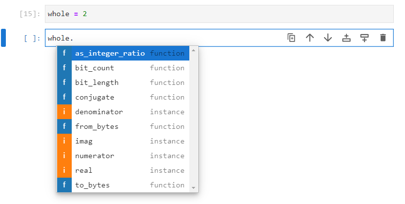
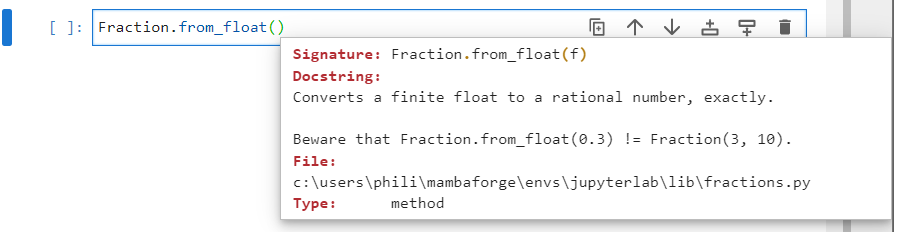
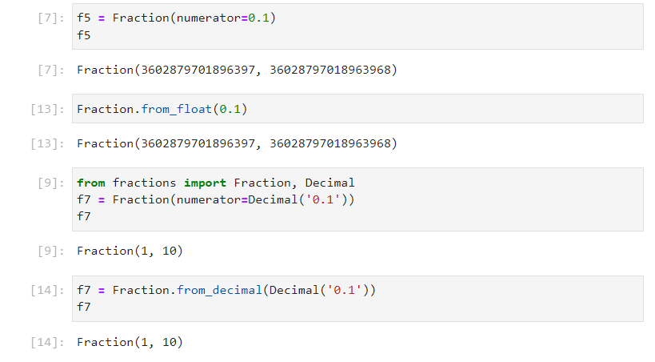
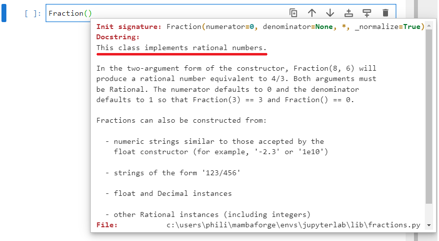
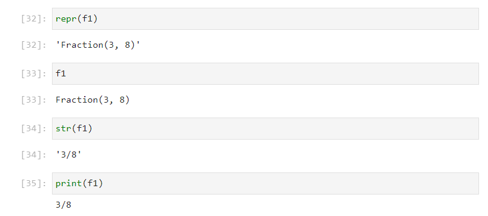

# The Fractions Module

The ```fractions``` module can be imported using:

```
import fractions
```


Once imported, the list of identifiers from the ```fractions``` module can be viewed by inputting ```fractions.``` followed by a tab ```↹```:


The ```fraction``` modules docstring can be viewed by inputting:

```
? fractions
```


However the docstring isn't too detailed.

Normally only the ```Fraction``` class is used from the ```fractions``` module, so it is more common to import it directly using:

```
from fractions import Fraction
```

Note the module has a plural name and is lower case. The classes name is upper case and singular.


The initialization signature of the ```Fraction``` class can be viewed by inputting ```Fraction()``` followed by inputting shift ```⇧``` and tab ```↹```:


Typically, the keyword arguments ```numerator``` and ```denominator``` are supplied and assigned to integers.

The fraction $\text{f1}=\frac{3}{8}$ can be created using:

```
f1 = Fraction(numerator=3, denominator=8)
f1
```

If the numerator and the denominator have a common factor, they will be normalized. For example $\text{f2}=\frac{4}{8}$:

```
f2 = Fraction(numerator=4, denominator=8)
f2
```

Sometimes for clarity, this behaviour is not desired and the additional keyword argument ```_normalize``` can be assigned to ```False```:

```
f3 = Fraction(numerator=4, denominator=8, _normalize=False)
f3
```


It is also possible to construct a fraction using a string of the form ```'numerator/denominator'``` for example $\text{f4}=\frac{7}{8}$:

```
f4 = Fraction(numerator='7/8')
f4
```


It is also possible to cosntruct a fraction from a floating point number, although care should be taken due to floating point precision rounding errors:

```
f5 = Fraction(numerator=0.1)
f5
```


The ```Decimal``` class as previously discussed is more accurate and less prone to precision roundng errors:

```
from decimal import Decimal
f6 = Fraction(numerator=Decimal('0.1'))
f6
```


The ```Decimal``` class found in the    ```fractions``` module is identical to the ```Decimal``` class found in the ```decimal``` module and is placed in the ```fractions``` module for convenience:

```
from fractions import Fraction, Decimal
f7 = Fraction(numerator=Decimal('0.1'))
f7
```


For convenience a string which contains a number with a decimal point will itnernally be converted into a ```Decimal``` instance, so the above code can be simplified:

```
f8 = Fraction(numerator='0.1')
f8
```


The ```Decimal``` class does still however have some susception to precision rounding errors:

```
f9 = Fraction(numerator='0.3333333333')
f9
```


The list of identifiers from the ```fraction``` instance ```f1``` can be viewed by inputting ```f1.``` followed by a tab ```↹```:


The method, ```limit_denominator``` can be used to set a ```max_denominator```. This can be used to compensate for most ```float``` or ```decimal``` recursion errors:

```
f9.limit_denominator(max_denominator=100)
```


```from_float``` and ```from_decimal``` are class methods which are used for alternative constructors:




The following is equivalent:

```
f5 = Fraction(numerator=0.1)
f5
f5 = Fraction.from_float(0.1)
f5
```

```
f7 = Fraction(numerator=Decimal('0.1'))
f7
f7 = Fraction.from_decimal(Decimal('0.1'))
f7
```


An ```int``` instance can be created:

```
whole = 2
```


The list of identifiers from the ```int``` instance ```whole``` can be viewed by inputting ```whole.``` followed by a tab ```↹```:



Notice the similarity between the identifiers available in a ```Fraction``` instance:


An ```int``` instance has the attributes ```numerator``` and ```denominator```. This means the ```int``` is recognised as a fraction when it comes to fraction arithmetic. The ```numerator``` in an ```int``` instance is always the value of the integer and the ```denominator``` is always ```1```:

```
f1
f1.numerator
f1.denominator
whole
whole.numerator
whole.denominator
```


The method ```as_integer_ratio``` will display a tuple of the form ```(numerator, denominator)```:

```
f1.as_integer_ratio()
whole.as_integer_ratio()
```



The attributes ```real```, ```imag``` and method ```conjugate``` are for complex numbers. However all Fractions are rational:



Therefore the ```real``` atribute is the value of the fraction instance, the ```imag``` attribute is ```0``` and the complex conjugate is unchanged as there is no imaginary component:


If the directory of the ```Fraction``` class is examined using:

```
dir(Fraction)
```

Most of the numeric datamodel methods are defined:


These can be used on the instances ```f1```, ```f2``` and ```whole```:


The datamodel methods formal ```__repr__``` and formal ```__str__``` datamodel methods are setup so the ```repr``` function and ```str``` functions can be used on a fraction instance. The cell output also displays the formal representation and the content of the formal representation looks identical to what is input to instantiate a new ```fraction``` instance while the ```print``` function prints the informal representation. This is the expected behaviour when both ```__repr__``` and ```__str__``` are setup:

```
repr(f1)
f1
str(f1)
print(f1)
```


The datamodel methods ```__neg__``` and ```__pos__``` are setup so the positive and negative value of an instance can be carried out using the ```-``` and ```+``` operators. The ```-``` negates the original value while the ```+``` leaves the value unchanged:

```
-f1
+f1
```


The datamodel ```__abs__``` is setup so the absolute value of an instance can be found out using the ```abs``` function:

```
-abs(-f1)
```

The datamodel ```__float__ ``` is setup so a fraction instance can be cast into a ```float``` using:

```
float(f1)
```


This will also casting to an ```int``` which truncates this ```float```:

```
int(f1)
```


The datamodel ```__round__ ``` is setup so a ```fraction``` instance can be rounded using the ```round``` function, this will cast the ```fraction``` instance to a ```float``` instance:

```
round(f1)
round(f1, ndigits=1)
round(f1, ndigits=2)
```


The datamodel methods ```__floor__``` and ```__ceil__``` are setup so a fraction instance can be used with the ```math.floor``` and ```math.ceil``` functions:

```
from math import floor, ceil
floor(f1)
ceil(f1)
```


The datamodel ```__add__``` is setup so addition of two ```fraction``` instances is calculated using the ```+``` operator. This also works between an ```int``` instance:

$$\text{f1}+\text{f2}+\text{whole}=\frac{3}{8}+\frac{1}{2}+2=\frac{3\ast2}{8\ast2}+\frac{1\ast8}{2\ast8}+\frac{2\ast2\ast8}{1\ast2\ast8}=\frac{6}{16}+\frac{8}{16}+\frac{32}{16}=\frac{46}{16}=\frac{23}{8}$$

```
f1 + f2 + whole
```


$$\text{f1}+\text{f2}+\text{whole}=\frac{3}{8}-\frac{1}{2}+2=\frac{3\ast2}{8\ast2}-\frac{1\ast8}{2\ast8}+\frac{2\ast2\ast8}{1\ast2\ast8}=\frac{6}{16}-\frac{8}{16}+\frac{32}{16}=\frac{30}{16}=\frac{15}{8}$$

The datamodel ```__sub__``` is setup so subtraction of two ```fraction``` or ```int``` instances  is calculated using the ```-``` operator:

```
f1 - f2 + whole
```


The datamodel ```__mul__``` is setup so multiplication of two ```fraction``` or ```int``` instances  is calculated using the ```-``` operator:

$$\text{f1}\ast\text{f2}\ast\text{whole}=\frac{3}{8}\ast\frac{1}{2}\ast2=\frac{3}{8}\ast\frac{1}{2}\ast\frac{2}{1}=\frac{3\ast1\ast2}{8\ast2\ast1}=\frac{6}{16}=\frac{3}{8}$$

```
f1 * f2 * whole
```


The datamodel ```__div__``` is setup so division of two ```fraction``` or ```int``` instances  is calculated using the ```/``` operator:


$$\text{f2}/\text{f1}=\frac{1}{2}/\frac{3}{8}=\frac{1}{2}\ast\frac{8}{3}=\frac{1\ast8}{2\ast3}=\frac{8}{6}=\frac{4}{3}$$

```
f2 / f1
```



The datamodel ```__floordiv__``` is setup so division of two ```fraction``` or ```int``` instances  is calculated using the ```//``` operator:

$$\text{f2}//\text{f1}=\frac{1}{2}//\frac{3}{8}=1\ast8//2\ast3=8//6=1$$


```
f2 // f1
```


The datamodel ```__mod__``` is setup so the modulus of two ```fraction``` or ```int``` instances  is calculated using the ```%``` operator. Note this is calculated using the following:

$$\text{f2}\text{﹪}\text{f1}=\frac{1}{2}\text{﹪}\frac{3}{8}=\frac{1\ast8\\text{﹪}3\ast2}{2\ast8}=\frac{8\text{﹪}6}{16}=\frac{2}{16}=\frac{1}{8}$$

The datamodel ```__divmod__``` is setup which means the ```divmod``` function can be used. ```divmod(f2, f1)``` gives a tuple of ```(f2 // f1, f2 % f1)```:

```
divmod(f2, f1)
```


The ```__eq__```, ```__ne__```, ```__lt__```, ```__le__```, ```__gt__```, ```__ge__``` datamodel methods are setup which means the 6 comparison operators ```==```, ```!=```, ```<```, ```<=```, ```>```, ```>=``` can be used between two ```fraction``` or ```int``` instances:

```
f1 > f2
f2 < f1
whole > f1
```


