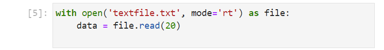

# The Operating System Module

## Text Files

A text file can be created in the same folder as the Interactive Python Ntoebook File:


The following text can be added to it:

```
Baa, baa, black sheep,
Have you any wool?
Yes, sir, yes, sir,
Three bags full.

One for my master,
One for my dame,
And one for the little boy
Who lives down the lane.
```


Text files can be viewed in Notepad++ with View → Show Symbol → Show All Characters:


Text files are opened in Python by using the ```open``` function. The docstring can be viewed by inputting ```open()``` and pressing shift ```⇧``` and tab ```↹```:


The ```open``` function requires a file which can be specified directly when it is in the same folder as the interactive Python notebook file (or Python script file).

The ```mode``` keyword input argument can be specified using a single letter:

|mode|definition|
|---|---|
|'r'|open an existing file and read existing content|
|'w'|open an existing file and write over existing content|
|'a'|open an existing file and append new content|
|'x'|create a new file and write new content|

A second letter can also be used for the encoding. The encoding can be ```'t'``` text (default) which is also known as ```UTF-8``` or ```'b'``` binary which is known as ```'ASCII'```. 

```mode=rt``` for example is the default which reads a text file encoded as text ('ASCII'). 

For other encoding schemes, the ```encoding``` keyword argument is seperately used. For a CSV file created in Microsoft Excel, the ```'UTF-8-Sig'``` encoding needs to be used to properly handle the BOM. The other encoding schemes available were previously discussed in the text data types tutorial. 

|encoding|bit|bytes|byte order|BOM|
|---|---|---|---|---|
|'ASCII'|1|8| |---|
|'Latin1'|1|8| | |
|'UTF-16-LE'|2|16|little endian| |
|'UTF-16-BE'|2|16|big endian| |
|'UTF-16'|2|16| |BOM|
|'UTF-32-LE'|4|32|little endian| |
|'UTF-32-BE'|4|32|big endian| |
|'UTF-32'|4|32| |BOM|
|'UTF-8'|1-4|adaptive|1-4 adaptive| |
|'UTF-8-Sig'|1-4|adaptive|1-4 adaptive|BOM|

The ```newline``` keyword input argument can be used to specify the character that is used to represent a new line. In Python the escape characters ```\r\n``` are used to represent this which is the default.

A file is normally accessed using a ```with``` code block which opens the file and automatically closes it as the code block is exited:

```
with open('textfile.txt', mode='rt') as file:
    pass

```

A number of identifiers from the file object can be viewed by inputting ```file.``` and pressing tab ```↹```:


```name```, ```mode```, ```encoding```, ```errors``` and ```closed``` are attributes.

```
with open('textfile.txt', mode='rt') as file:
    print(file.name)
    print(file.mode)
    print(file.encoding)
    print(file.errors)
    print(file.closed)


file.closed
```


```readable```, ```writeable``` and ```seekable``` are method which return a ```bool```:

```
with open('textfile.txt', mode='rt') as file:
    print(file.readable())
    print(file.writable())
    print(file.seekable())
    
```


The ```read``` method can read all the text from a file as a multi-line string:

```
with open('textfile.txt', mode='rt') as file:
    data = file.read()
    
```


The ```size``` input argument has a default value of ```-1``` meaning all the text is read. A custom ```size``` can be supplied positionally only to read up to a maximum ```size``` of characters:

```
with open('textfile.txt', mode='rt') as file:
    data = file.read(20)
    
```




The ```readline``` method will read text up to and including the next ```'\n'``` Unicode whitespace character:

```
with open('textfile.txt', mode='rt') as file:
    data = file.readline()
    
```


The ```readlines``` method will output a list of strings. Similar to ```readline``` each string will read text up to and including the next ```\n``` Unicode whitespace character:

```
with open('textfile.txt', mode='rt') as file:
    data = file.readlines()
    
```


The file can be conceptualised as one long multi-line Unicode string. Each Unicode character has a zero-order index where the first Unicode character has an index value of ```0``` and the cursors index can be changed using ```seek```. Index ```10``` is equivalent to the following character:


Moving the cursor to index 10 using the method ```seek``` and then using ```readline``` will read from the cursor at index position 10 up to and including the next ```\n``` Unicode whitespace character:

```
with open('textfile.txt', mode='rt') as file:
    file.seek(10)
    data = file.readline()
```


A ```file``` object is more similar to a multi-line Unicode string than an iterator of a multi-line string and it is possible to go back, for example using the method ```seek``` to return the cursor to index ```5```:


```
with open('textfile.txt', mode='rt') as file:
    file.seek(10)
    data = file.readline()
    file.seek(5)
    data2 = file.readline()

```


When using the method ```seek``` care should be taken to ensure that the whitespace character ```'\n'``` shown as line feed in Notepad++ is included itself:


```
with open('textfile.txt', mode='rt') as file:
    file.seek(22)
    data = file.read()

```


Notice this string begins with a ```'\n'```.


The file can be opened using the mode ```at``` which stands for append text. When appended, the cursor position is automatically at the end of the file:


The ```write``` function can be used to write additional text to the file:

```
with open('textfile.txt', mode='at') as file:
    file.write('Hello World')

```


There is no ```writeline``` method and instead the whitespace ```'\n'``` needs to be added manually:

```
with open('textfile.txt', mode='at') as file:
    file.write('\nHello World')
    
```


The ```writelines``` method can be used to write a list of lines:

```
with open('textfile.txt', mode='at') as file:
    file.writelines(['Text.',
                     'Text2.',
                     'Text3.'])
    
```    


Once again the new line line whitespace character needs to be explicitly specified ```'\n'```.

A new text file can be created with writeable access using the mode ```'xt'```:

```
with open('textfile2.txt', mode='xt') as file:
    file.write('a\n')
    file.write('b\n')
    file.write('c\n') 
    
```


The file is displayed in the file explorer:


Notice when the file is opened in Notepad++ there are actually two characters displayed for the new line, the carriage return and the line feed:


There is a subtle difference in lines ending in line feed and carriage return and lines only ending in line feed. The default behaviour of a newline can be disabled by assigning it to an empty string. This means both ```'\r\n'``` and ```'\n'``` can be specified:

```
with open('textfile3.txt', mode='xt', newline='') as file:
    file.write('a\n') # new line
    file.write('b\r\n') # carriage return & line feed
    file.write('c\r') # line feed
    
```


Compare this to the default behaviour:

```
with open('textfile4.txt', mode='xt') as file:
    file.write('a\n') # new line
    file.write('b\r\n') # carriage return & line feed
    file.write('c\r') # line feed
    
```


The subtle differences here can influence the length of the strings which can be seen when the ```repr``` of the retrieved data is seen in the cell output:

```
with open('textfile2.txt', mode='rt', newline='') as file:
    data = file.read()

data
len(data)
```


```
with open('textfile3.txt', mode='rt', newline='') as file:
    data = file.read()

data
len(data)
```


This also changes the length of the string for each string in the list of strings when readlines is used:

```
with open('textfile2.txt', mode='rt', newline='') as file:
    data = file.readlines()

data
```


```
with open('textfile2.txt', mode='rt', newline='') as file:
    data = file.readlines()

data
```


Differences in this whitespace will also influence the index position used for the method ```seek```.

For this reason, ```readlines``` is often preferred as list comprehension can be used with the ```str``` method ```strip``` which by default strips the whitespace. ```str``` concatenation can also be used in the list comprehension to have a consistent line ending if desired:

```
data
[line.strip() for line in data]
[line.strip() + '\n' for line in data]
[line.strip() + '\r\n' for line in data]
```


write mode ...


write
writelines


write_through

truncate


 within a ```with``` code block:


