# The Random Module

The random module is used to select a pseudo random from a collection such as a list or an underlying distribution.

It can be imported using:

```
import random
```

And details about the available distributions can be seen by looking at the docstring:

```
? random
```

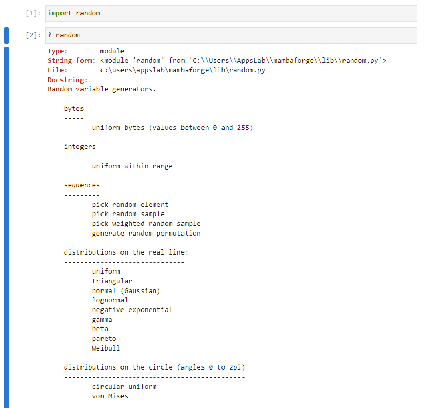

The random module has a number of identifiers which can be accessed by inputting ```random.``` followed by a tab ```↹```:

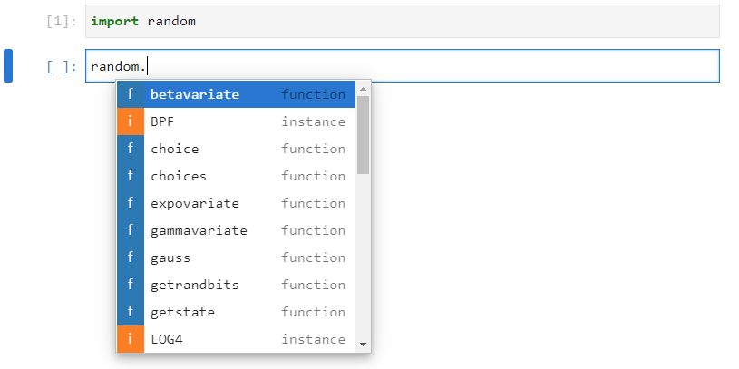

Before looking at any distributions, let's construct a list of values:

```
nums = [1, 3, 5, 7, 9]
```


The ```choice``` function can be used to make a pseudo random choice from a list.

## seed and state

One thing to note about the ```random``` module is the random selection is randomly computer generated and is not really random. This is known as pseudo-random. The pseudo random result can be reproduced by setting a random ```seed```:

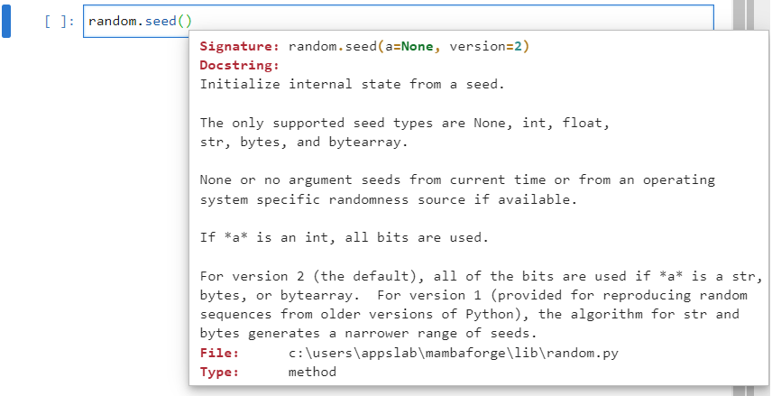

Under the hood the random seed sets up a sequence of integers which correspond to random states and more details about these can be found using ```getstate```:

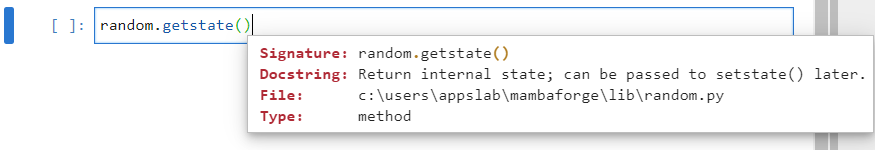

To return to a state, ```setstate``` can be used:

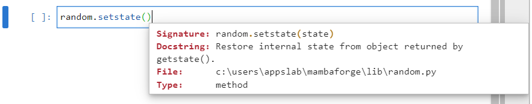

The simple list ```nums``` can be created. The random module imported, the seed set to 0 and three individual choices made using choice four times:

```
import random
nums = [1, 3, 5, 7, 9]
random.seed(0)
random.choice(nums)
random.choice(nums)
random.choice(nums)
```

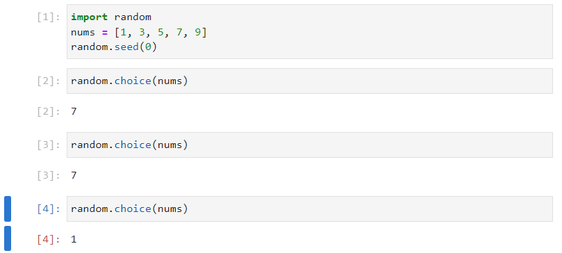

If the seed is reset to ```0``` and another three choices are made, these will be the same three choices as before:

```
random.seed(0)
random.choice(nums)
random.choice(nums)
random.choice(nums)
```

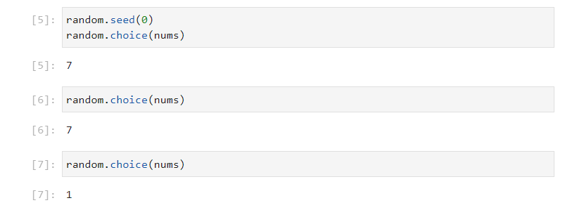

The current state can be retrieved and assigned to a variable. Notice if another three random choices are made after getting the state, that these are different to before:

```
state = random.getstate()
random.choice(nums)
random.choice(nums)
random.choice(nums)
```

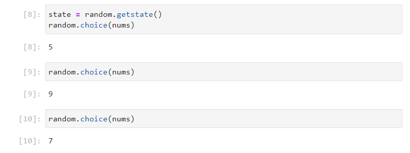

This state can be restored from the variable and if the three random choices are made, they will be the the same as before:

```
random.setstate(state)
random.choice(nums)
random.choice(nums)
random.choice(nums)
```

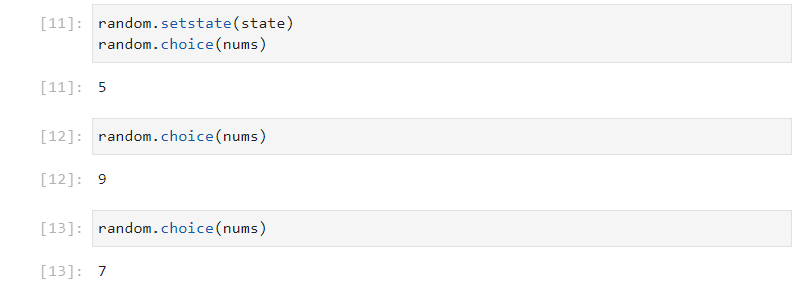

The ```state``` can be viewed in the variable explorer of the Spyder IDE. It is shown as a tuple. The 1st element at index 0 has an integer value of 3 and corresponds to the version of the random number algorithm. The 2nd element at index 1 is a list of large integer number values, these sequence of numbers are used internally by the associated functions in the random module to generate "random" states:

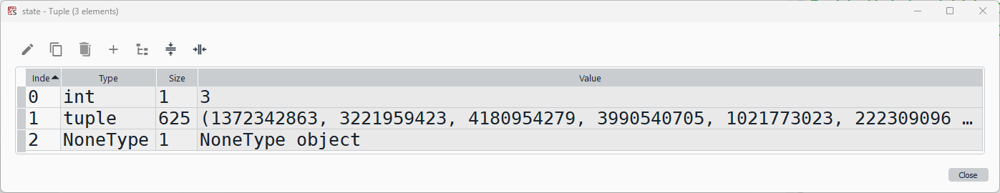

If the seed is changed, a different set of random states are obtained:

```
random.seed(1)
random.choice(nums)
random.choice(nums)
```

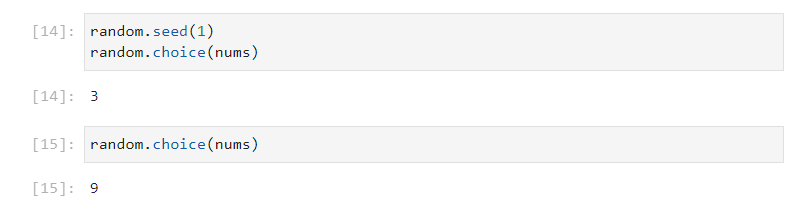

This can be seen by looking at only the first 5 numbers:

```
random.seed(0)
random.getstate()[1][:5]
random.seed(1)
random.getstate()[1][:5]
random.seed(2)
random.getstate()[1][:5]
```

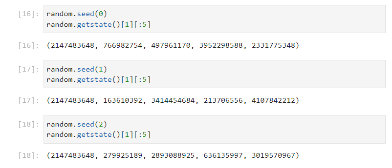

To recap the seed is the value used to initialise the generator and the state is the current state of the generator after each call to generate a random number. 

## choice

```choice``` can be used to make a pseudo random choice from a sequence, such as a list:

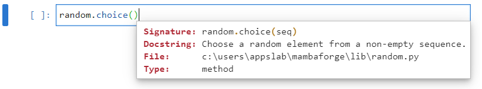

```
import random
nums = [1, 3, 5, 7, 9]
random.seed(0)
random.choice(nums)
random.choice(nums)
random.choice(nums)
random.choice(nums)
```

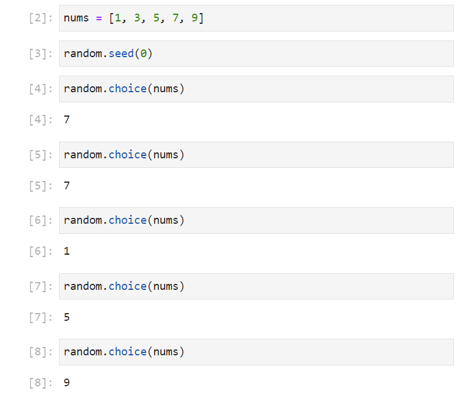

## choices

```choices``` can be used to make multiple choices from a population, the number of choices is determined by specifying the keyword argument ```k``` which has a default value of 1 and therefore behaves similar to  ```choice``` by default. 

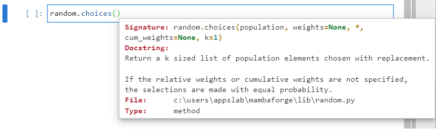

```
import random
nums = [1, 3, 5, 7, 9]
random.seed(0)
random.choices(nums)
random.choices(nums)
random.choices(nums)
random.choices(nums)
```

Notice the output is a list with a single element. This is because ```choices``` is usually used to select multiple choices from a population. 

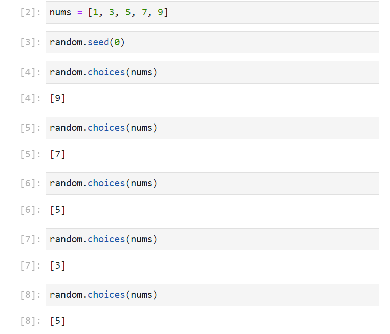

Let's assign ```k=3``` to make 3 choices:

```
import random
nums = [1, 3, 5, 7, 9]
random.seed(0)
random.choices(nums, k=3)
```

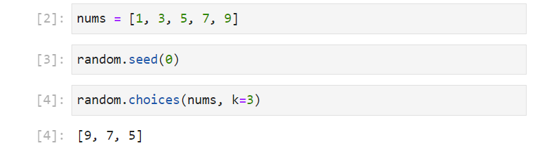

```choices``` makes choices from the population with replacement. With replacement means that once a choice is made, it is still present in the population. In the case where the population is an unweighted simple sequence such as a list, there is no mutation of the list to remove the value choosen after making a choice. Therefore it is possible to make 6 choices from a list with only 5 unique values.

```
nums = [1, 3, 5, 7, 9]
random.seed(0)
random.choices(nums, k=6)
```

Notice the same value ```5``` is chosen multiple times.

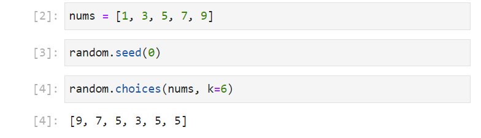

The population can be weighted, using the keyword argument ```weights``` and assigning it to a list of respective weights for each value in the population. For example the following:

```
import random
nums = [1, 3, 5, 7, 9]
weights = [100, 10, 5, 1, 1]
random.seed(0)
random.choices(nums, weights=weights, k=3)
```

The weight is used to calculate the weighted probability. The above essentially multiplies the probability of getting a ```1``` by ```100``` and getting a ```9``` by ```1```. 

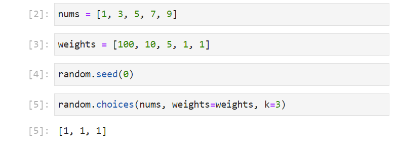

For this reason, most the values chosen are ```1``` due to the respective weight. This effect is seen more clearly when the number of choices is made larger. A ```Counter``` will be created to make viewing the results easier:

```
import random
from collections import Counter
nums = [1, 3, 5, 7, 9]
weights = [100, 10, 5, 1, 1]
random.seed(0)
chosen = random.choices(nums, weights=weights, k=100)
Counter(chosen)
```

Most of the choices are ```1``` with a smaller proportions of ```3``` and the very occasional ```5``` as expected from the above weights.

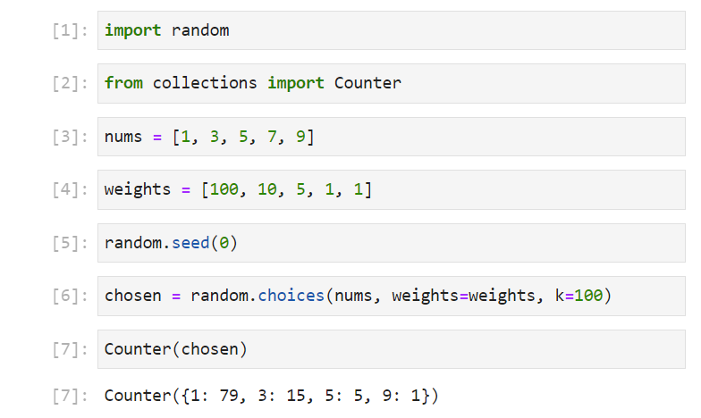

Cumulative weights can also be used. The cumulative weight is the cumulative weight of the previous elements plus the new weight. For example to make cumulative weights equivalent to the aboves:

```
import random
from collections import Counter
nums = [1, 3, 5, 7, 9]
cum_weights = [100, 110, 115, 116, 117]
random.seed(0)
chosen = random.choices(nums, cum_weights=cum_weights, k=100)
Counter(chosen)
```

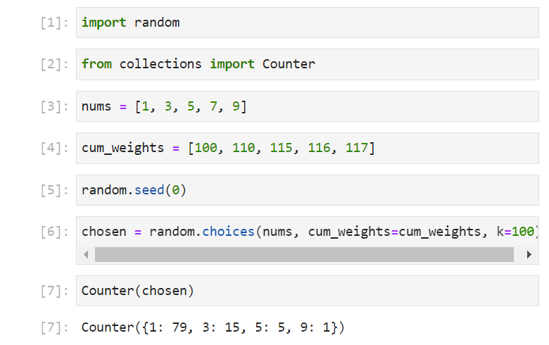

The weights and cumultative weights are not expressed in percentages. However they can be:

```
from random import random
from collections import Counter
nums = [1, 3, 5, 7, 9]
weights = [5, 10, 15, 20, 50]
random.seed(0)
chosen = random.choices(nums, weights=weights, k=100)
```

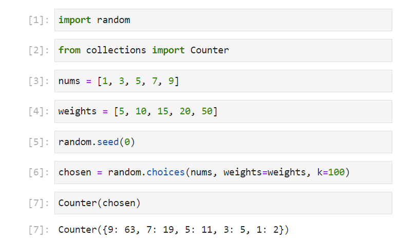

```
from random import random
from collections import Counter
nums = [1, 3, 5, 7, 9]
cum_weights = [5, 15, 30, 50, 100]
random.seed(0)
chosen = random.choices(nums, cum_weights=cum_weights, k=100)
```

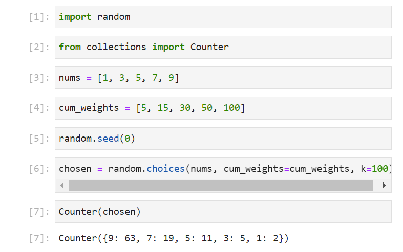

For a small value of ```k``` such as ```100```, the percentages obtained will differ from the percentages supplied. As ```k``` increases, say to ```10000``` the percentages will more closely resemble what was supplied.

```
from random import random
from collections import Counter
nums = [1, 3, 5, 7, 9]
weights = [5, 10, 15, 20, 50]
random.seed(0)
chosen = random.choices(nums, weights=weights, k=100)
random.seed(0)
chosen = random.choices(nums, weights=weights, k=10000)
```

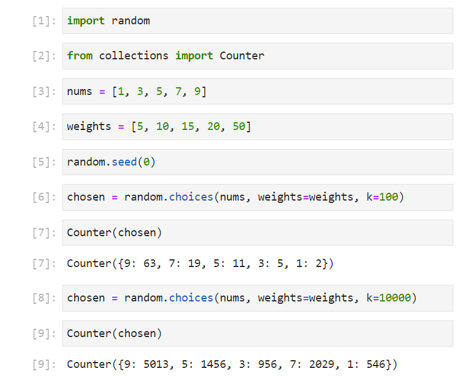

## sample

```sample``` can be used to take a ```sample``` of ```k``` values from a population. Unlike ```choices``` the values taken for the sample are taken without replacement.

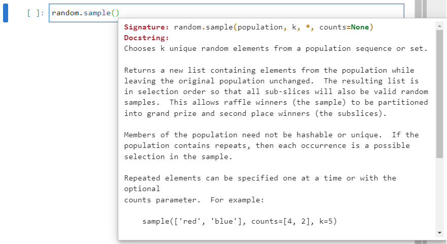

The function sample has the optional input argument ```counts``` which can be used to specify the count of each item in the population. This behaves similar to ```weight``` which was seen in ```choice``` but also acts as a physical ```count``` as items are taken in a ```sample``` without replacement.

For a population of 5 items where each item has a single count. A sample of 3 values can be taken. Or a sample of 5 items can be taken. In the latter case, a sample of all the items is taken and the list is essentially shuffled:

```
import random
nums = [1, 3, 5, 7, 9]
random.seed(0)
random.sample(nums, k=3)
random.sample(nums, k=5)
```

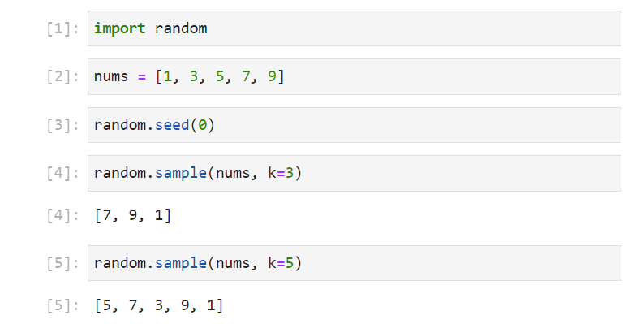

If 6 items are taken in a sample of only 5 items, there is a ```ValueError```:

```
random.sample(nums, k=6)
```

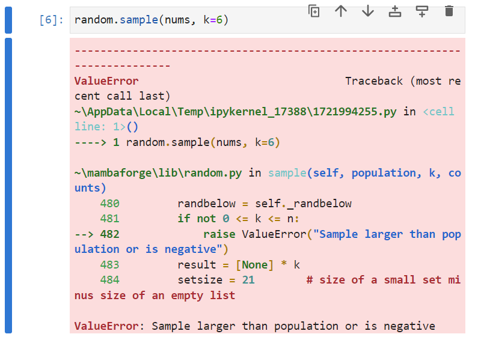

The ```counts``` can be assigned to values which amtched the original ```weights```, recall that these should be considered as aphysical counts. A sample of ```k=25``` can be taken and ```k=117``` (all values) can be taken. 

```
import random
from collections import Counter
nums = [1, 3, 5, 7, 9]
counts = [100, 10, 5, 1, 1]
random.seed(0)
sampled = random.sample(nums, counts=counts, k=25)
Counter(sampled)
sampled = random.sample(nums, counts=counts, k=117)
Counter(sampled)
```

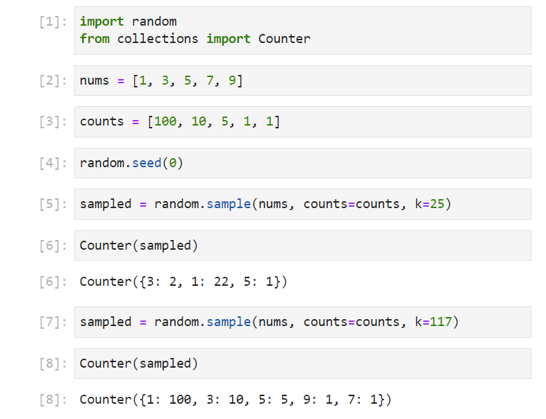

Notice that the sample of all the values matches precisely the counts supplied for each of the values. This is expected as each of these values was physically taken in order to get the sample.

## shuffle

The ```shuffle``` function takes in a list of values and mutates it its order in place. This is similar to taking a ```sample``` of all the items in the list for a list where every item has a count of 1 but ```sample``` outputs a new list while ```shuffle``` mutates the original in place: 

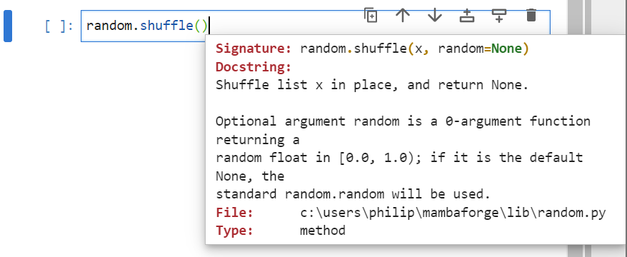

```
import random
random.seed(0)
nums = [1, 3, 5, 7, 9]
random.shuffle(nums)
nums
```

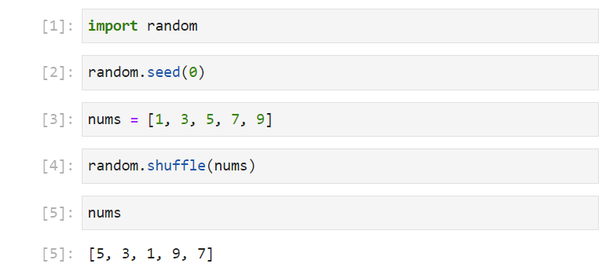

## randint

The ```randint``` is used to return a random integer between a lower bound and upper bound of integers, inclusive of both bounds. All of the integers in the range are uniformly distributed, meaning no weighting is carried out in the ditribution:

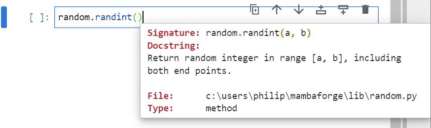

```
import random
random.seed(0)
random.randint(0, 10)
```

It is equivalent to taking a choice from a range object which has a step of 1:

```
random.choice(range(0, 11, 1))
```

The range object is exclusive of the upper bound, which is why the end is one higher.

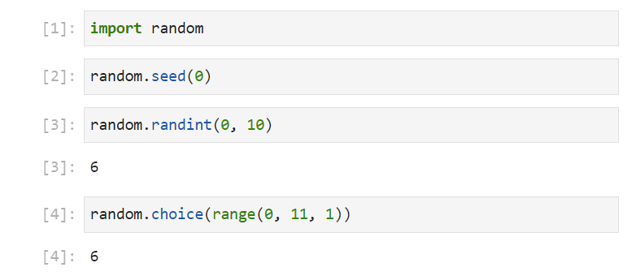

## getrandbits

The ```randbits``` will generate a random configuration of bits. Recall that each random configuration of bits can be visualised as a configuration of switches or LEDs and this configuration is mapped to an integer.  

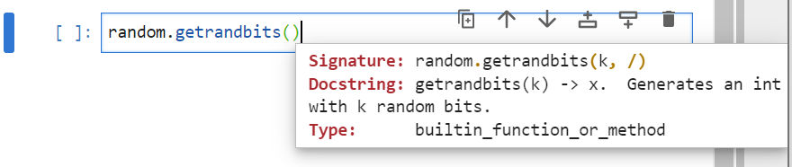

In the case of an arrangement of 8 bits (1 byte) this is essentially asking for a random integer between ```0-255``` and each grouping of 4 is mapped to a hexadecimal digit:

```
import random
random.seed(0)
num1 = random.getrandbits(8)
num1
hex(num1)
bin(num1)
```

This is equivalent to:

```
random.randint(0, 2**8-1)
random.choice(range(0, 2**8, 1))
```

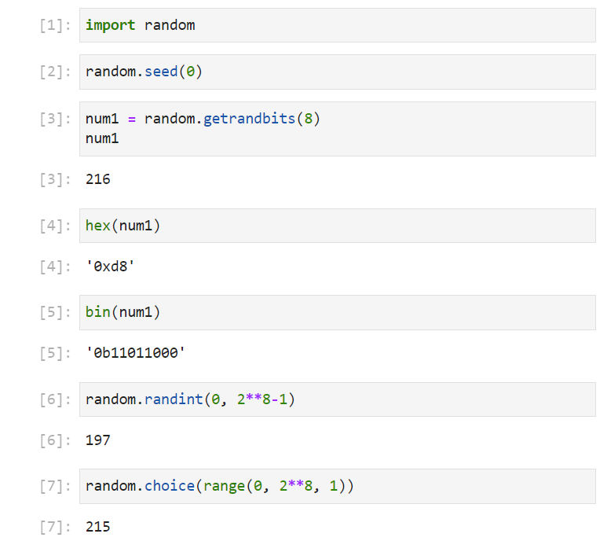

A random 16 bit (2 bytes) number can also be generated:

```
import random
random.seed(0)
num1 = random.getrandbits(16)
num1
hex(num1)
bin(num1)
```

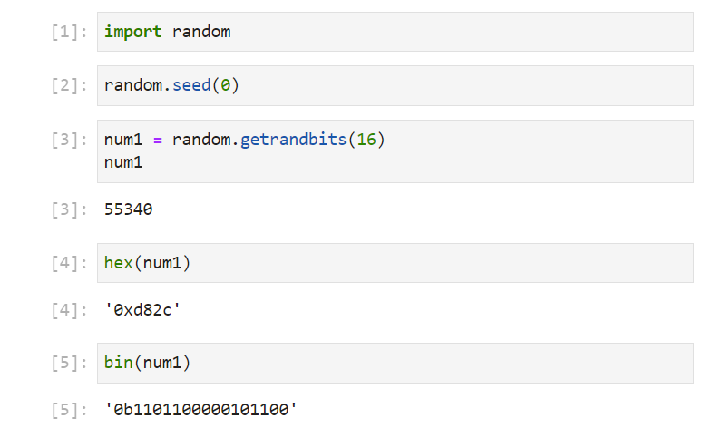

A random 32 bit (4 bytes) number can also be generated:

```
import random
random.seed(0)
num1 = random.getrandbits(32)
num1
hex(num1)
bin(num1)
```

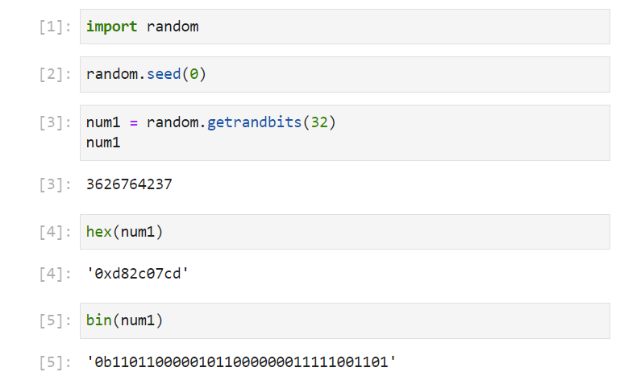

## randbytes

The function ```randbytes``` will generate a number of random bytes displaying each byte as a ```byte```. The relation to ```randbytes``` and ```randint``` function was explored with the ```getrandbits``` function:

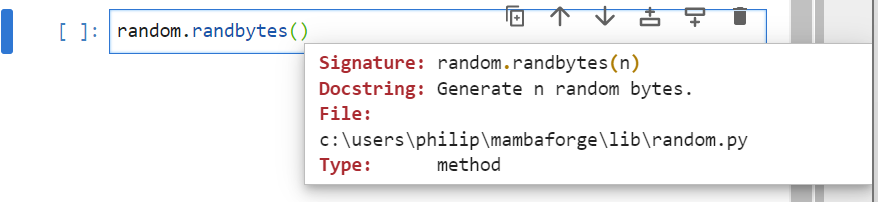

```
random.seed(0)
random.getrandbits(1)
random.getrandbits(2)
random.getrandbits(4)
```

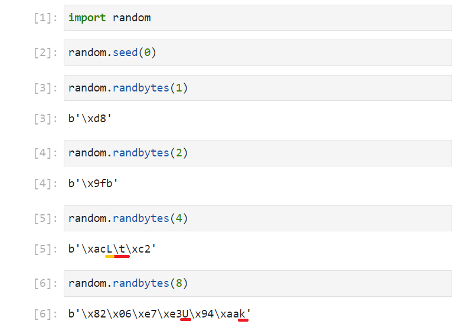

The ```byte``` consists of hexadecimal values in the form ```\x00```, if the hexadecimal value is in the range ```0x00``` to ```0x7f```, it is an ASCII character and the ASCII character is printable or non-printable but displayed in Python as an escape character such as the tab ```\t``` the escape character will display instead. The hex values of these can be seen by using the ```ord``` function on the character enclosed by the ```hex``` function:

```
hex(ord("L"))
hex(ord("\t"))
hex(ord("U"))
hex(ord("k"))
```

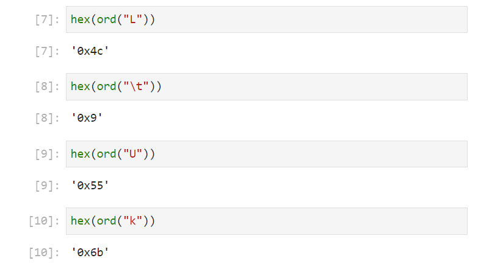

## The uniform Distribution

The ```uniform``` function is used to generate a random ```float``` in the range ```a``` to ```b```:

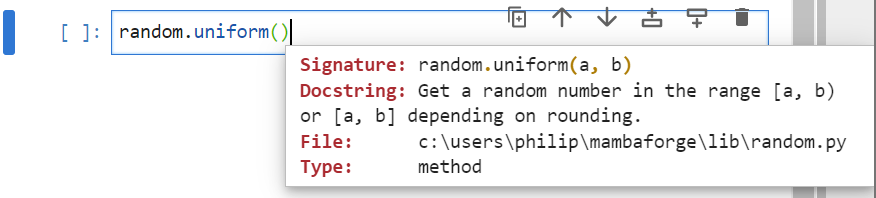

```
import random
random.seed(0)
random.uniform(0, 10)
```

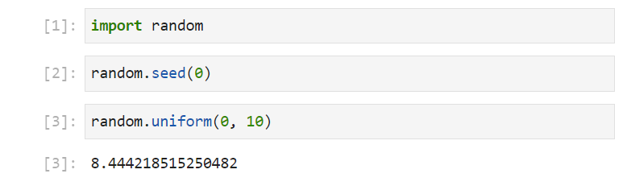

Except for the case where weights were added, all the data seen so far is uniformly distributed meaning each value has the same weight. It is useful to conceptualise what the uniform distribution looks like in the form of a histogram of ```100000``` values. A uniform distribution has an equal weighting for each value and looks like the following.

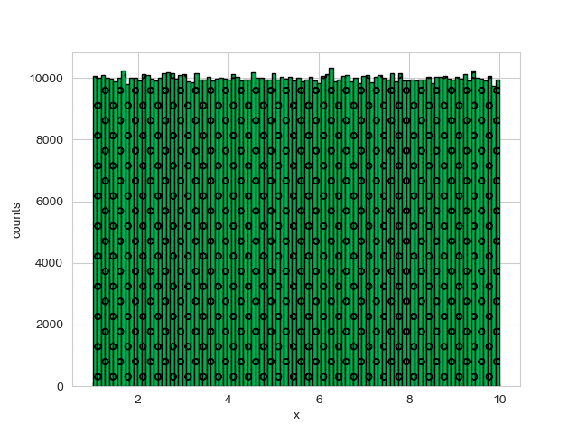

## The Triangular Distribution

A triangular distribution has similar input arguments to a uniform distribution but the underlying distribution is different in the shape of a triangle. The peak of the triangle is in the centre of the selected range and falls to zero at the edges:

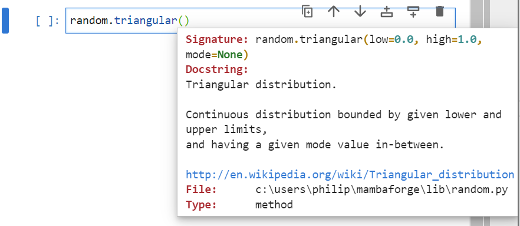

```
import random
random.seed(0)
random.triangular(low=0, high=10)
```

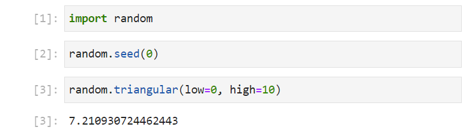

A triangular histogram of ```100000``` values depicts the triangular distribution:

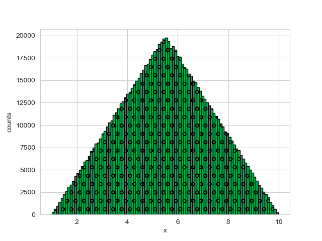

## The Normal Distribution

The Normal Distribution also known as a Gaussian Distribution is centred around a mean ```mu``` and distributed using a standard deviation ```sigma```. There are two functions ```gauss``` and ```normalvariate``` which take in the same input arguments.

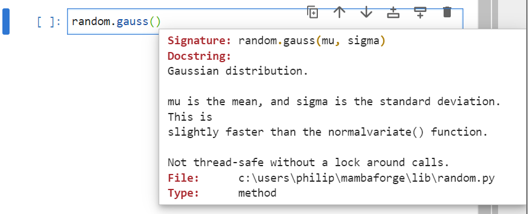

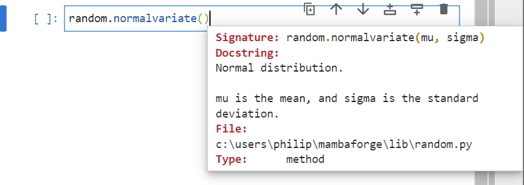

The ```gauss``` distribution will be used to select a random point from a Gaussian distribution with a mean ```mu``` of ```0``` and a standard deviation of ```1```, this is known as the Standard Normal Distribution:

```
import random
random.seed(0)
random.gauss(mu=0, sigma=1)
```

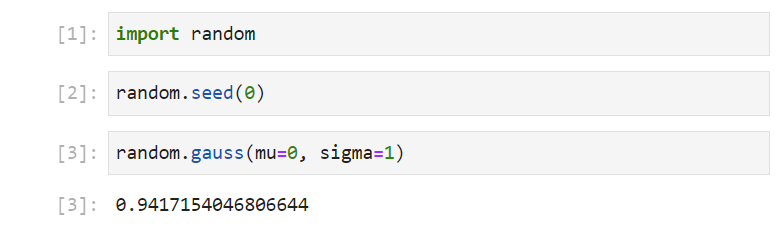

A Gaussian histogram of ```100000``` values with a mean ```mu=0``` and standard deviation ```sigma=1``` looks like:

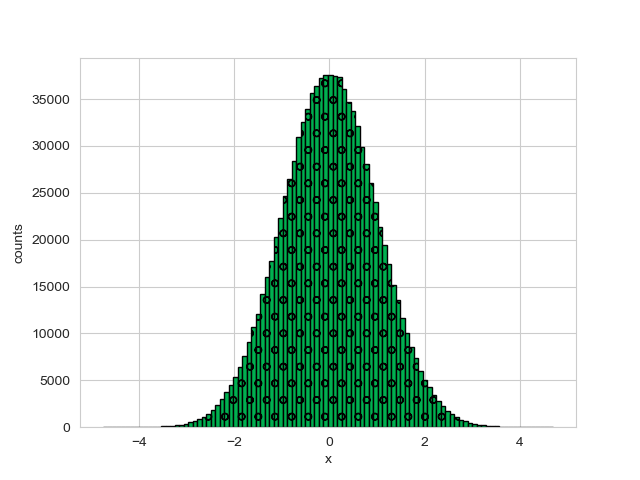

The effect of increasing the standard deviation ```sigma=2``` or ```sigma=3``` can be seen to reduce the height of the peak and widen the distribution:

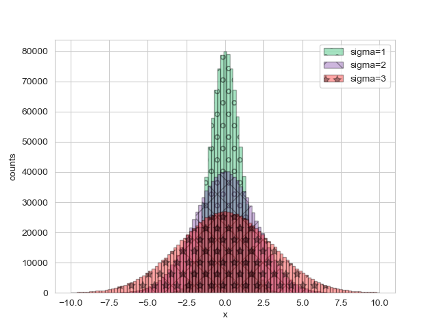

The data plotted here of 1000000 values will give an area of 1000000. The real Gaussian distribution is a probability curve normalised to 1. 

## The Log Normal Distribution

The Log Normal distribution also takes in an input argument ```mu``` for the mean and ```sigma``` for the standard deviation:

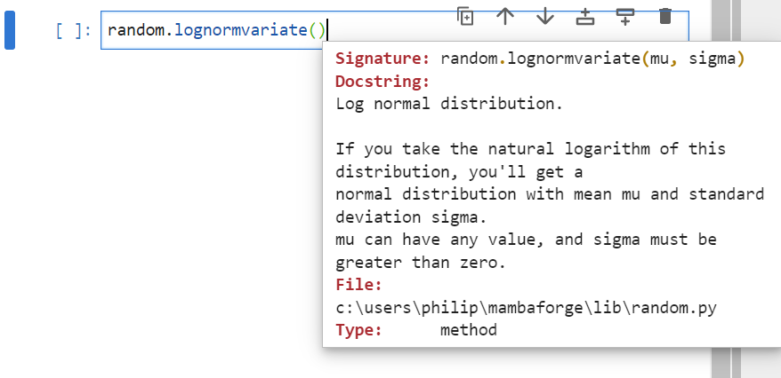

It can be tested with ```mu=0``` and            ```sigma=1```:

```
import random
random.seed(0)
random.lognormvariate(mu=0, sigma=1)
```

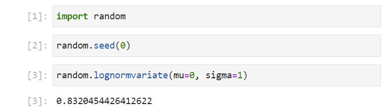

This is equivalent to:

```
import math
import random
random.seed(0)
math.exp(random.gauss(mu=0, sigma=1))
```

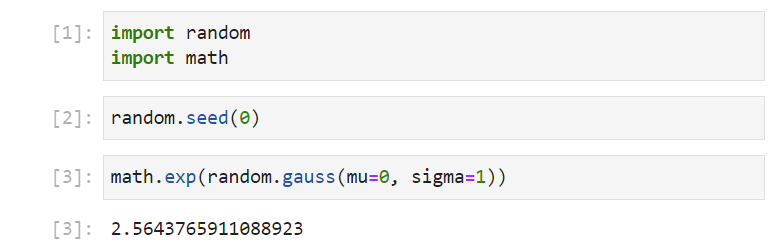

And therefore taking the log of it will return the Normal distribution:

```
import math
import random
random.seed(0)
math.log(math.exp(random.gauss(mu=0, sigma=1)))
```

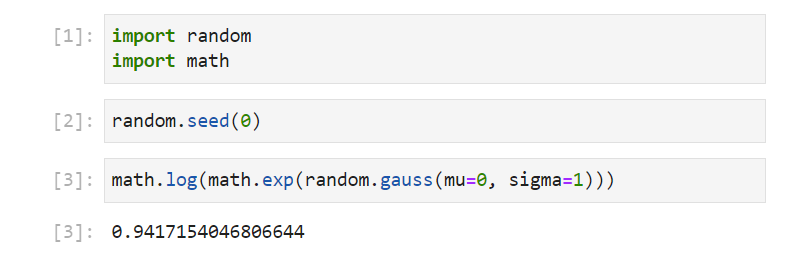

The plot of the distribution looks like:

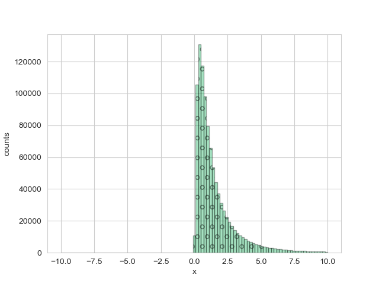

### The Negative Exponential Distribution

The Negative Exponential Distribution ```expovariate``` takes ```lambd``` as an input argument (```lambda``` is a reserved keyword in Python) which can be thought of as the inverse mean. The negative exponential begins falling from 0 as x is increased and is centred around the set mean.

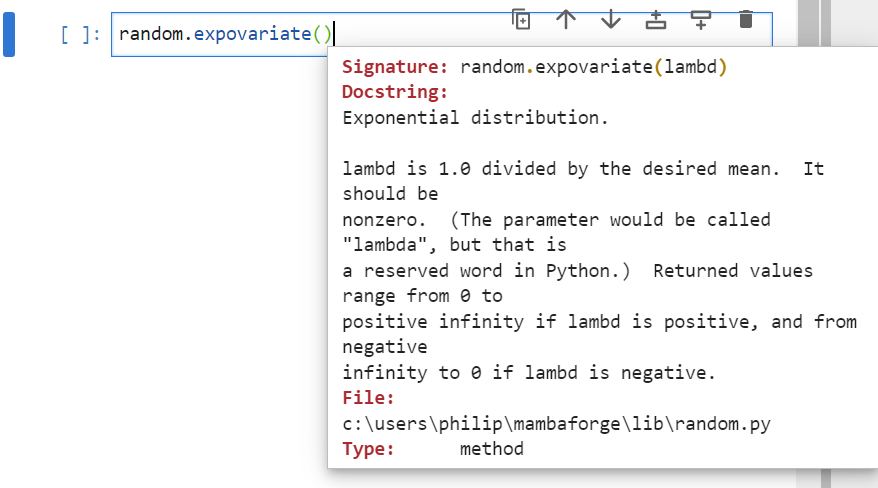

If for example ```lambd``` is taken as the inverse of ```5``` the mean of the exponential distribution will be centred around 5:

```
import random
random.seed(0)
random.expovariate(lamba=1/5)
```

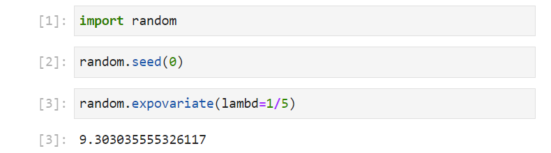

A plot of ```100000``` values looks as follows:

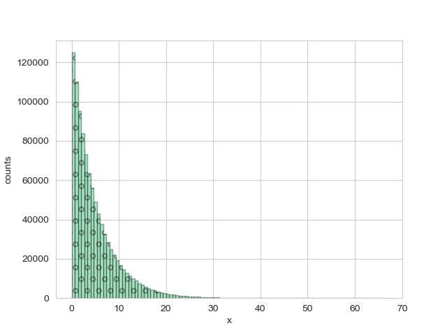

## The Gamma Distribution

The Gamma Distribution ```gammaexpovariate``` takes in two input arguments, ```alpha``` and ```beta```.

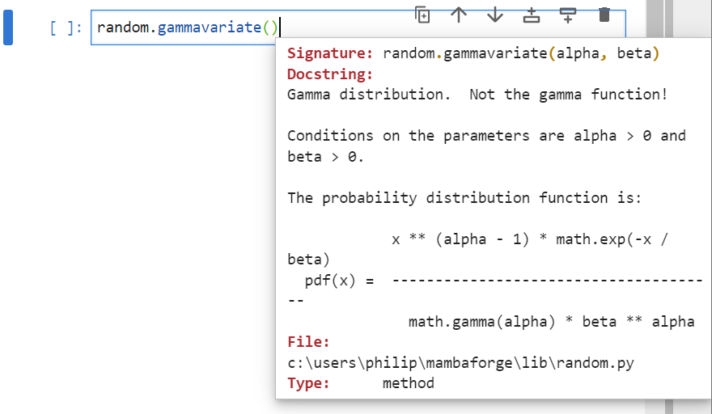

If ```alpha=1```, then this becomes the Negative Exponential distribution. This can be seen by setting ```beta=5```:

```
import random
random.seed(0)
random.gammavariate(alpha=1, beta=5)
```


A plot of ```100000``` values looks as follows which is the same as the Negative Exponential distribution:

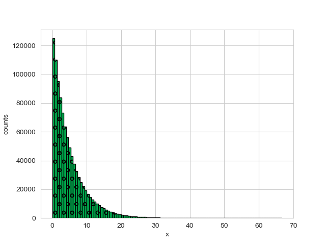

If ```alpha=2```, the distribution begins to change towards a bell shape:

```
import random
random.seed(0)
random.gammavariate(alpha=2, beta=5)
```

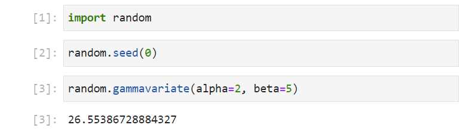

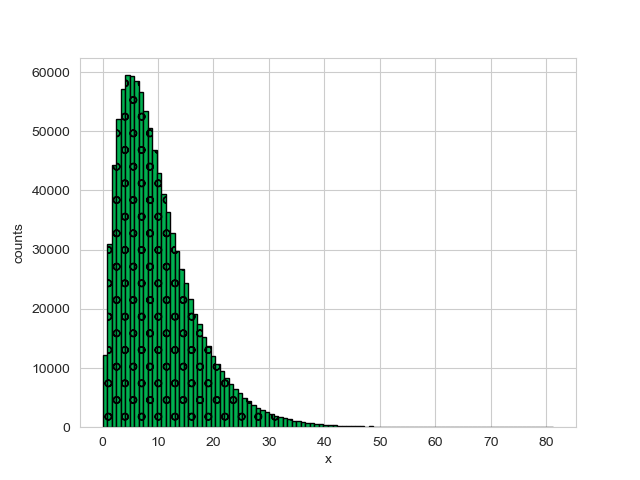

This trend continues with ```alpha=3```:

```
import random
random.seed(0)
random.gammavariate(alpha=3, beta=5)
```

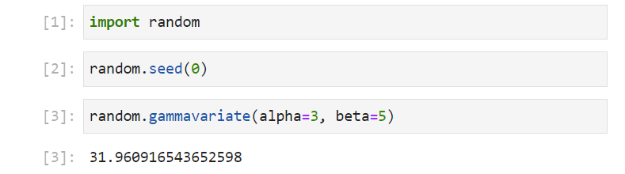

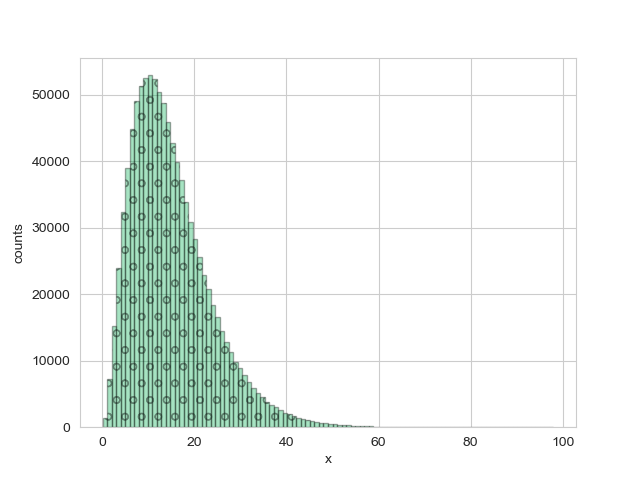

If a very large value ```alpha=100000```. The plot is dominated by the bell shape with a mean of ```500000``` which is the product of ```alpha``` and ```beta```:

```
import random
random.seed(0)
random.gammavariate(alpha=100000, beta=5)
```

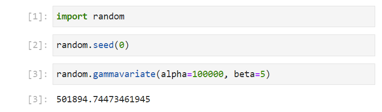

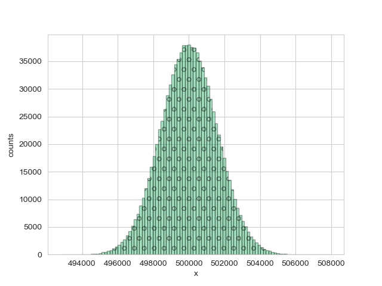

## The Beta Distribution

The Beta distribution also takes in the input arguments ```alpha``` and ```beta```. Combinations of these create distributions similar in form to those previously explored. For example ```alpha=1``` and ```beta=1``` gives a distribution similar to a random uniform distribution:

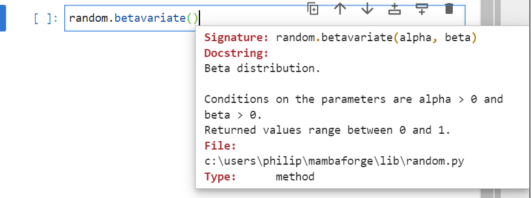

```
import random
random.seed(0)
random.betavariate(alpha=1, beta=1)
```

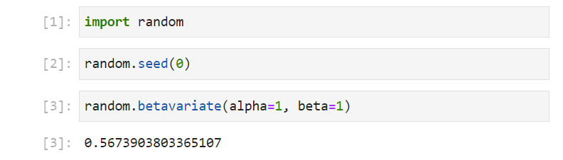

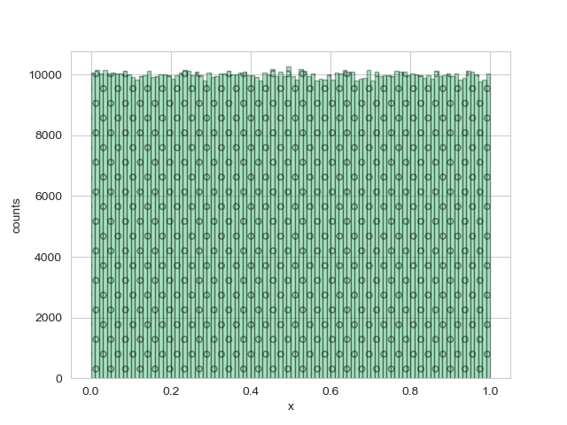

```alpha=1``` and ```beta=5``` gives a distribution similar to a negative exponential distribution:

```
import random
random.seed(0)
random.betavariate(alpha=5, beta=1)
```

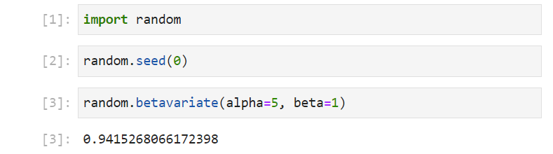

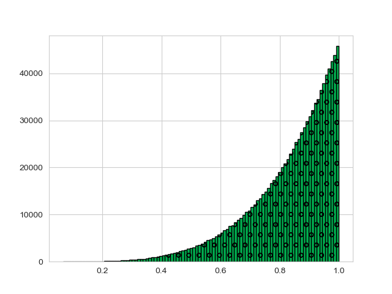

```alpha=1``` and ```beta=5``` gives a distribution similar to a positive exponential distribution:

```
import random
random.seed(0)
random.betavariate(alpha=1, beta=5)
```

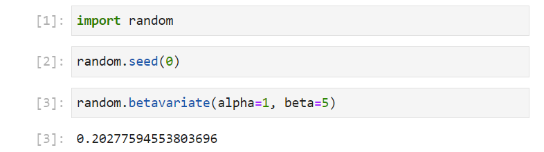


```alpha=5``` and ```beta=5``` gives a distribution similar to a Gaussian bell shape distribution:

```
import random
random.seed(0)
random.betavariate(alpha=5, beta=5)
```

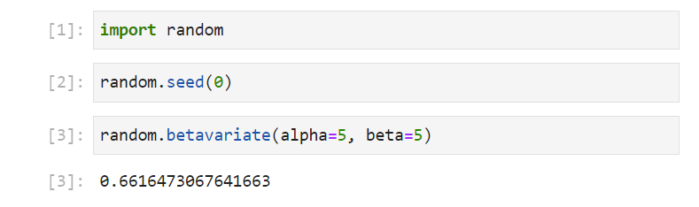

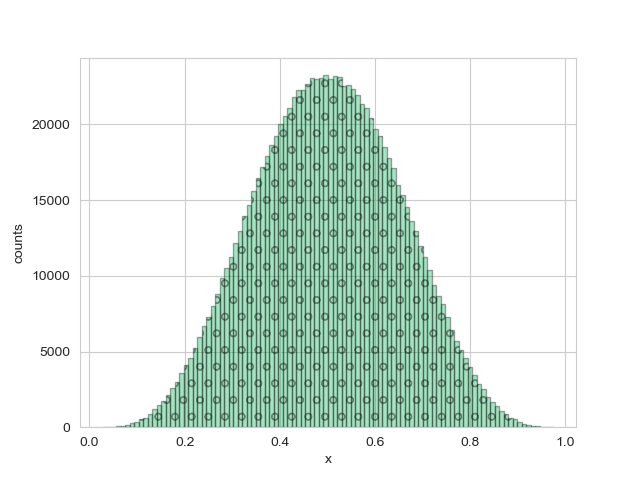

## other 

```
import numpy as np
import seaborn as sns
import matplotlib.pyplot as plt
sns.set_style("whitegrid")
import random
import math
random.seed(0)
nums = [random.betavariate(alpha=0, beta=-5) for num in range(1000000)]
hist1 = plt.hist(nums, bins=100)
plt.setp(hist1[2], facecolor="#00b050", 
         edgecolor="#000000", linewidth=1, hatch="o", alpha=0.35)
```

```
import numpy as np
import seaborn as sns
import matplotlib.pyplot as plt
sns.set_style("whitegrid")
import random
import math
random.seed(1)
nums = [random.paretovariate(alpha=1.161) for num in range(100)]
hist1 = plt.hist(nums, bins=100)
plt.setp(hist1[2], facecolor="#00b050", 
          edgecolor="#000000", linewidth=1, hatch="o", alpha=1)

```

counts - proportion of wealth 
percentile

```
import numpy as np
import seaborn as sns
import matplotlib.pyplot as plt
sns.set_style("whitegrid")
import random
import math
random.seed(1)
nums = [random.weibullvariate(alpha=3, beta=3) for num in range(100000)]
hist1 = plt.hist(nums, bins=100)
plt.setp(hist1[2], facecolor="#00b050", 
          edgecolor="#000000", linewidth=1, hatch="o", alpha=1)

#beta=0.5, 1, 2, 3
#alpha=1, 2, 3

```


```
import numpy as np
import seaborn as sns
import matplotlib.pyplot as plt
sns.set_style("whitegrid")
import random
import math
random.seed(1)
nums = [random.vonmisesvariate(mu=1, kappa=0) for num in range(100000)]
hist1 = plt.hist(nums, bins=100)
plt.setp(hist1[2], facecolor="#00b050", 
          edgecolor="#000000", linewidth=1, hatch="o", alpha=1)

```


```
import numpy as np
import seaborn as sns
import matplotlib.pyplot as plt
sns.set_style("whitegrid")
import random
import math

random.seed(1)
nums = [random.vonmisesvariate(mu=1, kappa=0) for num in range(100000)]
fig, ax = plt.subplots()
hist1 = ax.hist(nums, bins=100)
plt.setp(hist1[2], facecolor="#00b050", 
          edgecolor="#000000", linewidth=1, hatch="o", alpha=1)


circle_data = [(patch.get_width(), patch.get_height()) for patch in ax.patches]
circle_data2 = list(zip(*circle_data))

x = np.cumsum(circle_data2[0])
y = circle_data2[1]

fig2 = plt.figure()
ax2 = fig2.add_subplot(projection='polar')
c = ax2.scatter(x, y, c="#00b050")

ax2.set_xticklabels([r"0$\tau$/8", r"1$\tau$/8", r"2$\tau$/8", r"3$\tau$/8", r"4$\tau$/8", r"5$\tau$/8", r"6$\tau$/8", r"7$\tau$/8"])

```


```
import numpy as np
import seaborn as sns
import matplotlib.pyplot as plt
sns.set_style("whitegrid")
import random
import math
from math import tau
random.seed(1)
nums = [random.vonmisesvariate(mu=1, kappa=3) for num in range(100000)]
fig, ax = plt.subplots()
hist1 = ax.hist(nums, bins=100)
plt.setp(hist1[2], facecolor="#00b050", 
          edgecolor="#000000", linewidth=1, hatch="o", alpha=1)
ax.set_xticks([0, tau/8, 2*tau/8, 3*tau/8, 4*tau/8, 5*tau/8, 6*tau/8, 7*tau/8])
ax.set_xticklabels([r"0$\tau$/8", r"1$\tau$/8", r"2$\tau$/8", r"3$\tau$/8", r"4$\tau$/8", r"5$\tau$/8", r"6$\tau$/8", r"7$\tau$/8"])


circle_data = [(patch.get_width(), patch.get_height()) for patch in ax.patches]
circle_data2 = list(zip(*circle_data))

x = np.cumsum(circle_data2[0])
y = circle_data2[1]

fig2 = plt.figure()
ax2 = fig2.add_subplot(projection='polar')
c = ax2.scatter(x, y, c="#00b050")

ax2.set_xticklabels([r"0$\tau$/8", r"1$\tau$/8", r"2$\tau$/8", r"3$\tau$/8", r"4$\tau$/8", r"5$\tau$/8", r"6$\tau$/8", r"7$\tau$/8"])

```
