# Comma Separated Values Module

## Comma Separated Values File Overview

A comma separated value file has the ```.csv``` file extension and the name indicates that a comma is used as a delimiter. They are commonly used to store numeric data in programs such as Microsoft Excel or OnlyOffice Spreadsheet:

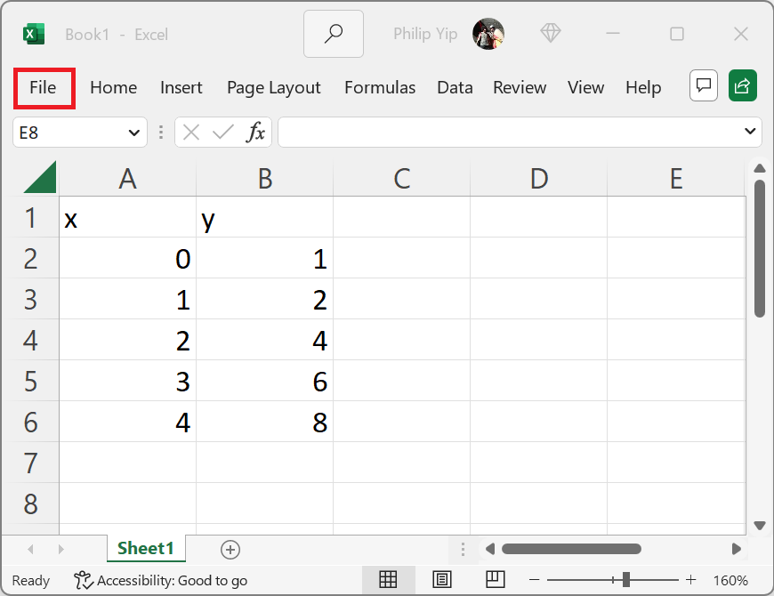

Note these programs often use their own file formats such as the Excel Spreadsheet ```.xlsx``` which has additional functionality when it comes to formatting text and working with multiple sheets. Select File → Save As:

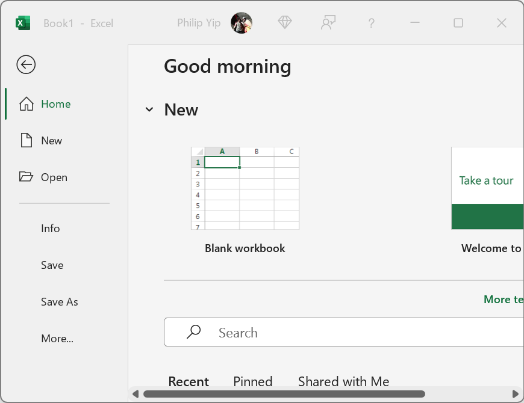

Save the file locally in the Documents folder:

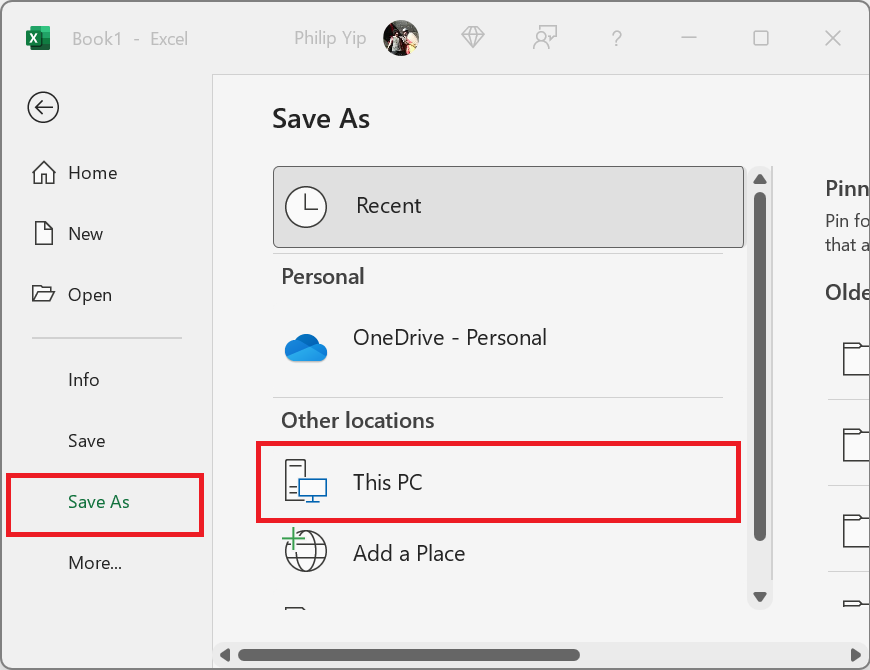

Make sure the file extension is ```*.csv``` which is ```UTF-8``` and comma delimited:

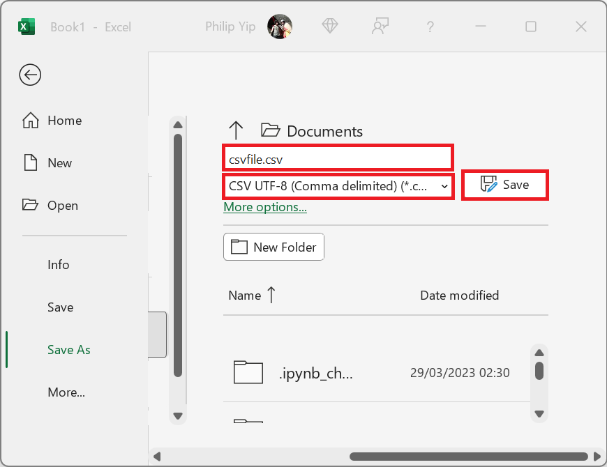

A warning may display in Microsoft Excel stating that there may be data loss using the more basic format. i.e. the formatting capabilities and text formatting will be lost:

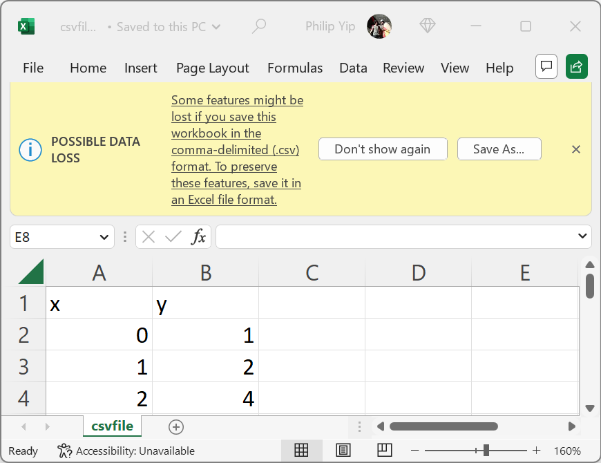

The file now displays in ```Documents```:

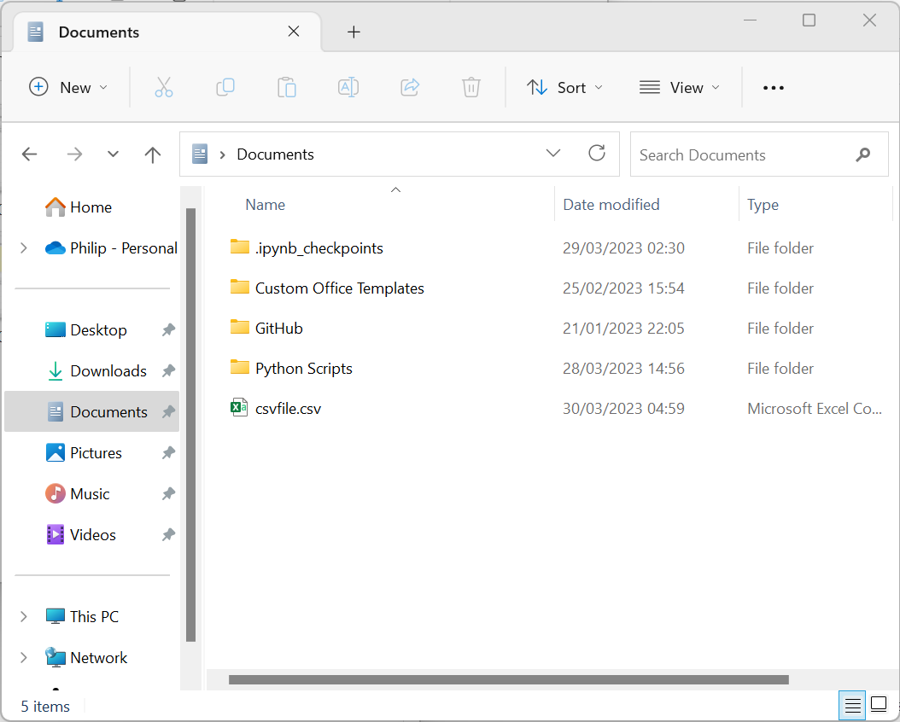

It can be examined in ```Notepad++```:

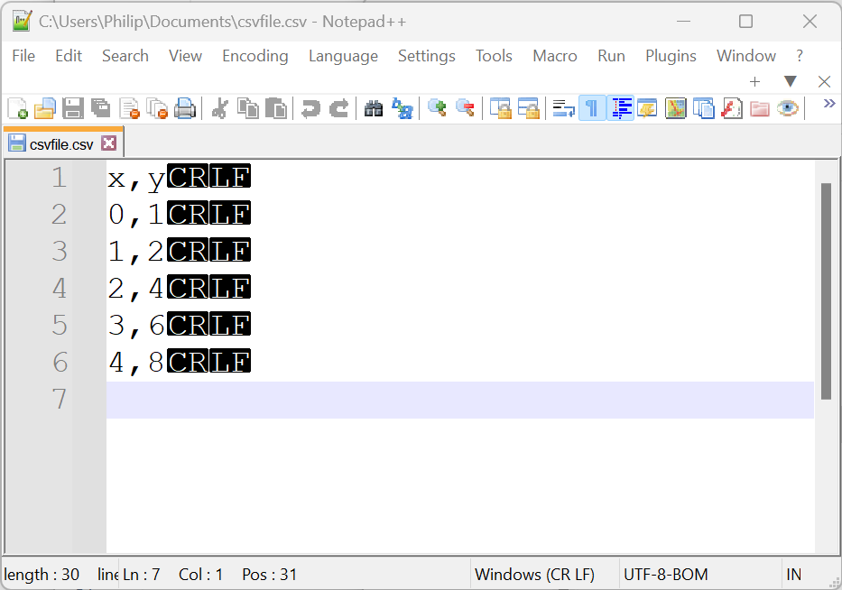

Notice that the Carriage Return and Line Feed are used to move onto the next row (as seen in a regular text file) and the ```,``` is used to indicate the seperator between columns.

If a ```,``` is added to the file:

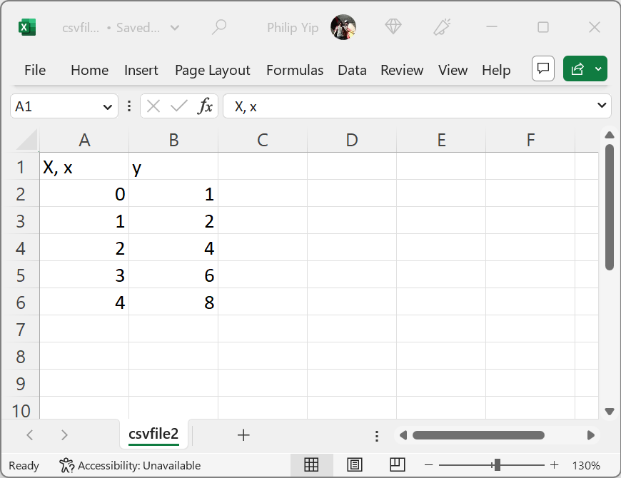

Then it needs to be distinguished from a delimiter. It is done so using a quote character, which is typically double quotations:

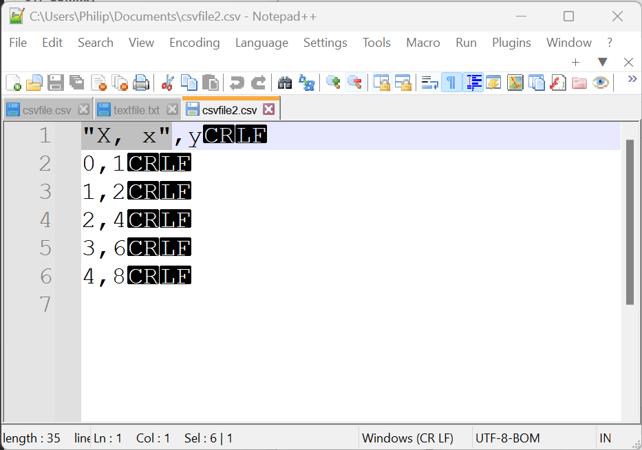

## Text File Tab Delimited Overview

Another associated format is the tab delimited text file. The same data can be saved in that format. Select file and save as and make sure the file extension is ```*.txt``` which is tab delimited:

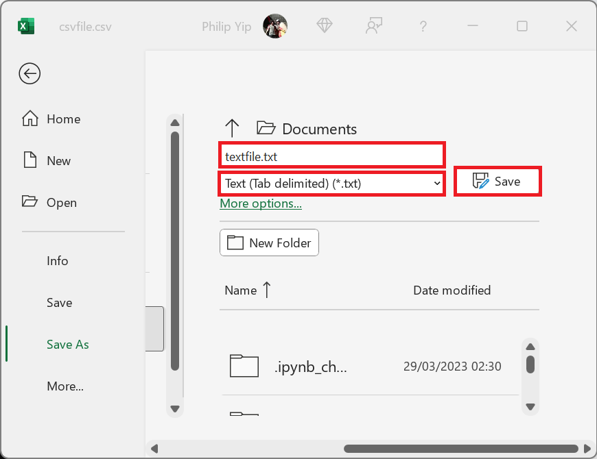

The file now displays in ```Documents```:

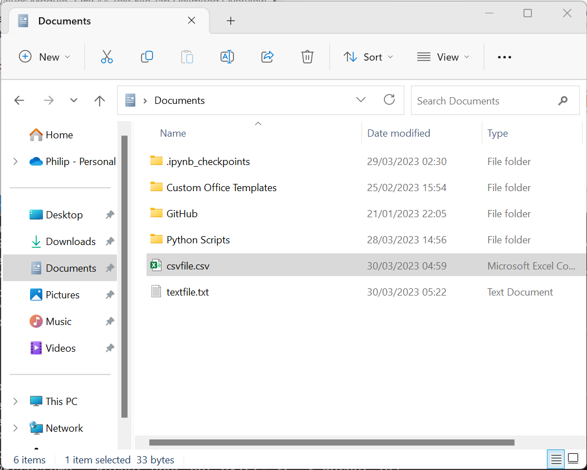

It can be examined in ```Notepad++```:

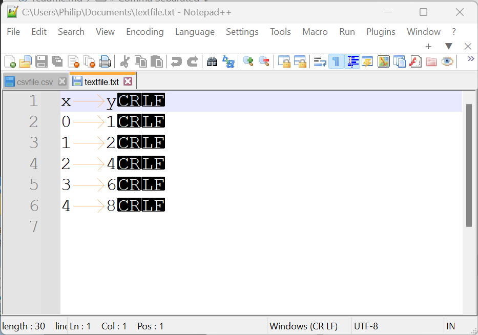

Notice that the Carriage Return and Line Feed are used to move onto the next row (as seen in a regular text file) and the ```↹``` is used to indicate the seperator between columns. This is a whitespace character and it is hard to distinguish between spaces unless formatting characters are shown. The tab is shown using a right arrow ```→```.

Tabs are not typically added to the files as using tabs in programs like Microsoft Excel moves the cursor to the next column.

## Reading in a .csv File or .txt File

Recall that the ```os``` module is used to navigate around the operating system. The current working directory can be checked using:

```
import os
os.getcwd()
```


This is already the ```Documents``` directory. This could also be changed to this location using:

```
os.chdir(os.path.expanduser(r'~\Documents'))
os.getcwd()
```


To 

```
import csv
with open('csvfile.csv') as csvfile:
    csv_reader = csv.reader(csvfile, delimiter=',', quotechar='"')
    for row in csv_reader:
        print(row)

```


Note the first column header has a ... this is a BOM, that is added by Microsoft Excel and isn't needed for ```UTF-8```


```
import csv
with open('csvfile.csv', encoding='UTF-8-Sig') as csvfile:
    csv_reader = csv.reader(csvfile, delimiter=',', quotechar='"')
    for row in csv_reader:
        print(row)

```


Note each row is displayed as a list and each column in the list is displayed as a string.


```
import csv
from collections import defaultdict
data = defaultdict()

with open('csvfile.csv', encoding='UTF-8-Sig') as csvfile:
    csv_reader = csv.reader(csvfile, delimiter=',', quotechar='"')
    for row in csv_reader:
        data[csv_reader.line_num] = row

data = dict(data)
data

```


```
import csv
from collections import defaultdict
data = defaultdict()

with open('txtfile.txt', encoding='UTF-8-Sig') as txtfile:
    txt_reader = csv.reader(txtfile, delimiter='\t')
    for row in csv_reader:
        data[csv_reader.line_num] = row

data = dict(data)
data
```


## Writing out a .csv File or .txt File

