# Comma Separated Values Module

## Comma Separated Values File Overview

A comma separated value file has the ```.csv``` file extension and the name indicates that a comma is used as a delimiter. They are commonly used to store numeric data in programs such as Microsoft Excel or OnlyOffice Spreadsheet:


Note these programs often use their own file formats such as the Excel Spreadsheet ```.xlsx``` which has additional functionality when it comes to formatting text and working with multiple sheets. Select File → Save As:


Save the file locally in the Documents folder:


Make sure the file extension is ```*.csv``` which is ```UTF-8``` and comma delimited:


A warning may display in Microsoft Excel stating that there may be data loss using the more basic format. i.e. the formatting capabilities and text formatting will be lost:


The file now displays in ```Documents```:


It can be examined in ```Notepad++```:


Notice that the Carriage Return and Line Feed are used to move onto the next row (as seen in a regular text file) and the ```,``` is used to indicate the seperator between columns.

If a ```,``` is added to the file:


Then it needs to be distinguished from a delimiter. It is done so using a quote character, which is typically double quotations:


## Text File Tab Delimited Overview

Another associated format is the tab delimited text file. The same data can be saved in that format. Select file and save as and make sure the file extension is ```*.txt``` which is tab delimited:


The file now displays in ```Documents```:


It can be examined in ```Notepad++```:


Notice that the Carriage Return and Line Feed are used to move onto the next row (as seen in a regular text file) and the ```↹``` is used to indicate the seperator between columns. This is a whitespace character and it is hard to distinguish between spaces unless formatting characters are shown. The tab is shown using a right arrow ```→```.

Tabs are not typically added to the files as using tabs in programs like Microsoft Excel moves the cursor to the next column.

## Reading in a .csv File or .txt File

Recall that the ```os``` module is used to navigate around the operating system. The current working directory can be checked using:

```
import os
os.getcwd()
```

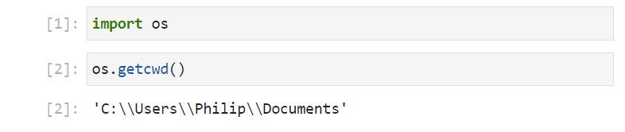

This is already the ```Documents``` directory. This could also be changed to this location using:

```
os.chdir(os.path.expanduser(r'~\Documents'))
os.getcwd()
```

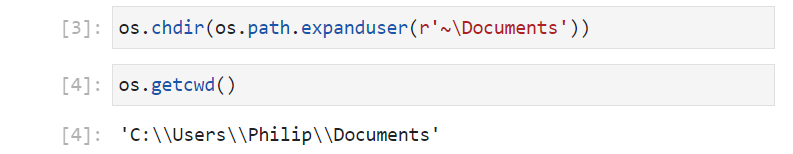

To open a csv file, the ```csv``` module needs to be imported. The file is opened using a ```with``` code block as seen with a standard text file. Instead of specifying ```'t'``` or ```'b'``` as part of the mode, a reader or writer instance needs to instantiated from the ```csv``` module which operates on the opened file. For example:

```
import csv
with open('csvfile.csv', mode='r') as csvfile:
    csv_reader = csv.reader(csvfile, delimiter=',', quotechar='"')
    for row in csv_reader:
        print(row)

```


Note the first column header has an unwanted prefix ```''```. This is a Byte Order Marker (BOM), that is added by Microsoft Excel. A BOM isn't required for ```UTF-8```, which is the default encoding so it displays as these additional characters ```''```. To handle the BOM correctly, the encoding should be changed to ```'UTF-8-Sig'```:

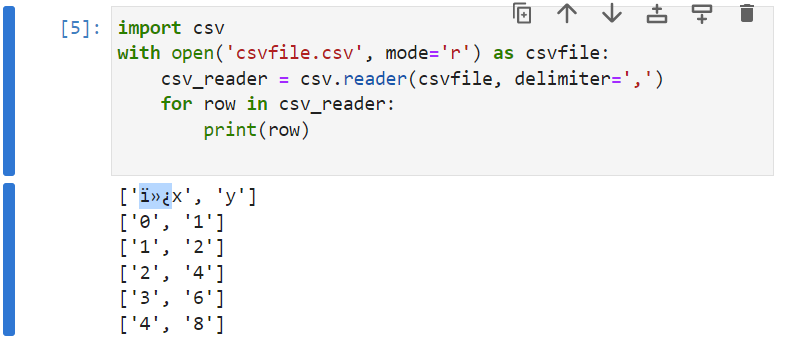

```
import csv
with open('csvfile.csv', mode='r', encoding='UTF-8-Sig') as csvfile:
    csv_reader = csv.reader(csvfile, delimiter=',', quotechar='"')
    for row in csv_reader:
        print(row)

```

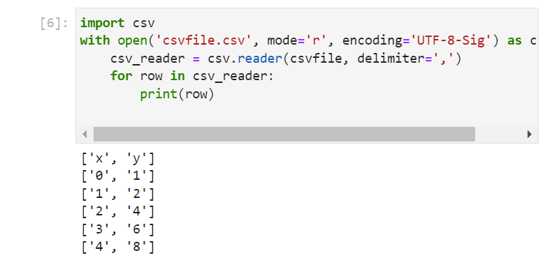

Note each row is displayed as a list and each column in the list is displayed as a string.

The data read from the file can be saved in a ```defaultdict``` which can be cast into a ```dict```:

```
import csv
from collections import defaultdict
data = defaultdict()

with open('csvfile.csv', mode='r', encoding='UTF-8-Sig') as csvfile:
    csv_reader = csv.reader(csvfile, delimiter=',', quotechar='"')
    for row in csv_reader:
        data[csv_reader.line_num] = row

data = dict(data)
data

```

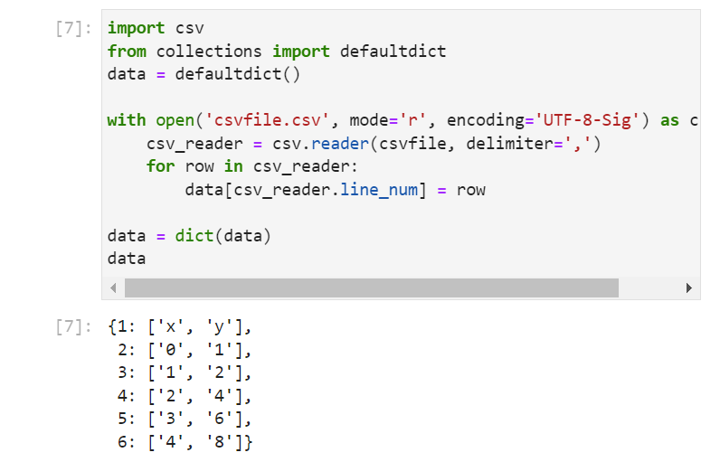

Note when this is done, that the numeric keys are 1st order indexed because the ```row``` is used from the csv reader is 1st order indexed. 

The tab delimited ```.txt``` file can be opened in a similar manner:

```
import csv
from collections import defaultdict
data = defaultdict()

with open('textfile.txt', mode='r', encoding='UTF-8-Sig') as txtfile:
    txt_reader = csv.reader(txtfile, delimiter='\t', )
    for row in txt_reader:
        data[txt_reader.line_num] = row

data = dict(data)
data
```

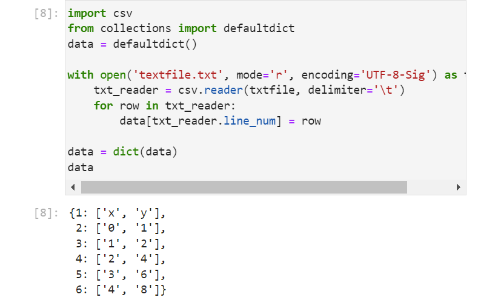

This format from the ```csv``` module is simple. Data can be indexed using the numeric dictionary key and then the numeric index of the list returning a Python string. For numeric data such as the above, this format isn't the most convenient and other data structures such as the pandas ```DataFrame``` are more commonly used. This will be discussed in a seperate tutorial.

## Writing out a .csv File or .txt File

To write to a csv file, the mode should be switched to ```'w'``` and a writer instance of the ```csv``` module needs to instantiated which operates on the opened file. The ```writerow``` method of the csv writer instance can be used to write a list of strings to each column in the row: 

```
with open('csvfile_output.csv', mode='w') as csvfile:
    csv_writer = csv.writer(csvfile, delimiter='', quotechar='"')
    csv_writer.writerow(['x', 'y'])
    csv_writer.writerow(['0', '2'])
    csv_writer.writerow(['1', '4'])
    csv_writer.writerow(['2', '6'])
    csv_writer.writerow(['3', '8'])

```

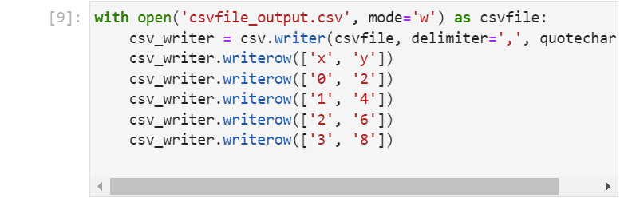

The file is now created:

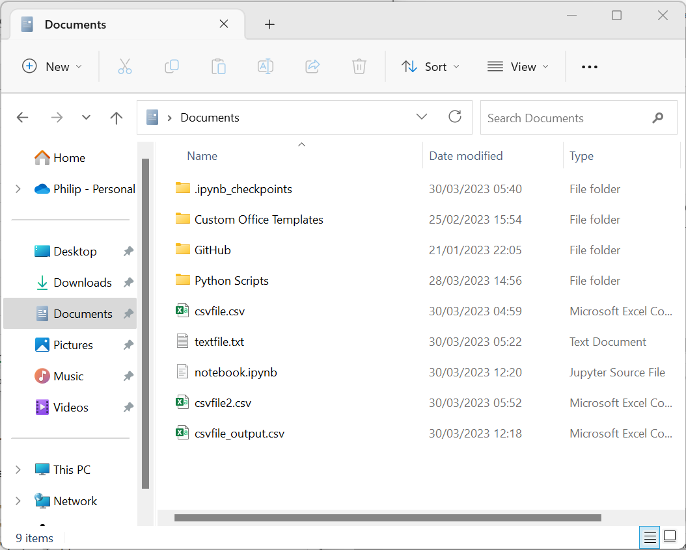

If opened in ```Notepad++```, for some reason there are two Carriage Return and a single Line Feed. This default behaviour likely is configured incorrectly:

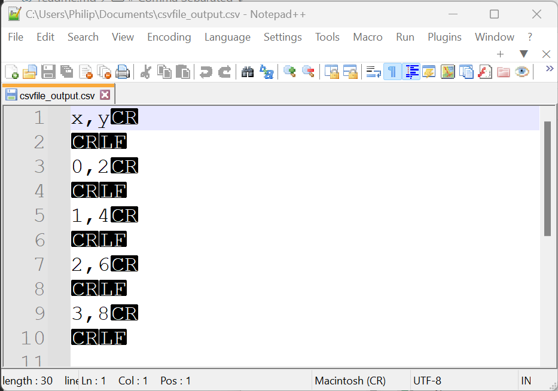

It can be addressed by assigning the keyword argument ```newline='\n'```: 

```
with open('csvfile_output.csv', mode='w', newline='\n') as csvfile:
    csv_writer = csv.writer(csvfile, delimiter=',', quotechar='"')
    csv_writer.writerow(['x', 'y'])
    csv_writer.writerow(['0', '2'])
    csv_writer.writerow(['1', '4'])
    csv_writer.writerow(['2', '6'])
    csv_writer.writerow(['3', '8'])

```

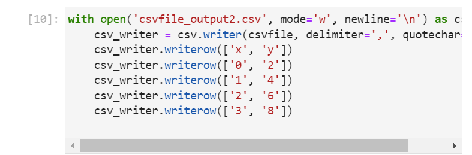

The file is now created:

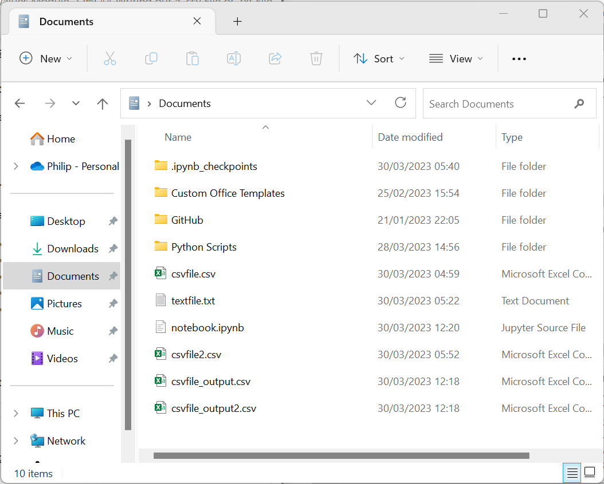

And displays as expected:

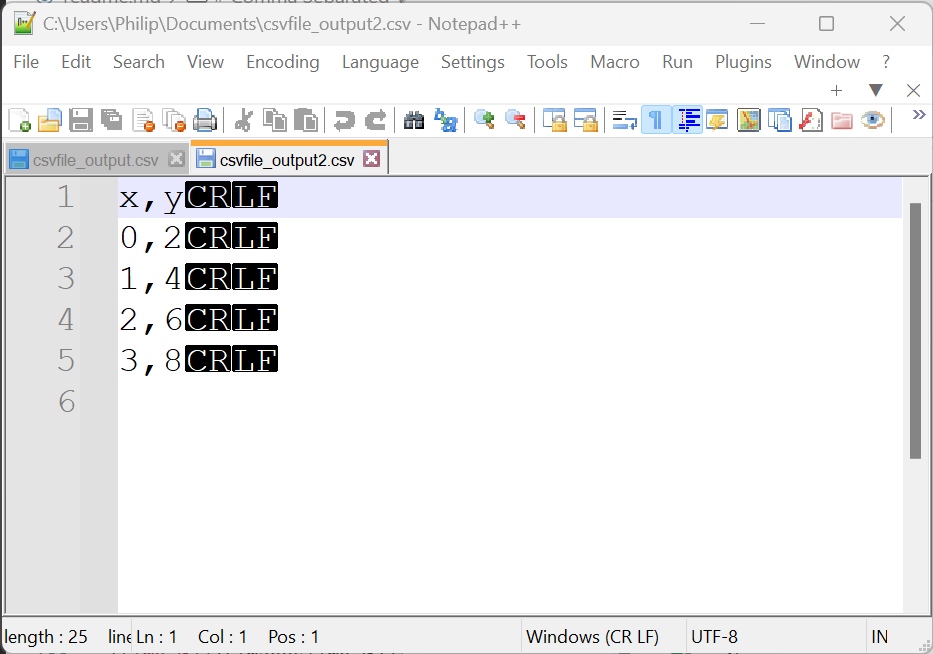

The ```writerows``` method of the csv writer instance can be used to write a list of nested lists. Each nested list corresponds to the row and contains a list of strings for each column in its row: 

```
with open('csvfile_output2.csv', mode='w', newline='\n') as csvfile:
    csv_writer = csv.writer(csvfile, delimiter=',', quotechar='"')
    csv_writer.writerows([['x', 'y'],
                          ['0', '2'],
                          ['1', '4'],
                          ['2', '6'],
                          ['3', '8']])
    

```    

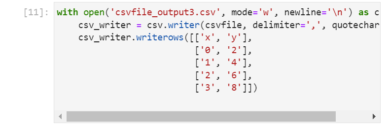

The file is now created:


And displays as expected:

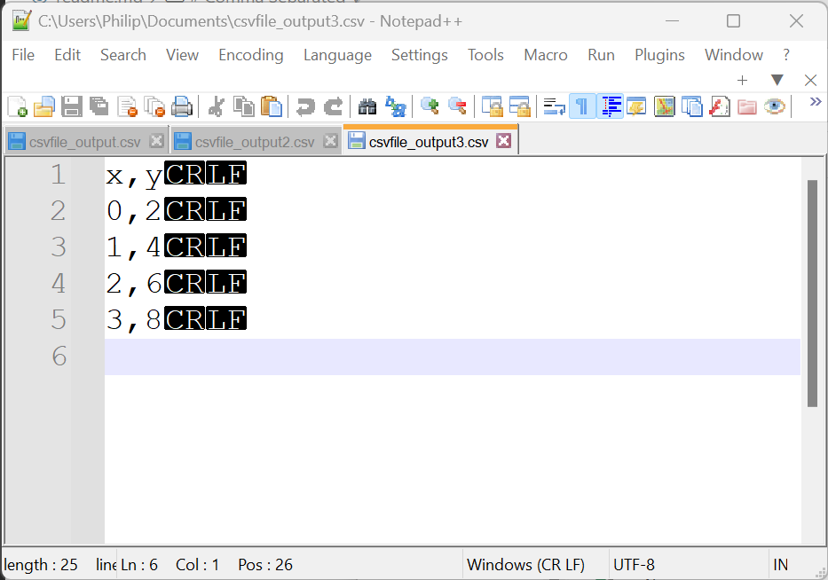

[Home Python Tutorials](https://github.com/PhilipYip1988/python-tutorials/blob/main/readme.md)
